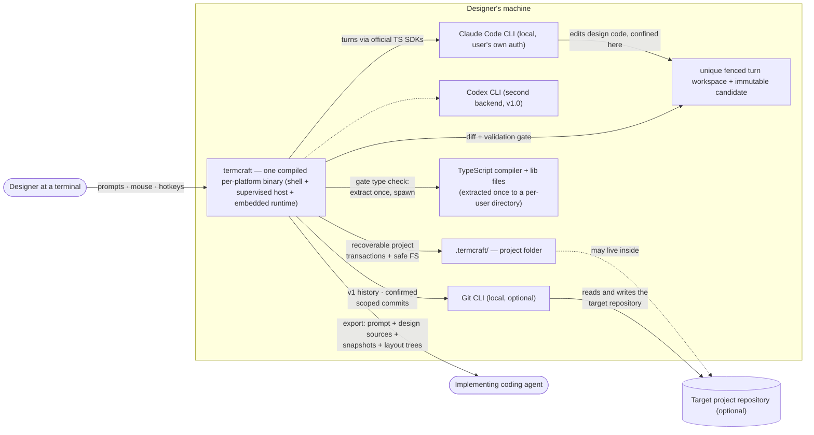

termcraft is a terminal application for designing other terminal applications. A designer describes an interface in plain language; a locally installed AI agent writes real design code against termcraft's design system; termcraft executes that code in an isolated preview and iterates through chat. This document shows the system's context: who uses it, which external programs it drives, and where its data lives.

## Walkthrough

1. The designer launches termcraft from within the target project's working directory. termcraft looks for a `.termcraft/` project folder there; that folder sits next to the code it describes. Git is optional: the project retains generation, preview, pins, chat, and export without a repository, while committing `.termcraft/` alongside application code lets design history travel with the codebase. The launch/create sequence and the folder's on-disk state are implemented; the shell that a designer would actually type `termcraft` into is not built yet.
2. Design requests are sent to a locally installed agent CLI driven through its vendor's official TypeScript SDK — termcraft holds no API keys of its own and simply uses whatever authentication the CLI already has configured. The Claude Code CLI is the MVP backend; the Codex CLI joins as a second backend behind the same abstraction in v1.0. This order was swapped from the original Codex-first plan (2026-07-17): Round 2 Spike H confirmed the Claude Agent SDK's confinement claim under real attack, while Codex's Windows sandbox-downgrade claim remained unverified, blocked on an account usage-quota exhaustion rather than a defect — see `docs/spikes/08-agent-confinement/FINDINGS.md`. The Claude backend is built: it starts and streams a fenced attempt, confines it, cancels it with confirmed process exit, and probes health without spending a turn. What is missing sits above it — nothing yet decides to run a turn, because there is no Kernel and no shell.
3. The agent writes `@termcraft/runtime` design code in a unique fenced turn workspace, confined there by its backend. After confirmed process exit, `SafeProjectFs` copies allowed regular files into an agent-inaccessible immutable candidate; the Gate then validates runtime-only imports plus fatal dynamic-code use (`eval`/`Function`), the page contract, and warning lints (determinism, dropped ids, unpointed raw elements, unlisted navigation) against that candidate, plus an injected type check, manifest check, and host smoke render. "Confirmed process exit" is literal rather than aspirational: the backend owns the attempt's whole process tree at the operating-system level and reports no outcome until the OS says that tree is empty, so the candidate is never copied out from under a writer that is still running. Rejection or interruption before commit intent changes no canonical source. The target binary ships the shell, the supervised host, and the embedded runtime, so the designer's project folder never grows a `package.json` — the host and the embedded runtime are built today, and the shell landed in phase 7; only the composition root that assembles them into the target binary remains (phase 8). It does not ship the type checker either way: at the pinned TypeScript major the compiler is a per-platform native executable that cannot be launched from inside the binary, so it and its lib files are extracted once to a per-user directory on first use and spawned as a subprocess — already true of the Gate's own type-check stage — and that per-platform extraction is also why the build itself is per-platform. Implementation status: the candidate snapshot and each Gate stage are built and unit-tested in isolation, but nothing composes them — no code turns a candidate into a Gate run, and the three injected checks have no live adapters wired.
4. Accepted changes publish through a recoverable `TurnTransaction`: after durable commit intent, startup or the live process idempotently rolls every planned page, manifest, local effect, chat, and pin event forward. Unexpected target drift is never overwritten. Design code executes only inside a `HostSupervisor`-owned subprocess; a restart-aware preview facade is exposed for a UI to consume so it never owns the process itself — that facade is built, but no `ui` module exists yet to call it. Composite workspace trust is required because the project contains executable code regardless of whether it arrived through Git, a copy, or a sync tool.
5. Failure branch: if the agent CLI is missing or not logged in, a background health check performed at startup — and repeated before each send — surfaces the problem in the status bar. Attempting to send a message while unhealthy then fails with a clear error and install instructions rather than silently hanging. The check itself is built: it runs a minimal, bounded query and reports installed-and-ready, not-logged-in, or not-installed, and never reports ready on an ambiguous answer, so a broken backend cannot let a paid turn start. It also runs under the same isolation a real turn gets — its own settings-free session, a scratch working directory rather than the user's project, the same tool veto, and its CLI adopted into an owned process tree — so probing can never execute something the project planted. What does not exist yet is the surfacing: no shell renders a status bar and no Kernel repeats the check before each send.
6. In v1 only, termcraft can ask the installed Git CLI for read-only page history and can create a commit after `/commit-page`, `/commit-infra`, or `/commit-all` opens confirmation for an exact `.termcraft/` scope. Restore replaces one canonical page source without moving `HEAD` or changing the index; termcraft never commits automatically. These commands and history are unavailable when Git or a containing repository is unavailable, and none of it is implemented yet beyond the courtesy `.termcraft/.gitignore` mirror the store module already generates.
7. The final deliverable is an export package — an implementation prompt, deterministic text snapshots at several terminal sizes, resolved layout trees, and the exact canonical design sources currently on disk, including uncommitted changes — handed off to a separate implementing coding agent that builds the real application. termcraft itself never emits implementation code for the target stack; its only output toward implementation is this package. Only a slice of this is built: the host's bounded export-worker pool renders deterministic frames for whatever tasks a caller gives it, but the correlated capture + layout-tree reply the format needs is still a documented stand-in that reuses the ordinary preview frame envelope, and no code yet assembles a prompt, layout trees, and sources into one handed-off package — that composition is Kernel-level and the Kernel does not exist yet.
8. Several non-goals bound this context: there is no manual drag/resize editing, daemon, or multi-client mode. Each project is single-user and single-instance, with an OS-held project lease, and separate tools or experiments live in separate folders or Git branches.

## Source anchors

- `src/store/model/factory.ts` — the launch sequence a designer's `.termcraft/` open triggers (durability pre-flight → lease → durability adapter + `SafeProjectFs` → journal format → transaction recovery → migrations → schemas → orphan-turn scan → open sub-stores) and the project-create sequence (durability pre-flight → create-new `.termcraft/` → lease → ...); the pre-flight refuses a volume that cannot demonstrate durable writes before either sequence mutates anything
- `src/store/lease/model/lease.ts` — the exclusive per-project OS-held lease backing "single-user and single-instance" (step 8)
- `src/store/trust/model/trust-store.ts`, `src/store/trust/model/subject.ts` — composite workspace trust: a grant keyed to canonical path + filesystem identity + project id + optional Git repository identity
- `src/store/sandbox/model/staging-store.ts` — the unique fenced per-turn workspace a backend confines an agent to (step 3); the store creates it, and nothing yet hands one to a live turn
- `src/agent/types.ts` — the vendor-blind backend contract behind step 2: start a fenced attempt, cancel it with confirmed process exit, health-check, report models and efforts
- `src/agent/index.ts`, `src/agent/claude/index.ts` — the module entry and the production Claude wiring (`createProductionClaudeBackend`), the only backend that exists; a Codex backend would be a sibling of `src/agent/claude/`
- `src/agent/confinement/model/policy.ts`, `src/agent/confinement/model/path-containment.ts` — the deny-by-default tool veto and the workspace-containment test behind "confined there by its backend" (step 3); defense-in-depth beneath the Gate, not a replacement for it
- `src/agent/run/model/engine.ts` — the shared run loop that makes "after confirmed process exit" literal: no outcome is reported until the owned process tree is observed empty; a backend supplies only a stream-reading driver, not the loop itself
- `src/agent/health/model/probe.ts` — the shared startup/pre-send health-check policy of step 5, including its refusal to report ready on an ambiguous probe; a backend supplies only its own message classifier (`src/agent/claude/backend/model/probe.ts`)
- `src/infrastructure/process/model/job-object.ts` — the owned OS process tree the two items above depend on: created with kill-on-close, counted from the OS, released on every terminal path
- `src/store/safe-fs/model/no-follow.ts`, `src/store/safe-fs/model/candidate.ts` — the no-follow safe-filesystem walk and the immutable hashed candidate snapshot a Gate caller would validate; nothing wires the two modules yet — `src/gate` imports nothing from `store`, and `snapshotToCandidate` has no non-test caller
- `src/gate/model/gate.ts` (orchestrator; stages in `import-scan.ts`, `page-contract.ts`, `lints.ts`, `type-check.ts`, `manifest.ts`) — the validation pipeline: import allowlist plus fatal dynamic-code checks, page contract, warning lints (determinism, dropped-id, unpointed-element, unlisted-navigation), and the injected type-check/manifest/smoke-render ports
- `src/gate/model/tsc-extract.ts` — the per-user TypeScript compiler + lib-file extraction and spawn
- `src/gate/ports/smoke-renderer.ts` — the smoke-render port the Gate calls; no adapter or composition root wires it to a live host session yet
- `src/runtime/index.ts` — the single public `@termcraft/runtime` facade authored design pages import from (page contract, state model, theme tokens, component catalog under `src/runtime/ui/`); the "embedded runtime" the diagram and step 3 describe as built
- `src/store/transaction/model/engine.ts`, `src/store/transaction/model/recovery.ts`, `src/store/transaction/model/wrappers.ts` — the recoverable `TurnTransaction` commit protocol (`admitTurn`/`finalizeTurn`/`terminalizeTurn`) and the idempotent startup roll-forward
- `src/host/supervisor/model/supervisor.ts`, `src/host/supervisor/model/session.ts` — `HostSupervisor`, owning each host child subprocess's whole spawn/negotiate/monitor/restart lifecycle
- `src/host/session/model/host-state-machine.ts` — the child-process side of the same protocol, running inside the spawned host
- `src/host/supervisor/types.ts` (`SupervisedPreviewSession`, composed inside `supervisor.ts`'s `sessionFor`) — the restart/backoff/circuit-aware preview facade the step-4 claim describes, now unified with the UI-facing `PreviewSession` shape (identity, mode, interactionMode, frames, resize, setMode, query, retry, close) per blocker B4; there is no separate `PreviewHandle` type anymore. `src/host/supervisor/model/preview-session.ts`'s single-incarnation (no restart) `PreviewSession` facade still exists alongside it. Neither has a `ui`-module consumer yet
- `src/host/supervisor/model/export-pool.ts`, `src/host/supervisor/model/one-shot.ts` — the bounded deterministic-render worker pool backing exported snapshots; the correlated capture/layout-tree reply and full package assembly are not built
- `docs/superpowers/specs/2026-07-13-termcraft-design.md` — §1 overview, §2 non-goals, §3.1 launch and trust, §4 architecture, §6.2 turn protocol: the orchestration above the backend (steps 2, 3, 5) has no code — no Kernel/`core` module exists to start a turn, retry it, or surface a health verdict. §6.1's backend abstraction is now anchored to `src/agent/` above
- `docs/spikes/08-agent-confinement/FINDINGS.md` — the Round 2 Spike H confinement finding behind the backend order in step 2
- `docs/superpowers/specs/2026-07-16-git-backed-page-history-design.md` — the v1-only Git CLI integration (history, `/commit-page`/`/commit-infra`/`/commit-all`, Restore); unimplemented beyond `src/store/toml/model/gitignore.ts`'s courtesy `.gitignore` mirror
- `docs/superpowers/specs/2026-07-16-production-hardening-decisions-design.md` — the not-yet-built Kernel-level orchestration (retry-on-fatal-Gate-error loop, end-to-end turn coordination, export-package assembly) that would sit above the landed store/host/gate modules
- `design/Termcraft UI.dc.html` — visual source of truth for the not-yet-built shell's screens and status-bar language
