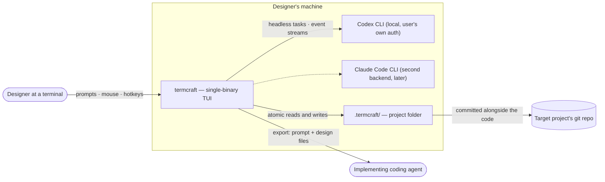

termcraft is a terminal application for designing other terminal applications. A designer describes an interface in plain language; a locally installed AI agent CLI generates a declarative design document; termcraft renders it live and iterates through chat. This document shows the system's context: who uses it, which external programs it drives, and where its data lives.

## Walkthrough

1. The designer launches termcraft from within the target project's working directory. termcraft looks for a `.termcraft/` project folder there; that folder sits next to the code it describes and is committed to the same git repository, so the design history travels with the codebase instead of living apart from it.
2. Design requests are sent to a locally installed agent CLI running in headless mode — termcraft holds no API keys of its own and simply uses whatever authentication the CLI already has configured. The Codex CLI is the first supported backend; the Claude Code CLI is planned as a second backend behind the same abstraction, adopted later if its terms permit headless embedding.
3. The agent CLI returns a declarative design document, which termcraft renders live in the terminal preview. The designer iterates on it through chat messages, mouse selection of preview elements, and pin comments anchored to specific elements, never by editing the rendered output directly.
4. Failure branch: if the agent CLI is missing or not logged in, a background health check performed at startup — and repeated before each send — surfaces the problem in the status bar. Attempting to send a message while unhealthy then fails with a clear error and install instructions rather than silently hanging.
5. The final deliverable is an export package — an implementation prompt plus the exact design files — handed off to a separate implementing coding agent that builds the real application. termcraft itself never emits application source code; its only output toward implementation is this prompt-plus-design-file pair.
6. Several non-goals bound this context: there is no manual drag/resize (WYSIWYG) editing of designs, since all content changes flow through the agent; termcraft in v1.0 runs as a single-user, single-instance tool with no daemon or multi-client mode; and each project folder holds exactly one project, so separate tools or design experiments live in separate folders or git branches rather than one shared workspace.

## Source anchors

- `docs/superpowers/specs/2026-07-13-termcraft-design.md` — §1 overview, §2 non-goals, §3.1 launch, §4 architecture, §6.1 backend abstraction
- `design/Termcraft UI.dc.html` — visual source of truth for screens and status-bar language
