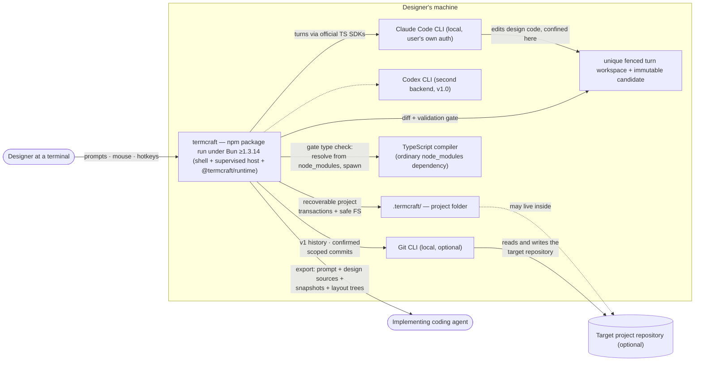

termcraft is a terminal application for designing other terminal applications. A designer describes an interface in plain language; a locally installed AI agent writes real design code against termcraft's design system; termcraft executes that code in an isolated preview and iterates through chat. This document shows the system's context: who uses it, which external programs it drives, and where its data lives.

## Walkthrough

1. The designer launches termcraft from within the target project's working directory. termcraft looks for a `.termcraft/` project folder there; that folder sits next to the code it describes. Git is optional: the project retains generation, preview, pins, chat, and export without a repository, while committing `.termcraft/` alongside application code lets design history travel with the codebase. The launch/create sequence, the folder's on-disk state, and the shell a designer types `termcraft` into are all built: `bun start <dir>` — the interactive executable root — opens or creates the project, assembles the real Kernel over the production adapter ring, and mounts the shell (the composition root in `entrypoint`).
2. Design requests are sent to a locally installed agent CLI driven through its vendor's official TypeScript SDK — termcraft holds no API keys of its own and simply uses whatever authentication the CLI already has configured. The Claude Code CLI is the MVP backend; the Codex CLI joins as a second backend behind the same abstraction in v1.0. This order was swapped from the original Codex-first plan (2026-07-17): Round 2 Spike H confirmed the Claude Agent SDK's confinement claim under real attack, while Codex's Windows sandbox-downgrade claim remained unverified, blocked on an account usage-quota exhaustion rather than a defect — see `docs/spikes/08-agent-confinement/FINDINGS.md`. The Claude backend is built: it starts and streams a fenced attempt, confines it, cancels it with confirmed process exit, and probes health without spending a turn. The Kernel now decides to run a turn (admission, attempt, Gate-retry, finalize — `core/turns`'s `runTurn`), and the composition root wires the real Claude backend behind that Kernel: the interactive root (`bun start`) drives the whole assembled graph, so a real turn now reaches the installed CLI. Only the `demo` executable root still runs `ui`'s in-memory Kernel double.
3. The agent writes `@termcraft/runtime` design code in a unique fenced turn workspace, confined there by its backend. After confirmed process exit, `SafeProjectFs` copies allowed regular files into an agent-inaccessible immutable candidate; the Gate then validates runtime-only imports plus fatal dynamic-code use (`eval`/`Function` — detection only; the preview child additionally DENIES that capability at runtime, `modules.md`), the page contract, and warning lints (determinism, dropped ids, unpointed raw elements, unlisted navigation, and an `any` annotation written to silence a type error) against that candidate, plus an injected type check, manifest check, and host smoke render. "Confirmed process exit" is literal rather than aspirational: the backend owns the attempt's whole process tree at the operating-system level and reports no outcome until the OS says that tree is empty, so the candidate is never copied out from under a writer that is still running. Rejection or interruption before commit intent changes no canonical source. termcraft is an npm package run under Bun ≥1.3.14 (master §4.1): the designer's project folder still never grows a `package.json`, because pages resolve `@termcraft/runtime` through the running process's `Bun.plugin` resolver, which works identically for a globally installed package — the shell, the host, and the runtime facade are all built, and npm packaging (a `bin` entry, a `files` allowlist, a real version) is now in `package.json`; dev `bun start` is unaffected either way. `typescript@7`'s per-platform native compiler executable is an ordinary `node_modules` dependency rather than a build-time embedded file — the Gate resolves it against the installed `typescript` package and spawns it as a subprocess, already true of the Gate's own type-check stage — and there is no per-platform build. Implementation status: the candidate snapshot and each Gate stage are built, and the Kernel now turns a real candidate into a real Gate run — `turn.start` composes `core/turns`'s `runTurn` over the production `GateRunner` adapter, whose smoke-render, manifest-slice, and type-check stages all run against real host, store, and compiler adapters. The type-check stage is wired live (phase-8 Task 7): `src/runtime/generated/runtime-dts.ts`'s real `RUNTIME_DTS` and a `resolveCompilerPath()`-resolved compiler are both supplied by the composition root's `createGateRunnerAdapter` call (`src/entrypoint/model/create-shell.ts`) on every construction, so the adapter's type-check stage is never omitted in the shipped configuration — a failed compiler resolution instead aborts shell construction outright, rather than shipping a Gate that silently skips the check. Since design-tree phase 2 the check is ONE program over the whole tree, run inside `GateRunner.runTree` alongside the allowlist scan and the closure walk, not one program per entry file.
4. Accepted changes publish through a recoverable `TurnTransaction`: after durable commit intent, startup or the live process idempotently rolls every planned page, manifest, local effect, chat, and pin event forward — including resolving the pins the sent message carried, for every page the turn actually changed. Unexpected target drift is never overwritten. The same commit then republishes the project's page descriptors, which is what moves the preview onto the new source: the shell asks for a preview session per `(page, tree revision)`, so a turn that creates a page gives the Workspace something to render, and a turn that edits anything the page on screen renders from — its own entry file or a module it imports — re-establishes the session against the new bytes. Design code executes only inside a `HostSupervisor`-owned subprocess; a restart-aware preview facade is exposed for a UI to consume so it never owns the process itself — that facade is built and the shell now consumes it: the composition root adapts the Kernel's live preview session into the `ui` frame-consuming loop through the `KernelPort` boundary. The preview pane's own cell geometry — the size the host is asked to render at, the absolute cell the mouse-to-frame mapping starts from, and the size `preview.resize` dispatches — has exactly one owner (`ui/workspace/model/preview-geometry.ts`'s `previewRegionSize`/`previewFrameOrigin`), so the Workspace's render, the mouse mapping, and the resize dispatch can never disagree about the rectangle a design is painted into. Composite workspace trust is required because the project contains executable code regardless of whether it arrived through Git, a copy, or a sync tool.
5. Failure branch: if the agent CLI is missing or not logged in, a background health check performed at startup — and repeated before each send — surfaces the problem in the status bar. Attempting to send a message while unhealthy then fails with a clear error and install instructions rather than silently hanging. The check itself is built: it runs a minimal, bounded query and reports installed-and-ready, not-logged-in, or not-installed, and never reports ready on an ambiguous answer, so a broken backend cannot let a paid turn start. It also runs under the same isolation a real turn gets — its own settings-free session, a scratch working directory rather than the user's project, the same tool veto, and its CLI adopted into an owned process tree — so probing can never execute something the project planted. The shell now renders a status bar and a Home agent-health reading from the real probe (phase-8 WP-5): the composition root builds `createAgentHealthProbe` around the live `AgentBackend` and threads it through `createUiRoot`/`createUiDeps` as `UiDeps.refreshHomeHealth`, which runs once at startup and again on Home's `r` re-check keystroke — `HomeAgentHealth` carries no `version` field at all (phase-8 Task 13), because `AgentInfo` never had one to report. Home's `agent`/`model`/`effort` combo no longer rides that probe either (finding §2.7, phase-8 Task 13): the composition root's `resolveDefaultAgentSelection` reads the agent registry's declared default synchronously and seeds `UiDeps.local.agentSelection` directly at construction, so the combo paints on the first frame instead of waiting behind the probe's real cold spawn. What the design's "repeated before each send" still names and the build does not yet do: no Kernel handler re-runs the health check before a Workspace send, so an agent that goes unhealthy mid-session is only caught by the turn itself failing, not pre-empted.
6. In v1 only, termcraft can ask the installed Git CLI for read-only page history and can create a commit after `/commit-page`, `/commit-infra`, or `/commit-all` opens confirmation for an exact `.termcraft/` scope. Restore replaces one canonical page source without moving `HEAD` or changing the index; termcraft never commits automatically. These commands and history are unavailable when Git or a containing repository is unavailable, and none of it is implemented yet beyond the courtesy `.termcraft/.gitignore` mirror the store module already generates.
7. The final deliverable is an export package — an implementation prompt, deterministic text snapshots at several terminal sizes, resolved layout trees, and the exact canonical design sources currently on disk, including uncommitted changes — handed off to a separate implementing coding agent that builds the real application. termcraft itself never emits implementation code for the target stack; its only output toward implementation is this package. This is now built end to end (MVP gap closeout WP-5): the one-shot design-host child seals the resolved layout tree into its export-mode `ready` body, so every `layout/<slug>.json` in the assembled package is a real, non-empty, size-keyed tree — never the earlier unpopulated `{}` stub — for every page at every ladder size. The Kernel-level composition (`core/export`'s size ladder, snapshot capture, bounded render dispatch, package assembly) runs against the real production `ExportRenderPort`/`ExportPublishPort` adapters, not in-memory fakes: `export.start` renders every page/size, assembles the package, and durably publishes it — every generation file, then `export/current.json`, then the superseded generation's files — through `store`'s real crash-recoverable transaction engine, streaming `export.started`/`export.progress` live and a terminal `export.completed`/`export.failed`. Startup also validates the pointer (turn-durability §12 step 9) both in the canonical open sequence and on the live project-open path, so a corrupt `export/current.json` blocks reopening rather than silently misleading a later export. The headless `termcraft export [dir]` CLI form (M8) is also built: a third `main.tsx` argv branch composes the real Kernel graph with no renderer, dispatches `project.open` then `export.start`, and refuses — printing the exact §3.1 message and exiting non-zero — on an untrusted project, a running turn, or zero pages, mirroring the in-app refusals this same paragraph's TUI form reports.
8. Several non-goals bound this context: there is no manual drag/resize editing, daemon, or multi-client mode. Each project is single-user and single-instance, with an OS-held project lease, and separate tools or experiments live in separate folders or Git branches.

## Source anchors

- `src/store/model/factory.ts` — the launch sequence a designer's `.termcraft/` open triggers (durability pre-flight → lease → durability adapter + `SafeProjectFs` → journal format → transaction recovery → migrations → schemas → orphan-turn scan → open sub-stores) and the project-create sequence (durability pre-flight → create-new `.termcraft/` → lease → ...); the pre-flight refuses a volume that cannot demonstrate durable writes before either sequence mutates anything
- `src/store/lease/model/lease.ts` — the exclusive per-project OS-held lease backing "single-user and single-instance" (step 8)
- `src/store/trust/model/trust-store.ts`, `src/store/trust/model/subject.ts` — composite workspace trust: a grant keyed to canonical path + filesystem identity + project id + optional Git repository identity
- `src/store/sandbox/model/staging-store.ts` — the unique fenced per-turn workspace a backend confines an agent to (step 3); `turn.start` now hands one to a live turn through the `createStagingAdapter` staging port (`src/store/adapters/staging.ts`)
- `src/agent/types.ts` — the vendor-blind backend contract behind step 2: start a fenced attempt, cancel it with confirmed process exit, health-check, report models and efforts
- `src/agent/index.ts`, `src/agent/claude/index.ts` — the module entry and the production Claude wiring (`createProductionClaudeBackend`), the only backend that exists; a Codex backend would be a sibling of `src/agent/claude/`
- `src/agent/confinement/model/policy.ts`, `src/agent/confinement/model/path-containment.ts` — the deny-by-default tool veto and the workspace-containment test behind "confined there by its backend" (step 3); defense-in-depth beneath the Gate, not a replacement for it
- `src/agent/run/model/engine.ts` — the shared run loop that makes "after confirmed process exit" literal: no outcome is reported until the owned process tree is observed empty; a backend supplies only a stream-reading driver, not the loop itself
- `src/agent/health/model/probe.ts` — the shared startup/pre-send health-check policy of step 5, including its refusal to report ready on an ambiguous probe; a backend supplies only its own message classifier (`src/agent/claude/backend/model/probe.ts`)
- `src/infrastructure/process/model/job-object.ts` — the owned OS process tree the two items above depend on: created with kill-on-close, counted from the OS, released on every terminal path
- `src/store/safe-fs/model/no-follow.ts`, `src/store/safe-fs/model/candidate.ts` — the no-follow safe-filesystem walk and the immutable hashed candidate snapshot the Gate validates; `core/turns`'s `freezeTurnCandidate` (`src/core/turns/model/candidate.ts`) now calls `snapshotToCandidate` through the real staging adapter and hands the frozen candidate to the Gate. `src/gate` still imports nothing from `store` — the Kernel bridges the two per decision C1
- `src/gate/model/gate.ts` (per-page orchestrator) and `src/gate/adapters/gate-runner.ts`'s `runTree` (the whole-tree pass); stages in `import-scan.ts`, `page-contract.ts`, `lints.ts`, `type-check.ts`, `manifest.ts` — the validation pipeline: a whole-tree import allowlist plus fatal dynamic-code checks, closure resolution and one whole-tree type check in the pass; page contract, warning lints (determinism, dropped-id, unpointed-element, unlisted-navigation, silencing-any) and the injected manifest/smoke-render ports per page
- `src/gate/model/tsc-extract.ts` — `resolveCompilerPath`: resolves the installed `typescript` package's compiler executable from `node_modules` (no per-user extraction)
- `src/gate/ports/smoke-renderer.ts` — the smoke-render port the Gate calls; `src/host/adapters/smoke-renderer.ts` (`createSmokeRendererAdapter`) now wires it to a real one-shot host session, and the composition root injects it into the production `GateRunner` adapter
- `src/gate/adapters/gate-runner.ts` — the production `GateRunner` the Kernel runs a real candidate through (`createGateRunnerAdapter`): import scan + page contract + warning lints + manifest slice + smoke render + type check all live; the composition root's `createGateRunnerAdapter` call passes both a resolved compiler path and the real `runtimeDts` (`src/runtime/generated/runtime-dts.ts`'s `RUNTIME_DTS`) on every construction (phase-8 Task 7)
- `src/runtime/index.ts` — the single public `@termcraft/runtime` facade authored design pages import from (page contract, state model, theme tokens, component catalog under `src/runtime/ui/`); the runtime facade the diagram and step 3 describe as built, resolved at runtime by `Bun.plugin` rather than embedded into a compiled binary
- `src/store/transaction/model/engine.ts`, `src/store/transaction/model/recovery.ts`, `src/store/transaction/model/wrappers.ts` — the recoverable `TurnTransaction` commit protocol (`admitTurn`/`finalizeTurn`/`terminalizeTurn`) and the idempotent startup roll-forward
- `src/host/supervisor/model/supervisor.ts`, `src/host/supervisor/model/session.ts` — `HostSupervisor`, owning each host child subprocess's whole spawn/negotiate/monitor/restart lifecycle
- `src/host/session/model/host-state-machine.ts` — the child-process side of the same protocol, running inside the spawned host
- `src/host/supervisor/types.ts` (`SupervisedPreviewSession`, composed inside `supervisor.ts`'s `sessionFor`) — the restart/backoff/circuit-aware preview facade the step-4 claim describes, now unified with the UI-facing `PreviewSession` shape (identity, mode, interactionMode, frames, resize, setMode, query, retry, close) per blocker B4; there is no separate `PreviewHandle` type anymore. `src/host/supervisor/model/preview-session.ts`'s single-incarnation (no restart) `PreviewSession` facade still exists alongside it. The `ui` frame-consuming loop now consumes the live session through the `KernelPort` the composition root adapts it onto (`src/entrypoint/model/create-shell.ts`'s `toKernelPort`/`toPreviewSessionHandle`); `acknowledgeDisplay` is wired to a real frame-token ledger (phase-8 Task 16, replacing the old unconditional `FrameAcknowledgeNotWiredError`). Hover/click-to-pin geometry queries are reachable now that all three upstream halves are in place: `core/kernel/model/handlers/project.ts`'s `enablePreviewIfTrusted` (fix-bundle Gap A, spec §2.2) dispatches `kernel.preview.enable` once trust resolves to `trusted`, `src/ui/app/model/deps.ts` dispatches `preview.selectPage` for the active page so the machine reaches `live` and `kernel.currentPreview()` becomes non-null, and `src/ui/workspace/ui/Workspace.tsx` acknowledges each frame it renders
- `src/ui/workspace/model/preview-geometry.ts` — the preview pane's cell geometry (`previewRegionSize`/`previewFrameOrigin`/`previewPaneWidth`/`chatColumnWidth`): its single owner, consumed alike by the Workspace's render, the mouse-to-frame mapping, and the `preview.resize` dispatch (`src/ui/app/model/deps.ts`'s `previewTargetSize`)
- `src/host/supervisor/model/export-pool.ts`, `src/host/supervisor/model/one-shot.ts` — the bounded deterministic-render worker pool backing exported snapshots; `one-shot.ts`'s `runOneShotSession` now decodes a real, non-empty layout tree off the export/smoke `ready` body (WP-5 Phase A) — the correlated capture + layout-tree reply is no longer a stand-in
- `src/host/session/model/host-state-machine.ts` (`handleMount`) — seals `renderer.layoutTree()` into the export/smoke mount's `ready` body (WP-5 Phase A); the divergence that remains (D-Q6): `LayoutNode` still omits `text` — the runtime component catalog that would supply it has not landed
- `src/core/export/model/package.ts`, `src/core/export/model/publish-plan.ts`, `src/core/export/model/publish.ts` — assembles the real per-size `layout/<slug>.json` and builds the real create-generation/replace-pointer/delete-old-generation operations `publishExport` hands the store (WP-5 Phase B), closing the `ExportPublishPlanV1.operations`/`.payloads` gap Gap B left hardcoded empty
- `src/store/adapters/export-publish.ts` — the production `ExportPublishPort` adapter: durably writes a generation through `store`'s real transaction engine and reads/validates `export/current.json` back (WP-5 Phases B/C)
- `src/core/project/model/open-sequence.ts`, `src/core/kernel/model/handlers/project.ts` (`runProjectReadySequence`) — validate the export pointer on both the canonical open sequence and the LIVE project-open path (turn-durability §12 step 9, WP-5 Phase C); a project that never exported (`null` pointer) never blocks
- `src/entrypoint/model/run-export.ts`, `src/main.tsx` — the headless `termcraft export [dir]` CLI (M8, WP-5 Phase D): composes the real Kernel graph with no renderer, dispatches `project.open` then `export.start`, and prints the resolved package directory or the exact refusal (untrusted/running-turn/zero-pages). `src/main.tsx` is also the interactive/`_host`/export argv dispatch root
- `src/entrypoint/model/create-shell.ts`, `src/entrypoint/model/bootstrap.ts` — the composition root: `interactiveShell` opens or creates the project, wraps the real `store`/`gate`/`host`/`agent` adapters (the ~17-member adapter ring, each an `AssertConforms` against its `core/ports` port), assembles `createKernel` over them, adapts the composed `Kernel` to the `KernelPort` the shell consumes, and tears the graph down in reverse-acquisition order (Kernel → host children → project lease). `demoShell` is the credential-free in-memory double the `demo` root still runs
- `src/core/index.ts`, `src/core/kernel/model/kernel.ts` — the public `core` entry and `createKernel`, which assembles the seven state machines, capability projection, the event bus, the handler registry, and the dispatch pipeline over `KernelDeps` inside one Reatom frame
- `src/core/kernel/model/handlers/turn.ts` (`turn.start`), `src/core/turns/model/run-turn.ts` — the real turn spine composed by the Kernel: admission → attempt → Gate-retry loop → finalize (committed) or terminalize. A non-committed terminal now publishes the outcome the terminalization actually reported — `turn.cancelled`/`"cancelled"` for a cancel rather than a flat `turn.failed`/`"failed"` — and `failure.code` further distinguishes Gate-exhaustion from a backend failure where a typed reason is available (phase-8 WP-8 item 4); the SDK session resumes within one live process via a durable `workspaceIdentity` read from the project manifest (phase-8 WP-7) — cross-restart resume remains a stated, deliberate limit for Claude, not an open gap
- `src/core/kernel/model/handlers/page-descriptors.ts` — the shared `page.descriptorsChanged` producer both the project family (on open) and the turn family (`reason: "turn-apply"`, after a commit) publish through; before it existed, a page a turn created or edited was never announced at all, so the shell's page model — and therefore its preview — never learned about it
- `src/agent/adapters/agent-registry.ts` — the production `AgentRegistry` (`createProductionAgentRegistry`) the composition root injects: the live list `turn.start` resolves a backend/model/effort against
- `docs/superpowers/specs/2026-07-13-termcraft-design.md` — §1 overview, §2 non-goals, §3.1 launch and trust, §4 architecture, §6.2 turn protocol: the conceptual source of truth above the code. The orchestration it describes (steps 2, 3) is now real in the `turn.start`/`runTurn` files anchored above; step 5's health-verdict surfacing is still unbuilt at the Kernel level (no `core/kernel` handler calls `AgentBackend.healthCheck` yet) — `ui`'s own separate health-probe-driven display bypasses the Kernel entirely, though the composition root DOES wire a live probe behind it for interactive mode (phase-8 WP-5; demo mode falls back to an honest advisory reading, never `ready`). §6.1's backend abstraction is anchored to `src/agent/` above
- `docs/spikes/08-agent-confinement/FINDINGS.md` — the Round 2 Spike H confinement finding behind the backend order in step 2
- `docs/superpowers/specs/2026-07-16-git-backed-page-history-design.md` — the v1-only Git CLI integration (history, `/commit-page`/`/commit-infra`/`/commit-all`, Restore); unimplemented beyond `src/store/toml/model/gitignore.ts`'s courtesy `.gitignore` mirror
- `docs/superpowers/specs/2026-07-16-production-hardening-decisions-design.md` — the Kernel-level orchestration this decisions register governs; the retry-on-fatal-Gate-error loop and end-to-end turn coordination are now built (`core/turns`'s `runTurn`, kernel-assembly WP-1); export-package assembly (`core/export`) is now dispatched for real too — `export.start` composes the whole capture → render → assemble → publish chain (MVP gap closeout, Gap B — see `docs/architecture/modules.md`'s Kernel section)
- `design/Termcraft UI.dc.html` — visual source of truth for the shell's screens and status-bar language
