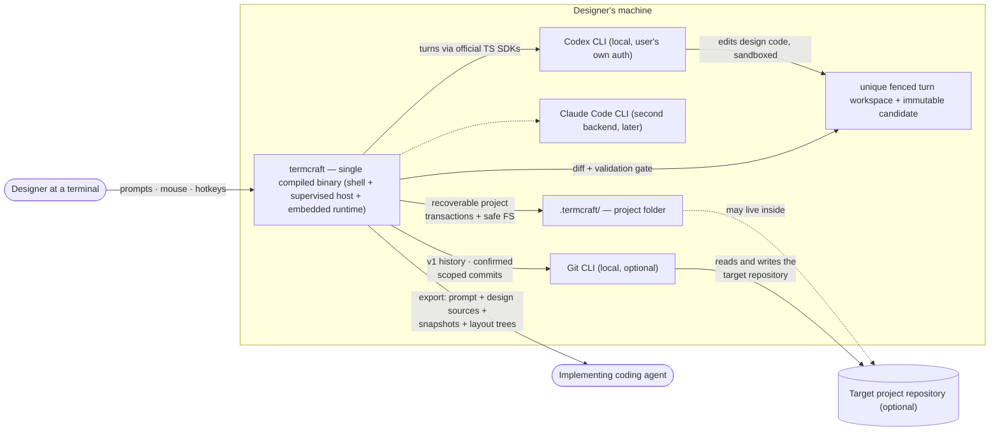

termcraft is a terminal application for designing other terminal applications. A designer describes an interface in plain language; a locally installed AI agent writes real design code against termcraft's design system; termcraft executes that code in an isolated preview and iterates through chat. This document shows the system's context: who uses it, which external programs it drives, and where its data lives.

## Walkthrough

1. The designer launches termcraft from within the target project's working directory. termcraft looks for a `.termcraft/` project folder there; that folder sits next to the code it describes. Git is optional: the project retains generation, preview, pins, chat, and export without a repository, while committing `.termcraft/` alongside application code lets design history travel with the codebase.
2. Design requests are sent to a locally installed agent CLI driven through its vendor's official TypeScript SDK — termcraft holds no API keys of its own and simply uses whatever authentication the CLI already has configured. The Codex CLI is the first supported backend; the Claude Code CLI is planned as a second backend behind the same abstraction, adopted later if its terms permit headless embedding.
3. The agent writes `@termcraft/runtime` design code in a unique fenced turn workspace, confined there by its backend. After confirmed process exit, `SafeProjectFs` copies allowed regular files into an agent-inaccessible immutable candidate; the Gate validates types, runtime-only imports, page contract, and a smoke render from that candidate. Rejection or interruption before commit intent changes no canonical source.
4. Accepted changes publish through a recoverable `TurnTransaction`: after durable commit intent, startup or the live process idempotently rolls every planned page, manifest, local effect, chat, and pin event forward. Unexpected target drift is never overwritten. Design code executes only inside a `HostSupervisor`-owned subprocess; the UI uses `PreviewSession` and never owns the process. Composite workspace trust is required because the project contains executable code regardless of whether it arrived through Git, a copy, or a sync tool.
5. Failure branch: if the agent CLI is missing or not logged in, a background health check performed at startup — and repeated before each send — surfaces the problem in the status bar. Attempting to send a message while unhealthy then fails with a clear error and install instructions rather than silently hanging.
6. In v1 only, termcraft can ask the installed Git CLI for read-only page history and can create a commit after `/commit-page`, `/commit-infra`, or `/commit-all` opens confirmation for an exact `.termcraft/` scope. Restore replaces one canonical page source without moving `HEAD` or changing the index; termcraft never commits automatically. These commands and history are unavailable when Git or a containing repository is unavailable.
7. The final deliverable is an export package — an implementation prompt, deterministic text snapshots at several terminal sizes, resolved layout trees, and the exact canonical design sources currently on disk, including uncommitted changes — handed off to a separate implementing coding agent that builds the real application. termcraft itself never emits implementation code for the target stack; its only output toward implementation is this package.
8. Several non-goals bound this context: there is no manual drag/resize editing, daemon, or multi-client mode. Each project is single-user and single-instance, with an OS-held project lease, and separate tools or experiments live in separate folders or Git branches.

## Source anchors

- `docs/superpowers/specs/2026-07-13-termcraft-design.md` — §1 overview, §2 non-goals, §3.1 launch and trust, §4 architecture, §6.1 backend abstraction, §6.2 turn protocol
- `docs/superpowers/specs/2026-07-16-git-backed-page-history-design.md` — governing MVP/v1 split, optional Git integration, canonical page sources, history, Restore, and scoped commits
- `docs/superpowers/specs/2026-07-16-production-hardening-decisions-design.md` — governing recovery, staging, Kernel, host, storage, runtime, and bounded-operation decisions
- `design/Termcraft UI.dc.html` — visual source of truth for screens and status-bar language
