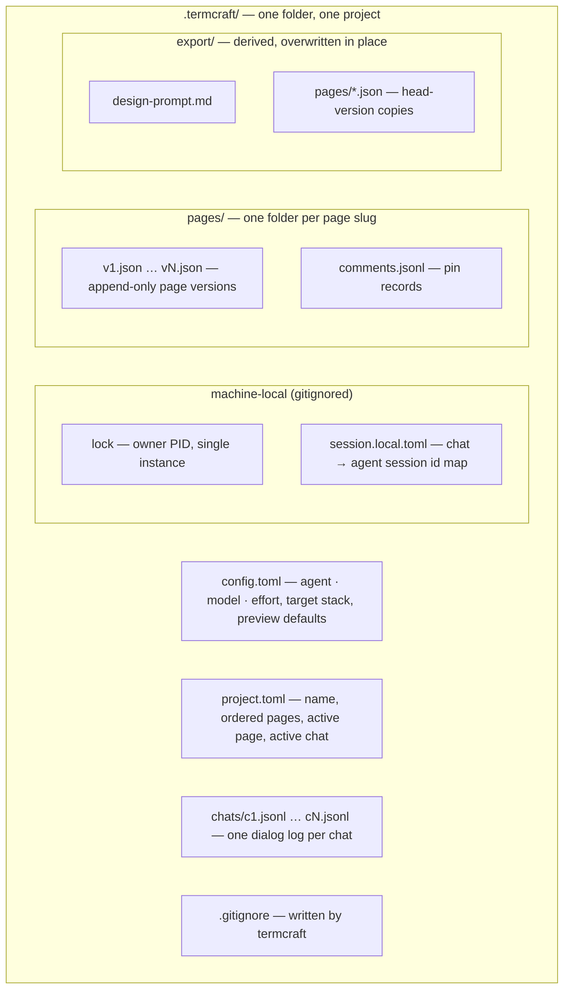

Everything termcraft persists lives in one plain-text folder, `.termcraft/`, next to the code it describes. This document maps that folder: what each file holds, what commits to git versus what stays machine-local, and how every file carries a format version so data outlives binaries.

## Walkthrough

1. Creation: the folder appears when the first prompt is submitted from Home — default config plus a zero-page manifest.
2. What commits: everything except the generated `.gitignore` matches (`lock`, `*.local.toml`, `backup-*/`); designs diff and commit alongside the target project's code.
3. Chats: a project holds one or more chats — independent conversation lines over the same pages. Chat ids are termcraft-assigned (`c1`, `c2`, …) with the same create-new semantics as version files; the chat list is the directory scan of `chats/` ordered by id; `project.toml` names the active chat, and a dangling reference falls back to the newest chat on disk (or a fresh `c1` when none exist). A chat's display name is derived, never stored: the first line of its first `user` record, truncated like the project name.
4. Record schemas: each chat file starts with the header `{"kind":"chat","version":1}`, then one record per line, each with an ISO 8601 `ts`:
   - `user` — `{"kind":"user", "text", "selection"?, "pins":[…]}`, exactly what was sent to the agent.
   - `agent` — `{"kind":"agent", "text", "applied":{"<page>": N}}`, the agent's final message and the versions the turn produced.
   - `system` — `{"kind":"system", "event":"rollback"|"error"|"cancelled", "text"}`, rollbacks, honest post-retry errors, and cancellations.

   `comments.jsonl` starts with its own header, then pin records `{id, element, fx, fy, text, status, ts}`.
5. Version files are append-only and written create-new: if `vN.json` unexpectedly exists, termcraft rescans the page's folder and takes the next free number — worst case a duplicate version, never an overwrite.
6. Single-writer rule: a running termcraft owns the folder; external edits while it runs are unsupported — restart to pick them up. Failure branch: a second instance finds the lock file (holding the owner's PID) and refuses politely; a lock whose owner process is dead is removed automatically on startup.
7. Format versioning: every JSON file carries a top-level `schemaVersion`, every JSONL file starts with a typed header line, every TOML file carries a `format_version` — each file kind keeps its own independent counter. Reads run the migration chain up to the current in-memory model; writes always emit the current version. Details of the migration process: `flows/migration.md`.
8. Failure branch: a file newer than the binary understands produces a hard error naming the file, with no partial reads — downgrades are unsupported.

## Source anchors

- `docs/superpowers/specs/2026-07-13-termcraft-design.md` — §7.1 storage layout and record schemas, §7.2 format versioning, §3.1 project creation, §3.9 chats, §9 second-instance handling
