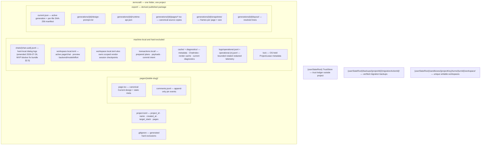

Everything portable that termcraft persists lives in `.termcraft/` next to the
code it describes. Machine-local preferences, sessions, recovery journals,
indexes, caches, diagnostics, logs, leases, and backups are explicitly separated
and excluded from Git commit scopes. This document maps those sources of truth
and their recovery boundaries.

## Walkthrough

1. **Portable project state.** `project.toml` carries exactly `format_version`,
   portable UUIDv7 `project_id`, `name`, UTC `created_at`, enum `target_stack`, and
   the ordered duplicate-free page-slug array `pages`. It does not carry the active page, active
   chat, preview state, selected backend/model/effort, or cached page metadata.
   A page's static `meta` in `page.tsx` is the only source of title, minimum size,
   theme, and integer `kitApiVersion`.
2. **Local workspace state.** `workspace.local.toml` carries active page/chat,
   backend/model/effort, preview size mode and custom dimensions, theme/color
   override, static/interactive mode, fullscreen flag, and scoped session
   checkpoints, plus the bounded optional resource-limit overrides defined by the
   scale design. A dangling local
   selection falls back without mutating portable state. An agent request to
   activate a page is a local post-apply effect recorded in the same recoverable
   turn transaction, not a portable manifest change. The user's own page choice
   reaches the same field by a different route: a successful preview source
   switch — what a tab click or the page-step keys ultimately issue — writes the
   page it switched to as the active one, best-effort, so the choice survives a
   restart (`flows/interactive-prototype.md` step 5a).
3. **Pages.** Every page has one canonical
   `pages/<slug>/page.tsx`. The slug is its immutable page and Git-history
   identity; no page UUID or private version file exists. `page.tsx` imports only
   `@termcraft/runtime`. Historical Git objects are read-only inputs and are
   never migrated in place.
4. **Non-page identities.** Chat, turn, command, record, pin, action, and
   transaction identities use canonical lowercase UUIDv7. Chats are stored as
   `chats/<chatId>.jsonl`; display names and any friendly ordinal are derived and
   never used as identity.
5. **Git scopes.** Git is optional. `/commit-page` selects only the active
   page's canonical source. `/commit-infra` selects `project.toml`, generated
   `.gitignore`, and future explicitly portable project-level files.
   `/commit-all` selects every eligible non-ignored portable or derived path
   under `.termcraft/`, including pin logs, pages, and export artifacts.
   Chats are hard-excluded, not portable (amended 2026-07-26, MVP blocker fix
   bundle §2.5 — chat logs churn on every turn and can carry arbitrary user
   text). Local files, `transactions.local/`, `cache/`, `diagnostics/`, operations logs, lock
   metadata, and backups are hard-excluded even if Git ignore inspection fails.
   (v1; not yet implemented — no `/commit-*` command and no live commit-scope
   planner exist. Only the generated `.gitignore` courtesy mirror is real code today.)
6. **Chat records.** Each chat starts with a typed versioned header. Every
   subsequent line is UTF-8 JSON with `recordId`, ISO timestamp, and a maximum
   1,048,576-byte physical line including LF (serialized object at most 1,048,575
   bytes). User and agent records additionally carry `turnId`;
   agent records carry `changedPages` and the warnings observed at that time.
   Restore system records carry UUIDv7 `restoreActionId`, page slug, and full
   source commit id. The containing chat file remains the persisted chat
   identity; no redundant `targetChatId` field is stored in the record.
7. **Pin records.** `comments.jsonl` is an append-only event log. Creation and
   later open/resolved transitions have distinct `recordId`s and identify the
   stable `pinId`; old lines are never rewritten. Restore and Git history never
   restore or mutate pin state.
8. **JSONL recovery.** Readers stream and index only complete LF-terminated
   records. A final object without `\n` is an uncommitted suffix, even if its JSON
   parses. A transaction plan that proves a partial final append may truncate exactly to its recorded
   old offset/hash and replay the complete record idempotently. Unproven trailing
   bytes remain unchanged in the canonical JSONL and mutation-lock that store.
   Hash-confirmed explicit repair first creates a verified external backup and then
   truncates to the last valid LF. Invalid data in the middle is a hard corruption
   error. (`jsonl-repair` is a reserved mutation kind the transaction engine already
   accepts, but no caller yet assembles the backup-then-truncate repair plan — repair
   is mechanism-only today.)
9. **Sessions.** A vendor session entry is scoped by chat UUID, an opaque backend
   session scope (backend, model, and credential/account/workspace identity), and
   a history checkpoint of record count plus exact prefix hash. Resume requires
   all fields to match and the backend to bind the resumed run to the new turn
   workspace; otherwise a fresh session is seeded with at most 32 complete recent
   records and 64 KiB, dropping oldest whole records first.
10. **Rebuildable projections.** Page metadata is cached by page slug, source
    hash, and extractor version. Current diagnostics are cached by page slug,
    source hash, and `kitApiVersion`. `ChatIndex` stores valid-prefix byte offsets
    and record/turn lookup. Render artifacts use content-addressed keys. Every
    projection can be deleted and rebuilt from portable sources and is never a
    commit or recovery authority.
11. **Safe filesystem boundary.** `SafeProjectFs` mediates managed reads and
    writes in `.termcraft` and copies agent output into immutable candidates. It
    rejects absolute/traversing/UNC/alternate-stream paths, Windows normalization
    ambiguity, case collisions, symlinks, junctions, reparse points, hardlinks,
    non-regular files, and configured path/count/depth/byte limit violations.
    The Gate separately validates TypeScript and import semantics.
12. **Transactions.** Recoverable plans and payloads live under
    `transactions.local/`. Prepared plans without commit intent are discarded.
    Plans with durable commit intent roll forward idempotently before Workspace
    opens; committed journals are recognized without rechecking targets. Their GC
    waits until startup schema/tree validation and reference checks complete.
    Unexpected target hashes enter recovery conflict and are never overwritten.
    Turn apply, Restore finalization, export publication, and migration use domain
    wrappers over the same engine. Durable `rebases/*.json` markers are Restore-only
    (v1; not yet implemented — the engine's `record-pending` state and the
    `releaseAfterApplied` operation flag both carry this reservation in the schema,
    but no code writes a `rebases/` marker, since Restore itself has no writer).
    The GC ordering above is likewise a v1 target: nothing yet collects a
    recognized-complete journal's directory, so today it is simply left in place
    (`flows/launch.md`).
13. **Single writer.** A writable process holds `ProjectLease` through an OS lock
    for its lifetime. PID, process-start token, nonce, version, and timestamp are
    diagnostic metadata only. A lease is never reclaimed from PID alone; if the
    platform cannot prove ownership, writable startup refuses and offers explicit
    recovery. Writable projects on filesystems with unreliable locking are
    unsupported.
14. **Trust.** The external trust ledger keys a `TrustSubject` by canonical
    project path, project-root filesystem identity, portable `projectId`, and Git
    repository identity when available. Ordinary file edits, commits, and branch
    switches do not revoke trust; replacing the workspace or Git directory does.
    Trust is intentionally not bound to `HEAD` and is not a per-file signature.
15. **Turn workspaces.** `{userStateRoot}/sandboxes/<projectKey>/` contains unique
    `turns/<turnId>/workspace/` directories. `projectKey` is lowercase hexadecimal
    SHA-256 over `UTF-8(canonicalProjectRoot) || 0x00 || UTF-8(projectId)`; there is
    no stored salt or OS-temporary fallback. Each agent receives only its turn workspace as
    cwd/writable root. Later turns never clear or reuse it. The Gate reads a
    `SafeProjectFs`-created immutable candidate after the relevant process tree is
    confirmed exited.
16. **Export.** `export/` is derived and may be committed by `/commit-all`.
    `ExportPublishTransaction` assembles and verifies an immutable generation under
    `generations/<generationId>/`, including `runtime-api.json`, then replaces
    `current.json` only after every
    package file exists. Capture or assembly failure leaves the previous pointer
    active. Internal scratch and cache entries are local and excluded. Real end to
    end now (MVP gap closeout WP-5): `export.start` renders and assembles a real
    generation, `buildExportPublishOperations` builds its real create-generation
    → replace-pointer → delete-old-generation operations, and the production
    `ExportPublishPort` adapter durably publishes them; startup also validates
    `current.json` before a project reopens (`null` — no export yet — never
    blocks), and the headless `termcraft export` CLI drives the whole sequence
    with no renderer.
17. **Format versioning and migration.** Each TOML/JSON/JSONL kind has an
    independent format counter. `page.tsx` instead declares `kitApiVersion`.
    Planning mints `migrationPlanId`; confirmation mints `migrationActionId`, and the
    migration journal domain persists both.
    Before any old bytes are rewritten, migration creates and verifies a backup
    generation in machine-local user state outside `.termcraft`, regardless of
    Git status. Lazy migration may transform in memory, but its first write must
    add the original bytes to the verified migration backup. Canonical current
    sources may be codemodded; Git historical objects never are. (The format-counter
    gate and the verified-backup protocol are implemented and tested, but the
    migration chain itself is currently empty — no migration has shipped.)
18. **Operations log.** Bounded rotated local telemetry may record UUIDv7
    `recordId`, backend name, model, `sessionStartMode`, timings, retries, Gate result, cancellation/exit reason,
    and host restarts. It never stores prompts, reasoning, credentials, file
    contents, `sessionScopeId`, raw vendor session ids, or full tool arguments and is
    not a source of truth. (v1; not yet implemented — no writer exists anywhere in the
    codebase. Only its resource-limit configuration keys, `operations_log_segment_bytes`
    and `operations_log_retention_segments`, are real in `workspace.local.toml`.)
19. **First shipped schema.** UUID records, canonical page paths, local-state
    separation, pin events, and explicit `kitApiVersion` are the initial shipped
    formats — implemented across `entities/`, `store/`, and `infrastructure/` and
    exercised by their own test suites. No migration from the abandoned
    numbered-page design exists, and the (empty) migration chain has never had to
    run one. The components that consume this storage have now landed: the
    assembled Kernel (`core`) reaches it through the `store/adapters` ring behind
    `core/ports`, and the composed UI shell drives that graph under `bun start`.

## Source anchors

- `src/store/model/factory.ts` — the composition root: wires the durability
  pre-flight, the lease, safe filesystem, journal-format gate, crash recovery,
  the migration too-new gate, schema decoders, the orphan-turn sweep, and every
  sub-store behind the `Store` port (`openProject`/`createProject`)
- `src/infrastructure/durability/model/probe.ts` — `probeDurability`: refuses a
  volume that cannot demonstrate durable writes (storage-identity §4) before
  `openProject`/`createProject` mutate anything
- `src/store/toml/model/project-toml.ts` — item 1: `project.toml`'s five
  portable fields, deterministic TOML encode/decode, and the `format_version`
  too-new gate
- `src/store/toml/model/workspace-toml.ts` — item 2: `workspace.local.toml`'s
  full local field set (active page/chat, backend/model/effort, preview,
  theme, render mode, session checkpoints, resource-limit override ranges) and
  its preserve-and-default corruption policy
- `src/core/kernel/model/handlers/preview-export.ts` — item 2's other writer of the
  active page: a successful `preview.selectPage`/`preview.selectCurrent` persists the
  page it switched to through `ProjectStore.writeWorkspaceState`, after the session is
  established and only on success; a write failure is logged, never fatal
- `src/core/kernel/model/handlers/page-descriptors.ts` — `resolveActivePageSlug`: the
  reader on the other side of that write — it keeps the persisted page active if it
  still exists, else falls back to the first in the ordered list
- `src/entities/page/model/slug.ts` — item 3: the page-slug grammar
  (directory-name mask, Windows reserved-name rejection) that is a page's only
  identity
- `src/entities/page/types.ts` — items 1, 17: `PageMeta` (`kitApiVersion`,
  `title`, `minSize`, `theme`), the only source of a page's static metadata
- `src/store/transaction/model/wrappers.ts` — items 3, 6, 7, 8, 12, 16, 17: the
  managed-path builders (`canonicalPagePath`, `pageCommentsPath`,
  `chatJsonlPath`), every domain transaction wrapper (turn
  admission/finalization/terminalization, `project-mutation` — whose
  `jsonl-repair` kind is reserved but has no caller yet — and the
  infrastructure-only `restore`/`export-publish`/`migration` builders, each
  with no MVP caller by design)
- `src/infrastructure/uuid/model/uuidv7.ts` — item 4: UUIDv7 minting and
  canonical-form validation, shared by every non-page identity
- `docs/superpowers/specs/2026-07-16-git-backed-page-history-design.md` —
  item 5: `/commit-page`, `/commit-infra`, `/commit-all`, the live
  `StoragePathPolicy` commit-scope planner, and the Restore write flow — none
  of this has shipped; the generated `.gitignore` below is the only piece with
  real code
- `src/store/toml/model/gitignore.ts` — item 5: the generated
  `.termcraft/.gitignore`, a courtesy mirror of the hard-exclusion list —
  commit-scope correctness itself rests on the not-yet-built policy planner
- `src/entities/chat/types.ts` — item 6: the chat header and every record kind
  (`user`, `agent`, `system:error`, `system:cancelled`, `system:restore`)
- `src/entities/chat/model/decode.ts` — item 6: the Zod-backed header/record
  decoders, including the `turnId`/`actionId` mutual-exclusion rule on system
  records
- `src/entities/pin/types.ts` — item 7: the comments header, the
  `pin:created`/`pin:status` event union, and the derived `Pin` shape
- `src/entities/pin/model/decode.ts` — item 7: the event decoders and
  `foldPins`, the event-sourcing fold that derives status from file order
- `src/store/jsonl/model/line-codec.ts` — item 8: the physical
  LF-terminated-line codec (UTF-8/BOM/CR/size rules)
- `src/store/jsonl/model/reader.ts` — item 8: the from-byte-zero streaming
  reader and its three-way tail classification (clean / transaction-proven
  append interruption / unproven corrupt suffix), plus the mid-file-corruption
  hard stop
- `src/store/jsonl/model/append-builder.ts` — item 8: the prepared-append
  descriptor (`buildChatAppend`/`buildPinAppend`) and `computeAfterImage`, the
  exactly-once append contract recovery proves against
- `src/store/jsonl/model/checkpoint.ts` — item 9: the session resume gate
  (`evaluateSessionResume`), the bounded fresh-session seed (32 records / 64
  KiB), and the prefix-hash computation
- `src/store/projections/model/page-meta-cache.ts` — item 10: the unbounded
  page-metadata cache keyed by `(pageSlug, sourceHash, extractorVersion)`
- `src/store/projections/model/diagnostics-store.ts` — item 10: the
  current-diagnostics cache keyed by `(pageSlug, sourceHash, kitApiVersion)`,
  128 MiB default quota with least-recently-written eviction
- `src/store/projections/model/render-cache.ts` — item 10: the
  content-addressed export render cache, 512 MiB default quota with
  least-recently-written eviction
- `src/store/jsonl/model/chat-index.ts` — item 10: `ChatIndex`, the paginated
  record-id/turn-id/timestamp/changed-pages index over a chat log
- `src/store/jsonl/model/chat-index-store.ts` — item 10: the disk persistence
  for `ChatIndex`'s pages and state, so it survives a restart instead of
  rebuilding from scratch
- `src/store/safe-fs/model/no-follow.ts` — item 11: the no-follow managed-path
  walk, reparse-point/symlink/junction rejection, and root-escape detection
- `src/store/safe-fs/model/path-rules.ts` — item 11: the path grammar
  (length/component/reserved-name limits) and NFC/case-fold collision
  detection
- `src/store/safe-fs/model/leaf-identity.ts` — item 11: file-type
  permissibility and hardlink/identity-drift checks
- `src/store/safe-fs/model/limits.ts` — item 11: per-namespace and per-root
  size/count/depth limits, checked at admission and again while streaming
- `src/store/safe-fs/model/candidate.ts` — items 11, 15: `snapshotToCandidate`,
  the immutable hashed candidate copy handed to the Gate
- `src/store/transaction/model/plan.ts` — item 12: the transaction-plan
  schema, canonical-JSON hashing, payload validation, and the
  journal-may-not-target-itself rule
- `src/store/transaction/model/engine.ts` — item 12: the core commit protocol
  (payloads → plan → intent → roll-forward → `committed.json`) and the JSONL
  append-tail classification recovery shares
- `src/store/transaction/model/recovery.ts` — item 12: the startup scan that
  classifies and resolves every unfinished transaction (discard /
  roll-forward / already-complete / conflict) before project state is exposed
- `src/store/transaction/model/journal-format.ts` — item 12: the
  whole-journal-namespace `format.json` gate, read before any transaction
  directory is listed
- `src/store/transaction/model/write-mutex.ts` — item 12: the single
  mutating-write permit and the chained recheck-before-every-step helper
- `src/store/transaction/types.ts` — item 12: the complete `TransactionState`
  machine, including the `record-pending`/`releaseAfterApplied` Restore-only
  reservations that carry no writer today
- `src/store/lease/model/lease.ts` — item 13: the Windows OS-lock acquisition,
  the bounded advisory metadata, and the never-force-broken lease contract
- `src/store/trust/model/subject.ts` — item 14: the `TrustSubjectV1` canonical
  byte encoding and SHA-256 keying
- `src/store/trust/model/trust-store.ts` — item 14: `buildSubject`/
  `isGranted`/`grant`, the machine-local ledger under `{userStateRoot}/trust/`
- `src/store/sandbox/model/staging-store.ts` — item 15: `createTurnWorkspace`,
  the create-new turn directory, canonical-page/manifest/runtime-doc staging,
  and `turn.json` persistence
- `src/store/sandbox/model/project-key.ts` — item 15: `computeProjectKey`, the
  SHA-256 sandbox-parent-directory derivation
- `src/core/export/model/package.ts` — item 16: `assembleExportPackage`, the
  in-memory export file list — `design-prompt.md`, `runtime-api.json`, the WHOLE
  canonical tree once under `design/<treeRelPath>`, one `closures/<slug>.json` per
  page listing what that page reaches, `snapshots/<slug>/<w>x<h>.txt`, and the real,
  non-empty, size-keyed `layout/<slug>.json` per page; the one remaining
  divergence is that a `LayoutNode` carries no `text` field yet, pending the
  runtime element catalog
- `src/core/export/model/publish-plan.ts` — item 16:
  `buildExportPublishOperations` and `serializeExportPointer` — the real
  create-generation → replace-`current.json` → delete-old-generation operations
  and the canonical `export/current.json` bytes
- `src/core/export/model/publish.ts` — item 16: `publishExport`, the
  reacquire-revalidate-then-intent publication window that reads the previous
  pointer under the write permit, builds the plan, and publishes before releasing
- `src/core/ports/export-publish.ts` — item 16:
  `ExportPointerV1`/`exportPointerV1Schema`/`EXPORT_POINTER_TARGET` — the durable
  `export/current.json` shape (schema version, generation id, per-file SHA-256
  manifest) shared by writer and reader, plus the runtime-api declaration types
- `src/host/protocol/model/embedded-declaration.ts` — item 16:
  `EMBEDDED_RUNTIME_DECLARATION`, the `runtime-api.json` content source (module
  name plus current/supported `kitApiVersion`) — a real producer now exists,
  closing the earlier gap
- `src/store/adapters/export-publish.ts` — item 16: the production
  `ExportPublishPort` — durably publishes a generation through
  `buildExportPublishTransaction`, and `readPointer` validates `current.json` on
  both open paths (shallow structural parse plus a referenced-generation-dir
  existence check; `null` — never published — never blocks)
- `src/store/migration/model/registry.ts` — item 17: the format-counter
  too-new gate shared by every durable-file kind, and `MIGRATION_CHAIN` —
  deliberately empty; no migration has shipped
- `src/store/migration/model/backup-store.ts` — item 17: the verified-backup
  protocol (copy → manifest → flush → reopen-verify → `VERIFIED` marker) under
  `{userStateRoot}/backups/<projectId>/<migrationActionId>/`
- `docs/superpowers/specs/2026-07-16-projections-observability-scale-design.md`
  — item 18: the bounded rotated operations log (`logs/operational.jsonl` +
  rotation) — no writer exists anywhere in the codebase yet; only its
  resource-limit configuration keys are implemented (`workspace-toml.ts`,
  above)
