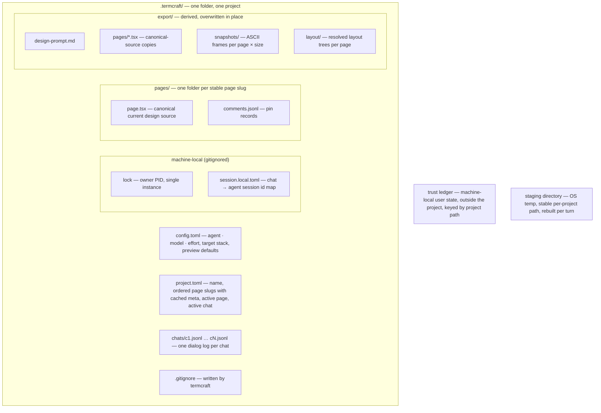

Everything termcraft persists lives in one plain-text folder, `.termcraft/`, next to the code it describes. This document maps that folder: the single canonical source for each page, chat and pin records, export artifacts, portable data that may be committed to Git, machine-local exclusions, and the independent format counters that let data outlive binaries.

## Walkthrough

1. Creation: the folder appears when the first prompt is submitted from Home — default config plus a zero-page manifest. No JS tooling ever appears in it: designs import from the kit embedded in the termcraft binary, so there is no `package.json` and no `node_modules`.
2. Page identity and source: every manifest page has an immutable slug and exactly one canonical source at `pages/<slug>/page.tsx`. The user-facing `meta.title` remains editable. Successful generation replaces a changed canonical source; there is no termcraft-managed page-history data in the MVP.
3. Git is optional. Outside a repository, or when the Git executable is unavailable, design, generation, preview, pins, chats, migration, and export all keep working; only v1 history and commit controls are unavailable. In a repository, v1 offers three explicit, user-confirmed scopes, none of which can include a path outside `.termcraft/`:
   - **Commit current page** — only `pages/<active-slug>/page.tsx`.
   - **Commit infrastructure** — `project.toml`, `config.toml`, `.gitignore`, and future portable project-level schema or metadata files.
   - **Commit entire project** — every non-ignored added, modified, or deleted path under `.termcraft/`, including pages, chats, pins, and export artifacts.
4. Local-state exclusion: the generated `.gitignore` excludes `lock`, `backup-*/`, and `*.local.*`. Those files are never selected by a termcraft commit scope. All other portable project data may be committed according to the confirmed scope.
5. Trust: design sources are real code. Because committed designs execute on whoever opens the project, the trust decision must not be forgeable by the repository itself: the trust ledger lives in termcraft's machine-local user state directory, outside the project, keyed by project path. A project created on this machine is trusted implicitly; a cloned one prompts before anything renders.
6. Staging: the agent edits scratch state in the OS temp area at a stable per-project path. At the start of every turn, termcraft clears it and copies the canonical `page.tsx` for every listed page. At the end, termcraft diffs and validates proposed sources, replaces each changed canonical file, then clears staging after apply, final failure, or cancellation. The stable path keeps resumed agent-session file references valid across turns and restarts; staging never touches `.termcraft/`.
7. Chats: a project holds one or more independent conversation lines over the same canonical page sources. Chat ids are termcraft-assigned (`c1`, `c2`, …); the chat list is the directory scan of `chats/` ordered by id. `project.toml` names the active chat, and a dangling reference falls back to the newest chat on disk, or a fresh `c1` when none exist. A chat's display name is derived, never stored: the first line of its first `user` record, truncated like the project name.
8. Record schemas: each chat file starts with the header `{"kind":"chat","version":1}`, then one record per line, each with an ISO 8601 `ts`:
   - `user` — `{"kind":"user", "text", "selection"?, "pins":[…]}`, exactly what was sent to the agent.
   - `agent` — `{"kind":"agent", "text", "changedPages":["main"], "warnings":[…]}`, the agent's final message, the page slugs whose canonical sources the turn changed, and Gate warnings carried into the next turn. A purely conversational or empty-diff turn uses `"changedPages":[]`.
   - `system` — Restore uses a record such as `{"kind":"system", "event":"restore", "page":"main", "sourceCommit":"<full-object-id>", "text":"restored main from a1b2c3d"}`. Other system records describe errors, cancellations, and UI metadata changes without assigning page-history identities.

   `comments.jsonl` starts with its own header, then pin records `{id, element, fx, fy, text, status, ts}`. Pins are page-local collaboration state, not part of the page design source, and Restore never changes them.
9. Export: `export/` is derived and overwritten in place. Its source copies come from each canonical current design on disk, including uncommitted changes; selecting a historical preview does not change the export source. Snapshots and resolved layout trees remain organized per page and requested size.
10. Single-writer rule: a running termcraft owns the folder; external edits while it runs are unsupported — restart to pick them up. A second instance finds the lock file and refuses politely; a lock whose owner process is dead is removed automatically on startup. In v1, Git commits and the short final generation apply serialize through the separate project-write mutex.
11. Format versioning: every JSON data file carries a top-level `schemaVersion`, every JSONL file starts with a typed header line, and every TOML file carries a `format_version`; each file kind keeps its own independent counter. Page sources are the exception: they are code, versioned by the embedded kit's semver, with breaking kit changes shipping canonical-source codemods in the migration registry. Reads run the migration chain up to the current in-memory model; writes always emit the current version. Details: `flows/migration.md`.
12. Failure branch: a file newer than the binary understands produces a hard error naming the file, with no partial reads — downgrades are unsupported.

## Source anchors

- `docs/superpowers/specs/2026-07-16-git-backed-page-history-design.md` — §2 canonical page identity and optional Git, §3 storage and terminology, §5 generation and chat records, §7 Restore records, §8 commit scopes and local exclusions
- `docs/superpowers/specs/2026-07-13-termcraft-design.md` — §7.1 storage layout, trust ledger, pins, chats, export, and staging scratch, §7.2 format versioning and kit semver, §3.1 project creation and trust, §3.9 chats, §9 second-instance handling
