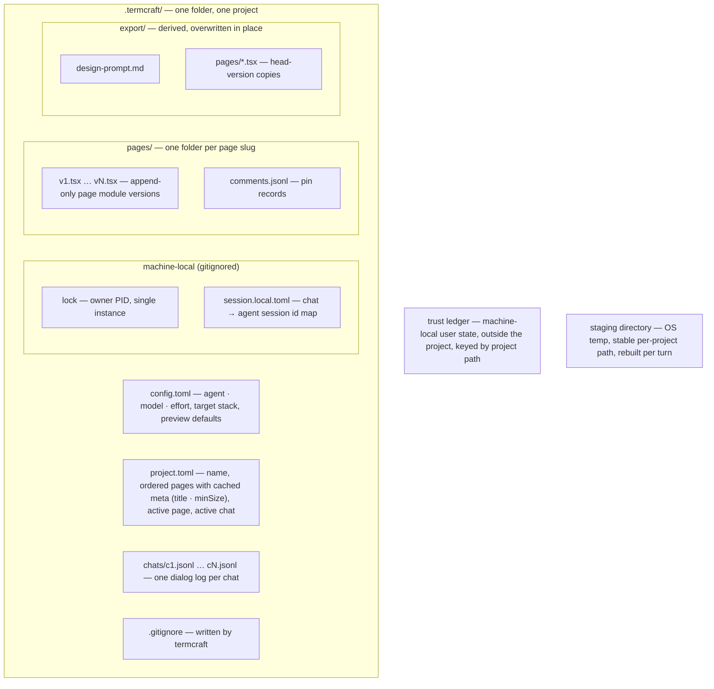

Everything termcraft persists lives in one plain-text folder, `.termcraft/`, next to the code it describes. This document maps that folder: what each file holds, what commits to git versus what stays machine-local, how every data file carries a format version so data outlives binaries — and the one piece of state deliberately kept outside the folder.

## Walkthrough

1. Creation: the folder appears when the first prompt is submitted from Home — default config plus a zero-page manifest. No JS tooling ever appears in it: designs import from the kit embedded in the termcraft binary, so there is no `package.json` and no `node_modules`.
2. What commits: everything except the generated `.gitignore` matches (`lock`, `*.local.toml`, `backup-*/`); designs diff and commit alongside the target project's code.
3. Page versions are TSX modules — real code. Because committed designs execute on whoever opens the project, the trust decision must not be forgeable by the repository itself: the trust ledger lives in termcraft's machine-local user state directory, outside the project, keyed by project path. A project created on this machine is trusted implicitly; a cloned one prompts before anything renders.
4. The staging directory — where the agent edits during a turn — is scratch state in the OS temp area at a stable per-project path: cleared and repopulated from the current heads at the start of every turn, diffed and validated when the turn ends, cleared after apply, final failure, or cancellation. The stable path keeps resumed agent sessions' file references valid across turns and restarts. It never touches `.termcraft/`.
5. Chats: a project holds one or more chats — independent conversation lines over the same pages. Chat ids are termcraft-assigned (`c1`, `c2`, …) with the same create-new semantics as version files; the chat list is the directory scan of `chats/` ordered by id; `project.toml` names the active chat, and a dangling reference falls back to the newest chat on disk (or a fresh `c1` when none exist). A chat's display name is derived, never stored: the first line of its first `user` record, truncated like the project name.
6. Record schemas: each chat file starts with the header `{"kind":"chat","version":1}`, then one record per line, each with an ISO 8601 `ts`:
   - `user` — `{"kind":"user", "text", "selection"?, "pins":[…]}`, exactly what was sent to the agent.
   - `agent` — `{"kind":"agent", "text", "applied":{"<page>": N}, "warnings":[…]}`, the agent's final message, the versions the turn produced (an empty map for a failed or purely conversational turn), and the gate warnings carried into the next turn.
   - `system` — `{"kind":"system", "event":"rollback"|"rename"|"error"|"cancelled", "text", "applied"?:{…}}`, rollbacks and UI renames (version-minting events carrying the same applied map as agent records), honest post-retry errors, and cancellations.

   `comments.jsonl` starts with its own header, then pin records `{id, element, fx, fy, text, status, ts}`.
7. Version files are append-only and written create-new: if `vN.tsx` unexpectedly exists, termcraft rescans the page's folder and takes the next free number — worst case a duplicate version, never an overwrite.
8. Single-writer rule: a running termcraft owns the folder; external edits while it runs are unsupported — restart to pick them up. Failure branch: a second instance finds the lock file (holding the owner's PID) and refuses politely; a lock whose owner process is dead is removed automatically on startup.
9. Format versioning: every JSON data file carries a top-level `schemaVersion`, every JSONL file starts with a typed header line, every TOML file carries a `format_version` — each file kind keeps its own independent counter. Page sources are the exception: they are code, versioned by the embedded kit's semver, with breaking kit changes shipping codemod steps in the same migration registry. Reads run the migration chain up to the current in-memory model; writes always emit the current version. Details: `flows/migration.md`.
10. Failure branch: a file newer than the binary understands produces a hard error naming the file, with no partial reads — downgrades are unsupported.

## Source anchors

- `docs/superpowers/specs/2026-07-13-termcraft-design.md` — §7.1 storage layout, record schemas, trust ledger, and staging scratch, §7.2 format versioning and kit semver, §3.1 project creation and trust, §3.9 chats, §9 second-instance handling
