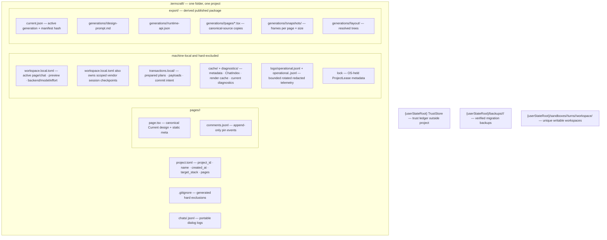

Everything portable that termcraft persists lives in `.termcraft/` next to the
code it describes. Machine-local preferences, sessions, recovery journals,
indexes, caches, diagnostics, logs, leases, and backups are explicitly separated
and excluded from Git commit scopes. This document maps those sources of truth
and their recovery boundaries.

## Walkthrough

1. **Portable project state.** `project.toml` carries exactly `format_version`,
   portable UUIDv7 `project_id`, `name`, UTC `created_at`, enum `target_stack`, and
   the ordered duplicate-free page-slug array `pages`. It does not carry the active page, active
   chat, preview state, selected backend/model/effort, or cached page metadata.
   A page's static `meta` in `page.tsx` is the only source of title, minimum size,
   theme, and integer `kitApiVersion`.
2. **Local workspace state.** `workspace.local.toml` carries active page/chat,
   backend/model/effort, preview size mode and custom dimensions, theme/color
   override, static/interactive mode, fullscreen flag, and scoped session
   checkpoints, plus the bounded optional resource-limit overrides defined by the
   scale design. A dangling local
   selection falls back without mutating portable state. An agent request to
   activate a page is a local post-apply effect recorded in the same recoverable
   turn transaction, not a portable manifest change.
3. **Pages.** Every page has one canonical
   `pages/<slug>/page.tsx`. The slug is its immutable page and Git-history
   identity; no page UUID or private version file exists. `page.tsx` imports only
   `@termcraft/runtime`. Historical Git objects are read-only inputs and are
   never migrated in place.
4. **Non-page identities.** Chat, turn, command, record, pin, action, and
   transaction identities use canonical lowercase UUIDv7. Chats are stored as
   `chats/<chatId>.jsonl`; display names and any friendly ordinal are derived and
   never used as identity.
5. **Git scopes.** Git is optional. `/commit-page` selects only the active
   page's canonical source. `/commit-infra` selects `project.toml`, generated
   `.gitignore`, and future explicitly portable project-level files.
   `/commit-all` selects every eligible non-ignored portable or derived path
   under `.termcraft/`, including chats, pin logs, pages, and export artifacts.
   Local files, `transactions.local/`, `cache/`, `diagnostics/`, operations logs, lock
   metadata, and backups are hard-excluded even if Git ignore inspection fails.
6. **Chat records.** Each chat starts with a typed versioned header. Every
   subsequent line is UTF-8 JSON with `recordId`, ISO timestamp, and a maximum
   1,048,576-byte physical line including LF (serialized object at most 1,048,575
   bytes). User and agent records additionally carry `turnId`;
   agent records carry `changedPages` and the warnings observed at that time.
   Restore system records carry UUIDv7 `restoreActionId`, page slug, and full
   source commit id. The containing chat file remains the persisted chat
   identity; no redundant `targetChatId` field is stored in the record.
7. **Pin records.** `comments.jsonl` is an append-only event log. Creation and
   later open/resolved transitions have distinct `recordId`s and identify the
   stable `pinId`; old lines are never rewritten. Restore and Git history never
   restore or mutate pin state.
8. **JSONL recovery.** Readers stream and index only complete LF-terminated
   records. A final object without `\n` is an uncommitted suffix, even if its JSON
   parses. A transaction plan that proves a partial final append may truncate exactly to its recorded
   old offset/hash and replay the complete record idempotently. Unproven trailing
   bytes remain unchanged in the canonical JSONL and mutation-lock that store.
   Hash-confirmed explicit repair first creates a verified external backup and then
   truncates to the last valid LF. Invalid data in the middle is a hard corruption
   error.
9. **Sessions.** A vendor session entry is scoped by chat UUID, an opaque backend
   session scope (backend, model, and credential/account/workspace identity), and
   a history checkpoint of record count plus exact prefix hash. Resume requires
   all fields to match and the backend to bind the resumed run to the new turn
   workspace; otherwise a fresh session is seeded with at most 32 complete recent
   records and 64 KiB, dropping oldest whole records first.
10. **Rebuildable projections.** Page metadata is cached by page slug, source
    hash, and extractor version. Current diagnostics are cached by page slug,
    source hash, and `kitApiVersion`. `ChatIndex` stores valid-prefix byte offsets
    and record/turn lookup. Render artifacts use content-addressed keys. Every
    projection can be deleted and rebuilt from portable sources and is never a
    commit or recovery authority.
11. **Safe filesystem boundary.** `SafeProjectFs` mediates managed reads and
    writes in `.termcraft` and copies agent output into immutable candidates. It
    rejects absolute/traversing/UNC/alternate-stream paths, Windows normalization
    ambiguity, case collisions, symlinks, junctions, reparse points, hardlinks,
    non-regular files, and configured path/count/depth/byte limit violations.
    The Gate separately validates TypeScript and import semantics.
12. **Transactions.** Recoverable plans and payloads live under
    `transactions.local/`. Prepared plans without commit intent are discarded.
    Plans with durable commit intent roll forward idempotently before Workspace
    opens; committed journals are recognized without rechecking targets. Their GC
    waits until startup schema/tree validation and reference checks complete.
    Unexpected target hashes enter recovery conflict and are never overwritten.
    Turn apply, Restore finalization, export publication, and migration use domain
    wrappers over the same engine. Durable `rebases/*.json` markers are Restore-only.
13. **Single writer.** A writable process holds `ProjectLease` through an OS lock
    for its lifetime. PID, process-start token, nonce, version, and timestamp are
    diagnostic metadata only. A lease is never reclaimed from PID alone; if the
    platform cannot prove ownership, writable startup refuses and offers explicit
    recovery. Writable projects on filesystems with unreliable locking are
    unsupported.
14. **Trust.** The external trust ledger keys a `TrustSubject` by canonical
    project path, project-root filesystem identity, portable `projectId`, and Git
    repository identity when available. Ordinary file edits, commits, and branch
    switches do not revoke trust; replacing the workspace or Git directory does.
    Trust is intentionally not bound to `HEAD` and is not a per-file signature.
15. **Turn workspaces.** `{userStateRoot}/sandboxes/<projectKey>/` contains unique
    `turns/<turnId>/workspace/` directories. `projectKey` is lowercase hexadecimal
    SHA-256 over `UTF-8(canonicalProjectRoot) || 0x00 || UTF-8(projectId)`; there is
    no stored salt or OS-temporary fallback. Each agent receives only its turn workspace as
    cwd/writable root. Later turns never clear or reuse it. The Gate reads a
    `SafeProjectFs`-created immutable candidate after the relevant process tree is
    confirmed exited.
16. **Export.** `export/` is derived and may be committed by `/commit-all`.
    `ExportPublishTransaction` assembles and verifies an immutable generation under
    `generations/<generationId>/`, including `runtime-api.json`, then replaces
    `current.json` only after every
    package file exists. Capture or assembly failure leaves the previous pointer
    active. Internal scratch and cache entries are local and excluded.
17. **Format versioning and migration.** Each TOML/JSON/JSONL kind has an
    independent format counter. `page.tsx` instead declares `kitApiVersion`.
    Planning mints `migrationPlanId`; confirmation mints `migrationActionId`, and the
    migration journal domain persists both.
    Before any old bytes are rewritten, migration creates and verifies a backup
    generation in machine-local user state outside `.termcraft`, regardless of
    Git status. Lazy migration may transform in memory, but its first write must
    add the original bytes to the verified migration backup. Canonical current
    sources may be codemodded; Git historical objects never are.
18. **Operations log.** Bounded rotated local telemetry may record UUIDv7
    `recordId`, backend name, model, `sessionStartMode`, timings, retries, Gate result, cancellation/exit reason,
    and host restarts. It never stores prompts, reasoning, credentials, file
    contents, `sessionScopeId`, raw vendor session ids, or full tool arguments and is
    not a source of truth.
19. **First shipped schema.** The repository is still pre-code. UUID records,
    canonical page paths, local-state separation, pin events, and explicit
    `kitApiVersion` are the initial shipped formats; no migration from the
    abandoned numbered-page design exists.

## Source anchors

- `docs/superpowers/specs/2026-07-16-git-backed-page-history-design.md` —
  canonical page identity, optional Git, history, Restore, and explicit commit
  scopes
- `docs/superpowers/specs/2026-07-16-production-hardening-decisions-design.md`
  — governing production decisions and detailed-design index
- `docs/superpowers/specs/2026-07-16-production-storage-identity-design.md` —
  portable/local layout, identities, record recovery, trust, lease, and migration
- `docs/superpowers/specs/2026-07-16-turn-durability-staging-design.md` — exact journal, JSONL append, export generation, and migration transaction mechanics
- `docs/superpowers/specs/2026-07-16-projections-observability-scale-design.md` — DiagnosticsStore, ChatIndex, render cache, operations log, quotas, and pagination
- `docs/superpowers/specs/2026-07-16-runtime-api-compatibility-design.md` — static page metadata and `runtime-api.json`
