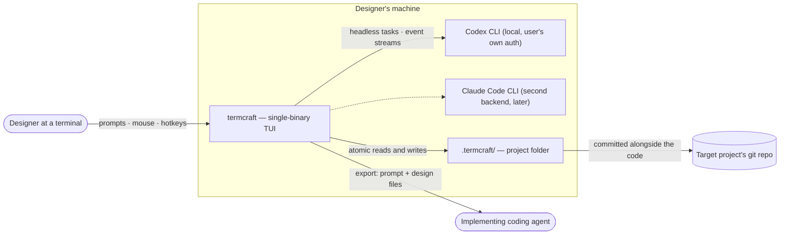
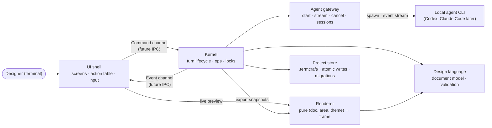
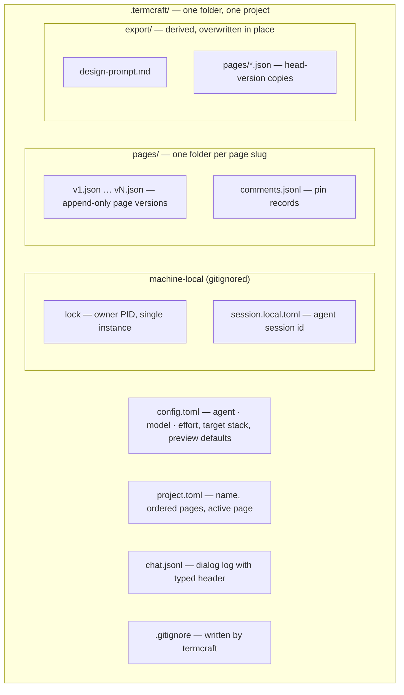
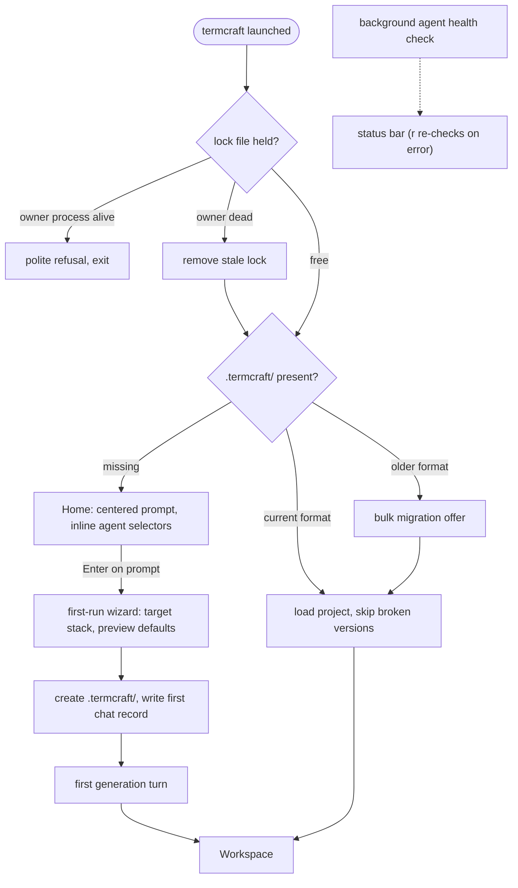
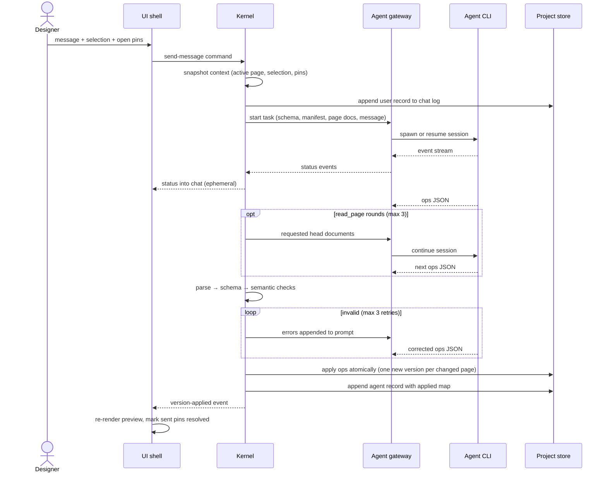
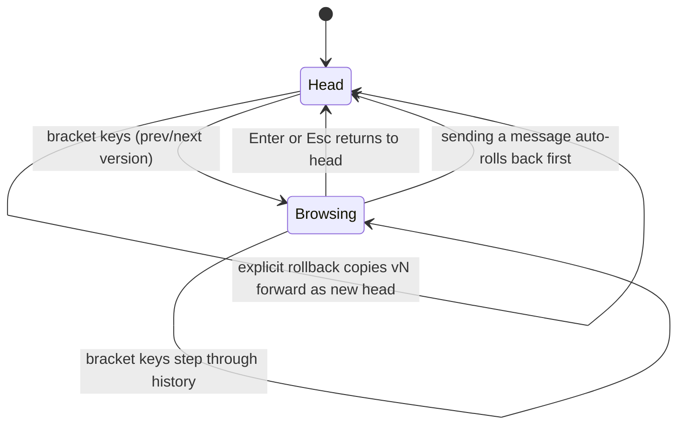
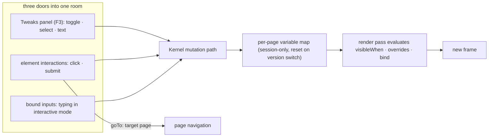
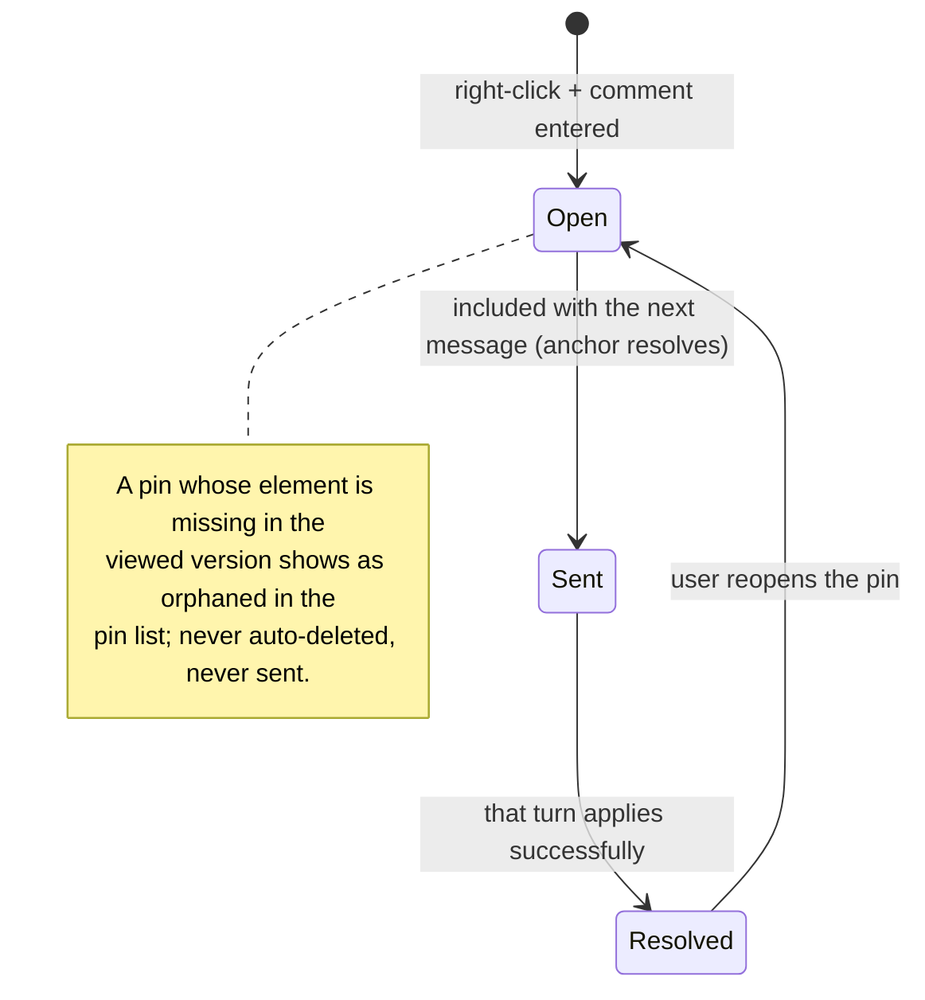
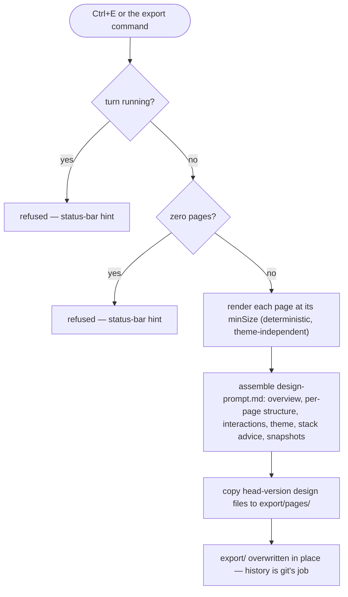
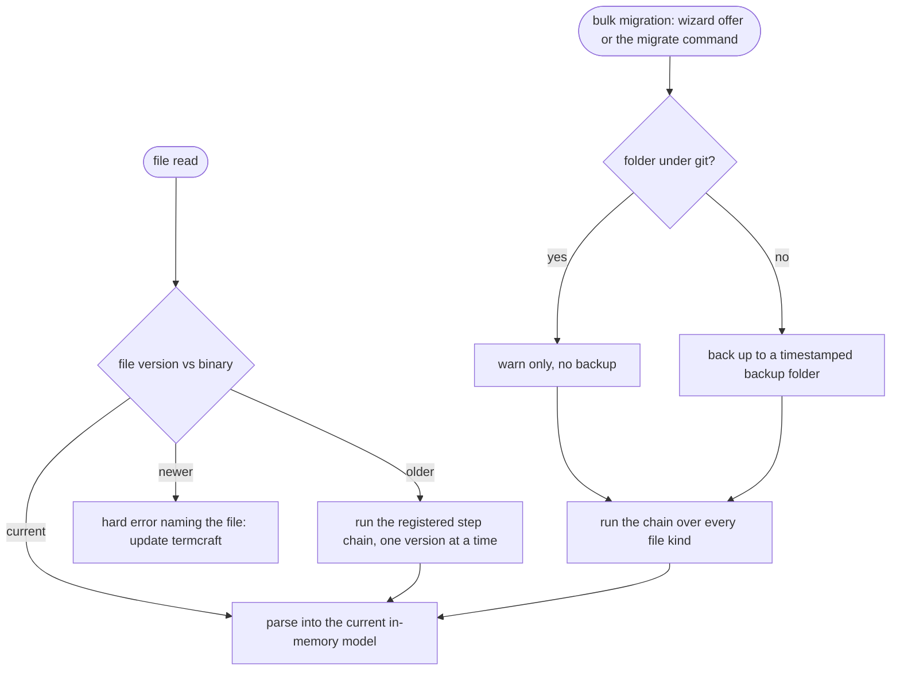

# Architecture Docs Bootstrap Implementation Plan

> **For agentic workers:** REQUIRED SUB-SKILL: Use superpowers:subagent-driven-development (recommended) or superpowers:executing-plans to implement this plan task-by-task. Steps use checkbox (`- [ ]`) syntax for tracking.

**Goal:** Bootstrap `docs/architecture/` (11 documents) describing termcraft's stack-agnostic v1.0 target architecture, absorb the three legacy `architecture/*.mmd` diagrams, and wire up the /architecture plugin's audit tooling.

**Architecture:** Pure documentation work — no application code. Each task writes one Mermaid-bearing GFM document per the /architecture plugin conventions (title paragraph → diagram → Walkthrough → Source anchors), verified by a Mermaid render check and a structure check, then committed. Content source of truth: `docs/superpowers/specs/2026-07-13-termcraft-design.md` (the parent spec). Governing design: `docs/superpowers/specs/2026-07-14-termcraft-architecture-docs-design.md`.

**Tech Stack:** Markdown + Mermaid (GFM), /architecture plugin conventions (`C:\Users\Khmil\.claude\plugins\cache\khmil-local\architecture\0.1.0\reference\conventions.md`), claude-mermaid plugin's `mermaid_preview` tool for render checks.

## Global Constraints

- **English only** — all doc content, per plugin conventions.
- **Template, exactly and in order** (every doc except `README.md`): one plain-English title paragraph (no source-language terminology) → Mermaid diagram(s) → `## Walkthrough` (numbered steps incl. failure branches) → `## Source anchors` (the ONLY place file paths appear).
- **Role-named nodes** — never code identifiers: "Kernel", not `core`; "Agent gateway", not `AgentBackend`.
- **Mermaid style:** soft cap ~20 nodes per diagram; quote labels containing special characters (`id["label (text)"]`); close every `subgraph`/`alt`/`opt`/`loop` with `end`; no class/trait diagrams.
- **Anchor format:** bullet list, one per file: `` `path` — role note``. Anchors point at the parent spec (with § numbers in the role note) and `design/NN-*.dc.html` files; they migrate to source files later via architecture-update (out of scope here).
- **Docs describe the v1.0 target architecture**, not the MVP cut (§8.2 of the parent spec is out of scope except where a doc explicitly notes it).
- **Vocabulary** (use everywhere): UI shell, Kernel, Agent gateway, Design language, Renderer, Project store — the six roles from the design spec §3.
- **All git commands via `rtk` prefix** (`rtk git add`, `rtk git commit`, …).
- **One commit per task.**
- Parent spec path used in anchors: `docs/superpowers/specs/2026-07-13-termcraft-design.md` (relative from `docs/architecture/`: `../superpowers/specs/2026-07-13-termcraft-design.md`; from `docs/architecture/flows/`: `../../superpowers/specs/2026-07-13-termcraft-design.md`). Write anchors as repo-relative paths (`docs/superpowers/specs/...`, `design/...`) — the audit tooling resolves them from the repo root.

**Verification pattern used by every doc task:**

1. Render check: pass the doc's Mermaid block to the `mermaid_preview` tool (claude-mermaid plugin). Expected: renders without syntax errors.
2. Structure check:

```bash
grep -c "^## " docs/architecture/<file>.md
```

Expected output: `2` (exactly `## Walkthrough` and `## Source anchors`).

---

### Task 1: `overview.md` — system context

**Files:**
- Create: `docs/architecture/overview.md`

**Interfaces:**
- Consumes: parent spec §1, §2, §3.1, §4, §6.1.
- Produces: the context diagram and actor vocabulary (`Designer`, `Agent CLI`, `Target repo`, `Implementing coding agent`) that `README.md` (Task 11) links first in reading order.

- [ ] **Step 1: Read source material** — parent spec §1 (overview), §2 (non-goals), §3.1 (launch), §4 (architecture), §6.1 (backend abstraction).

- [ ] **Step 2: Write `docs/architecture/overview.md`**

Title paragraph (use this, adjust flow only): *"termcraft is a terminal application for designing other terminal applications. A designer describes an interface in plain language; a locally installed AI agent CLI generates a declarative design document; termcraft renders it live and iterates through chat. This document shows the system's context: who uses it, which external programs it drives, and where its data lives."*

Diagram:



`## Walkthrough` — numbered steps covering exactly these points (expand each to 1–3 full sentences from the cited spec sections):

1. The designer launches termcraft in the target project's directory; the project folder `.termcraft/` sits next to the code and commits to the same repo (§1, §3.1).
2. Design requests go to a locally installed agent CLI in headless mode — no API keys; whatever auth the CLI already has (§1, §6.1). Codex CLI first; Claude Code CLI later behind the same abstraction.
3. The agent returns declarative design documents; termcraft renders them live; iteration happens through chat, mouse selection, and pin comments (§1).
4. Failure branch: agent CLI missing or not logged in — a background health check reports it in the status bar; sending fails with install instructions (§3.1, §9).
5. The final deliverable is an export package (implementation prompt + exact design files) handed to an implementing coding agent — termcraft itself never generates application code (§1, §2).
6. Non-goals that bound the context: no manual WYSIWYG editing, no daemon/multi-client in v1.0, one project per folder (§2).

`## Source anchors`:

```markdown
## Source anchors

- `docs/superpowers/specs/2026-07-13-termcraft-design.md` — §1 overview, §2 non-goals, §3.1 launch, §4 architecture, §6.1 backend abstraction
- `design/Termcraft UI.dc.html` — visual source of truth for screens and status-bar language
```

- [ ] **Step 3: Verify** — run the verification pattern (render check on the diagram, structure check on the file). Expected: renders clean; grep prints `2`.

- [ ] **Step 4: Commit**

```bash
rtk git add docs/architecture/overview.md && rtk git commit -m "docs(architecture): add system context overview"
```

---

### Task 2: `modules.md` — components and boundaries

**Files:**
- Create: `docs/architecture/modules.md`
- Reference (absorbed, deleted in Task 12): `architecture/modules.mmd`

**Interfaces:**
- Consumes: parent spec §4, §3.8 (action table), §5.7 (renderer purity), §6.1; design spec §3 (component table, corrected diagram).
- Produces: the component diagram every flow doc's participants map onto; the runtime-loop description flows reference.

- [ ] **Step 1: Read source material** — parent spec §4 in full; design spec (`docs/superpowers/specs/2026-07-14-termcraft-architecture-docs-design.md`) §3 — the component table, boundary list, and the Kernel → Renderer correction are the content of this doc.

- [ ] **Step 2: Write `docs/architecture/modules.md`**

Title paragraph: *"termcraft is one program built from six components with strict boundaries; the seam between the UI shell and the Kernel is a command/event channel pair designed to become an inter-process protocol later. This document names the components, what each owns, and the single runtime loop that connects them."*

Diagram (this is the corrected successor of `architecture/modules.mmd` — note the Kernel → Renderer edge):



`## Walkthrough` — numbered steps covering:

1. The six components and one-line responsibilities — reproduce the design spec §3 table as prose or a table: UI shell (screens, action table as the single registry of user actions: hotkey, availability predicate, dispatched command), Kernel (only decision-maker: commands in, events out, turn lifecycle, turn-time locks), Agent gateway (start/stream/cancel/health over local CLIs, session continuity, model/effort flag mapping), Design language (document model, schema, structural + semantic validation, format version), Renderer (pure function of document, area, theme — layout, drawing, color degradation, hit-testing), Project store (everything under `.termcraft/`, atomic writes, migration registry).
2. The runtime loop: terminal events (keys, mouse, resize) and kernel events merge into one loop; the UI shell translates input into commands through the action table; the kernel answers with events; the UI redraws. No other channel exists between the layers (§4).
3. The kernel boundary is the future IPC: when daemon mode arrives the channel contract becomes the wire protocol and the UI does not change (§4).
4. The UI shell never touches the Project store directly — everything flows through kernel commands.
5. Why the Kernel depends on the Renderer: export renders deterministic ASCII snapshots (§3.7), and export is a kernel operation — this is why the renderer must stay a pure function with no terminal coupling (§5.7). Call out that the legacy diagram lacked this edge.
6. The reactive variable store (v1.0) belongs to the Kernel: all three mutation sources (tweaks, interactions, bound inputs) go through one kernel code path; the Renderer reads the map during evaluation (§5.5, §5.6). Details: `flows/interactive-prototype.md`.
7. Failure-isolation note: agent process death or invalid output never corrupts stored state — new versions are written atomically post-validation, so the last valid version survives (§6.3, §9).

`## Source anchors`:

```markdown
## Source anchors

- `docs/superpowers/specs/2026-07-13-termcraft-design.md` — §4 architecture and module boundaries, §3.8 action table and hotkey tiers, §5.7 rendering determinism, §6.1 backend abstraction
```

- [ ] **Step 3: Verify** — verification pattern. Expected: renders clean; grep prints `2`.

- [ ] **Step 4: Commit**

```bash
rtk git add docs/architecture/modules.md && rtk git commit -m "docs(architecture): add component model with kernel-renderer edge"
```

---

### Task 3: `storage.md` — durable state

**Files:**
- Create: `docs/architecture/storage.md`

**Interfaces:**
- Consumes: parent spec §7.1, §7.2, §3.1.
- Produces: the storage layout that `flows/launch.md`, `flows/versions.md`, `flows/export.md`, and `flows/migration.md` build on (they describe dynamics; this doc owns the statics).

- [ ] **Step 1: Read source material** — parent spec §7.1 (layout), §7.2 (format versioning), §3.1 (project creation).

- [ ] **Step 2: Write `docs/architecture/storage.md`**

Title paragraph: *"Everything termcraft persists lives in one plain-text folder, `.termcraft/`, next to the code it describes. This document maps that folder: what each file holds, what commits to git versus what stays machine-local, and how every file carries a format version so data outlives binaries."*

Diagram:



`## Walkthrough` — numbered steps covering:

1. Creation: the folder appears when the first prompt is submitted from Home — default config plus a zero-page manifest (§3.1).
2. What commits: everything except the generated `.gitignore` matches (`lock`, `*.local.toml`, `backup-*/`); designs diff and commit alongside the target project's code (§7.1).
3. Record schemas of `chat.jsonl` (header line `{"kind":"chat","version":1}`, then `user` / `agent` / `system` records with ISO 8601 `ts` — reproduce the three record shapes from §7.1) and `comments.jsonl` (header + pin records `{id, element, fx, fy, text, status, ts}`).
4. Version files are append-only and written create-new: if `vN.json` unexpectedly exists, termcraft rescans and takes the next free number — worst case a duplicate version, never an overwrite (§7.1).
5. Single-writer rule: a running termcraft owns the folder; external edits while running are unsupported — restart to pick them up (§7.1). Failure branch: second instance → the lock file (owner PID) refuses politely; a dead owner's lock is removed on startup (§9).
6. Format versioning: every JSON carries `schemaVersion`, every JSONL a typed header, every TOML a `format_version`; independent counters per file kind; reads run the migration chain, writes always emit current (§7.2). Details of the migration process: `flows/migration.md`.
7. Failure branch: a file newer than the binary → hard error naming the file, no partial reads; downgrades unsupported (§7.2).

`## Source anchors`:

```markdown
## Source anchors

- `docs/superpowers/specs/2026-07-13-termcraft-design.md` — §7.1 storage layout and record schemas, §7.2 format versioning, §3.1 project creation, §9 second-instance handling
```

- [ ] **Step 3: Verify** — verification pattern. Expected: renders clean; grep prints `2`.

- [ ] **Step 4: Commit**

```bash
rtk git add docs/architecture/storage.md && rtk git commit -m "docs(architecture): add storage layout and format versioning"
```

---

### Task 4: `flows/launch.md`

**Files:**
- Create: `docs/architecture/flows/launch.md`

**Interfaces:**
- Consumes: parent spec §3.1, §8.1 item 2, §9; vocabulary from Task 2.
- Produces: launch flow referenced by `README.md`; hands off to `flows/migration.md` (bulk offer) and `flows/generation-turn.md` (first generation).

- [ ] **Step 1: Read source material** — parent spec §3.1 (launch and Home), §8.1 item 2 (v1.0 wizard), §9 (agent missing, second instance, corrupt file, terminal too small).

- [ ] **Step 2: Write `docs/architecture/flows/launch.md`**

Title paragraph: *"What happens between typing `termcraft` in a directory and working in the Workspace: the single-instance check, finding or creating the project folder, and the first generation."*

Diagram:



`## Walkthrough` — numbered steps covering:

1. Single-instance check: the lock file holds the owner's PID; alive owner → polite refusal; dead owner → stale lock removed automatically (§9).
2. `.termcraft/` lookup in the current working directory — three outcomes: missing → Home; present and current → Workspace with chat history restored (no project picker; separate projects are separate directories); present but older → bulk migration offer, then Workspace (§3.1). Migration mechanics: `flows/migration.md`.
3. Home screen: large centered prompt focused on entry (`Esc`/`Tab` unfocus per the focus rules); inline selectors show the agent · model · effort triple, held in memory until the project exists (§3.1, §3.6).
4. First submit (v1.0): the first-run wizard collects target stack (rust-ratatui | go-bubbletea | generic) and preview defaults; then `.termcraft/` is created with config and a zero-page manifest, the first `user` record lands in the chat log, the Workspace opens, and the first generation turn starts (§3.1, §8.1; turn mechanics: `flows/generation-turn.md`).
5. Failure branch: a failed first turn rolls nothing back — the error lands in chat and the user sends the next message (§3.1).
6. Failure branch: agent CLI missing/not logged in — the background health check surfaces it in the status bar; on Home's error state `r` re-runs the check without restarting (§3.1, §9).
7. Failure branch: corrupt or too-new page version file — the broken version is skipped and the project opens at the last valid one; a too-new file is a hard error naming the file (§9).
8. Failure branch: terminal smaller than the app frame minimum → "enlarge the window" placeholder screen (not the preview-too-small status-bar warning) (§9).

`## Source anchors`:

```markdown
## Source anchors

- `docs/superpowers/specs/2026-07-13-termcraft-design.md` — §3.1 launch and Home, §3.6 picker state before project creation, §8.1 first-run wizard, §9 lock/agent/corrupt-file/terminal-size failures
- `design/01-home.dc.html` — Home screen states
- `design/14-first-generation.dc.html` — first generation experience
- `design/16-wizard-migration.dc.html` — wizard and migration offer screens
```

- [ ] **Step 3: Verify** — verification pattern (structure check path: `docs/architecture/flows/launch.md`). Expected: renders clean; grep prints `2`.

- [ ] **Step 4: Commit**

```bash
rtk git add docs/architecture/flows/launch.md && rtk git commit -m "docs(architecture): add launch flow"
```

---

### Task 5: `flows/generation-turn.md`

**Files:**
- Create: `docs/architecture/flows/generation-turn.md`
- Reference (absorbed, deleted in Task 12): `architecture/generation-sequence.mmd`

**Interfaces:**
- Consumes: parent spec §6.1–§6.3, §3.2 (turn-time locks), §9; vocabulary from Task 2.
- Produces: the central sequence referenced by `versions.md` and `pins-and-selection.md` (they describe what a turn does to their objects).

- [ ] **Step 1: Read source material** — parent spec §6.2 (task protocol: prompt contents, ops list, read-before-edit, seen-versions, sessions, slugs), §6.3 (validation and application), §3.2 (what is locked while a turn runs), §9 (cancel/hang). Also `architecture/generation-sequence.mmd` — the absorbed predecessor.

- [ ] **Step 2: Write `docs/architecture/flows/generation-turn.md`**

Title paragraph: *"One generation turn: from the designer pressing Enter to a new page version on disk. Covers what the agent receives, the operations protocol it answers with, validation with retries, and how results apply atomically."*

Diagram:



`## Walkthrough` — numbered steps covering:

1. Send: the message goes out with the selection chip (only if its element id resolves in the active page's head at send time) and open pins whose anchors resolve; the turn's context is snapshotted at send time — switching tabs mid-turn does not change what the agent sees (§3.2, §6.2).
2. Prompt contents: role system prompt, the design-language schema and output rules, the project manifest, the full active page document, selection, pins, user message; if all pages' head documents fit a size threshold (≈32 KB, per-turn decision), all pages are prefetched (§6.2).
3. While the turn runs: status streams into chat (ephemeral — never persisted); typing is allowed but sending is disabled; version switching, rollback, export, and the picker are locked, each refusal hinted in the status bar (§3.2, §7.1).
4. Read-before-edit: a response of only `read_page` ops continues the turn (≤3 rounds, then an honest error); mutation ops end it; mixing is a validation error. The kernel tracks which head of each page the agent has seen (per session, in memory); `update_page` against an unseen head fails validation and enters the retry loop (§6.2).
5. The ops protocol: `read_page`, `add_page`, `update_page`, `remove_page`, `rename_page`, `reorder_pages`, `set_active_page`; full documents, no diffs; `op.page` must equal `doc.page`; slugs match the mask and dodge Windows device names (§6.2).
6. Validation pipeline: JSON parse → schema → semantic checks (unique ids, known pages, slug mask, unseen-head guard, palette roles, tabs.active, open/close/toggle targets, goTo targets against the post-ops manifest); hygiene issues (unused variables, sugar vs custom visibleWhen, border on non-bordered elements, dangling goTo after remove_page) are warnings fed back, not errors (§6.3).
7. Failure branch: still invalid after 1 attempt + 3 retries → honest error in chat as a system record; head versions untouched (§6.3, §9).
8. Failure branch: cancel via `Esc` or stream silence for 120 s → process killed, system record in chat, project state intact (§9).
9. Failure branch: session resume fails (stale session, other machine, switched backend) → silent fresh session seeded with a short excerpt of recent chat; switching agent/model also starts fresh and resets the seen-versions map (§6.2).
10. Apply: valid ops apply atomically; each changed page gets exactly one new version file via tmp + rename; the chat's agent record carries the applied map linking message to versions; the UI switches page only on an explicit `set_active_page` (§6.2, §6.3, §3.4).

`## Source anchors`:

```markdown
## Source anchors

- `docs/superpowers/specs/2026-07-13-termcraft-design.md` — §6.1 backend abstraction, §6.2 task protocol and sessions, §6.3 validation and application, §3.2 turn-time locks, §9 cancel and hang handling
- `design/03-workspace-generating.dc.html` — streaming status presentation
- `design/12-errors-edge-states.dc.html` — error presentation in chat
```

- [ ] **Step 3: Verify** — verification pattern. Expected: renders clean (note: `opt` and `loop` blocks each closed with `end`); grep prints `2`.

- [ ] **Step 4: Commit**

```bash
rtk git add docs/architecture/flows/generation-turn.md && rtk git commit -m "docs(architecture): add generation-turn flow"
```

---

### Task 6: `flows/versions.md`

**Files:**
- Create: `docs/architecture/flows/versions.md`

**Interfaces:**
- Consumes: parent spec §3.4, §3.2; storage statics from Task 3.
- Produces: version lifecycle referenced by `README.md`.

- [ ] **Step 1: Read source material** — parent spec §3.4 (versions, browsing, rollback, history popup), §3.2 (locks), §7.1 (append-only version files).

- [ ] **Step 2: Write `docs/architecture/flows/versions.md`**

Title paragraph: *"Every applied agent turn writes a new numbered version per changed page; history is linear and append-only. This document covers browsing old versions read-only, the history popup, and rollback — which copies an old version forward instead of deleting anything."*

Diagram:



`## Walkthrough` — numbered steps covering:

1. Version creation: one new version file per page changed by an applied turn; versions map 1:1 to chat messages via the agent record's applied map; the head of a page is simply its highest version — no head pointer (§3.4).
2. Browsing: bracket keys switch prev/next read-only; the status bar shows a caution-tinted `vN/total ‹read-only›`; nothing is written; `Enter` (no input focused) or `Esc` returns to head (§3.4).
3. History popup (v1.0): opened with `v` or by clicking the status bar's version segment; lists versions with timestamps and prompt excerpts (from the applied map); offers explicit rollback; renders over a dimmed backdrop (§3.4, §3.8).
4. Rollback semantics: "make v3 the head" copies v3 forward as the new highest version — the git-revert model; auto and explicit rollbacks are recorded as system entries in chat (§3.4).
5. Auto-rollback: sending a message while viewing a non-head version first rolls that version back to head — the agent always edits what the user sees (§3.4).
6. Failure branch: version switching and rollback are locked while a turn runs; each refused action hints why in the status bar (§3.2).
7. Interaction with selection and pins: selection survives version switches while its element id resolves in the viewed version; pins draw only where their element exists (details: `flows/pins-and-selection.md`).

`## Source anchors`:

```markdown
## Source anchors

- `docs/superpowers/specs/2026-07-13-termcraft-design.md` — §3.4 versions/browsing/rollback/history popup, §3.2 turn-time locks, §7.1 append-only version files
- `design/05-version-history.dc.html` — history popup
- `design/09-version-browse.dc.html` — read-only browsing states
```

- [ ] **Step 3: Verify** — verification pattern. Expected: renders clean; grep prints `2`.

- [ ] **Step 4: Commit**

```bash
rtk git add docs/architecture/flows/versions.md && rtk git commit -m "docs(architecture): add versions flow"
```

---

### Task 7: `flows/interactive-prototype.md`

**Files:**
- Create: `docs/architecture/flows/interactive-prototype.md`
- Reference (absorbed, deleted in Task 12): `architecture/reactive-system.mmd`

**Interfaces:**
- Consumes: parent spec §3.5, §5.5, §5.6; vocabulary from Task 2 (kernel-owned variable store).
- Produces: the reactive-system flow the parent spec §5.5 will link (Task 12).

- [ ] **Step 1: Read source material** — parent spec §3.5 (interactive mode), §5.5 (reactive variable system), §5.6 (tweaks). Also `architecture/reactive-system.mmd` — the absorbed predecessor.

- [ ] **Step 2: Write `docs/architecture/flows/interactive-prototype.md`**

Title paragraph: *"In interactive mode the design stops being a picture: buttons fire, tabs switch, dialogs open, inputs accept typing. Everything that moves reads and writes one per-page variable map — this document shows the three mutation sources, the map, and the render pass that reacts."*

Diagram:



`## Walkthrough` — numbered steps covering:

1. Mode toggle: `F4` switches static ↔ interactive; in interactive mode clicks drive the design instead of selecting; right-click pins keep working mid-flow; `F3` opens Tweaks in either mode (§3.5).
2. The variable map: one per page, `name → bool | string`, session runtime state — never written into version files, reset on version switch (§5.5).
3. Implicit variables and initial-value priority: a tweak's default → element-derived initials (input text, tabs' active id, `<id>.visible` defaulting to false) → the type's zero (§5.5).
4. The four consumers: conditions (`visibleWhen` with truthiness/equals/not), per-element overrides (style/text when a condition holds), interactions (`goTo:`/`open:`/`close:`/`toggle:`/`set:` on click/submit), and bound inputs (typing writes the variable live, Enter fires submit) (§5.5).
5. Element runtime state lives in the same map as auto-variables (`<id>.active`, `<id>.visible`); `open/close/toggle` are pure sugar over `set:<id>.visible` with an implicit `visibleWhen` when the target declares none (§5.5).
6. All three mutation sources go through the same kernel code path — tweaks, interactions, bound inputs are three doors into one room (§5.6).
7. Reactivity is re-render: immediate-mode rendering means every mutation just triggers a new frame; conditions are evaluated during render; no dependency graph (§5.5).
8. Focus traversal: `Tab` walks elements with `bind` or interactions in document order, `Shift+Tab` reverses (§3.5).
9. Failure branch: `goTo:` to a page removed since generation → no-op with a quiet notice above the composer (§3.5).
10. Failure branch: sugar targeting an element with a custom `visibleWhen` → validation warning, agent told to use `set:` directly; variable hygiene (read-never-written / written-never-read) → lint warnings fed to the agent next turn (§5.5, §6.3).

`## Source anchors`:

```markdown
## Source anchors

- `docs/superpowers/specs/2026-07-13-termcraft-design.md` — §3.5 interactive mode, §5.5 reactive variable system, §5.6 tweaks, §6.3 hygiene warnings
- `design/11-interactive-mode.dc.html` — interactive mode states
- `design/04-tweaks-panel.dc.html` — Tweaks panel
- `design/22-interactive-pin.dc.html` — pins during interactive flow
```

- [ ] **Step 3: Verify** — verification pattern. Expected: renders clean (subgraph closed with `end`); grep prints `2`.

- [ ] **Step 4: Commit**

```bash
rtk git add docs/architecture/flows/interactive-prototype.md && rtk git commit -m "docs(architecture): add interactive-prototype flow"
```

---

### Task 8: `flows/pins-and-selection.md`

**Files:**
- Create: `docs/architecture/flows/pins-and-selection.md`

**Interfaces:**
- Consumes: parent spec §3.2 (mouse behavior, pin anchoring), §6.2 (what reaches the agent); hit-testing vocabulary from Task 2.
- Produces: pin lifecycle referenced by `generation-turn.md` step 1 and `versions.md` step 7.

- [ ] **Step 1: Read source material** — parent spec §3.2 (hover/select/pins, orphan rules), §6.2 (send-time inclusion rules), §7.1 (`comments.jsonl` schema).

- [ ] **Step 2: Write `docs/architecture/flows/pins-and-selection.md`**

Title paragraph: *"The mouse never edits the design — it annotates it. This document covers element selection (context for the next message) and pin comments (notes anchored to elements), including what happens when the element under a pin disappears."*

Diagram:



`## Walkthrough` — numbered steps covering:

1. Hover (static mode) highlights element boundaries using the renderer's per-frame hit-testing map (§3.2, §4).
2. Left click selects the deepest element under the cursor; a chip like `chart "CPU Usage"` attaches to the composer; `Esc` deselects (§3.2).
3. Selection is stored as (page, element id); the rectangle is recomputed every frame; it survives version switches while the id resolves in the viewed version, is silently cleared when the element disappears, and is cleared by switching page tabs; the chip is included in the prompt only if the id resolves in the active page's head at send time (§3.2, §6.2).
4. Right click (both modes) drops a pin: a mini input over a dimmed preview; the pin anchors to (element id, fractional position inside the element's rect) and renders clamped inside the rect — pins stay proportionally placed when the element resizes (§3.2, §3.8).
5. Pin records persist in the page's comments log with status open/resolved (§7.1).
6. Lifecycle: open pins with resolving anchors are sent with the next message; pins attached to a successfully applied message become resolved; the user can reopen them (§3.2).
7. Failure branch (orphans): a pin whose element is missing in the viewed version disappears from the preview but stays in the chat panel's pin list with an orphan marker naming the version; orphans are never auto-deleted and are skipped when sending (§3.2).
8. Scope note: selection and pins are mouse-only in v1.0; keyboard element navigation is backlog (§2, §8.3).

`## Source anchors`:

```markdown
## Source anchors

- `docs/superpowers/specs/2026-07-13-termcraft-design.md` — §3.2 mouse selection and pin comments, §6.2 send-time inclusion, §7.1 comments record schema
- `design/07-selection-hover.dc.html` — hover and selection states
- `design/08-pin-comments.dc.html` — pin placement and pin list
```

- [ ] **Step 3: Verify** — verification pattern. Expected: renders clean (note block closed with `end note`); grep prints `2`.

- [ ] **Step 4: Commit**

```bash
rtk git add docs/architecture/flows/pins-and-selection.md && rtk git commit -m "docs(architecture): add pins-and-selection flow"
```

---

### Task 9: `flows/export.md`

**Files:**
- Create: `docs/architecture/flows/export.md`

**Interfaces:**
- Consumes: parent spec §3.7, §5.7; the Kernel → Renderer edge from Task 2.
- Produces: export flow closing the loop back to `overview.md`'s "implementing coding agent" actor.

- [ ] **Step 1: Read source material** — parent spec §3.7 (export), §5.7 (rendering determinism), §3.2 (locks).

- [ ] **Step 2: Write `docs/architecture/flows/export.md`**

Title paragraph: *"Export turns a design project into a package another coding agent can implement from: an implementation prompt with deterministic text snapshots of every page, plus the exact machine-readable design files."*

Diagram:



`## Walkthrough` — numbered steps covering:

1. Trigger: `Ctrl+E` (a global-tier hotkey — works even while typing) or the CLI export command (§3.7, §3.8).
2. Refusal checks, each hinted in the status bar: a running turn, or a project with zero pages (§3.7).
3. Snapshot rendering: the kernel renders every page at the page's declared minimum size, independent of current preview size or theme override — possible because rendering is a pure function of (document, area, theme), so snapshots are byte-reproducible (§3.7, §5.7).
4. `design-prompt.md` contents: product overview, per-page structure and behavior, interactions and tweak states, theme/palette, recommended libraries for the configured target stack, and the ASCII snapshot of each page (§3.7).
5. `pages/*.json`: exact head-version design documents — the machine-readable source of truth (§3.7).
6. Re-export silently overwrites `export/` in place: exports are derived data; their history is git's job (§3.7).
7. Removed pages are unlisted from the manifest and therefore invisible to export (§6.2).

`## Source anchors`:

```markdown
## Source anchors

- `docs/superpowers/specs/2026-07-13-termcraft-design.md` — §3.7 export package, §5.7 rendering determinism, §3.2 turn-time locks, §6.2 manifest visibility
- `design/13-export-feedback.dc.html` — export feedback states
```

- [ ] **Step 3: Verify** — verification pattern. Expected: renders clean; grep prints `2`.

- [ ] **Step 4: Commit**

```bash
rtk git add docs/architecture/flows/export.md && rtk git commit -m "docs(architecture): add export flow"
```

---

### Task 10: `flows/migration.md`

**Files:**
- Create: `docs/architecture/flows/migration.md`

**Interfaces:**
- Consumes: parent spec §7.2, §9; format-version statics from Task 3.
- Produces: migration flow referenced by `flows/launch.md` step 2 and `storage.md` step 6.

- [ ] **Step 1: Read source material** — parent spec §7.2 (format versioning and migrations), §3.1 (bulk offer on open), §9 (too-new file).

- [ ] **Step 2: Write `docs/architecture/flows/migration.md`**

Title paragraph: *"Stored data outlives any single termcraft binary. This document covers how old files are upgraded — lazily on read, or in bulk with a backup — and what happens when a file is newer than the program reading it."*

Diagram:



`## Walkthrough` — numbered steps covering:

1. Versioning ground rules (statics in `storage.md`): every file kind carries its own independent version counter — `schemaVersion` in JSON, a typed header line in JSONL, `format_version` in TOML (§7.2).
2. The migration registry: an ordered chain of single-step upgrades per file kind; reading an old file runs the chain to the current model; writing always emits the current version (§7.2).
3. Lazy trigger: any read of an old file migrates in memory; the file on disk is rewritten in the current format on its next write (§7.2).
4. Bulk trigger: opening an old `.termcraft/` offers bulk migration in the wizard; a dedicated migrate command does the same from the CLI (§3.1, §7.2).
5. Backup policy: bulk migration first backs up the whole folder to a timestamped backup directory — unless the folder is under git, where a warning suffices (backup dirs are gitignored) (§7.2, §7.1).
6. Failure branch: a file newer than the binary understands → hard error naming the file ("update termcraft"), no partial reads (§7.2, §9).
7. Failure branch: downgrades are unsupported — older binaries refuse newer data rather than guessing (§7.2).
8. Safety net: fixtures of every historical version of every file kind run through the chain in tests, validating against the current schema (§7.2, §10).

`## Source anchors`:

```markdown
## Source anchors

- `docs/superpowers/specs/2026-07-13-termcraft-design.md` — §7.2 format versioning and migration registry, §3.1 bulk offer, §9 too-new file error, §10 migration fixtures
- `design/16-wizard-migration.dc.html` — migration offer screen
```

- [ ] **Step 3: Verify** — verification pattern. Expected: renders clean; grep prints `2`.

- [ ] **Step 4: Commit**

```bash
rtk git add docs/architecture/flows/migration.md && rtk git commit -m "docs(architecture): add migration flow"
```

---

### Task 11: `README.md` — index

**Files:**
- Create: `docs/architecture/README.md`

**Interfaces:**
- Consumes: all ten docs from Tasks 1–10 (their titles and one-line summaries).
- Produces: the entry point the maintenance rule (Task 12) points contributors at.

- [ ] **Step 1: Verify all ten docs exist**

```bash
ls docs/architecture docs/architecture/flows
```

Expected: `README.md` absent; `overview.md`, `modules.md`, `storage.md` present; seven files in `flows/`.

- [ ] **Step 2: Write `docs/architecture/README.md`** with exactly this content (no `Source anchors` section — the index describes docs, not code):

```markdown
# termcraft architecture

Component- and process-level documentation for termcraft: a terminal application
where a designer and a local AI agent CLI design other terminal applications
together. Written for a reader who does not read the source language.

> **Status:** these documents describe the v1.0 target architecture ahead of the
> code. Source anchors point at the design spec
> (`docs/superpowers/specs/2026-07-13-termcraft-design.md`) and the UI reference
> files under `design/`; they move to real source files as implementation
> proceeds (see the architecture-update skill).

## Reading order

1. [overview.md](overview.md) — system context: the designer, the agent CLIs,
   the project folder, and the export consumer.
2. [modules.md](modules.md) — the six components, their boundaries, and the
   runtime loop; the kernel boundary that becomes the future IPC.
3. [storage.md](storage.md) — the `.termcraft/` folder: layout, record schemas,
   what commits to git, format versioning.

## Flows

One document per user-visible process:

- [flows/launch.md](flows/launch.md) — from `termcraft` in a directory to the
  Workspace: lock check, project discovery, first-run wizard, first generation.
- [flows/generation-turn.md](flows/generation-turn.md) — one chat turn: prompt
  assembly, the operations protocol, validation with retries, atomic apply.
- [flows/versions.md](flows/versions.md) — append-only page versions: browsing,
  the history popup, rollback by copy-forward.
- [flows/interactive-prototype.md](flows/interactive-prototype.md) — the
  reactive variable map behind interactive mode and the Tweaks panel.
- [flows/pins-and-selection.md](flows/pins-and-selection.md) — mouse selection
  and pin comments: anchoring, lifecycle, orphans.
- [flows/export.md](flows/export.md) — the export package: deterministic
  snapshots plus exact design files.
- [flows/migration.md](flows/migration.md) — upgrading stored data: lazy and
  bulk migration, backups, the too-new-file error.
```

- [ ] **Step 3: Verify links resolve** — every relative link in the README names an existing file:

```bash
ls docs/architecture/overview.md docs/architecture/modules.md docs/architecture/storage.md docs/architecture/flows/launch.md docs/architecture/flows/generation-turn.md docs/architecture/flows/versions.md docs/architecture/flows/interactive-prototype.md docs/architecture/flows/pins-and-selection.md docs/architecture/flows/export.md docs/architecture/flows/migration.md
```

Expected: all ten paths listed, no errors.

- [ ] **Step 4: Commit**

```bash
rtk git add docs/architecture/README.md && rtk git commit -m "docs(architecture): add index with reading order and status note"
```

---

### Task 12: Absorb legacy diagrams, repoint the spec, install the maintenance rule

**Files:**
- Delete: `architecture/modules.mmd`, `architecture/reactive-system.mmd`, `architecture/generation-sequence.mmd` (folder removed)
- Modify: `docs/superpowers/specs/2026-07-13-termcraft-design.md` (three diagram links: §4, §5.5, §6.3)
- Create: `CLAUDE.md` (repo root — does not exist yet)

**Interfaces:**
- Consumes: all docs from Tasks 1–11 (the deletion is safe only once their content is absorbed).
- Produces: a repo where `docs/architecture/` is the only diagram home and CLAUDE.md enforces its upkeep.

- [ ] **Step 1: Repoint the three spec links.** In `docs/superpowers/specs/2026-07-13-termcraft-design.md` make exactly these three replacements:

Replace (end of §4):

```markdown
Diagram: [`architecture/modules.mmd`](../../../architecture/modules.mmd) — module
graph with the kernel boundary marked as the future IPC.
```

with:

```markdown
Diagram: [`docs/architecture/modules.md`](../../architecture/modules.md) — module
graph with the kernel boundary marked as the future IPC.
```

Replace (end of §5.5):

```markdown
Diagram: [`architecture/reactive-system.mmd`](../../../architecture/reactive-system.mmd) —
three mutation sources feeding one variable map, read by the render pass.
```

with:

```markdown
Diagram: [`docs/architecture/flows/interactive-prototype.md`](../../architecture/flows/interactive-prototype.md) —
three mutation sources feeding one variable map, read by the render pass.
```

Replace (end of §6.3):

```markdown
Diagram: [`architecture/generation-sequence.mmd`](../../../architecture/generation-sequence.mmd) —
the full turn from user message to applied version, including the retry loop.
```

with:

```markdown
Diagram: [`docs/architecture/flows/generation-turn.md`](../../architecture/flows/generation-turn.md) —
the full turn from user message to applied version, including the retry loop.
```

- [ ] **Step 2: Delete the legacy folder**

```bash
rtk git rm -r architecture
```

Expected: three `.mmd` files staged for deletion; the folder disappears.

- [ ] **Step 3: Create `CLAUDE.md` at the repo root** with exactly this content:

```markdown
# termcraft

## Architecture docs maintenance

If a change alters behavior or structure covered by `docs/architecture/`, update
the affected docs before finishing — see the architecture-update skill. `Source
anchors` in each doc list what it describes; while the project is pre-code they
point at the design spec, and they must move to real source files as modules land.
```

- [ ] **Step 4: Verify no stale references** — the old paths must be gone from the spec and docs:

```bash
grep -rn "\.mmd" docs/architecture docs/superpowers/specs/2026-07-13-termcraft-design.md
```

Expected: no matches (exit code 1).

- [ ] **Step 5: Commit**

```bash
rtk git add -A && rtk git commit -m "docs: absorb legacy mmd diagrams into docs/architecture, add maintenance rule"
```

---

### Task 13: Audit to zero drift

**Files:**
- Modify (only if the audit finds drift): any file under `docs/architecture/`

**Interfaces:**
- Consumes: the complete doc set and the repointed spec.
- Produces: a doc set the /architecture plugin's Stop-hook auditor accepts — the plan's definition of done.

- [ ] **Step 1: Run the audit.** Invoke the `architecture:architecture-audit` skill (or dispatch the `architecture:architecture-auditor` agent if running as an orchestrator). It verifies every diagram and walkthrough against the doc's `Source anchors` — here, the parent spec sections and design files.

- [ ] **Step 2: Resolve findings.** Fix each reported drift (diagram/walkthrough mismatch, invalid anchor path, template violation) directly in the affected doc. Re-run the audit. Repeat until it reports zero drift.

- [ ] **Step 3: Final checklist against the design spec's definition of done** (`docs/superpowers/specs/2026-07-14-termcraft-architecture-docs-design.md` §7):

```bash
ls docs/architecture docs/architecture/flows
```

Expected: 4 files + `flows` dir at the top level, 7 files in `flows/` — 11 docs total.

```bash
grep -rLn "## Source anchors" docs/architecture --include="*.md" | grep -v README
```

Expected: no output (every non-README doc has anchors).

- [ ] **Step 4: Commit any audit fixes**

```bash
rtk git add docs/architecture && rtk git commit -m "docs(architecture): resolve audit findings"
```

(Skip if the audit passed with no changes.)

---

## Out of scope / follow-ups

- **Anchor migration to source files** — happens during MVP implementation via the architecture-update skill; the MVP plan (`docs/superpowers/plans/2026-07-13-termcraft-mvp.md`) must gain an explicit step for it when it is revised for the 2026-07-14 spec updates.
- **MVP-cut annotations** — the docs describe the v1.0 target; marking which parts the MVP implements is the MVP plan's concern.
