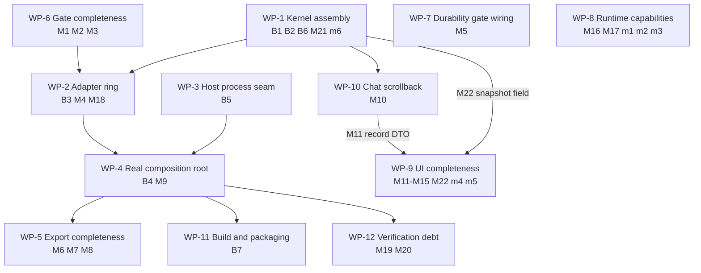

# MVP Gap Closeout — Master Plan

> **For agentic workers:** This is a master closeout plan, not a single executable
> task list. Work packages WP-1, WP-2, WP-5, WP-9 and WP-10 each get their own
> just-in-time detailed plan in `docs/superpowers/plans/`, per the roadmap's
> convention. The remaining packages are executable as written with
> superpowers:subagent-driven-development or superpowers:executing-plans.

**Goal:** Close every confirmed gap between the phase specs/plans and the source
tree so the §11 success criteria become executable: from an empty directory,
`termcraft` opens Home → a prompt creates the project → Claude Code writes page
code → the design host renders it live → a pin round-trips → `Ctrl+E` publishes a
real export package → relaunch reopens the workspace with chat and design intact.

**Architecture:** Phases 0–7 landed as isolated, individually-tested modules.
What is missing is almost entirely *assembly*: `core` has no Kernel that composes
its own machines, no module implements the ~20 `core/ports` contracts, and the
runnable roots that do exist (`main.tsx`, `demo.tsx`) dispatch neither the
`_host` child nor an export CLI while interactive mode still runs the fake
kernel. The closeout therefore runs
inside-out — assemble the Kernel, bind real adapters to its ports, make the roots
dispatch — and only then fills the behavioral leaves (gate lints, UI panels,
runtime capability stubs, export payloads).

**Tech Stack:** TypeScript 7.0.2 on Bun ≥1.3.14, `@opentui/core`+`@opentui/react`
0.4.5, `@reatom/core` ^1001.1.0 + `@reatom/react` ^1001.0.0, `errore` ^0.14.1,
`@anthropic-ai/claude-agent-sdk` ^0.3.212, `react` ^19.2.7, `zod` ^4.4.3.

## Global Constraints

Inherited verbatim from `docs/superpowers/plans/2026-07-17-termcraft-mvp-roadmap.md`
§"Global constraints"; every task below implicitly includes them. The ones this
closeout trips over most often:

- `bun test` and `bun x tsc --noEmit` are green at every task boundary. Baseline
  at the time of writing: 2559+ tests pass, 0 fail; `tsc --noEmit` exits 0.
- **errore is mandatory**: namespace import, errors as values (`Error | T`),
  `createTaggedError` for domain errors, `.catch()`/`errore.try` only at
  boundaries, flat control flow, one-line `instanceof Error` early returns.
- **Reatom v1001 rules**: named atoms/computeds/actions; `wrap(...)` at every
  async boundary; `withAsync`/`withAsyncData` over manual flags; no identity
  setter actions; critical process/transaction lifetimes belong to supervisors,
  not connection hooks.
- **Module DAG** (`docs/architecture/code-structure.md`): `core` imports only
  `entities/` and its own `ports/`; adapters implement core ports and may import
  `core/ports/*` **type-only** to prove conformance (Decision C2) — never the
  reverse; `ui` sees only core boundary types + `PreviewSession`; the composition
  root injects.
- **Module folder shape** (`CLAUDE.md`): `ui/`, `model/`, `types.ts`, `index.ts`;
  never loose files at a module root.
- **Design is the source of truth**: colors/glyphs/layout come from
  `design/termcraft-engine.js` (`pal` / `lightPal()`) and `design/*.dc.html`.
  Never invent a value; document any unavoidable divergence in a code comment.
- **All code, comments, commit messages and docs in English.** (One stub already
  violated this; do not repeat it.)
- Commits are frequent and per task, `feat:`/`fix:`/`docs:`/`test:` prefixed,
  each ending with the Claude co-author trailer.
- Anything in the roadmap's "Out of scope for MVP (do not build)" list stays
  unbuilt: Codex backend, `/model` picker, Git history/Restore/`/commit-*`,
  interactive input forwarding (`F4` inert), Tweaks panel (`F3` inert),
  `Modal`/`Menu`/`Tree`/`Progress`/`Chart`/`Scroll`, light theme, preview
  controls popup, first-run wizard, chat rename/deletion/AI titles, keyboard
  element selection, daemon/IPC.

---

## 1. Audit result

Method: every phase plan and its normative specs were read in full and checked
against the working tree; each claimed gap was then re-judged by an independent
gate agent that tried to prove the feature already exists. 28 raw findings from
the per-phase scan (27 survived), plus 20 from two cross-cutting critics; the
two streams overlap (the critics re-found several per-phase items), and dedup
collapses the 47 survivors into the numbered gaps below. A 2026-07-23 plan
review added M21–M22, corrected the B3 wording and the WP-2 acceptance grep,
removed the phantom WP-1 → WP-3 dependency, and recorded the git-port and
agent-identity decisions inline in WP-1/WP-2/WP-9.

### Verified complete — no gaps found

| Phase | Scope | Notes |
|---|---|---|
| 0 | `entities/`, `infrastructure/` | slug mask, UUIDv7, clock, framing codec — verbatim match, incl. the four fatal framing conditions |
| 2A | host protocol wire layer | strict decode, shape guards, hello/control/frame codecs, fragmented round-trip |
| 2B | host renderer / frame capture | span-based capture, headless streams, `setRawMode` shim, Spike B/D recipe |
| 2C | host session, resolver, queries | three specifiers, source hash + import rescan, one-shot export session |
| 2D | supervisor, transport, broker, restart | handshake, watchdog, backoff, circuit breaker, latest-frame-wins preview |
| 4 (fs) | `SafeProjectFs`, lease, toml, JSONL, sandboxes, migration, projections | incl. pin fold, valid-prefix reader, `ChatIndex` |
| 4 (durability) | transaction engine, trust ledger, recovery | Spike G `GENERIC_WRITE`-alone and Spike F reparse checks present |
| 5 | `agent/` | post-restructure layout, confinement, Job Object cancel, fencing, resume/seed fallback |

### Confirmed gaps

**Blockers — the §8.2/§11 happy path cannot run at all**

| # | Gap | Where | Spec |
|---|---|---|---|
| B1 | `core` has no assembled Kernel and no public entry point — `src/core/index.ts` and `src/core/types.ts` do not exist, `core/kernel/` holds only `model/counters.ts`, and `core/turns`/`core/project` have no `index.ts`. No `createKernel` anywhere. | `src/core/` | kernel-command-contract §5, §14; roadmap interface registry |
| B2 | No composed turn driver: `runAdmission` → `startTurnAttempt` → `freezeTurnCandidate` → `runTurnValidation` (retry ≤4) → `finalizeTurn`/`terminalizeTurn` are never called in sequence outside their own unit tests. | `src/core/turns/` | phase-6 plan slice 6F; turn-durability §7.3 |
| B3 | The adapter ring does not exist: nothing in `store`/`gate`/`host`/`agent` implements any of the ~20 `core/ports` contracts. `AssertConforms` appears only under `src/core/ports/` — its definition in `index.ts`, one use in `agent-backend.ts`, and the fakes. | `store`, `gate`, `host`, `agent` | roadmap "Port-placement note"; code-structure §7 |
| B4 | The composition root runs the test double: `createShell("interactive")` returns `createFakeKernel()` from `ui/testing`, and `bootstrap` refuses interactive mode with `KernelCompositionPendingError`. | `src/entrypoint/model/create-shell.ts:26`, `bootstrap.ts` | design §11 |
| B5 | No `_host` argv dispatch and no `SpawnCommand` builder: `parseHostArgs`/`runHostStdio` exist but are called from nothing; nothing branches `process.execPath` (compiled) vs `bun run` (dev). The design host can never be spawned. | `src/main.tsx`, `src/host/supervisor/` | roadmap phase 8; Spike E |
| B6 | Export publication never writes anything: `publishExport` builds an in-memory intent and flips the state machine; `buildExportPublishTransaction` (already in `store`) has no port and no call site. | `src/core/export/model/publish.ts` | turn-durability §10; design §3.7 |
| B7 | The build embeds nothing: no `--target` pin, no tsc assets via `with { type: "file" }`, no `askedButNotEmbedded === []` cross-check. The Gate's typecheck cannot work in a shipped binary. | `package.json`, `src/gate/model/tsc-extract.ts` | roadmap phase 8; Spike C |

**Major — spec-required behavior missing, the app still runs**

| # | Gap | Where | Spec |
|---|---|---|---|
| M1 | Import-allowlist scan does not reject `eval()` / `new Function()`. | `src/gate/model/import-scan.ts` | design §5.8 |
| M2 | No driving adapter builds a `SmokeRequest` from a page + source and maps `SmokeResult` through the pipeline; `smokeResultToErrors` has no caller. | `src/gate/model/` (no `smoke.ts`) | phase-3 plan T6 |
| M3 | Three of five warning lints are never produced: `dropped-id`, `unpointed-element`, `unlisted-navigation` (only the two determinism lints exist). | `src/gate/model/lints.ts` | design §6.3 step 3 |
| M4 | `SmokeRenderer` has no host-side implementation; `runOneShotSession` takes a `HostSessionSpec` and nothing bridges it. | `src/host/supervisor/` | roadmap interface registry |
| M5 | The `unsupported_durability` volume gate is built but never called from project open/create or lease acquire; `UnsupportedDurabilityError` has zero occurrences. | `src/store/model/factory.ts` | turn-durability §1, §13 |
| M6 | Startup never validates the export pointer (`.termcraft/export/current.json`) — no port exposes it. | `src/core/project/model/open-sequence.ts` | turn-durability §12 step 9 |
| M7 | Every `layout/<slug>.json` in the export package is the literal stub `{}`; the one-shot session returns a frame with no correlated layout reply. | `src/core/export/model/package.ts:113`, `src/host/supervisor/model/one-shot.ts` | design §3.7, §11 |
| M8 | No headless `termcraft export` CLI and no CLI-form trust refusal. | `src/main.tsx` | design §3.7, §9 |
| M9 | No panic-equivalent handler: `process-boundary.ts` registers only SIGINT/SIGTERM and `reportFatal` is two `console.error` calls — an escaping throw leaves raw mode on and the alternate screen active. | `src/entrypoint/model/process-boundary.ts` | design §9 |
| M10 | Chat scrollback has no transport: `ChatReader.loadTail` returns records, but no command result or event kind carries them to `ui`, and `ui/mirror` has no record type — so a relaunch cannot show chat history. | `src/core/protocol/`, `src/ui/mirror/` | design §3.2, §3.9, §11 |
| M11 | The agent's persisted final message is discarded: the mirror captures `finalText` while running, then drops it at the terminal transition; `flattenMarkdownLite` has no production caller. | `src/ui/mirror/model/mirror.ts`, `src/ui/workspace/ui/Workspace.tsx` | design §3.2 |
| M12 | Pins are never listed in the chat panel (they render only as preview badges). | `src/ui/chat/`, `src/ui/workspace/ui/Workspace.tsx` | design §3.2 |
| M13 | The selection / pin-attach composer chip is implemented and unit-tested but the workspace only ever passes the read-only attach line. | `src/ui/workspace/ui/Workspace.tsx:310` | design §3.2 |
| M14 | The export popup cannot be dismissed and `export.failed` is never surfaced anywhere in the UI. | `src/ui/app/ui/App.tsx` | design §3.7 |
| M15 | Home's `r` agent-health re-check is text only — no key handling, no intent, no test; `HOME_HEALTH` is hardcoded present. | `src/ui/home/`, `src/ui/app/model/keymap.ts` | design §3.1, §9 |
| M16 | The runtime facade declares no navigation capability. | `src/runtime/model/capabilities.ts` | runtime-api §6; phase-1 plan T4 |
| M17 | The runtime facade declares no viewport/terminal-color capability. | `src/runtime/model/capabilities.ts` | runtime-api §6; phase-1 plan T4 |
| M18 | `AgentRegistry` has no implementation anywhere outside `core/ports/fakes` — the one port with no near-implementation to adapt. | `src/agent/` | code-structure §8 |
| M19 | No §10 scripted-terminal smoke test; no test crosses more than one module. | `src/` | design §10 |
| M20 | No host determinism test (same page+size+theme → byte-identical frame and layout tree across fresh runs). | `src/host/` | design §10 |
| M21 | The §9 event DTOs still carry `TODO(6C)` structural placeholders, all unblocked since the seven machine factories landed: `kernel.snapshot`'s seven model DTOs are `unknown` (`KernelModelsSnapshotV1Placeholder`), `CapabilityEntryV1Placeholder.target` is `unknown` (§10.1's 43-row table), `KernelStateChangedPayloadV1`'s `action`/`previousTag`/`nextTag` are free text, and `preview.geometryResult`'s `result` is a bare record. (`GitStatusProjectionV1Placeholder` deliberately stays — Git is out of MVP scope.) | `src/core/protocol/model/event-payload.ts` | kernel-command-contract §9, §10.1 |
| M22 | The UI hardcodes the agent identity — the `codex · gpt5.5 · high` composer chip, `role="codex"` records, `● codex` status (55 occurrences across 12 `ui` files) — while MVP ships Claude only and the kernel reports no identity the chip could render. Decision 2026-07-23: the text renders what the data carries; the design frames' literal `codex`/`gpt5.5` strings are sample data, not layout. | `src/ui/chat/`, `src/ui/workspace/`, `src/ui/home/`, `src/ui/app/` | design §3.2; kernel-command-contract §9 |

**Minor**

| # | Gap | Where |
|---|---|---|
| m1 | `withConnectHook` is re-exported with Reatom's raw signature instead of being narrowed to the facade's `ConnectionHookResult`. | `src/runtime/` |
| m2 | No facade contract test proves `withConnectHook` cleanup runs once on disconnect. | `src/runtime/` |
| m3 | The JSX helper contract test does not exercise §3.1 (positional `key`, `Fragment` as a value, dev/prod split). | `src/runtime/` |
| m4 | Chat-list popup rows are not sorted newest-first. | `src/ui/popups/` |
| m5 | Tab-strip overflow indicators (`‹ ›`) are computed and tested but never rendered. | `src/ui/workspace/` |
| m6 | The boundary surface the interface registry names (`core/types.ts`) does not match the subpath imports `ui` actually uses (`core/protocol`, `core/mailbox`, `core/ports`). | `src/core/`, `src/ui/` |

---

## 2. Work packages

Dependency-ordered. Each package ends green (`bun test` + `bun x tsc --noEmit`)
and is independently committable.

WP-3, WP-6, WP-7, WP-8 and the UI-local parts of WP-9 have no dependency on the
Kernel and can start immediately in parallel with WP-1 (the spawn-command builder
and argv dispatch in WP-3 touch nothing the Kernel owns). The two labeled edges
into WP-9 gate only their named gaps, not the whole package.

---

### WP-1 — Assemble the Kernel *(blocker, L — needs its own JIT plan)*

**Closes:** B1, B2, B6, M21, m6.
**Normative:** `docs/superpowers/specs/2026-07-16-kernel-command-contract-design.md`
§5, §9–§10.1, §14; `docs/superpowers/plans/2026-07-21-mvp-phase-6-core.md` slices
6F/6G; `docs/superpowers/specs/2026-07-16-turn-durability-staging-design.md` §7.3,
§10; `docs/superpowers/specs/2026-07-16-host-supervision-protocol-design.md` for
the closed geometry-result shape (M21).

**Files:**
- Create: `src/core/types.ts` — the module's shared boundary types (Command/Result/
  Event DTO re-exports + `KernelDeps`), so the interface registry's
  `core/types.ts` row stops being a fiction (m6).
- Create: `src/core/index.ts` — public entry: `createKernel`, the boundary types,
  and nothing else.
- Create: `src/core/kernel/types.ts` — `KernelDeps` (one field per `core/ports`
  contract **the MVP command set consumes** — `git-history` and `git-committer`
  stay declared for v1.0 but are NOT `KernelDeps` fields: no git command handler
  is registered and the capability projector reports git capabilities
  unavailable, so the production composition root never has to fake them),
  `Kernel` (`dispatch`, `events`, `currentPreview`, `close`).
- Create: `src/core/kernel/model/kernel.ts` — assembles counters, the seven named
  machines, the capability projector + guards, the event bus with a full
  `kernel.snapshot`, the dedupe ledger, the handler registry for every MVP
  command, and the dispatch pipeline.
- Create: `src/core/kernel/index.ts`.
- Create: `src/core/turns/index.ts`, `src/core/project/index.ts` — the two
  submodules missing a public entry.
- Create: `src/core/turns/model/run-turn.ts` — the composed driver: admission →
  attempt loop (≤4 attempts, Gate errors + determinism warnings folded into the
  retry prompt) → candidate freeze → validation → `finalizeTurn` on pass /
  `terminalizeTurn` on exhaustion, cancellation or staleness.
- Create: `src/core/ports/export-publish.ts` — the port wrapping `store`'s
  `buildExportPublishTransaction`, plus its fake under `core/ports/fakes/`.
- Modify: `src/core/export/model/publish.ts` — call the port under the reacquired
  mutex instead of only flipping the state machine (B6).
- Modify: `src/core/protocol/model/event-payload.ts` + its tests — close the
  `TODO(6C)` placeholders (M21): the seven `kernel.snapshot` model DTOs become
  the landed machine factories' tagged unions, `CapabilityEntryV1Placeholder.target`
  becomes `CapabilityTargetByKindV1` (§10.1's 43-row table, owned by
  `core/capabilities`), `KernelStateChangedPayloadV1`'s `action`/`previousTag`/
  `nextTag` become the machines' closed transition unions, and
  `preview.geometryResult`'s `result` takes the closed shape the
  host-supervision-protocol design fixes. Also add the agent-identity field
  (backend id + model label, sourced from the `AgentRegistry` entry) that
  `kernel.snapshot` needs for M22's composer chip.
  `GitStatusProjectionV1Placeholder` deliberately keeps its placeholder and its
  TODO — Git is out of MVP scope.

**Interfaces:**
- Produces: `createKernel(deps: KernelDeps): Kernel`; `runTurn(input, deps)`;
  `ExportPublishPort.publish(plan): Promise<FailureDtoV1 | ExportPublicationV1>`.
- Consumes: every existing `core/ports` type; the seven machine factories; the
  mailbox `Dispatch`/`EventBus`.

**Steps:**
- [ ] Write `docs/superpowers/plans/2026-07-2X-kernel-assembly.md` with
      superpowers:writing-plans (this package is too large for a single task).
- [ ] Execute it task-by-task with superpowers:subagent-driven-development.
- [ ] Gate: an integration test drives `createKernel` with the full fake set
      (every `KernelDeps` field — git ports excluded per the note above) through
      `project.open → chat.create → turn.start → gate retry → finalize →
      export.start → export publish`, asserting the emitted event sequence and
      `stateRevision` monotonicity.

**Acceptance:** `bun test src/core` green; `bun x tsc --noEmit` exit 0; no file
under `src/core` contains a non-English comment.

---

### WP-2 — Build the adapter ring *(blocker, L — needs its own JIT plan)*

**Closes:** B3, M4, M18.
**Normative:** roadmap "Cross-phase interface registry" + "Port-placement note";
`docs/architecture/code-structure.md` §7–§8; `src/core/ports/index.ts` Decision C2.

**Files (one adapter folder per module, never inside `core`):**
- Create: `src/store/adapters/` — `project-store.ts`, `chat-store.ts`,
  `page-store.ts`, `pin-store.ts`, `staging.ts`, `turn-transactions.ts`,
  `project-write.ts`, `trust.ts`, `recovery.ts`, `projections.ts`,
  `session-checkpoint.ts`, `export-publish.ts`, each mapping `store`'s tagged
  errors onto `FailureDtoV1` and each ending with a type-only
  `AssertConforms<Port, typeof impl>` line.
- Create: `src/gate/adapters/gate-runner.ts` — closes over `runGate` +
  `checkManifestSlice`.
- Create: `src/host/adapters/host-supervisor.ts`, `src/host/adapters/export-render.ts`,
  `src/host/adapters/smoke-renderer.ts` — the last one implements gate's
  `SmokeRenderer` over `runOneShotSession` in `smoke` mode (M4).
- Create: `src/agent/adapters/agent-registry.ts` — the one-entry production
  registry over `createProductionClaudeBackend` (M18).
- Modify: each module's `index.ts` to export its adapters (note: `src/host/index.ts`
  currently exports types only).

**Steps:**
- [ ] Write the JIT plan; one task per adapter, TDD against the port's existing
      fake as the behavioral oracle (the fake defines the contract the adapter
      must match).
- [ ] Each task: failing conformance test → adapter → `AssertConforms` line →
      green → commit.
- [ ] Gate: a contract test suite runs the same scenario against fake and real
      adapter pairs where the real one can run offline (store, gate).

**Acceptance:** `grep -rn "AssertConforms" src/store src/gate src/host src/agent
--include=*.ts` shows one hit per adapter file; every port in
`src/core/ports/index.ts` **except `git-history` and `git-committer`** (v1.0,
out of MVP scope — see WP-1's `KernelDeps` note) has exactly one production
implementation.

---

### WP-3 — Wire the host process seam *(blocker, M — independent, can start now)*

**Closes:** B5.
**Normative:** roadmap phase 8; Spike E (`docs/spikes/05-host-respawn/FINDINGS.md`).

**Files:**
- Modify: `src/main.tsx` — argv dispatch, first branch.
- Create: `src/host/supervisor/model/spawn-command.ts` + test — the
  compiled-vs-dev `SpawnCommand` builder.
- Modify: `src/host/supervisor/index.ts` — export it.

**Interfaces:**
- Produces: `createHostSpawnCommand(env: { execPath: string; isCompiled: boolean;
  srcRoot: string }): SpawnCommand`.
- Consumes: `parseHostArgs(argv)` and `runHostStdio(deps)` from
  `src/host/session/model/entry.ts` (already exported via `host/session`).

**Steps:**
- [ ] **Step 1: Write the failing spawn-command test.** Two cases: compiled
      (`isCompiled: true` → `[execPath, "_host", "--stdio"]`) and dev
      (`isCompiled: false` → `[execPath, srcRoot, "_host", "--stdio"]`).
- [ ] **Step 2: Run** `bun test src/host/supervisor/model/spawn-command.test.ts`
      — expect FAIL (module not found).
- [ ] **Step 3: Implement** `createHostSpawnCommand` returning the two shapes;
      no branching logic beyond the flag.
- [ ] **Step 4: Run the test** — expect PASS.
- [ ] **Step 5: Write the failing argv-dispatch test** in
      `src/entrypoints.test.ts`: `parseHostArgs(["exe", "_host", "--stdio"])` is
      true and the interactive bootstrap is not reached.
- [ ] **Step 6: Add the branch to `src/main.tsx`** inside the existing
      `import.meta.main` guard, before `bootstrap(...)`: if `parseHostArgs`
      returns true, `await runHostStdio(...)` and return.
- [ ] **Step 7: Run** `bun test src/entrypoints.test.ts` and
      `bun x tsc --noEmit` — expect PASS / exit 0.
- [ ] **Step 8: Commit** `feat(host): dispatch the _host child and build its spawn command`.

---

### WP-4 — Make the composition root real *(blocker, M)*

**Closes:** B4, M9. **Depends on:** WP-1, WP-2, WP-3.

**Files:**
- Modify: `src/entrypoint/model/create-shell.ts` — `interactiveShell` builds the
  real graph: `createStore(nodeStoreDeps(...))` → store adapters, gate adapter,
  host supervisor adapter, agent registry → `createKernel(deps)` → a `KernelPort`
  over `kernel.dispatch`/`kernel.events`/`kernel.currentPreview`. `demoShell`
  keeps the `ui/testing` fakes; the `ui/testing` import disappears from the
  interactive path.
- Modify: `src/entrypoint/model/bootstrap.ts` — delete `KernelCompositionPendingError`
  and the `--preview-shell` escape hatch.
- Modify: `src/entrypoint/model/process-boundary.ts` — add `uncaughtException` and
  `unhandledRejection` registration and a `restoreTerminal()` teardown (raw mode
  off, mouse capture off, alternate screen exited) run before `reportFatal` (M9).
- Modify: `src/entrypoint/model/run-app.ts` — route escaping failures through it.

**Steps:**
- [ ] **Step 1: Write the failing panic test** — a fake `SignalTarget` +
      renderer double asserts that an `uncaughtException` runs teardown exactly
      once, in order (raw mode → mouse → alt screen), before the failure is printed.
- [ ] **Step 2: Run** `bun test src/entrypoint/model/process-boundary.test.ts` — FAIL.
- [ ] **Step 3: Implement** the two handlers plus idempotent teardown.
- [ ] **Step 4: Run the test** — PASS. **Commit** `fix(entrypoint): restore the terminal on a panic`.
- [ ] **Step 5: Write the failing shell test** — `createShell("interactive", env)`
      returns a port that is not `createFakeKernel()`; `bootstrap("interactive")`
      no longer returns `KernelCompositionPendingError`.
- [ ] **Step 6: Implement** the real graph; keep every adapter injected, never
      constructed inside `ui`.
- [ ] **Step 7: Run** `bun test src/entrypoint` + `bun x tsc --noEmit` — green.
- [ ] **Step 8: Commit** `feat(entrypoint): compose the production kernel`.

**Acceptance:** `grep -rn "ui/testing" src/entrypoint/model/create-shell.ts`
matches only the demo path.

---

### WP-5 — Complete export *(blocker/major, L — needs its own JIT plan)*

**Closes:** M6, M7, M8 (B6 lands in WP-1). **Depends on:** WP-1, WP-4.

**Scope:**
1. **Layout trees (M7).** Extend the one-shot session so a `renderOnce` pass
   returns the correlated layout tree alongside the frame (`layoutTreeOf` already
   exists in `src/host/render/model/geometry.ts` but is reachable only through a
   live preview query). Then replace the `{}` stub in
   `src/core/export/model/package.ts:113` with the real per-size tree and drop the
   "unpopulated in this MVP export" line from `design-prompt.md`. This is the one
   §11 criterion currently unsatisfiable — the package must be implementable
   "without seeing termcraft".
2. **Export-pointer validation (M6).** Add the read side of the export-publish
   port and call it from `validateProjectContents` in
   `src/core/project/model/open-sequence.ts`, per turn-durability §12 step 9.
3. **`termcraft export` CLI (M8).** A third argv branch in `src/main.tsx`: open
   the project headlessly, refuse on an untrusted project with the §3.1 trust
   error (and on a running turn / zero pages), run the size ladder, publish, print
   the resolved package directory. No TUI, no renderer acquisition.

**Acceptance:** a test exports a fixture project to a temp dir and asserts the
package contains non-empty `layout/<slug>.json` for every page at every size;
a second test asserts the CLI refuses an untrusted project with the exact §3.1
message and a non-zero exit code.

---

### WP-6 — Complete the Gate *(major, M — independent, can start now)*

**Closes:** M1, M2, M3.

**Files:**
- Modify: `src/gate/model/import-scan.ts` + test — reject `eval(...)` calls and
  `new Function(...)` constructions as fatal errors (§5.8 names them alongside
  the import allowlist).
- Create: `src/gate/model/smoke.ts` + test — build a `SmokeRequest`
  (`sourcePath`, computed `sourceHash`, `descriptor.meta.minSize` as `size`,
  `descriptor.meta.kitApiVersion`), call the injected `SmokeRenderer.render`, map
  the `SmokeResult` through the existing `smokeResultToErrors`.
- Modify: `src/gate/model/gate.ts` — `GatePorts.smokeRender` is built from a
  `SmokeRenderer`, not a bespoke inline function; extend `GateInput` with
  optional `referencedIds` and `listedSlugs` and thread both into the lint
  stage (absent inputs skip their lint — the gate stays runnable standalone).
- Modify: `src/gate/model/lints.ts` + test — add the three missing lints, each
  scoped exactly as §6.3 step 3 words it:
  - `dropped-id` — "dropped ids that selection or open pins currently
    reference": the caller (the kernel's turn driver) supplies `referencedIds`;
    extract the candidate's id set with the existing lexer (string literal
    bound to an `id` attribute/property) and warn per referenced id absent from
    it. The lint does NOT need the whole prior source — the in-code comment at
    `lints.ts:19-21` overstates the input ("the prior iteration's ids"); update
    that comment in the same commit.
  - `unpointed-element` — "pointable raw elements without ids" (§5.2's escape
    hatch: "the Gate reminds, not rejects"): a minimal JSX open-tag scan on the
    existing token stream (tag start → props until `>`/`/>`), warning for
    low-level/raw visible elements lacking an `id` prop. Kit components are
    exempt — their ids are enforced by the page contract and the smoke render's
    duplicate check.
  - `unlisted-navigation` — "navigation to unlisted pages": `listedSlugs` comes
    from the staged manifest slice (`checkManifestSlice` already parses it);
    scan for the runtime navigation API of runtime-api §6 targeting a slug
    outside the list. The API *name* is fixed by the spec — write the lint
    against it, do not wait for WP-8's implementation.

**Steps (per lint / per check):**
- [ ] Write the hostile fixture and its failing test.
- [ ] Run `bun test src/gate` — expect FAIL on the new case only.
- [ ] Implement the branch.
- [ ] Run `bun test src/gate` — expect PASS (63+ existing tests stay green).
- [ ] Commit one `feat(gate):` per check.

---

### WP-7 — Wire the durability volume gate *(major, S — independent)*

**Closes:** M5.

**Files:**
- Modify: `src/store/model/factory.ts` — `openProject`/`createProject` call
  `assertDurableVolume` on the project volume and compose it with a real
  `flushDir` probe against the project's own transaction directory (Spike G /
  phase-4 T4: `GetDriveTypeW` rejects `DRIVE_REMOTE`, then a real flush probe maps
  `ERROR_INVALID_FUNCTION` → `UnsupportedDurabilityError`).
- Create: `src/infrastructure/durability/model/probe.ts` + test —
  `probeDurability(absDir): UnsupportedDurabilityError | void`, and the
  `UnsupportedDurabilityError` tagged error itself (defined here and exported
  via `infrastructure/durability` — today the class exists nowhere in `src`).
- Modify: `src/store/types.ts` — add the `unsupported_durability` branch to the
  open/create result unions.

**Steps:**
- [ ] Write the failing probe test (a fake `kernel32` seam returning
      `ERROR_INVALID_FUNCTION` → `UnsupportedDurabilityError`).
- [ ] Run `bun test src/infrastructure/durability` — FAIL.
- [ ] Implement `probeDurability`; run — PASS; commit.
- [ ] Write the failing factory test: opening a project on a rejected volume
      returns `unsupported_durability` and performs no mutation.
- [ ] Implement the call site; run `bun test src/store` — PASS; commit.

---

### WP-8 — Complete the runtime facade *(major, S — independent)*

**Closes:** M16, M17, m1, m2, m3.

**Files:**
- Modify: `src/runtime/model/capabilities.ts` + test — add the dormant
  `navigation` capability (named actions emitting page-navigation requests;
  missing targets stay no-ops with the quiet notice, runtime-api §6) and the
  dormant `viewport`/terminal-color capability (reactive size + color-capability
  values, host-supplied, fixed MVP defaults).
- Modify: `src/runtime/index.ts` — export both; narrow the `withConnectHook`
  re-export to `ConnectionHookResult` (m1).
- Modify/Create: facade contract tests for cleanup-runs-once (m2) and the §3.1
  JSX helper contract — positional `key`, `Fragment` as a value, dev/prod split (m3).

**Steps:** one TDD cycle per capability; commit `feat(runtime):` per capability
and `test(runtime):` per contract test.

---

### WP-9 — Complete the UI *(major, M — needs its own JIT plan; UI-local parts can start now, M11 waits for WP-10's DTO and M22 for WP-1's snapshot field)*

**Closes:** M11, M12, M13, M14, M15, M22, m4, m5.

**Files:**
- Modify: `src/ui/mirror/types.ts` + `model/mirror.ts` — carry `finalText`/
  `errorText` into the terminal `TurnMirror` variant instead of dropping them.
- Modify: `src/ui/workspace/ui/Workspace.tsx` — render the final message through
  `flattenMarkdownLite` (M11); pass `pins` to the chat column (M12); derive the
  `attach` value from `mirror.selection()` / `mirror.pinsByPage()` instead of only
  the read-only branch (M13); render the computed `‹ ›` tab-strip overflow
  indicators (m5).
- Create: `src/ui/chat/ui/PinList.tsx` + test — numbered rows matching the
  preview badges, with the "not visible in the current render (hidden or removed)"
  marker for pins whose anchor does not resolve (design §3.2, exact copy).
- Modify: `src/ui/app/ui/App.tsx` + `src/ui/app/model/intent.ts` — make the export
  popup dismissible (`⏎ ok`) through the overlay/Esc machinery and surface
  `exportState.phase === "failed"` naming page, size and error (M14).
- Modify: `src/ui/home/`, `src/ui/app/model/keymap.ts`, `intent.ts` — handle `r`
  on the Home error screen and stop hardcoding `HOME_HEALTH` (M15).
- Modify: `src/ui/popups/` — sort chat rows newest-first (m4).
- Modify: `src/ui/chat/ui/Composer.tsx`, `ChatRecord.tsx`, `AgentStatusBlock.tsx`,
  `src/ui/home/`, `src/ui/workspace/ui/Workspace.tsx` — replace every hardcoded
  `codex`/`gpt5.5` identity string with the agent identity carried by the kernel
  snapshot (M22; the field lands with WP-1's M21 closure). Glyphs, placement and
  colors stay design-sourced; only the identity text becomes data-driven. Where a
  binding replaces a literal, add the divergence-from-frames comment: the frames'
  `codex · gpt5.5` strings are sample data, not layout (user decision 2026-07-23).

**Constraint:** every glyph, color and string comes from the matching
`design/*.dc.html` screen and `design/termcraft-engine.js` (agent-identity text
excepted per M22); read the design source
before writing each component. Snapshot tests wrap Reatom writes in `act()` from
`'react'` (Spike D) or frames silently never change.

**Steps:**
- [ ] Write `docs/superpowers/plans/2026-07-2X-ui-completion.md` with
      superpowers:writing-plans — one task per gap, each task's first step
      reading its `design/*.dc.html` screen.
- [ ] Execute it task-by-task with superpowers:subagent-driven-development;
      schedule the M11 task after WP-10's DTO lands and the M22 task after
      WP-1's snapshot field lands.

---

### WP-10 — Give chat history a transport *(major, M — needs its own JIT plan)*

**Closes:** M10. **Depends on:** WP-1.

`ChatReader.loadTail` already returns records, but nothing carries them across the
UI↔Kernel seam: `EVENT_KINDS_V1` has no message/record kind and `ui/mirror` has no
record type — so §11's "reopens the Workspace with chat and design intact" fails
on the chat half. Also fixes the chat display name, which today shows
`chatId.slice(0, 8)` because `ChatSummaryV1` carries no title field.

**Files:**
- Modify: `src/core/protocol/model/` — extend the chat load result DTO (or add the
  event kind, whichever the kernel-command-contract's closed-union rules allow;
  the union counts are asserted by existing tests, so update them deliberately in
  the same commit) with the record page and a derived chat display name.
- Modify: `src/core/chats/` — serve the tail through the command result.
- Modify: `src/ui/mirror/` + `src/ui/chat/` — hold and render the persisted
  records in markdown-lite, above the ephemeral block.

**Steps:**
- [ ] Write the JIT plan; its first task settles the open DTO-vs-event-kind
      choice against the kernel-command-contract's closed-union rules and
      records the decision in the plan before any code task starts.
- [ ] Execute task-by-task; any union change updates the union-count
      assertions deliberately in the same commit.

---

### WP-11 — Real Windows build *(blocker, M)*

**Closes:** B7. **Depends on:** WP-4.

**Files:**
- Modify: `package.json` — `build` pins `--target=bun-windows-x64` and the output
  path; add a `build:check` script running the cross-check.
- Create: `scripts/embed-assets.ts` (or a build entry module) — embed `tsc.exe`
  plus the curated 88-file `lib` chain with `with { type: "file" }` and pass the
  resulting `assetDir` to `materializeCompiler`.
- Create: `scripts/lib-cross-check.ts` + test — assert `askedButNotEmbedded === []`
  (Spike C: otherwise the compiled binary hits the `noembed` startup panic).

**Acceptance:** `bun run build` produces `dist/termcraft.exe`; the cross-check
exits non-zero when a lib file is asked for but not embedded; the built binary
runs the Gate typecheck on a fixture page.

---

### WP-12 — Pay the verification debt *(major, M)*

**Closes:** M19, M20. **Depends on:** WP-4 (smoke) — determinism is independent.

**Files:**
- Create: `src/host/render/model/determinism.test.ts` — render the same page at
  the same size and theme in two independently spawned host sessions; assert
  byte-identical frame output and layout tree (M20; the phase-2D plan downgraded
  this to a scaffold and phase 4 landed the render cache without picking it back up).
- Create: `src/entrypoint/model/smoke.test.ts` (inside the module that owns the
  composed app — never a loose file at the `src` root) — drive the
  composed app on a scripted terminal with injected events through the §10 chain:
  open project → prompt → fake agent edits staging → gate → render → export (M19).

**Constraint (Spike D):** a one-shot render child must call `process.exit()`
explicitly or the test hangs.

---

## 3. Closing the phase

- [ ] Run the §11 manual walkthrough with the real Claude CLI from an empty
      directory and record the result in the plan.
- [ ] Run the architecture-docs Source-anchor sweep (architecture-update skill):
      every `docs/architecture/` anchor points at a real source file, and the
      known-divergence notes for the layout stub, the missing navigation API and
      the deferred adapter graph are removed once their packages land.
- [ ] `bun test`, `bun x tsc --noEmit`, `bun run lint`, `bun run fmt:check` all
      green; `git diff --check` clean.
