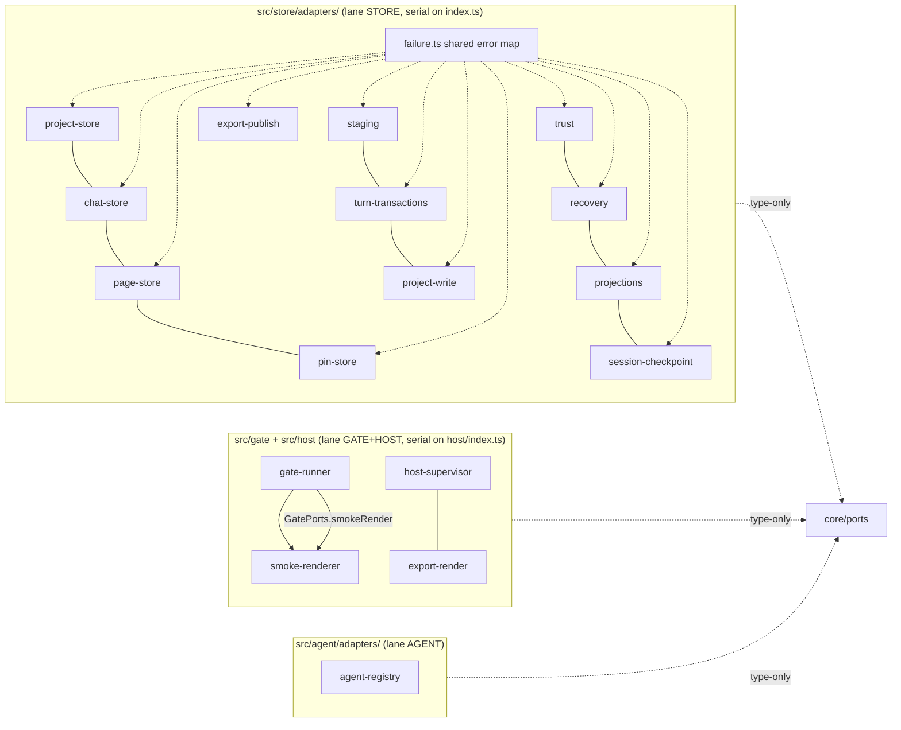

# Adapter Ring Implementation Plan (WP-2)

> **For agentic workers:** REQUIRED SUB-SKILL: Use superpowers:subagent-driven-development
> to implement this plan task-by-task. Steps use checkbox (`- [ ]`) syntax for
> tracking. Load `/reatom` and `/errore` before any code (CLAUDE.md mandate). The
> store, gate+host, and agent lanes touch disjoint modules and run in parallel
> worktrees (using-git-worktrees); serialize only where a shared `index.ts` says so.

**Goal:** Build the production adapter ring — one adapter per `core/ports` contract
in the module that owns the real implementation, so a real `KernelDeps` can be
composed in WP-4. Each adapter maps its module's tagged errors onto `FailureDtoV1`,
proves conformance with a compile-time `AssertConforms` line, and is TDD'd against
its port's existing `core/ports/fakes` double as the behavioral oracle. Closes B3
(the ring itself), M4 (`SmokeRenderer` over `runOneShotSession`), and M18
(`AgentRegistry` over `createProductionClaudeBackend`).

**Architecture:** The ports and their in-memory fakes already exist and are frozen
(kernel-assembly WP-1 landed them, and the ports *grew* during WP-1 —
`readManifestSnapshot`, `readAppendBase`, `readCandidateFile`, `findPageForPin`,
`readEvents`, `ExportPublishPort`). The real implementations they wrap also all
exist: `store`'s `OpenProject` aggregate (`store/types.ts:447-475`), `gate`'s
`runGate`/`checkManifestSlice`, `host`'s `createHostSupervisor`/`runOneShotSession`/
`createExportPool`, and `agent`'s `createProductionClaudeBackend`. This package is
therefore pure boundary-mapping: each adapter takes the real object at construction
time and re-expresses its members as the narrow, `FailureDtoV1`-returning port
`core` declared. No adapter reimplements domain logic; it translates shapes and
errors. Per decision C2 (`core/ports/index.ts:13`) an adapter may import
`core/ports/*` **type-only** to prove conformance — never the reverse; nothing under
`core/` imports back.

**Tech Stack:** TypeScript 7.0.2 on Bun ≥1.3.14, `@reatom/core` ^1001.1.0,
`errore` ^0.14.1, `zod` ^4.4.3. Adapters are plain factories returning port objects —
no Reatom atoms live in an adapter (state belongs to the wrapped `store`/`host`
object), so `wrap(...)` appears only where an adapter awaits a wrapped promise inside
a Reatom-owned frame the caller supplies; adapters themselves construct no frame.

## Global Constraints

Inherited verbatim from `.superpowers/sdd/closeout-global-constraints.md`; the ones
this package trips over most:

- `bun test`, `bun x tsc --noEmit`, `bun run fmt:check`, `bun run lint` all green at
  every task boundary. Baseline at planning time: 3088 pass / 0 fail, tsc exit 0.
  (`bun test` has pre-existing stderr noise from the type-check and agent
  process-tree suites — do not chase it, add none.)
- **errore mandatory**: namespace import (`import * as errore from "errore"`), errors
  as values (`Error | T`), `createTaggedError` for any new domain error, `.catch()`/
  `errore.try` only at uncontrolled boundaries, flat control flow, one-line
  `instanceof Error` early returns, always pass `cause`. NO `as unknown as` or any
  type-laundering cast — read the real declaration and use it; the user calls the
  cast heresy. The one legitimate boundary shape here: store/gate/host return their
  own tagged errors, and the adapter maps them to `FailureDtoV1` values (see Task 1's
  mapping table) — never re-throws.
- **Module DAG** (`docs/architecture/code-structure.md` §7, §11): an adapter lives in
  the module that owns the real implementation (`store`/`gate`/`host`/`agent`), never
  inside `core`. It imports `core/ports/*` **type-only** (decision C2,
  `core/ports/index.ts:13`) to name the port and write `AssertConforms`; it imports
  its own module's submodules with relative paths (`../types`, `../model/…`) or the
  module's own alias, never another top-level module's internals. Forbidden shapes
  (§11): `core` importing an adapter; a shared `contracts/` folder; `ui` importing
  `store`/`host`.
- **`AssertConforms` is the conformance proof** (`core/ports/index.ts:181-198`): a
  zero-runtime type — `export type AssertConforms<Port, Impl extends Port> = Impl`.
  Each adapter file ends with exactly one `type _Conforms = AssertConforms<Port,
  ReturnType<typeof createXxxAdapter>>` line. It is observable only by
  `bun x tsc --noEmit`, never by `bun test`. Files implementing two disjoint port
  facets assert against their **intersection** in one line (e.g. `ChatReader &
  ChatMutations`); the projections file asserts against a local composite record (see
  Task 3).
- **Module folder shape** (`CLAUDE.md`): each adapter folder is `src/<module>/adapters/`,
  a `model/`-equivalent presentation-free layer of the module; files sit directly in
  `adapters/`. Each module's `index.ts` exports its adapter factories (note:
  `src/host/index.ts` currently exports **types only** — the host tasks add value
  exports).
- **Design is the source of truth**: not applicable to this package (no UI/token
  code) except the smoke/export session defaults, which come from the host session
  spec, never invented.
- **All code, comments, commit messages and docs in English.**
- Commits: frequent, per task (split large tasks by adapter), `feat:`/`fix:`/`test:`
  prefixed, each ending with `Co-Authored-By: Claude Fable 5 <noreply@anthropic.com>`.
  Use the `rtk` prefix for git.
- **Out of MVP scope** stays unbuilt: `git-history` and `git-committer` get **no**
  production adapter (WP-1 excluded them from `KernelDeps`; `core/ports/index.ts:161`
  marks them "declared only — no MVP implementation"). Their fakes stay; the WP-2
  acceptance grep excludes them explicitly.

---

## Reference map

Every anchor below was read during planning and is the authoritative source for the
signature each task names.

**Ports (what each adapter must satisfy) — `src/core/ports/`**
- `index.ts:19-179` — the whole exported port surface; `AssertConforms`
  (`index.ts:181-198`); decision C1/C2 headers (`index.ts:7-16`).
- `project-store.ts:117-146` — `ProjectStore` (incl. `readManifestSnapshot:131`,
  `writeWorkspaceState:143`, `readManifest`, `readWorkspaceState`, `close`).
- `chat-store.ts:60-98` — `ChatReader` (`open`, `readAppendBase:90`) + `ChatMutations`
  (`create:95`, `switchActive:97`); `ChatHandleV1.loadTail/loadBefore:52-57`.
- `page-store.ts:30-43` — `PageReader` (`readSource`, `listSlugs`) + `PageMutations`
  (`renameTitle`, `reorder`, `remove`).
- `pin-store.ts:31-60` — `PinReader` (`fold`, `readEvents:42`, `findPageForPin:54`) +
  `PinMutations` (`appendStandaloneEvent:59`).
- `staging.ts:92-115` — `StagingService` (`createTurnWorkspace`,
  `snapshotToCandidate`, `retireWorkspace`, `readCandidateFile:114`).
- `turn-transactions.ts:123-137` — `TurnTransactionService` (`admit`, `finalize:134`,
  `terminalize`); `FailureDtoV1.code` for CAS: `APPLY_SOURCE_CHANGED`/`APPLY_STALE`
  with `details.part` (`turn-transactions.ts:129-132`).
- `project-write.ts:31-38` — `ProjectWriteCoordinator` (`acquire`/`release`/`isActive`);
  `ProjectWritePermit:19-21`.
- `export-publish.ts:65-90` — `ExportPublishPort.publish(plan)`, `ExportPublishPlanV1`
  (`operations`/`payloads`/`generationId`/`createdAt`), `ExportPublicationV1`;
  the "reacquired internally" claim (`export-publish.ts:24-27`) — see Design Q1.
- `trust.ts:38-48` — `TrustGate` (`buildSubject`, `isGranted`, `grant`).
- `recovery.ts:41-50` — `RecoveryService` (`recover`, `classify`, `hasIntentRecord`,
  `scanOrphanTurns`).
- `projections.ts:34-87` — `PageMetaCache`, `DiagnosticsCache`, `RenderCache` (three
  `get`/`put` pairs, incompatible signatures → composite AssertConforms).
- `session-checkpoint.ts:33-52` — `SessionCheckpointService` (`evaluateResume`,
  `selectSeed`, `advanceCheckpoint`); `ResumeVerdictV1:29-31`.
- `gate-runner.ts:69-81` — `GateRunner` (`runManifestSlice`, `runPage`);
  `GateRunResultV1:51-56`, `ManifestSliceResultV1:64-67`.
- `preview-session.ts:93-116` — `PreviewSession` (produced by the host-supervisor
  adapter's `preview()`, not a standalone file).
- `host-supervisor.ts:58-65` — `HostSupervisorPort` (`preview(spec):
  Promise<FailureDtoV1 | PreviewSession>`, `liveCount`, `stopAll`, `onEvent`);
  `HostSessionSpecV1:30-40`.
- `export-render.ts:52-57` — `ExportRenderPort` (`poolBounds`, `runtimeDeclaration`,
  `renderOne`).
- `agent-registry.ts:22-27` — `AgentRegistry` (`list`, `get`);
  `agent-backend.ts:153-164` — `AgentBackend`.
- `failure.ts:107-112` — `FailureDtoV1` shape; `OPERATIONAL_FAILURE_CODES_V1:10-41`
  the closed 30-code registry; `APPLY_SOURCE_CHANGED`/`APPLY_STALE` typed `part`
  (`failure.ts:114-142`).

**Fakes (the oracle each adapter's contract test runs against) — `src/core/ports/fakes/`**
- `index.ts:27-128` — every fake's factory + `calls` log + programmable failure.
- `gate-runner.ts:26-71` — `createFakeGateRunner`; default `runPage` result
  (`fakes/gate-runner.ts:57-66`) and default `runManifestSlice` (`:46`) are the exact
  pass-shapes the real adapter must reproduce for an all-clear candidate.
- `agent-registry.ts:21-39` — `createFakeAgentRegistry`, keyed by
  `capabilities().backendId` — the real registry keys the same way.
- Each store fake (`project-store.ts`, `chat-store.ts`, …) exposes a
  `<Name>FailableMethod` union + `failNext(method, dto)` — the contract test drives
  the same scenario through fake and real and asserts equal disposition.

**Real implementations the adapters wrap**
- `store/index.ts:84-116` — `createStore`, `nodeStoreDeps`, `toTxOutcome`,
  `snapshotToCandidate`, and the session helpers (`evaluateSessionResume`,
  `selectSeedRecords`, `advanceSessionCheckpoint`, `computeSessionPrefixHash`).
- `store/types.ts:447-475` — the `OpenProject` aggregate: `root`, `lease`, `safeFs`,
  `recovery`, `orphanTurns`, `transactions` (`TransactionEngine`), `writeMutex`
  (`store/types.ts:462`, the SAME `WriteMutex` the engine uses — never a second one),
  `manifest`, `workspaceState`, `chats`, `pins`, `pages`, `trust`, `projections`,
  `staging`, `backups`, `migrations`, `close`.
- `store/types.ts:320-352` — `TransactionEngine` named methods (`createChat`,
  `setActiveChat`, `setActivePage`, `renamePageTitle`, `reorderPages`, `removePage`,
  `appendPinEvent`, `setWorkspaceLocal`, `advanceSessionCheckpoint`, `admitTurn`,
  `finalizeTurn`, `terminalizeTurn`, `recover`), each `Omit<…, "mutex" | "permit">`
  and internally permit-managed. Their `*Input` shapes carry
  `transactionId`/`actionId`/`createdAt` the adapter must mint
  (`store/types.ts:236-313`).
- `store/safe-fs/model/candidate.ts:371` — `snapshotToCandidate(input)`;
  `CandidateDeps:61`, `CandidateFile:72`, `CandidateSnapshot:79`.
- `store/jsonl/model/checkpoint.ts` — `computeSessionPrefixHash:67`,
  `advanceSessionCheckpoint:110`, `selectSeedRecords:151`, `evaluateSessionResume:193`.
- `store/transaction/model/wrappers.ts:1052-1085` — `ExportPublishInput`
  (`mutex:1053`, `permit:1054`, `operations`, `payloads`, `createdAt`,
  `precondition?:1062`) + `buildExportPublishTransaction:1066`.
- `store/transaction/model/engine.ts:806` — `runTransaction(deps, input)`;
  `assertActivePermit(input.mutex, input.permit)` at `:690`, `:749`, `:814`
  (**never acquires** — it trusts and re-checks the caller's active permit).
- `store/model/factory.ts:172` `nodeStoreDeps`, `:186` `toTxOutcome`, `:1369`
  `createStore`.
- `gate/model/gate.ts:59` — `runGate(input, ports)`; `GatePorts:22-32`
  (`typeCheck?`, `checkManifest?`, `smokeRender?`); `GateInput:40-48`.
- `gate/model/smoke.ts:28` — `createSmokeRender(renderer, sourcePath)` builds the
  `smokeRender` port function from a `SmokeRenderer`.
- `gate/index.ts:23-30` — `checkManifestSlice`, `runGate`, `createTypeChecker`,
  `createSmokeRender`, `materializeCompiler` all public.
- `gate/ports/smoke-renderer.ts:33-45` — `SmokeRenderer` (gate DECLARES it, host
  IMPLEMENTS it — M4), `SmokeRequest:10-16`, `SmokeResult:23-25`, `smokeResultToErrors`.
- `host/supervisor/index.ts:35-37` — `createHostSupervisor`, `runOneShotSession`,
  `createExportPool`, `resolveExportWorkerCount`.
- `host/supervisor/model/supervisor.ts:57` — `createHostSupervisor(deps):
  HostSupervisor`; `HostSupervisorDeps:363-382`.
- `host/supervisor/types.ts:441-446` — `HostSupervisor.preview(spec):
  SupervisedPreviewSession | SupervisorError` (**sync** on the real side — the port's
  `preview` is `Promise`-typed, see Task 5); `SupervisedPreviewSession:357-360`
  extends `PreviewSession:175-190`; `ExportPool:431-433`; `OneShotResult:402-408`;
  `HostSessionSpec`/`SpawnCommand:20-23`/`SpawnFn:48`/`OneShotDeps:385-393`.
- `host/supervisor/model/one-shot.ts:36` — `runOneShotSession(spec, deps):
  Promise<ProtocolError | SupervisorError | OneShotResult>`; refuses non-smoke/export
  (`:40-45`).
- `host/protocol/model/embedded-declaration.ts` — `EMBEDDED_RUNTIME_DECLARATION` /
  `SUPPORTED_KIT_API_VERSIONS` (the one runtime-declaration bundle every host session
  needs; `code-structure.md:490`).
- `agent/index.ts:26` — `createProductionClaudeBackend`;
  `agent/claude/index.ts:53` — `createProductionClaudeBackend(): AgentBackend`,
  `:43` `createProductionClaudeBackendDeps(): ClaudeBackendDeps`.
- `agent/types.ts:337` (per `code-structure.md:337`) — the `AgentBackend` port the
  production backend already satisfies; `core/ports/agent-backend.ts:3-29` states the
  conformance line belongs in `agent/` (e.g. `agent/types.test.ts`), not `core/`.

**Carried notes from the WP-1 record (`.superpowers/sdd/progress.md`)**
- `:960-962` — reviewer note FOR WP-2: the export-publish adapter needs the source
  read-set for the re-CAS "through a channel besides publish(plan)". See Design Q1 —
  after reading the landed code, the read-set is NOT the missing channel; the permit
  is.
- `:1169`, `:1212` — `workspaceIdentity` has no durable `core/ports` source
  (payload-only on `project.create`/`setTrust`). See Design Q2.
- `:1174-1175` — `fakes/staging.ts` lays pages as `pages/<slug>/index.tsx` while the
  real store lays `pages/<slug>.tsx` — a fake-fidelity gap to fix while building the
  staging adapter (Task 2).

---

## Design questions the implementer must NOT guess

### Q1 — The export-publish permit channel (NOT the source read-set)

**Finding (grounded in the landed code, not a guess):**
`publishExport` (`core/export/model/publish.ts:129-181`) acquires the
`ProjectWriteCoordinator` permit and **holds it across** the
`exportPublish.publish(plan)` call (`:179`), releasing only after (`:181`) — this is
required by kernel-command-contract §12.5 (revalidate-then-intent under **one** held
permit; publish.ts:34-53). Meanwhile `buildExportPublishTransaction`
(`wrappers.ts:1066`) **requires** an active `{ mutex, permit }` in its input, and
`runTransaction` (`engine.ts:806`) **never acquires** — it `assertActivePermit`s and
re-checks the passed permit at every step (`engine.ts:690`, `:749`, `:814`).

Therefore the port header's claim that "the real adapter … reacquired internally —
never a second one" (`export-publish.ts:24-27`) **cannot hold for the landed engine**:
if the adapter reacquired the same `WriteMutex`, it would FIFO-block behind the permit
`publishExport` is still holding — a self-deadlock. The genuinely missing channel is
the **live permit**, and `publish(plan)` carries neither the permit nor the mutex.

The WP-1 reviewer's hedge (progress:960-962) named the *source read-set* as the
missing channel; after reading `publish.ts:142-159`, the **source** re-CAS is already
performed by `publishExport` itself (live `PageReader.readSource` hash compare under
the held permit). `buildExportPublishTransaction`'s own `precondition`
(`wrappers.ts:1061-1062`) re-CASes the **export-output** files, whose expected images
are the `oldImage` on each `plan.operations` entry (`export-publish.ts:48-57`) — data
the plan already carries. So **no additive source-read-set field is needed.**

**Recommended resolution (confirm with the maintainer before touching the port):**
1. Land the adapter **now** as a thin pass-through: `plan.operations`/`plan.payloads`
   are empty until WP-5 (publish.ts:167-177), so the `precondition` built from
   `plan.operations[].oldImage` is trivially satisfiable and there is nothing to CAS
   yet. Map `buildExportPublishTransaction`'s `CommittedMarker` →
   `ExportPublicationV1` (mint `transactionId` via `uuidv7`); map its `Error` →
   `EXPORT_PUBLICATION_FAILED`, and a precondition-stale `Error` →
   `EXPORT_SNAPSHOT_STALE` (publish.ts:183-187 already routes those two codes).
2. Thread the permit. Preferred: construct the `ProjectWriteCoordinator` adapter
   (Task 2) and the `ExportPublishPort` adapter (Task 1's lane, Task 4 file) over the
   **same** `OpenProject.writeMutex`, and have `acquire()` return the **real store**
   `ProjectWritePermit` (structurally `{ permitId }`, so it satisfies core's
   `ProjectWritePermit` without a wrapper). Then the export-publish adapter, holding
   that same `WriteMutex`, passes the mutex's currently-active permit straight into
   `buildExportPublishTransaction`. **Verify the store `WriteMutex` exposes the active
   permit** (an `isActive`/current-holder accessor); if it does not, the fallback is a
   maintainer-approved additive-V1 change — carry the active `ProjectWritePermit` on
   the `publish` call — NOT a second mutex (blocker B2, forbidden).
3. Do **not** release-before-publish in `publishExport` to dodge this — that reopens
   the §12.5 atomicity window and is a spec regression.

This is a WP-1↔WP-2 seam contradiction to reconcile deliberately (flag it to the
maintainer at the start of Task 4), not to paper over. Until it is reconciled, the
export-publish adapter is correct as a pass-through but is not yet load-bearing —
which is fine, because its only caller (`export.start`) also carries empty operations
until WP-5.

### Q2 — `workspaceIdentity`'s durable source

**Finding:** `AgentBackend.sessionScope(input)` (`agent-backend.ts:143-147, 163`)
takes `SessionScopeInput.workspaceIdentity` — "the backend workspace discriminator
(turn-durability §6.3 item 4)" — and WP-1 flagged it as having no durable
`core/ports` source (progress:1169). The `SessionScopeInput` is assembled by the
kernel's turn handler, not by an adapter.

**Recommendation:** it **can** be supplied — no new adapter method is needed.
`ProjectManifestV1.projectId` (`project-store.ts:39`, already returned by
`ProjectStore.readManifest()`) is a durable, project-stable, effort-independent
discriminator that lives in `project.toml`. WP-2 therefore closes the "no durable
source" flag by confirming the existing `ProjectStore.readManifest()` already carries
it; the remaining work is **wiring** — the kernel turn handler reading
`readManifest().projectId` into `SessionScopeInput.workspaceIdentity` — which is
`core`/WP-4 code outside WP-2's adapter-only file scope. Downgrade the flag from "no
source" to "unwired; source exists on `ProjectStore`". Do **not** invent a new port
method for it, and do **not** source it from the per-turn staging workspace path (that
changes every turn and would break scope stability §6.2). If the maintainer decides a
machine-local physical-workspace discriminator (canonical root path / fs-identity) is
required instead of the portable `projectId`, that is a one-line change to the same
`ProjectStore` adapter — flag it, don't guess.

---

## Task 1 — Store lane, part 1: shared error map + project/chat/page/pin adapters

Establishes the store adapter conventions (the shared `FailureDtoV1` mapper, the
`{ open, uuidv7, clock }` deps bundle) and lands the four read/write facades that map
directly onto `OpenProject` members. **Runs first in the STORE lane** because Tasks
2-4 import `failure.ts`.

**Files (all new under `src/store/adapters/`):**
- Create `failure.ts` — `toFailureDto(error: Error): FailureDtoV1`, the one mapper
  every store adapter uses. Map each store tagged error to a closed code
  (`OPERATIONAL_FAILURE_CODES_V1`, `failure.ts:10-41`), with a bounded,
  path-free `safeMessage` and correct `retryable`:

  | store error (`store/types.ts` imports) | `FailureDtoV1.code` | notes |
  |---|---|---|
  | `SafeFsError`, `JsonlOpenError`, `JournalCorruptError`, `ManifestCorruptError`, `LeaseError`, `TrustError`, `StagingError` | `PERSISTENCE_FAILED` | generic durable-read/write fault |
  | `StorageLimitExceededError`, `ProjectionsError` (quota) | `RESOURCE_LIMIT_EXCEEDED` | |
  | `SourceChangedError` | `APPLY_SOURCE_CHANGED` | set `details.part` from the error's own field — read the class; `part ∈ {"page","manifest"}` (`failure.ts:114-125`) — do NOT guess |
  | `StaleError` | `APPLY_STALE` | `details.part ∈ {"chat","pins"}` from the error (`failure.ts:126-129`) |
  | `TransactionRecoveryConflictError` | `TRANSACTION_RECOVERY_CONFLICT` | |
  | `TransactionIoPendingError` | `PERSISTENCE_FAILED` | `retryable: true` |
  | `MigrationStaleError` | `MIGRATION_STALE` | |
  | `MigrationBackupFailedError` | `MIGRATION_BACKUP_FAILED` | |
  | `ManifestTooNewError` | `PERSISTENCE_FAILED` | **flag:** candidate for `MIGRATION_STALE`; confirm the §11.2 semantic before finalizing |

  `toFailureDto` narrows with `instanceof` per class and returns a `PERSISTENCE_FAILED`
  fallback for an unclassified `Error` (log via `console.warn` per errore rule 21 —
  an unmapped store error at this boundary is a bug to surface, not swallow). This is
  a non-adapter helper: **no `AssertConforms` line.**
- Create `types.ts` — the shared `StoreAdapterDeps = { open: OpenProject; uuidv7: ()
  => string; clock: Clock }` bundle (adapters that call permit-managed
  `TransactionEngine` methods mint `transactionId`/`actionId` via `uuidv7` and
  `createdAt` via `clock.now().toISOString()` — `store/types.ts:236-313`).
- Create `project-store.ts` — `createProjectStoreAdapter(deps: StoreAdapterDeps):
  ProjectStore`. Maps: `root`→`open.root`; `lease`→`{ root: open.lease.root }`
  (`ProjectLeaseIdentityV1`, hides OS internals); `readManifest`→`open.manifest.read()`
  mapped to `ProjectManifestV1`; `readManifestSnapshot`→ read `project.toml`'s own
  bytes via `open.safeFs` and return `{ sha256, size }` (`ReadSetFileSnapshotV1`) —
  the port header (`project-store.ts:121-130`) fixes this reads-raw-bytes contract;
  `readWorkspaceState`→`open.workspaceState.read()` mapped to `WorkspaceStateReadV1`
  (preserve `{state, missing, corrupt}`); `writeWorkspaceState(patch)`→
  `open.transactions.setWorkspaceLocal({ transactionId, actionId, patch, createdAt })`;
  `close`→`open.close()`. Ends with `type _Conforms = AssertConforms<ProjectStore,
  ReturnType<typeof createProjectStoreAdapter>>`.
- Create `chat-store.ts` — `createChatStoreAdapter(deps): ChatReader & ChatMutations`.
  `open(chatId)`→`open.chats.open(chatId)` mapped to a `ChatHandleV1` whose
  `loadTail`/`loadBefore` wrap `ChatHandle.loadTail`/`loadBefore` and map
  `PageCursor`↔`ChatPageCursorV1`; `readAppendBase(chatId)`→ derive `{ length,
  prefixSha256 }` (`ReadSetAppendBaseV1`) from the chat JSONL's canonical
  valid-prefix reader (`store/jsonl` `JsonlDocument.validPrefixBytes`/`prefixSha256` —
  `chat-store.ts:76-88` licenses "derive however, as long as it describes the same
  valid prefix `open()` would decode"). **If an `OpenProject` handle does not reach
  the raw reader**, add a narrow store-internal accessor (module-internal, allowed) —
  do NOT fabricate the hash; `AdmissionWorkspaceMaterialV1.readSet.chat` is not
  nullable, so an unreadable chat must return `FailureDtoV1`, never a placeholder.
  `create()`→ mint `chatId` (`uuidv7`), `open.transactions.createChat({…})`, return
  the `ChatHeaderV1`; `switchActive(chatId)`→`open.transactions.setActiveChat({
  activeChatId: chatId, …})`. Ends with `AssertConforms<ChatReader & ChatMutations,
  …>`.
- Create `page-store.ts` — `createPageStoreAdapter(deps): PageReader & PageMutations`.
  `readSource`→`open.pages.readSource` (`{bytes, sourceHash}` → `PageSourceV1`);
  `listSlugs`→`open.pages.listSlugs`; `renameTitle(slug, title)`→ the caller passes a
  title, but `TransactionEngine.renamePageTitle` takes `newBytes`
  (`store/types.ts:260-267`, "the meta.title edit is baked into the source by the
  caller"). **Flag:** the port hands `(pageSlug, title)`, the engine needs the whole
  new source bytes — the adapter must read current source, rewrite `meta.title`
  mechanically, and pass `newBytes`. Confirm whether that rewrite is the adapter's job
  or a `core`/handler concern before implementing; if the mechanical rewrite lives in
  `core` (kernel-command-contract §8.2 "mechanically rewrite static meta.title"), the
  port signature may be wrong — flag, don't guess. `reorder(order)`→
  `open.transactions.reorderPages({ manifestBefore: await open.manifest.read(),
  orderedSlugs: order, … })`; `remove(plan)`→`open.transactions.removePage({
  manifestBefore, pageSlug: plan.pageSlug, … })`.
- Create `pin-store.ts` — `createPinStoreAdapter(deps): PinReader & PinMutations`.
  `fold`→`open.pins.fold`; `readEvents(pageSlug)`→ the page's raw `PinEvent[]` from the
  comments JSONL (the log `fold` is built from — `pin-store.ts:33-42`); needs a
  store-internal raw-event reader, add one if `OpenProject`/`PinStore` doesn't expose
  it; `findPageForPin(pinId)`→ scan pages' pin logs for the page whose log contains a
  `pin:created` for `pinId`, `null` on a genuine miss vs `FailureDtoV1` on I/O fault
  (`pin-store.ts:43-54`); `appendStandaloneEvent(pageSlug, event)`→
  `open.transactions.appendPinEvent({ pageSlug, event, projectId: (await
  open.manifest.read()).projectId, … })`.
- Modify `src/store/index.ts` — export the four adapter factories +
  `createProjectStoreAdapter` etc. and `toFailureDto`/`StoreAdapterDeps`.

**TDD steps (per adapter — repeat the cycle):**
- [ ] **Step 1:** Read the fake (`core/ports/fakes/<name>.ts`) as the oracle — its
      `calls` log and default return shape define the contract.
- [ ] **Step 2:** Write the failing adapter unit test + a **contract test** that runs
      one scenario through BOTH `createFake<Name>()` and the real adapter over a
      temp-dir `createProject(...)` fixture (store runs offline), asserting equal
      dispositions (e.g. `readManifest` returns the same manifest fields; a missing
      chat returns a `FailureDtoV1` from both). Run `bun test src/store/adapters` —
      FAIL (module not found).
- [ ] **Step 3:** Implement the adapter + its `AssertConforms` line.
- [ ] **Step 4:** `bun test src/store/adapters` + `bun x tsc --noEmit` — PASS / exit 0.
- [ ] **Step 5:** fmt + lint; commit `feat(store): add the <name> adapter`.
- [ ] **Final:** one commit `feat(store): map store errors onto FailureDtoV1` for
      `failure.ts`/`types.ts` (land these first so the four adapters compile).

**Parallelizable:** STORE lane only; disjoint from gate/host/agent lanes. Serial
within the lane (shared `failure.ts`, `index.ts`).

---

## Task 2 — Store lane, part 2: staging + turn-transactions + project-write

The turn-durability write path: the machine-local workspace lifecycle, the three
durable turn phases, and the shared write mutex. Includes the `fakes/staging.ts`
fake-fidelity fix.

**Files (new under `src/store/adapters/`):**
- Create `staging.ts` — `createStagingAdapter(deps): StagingService`.
  `createTurnWorkspace(input)`→`open.staging.createTurnWorkspace(...)` mapping
  `CreateTurnWorkspaceInputV1`→store's `CreateTurnWorkspaceInput` and
  `StagedTurnReadSetV1`↔store `StagedTurnReadSet`; `snapshotToCandidate(workspace)`→
  `store`'s `snapshotToCandidate` (`store/safe-fs/model/candidate.ts:371`, re-exported
  `store/index.ts:100`) → `CandidatePageSetV1`; `retireWorkspace`→
  `open.staging.retireWorkspace` (`store/sandbox/types.ts:177`);
  `readCandidateFile(root, relPath)`→ read the frozen candidate file's bytes directly
  off disk via `open.safeFs`, validating `relPath` is one of the candidate's own
  `StagedFileV1.relPath` entries (`staging.ts:99-114` — out-of-contract paths return
  `FailureDtoV1`, never fabricated bytes). Ends with `AssertConforms<StagingService,
  …>`.
- **Fix `src/core/ports/fakes/staging.ts`** — it lays pages as
  `pages/<slug>/index.tsx`; the real store lays `pages/<slug>.tsx`
  (progress:1174-1175). Read the real layout in `store/sandbox`/`store/safe-fs` to
  confirm the exact relPath the real `createTurnWorkspace`/`snapshotToCandidate`
  produces, then align the fake's `StagedFileV1.relPath` to match. This keeps the
  fake a faithful oracle so the staging contract test in Step 2 is meaningful. Update
  any fake-staging test that pinned the old path in the SAME commit.
- Create `turn-transactions.ts` — `createTurnTransactionsAdapter(deps):
  TurnTransactionService`. `admit`→`open.transactions.admitTurn(…)`;
  `finalize`→`open.transactions.finalizeTurn(…)` mapping `TurnFinalizeInputV1`
  (`ChangedPageOpV1`, `ResolvedPinAppendV1`, `TurnReadSetV1`) → store's
  `TurnFinalizeInput`, and mapping a CAS `Error` to `APPLY_SOURCE_CHANGED`/`APPLY_STALE`
  with the correct `details.part` (via `toFailureDto`); `terminalize`→
  `open.transactions.terminalizeTurn(…)`. Each returns `TurnCommitV1 = {
  transactionId }` from the `CommittedMarker`. Mint `transactionId`/`actionId` where
  the store input requires them. Ends with `AssertConforms<TurnTransactionService, …>`.
- Create `project-write.ts` — `createProjectWriteAdapter(deps: { mutex: WriteMutex }):
  ProjectWriteCoordinator` over `open.writeMutex` (`store/types.ts:462`, the SAME
  instance the engine uses). `acquire`→`mutex.acquire()` returning the **real store
  permit** as `ProjectWritePermit` (so Design Q1's option 2 works — the permit is a
  live one `runTransaction` will accept); `release`/`isActive`→ the mutex's own. Ends
  with `AssertConforms<ProjectWriteCoordinator, …>`.
- Modify `src/store/index.ts` — export the three factories.

**Steps:** same TDD cycle as Task 1, per adapter. The staging + turn-transactions
contract tests run offline over a `createProject` temp fixture: stage a fixture page,
freeze the candidate, read it back, and assert the frozen relPath matches the
now-aligned fake. Commit per adapter (`feat(store): add the staging adapter`, etc.)
plus one `fix(core): align the staging fake to the real page layout` for the fake fix.

**Parallelizable:** STORE lane; serial within lane. Depends on Task 1's `failure.ts`.

---

## Task 3 — Store lane, part 3: trust + recovery + projections + session-checkpoint

The remaining store facades: the trust ledger, startup recovery, the three
rebuildable-projection caches, and the resume-decision surface.

**Files (new under `src/store/adapters/`):**
- Create `trust.ts` — `createTrustAdapter(deps): TrustGate` over `open.trust`
  (`TrustStore`). `buildSubject`/`isGranted`/`grant` map 1:1; `GitIdentityV1`/
  `TrustSubjectV1` are structural redraws of the store's `GitIdentity`/`TrustSubject`
  (`trust.ts:22-36`). `isGranted` returns `boolean` (never fails open —
  `trust.ts:44`); the other two map `TrustError`→`FailureDtoV1`. `AssertConforms<TrustGate,…>`.
- Create `recovery.ts` — `createRecoveryAdapter(deps): RecoveryService`. `recover`→
  `open.recovery` is the ALREADY-RUN startup pass (`store/types.ts:451`,
  `OpenProject.recovery: RecoveryOutcome`) — map it to `RecoveryOutcomeV1`; or call
  `open.transactions.recover()` for a fresh pass (confirm which the port's `recover()`
  contract means — `recovery.ts:42` "the complete startup recovery pass, run once
  before Workspace opens" suggests exposing the already-computed `open.recovery`).
  `scanOrphanTurns`→ map `open.orphanTurns` (`store/types.ts:452`) →
  `OrphanTurnOutcomeV1[]`. `classify`/`hasIntentRecord`→ store-internal transaction
  classification (`recovery.ts:44-47`); these need `classifyTransaction`/journal
  inspection from `store/transaction` — reach them module-internally, add a narrow
  accessor if `OpenProject` doesn't expose them. `AssertConforms<RecoveryService,…>`.
- Create `projections.ts` — `createProjectionsAdapter(deps): { pageMeta: PageMetaCache;
  diagnostics: DiagnosticsCache; render: RenderCache }` over `open.projections`
  (`ProjectionStore`, `store/types.ts:377-384`, the flat facade composed from the
  three landed caches). Map `pageMetaGet`/`pageMetaPut`→`PageMetaCache`,
  `diagnosticsGet`/`Put`→`DiagnosticsCache`, `renderGet`/`Put`→`RenderCache`; a
  `null` from the store stays a MISS, a `ProjectionsError` becomes a `FailureDtoV1`
  (`projections.ts:4-19` — "a missing/malformed/generation-stale entry is a MISS,
  never an error"). **One `AssertConforms`** against a locally-declared composite:
  `interface ProjectionsAdapter { readonly pageMeta: PageMetaCache; readonly
  diagnostics: DiagnosticsCache; readonly render: RenderCache }` then
  `type _Conforms = AssertConforms<ProjectionsAdapter, ReturnType<typeof
  createProjectionsAdapter>>` — this proves all three port members in one line
  (the three ports' `get`/`put` signatures are mutually incompatible, so they cannot
  intersect into one object; the composite record is the correct shape and matches
  WP-1's decision that `KernelDeps` holds three separate cache fields, progress:970).
- Create `session-checkpoint.ts` — `createSessionCheckpointAdapter(deps):
  SessionCheckpointService`. `evaluateResume`→ compose `evaluateSessionResume`
  (`store/jsonl/model/checkpoint.ts:193`, re-exported `store/index.ts:114`) with the
  chat's current valid-prefix + the stored `SessionCheckpointV1` from
  `open.workspaceState.read()` → `ResumeVerdictV1`; `selectSeed`→`selectSeedRecords`
  (`checkpoint.ts:151`) mapping `ChatRecord[]`→`SeedRecord[]`; `advanceCheckpoint`→
  `open.transactions.advanceSessionCheckpoint({…})` (`store/types.ts:351`).
  `AssertConforms<SessionCheckpointService,…>`.
- Modify `src/store/index.ts` — export the four factories.

**Steps:** same TDD cycle. Contract tests for trust + session-checkpoint run offline
(grant/revoke round-trip; resume-vs-fresh decision) against the fake and a temp
fixture. Recovery's `classify`/`hasIntentRecord` may only be unit-tested against
crafted transaction dirs — offline-runnable. Commit per adapter.

**Parallelizable:** STORE lane; serial within lane. Depends on Task 1's `failure.ts`.

---

## Task 4 — Store lane, part 4: export-publish (with Design Q1)

The export publication transaction adapter, isolated because of the permit-channel
question (Design Q1).

**Files:**
- Create `src/store/adapters/export-publish.ts` —
  `createExportPublishAdapter(deps): ExportPublishPort`. `publish(plan)`→ map
  `ExportPublishPlanV1`→store's `ExportPublishInput` (`wrappers.ts:1052`): mint
  `transactionId` (`uuidv7`); `generationId`/`createdAt` from the plan;
  `operations`→store `TransactionOperation[]` (map `ExportPublishOperationV1`,
  `oldImage`/`newImage`/`mode`/`payloadId`); `payloads` pass-through; **build the
  `precondition` closure from `plan.operations[].oldImage`** (export-output CAS, not
  source); supply `{ mutex, permit }` per Design Q1's option 2 (the live permit from
  the shared `WriteMutex`). Run `buildExportPublishTransaction(txDeps, input)`; map
  `CommittedMarker`→`ExportPublicationV1 { transactionId, generationId, pageCount,
  recordedAt }`; map `Error`→`EXPORT_PUBLICATION_FAILED`, precondition-stale
  `Error`→`EXPORT_SNAPSHOT_STALE` (via `toFailureDto` extended with the two export
  codes). Ends with `AssertConforms<ExportPublishPort, ReturnType<typeof
  createExportPublishAdapter>>`.
- Modify `src/store/index.ts` — export the factory.

**Steps:**
- [ ] **Step 0:** Raise Design Q1 with the maintainer; confirm the permit-threading
      shape (shared `WriteMutex` active-permit accessor vs. maintainer-approved
      additive-V1 permit param). Record the decision at the top of the adapter file.
- [ ] **Step 1-4:** TDD against `createFakeExportPublish` (`fakes/export-publish.ts`)
      as the oracle, plus a contract test over a temp fixture that publishes an
      empty-operations plan and asserts a `ExportPublicationV1` with the plan's
      `generationId`/`pageCount` and exactly one transaction committed. Run
      `bun test src/store/adapters` — FAIL → implement → PASS; `tsc` exit 0.
- [ ] **Step 5:** fmt + lint; commit `feat(store): add the export-publish adapter`.

**Parallelizable:** STORE lane; serial within lane. Depends on Task 1's `failure.ts`.

---

## Task 5 — Host lane, part 1: host-supervisor + export-render adapters

The Kernel-side preview supervisor and the export render pool.

**Files (new under `src/host/adapters/`):**
- Create `host-supervisor.ts` — `createHostSupervisorAdapter(deps):
  HostSupervisorPort` over `createHostSupervisor(...)` (`supervisor.ts:57`). The port's
  `preview(spec)` is **`Promise`-typed** while the real `HostSupervisor.preview` is
  **synchronous** (`SupervisedPreviewSession | SupervisorError`,
  `host/supervisor/types.ts:442`) — the adapter awaits/wraps to satisfy the
  promise-typed port (`host-supervisor.ts:14-26` explains why the port is async), maps
  a `SupervisorError`→`FailureDtoV1` (`HOST_START_FAILED`/`HOST_CIRCUIT_OPEN`/
  `HOST_PROTOCOL_FAILED`), and maps `HostSessionSpecV1`→host `HostSessionSpec`.
  **`preview()`'s success value is a `PreviewSession`** — build it via an internal
  `toPreviewSession(supervised: SupervisedPreviewSession): PreviewSession` that
  re-expresses `host`'s sync `resize`/`setMode`/`retry` (`types.ts:181-189`) as the
  port's `Promise<FailureDtoV1 | undefined>` methods, adds `setTheme` and `query`
  (the port adds them; `query` maps host's `GeometryQueryResult`→
  `PreviewGeometryQueryResultV1` — but note `PreviewSession.query` is TODO-in-host per
  `preview-session.ts:106-115`, so wire the mapping and return the host's own
  not-implemented failure until B1's host side lands), and drops host's `state()`
  extra. `PreviewSession`'s production implementation lives here (in
  `toPreviewSession`), so this file's ONE `AssertConforms<HostSupervisorPort, …>`
  transitively proves `PreviewSession` conformance through `preview()`'s return type.
  `liveCount`/`stopAll`→ direct; `onEvent`→ narrow `HostSupervisorDeps.onEvent`
  (a constructor callback) into a subscribable sink returning its unsubscribe
  (`host-supervisor.ts:24-26`). Ends with `AssertConforms<HostSupervisorPort,
  ReturnType<typeof createHostSupervisorAdapter>>`.
- Create `export-render.ts` — `createExportRenderAdapter(deps): ExportRenderPort` over
  `createExportPool`/`resolveExportWorkerCount` (`host/supervisor/index.ts:37`).
  `poolBounds`→ from `resolveExportWorkerCount` + the §11.4 bounds
  (`ExportRenderPoolBoundsV1`); `runtimeDeclaration`→`EMBEDDED_RUNTIME_DECLARATION`
  restated as `RuntimeDeclarationBundleV1` (`export-render.ts:18-23`); `renderOne(task)`→
  build an `ExportTask` (`HostSessionSpec` in `export` mode from `ExportRenderTaskV1`)
  and run it through the pool, mapping `OneShotResult`→`ExportRenderResultV1`
  (styled/text/layout opaque bytes) and `ProtocolError`/`SupervisorError`→
  `EXPORT_RENDER_FAILED`. Ends with `AssertConforms<ExportRenderPort, …>`.
- Modify `src/host/index.ts` — it currently exports **types only**
  (`host/index.ts:1-11`); add the two adapter factory value exports.

**Steps:** TDD against `createFakeHostSupervisorPort` and `createFakeExportRenderPort`
(`fakes/host-supervisor.ts`, `fakes/export-render.ts`). These are NOT fully
offline-runnable (they spawn a host child); drive the adapter with the injected
`spawn`/`SpawnFn` test double + `createManualClock` the host suite already uses (see
`host/supervisor/model/*.test.ts` `scripted-child`/`preview-test-host`), so the
adapter's mapping is tested without a real process. Commit per adapter
(`feat(host): add the host-supervisor adapter`, etc.).

**Parallelizable:** GATE+HOST lane. Disjoint from STORE and AGENT lanes. **Serial with
Task 6 on `src/host/index.ts`** (both add host adapter exports) — do Task 5 then Task
6 in the same host worktree, or merge the two `index.ts` export blocks mechanically.

---

## Task 6 — Host+Gate lane, part 2: smoke-renderer (M4) + gate-runner

The two meet at `SmokeRenderer`: the host adapter implements gate's `SmokeRenderer`
port; the gate adapter consumes it to build `GatePorts.smokeRender`.

**Files:**
- Create `src/host/adapters/smoke-renderer.ts` (M4) —
  `createSmokeRendererAdapter(deps: { spawnFor; spawn; clock; runtimeDeclaration }):
  SmokeRenderer` implementing **gate's** `SmokeRenderer` (`gate/ports/smoke-renderer.ts:33`,
  imported type-only — the dependency points host→gate's port, never the reverse).
  `render(request: SmokeRequest)`→ build a `HostSessionSpec` in `smoke` mode
  (`interactionMode: "static"`) from `SmokeRequest` (`sourcePath`, `sourceHash`,
  `size`, `kitApiVersion`), run `runOneShotSession(spec, deps)`
  (`one-shot.ts:36`), and map the result: `OneShotResult` (clean exit) → `{ ok: true }`;
  `ProtocolError`/`SupervisorError` → `{ ok: false, code, message }` with a bounded
  plain-text message (`SmokeResult`, `smoke-renderer.ts:23-25`). **Divergence to
  document in-code:** `SmokeRequest` carries no `pageSlug`/`theme`/`capabilities`, but
  `HostSessionSpec` requires them — fill `pageSlug` with a fixed smoke placeholder and
  `theme`/`capabilities` with fixed smoke defaults (the smoke render only mounts + seals
  one frame; slug/theme do not affect the pass/fail outcome). Ends with
  `AssertConforms<SmokeRenderer, ReturnType<typeof createSmokeRendererAdapter>>` (gate's
  `SmokeRenderer`, not a core port).
- Create `src/gate/adapters/gate-runner.ts` — `createGateRunnerAdapter(deps: {
  smokeRenderer: SmokeRenderer; compilerAssets?; … }): GateRunner`. `runManifestSlice`→
  `checkManifestSlice(...)` (`gate/index.ts:23`) mapped to `ManifestSliceResultV1`;
  `runPage`→`runGate({ source, slug, fileName }, ports)` (`gate/model/gate.ts:59`) with
  `ports = { typeCheck: createTypeChecker(compilerAssets), checkManifest,
  smokeRender: createSmokeRender(deps.smokeRenderer, sourcePath) }`
  (`gate/model/smoke.ts:28`), mapping `GateResult`→`GateRunResultV1`
  (`GateError`→`GateErrorV1`, `GateWarning`→`GateWarningV1`,
  `PageDescriptor`→`GatePageDescriptorV1`). **Flag (do not fix here):** the core
  `GateRunner.runPage` input (`gate-runner.ts:76-80`) carries only `{source, slug,
  fileName?}` — it does NOT expose `GateInput.referencedIds`/`listedSlugs`
  (`gate/model/gate.ts:44-47`), so the `dropped-id`/`unlisted-navigation` lints stay
  dormant when driven through this port. That is a core-owned port-shape limitation,
  out of WP-2's scope — note it, do not invent the fields. Ends with
  `AssertConforms<GateRunner, ReturnType<typeof createGateRunnerAdapter>>`.
- Modify `src/host/index.ts` (add smoke-renderer export) and `src/gate/index.ts` (add
  gate-runner export).

**Steps:** the smoke-renderer adapter TDD's against the host `scripted-child` double
(offline). The gate-runner adapter is **fully offline-runnable** — inject a **fake
`SmokeRenderer`** (a trivial `{ render: async () => ({ ok: true }) }` or a failing
one) and a fixture page, and run the contract test against `createFakeGateRunner`
(`fakes/gate-runner.ts:26`): assert an all-clear candidate yields the same
`GateRunResultV1.ok`/`descriptor` shape as the fake's default (`fakes/gate-runner.ts:57-66`),
and a page with a forbidden import yields `ok: false` with an `import`-kind error.
Commit per adapter.

**Parallelizable:** GATE+HOST lane; after Task 5 (shares `src/host/index.ts`). Disjoint
from STORE and AGENT lanes.

---

## Task 7 — Agent lane: agent-registry (M18) + AgentBackend conformance

The one-entry production registry, plus the `AgentBackend` conformance line the port
header says belongs in `agent/`.

**Files:**
- Create `src/agent/adapters/agent-registry.ts` (M18) —
  `createProductionAgentRegistry(): AgentRegistry` holding exactly one entry,
  `createProductionClaudeBackend()` (`agent/index.ts:26`,
  `agent/claude/index.ts:53` returns `AgentBackend`), keyed by
  `capabilities().backendId` — mirroring `createFakeAgentRegistry`'s keying
  (`fakes/agent-registry.ts:22`). `list()`→ the one backend's `capabilities()`;
  `get(backendId)`→ the backend if the id matches, else `null` (never a thrown
  lookup, `agent-registry.ts:25`). Ends with `AssertConforms<AgentRegistry,
  ReturnType<typeof createProductionAgentRegistry>>`.
- Add the `AgentBackend` conformance line where the port header directs — a type-only
  line in `src/agent/types.test.ts` (or a dedicated `agent/adapters/conformance.test.ts`):
  `type _Check = AssertConforms<CoreAgentBackend, ReturnType<typeof
  createProductionClaudeBackend>>` (`core/ports/agent-backend.ts:20-24` gives the exact
  form). This closes "every port has one production implementation" for `AgentBackend`
  (whose production impl, `createProductionClaudeBackend`, already existed pre-WP-2 —
  WP-2 only adds the proof). Keeping it in a `.test.ts` keeps the `agent-registry.ts`
  adapter file to exactly one `AssertConforms`.
- Modify `src/agent/index.ts` — export `createProductionAgentRegistry`.

**Steps:** TDD against `createFakeAgentRegistry`. The registry is offline-runnable for
`list`/`get` shape (no turn is started); the contract test asserts `list()` returns
the Claude catalog and `get("unknown")` is `null`. `bun x tsc --noEmit` is what
enforces both `AssertConforms` lines. Commit `feat(agent): add the production agent
registry` + `test(agent): assert the Claude backend conforms to AgentBackend`.

**Parallelizable:** AGENT lane; disjoint from STORE and GATE+HOST lanes.

---

## Task 8 — WP-2 acceptance gate

The package-level proof, run after all three lanes merge.

**Steps:**
- [ ] **Step 1:** `grep -rn "AssertConforms" src/store src/gate src/host src/agent
      --include=*.ts` shows exactly **one hit per adapter file** — 12 store + 1 gate +
      3 host + 1 agent = 17 adapter files, plus the one `agent/*.test.ts` AgentBackend
      line (a test file, not an adapter file). Confirm no adapter file has zero or two.
- [ ] **Step 2:** Prove full port coverage: every port interface in
      `core/ports/index.ts` **except `GitHistory`/`GitCommitter`** has exactly one
      production implementation. Walk the port→adapter table in the self-review below
      and confirm 23 interfaces are covered across the 17 files + the pre-existing
      `createProductionClaudeBackend`. `git-history`/`git-committer` have none by
      design (`core/ports/index.ts:161`).
- [ ] **Step 3:** `bun test` (whole repo) + `bun x tsc --noEmit` + `bun run fmt:check`
      + `bun run lint` — all green; `git diff --check` clean.
- [ ] **Step 4:** Confirm no adapter imports another top-level module's internals and
      nothing under `src/core/**` imports an adapter (`grep -rn "from \"store\|from
      \"gate\|from \"host\|from \"agent" src/core` returns nothing new).
- [ ] **Step 5:** Commit `test(store,gate,host,agent): prove the adapter ring conforms`.

**Acceptance (from the master plan):** `grep -rn "AssertConforms" src/store src/gate
src/host src/agent --include=*.ts` shows one hit per adapter file; every port in
`src/core/ports/index.ts` except `git-history` and `git-committer` has exactly one
production implementation.

---

## Architecture docs

`docs/architecture/code-structure.md`'s "Source anchors" and its top narrative
(`:16-19`, `:280`, `:452-454`) still say "the production adapter graph … has not
been built" and "no code satisfies the `SmokeRenderer` interface itself". When WP-2
lands, run the architecture-update skill: repoint those anchors at the new
`src/*/adapters/*` files, flip the "adapter graph not yet built" language, and remove
the "deferred adapter graph" divergence note. Do **not** describe WP-4's composition
root (not landed) — WP-2 builds the adapters; the graph that wires them into a real
`KernelDeps` is still WP-4's.

---

## Self-review (planner)

**WP-2 gaps → tasks**
- **B3** (the adapter ring): Tasks 1-7 build all 17 adapter files + the AgentBackend
  conformance; Task 8 proves the ring.
- **M4** (`SmokeRenderer` over `runOneShotSession`): Task 6, `smoke-renderer.ts`.
- **M18** (`AgentRegistry` over `createProductionClaudeBackend`): Task 7,
  `agent-registry.ts`.

**Every `core/ports/index.ts` interface (minus git×2) → exactly one production impl**
(23 interfaces, 17 adapter files + 1 pre-existing factory):

| port interface | adapter file | task |
|---|---|---|
| `ProjectStore` | `store/adapters/project-store.ts` | 1 |
| `ChatReader`, `ChatMutations` | `store/adapters/chat-store.ts` | 1 |
| `PageReader`, `PageMutations` | `store/adapters/page-store.ts` | 1 |
| `PinReader`, `PinMutations` | `store/adapters/pin-store.ts` | 1 |
| `StagingService` | `store/adapters/staging.ts` | 2 |
| `TurnTransactionService` | `store/adapters/turn-transactions.ts` | 2 |
| `ProjectWriteCoordinator` | `store/adapters/project-write.ts` | 2 |
| `TrustGate` | `store/adapters/trust.ts` | 3 |
| `RecoveryService` | `store/adapters/recovery.ts` | 3 |
| `PageMetaCache`, `DiagnosticsCache`, `RenderCache` | `store/adapters/projections.ts` | 3 |
| `SessionCheckpointService` | `store/adapters/session-checkpoint.ts` | 3 |
| `ExportPublishPort` | `store/adapters/export-publish.ts` | 4 |
| `HostSupervisorPort`, `PreviewSession` | `host/adapters/host-supervisor.ts` | 5 |
| `ExportRenderPort` | `host/adapters/export-render.ts` | 5 |
| `GateRunner` | `gate/adapters/gate-runner.ts` | 6 |
| `AgentRegistry` | `agent/adapters/agent-registry.ts` | 7 |
| `AgentBackend` | `createProductionClaudeBackend` (pre-existing) + conformance in `agent/types.test.ts` | 7 |
| `GitHistory`, `GitCommitter` | **none** (out of MVP, `index.ts:161`) | — |

Count: 23 covered + 2 excluded = 25 port interfaces total. Non-core-port
implementation: gate's `SmokeRenderer` (`host/adapters/smoke-renderer.ts`, Task 6, M4).
`PreviewSession` has no standalone file — its production impl is `toPreviewSession`
inside `host-supervisor.ts`, proven transitively by that file's `AssertConforms`.

**Type-name consistency:** every adapter names the port type exactly as
`core/ports/index.ts` exports it (`ProjectStore`, `ChatReader`, `StagingService`,
`TurnTransactionService`, `ProjectWriteCoordinator`, `ExportPublishPort`, `TrustGate`,
`RecoveryService`, `PageMetaCache`/`DiagnosticsCache`/`RenderCache`,
`SessionCheckpointService`, `GateRunner`, `HostSupervisorPort`, `PreviewSession`,
`ExportRenderPort`, `AgentRegistry`, `AgentBackend`) and the `…V1` DTOs as declared.
Factory names are `create<PascalCasePort>Adapter` (store/host/gate) and
`createProductionAgentRegistry` (agent, matching `createProductionClaudeBackend`'s
"production" convention). Errors are always `create*` never `make*` (naming rule);
the shared mapper is `toFailureDto`, not `makeFailureDto`.

**Parallelization:** three disjoint-module lanes run in parallel worktrees — STORE
(Tasks 1→2→3→4, serial on `src/store/index.ts` + `failure.ts`), GATE+HOST (Tasks 5→6,
serial on `src/host/index.ts`), AGENT (Task 7). Task 8 runs after all three merge.

**Design questions:** Q1 (export-publish permit channel — the port's "reacquired
internally" is contradicted by the landed `runTransaction`/`publishExport`; the real
missing channel is the live permit, not the source read-set) and Q2 (`workspaceIdentity`
sourced from `ProjectManifestV1.projectId`, already on `ProjectStore` — a wiring
concern, not a missing port) are both resolved with a recommendation and flagged for
maintainer confirmation before the load-bearing edit.
