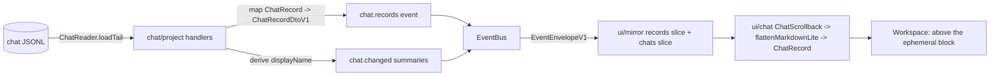

# Chat Transport Implementation Plan (WP-10)

> **For agentic workers:** REQUIRED SUB-SKILL: execute this plan task-by-task with
> **superpowers:subagent-driven-development**. Steps use checkbox (`- [ ]`) syntax.
> Load `/reatom` and `/errore` before any code-related action (CLAUDE.md mandate).
> **Task 1 is a no-code decision gate** — it settles and records the DTO-vs-event
> choice before any code task starts. Tasks are labelled **[core]** or **[ui]** and
> their parallelism is called out in the self-review section.

**Goal:** Give the persisted chat history a transport across the UI↔Kernel seam so
§11's "relaunch reopens the Workspace with chat and design intact" is satisfiable on
the chat half (closes **M10**), and fix the chat display name that today shows
`chatId.slice(0, 8)` because `ChatSummaryV1` carries no derived name. `ChatReader.loadTail`
already returns records (`core/ports/chat-store.ts:52`), but nothing carries them to
`ui`: `EVENT_KINDS_V1` has no record kind and `ui/mirror` has no record slice.

**Architecture:** The chat scrollback travels as a **new `chat.records` control event**
(not a command-result field — see the Decision below for why that is structurally
impossible), carrying a bounded page of persisted records for one chat, correlated by
`commandId`. The Kernel serves it command-time: `chat.switch`, `chat.create`, and
`project.open` load the active chat's tail through `ChatReader.loadTail` and emit
`chat.records`, exactly the "snapshot then events" model §9 fixes (there is no replay
buffer, §9 KCC:842-845). The chat **display name** is a derived property on
`ChatSummaryV1` (carried by the existing `chat.changed`, no count change): the Kernel
derives it from the first line of a chat's first `user` record (design §3.9). The UI
mirror gains a `records` slice fed by `chat.records`; the chat renderer flattens each
record through the already-landed `flattenMarkdownLite` and paints it as a persisted
`ChatRecord` above the ephemeral agent-status block (design §3.2).

**Tech Stack:** TypeScript 7.0.2 on Bun ≥1.3.14, `@reatom/core` ^1001.1.0 +
`@reatom/react` ^1001.0.0, `@opentui/core`+`@opentui/react` 0.4.5, `errore` ^0.14.1,
`zod` ^4.4.3, `react` ^19.2.7 (used only for its `act` re-render boundary in tests).

## Global Constraints

Inherited verbatim from `.superpowers/sdd/closeout-global-constraints.md` and the
master closeout's §"Global Constraints". Binding at every task boundary:

- `bun test`, `bun x tsc --noEmit`, `bun run lint`, `bun run fmt:check` all green at
  every task boundary; `git diff --check` clean before closing. (`bun test` has
  pre-existing stderr noise from the type-check and agent process-tree suites — do not
  chase it, add none.)
- **errore mandatory**: namespace import (`import * as errore from "errore"`), errors
  as values (`Error | T`), `createTaggedError` for domain errors, `.catch()` /
  `errore.try` only at uncontrolled boundaries, flat control flow, one-line
  `instanceof Error` early returns, always pass `cause`. NO `as unknown as` or any
  type-laundering cast — read the real declaration and use it.
- **Reatom v1001**: named atoms/computeds/actions; `wrap(...)` at every async boundary
  (every `ChatReader` call inside a handler's `launchOperation` closure); group one
  event's writes into a single named mirror function (RTM-S04); no identity setter
  actions; a bulk tail replace is `atom.set`, not a keyed collection cache.
- **Module DAG** (`docs/architecture/code-structure.md`): `core` imports only
  `entities/` and its own submodules + `core/ports`; `ui` sees only `core/protocol`
  closed DTOs + `PreviewSession`, never `core/capabilities`/`core/chats` internals;
  cross-module imports use the `tsconfig` path aliases, never a relative climb.
- **Closed protocol unions are load-bearing:** `CommandKindV1`/`EventKindV1` and their
  payload maps are closed (§2.12). Any union change updates the count constant AND the
  `closure.test.ts` transcription in the **same commit**, deliberately (Task 3).
- **Design is the source of truth**: the display-name rule, the markdown-lite record,
  and "above the ephemeral block" placement all come from
  `docs/superpowers/specs/2026-07-13-termcraft-design.md` §3.2/§3.9 and the
  `design/*.dc.html` screens — never invented. Colors/glyphs from
  `design/termcraft-engine.js` (`pal`). Document any unavoidable divergence in a code
  comment.
- **All code, comments, commit messages and docs in English.**
- Commits are frequent, per task, `feat:`/`fix:`/`test:`/`docs:` prefixed, each ending
  with `Co-Authored-By: Claude Fable 5 <noreply@anthropic.com>`. All git through the
  `rtk` prefix (`rtk git add`, `rtk git commit`).
- Snapshot/render tests wrap post-mount Reatom writes in `act()` from `'react'`
  (Spike D) or the frame never re-renders and the assertion passes against stale
  output.

---

## Decision (settled — Task 1 verifies and records it)

**Recommendation: add a new `chat.records` EVENT kind (`EVENT_KIND_COUNT` 43 → 44).
Do NOT extend the command-result DTO. Separately add a derived `displayName` field to
`ChatSummaryV1`, carried by the existing `chat.changed` (no count change).**

The master plan's task phrasing offers "extend the `chat.switch`/`chat.create` command
RESULT DTO with a record page" as one option. Against the contract it is **not
implementable**, so the choice collapses to the event path:

1. **The command result has no payload slot.** `AcceptedCommandV1`
   (`core/protocol/model/command-result.ts:49-67`) is a `z.strictObject` with exactly
   `{ protocolVersion, commandId, status, acceptedRevision, resultingRevision,
   disposition, operationId? }` — no field can carry a record page or a name, and
   `strictObject` + `command-result.test.ts` reject any extra key. §8.3 fixes this
   shape ("`Accepted` means the immediate named transition occurred… terminal
   success/failure arrives as an **event** carrying the same `commandId`"). A record
   page is exactly such a follow-on payload → it MUST be an event.

2. **Events are the only data channel besides the one snapshot.** §9 (spec KCC:842-845):
   a subscriber gets one `kernel.snapshot`, then subsequent events; "There is no
   event-resume token, replay buffer, or reconnect promise in v1." So the tail is
   pushed as an event after the triggering command.

3. **Snapshot-time carriage is the wrong home (the relaunch question).**
   `KernelSnapshotPayloadV1` carries `activeChatId` (nullable) but no summaries list and
   no records (`event-payload.ts:594-618`); `activeChatId` is nullable precisely because
   a subscriber can attach in the pre-`ready` window before any chat exists
   (`event-payload.ts:586-592`). The active chat and its tail are not known when the
   first snapshot fires. Delivery is therefore **command-time**: `project.open`'s
   handler (which drives the open-sequence to `ready` and resolves `activeChatId` from
   workspace state) emits `chat.changed` + `chat.records` after the open completes,
   correlated to the open command — the same pattern the handler already uses for
   `page.descriptorsChanged`/`finishOpen` (`handlers/project.ts:413-443`). Putting a
   potentially large record page into every snapshot would also bloat the one message
   that must always be sent on subscribe.

4. **The tail is a distinct concern from the directory.** `chat.changed` (§9 KCC:825)
   is a directory delta — "added/updated chat summaries and removed chat ids". Folding
   the full record page onto it would ship the whole tail on `chat.create` (empty) and
   every lifecycle change, and overload a directory event with content. A dedicated
   `chat.records` event delivers the tail exactly when a chat becomes active.

5. **Adding an event kind is allowed but deliberate.** §8.2 requires a protocol-schema
   change + schema + closure tests for any new kind; the closure test pins
   `EVENT_KIND_COUNT === 43` (`closure.test.ts:143-147`). Task 3 makes it 44 across
   `event-kind.ts`, `event-payload.ts`, the `closure.test.ts` transcription, and the
   §9 spec row in one commit. **The COMMAND union (43) is untouched — no new command.**

**Display name (orthogonal, no count change).** Design §3.9 (spec:379-380): "A chat's
display name is derived, not stored: the first line of its first `user` record,
truncated to ~60 chars (the project-name rule, §3.1)." So it is NOT a stored title
field; it is a derivation. The `/chats` popup needs a name for **every** chat
(`App.tsx:67` falls back to `chatId.slice(0, 8)`), but the UI mirror only holds records
for the **active** chat — so the name must be Kernel-derived and carried on the summary,
not derived UI-side. Add `displayName: string | null` to `ChatSummaryV1`
(`event-payload.ts:1557-1565`); the Kernel fills it whenever it has a chat's tail; a
freshly-created chat with no `user` record yet carries `null` and the UI renders the
design's fallback until the first message lands.

---

## Reference map

Anchors gathered during planning; authoritative for every signature this plan names.

**Protocol (the closed unions this package extends):**
- `AcceptedCommandV1` (no payload slot): `core/protocol/model/command-result.ts:49-67`.
- `EVENT_KINDS_V1` + `EVENT_KIND_COUNT = 43`: `core/protocol/model/event-kind.ts:14-63`.
- Closure test: `EVENT_KINDS_PER_SPEC` array `closure.test.ts:66-110`; count assertion
  `:143-147`; payload-map key check `:166-168`; "every event payload schema parses"
  `:181-187`.
- `ChatSummaryV1` (`chatId`, `createdAt` only, no name): `event-payload.ts:1557-1565`.
- `ChatChangedPayloadV1` + schema: `event-payload.ts:1576-1588` (§9 row KCC:825).
- `KernelSnapshotPayloadV1` (`activeChatId` nullable, no summaries/records):
  `event-payload.ts:594-618`; nullable rationale `:586-592`.
- Event-payload map + schema map: `event-payload.ts:1689` (`"chat.changed"` entry),
  `:1761` (schema entry); mirror these homes for `chat.records`.

**Ports & entities (the source of the records):**
- `ChatReader` / `ChatHandleV1` / `ChatLoadResultV1` / `ChatPageCursorV1`:
  `core/ports/chat-store.ts` — `ChatPageCursorV1:40-43`, `ChatLoadResultV1:45-48`,
  `ChatHandleV1.loadTail:52`, `ChatReader.open:61`. Fake: `core/ports/fakes/chat-store.ts`.
- `ChatRecord` union (entities): `entities/chat/types.ts:92-97` — `ChatUserRecord:29-37`
  (`text`, `ts`, `turnId`), `ChatAgentRecord:40-48` (`text`, `changedPages`, `warnings`),
  `ChatSystemErrorRecord:55-64`, `ChatSystemCancelledRecord:67-74`,
  `ChatSystemRestoreRecord:82-89` (defined, no MVP writer). Optionals (`turnId?`,
  `actionId?`, `selection?`, `pins?`) must become explicit at the DTO boundary — §8.1
  forbids `undefined` in a DTO.

**Kernel handlers (where the tail is served):**
- Chat handlers (`chat.create`/`chat.switch`, `launchOperation`, `chatChangedEvent`):
  `core/kernel/model/handlers/chat.ts:83-144`.
- `HandlerContext.launchOperation` contract (the one async-emit path):
  `handlers/types.ts:300-337`; `context.deps.chatReader` is a `KernelDeps` field.
- `project.open` run closure (emits `page.descriptorsChanged`/`finishOpen`, resolves
  `activeChatId` from `workspaceStateResult.state`): `handlers/project.ts:404-444`;
  admission via `beginProjectOpen`/`launchOperation` `:446-465`.
- `buildChatChangedPayload`: `core/chats/model/chat-changed.ts:21-30`.
- `createChatDirectory`/`sortChatsNewestFirst` (comment: "No port lists every chat"):
  `core/chats/model/chat-directory.ts:8-13, 20-46`. `core/chats` `ChatSummaryV1` alias:
  `core/chats/types.ts:18`.

**UI (where the tail is held and rendered):**
- Mirror types: `ChatSummary`/`ChatsMirror` `ui/mirror/types.ts:104-111`; `TurnMirror`
  (finalText retained on `running`, dropped at `terminal`) `:48-73`.
- Mirror apply: `chat.changed` case `ui/mirror/model/mirror.ts:263-272`; snapshot reset
  (chats set to empty summaries) `:118-135`.
- `flattenMarkdownLite(source): readonly MarkdownLine[]`: `ui/chat/model/markdown-lite.ts:100-131`.
- `ChatRecord` component (`role: "you" | "agent"`, `agentLabel`, `dim`):
  `ui/chat/ui/ChatRecord.tsx:12-23, 59-90`.
- `/chats` popup label `chatId.slice(0, 8)`: `ui/app/ui/App.tsx:65-70`;
  `sortChatSummariesNewestFirst`: `ui/mirror/model/chats.ts:15-19`.
- **M11 handoff (WP-9 Task 8)** consumes this package's mirror record slice and must not
  invent a parallel `finalText` path: `docs/superpowers/plans/2026-07-23-ui-completion.md:670-736`
  (esp. `:688-695, :713-719`).

**Design source of truth:**
- §3.2 chat panel — ephemeral block, then "the block collapses into the persisted agent
  record… final message rendered in markdown-lite… above": spec:149-160.
- §3.9 display name derivation + `/chats` newest-first: spec:379-387.
- §3.1 relaunch "the Workspace opens with the active chat's history restored": spec:116-120.
- Screens: `design/24-chats.dc.html` (`wsChats`), `design/03-workspace-generating.dc.html`
  + `design/14-first-generation.dc.html` (persisted record collapse), `design/02-workspace-idle.dc.html`.

---

## Task 1 — Settle and record the DTO-vs-event decision (no code) **[gate]**

The master plan requires WP-10's first task to settle the open choice against the
closed-union rules and record it before any code task. The Decision section above is
that record; this task VERIFIES its anchors so a later task cannot drift from it.

**Files:** none (verification + this plan is the record).

- [ ] **Step 1:** Confirm `AcceptedCommandV1` has no payload slot and is a
      `z.strictObject` (`command-result.ts:49-67`) — the command-result option is
      impossible; the tail must be an event.
- [ ] **Step 2:** Confirm §9 "snapshot then events, no replay" (spec KCC:842-845) and
      that `KernelSnapshotPayloadV1` carries no summaries/records (`event-payload.ts:594-618`).
- [ ] **Step 3:** Confirm the closure test pins `EVENT_KIND_COUNT === 43`
      (`closure.test.ts:143-147`) and note the four files a new kind must change in one
      commit (event-kind, event-payload, closure.test, the §9 spec row).
- [ ] **Step 4:** Confirm §3.9's display-name rule (spec:379-380) is a *derivation*, not
      a stored title. Record: `chat.records` new kind (43→44) + `displayName` on
      `ChatSummaryV1` (no count change). No commit; the decision is recorded in this plan.

---

## Task 2 — `ChatRecordDtoV1`: the wire record union **[core]**

The persisted records need a closed protocol DTO. `entities/chat`'s `ChatRecord`
(`types.ts:92-97`) is domain vocabulary with `undefined`-typed optionals; §8.1 forbids
`undefined` in a DTO, so `core/protocol` declares its own closed mirror + Zod schema
(the "narrow core-owned redraw", code-structure Decision C1 — the same precedent
`ChatPageCursorV1` follows in `chat-store.ts:39-43`).

**Files:**
- Create: `src/core/protocol/model/chat-record.ts` — `ChatRecordDtoV1`, a discriminated
  union on `kind` mirroring `entities/chat`'s five members, with `undefined` optionals
  made explicit (`turnId: UUIDv7 | null`, `actionId: UUIDv7 | null` where §11.2 makes
  them mutually exclusive; `selection`/`pins` on the user record become
  `selection: { pageSlug; element } | null` and `pins: readonly string[]`). Add
  `chatRecordDtoV1Schema` (`z.discriminatedUnion("kind", […])`, each arm a
  `z.strictObject`). Export both from `src/core/protocol/index.ts`.
- Test: `src/core/protocol/model/chat-record.test.ts` — each of the five arms parses a
  valid sample; a wrong `kind` and an unknown key reject; a `user` record with a
  non-string first line still parses (name derivation is Task 4's concern, not here).

**Interfaces:**
- Produces: `ChatRecordDtoV1`, `chatRecordDtoV1Schema`.
- Consumes: `ids`/`uint64`/shared schemas already in `core/protocol/model`.

- [ ] **Step 1:** Read `entities/chat/types.ts:29-97` and the §11.2 rules for
      `turnId`/`actionId` exclusivity; list every field per arm.
- [ ] **Step 2:** Write the failing five-arm parse/reject test. Run
      `bun test src/core/protocol/model/chat-record.test.ts` — FAIL (module not found).
- [ ] **Step 3:** Implement the union + schema; export from `protocol/index.ts`.
- [ ] **Step 4:** `bun test src/core/protocol` + `bun x tsc --noEmit` — PASS / exit 0.
- [ ] **Step 5:** fmt + lint; commit `feat(protocol): add the ChatRecordDtoV1 wire union`.

---

## Task 3 — The `chat.records` event kind (43 → 44) **[core]**

Add the new event kind carrying one chat's bounded tail. This is the deliberate
union-count change; every closure surface moves in this one commit.

**Files:**
- Modify: `src/core/protocol/model/event-kind.ts` — append `"chat.records"` to
  `EVENT_KINDS_V1` (place it beside `"chat.changed"`, `:53`) and set
  `EVENT_KIND_COUNT = 44` (`:63`).
- Modify: `src/core/protocol/model/event-payload.ts` — add
  `ChatPageCursorDtoV1` (`{ generation: number; beforeOffset: number }`, mirroring
  `ChatPageCursorV1` `chat-store.ts:40-43`) and `ChatRecordsPayloadV1`
  (`{ chatId: UUIDv7; records: readonly ChatRecordDtoV1[]; prevCursor: ChatPageCursorDtoV1 | null }`)
  with their schemas; add `"chat.records": ChatRecordsPayloadV1` to
  `EventPayloadByKindV1` (near `:1689`) and `"chat.records": chatRecordsPayloadV1Schema`
  to the schema map (near `:1761`). `records` uses `chatRecordDtoV1Schema` from Task 2.
- Modify: `src/core/protocol/model/closure.test.ts` — add `"chat.records"` to
  `EVENT_KINDS_PER_SPEC` (`:66-110`, beside `"chat.changed"`) and change the two count
  assertions `43 → 44` (`:145-146`). The verbatim-transcription discipline (`:14-18`)
  requires the array edit to be a deliberate hand-transcription, not derived.
- Modify: `src/core/protocol/model/event-payload.test.ts` — add a `chat.records` parse
  test (a tail with mixed record kinds parses; an empty tail parses; a wrong-shape
  record rejects).
- Modify: `src/core/protocol/index.ts` — export `ChatRecordsPayloadV1`,
  `ChatPageCursorDtoV1`, and their schemas if the barrel re-exports named payloads.

**Interfaces:**
- Produces: `EventKindV1` now includes `"chat.records"`; `ChatRecordsPayloadV1`,
  `ChatPageCursorDtoV1`.
- Consumes: Task 2's `ChatRecordDtoV1`.

- [ ] **Step 1:** Read `event-kind.ts:14-63` and `closure.test.ts:66-147`; note both
      count sites.
- [ ] **Step 2:** Write the failing `event-payload` `chat.records` parse test AND update
      `closure.test.ts` (array + counts). Run `bun test src/core/protocol` — FAIL
      (kind not in `EVENT_KINDS_V1`; schema map missing the key).
- [ ] **Step 3:** Add the kind + count, the payload types + schemas, and the two map
      entries. The §9 spec row is a docs edit — see the Architecture-docs section.
- [ ] **Step 4:** `bun test src/core/protocol` + `bun x tsc --noEmit` — PASS. Confirm the
      closure "no duplicate", "no frame kind", and "every schema parses" tests still green.
- [ ] **Step 5:** fmt + lint; commit
      `feat(protocol): add the chat.records event kind (43->44)`.

---

## Task 4 — Derived `displayName` on `ChatSummaryV1` **[core]**

Fix the chat display name. Add the field to the summary and the pure derivation the
Kernel uses to fill it.

**Files:**
- Modify: `src/core/protocol/model/event-payload.ts` — add
  `readonly displayName: string | null` to `ChatSummaryV1` (`:1557-1560`) and
  `displayName: z.string().max(80).nullable()` to `chatSummaryV1Schema` (`:1562-1565`).
  (Cap at 80 to bound the DTO while §3.9's target is ~60; the Kernel truncates to 60,
  the schema tolerates a small margin.) Update the field's doc comment: the name is
  derived, not stored (design §3.9), `null` until a `user` record exists.
- Create: `src/core/chats/model/display-name.ts` — `deriveChatDisplayName(records:
  readonly ChatRecordDtoV1[]): string | null` — the first line (`text.split("\n")[0]`,
  trimmed) of the first `kind: "user"` record, truncated to 60 chars; `null` when no
  user record. Export via `core/chats/index.ts`.
- Test: `src/core/chats/model/display-name.test.ts` — first user record wins; a
  leading system/agent record is skipped; multi-line takes line 1; >60 chars truncates;
  no user record → `null`.
- Modify: `src/core/protocol/model/event-payload.test.ts` and any `chat.changed` test —
  the summary schema now requires `displayName`; update fixtures (add `displayName`).
  Fix `core/chats/types.ts:18`'s `ChatSummaryV1` alias consumers only if `tsc` flags them.

**Interfaces:**
- Produces: `ChatSummaryV1.displayName`; `deriveChatDisplayName`.
- Consumes: Task 2's `ChatRecordDtoV1`.

- [ ] **Step 1:** Read design §3.9 (spec:379-380) and §3.1's project-name truncation
      rule; confirm "first line of the first `user` record, ~60 chars".
- [ ] **Step 2:** Write the failing `deriveChatDisplayName` test and the summary-schema
      test (a summary without `displayName` now fails; with it passes). Run
      `bun test src/core/chats src/core/protocol` — FAIL.
- [ ] **Step 3:** Add the field + schema and implement `deriveChatDisplayName`.
- [ ] **Step 4:** `bun test src/core` + `bun x tsc --noEmit` — PASS; fix any summary
      fixture the field change broke.
- [ ] **Step 5:** fmt + lint; commit
      `feat(protocol): give ChatSummaryV1 a derived display name`.

---

## Task 5 — Serve the tail on `chat.switch`/`chat.create` **[core]**

Map `ChatRecord`→`ChatRecordDtoV1` and emit `chat.records` (and a name-bearing
`chat.changed`) from the two chat handlers.

**Files:**
- Create: `src/core/chats/model/records.ts` — `chatRecordToDtoV1(record: ChatRecord):
  ChatRecordDtoV1` (the entities→wire mapping, `null` for absent optionals) and
  `buildChatRecordsPayload(chatId, loadResult: ChatLoadResultV1): ChatRecordsPayloadV1`
  (maps `records` + `prevCursor`). Export via `core/chats/index.ts`.
- Modify: `src/core/kernel/model/handlers/chat.ts`:
  - `handleChatSwitch` (`:110-138`): inside the existing `launchOperation` closure,
    after a successful `switchActive` + `writeWorkspaceState`, `wrap`
    `deps.chatReader.open(payload.chatId)` then `handle.loadTail()`; on success emit a
    `chat.records` event (`buildChatRecordsPayload`) AND set the switched chat's
    `chat.changed` summary `displayName` (via `deriveChatDisplayName` over the loaded
    records) in the `updated` array. A load failure is logged (errore rule 21) and the
    switch still publishes `chat.changed` — the switch itself succeeded; the tail is a
    best-effort read, mirroring the existing `writeWorkspaceState`-failure handling
    (`chat.ts:118-125`).
  - `handleChatCreate` (`:89-108`): a fresh chat has no records, so emit `chat.records`
    with an empty `records`/`null` `prevCursor` and the `added` summary carrying
    `displayName: null`. (Emitting the empty tail keeps the mirror's `records` slice
    correctly cleared on create, so a new chat shows no stale scrollback.)
- Test: `src/core/kernel/model/handlers/chat.test.ts` — extend: `chat.switch` with a
  fake `chatReader` returning two records emits one `chat.records` (right chatId,
  mapped records, in order) and a `chat.changed` whose `updated` summary has the derived
  `displayName`; a `loadTail` failure still emits `chat.changed` and logs; `chat.create`
  emits an empty `chat.records` and a `displayName: null` summary.

**Interfaces:**
- Produces: `chatRecordToDtoV1`, `buildChatRecordsPayload`; the two handlers now emit
  `chat.records`.
- Consumes: `KernelDeps.chatReader` (`ChatReader`), Tasks 2–4.

- [ ] **Step 1:** Read `handlers/chat.ts:83-144` and `chat-store.ts:45-61` for the
      `ChatReader.open → ChatHandleV1.loadTail → ChatLoadResultV1` shape; confirm the
      fake chat-store (`core/ports/fakes/chat-store.ts`) can program a tail.
- [ ] **Step 2:** Write the failing handler tests. Run `bun test src/core/kernel` — FAIL.
- [ ] **Step 3:** Implement `records.ts` and thread `chatReader.open/loadTail` into both
      handlers' `launchOperation` closures with flat errore control flow.
- [ ] **Step 4:** `bun test src/core/kernel src/core/chats` + `bun x tsc --noEmit` — PASS.
- [ ] **Step 5:** fmt + lint; commit
      `feat(core): serve the chat tail through chat.records`.

---

## Task 6 — Deliver the active chat's tail on relaunch (`project.open`) **[core]**

This is the M10 core requirement: §11 "reopens the Workspace with the active chat's
history restored" (design §3.1, spec:116-120). The open handler resolves `activeChatId`
from workspace state but emits no chat events today (`handlers/project.ts:404-444` emits
only `page.descriptorsChanged`/`finishOpen`).

**Files:**
- Modify: `src/core/kernel/model/handlers/project.ts` — in the open run closure, after
  `finishOpen` and using `activeChatId = workspaceStateResult.state.activeChatId` (fall
  back to the freshly-minted initial chat for `project.create`), `wrap`
  `deps.chatReader.open(activeChatId)` + `loadTail()`; push a `chat.changed` (the active
  chat's summary with derived `displayName`, `activeChatId` set) and a `chat.records`
  event onto the `events` array before returning it. A `null` `activeChatId` (pre-chat
  window) or a load failure is logged and skipped (errore rule 21) — the project still
  opens; the same "a producer hiccup must not block a project that DID open" stance the
  `page.descriptorsChanged` branch already takes (`project.ts:421-431`).
- Test: `src/core/kernel/model/handlers/project.test.ts` — extend: opening a project
  whose workspace state names an active chat with a persisted tail emits, after
  `finishOpen`, a `chat.changed` (active summary, derived name) and a `chat.records`
  (the tail) correlated to the open command; a project with `activeChatId: null` emits
  neither and still finishes open.

**Divergence to flag (do NOT invent a listing port):** the `/chats` popup wants a name
for *every* chat, but no port enumerates a project's chats — `ChatReader.open` takes a
known id (`chat-store.ts:61`; `chat-directory.ts:8-13` states this). WP-10 delivers only
the **active** chat's summary + tail on open, which is what M10/§11 require. Full-directory
enumeration needs a chat-listing source that is out of this package's scope (a `store`
surface, WP-2 territory); other chats populate their summaries as the user switches to
them (Task 5). State this in the commit body and a code comment.

- [ ] **Step 1:** Read `handlers/project.ts:404-465`; confirm `workspaceStateResult`,
      `manifest`, and `deps.chatReader` are in scope in the run closure.
- [ ] **Step 2:** Write the failing open tests (active-chat tail emitted; null-active
      case). Run `bun test src/core/kernel` — FAIL.
- [ ] **Step 3:** Implement the two-event emission with flat errore control flow and the
      divergence comment.
- [ ] **Step 4:** `bun test src/core/kernel` + `bun x tsc --noEmit` — PASS.
- [ ] **Step 5:** fmt + lint; commit
      `feat(core): restore the active chat tail on project open`.

---

## Task 7 — Mirror `records` slice + `displayName` flow **[ui]**

Hold the persisted tail in the UI read-model, fed by `chat.records`.

**Files:**
- Modify: `src/ui/mirror/types.ts` — add `export type ChatRecord =
  EventPayloadByKindV1["chat.records"]["records"][number];` (DTO-derived, no cast) and a
  `records: Atom<readonly ChatRecord[]>` member on the `Mirror` interface. `ChatSummary`
  (`:104-105`) now carries `displayName` automatically (indexed access into the changed
  `chat.changed` payload) — no edit needed there beyond confirming `tsc`.
- Modify: `src/ui/mirror/model/mirror.ts` — add a named
  `records = atom<readonly ChatRecord[]>([], "ui.mirror.records")`; a `chat.records`
  case in `apply` that `records.set(envelope.payload.records)` **only when**
  `envelope.payload.chatId === chats().activeChatId` (a late tail for a since-switched
  chat is ignored — the same fence pattern the turn cases use, `mirror.ts:97`); reset
  `records.set([])` in the `kernel.snapshot` case (`:118-135`, beside the other transient
  resets) and when `chat.changed` moves `activeChatId` to a different chat (`:263-272`).
  Return `records` from `createMirror`.
- Modify: `src/ui/mirror/index.ts` — export the `ChatRecord` type.
- Test: `src/ui/mirror/model/mirror.test.ts` — a `chat.records` for the active chat sets
  `records`; a `chat.records` for a non-active chat is ignored; a fresh `kernel.snapshot`
  clears `records`; switching active chat (via `chat.changed`) clears the stale tail.

**Design decision (record in the commit):** the slice holds the **active chat's** tail
as a single atom, replaced on each `chat.records` (a bulk read, not an editable
collection — a keyed `Map<chatId, records[]>` cache is deliberately NOT used per the
Reatom "bulk replace is `atom.set`" guidance; switching back re-emits `chat.records`
from the Kernel, Task 5). Note the one cost: a re-switch reloads rather than showing a
cached tail — acceptable for MVP and avoids unbounded UI memory.

**Interfaces:**
- Produces: `Mirror.records`, `ChatRecord` (ui) type.
- Consumes: Task 3's `chat.records` payload, Task 4's `displayName`.

- [ ] **Step 1:** Read `ui/mirror/model/mirror.ts:112-352` (the `apply` switch) and the
      `chat.changed` + snapshot cases.
- [ ] **Step 2:** Write the failing mirror tests. Run `bun test src/ui/mirror` — FAIL.
- [ ] **Step 3:** Add the slice, the fenced `chat.records` case, and the two resets.
- [ ] **Step 4:** `bun test src/ui/mirror` + `bun x tsc --noEmit` — PASS.
- [ ] **Step 5:** fmt + lint; commit `feat(ui): hold the persisted chat tail in the mirror`.

---

## Task 8 — Render the scrollback above the ephemeral block **[ui]** *(M11 handoff)*

Turn the `records` slice into painted `ChatRecord`s in markdown-lite, placed above the
ephemeral agent-status block (design §3.2, spec:149-160). This defines the interface
WP-9 Task 8 (M11) consumes.

**Design screen (read first):** `design/03-workspace-generating.dc.html` +
`design/14-first-generation.dc.html` — the persisted record collapse; spec §3.2
markdown-lite rules (bold/italic/inline-code/bullets; headings→bold; tables/code/links→plain).

**Files:**
- Create: `src/ui/chat/ui/ChatScrollback.tsx` + `ChatScrollback.test.tsx` — a list that
  maps `readonly ChatRecord[]` to `ChatRecord` components. A pure
  `recordToChatRecordProps(record, agentLabel): ChatRecordProps` mapping: `role` =
  `record.kind === "user" ? "you" : "agent"`; `lines = flattenMarkdownLite(record.text)`;
  `dim: true` (persisted records render dim, `ChatRecord.tsx:21-22`); `agentLabel` from
  the caller (M22 identity). System records (`system:error`/`system:cancelled`) render
  their `text` as an `agent`-role dim record (no invented styling — their `text` is the
  safe display string). Export both from `src/ui/chat/index.ts`.
- Modify: `src/ui/workspace/ui/Workspace.tsx` — render `<ChatScrollback>` in the chat
  stream **above** the ephemeral `AgentStatusBlock`, fed by `mirror.records()` and the
  `mirror.agentIdentity()` label (M22). Keep every glyph/color from `ChatRecord`
  (design-sourced); the scrollback adds no new visual vocabulary.
- Test: `Workspace.test.tsx` — a mounted Workspace with a `chat.records` carrying a user
  message + an agent markdown message renders both as `ChatRecord`s (assert the `❯ you`
  and `● <label>` headers and a bold span from the agent text), positioned before the
  ephemeral block. Apply the events before mount (no `act`); post-mount writes wrap in
  `renderer.act`.

**M11 handoff (name it exactly — WP-9 Task 8 binds to this):** the persisted-record
surface WP-9 Task 8 consumes is **`Mirror.records: Atom<readonly ChatRecord[]>`** (Task 7)
plus **`recordToChatRecordProps(record, agentLabel)`** and **`ChatScrollback`** (this
task). WP-9 Task 8 renders the just-completed turn's final message through the SAME
mapping — it must feed a `ChatRecord`-shaped record into this path, never a parallel
`finalText` render (ui-completion plan:688-695). Because a completed turn's agent record
is persisted, the aligned long-term source is a `chat.records` re-emitted/appended after
`turn.completed`; until that lands, WP-9 Task 8's retained `finalText` is mapped through
`recordToChatRecordProps` as an interim agent record so the two never diverge.

- [ ] **Step 1:** Read `design/03-workspace-generating.dc.html`,
      `design/14-first-generation.dc.html`, `ChatRecord.tsx`, and `flattenMarkdownLite`;
      confirm dim persisted styling and the header glyphs.
- [ ] **Step 2:** Write the failing `ChatScrollback.test.tsx` (user + agent records
      render; markdown bold survives). Run `bun test src/ui/chat` — FAIL.
- [ ] **Step 3:** Implement `recordToChatRecordProps` + `ChatScrollback`.
- [ ] **Step 4:** Write the failing `Workspace.test.tsx` case (scrollback above the
      ephemeral block). Run `bun test src/ui/workspace` — FAIL.
- [ ] **Step 5:** Wire `<ChatScrollback>` into the chat stream above `AgentStatusBlock`.
- [ ] **Step 6:** `bun test src/ui/chat src/ui/workspace` + `bun x tsc --noEmit` — PASS.
- [ ] **Step 7:** fmt + lint; commit `feat(ui): render persisted chat records as scrollback`.

---

## Task 9 — Use the derived name in the `/chats` popup and chat title **[ui]**

Consume `displayName` where the UI shows a chat name.

**Design screen (read first):** `design/24-chats.dc.html` (`wsChats`) — rows show the
derived name + timestamp, newest first, active marked.

**Files:**
- Modify: `src/ui/app/ui/App.tsx` — the chat-list rows (`:65-70`) use
  `summary.displayName ?? summary.chatId.slice(0, 8)` for `label` instead of the raw
  slice. Keep the `sortChatSummariesNewestFirst` ordering already there.
- Test: `App.test.tsx` — a chat with a `displayName` renders that name in the `/chats`
  popup; a chat with `displayName: null` still renders the `chatId.slice(0, 8)` fallback.

**Coordination note:** WP-9 Task 2 (m4) also edits `App.tsx:65-70` (newest-first sort).
These are adjacent — whichever lands second rebases the small label/sort hunk; the
change here is only the `label` source, not the ordering.

- [ ] **Step 1:** Read `App.tsx:58-73` and `design/24-chats.dc.html`.
- [ ] **Step 2:** Write the failing `App.test.tsx` case (named chat + null-name fallback).
      Run `bun test src/ui/app` — FAIL.
- [ ] **Step 3:** Change the `label` source to `displayName ?? slice(0, 8)`.
- [ ] **Step 4:** `bun test src/ui/app` + `bun x tsc --noEmit` — PASS.
- [ ] **Step 5:** fmt + lint; commit `fix(ui): show the derived chat display name`.

---

## Task 10 — Relaunch round-trip gate **[core+ui]**

Prove M10 end to end: a persisted tail crosses the seam and reaches a rendered record.

**Files:**
- Test: `src/ui/mirror/model/mirror.test.ts` (or a small cross-module test in
  `src/ui/workspace`) — feed the exact `EventEnvelopeV1` sequence a relaunch produces —
  `kernel.snapshot` (activeChatId set) → `chat.changed` (active summary, derived name) →
  `chat.records` (a user + agent record) — through `mirror.apply`, then assert
  `mirror.records()` holds both records in order and `mirror.chats().summaries` carries
  the derived `displayName`. Mounting the Workspace over that mirror shows the two
  `ChatRecord`s above the ephemeral block.

- [ ] **Step 1:** Assemble the relaunch envelope sequence from Tasks 3/4's DTOs.
- [ ] **Step 2:** Write the round-trip test. Run `bun test src/ui` — exercise the chain.
- [ ] **Step 3:** Fix any seam mismatch it surfaces. Green.
- [ ] **Step 4:** `bun test` + `bun x tsc --noEmit` + fmt + lint — all green.
- [ ] **Step 5:** Commit `test: prove the chat tail round-trips on relaunch`.

**Acceptance:** `bun test` green; `bun x tsc --noEmit` exit 0; `EVENT_KIND_COUNT === 44`
with the closure test updated; the `/chats` popup and scrollback show the derived name
and persisted records; no non-English comment in the diff.

---

## Architecture docs

Update `docs/architecture/` where a change touches a Source-anchored diagram (the event
registry / UI-mirror walkthroughs). Add the §9 `chat.records` row to the
kernel-command-contract event table (spec KCC:825-829 neighborhood) as part of Task 3's
commit. Run the architecture-update skill's Source-anchor sweep at package end; do not
describe WP-9's Workspace render (that lands in WP-9 Task 8).

## Self-review (planner)

- **Decision is settled with evidence and cannot be the command-result path:**
  `AcceptedCommandV1` is a closed `strictObject` with no payload slot
  (`command-result.ts:49-67`); §9 gives events, not the snapshot, as the follow-on
  channel (KCC:842-845). The tail is a new `chat.records` event; the name is a
  `ChatSummaryV1.displayName` derivation (§3.9), not a stored title.
- **The union-count change is deliberate and single-commit:** Task 3 moves
  `EVENT_KIND_COUNT` 43→44 across `event-kind.ts`, `event-payload.ts`,
  `closure.test.ts`'s hand-transcribed array + both count assertions, and the §9 spec
  row together. The COMMAND union is never touched.
- **core-side vs ui-side:** Tasks 2, 3, 4, 5, 6 are **[core]**; Tasks 7, 8, 9 are
  **[ui]**; Task 10 is the cross-seam gate.
- **Parallelizable:** Tasks 2→3→4 (protocol) are the foundation and are sequential
  (3 and 4 both edit `event-payload.ts`; 3 depends on 2). Core Tasks 5 and 6 both depend
  on 2–4 and are independent of each other (different handler files) — parallelizable
  after the protocol lands. UI Tasks 7→8→9 depend only on the protocol DTOs (2–4), not on
  the core handlers, so the ui stream can proceed **in parallel with core Tasks 5–6**
  once 2–4 land (the ui tests feed events directly into `mirror.apply`). Within ui, 7
  gates 8 (records slice) and is independent of 9 (name in popup). Task 10 needs 3, 4, 7,
  8.
- **M11 handoff is named exactly:** WP-9 Task 8 binds to `Mirror.records`,
  `recordToChatRecordProps`, and `ChatScrollback` (Task 7/8), and must not build a
  parallel `finalText` render (ui-completion:688-695). Task 8's handoff note states the
  alignment; WP-10 lands the scrollback before WP-9 Task 8 (scheduled last).
- **Display name is Kernel-derived, not UI-derived:** the `/chats` popup needs a name for
  every chat but the mirror holds records only for the active one — so `displayName` must
  ride on the summary (Task 4), filled by the Kernel whenever it loads a tail (Tasks 5/6).
- **Rendering placement is design-sourced:** scrollback above the ephemeral block, dim
  persisted records, markdown-lite — all from §3.2 (spec:149-160) and `ChatRecord`'s
  existing design-sourced styling; no new visual vocabulary is invented.

### Already-true / impossible (with evidence)

- **The command-result option is impossible** — `AcceptedCommandV1` (`command-result.ts:49-67`)
  is a `z.strictObject` with no payload field; extending it would break §8.3 and the
  `command-result` closure test. The master plan's "extend the command RESULT DTO"
  phrasing does not survive the contract; the event path is the only sound choice.
- **`flattenMarkdownLite` already exists and is exported** (`markdown-lite.ts:100-131`)
  with no production caller — Task 8 supplies the caller, not a parser.
- **`chat.changed` is already emitted on create/switch** (`handlers/chat.ts:89-138`) and
  the mirror already applies it (`mirror.ts:263-272`) — Tasks 5/7 extend those paths,
  they do not create them. `buildChatChangedPayload` (`chat-changed.ts:21-30`) is reused.
- **`project.open` emits no chat events today** (`handlers/project.ts:404-444`) — the
  relaunch tail is a genuine gap Task 6 closes; the `activeChatId` it needs is already
  resolved from workspace state in that closure.

### Concerns

1. **No chat-listing port.** `ChatReader.open` needs a known id and nothing enumerates a
   project's chats (`chat-directory.ts:8-13`). WP-10 restores only the **active** chat on
   relaunch (Task 6), which satisfies M10/§11; the full `/chats` directory populates
   lazily as chats are switched to. A listing source is out of scope (a `store`/WP-2
   surface). Flagged in Task 6, not faked.
2. **The just-completed-turn record (M11) is WP-9's, and must reuse this transport.** WP-9
   Task 8 could regress into a parallel `finalText` render. Task 8's handoff note fixes
   the single mapping (`recordToChatRecordProps`) both paths must use; land WP-10 first.
3. **App.tsx overlap with WP-9 m4** (both edit `App.tsx:65-70`) — Task 9 is a one-line
   `label` source change; whichever lands second rebases the hunk. Noted in Task 9.
4. **Record-slice memory choice.** The active-chat-only atom (Task 7) reloads on
   re-switch rather than caching per chat — a deliberate MVP simplicity trade recorded in
   Task 7's commit, avoiding unbounded UI memory and a keyed cache the Reatom rules would
   otherwise want justified.
