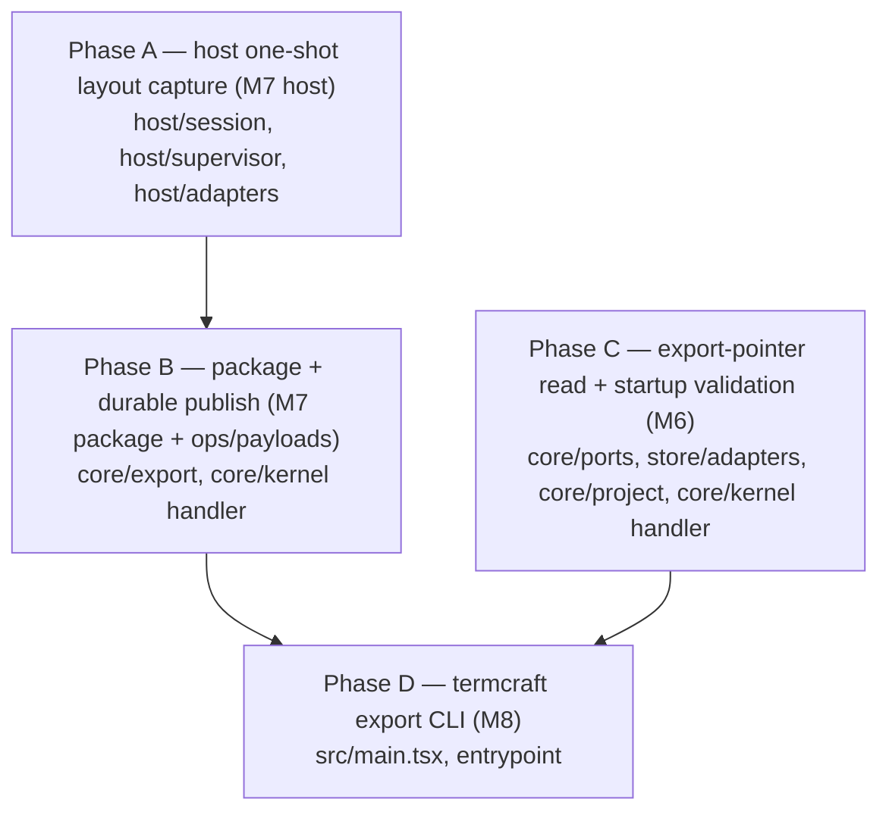

# Export Completeness Implementation Plan (WP-5)

> **For agentic workers:** REQUIRED SUB-SKILL: execute this plan task-by-task with
> superpowers:subagent-driven-development (or superpowers:executing-plans). Steps use
> checkbox (`- [ ]`) syntax. Load `/reatom` and `/errore` before any code-related
> action (CLAUDE.md mandate). Every task ends green (`bun test` + `bun x tsc --noEmit`)
> and is one commit.

**Goal:** Make `termcraft export` produce a **real, on-disk, agent-implementable**
export package. Today the whole capture→render→assemble→publish chain runs
(`core/kernel/model/handlers/preview-export.ts`, Gap B closed) but three seams are
hollow: (1) every `layout/<slug>.json` is the literal `{}` stub because the one-shot
host seals a frame with **no** correlated layout tree; (2) `publishExport` hands the
transaction an **empty** operation/payload set, so no generation files are ever
written to disk; (3) startup never validates the export pointer and there is no
headless CLI. Closes **M6, M7, M8**, plus the operations/payload threading the B6
slice explicitly deferred to WP-5 (`export/model/publish.ts:167`). This is the one
§11 criterion currently unsatisfiable: "the export package … that a coding agent can
implement from without seeing termcraft" (design §11, `2026-07-13-termcraft-design.md:1258-1267`).

**Architecture:** The data path already exists end to end — it is threaded with
stubs, not missing. `ExportRenderResultV1.layout: Uint8Array` (`core/ports/export-render.ts:42`)
is a real field filled with `new Uint8Array(0)` (`host/adapters/export-render.ts:151`);
`ExportPublishPlanV1.operations`/`payloads` (`core/ports/export-publish.ts:65-73`) are
real fields filled with `[]`/`new Map()` (`core/export/model/publish.ts:171-177`); the
store's `buildExportPublishTransaction` (`store/transaction/model/wrappers.ts:1066`) and
its adapter (`store/adapters/export-publish.ts:123-154`) already commit whatever
operations they are handed durably. So WP-5 is **feeding real bytes through existing
seams**, plus one genuinely new host-side capability (the one-shot layout reply) and
one new port method (the pointer read side). Dependency-ordered work:

Phase **A** and Phase **C** are fully independent and PARALLELIZABLE. Phase **B**
depends on A (it consumes the real `layout` bytes A produces). Phase **D** is last —
it composes the whole publish path (B) and the trust/guard surface, and the pointer
read (C) is what its own second export run revalidates against.

**Tech Stack:** TypeScript 7.0.2 on Bun ≥1.3.14, `@opentui/core`+`@opentui/react`
0.4.5, `@reatom/core` ^1001.1.0, `errore` ^0.14.1, `zod` ^4.4.3. No new dependencies.

## Global Constraints

Inherited verbatim from `.superpowers/sdd/closeout-global-constraints.md` and
`CLAUDE.md`; every task implicitly includes them. The ones this package trips over:

- `bun test` and `bun x tsc --noEmit` green at every task boundary. `bun run lint`
  and `bun run fmt:check` green before each commit. (Pre-existing stderr noise from
  the type-check/process-tree suites is not ours to chase.)
- **errore mandatory**: namespace import, errors as values (`Error | T`),
  `createTaggedError` for domain errors, `.catch()`/`errore.try` only at uncontrolled
  boundaries, flat control flow, one-line `instanceof Error` early returns, always
  pass `cause`. **No `as unknown as` / type-laundering casts** — decode with a Zod
  schema or a real guard instead.
- **Reatom v1001**: named atoms/computeds/actions; `wrap(...)` at every async
  boundary that touches Reatom (matches `publish.ts`/`preview-export.ts`'s existing
  `await wrap(...)` on every port call).
- **Module DAG** (`docs/architecture/code-structure.md`): `core` imports only
  `entities/` and its own submodules + `core/ports/`; adapters implement core ports
  and import `core/ports/*` **type-only** to prove conformance (each ends in an
  `AssertConforms` line); `ui` sees only core boundary types; the composition root
  injects. **`host` never imports `core`** except `core/ports` type-only.
- **Module folder shape** (`CLAUDE.md`): `ui/`/`model/`/`types.ts`/`index.ts`; never
  loose files at a module root.
- **Design is the source of truth**: any glyph/color/copy comes from
  `design/*.dc.html` + `design/termcraft-engine.js`; document any unavoidable
  divergence in a code comment (the layout-tree `text` gap, D-Q6 below, is one).
- **All code, comments, commit messages and docs in English.** Commits `feat:`/`fix:`/
  `test:`/`docs:` prefixed, each ending with
  `Co-Authored-By: Claude Fable 5 <noreply@anthropic.com>`. All git through `rtk`.
- **Determinism (design §5.7, §10):** export snapshots and layout trees must be
  byte-identical across fresh host runs. The one-shot child already mounts with
  `deterministic: true` (`host/session/model/host-state-machine.ts:150`); the layout
  tree comes from the same mounted renderable tree the frame is captured from, so it
  inherits that determinism — do not introduce any nondeterministic ordering when
  serializing it (`getChildren()` order is stable; keep it).

---

## Reference map (file:line, from a full read of the tree on 2026-07-24)

**Host one-shot / layout (Phase A):**
- `host/render/model/geometry.ts:76-87` — `layoutNodeOf`/`layoutTreeOf(renderer): LayoutNode`
  (real geometry over the mounted tree; the exact function M7 must reach).
- `host/render/types.ts:40-45` — `LayoutNode { id, kind, box, children }` (**no `text`**
  — documented divergence, D-Q6); `:87` — `RenderHandle.layoutTree(): LayoutNode`.
- `host/session/model/host-state-machine.ts:149-209` — `handleMount`: renders, seals the
  frame, sends `ready` (`ReadyBody`), emits the frame; `:205-208` — **export/smoke exit 0
  immediately after the first frame**, before any `query-layout` can arrive; `:459-472`
  `resolveGeometry` already returns `{ tree: renderer.layoutTree() }` for `query-layout`.
- `host/session/types.ts:47-55` — `ReadyBody { meta, size, interactionMode, frameIdentity,
  tweaks }` (the body to extend with an optional `layout`).
- `host/supervisor/model/one-shot.ts:36-172` — `runOneShotSession`; `:159` awaits ready+frame;
  `:166-172` builds `OneShotResult` (the return to extend); `:177-217` `awaitReadyFrame`
  (holds `sealed.ready` as a decoded `ControlEnvelope`).
- `host/supervisor/types.ts:402-408` — `OneShotResult { identity, frame, ready,
  negotiatedLimits, exitCode }` (the note at `:395-401` names the deferred layout reply).
- `host/adapters/export-render.ts:129-155` — `renderOne`; `:151` — `layout: new Uint8Array(0)`
  (the stub to replace); `:24-48` header names this exact gap for WP-5.

**Package + publish (Phase B):**
- `core/export/model/package.ts:96-125` — `assembleExportPackage`; `:110-114` — the per-page
  loop writing `layout/<slug>.json` as `"{}"` (`:113` the literal stub); `:69` — the
  "unpopulated in this MVP export" `design-prompt.md` line to drop; `:71` — `pageRenders`
  (already grouped by page — where per-size layout is available); `:116-122` — per-render
  snapshot loop (proves `render.size`/`render.outcome` are in hand).
- `core/export/model/render-jobs.ts:41-45` — `ExportRenderJobResultV1 { pageSlug, size,
  outcome: FailureDtoV1 | ExportRenderResultV1 }`.
- `core/ports/export-render.ts:38-42` — `ExportRenderResultV1 { …, layout: Uint8Array }`.
- `core/export/model/publish.ts:116-198` — `publishExport`; `:161-177` — builds
  `ExportPublicationIntentV1` then `plan.operations: []`/`payloads: new Map()` (the WP-5
  TODO at `:167-170`); `:179` — `deps.exportPublish.publish(plan)` under the held permit.
- `core/kernel/model/handlers/preview-export.ts:611-794` — `runExportStart`; `:680-684` —
  `assembleExportPackage({ snapshot, renders, runtimeDeclaration })` (has `assembled.files`);
  `:741-753` — builds `PublishExportInputV1` and calls `publishExport`; `:476` —
  `EXPORT_DESTINATION = ".termcraft/export"` (event display path, not an operation target).
- `core/ports/export-publish.ts:41-90` — `ExportPublishOperationModeV1` (`"replace"|"delete"`),
  `ExportPublishOperationV1 { index, target, mode, oldImage, newImage, payloadId? }` (target
  "relative to `.termcraft`"), `ExportPublishPlanV1`, `ExportPublicationV1`, `ExportPublishPort`.
- `store/adapters/export-publish.ts:55-154` — real adapter; `:46-47` — "empty until WP-5 …
  trivially satisfiable today"; `:62-75` — `buildPrecondition` (re-CAS every op's `oldImage`).
- `store/transaction/model/wrappers.ts:1057,1066` — `buildExportPublishTransaction` (caller-
  ordered ops: new-gen files, then `current.json`, then old-gen deletes).
- `store/model/launch.test.ts:1167-1186` — an infra-only publish fixture showing the real
  target shapes: `export/generations/<generationId>/frame.bin` + `export/current.json`.

**Pointer read / startup validation (Phase C):**
- `docs/superpowers/specs/2026-07-16-turn-durability-staging-design.md:964-966` — `current.json`
  = schema version + `generationId` + a SHA-256 manifest of every file in the generation;
  `:978-986` — §10 publish step order; `:1078-1080` — §12 **step 9**: "Validate the manifest,
  canonical pages, chats, pins, **export pointer**, and local state required to open";
  `:1218-1224` — §14.7 crash-safety (current.json always references a complete generation).
- `core/project/model/open-sequence.ts:105-137` — `validateProjectContents` (validates
  manifest/workspace/pages/pins/active-chat; `:46-52` header documents the **export-pointer
  gap** M6 closes); `:62-87` — `OpenSequenceDeps` (needs a new read-side field).
- `core/kernel/model/handlers/project.ts:49-73` — **the live open path does NOT call
  `runOpenSequence`** (six missing deps); `:469-556` — `runProjectReadySequence` (the real
  production sequence: manifest, workspace, recovery, orphan scan, trust, page descriptors,
  finishOpen) — it validates pages but **never the export pointer**. This is why M6 must wire
  into BOTH places (D-Q3).
- `store/adapters/export-publish.test.ts:76-108` — proves a fresh project genuinely has no
  `export/current.json` (absent is valid, not an error).

**CLI / composition (Phase D):**
- `src/main.tsx:23-77` — `import.meta.main`: first branch `_host --stdio`, else interactive
  `bootstrap("interactive", …)`. M8 adds a third `export` branch.
- `entrypoint/model/create-shell.ts:60-179` — `interactiveShell` composes the **real** kernel
  graph (store/gate/host/agent adapters → `createKernel`); `:88-158` — the full `KernelDeps`;
  WP-4 has already landed this. D reuses this composition **without a renderer**.
- `entrypoint/model/bootstrap.ts:25-37` — `bootstrap` (mode → started app); the CLI needs a
  renderer-free sibling that stops after `createShell` and dispatches commands.
- `core/capabilities/model/guards.ts:122-134` — `PROJECT_UNTRUSTED_EXEMPT_KINDS` /
  `projectUntrustedReason`: `export.start` is **not** exempt, so the guard already rejects
  it with `PROJECT_UNTRUSTED` on an untrusted project — the CLI detects that rejection and
  prints the §3.1 message (no duplicate trust logic).
- `ui/popups/ui/TrustPrompt.tsx:40-43` — the verbatim §3.1 copy ("designs in this project are
  code and will run;" / "trust this folder?").
- Design spec: §3.1 `:112-121` (trust check + copy), §3.7 `:273-324` (export package contract,
  the fixed size ladder, all-or-nothing, "on an untrusted folder prints the trust error and
  points at the TUI"), §9 `:1213-1217` ("The `termcraft export` CLI form reports the same
  trust refusal (§3.7)"), §11 `:1258-1267`.

---

## Design questions the implementer MUST NOT guess (resolve before coding the phase)

- **D-Q1 — `layout/<slug>.json` shape (Phase B).** Design §3.7 says "the resolved layout
  tree **at every export size**"; the WP-5 acceptance test says "non-empty `layout/<slug>.json`
  for every page **at every size**". One file per page must therefore carry all sizes.
  **Recommended:** a size-keyed JSON object `{ "80x24": <tree>, "120x40": <tree>, "160x40":
  <tree> }`, key = the same `WxH` label `sizeLabel()` (`package.ts:47-49`) already uses for
  snapshots. Reject a bare single tree (loses per-size resize data, the whole point of the
  ladder, §3.7 `:306-312`).
- **D-Q2 — export current.json schema (Phase B/C).** No production shape exists yet (only
  test fixtures reference the path). **Recommended:** define one type in `core/ports/export-publish.ts`
  (it is the read side's parse target and the write side's `newImage` payload):
  `ExportPointerV1 { schemaVersion: 1; generationId: string; files: Record<relPath, { sha256:
  Sha256Hex; size: number }> }`, matching TD `:964-966` verbatim. Serialize canonically (sorted
  keys) for determinism. The read side (C) and write side (B) MUST use the same schema/Zod value.
- **D-Q3 — M6 wiring reach.** The closeout says "call it from `validateProjectContents`", but
  the live production open path (`runProjectReadySequence`, `project.ts:469`) does **not** call
  `runOpenSequence`/`validateProjectContents` — wiring only there would never run in
  production. **Recommended:** wire the pointer read into **both** — `validateProjectContents`
  (satisfies the spec's §12-step-9 ordered sequence and `open-sequence.test.ts`'s ordering
  proofs) **and** `runProjectReadySequence` (so it actually runs at startup, after the page
  descriptors, before `finishOpen`). Both already hold the port (`OpenSequenceDeps` gets a new
  field; the kernel handler has `context.deps.exportPublish`).
- **D-Q4 — startup validation depth (M6).** **Recommended:** shallow structural validation
  only — parse `current.json` against the D-Q2 schema and confirm the referenced generation
  directory exists; do **not** re-hash every generation file at every open (the other step-9
  checks are structural reads, not integrity re-hashes; a full re-hash on every launch is a
  cost §12 does not ask for). Absent `current.json` (a project that never exported) is a
  **valid** `null` result, never a failure (`export-publish.test.ts:95`).
- **D-Q5 — old-generation cleanup in the publish operations (Phase B).** §10 step 4 lists
  create-new → replace-pointer → **delete old-gen files**. The read side (C) enumerates the
  old generation's files (D-Q2 `files` keys + their hashes for exact `oldImage` CAS).
  **Recommended:** include the deletes (immutable-generation correctness + §14.7), building
  each delete op's `oldImage` from the old pointer's manifest. If the read side is not yet
  landed when B runs, ship create-new + replace-pointer first and add deletes in a follow-up
  task — but do **not** silently drop them; flag the interim in a code comment.
- **D-Q6 — layout node `text` (Phase A/B).** `LayoutNode` omits `text` today (runtime catalog
  not landed, `geometry.ts:19-31`). Design §3.7 wants `text` for text nodes. **Recommended:**
  ship structurally-real trees (`id`/`kind`/`box`/`children`) now — that is "non-empty" and
  satisfies §11 and the acceptance test; carry the existing divergence comment forward
  (do not invent `text`). Update `design-prompt.md`'s layout note to say ids/boxes are
  populated and `text` follows the runtime catalog, instead of "unpopulated".
- **D-Q7 — §3.1 CLI trust-refusal exact string (Phase D).** The spec fixes the **substance**
  ("designs in this project are code and will run" + "points at the TUI", §3.7 `:322-324`,
  §9 `:1216-1217`), not a verbatim CLI string. **Recommended:** define one exported constant
  reusing the `TrustPrompt` copy plus a TUI pointer, e.g. `"designs in this project are code
  and will run; this folder is not trusted. Open termcraft in this directory to trust it,
  then export."`, and have the acceptance test assert the §3.1 substring ("designs in this
  project are code and will run"). Get the final wording confirmed before locking the test.
- **D-Q8 — host layout transport (Phase A).** Two routes: embed the tree in the export-mode
  `ready` body vs. a separate post-frame message. **Recommended:** embed in the `ready` body
  (`ReadyBody.layout?`), computed at `:172` where the renderer is already mounted and
  rendered — one round trip, no change to the one-shot await loop, no keeping the child alive.
  Verify the tree fits the negotiated `controlPayloadBytes` (a bounded terminal tree is small;
  add a guarded honest failure if it ever exceeds, never a truncated tree) and that nothing on
  the export path strictly rejects an added `ready`-body field (one-shot carries `sealed.ready`
  opaquely — safe; confirm in the task).

---

## Phase A — Host one-shot layout capture (M7 host side) · module: `host`

> Parallelizable with Phase C. No `core` import anywhere in `host`.

### Task A1 — extend the export/smoke one-shot child to seal the layout tree
**Files:** `host/session/types.ts` (add `layout?: LayoutNode` to `ReadyBody`; import
`LayoutNode` from `host/render`), `host/session/model/host-state-machine.ts`
(`handleMount`), test `host/session/model/host-state-machine.test.tsx`.
- [ ] Failing test: an `export`-mode mount produces a `ready` whose body carries a
  `layout` tree equal to `renderer.layoutTree()`, and (regression) a `preview`-mode
  mount's ready body carries **no** `layout`.
- [ ] Run the test — expect FAIL.
- [ ] Implement: in `handleMount`, after `handle.capture()` (`:171`), when
  `request.mode === "smoke" || "export"`, compute `renderer.layoutTree()` and set it on
  the `ReadyBody` before `deps.send({ kind: "ready", … })` (`:185-196`). Reuse the
  already-mounted `handle`; do not re-render. Keep the existing immediate `exit 0`.
- [ ] Confirm D-Q8: `decodeControlEnvelope` and the one-shot ready handling tolerate the
  added optional field (they treat the body generically). Note it in a code comment.
- [ ] Run — PASS. Commit `feat(host): seal the resolved layout tree in the export ready body`.

### Task A2 — surface the layout tree on `OneShotResult`
**Files:** `host/supervisor/types.ts` (`OneShotResult` gains `layout: LayoutNode`),
`host/supervisor/model/one-shot.ts`, plus a small Zod `layoutNodeSchema` decoder
(new `host/render/model/layout-schema.ts` exported via `host/render`, or colocated in
`host/session`), test `host/supervisor/model/one-shot.test.ts`.
- [ ] Failing test: a scripted one-shot child that returns a `ready` with a `layout` body
  yields an `OneShotResult` whose `layout` deep-equals that tree; a malformed layout body
  returns a typed `ProtocolError`/`SupervisorError`, never a fabricated tree.
- [ ] Run — FAIL.
- [ ] Implement: decode `sealed.ready.body.layout` with `layoutNodeSchema` (recursive
  `LayoutNode`), attach it to the returned `OneShotResult` (`one-shot.ts:166-172`). On a
  decode miss, `fail(...)` with a typed error (errore boundary rule) — the one-shot's
  own failure-is-the-result contract (`:29-35`) covers this cleanly.
- [ ] Run — PASS. Commit `feat(host): decode the one-shot layout tree into OneShotResult`.

### Task A3 — fill `ExportRenderResultV1.layout` with the real serialized tree
**Files:** `host/adapters/export-render.ts` (`renderOne`), test
`host/adapters/export-render.test.ts`, and update the adapter header note (`:24-48`).
- [ ] Failing test: `renderOne` on a fixture task returns a result whose `layout` is the
  JSON-encoded tree from `OneShotResult.layout`, not an empty array.
- [ ] Run — FAIL.
- [ ] Implement: replace `layout: new Uint8Array(0)` (`:151`) with
  `new TextEncoder().encode(JSON.stringify(outcome.result.layout))`; drop the "no layout-tree
  source yet" note and the WP-2 flag now that the source exists.
- [ ] Run — PASS. Commit `feat(host): emit the real layout tree bytes from the export render adapter`.

---

## Phase B — Package + durable publish (M7 package + ops/payloads threading) · module: `core/export`, `core/kernel`

> Depends on Phase A. `core` stays disk-free; the store transaction does the writes.

### Task B1 — write the real per-size `layout/<slug>.json`
**Files:** `core/export/model/package.ts`, test `core/export/model/package.test.ts`.
- [ ] Resolve **D-Q1** (size-keyed object). Failing test: for a snapshot with one page and
  renders at 80x24 + 120x40, `assembleExportPackage` emits a `layout/<slug>.json` whose
  parsed JSON has both size keys, each a non-empty tree; and it is byte-identical across two
  identical inputs (determinism).
- [ ] Run — FAIL.
- [ ] Implement: in the per-page loop (`:110-114`), replace the `"{}"` stub with a size-keyed
  map built from that page's renders (`pageRenders` already exists at `:71`): for each
  successful render, `JSON.parse` its `outcome.layout` bytes (a render that failed can't
  reach here — the wholesale refusal at `:99-103` already returned). Drop the `:69`
  "unpopulated" line; update the layout note per **D-Q6**. Keep `{}` as the value only for a
  page with zero rendered sizes (impossible past the ladder, but honest).
- [ ] Run — PASS. Commit `feat(export): write real per-size layout trees into the package`.

### Task B2 — define the export pointer schema + the operations/payloads builder
**Files:** `core/ports/export-publish.ts` (add `ExportPointerV1` + its Zod value, exported
via `core/ports`), new `core/export/model/publish-plan.ts` (pure builder), test
`core/export/model/publish-plan.test.ts`.
- [ ] Resolve **D-Q2** and **D-Q5**. Failing test for a pure `buildExportPublishOperations({
  files, generationId, previousPointer })` that returns `{ operations, payloads }`:
  create-`replace` op per assembled file at `export/generations/<generationId>/<relPath>`
  (oldImage absent, newImage = sha256+size), a `replace` op for `export/current.json`
  (newImage = the canonical `ExportPointerV1` bytes; oldImage = the previous pointer's image
  or absent), and one `delete` op per file in `previousPointer` (oldImage from its manifest).
  Assert operation ordering matches the port contract (`export-publish.ts:70`, new gen → pointer
  → deletes) and payload ids are unique keys into `payloads`.
- [ ] Run — FAIL. Implement the builder (pure, no I/O; hash via the same `entities`/`infrastructure`
  helper `store` uses for `FileImageV1.sha256`). Run — PASS. Commit
  `feat(export): build export-publish operations from the assembled package`.

### Task B3 — thread the operations/payloads through `publishExport`
**Files:** `core/export/model/publish.ts`, `core/kernel/model/handlers/preview-export.ts`
(`runExportStart`), tests `core/export/model/publish.test.ts` + the preview-export handler test.
- [ ] Failing test: `publishExport` given the assembled `files` (via an extended
  `PublishExportInputV1`) calls `deps.exportPublish.publish` with a **non-empty**
  `operations`/`payloads` plan (built via B2), and on success returns `published`.
- [ ] Run — FAIL.
- [ ] Implement: extend `PublishExportInputV1` with the assembled `files` (and, for D-Q5, the
  `previousPointer` read via the C read side — inject it or read inside the held permit).
  Replace `plan.operations: []`/`payloads: new Map()` (`:171-177`) with the B2 builder's
  output keyed by `intent.generationId`. In `runExportStart` (`preview-export.ts:741-753`),
  pass `assembled.files` (already in hand from `:680`) into the publish input.
- [ ] Run — PASS. Commit `feat(export): publish the real generation files and pointer`.

> After B3, `bun test src/core src/host` green proves the in-memory→durable path; the
> store adapter (`export-publish.ts`) and `buildExportPublishTransaction` are unchanged —
> they already commit whatever operations they receive.

---

## Phase C — Export-pointer read side + startup validation (M6) · module: `core/ports`, `store`, `core/project`, `core/kernel`

> Fully parallelizable with A + B. Resolve **D-Q2, D-Q3, D-Q4** first.

### Task C1 — add the read side to `ExportPublishPort` + its fake
**Files:** `core/ports/export-publish.ts` (`readPointer(): Promise<FailureDtoV1 |
ExportPointerV1 | null>`), `core/ports/fakes/export-publish.ts`, test
`core/ports/fakes/export-publish.test.ts`.
- [ ] Failing conformance test on the fake: `readPointer` returns `null` for a fresh
  project, an `ExportPointerV1` after a publish, a `FailureDtoV1` on a corrupt pointer.
- [ ] Implement the port method + fake; keep the `AssertConforms` line intact. Commit
  `feat(core): add the export-pointer read side to ExportPublishPort`.

### Task C2 — implement `readPointer` in the store adapter
**Files:** `store/adapters/export-publish.ts`, test `store/adapters/export-publish.test.ts`.
- [ ] Failing test: after the existing publish fixture (`:76-101`), `readPointer` returns
  the committed `ExportPointerV1`; on a fresh project it returns `null`; a hand-corrupted
  `export/current.json` returns `FailureDtoV1`. Depth per **D-Q4** (parse + generation-dir
  exists, no full re-hash).
- [ ] Implement over `open.safeFs` (read `export/current.json`, decode with the D-Q2 Zod
  value, confirm `export/generations/<generationId>/` exists). Map store errors via the
  adapter's existing failure helpers. Keep `AssertConforms`. Commit
  `feat(store): read and validate the export pointer`.

### Task C3 — validate the pointer in the canonical open sequence
**Files:** `core/project/model/open-sequence.ts` (`OpenSequenceDeps` gains an export-pointer
read field; `validateProjectContents` calls it after pins/active-chat), test
`core/project/model/open-sequence.test.ts`.
- [ ] Failing test: a corrupt pointer makes `runOpenSequence` return `blocked` at a new
  `content-validation`/pointer step in the fixed order; `null` (no export yet) does not block.
- [ ] Implement; drop the export-pointer gap paragraph from the file header (`:46-52`). Commit
  `feat(core): validate the export pointer in the open sequence (TD §12 step 9)`.

### Task C4 — validate the pointer in the LIVE production open path (D-Q3)
**Files:** `core/kernel/model/handlers/project.ts` (`runProjectReadySequence`), test
`core/kernel/model/handlers/project.test.ts`.
- [ ] Failing test: `project.open` on a project with a corrupt `export/current.json`
  `blockOpen`s with a pointer reason; a `null` pointer opens `ready`.
- [ ] Implement: after `buildPageDescriptors` (`:512-513`), before `finishOpen`, call
  `context.deps.exportPublish.readPointer()` and `blockOpen` on a `FailureDtoV1`
  (`null` passes). Update the header's flagged-gaps list to record it is now validated. Commit
  `fix(core): validate the export pointer on the live project-open path`.

---

## Phase D — `termcraft export` CLI (M8) · module: `src/main.tsx`, `entrypoint`

> Last. Depends on B (real publish) and the trust/guard surface; C's read side is what a
> second export run revalidates. Resolve **D-Q7** first.

### Task D1 — a renderer-free headless compose + export driver
**Files:** new `entrypoint/model/run-export.ts` (+ `entrypoint/index.ts` export), test
`entrypoint/model/run-export.test.ts`. Reuse `createShell("interactive", env)`
(`create-shell.ts:60`) to get the composed `KernelPort` **without** `runApp`/any renderer.
- [ ] Define the `TRUST_REFUSAL_MESSAGE` constant (D-Q7) here.
- [ ] Failing test (injected fake kernel port): given a trusted project with ≥1 page, the
  driver dispatches `project.open` then `export.start`, awaits the terminal
  `export.completed` event, and resolves `{ destination }`; given an `export.start` rejected
  with `PROJECT_UNTRUSTED`, it resolves a typed `ExportRefusedError` carrying the trust
  message; given zero pages / a running turn, it resolves the matching refusal. Exit-code
  mapping: success 0, any refusal/failure non-zero.
- [ ] Run — FAIL. Implement: open the project via the kernel command surface, subscribe to
  events for the terminal `export.completed`/`export.failed`, detect the guard rejection
  from the command result (`PROJECT_UNTRUSTED` → trust refusal; turn-lock → running-turn
  refusal). Zero pages surfaces as the export handler's `NO_PAGES` path
  (`preview-export.ts:627-635`) which emits **no** terminal event — so pre-check page count
  from the open snapshot/descriptors and refuse before dispatch with a clear zero-pages
  message (flag this in a comment; it is the one refusal not carried by a guard rejection).
- [ ] Ensure the composed shell is `close()`d (release the lease/host children) on every
  exit path (`await using` / `try-finally`, matching `create-shell.ts:171-178`). Run — PASS.
  Commit `feat(entrypoint): headless export driver`.

### Task D2 — the `export` argv branch in `main.tsx`
**Files:** `src/main.tsx`, test `src/entrypoints.test.ts` (or the existing entrypoint contract
test).
- [ ] Failing test: `main` argv-parses `["exe","export", <dir>]` to the export branch (not
  `_host`, not interactive); on the untrusted fixture it prints the §3.1 message to stderr and
  exits non-zero; on success it prints the resolved package directory to stdout and exits 0.
- [ ] Run — FAIL. Implement: add a second `if (parseExportArgs(process.argv))` branch after
  the `_host` branch (`main.tsx:30`) and before the interactive `else` (`:60`): resolve the
  root from argv, `await run-export`, print destination or the refusal, `process.exit(code)`
  (explicit — Spike D; no renderer to tear down, but the composed shell must close first).
  Keep `main.tsx` thin (parsing + argv + exit codes only; all logic in `entrypoint`).
- [ ] Run `bun test src/entrypoints.test.ts` + `bun x tsc --noEmit` — PASS. Commit
  `feat(cli): add the headless termcraft export command`.

---

## Final gate — the closeout's two acceptance tests, verbatim

> These are the WP-5 acceptance criteria copied verbatim from
> `docs/superpowers/plans/2026-07-23-mvp-gap-closeout.md:384-386`. They are the last gate;
> both must pass green before WP-5 is done.

> a test exports a fixture project to a temp dir and asserts the package contains
> non-empty `layout/<slug>.json` for every page at every size; a second test asserts the
> CLI refuses an untrusted project with the exact §3.1 message and a non-zero exit code.

- [ ] **Gate 1 (layout completeness):** an end-to-end test (module owning the composed
  export path, e.g. `entrypoint/model/run-export.test.ts` or a `core/export` integration
  test with the real host adapters where they run offline) exports a fixture project to a
  temp dir and asserts every page's `layout/<slug>.json` parses to a size-keyed object with a
  **non-empty** tree for every ladder size (D-Q1). This is the §11 criterion (`design:1258-1267`).
- [ ] **Gate 2 (untrusted refusal):** a test drives the `termcraft export` CLI against an
  untrusted fixture project and asserts stderr carries the exact §3.1 message (the
  `TRUST_REFUSAL_MESSAGE` substring, D-Q7) and the process exits non-zero.
- [ ] `bun test`, `bun x tsc --noEmit`, `bun run lint`, `bun run fmt:check` all green;
  `git diff --check` clean.

## Architecture-docs sweep (before the package closes)

Per `.superpowers/sdd/closeout-global-constraints.md` and CLAUDE.md: run the
architecture-update skill. Remove the "layout stub / unpopulated" known-divergence notes
from `docs/architecture/flows/export.md` and `docs/architecture/storage.md` now that the
package ships real layout trees and writes a durable generation; keep the `text`-field
divergence (D-Q6) recorded. Move any Source anchors that shifted.

## Self-review (run before requesting review)

- [ ] Every `layout/<slug>.json` is non-empty, size-keyed, and byte-identical across two
  fresh export runs of the same fixture (determinism, design §5.7/§10). No invented `text`.
- [ ] `export/generations/<generationId>/` contains `design-prompt.md`, `pages/<slug>/page.tsx`,
  `snapshots/<slug>/<WxH>.txt`, `layout/<slug>.json`, `runtime-api.json`; `export/current.json`
  points at it with a complete SHA-256 manifest (TD §12 `:964-966`); old generation cleaned up
  or its deferral flagged (D-Q5).
- [ ] `publishExport`'s plan carries non-empty `operations`/`payloads`; the permit is held
  across revalidate→publish (unchanged from `publish.ts`); every port call is `await wrap(...)`.
- [ ] The pointer read is wired into BOTH `validateProjectContents` and
  `runProjectReadySequence` (D-Q3); a `null` pointer never blocks a fresh project.
- [ ] The CLI opens headlessly with **no** renderer, closes the shell on every exit path,
  refuses untrusted (§3.1 message) / zero-page / running-turn with a non-zero exit, prints the
  resolved package dir on success, and `main.tsx` stays thin.
- [ ] `host` imports no `core` except `core/ports` type-only; each new/edited adapter keeps its
  `AssertConforms` line; no `as unknown as` casts; all comments/commits English; every design
  divergence has a code comment.
- [ ] No file under `src/core` or `src/host` gained a non-English comment; commits are per-task
  with the co-author trailer, made through `rtk`.
