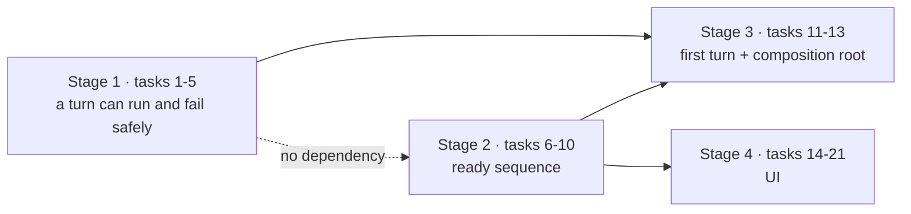

# MVP Blocker Fix Bundle Implementation Plan

> **For agentic workers:** REQUIRED SUB-SKILL: Use superpowers:subagent-driven-development (recommended) or superpowers:executing-plans to implement this plan task-by-task. Steps use checkbox (`- [ ]`) syntax for tracking.

**Goal:** Close the eleven defects that block the §11 acceptance walkthrough — a turn that can run and fail safely, a ready sequence that lists chats and enables preview, a first turn started from Home's Enter, and a UI that stays usable while a turn runs.

**Architecture:** Four stages, ordered by two real dependencies (see [Sequencing](#sequencing)). Stage 1 makes the turn machine correct at the transition level (`core/machines`, `core/turns`, `core/kernel`). Stage 2 makes one pass over `runProjectReadySequence` (`core/kernel/model/handlers/project.ts`) plus the `ChatStore.list()` surface it needs (`store`, `core/ports`). Stage 3 wires the composition root (`entrypoint`) and chains the first turn. Stage 4 lands two shared UI primitives first, then every screen-level fix on top of them.

**Tech Stack:** TypeScript 7 (`bunx tsc --noEmit`), Bun 1.3 (`bun test`), Reatom v1001, Zod v4, OpenTUI + React 19, `errore` (errors as values), oxlint/oxfmt.

## Global Constraints

Every task's requirements implicitly include this section.

- **Errors are values.** Never throw for an expected failure; return `Error | T` and narrow with `instanceof Error`. `.catch()` only at an uncontrolled async boundary, `errore.try` only at an uncontrolled sync boundary, and always wrap the cause in a tagged domain error. An error that is not propagated MUST be logged (`errore` rule 21).
- **`await wrap(...)` at every async boundary in `core`.** Code after an unwrapped `await` resumes outside the caller's `context.start(...)` frame and lands Reatom writes on the wrong instance. Every port call inside a `launchOperation` closure, inside `core/turns`, and inside `core/project` is already `await wrap(...)`-ed — keep it that way.
- **Never an async IIFE around Reatom work.** An inner `wrap()` does not cover the outer `await` over the IIFE. Keep the call flat (`core/kernel/model/handlers/turn.ts`'s own `evaluateSessionPlan` comment states this rule verbatim).
- **Long-lived effects need a lifetime owner** returning cleanup — `withConnectHook(...)`, never a bare module-level `effect` (RTM-L01/L02).
- **No casts.** No `as`, no `unknown`-bounce. Validate with the existing guards (`isUuidv7`, `parsePageSlug`, `isOperationalFailureCode`).
- **Design is a source of truth.** Every colour, glyph, literal and layout below is cited to `design/termcraft-engine.js` or a `design/*.dc.html` screen. Do not invent one; if the design does not cover a case, flag the gap in a code comment naming the closest faithful mapping.
- **Module shape.** `module/{ui/,model/,types.ts,index.ts}` — never loose files at a module root. Cross-module imports use the `tsconfig.json` path aliases, never a relative import that climbs out of the current module.
- **Never fabricate a fact.** A port that cannot answer honestly refuses (logged) rather than substituting a placeholder — this is the project's hardest rule and the reason several branches below refuse instead of defaulting.
- **Run `/reatom-audit` before reporting any task that touched Reatom code as done.**
- Verification commands: `bun test <path>` for a single file, `bun test` for the suite, `bunx tsc --noEmit` for types, `bun run lint` and `bun run fmt:check` before each commit.

## Sequencing



Stage 1 must precede stage 3: Gap C makes a turn the first thing a new user does, so shipping it before the admission-failure path would convert a rare way to brick the app into the default one.

## File Structure

**Created**

| File | Responsibility |
|---|---|
| `src/store/model/chat-listing.ts` | Pure, bounded forward scan of one chat file's prefix → `{chatId, createdAt, firstUserText}`. |
| `src/store/model/chat-listing.test.ts` | Unit tests for that scan (header identity, no user record, truncated prefix). |
| `src/ui/spinner/model/elapsed.ts` | The 1 s elapsed ticker atom + `formatElapsed`, connect-hook owned beside `spinnerGlyph`. |
| `src/ui/spinner/model/elapsed.test.ts` | `formatElapsed` table tests. |
| `src/ui/chat/model/turn-timeline.ts` | Pure fold/wrap of the turn's ordered timeline into renderable rows. |
| `src/ui/chat/model/turn-timeline.test.ts` | Fold/wrap unit tests. |
| `src/ui/text-input/ui/TextInput.tsx` | The one shared insertion-point input primitive (caret + value/placeholder + cursor cell). |
| `src/ui/text-input/ui/TextInput.test.tsx` | Cursor-placement render tests. |
| `src/ui/text-input/types.ts`, `src/ui/text-input/index.ts` | Module shape for the above. |
| `src/ui/home/ui/HomeHealthPanel.tsx` | The design's `homeHealth(kind)` panel (login / shutdown / sandbox). |

**Modified (primary responsibility of the change)**

| File | Change |
|---|---|
| `src/core/machines/model/turn-machine.ts` | One new `beginTerminalization` row: `admitting → terminalizing`. |
| `src/core/turns/types.ts` | `AdmissionInputV1` gains `turnId`. |
| `src/core/turns/model/admission.ts` | Stops applying `beginAdmission` and stops minting the turnId. |
| `src/core/turns/model/finalize.ts`, `.../terminalize.ts` | `onSettled` hook fired the instant `settle` applies. |
| `src/core/turns/model/run-turn.ts` | Threads `onSettled` into both. |
| `src/core/kernel/model/handlers/turn.ts` | `beginTurn` entry point; canonical vs workspace page paths; the rejection→terminalize→`turn.failed` path. |
| `src/core/kernel/model/handlers/project.ts` | Chat listing, `preview.enable`, first-turn chaining. |
| `src/core/kernel/model/handlers/preview-export.ts` | Re-pointed at `context.previewSessionCommands`; canonical `sourcePath`. |
| `src/core/ports/chat-store.ts` + `src/core/ports/fakes/*` | `ChatReader.list()`. |
| `src/store/types.ts`, `src/store/model/factory.ts`, `src/store/adapters/chat-store.ts` | `ChatStore.list()` end to end. |
| `src/store/toml/model/gitignore.ts` | `/chats/` row. |
| `src/core/protocol/model/command-payload.ts` | `project.open` gains optional `text`. |
| `src/entrypoint/model/create-shell.ts`, `.../run-app.ts`, `.../agent-health.ts`, `src/entrypoint/types.ts` | Open-vs-create discriminator, startup dispatch, synchronous agent selection. |
| `src/ui/status-bar/types.ts` + `ui/StatusBar.tsx` | The `dis` hint-key state. |
| `src/ui/actions/types.ts` + `model/registry.ts` | `ActionRowState.availability`; screen filtering. |
| `src/ui/app/model/keymap.ts`, `model/intent.ts`, `model/deps.ts`, `ui/App.tsx` | Home slash menu, live composer, health gating, agent selection. |
| `src/ui/mirror/types.ts` + `model/mirror.ts` | The ordered turn timeline and `startedAt`. |
| `src/ui/chat/ui/AgentStatusBlock.tsx`, `ui/Composer.tsx` | Reasoning log rows; shared cursor. |
| `src/ui/home/types.ts` + `ui/Home.tsx` | Five health outcomes, health line removed, `dis` hint. |
| `src/ui/workspace/ui/Workspace.tsx` | Composer no longer disabled mid-turn; timeline plumbing; `preview.selectPage`. |

**Docs updated in the task that causes the drift** — `docs/architecture/kernel-command-contract.md` §7.2 and §7.6, `docs/superpowers/specs/2026-07-16-production-storage-identity-design.md` §13, `docs/architecture/flows/launch.md`, `docs/architecture/flows/turn.md` (if present), `docs/runbooks/2026-07-25-mvp-acceptance-walkthrough.md` step 8.

## Deliberately out of scope

Named so nobody has to re-derive the boundary:

- Finding §3.1 (`console.*` never reaches the interactive TUI) — confirmed, not fixed here; every item below is diagnosable without it once terminal events actually publish.
- Finding §1.4's two chat-popup cosmetics (the `· /new` footer hint, the raw ISO `WHEN` column). They are Gap E in the *findings* document but the spec's §2.1 covers only the listing. **Flagged, not fixed** — they remain open defects, not accepted behaviour.
- Everything in `docs/mvp-remaining-work.md` §4 and the §6 instrumentation decisions.

## Concern raised before starting

`resolvePageSettings` (`core/kernel/model/handlers/preview-export.ts:128`) builds `HostSessionSpecV1.sourcePath` as the relative `pages/<slug>.tsx` — the *workspace* convention — and the host child resolves it with `Bun.file(args.sourcePath)` (`host/session/model/source-mount.ts:113`). That is the same substitution as Gap G, on the preview path, and it will make Gap A's "first live run" fail even after §2.2/§2.3 land. It is not named in the spec; **Task 10 fixes it** under the same helper Task 1 introduces, because otherwise the bundle's headline promise (the preview renders) cannot hold.

---

# Stage 1 — a turn can run, and can fail safely

## Task 1: Gap G — the canonical page path

`handlers/turn.ts:782` builds each page's canonical source as `${projectStore.root}/${pageFileRelPath(slug)}` where `pageFileRelPath` returns `pages/<slug>.tsx` — the *agent workspace's* flat layout. Canonical storage is `<root>/.termcraft/pages/<slug>/page.tsx` (`store/safe-fs/model/limits.ts:134-135` says so in prose; `store/transaction/model/wrappers.ts:71`'s `canonicalPagePath` is the same convention). Admission therefore fails its `workspace` phase with ENOENT for every page the project owns.

**Files:**
- Modify: `src/core/kernel/model/handlers/turn.ts:407-412, 782, 917, 926-927, 954`
- Test: `src/core/kernel/model/handlers/turn.test.ts`

**Interfaces:**
- Consumes: nothing from earlier tasks.
- Produces: two exported-by-name-only module helpers used by later tasks' reviewers as the naming precedent — `canonicalPageSourcePath(projectRoot: string, pageSlug: PageSlug): string` and `workspacePageRelPath(pageSlug: PageSlug): string`. Task 10 imports neither; it copies the canonical convention with its own citation.

- [ ] **Step 1: Write the failing test**

Append to `src/core/kernel/model/handlers/turn.test.ts`. The existing file already builds a `HandlerContext` — reuse its local `createContext`/fixture helpers rather than inventing new ones; the assertion below only needs the `StagingService` fake to record what it was handed.

```ts
describe("turn.start — canonical page source paths (Gap G)", () => {
  it("hands staging the CANONICAL page path, not the agent workspace's flat one", async () => {
    const capturedPages: string[] = [];
    const context = createContext({
      pageReader: {
        listSlugs: async () => [PAGE_SLUG],
        readSource: async () => ({ bytes: new TextEncoder().encode("x"), sourceHash: TEST_SHA }),
      },
      staging: {
        ...fakeStaging(),
        createTurnWorkspace: async (input) => {
          for (const page of input.pages) capturedPages.push(page.sourcePath);
          return fakeWorkspace();
        },
      },
    });

    await dispatchTurnStart(context, { text: "hello" });

    expect(capturedPages).toEqual([`${context.deps.projectStore.root}/.termcraft/pages/${PAGE_SLUG}/page.tsx`]);
  });
});
```

- [ ] **Step 2: Run test to verify it fails**

Run: `bun test src/core/kernel/model/handlers/turn.test.ts -t "canonical page path"`
Expected: FAIL — received `<root>/pages/<slug>.tsx`.

- [ ] **Step 3: Rename the workspace helper and add the canonical one**

Replace `handlers/turn.ts:407-412`:

```ts
/**
 * The agent WORKSPACE's own flat page-file convention (`store/sandbox/model/staging-store.ts`'s
 * `stageAllFiles`, transcribed by `core/turns/model/candidate.ts`'s `PAGE_FILE_PATTERN`):
 * `pages/<slug>.tsx`, relative to a STAGED workspace or candidate root — never to the project
 * root. Named for its namespace after Gap G, where the un-namespaced old name (`pageFileRelPath`)
 * let the same helper be joined onto `projectStore.root` and produce a path that does not exist.
 */
function workspacePageRelPath(pageSlug: PageSlug): string {
  return `pages/${pageSlug}.tsx`;
}

/** The directory canonical project state lives in, under the project root (storage-identity §4). */
const PROJECT_STATE_DIRNAME = ".termcraft";

/**
 * CANONICAL page storage, absolute: `<projectRoot>/.termcraft/pages/<slug>/page.tsx`.
 * `store/safe-fs/model/limits.ts:134-135` states the rule in prose ("deliberately NOT the
 * agent's flat `pages/<slug>.tsx` shape") and `store/transaction/model/wrappers.ts`'s
 * `canonicalPagePath` is its `.termcraft`-relative half. `core` may not import `store`, so the
 * convention is transcribed here rather than shared — the same way `./preview-export.ts` already
 * names `.termcraft/export` for its own destination.
 */
function canonicalPageSourcePath(projectRoot: string, pageSlug: PageSlug): string {
  return `${projectRoot}/${PROJECT_STATE_DIRNAME}/pages/${pageSlug}/page.tsx`;
}
```

- [ ] **Step 4: Point each call site at the namespace it means**

At `:780-783` (the `pages`/`canonicalPages` loop) — this is the one that was wrong:

```ts
    pages.push({
      pageSlug,
      sourcePath: canonicalPageSourcePath(context.deps.projectStore.root, pageSlug),
    });
```

At `:917`, `:926-927` and `:954` — all resolved against `candidate.root`, a staged workspace, where the flat shape is right — rename only:

```ts
      source: decodeCachedUtf8(cachingStaging, candidate.root, workspacePageRelPath(pageSlug)),
      fileName: workspacePageRelPath(pageSlug),
      sourcePath: `${candidate.root}/${workspacePageRelPath(pageSlug)}`,
```

```ts
      const bytes = cachingStaging.readCandidateBytes(
        candidate.root,
        workspacePageRelPath(change.pageSlug),
      );
```

- [ ] **Step 5: Run the test to verify it passes**

Run: `bun test src/core/kernel/model/handlers/turn.test.ts`
Expected: PASS, and no other test in the file regresses.

- [ ] **Step 6: Add the staging-level regression the current coverage cannot catch**

Today's staging tests either stage zero pages or supply paths directly, so the one construction that matters — a real canonical layout on disk — is never exercised. Append to `src/store/adapters/staging.test.ts`:

```ts
it("stages a page whose source sits at the canonical <root>/.termcraft/pages/<slug>/page.tsx", async () => {
  const root = await makeTempProjectRoot();
  await Bun.write(`${root}/.termcraft/pages/main/page.tsx`, "export default 1;\n");
  const staging = createStagingAdapter(adapterDeps(root));

  const workspace = await staging.createTurnWorkspace({
    turnId: TURN_ID,
    targetChatId: CHAT_ID,
    pages: [{ pageSlug: "main", sourcePath: `${root}/.termcraft/pages/main/page.tsx` }],
    manifestSlice: new TextEncoder().encode("{}"),
    runtimeDocs: [],
    readSet: EMPTY_READ_SET,
  });

  expect("code" in workspace).toBe(false);
  if ("code" in workspace) return;
  expect(workspace.files.map((f) => f.relPath)).toContain("pages/main.tsx");
});
```

- [ ] **Step 7: Run it**

Run: `bun test src/store/adapters/staging.test.ts`
Expected: PASS.

- [ ] **Step 8: Commit**

```bash
rtk git add src/core/kernel/model/handlers/turn.ts src/core/kernel/model/handlers/turn.test.ts src/store/adapters/staging.test.ts && rtk git commit -m "fix(core): resolve canonical page sources through canonical storage (Gap G)"
```

---

## Task 2: the turn machine gains a failed-admission edge

`admitting` has exactly two outgoing edges, neither of which a rejected admission can take. `beginTerminalization` gains one row — an existing action, one new source phase, no new vocabulary.

**Files:**
- Modify: `src/core/machines/model/turn-machine.ts:103-107`
- Modify: `docs/architecture/kernel-command-contract.md` §7.2 (the turn transition table)
- Test: `src/core/machines/model/turn-machine.test.ts`

**Interfaces:**
- Consumes: nothing.
- Produces: `TURN_TRANSITION_TABLE.beginTerminalization` accepts `from: "admitting"`. Tasks 4 and 5 depend on it.

- [ ] **Step 1: Write the failing test**

Append to `src/core/machines/model/turn-machine.test.ts`:

```ts
it("admitting can terminalize — a rejected admission has an exit (spec §1.1)", () => {
  const machine = reatomTurnStateMachine();
  expect(machine.apply("beginAdmission").kind).toBe("changed");
  expect(machine.phase()).toBe("admitting");

  const bridged = machine.apply("beginTerminalization");
  expect(bridged.kind).toBe("changed");
  expect(machine.phase()).toBe("terminalizing");
});
```

- [ ] **Step 2: Run it**

Run: `bun test src/core/machines/model/turn-machine.test.ts -t "rejected admission has an exit"`
Expected: FAIL — `apply` returns `{kind: "illegal", code: "TURN_ALREADY_ACTIVE"}`.

- [ ] **Step 3: Add the row**

`turn-machine.ts:100-107`:

```ts
  // `admitting | beginTerminalization | terminalizing` — ADDED (fix-bundle spec §1.1, and
  // kernel-command-contract §7.2's matching new row). §7.2's table shipped `admitting` with
  // exactly two exits, `finishAdmission` and `requestCancel`, and `requestCancel` needs a
  // `turnId` a rejected admission never surfaced — so a failed admission had no edge at all and
  // stranded the machine in `admitting` for the life of the process. This is the outcome that
  // happens most often on a real project, so the table has to model it.
  // `stopping | beginTerminalization | terminalizing`
  // `validating | beginTerminalization | terminalizing`
  // `finalizing | beginTerminalization | terminalizing`
  beginTerminalization: [
    { from: "admitting", to: "terminalizing" },
    { from: "stopping", to: "terminalizing" },
    { from: "validating", to: "terminalizing" },
    { from: "finalizing", to: "terminalizing" },
  ],
```

- [ ] **Step 4: Run it**

Run: `bun test src/core/machines/model/turn-machine.test.ts`
Expected: PASS.

- [ ] **Step 5: Amend the contract**

In `docs/architecture/kernel-command-contract.md` §7.2's turn table, add the row beside the existing `beginTerminalization` rows and a one-line note:

```
| `admitting` | `kernel.turn.beginTerminalization` | `terminalizing` | A failed admission. Amended 2026-07-26 (MVP blocker fix bundle §1.1): the original table gave `admitting` no exit for the outcome that occurs most often on a real project, which stranded the turn machine for the life of the process. |
```

- [ ] **Step 6: Commit**

```bash
rtk git add src/core/machines/model/turn-machine.ts src/core/machines/model/turn-machine.test.ts docs/architecture/kernel-command-contract.md && rtk git commit -m "feat(core): give a failed admission an edge out of admitting (spec §1.1)"
```

---

## Task 3: the turnId moves to the transition — one `beginTurn` entry point

`runAdmission` mints the id one line *after* it applies `beginAdmission`, and the id only reaches `activeTurnIdAtom` when the first `turn.attemptStarted` publishes — which a rejected admission never does. The invariant (`core/capabilities/types.ts:93`: the active turn's id, or `null` exactly when `phase === "idle"`) rests on three steps being atomic, so all three move into the handler, with no `await` between them. The precedent is exact: `beginProjectOpen` (`handlers/project.ts:619-630`) applies its transition synchronously in the handler and mints its `operationId` beside it.

Minting in the handler while leaving `beginAdmission` inside `runAdmission` is **not** acceptable: `setActiveTurnId` would land before the machine leaves `idle`, producing the mirror-image break.

**Files:**
- Modify: `src/core/turns/types.ts:61-67`
- Modify: `src/core/turns/model/admission.ts:127-136`
- Modify: `src/core/kernel/model/handlers/turn.ts` (`runTurnStart`'s signature, `handleTurnStart`, the `publish` closure)
- Test: `src/core/turns/model/admission.test.ts`, `src/core/kernel/model/handlers/turn.test.ts`

**Interfaces:**
- Consumes: Task 2's `admitting → terminalizing` row (not exercised here, but `beginTurn` is the function Task 4 hangs the rejection path off).
- Produces:
  - `AdmissionInputV1` gains `readonly turnId: UUIDv7`.
  - `runAdmission(deps, input)` is entered with the machine **already** in `admitting` and applies no `beginAdmission` of its own.
  - `export function beginTurn(context: HandlerContext, input: { readonly text: string }): readonly PublishableEventV1[]` — used by `handleTurnStart` here and by `runProjectReadySequence` in Task 11.

- [ ] **Step 1: Write the failing tests**

In `src/core/turns/model/admission.test.ts`, replace the "applies beginAdmission" expectations with the new contract:

```ts
it("is entered already admitting — the caller owns the transition (spec §1.2)", async () => {
  const machine = reatomTurnStateMachine();
  machine.apply("beginAdmission");

  const outcome = await runAdmission(deps(machine), {
    ...ADMISSION_INPUT,
    turnId: TURN_ID,
  });

  expect(outcome.kind).toBe("workspace-ready");
  if (outcome.kind !== "workspace-ready") return;
  expect(outcome.context.turnId).toBe(TURN_ID);
  expect(machine.phase()).toBe("workspace-ready");
});
```

In `src/core/kernel/model/handlers/turn.test.ts`:

```ts
it("records the active turn id in the same synchronous step as beginAdmission (spec §1.2)", () => {
  const context = createContext();
  const seen: (string | null)[] = [];
  context.setActiveTurnId = (id) => seen.push(id);

  const outcome = turnHandlers["turn.start"]({ text: "hello" }, context);

  expect(outcome.disposition).toBe("started");
  expect(context.machines.turn.phase()).toBe("admitting");
  expect(seen).toHaveLength(1);
  expect(seen[0]).not.toBeNull();
});
```

- [ ] **Step 2: Run them**

Run: `bun test src/core/turns/model/admission.test.ts src/core/kernel/model/handlers/turn.test.ts`
Expected: FAIL — `runAdmission` returns `{kind:"illegal"}` (it re-applies `beginAdmission` from `admitting`), and `setActiveTurnId` is never called synchronously.

- [ ] **Step 3: Widen `AdmissionInputV1`**

`src/core/turns/types.ts`:

```ts
export interface AdmissionInputV1 {
  /**
   * Minted by the CALLER, in the same synchronous step that applied `beginAdmission` and
   * recorded the id as the Kernel's active turn (fix-bundle spec §1.2). It is not minted here
   * any more: an id born inside this function could not reach `activeTurnIdAtom` until the first
   * `turn.attemptStarted` published, which a rejected admission never does — so every non-idle
   * phase reached through a failed admission carried a `null` active turn id and could not be
   * cancelled. See `core/kernel/model/handlers/turn.ts`'s `beginTurn` for the trio.
   */
  readonly turnId: UUIDv7;
  readonly targetChatId: string;
  readonly text: string;
  readonly selection?: ChatSelection;
  readonly candidatePins: readonly AdmissionCandidatePinV1[];
  readonly workspace: AdmissionWorkspaceMaterialV1;
}
```

Add `UUIDv7` to the existing `core/protocol` type import at the top of the file (it already imports `CommandRejectionCode, FailureDtoV1, UUIDv7` — confirm and leave unchanged if so).

- [ ] **Step 4: Stop `runAdmission` transitioning and minting**

`src/core/turns/model/admission.ts` — replace lines 127-136:

```ts
export async function runAdmission(
  deps: AdmissionDeps,
  input: AdmissionInputV1,
): Promise<AdmissionOutcomeV1> {
  // ENTERED ALREADY `admitting` (fix-bundle spec §1.2). The `idle -> admitting` transition and
  // `setActiveTurnId(input.turnId)` are applied together, synchronously, by
  // `core/kernel/model/handlers/turn.ts`'s `beginTurn` — with no `await` between them, which is
  // what the "non-idle phase implies a non-null activeTurnId" invariant actually rests on
  // (`core/capabilities/types.ts`). This function therefore neither applies `beginAdmission` nor
  // mints a turnId of its own; `finishAdmission` below is still its job.
  const turnId = input.turnId;
  const createdAt = deps.clock.now().toISOString();
```

The header comment block above the function still says "the transition is checked FIRST so a rejected admission (already active) never wastes a `turnId` or touches a port" — replace that sentence with:

```
 * §7.2's `beginAdmission` row is one bundled rule: "Mints `turnId`; captures target chat,
 * valid selection, and resolvable open pins." The MINT half moved to the caller (fix-bundle
 * spec §1.2 — see the body); the capture half is still exactly what runs below. The caller has
 * already proven `beginAdmission` was legal before this function is ever entered, so a turn
 * that is already active never reaches here at all.
```

`deps.machine` is still needed for `finishAdmission`; leave `AdmissionDeps` unchanged. `uuidv7` stays imported — it still mints `userRecord.recordId`.

- [ ] **Step 5: Extract `beginTurn` in the handler**

In `src/core/kernel/model/handlers/turn.ts`, change `runTurnStart`'s signature to take the id and text directly, and replace `handleTurnStart`:

```ts
async function runTurnStart(
  turnId: UUIDv7,
  text: string,
  context: HandlerContext,
): Promise<readonly PublishableEventV1[]> {
```

Inside it, every former `payload.text` becomes `text`, and the `admission` literal gains the id:

```ts
  const admission: AdmissionInputV1 = {
    turnId,
    targetChatId: activeChatId,
    text,
    ...(selection !== null ? { selection } : {}),
    candidatePins,
    workspace: { /* unchanged */ },
  };
```

and `baseTask.userMessage: text`.

The `publish` closure drops `capturedTurnId` entirely — the id is now known before the operation starts:

```ts
  let startedPublished = false;
  function publish(
    event:
      | PublishableEventV1<"turn.attemptStarted">
      | PublishableEventV1<"turn.progress">
      | PublishableEventV1<"turn.gateRejected">,
  ): void {
    if (!startedPublished && event.kind === "turn.attemptStarted") {
      startedPublished = true;
      // See this file's header, "TURN.STARTED — NOW PUBLISHED". `setActiveTurnId` is NOT called
      // here any more: `beginTurn` recorded the id synchronously, before this operation ever
      // launched (fix-bundle spec §1.2).
      if (isUuidv7(admittedChatId)) {
        context.publishOperationEvent({
          kind: "turn.started",
          payload: { turnId, chatId: admittedChatId, deadline: event.payload.deadline },
          correlation: { turnId },
        });
      } else {
        console.warn(
          `core/kernel/handlers/turn: turn.start's activeChatId "${admittedChatId}" is not a valid UUIDv7 — turn.started skipped (defensive only)`,
        );
      }
    }
    context.publishOperationEvent(event);
  }
```

Delete the `if (capturedTurnId === null) { … return []; }` block and replace every remaining `capturedTurnId` with `turnId`.

Then, replacing `handleTurnStart`:

```ts
/**
 * THE ONE ENTRY POINT INTO A TURN (fix-bundle spec §1.6). `turn.start`'s handler and
 * `runProjectReadySequence`'s first-turn chain (spec §3.1) both call this, so "one path" is
 * literal rather than aspirational.
 *
 * The three steps below run with NO `await` between them — mint the id, apply `beginAdmission`,
 * record the id — because that atomicity IS the invariant `core/capabilities/types.ts` states
 * (a non-idle phase always carries a non-null `activeTurnId`). The invariant survives this being
 * called from inside an async closure (the ready sequence's case): it rests on the trio, not on
 * being in a command handler. `./project.ts`'s `beginProjectOpen` is the exact precedent —
 * transition applied synchronously in the handler, its own id minted beside it, `launchOperation`
 * only afterwards.
 *
 * Returns the admission events the caller must publish. An illegal `beginAdmission` returns `[]`
 * (logged) and launches nothing.
 */
export function beginTurn(
  context: HandlerContext,
  input: { readonly text: string },
): readonly PublishableEventV1[] {
  const turnId = uuidv7();
  const began = context.machines.turn.apply("beginAdmission");
  if (began.kind === "illegal") {
    console.warn(
      `core/kernel/handlers/turn: beginTurn refused — beginAdmission was illegal (${began.code})`,
    );
    return [];
  }
  if (began.kind !== "changed") return [];
  context.setActiveTurnId(turnId);
  context.launchOperation("kernel.turn.run", () => runTurnStart(turnId, input.text, context));
  return [turnStateChangedEvent("kernel.turn.beginAdmission", began, { turnId })];
}

function handleTurnStart(
  payload: CommandPayloadByKindV1["turn.start"],
  context: HandlerContext,
): CommandOutcomeV1 {
  return startedOutcome(beginTurn(context, { text: payload.text }));
}
```

Export `beginTurn` from the module (it stays a named export of `handlers/turn.ts`; `handlers/project.ts` imports it directly as a sibling — `./turn`).

- [ ] **Step 6: Run the tests**

Run: `bun test src/core/turns src/core/kernel/model/handlers/turn.test.ts && bunx tsc --noEmit`
Expected: PASS. Other suites that count `turn.start`'s events now see one `kernel.stateChanged` where they saw none — update those expectations; they were pinning the revision-desync bug.

- [ ] **Step 7: Commit**

```bash
rtk git add src/core/turns src/core/kernel/model/handlers/turn.ts src/core/kernel/model/handlers/turn.test.ts && rtk git commit -m "refactor(core): mint the turnId at the transition behind one beginTurn entry point (spec §1.2, §1.6)"
```

---

## Task 4: a rejected admission terminalizes and publishes `turn.failed`

The `admission-rejected` branch logs and returns an empty event list — so the machine stays in `admitting`, and because `applyTransition` advances the revision *before* publishing, every subscriber desynchronises by construction (the observed `STALE_REVISION` nine minutes later). Both halves close together: reuse the existing terminalize path, and return the real cause the value already carries.

**Files:**
- Modify: `src/core/kernel/model/handlers/turn.ts` (`runTurnStart`'s rejection branch, two new helpers)
- Test: `src/core/kernel/model/handlers/turn.test.ts`, `src/core/turns/model/admission.test.ts`

**Interfaces:**
- Consumes: Task 2's `admitting → terminalizing` row; Task 3's `beginTurn`/`runTurnStart(turnId, text, context)` signature.
- Produces: nothing new for later tasks.

- [ ] **Step 1: Write the failing tests**

`src/core/kernel/model/handlers/turn.test.ts`:

```ts
describe("turn.start — a rejected admission (Gap F)", () => {
  it("returns to idle, publishes turn.failed naming the phase, and accepts the next turn.start", async () => {
    const context = createContext({
      staging: {
        ...fakeStaging(),
        createTurnWorkspace: async () => ({
          code: "PERSISTENCE_FAILED" as const,
          retryable: false,
          safeMessage: "filesystem open failed (ENOENT)",
          details: {},
        }),
      },
    });

    const events = await dispatchTurnStartAndSettle(context, { text: "hello" });

    expect(context.machines.turn.phase()).toBe("idle");
    expect(context.activeTurnId()).toBeNull();

    const failed = events.find((e) => e.kind === "turn.failed");
    expect(failed).toBeDefined();
    expect(failed?.payload.failure?.safeMessage).toContain("workspace");
    expect(failed?.payload.failure?.safeMessage).toContain("ENOENT");

    // The hang itself: a second start must be accepted, not TURN_ALREADY_ACTIVE.
    const second = turnHandlers["turn.start"]({ text: "again" }, context);
    expect(second.disposition).toBe("started");
  });

  it("writes a durable system:error chat record for the rejected admission", async () => {
    const terminalized: unknown[] = [];
    const context = createContext({
      turnTransactions: {
        ...fakeTurnTransactions(),
        terminalize: async (input) => {
          terminalized.push(input.record);
          return { transactionId: "tx-1" };
        },
      },
      staging: { ...fakeStaging(), createTurnWorkspace: async () => PERSISTENCE_FAILURE },
    });

    await dispatchTurnStartAndSettle(context, { text: "hello" });

    expect(terminalized).toHaveLength(1);
  });
});
```

In `src/core/turns/model/admission.test.ts`, rewrite the four assertions at `:221, :234, :261, :275` that pin `phase() === "admitting"` after a `blocked` result. `runAdmission` itself no longer owns the exit, so each becomes a statement about what it returned, not where it left the machine:

```ts
  expect(outcome).toEqual({ kind: "blocked", phase: "workspace", failure: PERSISTENCE_FAILURE });
  // The exit from `admitting` belongs to the caller now (spec §1.3) — asserted end to end in
  // `core/kernel/model/handlers/turn.test.ts`'s "a rejected admission" describe block.
  expect(machine.phase()).toBe("admitting");
```

- [ ] **Step 2: Run them**

Run: `bun test src/core/kernel/model/handlers/turn.test.ts -t "rejected admission"`
Expected: FAIL — phase stays `admitting`, no `turn.failed`, second start rejected.

- [ ] **Step 3: Add the failure-DTO derivation**

In `handlers/turn.ts`, beside `terminalFailureDto`:

```ts
/**
 * The real cause, from the value that already carried it (fix-bundle spec §1.4).
 * `AdmissionOutcomeV1`'s `blocked` variants carry `phase`
 * (`admit | chat-append-base | workspace | read-set | fence`) plus either a real `FailureDtoV1`
 * or a typed translation/fence error — all of which used to be discarded at the log line. That
 * discard is exactly why the observed rejection went unexplained until a temporary trace widening
 * named it on the first re-run; the durable half is this DTO.
 *
 * A real `FailureDtoV1` is spread verbatim so its own `code`/`details` survive — including the
 * two codes whose wire schema demands a typed `details.part` (`APPLY_SOURCE_CHANGED`,
 * `APPLY_STALE`), which is why this needs none of `terminalFailureDto`'s exclusion set: nothing
 * is reconstructed here, only re-messaged.
 */
function admissionFailureDto(
  outcome: Exclude<AdmissionOutcomeV1, { kind: "workspace-ready" }>,
): FailureDtoV1 {
  if (outcome.kind === "illegal") {
    return {
      code: "PERSISTENCE_FAILED",
      retryable: false,
      safeMessage: `the turn could not be admitted (${outcome.code})`,
      details: {},
    };
  }
  if ("failure" in outcome) {
    return {
      ...outcome.failure,
      safeMessage: `admission failed at the ${outcome.phase} phase: ${outcome.failure.safeMessage}`,
    };
  }
  return {
    code: "PERSISTENCE_FAILED",
    retryable: false,
    safeMessage: `admission failed at the ${outcome.phase} phase: ${outcome.error.message}`,
    details: { phase: outcome.phase },
  };
}
```

Add `AdmissionOutcomeV1` to the existing `core/turns` type import.

- [ ] **Step 4: Reuse the existing terminalize path**

Also in `handlers/turn.ts`:

```ts
/**
 * A rejected admission takes the SAME `terminalizeTurn` every other non-committing outcome
 * already takes (fix-bundle spec §1.3): it applies `finishTerminalization`, durably writes a
 * `system:error` chat record, and applies `settle` back to `idle`. No separate path for a failed
 * admission exists, and none is invented here.
 *
 * `turnTransactions.terminalize` builds and appends its OWN record from this input — it does not
 * depend on the turn's user record having committed — so a rejection blocked at the `admit`
 * phase still leaves a durable trace, matching what the orphan-turn scan already writes on
 * restart (turn-durability §7.7).
 */
async function terminalizeRejectedAdmission(
  context: HandlerContext,
  turnId: UUIDv7,
  targetChatId: string,
  outcome: Exclude<AdmissionOutcomeV1, { kind: "workspace-ready" }>,
): Promise<readonly PublishableEventV1[]> {
  const failure = admissionFailureDto(outcome);

  const bridged = context.machines.turn.apply("beginTerminalization");
  if (bridged.kind === "illegal") {
    // Defensive only — `admitting -> terminalizing` is a table row as of spec §1.1, and the
    // machine cannot have left `admitting` while this operation owned it. Logged, never swallowed.
    console.warn(
      `core/kernel/handlers/turn: beginTerminalization was illegal for turn ${turnId}'s rejected admission (${bridged.code})`,
    );
  }

  const terminalized = await wrap(
    terminalizeTurn(
      {
        machine: context.machines.turn,
        turnTransactions: context.deps.turnTransactions,
        staging: context.deps.staging,
        // Spec §1.5: cleared the instant `settle` applies, never after post-settle disk work.
        onSettled: () => context.setActiveTurnId(null),
      },
      {
        turnId,
        targetChatId,
        outcome: "failed",
        text: failure.safeMessage,
        reason: failure.code,
        createdAt: context.deps.clock.now().toISOString(),
        // No candidate has ever been frozen for a turn that never reached an attempt.
        candidateRoot: null,
      },
    ),
  );

  if (terminalized.kind === "illegal") {
    console.warn(
      `core/kernel/handlers/turn: terminalizeTurn was illegal for turn ${turnId}'s rejected admission (${terminalized.code}) — clearing the active turn id directly so the machine is not stranded`,
    );
    context.setActiveTurnId(null);
  }

  return [
    {
      kind: "turn.failed",
      payload: { turnId, outcome: "failed", changedPages: [], warnings: [], failure },
      correlation: { turnId },
    },
  ];
}
```

Import `terminalizeTurn` from `core/turns` (add to the existing import list).

- [ ] **Step 5: Replace the empty-list branch**

In `runTurnStart`, replace the whole `if (result.kind === "admission-rejected") { … return []; }` block (including the temporary 2026-07-26 trace widening — its job is done, and its finding is now durable in `admissionFailureDto`):

```ts
  if (result.kind === "admission-rejected") {
    // Spec §1.4: an accepted command must reach a terminal event. Returning `[]` here advanced
    // the Kernel's revision with nothing published, which desynchronised every subscriber by
    // construction — the `STALE_REVISION` rejection on the NEXT `turn.start` was that desync,
    // not a second bug, and it disappears with this return value rather than a separate fix.
    return terminalizeRejectedAdmission(context, turnId, admittedChatId, result.outcome);
  }
```

- [ ] **Step 6: Run everything**

Run: `bun test src/core/turns src/core/kernel && bunx tsc --noEmit`
Expected: PASS.

- [ ] **Step 7: Amend the runbook's diagnosis note (optional but cheap)**

`docs/mvp-remaining-work.md` §1.5's "We still do not know why the admission was rejected" paragraph is answered — leave the finding as history but append `**Answered 2026-07-26 — Gap G (§1.6); the deciding fact was in the returned value the whole time.**`

- [ ] **Step 8: Commit**

```bash
rtk git add src/core/kernel/model/handlers/turn.ts src/core/kernel/model/handlers/turn.test.ts src/core/turns/model/admission.test.ts docs/mvp-remaining-work.md && rtk git commit -m "fix(core): terminalize a rejected admission and publish its real cause (Gap F, spec §1.3-§1.4)"
```

---

## Task 5: close the mirror-image window — clear the id where the machine settles

`setActiveTurnId(null)` runs after `runTurn` resolves, by which time the machine has already settled to `idle` and done its post-settle disk work. That leaves `phase === "idle"` with a non-null `activeTurnId` — a window in which a new `turn.start` passes the guard and the *old* handler then clears the *new* turn's id.

**Files:**
- Modify: `src/core/turns/model/finalize.ts` (deps + one call after `settle`)
- Modify: `src/core/turns/model/terminalize.ts` (deps + one call after `settle`)
- Modify: `src/core/turns/model/run-turn.ts` (thread it into both)
- Modify: `src/core/kernel/model/handlers/turn.ts` (wire it; delete the late clear)
- Test: `src/core/kernel/model/handlers/turn.test.ts`, `src/core/capabilities/model/turn-lock.test.ts`

**Interfaces:**
- Consumes: Tasks 3 and 4.
- Produces: `FinalizeTurnDeps.onSettled?: () => void`, `TerminalizeTurnDeps.onSettled?: () => void`, `RunTurnDeps.onSettled?: () => void` — called exactly once per turn, the instant `settle` applies.

- [ ] **Step 1: Write the failing invariant test**

Append to `src/core/kernel/model/handlers/turn.test.ts`. Drive it through a real dispatch sequence — the only existing test on this invariant (`core/capabilities/model/turn-lock.test.ts:156-171`) hand-builds the broken snapshot and asserts the degraded fallback, so it proves nothing about production.

```ts
it("every non-idle phase implies a non-null activeTurnId, and idle implies null (spec §1.5)", async () => {
  const context = createContext();
  const observed: { phase: string; id: string | null }[] = [];
  const record = () => observed.push({ phase: context.machines.turn.phase(), id: context.activeTurnId() });

  context.machines.turn.phaseAtom.subscribe(record);
  await dispatchTurnStartAndSettle(context, { text: "hello" });
  record();

  for (const sample of observed) {
    if (sample.phase === "idle") expect(sample.id).toBeNull();
    else expect(sample.id).not.toBeNull();
  }
});
```

- [ ] **Step 2: Run it**

Run: `bun test src/core/kernel/model/handlers/turn.test.ts -t "non-idle phase implies"`
Expected: FAIL — the final sample is `{phase: "idle", id: <turnId>}`.

- [ ] **Step 3: Add the hook to `finalize.ts`**

In `FinalizeTurnDeps`:

```ts
  /**
   * Fired the INSTANT `settle` applies and the machine is back in `idle` — before this function's
   * own post-settle candidate retirement (fix-bundle spec §1.5). The Kernel's `activeTurnId`
   * clears here and nowhere else: clearing it after `finalizeTurn`/`runTurn` resolves left a
   * window where `phase === "idle"` still carried the finished turn's id, so a new `turn.start`
   * passed the guard and the OLD handler then cleared the NEW turn's id. Optional and additive,
   * mirroring `RunTurnDeps.onAttemptStarted`'s own producer-hook shape.
   */
  readonly onSettled?: () => void;
```

At `finalize.ts:171-175`:

```ts
  const settled = deps.machine.apply("settle");
  if (settled.kind === "illegal") return { kind: "illegal", code: settled.code };
  deps.onSettled?.();
```

- [ ] **Step 4: Add the same hook to `terminalize.ts`**

In `TerminalizeTurnDeps`, the identical field with a `{@link FinalizeTurnDeps.onSettled}`-style cross-reference comment. At `terminalize.ts:194-197`:

```ts
  // Unconditional: §7.2 allows this edge on EITHER a recorded outcome or a typed
  // unrecorded condition — see this file's header.
  deps.machine.apply("settle");
  // See `FinalizeTurnDeps.onSettled` — fired before the post-settle retirement below, so the
  // Kernel's active turn id never outlives the phase that justified it (fix-bundle spec §1.5).
  deps.onSettled?.();

  // The turn is DONE either way now — see this file's header, "CANDIDATE RETIREMENT".
  await retireIfCandidateFrozen(deps.staging, input.candidateRoot);
```

- [ ] **Step 5: Thread it through `run-turn.ts`**

Add `readonly onSettled?: () => void;` to `RunTurnDeps` with a one-line doc pointing at the two consumers, then:

```ts
    const terminalizeDeps: TerminalizeTurnDeps = {
      machine: deps.machine,
      turnTransactions: deps.turnTransactions,
      staging: deps.staging,
      ...(deps.onSettled !== undefined ? { onSettled: deps.onSettled } : {}),
    };
```

```ts
    const finalizeDeps: FinalizeTurnDeps = {
      machine: deps.machine,
      turnTransactions: deps.turnTransactions,
      deadlines: deps.deadlines,
      staging: deps.staging,
      ...(deps.onSettled !== undefined ? { onSettled: deps.onSettled } : {}),
    };
```

- [ ] **Step 6: Wire it and delete the late clear**

In `handlers/turn.ts`'s `runTurnDeps`:

```ts
    onCommitIntentRecorded: (recorded) => context.setCommitIntentRecorded(recorded),
    // Spec §1.5 — the one place the active turn id is cleared on a turn that actually ran.
    onSettled: () => context.setActiveTurnId(null),
```

and delete `context.setActiveTurnId(null);` from after the `await wrap(runTurn(...))`, keeping `context.setCommitIntentRecorded(false);` and `context.turnRunner.setActiveAttempt(null);` exactly where they are.

- [ ] **Step 7: Run everything**

Run: `bun test src/core && bunx tsc --noEmit`
Expected: PASS. `core/capabilities/model/turn-lock.test.ts:156-171` still passes — it tests the degraded fallback for a hand-built snapshot, which stays a legitimate defensive behaviour.

- [ ] **Step 8: Also fix the `turn.cancel`-from-`admitting` test**

`core/kernel/model/handlers/turn.test.ts:1779-1781` reaches `admitting` by calling `setActiveTurnId(TURN_ID)` by hand — a state production could never construct, which is why it passed while the real path could not cancel at all. Reach it the way production now does:

```ts
  const [admissionEvent] = turnHandlers["turn.start"]({ text: "hello" }, context);
  expect(context.machines.turn.phase()).toBe("admitting");
  const turnId = context.activeTurnId();
  expect(turnId).not.toBeNull();
  if (turnId === null) return;

  const cancelled = turnHandlers["turn.cancel"]({ turnId }, context);
  expect(cancelled.disposition).not.toBe("no-op");
```

- [ ] **Step 9: Commit**

```bash
rtk git add src/core/turns src/core/kernel && rtk git commit -m "fix(core): clear the active turn id where the machine settles (spec §1.5)"
```

---

# Stage 2 — the ready sequence

Stage 2 is one pass over `runProjectReadySequence` because it receives three independent edits (the chat listing, `kernel.preview.enable`, and — in Task 12 — the pages-or-chats predicate's inputs). Split across stages that is three re-readings and three re-tests of one sequence, each renegotiating the order of steps inside it. Tasks 6 and 9 are independent prerequisites; Task 10 rides along because it belongs to the same item as Task 8.

## Task 6: `ChatStore.list()` — a chat-listing surface in `store`

No port lists a project's chats, so `/chats` is not a view over the project — it is a view over whatever *this process* happened to learn. The material already exists and is already used: `scanOrphanTurns` (`store/model/factory.ts:883-918`) does `safeFs.list("chats")` and decodes every header, then discards everything but its orphan-turn outcome.

**Read direction is the point.** A chat's display name is the first line of its first `user` record — by definition at the start of the file, since it is the first turn. Reading *forward* stops within the first few lines. That is the opposite of `resolveChatDisplayName`, which walks `loadBefore` backwards from the tail to the beginning and is the most likely cause of the observed empty list on a long history.

**Files:**
- Create: `src/store/model/chat-listing.ts`, `src/store/model/chat-listing.test.ts`
- Modify: `src/store/types.ts` (`ChatStore`, new `ChatListEntry`)
- Modify: `src/store/model/factory.ts` (`makeChatStore`)
- Modify: `src/store/adapters/chat-store.ts`
- Modify: `src/core/ports/chat-store.ts` (`ChatReader.list()`, `ChatListingEntryV1`)
- Modify: `src/core/ports/fakes/` chat reader fake
- Modify: `src/core/chats/model/display-name.ts` (extract the truncation rule)

**Interfaces:**
- Consumes: nothing.
- Produces:
  - `store`: `interface ChatListEntry { readonly chatId: string; readonly createdAt: string; readonly firstUserText: string | null }` and `ChatStore.list(): Promise<SafeFsError | readonly ChatListEntry[]>`.
  - `core/ports`: `interface ChatListingEntryV1` (same three fields) and `ChatReader.list(): Promise<FailureDtoV1 | readonly ChatListingEntryV1[]>`.
  - `core/chats`: `export function truncateChatDisplayName(text: string | null): string | null`.

- [ ] **Step 1: Write the failing scan test**

Create `src/store/model/chat-listing.test.ts`:

```ts
import { describe, expect, it } from "bun:test";

import { scanChatListingPrefix } from "./chat-listing";

const HEADER = (chatId: string, projectId: string) =>
  `${JSON.stringify({ formatVersion: 1, kind: "chat-header", chatId, projectId, createdAt: "2026-07-26T10:00:00.000Z" })}\n`;
const USER = (text: string) =>
  `${JSON.stringify({ kind: "user", recordId: "01900000-0000-7000-8000-000000000001", turnId: "01900000-0000-7000-8000-000000000002", text, ts: "2026-07-26T10:00:01.000Z" })}\n`;
const AGENT = `${JSON.stringify({ kind: "agent", recordId: "01900000-0000-7000-8000-000000000003", turnId: "01900000-0000-7000-8000-000000000002", text: "done", changedPages: [], warnings: [], ts: "2026-07-26T10:00:02.000Z" })}\n`;

const CHAT_ID = "01900000-0000-7000-8000-00000000000a";
const PROJECT_ID = "01900000-0000-7000-8000-00000000000b";
const bytes = (s: string) => new TextEncoder().encode(s);

describe("scanChatListingPrefix", () => {
  it("returns the header's createdAt and the FIRST user record's text", () => {
    const entry = scanChatListingPrefix(
      bytes(HEADER(CHAT_ID, PROJECT_ID) + USER("build a system monitor") + AGENT + USER("second")),
      CHAT_ID,
      PROJECT_ID,
    );
    expect(entry).toEqual({
      chatId: CHAT_ID,
      createdAt: "2026-07-26T10:00:00.000Z",
      firstUserText: "build a system monitor",
    });
  });

  it("returns a null firstUserText for a freshly minted chat with no user record yet", () => {
    const entry = scanChatListingPrefix(bytes(HEADER(CHAT_ID, PROJECT_ID)), CHAT_ID, PROJECT_ID);
    expect(entry?.firstUserText).toBeNull();
  });

  it("refuses a chat whose header identity does not match its filename or project", () => {
    expect(scanChatListingPrefix(bytes(HEADER("other", PROJECT_ID)), CHAT_ID, PROJECT_ID)).toBeNull();
    expect(scanChatListingPrefix(bytes(HEADER(CHAT_ID, "other")), CHAT_ID, PROJECT_ID)).toBeNull();
  });

  it("stops at the last LF — a truncated prefix never decodes a partial line", () => {
    const truncated = HEADER(CHAT_ID, PROJECT_ID) + USER("first").slice(0, 20);
    const entry = scanChatListingPrefix(bytes(truncated), CHAT_ID, PROJECT_ID);
    expect(entry?.firstUserText).toBeNull();
  });
});
```

- [ ] **Step 2: Run it**

Run: `bun test src/store/model/chat-listing.test.ts`
Expected: FAIL — module not found.

- [ ] **Step 3: Write the scan**

Create `src/store/model/chat-listing.ts`:

```ts
import { JSONL_LF, decodeChatHeaderLine, decodeChatRecordLine } from "store/jsonl";

import type { ChatListEntry } from "../types";

/**
 * A chat's listing facts, read FORWARD from the file's own start.
 *
 * Read direction is the whole point (fix-bundle spec §2.1): a chat's display name is the first
 * line of its first `user` record — by definition at the start of the file, since it is the first
 * turn — so a forward scan stops within the first few lines. `core/chats`'s
 * `resolveChatDisplayName` walks `loadBefore` BACKWARDS from the tail all the way to the
 * beginning for the same fact, which is the most likely cause of the observed empty chat list on
 * a long history. With this listing supplying names, that backward walk is no longer needed at
 * all; `loadTail` remains only for the scrollback.
 *
 * `null` means "this file is not a usable chat for listing purposes" — an unreadable header, or a
 * storage-identity §5.2 identity mismatch (the filename must equal the header's `chatId`, and the
 * header's `projectId` must equal `project.toml`'s). Identity is never repaired by renaming or
 * rewriting; the row is simply left out, exactly as `scanOrphanTurns` already skips it.
 */
export function scanChatListingPrefix(
  prefix: Uint8Array,
  chatId: string,
  projectId: string,
): ChatListEntry | null {
  const lines = splitCompleteLines(prefix);
  const [headerLine, ...recordLines] = lines;
  if (headerLine === undefined) return null;

  const header = decodeChatHeaderLine(headerLine);
  if (header instanceof Error) return null;
  if (header.chatId !== chatId || header.projectId !== projectId) return null;

  for (const line of recordLines) {
    const record = decodeChatRecordLine(line);
    // A record that does not decode is not a reason to drop the whole chat from the list — the
    // header already proved the file's identity. Keep scanning; the name simply stays unknown if
    // no readable `user` record turns up inside the bounded prefix.
    if (record instanceof Error) continue;
    if (record.kind === "user") {
      return { chatId, createdAt: header.createdAt, firstUserText: record.text };
    }
  }
  return { chatId, createdAt: header.createdAt, firstUserText: null };
}

/**
 * Every LF-terminated physical line in `prefix`, INCLUDING its terminator (which
 * `decodeJsonlLine` requires — a syntactically valid final object without one is an uncommitted
 * suffix, never a record). Any trailing bytes after the last LF are dropped: a bounded prefix read
 * routinely lands mid-line, and decoding that fragment would be reading a record that does not
 * exist yet.
 */
function splitCompleteLines(prefix: Uint8Array): readonly Uint8Array[] {
  const lines: Uint8Array[] = [];
  let start = 0;
  for (let i = 0; i < prefix.byteLength; i += 1) {
    if (prefix[i] !== JSONL_LF) continue;
    lines.push(prefix.subarray(start, i + 1));
    start = i + 1;
  }
  return lines;
}
```

- [ ] **Step 4: Run it**

Run: `bun test src/store/model/chat-listing.test.ts`
Expected: PASS.

- [ ] **Step 5: Declare the store type**

`src/store/types.ts`, replacing the `ChatStore` block:

```ts
/**
 * One chat's listing facts (fix-bundle spec §2.1). `firstUserText` is the RAW first `user`
 * record's text, not a display name: the ~60-character truncation rule is design §3.9's and lives
 * in `core/chats`'s `truncateChatDisplayName`, so `store` never owns a presentation decision.
 */
export interface ChatListEntry {
  readonly chatId: string;
  readonly createdAt: string;
  readonly firstUserText: string | null;
}

export interface ChatStore {
  open(chatId: string): Promise<JsonlOpenError | SafeFsError | ChatHandle>;
  /**
   * Every chat under the project, in `SafeProjectFs.list("chats")` order. A missing `chats/`
   * directory is an empty list, not a failure (a project can legitimately have none yet); a chat
   * whose own bytes cannot be read, or whose header identity does not match, is logged and left
   * out rather than failing the whole listing.
   */
  list(): Promise<SafeFsError | readonly ChatListEntry[]>;
}
```

- [ ] **Step 6: Implement it in `makeChatStore`**

`src/store/model/factory.ts` — add to the object returned by `makeChatStore`, and import `scanChatListingPrefix` from `./chat-listing`:

```ts
    /**
     * Bounded per chat: one `stat` plus one `readRange` of at most
     * {@link CHAT_INDEX_SCAN_CHUNK_BYTES} bytes (projections §16.1's own chat scan buffer),
     * never a whole-file read — unlike `scanOrphanTurns`, which genuinely needs every record.
     * The first `user` record is at the file's head by construction, so this bound is generous
     * rather than lossy; a chat whose first user record somehow sits past it lists with a `null`
     * name and falls back to the UI's own `chatId.slice(0, 8)` label.
     */
    async list() {
      const names = safeFs.list("chats");
      if (names instanceof Error) {
        if (names instanceof FsAccessError && isNotFound(names)) return [];
        return names;
      }

      const entries: ChatListEntry[] = [];
      for (const name of names) {
        if (!name.endsWith(".jsonl")) continue;
        const chatId = name.slice(0, -".jsonl".length);
        const relPath = chatJsonlPath(chatId);

        const stat = safeFs.stat(relPath);
        if (stat instanceof Error) {
          console.warn(`store: chat listing could not stat ${relPath}:`, stat.message);
          continue;
        }
        const prefix = safeFs.readRange(
          relPath,
          0,
          Math.min(stat.size, CHAT_INDEX_SCAN_CHUNK_BYTES),
        );
        if (prefix instanceof Error) {
          console.warn(`store: chat listing could not read ${relPath}:`, prefix.message);
          continue;
        }

        const entry = scanChatListingPrefix(prefix, chatId, projectId);
        if (entry === null) {
          console.warn(`store: chat listing skipping ${relPath}, header identity mismatch or unreadable header`);
          continue;
        }
        entries.push(entry);
      }
      return entries;
    },
```

Export `ChatListEntry` from `src/store/index.ts` beside `ChatHandle`.

- [ ] **Step 7: Declare and implement the port**

`src/core/ports/chat-store.ts`:

```ts
/**
 * One chat's listing facts (fix-bundle spec §2.1) — the `store` surface `ChatReader.list()`
 * exposes. `firstUserText` is the RAW text of the chat's first `user` record; deriving the ~60
 * character display name from it is design §3.9's rule and lives in `core/chats`
 * (`truncateChatDisplayName`), so neither this port nor the adapter behind it owns a
 * presentation decision.
 */
export interface ChatListingEntryV1 {
  readonly chatId: string;
  readonly createdAt: string;
  readonly firstUserText: string | null;
}
```

and on `ChatReader`:

```ts
  /**
   * Every chat this project holds. Closes the gap `core/chats/model/chat-directory.ts`'s own
   * comment names ("No port lists every chat") and that `handlers/project.ts` documented as a
   * deliberate divergence: without it, `/chats` shows only what THIS process happened to learn,
   * so three chats on disk render as one row after a restart.
   *
   * Independent of `open`/`readAppendBase` on purpose (spec §2.1): today one failure kills both
   * `chat.changed` and `chat.records`, leaving the UI with neither a list nor history. A `list()`
   * failure must cost only the extra rows; a tail failure must cost only the scrollback.
   */
  list(): Promise<FailureDtoV1 | readonly ChatListingEntryV1[]>;
```

`src/store/adapters/chat-store.ts`:

```ts
  async function list(): Promise<FailureDtoV1 | readonly ChatListingEntryV1[]> {
    const result = await open.chats.list();
    if (result instanceof Error) return toFailureDto(result);
    return result;
  }
```

and add `list` to the returned object. Add `list` to the `ChatReader` fake in `src/core/ports/fakes/` returning `[]` by default with an injectable override, matching the fake's existing convention.

- [ ] **Step 8: Extract the truncation rule**

`src/core/chats/model/display-name.ts`:

```ts
/**
 * §3.9's derivation applied to one already-selected record's text: first line, trimmed,
 * truncated to {@link DISPLAY_NAME_MAX_LENGTH}. Split out so the chat LISTING path
 * (`ChatReader.list()`, which returns raw `firstUserText` and never a display name) applies the
 * identical rule as the tail-reading path below, rather than a second copy that can drift.
 */
export function truncateChatDisplayName(text: string | null): string | null {
  if (text === null) return null;
  const firstLine = (text.split("\n")[0] ?? "").trim();
  if (firstLine === "") return null;
  return firstLine.slice(0, DISPLAY_NAME_MAX_LENGTH);
}

export function deriveChatDisplayName(records: readonly ChatRecordDtoV1[]): string | null {
  const firstUserRecord = records.find((record) => record.kind === "user");
  if (firstUserRecord === undefined) return null;
  return truncateChatDisplayName(firstUserRecord.text);
}
```

Export `truncateChatDisplayName` from `src/core/chats/index.ts`.

- [ ] **Step 9: Run the suite**

Run: `bun test src/store src/core/chats src/core/ports && bunx tsc --noEmit`
Expected: PASS.

- [ ] **Step 10: Commit**

```bash
rtk git add src/store src/core/ports src/core/chats && rtk git commit -m "feat(store): list a project's chats through a bounded forward scan (Gap E, spec §2.1)"
```

---

## Task 7: the ready sequence publishes the real chat list

**Files:**
- Modify: `src/core/kernel/model/handlers/project.ts` (`restoreActiveChatTail` splits; new `listChatSummaries`)
- Test: `src/core/kernel/model/handlers/project.test.ts`, `src/core/kernel/model/chat-relaunch.integration.test.ts`

**Interfaces:**
- Consumes: Task 6's `ChatReader.list()` and `truncateChatDisplayName`.
- Produces: `runProjectReadySequence` now emits `chat.changed` (from the listing) and `chat.records` (from the tail) from **independent** sources.

- [ ] **Step 1: Write the failing test**

`src/core/kernel/model/handlers/project.test.ts`:

```ts
it("publishes one chat.changed row per chat on disk, named from each chat's first user record", async () => {
  const context = createContext({
    chatReader: {
      ...fakeChatReader(),
      list: async () => [
        { chatId: CHAT_A, createdAt: "2026-07-24T10:00:00.000Z", firstUserText: "build a system monitor\nwith gauges" },
        { chatId: CHAT_B, createdAt: "2026-07-25T10:00:00.000Z", firstUserText: null },
        { chatId: CHAT_C, createdAt: "2026-07-26T10:00:00.000Z", firstUserText: "add a network sparkline" },
      ],
    },
  });

  const events = await openProjectAndSettle(context);
  const changed = events.find((e) => e.kind === "chat.changed");

  expect(changed?.payload.added).toEqual([
    { chatId: CHAT_A, createdAt: "2026-07-24T10:00:00.000Z", displayName: "build a system monitor" },
    { chatId: CHAT_B, createdAt: "2026-07-25T10:00:00.000Z", displayName: null },
    { chatId: CHAT_C, createdAt: "2026-07-26T10:00:00.000Z", displayName: "add a network sparkline" },
  ]);
});

it("a tail failure costs only the scrollback — the chat list still publishes", async () => {
  const context = createContext({
    chatReader: {
      ...fakeChatReader(),
      list: async () => [{ chatId: CHAT_A, createdAt: "2026-07-24T10:00:00.000Z", firstUserText: "hi" }],
      open: async () => ({ code: "PERSISTENCE_FAILED" as const, retryable: false, safeMessage: "boom", details: {} }),
    },
  });

  const events = await openProjectAndSettle(context);

  expect(events.some((e) => e.kind === "chat.changed")).toBe(true);
  expect(events.some((e) => e.kind === "chat.records")).toBe(false);
});

it("a list() failure degrades to the active chat alone", async () => {
  const context = createContext({
    chatReader: {
      ...fakeChatReader(),
      list: async () => ({ code: "PERSISTENCE_FAILED" as const, retryable: false, safeMessage: "boom", details: {} }),
    },
  });

  const events = await openProjectAndSettle(context);
  const changed = events.find((e) => e.kind === "chat.changed");

  expect(changed?.payload.added.map((s) => s.chatId)).toEqual([ACTIVE_CHAT_ID]);
});
```

- [ ] **Step 2: Run them**

Run: `bun test src/core/kernel/model/handlers/project.test.ts -t "chat"`
Expected: FAIL — `added` is always `[]`.

- [ ] **Step 3: Add the listing step**

In `handlers/project.ts`, above `restoreActiveChatTail`:

```ts
/**
 * Every chat the project holds, as `chat.changed.added` (fix-bundle spec §2.1). This is the
 * event that makes `/chats` a view over the PROJECT rather than over whatever this process
 * happened to learn — the reported "three chats on disk, one row after a restart".
 *
 * INDEPENDENT OF THE TAIL, deliberately: today one failure kills both events, because
 * `restoreActiveChatTail` bails out of the whole pair. After the split, `chat.changed` is fed by
 * the listing and `chat.records` by the tail, so a tail failure costs the scrollback rather than
 * the whole list.
 *
 * A `list()` failure DEGRADES to today's behaviour — the active chat alone, one row, logged. No
 * "the chat directory could not be read" event is invented here: that is the same class as
 * finding §2.1 (a rejected command produces no user-visible feedback) and belongs with the
 * observability work, not with this listing.
 *
 * A chat id that is not a canonical UUIDv7 is dropped with a warning rather than published:
 * `chatSummaryV1Schema` requires one, and a single bad row would fail validation for the WHOLE
 * event, taking every good row down with it.
 */
async function listChatSummaries(
  context: HandlerContext,
  activeChatId: string | null,
): Promise<readonly ChatSummaryV1[]> {
  const listed = await wrap(context.deps.chatReader.list());
  if ("code" in listed) {
    console.warn(
      `core/kernel/handlers/project: could not list the project's chats (${listed.safeMessage}) — falling back to the active chat alone`,
    );
    return activeChatId !== null && isUuidv7(activeChatId)
      ? [{ chatId: activeChatId, createdAt: context.deps.clock.now().toISOString(), displayName: null }]
      : [];
  }

  const summaries: ChatSummaryV1[] = [];
  for (const entry of listed) {
    if (!isUuidv7(entry.chatId)) {
      console.warn(
        `core/kernel/handlers/project: chat listing dropped "${entry.chatId}" — not a canonical UUIDv7`,
      );
      continue;
    }
    summaries.push({
      chatId: entry.chatId,
      createdAt: entry.createdAt,
      displayName: truncateChatDisplayName(entry.firstUserText),
    });
  }
  return summaries;
}
```

Add `truncateChatDisplayName` to the `core/chats` import and `isUuidv7` to the `core/protocol` import.

- [ ] **Step 4: Narrow `restoreActiveChatTail` to the tail**

Replace its `chat.changed` construction with just the records event, and replace `resolveChatDisplayName`'s call entirely — the listing supplies names now, so the backward `loadBefore` walk is no longer needed on this path:

```ts
/**
 * Restores `activeChatId`'s persisted TAIL — nothing else. `chat.changed` now comes from
 * {@link listChatSummaries} (fix-bundle spec §2.1), so this function no longer resolves a display
 * name at all: `resolveChatDisplayName`'s backward `loadBefore` walk to the very start of the
 * chat was both the expensive way to learn a fact that lives at the file's head AND the likeliest
 * of this function's four bail-out branches on a long history — it took the scrollback and the
 * chat list down together. `loadTail` remains, for the scrollback it is actually for.
 */
async function restoreActiveChatTail(
  context: HandlerContext,
  activeChatId: string | null,
): Promise<readonly PublishableEventV1[]> {
  if (activeChatId === null) return [];

  const handle = await wrap(context.deps.chatReader.open(activeChatId));
  if ("code" in handle) {
    console.warn(
      `core/kernel/handlers/project: could not open the active chatId ${activeChatId} to restore its tail: ${handle.safeMessage}`,
    );
    return [];
  }

  const loadResult = await wrap(handle.loadTail());
  if ("code" in loadResult) {
    console.warn(
      `core/kernel/handlers/project: could not load the active chatId ${activeChatId}'s tail: ${loadResult.safeMessage}`,
    );
    return [];
  }

  return [{ kind: "chat.records", payload: buildChatRecordsPayload(activeChatId, loadResult) }];
}
```

Drop the now-unused `resolveChatDisplayName` and `ChatChangedPayloadV1` imports if nothing else in the file uses them (`handlers/chat.ts` keeps its own use of `resolveChatDisplayName` — do not remove it from `core/chats`).

- [ ] **Step 5: Emit both from the ready sequence**

In `runProjectReadySequence`, replacing the final chat block:

```ts
  // Spec §2.1: the chat LIST and the active chat's TAIL are now two independent reads with two
  // independent failure modes, published as two independent events.
  const activeChatId = workspaceStateResult.state.activeChatId;
  const summaries = await wrap(listChatSummaries(context, activeChatId));
  if (activeChatId !== null && isUuidv7(activeChatId) && summaries.length > 0) {
    events.push({
      kind: "chat.changed",
      payload: { activeChatId, added: summaries, updated: [], removedChatIds: [] },
    });
  }

  const chatTailEvents = await wrap(restoreActiveChatTail(context, activeChatId));
  events.push(...chatTailEvents);

  return events;
```

- [ ] **Step 6: Run everything**

Run: `bun test src/core/kernel && bunx tsc --noEmit`
Expected: PASS. `chat-relaunch.integration.test.ts` now covers real listing behaviour — extend it with a three-chats-on-disk assertion while you are in it.

- [ ] **Step 7: Update the architecture doc**

`docs/architecture/flows/launch.md` — the step that says the ready sequence restores only the active chat now restores the full list plus the active tail. Update the prose and the Mermaid sequence.

- [ ] **Step 8: Commit**

```bash
rtk git add src/core/kernel docs/architecture/flows/launch.md && rtk git commit -m "fix(core): publish the project's real chat list at ready (Gap E)"
```

---

## Task 8: Gap A — enable preview once trust resolves

`kernel.preview.enable` exists as a machine action and an event-payload string but is not a command kind, so nothing can dispatch it and the Preview machine never leaves `disabled` — every `preview.*` command is refused `OPERATION_BUSY` by the capability guard before its handler runs. This is not a design decision: kernel-command-contract §7.6's table already fixes the precondition as *"Requires trusted project and completed project recovery"* — exactly what this sequence establishes.

**Files:**
- Modify: `src/core/kernel/model/handlers/project.ts` (new `enablePreviewIfTrusted`, called from two places)
- Test: `src/core/kernel/model/handlers/project.test.ts`

**Interfaces:**
- Consumes: nothing.
- Produces: `function enablePreviewIfTrusted(context: HandlerContext, trust: TrustDecisionV1): readonly PublishableEventV1[]` — one shared helper rather than two copies.

- [ ] **Step 1: Write the failing tests**

```ts
it("enables preview once trust resolves to trusted, before finishOpen", async () => {
  const context = createContext();
  const events = await openProjectAndSettle(context, { trust: "trusted" });

  expect(context.machines.preview.phase()).toBe("idle");

  const enableIndex = events.findIndex(
    (e) => e.kind === "kernel.stateChanged" && e.payload.action === "kernel.preview.enable",
  );
  const finishIndex = events.findIndex(
    (e) => e.kind === "kernel.stateChanged" && e.payload.action === "kernel.project.finishOpen",
  );
  expect(enableIndex).toBeGreaterThanOrEqual(0);
  expect(enableIndex).toBeLessThan(finishIndex);
});

it("leaves preview disabled for an untrusted project — preview executes design code", async () => {
  const context = createContext();
  await openProjectAndSettle(context, { trust: "untrusted-read-only" });
  expect(context.machines.preview.phase()).toBe("disabled");
});

it("enables preview when a later project.setTrust grants it", async () => {
  const context = createContext();
  await openProjectAndSettle(context, { trust: "untrusted-read-only" });

  projectHandlers["project.setTrust"](
    { trust: "trusted", workspaceIdentity: "ws-1" },
    context,
  );

  expect(context.machines.preview.phase()).toBe("idle");
});
```

- [ ] **Step 2: Run them**

Run: `bun test src/core/kernel/model/handlers/project.test.ts -t "preview"`
Expected: FAIL — phase stays `disabled`.

- [ ] **Step 3: Add the shared helper**

```ts
/**
 * kernel-command-contract §7.6's own table fixes this precondition verbatim: `disabled` ->
 * `kernel.preview.enable` -> `idle`, *"Requires trusted project and completed project
 * recovery."* Those are exactly the two conditions this sequence establishes, so enabling
 * preview is a Kernel-computed fact, not a user intent — there is no `preview.enable` command
 * kind to add, no dispatcher, and no UI decision (fix-bundle spec §2.2).
 *
 * An untrusted project stays `disabled`; that IS the meaning of the state, since preview executes
 * design code. Factored as ONE helper because two callers need it — the ready sequence below and
 * a later `project.setTrust` that grants trust — and two copies would be two chances to diverge.
 */
function enablePreviewIfTrusted(
  context: HandlerContext,
  trust: TrustDecisionV1,
): readonly PublishableEventV1[] {
  if (trust !== "trusted") return [];
  const outcome = context.machines.preview.apply("kernel.preview.enable");
  if (outcome.kind !== "changed") {
    // Already enabled (a second `setTrust` on an open project) is the ordinary case, not a fault.
    return [];
  }
  return [
    {
      kind: "kernel.stateChanged",
      payload: {
        modelId: "kernel.preview.state",
        action: "kernel.preview.enable",
        previousTag: outcome.from,
        nextTag: outcome.to,
        metadata: {},
      },
    },
  ];
}
```

- [ ] **Step 4: Call it from both places**

In `runProjectReadySequence`, right after `context.setProjectTrust(trust);` — before `finishOpen`, so the snapshot the UI sees at ready already carries preview enabled. Note `events` is declared later in the current code; hoist the `const events: PublishableEventV1[] = [];` declaration to just above the trust block, then:

```ts
  context.setProjectTrust(trust);
  // Placement (spec §2.2): after trust, before `finishOpen`.
  events.push(...enablePreviewIfTrusted(context, trust));
```

In `projectSetTrust`, add the same call to the synchronous admission half, appending to the returned outcome:

```ts
  const admissionEvent = stateChangedEvent(/* unchanged */);
  const previewEvents = enablePreviewIfTrusted(context, payload.trust);
  const operationId = uuidv7();
  context.launchOperation("kernel.project.setTrust", async () => { /* unchanged */ });
  return startedOutcome([admissionEvent, ...previewEvents], operationId);
```

- [ ] **Step 5: Run everything**

Run: `bun test src/core/kernel && bunx tsc --noEmit`
Expected: PASS.

- [ ] **Step 6: Commit**

```bash
rtk git add src/core/kernel && rtk git commit -m "feat(core): enable preview once trust resolves (Gap A, spec §2.2)"
```

---

## Task 9: chats become machine-local

`PROJECT_GITIGNORE_RULES` has no `/chats/` row, and that file declares itself a courtesy mirror of storage-identity §13's hard-exclusion list — so the spec's list moves with it, or the two disagree on what a commit scope contains.

**Files:**
- Modify: `src/store/toml/model/gitignore.ts`
- Modify: `docs/superpowers/specs/2026-07-16-production-storage-identity-design.md` (§13's list, plus the two "portable chats, pages, pins" sentences at `:878` and `:889`)
- Test: `src/store/toml/model/gitignore.test.ts`

**Interfaces:** none.

- [ ] **Step 1: Write the failing test**

```ts
it("git-ignores chats — they are a hard-local class (spec §2.5, storage-identity §13 amended)", () => {
  expect(PROJECT_GITIGNORE_RULES).toContain("/chats/");
  expect(renderProjectGitignore()).toContain("/chats/");
});
```

- [ ] **Step 2: Run it**

Run: `bun test src/store/toml/model/gitignore.test.ts`
Expected: FAIL.

- [ ] **Step 3: Add the row and its authority note**

```ts
export const PROJECT_GITIGNORE_RULES: readonly string[] = [
  "/lock",
  "/workspace.local.toml",
  "*.local*",
  "/chats/",
  "/transactions.local/",
  "/**/.termcraft-tx-*.tmp",
  "/**/.tmp-*",
  "/cache/",
  "/diagnostics/",
  "/logs/",
  "/backups/",
  "/backup-*",
];
```

and add to the row-by-row list in the doc comment above it:

```
 * - `chats/` — AMENDED 2026-07-26 (MVP blocker fix bundle §2.5, and storage-identity §13's own
 *   list amended alongside it). The spec previously classified chats as portable; chat logs churn
 *   on every turn and can carry arbitrary user text, so they move to hard-local. Nothing breaks
 *   on the clone side: `active_chat_id` lives in `workspace.local.toml`, already hard-local via
 *   `/workspace.local.toml` and `*.local*`, so a clone carries no pointer to a chat file it lacks.
```

- [ ] **Step 4: Amend the spec**

In `docs/superpowers/specs/2026-07-16-production-storage-identity-design.md`, add `chats/` to §13's hard-exclusion list and change both "portable chats, pages, pins, and exports" sentences (`:878`, `:889`) to "portable pages, pins, and exports", each with an inline `<!-- amended 2026-07-26 (MVP blocker fix bundle §2.5): chats reclassified hard-local -->`.

- [ ] **Step 5: Run it**

Run: `bun test src/store/toml && bun test src/store/model/create-project.test.ts`
Expected: PASS. `create-project.test.ts` asserts the rendered file — update its expected bytes.

- [ ] **Step 6: Commit**

```bash
rtk git add src/store/toml docs/superpowers/specs/2026-07-16-production-storage-identity-design.md src/store/model/create-project.test.ts && rtk git commit -m "feat(store): reclassify chats as hard-local and git-ignore them (spec §2.5)"
```

---

## Task 10: Gap A — the rest of the wiring

`preview-export.ts` drives `context.machines.preview` directly and lands on a stale backstop. The router that implements every blocked kind is built once in `kernel.ts` over the real machine, frame broker, both token ledgers and the backpressure policy, carries a 743-line test file, and has never been called by a wired handler. `blockedBySessionReadback`'s justification ("`HandlerContext` provides no way to read either back") is stale: `HandlerContext.currentPreviewSession` exists and is wired to the real `activePreview` closure.

This task also fixes the canonical-vs-workspace `sourcePath` substitution on the preview path — see [Concern raised before starting](#concern-raised-before-starting).

**Files:**
- Modify: `src/core/kernel/model/handlers/preview-export.ts`
- Test: `src/core/kernel/model/handlers/preview-export.test.ts`

**Interfaces:**
- Consumes: Task 8 (preview must be `idle`, not `disabled`, before any of these commands are legal); Task 1's naming precedent.
- Produces: nothing for later tasks.

- [ ] **Step 1: Write the failing tests**

```ts
it("resolves a page's source through CANONICAL storage — the host reads it with Bun.file", async () => {
  const specs: HostSessionSpecV1[] = [];
  const context = createContext({ hostSupervisor: { preview: async (spec) => { specs.push(spec); return fakeSession(); } } });
  context.machines.preview.apply("kernel.preview.enable");

  await selectPageAndSettle(context, { pageSlug: "main" });

  expect(specs[0]?.sourcePath).toBe(`${context.deps.projectStore.root}/.termcraft/pages/main/page.tsx`);
});

it("routes resize through the composed session router instead of refusing", async () => {
  const context = createContext();
  context.machines.preview.apply("kernel.preview.enable");
  await selectPageAndSettle(context, { pageSlug: "main" });

  const outcome = previewHandlers["preview.resize"]({ size: { w: 100, h: 30 } }, context);

  expect(outcome.disposition).not.toBe("no-op");
});
```

- [ ] **Step 2: Run them**

Run: `bun test src/core/kernel/model/handlers/preview-export.test.ts -t "canonical"`
Expected: FAIL — `sourcePath` is `pages/main.tsx`; `resize` is a no-op.

- [ ] **Step 3: Fix `sourcePathFor`**

```ts
/** The directory canonical project state lives in, under the project root (storage-identity §4). */
const PROJECT_STATE_DIRNAME = ".termcraft";

/**
 * CANONICAL page storage, ABSOLUTE — the host child resolves this with `Bun.file(sourcePath)`
 * inside a fresh scratch directory (`host/session/model/source-mount.ts`), so a relative path
 * never resolves there.
 *
 * CORRECTED 2026-07-26 (MVP blocker fix bundle, Task 10): this used to return the agent
 * WORKSPACE's flat `pages/<slug>.tsx` — the exact substitution Gap G made on the turn path
 * (`handlers/turn.ts`). It was invisible because the preview router's session-establishing entry
 * points had never executed in production. `store/safe-fs/model/limits.ts:134-135` states the
 * distinction in prose; `core` may not import `store`, so the convention is transcribed here.
 */
function canonicalPageSourcePath(projectRoot: string, pageSlug: PageSlug): string {
  return `${projectRoot}/${PROJECT_STATE_DIRNAME}/pages/${pageSlug}/page.tsx`;
}
```

and in `resolvePageSettings`, take the root as an argument (it already receives `deps: HandlerContext["deps"]`, which carries `projectStore.root`):

```ts
    sourcePath: canonicalPageSourcePath(deps.projectStore.root, pageSlug),
```

Do the same for `resolveExportPageInputs`'s `settings.sourcePath` — it flows into `ExportPageInputV1.sourcePath`, which `host/adapters/export-render.ts:56` hands to the same mount path.

- [ ] **Step 4: Re-point the session-establishing half**

Replace `selectCurrentSource`'s async body so that, after building `spec`, it calls the router instead of `hostSupervisor.preview` + hand-applied transitions:

```ts
    // Spec §2.3: the already-composed router owns the machine transitions, the frame broker
    // reset, both token ledgers' incarnation identity and the backpressure slot — every one of
    // which this handler used to skip by calling `hostSupervisor.preview` directly. It has been
    // built once in `kernel.ts` and tested since, and has never had a live caller.
    const outcome = await wrap(context.previewSessionCommands.selectPage(spec));
    if (outcome.kind === "failed") {
      return failSession(context, payload.pageSlug, settings.sourceHash, fromPhase, correlation, outcome.failure);
    }
    if (outcome.kind === "rejected") {
      return failSession(context, payload.pageSlug, settings.sourceHash, fromPhase, correlation, {
        code: outcome.reason.code,
        retryable: false,
        safeMessage: `the preview session was refused (${outcome.reason.code})`,
        details: {},
      });
    }

    const session = context.currentPreviewSession();
    if (session === null) {
      return failSession(context, payload.pageSlug, settings.sourceHash, fromPhase, correlation, {
        code: "CAPABILITY_UNAVAILABLE",
        retryable: true,
        safeMessage: "the preview session was accepted but no live session is registered",
        details: {},
      });
    }
    context.setPreviewSourceKind("current");

    const previewSessionId = context.previewSessionCommands.currentPreviewSessionId();
    // …build `preview.sourceChanged` from `previewSessionId` (validated with `isUuidv7`, logged
    // and skipped when absent) exactly as today, and drop the locally minted `uuidv7()`.
```

Note that `selectSource` inside the router applies `beginStart`/`beginSwitch` itself, so the handler's own synchronous admission transition must go — return `startedOutcome([], operationId)` from the synchronous half and let the router's own transition be the one that moves the machine. Keep `fromPhase` by reading `context.machines.preview.phase()` before the launch.

- [ ] **Step 5: Retire the backstop**

Replace `blockedBySessionReadback` and its five call sites with real routing. Each is a one-line delegation inside `launchOperation`; `resize`, `setMode`, `setThemeCapabilities`, `retry` and `queryGeometry` all exist on `PreviewSessionCommands` with the argument shapes the payloads already carry. Delete the function and its doc comment outright — leaving a retired backstop in place is how the stale justification survived three revisions.

- [ ] **Step 6: Close `preview.close`'s host half**

`handleClose` can now call the router's `close()`, which applies `kernel.preview.disable`, clears the frame broker and both ledgers, and calls the real `session.close()` — replacing the documented "the underlying host incarnation is left running" gap. Keep `context.setActivePreviewSession(null)`.

- [ ] **Step 7: Run everything**

Run: `bun test src/core/kernel src/core/preview && bunx tsc --noEmit`
Expected: PASS.

- [ ] **Step 8: Record the one remaining named gap**

`session-commands.ts`'s own header records that `FrameIdentityV1.nonce` has no source in this slice's narrowed ports, so the module mints a stand-in. Leave it; add a line to `docs/mvp-remaining-work.md` §4 so it is not discovered a third time.

- [ ] **Step 9: Commit**

```bash
rtk git add src/core/kernel src/core/preview docs/mvp-remaining-work.md && rtk git commit -m "fix(core): route preview commands through the composed session router (Gap A, spec §2.3)"
```

---

# Stage 3 — first turn and composition root

## Task 11: Gap C — Enter on Home starts the first turn

The UI *does* send the text — `intent.ts`'s `home-submit` puts it in `project.create`'s payload — but `handleProjectCreate` reads only `payload.creationDefaults.trust` and never that field. Home's `prompt` atom and the Workspace's `composer` atom are separate UI state with no carry-over, so the typed description is silently dropped.

`project.open` gains the same optional `text`. If the exists-but-empty branch does occur (Task 12), Home's Enter would otherwise send `project.create` against an existing project, and the difference is not cosmetic: `create` grants trust implicitly while `open` honours a prior grant. One schema field removes a class of "which semantics ran" ambiguity instead of hiding a special case inside `create`.

**Files:**
- Modify: `src/core/protocol/model/command-payload.ts` (`project.open` gains `text`)
- Modify: `src/core/protocol/model/command-payload.test.ts` (fixture)
- Modify: `src/core/kernel/model/handlers/project.ts` (`TrustSource` carries the text; the chain)
- Test: `src/core/kernel/model/handlers/project.test.ts`

**Interfaces:**
- Consumes: Task 3's `beginTurn(context, { text })`; Task 8's `enablePreviewIfTrusted` (the same trust gate).
- Produces: `CommandPayloadByKindV1["project.open"]` gains `readonly text?: string`. Task 12's Home dispatch relies on it.

**Assumption, stated because the spec's wording is loose.** §3.1 says both commands "carry an optional `text`". `project.create`'s `text` is already **required and non-empty** (`z.string().min(1)`, `command-payload.ts:68`) and Home always supplies it, so this task leaves `create` alone and adds `text?: z.string().min(1).optional()` to `open` only. Narrowing `create.text` to optional would loosen a schema for no caller.

- [ ] **Step 1: Write the failing tests**

```ts
it("starts the first turn from project.create's text once the project reaches ready (Gap C)", async () => {
  const context = createContext();
  const events = await createProjectAndSettle(context, { text: "build a system monitor", trust: "trusted" });

  expect(context.machines.turn.phase()).not.toBe("idle");
  expect(context.activeTurnId()).not.toBeNull();

  const finishIndex = events.findIndex(
    (e) => e.kind === "kernel.stateChanged" && e.payload.action === "kernel.project.finishOpen",
  );
  const admitIndex = events.findIndex(
    (e) => e.kind === "kernel.stateChanged" && e.payload.action === "kernel.turn.beginAdmission",
  );
  expect(admitIndex).toBeGreaterThan(finishIndex);
});

it("chains no turn for an untrusted project — one check, two consequences", async () => {
  const context = createContext();
  await createProjectAndSettle(context, { text: "build a system monitor", trust: "untrusted-read-only" });

  expect(context.machines.turn.phase()).toBe("idle");
  expect(context.machines.preview.phase()).toBe("disabled");
});

it("project.open carries the same optional text", async () => {
  const context = createContext();
  await openProjectAndSettle(context, { text: "build a system monitor", trust: "trusted" });
  expect(context.machines.turn.phase()).not.toBe("idle");
});
```

- [ ] **Step 2: Run them**

Run: `bun test src/core/kernel/model/handlers/project.test.ts -t "first turn"`
Expected: FAIL — the turn machine stays `idle`; `project.open`'s payload rejects `text` as an unknown key.

- [ ] **Step 3: Widen `project.open`'s payload**

`src/core/protocol/model/command-payload.ts`:

```ts
/**
 * `project.open`: "canonical root" (§8.2), plus the SAME optional first-turn `text`
 * `project.create` already carries (MVP blocker fix bundle §2.4/§3.1).
 *
 * Why `open` needs it too: Home's Enter is the one entry into the first turn, and the composition
 * root decides per launch whether that Enter means create-or-open. Without this field, an Enter on
 * a project that already exists but is empty would have to send `project.create`, and the
 * difference is not cosmetic — `create` grants trust implicitly, `open` honours a prior grant. One
 * optional field removes a class of "which semantics ran" ambiguity instead of hiding a special
 * case inside `create`. Optional, never nullable: a plain `project.open` at relaunch carries none.
 */
const projectOpenPayloadSchema = z.strictObject({
  root: z.string().min(1),
  text: z.string().min(1).optional(),
});
```

Add a `text` case to `command-payload.test.ts`'s `project.open` fixture, valid and break (`text: ""`).

- [ ] **Step 4: Thread the text through `TrustSource`**

`handlers/project.ts`:

```ts
/**
 * What the ready sequence needs from whichever command started it: how to resolve trust, and the
 * optional first-turn text to chain once the project reaches ready (spec §3.1).
 */
type TrustSource =
  | { readonly kind: "create"; readonly trust: TrustDecisionV1; readonly text?: string }
  | { readonly kind: "open"; readonly text?: string };
```

```ts
function projectCreate(payload, context) {
  return beginProjectOpen(context, "beginCreate", "kernel.project.beginCreate", () =>
    runProjectReadySequence(context, {
      kind: "create",
      trust: payload.creationDefaults.trust,
      text: payload.text,
    }),
  );
}

function projectOpen(payload, context) {
  return beginProjectOpen(context, "beginOpen", "kernel.project.beginOpen", () =>
    runProjectReadySequence(context, {
      kind: "open",
      ...(payload.text !== undefined ? { text: payload.text } : {}),
    }),
  );
}
```

`projectOpen`'s payload parameter is currently `_payload` — rename it to `payload`. `runRetryOpenContinuation`'s own `{ kind: "open" }` call stays text-free: a recovery retry is not a first turn.

- [ ] **Step 5: Chain the turn at the end of the ready sequence**

At the very end of `runProjectReadySequence`, after the chat events:

```ts
  // Gap C (spec §3.1): the typed description becomes the first turn, with no re-typing — through
  // `beginTurn`, the SAME function `turn.start`'s own handler uses, so there is exactly one path
  // into a turn. Chained AFTER `finishOpen` and the chat-tail restore, because admission reads
  // `workspace.local.toml`'s `activeChatId`, which only exists once the project is ready.
  //
  // Gated on `trust === "trusted"` — the same condition as `kernel.preview.enable` above. One
  // check, two consequences: an untrusted project executes design code neither through preview nor
  // through the agent.
  //
  // The `beginTurn` invariant survives being called from inside this async closure: it rests on
  // the atomicity of its own three synchronous steps, not on being in a command handler.
  const firstTurnText = trustSource.text;
  if (firstTurnText !== undefined && firstTurnText.length > 0 && trust === "trusted") {
    events.push(...beginTurn(context, { text: firstTurnText }));
  }

  return events;
```

Import `beginTurn` from `./turn`.

- [ ] **Step 6: Run everything**

Run: `bun test src/core && bunx tsc --noEmit`
Expected: PASS.

- [ ] **Step 7: Update the flow doc**

`docs/architecture/flows/launch.md` — Gap C's section becomes the implemented behaviour: Home's Enter → `project.create` (or `project.open`) with `text` → ready → `beginTurn`. Update the Mermaid sequence and delete the "Gap C" framing.

- [ ] **Step 8: Commit**

```bash
rtk git add src/core docs/architecture/flows/launch.md && rtk git commit -m "feat(core): start the first turn from the create/open text (Gap C, spec §3.1)"
```

---

## Task 12: Gap D — an existing project opens in the Workspace

Nothing on the interactive path ever dispatches `project.open`; the UI dispatches only `project.create`. `deriveScreen` returns `home` for `projectId === null`, and the mirror learns `projectId` only from `finishOpen`'s metadata — an event only a `project.*` open command produces. No dispatch → no `finishOpen` → Home forever, no matter what is on disk.

The composition root already knows the answer and throws it away: `openOrCreateProject` tries `store.openProject(root)` first and only falls back to `store.createProject(...)`, but returns the same `OpenProject` either way. The UI cannot re-derive it afterwards, because by the time it mounts `.termcraft/` exists in *both* cases — the shell just created it.

**The predicate behaves differently from how it reads.** `createProject` always mints the first chat header, so every created project has a chat by construction, and "exists but is empty" is practically unreachable. Its real purpose is the **clone**: with `chats/` git-ignored (Task 9), a cloned project carries pages and zero chats, and the condition passes on pages.

**Files:**
- Modify: `src/entrypoint/model/create-shell.ts` (`openOrCreateProject` returns the discriminator; `interactiveShell` exposes it and the predicate)
- Modify: `src/entrypoint/types.ts` (`ShellWithAgentRegistry` gains `launch`)
- Modify: `src/entrypoint/model/run-app.ts` (dispatch at startup)
- Modify: `src/ui/app/model/intent.ts` (`home-submit` picks the matching command)
- Modify: `src/ui/app/model/deps.ts` (`UiEnv` carries the discriminator)
- Test: `src/entrypoint/model/create-shell.test.ts`, `src/ui/app/model/intent.test.ts`

**Interfaces:**
- Consumes: Task 6's `ChatStore.list()` (the predicate reads it before the Kernel exists); Task 11's optional `project.open` text.
- Produces:
  - `entrypoint/types.ts`: `interface ShellLaunchV1 { readonly existing: boolean; readonly hasContent: boolean }` on `ShellWithAgentRegistry.launch`.
  - `ui`: `UiEnv` gains `readonly projectExists: boolean` so `home-submit` can pick `project.open` vs `project.create`.

- [ ] **Step 1: Write the failing tests**

`src/entrypoint/model/create-shell.test.ts`:

```ts
it("reports a freshly created directory as a launch with no content", async () => {
  const shell = await createShell("interactive", envFor(await emptyDir()), testDeps());
  expect(shell instanceof Error).toBe(false);
  if (shell instanceof Error) return;
  expect(shell.launch).toEqual({ existing: false, hasContent: false });
});

it("reports a clone — pages present, zero chats — as existing content", async () => {
  const root = await projectWithPagesAndNoChats();
  const shell = await createShell("interactive", envFor(root), testDeps());
  if (shell instanceof Error) return;
  expect(shell.launch).toEqual({ existing: true, hasContent: true });
});
```

`src/entrypoint/model/run-app.test.ts`:

```ts
it("dispatches project.open at startup for a project that holds content", async () => {
  const dispatched: string[] = [];
  const shell = fakeShell({ launch: { existing: true, hasContent: true }, onDispatch: (kind) => dispatched.push(kind) });

  await runApp({ shell, process: fakeBoundary(), adapters: testAdapters() });

  expect(dispatched).toContain("project.open");
});

it("dispatches nothing at startup for a fresh directory — Home owns that Enter", async () => {
  const dispatched: string[] = [];
  const shell = fakeShell({ launch: { existing: false, hasContent: false }, onDispatch: (kind) => dispatched.push(kind) });

  await runApp({ shell, process: fakeBoundary(), adapters: testAdapters() });

  expect(dispatched).toEqual([]);
});
```

- [ ] **Step 2: Run them**

Run: `bun test src/entrypoint`
Expected: FAIL — `shell.launch` does not exist.

- [ ] **Step 3: Declare the discriminator**

`src/entrypoint/types.ts`:

```ts
/**
 * What the composition root learned while opening the caller's project, and threw away before
 * this existed (Gap D). Both facts have to be captured INSIDE `openOrCreateProject`: by the time
 * the UI mounts, `.termcraft/` exists on disk in both cases — the shell just created it — so
 * nothing downstream can re-derive them.
 *
 * `hasContent` is the routing predicate: the project holds anything to view or edit — at least
 * one page, or at least one chat. Its real purpose is the CLONE (pages present, zero chats, since
 * `chats/` is git-ignored as of fix-bundle §2.5), which is exactly the case that most needs the
 * Workspace; `createProject` always mints the first chat header, so "exists but is empty" is
 * practically unreachable and Home stays reachable essentially only for a genuinely fresh
 * directory.
 */
export interface ShellLaunchV1 {
  readonly existing: boolean;
  readonly hasContent: boolean;
}

export interface ShellWithAgentRegistry extends AppShell {
  readonly agentRegistry: AgentRegistry | null;
  readonly launch: ShellLaunchV1;
}
```

- [ ] **Step 4: Capture it in `openOrCreateProject`**

```ts
interface OpenedProjectV1 {
  readonly open: OpenProject;
  readonly existing: boolean;
}

async function openOrCreateProject(
  store: Store,
  root: string,
): Promise<ShellCompositionError | OpenedProjectV1> {
  const ensured = ensureRootDirectory(root);
  if (ensured instanceof Error) { /* unchanged */ }

  const opened = await store.openProject(root);
  if (!(opened instanceof Error)) return { open: opened, existing: true };

  const created = await store.createProject({ /* unchanged */ });
  if (created instanceof Error) { /* unchanged */ }
  return { open: created, existing: false };
}
```

- [ ] **Step 5: Evaluate the predicate before the Kernel exists**

In `interactiveShell`, right after the open:

```ts
  const prepared = await openOrCreateProject(store, env.root);
  if (prepared instanceof Error) return prepared;
  const { open, existing } = prepared;

  // Evaluated BEFORE the Kernel is constructed — it must precede the startup dispatch, because
  // `deriveScreen` keys on `projectId`, which `finishOpen` sets: by the time the command has gone,
  // the screen is already decided (spec §3.2).
  const launch: ShellLaunchV1 = { existing, hasContent: existing && (await projectHasContent(open)) };
```

```ts
/**
 * "At least one page, or at least one chat" (spec §2.4). Both signals are already available at
 * open with no extra I/O beyond one manifest read and one chat listing: `project.toml` carries the
 * `pages` list the open sequence reads anyway, and chat presence comes free with Gap E's listing.
 *
 * A read failure is treated as "no content" and logged (errore rule 21): the honest fallback is
 * Home, the screen that knows how to start a project, rather than a Workspace over a project we
 * could not confirm holds anything.
 */
async function projectHasContent(open: OpenProject): Promise<boolean> {
  const manifest = await open.manifest.read();
  if (manifest instanceof Error) {
    console.warn(`termcraft: could not read the manifest to route the launch (${manifest.message}); showing Home`);
    return false;
  }
  if (manifest.pages.length > 0) return true;

  const chats = await open.chats.list();
  if (chats instanceof Error) {
    console.warn(`termcraft: could not list chats to route the launch (${chats.message}); showing Home`);
    return false;
  }
  return chats.length > 0;
}
```

Return `launch` on the shell object, and add `launch: { existing: false, hasContent: false }` to `demoShell` (a demo owns no project on disk).

- [ ] **Step 6: Dispatch at startup**

In `run-app.ts`, after `createUiRoot` succeeds and before `startShutdownPath`:

```ts
  // Gap D: an existing project holding pages or chats opens straight into the Workspace. This is
  // the ONE interactive caller of `project.open` — before it, the whole of `src` had exactly one
  // (`entrypoint/model/run-export.ts`, the headless export driver), so every relaunch landed on
  // Home no matter what was on disk.
  //
  // A failed startup open must SURFACE rather than silently leave Home (spec, "Error handling"):
  // `project.retryOpen` already exists for the recovery-conflict path, and a rejection here is
  // logged with its code so the next occurrence is diagnosable.
  if (shell.launch.hasContent) {
    const dispatcher = createDispatcher({ port: shell.port, revision: () => peekStateRevision(shell.port) });
    const result = await dispatcher.dispatch("project.open", { root: shell.env.root });
    if (result instanceof Error) {
      console.error(`termcraft: the startup project.open failed to dispatch: ${result.message}`, result);
    } else if (result.status === "rejected") {
      console.error(`termcraft: the startup project.open was rejected (${result.code})`);
    }
  }
```

`peekStateRevision` is the same subscribe-then-unsubscribe peek `peekRunningTurn` already documents — factor the snapshot read into a small shared helper rather than a second copy.

- [ ] **Step 7: Let Home dispatch the matching command**

`ui/app/model/deps.ts` — `UiEnv` gains the fact:

```ts
export interface UiEnv {
  readonly root: string;
  readonly workspaceIdentity: string;
  /**
   * Whether `root` was ALREADY a project when this process started (Gap D). Home's Enter picks
   * `project.open` over `project.create` for it: `create` grants trust implicitly, `open` honours
   * a prior grant, and dispatching `create` against an existing project would silently run the
   * wrong semantics. Defaults to `false` — a fresh directory — for every test/demo construction.
   */
  readonly projectExists: boolean;
}
```

Default it in `createUiDeps`'s `env` parameter (`{ root: ".", workspaceIdentity: "local", projectExists: false }`) and set it from `shell.launch.existing` in `create-shell.ts`'s `resolveEnvWithProjectIdentity`.

`ui/app/model/intent.ts`'s `home-submit`:

```ts
    case "home-submit": {
      const text = local.prompt();
      if (text.length === 0) return;
      // Gap D/§2.4: whichever command matches what the shell actually found on disk. The
      // exists-but-empty branch is rare (project creation always mints the first chat header), but
      // when it happens `create` would grant trust implicitly over a project whose prior grant is
      // the authority.
      if (deps.env.projectExists) {
        dispatchAndReport(
          dispatcher.dispatch("project.open", { root: deps.env.root, text }),
          "project.open",
        );
        return;
      }
      dispatchAndReport(
        dispatcher.dispatch("project.create", {
          root: deps.env.root,
          creationDefaults: { trust: "trusted", workspaceIdentity: deps.env.workspaceIdentity },
          text,
        }),
        "project.create",
      );
      return;
    }
```

- [ ] **Step 8: Run everything**

Run: `bun test src/entrypoint src/ui/app && bunx tsc --noEmit`
Expected: PASS.

- [ ] **Step 9: Add the four handler-level scenarios the spec asks for**

In `src/core/kernel/model/handlers/project.test.ts` (three of them; the fourth is Task 11's untrusted case, already written):

```ts
it("a clone — pages present, zero chats — reaches ready and publishes its pages", async () => { /* … */ });
it("an existing project with pages opens without any project.create", async () => { /* … */ });
it("Enter on Home creates the project and starts the first turn in one keystroke", async () => { /* … */ });
```

- [ ] **Step 10: Commit**

```bash
rtk git add src/entrypoint src/ui/app src/core/kernel && rtk git commit -m "feat(entrypoint): open an existing project straight into the Workspace (Gap D)"
```

---

## Task 13: the synchronous agent selection arrives synchronously

`createAgentHealthProbe` resolves ONE promise folding together `backend.healthCheck()` — a real cold spawn running an actual `query({prompt:"ping"})`, bounded by `DEFAULT_PROBE_DEADLINE_MS = 20_000` — and `backend.capabilities().defaultSelection`, which is **synchronous**, declared non-Promise on both port definitions, and for Claude a plain object literal with no I/O at all. Because `model`/`effort` ride on the promise, they arrive only when the CLI probe finishes, so Home paints `agent ‹claude›  model ‹›  effort ‹›` for up to 20 seconds.

The fix is not to duplicate the backend's declared default inside `ui` (that would let it drift from the catalog) but to deliver the synchronous fact synchronously: `entrypoint` is the composition root, already imports `agent`, and can seed the selection into `UiDeps` at construction.

**Files:**
- Modify: `src/entrypoint/model/agent-health.ts` (probe returns health only; new `resolveDefaultAgentSelection`)
- Modify: `src/entrypoint/model/run-app.ts` (pass the selection into `createUiRoot`)
- Modify: `src/ui/app/model/root.tsx` (`UiRootOptions.agentSelection`)
- Modify: `src/ui/app/model/deps.ts` (`UiLocalState.agentSelection`)
- Modify: `src/ui/home/types.ts` (`HomeAgentHealth` drops `model`/`effort`/`version`)
- Modify: `src/ui/app/ui/App.tsx` (`homeCombo` reads the selection)
- Test: `src/entrypoint/model/agent-health.test.ts`, `src/ui/app/ui/App.test.tsx`

**Interfaces:**
- Consumes: nothing.
- Produces:
  - `entrypoint`: `export interface HomeAgentSelection { readonly agent: string; readonly model: string; readonly effort: string }` and `export function resolveDefaultAgentSelection(registry: AgentRegistry | null): HomeAgentSelection | null`.
  - `ui`: `UiRootOptions.agentSelection?: HomeAgentSelection`, `createUiDeps`'s sixth positional parameter, `UiLocalState.agentSelection: Atom<HomeAgentSelection | null>`.
  - `HomeAgentHealth` loses `model`, `effort` and `version` (Task 15 restructures the rest).

- [ ] **Step 1: Write the failing test**

```ts
it("paints agent · model · effort on the first frame, before any probe resolves", async () => {
  const neverResolves = () => new Promise<HomeAgentHealth>(() => {});
  const deps = createUiDeps(
    fakeKernel(),
    { w: 120, h: 40 },
    { root: ".", workspaceIdentity: "ws", projectExists: false },
    neverResolves,
    () => undefined,
    { agent: "claude", model: "claude-sonnet-5", effort: "high" },
  );

  const frame = renderApp(deps);

  expect(frame).toContain("agent ‹claude›");
  expect(frame).toContain("model ‹claude-sonnet-5›");
  expect(frame).toContain("effort ‹high›");
});
```

- [ ] **Step 2: Run it**

Run: `bun test src/ui/app/ui/App.test.tsx -t "first frame"`
Expected: FAIL — `createUiDeps` takes five parameters; the combo renders empty.

- [ ] **Step 3: Split the probe**

`src/entrypoint/model/agent-health.ts`:

```ts
/**
 * The agent/model/effort triple Home's combo selectors read. A SELECTION fact, not a HEALTH fact
 * — `AgentBackend.healthCheck()` reports none of it. Split out of the probe (fix-bundle §3.2,
 * finding §2.7): `capabilities()` is synchronous on both port definitions and, for Claude, a plain
 * object literal with no I/O, so riding it on `healthCheck()`'s promise made Home wait up to
 * `DEFAULT_PROBE_DEADLINE_MS` (20 s) for a value that was available at construction.
 */
export interface HomeAgentSelection {
  readonly agent: string;
  readonly model: string;
  readonly effort: string;
}

/**
 * The sole registered backend's declared default. `null` for demo mode (no registry) or an empty
 * catalog — the honest absence, never a duplicated literal: restating `claude-sonnet-5`/`high`
 * inside `ui` or `entrypoint` would let it drift from the catalog that actually resolves a turn.
 */
export function resolveDefaultAgentSelection(
  registry: AgentRegistry | null,
): HomeAgentSelection | null {
  if (registry === null) return null;
  const [sole] = registry.list();
  if (sole === undefined) return null;
  return {
    agent: sole.backendId,
    model: sole.defaultSelection.model,
    effort: sole.defaultSelection.effort,
  };
}
```

and `createAgentHealthProbe` drops both `defaultSelection` reads and the `model`/`effort` fields from every returned object — it now returns health only.

- [ ] **Step 4: Pass it through the root**

`run-app.ts`:

```ts
  const root = await createUiRoot({
    port: shell.port,
    env: shell.env,
    adapters: options.adapters,
    agentHealthProbe: resolveAgentHealthProbe(shell.agentRegistry),
    agentSelection: resolveDefaultAgentSelection(shell.agentRegistry) ?? undefined,
    requestExit,
  }).catch(/* unchanged */);
```

`ui/app/model/root.tsx` — add the option with a doc comment pointing at `HomeAgentSelection`, and forward it as `createUiDeps`'s sixth argument.

`ui/app/model/deps.ts` — a new local atom seeded at construction:

```ts
  /**
   * The agent/model/effort triple Home's combo renders (finding §2.7). Seeded SYNCHRONOUSLY by the
   * composition root, because it is a synchronous fact: it must not wait behind the CLI health
   * probe it never needed. `null` only in demo/test constructions with no registry — Home renders
   * the honest empty combo for it, never an invented identity.
   */
  readonly agentSelection: Atom<HomeAgentSelection | null>;
```

- [ ] **Step 5: Read it in `homeCombo`**

`ui/app/ui/App.tsx`:

```ts
/**
 * Home's `agent ‹…› model ‹…› effort ‹…›` combo (design `home()`,
 * `design/termcraft-engine.js:150-152`). DIVERGENCE (design sample data, not layout): the design
 * hardcodes `‹codex› ‹gpt-5.5›` as sample identity (user decision 2026-07-23).
 *
 * Read from the SYNCHRONOUS selection the composition root seeds, never from the health probe:
 * `capabilities().defaultSelection` needs no I/O, and folding it into `healthCheck()`'s promise is
 * exactly what left this row empty for up to 20 seconds (finding §2.7).
 */
function homeCombo(selection: HomeAgentSelection | null): HomeCombo {
  if (selection === null) return { agent: "", model: "", effort: "" };
  return { agent: selection.agent, model: selection.model, effort: selection.effort };
}
```

and at the Home render site: `combo={homeCombo(deps.local.agentSelection())}`.

`ui/home/types.ts` — delete `version`, `model` and `effort` from `HomeAgentHealth` (Task 15 restructures `present`/`detail`). `version` is read only by the health line Task 15 removes, which also retires findings §4's "Home's agent identity never shows a version" entry.

- [ ] **Step 6: Run everything**

Run: `bun test src/entrypoint src/ui && bunx tsc --noEmit`
Expected: PASS.

- [ ] **Step 7: Commit**

```bash
rtk git add src/entrypoint src/ui && rtk git commit -m "fix(ui): deliver the synchronous agent selection synchronously (finding §2.7, spec §3.2)"
```

---

# Stage 4 — UI

The two shared primitives land first; every screen-level fix afterwards is written against them.

## Task 14: the two shared primitives

**`StatusBar` hint keys gain a third state.** Today a hint is a key/label pair, active or not. The updated design (`design/termcraft-engine.js:66-73`) reads the third tuple element as `k[2]==='dis'` → the key drops to `faint` and loses bold, and the label follows. Required by Home while checking (`⏎ create`, `:161`) and by the composer during a turn (`⏎ send`, `:276`, `:1006`) — a primitive, not a per-screen tweak.

While in there: the current implementation reads `key[2] === true` as *inert/faint*, but the design's `active: k[2]===true` paints an inverse amber chip. Correct both meanings at once — after the change nothing passes `true`, so no rendering moves except where a caller asks for it.

**`ActionRowState` stops being binary.** `enabled` plus `dimmed` cannot express the distinction the design makes central (`slashBox`'s own comment, `:949-950`): "Locked rows keep readable dim text with an amber reason (temporary); unavailable rows go fully faint (no amber)."

**Files:**
- Modify: `src/ui/status-bar/types.ts`, `src/ui/status-bar/ui/StatusBar.tsx`
- Modify: `src/ui/actions/types.ts`, `src/ui/actions/model/registry.ts`
- Modify: `src/ui/slash-menu/ui/SlashMenu.tsx` (consumes `availability`)
- Modify: `src/ui/app/model/intent.ts`, `src/ui/workspace/ui/Workspace.tsx` (call sites)
- Test: `src/ui/status-bar/ui/StatusBar.test.tsx`, `src/ui/actions/model/registry.test.ts`

**Interfaces:**
- Consumes: nothing.
- Produces:
  - `type StatusBarHintKey = readonly [glyph: string, label: string, state?: true | "dis"]`.
  - `type ActionAvailability = "available" | "locked" | "unavailable"` and `ActionRowState = { visible: boolean; availability: ActionAvailability; hint: UnavailableReason | null }` — `enabled`/`dimmed` are gone.
  - `firstEnabledIndex(rows)` keeps its name and now tests `availability === "available"`.

- [ ] **Step 1: Write the failing tests**

`src/ui/status-bar/ui/StatusBar.test.tsx`:

```ts
it("renders a `dis` hint key faint and unbold, glyph and label alike (design :66-73)", () => {
  const frame = render(<StatusBar id="s" width={80} mode={MODE} hintKeys={[["⏎", "send", "dis"], ["esc", "cancel"]]} />);
  expect(styleOf(frame, "s-key-0-glyph")).toEqual({ fg: SHELL_PALETTE.faint, bold: false });
  expect(styleOf(frame, "s-key-0-label")).toEqual({ fg: SHELL_PALETTE.faint, bold: false });
  expect(styleOf(frame, "s-key-1-glyph")).toEqual({ fg: SHELL_PALETTE.amber, bold: true });
});

it("renders an `active` hint key as an inverse amber chip (design :73)", () => {
  const frame = render(<StatusBar id="s" width={80} mode={MODE} hintKeys={[["⏎", "send", true]]} />);
  expect(styleOf(frame, "s-key-0-glyph")).toEqual({ fg: SHELL_PALETTE.bg, bg: SHELL_PALETTE.amber, bold: true });
});
```

`src/ui/actions/model/registry.test.ts`:

```ts
it("separates kernel-locked from unavailable (design slashBox :949-950)", () => {
  const running: ActionContext = { capabilities: CAPS_ALL_AVAILABLE, turnRunning: true, screen: "workspace" };
  expect(slashRowState(SLASH["/new"], running).availability).toBe("locked");

  const idleNoCap: ActionContext = { capabilities: new Map(), turnRunning: false, screen: "workspace" };
  expect(slashRowState(SLASH["/export"], idleNoCap).availability).toBe("unavailable");

  expect(slashRowState(SLASH["/new"], IDLE_ALL_AVAILABLE).availability).toBe("available");
});
```

- [ ] **Step 2: Run them**

Run: `bun test src/ui/status-bar src/ui/actions`
Expected: FAIL — `dis` is not recognised; `availability` does not exist.

- [ ] **Step 3: Widen the hint-key tuple**

`src/ui/status-bar/types.ts`:

```ts
/**
 * One right-aligned key hint. The third element is the design's own `k[2]`
 * (`design/termcraft-engine.js:66-73`):
 *   - absent — the ordinary key: amber glyph on the status background, bold, dim label;
 *   - `true` — ACTIVE: the glyph inverts to `bg`-on-`amber`;
 *   - `"dis"` — DISABLED: glyph and label both drop to `faint`, and the glyph loses bold.
 *
 * `"dis"` is required by Home while the health probe is in flight (`⏎ create`, design `:161`) and
 * by the composer for the whole of a turn (`⏎ send`, `:276`/`:1006`) — a shared primitive, not a
 * per-screen tweak. CORRECTED alongside it: this component previously read `true` as "inert/faint",
 * the opposite of the design's own `active` branch. MVP-inert hotkeys (F3/F4/Ctrl+P) map to `"dis"`
 * instead, which is the treatment they were already getting — so no rendering moves.
 */
export type StatusBarHintKey = readonly [glyph: string, label: string, state?: true | "dis"];
```

`src/ui/status-bar/ui/StatusBar.tsx`:

```ts
      {fittedKeys.map((key, index) => {
        const disabled = key[2] === "dis";
        const active = key[2] === true;
        return (
          <box key={`${key[0]}-${index}`} id={`${props.id}-key-${index}`} flexDirection="row">
            <text
              id={`${props.id}-key-${index}-glyph`}
              fg={disabled ? SHELL_PALETTE.faint : active ? SHELL_PALETTE.bg : SHELL_PALETTE.amber}
              bg={active ? SHELL_PALETTE.amber : SHELL_PALETTE.statusBg}
              attributes={shellAttrs({ bold: !disabled })}
            >
              {` ${key[0]} `}
            </text>
            <text
              id={`${props.id}-key-${index}-label`}
              fg={disabled ? SHELL_PALETTE.faint : SHELL_PALETTE.dim}
            >
              {` ${key[1]} `}
            </text>
          </box>
        );
      })}
```

`src/ui/workspace/ui/Workspace.tsx`'s `hotkeyHint` maps inert to the new spelling:

```ts
function hotkeyHint(action: HotkeyAction, label = action.label): StatusBarHintKey {
  // MVP-inert keys are shown but do nothing — the design's own `dis` treatment, which is also
  // exactly what this component already rendered for them.
  return action.inert === true
    ? [hotkeyGlyph(action.key), label, "dis"]
    : [hotkeyGlyph(action.key), label];
}
```

- [ ] **Step 4: Replace the binary row state**

`src/ui/actions/types.ts`:

```ts
/**
 * A row's three availability states (design `slashBox`, `design/termcraft-engine.js:949-950`:
 * "Locked rows keep readable dim text with an amber reason (temporary); unavailable rows go fully
 * faint (no amber)"):
 *   - `available` — enabled;
 *   - `locked` — locally available but kernel-locked for the duration of a turn. Readable dim with
 *     an amber reason: "it comes back on its own" (the design's own `_lk`);
 *   - `unavailable` — nothing here will change that. Fully faint, no amber (the design's `_un`).
 *
 * `enabled` + `dimmed` could not express this: both non-available states collapsed to
 * `dimmed: true`, which is why a turn-locked row and a permanently-inert one looked identical.
 */
export type ActionAvailability = "available" | "locked" | "unavailable";

export interface ActionRowState {
  readonly visible: boolean;
  readonly availability: ActionAvailability;
  /** The reason to show in place of the description while not `available`, or `null`. */
  readonly hint: UnavailableReason | null;
}
```

`src/ui/actions/model/registry.ts` — `slashRowState`'s inert branch returns `availability: "unavailable"`, the capability-missing branch `"unavailable"`, and (after Task 16 removes the blanket `turnRunning` shortcut) the turn-locked branch `"locked"`. `firstEnabledIndex` becomes `rows.findIndex((row) => row.state.availability === "available")`.

`src/ui/app/model/intent.ts` — `row.state.enabled` becomes `row.state.availability === "available"` in `slash-submit` and `moveEnabledSelection`.

- [ ] **Step 5: Render the three states in `SlashMenu`**

Replace the `dimmed` ternaries with the design's exact three-way colouring (`slashBox` `:952-957`), and swap the description for the reason while not available:

```ts
        const { availability, hint } = row.state;
        const locked = availability === "locked";
        const unavailable = availability === "unavailable";
        const off = locked || unavailable;

        // design/termcraft-engine.js:952-957, colour by colour:
        //   marker  off ? faint : amber
        //   dot     un ? faint : lk ? amberDim : sel ? selFg : amber
        //   cmd     un ? faint : lk ? dim      : sel ? selFg : fg
        //   text    un ? faint : lk ? amberDim : sel ? selFg : dim   (and the text itself is the
        //           reason, not the description, whenever the row is off)
        const markerFg = off ? SHELL_PALETTE.faint : SHELL_PALETTE.amber;
        const dotFg = unavailable ? SHELL_PALETTE.faint : locked ? SHELL_PALETTE.amberDim : selected ? SHELL_PALETTE.selFg : SHELL_PALETTE.amber;
        const cmdFg = unavailable ? SHELL_PALETTE.faint : locked ? SHELL_PALETTE.dim : selected ? SHELL_PALETTE.selFg : SHELL_PALETTE.fg;
        const descFg = unavailable ? SHELL_PALETTE.faint : locked ? SHELL_PALETTE.amberDim : selected ? SHELL_PALETTE.selFg : SHELL_PALETTE.dim;
        const descText = off && hint !== null ? hint.safeMessage : row.command.desc;
```

Confirm `UnavailableReason`'s field name against `core/protocol` before writing `hint.safeMessage`; use whatever that DTO actually calls its human-readable string.

- [ ] **Step 6: Run everything**

Run: `bun test src/ui && bunx tsc --noEmit`
Expected: PASS.

- [ ] **Step 7: Commit**

```bash
rtk git add src/ui && rtk git commit -m "feat(ui): add the disabled hint-key state and three-way action availability (spec §4.1)"
```

---

## Task 15: finding §2.7 — Home health

`HomeAgentHealth` has no "checking" state — `present` is a plain boolean — and the pre-probe placeholder asserts `present: true, detail: "agent ready"` before anything has been probed. So during the probe Home is indistinguishable from a verified-ready agent and Enter is fully live. A probe timeout is worse than slow: `runHealthProbe` returns `inconclusive = { status: "not-logged-in" }`, which flips Home to the full agent-missing error screen after 20 s on a slow-but-working CLI.

**The five outcomes divide by whether submit is refused, not by presence:** `checking` and `blocked` refuse; `ready` and `advisory` allow. A probe timeout resolves to `advisory`, not `blocked` — a timeout proves nothing, and the design's `health unconfirmed` panel (`⏎ works — the first turn may still fail`) is the honest bucket for "unproven".

**Two renders, not one parameterised.** "CLI not found" keeps the full-screen `homeErr()` takeover; "found but not signed in" is `homeHealth('login')`, a panel below the prompt — blocking, but not seizing the screen.

**Files:**
- Modify: `src/ui/home/types.ts`
- Create: `src/ui/home/ui/HomeHealthPanel.tsx`
- Modify: `src/ui/home/ui/Home.tsx` (health line removed; panel; `dis` hint; `· / model`)
- Modify: `src/entrypoint/model/agent-health.ts` (map to the five outcomes)
- Modify: `src/agent/health/model/probe.ts` (timeout → advisory)
- Modify: `src/ui/app/model/keymap.ts`, `src/ui/app/model/deps.ts`, `src/ui/app/ui/App.tsx`
- Test: `src/ui/home/ui/Home.test.tsx`, `src/entrypoint/model/agent-health.test.ts`, `src/ui/app/model/keymap.test.ts`

**Interfaces:**
- Consumes: Task 13 (`HomeAgentHealth` already lost `model`/`effort`/`version`); Task 14's `"dis"`.
- Produces:

```ts
export type HomeHealthOutcome =
  | Readonly<{ kind: "checking"; agent: string }>
  | Readonly<{ kind: "ready"; agent: string }>
  | Readonly<{ kind: "advisory"; agent: string; panel: "shutdown" | "sandbox"; detail: string }>
  | Readonly<{ kind: "blocked"; agent: string; detail: string }>
  | Readonly<{ kind: "missing"; agent: string; detail: string }>;
export type HomeAgentHealth = HomeHealthOutcome;
export function homeSubmitAllowed(health: HomeAgentHealth): boolean;
```

- [ ] **Step 1: Write the failing tests**

```ts
it("refuses submit while checking, and says so in the status bar (design :161)", () => {
  const frame = renderHome({ health: { kind: "checking", agent: "claude" } });
  expect(frame).toContain("⠹ checking claude — ⏎ disabled");
  expect(hintKeyState(frame, "⏎")).toBe("dis");
  expect(homeSubmitAllowed({ kind: "checking", agent: "claude" })).toBe(false);
});

it("shows the login panel below the prompt without seizing the screen (design homeHealth('login'))", () => {
  const frame = renderHome({ health: { kind: "blocked", agent: "claude", detail: "claude found but not logged in" } });
  expect(frame).toContain("Describe the TUI you want to design…"); // the prompt is still there
  expect(frame).toContain("not signed in");
  expect(homeSubmitAllowed({ kind: "blocked", agent: "claude", detail: "x" })).toBe(false);
});

it("keeps the full-screen takeover only for a missing CLI (design homeErr)", () => {
  const frame = renderHome({ health: { kind: "missing", agent: "claude", detail: "claude CLI not found" } });
  expect(frame).not.toContain("Describe the TUI you want to design…");
  expect(frame).toContain("✗ claude CLI not found");
});

it("allows submit on an advisory reading — a timeout proves nothing", () => {
  expect(homeSubmitAllowed({ kind: "advisory", agent: "claude", panel: "shutdown", detail: "x" })).toBe(true);
});

it("no longer claims `agent ready` before anything has been probed", () => {
  const frame = renderHome({ health: { kind: "checking", agent: "claude" } });
  expect(frame).not.toContain("agent ready");
});
```

- [ ] **Step 2: Run them**

Run: `bun test src/ui/home`
Expected: FAIL.

- [ ] **Step 3: Replace the type**

`src/ui/home/types.ts`:

```ts
/**
 * The five Home health outcomes (finding §2.7). They divide by WHETHER SUBMIT IS REFUSED, not by
 * presence — which is why the old `present: boolean` could not express them: `checking` and
 * `blocked` both refuse while being nothing alike on screen, and `advisory` allows while being
 * visually closer to `blocked` than to `ready`.
 *
 * - `checking` — the probe is in flight. Submit refused. Design `home('checking')`
 *   (`termcraft-engine.js:139-161`): the `⏎ create` hint drops to faint, a `· ⠹ checking {agent} —
 *   up to 20s` note sits beside it, and the status bar carries `⠹ checking {agent} — ⏎ disabled`
 *   with the `⏎` hint key in the `dis` state.
 * - `ready` — a real, passing probe. Submit allowed. NOTE: there is no `● {agent} … · agent ready`
 *   line any more — the design's own `home()` no longer draws one, and it was the single assertion
 *   that was FALSE for the whole time the probe ran.
 * - `advisory` — the probe finished without proving the agent healthy (an unconfirmed exit, a
 *   degraded sandbox, or a TIMEOUT). Submit ALLOWED: a timeout proves nothing — it does not prove
 *   the user is signed out — and the design's own `⏎ works — the first turn may still fail` panel
 *   is the honest bucket for "unproven". Design `homeHealth('shutdown'|'sandbox')`.
 * - `blocked` — the CLI is there and the probe positively established it cannot run (not signed
 *   in). Submit refused, but the screen is NOT seized: design `homeHealth('login')` is a panel
 *   below a still-rendered prompt.
 * - `missing` — no CLI at all. The one case that keeps the full-screen takeover (`homeErr()`).
 */
export type HomeAgentHealth =
  | Readonly<{ kind: "checking"; agent: string }>
  | Readonly<{ kind: "ready"; agent: string }>
  | Readonly<{ kind: "advisory"; agent: string; panel: "shutdown" | "sandbox"; detail: string }>
  | Readonly<{ kind: "blocked"; agent: string; detail: string }>
  | Readonly<{ kind: "missing"; agent: string; detail: string }>;

/** Submit is refused exactly while the agent is unproven-and-unusable — see {@link HomeAgentHealth}. */
export function homeSubmitAllowed(health: HomeAgentHealth): boolean {
  return health.kind === "ready" || health.kind === "advisory";
}
```

Export `homeSubmitAllowed` from `src/ui/home/index.ts`.

- [ ] **Step 4: Map the probe onto them**

`src/entrypoint/model/agent-health.ts` — `homeHealthFromAgentInfo` keeps its exhaustive `switch` with no `default` arm:

```ts
    case "ready":
      return { kind: "ready", agent: backendId };
    case "not-installed":
      // Verbatim design wording pattern — design/termcraft-engine.js:576 (`homeErr()`).
      return { kind: "missing", agent: backendId, detail: `${backendId} CLI not found` };
    case "not-logged-in":
      // Design `homeHealth('login')` — a panel below the prompt, not the full-screen takeover.
      return { kind: "blocked", agent: backendId, detail: `${backendId} found · not signed in` };
    case "unhealthy-unconfirmed-exit":
      return {
        kind: "advisory",
        agent: backendId,
        panel: "shutdown",
        detail: `${backendId} exited without confirming shutdown`,
      };
    case "sandbox-degraded":
      return {
        kind: "advisory",
        agent: backendId,
        panel: "sandbox",
        detail: `sandbox unavailable — ${backendId} runs unconfined`,
      };
```

A rejected `healthCheck()` promise maps to `{ kind: "advisory", panel: "shutdown", detail: info.message }` — a spawn fault is unproven, not proof of a signed-out user, and the old `present: false` mapping is the same over-claim the timeout made.

- [ ] **Step 5: Stop the timeout claiming "not logged in"**

`src/agent/health/model/probe.ts:13-15,48-51` — `inconclusive` currently returns `{ status: "not-logged-in" }`. Change it to `{ status: "unhealthy-unconfirmed-exit" }` with:

```ts
/**
 * A probe that ran out of time proves NOTHING — least of all that the user is signed out
 * (finding §2.7). Reporting `not-logged-in` on deadline expiry is what locked the whole
 * application on a slow-but-working CLI after 20 s. `unhealthy-unconfirmed-exit` is the existing
 * variant that already means "we could not confirm", and Home maps it to the design's own
 * `health unconfirmed` panel, which still allows submit.
 */
```

- [ ] **Step 6: Build the panel**

Create `src/ui/home/ui/HomeHealthPanel.tsx`, transcribing `design/termcraft-engine.js`'s `homeHealth(kind)` `spec` object verbatim — three lines per kind, with `{agent}` substituted for the design's `codex` sample (the standing sample-data divergence). Colours: `login` title/lines `red`, `shutdown`/`sandbox` title `amber` with `amberHi` first line, `dim` second, `faint` third. The blocking variant also dims the prompt box (`fg: border`, caret `faint`, no cursor) exactly as the design draws it.

- [ ] **Step 7: Rework `Home.tsx`**

- Delete the `${props.id}-health` line entirely and the `neutralAgentName`/`version` reads it needed.
- `HomeIdle` gains the checking treatment: `⏎ create` in `faint` when checking, plus a `· ⠹ checking {agent} — up to 20s` sibling in `amberDim`; drive the `⠹` through `ui/spinner`'s `Spinner` so it animates.
- Status bar: `page` becomes the design's `no project yet` plus the combo; when checking, push the amber badge `⠹ checking {agent} — ⏎ disabled` into `hint` and set the `⏎` hint key to `["⏎", "create", "dis"]`.
- Add the design's `· / model` hint after the combo row (`design/termcraft-engine.js:152`), `faint`, only when it fits (`acx+10<=ix+iw-2`).
- Render `HomeHealthPanel` under the combo for `blocked`/`advisory`; keep `HomeAgentMissing` for `missing` only.

- [ ] **Step 8: Gate submit in the key layer**

`ui/app/model/keymap.ts` — `KeyContext.homeHealthPresent: boolean` becomes `homeHealth: HomeAgentHealth`, and the Home branch:

```ts
  if (context.screen === "home") {
    // The missing-CLI panel has no prompt input at all, so every key but the two the design's own
    // status bar names is inert there (design `homeErr()` :583 — `[['r','re-check'],['q','quit']]`).
    if (context.homeHealth.kind === "missing") {
      if (key.sequence === "r") return { kind: "home-recheck" };
      if (key.sequence === "q") return { kind: "exit" };
      return { kind: "none" };
    }
    // `checking`/`blocked` keep a live prompt — the design still draws it — but Enter is refused
    // (finding §2.7). `r` re-checks on the blocking panel, matching its own status bar.
    if (key.sequence === "r" && context.homeHealth.kind === "blocked") return { kind: "home-recheck" };
    if (RETURN_NAMES.has(key.name)) {
      return homeSubmitAllowed(context.homeHealth) ? { kind: "home-submit" } : { kind: "none" };
    }
    if (key.name === "backspace") return { kind: "home-backspace" };
    const ch = printableChar(key);
    if (ch !== null) return { kind: "home-input", ch };
    return { kind: "none" };
  }
```

`ui/app/model/deps.ts`'s `DEFAULT_HOME_HEALTH` becomes `{ kind: "checking", agent: "claude" }` — the honest pre-probe placeholder, replacing the one that claimed `agent ready`. Update `App.tsx`'s key-context builder to pass `homeHealth: deps.local.homeHealth()`.

- [ ] **Step 9: Run everything**

Run: `bun test src/ui src/entrypoint src/agent && bunx tsc --noEmit`
Expected: PASS.

- [ ] **Step 10: Close the superseded finding**

In `docs/mvp-remaining-work.md` §4, the "Home's agent identity never shows a version" bullet closes with the health line — mark it done.

- [ ] **Step 11: Commit**

```bash
rtk git add src/ui src/entrypoint src/agent docs/mvp-remaining-work.md && rtk git commit -m "fix(ui): five honest Home health outcomes, gated submit, no false ready claim (finding §2.7)"
```

---

## Task 16: finding §2.5 — the composer stays live for the whole turn

Master §3.2, verbatim: *"Typing the next message while a turn runs is **allowed**, but sending is disabled (the status bar hints why) — there is no message queue."* The implementation does the blunt version: `composerActive` excludes `turnRunning`, so for the entire duration of a turn the composer accepts no character, no backspace, and no `/`.

The keymap's own comment explains the reasoning — keystrokes would accumulate behind the disabled placeholder and Enter would fire a second `turn.start` the Kernel rejects, discarding what was typed, because `composer-submit` clears the composer unconditionally. That hazard is real, and the fix for it is to make `composer-submit` a no-op while a turn runs, **not** to freeze the input.

**The per-command matrix already exists — in the Kernel.** `core/capabilities/model/turn-lock.ts` implements §10.4's `TURN_LOCKED_KINDS`, each published as `TURN_RUNNING` carrying the active `turnId`; `turn.cancel`, the whole `commit.*` family and `restore.discardPlan` are deliberately excluded, and local slash-command mode is available because it is "no Kernel command at all". The UI overrides that authority with `turnLocked = context.turnRunning && !isCommit`, which dims `/exit` too — a row carrying no Kernel capability, which the Kernel never locks, and which is exactly what someone wants when a turn is stuck.

**Files:**
- Modify: `src/ui/app/model/keymap.ts` (`composerActive` drops `!turnRunning`)
- Modify: `src/ui/app/model/intent.ts` (`composer-submit` no-ops without clearing)
- Modify: `src/ui/actions/model/registry.ts` (rows read the published capability state)
- Modify: `src/ui/workspace/ui/Workspace.tsx` (`disabled`, attach line, status bar, hint keys)
- Test: `src/ui/app/model/keymap.test.ts`, `src/ui/app/model/intent.test.ts`, `src/ui/actions/model/registry.test.ts`

**Interfaces:**
- Consumes: Task 14's `ActionAvailability`.
- Produces: nothing for later tasks.

- [ ] **Step 1: Write the failing tests**

The keyboard layer is the cheapest level for all three behaviours — `resolveKey` is pure and needs no renderer.

```ts
it("keeps typing, backspace and / live for the whole turn (§3.2)", () => {
  const ctx = { ...WORKSPACE_CTX, turnRunning: true, composerValue: "" };
  expect(resolveKey(keyOf("a"), ctx)).toEqual({ kind: "composer-input", ch: "a" });
  expect(resolveKey(keyOf("backspace"), { ...ctx, composerValue: "ab" })).toEqual({ kind: "composer-backspace" });
  expect(resolveKey(keyOf("/"), ctx)).toEqual({ kind: "slash-open" });
});

it("Enter during a turn does not clear the draft — `⏎ send disabled — draft kept`", () => {
  const deps = createUiDeps(runningTurnKernel(), SIZE);
  deps.local.composer.set("half a sentence");

  applyIntent({ kind: "composer-submit" }, deps);

  expect(deps.local.composer()).toBe("half a sentence");
  expect(dispatchedKinds(deps)).not.toContain("turn.start");
});

it("locks rows individually — /exit stays available while a turn runs", () => {
  const running: ActionContext = { capabilities: CAPS_WITH_TURN_RUNNING, turnRunning: true, screen: "workspace" };
  expect(slashRowState(SLASH["/exit"], running).availability).toBe("available");
  expect(slashRowState(SLASH["/new"], running).availability).toBe("locked");
});
```

- [ ] **Step 2: Run them**

Run: `bun test src/ui/app/model/keymap.test.ts src/ui/app/model/intent.test.ts src/ui/actions`
Expected: FAIL — every key resolves to `none`; the composer is cleared; `/exit` is dimmed.

- [ ] **Step 3: Unfreeze the key layer**

`keymap.ts`:

```ts
  // §3.2: typing the next message WHILE a turn runs is allowed — only sending is refused. The
  // hazard the old `!context.turnRunning` guarded against (a second `turn.start` the Kernel
  // rejects, discarding the draft) is closed at its real source instead: `applyIntent`'s
  // `composer-submit` no longer clears the composer, and no-ops while a turn runs.
  const composerActive =
    context.screen === "workspace" && context.focus === "composer" && context.overlay === null;
```

Leave `KeyContext.turnRunning` in place — Task 16's `intent.ts` still needs it, and so does `applyEsc`.

- [ ] **Step 4: Make submit a no-op that keeps the draft**

`intent.ts`:

```ts
    case "composer-submit": {
      if (deps.screen() === "read-only") {
        trace("ui.composerSubmit.refused", { reason: "screen is read-only" });
        return;
      }
      // §3.2/finding §2.5: `⏎ send disabled — draft kept`. The unconditional clear below used to
      // be the whole reason the input had to be frozen — a rejected second `turn.start` threw the
      // draft away. Refusing here instead is what lets the composer stay live for the whole turn.
      if (deps.mirror.turn().phase === "running") {
        trace("ui.composerSubmit.refused", { reason: "a turn is already running" });
        return;
      }
      const text = local.composer();
      if (text.length === 0) {
        trace("ui.composerSubmit.refused", { reason: "composer is empty" });
        return;
      }
      trace("ui.composerSubmit.dispatching", { textLength: text.length });
      dispatchAndReport(dispatcher.dispatch("turn.start", { text }), "turn.start");
      local.composer.set("");
      return;
    }
```

- [ ] **Step 5: Let rows read the Kernel's own matrix**

`registry.ts`'s `slashRowState` drops the blanket `turnRunning` shortcut:

```ts
export function slashRowState(command: SlashCommand, context: ActionContext): ActionRowState {
  const execution = ACTION_BY_SLASH.get(command.cmd)?.execution;
  if (execution?.kind === "inert") {
    return { visible: true, availability: "unavailable", hint: command.capability === null ? null : capabilityHint(context, command.capability) };
  }

  // A row with no Kernel capability is a LOCAL action — `/chats` opens a popup, `/exit` quits.
  // `core/capabilities/model/turn-lock.ts`'s own header states the rule: local slash-command mode
  // stays available during a turn "because it is no Kernel command at all". The old blanket
  // `turnRunning && !isCommit` dimmed these too, which left `/exit` unusable exactly when a stuck
  // turn made someone want it (finding §2.5).
  if (command.capability === null) {
    return { visible: true, availability: "available", hint: null };
  }

  // Everything else reads the PUBLISHED capability state, which already carries `TURN_RUNNING`
  // per kind with its own hint text (§10.4's `TURN_LOCKED_KINDS`) — one authority, not two.
  const state = capabilityState(context, command.capability);
  if (state?.available === true) return { visible: true, availability: "available", hint: null };

  const hint = capabilityHint(context, command.capability);
  const locked = hint !== null && hint.code === "TURN_RUNNING";
  return { visible: true, availability: locked ? "locked" : "unavailable", hint };
}
```

Confirm the reason DTO's discriminant field name (`code`) against `core/protocol`'s `UnavailableReason` before writing it. `ActionContext.turnRunning` stays — `Workspace` and `applyEsc` still read it — but `slashRowState` no longer does.

- [ ] **Step 6: Move the refusal to the attach line and status bar**

`Workspace.tsx`:

```ts
          disabled={props.readOnly || !composerFocused}
```

The `deriveComposerAttach` call gains the turn state so it can render the design's own attach text during a turn (`design/termcraft-engine.js:998`: `attach:'send refused — / still runs commands', attachFg:P.amberHi`) — extend `../model/attach.ts`'s input with `turnRunning: boolean` and return that line, at `amberHi`, whenever a turn runs and there is no selection/pin chip to show instead.

Status bar (`design/termcraft-engine.js:1005-1006`):

```ts
        hint={
          props.readOnly
            ? { text: "Send · Tweaks · pins disabled", fg: "faint", bg: "line" }
            : turn.phase === "running"
              ? { text: "⚠ turn running — send disabled", fg: "amberHi", bg: "line" }
              : null
        }
```

and `hintKeys`'s running branch becomes the design's own pair:

```ts
function hintKeys(turn: TurnMirror, fullscreen: boolean): readonly StatusBarHintKey[] {
  if (fullscreen) return fullscreenHint("windowed");
  // design/termcraft-engine.js:1006 — `keys:[['⏎','send','dis'],['esc','cancel']]`.
  if (turn.phase === "running") return [["⏎", "send", "dis"], ["esc", "cancel"]];
  return HOTKEYS.map((action) => hotkeyHint(action));
}
```

Also drop the local `turnRunning` from the `filterSlashRows` context — pass `turnRunning: turn.phase === "running"` still (other consumers need it) but the rows no longer act on it.

- [ ] **Step 7: Flag the one design gap**

`design/termcraft-engine.js:208-209` only ever depicts the *empty* composer mid-turn — a faint `❯` with the `generating… esc to cancel` placeholder and no cursor — so it never shows typed text during generation and does not say how the caret and typed line should look. Add a `DIVERGENCE` comment on `Composer.tsx` naming the gap and the closest faithful mapping chosen (typed text at `fg`, caret amber, cursor shown, because the input is genuinely live), rather than silently inventing it.

- [ ] **Step 8: Run everything**

Run: `bun test src/ui && bunx tsc --noEmit`
Expected: PASS.

- [ ] **Step 9: Commit**

```bash
rtk git add src/ui && rtk git commit -m "fix(ui): keep the composer live for the whole turn, refuse only the send (finding §2.5)"
```

---

## Task 17: finding §2.4 — the Home slash menu

Master §3.10 is explicit: *"Typing `/` as the first character of an empty primary input (the Workspace composer **or the Home prompt**) opens the slash menu"*. Home has none, so `/exit` is literal text there and Enter creates a project whose first message is `"/exit"` — the acceptance runbook's step 8 tells the operator to quit exactly that way, and it does not work.

Half of it is already built: `ActionContext` carries `screen: ScreenKind` and `Workspace.tsx` already passes `screen: "workspace"`, but neither `slashRowState` nor `filterSlashRows` ever reads the field. §3.10 also fixes the filtering rule it should drive: *"a command meaningless on the current screen is hidden (on Home only `/model` applies, and when nothing applies the menu simply does not open)"*.

**The MVP wrinkle, decided.** `/model` is v1.0 and its registry entry is `execution: { kind: "inert" }`; `/exit` already declares itself reachable "from both the Workspace composer and the Home prompt". So Home's menu opens for that pair — `/model` renders `unavailable` with the design's own `v1.0 — not in this build` reason (`design/termcraft-engine.js:944`), and `/exit` is the working row that makes step 8's instruction true.

**Files:**
- Modify: `src/ui/actions/types.ts` (`SlashCommand.screens`)
- Modify: `src/ui/actions/model/registry.ts` (`home: true` rows; screen filtering; the Home `/model` reason)
- Modify: `src/ui/app/model/keymap.ts` (Home `/` → `slash-open`)
- Modify: `src/ui/app/model/intent.ts` (`slash-open`/`slashMenuActive` accept Home; Home writes `prompt`, not `composer`)
- Modify: `src/ui/home/ui/Home.tsx` (the anchor)
- Modify: `docs/runbooks/2026-07-25-mvp-acceptance-walkthrough.md` step 8
- Test: `src/ui/app/model/keymap.test.ts`, `src/ui/actions/model/registry.test.ts`, `src/ui/home/ui/Home.test.tsx`

**Interfaces:**
- Consumes: Task 14's `ActionAvailability`; Task 15's Home health (the menu is only reachable when the prompt is live).
- Produces: `SlashCommand.screens: readonly ScreenKind[]` — every existing row lists `["workspace"]`; `/model` and `/exit` list `["workspace", "home"]`.

- [ ] **Step 1: Write the failing tests**

```ts
it("opens the slash menu on an empty Home prompt (§3.10)", () => {
  expect(resolveKey(keyOf("/"), { ...HOME_CTX, composerValue: "" })).toEqual({ kind: "slash-open" });
});

it("does not open when nothing matches — / stays literal text (design home('slash-none'))", () => {
  const rows = filterSlashRows("/mo", { capabilities: new Map(), turnRunning: false, screen: "home" });
  expect(rows).toEqual([]);
});

it("shows only the commands meaningful on Home", () => {
  const rows = filterSlashRows("/", { capabilities: new Map(), turnRunning: false, screen: "home" });
  expect(rows.map((r) => r.command.cmd)).toEqual(["/model", "/exit"]);
  expect(rows[0]?.state.availability).toBe("unavailable"); // /model is v1.0
  expect(rows[1]?.state.availability).toBe("available");   // /exit is the working row
});
```

- [ ] **Step 2: Run them**

Run: `bun test src/ui/app/model/keymap.test.ts src/ui/actions`
Expected: FAIL — `/` is a `home-input`; every row is returned on every screen.

- [ ] **Step 3: Declare which screens a command belongs to**

`ui/actions/types.ts`, on `SlashCommand`:

```ts
  /**
   * The screens this command is meaningful on (§3.10: "a command meaningless on the current
   * screen is hidden"). Transcribed from the design's own `commandRegistry` `home:true` flags
   * (`design/termcraft-engine.js:930-937`), which mark exactly `/model` and `/exit`.
   */
  readonly screens: readonly ScreenKind[];
```

`ui/actions/model/registry.ts` — add `screens: ["workspace"]` to every existing slash row, and `screens: ["workspace", "home"]` to `/model` and `/exit`. Then:

```ts
export function filterSlashRows(typed: string, context: ActionContext): readonly ScoredSlashRow[] {
  // The screen filter runs FIRST (§3.10), so "no row matches" and "the menu does not open at all"
  // are the same condition — `design/termcraft-engine.js`'s own `home('slash-none')` frame draws
  // exactly that: `/` stays literal text in the prompt and no box appears.
  const onScreen = SLASH_COMMANDS.filter((c) => c.screens.includes(context.screen));
  const rows = typed === "/" ? onScreen : onScreen.filter((c) => c.cmd.startsWith(typed));
  return [...rows]
    .sort((a, b) => a.order - b.order)
    .map((command) => ({ command, state: slashRowState(command, context) }));
}
```

and in `slashRowState`, ahead of the inert branch, the design's own Home-scoped `/model` reason (`slashRows` `:943-944`):

```ts
  // design `slashRows`: on Home, `/model` reports its own reason rather than a capability hint —
  // it is v1.0, not turn-locked and not missing a capability.
  if (context.screen === "home" && command.cmd === "/model") {
    return { visible: true, availability: "unavailable", hint: { code: "CAPABILITY_UNAVAILABLE", safeMessage: "v1.0 — not in this build" } };
  }
```

Match the real `UnavailableReason` shape when writing that literal.

- [ ] **Step 4: Open it from Home's key branch**

`keymap.ts`, inside the `screen === "home"` branch (Task 15's version), before the printable-char fall-through:

```ts
    // §3.10: `/` as the first character of an empty primary input opens the slash menu — the Home
    // prompt is a primary input, exactly like the Workspace composer. The overlay branch above is
    // checked BEFORE the screen branches, so an already-open menu is served by the same code and
    // needs nothing further here.
    if (key.sequence === "/" && context.promptValue.length === 0) return { kind: "slash-open" };
```

`KeyContext` gains `readonly promptValue: string` beside `composerValue`; `App.tsx` fills it from `deps.local.prompt()`.

- [ ] **Step 5: Teach the intents which input they are editing**

`intent.ts` — `slash-open`, `slash-input`, `slash-backspace` and `slash-submit` currently hard-code `local.composer`. Route them through the screen's primary input:

```ts
/** The primary text input for the current screen (§3.10 calls them both "primary input"). */
function primaryInput(deps: UiDeps): Atom<string> {
  return deps.screen() === "home" ? deps.local.prompt : deps.local.composer;
}

function slashMenuActive(deps: UiDeps): boolean {
  const screen = deps.screen();
  return (screen === "workspace" || screen === "home") && deps.local.overlay() === "slash-menu";
}

function slashRows(deps: UiDeps) {
  return filterSlashRows(primaryInput(deps)(), deps.actionContext());
}
```

and `slash-open`:

```ts
    case "slash-open": {
      const screen = deps.screen();
      if (screen !== "workspace" && screen !== "home") return;
      // §3.10's "when nothing applies the menu simply does not open" — checked BEFORE anything is
      // written, so `/` stays literal text on a screen with no matching rows.
      if (filterSlashRows("/", deps.actionContext()).length === 0) return;
      primaryInput(deps).set("/");
      local.overlay.set("slash-menu");
      return;
    }
```

- [ ] **Step 6: Anchor the menu on Home**

`Home.tsx` gains `rows`/`selectedIndex` props and renders `SlashMenu` directly under the prompt box, at the design's own rect (`design/termcraft-engine.js:154-155`: `slashBox(b, ix, iy+boxH, Math.min(42, iw), …)`) — width `Math.min(42, iw)`, aligned to the prompt box's left edge. `App.tsx` passes them from `filterSlashRows(deps.local.prompt(), deps.actionContext())` and `deps.local.slashSelection()`.

`deps.ts`'s `slashSelection` `withComputed` reads `composer()` — extend it to re-derive from whichever input is primary, keeping the existing "read the dependency BEFORE the init branch" ordering so the dependency is genuinely registered.

- [ ] **Step 7: Correct the runbook**

`docs/runbooks/2026-07-25-mvp-acceptance-walkthrough.md` step 8 currently tells the operator to quit by typing `/exit` "because `q` types a literal q on the idle Home prompt". That instruction is now true — but note in the step that it works *because* of this change, and that before it there was no in-app quit from idle Home at all (only Ctrl+C, which `runApp` does handle gracefully).

- [ ] **Step 8: Run everything**

Run: `bun test src/ui && bunx tsc --noEmit`
Expected: PASS.

- [ ] **Step 9: Commit**

```bash
rtk git add src/ui docs/runbooks/2026-07-25-mvp-acceptance-walkthrough.md && rtk git commit -m "feat(ui): open the slash menu on the Home prompt and filter rows by screen (finding §2.4)"
```

---

## Task 18: finding §2.6 — the cursor renders at the insertion point

Every input renders the blinking `█` as a sibling `<text>` AFTER the value/placeholder, so an empty input paints `❯ Describe the TUI you want to design…█`. The design overlaps it onto the first cell instead — `text(...)` then `put(...)` at the same column (`design/termcraft-engine.js:136-137` for Home, `:208-209`/`:451-452` for the composer).

`Home.tsx:101-106` documents this as a knowing divergence ("Flexbox can't overlap two siblings in the same cell"). **The premise does not hold**, and the simpler route needs no absolute positioning at all: while the placeholder shows, render its first character AS the cursor cell and the remainder as a second `<text>` — precisely what the design's `put`-over-`text` produces.

**Scope is two components, not three.** `PinInputPopup.tsx` also appends its cursor, but that matches ITS design source (`wsPinInput`, `:498`, draws the cursor one column past the end of a 26-character value, and the mock never shows an empty state).

**Files:**
- Create: `src/ui/text-input/{types.ts,index.ts,ui/TextInput.tsx,ui/TextInput.test.tsx}`
- Modify: `src/ui/home/ui/Home.tsx`, `src/ui/chat/ui/Composer.tsx`
- Modify: `src/ui/theme` (export the shared cursor pair)

**Interfaces:**
- Consumes: nothing.
- Produces:

```ts
export interface TextInputProps {
  readonly id: string;
  readonly value: string;
  readonly placeholder: string;
  /** The caret run drawn before the text, e.g. `"❯ "`. */
  readonly caret: string;
  readonly caretFg: `#${string}`;
  readonly valueFg: `#${string}`;
  readonly placeholderFg: `#${string}`;
  /** `false` renders no cursor at all — the design's faint, cursor-less disabled input. */
  readonly showCursor: boolean;
}
export function TextInput(props: TextInputProps): JSX.Element;
```

and in `ui/theme`: `export const CURSOR_GLYPH = "█"` plus `export const BLINK_CURSOR = shellAttrs({ blink: true })`.

- [ ] **Step 1: Write the failing tests**

```ts
it("puts the cursor OVER the placeholder's first cell while empty (design :136-137)", () => {
  const frame = render(<TextInput id="t" value="" placeholder="Describe the TUI…" {...STYLE} showCursor />);
  // The first placeholder cell IS the cursor cell; the remainder follows it.
  expect(textOf(frame, "t-cursor")).toBe("█");
  expect(textOf(frame, "t-placeholder-rest")).toBe("escribe the TUI…");
  expect(textOf(frame, "t-placeholder-head")).toBeUndefined();
});

it("puts the cursor after the last character once the input is not empty", () => {
  const frame = render(<TextInput id="t" value="abc" placeholder="…" {...STYLE} showCursor />);
  expect(orderedIds(frame)).toEqual(["t-caret", "t-value", "t-cursor"]);
  expect(textOf(frame, "t-value")).toBe("abc");
});

it("renders no cursor at all when showCursor is false (design's disabled input, :208/:449-452)", () => {
  const frame = render(<TextInput id="t" value="" placeholder="generating… esc to cancel" {...STYLE} showCursor={false} />);
  expect(textOf(frame, "t-cursor")).toBeUndefined();
  expect(textOf(frame, "t-placeholder")).toBe("generating… esc to cancel");
});
```

- [ ] **Step 2: Run them**

Run: `bun test src/ui/text-input`
Expected: FAIL — module not found.

- [ ] **Step 3: Write the primitive**

`src/ui/text-input/ui/TextInput.tsx`:

```ts
import { BLINK_CURSOR, CURSOR_GLYPH, SHELL_PALETTE } from "ui/theme";

import type { TextInputProps } from "../types";

/**
 * The one insertion-point input (finding §2.6). The rule, from the design's own draw order —
 * `text(...)` then `put(...)` at the SAME column (`design/termcraft-engine.js:136-137` Home;
 * `:208-209`/`:451-452` composer): the cursor sits over the placeholder's first cell while the
 * input is empty, and after the last character once it is not.
 *
 * THE OLD PREMISE WAS WRONG. `Home.tsx` documented this as a knowing divergence — "Flexbox can't
 * overlap two siblings in the same cell, so the closest faithful mapping appends the cursor right
 * after the text" — which painted `❯ Describe the TUI you want to design…█`. No overlap is needed:
 * while the placeholder shows, its FIRST CHARACTER is simply rendered as the cursor cell and the
 * remainder as a second run. That is exactly what `put`-over-`text` produces, with no absolute
 * positioning at all.
 *
 * `PinInputPopup` deliberately does NOT use this: `wsPinInput` (`:498`) draws its cursor one
 * column past the end of a 26-character value and the mock never shows an empty state, so that
 * component already matches its own design source. It needs this rule only if it gains a
 * placeholder.
 */
export function TextInput(props: TextInputProps) {
  const hasValue = props.value.length > 0;

  const caret = (
    <text id={`${props.id}-caret`} fg={props.caretFg} attributes={BOLD}>
      {props.caret}
    </text>
  );

  if (hasValue) {
    return (
      <box id={props.id} flexDirection="row">
        {caret}
        <text id={`${props.id}-value`} fg={props.valueFg}>
          {props.value}
        </text>
        {props.showCursor ? (
          <text id={`${props.id}-cursor`} fg={SHELL_PALETTE.amber} attributes={BLINK_CURSOR}>
            {CURSOR_GLYPH}
          </text>
        ) : null}
      </box>
    );
  }

  if (!props.showCursor) {
    return (
      <box id={props.id} flexDirection="row">
        {caret}
        <text id={`${props.id}-placeholder`} fg={props.placeholderFg}>
          {props.placeholder}
        </text>
      </box>
    );
  }

  // Empty AND focused: the placeholder's first cell IS the cursor.
  return (
    <box id={props.id} flexDirection="row">
      {caret}
      <text id={`${props.id}-cursor`} fg={SHELL_PALETTE.amber} attributes={BLINK_CURSOR}>
        {CURSOR_GLYPH}
      </text>
      <text id={`${props.id}-placeholder-rest`} fg={props.placeholderFg}>
        {props.placeholder.slice(1)}
      </text>
    </box>
  );
}
```

- [ ] **Step 4: Collapse the three private copies**

All three components declare their own `CURSOR_GLYPH`/`BLINK_CURSOR` (`Home.tsx:10,19`, `Composer.tsx:17-18`, `PinInputPopup.tsx:11-12`) — three copies of the same two values is exactly how this ended up wrong in two of them and right in the third. Export the pair from `ui/theme` and delete the local constants from all three (`PinInputPopup` keeps its own *placement*, just not its own constants).

- [ ] **Step 5: Adopt it in Home and the composer**

`Home.tsx`'s prompt row and `Composer.tsx`'s input row each become one `<TextInput>` with their existing design-sourced colours (`Composer` passes `showCursor={props.disabled !== true}`, preserving the design's cursor-less disabled input). Delete the "Flexbox can't overlap" comment block from `Home.tsx` — the divergence it documents is gone.

- [ ] **Step 6: Run everything**

Run: `bun test src/ui && bunx tsc --noEmit`
Expected: PASS. `Home.test.tsx` and `Composer.test.tsx` assertions about the trailing cursor need updating — they were pinning the defect.

- [ ] **Step 7: Commit**

```bash
rtk git add src/ui && rtk git commit -m "fix(ui): render the text cursor at the insertion point through one shared input (finding §2.6)"
```

---

## Task 19: the reasoning log — the model half

Today the agent's reasoning is a ticker: `mirror.ts:136` overwrites a single `reasoning: string | null` while `mirror.ts:134` appends tool steps to `steps`. Only the latest thought survives, and its ordering against the tool calls is destroyed on arrival.

**The enabler is already applied and measured.** Thinking blocks were reaching us with empty text — the SDK enables adaptive thinking by default but its *display* defaults to `omitted`. A live turn delivered four `thinking` blocks, every one zero-length; with `thinking: { type: "adaptive", display: "summarized" }` set in `agent/claude/query/model/query-options.ts` (already in the tree), the same turn delivered blocks of 491, 453 and 248 characters. Without that one line there is no reasoning content to log, and the faint row the UI shows is really the interim assistant `text` block (5 characters in that run).

**The model change:** reasoning and tool steps merge into **one ordered list** — the design's `genTurn` returns exactly that, a single array of `{status}` and `{think}` entries in event order. Ordering then holds by construction rather than by reconciling two collections.

**One new fact the protocol does not carry.** The design's long-turn frame shows elapsed time in the spinner (`⠹ generating design… · 2m 40s`). `turn.started` carries only an absolute `deadline`, so elapsed has to be derived client-side from when that event arrived. That is honest — it is the UI's own clock, not a Kernel fact — but it is new state in the mirror.

**Files:**
- Modify: `src/ui/mirror/types.ts` (`TurnTimelineEntry`; the `running` variant)
- Modify: `src/ui/mirror/model/mirror.ts` (`createMirror(now)`, `applyTurnProgress`)
- Create: `src/ui/spinner/model/elapsed.ts` + test
- Modify: `src/ui/spinner/ui/Spinner.tsx`, `src/ui/spinner/types.ts`
- Modify: `src/agent/claude/run/model/normalize.ts` (drop the temporary diagnostic)
- Test: `src/ui/mirror/model/mirror.test.ts`

**Interfaces:**
- Consumes: nothing.
- Produces:

```ts
export type TurnTimelineEntry =
  | Readonly<{ kind: "step"; op: string; target: string }>
  | Readonly<{ kind: "reasoning"; text: string }>;
// TurnMirror's `running` variant: `steps`/`reasoning` are REPLACED by
//   readonly timeline: readonly TurnTimelineEntry[];
//   readonly startedAt: number;   // ms, the UI's own clock
export function createMirror(now?: () => number): Mirror;
export function formatElapsed(ms: number): string;    // "2m 40s" / "18s" / "1h 04m"
export const elapsedTick: Atom<number>;               // 1 s, connect-hook owned
```

- [ ] **Step 1: Write the failing tests**

```ts
it("keeps reasoning and tool steps in ONE list, in arrival order", () => {
  const mirror = createMirror(() => 1_000);
  mirror.apply(turnStarted(TURN_ID));
  mirror.apply(progress(TURN_ID, { kind: "tool", op: "read", target: "page.tsx" }));
  mirror.apply(progress(TURN_ID, { kind: "reasoning", text: "the gauges already fill the top band" }));
  mirror.apply(progress(TURN_ID, { kind: "tool", op: "write", target: "page.tsx" }));
  mirror.apply(progress(TURN_ID, { kind: "reasoning", text: "reusing the resources frame" }));

  const turn = mirror.turn();
  expect(turn.phase).toBe("running");
  if (turn.phase !== "running") return;
  expect(turn.timeline).toEqual([
    { kind: "step", op: "read", target: "page.tsx" },
    { kind: "reasoning", text: "the gauges already fill the top band" },
    { kind: "step", op: "write", target: "page.tsx" },
    { kind: "reasoning", text: "reusing the resources frame" },
  ]);
});

it("no longer overwrites the previous thought", () => {
  const mirror = createMirror(() => 0);
  mirror.apply(turnStarted(TURN_ID));
  mirror.apply(progress(TURN_ID, { kind: "reasoning", text: "first" }));
  mirror.apply(progress(TURN_ID, { kind: "reasoning", text: "second" }));

  const turn = mirror.turn();
  if (turn.phase !== "running") return;
  expect(turn.timeline.filter((e) => e.kind === "reasoning")).toHaveLength(2);
});

it("records when the turn started, from the UI's own clock", () => {
  const mirror = createMirror(() => 12_345);
  mirror.apply(turnStarted(TURN_ID));
  const turn = mirror.turn();
  if (turn.phase !== "running") return;
  expect(turn.startedAt).toBe(12_345);
});

it("clears the timeline on a retry but keeps the accumulated gate-retry lines", () => {
  const mirror = createMirror(() => 0);
  mirror.apply(turnStarted(TURN_ID));
  mirror.apply(progress(TURN_ID, { kind: "reasoning", text: "first attempt" }));
  mirror.apply(gateRejected(TURN_ID, 1));
  mirror.apply(attemptStarted(TURN_ID, 2));

  const turn = mirror.turn();
  if (turn.phase !== "running") return;
  expect(turn.timeline).toEqual([]);
  expect(turn.gateRetries).toHaveLength(1);
});
```

- [ ] **Step 2: Run them**

Run: `bun test src/ui/mirror`
Expected: FAIL.

- [ ] **Step 3: Replace the two collections with one**

`src/ui/mirror/types.ts`:

```ts
/**
 * One entry in the turn's SINGLE ordered timeline — the design's `genTurn`
 * (`design/termcraft-engine.js:515-548`) returns exactly this: one array of `{status}` and
 * `{think}` entries in the order they happened.
 *
 * Two parallel collections (`steps[]` plus a one-slot `reasoning` ticker) could not express it:
 * only the latest thought survived, and its position relative to the tool calls was destroyed on
 * arrival. Merging them makes ordering hold BY CONSTRUCTION rather than by reconciling two lists.
 */
export type TurnTimelineEntry =
  | Readonly<{ kind: "step"; op: string; target: string }>
  | Readonly<{ kind: "reasoning"; text: string }>;
```

and in the `running` variant, replacing `steps` and `reasoning`:

```ts
      /** Tool steps and reasoning blocks in one arrival-ordered list — see {@link TurnTimelineEntry}. */
      timeline: readonly TurnTimelineEntry[];
      /**
       * When `turn.started` ARRIVED, in ms from the UI's own clock. The design's long-turn frame
       * shows elapsed time in the spinner (`⠹ generating design… · 2m 40s`,
       * `design/termcraft-engine.js:548`), but `turn.started` carries only an absolute `deadline`
       * — the protocol has no "started at" fact — so elapsed is derived client-side from this. It
       * is honestly the UI's own clock, not a Kernel fact, which is why it is named as new mirror
       * state rather than smuggled in as a payload field.
       */
      startedAt: number;
```

- [ ] **Step 4: Feed it**

`src/ui/mirror/model/mirror.ts`:

```ts
/**
 * `now` is injected so a test can pin `TurnMirror.startedAt` — the one value in this read-model
 * that comes from the UI's own clock rather than from an event payload (see that field's doc).
 */
export function createMirror(now: () => number = () => Date.now()): Mirror {
```

```ts
  function applyTurnProgress(envelope: Extract<AnyEventEnvelope, { kind: "turn.progress" }>): void {
    const current = turn();
    if (current.phase !== "running" || current.turnId !== envelope.payload.turnId) return;
    const content = envelope.payload.content;
    if (content.kind === "tool") {
      turn.set({
        ...current,
        timeline: [...current.timeline, { kind: "step", op: content.op, target: content.target }],
      });
    } else if (content.kind === "reasoning") {
      // Appended, never overwritten (spec §4.6): the ticker kept only the latest thought.
      turn.set({
        ...current,
        timeline: [...current.timeline, { kind: "reasoning", text: content.text }],
      });
    } else if (content.kind === "final") {
      turn.set({ ...current, finalText: content.text });
    } else if (content.kind === "usage") {
      turn.set({ ...current, usage: content.tokens });
    } else {
      turn.set({ ...current, errorText: content.message });
    }
  }
```

`turn.started` seeds `timeline: [], startedAt: now()`; `turn.attemptStarted` resets `timeline: []` and leaves `startedAt`/`gateRetries` alone (a retry re-runs the agent, but the turn's own clock and its `retry 1/3 … 2/3` history persist).

`createUiDeps` calls `createMirror()` unchanged.

- [ ] **Step 5: Add the elapsed ticker**

Create `src/ui/spinner/model/elapsed.ts`, mirroring `frames.ts`'s connect-hook shape exactly (bind before the loop, never await the loop from Reatom code):

```ts
/** One second — the coarsest tick that still keeps `· 2m 40s` truthful. Chosen here; the design
 *  supplies the FORMAT (`design/termcraft-engine.js:548`), not a cadence. */
export const ELAPSED_INTERVAL_MS = 1_000;

/**
 * The shared elapsed ticker. Lifetime is owned by its connect hook (RTM-L01/L02) exactly like
 * `spinnerGlyph`: it starts when something first reads it and stops when the last reader goes
 * away, so it starts and stops with the turn on its own — no `turn.phase` flag to keep in sync and
 * no timer left running over an idle app.
 */
export const elapsedTick = atom(0, "ui.spinner.elapsedTick").extend(withConnectHook(/* … */));

/** `18s` · `2m 40s` · `1h 04m` — the design's own `· 2m 40s` shape, widened for the two bounds it
 *  does not draw. Never negative: a clock that moved backwards renders `0s`. */
export function formatElapsed(ms: number): string {
  const total = Math.max(0, Math.floor(ms / 1000));
  if (total < 60) return `${total}s`;
  const minutes = Math.floor(total / 60);
  if (minutes < 60) return `${minutes}m ${String(total % 60).padStart(2, "0")}s`;
  return `${Math.floor(minutes / 60)}h ${String(minutes % 60).padStart(2, "0")}m`;
}
```

- [ ] **Step 6: Let the spinner render it**

`SpinnerProps` gains `readonly startedAt?: number | null`, and `Spinner`:

```ts
export const Spinner = reatomComponent<SpinnerProps>((props) => {
  // Read CONDITIONALLY: with no `startedAt` there is no elapsed segment, so this component never
  // registers a dependency on the 1 s ticker and never repaints for it.
  const suffix =
    props.startedAt == null ? "" : ` · ${formatElapsed(elapsedTick() - props.startedAt)}`;
  return (
    <text id={props.id} fg={props.fg} attributes={shellAttrs({ bold: props.bold ?? false })}>
      {`${currentSpinnerFrame()} ${props.label}${suffix}`}
    </text>
  );
}, "ui.Spinner");
```

`elapsedTick` must hold *the current time*, not a counter, for that subtraction — have its hook `set(Date.now())` each tick and seed it with `Date.now()`.

- [ ] **Step 7: Remove the answered diagnostic**

`src/agent/claude/run/model/normalize.ts`'s `trace("agent.block", …)` block is marked TEMPORARY and its question is answered (blocks arrive; they were empty until `display: "summarized"`). Delete it and keep `query-options.ts`'s `thinking` line with its measurement comment — that line is the enabler, not instrumentation.

- [ ] **Step 8: Run everything**

Run: `bun test src/ui src/agent && bunx tsc --noEmit`
Expected: PASS. `Workspace.tsx` will not compile until Task 20 — land these two together or stub `Workspace`'s prop mapping in this task's final step.

- [ ] **Step 9: Commit**

```bash
rtk git add src/ui/mirror src/ui/spinner src/agent && rtk git commit -m "feat(ui): merge reasoning and tool steps into one ordered turn timeline (spec §4.6)"
```

---

## Task 20: the reasoning log — the view half

**Three display states per reasoning block**, from the design (`thinkRow`, `design/termcraft-engine.js:550-562`):

- **live** (the block the agent is on) — tailed to its last N lines, with `┊` marking the head that scrolled away; N is per-frame in the design (3–5);
- **past** — collapsed to its first line plus `…`;
- **folded** — on a long turn, the head of the list collapses into one counted row (`▲ 6 earlier thoughts · 5 steps`), so the live block can never push the conversation above it off screen. The fold counts **both** elided reasoning blocks and elided steps.

"Live" is the last entry in the list, so it needs no flag of its own. Content is prose, not fragments — the measured 248–491 characters wrap to several lines, which is why the caps and the fold exist at all. Reasoning hangs off a thread one column in from the step glyphs; `┊` (U+250A) is a new glyph, already added to the design's own width-measurement set.

**Files:**
- Create: `src/ui/chat/model/turn-timeline.ts` + test
- Modify: `src/ui/chat/ui/AgentStatusBlock.tsx` + test
- Modify: `src/ui/chat/index.ts`, `src/ui/workspace/ui/Workspace.tsx`

**Interfaces:**
- Consumes: Task 19's `TurnTimelineEntry`, `startedAt`, `Spinner.startedAt`.
- Produces:

```ts
export interface TimelineFold { readonly thoughts: number; readonly steps: number }
export type RenderedTimelineEntry =
  | Readonly<{ kind: "step"; op: string; target: string; done: boolean }>
  | Readonly<{ kind: "reasoning"; lines: readonly string[]; live: boolean; clipped: boolean }>;
export function foldTurnTimeline(input: {
  readonly entries: readonly TurnTimelineEntry[];
  readonly width: number;
  readonly maxRows: number;
  readonly liveCap: number;
}): { readonly fold: TimelineFold | null; readonly entries: readonly RenderedTimelineEntry[] };
export function wrapText(text: string, width: number): readonly string[];
```

- [ ] **Step 1: Write the failing tests**

```ts
it("wraps on word boundaries and hard-splits an over-long word (design wrapLines :298-301)", () => {
  expect(wrapText("the gauges already fill the top band", 12)).toEqual(["the gauges", "already fill", "the top band"]);
  expect(wrapText("aaaaaaaaaaaaaaa", 5)).toEqual(["aaaaa", "aaaaa", "aaaaa"]);
});

it("tails the LIVE block to its cap and marks the scrolled head (design thinkRow :552-559)", () => {
  const { entries } = foldTurnTimeline({ entries: [reasoning(LONG_PROSE)], width: 20, maxRows: 20, liveCap: 3 });
  const last = entries.at(-1);
  expect(last?.kind).toBe("reasoning");
  if (last?.kind !== "reasoning") return;
  expect(last.live).toBe(true);
  expect(last.clipped).toBe(true);
  expect(last.lines).toHaveLength(3);
});

it("collapses a PAST block to its first line plus …", () => {
  const { entries } = foldTurnTimeline({
    entries: [reasoning(LONG_PROSE), step("write", "page.tsx")],
    width: 20, maxRows: 20, liveCap: 5,
  });
  const first = entries[0];
  if (first?.kind !== "reasoning") return;
  expect(first.live).toBe(false);
  expect(first.lines).toHaveLength(1);
  expect(first.lines[0]?.endsWith("…")).toBe(true);
});

it("folds the head into one counted row that counts BOTH thoughts and steps (design :539)", () => {
  const entries = [
    ...Array.from({ length: 6 }, (_, i) => reasoning(`thought ${i}`)),
    ...Array.from({ length: 5 }, (_, i) => step("write", `page-${i}.tsx`)),
    reasoning(LONG_PROSE),
  ];
  const folded = foldTurnTimeline({ entries, width: 40, maxRows: 6, liveCap: 5 });
  expect(folded.fold).toEqual({ thoughts: 6, steps: 5 });
});

it("never lets the live block push the fold row off — the live block always fits", () => {
  const { entries } = foldTurnTimeline({ entries: [step("a", "b"), reasoning(LONG_PROSE)], width: 40, maxRows: 3, liveCap: 5 });
  const last = entries.at(-1);
  if (last?.kind !== "reasoning") return;
  expect(last.lines.length).toBeLessThanOrEqual(2); // one row spent on the fold marker
});
```

- [ ] **Step 2: Run them**

Run: `bun test src/ui/chat/model/turn-timeline.test.ts`
Expected: FAIL — module not found.

- [ ] **Step 3: Write the fold**

`src/ui/chat/model/turn-timeline.ts` — a pure module, no rendering:

```ts
/**
 * The turn's ordered timeline, folded to fit `maxRows` display rows (design `genTurn`/`thinkRow`/
 * `foldRow`, `design/termcraft-engine.js:511-565`).
 *
 * Row budget, per entry kind:
 *   - a step is one row;
 *   - a PAST reasoning block is one row — its first line, trimmed of trailing punctuation and
 *     suffixed `…` (design `thinkRow`'s `else` branch, `:556`);
 *   - the LIVE reasoning block (always the LAST entry, so it needs no flag of its own) is
 *     `min(wrapped.length, liveCap, remaining rows)` rows, tailed to its NEWEST lines, with the
 *     scrolled-away head marked `┊` instead of `│` (`:558`).
 *
 * Anything that does not fit collapses from the TOP into one counted fold row
 * (`▲ 6 earlier thoughts · 5 steps`, `:539`), counting BOTH elided reasoning blocks and elided
 * steps — so the live block can never push the conversation above it off screen.
 *
 * `liveCap` is per-frame in the design (3 in `short`, 4 in `first`, 5 in `full`/`long`). The
 * caller picks; `AgentStatusBlock`'s default is 5, the `full`/`long` value, documented at its own
 * call site rather than invented here.
 */
export function foldTurnTimeline(input: { /* … */ }) { /* … */ }

/**
 * Design `wrapLines` (`design/termcraft-engine.js:298-301`), transcribed: greedy word wrap, then a
 * hard character split for any single word still wider than `width`.
 */
export function wrapText(text: string, width: number): readonly string[] { /* … */ }
```

- [ ] **Step 4: Render it**

`AgentStatusBlock.tsx` — replace `steps`/`reasoning` with the folded entries plus `startedAt`, and draw the design's own thread:

```ts
export interface AgentStatusBlockProps {
  readonly id: string;
  readonly agentName: string;
  readonly connection: string;
  /** Feeds the spinner's `· 2m 40s` segment (design `:548`); `null` renders the spinner alone. */
  readonly startedAt: number | null;
  readonly fold: TimelineFold | null;
  readonly entries: readonly RenderedTimelineEntry[];
  readonly gateRetries: readonly AgentGateRetry[];
}
```

Rows, colour for colour from `thinkRow`/`foldRow`:

- fold row — `put(tx, '┊', {fg: amberDim})` then `ctext(tx+2, e.fold, {fg: amberDim, bold: true})` → a `┊` in `SHELL_PALETTE.amberDim` and the counted text in `amberDim` bold, rendered as `▲ ${fold.thoughts} earlier thoughts · ${fold.steps} steps`;
- step row — unchanged from today: `✓ ` in `green` when done, `▸ ` in `fg` when active;
- reasoning row — one row per line: gutter glyph `┊` for the clipped head of a live block, `│` otherwise, coloured `amberDim` when live and `line` when past; the text one column further in (`tx+2`), coloured `dim` when live and `faint` when past.

Keep the existing `● {agentName}` presence line and the `Spinner`, now passing `startedAt={props.startedAt}`.

- [ ] **Step 5: Wire it in `Workspace`**

```ts
              {turn.phase === "running" && (
                <AgentStatusBlock
                  id="ws-agent"
                  agentName={agentLabel}
                  connection="working"
                  startedAt={turn.startedAt}
                  gateRetries={turn.gateRetries.map((retry) => ({ retryNumber: retry.retryNumber }))}
                  {...foldTurnTimeline({
                    entries: turn.timeline,
                    // design `chatSeq`: text is drawn at `tx+2` inside `iw = chatW-3`, and
                    // `thinkRow` wraps at `iw-2` — so the thread's own wrap width is `chatW-5`.
                    width: Math.max(8, chatW - 5),
                    maxRows: Math.max(3, frameH - AGENT_BLOCK_CHROME_ROWS),
                    // The design's `full`/`long` cap; `short`/`first` use 3/4 per frame.
                    liveCap: 5,
                  })}
                />
              )}
```

Also update the chat panel's turn-state chrome to the design's own generating frame (`design/termcraft-engine.js:991`): title `❯ chat · working` and border `amberDim` while `turn.phase === "running"`.

- [ ] **Step 6: Run everything**

Run: `bun test src/ui && bunx tsc --noEmit`
Expected: PASS.

- [ ] **Step 7: Commit**

```bash
rtk git add src/ui && rtk git commit -m "feat(ui): render the agent's reasoning as an ordered, foldable log (spec §4.6)"
```

---

## Task 21: Gap A — dispatch `preview.selectPage`

No code under `src/ui` dispatches `preview.selectPage`/`preview.selectCurrent` — so even with Tasks 8 and 10 landed, no session is ever established and the Workspace shows `preparing preview…` forever. Dispatch when the active page slug appears or changes.

Per RTM-L01 this is a long-lived subscriber to the mirror and needs a lifetime owner returning cleanup — attached through an atom connection hook, never a bare module-level `effect`, or it outlives what it subscribes to.

**Files:**
- Modify: `src/ui/app/model/deps.ts` (the subscriber, inside the existing `runtime` connect hook)
- Test: `src/ui/app/model/deps.test.ts`

**Interfaces:**
- Consumes: Tasks 8 and 10.
- Produces: nothing.

- [ ] **Step 1: Write the failing test**

```ts
it("dispatches preview.selectPage when the active page slug appears, and again when it changes", async () => {
  const kernel = fakeKernel();
  const deps = createUiDeps(kernel, SIZE);
  deps.runtime(); // connect

  kernel.emit(descriptorsChanged({ activePageSlug: "main" }));
  await settle();
  kernel.emit(descriptorsChanged({ activePageSlug: "settings" }));
  await settle();
  kernel.emit(descriptorsChanged({ activePageSlug: "settings" })); // unchanged — no re-dispatch
  await settle();

  expect(kernel.dispatched("preview.selectPage")).toEqual([{ pageSlug: "main" }, { pageSlug: "settings" }]);
});

it("stops dispatching once the runtime disconnects", async () => { /* … */ });
```

- [ ] **Step 2: Run it**

Run: `bun test src/ui/app/model/deps.test.ts -t "selectPage"`
Expected: FAIL — nothing is dispatched.

- [ ] **Step 3: Add the subscriber inside the existing connect hook**

In `createUiDeps`'s `runtime` atom hook, beside the Kernel subscription and the frame loop — the same owner, so it stops with them:

```ts
      // Gap A's last wiring (spec §4.7): establish a preview session for the active page. Owned by
      // THIS connect hook (RTM-L01) and torn down by the cleanup below — a bare module-level
      // `effect` would outlive the mirror it subscribes to.
      //
      // `bind(...)` is created here, in the hook body, before anything async: the dispatch happens
      // in a promise continuation, where an unbound write would land on the default context.
      let lastRequestedPageSlug: string | null = null;
      const requestPreviewForActivePage = bind((pageSlug: string) => {
        if (pageSlug === lastRequestedPageSlug) return;
        lastRequestedPageSlug = pageSlug;
        void dispatcher.dispatch("preview.selectPage", { pageSlug }).then((result) => {
          if (result instanceof Error) {
            console.warn(`UI preview.selectPage dispatch failed for "${pageSlug}":`, result);
            return;
          }
          if (result.status === "rejected") {
            // Not fatal — an untrusted project keeps preview `disabled` by design (spec §2.2), and
            // the refusal is the honest outcome there. Logged rather than swallowed (errore 21).
            console.warn(`UI preview.selectPage was rejected for "${pageSlug}" (${result.code})`);
            lastRequestedPageSlug = null;
          }
        });
      });
      const unsubscribeActivePage = mirror.project.subscribe((project) => {
        if (project.activePageSlug !== null) requestPreviewForActivePage(project.activePageSlug);
      });
```

and in the returned cleanup: `unsubscribeActivePage();`.

- [ ] **Step 4: Run everything**

Run: `bun test src/ui && bunx tsc --noEmit`
Expected: PASS.

- [ ] **Step 5: Run the Reatom audit — this task is the plan's most lifetime-sensitive edit**

Run: `/reatom-audit src/ui/app/model/deps.ts`
Expected: no findings. Fix any before committing.

- [ ] **Step 6: Commit**

```bash
rtk git add src/ui && rtk git commit -m "feat(ui): establish a preview session for the active page (Gap A, spec §4.7)"
```

---

# Finishing

- [ ] **Run the whole suite and the type checker**

```bash
rtk bun test && rtk bunx tsc --noEmit && rtk bun run lint && rtk bun run fmt:check
```

Known flake: one intermittent failure around `src/ui/preview/model/interaction.ts:238` inside a Reatom `run` (passes on re-run), plus `runtime-dts`/`Button`/`Gauge` under CPU contention — all subprocess-spawning tests, not regressions. Re-run in isolation before treating any of them as caused by this bundle.

- [ ] **Run the Reatom audit over everything this bundle changed**

```bash
/reatom-audit
```

- [ ] **Run the architecture audit**

```bash
/architecture-audit
```

`docs/architecture/flows/launch.md` and the kernel-command-contract were amended in-task (Tasks 2, 7, 11); this catches whatever else drifted.

- [ ] **Walk §11 end to end against a real project**

`scripts/probe-turn.ts` — the temporary headless driver that found Gap G — is the only way to exercise a turn end to end in an environment that cannot drive the TUI. Keep it until Stage 1 has landed and been walked, then decide its fate with the §6 instrumentation question. Verify in order: `examples/clock` (one page, three chats) runs a second turn; a fresh empty directory still runs its first; Enter on Home creates and generates in one keystroke; relaunching in `examples/clock` opens the Workspace with all three chats listed; the preview panel renders.

---

## Self-review

**Spec coverage.** Every numbered section maps to a task: §1.1→2, §1.2→3, §1.3/§1.4→4, §1.5→5, §1.6→3, §1.7→1, §2.1→7 (port in 6), §2.2→8, §2.3→10, §2.4→12 (payload in 11), §2.5→9, §3.1→11, §3.2→12 and 13, §4.1→14, §4.2→15, §4.3→16, §4.4→17, §4.5→18, §4.6→19 and 20, §4.7→21. Both spec amendments are in-task (Task 2 for kernel-command-contract §7.2, Task 9 for storage-identity §13). Every "Testing" item is placed: the three Gap F groups in Tasks 4 and 5, the four handler-level scenarios in Tasks 11 and 12, the keyboard-layer and `slashRowState` table tests in Tasks 16 and 17, cursor placement and health panels in Tasks 18 and 15.

**Gaps I am flagging rather than silently absorbing.**
1. `resolvePageSettings`'s workspace-vs-canonical `sourcePath` is not in the spec but would defeat Gap A on its first live run — fixed in Task 10, called out at the top of this plan.
2. `project.create.text` stays required; only `project.open` gains the optional field (Task 11's stated assumption).
3. Finding §1.4's two chat-popup cosmetics are out of scope by the spec's own wording — listed under "Deliberately out of scope" as open defects, not as accepted behaviour.
4. Task 14 corrects a pre-existing inversion (`StatusBarHintKey[2] === true` meant faint, the design means an inverse amber chip). No pixels move, because inert keys remap to `"dis"`, which is the treatment they already got.
5. Tasks 19 and 20 must land together or `Workspace.tsx` will not compile between them — stated in Task 19 step 8.

**Type consistency.** `beginTurn` returns `readonly PublishableEventV1[]` at both call sites (Tasks 3, 11). `ChatListEntry` (store) and `ChatListingEntryV1` (port) carry the same three fields and are converted only at the adapter. `ActionRowState.availability` replaces `enabled`/`dimmed` in one task (14) and every consumer moves with it. `HomeAgentHealth` loses `model`/`effort`/`version` in Task 13 and is restructured in Task 15 — no task reads a field a later task removes. `onSettled` has the same signature on all three deps interfaces.

**Two names to confirm against the source before writing the literals** (both flagged in-task, neither guessed here): `UnavailableReason`'s human-readable field and its discriminant (`slashRowState`, Tasks 14/16/17), and `PreviewCommandOutcomeV1`'s rejected-variant shape (Task 10).
