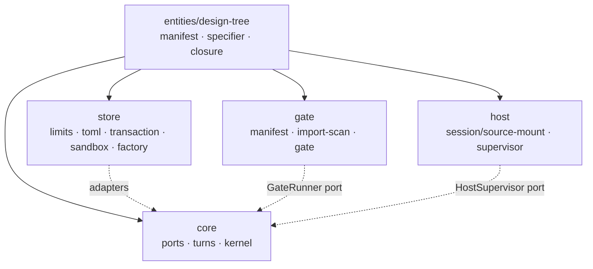
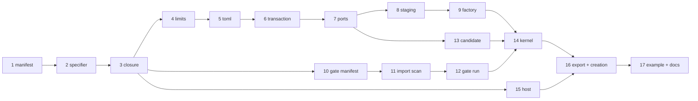

# Design tree as canonical source — Implementation Plan

> **For agentic workers:** REQUIRED SUB-SKILL: Use superpowers:subagent-driven-development
> (recommended) or superpowers:executing-plans to implement this plan task-by-task. Steps use
> checkbox (`- [ ]`) syntax for tracking. Load `/reatom` and `/errore` before any code-related
> action (CLAUDE.md mandate). Every task ends green (`bun test` + `bun x tsc --noEmit`) and is
> one commit.

**Goal:** A design project stops being a set of isolated single-file pages and becomes one
authored source tree under `.termcraft/design/`, whose page entry points are named by
`design/pages.json`, and whose files may import one another with relative specifiers.

**Scope:** This is **plan 1 of the four** the design's §14 decomposes into — §3 (storage
layout), §4 (`pages.json`), §5 (page contract), §6 (import surface and resolution) and §10
(staging), plus the closure graph of §7 built *only* far enough to key the turn's
`changedPages` diff and the host's mount verification. It deliberately does **not** deliver
§12's migration dialog (plan 1b), §7/§8's cache re-keying and whole-tree type check (plan 2),
or §9/§11's revision-keyed host and export package shape (plan 3). Two consequences are
carried deliberately and are called out at their task: a version-1 project is **refused with
an honest error**, not migrated (Task 5, Task 17); and export ships the tree with a
per-page closure listing but keeps today's package shape otherwise (Task 16).

**Architecture:** One new `entities/design-tree` module owns the whole vocabulary — the
manifest, the §6 resolution rules, and the closure walk — as pure functions over an injected
inventory. Every ring above it consumes that one module: `store` for paths, budgets, staging
and transactions; `gate` for validation; `core` for the candidate diff; `host` for the
pre-mount rescan. Because the module is pure and injected, the same resolution rules are
enforced by all four without any of them importing another.



**Tech Stack:** TypeScript 7.0.2 on Bun ≥1.3.14, `@opentui/core`+`@opentui/react` 0.4.5,
`@reatom/core` ^1001.1.0, `errore` ^0.14.1, `zod` ^4.4.3. No new dependencies.

**Normative source:** `docs/superpowers/specs/2026-07-28-multi-file-design-tree-design.md`.
Read it before Task 1; every task below cites its sections.

## Global Constraints

Inherited from `CLAUDE.md` and the roadmap's global constraints. Every task implicitly
includes this section.

- **Test runner is `bun test`.** Tests live beside the file under test (`foo.ts` →
  `foo.test.ts`). There is no `test` npm script; invoke `bun test <path>` directly.
  Typecheck with `bun x tsc --noEmit`. Lint/format: `bun run lint` / `bun run fmt:check`.
- **errore is mandatory**: namespace import (`import * as errore from "errore"`), errors as
  values (`Error | T` unions), `createTaggedError` for domain errors, `.catch()`/`errore.try`
  only at uncontrolled boundaries, flat control flow, `if (x instanceof Error) return x` on
  one line with no block, `| null` for optional values, never swallow an error without
  logging it.
- **Reatom v1001**: named atoms/computeds/actions; `wrap(...)` at every async boundary that
  touches an atom afterwards; never an async IIFE wrapping an `await` — keep the call flat.
- **Module DAG** (`docs/architecture/code-structure.md`): `core` imports only `entities/` and
  its own `ports/`; `gate`, `store`, `host` may import `entities/`; `entities/` submodules
  import nothing but each other and `infrastructure/`. The forbidden-shapes table in §11 is
  review-blocking.
- **Module folder shape** (`CLAUDE.md`): `ui/`, `model/`, `types.ts`, `index.ts`; code always
  inside subfolders, never loose at a module root; atomic single-purpose functions.
- **Imports**: cross-module imports use the `tsconfig.json` path aliases, never a relative
  path climbing out of the module. Never alias under `@termcraft/*` — that specifier is the
  real saved-page runtime facade.
- **Page slug mask is unchanged**: `^[a-z0-9][a-z0-9-]{0,31}$` minus Windows device names,
  enforced by `parsePageSlug`/`pageSlugSchema` in `src/entities/page/model/slug.ts`. This
  plan never widens, narrows, or re-implements it.
- **Factories are named `create*`, never `make*`.**
- **Design is a source of truth**: colours, layout, glyphs and copy come from
  `design/termcraft-engine.js` and `design/*.dc.html`. Where the runtime cannot reproduce a
  design value, implement the closest faithful mapping and document the divergence in a code
  comment — never substitute an invented value.
- **Honest values only**: a value with no source is an explicit documented placeholder or an
  honest empty, never a fabrication.
- **Language**: all code, comments, plans and commit messages in English.
- **Commits**: one per task, `feat:`/`fix:`/`docs:`/`test:`/`refactor:`/`chore:` prefix, each
  ending with the `Co-Authored-By: Claude Opus 5 (1M context) <noreply@anthropic.com>`
  trailer.
- **Run `/reatom-audit` before reporting the work done** (Task 17).

### Vocabulary fixed by this plan

Used verbatim in every task, so the names never drift:

| term | meaning |
| --- | --- |
| **tree-relative path** | a forward-slash path relative to `design/`, e.g. `pages/dashboard.tsx`. Never carries the `design/` prefix. |
| **project-relative path** | a forward-slash path relative to `.termcraft/`, e.g. `design/pages/dashboard.tsx`. What `store/transaction` and `store/safe-fs` speak. |
| **entry** | the tree-relative path `pages.json` binds to a slug. |
| **closure** | the transitive set of tree-relative paths one entry reaches, including the entry itself, sorted. |
| **closureHash** | Merkle hash over a closure's `(relPath, sha256)` pairs. |
| **treeRevision** | Merkle hash over the entire `design/` inventory, `pages.json` included. |

---

## Task order and dependencies

Tasks 1–3 build `entities/design-tree` and gate everything else. Tasks 4–9 are the `store`
ring and must land in order (each consumes the previous one's types). Tasks 10–12 are `gate`
and depend only on 1–3. Tasks 13–14 are `core` and depend on 7 and 12. Task 15–16 are `host`
and `export`. Task 17 closes.



---

### Task 1: `entities/design-tree` — the `pages.json` manifest

Design §4. The manifest is the only thing that names page identity, and it lives inside the
tree because the tree is what the agent edits. Nothing else in this task touches disk.

**Files:**
- Create: `src/entities/design-tree/types.ts`
- Create: `src/entities/design-tree/model/manifest.ts`
- Create: `src/entities/design-tree/index.ts`
- Test: `src/entities/design-tree/model/manifest.test.ts`
- Modify: `tsconfig.json` — no change needed; `entities/*` already maps to `src/entities/*`.

**Interfaces:**
- Consumes: `parsePageSlug`, `pageSlugSchema`, `PageSlug` from `entities/page`.
- Produces, all exported from `src/entities/design-tree/index.ts`:
  - `const DESIGN_DIRNAME = "design"`
  - `const PAGES_MANIFEST_RELPATH = "pages.json"` (tree-relative)
  - `const PAGES_MANIFEST_SCHEMA_VERSION = 1`
  - `interface DesignFileEntryV1 { readonly relPath: string; readonly sha256: string }`
  - `interface DesignTreeInventoryV1 { readonly files: readonly DesignFileEntryV1[] }`
  - `interface PageEntryV1 { readonly slug: PageSlug; readonly entry: string }`
  - `interface PagesManifestV1 { readonly schemaVersion: 1; readonly pages: readonly PageEntryV1[]; readonly requestedActivePage: PageSlug | null }`
  - `class PagesManifestInvalidError` (tagged, `$code`/`$reason`)
  - `function decodePagesManifest(text: string): PagesManifestInvalidError | PagesManifestV1`
  - `function encodePagesManifest(manifest: PagesManifestV1): string`

- [ ] **Step 1: Write the failing test**

Create `src/entities/design-tree/model/manifest.test.ts`:

```ts
import { describe, expect, test } from "bun:test";

import { decodePagesManifest, encodePagesManifest } from "./manifest";

const VALID = JSON.stringify({
  schemaVersion: 1,
  pages: [
    { slug: "dashboard", entry: "pages/dashboard.tsx" },
    { slug: "calendar", entry: "screens/calendar/index.tsx" },
  ],
  requestedActivePage: "dashboard",
});

describe("decodePagesManifest", () => {
  test("accepts the design §4 example and preserves page order", () => {
    const manifest = decodePagesManifest(VALID);
    if (manifest instanceof Error) throw manifest;
    expect(manifest.schemaVersion).toBe(1);
    expect(manifest.pages.map((page) => page.slug)).toEqual(["dashboard", "calendar"]);
    expect(manifest.pages[1]?.entry).toBe("screens/calendar/index.tsx");
    expect(manifest.requestedActivePage).toBe("dashboard");
  });

  test("requestedActivePage is null when absent", () => {
    const manifest = decodePagesManifest(
      JSON.stringify({ schemaVersion: 1, pages: [{ slug: "a", entry: "a.tsx" }] }),
    );
    if (manifest instanceof Error) throw manifest;
    expect(manifest.requestedActivePage).toBeNull();
  });

  test("rejects a duplicate slug", () => {
    const result = decodePagesManifest(
      JSON.stringify({
        schemaVersion: 1,
        pages: [
          { slug: "a", entry: "a.tsx" },
          { slug: "a", entry: "b.tsx" },
        ],
      }),
    );
    expect(result).toBeInstanceOf(Error);
    expect(String(result)).toContain("duplicate");
  });

  test("rejects a requestedActivePage that is not listed", () => {
    const result = decodePagesManifest(
      JSON.stringify({
        schemaVersion: 1,
        pages: [{ slug: "a", entry: "a.tsx" }],
        requestedActivePage: "b",
      }),
    );
    expect(result).toBeInstanceOf(Error);
  });

  test("rejects an invalid slug, an absolute entry, a backslash entry and a `..` entry", () => {
    const bad = [
      { slug: "Dashboard", entry: "a.tsx" },
      { slug: "a", entry: "/etc/passwd" },
      { slug: "a", entry: "pages\\dashboard.tsx" },
      { slug: "a", entry: "../outside.tsx" },
      { slug: "a", entry: "" },
    ];
    for (const page of bad) {
      const result = decodePagesManifest(JSON.stringify({ schemaVersion: 1, pages: [page] }));
      expect(result).toBeInstanceOf(Error);
    }
  });

  test("rejects a non-object, invalid JSON, and an unknown top-level field", () => {
    expect(decodePagesManifest("[]")).toBeInstanceOf(Error);
    expect(decodePagesManifest("{")).toBeInstanceOf(Error);
    expect(
      decodePagesManifest(JSON.stringify({ schemaVersion: 1, pages: [], extra: 1 })),
    ).toBeInstanceOf(Error);
  });

  test("encode → decode round-trips and ends with a newline", () => {
    const manifest = decodePagesManifest(VALID);
    if (manifest instanceof Error) throw manifest;
    const text = encodePagesManifest(manifest);
    expect(text.endsWith("\n")).toBe(true);
    expect(decodePagesManifest(text)).toEqual(manifest);
  });
});
```

- [ ] **Step 2: Run the test to verify it fails**

Run: `bun test src/entities/design-tree/model/manifest.test.ts`
Expected: FAIL — `Cannot find module './manifest'`.

- [ ] **Step 3: Write `types.ts`**

Create `src/entities/design-tree/types.ts`:

```ts
import type { PageSlug } from "entities/page";

/** The canonical tree's directory name under `.termcraft/` and inside a turn workspace (design §3). */
export const DESIGN_DIRNAME = "design";

/** The manifest's TREE-relative path (design §3, §4) — `design/pages.json` project-relative. */
export const PAGES_MANIFEST_RELPATH = "pages.json";

/** The only shipped manifest schema version (design §4). */
export const PAGES_MANIFEST_SCHEMA_VERSION = 1;

/** One file of the authored tree: its TREE-relative path and the SHA-256 of its exact bytes. */
export interface DesignFileEntryV1 {
  readonly relPath: string;
  readonly sha256: string;
}

/**
 * The whole `design/` inventory. `files` is sorted by `relPath` with a plain `<` comparison
 * over the UTF-16 code units — the same order `computeTreeRevision`/`computeClosureHash`
 * fold in, so a caller that builds an inventory in a different order produces a different
 * hash for identical content. Build it with {@link createDesignTreeInventory}.
 */
export interface DesignTreeInventoryV1 {
  readonly files: readonly DesignFileEntryV1[];
}

/** One `pages.json` entry: the page's immutable identity and the tree-relative file that is its entry point. */
export interface PageEntryV1 {
  readonly slug: PageSlug;
  readonly entry: string;
}

/** The parsed, validated `design/pages.json` (design §4). Array order IS page order. */
export interface PagesManifestV1 {
  readonly schemaVersion: typeof PAGES_MANIFEST_SCHEMA_VERSION;
  readonly pages: readonly PageEntryV1[];
  /** `null` when the manifest requests no particular active page. */
  readonly requestedActivePage: PageSlug | null;
}
```

- [ ] **Step 4: Write `model/manifest.ts`**

Create `src/entities/design-tree/model/manifest.ts`:

```ts
import * as errore from "errore";
import { z } from "zod";

import { pageSlugSchema } from "entities/page";

import { PAGES_MANIFEST_SCHEMA_VERSION } from "../types";
import type { PagesManifestV1 } from "../types";

/**
 * `design/pages.json` could not be read as a manifest (design §4's fatal list): invalid JSON,
 * a bad shape, an unknown field, an invalid or duplicate slug, a malformed `entry`, or a
 * `requestedActivePage` naming an unlisted slug. Returned as a value; the Gate turns it into
 * a fatal `manifest`-kind `GateError` (Task 10) and the project store into a failure DTO.
 */
export class PagesManifestInvalidError extends errore.createTaggedError({
  name: "PagesManifestInvalidError",
  message: "design/pages.json is invalid [$code]: $reason",
}) {}

/**
 * A tree-relative `entry` path. Deliberately stricter than "any string": it must be
 * relative, forward-slash, non-empty, and free of `.`/`..` segments — `resolveDesignSpecifier`
 * (`./specifier.ts`) owns `..` handling for IMPORT specifiers, but a manifest entry is a
 * stored address and normalizing one would let two different manifests name the same file.
 * A backslash is rejected outright rather than translated: the tree's on-disk paths are
 * produced by joining these components, and silently accepting `\` would make the same
 * manifest mean different things on Windows and elsewhere.
 */
const entryPathSchema = z
  .string()
  .min(1)
  .refine((value) => !value.includes("\\"), { error: "`entry` must use forward slashes" })
  .refine((value) => !value.startsWith("/"), { error: "`entry` must be relative to design/" })
  .refine((value) => !/^[A-Za-z]:/.test(value), { error: "`entry` must not be a drive path" })
  .refine((value) => !value.includes("//"), { error: "`entry` must not contain an empty segment" })
  .refine(
    (value) => value.split("/").every((segment) => segment !== "" && segment !== "." && segment !== ".."),
    { error: "`entry` must not contain `.` or `..` segments" },
  );

const pageEntrySchema = z.strictObject({
  slug: pageSlugSchema,
  entry: entryPathSchema,
});

const pagesManifestSchema = z.strictObject({
  schemaVersion: z.literal(PAGES_MANIFEST_SCHEMA_VERSION),
  pages: z.array(pageEntrySchema),
  requestedActivePage: pageSlugSchema.nullish(),
});

function invalid(code: string, reason: string): PagesManifestInvalidError {
  return new PagesManifestInvalidError({ code, reason });
}

/** Maps the first Zod issue onto the tagged error, mirroring `store/toml`'s decoder. */
function fromZod(error: z.ZodError): PagesManifestInvalidError {
  const issue = error.issues[0];
  const code = issue !== undefined && issue.path.length > 0 ? issue.path.join(".") : "SHAPE";
  return invalid(code, issue?.message ?? "invalid input");
}

/**
 * Parse and validate `design/pages.json` (design §4). Structural validation is Zod's; the two
 * cross-field rules — a duplicate slug, and a `requestedActivePage` naming an unlisted slug —
 * are checked here because they span array elements. `entry` RESOLUTION against the real tree
 * is deliberately NOT checked here: this function never sees the tree. That check is
 * `findUnresolvedEntries` below, called by whoever holds the inventory.
 */
export function decodePagesManifest(text: string): PagesManifestInvalidError | PagesManifestV1 {
  const parsed = errore.try({
    try: () => JSON.parse(text) as unknown,
    catch: (cause) => cause,
  });
  if (parsed instanceof Error) return invalid("JSON_PARSE", `not valid JSON: ${parsed.message}`);

  const result = pagesManifestSchema.safeParse(parsed);
  if (!result.success) return fromZod(result.error);

  const seen = new Set<string>();
  for (const page of result.data.pages) {
    if (seen.has(page.slug))
      return invalid("DUPLICATE_SLUG", `"${page.slug}" is listed more than once`);
    seen.add(page.slug);
  }

  const requested = result.data.requestedActivePage ?? null;
  if (requested !== null && !seen.has(requested))
    return invalid("ACTIVE_NOT_LISTED", `requestedActivePage "${requested}" is not in \`pages\``);

  return {
    schemaVersion: PAGES_MANIFEST_SCHEMA_VERSION,
    pages: result.data.pages,
    requestedActivePage: requested,
  };
}

/**
 * Serialize a manifest deterministically: field order fixed, two-space indent, trailing
 * newline. Byte-determinism matters because the manifest is a tree file whose SHA-256 feeds
 * `treeRevision` — a re-encode that reordered keys would invalidate every cache for nothing.
 */
export function encodePagesManifest(manifest: PagesManifestV1): string {
  const body = {
    schemaVersion: manifest.schemaVersion,
    pages: manifest.pages.map((page) => ({ slug: page.slug, entry: page.entry })),
    ...(manifest.requestedActivePage === null
      ? {}
      : { requestedActivePage: manifest.requestedActivePage }),
  };
  return `${JSON.stringify(body, null, 2)}\n`;
}

/**
 * The entries whose `entry` names no file in the tree (design §4: "It must resolve to a real
 * file inside the tree"). Separated from {@link decodePagesManifest} because it needs the
 * inventory the decoder never sees; the Gate calls both in sequence (Task 10).
 */
export function findUnresolvedEntries(input: {
  readonly manifest: PagesManifestV1;
  readonly has: (relPath: string) => boolean;
}): readonly PageEntryV1[] {
  return input.manifest.pages.filter((page) => !input.has(page.entry));
}
```

Add the missing `PageEntryV1` import to the file's type import list.

- [ ] **Step 5: Write `index.ts`**

Create `src/entities/design-tree/index.ts`:

```ts
export type {
  DesignFileEntryV1,
  DesignTreeInventoryV1,
  PageEntryV1,
  PagesManifestV1,
} from "./types";
export { DESIGN_DIRNAME, PAGES_MANIFEST_RELPATH, PAGES_MANIFEST_SCHEMA_VERSION } from "./types";
export {
  PagesManifestInvalidError,
  decodePagesManifest,
  encodePagesManifest,
  findUnresolvedEntries,
} from "./model/manifest";
```

- [ ] **Step 6: Run the tests**

Run: `bun test src/entities/design-tree/ && bun x tsc --noEmit`
Expected: PASS.

- [ ] **Step 7: Commit**

```bash
rtk git add src/entities/design-tree tsconfig.json && rtk git commit -m "feat(entities): add the design-tree pages.json manifest

Co-Authored-By: Claude Opus 5 (1M context) <noreply@anthropic.com>"
```

---

### Task 2: `entities/design-tree` — §6 specifier resolution

Design §6. This is the highest-risk surface in the whole design (§13: "the resolver is now
part of the security perimeter"), so it is its own task with its own adversarial test set.
Resolution is narrow and deterministic: an explicit extension is used as written; an
extensionless specifier probes exactly `<spec>.tsx` then `<spec>.ts` and stops; there is no
directory index, no other extension, and no `node_modules` lookup.

**Files:**
- Create: `src/entities/design-tree/model/specifier.ts`
- Modify: `src/entities/design-tree/index.ts`
- Test: `src/entities/design-tree/model/specifier.test.ts`

**Interfaces:**
- Consumes: nothing from Task 1 except the module folder.
- Produces:
  - `const RUNTIME_ROOT_SPECIFIER = "@termcraft/runtime"`
  - `const RESOLUTION_EXTENSIONS = [".tsx", ".ts"] as const`
  - `type SpecifierRejectionCodeV1 = "ESCAPES_TREE" | "QUERY_OR_FRAGMENT" | "BARE_SPECIFIER" | "UNRESOLVED" | "BACKSLASH"`
  - `class SpecifierRejectedError` (tagged; `$from`, `$specifier`, `$code`, `$reason`)
  - `type ResolvedSpecifierV1 = { kind: "runtime" } | { kind: "file"; relPath: string }`
  - `function resolveDesignSpecifier(input: { from: string; specifier: string; has: (relPath: string) => boolean }): SpecifierRejectedError | ResolvedSpecifierV1`

- [ ] **Step 1: Write the failing test**

Create `src/entities/design-tree/model/specifier.test.ts`:

```ts
import { describe, expect, test } from "bun:test";

import { RUNTIME_ROOT_SPECIFIER, resolveDesignSpecifier } from "./specifier";

const TREE = new Set([
  "pages/dashboard.tsx",
  "pages/calendar.tsx",
  "lib/theme.ts",
  "lib/index.ts",
  "lib/index/inner.ts",
  "widgets/gauge.tsx",
  "pages.json",
  "notes.md",
]);
const has = (relPath: string) => TREE.has(relPath);

function resolve(from: string, specifier: string) {
  return resolveDesignSpecifier({ from, specifier, has });
}

describe("resolveDesignSpecifier", () => {
  test("the bare runtime root resolves to the runtime, not a file", () => {
    expect(resolve("pages/dashboard.tsx", RUNTIME_ROOT_SPECIFIER)).toEqual({ kind: "runtime" });
  });

  test("an explicit extension is used as written", () => {
    expect(resolve("pages/dashboard.tsx", "../lib/theme.ts")).toEqual({
      kind: "file",
      relPath: "lib/theme.ts",
    });
    expect(resolve("pages/dashboard.tsx", "../widgets/gauge.tsx")).toEqual({
      kind: "file",
      relPath: "widgets/gauge.tsx",
    });
  });

  test("an extensionless specifier probes .tsx then .ts and stops", () => {
    expect(resolve("pages/dashboard.tsx", "../lib/theme")).toEqual({
      kind: "file",
      relPath: "lib/theme.ts",
    });
    // `widgets/gauge.tsx` exists, so `.tsx` wins before `.ts` is tried.
    expect(resolve("pages/dashboard.tsx", "../widgets/gauge")).toEqual({
      kind: "file",
      relPath: "widgets/gauge.tsx",
    });
  });

  test("there is NO directory-index resolution", () => {
    // `lib/index.ts` exists, but `../lib` must not resolve to it.
    const result = resolve("pages/dashboard.tsx", "../lib");
    expect(result).toBeInstanceOf(Error);
    expect(String(result)).toContain("UNRESOLVED");
  });

  test("only .tsx and .ts are probed", () => {
    expect(resolve("pages/dashboard.tsx", "../notes")).toBeInstanceOf(Error);
    // …but an explicit extension for a real non-source file DOES resolve; the import scan,
    // not the resolver, is what decides which file kinds may be imported.
    expect(resolve("pages/dashboard.tsx", "../notes.md")).toEqual({
      kind: "file",
      relPath: "notes.md",
    });
  });

  test("`./` and nested `../` normalize inside the tree", () => {
    expect(resolve("pages/dashboard.tsx", "./calendar.tsx")).toEqual({
      kind: "file",
      relPath: "pages/calendar.tsx",
    });
    expect(resolve("lib/index/inner.ts", "../../pages/calendar.tsx")).toEqual({
      kind: "file",
      relPath: "pages/calendar.tsx",
    });
  });

  test("a specifier escaping the tree is rejected", () => {
    for (const spec of ["../../secret.ts", "../../../etc/passwd", "./../../x.ts"]) {
      const result = resolve("pages/dashboard.tsx", spec);
      expect(result).toBeInstanceOf(Error);
      expect(String(result)).toContain("ESCAPES_TREE");
    }
  });

  test("a query string or fragment is rejected", () => {
    for (const spec of ["../lib/theme.ts?raw", "../lib/theme.ts#frag", "../lib/theme?x=1"]) {
      const result = resolve("pages/dashboard.tsx", spec);
      expect(result).toBeInstanceOf(Error);
      expect(String(result)).toContain("QUERY_OR_FRAGMENT");
    }
  });

  test("any other bare specifier is rejected, node: included", () => {
    for (const spec of ["react", "node:fs", "@termcraft/runtime/ui", "lib/theme.ts", "/abs.ts"]) {
      const result = resolve("pages/dashboard.tsx", spec);
      expect(result).toBeInstanceOf(Error);
      expect(String(result)).toContain("BARE_SPECIFIER");
    }
  });

  test("a backslash is rejected rather than translated", () => {
    const result = resolve("pages/dashboard.tsx", ".\\calendar.tsx");
    expect(result).toBeInstanceOf(Error);
    expect(String(result)).toContain("BACKSLASH");
  });
});
```

- [ ] **Step 2: Run the test to verify it fails**

Run: `bun test src/entities/design-tree/model/specifier.test.ts`
Expected: FAIL — `Cannot find module './specifier'`.

- [ ] **Step 3: Write `model/specifier.ts`**

```ts
import * as errore from "errore";

/** The one legal BARE specifier anywhere in the tree (design §6 rule 1; runtime-api §3.1). */
export const RUNTIME_ROOT_SPECIFIER = "@termcraft/runtime";

/**
 * The complete extension probe list for an extensionless relative specifier, in order
 * (design §6). Two entries, tried left to right, and nothing else — no `.js`, no `.jsx`,
 * no `.json`, and no directory index.
 */
export const RESOLUTION_EXTENSIONS = [".tsx", ".ts"] as const;

export type SpecifierRejectionCodeV1 =
  | "ESCAPES_TREE"
  | "QUERY_OR_FRAGMENT"
  | "BARE_SPECIFIER"
  | "UNRESOLVED"
  | "BACKSLASH";

/**
 * A module specifier the design's §6 import surface refuses. Fatal at BOTH enforcement
 * points: the Gate's authoritative allowlist and the host's pre-mount rescan. Carried as a
 * value so each caller renders it in its own vocabulary (a `GateError`, a `ProtocolError`).
 */
export class SpecifierRejectedError extends errore.createTaggedError({
  name: "SpecifierRejectedError",
  message: 'specifier "$specifier" in $from is rejected [$code]: $reason',
}) {}

export type ResolvedSpecifierV1 =
  | { readonly kind: "runtime" }
  | { readonly kind: "file"; readonly relPath: string };

/**
 * Normalize a POSIX-style relative path, collapsing `.` and `..` WITHOUT touching disk.
 * Returns `null` when the path climbs above its root — the caller turns that into
 * `ESCAPES_TREE`. `node:path` is deliberately not used: `path.posix.normalize` keeps leading
 * `../` segments rather than reporting the escape, and `path.normalize` is platform-flavoured.
 */
function normalizeRelative(segments: readonly string[]): string[] | null {
  const out: string[] = [];
  for (const segment of segments) {
    if (segment === "" || segment === ".") continue;
    if (segment !== "..") {
      out.push(segment);
      continue;
    }
    if (out.length === 0) return null;
    out.pop();
  }
  return out;
}

function reject(
  input: { from: string; specifier: string },
  code: SpecifierRejectionCodeV1,
  reason: string,
): SpecifierRejectedError {
  return { ...input, code, reason } as never as SpecifierRejectedError;
}

/**
 * Resolve one authored module specifier against the tree (design §6).
 *
 * Exactly two edges are legal: a STATIC import of the bare `@termcraft/runtime`, and a
 * RELATIVE specifier resolving to a real file inside `design/`. Everything else is refused,
 * including a runtime SUBPATH (`@termcraft/runtime/ui`), a `node:` builtin, and a
 * root-relative path.
 *
 * `from` is the importer's TREE-relative path; `has` answers whether a tree-relative path
 * names a real file in the inventory. This function performs no I/O and knows nothing about
 * symlinks — the reparse/junction check (design §6) belongs to whoever turns a tree-relative
 * path into an absolute one, i.e. `store/safe-fs`'s `no-follow.ts` (Task 8 and Task 15).
 */
export function resolveDesignSpecifier(input: {
  readonly from: string;
  readonly specifier: string;
  readonly has: (relPath: string) => boolean;
}): SpecifierRejectedError | ResolvedSpecifierV1 {
  const { from, specifier } = input;

  if (specifier === RUNTIME_ROOT_SPECIFIER) return { kind: "runtime" };

  if (specifier.includes("\\"))
    return reject({ from, specifier }, "BACKSLASH", "a specifier must use forward slashes");

  const isRelative = specifier.startsWith("./") || specifier.startsWith("../");
  if (!isRelative) {
    return reject(
      { from, specifier },
      "BARE_SPECIFIER",
      `only "${RUNTIME_ROOT_SPECIFIER}" and relative specifiers are allowed`,
    );
  }

  if (specifier.includes("?") || specifier.includes("#")) {
    return reject(
      { from, specifier },
      "QUERY_OR_FRAGMENT",
      "a specifier carries no query string or fragment",
    );
  }

  // The importer's directory, then the specifier's own segments, normalized as one path.
  const fromSegments = from.split("/");
  fromSegments.pop();
  const normalized = normalizeRelative([...fromSegments, ...specifier.split("/")]);
  if (normalized === null || normalized.length === 0)
    return reject({ from, specifier }, "ESCAPES_TREE", "resolves outside design/");

  const base = normalized.join("/");
  if (input.has(base)) return { kind: "file", relPath: base };

  // Extensionless: probe exactly `.tsx`, then `.ts`, and stop. Only when the specifier has no
  // extension of its own — an explicit `./theme.js` must NOT silently become `./theme.js.ts`.
  const last = normalized[normalized.length - 1] ?? "";
  if (!last.includes(".")) {
    for (const extension of RESOLUTION_EXTENSIONS) {
      const candidate = `${base}${extension}`;
      if (input.has(candidate)) return { kind: "file", relPath: candidate };
    }
  }

  return reject(
    { from, specifier },
    "UNRESOLVED",
    `no file at "${base}" (probed ${RESOLUTION_EXTENSIONS.join(", ")}; there is no directory-index resolution)`,
  );
}
```

Replace the `reject` helper's cast with a real construction — the cast above is a placeholder
that will not compile. Write it as:

```ts
function reject(
  input: { from: string; specifier: string },
  code: SpecifierRejectionCodeV1,
  reason: string,
): SpecifierRejectedError {
  return new SpecifierRejectedError({ from: input.from, specifier: input.specifier, code, reason });
}
```

- [ ] **Step 4: Run the tests**

Run: `bun test src/entities/design-tree/model/specifier.test.ts`
Expected: PASS, all cases.

- [ ] **Step 5: Export from `index.ts`**

Append to `src/entities/design-tree/index.ts`:

```ts
export type { ResolvedSpecifierV1, SpecifierRejectionCodeV1 } from "./model/specifier";
export {
  RESOLUTION_EXTENSIONS,
  RUNTIME_ROOT_SPECIFIER,
  SpecifierRejectedError,
  resolveDesignSpecifier,
} from "./model/specifier";
```

- [ ] **Step 6: Commit**

```bash
rtk git add src/entities/design-tree && rtk git commit -m "feat(entities): resolve design-tree module specifiers under the §6 rules

Co-Authored-By: Claude Opus 5 (1M context) <noreply@anthropic.com>"
```

---

### Task 3: `entities/design-tree` — the closure walk, `closureHash`, `treeRevision`

Design §7. In this plan the closure graph has exactly two consumers — the turn's
`changedPages` diff (Task 13) and the host's pre-mount verification (Task 15). Re-keying the
caches is plan 2; the artifact is built now because, as §7 states, without it a shared-module
edit reports "nothing changed" everywhere.

**Files:**
- Create: `src/entities/design-tree/model/inventory.ts`
- Create: `src/entities/design-tree/model/closure.ts`
- Modify: `src/entities/design-tree/index.ts`
- Test: `src/entities/design-tree/model/closure.test.ts`

**Interfaces:**
- Consumes: `resolveDesignSpecifier`, `SpecifierRejectedError` (Task 2); `DesignTreeInventoryV1`, `DesignFileEntryV1` (Task 1).
- Produces:
  - `function createDesignTreeInventory(files: readonly DesignFileEntryV1[]): DesignTreeInventoryV1` — sorts and rejects a duplicate `relPath`.
  - `function inventoryHas(inventory: DesignTreeInventoryV1): (relPath: string) => boolean`
  - `function inventorySha256(inventory: DesignTreeInventoryV1): (relPath: string) => string | null`
  - `interface ClosureV1 { readonly entry: string; readonly files: readonly string[] }`
  - `function resolveClosure(input: { entry: string; has: (relPath: string) => boolean; edgesOf: (relPath: string) => readonly string[] }): SpecifierRejectedError | ClosureV1`
  - `function computeClosureHash(input: { files: readonly string[]; sha256Of: (relPath: string) => string | null }): string | null` — takes the file list, not a `ClosureV1`, so a caller holding only a closure's file list (the `GateRunner` port's result, Task 13) needs no synthetic `entry`
  - `function computeTreeRevision(inventory: DesignTreeInventoryV1): string`
  - `class DuplicateInventoryPathError`

- [ ] **Step 1: Write the failing test**

Create `src/entities/design-tree/model/closure.test.ts`:

```ts
import { describe, expect, test } from "bun:test";

import { createDesignTreeInventory, inventoryHas, inventorySha256 } from "./inventory";
import { computeClosureHash, computeTreeRevision, resolveClosure } from "./closure";

const FILES = [
  { relPath: "pages/dashboard.tsx", sha256: "a".repeat(64) },
  { relPath: "pages/calendar.tsx", sha256: "b".repeat(64) },
  { relPath: "lib/theme.ts", sha256: "c".repeat(64) },
  { relPath: "lib/format.ts", sha256: "d".repeat(64) },
  { relPath: "pages.json", sha256: "e".repeat(64) },
];

const EDGES: Record<string, readonly string[]> = {
  "pages/dashboard.tsx": ["@termcraft/runtime", "../lib/theme", "../lib/format"],
  "pages/calendar.tsx": ["@termcraft/runtime", "../lib/theme"],
  "lib/theme.ts": [],
  "lib/format.ts": ["./theme"],
  "pages.json": [],
};

const inventory = createDesignTreeInventory(FILES);
if (inventory instanceof Error) throw inventory;
const has = inventoryHas(inventory);
const sha256Of = inventorySha256(inventory);
const edgesOf = (relPath: string) => EDGES[relPath] ?? [];

describe("resolveClosure", () => {
  test("returns the entry plus everything it transitively reaches, sorted", () => {
    const closure = resolveClosure({ entry: "pages/dashboard.tsx", has, edgesOf });
    if (closure instanceof Error) throw closure;
    expect(closure.files).toEqual(["lib/format.ts", "lib/theme.ts", "pages/dashboard.tsx"]);
  });

  test("the runtime edge is not a file and never enters the closure", () => {
    const closure = resolveClosure({ entry: "pages/calendar.tsx", has, edgesOf });
    if (closure instanceof Error) throw closure;
    expect(closure.files).toEqual(["lib/theme.ts", "pages/calendar.tsx"]);
  });

  test("a cycle terminates instead of looping forever", () => {
    const cyclic = (relPath: string) =>
      relPath === "lib/theme.ts" ? ["./format"] : (EDGES[relPath] ?? []);
    const closure = resolveClosure({ entry: "pages/dashboard.tsx", has, edgesOf: cyclic });
    if (closure instanceof Error) throw closure;
    expect(closure.files).toEqual(["lib/format.ts", "lib/theme.ts", "pages/dashboard.tsx"]);
  });

  test("an illegal edge anywhere in the closure is fatal, not skipped", () => {
    const hostile = (relPath: string) =>
      relPath === "lib/theme.ts" ? ["node:fs"] : (EDGES[relPath] ?? []);
    const closure = resolveClosure({ entry: "pages/dashboard.tsx", has, edgesOf: hostile });
    expect(closure).toBeInstanceOf(Error);
    expect(String(closure)).toContain("BARE_SPECIFIER");
  });

  test("an entry that is not in the tree is fatal", () => {
    expect(resolveClosure({ entry: "pages/missing.tsx", has, edgesOf })).toBeInstanceOf(Error);
  });
});

describe("computeClosureHash", () => {
  test("is stable, and changes when a shared module's bytes change", () => {
    const closure = resolveClosure({ entry: "pages/dashboard.tsx", has, edgesOf });
    if (closure instanceof Error) throw closure;
    const before = computeClosureHash({ files: closure.files, sha256Of });
    expect(before).toBe(computeClosureHash({ files: closure.files, sha256Of }));

    const edited = createDesignTreeInventory(
      FILES.map((file) =>
        file.relPath === "lib/theme.ts" ? { ...file, sha256: "f".repeat(64) } : file,
      ),
    );
    if (edited instanceof Error) throw edited;
    const after = computeClosureHash({
      files: closure.files,
      sha256Of: inventorySha256(edited),
    });
    expect(after).not.toBe(before);
  });

  test("two pages sharing a module get DIFFERENT hashes", () => {
    const dashboard = resolveClosure({ entry: "pages/dashboard.tsx", has, edgesOf });
    const calendar = resolveClosure({ entry: "pages/calendar.tsx", has, edgesOf });
    if (dashboard instanceof Error) throw dashboard;
    if (calendar instanceof Error) throw calendar;
    expect(computeClosureHash({ files: dashboard.files, sha256Of })).not.toBe(
      computeClosureHash({ files: calendar.files, sha256Of }),
    );
  });

  test("is null when a closure file is missing from the inventory", () => {
    expect(computeClosureHash({ files: ["pages/ghost.tsx"], sha256Of })).toBeNull();
  });
});

describe("computeTreeRevision", () => {
  test("covers files no page reaches, and pages.json", () => {
    const withOrphan = createDesignTreeInventory([
      ...FILES,
      { relPath: "lib/unused.ts", sha256: "9".repeat(64) },
    ]);
    if (withOrphan instanceof Error) throw withOrphan;
    expect(computeTreeRevision(withOrphan)).not.toBe(computeTreeRevision(inventory));
  });

  test("does not depend on the order files were supplied in", () => {
    const reversed = createDesignTreeInventory([...FILES].reverse());
    if (reversed instanceof Error) throw reversed;
    expect(computeTreeRevision(reversed)).toBe(computeTreeRevision(inventory));
  });
});

describe("createDesignTreeInventory", () => {
  test("refuses a duplicate relPath rather than keeping the last one", () => {
    expect(createDesignTreeInventory([...FILES, FILES[0]!])).toBeInstanceOf(Error);
  });
});
```

- [ ] **Step 2: Run the test to verify it fails**

Run: `bun test src/entities/design-tree/model/closure.test.ts`
Expected: FAIL — `Cannot find module './inventory'`.

- [ ] **Step 3: Write `model/inventory.ts`**

```ts
import * as errore from "errore";

import type { DesignFileEntryV1, DesignTreeInventoryV1 } from "../types";

/**
 * Two entries claim the same tree-relative path. Refused rather than normalized: `new Map`
 * would keep the last one and silently pick a hash, and the whole point of the inventory is
 * that a tree-relative path names exactly one byte image.
 */
export class DuplicateInventoryPathError extends errore.createTaggedError({
  name: "DuplicateInventoryPathError",
  message: "the design tree inventory lists $relPath more than once",
}) {}

/**
 * Build the canonical inventory: sorted by `relPath`, duplicate-free. Sorting here rather
 * than at each hash site is what makes `computeTreeRevision` independent of enumeration
 * order — a directory walk's order is a filesystem detail, and a revision that changed with
 * it would invalidate every cache on an unrelated machine.
 */
export function createDesignTreeInventory(
  files: readonly DesignFileEntryV1[],
): DuplicateInventoryPathError | DesignTreeInventoryV1 {
  const seen = new Set<string>();
  for (const file of files) {
    if (seen.has(file.relPath)) return new DuplicateInventoryPathError({ relPath: file.relPath });
    seen.add(file.relPath);
  }
  const sorted = [...files].sort((a, b) => (a.relPath < b.relPath ? -1 : a.relPath > b.relPath ? 1 : 0));
  return { files: sorted };
}

/** A membership predicate over the inventory, in the shape `resolveDesignSpecifier` asks for. */
export function inventoryHas(inventory: DesignTreeInventoryV1): (relPath: string) => boolean {
  const set = new Set(inventory.files.map((file) => file.relPath));
  return (relPath) => set.has(relPath);
}

/** A hash lookup over the inventory; `null` for a path the inventory does not carry. */
export function inventorySha256(
  inventory: DesignTreeInventoryV1,
): (relPath: string) => string | null {
  const map = new Map(inventory.files.map((file) => [file.relPath, file.sha256]));
  return (relPath) => map.get(relPath) ?? null;
}
```

- [ ] **Step 4: Write `model/closure.ts`**

```ts
import type { DesignTreeInventoryV1 } from "../types";
import type { SpecifierRejectedError } from "./specifier";
import { resolveDesignSpecifier } from "./specifier";

/** One page's transitive file set (design §7). `files` is sorted and always contains `entry`. */
export interface ClosureV1 {
  readonly entry: string;
  readonly files: readonly string[];
}

/**
 * Walk one entry's transitive module graph (design §7). Every edge goes through
 * {@link resolveDesignSpecifier}, so an illegal edge ANYWHERE in the closure is fatal here
 * rather than merely skipped — a page whose shared module imports `node:fs` must not resolve
 * to a smaller, apparently-legal closure.
 *
 * A cycle terminates: a file already visited is not re-walked. Cycles are LEGAL under the
 * design (§8 step 2 makes them a warning, not a fatal) and detecting them is plan 2's job —
 * this walk only has to not hang on one.
 *
 * `edgesOf` returns the raw authored specifiers of a file. The caller owns how it gets them:
 * the Gate uses its own lexer (Task 11), the host uses `Bun.Transpiler.scanImports`
 * (Task 15). Neither reads bytes through this function.
 */
export function resolveClosure(input: {
  readonly entry: string;
  readonly has: (relPath: string) => boolean;
  readonly edgesOf: (relPath: string) => readonly string[];
}): SpecifierRejectedError | ClosureV1 {
  if (!input.has(input.entry)) {
    return resolveDesignSpecifier({
      from: input.entry,
      specifier: `./${input.entry.split("/").pop() ?? input.entry}`,
      has: input.has,
    }) as SpecifierRejectedError;
  }

  const visited = new Set<string>([input.entry]);
  const queue: string[] = [input.entry];

  while (queue.length > 0) {
    const current = queue.shift();
    if (current === undefined) break;
    for (const specifier of input.edgesOf(current)) {
      const resolved = resolveDesignSpecifier({ from: current, specifier, has: input.has });
      if (resolved instanceof Error) return resolved;
      if (resolved.kind === "runtime") continue;
      if (visited.has(resolved.relPath)) continue;
      visited.add(resolved.relPath);
      queue.push(resolved.relPath);
    }
  }

  return { entry: input.entry, files: [...visited].sort() };
}

/**
 * Fold `(relPath, sha256)` pairs into one canonical text and hash it. Kept private and
 * shared by both hashes below so a change to the framing can never desynchronize them.
 * Each pair is LENGTH-PREFIXED (`<len>:<relPath><sha256>`) rather than delimiter-separated:
 * that is unambiguous for every possible path, including one holding a space or a newline,
 * without this module having to make any claim about the path grammar.
 */
function foldMerkle(pairs: readonly (readonly [string, string])[]): string {
  const canonical = pairs
    .map(([relPath, sha256]) => `${relPath.length}:${relPath}${sha256}`)
    .join("");
  return new Bun.CryptoHasher("sha256").update(canonical, "utf8").digest("hex");
}

/**
 * The page's `closureHash` (design §7): a Merkle hash over its closure's `(relPath, sha256)`
 * pairs sorted by `relPath`. `null` when any closure file is absent from the inventory — an
 * honest "cannot be computed", never a hash over a partial set, because a partial hash would
 * silently equal a legitimately smaller closure.
 */
export function computeClosureHash(input: {
  readonly files: readonly string[];
  readonly sha256Of: (relPath: string) => string | null;
}): string | null {
  const pairs: (readonly [string, string])[] = [];
  for (const relPath of [...input.files].sort()) {
    const sha256 = input.sha256Of(relPath);
    if (sha256 === null) return null;
    pairs.push([relPath, sha256]);
  }
  return foldMerkle(pairs);
}

/**
 * The whole tree's `treeRevision` (design §7): a Merkle hash over the ENTIRE inventory —
 * `pages.json` and files no page reaches included. This is what plan 3 will key a host
 * incarnation on; in this plan it exists so the value is computed and tested from the day the
 * tree lands, rather than introduced later against a live host.
 */
export function computeTreeRevision(inventory: DesignTreeInventoryV1): string {
  return foldMerkle(inventory.files.map((file) => [file.relPath, file.sha256] as const));
}
```

- [ ] **Step 5: Fix the "entry not in the tree" branch honestly**

The `resolveClosure` early return above abuses `resolveDesignSpecifier` to mint an error.
Replace it with a direct construction so the message names the real problem:

```ts
import { SpecifierRejectedError } from "./specifier";

  if (!input.has(input.entry)) {
    return new SpecifierRejectedError({
      from: input.entry,
      specifier: input.entry,
      code: "UNRESOLVED",
      reason: "the entry names no file in the tree",
    });
  }
```

- [ ] **Step 6: Run the tests and export**

Run: `bun test src/entities/design-tree/ && bun x tsc --noEmit`
Expected: PASS.

Append to `src/entities/design-tree/index.ts`:

```ts
export type { ClosureV1 } from "./model/closure";
export { computeClosureHash, computeTreeRevision, resolveClosure } from "./model/closure";
export {
  DuplicateInventoryPathError,
  createDesignTreeInventory,
  inventoryHas,
  inventorySha256,
} from "./model/inventory";
```

- [ ] **Step 7: Commit**

```bash
rtk git add src/entities/design-tree && rtk git commit -m "feat(entities): compute design-tree closures, closureHash and treeRevision

Co-Authored-By: Claude Opus 5 (1M context) <noreply@anthropic.com>"
```

---

### Task 4: `store/safe-fs` — the `design-source` namespace and the two new grammars

Design §3.1 and §10. Three namespaces collapse into one: `canonical-page` (project root),
`agent-page-source` and `agent-manifest` (workspace root) all become `design-source`, used by
both roots with the same `design/**` grammar. `comments-jsonl` moves to `pins/<slug>.jsonl`.

**Files:**
- Modify: `src/store/safe-fs/model/limits.ts:37-57` (`NamespaceLimit`, `NAMESPACE_LIMITS`), `:80-119` (`isSlugFile`, `classifyWorkspace`), `:127-156` (`classifyProject`), `:258-289` (`admitFile`)
- Modify: `src/store/safe-fs/types.ts` — the `ManagedNamespace` union
- Test: `src/store/safe-fs/model/limits.test.ts:60-90`

**Interfaces:**
- Consumes: nothing from Tasks 1–3 (`design/` is a literal here; importing `entities/design-tree` for one string constant would put a domain dependency into the domain-free path layer — `DESIGN_DIRNAME` is *documented as the pair* in a comment instead, the same way `AGENT_DOC_FILES` already pairs with `agent/prompt/model/runtime-docs.ts`).
- Produces: `ManagedNamespace` gains `"design-source"` and loses `"canonical-page" | "agent-page-source" | "agent-manifest"`; `NamespaceLimit` gains `readonly maxDepth?: number`.

- [ ] **Step 1: Write the failing test**

Replace the namespace-classification cases in `src/store/safe-fs/model/limits.test.ts` (the
block around `:60-90` that asserts `pages/home/page.tsx` → `canonical-page`) with:

```ts
test("classifies the project root's design tree and pin logs", () => {
  expectNamespace("project", "design/pages.json", "design-source");
  expectNamespace("project", "design/pages/dashboard.tsx", "design-source");
  expectNamespace("project", "design/lib/nested/deep/theme.ts", "design-source");
  expectNamespace("project", "pins/home.jsonl", "comments-jsonl");
  expectNamespace("project", "project.toml", "project-config");
});

test("the retired page layout is no longer a managed namespace", () => {
  expectUnknown("project", "pages/home/page.tsx");
  expectUnknown("project", "pages/home/comments.jsonl");
  expectUnknown("project", "pins/Home.jsonl"); // invalid slug
  expectUnknown("project", "pins/home.txt");
  expectUnknown("project", "pins/nested/home.jsonl");
});

test("classifies the workspace root's design tree the same way", () => {
  expectNamespace("workspace", "design/pages.json", "design-source");
  expectNamespace("workspace", "design/widgets/gauge.tsx", "design-source");
  expectNamespace("workspace", "RUNTIME.md", "agent-runtime-doc");
  expectNamespace("workspace", "runtime.generated.d.ts", "agent-runtime-doc");
  expectUnknown("workspace", "pages/home.tsx");
  expectUnknown("workspace", "pages.json");
});

test("design/ carries the workspace tree budget: depth 8, 512 files, 64 MiB", () => {
  const budget = createLimitBudget("project");
  expect(
    budget.admitFile({
      relPath: "design/a/b/c/d/e/f/g/h/i.tsx",
      namespace: "design-source",
      declaredSize: 1,
      depth: 10,
    }),
  ).toBeInstanceOf(StorageLimitExceededError);
});
```

Add an `expectUnknown` helper beside the existing `expectNamespace` if the file has none:

```ts
function expectUnknown(rootKind: ManagedRootKind, relPath: string): void {
  expect(classifyNamespace(rootKind, relPath)).toBeInstanceOf(UnknownNamespaceError);
}
```

- [ ] **Step 2: Run the test to verify it fails**

Run: `bun test src/store/safe-fs/model/limits.test.ts`
Expected: FAIL — `design-source` is not a `ManagedNamespace`.

- [ ] **Step 3: Update the namespace union**

In `src/store/safe-fs/types.ts`, remove `"canonical-page"`, `"agent-page-source"` and
`"agent-manifest"` from `ManagedNamespace` and add `"design-source"`. Update the union's own
doc comment to state that one namespace now covers the tree at BOTH roots because the
workspace tree is a 1:1 copy of the canonical one (design §10).

- [ ] **Step 4: Rewrite the limit table row and add the per-namespace depth**

In `src/store/safe-fs/model/limits.ts`:

```ts
export interface NamespaceLimit {
  readonly perFileBytes: number;
  /** `null` where §5.3 states no count limit for the namespace. */
  readonly maxFiles: number | null;
  /** `null` where §5.3 states no aggregate limit for the namespace. */
  readonly aggregateBytes: number | null;
  /**
   * A namespace-level depth ceiling, tighter than its root's. Present for exactly one
   * namespace: the design tree reuses the WORKSPACE root's depth-8 budget (multi-file design
   * tree design §3.1) even inside the `.termcraft` project root, whose own row has no
   * whole-tree budget and falls back to the §5.1 component ceiling. Without this field the
   * canonical tree would accept a depth the workspace copy of that same tree would reject.
   */
  readonly maxDepth?: number;
}
```

Replace the three retired rows with one:

```ts
  // The authored design tree at BOTH roots (multi-file design tree design §3.1): the
  // workspace root budget — 512 files, 64 MiB total, depth 8 — with the 2 MiB per-file
  // limit the retired `canonical-page` row carried.
  "design-source": { perFileBytes: 2 * MiB, maxFiles: 512, aggregateBytes: 64 * MiB, maxDepth: 8 },
```

- [ ] **Step 5: Rewrite both classifiers**

```ts
/**
 * The design tree's directory name. Paired with `entities/design-tree`'s `DESIGN_DIRNAME` —
 * this layer is domain-free and does not import it, so the two must be changed together.
 */
const DESIGN_DIRNAME = "design";

/**
 * The agent workspace / candidate inventory (turn-durability §5.4, as amended by the
 * multi-file design tree design §10). The mutable namespace is the whole `design/**` tree, a
 * 1:1 copy of the canonical one — the flat `pages/<slug>.tsx` + root `pages.json` shape is
 * retired, and `pages.json` now lives INSIDE the tree. {@link AGENT_DOC_FILES} and runtime
 * type declarations remain read-only inputs staged BESIDE the tree at the workspace root,
 * never inside it (design §10).
 */
function classifyWorkspace(components: readonly string[]): ManagedNamespace | null {
  const [first] = components;
  if (first === undefined) return null;

  if (first === DESIGN_DIRNAME) return components.length >= 2 ? "design-source" : null;

  if (components.length === 1) {
    if (AGENT_DOC_FILES.has(first)) return "agent-runtime-doc";
    if (first.endsWith(".d.ts")) return "agent-runtime-doc";
    return null;
  }
  const last = components[components.length - 1];
  if (last !== undefined && last.endsWith(".d.ts")) return "agent-runtime-doc";
  return null;
}
```

In `classifyProject`, replace the whole `if (first === "pages")` branch with:

```ts
  if (first === DESIGN_DIRNAME) return components.length >= 2 ? "design-source" : null;
  if (first === "pins") {
    // `pins/<slug>.jsonl` (design §3) — the append-only pin log, moved out from under the
    // retired `pages/<slug>/` directory so page identity lives in ONE place, the manifest.
    if (components.length !== 2 || second === undefined) return null;
    return isSlugFile(second, ".jsonl") ? "comments-jsonl" : null;
  }
```

`isSlugFile` already exists at `:81` and is now used by `classifyProject` rather than
`classifyWorkspace`; keep it and update its doc comment's example.

- [ ] **Step 6: Enforce the namespace depth in `admitFile`**

In `createLimitBudget`'s `admitFile`, immediately after the existing root-depth check:

```ts
      const nsLimit = NAMESPACE_LIMITS[input.namespace];
      if (nsLimit.maxDepth !== undefined && input.depth > nsLimit.maxDepth) {
        return exceeded(
          `${input.namespace} depth`,
          input.relPath,
          input.depth,
          nsLimit.maxDepth,
        );
      }
```

and delete the now-duplicated `const nsLimit = …` line further down.

- [ ] **Step 7: Run every safe-fs test and fix the fallout**

Run: `bun test src/store/safe-fs/ && bun x tsc --noEmit`
Expected: PASS. `path-rules.test.ts:32` and `candidate.test.ts` reference the old layout in
fixtures — update those fixture paths to `design/pages/dashboard.tsx` shape. Every remaining
`canonical-page`/`agent-page-source`/`agent-manifest` reference anywhere in `src/` is now a
type error; the compiler enumerates them.

- [ ] **Step 8: Commit**

```bash
rtk git add src/store/safe-fs && rtk git commit -m "feat(store): manage design/** as one namespace and move pin logs to pins/

Co-Authored-By: Claude Opus 5 (1M context) <noreply@anthropic.com>"
```

---

### Task 5: `project.toml` format version 2

Design §3 and §12.1. `project.toml` loses its `pages` field — keeping both it and
`pages.json` would create two sources of truth for page order. A version-1 file is refused
with a dedicated error: this plan does not ship the migration, and §12.1's rule is that a
version-1 project never opens, so the refusal must be honest and specific rather than a
generic shape complaint.

**Files:**
- Modify: `src/store/toml/model/project-toml.ts:14-15` (version), `:22-35` (errors), `:124-135` (schema), `:143-153` (encode), `:161-202` (decode)
- Modify: `src/store/types.ts` — `ProjectManifest`'s `pages` field
- Test: `src/store/toml/model/project-toml.test.ts`

**Interfaces:**
- Consumes: nothing.
- Produces:
  - `PROJECT_MANIFEST_FORMAT_VERSION = 2`
  - `ProjectManifest` loses `readonly pages: readonly PageSlug[]`
  - `class ManifestMigrationRequiredError` (tagged: `$file`, `$found`, `$supported`)
  - `decodeProjectManifest` returns `ProjectManifest | ManifestCorruptError | ManifestTooNewError | ManifestMigrationRequiredError`

- [ ] **Step 1: Write the failing test**

Add to `src/store/toml/model/project-toml.test.ts`:

```ts
const V2 = [
  "format_version = 2",
  'project_id = "019fa002-5f5b-7000-92e3-9931eebd6c52"',
  'name = "clock"',
  'created_at = "2026-07-26T19:58:57.883Z"',
  'target_stack = "js-opentui"',
  "",
].join("\n");

test("decodes a version-2 manifest with no pages field", () => {
  const manifest = decodeProjectManifest(V2);
  if (manifest instanceof Error) throw manifest;
  expect(manifest.formatVersion).toBe(2);
  expect(manifest.name).toBe("clock");
  expect("pages" in manifest).toBe(false);
});

test("a version-1 manifest is a migration-required refusal, not a shape error", () => {
  const result = decodeProjectManifest(V2.replace("format_version = 2", "format_version = 1"));
  expect(result).toBeInstanceOf(ManifestMigrationRequiredError);
  expect(String(result)).toContain("migrated");
});

test("a version-2 manifest carrying `pages` is corrupt — pages.json is the only order", () => {
  const result = decodeProjectManifest(`${V2}pages = ["a"]\n`);
  expect(result).toBeInstanceOf(ManifestCorruptError);
});

test("a version-3 manifest is still too-new, not migration-required", () => {
  const result = decodeProjectManifest(V2.replace("format_version = 2", "format_version = 3"));
  expect(result).toBeInstanceOf(ManifestTooNewError);
});

test("encode round-trips and omits pages", () => {
  const manifest = decodeProjectManifest(V2);
  if (manifest instanceof Error) throw manifest;
  const text = encodeProjectManifest(manifest);
  expect(text).not.toContain("pages");
  expect(decodeProjectManifest(text)).toEqual(manifest);
});
```

- [ ] **Step 2: Run the test to verify it fails**

Run: `bun test src/store/toml/model/project-toml.test.ts`
Expected: FAIL — `ManifestMigrationRequiredError` is not exported.

- [ ] **Step 3: Implement**

In `src/store/toml/model/project-toml.ts`:

```ts
/** The only shipped portable schema version (storage-identity §5.1; multi-file design tree design §3). */
export const PROJECT_MANIFEST_FORMAT_VERSION = 2;

/**
 * `project.toml` declares a `format_version` OLDER than this binary's. Version 1 is the
 * one-page-one-file layout; the multi-file design tree design §12.1 states that such a
 * project never opens — the workspace is not constructed for it and there is no read-only or
 * degraded state. This error is what the open sequence turns into the migration offer once
 * plan 1b ships it; until then it is the honest refusal the user sees.
 */
export class ManifestMigrationRequiredError extends errore.createTaggedError({
  name: "ManifestMigrationRequiredError",
  message:
    "$file declares format_version $found and must be migrated to version $supported before it can be opened",
}) {}
```

Drop `pages` from `projectManifestSchema` (leaving `strictObject`, so a lingering `pages` key
is corruption — exactly the third test above), from `encodeProjectManifest`'s line list, and
from the returned object. In `decodeProjectManifest`, insert the older-than check between the
`null` check and the too-new check:

```ts
  if (version < PROJECT_MANIFEST_FORMAT_VERSION) {
    return new ManifestMigrationRequiredError({
      file,
      found: version,
      supported: PROJECT_MANIFEST_FORMAT_VERSION,
    });
  }
```

Remove the now-unused `pageSlugSchema` import.

- [ ] **Step 4: Update the type and export**

In `src/store/types.ts`, delete `ProjectManifest`'s `pages` field and its doc line; add a
comment naming `design/pages.json` as the ordering authority. Export
`ManifestMigrationRequiredError` from `src/store/toml/index.ts`.

- [ ] **Step 5: Compile and let the compiler enumerate the fallout**

Run: `bun x tsc --noEmit`
Every `manifest.pages` read is now an error. Do NOT fix them here beyond making the module
compile — Tasks 6, 9 and 14 own those call sites. If a call site is only a test fixture,
update it to the version-2 shape now.

- [ ] **Step 6: Run the tests and commit**

```bash
bun test src/store/toml/ && rtk git add src/store/toml src/store/types.ts && rtk git commit -m "feat(store): bump project.toml to format_version 2 and drop the pages field

Co-Authored-By: Claude Opus 5 (1M context) <noreply@anthropic.com>"
```

---

### Task 6: `store/transaction` — tree-file operations and the tree read set

Design §3, §7 (the `changedPages` row), §10. The turn's durable effects stop being "one page
file per slug" and become "any set of tree files". The finalize CAS follows: it re-observes
the tree files the turn read, not a per-slug map.

**Files:**
- Modify: `src/store/transaction/model/wrappers.ts:65-75` (path helpers), `:318-323` (`ChangedPageOp`), `:337-344` (`TurnReadSet`), `:358-378` (`TurnFinalizeInput`), `:380-446` (operation builders), `:534-561` (`buildPinResolutionOperation`), `:576-619` (CAS), `:631-688` (`finalizeTurn`), `:860-968` (pin builders)
- Modify: `src/store/transaction/index.ts` — the re-export list
- Test: `src/store/transaction/model/wrappers.test.ts`

**Interfaces:**
- Consumes: `DESIGN_DIRNAME` from `entities/design-tree`.
- Produces:
  - `function designFilePath(treeRelPath: string): string` — `design/<treeRelPath>`
  - `function pinsJsonlPath(slug: PageSlug): string` — `pins/<slug>.jsonl`
  - `canonicalPagePath` and `pageCommentsPath` are **deleted**
  - `interface ChangedDesignFileOp { readonly relPath: string; readonly change: "replace" | "delete"; readonly newBytes?: Uint8Array }` (`relPath` is tree-relative)
  - `TurnReadSet.canonicalPages: ReadonlyMap<PageSlug, FileImage>` becomes `TurnReadSet.designFiles: ReadonlyMap<string, FileImage>` keyed by tree-relative path
  - `TurnFinalizeInput.changedPages` becomes `changedFiles: readonly ChangedDesignFileOp[]`; `validatedPageSlugs` and `manifestBefore` are **removed**
  - `buildManifestOperation` is **deleted** (`project.toml` no longer carries page order)

- [ ] **Step 1: Write the failing test**

Add to `src/store/transaction/model/wrappers.test.ts`, beside the existing finalize tests:

```ts
test("finalizeTurn writes tree files under design/ and resolves pins under pins/", async () => {
  const h = createHarness();
  h.writeFile("design/pages.json", MANIFEST_BYTES);
  h.writeFile("design/pages/home.tsx", HOME_V1);

  const result = await finalizeTurn(h.deps, {
    ...h.baseFinalizeInput(),
    changedFiles: [
      { relPath: "pages/home.tsx", change: "replace", newBytes: HOME_V2 },
      { relPath: "lib/theme.ts", change: "replace", newBytes: THEME },
      { relPath: "pages/gone.tsx", change: "delete" },
    ],
    readSet: {
      manifest: h.imageOf("project.toml"),
      designFiles: new Map([
        ["pages.json", h.imageOf("design/pages.json")],
        ["pages/home.tsx", h.imageOf("design/pages/home.tsx")],
        ["lib/theme.ts", { state: "absent" } as const],
      ]),
      chat: h.chatBase(),
      pins: new Map(),
    },
  });
  if (result instanceof Error) throw result;

  expect(h.readFile("design/pages/home.tsx")).toEqual(HOME_V2);
  expect(h.readFile("design/lib/theme.ts")).toEqual(THEME);
  expect(h.exists("design/pages/gone.tsx")).toBe(false);
  expect(h.exists("project.toml")).toBe(true);
  // project.toml is NOT rewritten by a turn any more — page order lives in the tree.
  expect(h.readFile("project.toml")).toEqual(h.snapshotOf("project.toml"));
});

test("the finalize CAS reports source_changed when any read-set tree file drifted", async () => {
  const h = createHarness();
  h.writeFile("design/lib/theme.ts", THEME);
  const readSet = {
    manifest: h.imageOf("project.toml"),
    designFiles: new Map([["lib/theme.ts", h.imageOf("design/lib/theme.ts")]]),
    chat: h.chatBase(),
    pins: new Map(),
  };
  h.writeFile("design/lib/theme.ts", THEME_EDITED); // drift after the read set was captured

  const result = await finalizeTurn(h.deps, {
    ...h.baseFinalizeInput(),
    changedFiles: [{ relPath: "pages/home.tsx", change: "replace", newBytes: HOME_V2 }],
    readSet,
  });
  expect(result).toBeInstanceOf(SourceChangedError);
  expect(String(result)).toContain("lib/theme.ts");
});

test("an empty design diff still resolves no pin", async () => {
  const h = createHarness();
  const result = await finalizeTurn(h.deps, {
    ...h.baseFinalizeInput(),
    changedFiles: [],
    resolvedPins: [{ pageSlug: HOME, event: h.resolvedPinEvent() }],
  });
  if (result instanceof Error) throw result;
  expect(h.exists("pins/home.jsonl")).toBe(false);
});
```

The third test pins a semantic decision this task must make explicitly: §7.4 item 5's "an
empty design diff resolves no pin" survives, but its filter can no longer be
`changedSlugs.has(pin.pageSlug)` — with shared modules a page changes without its own entry
file changing. **Rule for this plan:** a pin is eligible when `changedFiles` is non-empty
**and** the pin's page slug is in the caller-supplied `changedPageSlugs` set, which the
Kernel derives from the closure diff (Task 13) and passes in. The wrapper never re-derives
page identity from a file path.

So `TurnFinalizeInput` gains one more field:

```ts
  /** The slugs whose CLOSURE changed this turn (design §7) — the pin-resolution filter. Derived by the caller from the closure diff, never from a file path. */
  readonly changedPageSlugs: readonly PageSlug[];
```

- [ ] **Step 2: Run the test to verify it fails**

Run: `bun test src/store/transaction/model/wrappers.test.ts`
Expected: FAIL — `changedFiles` is not a property of `TurnFinalizeInput`.

- [ ] **Step 3: Replace the path helpers**

```ts
import { DESIGN_DIRNAME } from "entities/design-tree";

export function chatJsonlPath(chatId: string): string {
  return `chats/${chatId}.jsonl`;
}

/**
 * A TREE-relative path lifted to its PROJECT-relative form (multi-file design tree design
 * §3). `treeRelPath` is exactly what `pages.json` and every closure speaks; this is the only
 * place the `design/` prefix is added, so no caller ever has to remember it.
 */
export function designFilePath(treeRelPath: string): string {
  return `${DESIGN_DIRNAME}/${treeRelPath}`;
}

/** The page's append-only pin log (design §3) — moved out of the retired `pages/<slug>/`. */
export function pinsJsonlPath(slug: PageSlug): string {
  return `pins/${slug}.jsonl`;
}
```

Delete `canonicalPagePath` and `pageCommentsPath`; replace every use of `pageCommentsPath`
in this file (`:539`, `:610`, `:871`, `:931`) with `pinsJsonlPath`.

- [ ] **Step 4: Rewrite the changed-file operation builder**

Rename `ChangedPageOp` → `ChangedDesignFileOp` with `relPath` in place of `pageSlug`, and
rewrite `buildChangedPageOperation` as `buildChangedFileOperation`, using
`designFilePath(page.relPath)` as its target and `file.relPath` in its error message. The
delete branch, the missing-bytes guard, and the payload shape are otherwise unchanged.

- [ ] **Step 5: Delete `buildManifestOperation` and rewrite the CAS**

Delete `buildManifestOperation` entirely (`:419-446`). In `buildFinalizeCasPrecondition`,
replace the `readSet.canonicalPages` loop with:

```ts
    for (const [treeRelPath, expected] of readSet.designFiles) {
      const now = observeFileImage(fs, designFilePath(treeRelPath));
      if (now instanceof Error) return now;
      if (!imagesEqual(now, expected))
        return new SourceChangedError({ part: `design:${treeRelPath}` });
    }
```

and the `readSet.pins` loop's `pageCommentsPath(slug)` with `pinsJsonlPath(slug)`.
`readSet.manifest` (the `project.toml` image) stays: the portable manifest is still CAS'd,
it simply no longer changes as part of a turn.

- [ ] **Step 6: Rewrite `finalizeTurn`'s operation assembly**

- Sort `changedFiles` by `relPath` (was: by slug) with the same three-way comparator.
- Drop the `buildManifestOperation` block entirely.
- Keep the `requestedActivePage` → `workspace.local.toml` block unchanged.
- Replace the pin filter:

```ts
  // §7.4 item 5: "An empty design diff resolves no pin." With shared modules a page can change
  // without its own entry file's bytes moving, so eligibility is the caller's CLOSURE diff
  // (`changedPageSlugs`), gated on the diff being non-empty at all. Filtering here rather than
  // trusting the caller keeps the invariant true even for a caller that passes stale pins.
  const changedSlugs = new Set(input.changedPageSlugs);
  const eligiblePins =
    input.changedFiles.length === 0
      ? []
      : input.resolvedPins.filter((pin) => changedSlugs.has(pin.pageSlug));
```

- [ ] **Step 7: Run the tests and commit**

```bash
bun test src/store/transaction/ && bun x tsc --noEmit
rtk git add src/store/transaction && rtk git commit -m "feat(store): commit design-tree files and CAS the tree read set

Co-Authored-By: Claude Opus 5 (1M context) <noreply@anthropic.com>"
```

---

### Task 7: `core/ports` — re-key staging and turn transactions to the tree

Design §7, §10. `core` never imports `store`, so every shape Task 6 changed has a mirror in
`core/ports/` that must move with it, together with its fake.

**Files:**
- Modify: `src/core/ports/staging.ts:19-90` (page source, read set, workspace input)
- Modify: `src/core/ports/turn-transactions.ts` — the finalize input mirror
- Modify: `src/core/ports/page-store.ts` → rename file to `src/core/ports/design-store.ts`
- Modify: `src/core/ports/index.ts`
- Modify: `src/core/ports/fakes/staging.ts`, `fakes/page-store.ts` → `fakes/design-store.ts`, `fakes/turn-transactions.ts`, `fakes/index.ts`
- Test: the existing fake round-trip tests in `src/core/ports/fakes/*.test.ts`

**Interfaces:**
- Consumes: Task 6's shapes conceptually (never by import).
- Produces:
  - `interface StagingTreeFileV1 { readonly relPath: string; readonly sourcePath: string }` (tree-relative + absolute) replacing `StagingPageSourceV1`
  - `CreateTurnWorkspaceInputV1`: `pages` and `manifestSlice` are replaced by `readonly treeFiles: readonly StagingTreeFileV1[]`
  - `StagedTurnReadSetV1.canonicalPages` → `readonly designFiles: readonly { readonly relPath: string; readonly snapshot: ReadSetFileSnapshotV1 | null }[]`
  - `TurnReadSetV1.canonicalPages` → `readonly designFiles: ReadonlyMap<string, FileImageV1>`
  - `PageReader` → `DesignTreeReader` with `readTreeFile(relPath)`, `listTree()`, `readManifest()`
  - `PageMutations` keeps its three methods; their implementations change in Task 9

- [ ] **Step 1: Write the failing test**

In `src/core/ports/fakes/staging.test.ts` (create it if absent):

```ts
test("the staging fake echoes the tree it was given, with no invented pages.json", async () => {
  const staging = createStagingFake();
  const workspace = await staging.createTurnWorkspace({
    turnId: TURN_ID,
    targetChatId: CHAT_ID,
    treeFiles: [
      { relPath: "pages.json", sourcePath: "/p/.termcraft/design/pages.json" },
      { relPath: "pages/home.tsx", sourcePath: "/p/.termcraft/design/pages/home.tsx" },
      { relPath: "lib/theme.ts", sourcePath: "/p/.termcraft/design/lib/theme.ts" },
    ],
    runtimeDocs: [],
    readSet: { manifest: null, designFiles: [], chat: CHAT_BASE, pins: [] },
  });
  if ("code" in workspace) throw new Error(workspace.safeMessage);
  expect(workspace.files.map((file) => file.relPath).sort()).toEqual([
    "design/lib/theme.ts",
    "design/pages.json",
    "design/pages/home.tsx",
  ]);
});
```

- [ ] **Step 2: Run the test to verify it fails**

Run: `bun test src/core/ports/`
Expected: FAIL — `treeFiles` is not a property.

- [ ] **Step 3: Rewrite `staging.ts`**

Replace `StagingPageSourceV1` with:

```ts
/**
 * One file of the canonical design tree to stage, already resolved to a readable absolute
 * path by the caller. `relPath` is TREE-relative (`pages/home.tsx`), and the workspace copy
 * lands at the SAME tree-relative path — which is what makes design §10's hard requirement
 * hold: because the two trees agree, no import specifier is ever rewritten on apply.
 */
export interface StagingTreeFileV1 {
  readonly relPath: string;
  readonly sourcePath: string;
}
```

In `CreateTurnWorkspaceInputV1`, replace `pages` and `manifestSlice` with `treeFiles`. Delete
the `manifestSlice` doc line — `design/pages.json` is now an ordinary tree file copied like
any other, **not** synthesized per turn. Record that inversion in the interface's doc:

```ts
/**
 * NOTE (multi-file design tree design §4, §10): `pages.json` is no longer synthesized per
 * turn from `project.toml`. It is a real file inside the canonical tree that the agent edits
 * directly, and staging copies it verbatim like every other tree file. There is no manifest
 * slice any more.
 */
```

Rename `StagedTurnReadSetV1.canonicalPages` → `designFiles` and re-key its entries from
`pageSlug` to `relPath`.

- [ ] **Step 4: Rewrite `turn-transactions.ts`'s mirrors**

`TurnReadSetV1.canonicalPages: ReadonlyMap<PageSlug, FileImageV1>` becomes
`designFiles: ReadonlyMap<string, FileImageV1>`. The finalize input mirror gains
`changedFiles: readonly ChangedDesignFileOpV1[]` and `changedPageSlugs: readonly PageSlug[]`,
and loses `changedPages`, `validatedPageSlugs` and `manifestBefore`.

- [ ] **Step 5: Rename `page-store.ts` to `design-store.ts`**

```ts
export interface DesignTreeFileV1 {
  readonly bytes: Uint8Array;
  readonly sha256: Sha256Hex;
}

export interface DesignTreeReader {
  /** One tree file's bytes by TREE-relative path. */
  readTreeFile(relPath: string): Promise<FailureDtoV1 | DesignTreeFileV1>;
  /** Every file of the canonical tree, as `(relPath, sha256, size)` — no bytes. */
  listTree(): Promise<FailureDtoV1 | readonly { readonly relPath: string; readonly sha256: Sha256Hex; readonly size: number }[]>;
  /** The decoded `design/pages.json` — the sole page-order and page-identity authority. */
  readManifest(): Promise<FailureDtoV1 | PagesManifestV1>;
}
```

`PageMutations` keeps `renameTitle`/`reorder`/`remove`; update their doc comments to state
that each now rewrites `design/pages.json` and/or a tree file rather than `project.toml`.

- [ ] **Step 6: Update every fake and re-export**

`fakes/staging.ts` echoes `treeFiles` at `design/<relPath>` and stores the bytes it is given
for `readCandidateFile`; it no longer fabricates a `pages.json` entry. `fakes/design-store.ts`
replaces `fakes/page-store.ts`. Update `src/core/ports/index.ts` and `fakes/index.ts`.

- [ ] **Step 7: Run the tests and commit**

```bash
bun test src/core/ports/ && bun x tsc --noEmit
rtk git add src/core/ports && rtk git commit -m "refactor(core): re-key the staging and turn ports to design-tree paths

Co-Authored-By: Claude Opus 5 (1M context) <noreply@anthropic.com>"
```

---

### Task 8: `store/sandbox` — stage the tree

Design §10. `stageAllFiles` stops enumerating pages and copies a tree. The read-only
reference files stay beside it at the workspace root, never inside it.

**Files:**
- Modify: `src/store/sandbox/model/staging-store.ts:254-315` (`stageAllFiles`), `:234-252` (`writeInlineFile` — now unused, delete)
- Modify: `src/store/sandbox/types.ts:39-49,106-119`
- Modify: `src/store/adapters/staging.ts:100-112`
- Test: `src/store/sandbox/model/staging-store.test.ts`

**Interfaces:**
- Consumes: Task 7's `StagingTreeFileV1`; Task 4's `classifyNamespace`.
- Produces: `CreateTurnWorkspaceInput.treeFiles`; staged `relPath`s are `design/<treeRelPath>`.

- [ ] **Step 1: Write the failing test**

Replace the page-staging tests in `staging-store.test.ts` with:

```ts
test("stages the whole tree at design/<relPath>, creating nested directories", async () => {
  const store = createStagingStore(deps);
  const result = await store.createTurnWorkspace({
    ...baseInput,
    treeFiles: [
      { relPath: "pages.json", absSourcePath: "/project/design/pages.json" },
      { relPath: "pages/home.tsx", absSourcePath: "/project/design/pages/home.tsx" },
      { relPath: "lib/nested/theme.ts", absSourcePath: "/project/design/lib/nested/theme.ts" },
    ],
  });
  if (result instanceof Error) throw result;
  expect(fs.readFileSync(path.join(result.root, "design", "pages", "home.tsx"), "utf8")).toContain("Home");
  expect(fs.existsSync(path.join(result.root, "design", "lib", "nested", "theme.ts"))).toBe(true);
  expect(result.files.map((file) => file.relPath).sort()).toEqual([
    "design/lib/nested/theme.ts",
    "design/pages.json",
    "design/pages/home.tsx",
  ]);
  expect(result.files.every((file) => file.namespace === "design-source")).toBe(true);
});

test("runtime docs stay BESIDE the tree, never inside it", async () => {
  const store = createStagingStore(deps);
  const result = await store.createTurnWorkspace({
    ...baseInput,
    treeFiles: [{ relPath: "pages.json", absSourcePath: "/project/design/pages.json" }],
    runtimeDocs: [{ relPath: "RUNTIME.md", absSourcePath: "/docs/RUNTIME.md" }],
  });
  if (result instanceof Error) throw result;
  expect(fs.existsSync(path.join(result.root, "RUNTIME.md"))).toBe(true);
  expect(fs.existsSync(path.join(result.root, "design", "RUNTIME.md"))).toBe(false);
});

test("rejects a tree file whose relPath escapes the tree", async () => {
  const store = createStagingStore(deps);
  const result = await store.createTurnWorkspace({
    ...baseInput,
    treeFiles: [{ relPath: "../escape.tsx", absSourcePath: "/project/design/../escape.tsx" }],
  });
  expect(result).toBeInstanceOf(Error);
});
```

- [ ] **Step 2: Run the test to verify it fails**

Run: `bun test src/store/sandbox/`
Expected: FAIL — `treeFiles` is not a property of `CreateTurnWorkspaceInput`.

- [ ] **Step 3: Rewrite `stageAllFiles`**

```ts
/**
 * Stage the canonical design tree (a 1:1 copy at the SAME tree-relative paths, design §10)
 * plus every runtime doc, into the already create-new workspace directory. Every destination
 * is classified through `classifyNamespace` BEFORE it is opened, so a `relPath` that escapes
 * the tree or falls outside the workspace grammar is rejected rather than written.
 */
function stageAllFiles(input: {
  workspacePath: AbsPath;
  source: CreateTurnWorkspaceInput;
  fs: StagingFsDeps;
}): StagingError | StagedFile[] {
  const files: StagedFile[] = [];

  for (const file of input.source.treeFiles) {
    const relPath = `${DESIGN_DIRNAME}/${file.relPath}`;
    const namespace = classifyNamespace("workspace", relPath);
    if (namespace instanceof Error) return namespace;

    const destPath = path.join(input.workspacePath, ...relPath.split("/"));
    const parentDir = path.dirname(destPath);
    if (parentDir !== input.workspacePath) {
      const madeParent = input.fs.mkdirAll(parentDir);
      if (madeParent instanceof Error) return madeParent;
    }

    const copied = copySourceFile({ absSourcePath: file.absSourcePath, destPath, fs: input.fs });
    if (copied instanceof Error) return copied;
    files.push({ relPath, namespace, sha256: copied.sha256, size: copied.size });
  }

  // Unchanged from today (`staging-store.ts:298-312`): each runtime doc is classified,
  // its parent created, and it is copied — at the WORKSPACE ROOT, beside the tree and never
  // inside it (design §10). Copy the existing loop across verbatim.
  for (const doc of input.source.runtimeDocs) {
    const namespace = classifyNamespace("workspace", doc.relPath);
    if (namespace instanceof Error) return namespace;

    const destPath = path.join(input.workspacePath, ...doc.relPath.split("/"));
    const parentDir = path.dirname(destPath);
    if (parentDir !== input.workspacePath) {
      const madeParent = input.fs.mkdirAll(parentDir);
      if (madeParent instanceof Error) return madeParent;
    }

    const copied = copySourceFile({ absSourcePath: doc.absSourcePath, destPath, fs: input.fs });
    if (copied instanceof Error) return copied;
    files.push({ relPath: doc.relPath, namespace, sha256: copied.sha256, size: copied.size });
  }

  return files;
}
```

`classifyNamespace` rejects `design/../escape.tsx` because `resolveManagedPath`'s grammar
already refuses a `..` component; verify this in the third test rather than assuming it, and
if it does not, add an explicit `relPath.split("/").includes("..")` guard with a comment
naming the check that was expected to cover it.

Delete `writeInlineFile` — the manifest is now an ordinary copied file.

- [ ] **Step 4: Update the adapter and types**

`src/store/sandbox/types.ts`: `StagingPageSource` → `StagingTreeFile` with `relPath` +
`absSourcePath`; `CreateTurnWorkspaceInput.pages`/`manifestSlice` → `treeFiles`.
`src/store/adapters/staging.ts:100-112`: map `input.treeFiles` through, dropping the
`manifestSlice` pass-through.

- [ ] **Step 5: Run the tests and commit**

```bash
bun test src/store/sandbox/ src/store/adapters/staging.test.ts && bun x tsc --noEmit
rtk git add src/store/sandbox src/store/adapters && rtk git commit -m "feat(store): stage the canonical design tree 1:1 into the turn workspace

Co-Authored-By: Claude Opus 5 (1M context) <noreply@anthropic.com>"
```

---

### Task 9: `store/model/factory.ts` — the `DesignTreeStore`

Design §3, §4. `PageStore` becomes a tree reader; `reorderPages` and `removePage` rewrite
`design/pages.json` instead of `project.toml`; `renamePageTitle` targets the page's entry
file, which it now has to look up through the manifest.

**Files:**
- Modify: `src/store/types.ts:200-210` (`PageStore` → `DesignTreeStore`), `:376-500` region of the engine input types
- Modify: `src/store/model/factory.ts:376-500` (the three page mutations), `:590-620` (the pages reader)
- Modify: `src/store/adapters/page-store.ts` → `src/store/adapters/design-store.ts`
- Test: `src/store/model/factory.test.ts`, `src/store/adapters/design-store.test.ts`

**Interfaces:**
- Consumes: `decodePagesManifest`, `encodePagesManifest`, `PAGES_MANIFEST_RELPATH` (Task 1); `designFilePath` (Task 6).
- Produces:
  - `DesignTreeStore` with `readTreeFile(relPath)`, `listTree()`, `readManifest()`
  - `ReorderPagesInput`/`RemovePageInput` lose `manifestBefore: ProjectManifest` and gain `manifestBefore: PagesManifestV1`
  - `RenamePageTitleInput` gains `readonly entryRelPath: string`

- [ ] **Step 1: Write the failing test**

```ts
test("reorderPages rewrites design/pages.json, not project.toml", async () => {
  const open = await openFixtureProject();
  const before = await open.pages.readManifest();
  if (before instanceof Error) throw before;

  const projectTomlBefore = open.safeFs.readFile("project.toml");
  const result = await open.transactions.reorderPages({
    transactionId: uuid(),
    actionId: uuid(),
    manifestBefore: before,
    orderedSlugs: ["calendar", "dashboard"],
    createdAt: NOW,
  });
  if (result instanceof Error) throw result;

  const after = await open.pages.readManifest();
  if (after instanceof Error) throw after;
  expect(after.pages.map((page) => page.slug)).toEqual(["calendar", "dashboard"]);
  // Each entry keeps its own file — reordering never moves a page's source.
  expect(after.pages.find((page) => page.slug === "dashboard")?.entry).toBe(
    before.pages.find((page) => page.slug === "dashboard")?.entry,
  );
  expect(open.safeFs.readFile("project.toml")).toEqual(projectTomlBefore);
});

test("removePage drops the manifest entry, the entry FILE and the pin log — and nothing else", async () => {
  const open = await openFixtureProject(); // dashboard + calendar both import design/lib/theme.ts
  const before = await open.pages.readManifest();
  if (before instanceof Error) throw before;

  const result = await open.transactions.removePage({
    transactionId: uuid(),
    actionId: uuid(),
    manifestBefore: before,
    pageSlug: "calendar" as PageSlug,
    createdAt: NOW,
  });
  if (result instanceof Error) throw result;

  const after = await open.pages.readManifest();
  if (after instanceof Error) throw after;
  expect(after.pages.map((page) => page.slug)).toEqual(["dashboard"]);
  expect(open.safeFs.readFile("design/pages/calendar.tsx")).toBeInstanceOf(Error);
  expect(open.safeFs.readFile("pins/calendar.jsonl")).toBeInstanceOf(Error);
  // A module the removed page shared is NEVER deleted — it may still be reachable, and even
  // if it is not, the design (§8 step 3) refuses to auto-delete a dead module.
  expect(open.safeFs.readFile("design/lib/theme.ts")).not.toBeInstanceOf(Error);
});

test("listTree enumerates every tree file with its hash", async () => {
  const open = await openFixtureProject();
  const inventory = await open.pages.listTree();
  if (inventory instanceof Error) throw inventory;
  expect(inventory.map((file) => file.relPath).sort()).toEqual([
    "lib/theme.ts",
    "pages.json",
    "pages/calendar.tsx",
    "pages/dashboard.tsx",
  ]);
});
```

- [ ] **Step 2: Run the test to verify it fails**

Run: `bun test src/store/model/factory.test.ts`
Expected: FAIL — `readManifest` is not a method.

- [ ] **Step 3: Implement `DesignTreeStore`**

In `factory.ts`, replace the `pages` handle's `readSource`/`listSlugs` with:

```ts
    async readTreeFile(relPath: string) {
      const bytes = safeFs.readFile(designFilePath(relPath));
      if (bytes instanceof Error) return bytes;
      return { bytes, sha256: sha256Hex(bytes) };
    },

    /**
     * Walk `design/` and return every file with its hash. The walk goes through `safeFs`, so
     * a symlink/junction/reparse point anywhere in the tree is rejected rather than followed
     * (design §6's "a specifier whose resolution passes through a symlink … is fatal" —
     * enforced here, at the one place tree-relative paths become real ones). Iterative with
     * an explicit depth guard rather than recursive, so a pathological tree cannot spin or
     * blow the stack; the guard is the namespace's own ceiling, not a second invented number.
     */
    async listTree() {
      const maxDepth = NAMESPACE_LIMITS["design-source"].maxDepth ?? MAX_PATH_COMPONENTS;
      const files: { relPath: string; sha256: Sha256Hex; size: number }[] = [];
      const queue: { relPath: string; depth: number }[] = [{ relPath: "", depth: 1 }];

      while (queue.length > 0) {
        const current = queue.shift();
        if (current === undefined) break;
        if (current.depth > maxDepth)
          return new DesignTreeTooDeepError({ relPath: current.relPath, maxDepth });

        const dirRelPath =
          current.relPath === "" ? DESIGN_DIRNAME : `${DESIGN_DIRNAME}/${current.relPath}`;
        const entries = safeFs.readDir(dirRelPath);
        if (entries instanceof Error) {
          // An absent `design/` is an honest empty tree, not a failure: a project created
          // before its first turn has a manifest but may have no other file yet.
          if (entries instanceof FsAccessError && isNotFound(entries) && current.relPath === "")
            return [];
          return entries;
        }

        for (const name of entries) {
          const childRel = current.relPath === "" ? name : `${current.relPath}/${name}`;
          const stat = safeFs.stat(`${DESIGN_DIRNAME}/${childRel}`);
          if (stat instanceof Error) return stat;
          if (stat.isDirectory) {
            queue.push({ relPath: childRel, depth: current.depth + 1 });
            continue;
          }
          const bytes = safeFs.readFile(`${DESIGN_DIRNAME}/${childRel}`);
          if (bytes instanceof Error) return bytes;
          files.push({ relPath: childRel, sha256: sha256Hex(bytes), size: bytes.byteLength });
        }
      }

      return files.sort((a, b) => (a.relPath < b.relPath ? -1 : a.relPath > b.relPath ? 1 : 0));
    },

    async readManifest() {
      const file = safeFs.readFile(designFilePath(PAGES_MANIFEST_RELPATH));
      if (file instanceof Error) return file;
      return decodePagesManifest(new TextDecoder().decode(file));
    },
```

`readManifest` reads through `safeFs` directly rather than calling `this.readTreeFile` — the
handle is a plain object literal, not a class, so `this` is not bound inside it, and the
hash `readTreeFile` computes is not needed here.

Declare the one new error beside the store's other tagged errors:

```ts
/** `design/` nests deeper than its namespace's own ceiling — refused rather than walked forever. */
export class DesignTreeTooDeepError extends errore.createTaggedError({
  name: "DesignTreeTooDeepError",
  message: "design/$relPath exceeds the design-source depth ceiling of $maxDepth",
}) {}
```

- [ ] **Step 4: Rewrite the three mutations**

Add one shared helper beside them:

```ts
/** The `design/pages.json` replace operation for a new manifest — the single writer of page order. */
function buildPagesManifestOperation(
  deps: TransactionWrapperDeps,
  next: PagesManifestV1,
): SafeFsError | BuiltOperation {
  const target = designFilePath(PAGES_MANIFEST_RELPATH);
  const oldImage = observeFileImage(deps.fs, target);
  if (oldImage instanceof Error) return oldImage;
  const bytes = new TextEncoder().encode(encodePagesManifest(next));
  const payloadId = deps.append.newPayloadId();
  return {
    operation: {
      index: 0,
      target,
      mode: "replace",
      oldImage,
      newImage: { state: "file", sha256: sha256Hex(bytes), size: bytes.byteLength },
      payloadId,
    },
    payload: [payloadId, bytes],
  };
}
```

- `reorderPages`: reorder `manifestBefore.pages` by `orderedSlugs` (refusing an order that is
  not a permutation of the listed slugs) and emit one manifest operation. Keep today's
  "already in this order ⇒ legal empty transaction" behaviour.
- `removePage`: drop the entry, emit the manifest operation, then a `delete` of
  `designFilePath(entry)` and a `delete` of `pinsJsonlPath(slug)`. Never touch any other tree
  file — assert that in the test above.
- `renamePageTitle`: target `designFilePath(input.entryRelPath)` instead of
  `canonicalPagePath(input.pageSlug)`. The adapter (`design-store.ts`) resolves the entry by
  reading the manifest before rewriting the bytes.

- [ ] **Step 5: Rename and update the adapter**

Move `src/store/adapters/page-store.ts` to `design-store.ts`. `renameTitle` now reads the
manifest, finds the slug's entry, reads that file, runs the existing `rewriteMetaTitle` over
it (unchanged — the mechanical `definePage({...title})` rewrite is orthogonal to the tree),
and passes `entryRelPath` through. `readSource` becomes `readTreeFile`; `listSlugs` is served
from `readManifest().pages.map(page => page.slug)`.

- [ ] **Step 6: Run the tests and commit**

```bash
bun test src/store/ && bun x tsc --noEmit
rtk git add src/store && rtk git commit -m "feat(store): read and mutate the design tree through design/pages.json

Co-Authored-By: Claude Opus 5 (1M context) <noreply@anthropic.com>"
```

---

### Task 10: `gate` — the `pages.json` manifest stage

Design §4, §8 step 1. The Gate's manifest check stops being a permutation test against staged
page files and becomes a schema + entry-resolution check against the staged tree.

**Files:**
- Rewrite: `src/gate/model/manifest.ts` (whole file)
- Modify: `src/gate/types.ts` — `ManifestSlice`
- Test: `src/gate/model/manifest.test.ts` (whole file)

**Interfaces:**
- Consumes: `decodePagesManifest`, `findUnresolvedEntries`, `PagesManifestV1` (Task 1).
- Produces:
  - `interface ManifestScanInput { readonly manifestText: string; readonly treePaths: readonly string[] }`
  - `interface ManifestSlice { readonly pages: readonly PageEntryV1[]; readonly active: PageSlug | null }`
  - `function checkManifestSlice(input: ManifestScanInput): ManifestScanResult` — unchanged signature shape, new semantics

- [ ] **Step 1: Write the failing test**

```ts
const TREE = ["pages.json", "pages/dashboard.tsx", "screens/calendar/index.tsx", "lib/theme.ts"];

test("accepts a manifest whose entries all resolve, preserving order", () => {
  const result = checkManifestSlice({
    manifestText: JSON.stringify({
      schemaVersion: 1,
      pages: [
        { slug: "dashboard", entry: "pages/dashboard.tsx" },
        { slug: "calendar", entry: "screens/calendar/index.tsx" },
      ],
      requestedActivePage: "dashboard",
    }),
    treePaths: TREE,
  });
  expect(result.errors).toEqual([]);
  expect(result.slice?.pages.map((page) => page.slug)).toEqual(["dashboard", "calendar"]);
  expect(result.slice?.active).toBe("dashboard");
});

test("an entry that does not resolve is a fatal MANIFEST_ENTRY_UNRESOLVED", () => {
  const result = checkManifestSlice({
    manifestText: JSON.stringify({
      schemaVersion: 1,
      pages: [{ slug: "dashboard", entry: "pages/missing.tsx" }],
    }),
    treePaths: TREE,
  });
  expect(result.slice).toBeNull();
  expect(result.errors[0]?.code).toBe("MANIFEST_ENTRY_UNRESOLVED");
  expect(result.errors[0]?.file).toBe("design/pages.json");
});

test("a file no entry names is NOT a manifest error — shared modules are legal", () => {
  const result = checkManifestSlice({
    manifestText: JSON.stringify({
      schemaVersion: 1,
      pages: [{ slug: "dashboard", entry: "pages/dashboard.tsx" }],
    }),
    treePaths: TREE, // lib/theme.ts and screens/… are unlisted and that is fine
  });
  expect(result.errors).toEqual([]);
});

test("two entries pointing at the same file are legal — the slug is the identity", () => {
  const result = checkManifestSlice({
    manifestText: JSON.stringify({
      schemaVersion: 1,
      pages: [
        { slug: "a", entry: "pages/dashboard.tsx" },
        { slug: "b", entry: "pages/dashboard.tsx" },
      ],
    }),
    treePaths: TREE,
  });
  expect(result.errors).toEqual([]);
});

test("every decoder rejection surfaces as one fatal manifest error", () => {
  const result = checkManifestSlice({ manifestText: "{", treePaths: TREE });
  expect(result.slice).toBeNull();
  expect(result.errors).toHaveLength(1);
  expect(result.errors[0]?.kind).toBe("manifest");
});
```

The fourth test pins a decision the design leaves implicit: §4's fatal list names a duplicate
**slug**, not a duplicate **entry**, and §4 says "`entry` is a value rather than a path
convention". Two slugs sharing one file is therefore legal — it renders the same component
under two identities. Document that in the module comment.

- [ ] **Step 2: Run the test to verify it fails**

Run: `bun test src/gate/model/manifest.test.ts`
Expected: FAIL — `treePaths` is not a property of `ManifestScanInput`.

- [ ] **Step 3: Rewrite `manifest.ts`**

The whole body collapses to: decode, map any `PagesManifestInvalidError` to one
`manifest`-kind `GateError` with `file: "design/pages.json"`, then run
`findUnresolvedEntries` and emit one `MANIFEST_ENTRY_UNRESOLVED` per unresolved entry. Drop
the permutation check entirely — with shared modules, "a staged file with no manifest entry"
is the normal case, not an error.

- [ ] **Step 4: Run the tests and commit**

```bash
bun test src/gate/ && bun x tsc --noEmit
rtk git add src/gate && rtk git commit -m "feat(gate): validate design/pages.json against the staged tree

Co-Authored-By: Claude Opus 5 (1M context) <noreply@anthropic.com>"
```

---

### Task 11: `gate` — the whole-tree import scan with relative edges

Design §6, §8 step 4. `scanImportAllowlist` is the authoritative allowlist and now runs over
**every** file in the tree, and it must accept a relative specifier that resolves inside the
tree. Everything the current scanner rejects — dynamic `import()`, re-export, `require`,
`eval`/`Function` — stays rejected, with its whole documented gap list intact.

**Files:**
- Modify: `src/gate/model/import-scan.ts:5-26` (codes), `:169-370` (`scanImportAllowlist`)
- Create: `src/gate/model/tree-scan.ts`
- Test: `src/gate/model/import-scan.test.ts`, `src/gate/model/tree-scan.test.ts`

**Interfaces:**
- Consumes: `resolveDesignSpecifier`, `SpecifierRejectedError`, `resolveClosure`, `ClosureV1` (Tasks 2–3).
- Produces:
  - `scanImportAllowlist(source: string)` gains a second parameter: `(source, context: { readonly from: string; readonly has: (relPath: string) => boolean })`. `ImportScanError.code` gains `"UNRESOLVED_IMPORT"`.
  - `function scanModuleEdges(source: string): readonly string[]` — the raw static-import specifiers of one file, for `resolveClosure`'s `edgesOf`.
  - `function scanTreeImports(input: { readonly files: ReadonlyMap<string, string>; readonly has: (relPath: string) => boolean }): readonly (ImportScanError & { readonly file: string })[]`

- [ ] **Step 1: Write the failing test**

Add to `src/gate/model/import-scan.test.ts`:

```ts
const HAS = (relPath: string) => new Set(["lib/theme.ts", "widgets/gauge.tsx"]).has(relPath);
const ctx = { from: "pages/dashboard.tsx", has: HAS };

test("a relative import that resolves inside the tree is accepted", () => {
  expect(scanImportAllowlist('import { theme } from "../lib/theme"\n', ctx)).toEqual([]);
  expect(scanImportAllowlist('import G from "../widgets/gauge.tsx"\n', ctx)).toEqual([]);
  expect(scanImportAllowlist('import { definePage } from "@termcraft/runtime"\n', ctx)).toEqual([]);
});

test("a relative import that does not resolve is FORBIDDEN_IMPORT with the resolver's reason", () => {
  const errors = scanImportAllowlist('import x from "../lib/missing"\n', ctx);
  expect(errors).toHaveLength(1);
  expect(errors[0]?.code).toBe("UNRESOLVED_IMPORT");
  expect(errors[0]?.message).toContain("directory-index");
});

test("every §6 rejection is still fatal", () => {
  const cases: [string, string][] = [
    ['import fs from "node:fs"\n', "FORBIDDEN_IMPORT"],
    ['import x from "react"\n', "FORBIDDEN_IMPORT"],
    ['import x from "@termcraft/runtime/ui"\n', "FORBIDDEN_IMPORT"],
    ['import x from "../../escape.ts"\n', "FORBIDDEN_IMPORT"],
    ['import x from "../lib/theme.ts?raw"\n', "FORBIDDEN_IMPORT"],
    ['const m = await import("../lib/theme")\n', "DYNAMIC_IMPORT"],
    ['export { theme } from "../lib/theme"\n', "REEXPORT"],
    ['const x = require("../lib/theme")\n', "REQUIRE_CALL"],
  ];
  for (const [source, code] of cases) {
    const errors = scanImportAllowlist(source, ctx);
    expect(errors[0]?.code).toBe(code);
  }
});

test("a type-only relative import is scanned exactly like a value import", () => {
  expect(scanImportAllowlist('import type { T } from "../lib/theme"\n', ctx)).toEqual([]);
  expect(scanImportAllowlist('import type { T } from "../lib/nope"\n', ctx)).toHaveLength(1);
});
```

And create `src/gate/model/tree-scan.test.ts`:

```ts
test("scanTreeImports reports the file each violation is in", () => {
  const errors = scanTreeImports({
    files: new Map([
      ["pages/dashboard.tsx", 'import "../lib/theme"\n'],
      ["lib/theme.ts", 'import fs from "node:fs"\n'],
    ]),
    has: (relPath) => relPath === "lib/theme.ts",
  });
  expect(errors).toHaveLength(1);
  expect(errors[0]?.file).toBe("lib/theme.ts");
});

test("scanModuleEdges returns only static import specifiers, runtime included", () => {
  expect(
    scanModuleEdges('import { definePage } from "@termcraft/runtime"\nimport t from "../lib/theme"\n'),
  ).toEqual(["@termcraft/runtime", "../lib/theme"]);
});
```

- [ ] **Step 2: Run the tests to verify they fail**

Run: `bun test src/gate/model/import-scan.test.ts src/gate/model/tree-scan.test.ts`
Expected: FAIL — `scanImportAllowlist` takes one argument.

- [ ] **Step 3: Extend `scanImportAllowlist`**

Only the static-import branch changes. Replace its `specifier !== RUNTIME_ROOT` check with:

```ts
      if (specifier !== null) {
        const resolved = resolveDesignSpecifier({
          from: context.from,
          specifier,
          has: context.has,
        });
        if (resolved instanceof Error) {
          const where = at(t.pos);
          errors.push({
            // A specifier the resolver could not resolve inside the tree is reported
            // separately from one that is not even a legal SHAPE: the first is usually a typo
            // or a missing file, the second is a rule violation, and telling a user "you may
            // only import @termcraft/runtime" when they wrote a perfectly legal relative
            // import with a typo would be a false diagnosis.
            code: resolved.code === "UNRESOLVED" ? "UNRESOLVED_IMPORT" : "FORBIDDEN_IMPORT",
            specifier,
            message: resolved.message,
            line: where.line,
            column: where.column,
          });
        }
      }
```

Add `"UNRESOLVED_IMPORT"` to `ImportScanError["code"]`, and expose `resolved.code` on
`SpecifierRejectedError` (it already is, via `createTaggedError`'s `$code` property).
The dynamic-import, re-export, require and `eval`/`Function` branches, and the entire
documented gap list, are untouched — do not edit them.

- [ ] **Step 4: Write `tree-scan.ts`**

`scanModuleEdges` is written in Step 3 above, beside the helper it shares with the allowlist
scan; `tree-scan.ts` re-exports it so the closure walk has one import site:

```ts
import type { ImportScanError } from "./import-scan";
import { scanImportAllowlist, scanModuleEdges } from "./import-scan";

export { scanModuleEdges };

/** Run the authoritative allowlist over every file of a tree, tagging each error with its file. */
export function scanTreeImports(input: {
  readonly files: ReadonlyMap<string, string>;
  readonly has: (relPath: string) => boolean;
}): readonly (ImportScanError & { readonly file: string })[] {
  const errors: (ImportScanError & { readonly file: string })[] = [];
  for (const [from, source] of input.files) {
    for (const error of scanImportAllowlist(source, { from, has: input.has })) {
      errors.push({ ...error, file: from });
    }
  }
  return errors;
}
```

Extract that shared helper in `import-scan.ts` first, replacing the inline loop at `:196-205`
so both callers use it:

```ts
/**
 * The specifier of the STATIC import statement beginning at `toks[importIndex]`, or `null`
 * when that statement carries none. Takes the token array rather than the source so both
 * callers tokenize exactly once and keep their own single pass: the allowlist scan judges
 * each specifier in source order alongside its other checks, `scanModuleEdges` turns the same
 * specifiers into closure edges. One implementation, so the two can never disagree about what
 * a file imports — a closure built from a different reading than the allowlist's is exactly
 * the shape that lets an unscanned module load.
 *
 * The caller has already established that `toks[importIndex]` is an `ImportKeyword` and that
 * it is neither `import.meta` nor a dynamic `import(`. An `import x = require(...)` returns
 * `null` here and is left to the require handler.
 */
export function readStaticImportSpecifier(toks: Tok[], importIndex: number): string | null {
  for (let j = importIndex + 1; j < toks.length; j += 1) {
    const tj = toks[j]!;
    if (tj.kind === SK.RequireKeyword) return null;
    if (tj.kind === SK.StringLiteral) return tj.value;
    if (isEdgeBoundary(tj.kind)) return null;
  }
  return null;
}
```

`scanImportAllowlist`'s static branch becomes `const specifier = readStaticImportSpecifier(toks, i)`,
and `scanModuleEdges` runs the same three guards before calling it:

```ts
export function scanModuleEdges(source: string): readonly string[] {
  const toks = tokenize(source);
  const edges: string[] = [];
  for (let i = 0; i < toks.length; i += 1) {
    if (toks[i]?.kind !== SK.ImportKeyword) continue;
    const next = toks[i + 1];
    if (next?.kind === SK.DotToken || next?.kind === SK.OpenParenToken) continue;
    const specifier = readStaticImportSpecifier(toks, i);
    if (specifier !== null) edges.push(specifier);
  }
  return edges;
}
```

- [ ] **Step 5: Run the tests and commit**

```bash
bun test src/gate/ && bun x tsc --noEmit
rtk git add src/gate && rtk git commit -m "feat(gate): scan every tree file and accept resolvable relative imports

Co-Authored-By: Claude Opus 5 (1M context) <noreply@anthropic.com>"
```

---

### Task 12: `gate` — run the pipeline over the tree

Design §8 steps 1–7 as far as this plan goes: manifest, graph, per-file import scan, then
today's per-entry contract/type/lint/smoke stages. The single whole-tree `tsc` program (§8
step 5) and closure-scoped smoke (step 8) are plan 2 and are **not** done here; each page's
type check stays per-file, which is correct but slower, and this is stated in the module
comment rather than left to be discovered.

**Files:**
- Modify: `src/gate/model/gate.ts` (whole file)
- Modify: `src/gate/adapters/gate-runner.ts`
- Modify: `src/core/ports/gate-runner.ts` — `runManifestSlice`/`runPage` inputs
- Test: `src/gate/model/gate.test.ts`

**Interfaces:**
- Consumes: Tasks 10–11; `resolveClosure`, `ClosureV1` (Task 3).
- Produces:
  - `runManifestSlice({ manifestText, treePaths })`
  - `runPage({ source, slug, entryRelPath, closure, fileName?, sourcePath? })` — `closure` is the entry's resolved closure so the smoke stage and future stages have it
  - `runTreeImports({ files, treePaths })` — a new `GateRunner` method returning `GateErrorV1[]`

- [ ] **Step 1: Write the failing test**

```ts
test("a forbidden import in a SHARED module fails every page that reaches it", async () => {
  const errors = await runTreeImports({
    files: new Map([
      ["pages/a.tsx", 'import "../lib/theme"\nexport const meta = definePage({})\n'],
      ["pages/b.tsx", 'import "../lib/theme"\n'],
      ["lib/theme.ts", 'import fs from "node:fs"\nexport const theme = 1\n'],
    ]),
    treePaths: ["pages/a.tsx", "pages/b.tsx", "lib/theme.ts"],
  });
  expect(errors).toHaveLength(1);
  expect(errors[0]?.file).toBe("lib/theme.ts");
  expect(errors[0]?.kind).toBe("import");
});

test("runPage still refuses to smoke a page whose contract is broken", async () => {
  const result = await runGate(
    { source: "export default 1\n", slug: HOME, entryRelPath: "pages/home.tsx", closure: CLOSURE },
    { smokeRender: () => { throw new Error("smoke must not run"); } },
  );
  expect(result.ok).toBe(false);
});
```

- [ ] **Step 2: Run the test to verify it fails**

Run: `bun test src/gate/model/gate.test.ts`
Expected: FAIL — `runTreeImports` is not exported.

- [ ] **Step 3: Implement**

`runGate` keeps its stage ordering exactly; the only changes are that the import scan moves
OUT of it (into `runTreeImports`, run once per turn over the whole tree) and that
`GateInput` carries `entryRelPath`/`closure`. Add to `gate.ts`:

```ts
/**
 * The whole-tree import allowlist (design §8 step 4), run ONCE per turn before any per-page
 * stage. It lives here rather than inside `runGate` because a shared module belongs to no
 * single page: scanning it per page would report the same violation N times and would miss
 * it entirely for a module no page reaches.
 *
 * NOT YET DONE (design §8 steps 5 and 8, deferred to plan 2): the type check is still ONE
 * `tsc` program per entry file rather than one over the whole tree, and smoke still runs for
 * every present page rather than only those whose `closureHash` changed. Both are correct as
 * they stand — they are simply more expensive than the design's end state.
 */
export function runTreeImports(input: {
  readonly files: ReadonlyMap<string, string>;
  readonly treePaths: readonly string[];
}): GateError[] {
  const present = new Set(input.treePaths);
  return scanTreeImports({ files: input.files, has: (relPath) => present.has(relPath) }).map(
    (error) => ({
      kind: "import" as const,
      code: error.code,
      message: error.message,
      // The TREE-relative path, not a display name: a violation in a shared module must name
      // the module, and prefixing `design/` here would make the Gate's diagnostics disagree
      // with the paths `pages.json` and every closure already speak.
      file: error.file,
      line: error.line,
      column: error.column,
    }),
  );
}
```

Synchronous on purpose: it does no I/O, and the `GateRunner` port wraps it in a promise like
every other method so `core` sees one uniform shape.

- [ ] **Step 4: Update the port and adapter**

`src/core/ports/gate-runner.ts` gains `runTreeImports` and the new `runPage`/
`runManifestSlice` input fields. `src/gate/adapters/gate-runner.ts` wires them.

- [ ] **Step 5: Run the tests and commit**

```bash
bun test src/gate/ && bun x tsc --noEmit
rtk git add src/gate src/core/ports && rtk git commit -m "feat(gate): drive the pipeline from the design tree and its closures

Co-Authored-By: Claude Opus 5 (1M context) <noreply@anthropic.com>"
```

---

### Task 13: `core/turns` — the closure-keyed candidate diff

Design §7. **This is the task the design calls mandatory rather than an optimization**: with
shared modules, an edit to `lib/theme.ts` changes what every page renders while no page entry
file's own bytes move, so a diff keyed on the entry's file hash would report "nothing
changed" for every consumer.

**Files:**
- Modify: `src/core/turns/model/candidate.ts:47-144` (the diff), `:71-77` (`PAGE_FILE_PATTERN` — delete)
- Modify: `src/core/turns/model/read-set.ts:44-95` (the translation)
- Modify: `src/core/turns/types.ts`
- Test: `src/core/turns/model/candidate.test.ts`, `src/core/turns/model/read-set.test.ts`

**Interfaces:**
- Consumes: `createDesignTreeInventory`, `inventoryHas`, `inventorySha256`, `resolveClosure`, `computeClosureHash` (Task 3); `scanModuleEdges` — **no**: `core` may not import `gate`. The candidate's edges arrive through the `GateRunner` port as part of `runTreeImports`' result. Add to that port's result: `readonly closures: readonly { readonly slug: PageSlug; readonly files: readonly string[] }[]`.
- Produces:
  - `interface DesignFileChangeV1 { readonly relPath: string; readonly change: "added" | "modified" | "removed"; readonly sha256: Sha256Hex | null; readonly size: number | null }`
  - `TurnCandidateV1`: `presentSlugs` → `readonly manifestText: string`, `readonly treeFiles: readonly StagedFileV1[]`, `readonly fileChanges: readonly DesignFileChangeV1[]`
  - `function selectChangedPages(input: { closures; beforeInventory; afterInventory }): readonly PageSlug[]` — the slugs whose `closureHash` differs

- [ ] **Step 1: Write the failing test**

```ts
test("a shared-module edit marks EVERY page that reaches it as changed", () => {
  const before = inventoryOf([
    ["pages/a.tsx", "aa"], ["pages/b.tsx", "bb"], ["pages/c.tsx", "cc"], ["lib/theme.ts", "t1"],
  ]);
  const after = inventoryOf([
    ["pages/a.tsx", "aa"], ["pages/b.tsx", "bb"], ["pages/c.tsx", "cc"], ["lib/theme.ts", "t2"],
  ]);
  const changed = selectChangedPages({
    closures: [
      { slug: "a" as PageSlug, files: ["pages/a.tsx", "lib/theme.ts"] },
      { slug: "b" as PageSlug, files: ["pages/b.tsx", "lib/theme.ts"] },
      { slug: "c" as PageSlug, files: ["pages/c.tsx"] },
    ],
    beforeInventory: before,
    afterInventory: after,
  });
  expect([...changed].sort()).toEqual(["a", "b"]);
});

test("a page whose closure is byte-identical is NOT reported", () => {
  const inventory = inventoryOf([["pages/a.tsx", "aa"], ["lib/theme.ts", "t1"]]);
  expect(
    selectChangedPages({
      closures: [{ slug: "a" as PageSlug, files: ["pages/a.tsx", "lib/theme.ts"] }],
      beforeInventory: inventory,
      afterInventory: inventory,
    }),
  ).toEqual([]);
});

test("a newly listed page is changed even with no before-image", () => {
  expect(
    selectChangedPages({
      closures: [{ slug: "new" as PageSlug, files: ["pages/new.tsx"] }],
      beforeInventory: inventoryOf([]),
      afterInventory: inventoryOf([["pages/new.tsx", "nn"]]),
    }),
  ).toEqual(["new"]);
});

test("the file diff totals over the union of both sides", () => {
  const { fileChanges } = diffTreeInventory(
    inventoryOf([["a.tsx", "1"], ["gone.tsx", "2"]]),
    [file("a.tsx", "1"), file("new.tsx", "3")],
  );
  expect(fileChanges).toEqual([
    { relPath: "gone.tsx", change: "removed", sha256: null, size: null },
    { relPath: "new.tsx", change: "added", sha256: expect.any(String), size: expect.any(Number) },
  ]);
});
```

- [ ] **Step 2: Run the test to verify it fails**

Run: `bun test src/core/turns/model/candidate.test.ts`
Expected: FAIL — `selectChangedPages` is not exported.

- [ ] **Step 3: Implement**

Delete `PAGE_FILE_PATTERN` and `pageSlugFromRelPath` — deriving page identity from a file
path is exactly what the tree layout retires. `diffPageInventory` becomes
`diffTreeInventory`, diffing `(relPath, sha256)` over the union of the read set and the
candidate. Add:

```ts
/**
 * The slugs whose CLOSURE hash differs between the turn's send-time read set and the frozen
 * candidate (design §7). This is what `changedPages` means once modules can be shared: an
 * edit to `lib/theme.ts` changes what every page reaching it renders while no page entry
 * file's own bytes move, so a diff keyed on the entry's file hash would report "nothing
 * changed" for every consumer in §7's table.
 *
 * A slug whose closure hash cannot be computed on EITHER side (a closure file absent from
 * that inventory) counts as changed. That is the honest answer: "I cannot prove it is
 * unchanged" must never be reported as "unchanged".
 */
export function selectChangedPages(input: {
  readonly closures: readonly { readonly slug: PageSlug; readonly files: readonly string[] }[];
  readonly beforeInventory: DesignTreeInventoryV1;
  readonly afterInventory: DesignTreeInventoryV1;
}): readonly PageSlug[] {
  const before = inventorySha256(input.beforeInventory);
  const after = inventorySha256(input.afterInventory);
  return input.closures
    .filter((closure) => {
      const beforeHash = computeClosureHash({ files: closure.files, sha256Of: before });
      const afterHash = computeClosureHash({ files: closure.files, sha256Of: after });
      return beforeHash === null || afterHash === null || beforeHash !== afterHash;
    })
    .map((closure) => closure.slug);
}
```

In `read-set.ts`, rename `canonicalPages` → `designFiles` and re-key `toMap` from `PageSlug`
to `string`; the duplicate-key refusal and the `null` → `{state:"absent"}` translation stay
exactly as they are, and their doc comment's two named failure modes still apply verbatim.

- [ ] **Step 4: Run the tests and commit**

```bash
bun test src/core/turns/ && bun x tsc --noEmit
rtk git add src/core/turns && rtk git commit -m "feat(core): key the turn's changed-page diff on closure hashes

Co-Authored-By: Claude Opus 5 (1M context) <noreply@anthropic.com>"
```

---

### Task 14: `core/kernel` — stage the tree, gate the tree, finalize the tree

The handler that ties Tasks 7–13 together. `turn.start` stages the canonical tree instead of
enumerating pages; validation runs `runTreeImports` once then `runPage` per entry; finalize
commits the tree diff.

**Files:**
- Modify: `src/core/kernel/model/handlers/turn.ts:120-180` (header), `:444-470` (path helpers), `:1120-1260` (staging assembly), and the validation/finalize builders further down
- Modify: `src/core/turns/model/validation.ts`, `finalize.ts`
- Modify: `src/core/kernel/model/handlers/page-descriptors.ts`, `page-pin.ts`, `project.ts` — every `pageReader.readSource(slug)` call site
- Test: `src/core/kernel/model/handlers/turn.test.ts`

**Interfaces:**
- Consumes: Tasks 7, 9, 12, 13.
- Produces: no new exported shape; `canonicalPageSourcePath` is replaced by
  `designTreeFilePath(projectRoot, treeRelPath)` returning
  `<projectRoot>/.termcraft/design/<treeRelPath>`, and `workspacePageRelPath` by
  `workspaceTreeRelPath(treeRelPath)` returning `design/<treeRelPath>`.

- [ ] **Step 1: Write the failing test**

```ts
test("turn.start stages every tree file, not a per-page list", async () => {
  const h = createTurnHarness({
    tree: ["pages.json", "pages/home.tsx", "lib/theme.ts", "notes.md"],
  });
  await h.startTurn("make it blue");
  const staged = h.staging.lastCreateInput();
  expect(staged.treeFiles.map((file) => file.relPath).sort()).toEqual([
    "lib/theme.ts", "notes.md", "pages.json", "pages/home.tsx",
  ]);
  expect(staged.readSet.designFiles.map((entry) => entry.relPath).sort()).toEqual([
    "lib/theme.ts", "notes.md", "pages.json", "pages/home.tsx",
  ]);
});

test("finalize commits a shared module edit and marks every reaching page changed", async () => {
  const h = createTurnHarness({ /* two pages sharing lib/theme.ts */ });
  h.agentEdits({ "lib/theme.ts": THEME_V2 });
  const outcome = await h.runTurnToCompletion();
  expect(outcome.finalize.changedFiles.map((file) => file.relPath)).toEqual(["lib/theme.ts"]);
  expect([...outcome.finalize.changedPageSlugs].sort()).toEqual(["calendar", "dashboard"]);
});

test("turn.start refuses when design/pages.json cannot be decoded", async () => {
  const h = createTurnHarness({ tree: ["pages.json"], manifestText: "{" });
  const result = await h.startTurn("hello");
  expect(result.kind).toBe("rejected");
});
```

- [ ] **Step 2: Run the test to verify it fails**

Run: `bun test src/core/kernel/model/handlers/turn.test.ts`
Expected: FAIL — `treeFiles` is not a property.

- [ ] **Step 3: Rewrite the staging assembly**

Replace the `for (const pageSlug of pageSlugs)` loop (`:1137-1158`) with one `listTree()` call
producing both `treeFiles` and `readSet.designFiles`, and delete the `manifestSlice`
synthesis — `design/pages.json` is now a real staged file. Read the manifest once through
`designReader.readManifest()` for `pageOrder`/`activePageSlug`, refusing the turn on a decode
failure with the same `abortEarlyAdmission` shape the existing `listSlugs` failure uses.

- [ ] **Step 4: Rewrite validation and finalize**

Validation: `runManifestSlice({ manifestText, treePaths })` → `runTreeImports({ files, treePaths })`
→ `runPage` per manifest entry, sourcing each entry's text from the candidate. Finalize:
`changedFiles` from `diffTreeInventory`, `changedPageSlugs` from `selectChangedPages`,
`requestedActivePage` from the validated manifest.

- [ ] **Step 5: Update the other handlers**

`page-descriptors.ts`, `page-pin.ts` and `project.ts` each call `pageReader.readSource(slug)`.
Each becomes: read the manifest, find the slug's entry, `readTreeFile(entry)`. Extract that
two-step into one shared helper in `src/core/project/model/descriptors.ts` rather than
repeating it three times.

- [ ] **Step 6: Run the tests and commit**

```bash
bun test src/core/ && bun x tsc --noEmit
rtk git add src/core && rtk git commit -m "feat(core): drive a turn from the canonical design tree

Co-Authored-By: Claude Opus 5 (1M context) <noreply@anthropic.com>"
```

---

### Task 15: `host` — the graph-aware pre-mount rescan

Design §6's second enforcement point and §9.2's verification, at this plan's granularity: the
host still mounts **one page per incarnation**, but it now verifies the page's whole closure
rather than one file, and its import rescan walks the graph. The revision-keyed incarnation,
repeated `mount`, warm spare and watchdog are plan 3 and are **not** built here.

**Files:**
- Modify: `src/host/session/model/source-mount.ts:41-100` (`scanPageImports` → `scanClosureImports`), `:102-151` (`loadPage`)
- Modify: `src/host/session/types.ts` — `LoadPageArgs`
- Modify: `src/host/supervisor/model/session.ts`, `spawn-command.ts` — the mount command's payload
- Modify: `src/host/session/fixtures/forbidden-relative.tsx` — this fixture asserts that a relative import is forbidden and must be **replaced**, not deleted: rename it to `escaping-relative.tsx` and point its import at `../../../outside`
- Test: `src/host/session/model/source-mount.test.ts`

**Interfaces:**
- Consumes: `resolveClosure`, `resolveDesignSpecifier`, `createDesignTreeInventory`, `computeClosureHash` (Tasks 2–3).
- Produces:
  - `LoadPageArgs`: `sourcePath`/`expectedSourceHash` become `treeRoot: string` (the absolute `…/design` directory), `entryRelPath: string` (tree-relative, the same string `pages.json` holds), and `expectedClosure: readonly DesignFileEntryV1[]` — `entities/design-tree`'s own `{ relPath, sha256 }`, not a locally redeclared twin
  - `function scanClosureImports(input: { readonly sources: ReadonlyMap<string, string>; readonly has: (relPath) => boolean }): ProtocolError | void`

- [ ] **Step 1: Write the failing test**

```ts
test("loads a page whose closure spans several files", async () => {
  const root = await writeTree({
    "pages/home.tsx": HOME_IMPORTING_THEME,
    "lib/theme.ts": THEME,
  });
  const loaded = await loadPage({
    treeRoot: root,
    entryRelPath: "pages/home.tsx",
    expectedClosure: await closureOf(root, "pages/home.tsx"),
  });
  if (loaded instanceof ProtocolError) throw loaded;
  expect(typeof loaded.component).toBe("function");
});

test("a SHARED module whose bytes drifted is a SOURCE_HASH_MISMATCH", async () => {
  const root = await writeTree({ "pages/home.tsx": HOME_IMPORTING_THEME, "lib/theme.ts": THEME });
  const expected = await closureOf(root, "pages/home.tsx");
  await Bun.write(`${root}/lib/theme.ts`, THEME_EDITED);
  const result = await loadPage({ treeRoot: root, entryRelPath: "pages/home.tsx", expectedClosure: expected });
  expect(result).toBeInstanceOf(ProtocolError);
  expect((result as ProtocolError).code).toBe("SOURCE_HASH_MISMATCH");
});

test("a forbidden import inside a SHARED module is caught before any code runs", async () => {
  const root = await writeTree({
    "pages/home.tsx": HOME_IMPORTING_THEME,
    "lib/theme.ts": 'import fs from "node:fs"\nexport const theme = 1\n',
  });
  const result = await loadPage({
    treeRoot: root,
    entryRelPath: "pages/home.tsx",
    expectedClosure: await closureOf(root, "pages/home.tsx"),
  });
  expect(result).toBeInstanceOf(ProtocolError);
  expect((result as ProtocolError).code).toBe("MALFORMED_PROTOCOL");
});

test("a specifier escaping the tree is rejected even when the file exists on disk", async () => {
  const root = await writeTree({ "pages/home.tsx": 'import x from "../../outside"\n' });
  await Bun.write(`${root}/../outside.ts`, "export default 1\n");
  const result = await loadPage({ treeRoot: root, entryRelPath: "pages/home.tsx", expectedClosure: [] });
  expect(result).toBeInstanceOf(ProtocolError);
});
```

- [ ] **Step 2: Run the test to verify it fails**

Run: `bun test src/host/session/`
Expected: FAIL — `treeRoot` is not a property of `LoadPageArgs`.

- [ ] **Step 3: Rewrite `loadPage`**

Order, and each step's reason:

1. Read and hash **every** file in `expectedClosure`, verifying each against its expected
   `sha256`. Any mismatch or missing file is `SOURCE_HASH_MISMATCH` — no code is imported.
   This is §9.2's whole-tree verification, narrowed to one page's closure because in this
   plan an incarnation still serves one page.
2. Decode each to UTF-8 with `{ fatal: true }`, as today.
3. `scanClosureImports` over the decoded map — `Bun.Transpiler.scanImports` per file, with
   every reported specifier passed through `resolveDesignSpecifier`. The
   `COMPILER_INJECTED_JSX_SPECIFIERS` exemption is unchanged and still applies only to
   `require-call` records.
4. Resolve the closure from the scanned edges and refuse if it names a file not in
   `expectedClosure` — that means the supervisor's expected set is stale, which is a protocol
   error, never a silent extra import.
5. `import()` the entry's absolute path and validate `meta` + the default export, as today.

Path construction from `treeRoot` + a tree-relative path goes through
`store/safe-fs`'s no-follow resolution — **but `host` may not import `store`**. Instead,
declare the check locally: reject any resolved absolute path that is not `treeRoot` plus the
exact tree-relative components, and `lstat` each component for a symlink/junction. Document
that this duplicates `no-follow.ts`'s discipline deliberately, because the module DAG forbids
sharing it, and that `store/safe-fs` remains the authority at staging time.

- [ ] **Step 4: Thread the closure through the supervisor**

`session.ts`'s mount command carries `treeRoot`/`entryRelPath`/`expectedClosure` instead of
`sourcePath`/`expectedSourceHash`. The frame broker, relay and restart policy are unchanged.

- [ ] **Step 5: Run the tests and commit**

```bash
bun test src/host/ && bun x tsc --noEmit
rtk git add src/host && rtk git commit -m "feat(host): verify and rescan a page's whole closure before mounting

Co-Authored-By: Claude Opus 5 (1M context) <noreply@anthropic.com>"
```

---

### Task 16: Export, project creation, and the workspace skeleton

Three small deliverables that each break without the tree and each belong to a different
design section: export must ship `design/**` (§11), project creation must write the new layout
(§3), and the agent must be handed a seeded skeleton and a system prompt that describes the
shared-module world (§10, §9.5).

**Files:**
- Modify: `src/core/export/model/package.ts` — the per-page source copy
- Modify: `src/core/kernel/model/handlers/project.ts` — project creation
- Modify: `src/agent/prompt/model/system-prompt.ts`, `prose.ts` — the tree description
- Modify: `src/ui/preview/model/repair-prompt.ts:27` — `.termcraft/design/<entry>` in the repair message
- Test: `src/core/export/model/package.test.ts`, `src/core/kernel/model/handlers/project.test.ts`, `src/ui/preview/model/repair-prompt.test.ts`

**Interfaces:**
- Consumes: Tasks 1, 9, 13.
- Produces: the generation directory gains `design/**` and `closures/<slug>.json`; it loses `pages/<slug>/page.tsx`.

- [ ] **Step 1: Write the failing test**

```ts
const TREE = new Map([
  ["pages.json", MANIFEST_BYTES],
  ["pages/dashboard.tsx", DASHBOARD_BYTES],
  ["lib/theme.ts", THEME_BYTES],
]);
const CLOSURES = [
  { slug: "dashboard" as PageSlug, entry: "pages/dashboard.tsx", files: ["lib/theme.ts", "pages/dashboard.tsx"] },
];

test("the export package ships the whole tree once and a closure listing per page", async () => {
  const pkg = await buildExportPackage({
    generationId: GENERATION_ID,
    tree: TREE,
    closures: CLOSURES,
    renders: [dashboardRender()],
    runtimeApi: RUNTIME_API,
    createdAt: NOW,
  });
  expect(pkg.files.map((file) => file.relPath).filter((p) => p.startsWith("design/")).sort()).toEqual([
    "design/lib/theme.ts", "design/pages.json", "design/pages/dashboard.tsx",
  ]);
  expect(pkg.files.some((file) => file.relPath.startsWith("pages/"))).toBe(false);
  const closure = JSON.parse(textOf(pkg, "closures/dashboard.json"));
  expect(closure.files).toEqual(["design/lib/theme.ts", "design/pages/dashboard.tsx"]);
});

test("creating a project writes a version-2 manifest and a seeded design tree", async () => {
  const created = await createProject({ name: "clock", root: TMP });
  if ("code" in created) throw new Error(created.safeMessage);
  expect(readText(TMP, ".termcraft/project.toml")).toContain("format_version = 2");
  expect(readText(TMP, ".termcraft/project.toml")).not.toContain("pages");
  const manifest = JSON.parse(readText(TMP, ".termcraft/design/pages.json"));
  expect(manifest.schemaVersion).toBe(1);
  expect(manifest.pages).toEqual([]);
});

test("the repair prompt names the page's entry file inside design/", () => {
  expect(relativePageSourcePath({ entry: "pages/dashboard.tsx" })).toBe(
    ".termcraft/design/pages/dashboard.tsx",
  );
});
```

The second test pins a decision: **a new project starts with an empty `pages` array and no
seeded page.** §10 says the workspace is seeded with "`design/pages.json` and an empty
conventional structure"; inventing a starter page would be a fabricated design the user never
asked for, and the first turn creates one. Document that in the creation handler.

- [ ] **Step 2: Run the tests to verify they fail**

Run: `bun test src/core/export/ src/core/kernel/model/handlers/project.test.ts src/ui/preview/`
Expected: FAIL.

- [ ] **Step 3: Implement export**

Copy every tree file to `design/<treeRelPath>` inside the generation directory, and write one
`closures/<slug>.json` per page: `{ "slug": "...", "entry": "design/<entry>", "files": [...] }`
with the closure paths prefixed the same way, so a reader of the package never has to know
about the tree-relative convention. `snapshots/` and `layout/` are unchanged.
`design-prompt.md`'s shared-module section (§11) is **plan 3**; note that in a comment rather
than half-writing it.

- [ ] **Step 4: Implement project creation and the prompt**

Creation writes `project.toml` at version 2, `design/pages.json` with an empty `pages` array,
and `.gitignore` as today. The system prompt gains: the tree layout, the two legal import
edges, the resolution rules (no directory index, `.tsx` then `.ts`), and — from §9.5 — the
explicit statement that **module-level state in a shared module is shared across pages within
one design revision and resets when the design changes**. That last sentence is required by
§13's fourth trade-off; do not paraphrase it away.

- [ ] **Step 5: Run the tests and commit**

```bash
bun test && bun x tsc --noEmit
rtk git add src/core src/agent src/ui && rtk git commit -m "feat: export the design tree, seed new projects with it, describe it to the agent

Co-Authored-By: Claude Opus 5 (1M context) <noreply@anthropic.com>"
```

---

### Task 17: The example project, the migration fixture, and the docs

`examples/clock/.termcraft/` is a real version-1 project and, after Task 5, no longer opens.
Design §12.3 says it is migrated by running the real migration — which plan 1b builds. Until
then it must be both **preserved as plan 1b's test subject** and **replaced by a working
version-2 example**.

**Files:**
- Create: `test-fixtures/format-v1-project/` — a byte-exact copy of today's `examples/clock/.termcraft/` portable files
- Modify: `examples/clock/.termcraft/**` — rebuilt at version 2
- Modify: `docs/architecture/storage.md`, `modules.md`, `code-structure.md`, `flows/generation-turn.md`, `flows/export.md`, `flows/interactive-prototype.md`
- Modify: `docs/superpowers/specs/2026-07-28-multi-file-design-tree-design.md` — mark §14 plan 1 as landed

- [ ] **Step 1: Preserve the version-1 tree as a fixture**

```bash
mkdir -p test-fixtures/format-v1-project
cp -r examples/clock/.termcraft/project.toml examples/clock/.termcraft/pages test-fixtures/format-v1-project/
```

Add `test-fixtures/format-v1-project/README.md` stating, in one paragraph: this is a real
version-1 project preserved verbatim; it is plan 1b's migration test subject; nothing in the
shipped product reads this layout (design §12.1: "no compatibility reader for it exists
anywhere in the system"); do not "fix" it to version 2.

- [ ] **Step 2: Rebuild `examples/clock` at version 2**

Move each `pages/<slug>/page.tsx` to `design/pages/<slug>.tsx`, each
`pages/<slug>/comments.jsonl` to `pins/<slug>.jsonl`, write `design/pages.json` from
`project.toml`'s current `pages = ["dashboard", "calendar"]` order, and rewrite
`project.toml` at `format_version = 2` without `pages`. Delete `cache/` and
`export/generations/` — every entry is keyed on the retired hashes and would be a stale
projection, and both directories are rebuildable by construction.

Do this by hand **only here**, and say so in the commit message: this is a repository fixture,
not user data, and the real migration that §12.3 requires is plan 1b's.

- [ ] **Step 3: Verify the example actually opens**

Run: `bun run src/main.tsx examples/clock` and confirm the workspace opens, both pages list,
and the preview renders one. Capture the outcome in the commit message. If it does not open,
that is a Task 1–16 defect to fix, not something to note and move past.

- [ ] **Step 4: Update the architecture docs**

Use the architecture-update skill. The four documents the design's §15 names as invalidated
each need: `storage.md` item 3 replaced by the §3 layout table; `flows/generation-turn.md`'s
staging and finalize steps re-drawn against the tree; `flows/export.md`'s package contents;
`flows/interactive-prototype.md`'s mount step. Every `Source anchors` list gains the new
files.

- [ ] **Step 5: Mark the design's plan 1 as landed**

In `docs/superpowers/specs/2026-07-28-multi-file-design-tree-design.md` §14, annotate plan 1
with its landing commit range, and record the three decisions this plan made that the design
left implicit, so plan 2 inherits them rather than re-deciding:

1. two slugs may share one `entry` (Task 10);
2. pin resolution filters on the caller's closure-derived `changedPageSlugs`, not on file
   paths (Task 6);
3. a new project seeds an **empty** `pages` array, never a starter page (Task 16).

- [ ] **Step 6: Full verification**

```bash
bun test && bun x tsc --noEmit && bun run lint && bun run fmt:check
```

Run `/reatom-audit` (CLAUDE.md mandate) and resolve everything it reports before committing.

- [ ] **Step 7: Commit**

```bash
rtk git add -A && rtk git commit -m "chore: rebuild the clock example on format 2 and sync the architecture docs

Co-Authored-By: Claude Opus 5 (1M context) <noreply@anthropic.com>"
```

---

## What this plan deliberately leaves undone

Named here so the next plan inherits a list, not a surprise.

| left undone | design section | picked up by |
| --- | --- | --- |
| the `migrate-80` dialog, `findSteps` wiring, the first `MIGRATION_CHAIN` entry, the seeded refactor turn | §12 | plan 1b |
| import-cycle and `dead-module` warnings | §8 steps 2–3, §7 | plan 2 |
| one whole-tree `tsc` program | §8 step 5 | plan 2 |
| closure-scoped smoke selection | §8 step 8 | plan 2 |
| re-keying `page-meta-cache`, `diagnostics-store`, `render-jobs`, the preview session memo | §7 table | plan 2 |
| revision-keyed incarnations, repeated `mount`, warm spare, prefetch, hang watchdog | §9 | plan 3 |
| `design-prompt.md`'s shared-module section | §11 | plan 3 |

Two of these have a **user-visible consequence during this plan's lifetime**, and both are
defects rather than acceptable gaps if they outlive plan 2:

- **A shared-module edit does not refresh a live preview.** The preview session is still keyed
  on the entry file's hash (§7's table, last-but-one row), so editing `lib/theme.ts` commits
  correctly and re-renders on the next page switch, but the currently-visible page keeps its
  last frame. Task 15 makes the host *detect* the drift (`SOURCE_HASH_MISMATCH` on the next
  mount) rather than serve a stale module, so nothing incorrect is displayed — but the frame
  is stale until a switch. **Plan 2 must land before shared modules are recommended to the
  agent in earnest**; until then Task 16's system prompt describes shared modules as
  available, not as the default shape.
- **Every page re-smokes on every turn.** Correct, and slower than the design's end state.
