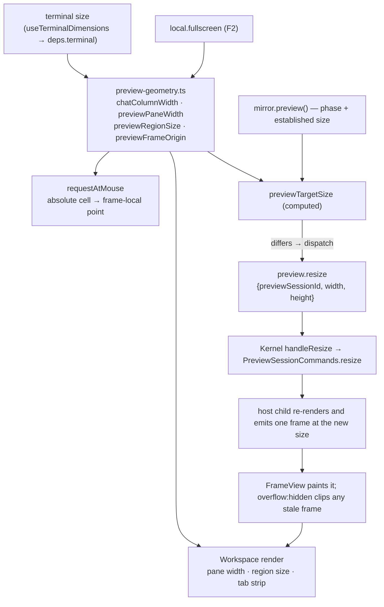

# Preview Render Repair Implementation Plan

> **For agentic workers:** REQUIRED SUB-SKILL: Use superpowers:subagent-driven-development (recommended) or superpowers:executing-plans to implement this plan task-by-task. Steps use checkbox (`- [ ]`) syntax for tracking.

**Goal:** Make the Workspace preview render the current page at the size of the pane that shows it, clipped to that pane, with the design's own pane chrome — and stop the Gate's smoke stage from marking every page `invalid`.

**Architecture:** One pure geometry module (`ui/workspace/model/preview-geometry.ts`) becomes the single source of truth for the chat/preview column split, the preview region's cell size, and the frame's absolute origin. `Workspace.tsx` renders from it, the mouse→frame mapping reads it instead of hardcoded constants, and a connect-hook-owned subscriber in `ui/app/model/deps.ts` dispatches `preview.resize` whenever the region size and the established session size disagree. Clipping (`overflow="hidden"`) makes an out-of-date frame a transient visual, never a shell-corrupting overdraw. Separately, `buildPageDescriptors` starts passing the canonical absolute `sourcePath` into the Gate so the smoke stage can read the file it is asked to render.

**Tech Stack:** Bun 1.3.14 · TypeScript 7 · React 19 · `@opentui/core`/`@opentui/react` 0.4.5 · Reatom v1001 · Zod 4 · errore 0.14

## Global Constraints

- Run tests with `bun test <path>`. There is no `test` npm script. Lint: `bun run lint` (oxlint). Format check: `bun run fmt:check` (oxfmt).
- Prefix every shell command with `rtk` (global CLAUDE.md), including inside `&&` chains: `rtk git add . && rtk git commit -m "..."`.
- Commit messages, code comments, and doc prose are English. Chat replies to the maintainer are Russian.
- Cross-module imports use the `tsconfig.json` path aliases (`ui/*`, `core/*`, `host/*`, `entities/*`, …). Relative imports only inside one module.
- Reatom rules apply (skill `reatom:reatom`): long-lived effects are owned by a connect hook that returns cleanup; every callback that writes an atom from a promise continuation or an external subscriber is created with `bind(...)` **in the hook body, before any await**; reactive inputs are read before the first `await`.
- errore rules apply (skill `errore`): errors are returned as values, `instanceof Error` early returns on one line, never swallow an error without logging it.
- **The design is the source of truth.** Every glyph, hue and offset below is transcribed from `design/termcraft-engine.js`; where OpenTUI cannot reproduce it 1:1, implement the closest faithful mapping and document the divergence in a code comment. Never substitute an invented value.
- Run `/reatom-audit` after any task that touched Reatom code (Task 4 does; the rest do not).
- If a task changes behaviour covered by `docs/architecture/`, Task 10 updates the docs — do not leave them stale.

## Background: what is actually broken

Verified by reproduction on 2026-07-28 (headless render of `examples/clock/.termcraft/pages/dashboard/page.tsx` plus a real `Workspace` render fed that captured frame):

| # | Symptom | Root cause |
|---|---|---|
| 1 | Page content is clipped and a dead band sits right of / below it | The host renders at a hardcoded **80×24** (`sizeFromWorkspaceState`, `"auto"` → the `80x24` preset) and **nothing in `src/ui` ever dispatches `preview.resize`** |
| 2 | The preview pane loses its right border and paints past the terminal edge | Neither `ws-preview` nor `ws-preview-canvas` sets `overflow`, and the canvas carries the frame's own width/height |
| 3 | Empty/error/crash/unavailable panels blow the pane's right border away | `Workspace.tsx:699` passes the pane's **outer** width; the content box is `width - 2` |
| 4 | Tabs read `dashboard`/`calendar`, not `Дашборд · Время` | `buildPageDescriptors` calls `runPage({source, slug})` with no `sourcePath`; the Gate's smoke stage then asks the host to read `dashboard.tsx` relative to a fresh scratch cwd → `MALFORMED_PROTOCOL: cannot read source at dashboard.tsx` → **every descriptor is `invalid`** |
| 5 | The page's `Separator` is a 1-cell green block | `<box height={1} backgroundColor>` with no width, inside a `Column align="center"` — the cross axis never stretches |
| 6 | The panel title looks glued to the corner | design `box()` draws rounded corners and `' '+title+' '`; `Panel` renders OpenTUI's square-cornered, unpadded title |
| 7 | No rule between the tab strip and the design | design `paneShell` draws `hline` at y=2 with `├`/`┤` tees and starts the design at `dy=4`, `dh=frameH-5` |
| 8 | Status bar reads `STATIC … F2 fullscreen` | design `wsStatus` pushes the mode chip **last**; design `hintKeys` shortens `fullscreen→full`, `interact→act`, `versions→vers` |

Out of scope for this plan (recorded, not fixed here): `PreviewSession.query` is unwired in `host/adapters/host-supervisor.ts` (Gap H), so hover/selection/pin never resolve; `preview.setMode` has no UI producer, so the session stays `static`.

### Sizing pipeline this plan installs



---

## File Structure

**Created**
- `src/ui/workspace/model/preview-geometry.ts` — pure cell arithmetic for the chat/preview split, the preview region, and the frame origin. No React, no atoms.
- `src/ui/workspace/model/preview-geometry.test.ts` — its unit tests.
- `src/ui/workspace/ui/PreviewPaneRule.tsx` — the design's `├───┤` rule row under the tab strip (Task 9).

**Modified**
- `src/ui/workspace/ui/Workspace.tsx` — renders from the geometry module; clips the preview region; passes region (not pane) sizes to the placeholder panels; draws the rule row.
- `src/ui/workspace/index.ts` — re-export the new geometry helpers.
- `src/ui/app/model/deps.ts` — hoist `fullscreen`, add the `previewTargetSize` computed and the connect-hook-owned `preview.resize` subscriber.
- `src/core/kernel/model/handlers/page-descriptors.ts` — pass the canonical absolute `sourcePath` to `gateRunner.runPage`.
- `src/core/ports/fakes/gate-runner.ts` — record `sourcePath` on the `runPage` call so the fix is testable.
- `src/runtime/ui/separator.tsx` — stretch across the cross axis.
- `src/runtime/ui/panel.tsx` — rounded border, design-padded title.
- `src/ui/status-bar/ui/StatusBar.tsx` — design segment order, design short hint labels.
- `docs/architecture/flows/interactive-prototype.md`, `docs/architecture/overview.md` — record the resize channel and the region-sizing contract.

---

## Task 1: Preview geometry module

The one place that knows how the terminal splits into chat + preview, how big the preview region is, and where the frame's top-left cell lands. Every consumer reads it; nothing recomputes it.

**Files:**
- Create: `src/ui/workspace/model/preview-geometry.ts`
- Test: `src/ui/workspace/model/preview-geometry.test.ts`
- Modify: `src/ui/workspace/index.ts`
- Modify: `src/ui/workspace/ui/Workspace.tsx:401-412` (the `chatW`/`previewWidth`/`frameH` block), `:482-493` (`requestAtMouse`), `:698-707` (the two render calls)

**Interfaces:**
- Produces:
  - `interface CellSize { readonly w: number; readonly h: number }`
  - `interface CellPoint { readonly x: number; readonly y: number }`
  - `chatColumnWidth(terminalWidth: number): number`
  - `previewPaneWidth(terminal: CellSize, fullscreen: boolean): number`
  - `previewRegionSize(terminal: CellSize, fullscreen: boolean): CellSize`
  - `previewFrameOrigin(terminal: CellSize, fullscreen: boolean): CellPoint`

- [ ] **Step 1: Write the failing test**

Create `src/ui/workspace/model/preview-geometry.test.ts`:

```ts
import { describe, expect, test } from "bun:test";

import {
  chatColumnWidth,
  previewFrameOrigin,
  previewPaneWidth,
  previewRegionSize,
} from "./preview-geometry";

describe("preview-geometry", () => {
  test("the chat column is the design's 37% of the terminal width", () => {
    // design/termcraft-engine.js:478 — `chatW = Math.round(w * 0.37)`.
    expect(chatColumnWidth(120)).toBe(44);
    expect(chatColumnWidth(140)).toBe(52);
    expect(chatColumnWidth(80)).toBe(30);
  });

  test("the preview pane claims the rest of the width, or all of it in fullscreen", () => {
    expect(previewPaneWidth({ w: 120, h: 34 }, false)).toBe(76);
    expect(previewPaneWidth({ w: 120, h: 34 }, true)).toBe(120);
  });

  test("the region is the pane minus its own border and its tab strip row", () => {
    // pane 76 wide → 74 inside the left/right border; h - 1 status bar - 2 border - 1 tabs.
    expect(previewRegionSize({ w: 120, h: 34 }, false)).toEqual({ w: 74, h: 30 });
    expect(previewRegionSize({ w: 120, h: 34 }, true)).toEqual({ w: 118, h: 30 });
  });

  test("the region never reports a negative size on a terminal too small to hold the chrome", () => {
    expect(previewRegionSize({ w: 1, h: 1 }, false)).toEqual({ w: 0, h: 0 });
  });

  test("the frame's top-left cell sits inside the pane border, under the tab strip", () => {
    expect(previewFrameOrigin({ w: 120, h: 34 }, false)).toEqual({ x: 45, y: 2 });
    expect(previewFrameOrigin({ w: 120, h: 34 }, true)).toEqual({ x: 1, y: 2 });
  });
});
```

- [ ] **Step 2: Run the test to verify it fails**

Run: `rtk bun test src/ui/workspace/model/preview-geometry.test.ts`
Expected: FAIL — `Cannot find module './preview-geometry'`

- [ ] **Step 3: Write the implementation**

Create `src/ui/workspace/model/preview-geometry.ts`:

```ts
/** One rectangle size in terminal cells. */
export interface CellSize {
  readonly w: number;
  readonly h: number;
}

/** One absolute terminal cell. */
export interface CellPoint {
  readonly x: number;
  readonly y: number;
}

/**
 * The chat column's share of the terminal, verbatim from the design engine's own
 * `paneShell` (`design/termcraft-engine.js:478`: `chatW = Math.round(w * 0.37)`).
 */
const CHAT_WIDTH_RATIO = 0.37;

/** Rows the shell owns outside the preview pane: the status bar. */
const STATUS_BAR_ROWS = 1;

/** The pane's own top+bottom border rows. */
const PANE_BORDER_ROWS = 2;

/** The tab strip row inside the pane (design `paneShell` draws it at y=1). */
const TAB_STRIP_ROWS = 1;

/** The pane's own left+right border columns. */
const PANE_BORDER_COLUMNS = 2;

export function chatColumnWidth(terminalWidth: number): number {
  return Math.round(terminalWidth * CHAT_WIDTH_RATIO);
}

/**
 * The preview pane's OUTER width — border columns included. Fullscreen (F2) drops the chat
 * column entirely, matching the design engine's `paneShell(..., {noChat:true})`
 * (`design/termcraft-engine.js:478,481`: `chatW = 0`, so `pw = w`).
 */
export function previewPaneWidth(terminal: CellSize, fullscreen: boolean): number {
  return fullscreen ? terminal.w : terminal.w - chatColumnWidth(terminal.w);
}

/**
 * The cell size actually available to preview CONTENT: the pane minus its own border, minus
 * the tab strip row. This is the size the host is asked to render at (`preview.resize`) and
 * the size every placeholder panel is laid out in — one number, so a frame can never be
 * sized against a different rectangle than the one it is painted into. Clamped at zero so a
 * terminal too small to hold the chrome reports an empty region rather than a negative one.
 */
export function previewRegionSize(terminal: CellSize, fullscreen: boolean): CellSize {
  return {
    w: Math.max(0, previewPaneWidth(terminal, fullscreen) - PANE_BORDER_COLUMNS),
    h: Math.max(0, terminal.h - STATUS_BAR_ROWS - PANE_BORDER_ROWS - TAB_STRIP_ROWS),
  };
}

/**
 * The ABSOLUTE terminal cell the frame's own (0,0) lands on — what turns a mouse event into
 * a frame-local point. Derived from the same split `previewRegionSize` uses rather than
 * restated as a constant: a hardcoded origin is exactly what silently breaks when the pane's
 * chrome gains or loses a row.
 */
export function previewFrameOrigin(terminal: CellSize, fullscreen: boolean): CellPoint {
  return {
    x: (fullscreen ? 0 : chatColumnWidth(terminal.w)) + 1,
    y: PANE_BORDER_ROWS - 1 + TAB_STRIP_ROWS,
  };
}
```

- [ ] **Step 4: Run the test to verify it passes**

Run: `rtk bun test src/ui/workspace/model/preview-geometry.test.ts`
Expected: PASS (5 tests)

- [ ] **Step 5: Re-export from the module barrel**

In `src/ui/workspace/index.ts`, add alongside the existing exports:

```ts
export type { CellPoint, CellSize } from "./model/preview-geometry";
export {
  chatColumnWidth,
  previewFrameOrigin,
  previewPaneWidth,
  previewRegionSize,
} from "./model/preview-geometry";
```

- [ ] **Step 6: Rewire `Workspace.tsx` to the module**

Add to the relative-import block near `import { deriveTabs, tabsOverflow } from "../model/tabs";`:

```ts
import { chatColumnWidth, previewFrameOrigin, previewPaneWidth, previewRegionSize } from "../model/preview-geometry";
```

Replace the width/height block (currently `Workspace.tsx:401-412`):

```tsx
  const w = size.w;
  const h = size.h;
  const chatW = chatColumnWidth(w);
  // Every preview measurement comes from ONE module (`../model/preview-geometry.ts`) so the
  // rectangle the host is asked to render into, the box it is painted into, and the origin
  // the mouse is mapped against can never drift apart.
  const previewWidth = previewPaneWidth(size, fullscreen);
  const previewRegion = previewRegionSize(size, fullscreen);
  const frameH = h - 1;
```

Replace the two render calls at the bottom of `ws-preview`:

```tsx
          {renderTabs(tabs, previewWidth, onTabMouseDown)}
          {renderPreviewRegion(preview, uiFrame, descriptors.length > 0, previewRegion, {
```

and change `renderPreviewRegion`'s signature from `width: number, height: number` to `region: CellSize`, replacing every `width={width}`/`height={height}` with `width={region.w}`/`height={region.h}` (four panels — `ErrorPanel`, `HostCrashPanel`, `HostUnavailablePanel`, `EmptyState`). Import the type: `import type { CellSize } from "../model/preview-geometry";`.

Replace `requestAtMouse`'s hardcoded rectangle:

```tsx
  const requestAtMouse = (purpose: "hover" | "select" | "pin", event: MouseEvent) => {
    const current = previewFrame();
    if (current === null) return;
    const origin = previewFrameOrigin(size, fullscreen);
    const frameRect = {
      x: origin.x,
      y: origin.y,
      width: current.frame.width,
      height: current.frame.height,
    };
    const point = frameLocalPoint({ absolute: { x: event.x, y: event.y }, frameRect });
    requestGeometry(props.deps, purpose, point.x, point.y);
  };
```

- [ ] **Step 7: Run the workspace tests to verify nothing regressed**

Run: `rtk bun test src/ui/workspace`
Expected: PASS — this task is a pure refactor; every number it produces equals what the inline arithmetic produced before.

- [ ] **Step 8: Lint, format, commit**

```bash
rtk bun run lint && rtk bun run fmt:check
rtk git add src/ui/workspace && rtk git commit -m "refactor(ui): centralise preview pane geometry in one pure module"
```

---

## Task 2: Clip the preview region to the pane

An out-of-date frame must be a transient visual, never an overdraw that eats the shell's own borders. Today an 80-wide frame in a 74-wide pane paints over the pane's right border and past the terminal edge; at 100×20 it also paints over both panels' bottom borders.

**Files:**
- Modify: `src/ui/workspace/ui/Workspace.tsx` (the `ws-preview` box and `ws-preview-canvas`)
- Test: `src/ui/workspace/ui/Workspace.test.tsx` (append a new `describe`)

**Interfaces:**
- Consumes: `previewRegionSize` from Task 1.

- [ ] **Step 1: Write the failing test**

Append to `src/ui/workspace/ui/Workspace.test.tsx`:

```tsx
describe("Workspace preview clipping", () => {
  const readyDescriptor = (slug: string, title: string): PageDescriptorV1 => ({
    status: "ready",
    pageSlug: slug,
    sourceHash: TEST_SHA,
    title,
    minSize: { w: 60, h: 26 },
    theme: "dark-default",
    kitApiVersion: 1,
  });

  /** One frame of solid `#` cells at the requested size — deliberately larger than the pane. */
  const solidFrame = (width: number, height: number) => ({
    sessionId: uuidv7(),
    sourceHash: TEST_SHA,
    frameSeq: "1",
    width,
    height,
    rows: Array.from({ length: height }, () => [
      { text: "#".repeat(width), fg: "default" as const, bg: "default" as const, attrs: 0 },
    ]),
  });

  test("a frame wider and taller than the pane never paints over the pane's own border", async () => {
    const deps = createUiDeps(createFakeKernel(), { w: 120, h: 34 });
    deps.mirror.apply(
      snapshot({
        projectId: uuidv7(),
        activePageSlug: "dashboard",
        activeChatId: uuidv7(),
        trust: "trusted",
        pageDescriptors: [readyDescriptor("dashboard", "Дашборд")],
      }),
    );
    const fake = createFakePreviewSession();
    const frame = solidFrame(80, 24);
    deps.previewFrame.set({ frame, frameToken: uuidv7() as never, handle: fake.handle });

    const handle = await createHeadlessRenderer({ w: 120, h: 34 });
    open = handle;
    handle.mount(<Workspace deps={deps} readOnly={false} />);
    await handle.render();
    const rows = handle.capture().rows;
    const lines = rows.map((row) => row.map((run) => run.text).join(""));

    // The pane's right border column survives on every row of the preview region, and the
    // frame's own cells stop before it.
    const regionRows = lines.slice(2, 32);
    for (const line of regionRows) {
      expect(line.length).toBe(120);
      expect(line[119]).not.toBe("#");
    }
    // The pane's bottom border row is intact — a rounded corner, not frame content.
    expect(lines[32]).toContain("╯");
  });
});
```

Add to that file's imports (only what is missing): `import { createFakePreviewSession } from "ui/testing";`.

- [ ] **Step 2: Run the test to verify it fails**

Run: `rtk bun test src/ui/workspace/ui/Workspace.test.tsx`
Expected: FAIL — the region rows end in `#` and the last column is frame content, because nothing clips it.

- [ ] **Step 3: Write the implementation**

In `Workspace.tsx`, add `overflow="hidden"` to the `ws-preview` box:

```tsx
        <box
          id="ws-preview"
          flexGrow={1}
          height={frameH}
          flexDirection="column"
          overflow="hidden"
          border
          borderStyle="rounded"
          borderColor={composerFocused && !fullscreen ? SHELL_PALETTE.line : SHELL_PALETTE.amber}
        >
```

and clamp the canvas in `renderPreviewRegion`:

```tsx
  if (uiFrame !== null) {
    const frameRect = { x: 0, y: 0, width: uiFrame.frame.width, height: uiFrame.frame.height };
    return (
      <box
        id="ws-preview-canvas"
        position="relative"
        // Clamped to the region, not sized by the frame: a frame the host has not yet
        // re-rendered at the current pane size (see `previewTargetSize` in
        // `ui/app/model/deps.ts`) is a transient the pane clips, never an overdraw that
        // eats the pane's own border and the rows below it. `overflow="hidden"` is what
        // makes the clamp actually cut the content rather than merely mis-measure the box.
        width={Math.min(uiFrame.frame.width, region.w)}
        height={Math.min(uiFrame.frame.height, region.h)}
        overflow="hidden"
        onMouseMove={interaction.onMouseMove}
        onMouseDown={interaction.onMouseDown}
      >
```

- [ ] **Step 4: Run the test to verify it passes**

Run: `rtk bun test src/ui/workspace/ui/Workspace.test.tsx`
Expected: PASS

- [ ] **Step 5: Run the whole UI suite**

Run: `rtk bun test src/ui`
Expected: PASS

- [ ] **Step 6: Commit**

```bash
rtk git add src/ui/workspace && rtk git commit -m "fix(ui): clip the preview region so an oversized frame cannot overdraw the shell"
```

---

## Task 3: Size the placeholder panels to the region, not the pane

`EmptyState`, `ErrorPanel`, `HostCrashPanel` and `HostUnavailablePanel` were handed the pane's **outer** width, so each was 2 columns too wide and pushed the pane's right border and bottom-right corner off the terminal. Task 1 already changed the call site to pass `previewRegion`; this task pins that with a test and checks the four components need no internal adjustment.

**Files:**
- Modify: `src/ui/workspace/ui/Workspace.tsx` (verify `renderPreviewRegion` uses `region.w`/`region.h` throughout)
- Test: `src/ui/workspace/ui/Workspace.test.tsx`

**Interfaces:**
- Consumes: `previewRegionSize`, and Task 1's `renderPreviewRegion(…, region: CellSize, …)` signature.

- [ ] **Step 1: Write the failing test**

Append to `src/ui/workspace/ui/Workspace.test.tsx`:

```tsx
describe("Workspace preview placeholder sizing", () => {
  test("the empty state leaves the preview pane's right border and bottom corner intact", async () => {
    const deps = createUiDeps(createFakeKernel(), { w: 120, h: 20 });
    deps.mirror.apply(
      snapshot({
        projectId: uuidv7(),
        activePageSlug: null,
        activeChatId: uuidv7(),
        trust: "trusted",
      }),
    );
    const handle = await createHeadlessRenderer({ w: 120, h: 20 });
    open = handle;
    handle.mount(<Workspace deps={deps} readOnly={false} />);
    await handle.render();
    const lines = handle.capture().rows.map((row) => row.map((run) => run.text).join(""));

    expect(lines.join("\n")).toContain("No pages yet — describe what to build");
    // Row 1..17 are inside the pane; each must still end in the pane's own border column.
    for (const line of lines.slice(1, 18)) expect(line[119]).toBe("│");
    // The pane's bottom-right rounded corner survives.
    expect(lines[18]?.[119]).toBe("╯");
  });
});
```

- [ ] **Step 2: Run the test to verify it fails**

Run: `rtk bun test src/ui/workspace/ui/Workspace.test.tsx`
Expected: FAIL if `renderPreviewRegion` still passes an outer width anywhere — the right column is a space, not `│`.

- [ ] **Step 3: Fix any remaining outer-width usage**

Confirm every panel inside `renderPreviewRegion` reads the region:

```tsx
    return (
      <ErrorPanel
        id="ws-preview-error"
        width={region.w}
        height={region.h}
        headline="could not render current design"
        cause={preview.failure.safeMessage}
        nextStep="fix it in a repair turn — the composer stays open"
        restoreHint={null}
      />
    );
```

…and the same `width={region.w} height={region.h}` pair on `HostCrashPanel`, `HostUnavailablePanel` and `EmptyState`.

- [ ] **Step 4: Run the test to verify it passes**

Run: `rtk bun test src/ui/workspace/ui/Workspace.test.tsx`
Expected: PASS

- [ ] **Step 5: Commit**

```bash
rtk git add src/ui/workspace && rtk git commit -m "fix(ui): size preview placeholder panels to the region, not the pane's outer width"
```

---

## Task 4: Dispatch `preview.resize` from the shell

`preview.resize` is wired end to end — protocol schema, capability guard, `handleResize`, `PreviewSessionCommands.resize`, `host/adapters/host-supervisor.ts`, the host child — and has **no producer**. This task adds the one subscriber that closes it.

Two facts that shape the design:

1. The capability guard admits `preview.resize` only from the `live` phase (`core/capabilities/model/guards.ts:283-286`), which the mirror reports as `preview.phase === "ready"`.
2. `handleResize` publishes only `kernel.stateChanged` — the mirror's `preview.size` keeps reporting the size the session was **established** at, forever. So the size comparison is only an honest skip for the first dispatch after a session is established; the per-`(sessionId, size)` memo below is the real repeat guard.

**Files:**
- Modify: `src/ui/app/model/deps.ts`
- Test: `src/ui/app/model/deps.test.ts`

**Interfaces:**
- Consumes: `previewRegionSize` (Task 1), `mirror.preview()`, `local.fullscreen`, `dispatcher.dispatch`.
- Produces: nothing new on `UiDeps`; the behaviour is internal to the `runtime` atom's connect hook.

- [ ] **Step 1: Write the failing test**

Append to `src/ui/app/model/deps.test.ts` (add any missing imports: `event`, `TEST_NONCE`, `TEST_SHA` from `ui/testing`; `uuidv7` from `infrastructure/uuid`):

```ts
describe("preview resize", () => {
  const sessionReady = (previewSessionId: string, size: { w: number; h: number }) =>
    event("preview.sessionReady", {
      previewSessionId: previewSessionId as never,
      nonce: TEST_NONCE,
      pageSlug: "dashboard",
      sourceHash: TEST_SHA,
      hostMode: "preview",
      interactionMode: "static",
      size,
      theme: "dark-default",
      initialFrameSeq: "1",
    });

  const resizeEnvelopes = (kernel: { readonly dispatched: readonly unknown[] }) =>
    kernel.dispatched.filter(
      (raw) => (raw as { kind?: unknown }).kind === "preview.resize",
    ) as readonly { readonly payload: { previewSessionId: string; width: number; height: number } }[];

  test("asks the host for the region size once a session is established at a different size", async () => {
    const kernel = createFakeKernel();
    const deps = createUiDeps(kernel, { w: 120, h: 34 });
    const stop = deps.runtime.subscribe(() => {});
    const previewSessionId = uuidv7();
    kernel.emit(sessionReady(previewSessionId, { w: 80, h: 24 }));
    await Promise.resolve();

    expect(resizeEnvelopes(kernel)).toHaveLength(1);
    expect(resizeEnvelopes(kernel)[0]?.payload).toEqual({
      previewSessionId,
      width: 74,
      height: 30,
    });
    stop();
  });

  test("does not ask again for a size it already asked for", async () => {
    const kernel = createFakeKernel();
    const deps = createUiDeps(kernel, { w: 120, h: 34 });
    const stop = deps.runtime.subscribe(() => {});
    const previewSessionId = uuidv7();
    kernel.emit(sessionReady(previewSessionId, { w: 80, h: 24 }));
    await Promise.resolve();
    // A second readiness event for the SAME session and size must not re-ask.
    kernel.emit(sessionReady(previewSessionId, { w: 80, h: 24 }));
    await Promise.resolve();

    expect(resizeEnvelopes(kernel)).toHaveLength(1);
    stop();
  });

  test("asks again when the terminal is resized", async () => {
    const kernel = createFakeKernel();
    const deps = createUiDeps(kernel, { w: 120, h: 34 });
    const stop = deps.runtime.subscribe(() => {});
    const previewSessionId = uuidv7();
    kernel.emit(sessionReady(previewSessionId, { w: 80, h: 24 }));
    await Promise.resolve();
    deps.terminal.set({ w: 140, h: 36 });
    await Promise.resolve();

    const envelopes = resizeEnvelopes(kernel);
    expect(envelopes).toHaveLength(2);
    expect(envelopes[1]?.payload).toEqual({ previewSessionId, width: 86, height: 32 });
    stop();
  });

  test("never asks while no session is live", async () => {
    const kernel = createFakeKernel();
    const deps = createUiDeps(kernel, { w: 120, h: 34 });
    const stop = deps.runtime.subscribe(() => {});
    deps.terminal.set({ w: 140, h: 36 });
    await Promise.resolve();

    expect(resizeEnvelopes(kernel)).toHaveLength(0);
    stop();
  });
});
```

- [ ] **Step 2: Run the test to verify it fails**

Run: `rtk bun test src/ui/app/model/deps.test.ts`
Expected: FAIL — `resizeEnvelopes(...)` is empty; nothing dispatches `preview.resize`.

- [ ] **Step 3: Hoist `fullscreen` above the `runtime` atom**

In `src/ui/app/model/deps.ts`, delete `fullscreen: atom(false, "ui.local.fullscreen"),` from the `local` object literal and declare it next to `pageOverride` (above `const runtime = …`), for the same stated reason that hoist exists:

```ts
  // Declared here, above `runtime`, because that atom's connect hook reads it to size the
  // preview region — same reason `pageOverride` is hoisted.
  const fullscreen = atom(false, "ui.local.fullscreen");
```

then reference it in the `local` object: `fullscreen,`.

- [ ] **Step 4: Add the target-size computed**

Immediately above `const runtime = atom<undefined>(...)`:

```ts
  /**
   * The size the live preview session SHOULD be rendering at, or `null` when there is
   * nothing to ask for. Reads the region from the one geometry module the Workspace lays
   * itself out with (`ui/workspace`'s `previewRegionSize`), so the rectangle the host fills
   * and the box the shell paints into are the same rectangle by construction.
   *
   * `preview.size` is the size the session was ESTABLISHED at and never changes afterwards —
   * `handleResize` publishes only `kernel.stateChanged`, no size event — so this comparison
   * is an honest skip only for the first ask after establishment. The per-(session, size)
   * memo inside the connect hook below is the real repeat guard.
   */
  const previewTargetSize = computed<Readonly<{
    previewSessionId: UUIDv7;
    w: number;
    h: number;
  }> | null>(() => {
    const preview = mirror.preview();
    // Only `ready` maps to the machine's `live` phase, the one phase the capability guard
    // admits `preview.resize` from (`core/capabilities/model/guards.ts`).
    if (preview.phase !== "ready") return null;
    const region = previewRegionSize(terminal(), fullscreen());
    if (region.w < 1 || region.h < 1) return null;
    if (region.w === preview.size.w && region.h === preview.size.h) return null;
    return { previewSessionId: preview.previewSessionId, w: region.w, h: region.h };
  }, "ui.app.previewTargetSize");
```

Add the imports: `import { previewRegionSize } from "ui/workspace";` and, if not already present, `UUIDv7` from `core/protocol`.

- [ ] **Step 5: Add the connect-hook-owned subscriber**

Inside `withConnectHook(() => { … })`, next to the other `bind(...)` declarations (before anything async):

```ts
      // THE MISSING PRODUCER for `preview.resize`. The command has been wired end to end —
      // schema, guard, `handleResize`, `PreviewSessionCommands.resize`, the host adapter, the
      // child — with nothing in `src/ui` ever issuing it, so every preview rendered at
      // `sizeFromWorkspaceState`'s `"auto"` fallback (80×24) whatever the pane's real size
      // was. Owned by THIS hook and torn down below (RTM-L01); `bind` is created here, in the
      // hook body, because the `.then` continuation writes `lastResizeKey` and the dispatch
      // resolves outside this frame (RTM-A04).
      //
      // Coalescing is the host's job by contract (host-supervision §8: "coalescible resize …
      // may continue to replace an already pending value"), and `PreviewSessionCommands
      // .resize` deliberately reserves no queue slot — so a drag that emits many sizes is
      // handled downstream rather than debounced here.
      let lastResizeKey: string | null = null;
      const requestPreviewResize = bind(
        (target: Readonly<{ previewSessionId: UUIDv7; w: number; h: number }>) => {
          const key = `${target.previewSessionId}@${target.w}x${target.h}`;
          if (key === lastResizeKey) return;
          lastResizeKey = key;
          trace("ui.preview.resize", target);
          void dispatcher
            .dispatch("preview.resize", {
              previewSessionId: target.previewSessionId,
              width: target.w,
              height: target.h,
            })
            .then((result) => {
              if (result instanceof Error) {
                // Logged, never swallowed (errore rule 21). A preview stuck at the previous
                // size is a degraded view, not an unusable UI, so `runtimeError` stays clear.
                console.warn("UI preview.resize dispatch failed:", result);
                lastResizeKey = null;
                return;
              }
              if (result.status === "rejected") {
                console.warn(`UI preview.resize was rejected (${result.code})`);
                lastResizeKey = null;
              }
            });
        },
      );
      const unsubscribePreviewSize = previewTargetSize.subscribe((target) => {
        if (target === null) return;
        requestPreviewResize(target);
      });
```

and add the teardown to the hook's returned cleanup, next to `unsubscribeActivePage()`:

```ts
        unsubscribePreviewSize();
```

- [ ] **Step 6: Run the test to verify it passes**

Run: `rtk bun test src/ui/app/model/deps.test.ts`
Expected: PASS (4 new tests)

- [ ] **Step 7: Run the full UI suite and the Reatom audit**

Run: `rtk bun test src/ui`
Expected: PASS

Then run `/reatom-audit` (this task touched a computed, a connect hook and a bound continuation) and fix anything it reports.

- [ ] **Step 8: Commit**

```bash
rtk git add src/ui && rtk git commit -m "feat(ui): resize the live preview to the pane it is painted into"
```

---

## Task 5: Give the Gate's smoke stage a path it can read

`buildPageDescriptors` calls `gateRunner.runPage({ source, slug })`. With no `sourcePath` the adapter falls back to `${slug}.tsx` (`gate/adapters/gate-runner.ts:100`), which the host child resolves against its own fresh scratch cwd — proven to fail:

```
PATH: dashboard.tsx  => {"ok":false,"code":"MALFORMED_PROTOCOL","message":"cannot read source at dashboard.tsx"}
PATH: <absolute>     => {"ok":true}
```

So every descriptor comes back `invalid`: the tab strip falls back to the slug, `minSize`/`theme`/`kitApiVersion` are lost (the status bar's `w×h < min` warning can never fire), each page carries a bogus Gate error, and one host child is spawned and thrown away per page on every open and every turn.

**Files:**
- Modify: `src/core/ports/fakes/gate-runner.ts`
- Modify: `src/core/kernel/model/handlers/page-descriptors.ts`
- Test: `src/core/kernel/model/handlers/project.test.ts`

**Interfaces:**
- Produces: `GateRunnerCall` gains `readonly sourcePath?: string` on its `runPage` member.

- [ ] **Step 1: Record `sourcePath` on the fake's call log**

In `src/core/ports/fakes/gate-runner.ts`, widen the call union:

```ts
export type GateRunnerCall =
  | { readonly method: "runManifestSlice"; readonly presentSlugCount: number }
  | { readonly method: "runPage"; readonly slug: PageSlug; readonly sourcePath?: string }
  | { readonly method: "extractPageMeta"; readonly slug: PageSlug };
```

and record it:

```ts
    calls.push({ method: "runPage", slug: input.slug, ...(input.sourcePath === undefined ? {} : { sourcePath: input.sourcePath }) });
```

- [ ] **Step 2: Write the failing test**

Append to `src/core/kernel/model/handlers/project.test.ts`, inside the describe that already exercises the open path (reuse that block's own context builder and its `gateRunner` fake — pass an explicit `createFakeGateRunner()` through the options object so the test can read `calls`):

```ts
test("validates each canonical page through the Gate at its real on-disk path", async () => {
  const gateRunner = createFakeGateRunner();
  const context = buildContext({ gateRunner, projectRoot: "/tmp/proj" });

  await buildPageDescriptors(context, [slug("dashboard"), slug("calendar")]);

  const runPageCalls = gateRunner.calls.filter((call) => call.method === "runPage");
  expect(runPageCalls).toHaveLength(2);
  expect(runPageCalls[0]).toEqual({
    method: "runPage",
    slug: slug("dashboard"),
    sourcePath: "/tmp/proj/.termcraft/pages/dashboard/page.tsx",
  });
  expect(runPageCalls[1]).toEqual({
    method: "runPage",
    slug: slug("calendar"),
    sourcePath: "/tmp/proj/.termcraft/pages/calendar/page.tsx",
  });
});
```

Import `buildPageDescriptors` from `./page-descriptors` and `createFakeGateRunner` from `core/ports/fakes` if not already imported. If that file's context builder does not yet accept a `gateRunner` or a `projectRoot` override, add both as optional fields on its options object, defaulting to what it uses today — the smallest change that makes the call observable.

- [ ] **Step 3: Run the test to verify it fails**

Run: `rtk bun test src/core/kernel/model/handlers/project.test.ts`
Expected: FAIL — the recorded call carries no `sourcePath`.

- [ ] **Step 4: Write the implementation**

In `src/core/kernel/model/handlers/page-descriptors.ts`, add above `buildPageDescriptors`:

```ts
/**
 * `.termcraft` — the project-state directory name. Transcribed here, not imported: `core` may
 * not import `store`, the same reason `handlers/turn.ts` and `handlers/preview-export.ts` each
 * carry their own copy of this constant.
 */
const PROJECT_STATE_DIRNAME = ".termcraft";

/**
 * The CANONICAL page's absolute path — `.termcraft/pages/<slug>/page.tsx`, deliberately NOT
 * the agent workspace's flat `pages/<slug>.tsx`. The Gate's smoke stage hands this straight to
 * a host child that resolves it with `Bun.file` from its OWN fresh scratch cwd
 * (`host/session/model/source-mount.ts`'s `loadPage`), so a bare `${slug}.tsx` — the fallback
 * `gate/adapters/gate-runner.ts` applies when no path is supplied — can never resolve there.
 * Omitting it made EVERY descriptor `invalid` with `cannot read source at <slug>.tsx`: the tab
 * strip fell back to the slug, `minSize`/`theme` were lost, and one host child was spawned and
 * thrown away per page on every open and every turn.
 */
function canonicalPageSourcePath(projectRoot: string, pageSlug: PageSlug): string {
  return `${projectRoot}/${PROJECT_STATE_DIRNAME}/pages/${pageSlug}/page.tsx`;
}
```

and pass it:

```ts
    const result = await wrap(
      context.deps.gateRunner.runPage({
        source: new TextDecoder().decode(source.bytes),
        slug: pageSlug,
        sourcePath: canonicalPageSourcePath(context.deps.projectStore.root, pageSlug),
      }),
    );
```

- [ ] **Step 5: Run the test to verify it passes**

Run: `rtk bun test src/core/kernel/model/handlers/project.test.ts`
Expected: PASS

- [ ] **Step 6: Run the core suite**

Run: `rtk bun test src/core`
Expected: PASS

- [ ] **Step 7: Verify against the real example project**

```bash
rtk bun run src/main.tsx examples/clock
```

Expected: the tab strip reads `▸ Дашборд · Время` and `Календарь` (page titles), not `dashboard`/`calendar`. Quit with `/exit`. If the titles are still slugs, the smoke stage is failing for a different reason — read the newest `termcraft-debug/run-*.jsonl` before changing anything else.

- [ ] **Step 8: Commit**

```bash
rtk git add src/core && rtk git commit -m "fix(kernel): validate canonical pages at their real on-disk path so the smoke stage can read them"
```

---

## Task 6: Make `Separator` span its container

`runtime/ui/separator.tsx` sets only `height={1}`. Inside the page's `Column align="center"` (`alignItems: center`) the cross axis never stretches, so the band collapses to a single cell — the green block in the reported screenshot, confirmed in the captured runs as one cell with `bg #8fb96b`.

**Files:**
- Modify: `src/runtime/ui/separator.tsx`
- Test: `src/runtime/ui/separator.test.tsx`

- [ ] **Step 1: Write the failing test**

Append to `src/runtime/ui/separator.test.tsx` (follow the file's existing render helper; it already renders runtime components through `renderNodeOnce`):

```tsx
test("a horizontal separator spans its container even when the parent centres its children", async () => {
  const frame = await renderNodeOnce(
    <Column id="col" align="center">
      <Separator id="rule" color="success" />
    </Column>,
    { w: 20, h: 3 },
  );
  const filled = frame.rows[0]?.filter((run) => run.bg !== "default") ?? [];
  const width = filled.reduce((sum, run) => sum + run.text.length, 0);
  expect(width).toBe(20);
});
```

Import `Column` from `./column` alongside the existing imports.

- [ ] **Step 2: Run the test to verify it fails**

Run: `rtk bun test src/runtime/ui/separator.test.tsx`
Expected: FAIL — `expect(1).toBe(20)`

- [ ] **Step 3: Write the implementation**

```tsx
export function Separator(props: SeparatorProps) {
  const tokens = activeTokens();
  const direction = props.direction ?? "horizontal";
  const fill = tokens[props.color ?? "line"];
  // `alignSelf: "stretch"` is what makes the rule a RULE. Without it a parent that centres
  // its children (`Column align="center"` — what a generated page reaches for constantly)
  // shrinks the band to its content width, i.e. a single coloured cell. Stretch overrides the
  // parent's `alignItems` for this child only, which is exactly the design's intent: a rule
  // spans its container whatever the container does with everything else.
  if (direction === "vertical") {
    return <box id={props.id} width={1} alignSelf="stretch" backgroundColor={fill} />;
  }
  return <box id={props.id} height={1} alignSelf="stretch" backgroundColor={fill} />;
}
```

- [ ] **Step 4: Run the test to verify it passes**

Run: `rtk bun test src/runtime/ui/separator.test.tsx`
Expected: PASS

- [ ] **Step 5: Run the runtime suite**

Run: `rtk bun test src/runtime`
Expected: PASS

- [ ] **Step 6: Commit**

```bash
rtk git add src/runtime && rtk git commit -m "fix(runtime): stretch Separator across its container instead of collapsing to one cell"
```

---

## Task 7: Draw `Panel` the way the design draws a box

`design/termcraft-engine.js:47-52` — `box()` uses rounded corners unless told otherwise (`const r = o.rounded !== false`), and writes the title at `x+2` as `' ' + title + ' '`. `runtime/ui/panel.tsx` passes neither, so a page's panel renders `┌─Часы────┐` where the design specifies `╭─ Часы ───╮`.

**Files:**
- Modify: `src/runtime/ui/panel.tsx`
- Modify: `src/ui/workspace/ui/Workspace.tsx` (the `ws-chat` title, same one-line pattern)
- Test: `src/runtime/ui/panel.test.tsx`

- [ ] **Step 1: Write the failing test**

Append to `src/runtime/ui/panel.test.tsx`:

```tsx
test("renders the design's rounded frame with a space-padded title", async () => {
  const frame = await renderNodeOnce(
    <Panel id="p" title="Часы">
      <Text id="body">x</Text>
    </Panel>,
    { w: 20, h: 4 },
  );
  const top = frame.rows[0]?.map((run) => run.text).join("") ?? "";
  // design/termcraft-engine.js:47,52 — rounded corners; title at x+2 as ' '+title+' '.
  expect(top.startsWith("╭─ Часы ")).toBe(true);
  expect(top.endsWith("╮")).toBe(true);
});
```

- [ ] **Step 2: Run the test to verify it fails**

Run: `rtk bun test src/runtime/ui/panel.test.tsx`
Expected: FAIL — the row starts `┌─Часы`

- [ ] **Step 3: Write the implementation**

```tsx
export function Panel(props: PanelProps) {
  const tokens = activeTokens();
  return (
    <box
      id={props.id}
      border
      // design/termcraft-engine.js:47 — `box()`'s own default is ROUNDED (`const r =
      // o.rounded !== false`); square corners are the opt-out, and no design screen takes it.
      borderStyle="rounded"
      borderColor={tokens[props.borderColor ?? "border"]}
      // design/termcraft-engine.js:52 — the caption is drawn at `x+2` as `' '+title+' '`.
      // OpenTUI already starts a left-aligned title at index 2, so the padding is the only
      // part this has to supply. DIVERGENCE: the design also draws it bold by default
      // (`titleBold !== false`); OpenTUI's box exposes `titleColor`/`titleAlignment` and no
      // attribute mask for the caption, so weight cannot be reproduced here.
      title={props.title === undefined ? undefined : ` ${props.title} `}
      titleColor={tokens[props.titleColor ?? "foreground"]}
      flexDirection="column"
      padding={props.padding}
    >
      {props.children}
    </box>
  );
}
```

- [ ] **Step 4: Apply the same padding to the shell's own chat panel**

In `Workspace.tsx`, the `ws-chat` box's `title` prop — wrap each branch's literal in the design's spaces:

```tsx
            title={
              turn.phase === "running"
                ? " ❯ chat · working "
                : composerFocused
                  ? ` ❯ chat${chatTitleSuffix} `
                  : ` chat${chatTitleSuffix} `
            }
```

- [ ] **Step 5: Run the tests**

Run: `rtk bun test src/runtime/ui/panel.test.tsx && rtk bun test src/ui`
Expected: PASS. If a Workspace assertion matched a title exactly (`toBe("❯ chat")` rather than `toContain`), update it to the padded form — the padding is the design's, not incidental.

- [ ] **Step 6: Commit**

```bash
rtk git add src/runtime src/ui && rtk git commit -m "fix(runtime): draw Panel with the design's rounded frame and padded title"
```

---

## Task 8: Draw the design's rule under the tab strip

`design/termcraft-engine.js:484-486`: the tab strip sits at `y=1` starting at `px0+2` with width `pw-4`; a horizontal rule with `├`/`┤` tees follows at `y=2`; the design area starts at `dy=4` with `dh = frameH-5`. The implementation has no rule, no blank row, and starts the tabs one column early.

This changes the region size and the frame origin — both of which Task 1 centralised, so the change is two constants plus one new component.

**Files:**
- Create: `src/ui/workspace/ui/PreviewPaneRule.tsx`
- Modify: `src/ui/workspace/model/preview-geometry.ts`
- Modify: `src/ui/workspace/model/preview-geometry.test.ts`
- Modify: `src/ui/workspace/ui/Workspace.tsx` (`renderTabs` offset/width, mount the rule)

- [ ] **Step 1: Write the failing geometry test**

Update the two size/origin tests in `preview-geometry.test.ts` to the design's numbers and add the reason:

```ts
  test("the region is the pane minus its border, its tab strip, the rule and the gap row", () => {
    // design/termcraft-engine.js:486 — `dh = frameH - 5` with `frameH = h - 1`, `dy = 4`.
    expect(previewRegionSize({ w: 120, h: 34 }, false)).toEqual({ w: 74, h: 28 });
    expect(previewRegionSize({ w: 120, h: 34 }, true)).toEqual({ w: 118, h: 28 });
  });

  test("the frame's top-left cell sits at the design's dy", () => {
    expect(previewFrameOrigin({ w: 120, h: 34 }, false)).toEqual({ x: 45, y: 4 });
    expect(previewFrameOrigin({ w: 120, h: 34 }, true)).toEqual({ x: 1, y: 4 });
  });
```

- [ ] **Step 2: Run the test to verify it fails**

Run: `rtk bun test src/ui/workspace/model/preview-geometry.test.ts`
Expected: FAIL — `{ w: 74, h: 30 }` vs `{ w: 74, h: 28 }`, and `y: 2` vs `y: 4`.

- [ ] **Step 3: Update the geometry constants**

In `preview-geometry.ts`, replace the tab-strip constant block:

```ts
/** The tab strip row inside the pane (design `paneShell` draws it at y=1). */
const TAB_STRIP_ROWS = 1;

/**
 * The rule under the tab strip plus the blank row below it — design `paneShell`
 * (`design/termcraft-engine.js:485-486`) draws `hline` at y=2 and starts the design at
 * `dy = 4`, i.e. two rows of header chrome between the tabs and the design.
 */
const TAB_RULE_ROWS = 2;
```

and use it in both functions:

```ts
export function previewRegionSize(terminal: CellSize, fullscreen: boolean): CellSize {
  return {
    w: Math.max(0, previewPaneWidth(terminal, fullscreen) - PANE_BORDER_COLUMNS),
    h: Math.max(
      0,
      terminal.h - STATUS_BAR_ROWS - PANE_BORDER_ROWS - TAB_STRIP_ROWS - TAB_RULE_ROWS,
    ),
  };
}

export function previewFrameOrigin(terminal: CellSize, fullscreen: boolean): CellPoint {
  return {
    x: (fullscreen ? 0 : chatColumnWidth(terminal.w)) + 1,
    y: PANE_BORDER_ROWS - 1 + TAB_STRIP_ROWS + TAB_RULE_ROWS,
  };
}
```

- [ ] **Step 4: Run the geometry test to verify it passes**

Run: `rtk bun test src/ui/workspace/model/preview-geometry.test.ts`
Expected: PASS

- [ ] **Step 5: Write the failing rule-row test**

Append to `src/ui/workspace/ui/Workspace.test.tsx`:

```tsx
describe("Workspace preview pane header", () => {
  test("draws the design's rule between the tab strip and the design area", async () => {
    const deps = createUiDeps(createFakeKernel(), { w: 120, h: 34 });
    deps.mirror.apply(
      snapshot({
        projectId: uuidv7(),
        activePageSlug: null,
        activeChatId: uuidv7(),
        trust: "trusted",
      }),
    );
    const handle = await createHeadlessRenderer({ w: 120, h: 34 });
    open = handle;
    handle.mount(<Workspace deps={deps} readOnly={false} />);
    await handle.render();
    const lines = handle.capture().rows.map((row) => row.map((run) => run.text).join(""));

    // Row 0 pane border, row 1 tabs, row 2 the rule — a solid run of ─ across the pane.
    const rule = lines[2]?.slice(45, 119) ?? "";
    expect(rule).toBe("─".repeat(74));
  });
});
```

- [ ] **Step 6: Run it to verify it fails**

Run: `rtk bun test src/ui/workspace/ui/Workspace.test.tsx`
Expected: FAIL — row 2 is blank/empty content, not a rule.

- [ ] **Step 7: Write the rule component**

Create `src/ui/workspace/ui/PreviewPaneRule.tsx`:

```tsx
import { SHELL_PALETTE } from "ui/theme";

export interface PreviewPaneRuleProps {
  readonly id: string;
  /** The pane's inner content width in cells — `previewRegionSize(...).w`. */
  readonly width: number;
}

/**
 * The rule separating the preview pane's tab strip from the design area (design `paneShell`,
 * `design/termcraft-engine.js:485`: `hline(b, px0+1, 2, pw-2)` in the pane's border hue).
 *
 * DIVERGENCE (documented, same class as this pane's existing frame-junction note in
 * `Workspace.tsx`): the design also welds the rule into the pane's own border with `├`/`┤`
 * tees at `px0` and `px0+pw-1`. Those two cells belong to the border columns, which an
 * OpenTUI flex child cannot reach — a child is laid out strictly inside the border box. The
 * closest faithful mapping is the rule itself, spanning the full content width, in the same
 * hue; the tees are not substituted with anything invented.
 */
export function PreviewPaneRule(props: PreviewPaneRuleProps) {
  return (
    <text id={props.id} fg={SHELL_PALETTE.amber}>
      {"─".repeat(Math.max(0, props.width))}
    </text>
  );
}
```

- [ ] **Step 8: Mount the rule and the gap row, and fix the tab-strip offset**

In `Workspace.tsx`, import it (`import { PreviewPaneRule } from "./PreviewPaneRule";`) and change the pane's children:

```tsx
          {renderTabs(tabs, previewWidth, onTabMouseDown)}
          <PreviewPaneRule id="ws-preview-rule" width={previewRegion.w} />
          {/* design `paneShell`: `dy = 4` — one blank row between the rule and the design. */}
          <box id="ws-preview-gap" height={1} />
          {renderPreviewRegion(preview, uiFrame, descriptors.length > 0, previewRegion, {
```

and in `renderTabs`, match the design's own indent and width (`drawTabs(b, px0+2, 1, pw-4, …)`):

```tsx
  const overflow = tabsOverflow(tabs, width - 4);
  const stripWidth = Math.max(0, width - 4);
  return (
    <box
      id="ws-tabs"
      flexDirection="row"
      position="relative"
      marginLeft={1}
      width={stripWidth}
      height={1}
      overflow="hidden"
    >
```

- [ ] **Step 9: Run the tests to verify they pass**

Run: `rtk bun test src/ui/workspace`
Expected: PASS. The tab-overflow test may need its terminal width adjusted by 2 — the strip is genuinely 2 cells narrower now, matching the design.

- [ ] **Step 10: Run the whole UI suite**

Run: `rtk bun test src/ui`
Expected: PASS

- [ ] **Step 11: Commit**

```bash
rtk git add src/ui && rtk git commit -m "feat(ui): draw the design's rule between the preview tab strip and the design area"
```

---

## Task 9: Status bar segment order and short hint labels

`design/termcraft-engine.js:488-497` (`wsStatus`) pushes the left cluster in the order `combo → version → size → hint → MODE → ctx` — the mode chip is **last**. `StatusBar.tsx` puts it first. `design/termcraft-engine.js:498-501` (`hintKeys`) also shortens `fullscreen→full`, `interact→act`, `versions→vers`; the implementation applies the glyph filter but not the shortening.

**Files:**
- Modify: `src/ui/status-bar/ui/StatusBar.tsx`
- Test: `src/ui/status-bar/ui/StatusBar.test.tsx`

- [ ] **Step 1: Write the failing test**

Append to `src/ui/status-bar/ui/StatusBar.test.tsx` (follow that file's existing render helper):

```tsx
test("orders the left cluster the way the design does — the mode chip last", async () => {
  const frame = await renderNodeOnce(
    <StatusBar
      id="sb"
      width={80}
      mode={{ text: "STATIC", fg: "amberHi", bg: "line" }}
      page={{ text: "dashboard", fg: "dim" }}
      size={{ w: 120, h: 34, min: null }}
      ctx={null}
      ctxCaution={false}
      hint={null}
      hintKeys={[]}
    />,
    { w: 80, h: 1 },
  );
  const line = frame.rows[0]?.map((run) => run.text).join("") ?? "";
  // design/termcraft-engine.js:490-495 — version, then size, then the mode chip.
  expect(line.indexOf("dashboard")).toBeLessThan(line.indexOf("120×34"));
  expect(line.indexOf("120×34")).toBeLessThan(line.indexOf("STATIC"));
});

test("shortens the design's own key labels", async () => {
  const frame = await renderNodeOnce(
    <StatusBar
      id="sb"
      width={80}
      mode={{ text: "STATIC", fg: "amberHi", bg: "line" }}
      page={null}
      size={null}
      ctx={null}
      ctxCaution={false}
      hint={null}
      hintKeys={[
        ["F2", "fullscreen"],
        ["F4", "interact"],
      ]}
    />,
    { w: 80, h: 1 },
  );
  const line = frame.rows[0]?.map((run) => run.text).join("") ?? "";
  // design/termcraft-engine.js:499 — `short = {fullscreen:'full', interact:'act', versions:'vers'}`.
  expect(line).toContain("full");
  expect(line).toContain("act");
  expect(line).not.toContain("fullscreen");
  expect(line).not.toContain("interact");
});
```

- [ ] **Step 2: Run the test to verify it fails**

Run: `rtk bun test src/ui/status-bar/ui/StatusBar.test.tsx`
Expected: FAIL on both — `STATIC` comes first, and the labels are long.

- [ ] **Step 3: Write the implementation**

In `StatusBar.tsx`, add next to `HIDDEN_HINT_GLYPHS`:

```ts
/** Label shortenings `hintKeys()` applies (design `hintKeys`, `design/termcraft-engine.js:499`). */
const SHORT_HINT_LABELS: Readonly<Record<string, string>> = {
  fullscreen: "full",
  interact: "act",
  versions: "vers",
};

/** Applies the design's own shortening; a label the design does not shorten passes through. */
function shortHintLabel(label: string): string {
  return SHORT_HINT_LABELS[label] ?? label;
}
```

Move the mode chip to the end of `buildLeftSegments` — the array now starts empty and the chip is pushed after `hint`, before `ctx`:

```ts
function buildLeftSegments(props: StatusBarProps): readonly LeftSegment[] {
  // design `wsStatus` (`design/termcraft-engine.js:489-496`) assembles its `left` array in
  // this exact order: version -> size -> hint -> MODE -> ctx. CORRECTED: this used to push
  // the mode chip FIRST, citing `:403-412` — a stale range that now lands in
  // `gitHistoryInset`. The dead `combo` chip stays dropped (every workspace screen after §07
  // passes `combo:false`).
  const segments: LeftSegment[] = [];

  if (props.page) {
    segments.push({
      id: "page",
      text: `  ${props.page.text} `,
      fg: SHELL_PALETTE[props.page.fg],
      bg: SHELL_PALETTE.statusBg,
      bold: props.page.bold === true,
    });
  }

  if (props.size) {
    const belowMin = isBelowMinimum(props.size);
    const label =
      belowMin && props.size.min != null
        ? `${props.size.w}×${props.size.h} < ${props.size.min.w}×${props.size.min.h}`
        : `${props.size.w}×${props.size.h}`;
    segments.push({
      id: "size",
      text: ` ${label} `,
      fg: belowMin ? SHELL_PALETTE.bg : SHELL_PALETTE.dim,
      bg: belowMin ? SHELL_PALETTE.red : SHELL_PALETTE.statusBg,
      bold: belowMin,
    });
  }

  if (props.hint) {
    segments.push({
      id: "hint",
      text: ` ${props.hint.text} `,
      fg: SHELL_PALETTE[props.hint.fg],
      bg: SHELL_PALETTE[props.hint.bg],
      bold: true,
    });
  }

  segments.push({
    id: "mode",
    text: ` ${props.mode.text} `,
    fg: SHELL_PALETTE[props.mode.fg],
    bg: SHELL_PALETTE[props.mode.bg],
    bold: true,
  });

  const showCtx = props.ctx != null && (props.width >= 100 || props.ctxCaution === true);
  if (showCtx) {
    segments.push({
      id: "ctx",
      text: ` ctx ${props.ctx}% `,
      fg: props.ctxCaution === true ? SHELL_PALETTE.amberHi : SHELL_PALETTE.faint,
      bg: SHELL_PALETTE.statusBg,
      bold: props.ctxCaution === true,
    });
  }

  return segments;
}
```

Apply the shortening where the visible keys are resolved:

```ts
  const visibleKeys = (props.hintKeys ?? [])
    .filter((key) => !HIDDEN_HINT_GLYPHS.has(key[0]))
    .map((key): StatusBarHintKey => [key[0], shortHintLabel(key[1]), key[2]]);
```

- [ ] **Step 4: Run the test to verify it passes**

Run: `rtk bun test src/ui/status-bar/ui/StatusBar.test.tsx`
Expected: PASS

- [ ] **Step 5: Run the whole UI suite**

Run: `rtk bun test src/ui`
Expected: PASS. `Workspace.test.tsx` assertions naming a long label (`"fullscreen"`, `"interact"`) must be updated to the design's short form.

- [ ] **Step 6: Commit**

```bash
rtk git add src/ui && rtk git commit -m "fix(ui): match the design's status-bar segment order and short key labels"
```

---

## Task 10: End-to-end check and architecture docs

**Files:**
- Modify: `docs/architecture/flows/interactive-prototype.md`
- Modify: `docs/architecture/overview.md`

- [ ] **Step 1: Run the full test suite**

Run: `rtk bun test src`
Expected: PASS. Investigate any failure before continuing — do not adjust an assertion you have not read.

- [ ] **Step 2: Drive the real app once**

```bash
rtk bun run src/main.tsx examples/clock
```

Confirm, on screen: the design fills the preview pane with no dead band at the right or bottom; the analog clock is complete (15 rows, not 9); the `Separator` is a full-width rule, not a one-cell block; the panel frames are rounded with a space-padded title; a rule sits between the tabs and the design; the tabs read the page titles; the status bar reads `… dashboard 140×36 STATIC … F2 full F3 tweaks F4 act Ctrl+P preview`. Resize the terminal and confirm the design re-renders to the new size. Quit with `/exit`.

Then read the newest `termcraft-debug/run-*.jsonl` and confirm it contains `ui.preview.resize` entries whose sizes match the pane.

- [ ] **Step 3: Update `docs/architecture/flows/interactive-prototype.md`**

In the opening paragraph, replace the claim that only mode/input/tweaks/navigation are dormant with the current truth: the resize channel is now live and driven by the shell. Add to the Mermaid diagram, inside the `shell` subgraph and its edges:

```
    resize["pane geometry → preview.resize"]
    resize -- "live — the shell asks the host to render at the preview region's own cell size<br/>(ui/workspace/model/preview-geometry.ts → ui/app/model/deps.ts previewTargetSize)" --> code
```

Add a walkthrough bullet after the mode-toggle one:

> *Resize (live).* The shell owns the only number that decides how big a design is: `previewRegionSize(terminal, fullscreen)` — the preview pane minus its border, its tab strip and the design's own rule row. That size lays out the pane AND is dispatched as `preview.resize` whenever it disagrees with the size the live session was established at, so a design fills the pane it is painted into instead of the `"auto"` preset (80×24) `sizeFromWorkspaceState` falls back to when workspace state names no size. The mirror's `preview.size` reports the ESTABLISHED size and is never updated by a resize (`handleResize` publishes only `kernel.stateChanged`), so the shell memoises per `(previewSessionId, size)` rather than re-reading it. One frame at the establish-time size can still reach the screen before the resize lands; the pane clips it (`overflow="hidden"`), so it is a transient, never an overdraw.

- [ ] **Step 4: Update `docs/architecture/overview.md`**

Add `ui/workspace/model/preview-geometry.ts` to that document's Source anchors, and — wherever it describes the preview region — record that the pane's cell geometry has exactly one owner, consumed by the render, the mouse mapping and the resize dispatch alike.

- [ ] **Step 5: Verify the docs against their anchors**

Run the architecture audit: `/architecture-audit`
Expected: no drift reported for the documents touched above. Fix anything it finds.

- [ ] **Step 6: Commit**

```bash
rtk git add docs && rtk git commit -m "docs(architecture): record the live preview resize channel and the pane geometry owner"
```

---

## Self-Review

**Spec coverage.** Every row of the Background table maps to a task: 1 → Task 4 (with Task 1 supplying the size), 2 → Task 2, 3 → Task 3, 4 → Task 5, 5 → Task 6, 6 → Task 7, 7 → Task 8, 8 → Task 9. The two out-of-scope items (Gap H `query`, `preview.setMode`) are named as out of scope, not silently dropped.

**Type consistency.** `previewRegionSize`/`previewFrameOrigin`/`previewPaneWidth`/`chatColumnWidth` and the `CellSize`/`CellPoint` types are defined in Task 1 and used under those exact names in Tasks 2, 3, 4 and 8. `renderPreviewRegion`'s parameter becomes `region: CellSize` in Task 1 and is referenced as `region.w`/`region.h` in Tasks 2 and 3. `GateRunnerCall`'s new `sourcePath` field (Task 5 Step 1) is what Task 5 Step 2's assertion reads.

**Ordering.** Tasks 1-4 must run in order (each builds on the previous). Task 5 is independent and can run at any point. Tasks 6, 7, 9 are independent of everything. Task 8 depends on Task 1 (it edits the geometry module) and is best done after Task 2, so the clipping is already in place when the region shrinks by two rows.
