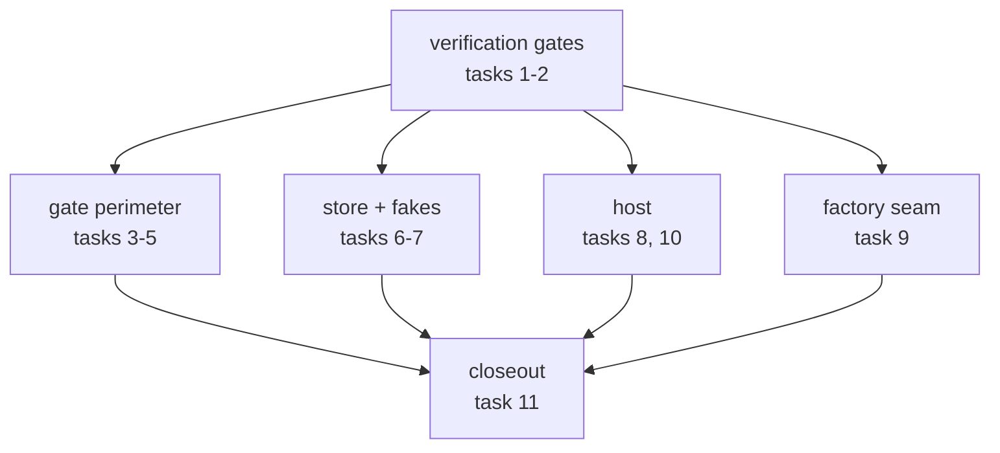
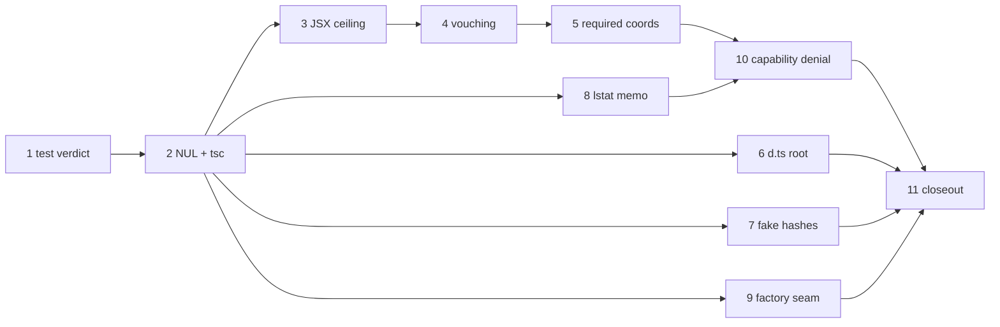

# Design tree — phase 1 closeout — Implementation Plan

> **For agentic workers:** REQUIRED SUB-SKILL: Use superpowers:subagent-driven-development
> (recommended) or superpowers:executing-plans to implement this plan task-by-task. Steps use
> checkbox (`- [ ]`) syntax for tracking. Load `/reatom` and `/errore` before any code-related
> action (CLAUDE.md mandate). Every task ends green and is one commit.

**Goal:** Discharge the tail plan 1 left behind — the three security-perimeter items that
`red-debt.md` marks `NEEDS AN OWNER`, the optional-shaped Gate inputs whose fallbacks are now
dead in production, and the hygiene that makes every future review and audit of this branch
trustworthy — without touching plan 1b's migration, plan 2's cache re-keying, or plan 3's host.

**Scope:** This is the **closeout of plan 1**, not a fifth plan against the design spec. Its
inputs are `docs/superpowers/plans/2026-07-28-design-tree-canonical-source.md`'s "What this plan
deliberately leaves undone" table, `.superpowers/sdd/2026-07-28-design-tree-canonical-source/red-debt.md`'s
unowned rows, and `task-14-report.md` §9's open concerns. Every item below was re-verified
against the working tree on 2026-08-02 — none of them is a journal entry that the code has
since closed.

**Architecture:** No new module and no new ring edge. Four of the eleven tasks tighten a
signature or a predicate that is already in the right place; three are hygiene that make the
verification gates honest; one moves an existing seam out of an oversized file; one is a new
capability-denial step inside the `_host --stdio` child, which already exists as a dedicated
process whose only job is mounting and rendering pages.



**Tech Stack:** TypeScript 7.0.2 on Bun ≥1.3.14, `@opentui/core`+`@opentui/react` 0.4.5,
`@reatom/core` ^1001.1.0, `errore` ^0.14.1, `zod` ^4.4.3, `oxlint` 1.74.0, `oxfmt` 0.59.0.
No new dependencies.

## Global Constraints

Inherited from `CLAUDE.md` and carried verbatim from plan 1. Every task implicitly includes
this section.

- **Test runner is `bun test`.** Tests live beside the file under test (`foo.ts` →
  `foo.test.ts`). Typecheck with `bun x tsc --noEmit`. Lint/format: `bun run lint` /
  `bun run fmt:check`. Task 1 adds a `test` script; from Task 2 on, the whole-suite gate is
  `bun run test`, never a bare `bun test` whose crash reads as a pass.
- **errore is mandatory**: namespace import (`import * as errore from "errore"`), errors as
  values (`Error | T` unions), `createTaggedError` for domain errors, `.catch()`/`errore.try`
  only at uncontrolled boundaries, flat control flow, `if (x instanceof Error) return x` on
  one line with no block, `| null` for optional values, never swallow an error without
  logging it.
- **Reatom v1001**: named atoms/computeds/actions; `wrap(...)` at every async boundary that
  touches an atom afterwards; never an async IIFE wrapping an `await` — keep the call flat.
- **Module DAG** (`docs/architecture/code-structure.md`): `core` imports only `entities/` and
  its own `ports/`; `gate`, `store`, `host` may import `entities/`; `host` may **not** import
  `gate`; `entities/` submodules import nothing but each other and `infrastructure/`.
- **Module folder shape** (`CLAUDE.md`): `ui/`, `model/`, `types.ts`, `index.ts`; code always
  inside subfolders, never loose at a module root; atomic single-purpose functions.
- **Imports**: cross-module imports use the `tsconfig.json` path aliases, never a relative
  path climbing out of the module. Never alias under `@termcraft/*`.
- **Factories are named `create*`, never `make*`.** Task 9 makes this true of the production
  tree; do not add a new `make*` anywhere.
- **Design is a source of truth**: colours, layout, glyphs and copy come from
  `design/termcraft-engine.js` and `design/*.dc.html`. Where the runtime cannot reproduce a
  design value, implement the closest faithful mapping and document the divergence in a code
  comment — never substitute an invented value.
- **Honest values only**: a value with no source is an explicit documented placeholder or an
  honest empty, never a fabrication. A refusal that names its missing input beats a fallback
  that invents one — that principle is what half this plan is enforcing.
- **Language**: all code, comments, plans and commit messages in English.
- **Commits**: one per task, `feat:`/`fix:`/`docs:`/`test:`/`refactor:`/`chore:` prefix, each
  ending with the `Co-Authored-By: Claude Opus 5 (1M context) <noreply@anthropic.com>` trailer.
- **Run `/reatom-audit` before reporting the work done** (Task 11).

### Vocabulary, unchanged from plan 1

| term | meaning |
| --- | --- |
| **tree-relative path** | a forward-slash path relative to `design/`, e.g. `pages/dashboard.tsx`. Never carries the `design/` prefix. |
| **entry** | the tree-relative path `pages.json` binds to a slug. |
| **closure** | the transitive set of tree-relative paths one entry reaches, including the entry itself, sorted. |
| **treeRevision** | Merkle hash over the entire `design/` inventory, `pages.json` included. |
| **scanned** | a file whose source this Gate pass actually tokenized without failing. Task 4 is about the difference between this and "a file whose text we happen to hold". |

---

## Task order and dependencies

Tasks 1–2 come first because every later task's green gate depends on them: today a crashed
`bun test` prints no `(fail)` lines and reads as clean, and a `grep` sweep over `src/`
silently skips two files. Tasks 3–5 are the Gate perimeter and must land in that order —
Task 4's test needs Task 3's deterministic unscannable file. Tasks 6–9 are independent of each
other. Task 10 is the riskiest and is deliberately last before closeout.



---

### Task 1: A crashed test run must never read as a pass

`progress.md`'s TOOLING NOTE 2 and the standing memory both record it: `bun test` over the
whole suite intermittently dies with `panic(main thread): Segmentation fault` (exit 3) instead
of a summary line. A crashed run prints **no `(fail)` lines at all**, so scanning its output for
failures finds none and the run reads as clean. Every task below ends with "run the suite", so
this is the first thing to fix, not the last.

This task does **not** try to stop the panic — it lives inside `Bun.Transpiler` and is reached
by `gate/model/lexer.oracle.test.ts`'s fuzz corpus. It makes the panic impossible to mistake
for success.

**Files:**
- Create: `scripts/run-tests.ts`
- Create: `scripts/run-tests.test.ts`
- Modify: `package.json` — `scripts.test`

**Interfaces:**
- Consumes: nothing.
- Produces:
  - `type BunTestVerdictV1 = "pass" | "fail" | "crashed"`
  - `function classifyBunTestRun(input: { exitCode: number; output: string }): BunTestVerdictV1`
  - the `bun run test` npm script, which forwards its arguments to `bun test`.

- [ ] **Step 1: Write the failing test**

Create `scripts/run-tests.test.ts`:

```ts
import { describe, expect, test } from "bun:test";

import { classifyBunTestRun } from "./run-tests";

const CLEAN = ` 4335 pass\n 0 fail\nRan 4335 tests across 312 files. [41.20s]\n`;
const FAILED = ` 4300 pass\n 35 fail\nRan 4335 tests across 312 files. [40.11s]\n`;
const PANIC =
  ` 1204 pass\n` +
  `panic(main thread): Segmentation fault at address 0x0\n` +
  `oh no: Bun has crashed. This indicates a bug in Bun, not your code.\n`;

describe("classifyBunTestRun", () => {
  test("a clean run with a summary and exit 0 is a pass", () => {
    expect(classifyBunTestRun({ exitCode: 0, output: CLEAN })).toBe("pass");
  });

  test("a run reporting failures is a fail", () => {
    expect(classifyBunTestRun({ exitCode: 1, output: FAILED })).toBe("fail");
  });

  test("a panic is CRASHED even though it printed no fail lines", () => {
    // The whole point: `PANIC` contains zero `(fail)` markers and a non-zero pass count, so
    // every "did anything fail?" reading of it says no.
    expect(PANIC).not.toContain("(fail)");
    expect(classifyBunTestRun({ exitCode: 3, output: PANIC })).toBe("crashed");
  });

  test("a segfault reported only by the shell exit code is CRASHED", () => {
    expect(classifyBunTestRun({ exitCode: 139, output: " 1204 pass\n" })).toBe("crashed");
  });

  test("exit 0 with no summary line at all is CRASHED, never a pass", () => {
    expect(classifyBunTestRun({ exitCode: 0, output: "" })).toBe("crashed");
  });

  test("a `0 fail` summary with a non-zero exit code is a fail, not a pass", () => {
    // Bun exits non-zero for a suite-level problem (an unhandled error between tests) that the
    // per-test counters do not show. Trusting the summary alone would launder it.
    expect(classifyBunTestRun({ exitCode: 1, output: CLEAN })).toBe("fail");
  });
});
```

- [ ] **Step 2: Run the test to verify it fails**

Run: `bun test scripts/run-tests.test.ts`
Expected: FAIL — `Cannot find module './run-tests'`.

- [ ] **Step 3: Write `scripts/run-tests.ts`**

```ts
/**
 * The whole-suite gate. `bun test` alone is NOT one: it dies intermittently with
 * `panic(main thread): Segmentation fault` inside `Bun.Transpiler` (reached by
 * `gate/model/lexer.oracle.test.ts`'s fuzz corpus), and a crashed run prints no `(fail)` lines
 * at all — so every "did anything fail?" reading of its output says no. This wrapper makes a
 * crash a first-class, loud outcome distinct from both pass and fail.
 *
 * It does not retry: a re-run is a human decision, because "it passed the second time" is
 * evidence about the panic, not about the change under test.
 */

/** What one `bun test` invocation actually did. `"crashed"` is never a pass. */
export type BunTestVerdictV1 = "pass" | "fail" | "crashed";

/** Bun's own end-of-run summary. Its ABSENCE is the signal — a run that produced no summary
 * did not finish, whatever its exit code says. */
const SUMMARY_LINE = /^\s*\d+\s+pass\s*$/m;

/** Bun's panic banner, and the shell's own report of a signal death (128 + SIGSEGV/SIGABRT). */
const PANIC_MARKER = /panic\(|Bun has crashed|Segmentation fault/;
const SIGNAL_EXIT_CODES: ReadonlySet<number> = new Set([134, 139]);

/**
 * Classify one finished run. Pure, so it is testable without provoking a real segfault —
 * which is not reproducible on demand, being roughly a 1-in-4000 property of the fuzz shapes.
 */
export function classifyBunTestRun(input: {
  readonly exitCode: number;
  readonly output: string;
}): BunTestVerdictV1 {
  if (PANIC_MARKER.test(input.output)) return "crashed";
  if (SIGNAL_EXIT_CODES.has(input.exitCode)) return "crashed";
  if (!SUMMARY_LINE.test(input.output)) return "crashed";
  return input.exitCode === 0 ? "pass" : "fail";
}

const CRASH_ADVICE =
  "the test run CRASHED and is NOT a pass — it printed no failures because it never finished.\n" +
  "This is the known `Bun.Transpiler` panic reached by gate/model/lexer.oracle.test.ts.\n" +
  "Re-run to get a verdict; never read a crashed run as green.";

if (import.meta.main) {
  const args = Bun.argv.slice(2);
  const child = Bun.spawnSync(["bun", "test", ...args], {
    stdout: "pipe",
    stderr: "pipe",
  });
  const output = `${child.stdout.toString()}${child.stderr.toString()}`;
  process.stdout.write(output);

  const verdict = classifyBunTestRun({ exitCode: child.exitCode, output });
  if (verdict === "crashed") {
    process.stderr.write(`\nrun-tests: ${CRASH_ADVICE}\n`);
    process.exit(2);
  }
  process.exit(verdict === "pass" ? 0 : 1);
}
```

- [ ] **Step 4: Add the script**

In `package.json`, add to `scripts`, keeping the existing entries and their order:

```json
    "test": "bun run scripts/run-tests.ts",
```

- [ ] **Step 5: Run the tests**

Run: `bun test scripts/run-tests.test.ts && bun x tsc --noEmit`
Expected: the new file PASSES; `tsc` still reports exactly the one pre-existing
`src/ui/workspace/ui/Workspace.test.tsx` error, which Task 2 removes.

Then prove the wrapper end-to-end: `bun run test scripts/run-tests.test.ts`
Expected: the same output plus exit 0.

- [ ] **Step 6: Commit**

```bash
rtk git add scripts package.json && rtk git commit -m "test: make a crashed suite run a loud verdict instead of a silent pass

Co-Authored-By: Claude Opus 5 (1M context) <noreply@anthropic.com>"
```

---

### Task 2: A greppable, typecheck-clean tree

Two independent hygiene defects, together because they are the same class — a signal that lies
about the repository's state — and because both must be gone before any later task's review.

**Raw NUL bytes.** `grep` and ripgrep classify a file containing a raw NUL as BINARY and print
`Binary file … matches` instead of the matching lines. Any review, audit or codemod sweep that
greps `src/` therefore silently skips these files' contents. `red-debt.md` registered them with
no owner; re-verified present on 2026-08-02:

- `src/core/ports/fakes/session-checkpoint.ts` — 1 NUL
- `src/host/supervisor/model/restart-policy.test.ts` — 2 NULs

**The one `tsc` error.** `src/ui/workspace/ui/Workspace.test.tsx:1094` — `Object is possibly
'undefined'`, pre-existing on clean phase-8. It is the reason `bun x tsc --noEmit` cannot be
used as a plain pass/fail gate, which every task's verification step then has to hedge around.

**Files:**
- Modify: `src/core/ports/fakes/session-checkpoint.ts`
- Modify: `src/host/supervisor/model/restart-policy.test.ts`
- Modify: `src/ui/workspace/ui/Workspace.test.tsx:1094`
- Create: `scripts/repo-hygiene.test.ts`

**Interfaces:**
- Consumes: nothing.
- Produces: nothing importable. The new test is a repository invariant, not an API.

- [ ] **Step 1: Write the failing test**

Create `scripts/repo-hygiene.test.ts`:

```ts
import { describe, expect, test } from "bun:test";

/**
 * A raw NUL in a tracked source makes `grep`/ripgrep classify the file as BINARY: they print
 * "Binary file … matches" instead of the matching lines. Every review, audit and codemod sweep
 * in this repository is grep-driven, so such a file is silently invisible to all of them —
 * which is how two of them survived a seventeen-task plan. Pinned as a test rather than a
 * lint rule because oxlint has no such rule and because the failure mode is about tooling
 * that reads the repository, not about the code's own semantics.
 *
 * `grep -qP '\x00'` does NOT detect this reliably (measured: it reported zero files while two
 * demonstrably had them). Counting the bytes is what works.
 */
describe("repository hygiene", () => {
  test("no tracked TypeScript source contains a raw NUL byte", async () => {
    const listed = Bun.spawnSync(["git", "ls-files", "*.ts", "*.tsx"], { stdout: "pipe" });
    expect(listed.exitCode).toBe(0);

    const paths = listed.stdout
      .toString()
      .split("\n")
      .filter((line) => line.length > 0);
    expect(paths.length).toBeGreaterThan(100);

    const offenders: string[] = [];
    for (const path of paths) {
      const bytes = await Bun.file(path).bytes();
      if (bytes.includes(0)) offenders.push(path);
    }
    expect(offenders).toEqual([]);
  });
});
```

- [ ] **Step 2: Run it to verify it fails**

Run: `bun test scripts/repo-hygiene.test.ts`
Expected: FAIL, listing exactly `src/core/ports/fakes/session-checkpoint.ts` and
`src/host/supervisor/model/restart-policy.test.ts`.

- [ ] **Step 3: Remove the NULs without changing behaviour**

Locate each byte and replace the raw NUL with an escape that means the same thing to the
program and nothing to grep:

```bash
for f in src/core/ports/fakes/session-checkpoint.ts src/host/supervisor/model/restart-policy.test.ts; do
  echo "== $f"; tr -dc '\000' < "$f" | wc -c; grep -n $'\x00' "$f" | cat -v | head
done
```

In each hit, a raw NUL inside a string or template literal becomes the two-character escape
`\0` (inside a normal or template string) or `String.fromCharCode(0)` (where the value is
built, not written). The character the program sees is identical; only the file's bytes change.
Do **not** delete the NUL: in both files it is deliberate test/fixture data, and dropping it
would change what the test proves.

- [ ] **Step 4: Fix the `tsc` error**

`src/ui/workspace/ui/Workspace.test.tsx:1094` indexes `lines` with a computed row number under
`noUncheckedIndexedAccess`. Replace the three assertions with a checked local so the narrowing
is real rather than asserted:

```tsx
    const bottomBorderRow = 18;
    const bottomBorder = lines[bottomBorderRow];
    expect(bottomBorder).toBeDefined();
    expect(bottomBorder?.length).toBe(100);
    expect(bottomBorder).toContain("╯");
    expect(bottomBorder).not.toContain("#");
```

- [ ] **Step 5: Verify**

```bash
bun test scripts/repo-hygiene.test.ts src/host/supervisor/model/restart-policy.test.ts src/ui/workspace/ui/Workspace.test.tsx
bun x tsc --noEmit
```

Expected: tests PASS, and `tsc --noEmit` now prints **nothing**. From here on, any `tsc` output
at all is a regression this plan introduced.

- [ ] **Step 6: Full suite and commit**

```bash
bun run test && bun run lint && bun run fmt:check
rtk git add -A && rtk git commit -m "fix: strip two raw NULs that hid their files from every grep sweep, and clear the last tsc error

Co-Authored-By: Claude Opus 5 (1M context) <noreply@anthropic.com>"
```

---

### Task 3: A fail-closed JSX nesting ceiling

`task-14-report.md` §9 item 1, escalated for the final whole-branch review and still open:
`gate/model/jsx.ts`'s recursive-descent reader costs seconds of **synchronous** event-loop time
on deeply nested JSX, and `gate/model/gate.ts`'s `runTreeImports` — its caller — is synchronous
and runs once per turn with no timeout and no cancellation. Measured through the real
`scanTreeImports` on `"<a>{".repeat(k)`, a shape an agent produces by running away mid-page:

| input | cost |
| --- | --- |
| 4 000 chars | 196 ms |
| 16 000 chars | 1 541 ms |
| 24 000 chars | 3 774 ms |
| ~28 800 chars | up to ~9 s, and whether the stack exhausts at all is stochastic |

512 files × ~9 s ≈ **77 minutes of synchronous block**, from ~14.8 MB — comfortably inside the
store's own 512-file / 64 MiB budget. The report's own conclusion names the only bound that
tracks cost: a fail-closed nesting-depth ceiling inside the reader.

**The ceiling must be fail-closed, and this is the whole difficulty.** `readElement`'s doc
argues at length against a cap — "a depth/iteration cap would silently return a PARTIAL scan on
legitimate input — the one failure mode this module must not have". That objection is correct
about a cap that *returns*. It does not apply to one that *aborts the whole read*, which is
exactly what the existing stack exhaustion already does: `tree-scan.ts` converts the throw into
a fail-closed `UNSCANNABLE_SOURCE` for that file. This task replaces a stochastic, ~9-second
abort with a deterministic, sub-millisecond one at a depth no real page reaches.

**Files:**
- Modify: `src/gate/model/jsx.ts` — `Collector` (`:106-110`), `readElement` (`:419-441`)
- Test: `src/gate/model/jsx.test.ts`
- Test: `src/gate/model/tree-scan.test.ts`

**Interfaces:**
- Consumes: nothing new.
- Produces:
  - `const MAX_JSX_NESTING_DEPTH: number` (exported from `gate/model/jsx.ts`)
  - `class JsxNestingTooDeepError` — thrown, not returned; see the doc block in Step 3 for why
    this one boundary throws in an errore codebase.

- [ ] **Step 1: Write the failing tests**

Append to `src/gate/model/jsx.test.ts`:

```ts
import { MAX_JSX_NESTING_DEPTH, JsxNestingTooDeepError, scanJsx } from "./jsx";

describe("nesting ceiling", () => {
  test("ordinary nesting well under the ceiling still scans", () => {
    const depth = 24;
    const source = `${"<box>".repeat(depth)}x${"</box>".repeat(depth)}`;
    expect(scanJsx(source).elements.length).toBeGreaterThan(0);
  });

  test("nesting past the ceiling THROWS rather than returning a partial scan", () => {
    const depth = MAX_JSX_NESTING_DEPTH + 1;
    const source = `${"<box>".repeat(depth)}x${"</box>".repeat(depth)}`;
    expect(() => scanJsx(source)).toThrow(JsxNestingTooDeepError);
  });

  test("the runaway shape that cost seconds now fails in milliseconds", () => {
    // `"<a>{".repeat(k)` is the measured worst case (task-12b: 24 000 chars -> 3 774 ms).
    const source = "<a>{".repeat(8000);
    const started = Bun.nanoseconds();
    expect(() => scanJsx(source)).toThrow(JsxNestingTooDeepError);
    const elapsedMs = (Bun.nanoseconds() - started) / 1_000_000;
    expect(elapsedMs).toBeLessThan(250);
  });

  test("the error names the limit, so an agent can act on the diagnostic", () => {
    const source = "<a>{".repeat(8000);
    const thrown = (() => {
      try {
        scanJsx(source);
        return null;
      } catch (error) {
        return error;
      }
    })();
    expect(thrown).toBeInstanceOf(JsxNestingTooDeepError);
    expect(String(thrown)).toContain(String(MAX_JSX_NESTING_DEPTH));
  });

  test("the ceiling sits ABOVE every real source in this repository", async () => {
    // The permanent form of "we measured it once". `src/ui/**/*.tsx` is the deepest real JSX
    // available here and is exactly the shape a design page has; if the ceiling ever drops
    // below real code, this fails instead of a page mysteriously refusing to scan.
    const listed = Bun.spawnSync(["git", "ls-files", "src/ui/*.tsx", "src/ui/**/*.tsx"], {
      stdout: "pipe",
    });
    const paths = listed.stdout
      .toString()
      .split("\n")
      .filter((line) => line.endsWith(".tsx"));
    expect(paths.length).toBeGreaterThan(10);
    for (const path of paths) {
      const source = await Bun.file(path).text();
      expect([path, (() => { scanJsx(source); return "scanned"; })()]).toEqual([path, "scanned"]);
    }
  });
});
```

Append to `src/gate/model/tree-scan.test.ts`:

```ts
test("a file past the nesting ceiling is UNSCANNABLE_SOURCE, fail-closed, not a silent pass", () => {
  const files = new Map([["pages/runaway.tsx", "<a>{".repeat(8000)]]);
  const errors = scanTreeImports({ files, has: (p) => files.has(p) });
  expect(errors.map((error) => error.code)).toEqual(["UNSCANNABLE_SOURCE"]);
  expect(errors[0]?.file).toBe("pages/runaway.tsx");
});
```

- [ ] **Step 2: Run the tests to verify they fail**

Run: `bun test src/gate/model/jsx.test.ts src/gate/model/tree-scan.test.ts`
Expected: FAIL — `MAX_JSX_NESTING_DEPTH` and `JsxNestingTooDeepError` are not exported, and the
runaway case currently takes seconds rather than throwing.

- [ ] **Step 3: Add the ceiling to `src/gate/model/jsx.ts`**

Add the import and the two new exports near the top of the module, after the existing imports:

```ts
import * as errore from "errore";
```

```ts
/**
 * The deepest JSX element nesting this reader will descend into before refusing the whole
 * source. Chosen an order of magnitude above real code and PINNED THERE BY A TEST that scans
 * every `src/ui/**\/*.tsx` in this repository — the deepest genuine JSX available, and the same
 * shape a design page has. Raising it is a cost decision; lowering it below the measurement is
 * a correctness one, and the test is what says which you are doing.
 *
 * WHY IT EXISTS. The reader is recursive descent with retries; the element memo bounds how
 * often one element is DERIVED, not the recursion. Measured through `scanTreeImports` on
 * `"<a>{".repeat(k)`: 16 000 chars 1 541 ms, 24 000 chars 3 774 ms, ~28 800 chars up to ~9 s
 * before the JS stack exhausts — and WHETHER it exhausts is stochastic, so the overflow is not
 * a bound anyone can rely on. `gate/model/gate.ts`'s `runTreeImports` is synchronous and runs
 * once per turn; 512 files at that cost is ~77 minutes of blocked event loop from ~14.8 MB,
 * comfortably inside the store's own 512-file / 64 MiB budget (task-14 report §9 item 1).
 */
export const MAX_JSX_NESTING_DEPTH = 64;

/**
 * The source nests JSX deeper than {@link MAX_JSX_NESTING_DEPTH}. THROWN, not returned, and
 * that is deliberate in a codebase whose rule is errors-as-values.
 *
 * The reader's every function returns `boolean` — "this was an element" / "it was not" — and a
 * `false` return means "no JSX here", which for a source that really does contain JSX is a
 * PARTIAL SCAN: the exact failure mode {@link readElement}'s own doc says this module must
 * never have, because a partial scan silently drops import diagnostics. Threading an error
 * value out through every recursive return would work, but the abort channel it would build is
 * the one this module ALREADY has: the stack exhaustion that `tree-scan.ts`'s `errore.try`
 * converts into a fail-closed `UNSCANNABLE_SOURCE`. This throw takes that same path,
 * deterministically and ~4 orders of magnitude sooner.
 *
 * Every production entry into this reader is inside that guard — `scanTreeImports`
 * (`gate/model/tree-scan.ts`) for `scanImportAllowlist`, and `gate/adapters/gate-runner.ts`'s
 * own `errore.try` for `scanModuleEdges`. Both were checked when this landed; a new caller
 * that is not guarded is a fail-open and must be given one.
 */
export class JsxNestingTooDeepError extends errore.createTaggedError({
  name: "JsxNestingTooDeepError",
  message: "JSX nesting exceeds the $limit-level ceiling at source offset $pos",
}) {}
```

- [ ] **Step 4: Count the depth in `Collector` and enforce it in `readElement`**

Add the counter to `Collector` (`:106-110`), keeping the existing doc block and appending to it:

```ts
interface Collector {
  readonly elements: JsxElement[];
  readonly textRanges: JsxTextRange[];
  readonly reads: Map<number, ElementRead>;
  /** Current recursion depth, incremented around each {@link readElementUncached} and checked
   * against {@link MAX_JSX_NESTING_DEPTH}. A MEMO HIT DOES NOT COUNT: replaying a recorded read
   * consumes no stack, so charging it depth would refuse a source the reader can handle. */
  depth: number;
}
```

Set it wherever the `Collector` is constructed inside `scanJsx` — add `depth: 0` to the object
literal, beside `reads: new Map()`.

Then in `readElement` (`:419-441`), wrap only the uncached branch:

```ts
function readElement(scanner: Scanner, collector: Collector): boolean {
  const start = scanner.getTokenStart();
  const cached = collector.reads.get(start);
  if (cached !== undefined) {
    for (const element of cached.elements) collector.elements.push(element);
    for (const range of cached.textRanges) collector.textRanges.push(range);
    scanner.resetTokenState(cached.end);
    return cached.ok;
  }
  collector.depth += 1;
  if (collector.depth > MAX_JSX_NESTING_DEPTH)
    throw new JsxNestingTooDeepError({ limit: MAX_JSX_NESTING_DEPTH, pos: start });
  const elemStart = collector.elements.length;
  const textStart = collector.textRanges.length;
  const ok = readElementUncached(scanner, collector);
  // No `finally`: `readElementUncached` returns a boolean on every path it controls, and the
  // one path it does not — this ceiling throwing from a deeper frame — abandons the whole scan,
  // so there is no read left to keep the counter honest for.
  collector.depth -= 1;
  collector.reads.set(start, {
    ok,
    end: scanner.getTokenEnd(),
    elements: collector.elements.slice(elemStart),
    textRanges: collector.textRanges.slice(textStart),
  });
  return ok;
}
```

- [ ] **Step 5: Run the tests**

Run: `bun test src/gate/model/jsx.test.ts src/gate/model/tree-scan.test.ts src/gate/model/import-scan.test.ts src/gate/model/lexer.oracle.test.ts`
Expected: PASS, including the 888-source and seeded-fuzz oracle corpora — the ceiling must
change no verdict on any of them. If the oracle reports a divergence, the ceiling is below real
input and the measurement in Step 3's doc block is wrong; raise it and say so there, do not
weaken the oracle.

- [ ] **Step 6: Full suite and commit**

```bash
bun run test && bun x tsc --noEmit && bun run lint && bun run fmt:check
rtk git add src/gate && rtk git commit -m "fix(gate): bound the JSX reader's recursion fail-closed instead of blocking the event loop for seconds

Co-Authored-By: Claude Opus 5 (1M context) <noreply@anthropic.com>"
```

---

### Task 4: A file that failed to scan stops vouching for its importers

`red-debt.md`'s "task-12b round-1 re-review, Minor M4", accepted by Task 14 as
*keep the verdict whole-tree* and left in the code with the dependency written on the port.
`task-14-report.md` §9 item 2 restates it: "the day anyone attributes rejections per page —
which `GateError.file` invites and design §8's per-entry reporting implies — it becomes a
fail-open. Not fixable from `core`."

The mechanism, in `src/gate/model/tree-scan.ts:131-136`:

```ts
function isTrustedTarget(input, relPath) {
  return !isCodeFile(relPath) || input.files.has(relPath);
}
```

"The path is a key in `files`" is read as "this pass actually read that file's source". That is
false when the file's own scan failed: `TreeFileUnscannableError` attributes an
`UNSCANNABLE_SOURCE` to *that* file and the file stays in `files`, so an importer of it is
vouched for by a file nothing read. Measured by the reviewer: `pages/home.tsx` importing
`../lib/deep.tsx`, with `lib/deep.tsx` unscannable, produces `lib/deep.tsx:UNSCANNABLE_SOURCE`
only — `pages/home.tsx` gets **zero** errors of its own.

Task 3 is a prerequisite: before it, making a file deterministically unscannable in a test
required a stochastic stack overflow.

**Files:**
- Modify: `src/gate/model/tree-scan.ts` — `isTrustedTarget` (`:131-136`), `scanTreeImports` (`:188-234`)
- Test: `src/gate/model/tree-scan.test.ts`

**Interfaces:**
- Consumes: `MAX_JSX_NESTING_DEPTH` (Task 3), only in the test.
- Produces: no signature change. `scanTreeImports` keeps
  `(input: { files: ReadonlyMap<string, string>; has: (relPath: string) => boolean }) => readonly (ImportScanError & { file: string })[]`.

- [ ] **Step 1: Write the failing test**

Append to `src/gate/model/tree-scan.test.ts`:

```ts
describe("a file whose own scan failed does not vouch for its importers (task-12b M4)", () => {
  const RUNAWAY = "<a>{".repeat(8000);

  test("the importer gets its OWN diagnostic, not just the unscannable file's", () => {
    const files = new Map([
      ["pages/home.tsx", `import { Deep } from "../lib/deep";\nexport default Deep;\n`],
      ["lib/deep.tsx", RUNAWAY],
    ]);
    const errors = scanTreeImports({ files, has: (p) => files.has(p) });

    const byFile = new Map(errors.map((error) => [error.file, error.code]));
    expect(byFile.get("lib/deep.tsx")).toBe("UNSCANNABLE_SOURCE");
    // THE POINT: before this fix `pages/home.tsx` had no entry here at all.
    expect(byFile.get("pages/home.tsx")).toBe("UNSCANNED_IMPORT");
  });

  test("an importer of a file that scanned CLEANLY is still vouched for", () => {
    const files = new Map([
      ["pages/home.tsx", `import { theme } from "../lib/theme";\nexport default theme;\n`],
      ["lib/theme.ts", `export const theme = 1;\n`],
    ]);
    expect(scanTreeImports({ files, has: (p) => files.has(p) })).toEqual([]);
  });

  test("a tree with nothing unscannable pays no second pass", () => {
    // Pinned by observation rather than by timing: the clean tree above already proves the
    // result, and this proves the mechanism does not fire — a file whose scan succeeded and
    // whose targets are all scannable must never be re-scanned. Asserted through the public
    // result being identical whether or not an unrelated unscannable file is present.
    const clean = new Map([
      ["pages/a.tsx", `import { x } from "../lib/x";\nexport default x;\n`],
      ["lib/x.ts", `export const x = 1;\n`],
    ]);
    const withUnrelated = new Map([...clean, ["pages/runaway.tsx", RUNAWAY]]);
    const cleanErrors = scanTreeImports({ files: clean, has: (p) => clean.has(p) });
    const mixed = scanTreeImports({ files: withUnrelated, has: (p) => withUnrelated.has(p) });
    expect(cleanErrors).toEqual([]);
    expect(mixed.map((error) => error.file)).toEqual(["pages/runaway.tsx"]);
  });
});
```

- [ ] **Step 2: Run the test to verify it fails**

Run: `bun test src/gate/model/tree-scan.test.ts`
Expected: FAIL on the first case — `byFile.get("pages/home.tsx")` is `undefined`.

- [ ] **Step 3: Rewrite `scanTreeImports` as scan-then-judge**

Replace the body of `scanTreeImports` (`:188-234`) with the two-phase form. The first phase is
the same single scan per file it does today; the second re-scans only the files that actually
imported something unscannable, which is empty in every non-adversarial tree:

```ts
/** One file's phase-1 outcome, kept so phase 2 can re-judge only what needs re-judging. */
interface FileScanV1 {
  /** The scan's own findings, or the failure that stopped it. Both error arms fold to the same
   * `UNSCANNABLE_SOURCE` diagnostic, exactly as the old single-pass body folded them. */
  readonly outcome:
    | TreeFileUnscannableError
    | SourceStreamTruncatedError
    | readonly ImportScanError[];
  /** Every tree path this file's scan asked `isScanned` about — i.e. every RESOLVED target it
   * has. Captured during the scan itself, so it costs nothing and cannot disagree with what
   * the scan actually resolved. */
  readonly targets: ReadonlySet<string>;
}

export function scanTreeImports(input: {
  readonly files: ReadonlyMap<string, string>;
  readonly has: (relPath: string) => boolean;
}): readonly (ImportScanError & { readonly file: string })[] {
  // PHASE 1 — scan every code file once, with today's trust rule, recording which targets each
  // file's scan resolved to.
  const scans = new Map<string, FileScanV1>();
  for (const [from, source] of input.files) {
    if (!isCodeFile(from)) continue;
    scans.set(from, scanOne(input, from, source, () => false));
  }

  // PHASE 2 — a file whose OWN scan failed read nothing, so it can vouch for nothing. Any file
  // that resolved an import INTO one is re-judged with that knowledge; nothing else is touched.
  //
  // WHY NOT JUST MASK THE TRUST PREDICATE IN ONE PASS: the set of unscannable files is not
  // known until the pass is over, and a file may be scanned before the file it imports. A
  // single pass would therefore trust whatever it happened to reach first — order-dependent
  // security, which is worse than the gap it replaces.
  const unscannable = new Set(
    [...scans].filter(([, scan]) => scan.outcome instanceof Error).map(([from]) => from),
  );
  const errors: (ImportScanError & { readonly file: string })[] = [];
  for (const [from, scan] of scans) {
    const tainted =
      !(scan.outcome instanceof Error) &&
      [...scan.targets].some((target) => unscannable.has(target));
    const final = tainted
      ? scanOne(input, from, input.files.get(from) ?? "", (target) => unscannable.has(target))
      : scan;
    if (final.outcome instanceof Error) {
      errors.push(unscannableError(from, final.outcome));
      continue;
    }
    for (const error of final.outcome) errors.push({ ...error, file: from });
  }
  return errors;
}
```

- [ ] **Step 4: Extract the two helpers the rewrite calls**

Add both above `scanTreeImports`, moving the existing `errore.try` and the existing error-shaping
block into them verbatim rather than re-deriving either:

```ts
/**
 * Scan ONE file, capturing every target its trust question was asked about.
 *
 * `isUnscannable` lets phase 2 subtract files that turned out unreadable WITHOUT changing what
 * `isTrustedTarget` means — the two questions stay separate, which is the same separation
 * task 11 made between `has` and `isScanned`.
 */
function scanOne(
  input: { readonly files: ReadonlyMap<string, string>; readonly has: (relPath: string) => boolean },
  from: string,
  source: string,
  isUnscannable: (relPath: string) => boolean,
): FileScanV1 {
  const targets = new Set<string>();
  // TWO WAYS THIS FILE CAN FAIL TO BE SCANNED, both fail-closed to the same code:
  //   - `scanImportAllowlist` RETURNS a `SourceStreamTruncatedError` when the token stream does
  //     not cover the source (`lexer.ts`'s completeness invariant). Controlled code, reported
  //     as a value — no `try` involved (task-14 review round 2, M6).
  //   - the ENGINE throws: `./jsx`'s reader is recursive descent, and past
  //     `MAX_JSX_NESTING_DEPTH` it raises `JsxNestingTooDeepError` (task 3) — or, for a shape
  //     that reaches the JS stack limit first, a `RangeError`. That is the one UNCONTROLLED
  //     boundary in this module, and the only thing `errore.try` is here for.
  const scanned = errore.try({
    try: () =>
      scanImportAllowlist(source, {
        from,
        has: input.has,
        isScanned: (relPath) => {
          targets.add(relPath);
          return isTrustedTarget(input, relPath) && !isUnscannable(relPath);
        },
        syntax: parsesJsx(from),
      }),
    catch: (cause) => new TreeFileUnscannableError({ file: from, cause }),
  });
  return { outcome: scanned, targets };
}

/** Shape one unscannable file's fail-closed diagnostic. Unchanged in substance — lifted out of
 * `scanTreeImports`'s old body so both call sites in the rewrite share one wording. */
function unscannableError(
  from: string,
  failure: TreeFileUnscannableError | SourceStreamTruncatedError,
): ImportScanError & { readonly file: string } {
  // A wrapped engine throw carries `cause`; a returned truncation is already the reason.
  const cause = failure.cause;
  const reason =
    cause === undefined
      ? failure.message
      : cause instanceof Error
        ? `${cause.name}: ${cause.message}`
        : String(cause);
  return {
    code: "UNSCANNABLE_SOURCE",
    specifier: "",
    message: cause === undefined ? `"${from}": ${reason}` : `${failure.message} — ${reason}`,
    line: 1,
    column: 1,
    file: from,
  };
}
```

`SourceStreamTruncatedError` has no `cause`, so `unscannableError`'s existing `cause === undefined`
arm is exactly the branch that already handled it in the old body — that is why the union costs
no extra branch. Import the type into `tree-scan.ts` if it is not already there.

- [ ] **Step 5: Correct `isTrustedTarget`'s own doc**

Its comment (`:49-55` and `:131-136`) currently states the vouching gap as a known hazard. It is
no longer one. Replace the hazard paragraph with what is now true — the predicate still answers
"is this target's source held", and *unscannability* is subtracted by `scanTreeImports`'s second
phase, named there — and delete the sentence in the module doc claiming "no amount of latching
on the `has` side closes it": the fix was on neither side, it was in the pass structure.

- [ ] **Step 6: Run the tests**

Run: `bun test src/gate/ && bun x tsc --noEmit`
Expected: PASS, `tsc` silent.

- [ ] **Step 7: Full suite and commit**

```bash
bun run test && bun run lint && bun run fmt:check
rtk git add src/gate && rtk git commit -m "fix(gate): stop a file that failed to scan from vouching for the files that import it

Co-Authored-By: Claude Opus 5 (1M context) <noreply@anthropic.com>"
```

---

### Task 5: The Gate's tree coordinates become required, and the slug-derived guesses die

Three separate places still carry an optional shape whose fallback fabricates a path from a
slug — the exact anti-pattern the whole design tree exists to remove. All three were left
deliberately, each with a written instruction naming the task that should close it, and that
task is this one. Every production caller now supplies the real value; re-verified 2026-08-02.

1. `gate/adapters/gate-runner.ts:561-579` — `runPage`'s `treeRoot`/`expectedFiles`/`entryRelPath`
   are optional and fall back to `treeRoot: ""` with an empty inventory, which makes `loadPage`
   refuse on its first check. Honest, but reachable only by a caller that does not exist:
   `core/kernel/model/handlers/page-descriptors.ts:109` and `core/turns/model/validation.ts:285`
   both pass all three. Flagged for closure by Task 15 **and** Task 16 of plan 1.
2. `gate/model/gate.ts:159` — `const fileName = input.entryRelPath ?? input.fileName ?? \`${input.slug}.tsx\``.
   `GateInput.entryRelPath`'s own doc: "FLAGGED FOR WHICHEVER TASK WIRES A REAL DESIGN-TREE
   CLOSURE … make this field required, delete `fileName`'s slug-derived fallback below".
   `validation.ts:292` is the only production passer of `fileName`, and it passes
   `entry.entry` — byte-identical to the `entryRelPath` it passes on the next line.
3. `gate/adapters/gate-runner.ts:628` — `extractPageMeta` takes only a slug and builds
   `${slug}.tsx`, then assumes JSX. Its own doc names the residual: "this port takes only a
   SLUG, so it cannot see the manifest's entry … the fix is to widen `PageMetaExtraction` to
   carry the entry path. That belongs with the port." A `pages/a.ts` entry is legal under
   `entryPathSchema` and is read here as JSX.

`GateInput.closure` stays **optional** and that is not an oversight: `page-descriptors.ts` has
no closure to give, and deriving one per descriptor publish means running the synchronous
whole-tree scan whose cost Task 3 exists to bound — controller ruling #15's trade, unchanged.
Record that in the field's doc so the next reader does not re-open it.

**Files:**
- Modify: `src/core/ports/gate-runner.ts` — `runPage` and `extractPageMeta` input shapes
- Modify: `src/gate/adapters/gate-runner.ts:557-600` (`runPage`), `:624-650` (`extractPageMeta`)
- Modify: `src/gate/model/gate.ts:113-129` (`GateInput`), `:159` (the fallback chain)
- Modify: `src/core/turns/model/validation.ts:285-295`
- Modify: `src/core/kernel/model/handlers/preview-export.ts:204-215`
- Modify: `src/core/ports/fakes/gate-runner.ts`
- Test: `src/gate/adapters/gate-runner.test.ts`, `src/gate/model/gate.test.ts`,
  `src/core/ports/fakes/gate-runner.test.ts`

**Interfaces:**
- Consumes: `DesignFileEntryV1` from `entities/design-tree` (already imported at both sites).
- Produces:
  - `GateRunner.runPage(input: { source; slug; treeRoot: string; expectedFiles: readonly DesignFileEntryV1[]; entryRelPath: string; closure?: ClosureV1; referencedIds?; listedSlugs? })`
    — the three coordinates required, `fileName` gone.
  - `GateRunner.extractPageMeta(input: { source: string; slug: PageSlug; entryRelPath: string })`.
  - `GateInput.entryRelPath: string` (required); `GateInput.fileName` deleted.

- [ ] **Step 1: Write the failing tests**

In `src/gate/model/gate.test.ts`, add:

```ts
test("the display name is the manifest entry, with no slug-derived fallback left", async () => {
  const result = await runGate({
    source: `export const meta = definePage({ title: "t" })\nexport default () => null\n`,
    slug: "home" as PageSlug,
    entryRelPath: "screens/home/index.tsx",
  });
  for (const error of [...result.errors, ...result.warnings])
    expect(error.file).not.toContain("home.tsx");
});
```

In `src/gate/adapters/gate-runner.test.ts`, add:

```ts
test("extractPageMeta reads a .ts entry as TypeScript, not as assumed JSX", async () => {
  const adapter = createGateRunnerAdapter({ smokeRenderer: fakeSmokeRenderer({ ok: true }) });
  const extraction = await adapter.extractPageMeta({
    source: `export const meta = definePage({ title: "plain" })\nexport default () => null\n`,
    slug: "plain" as PageSlug,
    entryRelPath: "lib/plain.ts",
  });
  expect(extraction.meta?.title).toBe("plain");
});
```

- [ ] **Step 2: Run them to verify they fail**

Run: `bun test src/gate/model/gate.test.ts src/gate/adapters/gate-runner.test.ts`
Expected: FAIL to compile — `entryRelPath` is not a known property of `extractPageMeta`'s input.

- [ ] **Step 3: Make the fields required and delete the fallbacks**

In `src/core/ports/gate-runner.ts`, drop the `?` from `treeRoot`, `expectedFiles` and
`entryRelPath` on `runPage`, and add `readonly entryRelPath: string` to `extractPageMeta`'s
input. Replace each field's "OPTIONAL, not required as the port sketch shows it" paragraph with
one sentence saying every production caller supplies it and a refusal on a missing one is now
impossible to construct.

In `src/gate/adapters/gate-runner.ts`:

```ts
    const fileName = input.entryRelPath;
    // …
      treeRoot: input.treeRoot,
      expectedFiles: input.expectedFiles,
```

and in `extractPageMeta`:

```ts
    // The entry's own extension decides the reading. It used to be assumed JSX off a
    // slug-built `${slug}.tsx`, which is wrong for the legal `pages/a.ts` entry shape
    // `entryPathSchema` permits — the residual this method's own doc registered.
    const contract = checkPageContract(input.source, parsesJsx(input.entryRelPath));
```

In `src/gate/model/gate.ts`, make `GateInput.entryRelPath` required, delete `GateInput.fileName`
entirely, and replace `:159` with `const fileName = input.entryRelPath;`. Delete the two
paragraphs of `runGate`'s comment that explain the precedence between `entryRelPath` and
`fileName` — with one field left there is no precedence — and keep the sentence explaining that
the display name is `pages.json`'s own `entry` value.

- [ ] **Step 4: Update the callers `tsc` names**

Run `bun x tsc --noEmit` and fix every site it reports. The expected production set is exactly:

- `src/core/turns/model/validation.ts:292` — delete the `fileName: entry.entry,` line; the
  `entryRelPath: entry.entry` line two below it already carries the same value.
- `src/core/kernel/model/handlers/preview-export.ts` — `extractAndCachePageMeta` gains an
  `entryRelPath: string` parameter and forwards it; its caller already holds the entry, since
  it read the source through it.
- `src/core/ports/fakes/gate-runner.ts` — mirror both required fields, and record the calls so
  a test can assert on them.

Everything else `tsc` names is a test fixture: give each one the real entry it should have had.
Where a fixture's page is `pages/<slug>.tsx`, write that literally — do not reintroduce a
computed `${slug}.tsx`, which is the shape being deleted.

- [ ] **Step 5: Run the tests**

Run: `bun test src/gate/ src/core/ && bun x tsc --noEmit`
Expected: PASS, `tsc` silent.

- [ ] **Step 6: Full suite and commit**

```bash
bun run test && bun run lint && bun run fmt:check
rtk git add -A && rtk git commit -m "refactor(gate): require the tree coordinates and delete the last slug-derived path guesses

Co-Authored-By: Claude Opus 5 (1M context) <noreply@anthropic.com>"
```

---

### Task 6: `.d.ts` is a workspace-root input only

Plan 1's Task 4 dropped a "SPEC GAP" annotation about where runtime `.d.ts` files live, and the
code still contradicts its own doc. `src/store/safe-fs/model/limits.ts:113-115` says the runtime
declarations "remain read-only inputs staged BESIDE the tree at the workspace root, never inside
it (design §10)", and then `:127-129` classifies **any** `*.d.ts` at **any** depth as
`agent-runtime-doc`.

What is actually staged is one file at the root: `src/agent/prompt/model/runtime-docs.ts:59-61`
stages exactly `runtime.d.ts`, `RUNTIME.md`, `REATOM.md`, all with a single-component `relPath`.
So the nested branch admits paths nothing produces, in the namespace that is *read-only input*
— the widest of the two possible mistakes.

**Files:**
- Modify: `src/store/safe-fs/model/limits.ts:117-131` (`classifyWorkspace`)
- Test: `src/store/safe-fs/model/limits.test.ts`

**Interfaces:**
- Consumes: nothing new.
- Produces: no signature change. `classifyWorkspace` keeps
  `(components: readonly string[]) => ManagedNamespace | null`.

- [ ] **Step 1: Write the failing test**

Append to `src/store/safe-fs/model/limits.test.ts`, beside the existing workspace cases:

```ts
test("a runtime declaration is a workspace-ROOT input, never a nested one", () => {
  expectNamespace("workspace", "runtime.d.ts", "agent-runtime-doc");
  expectNamespace("workspace", "RUNTIME.md", "agent-runtime-doc");
  expectNamespace("workspace", "REATOM.md", "agent-runtime-doc");
  // The gap: nothing stages these, and admitting them widened a READ-ONLY namespace.
  expectUnknown("workspace", "lib/runtime.d.ts");
  expectUnknown("workspace", "a/b/c/anything.d.ts");
});

test("a .d.ts INSIDE the tree is authored source, not a runtime doc", () => {
  expectNamespace("workspace", "design/lib/kit.d.ts", "design-source");
});
```

- [ ] **Step 2: Run it to verify it fails**

Run: `bun test src/store/safe-fs/model/limits.test.ts`
Expected: FAIL — `lib/runtime.d.ts` classifies as `agent-runtime-doc`.

- [ ] **Step 3: Delete the nested branch**

In `classifyWorkspace`, remove the last two lines before the final `return null`:

```ts
  const last = components[components.length - 1];
  if (last !== undefined && last.endsWith(".d.ts")) return "agent-runtime-doc";
```

and extend the function's doc block with the measurement that justifies it:

```ts
 * A `.d.ts` is admitted at the ROOT ONLY. `agent/prompt/model/runtime-docs.ts` stages exactly
 * three single-component paths — `runtime.d.ts`, `RUNTIME.md`, `REATOM.md` — so a nested
 * `*.d.ts` is a path nothing produces, and admitting it widened a READ-ONLY namespace for no
 * caller. A declaration the agent authors lives inside `design/` and is `design-source`, which
 * the branch above already answers first.
```

- [ ] **Step 4: Run the tests**

Run: `bun test src/store/ && bun x tsc --noEmit`
Expected: PASS, `tsc` silent. If a staging test fails, a real caller does stage a nested
`.d.ts` — in that case do **not** restore the wildcard: name the exact path in the same way
`AGENT_DOC_FILES` names its two, and say where it is staged from.

- [ ] **Step 5: Full suite and commit**

```bash
bun run test && bun run lint && bun run fmt:check
rtk git add src/store && rtk git commit -m "fix(store): admit a runtime declaration at the workspace root only, as the doc already said

Co-Authored-By: Claude Opus 5 (1M context) <noreply@anthropic.com>"
```

---

### Task 7: The design-store fake carries real hashes

`red-debt.md`'s fake-fidelity row, opened by Task 7's review and only half closed by Task 9: the
fake-vs-real contract test exists (`src/store/adapters/design-store.test.ts:308-375`) but
"compares only relPath lists and identically-seeded bytes, so it cannot catch a hash/size
divergence (the fake seeds `"0".repeat(64)`)".

That matters beyond the test. `DesignFileEntryV1.sha256` is what `closureHash` and
`treeRevision` fold, and what the host verifies every closure member against at mount. Every
`core` test that runs on the fake sees hashes that correspond to no bytes at all, so a defect
that mixes up a path and its content is invisible to all of them.

**Files:**
- Modify: `src/core/ports/fakes/design-store.ts`
- Modify: `src/store/adapters/design-store.test.ts:308-375`
- Test: `src/core/ports/fakes/design-store.test.ts` (create if the file does not exist)

**Interfaces:**
- Consumes: the same hashing the real adapter uses. Import it rather than re-deriving —
  `core/ports` may not import `store`, so if the helper lives there, move it to
  `entities/design-tree` and re-export from both. Check first: if `computeSourceHash` already
  sits in `entities/` or `infrastructure/`, just use it.
- Produces: `createFakeDesignStore` no longer requires a `sha256` in its `files` seed; when one
  is absent it computes the real hash of the seeded bytes.

- [ ] **Step 1: Write the failing test**

Append to `src/store/adapters/design-store.test.ts`'s `createFakeDesignStore — fake-vs-real
contract` block:

```ts
  test("listTree() agrees on sha256 and size, not only on relPath", async () => {
    const fake = createFakeDesignStore({
      manifest: {
        schemaVersion: 1,
        pages: [{ slug: HOME_SLUG, entry: HOME_ENTRY }],
        requestedActivePage: null,
      },
      // NO sha256 seeded: the fake must derive it from the bytes, the way the real adapter does.
      files: new Map([[HOME_ENTRY, { bytes: new TextEncoder().encode(HOME_SOURCE) }]]),
    });

    const { open, deps } = await createRealProjectFixture();
    try {
      await seedHomeAndAboutPages(open);
      const real = createDesignStoreAdapter(deps);

      const fakeTree = await fake.listTree();
      const realTree = await real.listTree();
      if ("code" in fakeTree || "code" in realTree) throw new Error("fixture bug: listTree failed");

      const realHome = realTree.find((entry) => entry.relPath === HOME_ENTRY);
      const fakeHome = fakeTree.find((entry) => entry.relPath === HOME_ENTRY);
      expect(fakeHome?.sha256).toBe(realHome?.sha256);
    } finally {
      await open.close();
    }
  });
```

- [ ] **Step 2: Run it to verify it fails**

Run: `bun test src/store/adapters/design-store.test.ts`
Expected: FAIL — the fake reports `"0".repeat(64)` (or refuses the seed for lacking `sha256`).

- [ ] **Step 3: Compute the hash in the fake**

In `src/core/ports/fakes/design-store.ts`, make the seed's `sha256` optional and derive it:

```ts
/**
 * The seeded bytes' REAL SHA-256, computed the same way the real adapter computes it, unless
 * the seed pins one explicitly (which a test doing drift/mismatch scenarios needs).
 *
 * A fabricated constant here is not a harmless shortcut: `sha256` is what `closureHash` and
 * `treeRevision` fold and what the host verifies every closure member against at mount, so a
 * fake that reports a hash corresponding to no bytes makes every `core` test blind to a defect
 * that swaps a path for its content.
 */
function seededSha256(file: { readonly bytes: Uint8Array; readonly sha256?: string }): string {
  return file.sha256 ?? computeSourceHash(file.bytes);
}
```

Use it wherever `listTree()` and `readTreeFile()` currently read the seeded `sha256`.

- [ ] **Step 4: Keep the deliberate divergence documented**

The existing test records one known divergence — the real adapter's tree walk includes
`design/pages.json`, the fake's `files` seed never models the manifest as a walkable entry.
That stays; do not "fix" it by injecting a synthetic manifest entry into the fake, which would
give it a hash over bytes it never encoded. Leave the comment in place and reference it from
the new test.

- [ ] **Step 5: Run the tests**

Run: `bun test src/store/adapters/design-store.test.ts src/core/ports/ && bun x tsc --noEmit`
Expected: PASS, `tsc` silent. Any `core` test that now fails was resting on the fabricated hash
— fix the test's expectation, never the fake.

- [ ] **Step 6: Full suite and commit**

```bash
bun run test && bun run lint && bun run fmt:check
rtk git add -A && rtk git commit -m "test(ports): give the design-store fake real hashes so a hash divergence is catchable

Co-Authored-By: Claude Opus 5 (1M context) <noreply@anthropic.com>"
```

---

### Task 8: The pre-mount symlink walk stops re-stat-ing the same directories

Plan 1's Task 15 minor, deferred with its cost named: `assertNoSymlinkedComponent`
(`src/host/session/model/source-mount.ts:190-209`) `lstat`s every path component of every
closure member, so a shared module reached from a deep entry re-stats the same directories once
per member. "Correct, bounded by the tree's own depth, unmemoized."

This is on the preview mount path — the one the user waits for on every page switch — and the
fix is a per-`loadPage` set with no behavioural change at all: a directory verified once inside
one mount cannot become a symlink inside the same mount without the mount already being wrong
about everything else it read.

**Files:**
- Modify: `src/host/session/model/source-mount.ts:190-250`
- Test: `src/host/session/model/source-mount.test.ts`

**Interfaces:**
- Consumes: nothing new. `loadPage(args: LoadPageArgs)` keeps its exact signature —
  `LoadPageArgs` is a protocol type and must not grow a test seam.
- Produces, exported from `src/host/session/model/source-mount.ts` for its own test:
  - `function createTreePathVerifier(deps: { lstat: (path: string) => Promise<Stats> }): (treeRoot: string, relPath: string) => Promise<ProtocolError | void>`
    — one verifier per `loadPage` call, carrying that call's `verified` set.

- [ ] **Step 1: Write the failing test**

Append to `src/host/session/model/source-mount.test.ts`:

```ts
import { createTreePathVerifier } from "./source-mount";

test("a directory prefix shared by several closure members is lstat-ed once per mount", async () => {
  const seen: string[] = [];
  const verify = createTreePathVerifier({
    lstat: async (path: string) => {
      seen.push(path);
      return { isSymbolicLink: () => false } as never;
    },
  });

  // Three members under one deep directory — the shape a page plus two shared modules has.
  expect(await verify("/t", "lib/deep/a.ts")).toBeUndefined();
  expect(await verify("/t", "lib/deep/b.ts")).toBeUndefined();
  expect(await verify("/t", "lib/deep/c.ts")).toBeUndefined();

  // Before the memo: 9 stats. After: 5 — `lib`, `lib/deep`, and one per distinct file.
  expect(new Set(seen).size).toBe(seen.length);
  expect(seen).toEqual([
    "/t/lib",
    "/t/lib/deep",
    "/t/lib/deep/a.ts",
    "/t/lib/deep/b.ts",
    "/t/lib/deep/c.ts",
  ]);
});

test("a symlinked FILE is still caught after its directory was verified for a sibling", async () => {
  // The memo must never vouch for the final component. Without this, memoizing the walk would
  // turn a shared directory into a blanket pass for everything under it.
  const verify = createTreePathVerifier({
    lstat: async (path: string) =>
      ({ isSymbolicLink: () => path.endsWith("evil.ts") }) as never,
  });
  expect(await verify("/t", "lib/deep/a.ts")).toBeUndefined();
  const refused = await verify("/t", "lib/deep/evil.ts");
  expect(refused).toBeInstanceOf(ProtocolError);
});

test("each mount gets its own verifier, so nothing is vouched for across mounts", () => {
  const first = createTreePathVerifier({ lstat: async () => ({ isSymbolicLink: () => false }) as never });
  const second = createTreePathVerifier({ lstat: async () => ({ isSymbolicLink: () => false }) as never });
  expect(first).not.toBe(second);
});
```

- [ ] **Step 2: Run it to verify it fails**

Run: `bun test src/host/session/model/source-mount.test.ts`
Expected: FAIL — `createTreePathVerifier` is not exported.

- [ ] **Step 3: Turn the walk into a per-mount verifier**

Replace `assertNoSymlinkedComponent` (`:190-209`) with a factory that owns one call's memo. The
loop body is unchanged apart from the two memo lines:

```ts
/**
 * Build ONE MOUNT's symlink verifier. The returned function refuses any tree-relative path
 * whose resolution passes through a symlink, junction or reparse point (design §6), and
 * remembers the absolute prefixes it has already proved — so a shared module reached from a
 * deep entry no longer re-stats `lib/` and `lib/deep/` once per closure member.
 *
 * PER CALL, NEVER MODULE-LEVEL: a memo that outlived a mount would answer for a tree that has
 * since been replaced, which is the staleness class this whole file exists to refuse. Sound
 * WITHIN one mount for the same reason the hash verification is — if a directory turned into a
 * link between two members of one closure, every byte this mount already read is suspect, and
 * the hash check is what catches that.
 *
 * The FINAL component is memoized only after its own check passes, exactly like every prefix,
 * so a file that is itself a symlink is still refused even when its directory was verified for
 * a sibling. That is not an implementation detail — it is what keeps the memo from becoming a
 * blanket pass, and it has its own test.
 *
 * `treeRoot` itself is NOT walked: it is the mount root the supervisor names, and everything
 * above it is the staging path's business. The same deliberate duplication of
 * `store/safe-fs/model/no-follow.ts`'s discipline as `checkTreeRelPath`, and for the same
 * reason — `host` may not import `store`.
 */
export function createTreePathVerifier(deps: {
  readonly lstat: (path: string) => Promise<Stats>;
}): (treeRoot: string, relPath: string) => Promise<ProtocolError | void> {
  const verified = new Set<string>();
  return async (treeRoot, relPath) => {
    const segments = relPath.split("/");
    let walked = treeRoot;
    for (const segment of segments) {
      walked = `${walked}/${segment}`;
      if (verified.has(walked)) continue;
      const stats = await deps.lstat(walked).catch(
        (cause) =>
          new ProtocolError({
            code: "SOURCE_HASH_MISMATCH",
            reason: `cannot stat ${relPath}`,
            cause,
          }),
      );
      if (stats instanceof ProtocolError) return stats;
      if (stats.isSymbolicLink())
        return malformed(`${relPath} resolves through a symlink or junction at ${segment}`);
      verified.add(walked);
    }
  };
}
```

Import `Stats` as a type from `node:fs`.

- [ ] **Step 4: Thread one verifier through the mount**

`loadPage` (`:358`) creates exactly one — `const verifyPath = createTreePathVerifier({ lstat })`
— and passes it into `readClosure`, which forwards it to each `readTreeFile`. `readTreeFile`
(`:232`) drops its own `treeRoot`-walking call and takes the verifier as a parameter instead.
`loadPage`'s own signature does not change.

- [ ] **Step 5: Run the tests**

Run: `bun test src/host/ && bun x tsc --noEmit`
Expected: PASS, including the existing symlink-refusal tests — a memo that broke one of those
would be exactly the regression this is not allowed to be.

- [ ] **Step 6: Full suite and commit**

```bash
bun run test && bun run lint && bun run fmt:check
rtk git add src/host && rtk git commit -m "perf(host): verify each directory prefix once per mount instead of once per closure member

Co-Authored-By: Claude Opus 5 (1M context) <noreply@anthropic.com>"
```

---

### Task 9: `design-tree-store.ts` leaves `factory.ts`, and `make*` becomes `create*`

Plan 1's Task 9 minor: "factory.ts grew 1407 -> 1714; `makeDesignTreeStore` + `readManifestFromDisk`
+ `buildPagesManifestOperation` are a future design-tree-store.ts seam". It is 1896 lines on
2026-08-02 and still growing. The three functions form one cohesive unit — everything that reads
or writes `design/pages.json` — and nothing else in the file calls them except the composition
at `:1589`.

The rename comes with it because the repository's rule is **factories are `create*`, never
`make*`**, and `makeDesignTreeStore` is the newest violation. `src/store/adapters/design-store.ts:15`
already carries a comment naming it, so leaving the name costs a second stale reference.

**Files:**
- Create: `src/store/model/design-tree-store.ts`
- Modify: `src/store/model/factory.ts` — remove `:456-527`, `:479`, `:892-1010` and their imports; `:1589` composes the new module
- Modify: `src/store/adapters/design-store.ts:15` — the comment's stale name
- Modify: `src/host/render/model/streams.ts:11` — `makeHeadlessStreams` → `createHeadlessStreams`, and its callers
- Test: `src/store/model/design-tree-store.test.ts` (moved cases), `src/store/model/transaction-engine-methods.test.ts`

**Interfaces:**
- Consumes: `SafeProjectFs`, and whatever `factory.ts` currently passes into the three functions.
- Produces, from `src/store/model/design-tree-store.ts`:
  - `function createDesignTreeStore(safeFs: SafeProjectFs): DesignTreeStore`
  - `function readManifestFromDisk(safeFs: SafeProjectFs): …` (unchanged signature)
  - `function buildPagesManifestOperation(deps, manifest): …` (unchanged signature)
- `src/host/render/model/streams.ts` exports `createHeadlessStreams` with the same signature.

- [ ] **Step 1: Prove the move is behaviour-free before making it**

This is a pure move plus a rename, so the test that matters is the one that already exists.
Record the baseline first:

```bash
bun test src/store/ src/host/ 2>&1 | tail -5 > /tmp/before.txt
cat /tmp/before.txt
```

Keep that count; Step 5 compares against it.

- [ ] **Step 2: Create the new module**

Create `src/store/model/design-tree-store.ts` with a header stating what it owns and why it is
its own file:

```ts
/**
 * Everything that reads or writes `design/pages.json` — the manifest read, the transaction
 * operation that rewrites it, and the `DesignTreeStore` those two compose into.
 *
 * Split out of `factory.ts` (design-tree phase-1 closeout, Task 9): that file had reached ~1900
 * lines and these three functions are called from nothing in it but the single composition
 * site. They are one unit — the manifest's whole on-disk lifecycle — and holding them together
 * is what keeps the CAS in `buildPagesManifestOperation` and the read in `readManifestFromDisk`
 * agreeing about what a manifest image is.
 */
```

Move `makeDesignTreeStore` (`factory.ts:892-1010`), `readManifestFromDisk` (`:479`) and
`buildPagesManifestOperation` (`:456`) verbatim, renaming only the first to
`createDesignTreeStore`. Do not edit a single line of their bodies in this step — a move and a
behaviour change in one commit cannot be reviewed.

- [ ] **Step 3: Rewire `factory.ts`**

Replace the three definitions with one import, and update `:1589`:

```ts
import { createDesignTreeStore } from "./design-tree-store";
```

```ts
    pages: createDesignTreeStore(safeFs),
```

`factory.ts:1803`'s comment mentions `readManifestFromDisk` by name — update it to say the
function now lives in `./design-tree-store`.

- [ ] **Step 4: Rename the last production `make*` factory**

`src/host/render/model/streams.ts:11` exports `makeHeadlessStreams`. Rename to
`createHeadlessStreams` and update every caller `tsc` reports. Test helpers named `make*`
(`makeClock`, `makeFrame`, …) are **out of scope**: they are fixtures, not factories, and
renaming twenty of them would bury this task's real change.

Correct the stale comment at `src/store/adapters/design-store.ts:15` in the same commit.

- [ ] **Step 5: Verify the move changed nothing**

```bash
bun test src/store/ src/host/ 2>&1 | tail -5
bun x tsc --noEmit
```

Expected: the same pass count as Step 1's baseline, and `tsc` silent. A changed count means the
move was not a move.

- [ ] **Step 6: Full suite and commit**

```bash
bun run test && bun run lint && bun run fmt:check
rtk git add -A && rtk git commit -m "refactor(store): move the pages.json lifecycle out of factory.ts and rename the last make* factory

Co-Authored-By: Claude Opus 5 (1M context) <noreply@anthropic.com>"
```

---

### Task 10: Deny dynamic-code capability where a page actually executes

`red-debt.md`'s longest entry, marked **NEEDS AN OWNER**, and the only remaining item that is a
live security hole rather than a latent one. The §5.8 ban on `eval`/`Function`/`require` is
enforced by a token scan, and five spellings are measured **LIVE** — Bun accepts them, Bun
executes them, and the perimeter reports nothing:

```
1  const F = Function; new F("<payload>")()           bun=OK exec=YES gate=[]
2  const k = "eval"; globalThis[k]("<payload>")       bun=OK exec=YES gate=[]
3  globalThis["ev" + "al"]("<payload>")               bun=OK exec=YES gate=[]
4  [].constructor.constructor("<payload>")()          bun=OK exec=YES gate=[]
5  ((Function))("<payload>")()                        bun=OK exec=YES gate=[]
```

Row 4 is the proof rather than the hardest case: it writes neither `eval` nor `Function`
anywhere in the source, so **no token-level rule has anything to key on**. Fifteen further
spellings were closed at the token layer across three fix rounds; the boundary as measured is
that a spelling writing `eval`/`Function` as source text is catchable there and is caught, and
one reaching the capability through an alias, a computed key, a parenthesis nest or a
`constructor.constructor` chain is not, because that is not a lexical question.

Both reports name the same fix and neither could take it: **capability denial at the runtime,
not detection at the gate.** The `_host --stdio` child (`src/host/session/model/entry.ts:19-26`,
spawned by `src/host/supervisor/model/spawn-command.ts`) is a dedicated process whose only job
is mounting and rendering pages — which is what makes denial there possible at all.

**This task carries real risk and it is stated up front:** if the render path itself needs
`Function` after boot, denial breaks rendering, and the deliverable becomes the measured finding
plus the narrowest denial that survives. Step 1 settles that before a line of the fix is
written. Do not skip it, and do not soften Step 5 if it fails.

**Files:**
- Create: `src/host/session/model/capability-denial.ts`
- Create: `src/host/session/model/capability-denial.test.ts`
- Modify: `src/host/session/model/entry.ts` — the `_host` child's boot, before the first mount
- Test: `src/host/session/model/source-mount.test.ts`

**Interfaces:**
- Consumes: nothing from `gate` — `host` may not import it.
- Produces:
  - `function denyDynamicCodeCapability(): void` — idempotent; installs throwing replacements
    for the realm's dynamic-code entry points.
  - `class DynamicCodeDeniedError` (tagged) — what the replacements throw, so a page that
    reaches one produces a named render error rather than an opaque `TypeError`.

- [ ] **Step 1: Measure whether the render path needs the capability at all**

Before changing anything, instrument and run. Write a scratch script that installs *observing*
(not throwing) wrappers over `globalThis.eval` and `Function.prototype.constructor`, then mounts
both `examples/clock` pages through the real `loadPage`:

```bash
cat > "$SCRATCH/probe-capability.ts" <<'EOF'
const hits: string[] = [];
const realEval = globalThis.eval;
Object.defineProperty(globalThis, "eval", {
  configurable: true,
  value: (...args: unknown[]) => { hits.push(`eval ${new Error().stack}`); return (realEval as never as (...a: unknown[]) => unknown)(...args); },
});
const realFunction = Function.prototype.constructor;
Object.defineProperty(Function.prototype, "constructor", {
  configurable: true,
  value: function (...args: unknown[]) { hits.push(`Function ${new Error().stack}`); return (realFunction as never as (...a: unknown[]) => unknown).apply(this, args); },
});
// mount both example pages here through the real loadPage, exactly as
// `source-mount.test.ts`'s existing multi-file cases do
console.log(JSON.stringify({ hits: hits.length, sample: hits.slice(0, 3) }, null, 2));
EOF
bun run "$SCRATCH/probe-capability.ts"
```

Also run `bun test src/host/` with the same instrumentation loaded via a preload, and record the
count.

**The decision rule, and it is binding:**
- `hits === 0` → proceed with Step 3's full denial.
- `hits > 0` → record each stack in the task report, deny only the entry points that were not
  hit, and register the remainder in `red-debt.md` with the measured stack as evidence. A denial
  that breaks rendering is not shipped, and a claim that "the runtime needs it" is not made
  without the stack that shows it.

- [ ] **Step 2: Write the failing test**

Create `src/host/session/model/capability-denial.test.ts`:

```ts
import { describe, expect, test } from "bun:test";

import { DynamicCodeDeniedError, denyDynamicCodeCapability } from "./capability-denial";

describe("denyDynamicCodeCapability", () => {
  test("closes every spelling the token scan measured LIVE", () => {
    denyDynamicCodeCapability();

    const spellings: readonly (() => unknown)[] = [
      () => {
        const F = Function;
        return new F("return 1")();
      },
      () => {
        const key = "eval";
        return (globalThis as never as Record<string, (s: string) => unknown>)[key]!("1");
      },
      () => (globalThis as never as Record<string, (s: string) => unknown>)["ev" + "al"]!("1"),
      () => ([] as never as { constructor: { constructor: (s: string) => () => unknown } }).constructor.constructor("return 1")(),
      () => ((Function) as never as (s: string) => () => unknown)("return 1")(),
    ];

    for (const [index, spelling] of spellings.entries()) {
      const thrown = (() => {
        try {
          spelling();
          return null;
        } catch (error) {
          return error;
        }
      })();
      expect([index, thrown instanceof DynamicCodeDeniedError]).toEqual([index, true]);
    }
  });

  test("is idempotent — a second call does not double-wrap or restore", () => {
    denyDynamicCodeCapability();
    denyDynamicCodeCapability();
    expect(() => new Function("return 1")).toThrow(DynamicCodeDeniedError);
  });

  test("ordinary function values still work", () => {
    denyDynamicCodeCapability();
    const double = (n: number) => n * 2;
    expect(double(2)).toBe(4);
    expect(typeof double.call).toBe("function");
    expect([1, 2].map(double)).toEqual([2, 4]);
    // `x.constructor` as a plain READ must keep working — only CALLING it is denied.
    expect(typeof ([] as unknown[]).constructor).toBe("function");
  });
});
```

This test must run in its own file: it mutates the realm, and Bun runs one file per process.

- [ ] **Step 3: Run it to verify it fails**

Run: `bun test src/host/session/model/capability-denial.test.ts`
Expected: FAIL — `Cannot find module './capability-denial'`.

- [ ] **Step 4: Write `src/host/session/model/capability-denial.ts`**

```ts
import * as errore from "errore";

/**
 * A page reached a dynamic-code capability the design's §5.8 forbids. Thrown from the denied
 * entry point itself, so the stack names the page's own frame and
 * `host/render/model/error-capture.ts` reports it as an ordinary render error rather than the
 * process dying.
 */
export class DynamicCodeDeniedError extends errore.createTaggedError({
  name: "DynamicCodeDeniedError",
  message: "dynamic code evaluation is denied in the design host ($entryPoint)",
}) {}

/**
 * Deny every dynamic-code entry point in THIS process.
 *
 * WHY HERE AND NOT AT THE GATE. `gate/model/import-scan.ts`'s token scan closes every spelling
 * that writes `eval` or `Function` as source text, and cannot close one that reaches the same
 * capability through an alias, a computed key, a parenthesis nest, or a
 * `[].constructor.constructor` chain — that is not a lexical question, and the last of those
 * writes neither identifier anywhere in the source. Five such spellings were measured accepted,
 * executed and silent (red-debt.md). Denial at the point of execution makes every spelling
 * inert, INCLUDING ones nobody has enumerated, which is the property detection can never have.
 *
 * WHY IT IS SAFE HERE. This runs only in the `_host --stdio` child, whose whole job is mounting
 * and rendering pages, and only AFTER boot — the module graph the host itself needs is already
 * linked. Whether the render path needs the capability after that point was measured, not
 * assumed; see the task report for the stacks.
 *
 * WHAT IT IS NOT. Not a sandbox. It removes the capability from this realm; a page can still
 * reach anything the realm's own modules expose. The perimeter's job is unchanged — this
 * closes the class of §5.8 violation the token scan provably cannot see.
 */
export function denyDynamicCodeCapability(): void {
  const deny = (entryPoint: string) =>
    function denied(): never {
      throw new DynamicCodeDeniedError({ entryPoint });
    };

  // `Function.prototype.constructor` IS the `Function` global, so replacing it closes the
  // global binding, `new F(...)` through any alias, and the `[].constructor.constructor` chain
  // at once — they are three names for one object. Kept CALLABLE-but-throwing rather than
  // deleted: `x.constructor` is read by ordinary code (including React's own internals) and
  // must stay a function value.
  const deniedFunction = deny("Function");
  Object.defineProperty(deniedFunction, "prototype", { value: Function.prototype });
  Object.defineProperty(Function.prototype, "constructor", {
    configurable: true,
    writable: true,
    value: deniedFunction,
  });
  Object.defineProperty(globalThis, "Function", {
    configurable: true,
    writable: true,
    value: deniedFunction,
  });

  // Indirect `eval` through ANY receiver spelling — `globalThis[k]`, `globalThis["ev"+"al"]`,
  // a destructured `{ eval: v }` — resolves through this one property.
  Object.defineProperty(globalThis, "eval", {
    configurable: true,
    writable: true,
    value: deny("eval"),
  });
}
```

If Step 1 measured hits on `Function`, keep the `eval` half and register the `Function` half in
`red-debt.md` with its stack — a partial denial that is honest about its boundary beats none.

- [ ] **Step 5: Wire it into the `_host` child's boot**

In `src/host/session/model/entry.ts`, call `denyDynamicCodeCapability()` after the child's own
handshake and module graph are ready and before the first `mount` is served. Put a comment at
the call site saying it must stay after boot and before the first mount, and why.

- [ ] **Step 6: Prove it end-to-end through a real mount**

Append to `src/host/session/model/source-mount.test.ts` a case that writes a tree whose page
runs row 4 in module scope, mounts it through the real `loadPage` in a child with the denial
installed, and asserts that the payload marker did **not** move and the failure names
`DynamicCodeDeniedError`. A test that only asserts the throw, without a marker proving the
payload never ran, is the weaker claim — write the marker.

- [ ] **Step 7: Run the tests**

```bash
bun run test && bun x tsc --noEmit && bun run lint && bun run fmt:check
```

Expected: PASS, `tsc` silent. Run `bun test src/host/` twice — a realm mutation that leaks
across files shows up as an unrelated failure on the second run.

- [ ] **Step 8: Commit**

```bash
rtk git add src/host && rtk git commit -m "fix(host): deny dynamic-code capability in the preview child, closing what the token scan cannot see

Co-Authored-By: Claude Opus 5 (1M context) <noreply@anthropic.com>"
```

---

### Task 11: Closeout

**Files:**
- Modify: `.superpowers/sdd/2026-07-28-design-tree-canonical-source/red-debt.md`
- Modify: `docs/superpowers/specs/2026-07-28-multi-file-design-tree-design.md` §14
- Modify: `docs/architecture/` — only what this plan's changes invalidate
- Modify: `docs/superpowers/plans/2026-07-28-design-tree-canonical-source.md` — the
  "What this plan deliberately leaves undone" table

- [ ] **Step 1: Close the ledger rows this plan discharged**

In `red-debt.md`, mark each row this plan closed with the task and commit that closed it, and
say what "closed" means for it — a fix, a measured narrowing, or a decision. The rows are:

| row | closed by |
| --- | --- |
| RAW NUL BYTES in two tracked sources | Task 2 |
| `isTrustedTarget` vouches for a file whose own scan threw (12b M4) | Task 4 |
| `runPage` takes the tree coordinates OPTIONALLY (tasks 15 and 16) | Task 5 |
| the fake-fidelity gap on hash/size divergence | Task 7 |
| the §5.8 dynamic-code ban's live rows | Task 10, in full or in the measured part — say which |
| the ~77-minute synchronous scan (task-14 report §9 item 1) | Task 3 |

Anything Step 1 of Task 10 measured as un-deniable stays in the ledger with its stack. Do not
delete a row you did not close.

- [ ] **Step 2: Update the spec's §14**

Plan 1's entry in `docs/superpowers/specs/2026-07-28-multi-file-design-tree-design.md` §14 says
`LANDED — c8c623c..9219b9e`. Append this plan's commit range as its closeout, and add one line
per decision this plan settled that the design left implicit:

1. the JSX reader has a fail-closed nesting ceiling; a source past it is `UNSCANNABLE_SOURCE`,
   never a partial scan (Task 3);
2. the whole-tree verdict is no longer the only thing neutralising `isTrustedTarget`, so §8's
   per-entry reporting is now safe to build in plan 2 (Task 4);
3. the §5.8 perimeter is detection at the Gate **plus** capability denial in the preview child,
   and the boundary between them is measured, not argued (Task 10).

- [ ] **Step 3: Correct plan 1's leftovers table**

In `docs/superpowers/plans/2026-07-28-design-tree-canonical-source.md`, add a line above the
"What this plan deliberately leaves undone" table pointing at this plan and noting which of its
own rows are now closed. Leave the plan-2 and plan-3 rows exactly as they are.

- [ ] **Step 4: Update the architecture docs**

Use the architecture-update skill. Only three of this plan's changes are architecturally
visible, and only those documents may move:

- `docs/architecture/` wherever the Gate's stages are described — the nesting ceiling is a new
  fail-closed refusal with its own diagnostic code path;
- wherever the preview mount is described — capability denial is a new step in the child's boot;
- `Source anchors` lists gain `src/host/session/model/capability-denial.ts` and
  `src/store/model/design-tree-store.ts`.

If a document does not describe any of the three, do not touch it.

- [ ] **Step 5: Full verification**

```bash
bun run test && bun x tsc --noEmit && bun run lint && bun run fmt:check
```

Every one must be clean. `bun x tsc --noEmit` must print **nothing** — since Task 2 there is no
pre-existing error to hedge around, so any output is this plan's regression.

Run `/reatom-audit` (CLAUDE.md mandate) and resolve everything it reports before committing.

Then re-run the whole suite once more: `bun run test`. If it reports `crashed`, that is Task 1
doing its job — re-run for a verdict, and never record a crashed run as green.

- [ ] **Step 6: Commit**

```bash
rtk git add -A && rtk git commit -m "docs: close the design-tree phase-1 ledger and record what the closeout decided

Co-Authored-By: Claude Opus 5 (1M context) <noreply@anthropic.com>"
```

---

## What this plan deliberately leaves undone

Named so the next plan inherits a list, not a surprise.

| left undone | why | picked up by |
| --- | --- | --- |
| the `migrate-80` dialog, `findSteps` wiring, the first `MIGRATION_CHAIN` entry, the seeded refactor turn | design §12, untouched by this plan | plan 1b |
| import-cycle and `dead-module` warnings; one whole-tree `tsc` program; closure-scoped smoke; re-keying `page-meta-cache`, `diagnostics-store`, `render-jobs`, the preview session memo | design §7–§8 | plan 2 |
| revision-keyed incarnations, repeated `mount`, warm spare, prefetch, hang watchdog; `design-prompt.md`'s shared-module section | design §9, §11 | plan 3 |
| the host's **double** `scanImports` per closure member | The duplication is a deliberate single-rule guarantee — `readTreeFile` scans to steer the walk, `scanClosureImports` scans to judge, and stating the rule once is what keeps the two from drifting. Collapsing it means changing which function owns the rule, and that is a security-perimeter change deserving its own review, not a perf commit. Task 8 takes only the `lstat` half, which has no such coupling. | needs its own task |
| `stageAllFiles` copies an over-budget tree in full before the freeze refuses it | Real, and newly more reachable now that arbitrarily deep directories are created. The refusal lives in `StagingService.snapshotToCandidate`, one ring above the copy, so moving it is a port change rather than a local fix. | needs its own task |
| export SUCCEEDS when a page's closure cannot be resolved, shipping no `closures/<slug>.json` and one prose line saying "closure: unavailable" | Honest and tested, but whether an incomplete package should instead REFUSE is a product call nobody has made, and inventing the UX would violate CLAUDE.md's design-is-source-of-truth rule. | needs a decision, then a task |
| `turn.completed`'s `changedPages[].sourceHash` means the ENTRY FILE's hash while "changed" is a CLOSURE fact | Documented on `terminalChangedPages`; renaming the wire field needs a `TurnTerminalPayloadV1` change. | plan 2, which re-keys these consumers anyway |

Two items above are questions rather than work, and both are for the operator: whether export
should refuse an incomplete closure listing, and whether the double-scan collapse is worth a
dedicated security review. Neither blocks any task in this plan.
