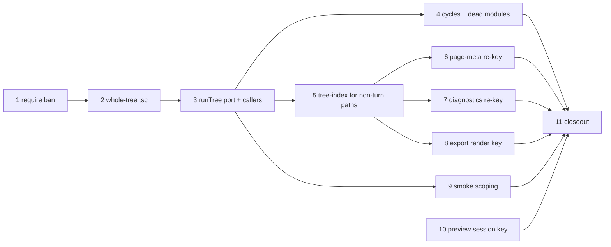

# Design tree — phase 2 — closure graph everywhere — Implementation Plan

> **For agentic workers:** REQUIRED SUB-SKILL: Use superpowers:subagent-driven-development
> (recommended) or superpowers:executing-plans to implement this plan task-by-task. Steps use
> checkbox (`- [ ]`) syntax for tracking. Load `/reatom` and `/errore` before any code-related
> action (CLAUDE.md mandate). Every task ends green and is one commit.

**Goal:** Implement design §7 and §8 — make the closure graph the thing every cache,
invalidation decision and change report is keyed off, replace the per-page `tsc` program with
**one whole-tree program**, and scope the smoke stage to the pages whose closure actually
changed.

**Scope:** plan 2 of the four the spec's §14 decomposes into
(`docs/superpowers/specs/2026-07-28-multi-file-design-tree-design.md`). Plan 1 and its closeout
are landed (`c8c623c..ea4197d`, `1cc6431..0360b94`). This plan touches neither plan 1b's
migration (§12) nor plan 3's host O2 (§9, §11) — with **one deliberate, argued exception**
named in Task 10, where §7's own preview-session row cannot be delivered without a
one-expression change to the supervisor's session key.

**This plan is not "purely internal", and §14's own sentence saying so is wrong.** §14 describes
plan 2 as having "no user-visible behavior changes except that turns get faster". Two
measurements taken while writing this plan falsify that:

1. **The Gate rejects every page that imports a shared module, today, on this branch.** The type
   check runs one hermetic `tsc` program per ENTRY FILE whose virtual FS serves only that one
   file (`src/gate/model/type-check.ts:196-214`), so a relative edge resolves to nothing.
   Measured through the real `createTypeChecker` with the real generated `RUNTIME_DTS`:

   ```
   pages/home.tsx importing "../lib/theme"  ->  TS2307 Cannot find module '../lib/theme'
                                                or its corresponding type declarations.
   ```

   That is a fatal `type`-kind `GateError`. It rejects the turn (four attempts, then
   `GATE_RETRY_EXHAUSTED`) **and** marks the page `status: "invalid"` on every descriptor
   publish, because `buildPageDescriptors`
   (`src/core/kernel/model/handlers/page-descriptors.ts:108-116`) runs the same full `runPage`
   pipeline on project open and after every commit. The headline capability plan 1 shipped —
   "the agent can write shared code" — does not survive contact with the Gate. §8 step 5 is
   therefore a **correctness fix**, not the cost optimization §8's own prose frames it as, and
   it is Task 2/3 of this plan rather than a late one.

2. **A shared-module edit leaves the live preview stale forever.** The UI asks for a preview
   session on `slug@sourceHash` (`src/ui/app/model/deps.ts:507-509`), where `sourceHash` is the
   ENTRY file's hash — an edit to `lib/theme.ts` moves no entry hash, so the memo returns early
   and nothing is re-asked. Even a re-ask would not help: the supervisor keys a live incarnation
   `` `${spec.pageSlug} ${spec.sourceHash}` `` (`src/host/supervisor/model/supervisor.ts:81`) and
   RETURNS THE EXISTING CHILD for a matching key (`:408-412`), whose module registry already
   holds the old `lib/theme.ts`. §7's `(treeRevision, pageSlug)` row is what fixes the first
   half; the second half is one expression, and Task 10 argues why it belongs here rather than
   in plan 3.

**Architecture:** no new top-level module and no new ring edge. The whole-tree pass that plan 1
built inside `gate/adapters/gate-runner.ts` (`resolveTreeClosures`) becomes the single place a
tree is judged: allowlist scan, closure resolution, **one type-check program**, cycle and
reachability analysis. `core` gains one small read-through module (`core/project/model/
tree-index.ts`) so the non-turn paths — descriptor publishing, preview settings, export capture —
obtain closures the same way the turn does, through the same port, instead of each inventing an
answer.

```mermaid
flowchart TD
  subgraph gate["gate (one whole-tree pass)"]
    scan["scanTreeImports<br/>allowlist + fixed-point taint"]
    walk["resolveTreeClosures<br/>closures + blockers"]
    tc["createTreeTypeChecker<br/>ONE tsc program"]
    graph["module graph<br/>cycles + reachability"]
    scan --> walk --> tc
    walk --> graph
  end
  subgraph core["core"]
    turn["turns/validation.ts<br/>per-turn"]
    index["project/tree-index.ts<br/>per-read (open, commit, preview, export)"]
  end
  turn -->|"GateRunner.runTree"| gate
  index -->|"GateRunner.runTree"| gate
  walk -->|closures| hash["entities/design-tree<br/>computeClosureHash / computeTreeRevision"]
  hash --> caches["page-meta cache · diagnostics store<br/>export render key · smoke selection"]
  hash --> ui["page.descriptorsChanged.treeRevision<br/>-> ui memo -> host session key"]
```

**Tech Stack:** TypeScript 7.0.2 on Bun ≥1.3.14, `@opentui/core`+`@opentui/react` 0.4.5,
`@reatom/core` ^1001.1.0, `errore` ^0.14.1, `zod` ^4.4.3, `oxlint` 1.74.0, `oxfmt` 0.59.0.
No new dependencies.

## Global Constraints

Inherited from `CLAUDE.md` and carried verbatim from plan 1 and the phase-1 closeout. Every task
implicitly includes this section.

- **Test runner is `bun run test`** (`scripts/run-tests.ts`), never a bare `bun test` whose crash
  reads as a pass. Tests live beside the file under test (`foo.ts` → `foo.test.ts`). Typecheck
  with `bun x tsc --noEmit`. Lint/format: `bun run lint` / `bun run fmt:check`.
- **Run the suite in the FOREGROUND with a plain redirect and a 600000 ms timeout**, then read
  the file: `rtk bun run test > "<scratchpad>/suite-taskN.txt" 2>&1`. A background run piped
  through `tail` produces an empty file until the stream ends and costs three turns.
- **errore is mandatory**: namespace import (`import * as errore from "errore"`), errors as
  values (`Error | T` unions), `createTaggedError` for domain errors, `.catch()`/`errore.try`
  only at uncontrolled boundaries, flat control flow, `if (x instanceof Error) return x` on one
  line with no block, `| null` for optional values, never swallow an error without logging it.
- **Reatom v1001**: named atoms/computeds/actions; `wrap(...)` at every async boundary that
  touches an atom afterwards; never an async IIFE wrapping an `await` — keep the call flat.
- **Module DAG** (`docs/architecture/code-structure.md`): `core` imports only `entities/` and its
  own `ports/`; `gate`, `store`, `host` may import `entities/`; `host` may **not** import `gate`;
  `entities/` submodules import nothing but each other and `infrastructure/`.
- **Module folder shape** (`CLAUDE.md`): `ui/`, `model/`, `types.ts`, `index.ts`; code always
  inside subfolders, never loose at a module root; atomic single-purpose functions.
- **Imports**: cross-module imports use the `tsconfig.json` path aliases, never a relative path
  climbing out of the module. Never alias under `@termcraft/*`.
- **Factories are named `create*`, never `make*`.**
- **Design is a source of truth**: colours, layout, glyphs and copy come from
  `design/termcraft-engine.js` and `design/*.dc.html`.
- **Honest values only**: a value with no source is an explicit documented placeholder or an
  honest empty, never a fabrication. A refusal that names its missing input beats a fallback that
  invents one. **This plan's sharpest instance:** a closure hash that cannot be computed is
  `null`, and `null` always means *changed / miss / re-run* — never *unchanged / hit / skip*.
- **No optional input with a production fallback.** The phase-1 closeout deleted the last of
  those (Task 5); do not add new ones. If a caller must decide something, the field is REQUIRED
  and the caller decides.
- **Language**: all code, comments, plans and commit messages in English.
- **Commits**: one per task, `feat:`/`fix:`/`docs:`/`test:`/`refactor:`/`chore:` prefix, each
  ending with the `Co-Authored-By: Claude Opus 5 (1M context) <noreply@anthropic.com>` trailer.
  `rtk git commit` swallows heredoc stdin — write the message to the scratchpad and pass
  `-F <path>`.
- **Never `git stash` inside a subagent.**
- **Run `/reatom-audit` before reporting the work done** (Task 11).

### Vocabulary

Carried from plan 1, plus the three terms this plan makes load-bearing.

| term | meaning |
| --- | --- |
| **tree-relative path** | a forward-slash path relative to `design/`, e.g. `pages/dashboard.tsx`. Never carries the `design/` prefix. |
| **entry** | the tree-relative path `pages.json` binds to a slug. |
| **closure** | the transitive set of tree-relative paths one entry reaches, including the entry itself, sorted. |
| **closureHash** | Merkle hash over one closure's `(relPath, sha256)` pairs — `entities/design-tree`'s `computeClosureHash`. `null` when any member is absent from the inventory. |
| **treeRevision** | Merkle hash over the ENTIRE `design/` inventory, `pages.json` and unreachable files included — `computeTreeRevision`. |
| **whole-tree pass** | the once-per-tree stage this plan consolidates: allowlist scan → closure resolution → one `tsc` program → graph warnings. Its port method is `GateRunner.runTree`. |
| **scanned** | a file whose source this pass actually tokenized without failing. |

**An inventory must be built through `createDesignTreeInventory`** (`entities/design-tree/model/
inventory.ts`), which sorts by `relPath` and refuses duplicates. `computeTreeRevision` folds
`inventory.files` **in array order without sorting** (`closure.ts:144-149`), unlike
`computeClosureHash` which sorts internally — so a revision computed over a raw `listTree()`
array is a filesystem-enumeration artifact, not an identity. `core/turns/model/candidate.ts`'s
`readSetTreeInventory`/`candidateTreeInventory` build `{ files }` directly and are safe only
because their consumers use `inventorySha256` lookups; **any new `computeTreeRevision` call site
in this plan must go through `createDesignTreeInventory` and handle its
`DuplicateInventoryPathError`.**

---

## What this plan measured before it was written

Every claim below was executed on this branch at `0360b94`, Bun 1.3.14, win32-x64, against the
real compiler in `node_modules/@typescript/typescript-win32-x64/lib/tsc.exe` and the real
generated `RUNTIME_DTS`. Probes were deleted afterwards; re-run them rather than trusting these
numbers if a task's decision turns on one.

1. **The per-file program cannot see a sibling module.** `createTypeChecker(...)("…import { TITLE
   } from \"../lib/theme\"…", "pages/home.tsx")` returns exactly one error: `TS2307 Cannot find
   module '../lib/theme' or its corresponding type declarations.` at line 2. This is the defect
   Task 2 exists to fix, and its Step 1 reproduces it as a failing test before anything changes.
2. **Serving the sibling's TEXT is not enough.** A single program over a three-file virtual tree
   whose `fs` implements only `readFile`/`fileExists`/`realpath` — the three hooks
   `type-check.ts` implements today — still reported `TS2307` for **both** pages. Module
   resolution short-circuits on the DIRECTORY before it probes any file.
3. **`directoryExists` + `getAccessibleEntries` are what make it resolve.** The same program with
   those two hooks added (both are members of the compiler API's own `FileSystem` interface,
   `node_modules/typescript/dist/api/fs.d.ts:5-21`) reported **zero** resolution errors and
   exactly the one deliberate error planted in a shared-module consumer:
   `TS2551 Property 'toFixed' does not exist on type '"Shared"'` at `pages/about.tsx`, while
   `pages/home.tsx` came back clean. Attribution by file works: the diagnostic named the file
   that contains the mistake, not the file that owns the type.
4. **One whole-tree program is not more expensive than the per-page programs it replaces.** Three
   files in one program: **289 ms**. Two pages through two `createTypeChecker` calls (each of
   which constructs its own `API`, i.e. its own compiler subprocess): **2216 ms**. A single
   `createTypeChecker` call measured 142 ms in isolation, so treat the ratio as
   "one program ≈ one of today's per-page programs" and let Task 2's Step 5 re-measure on the
   real fixture rather than quoting these two figures as a benchmark.
5. **`GateRunner.diagnosticsCache` has no production caller.** `grep -rn "diagnosticsCache\."
   src` returns nothing outside its own wiring (`entrypoint/model/create-shell.ts:189`,
   `store/model/factory.ts:1332-1346`). §7's diagnostics row is therefore a re-key of a store
   nothing reads — Task 7 does it anyway, for the reason stated there, and says so plainly
   instead of claiming an invalidation fix.
6. **`changedPages` is already closure-keyed** — plan 1 landed it (`core/turns/model/
   candidate.ts`'s `selectChangedPages`, wired at `core/kernel/model/handlers/turn.ts:1415`). §7's
   fourth row and the `turn-resolution.ts` row below it need no work in this plan; Task 9 reuses
   that exact function so smoke selection and the changed-page report can never disagree.

---

## The one precondition this plan carries in

The phase-1 closeout's final review made shipping conditional on one thing:

> THE CONDITION, not a caveat: the row needs an OWNER before plan 2 starts. "NEEDS AN OWNER" with
> no owner is how such rows rot, and this one reaches `node:child_process`.

The row is `docs/superpowers/red-debt.md:521` — an aliased `require` reaching arbitrary Node
built-ins, measured live, invisible to both scanners. **This plan owns it, as Task 1**, and takes
the ledger's own direction 1 (the scanner-level fix) because this plan is already inside
`import-scan.ts` for Task 4. Direction 2 (a real isolated context) stays unowned and is named as
such in the ledger; nothing in this plan builds a new security claim on top of the gap.

---

## Task order and dependencies

Task 1 first — it is the standing precondition, and it is independent of everything else. Tasks
2→3 are the correctness spine: the model primitive, then the port and both callers. Task 4 rides
the same pass. Task 5 is the enabler every re-keying task needs. Tasks 6–8 are independent of
each other. Task 9 needs Task 3's `runPage` shape. Task 10 is independent of 5–9. Task 11 closes.



**The acceptance bar is real green, from Task 1 onward.** There is no red window in this plan:
at `0360b94` `bun x tsc --noEmit` prints nothing (verified while writing this plan) and the
ledger records 4376 pass / 2 skip / 0 fail across 364 files. Any failure is the current task's
until proven otherwise — and `lexer.oracle.test.ts`'s fuzz corpus remains the known trigger for
an intermittent `Bun.Transpiler` segfault, which `run-tests.ts` reports as `crashed`. A crashed
run gets exactly one re-run and is never recorded as green.

---

### Task 1: A bare `require` reference is a fatal, not only a `require(...)` call

`docs/superpowers/red-debt.md:521-576`, the only live, measured security gap left on this branch.
`const r = require; r("node:vm")` executes under Bun with no literal `require(` anywhere in the
source, and neither enforcement point sees it: the Gate's token scan only fires on
`SK.RequireKeyword` immediately followed by `(` (`src/gate/model/import-scan.ts:512-524`), and
the host's `Bun.Transpiler.scanImports` records nothing at all for an aliased reference (measured
in the ledger). `denyDynamicCodeCapability()` structurally cannot reach it either: `require` is
injected per-module by Bun, not a `globalThis` property, so there is no realm object to replace.

The fix is the one the `eval` rule already uses on the identical shape: flag the **reference**,
not the call. `import-scan.ts:539-553` states the precedent and its reasoning ("a bare REFERENCE
is flagged, not just a call: assigning it … reaches the same dynamic-eval capability the moment
the reference exists").

**THE COST, and it is bigger here than for `eval`.** `import-scan.ts:338-357` records a
deliberate, three-times-relitigated decision: **NO PROSE SUPPRESSION** — an `eval`/`Function`
token is flagged wherever it appears, display copy included, because every suppression rule
produced a measured false NEGATIVE. `require` is a far more common English word than `eval`, so
`<Text id="t">These settings require a restart</Text>` becomes a Gate rejection the agent must
rephrase. That is the same trade, taken knowingly, and Task 1 pins BOTH directions so neither can
drift. Do **not** invent a JSX-text exemption for it: that is exactly the rule three rounds of
task 14b proved unsound.

**Files:**
- Modify: `src/gate/model/import-scan.ts:512-524` (the `RequireKeyword` branch) and the module
  doc block's §5.8 section.
- Modify: `docs/superpowers/red-debt.md:521` (the row's status — owned + narrowed, not closed).
- Test: `src/gate/model/import-scan.test.ts`, `src/entrypoint/model/turn-import-perimeter.test.ts`.

**Interfaces:**
- Consumes: nothing new.
- Produces: no signature change. `REQUIRE_CALL` keeps its code; a reference with no call
  parenthesis gets the same code with a message naming the reference rather than a specifier.

- [ ] **Step 1: Measure the gap through the REAL perimeter first**

Before changing anything, add to `src/entrypoint/model/turn-import-perimeter.test.ts` — the suite
that drives the real adapter through the real `runTurnValidation` — a row placing

```ts
const r = require
const vm = r("node:vm")
```

in the SHARED module `lib/theme.ts` that no page names directly, exactly like the six forms
already there. Run it. Expected: **PASS the turn**, i.e. the test FAILS — the perimeter reports
nothing. Record the output; this is the evidence the row is live at HEAD, not only when it was
written.

- [ ] **Step 2: Write the unit cases**

In `src/gate/model/import-scan.test.ts`, beside the existing `REQUIRE_CALL` cases:

```ts
test("a bare `require` reference is fatal even with no call parenthesis", () => {
  for (const source of [
    "const r = require\n",
    "const r = (0, require)\n",
    "export const load = () => require\n",
    "const { x } = { x: require }\n",
  ]) {
    const errors = scanFor(source);
    expect(errors.map((e) => e.code)).toContain("REQUIRE_CALL");
  }
});

test("a `require` PROPERTY on another object is not the injected binding", () => {
  expect(scanFor("const x = deps.require\n")).toEqual([]);
  expect(scanFor("const x = deps?.require\n")).toEqual([]);
});

test("the literal call form keeps its specifier-naming message", () => {
  const [error] = scanFor('require("node:fs")\n');
  expect(error?.specifier).toBe("node:fs");
});

// THE ACCEPTED OVER-APPROXIMATION, pinned so it is a decision and not a surprise.
test("display copy containing the word `require` is REFUSED, like `eval`", () => {
  const errors = scanFor('const x = <Text id="t">settings require a restart</Text>\n');
  expect(errors.map((e) => e.code)).toContain("REQUIRE_CALL");
});
```

Use whatever local helper the existing tests use for `scanFor`; do not introduce a second one.

- [ ] **Step 3: Run them to verify they fail**

Run: `bun test src/gate/model/import-scan.test.ts`
Expected: FAIL on the reference cases; the property cases and the literal-call case already pass.

- [ ] **Step 4: Flag the reference**

Rewrite the `RequireKeyword` branch so the diagnostic is raised for the token whenever it is not
a member access, mirroring the `eval` guard verbatim — `(!isMemberAccess(toks[i - 1]) ||
isGlobalReceiver(toks[i - 2]))` — and keep the specifier-naming message for the call form:

```ts
if (t.kind === SK.RequireKeyword && (!isMemberAccess(toks[i - 1]) || isGlobalReceiver(toks[i - 2]))) {
  const spec = next?.kind === SK.OpenParenToken ? firstStringFrom(toks, i + 2) : null;
  const where = at(t.pos);
  push({
    code: "REQUIRE_CALL",
    specifier: spec?.value ?? "",
    message:
      spec !== null
        ? `require("${spec.value}") is not allowed — a page uses no CommonJS load`
        : "`require` is not allowed — reading the binding at all is enough to alias and later call it",
    line: where.line,
    column: where.column,
  });
  continue;
}
```

Then extend the module doc's §5.8 section with the measurement from Step 1, the reason a
token-level ban is the only enforcement point that can see this (Bun's AST scan pattern-matches
the literal call form, so the HOST side stays blind and remains the residual), and the prose cost
above. Do not claim the gap is closed — it is narrowed at the Gate, and the host-side rescan
still cannot see an aliased reference.

- [ ] **Step 5: Re-run both suites**

Run: `bun test src/gate/ && bun test src/entrypoint/model/turn-import-perimeter.test.ts`
Expected: PASS, including Step 1's row now rejecting the turn.

If some existing fixture in `src/` breaks because a page fixture legitimately spells `require` in
prose, **fix the fixture, not the rule** — and say so in the commit body.

- [ ] **Step 6: Update the ledger row, full suite, commit**

In `docs/superpowers/red-debt.md`, change the row's `NEEDS AN OWNER` to
`OWNED BY design-tree-phase-2 Task 1 — NARROWED at the Gate, host residual still open`, keep the
historical body unedited, and append a short paragraph stating what now holds (Gate refuses the
reference), what does not (the host's `scanClosureImports` still cannot see it; direction 2, a
real isolated context, remains unowned), and the prose cost.

```bash
bun run test && bun run lint && bun run fmt:check
rtk git add src/gate src/entrypoint docs/superpowers/red-debt.md
rtk git commit -F "<scratchpad>/task1-msg.txt"
```

Subject: `fix(gate): refuse a bare require reference, not only a literal require() call`

---

### Task 2: One `tsc` program over the whole tree

Design §8 step 5: "**one** `tsc` program over the whole tree, replacing today's per-file program.
Cheaper than N programs and the natural shape for a module graph." As measured above, it is also
the only shape that type-checks a page which imports a shared module at all.

This task changes `gate/model/type-check.ts` ONLY — the model primitive and its tests. No port,
no adapter, no caller. Task 3 wires it.

**Files:**
- Modify: `src/gate/model/type-check.ts` (add `createTreeTypeChecker`; leave `createTypeChecker`
  in place until Task 3 deletes its last caller).
- Test: `src/gate/model/type-check.test.ts`.

**Interfaces:**
- Consumes: `TypeCheckerConfig` unchanged (`tscExePath`, `runtimeDts`).
- Produces:
  ```ts
  export function createTreeTypeChecker(
    config: TypeCheckerConfig,
  ): (input: { readonly files: ReadonlyMap<string, string> }) => Promise<GateError[]>;
  ```
  `files` is tree-relative path → source text, the SAME map the whole-tree scan already receives.
  Every returned error carries `file` set to the tree-relative path it belongs to, with
  `line`/`column` derived from THAT file's own source; a diagnostic the compiler attributes to no
  known tree file (a global/config diagnostic) keeps today's shape — no `file`, no location.

- [ ] **Step 1: Reproduce the defect as a failing test**

Append to `src/gate/model/type-check.test.ts`, in the `realChecker` describe block that already
uses the real generated declaration:

```ts
const SHARED = `export const TITLE = "Shared"
export const WIDTH: number = 80
`;
const CONSUMER = `import { definePage, reatomComponent, Panel, Text } from "@termcraft/runtime"
import { TITLE, WIDTH } from "../lib/theme"

export const meta = definePage({
  kitApiVersion: 1, title: "Home", minSize: { w: WIDTH, h: 24 }, theme: "dark-default",
})

export default reatomComponent(() => (
  <Panel id="root" title={TITLE}><Text id="label" color="accent">hi</Text></Panel>
), "Home")
`;

withTsc(
  "a page importing a shared module type-checks clean in ONE whole-tree program",
  async () => {
    const errors = await treeChecker({
      files: new Map([["lib/theme.ts", SHARED], ["pages/home.tsx", CONSUMER]]),
    });
    expect(errors).toEqual([]);
  },
  TIMEOUT_MS,
);

withTsc(
  "a type error in a SHARED module is reported against the file that contains it",
  async () => {
    const broken = CONSUMER.replace("{TITLE}", "{TITLE.toFixed(2)}");
    expect(broken).not.toBe(CONSUMER);
    const errors = await treeChecker({
      files: new Map([["lib/theme.ts", SHARED], ["pages/home.tsx", broken]]),
    });
    expect(errors.length).toBeGreaterThan(0);
    expect(errors.every((e) => e.kind === "type")).toBe(true);
    expect(errors.some((e) => e.file === "pages/home.tsx")).toBe(true);
  },
  TIMEOUT_MS,
);

// The regression this whole task exists to prevent coming back.
withTsc(
  "the per-file program this replaces could not see the sibling at all",
  async () => {
    const errors = await realChecker(CONSUMER, "pages/home.tsx");
    expect(errors.some((e) => e.code === "TS2307")).toBe(true);
  },
  TIMEOUT_MS,
);
```

The third test documents the OLD behaviour and must be **deleted by Task 3** together with
`createTypeChecker` itself — leave a `// DELETE WITH createTypeChecker (Task 3)` comment on it.

- [ ] **Step 2: Run it to verify it fails**

Run: `bun test src/gate/model/type-check.test.ts`
Expected: FAIL — `treeChecker` does not exist yet. The third test passes already; that is the
point of it.

- [ ] **Step 3: Build the whole-tree program**

Add `createTreeTypeChecker` beside `createTypeChecker`. The differences from the per-file body,
each of which is load-bearing:

1. **`files` lists every CODE file**, using `entities/design-tree`'s `isCodeFile` — the SAME
   measured predicate the scan and the closure walk key on, never a second reading. A non-code
   file is not fed to the compiler and is not served by the VFS either.
2. **The synthesized tsconfig's `files` array is every code file's synthetic absolute path plus
   the runtime declaration.** Compiler options are otherwise byte-identical to
   `synthesizeTsconfig` — extract them into one shared object rather than copying, so the two
   cannot drift while both exist.
3. **The virtual FS implements FIVE hooks, not three.** `readFile`, `fileExists`, `realpath` as
   today, plus:
   - `directoryExists(dir)` → `true` for the synthetic root and for every directory prefix a
     tree path implies (`pages/`, `lib/`, `lib/nested/`), `undefined` otherwise;
   - `getAccessibleEntries(dir)` → `{ files, directories }` for that directory, `undefined` when
     the directory is not part of the synthetic tree.

   **Measured: without these two, resolution fails with `TS2307` even though `readFile` and
   `fileExists` serve the target.** State that in a comment at the hook, with the measurement, so
   nobody removes them as redundant.
4. **`undefined` still means "read the real disk"** for everything else — that is how the libs
   next to the exe are found, unchanged from Spike C.
5. **Diagnostic mapping is per-file.** Build one `Map<absPath, {relPath, source}>` and use it to
   resolve `d.fileName`; `lineColOf` runs against that file's own source. Dedupe stays
   `(code, fileName, pos)`.
6. **A crash is still `TYPE_CHECK_UNAVAILABLE`, and it is now ONE error for the whole tree** —
   never an empty list, and never silently attributed to a page. Keep `boundedPlainText`.

- [ ] **Step 4: Run the tests**

Run: `bun test src/gate/model/type-check.test.ts && bun x tsc --noEmit`
Expected: PASS, `tsc` silent.

- [ ] **Step 5: Measure, and record the measurement in the doc block**

Write a scratchpad probe that runs the same N-file fixture (use `examples/` or a synthesized tree
of 3, 10 and 30 files) through (a) N `createTypeChecker` calls and (b) one `createTreeTypeChecker`
call, and record both wall-clock figures in `createTreeTypeChecker`'s doc block as measured
values with the date and the machine's Bun version. If the whole-tree program turns out SLOWER
at some N, say so in the doc block and in the task report — the correctness argument stands on
its own and must not be propped up by a performance claim that did not hold.

- [ ] **Step 6: Full suite and commit**

```bash
rtk bun run test > "<scratchpad>/suite-task2.txt" 2>&1   # foreground, 600000 ms timeout
bun run lint && bun run fmt:check
rtk git add src/gate && rtk git commit -F "<scratchpad>/task2-msg.txt"
```

Subject: `feat(gate): type-check the whole design tree in one program`

---

### Task 3: `runTree` — one whole-tree pass, and the type check moves into it

The whole-tree pass becomes the single place a tree is judged, and both of its callers — the turn
and the descriptor publish — go through the same port method. This is the task that makes Task 2
reach production.

**Why the descriptor path must run it too, and cannot simply keep the per-page check.**
`buildPageDescriptors` is what marks a page `"invalid"` on open and after every commit. If the
type check leaves `runPage` and the descriptor path does not gain the whole-tree pass, type
errors would silently stop reaching descriptors — a fail-open dressed as a refactor. It also
needs the pass for Task 5's closures anyway.

**Attribution.** §8 step 5: "A diagnostic in a shared file is attributed to every page whose
closure contains it." `GateErrorV1.blockedPages` already carries exactly that shape and is
already rendered to the agent by `core/turns/model/prompt.ts`'s `formatBlockedPages`. This task
**widens its documented meaning** from "pages whose closure could not be completed AT `file`" to
"the pages this whole-tree diagnostic is attributed to — those whose closure contains `file`",
which subsumes the old meaning: under the flat whole-tree verdict a fatal in a shared module does
block every page reaching it. One field, one meaning. Update the doc at BOTH redraw sites
(`gate/types.ts:20-32`, `core/ports/gate-runner.ts:29-45`) and at
`core/protocol/model/event-payload.ts`'s `turnGateErrorV1Schema`.

**Files:**
- Modify: `src/core/ports/gate-runner.ts` (rename `runTreeImports` → `runTree`, add `warnings` to
  the result, drop `typeCheck` from the `runPage` contract prose).
- Modify: `src/gate/adapters/gate-runner.ts` (`runTreeImportsPort` → `runTree`, running the type
  check inside it and attributing diagnostics; `createTypeCheckPort` deleted).
- Modify: `src/gate/model/gate.ts` (`GatePorts.typeCheck` and its call site deleted).
- Modify: `src/gate/model/type-check.ts` (delete `createTypeChecker`).
- Modify: `src/core/turns/model/validation.ts` (call `runTree`; push its `warnings`).
- Modify: `src/core/kernel/model/handlers/page-descriptors.ts` (`buildPageDescriptors` runs the
  pass once, then `runPage` per entry).
- Modify: `src/core/ports/fakes/*` as the port shape requires.
- Test: the adapter, gate, validation and descriptor suites; `type-check.test.ts`'s third case
  from Task 2 is deleted here.

**Interfaces:**
- Produces:
  ```ts
  export interface RunTreeResultV1 {
    readonly errors: readonly GateErrorV1[];
    readonly warnings: readonly GateWarningV1[]; // empty until Task 4 fills it
    readonly closures: readonly GateClosureV1[];
  }
  runTree(input: {
    readonly files: ReadonlyMap<string, string>;
    readonly treePaths: readonly string[];
    readonly pages: readonly PageEntryV1[];
  }): Promise<RunTreeResultV1>;
  ```
  `runPage` loses nothing from its signature in this task (Task 9 adds `smoke`); it simply stops
  running a type check.

- [ ] **Step 1: Write the failing tests**

In `src/gate/adapters/gate-runner.test.ts`:
- a tree where `pages/home.tsx` and `pages/about.tsx` both import `lib/theme.ts`, and the SHARED
  module has a type error → exactly ONE `type`-kind error, `file: "lib/theme.ts"`,
  `blockedPages: ["about", "home"]` (sorted);
- a type error in ONE page's own entry → one error, `file` that entry, `blockedPages` naming only
  that slug;
- a clean tree → no `type` errors, and `runPage` on the same page returns no `type` errors either
  (proving the stage really left `runPage`).

In `src/core/kernel/model/handlers/page-descriptors.test.ts` (or its existing home): a page whose
shared module has a type error still yields `status: "invalid"` for that page after the move.

- [ ] **Step 2: Run to verify they fail**

Run: `bun test src/gate/adapters/gate-runner.test.ts`
Expected: FAIL — `runTree` does not exist.

- [ ] **Step 3: Move the check into the pass**

In `gate/adapters/gate-runner.ts`, `runTree` runs, in this order:
1. `runTreeImports(input)` — the flat allowlist scan (unchanged);
2. `resolveTreeClosures({...input, scanErrors})` — unchanged;
3. the tree type check (Task 2's `createTreeTypeChecker`), **only when the config is available**;
   each returned error gains `blockedPages` = every slug whose resolved closure contains
   `error.file`, sorted, omitted when the set is empty.

Attribution uses the closures this same pass just produced — never a second walk. A type error in
a file NO closure reaches (an orphan module) carries no `blockedPages`; it is still fatal, and
Task 4's `dead-module` warning is what tells the agent why nothing reaches it.

Delete `createTypeCheckPort`, `GatePorts.typeCheck`, its `runGate` call site, and
`createTypeChecker` itself. `GateRunnerAdapterDeps` keeps `tscExePath`/`runtimeDts` — now
consumed by the tree checker.

- [ ] **Step 4: Wire both callers**

`core/turns/model/validation.ts`: rename the call, and push `treeImports.warnings` into
`warnings` alongside the per-page ones. The verdict rule does not change — any error from any
stage rejects the turn, nothing filters by `file` or `blockedPages`.

`core/kernel/model/handlers/page-descriptors.ts`: `buildPageDescriptors` reads the tree once
(inventory + every file's text, the way `core/export/model/snapshot.ts`'s `readWholeTree`
already does), calls `runTree` ONCE, and then loops `runPage` per entry as today. Errors from the
pass are attributed to descriptors by `blockedPages`: a page named by any pass error gets
`status: "invalid"` with that error, exactly as a `runPage` error does today. A pass error naming
no page does not invalidate any descriptor — log it, do not drop it silently.

- [ ] **Step 5: Run the tests**

Run: `bun test src/gate/ && bun test src/core/ && bun x tsc --noEmit`
Expected: PASS, `tsc` silent.

- [ ] **Step 6: Full suite and commit**

Subject: `refactor(gate): one whole-tree pass, with the type check inside it`

---

### Task 4: `import-cycle` and `dead-module` warnings

Design §8 step 2 ("An import cycle is a **warning**, not a fatal: ESM permits cycles, but they are
a common source of `undefined`-at-module-init in this shape of code") and step 3 ("a module no
entry reaches produces a `dead-module` warning. Never auto-deleted; deleting a half-finished
refactor is worse than carrying it"). Step 7 adds both to the existing five lint kinds.

**A warning has no `file` field today** (`gate/types.ts:48-56` and its two redraws). Both new
kinds are about a FILE, not a page — a warning that cannot name its file is unactionable — so
this task adds `file?: string` at all three declaration sites plus the wire DTO.

**Files:**
- Modify: `src/gate/types.ts` (`GateWarningKind` + `GateWarning.file`).
- Modify: `src/core/ports/gate-runner.ts` (same two).
- Modify: `src/core/protocol/model/event-payload.ts:790-800` (`GATE_WARNING_KINDS_V1`, and
  `file` on `turnGateWarningV1Schema` as `.nullable()`, matching that file's own binding rule).
- Modify: `src/core/turns/model/validation.ts` (`toGateWarningDto` carries `file`).
- Modify: `src/gate/adapters/gate-runner.ts` (produce both warnings inside `runTree`).
- Check: `src/core/turns/model/prompt.ts:26-51` (the determinism-warning set must not silently
  swallow or mis-bucket two new kinds), and any `ui/` renderer of gate warnings.
- Test: the adapter suite, the protocol schema suite, `prompt.test.ts`.

**Interfaces:**
- Produces: `GateWarningKind` gains `"import-cycle" | "dead-module"`; `GateWarning` gains
  `readonly file?: string`. `RunTreeResultV1.warnings` becomes non-empty.

- [ ] **Step 1: Write the failing tests**

In `src/gate/adapters/gate-runner.test.ts`:

```ts
test("a two-file import cycle is a WARNING, and the turn still passes", ...)
// lib/a.ts imports ./b, lib/b.ts imports ./a, pages/home.tsx imports ./../lib/a
// -> errors: [], warnings: one `import-cycle` naming the cycle's members in a stable order

test("a self-import is a cycle too", ...)

test("a module no entry reaches is a `dead-module` warning, once", ...)
// lib/orphan.ts present in `files`, reached by nothing -> exactly one warning, file: "lib/orphan.ts"

test("a file reached by ANY entry is never dead", ...)
// reached only by pages/about.tsx -> no warning

test("a non-code tree file is never dead-module", ...)
// assets/logo.svg -> no warning: `isCodeFile` is false, there is no module to be dead
```

Decide and pin the cycle warning's identity rule in the test: **one warning per cycle**, not one
per member and not one per edge — keyed on the sorted member list, with `file` set to the
lexicographically smallest member so the diagnostic has a stable anchor. Message names every
member in cycle order.

- [ ] **Step 2: Run to verify they fail**

- [ ] **Step 3: Compute both from the graph the pass already has**

Both analyses are derivable from the edge map `resolveTreeClosures` already builds — do not read
any file a second time and do not build a second edge reader. Reachability is the union of every
resolved closure; a code file in `files` outside that union is dead. Cycle detection is an
iterative DFS with an explicit stack over the same edges (**iterative, not recursive** — plan 1's
Task 3 exists because a recursive reader blocked the event loop for seconds and needed a
fail-closed ceiling; do not reintroduce one).

Two honesty rules, both fail-quiet rather than fail-loud, because these are warnings:
- a page whose closure could NOT be resolved contributes nothing to reachability, so its modules
  may read as dead. Suppress `dead-module` entirely when any entry's closure was blocked, and say
  so in the doc: a warning derived from a partial graph is worse than no warning.
- an unscannable file's edges are unknown; it is never reported as a cycle member.

- [ ] **Step 4: Thread the kinds outward**

Add both to the three declaration sites and the wire enum, `file` to the DTO as `.nullable()`,
and carry it through `toGateWarningDto`. Check `prompt.ts`: its `DETERMINISM_WARNING_KINDS` set
must stay exactly the four it names, and the retry prompt must render the two new kinds with
their `file` — a warning the agent cannot locate is noise.

- [ ] **Step 5: Run the tests**

Run: `bun test src/gate/ && bun test src/core/protocol/ && bun test src/core/turns/`

- [ ] **Step 6: Full suite and commit**

Subject: `feat(gate): warn on import cycles and modules no page reaches`

---

### Task 5: The non-turn paths get closures, once per read

Every remaining §7 row needs a `closureHash` on a path that is not a turn: the page-meta cache and
the export render key are consulted on open, on preview and on export, where no Gate run has
happened. Plan 1's controller ruling #15 deliberately left `GateInput.closure` optional for
exactly this reason ("`page-descriptors.ts` has no closure to give, and deriving one per
descriptor publish would mean running the synchronous whole-tree scan"). **This task revisits that
ruling with a measurement, and the trade has changed:** Task 3 already made the descriptor path
run the pass ONCE per publish (not per page), and that same publish already spawns a smoke-render
child process per page. A whole-tree token scan is not the expensive thing on that path.

**Files:**
- Create: `src/core/project/model/tree-index.ts` + `tree-index.test.ts`.
- Modify: `src/core/project/index.ts` (export it).
- Modify: `src/core/kernel/model/handlers/page-descriptors.ts` and
  `src/core/kernel/model/handlers/preview-export.ts` to consume it.
- Test: the new module's own suite plus the two handler suites.

**Interfaces:**
- Produces:
  ```ts
  export interface CanonicalTreeIndexV1 {
    /** Sorted, duplicate-free — built through `createDesignTreeInventory`. */
    readonly inventory: DesignTreeInventoryV1;
    /** `computeTreeRevision(inventory)`. */
    readonly treeRevision: string;
    /** `pages.json`'s own entry list, in manifest order. */
    readonly pages: readonly PageEntryV1[];
    /** Every tree file's text, tree-relative — the map `runTree` was given. */
    readonly files: ReadonlyMap<string, string>;
    /** `null` when this page's closure was not proved complete: "cannot compute", never "unchanged". */
    closureHashOf(slug: PageSlug): string | null;
    /** The pass's own diagnostics, carried so a caller can attribute them; never swallowed. */
    readonly errors: readonly GateErrorV1[];
    readonly warnings: readonly GateWarningV1[];
  }

  export async function readCanonicalTreeIndex(deps: {
    readonly designReader: DesignTreeReader;
    readonly gateRunner: GateRunner;
  }): Promise<FailureDtoV1 | CanonicalTreeIndexV1>;
  ```

- [ ] **Step 1: Write the failing test**

`src/core/project/model/tree-index.test.ts`, against the port fakes:
- a two-page tree sharing `lib/theme.ts` → `closureHashOf` returns a hash for both, and the two
  differ (different closures);
- **editing only `lib/theme.ts` changes BOTH pages' `closureHashOf`** — the whole point;
- a page whose closure the pass could not prove → `closureHashOf` is `null` and the pass's error
  is present in `errors`;
- an inventory whose `listTree()` returns entries in a different ORDER produces the SAME
  `treeRevision` (this is what `createDesignTreeInventory` is for; without it the revision is a
  directory-walk artifact);
- a duplicate `relPath` from `listTree()` is a typed failure, never a silently-collapsed entry.

- [ ] **Step 2: Run to verify it fails**

- [ ] **Step 3: Implement**

`readCanonicalTreeIndex` reads the manifest and `listTree()`, builds the inventory through
`createDesignTreeInventory` (mapping `DuplicateInventoryPathError` to a `FailureDtoV1` naming the
path), reads every file's bytes through `readTreeFile`, calls `gateRunner.runTree` once, and
computes each listed slug's `closureHash` with `computeClosureHash({ files: closure.files,
sha256Of: inventorySha256(inventory) })`. A slug with no closure in the result gets `null`.

`core` computes the hashes itself — the port returns file LISTS, not hashes — because
`computeClosureHash` lives in `entities/design-tree`, which `core` may import, and because
`selectChangedPages` already computes hashes exactly this way. Two hash implementations is the
one thing that would make every consumer in §7's table disagree.

- [ ] **Step 4: Consume it in the two handler paths**

`buildPageDescriptors` uses the index instead of its own `readTreeInventory` + ad-hoc `runTree`
call from Task 3. `resolvePageSettings` takes an optional already-read index the same way it
already takes `pages`/`treeInventory` — a loop over every page reads the tree ONCE, never once per
page. Do not add a second read path; if a caller has no index, it builds one and threads it.

- [ ] **Step 5: Run the tests** — `bun test src/core/`

- [ ] **Step 6: Full suite and commit**

Subject: `feat(core): read the canonical tree once, with closures and a revision`

---

### Task 6: `PageMetaCache` is keyed on `closureHash`

§7's first row: `(pageSlug, sourceHash, extractorVersion)` → `(pageSlug, closureHash,
extractorVersion)`.

**State the trade honestly in the doc block, because it is not obviously a win.** §5's `meta` is
strictly literal — no imported constants — so a shared-module edit cannot change what
`extractPageMeta` returns. Keying on the closure therefore buys no correctness for `meta` itself;
what it buys is that every consumer in §7's table speaks ONE key vocabulary, and that a future
extractor which reads more than the entry file is not silently wrong. The cost is a re-extraction
(a token scan, no compiler, no child process) whenever anything in the page's closure moves.
Write that in the comment; do not claim an invalidation bug is being fixed.

**Files:**
- Modify: `src/store/projections/types.ts` (`PageMetaKey.sourceHash` → `closureHash`),
  `src/store/projections/model/page-meta-cache.ts` (schema, `canonicalKeyString`, doc block,
  `PAGE_META_CACHE_GENERATION` bump 1 → 2).
- Modify: `src/core/ports/projections.ts` (`PageMetaKeyV1`) and its fake.
- Modify: `src/core/kernel/model/handlers/preview-export.ts:246-250` (`resolvePageSettings`
  builds the key from the index's `closureHashOf`).
- Test: `page-meta-cache.test.ts`, `preview-export` handler tests.

- [ ] **Step 1: Write the failing tests** — a key whose `closureHash` differs is a MISS; an entry
  written under generation 1 is a miss after the bump; **a `null` closure hash never reaches the
  cache at all** (see Step 3).
- [ ] **Step 2: Run to verify they fail**
- [ ] **Step 3: Re-key, and decide the `null` path explicitly**

`closureHashOf` returns `null` when the closure was not proved. A `null` must never be encoded
into a key (a literal `"null"` string would collide across pages and across time). The honest
shape: **skip the cache entirely** — extract the meta directly and do not write it back — and log
once at that branch. That is a miss that stays a miss, which is the correct reading of "I cannot
prove which bytes this page is made of".

Also settle the ledger's open minor here (`progress.md`: "Task 5's `PageMetaKeyV1` omits
`entryRelPath`"): with the closure keyed in, the entry is folded into the hash transitively,
because a closure always contains its own entry. Say that in the doc and mark the row closed by
DECISION in Task 11 — or, if it does not hold for some case you find, keep the row open and say
which case.

- [ ] **Step 4: Run the tests** — `bun test src/store/projections/ && bun test src/core/kernel/`
- [ ] **Step 5: Full suite and commit**

Subject: `feat(store): key the page-meta cache on the page's closure`

---

### Task 7: The diagnostics store is keyed on `closureHash`

§7's second row: `(pageSlug, sourceHash, kitApiVersion)` → `(pageSlug, closureHash,
kitApiVersion)`.

**Say plainly what this does and does not do.** Measured while writing this plan:
`grep -rn "diagnosticsCache\." src` finds no production caller — the store is wired
(`entrypoint/model/create-shell.ts:189`) and never read or written outside its own tests. This
task re-keys it so it is correct when it does get a caller, and adds a ledger row for the missing
caller. It does not claim to fix an invalidation defect, because nothing today can observe one.

**Files:** the same three layers as Task 6 —
`src/store/projections/types.ts` (`DiagnosticsKey`),
`src/store/projections/model/diagnostics-store.ts` (schema, `canonicalKeyString`, doc header at
`:1-3`, generation bump), `src/core/ports/projections.ts` + fake.

- [ ] **Step 1: Write the failing test** (mirror Task 6's key/generation cases)
- [ ] **Step 2: Run to verify it fails**
- [ ] **Step 3: Re-key**, and update the file header's "the key is exactly `(pageSlug,
  sourceHash, kitApiVersion)`" sentence, plus §6.1's citation, to the new triple.
- [ ] **Step 4: Run the tests** — `bun test src/store/projections/`
- [ ] **Step 5: Full suite and commit**

Subject: `feat(store): key the diagnostics store on the page's closure`

---

### Task 8: The export render key is keyed on `closureHash`

§7's third row: the render key's `sourceHash` component becomes `closureHash`. Unlike Tasks 6 and
7 this one is a REAL invalidation fix: a rendered frame genuinely depends on every module the page
imports, so a cached render keyed on the entry's hash is served stale after a shared-module edit.

**Files:**
- Modify: `src/store/projections/types.ts` (`ExportRenderKey.sourceHash` → `closureHash`) and
  `render-cache.ts` (canonical key encoding, doc, generation bump).
- Modify: `src/core/ports/projections.ts` (`ExportRenderKeyV1`) and its fake.
- Modify: `src/core/export/types.ts` (`ExportPageSnapshotV1` gains `closureHash`),
  `src/core/export/model/snapshot.ts:117` (fill it from Task 5's index),
  `src/core/export/model/render-jobs.ts:50-66` (`buildExportRenderKey`).
- **Leave `ExportRenderTaskV1.sourceHash` alone** (`core/ports/export-render.ts:32-44`): it is the
  ENTRY file's hash and the host verifies the mount against it
  (`host/supervisor/model/mount-request.ts:34`). The KEY changes; the mount check does not.
- Test: `render-cache.test.ts`, `render-jobs.test.ts`, `snapshot.test.ts`, `publish.test.ts`
  (`publish.ts:172` compares `source.sourceHash !== page.sourceHash` — that comparison is about
  the entry's bytes and stays as it is; confirm it, do not change it by reflex).

- [ ] **Step 1: Write the failing test** — two snapshots identical except for a shared module's
  bytes produce DIFFERENT render keys, and the second is a cache miss.
- [ ] **Step 2: Run to verify it fails**
- [ ] **Step 3: Re-key**, threading `closureHash` from the export snapshot's own tree index. A
  page whose closure is unprovable must NOT be rendered from cache: treat `null` as a forced miss
  and do not write the result back, same rule as Task 6.
- [ ] **Step 4: Run the tests** — `bun test src/core/export/ && bun test src/store/projections/`
- [ ] **Step 5: Full suite and commit**

Subject: `fix(export): key a cached render on the page's whole closure`

---

### Task 9: Smoke renders only the pages whose closure changed

Design §8 step 8: "only pages whose `closureHash` differs from the send-time read set. A first
turn, or a newly listed slug, smokes everything. … Step 8 is what keeps the Gate affordable.
Without it, a shared-module edit would smoke every page on every attempt, up to four attempts per
turn."

**Reuse `selectChangedPages` verbatim.** It already answers exactly this question
(`core/turns/model/candidate.ts:248-261`), already treats an uncomputable hash on either side as
CHANGED, and is already the source of the turn's `changedPages` report. Calling it from validation
rather than re-deriving the rule is what guarantees the Gate's smoke selection and the turn's own
"what changed" report can never disagree — and a first turn or a newly listed slug falls out of
it for free, since the send-time side has no hash to match.

**Files:**
- Modify: `src/core/turns/model/validation.ts` (`RunTurnValidationInputV1` gains the send-time
  inventory; the per-entry loop passes a smoke decision).
- Modify: `src/core/kernel/model/handlers/turn.ts:1335-1358` (`buildValidationInput` supplies it
  from `readSetTreeInventory(designFiles)` — the same helper `buildFinalizeInput` already uses at
  `:1417`, never a second construction).
- Modify: `src/core/ports/gate-runner.ts` + `src/gate/adapters/gate-runner.ts` + `src/gate/model/
  gate.ts` (`runPage` gains a REQUIRED `smoke: "run" | "skip"`).
- Test: `validation.test.ts`, `gate.test.ts`, `gate-runner.test.ts`, `turn.ts`'s handler suite.

**Interfaces:**
- `runPage` gains `readonly smoke: "run" | "skip"` — **required, with no default**. A default of
  `"skip"` would silently stop smoke-testing everything; a default of `"run"` would hide a caller
  that forgot to scope. The caller decides, per this plan's global constraint on optional inputs.
  `page-descriptors.ts` passes `"run"`: a descriptor publish has no send-time read set to diff
  against, and quietly weakening what an open validates is not this task's business.

- [ ] **Step 1: Write the failing tests**
  - a turn that changes only `pages/a.tsx` in a two-page tree → `runPage` called twice, `smoke:
    "run"` for `a` and `"skip"` for `b`;
  - a turn that changes only `lib/theme.ts`, reached by both → `"run"` for BOTH (this is the case
    a file-hash rule gets wrong, and the reason the closure is mandatory);
  - a first turn (empty send-time read set) → `"run"` for every page;
  - a newly listed slug → `"run"`;
  - a page whose closure is absent from the pass → `"run"` (cannot prove unchanged);
  - `runGate` with `smoke: "skip"` calls no smoke port even when the descriptor parses, and still
    returns the descriptor.
- [ ] **Step 2: Run to verify they fail**
- [ ] **Step 3: Implement** — compute `changed` once, before the loop, from
  `selectChangedPages({ closures: treeImports.closures, beforeInventory, afterInventory })`, and
  pass `smoke: changed.has(entry.slug) ? "run" : "skip"`. In `runGate`, the smoke stage runs only
  when `input.smoke === "run"` **and** nothing fatal has surfaced — the existing precondition is
  unchanged, the new one is additional.
- [ ] **Step 4: Run the tests** — `bun test src/core/turns/ && bun test src/gate/ && bun test src/core/kernel/`
- [ ] **Step 5: Full suite and commit**

Subject: `perf(gate): smoke only the pages whose closure changed`

---

### Task 10: The preview session is asked for on `(treeRevision, pageSlug)` — and the host honours it

§7's sixth row. This is the task that makes a shared-module edit visible on screen, and it is the
one place this plan deliberately reaches into plan 3's territory.

**Both halves are needed or neither does anything.** Measured:

- `ui/app/model/deps.ts:507-509` memoizes on `` `${rawPageSlug}@${sourceHash ?? ""}` `` where
  `sourceHash` comes from the page descriptor — the ENTRY file's hash. A shared-module edit moves
  no entry hash, so the memo returns early and no session is re-asked. **The user sees the old
  render forever.**
- Even with the memo fixed, `host/supervisor/model/supervisor.ts:81` keys a live incarnation
  `` `${spec.pageSlug} ${spec.sourceHash}` `` and `:408-412` returns the EXISTING child when the
  key matches, updating only `existing.spec`. No re-mount, therefore no closure re-verification
  (plan 1's `loadPage` check never runs) and the child's module registry still holds the old
  shared module.

**Why the supervisor half belongs in this plan and not in plan 3.** §9.2 does re-key the
incarnation on `treeRevision`, and plan 3 owns that whole reshaping — repeated `mount`, warm
spare, watchdog, restart-policy keying. But shipping §7's row alone would leave a defect that
makes the product look broken while claiming the row is done, and "documented limitation" is not
an acceptable status for something a user sees on their first shared module. What this task takes
is the ONE expression — the key — and nothing else. The consequence is honest and stated: after
any tree change, the active page's preview child respawns (spawn + handshake + mount), which is
exactly today's cost for an entry-file edit, applied to a wider set of edits. Plan 3's warm spare
and in-process re-mount are what make it cheap; they are not what make it correct.

**Files:**
- Modify: `src/core/protocol/model/event-payload.ts` (`PageDescriptorsChangedPayloadV1` +
  schema gain `treeRevision`).
- Modify: `src/core/project/model/descriptors.ts` (`buildPageDescriptorsChangedPayload`) and
  `src/core/kernel/model/handlers/page-descriptors.ts` (supply it from Task 5's index).
- Modify: `src/ui/mirror/model/mirror.ts:461-465` (fold it) + its types.
- Modify: `src/ui/app/model/deps.ts:293-311, 507-509` (`activePageRequest` and the memo key).
- Modify: `src/core/ports/host-supervisor.ts` (`HostSessionSpecV1` gains `treeRevision`),
  `src/host/types.ts` (`HostSessionSpec`), `src/host/adapters/host-supervisor.ts`
  (`toHostSessionSpec`), `src/host/supervisor/model/supervisor.ts:81` (`keyOf`).
- Modify: `src/core/kernel/model/handlers/preview-export.ts:409-419` (the spec gains it).
- Test: the mirror, `deps` and supervisor suites, plus the protocol schema suite.

**Interfaces:**
- `HostSessionSpecV1` gains `readonly treeRevision: string`. `sourceHash` STAYS: it is the mount's
  own verification against the entry's inventory hash
  (`host/supervisor/model/mount-request.ts:34`), a different question from session identity. Only
  `keyOf` changes, to `` `${spec.pageSlug} ${spec.treeRevision}` ``.
- `PageDescriptorsChangedPayloadV1` gains `readonly treeRevision: string`. The payload's doc calls
  it "given verbatim (§9 row, KCC:797)" — record in the comment that the multi-file design tree's
  §7 is the newer authority for this one field, and why the UI cannot answer the question without
  it.

- [ ] **Step 1: Write the failing tests**
  - `deps.test.ts` (or wherever the memo is exercised): a descriptor publish whose `treeRevision`
    changed while the page's `sourceHash` did NOT still dispatches `preview.selectPage`;
  - the same publish with an unchanged revision does not re-dispatch;
  - `supervisor.test.ts`: two `preview(spec)` calls differing only in `treeRevision` produce TWO
    incarnations (different session ids), while two identical specs reuse one — the existing reuse
    test, re-pointed;
  - the mirror folds `treeRevision` from both producers, and a snapshot with none leaves it `null`.
- [ ] **Step 2: Run to verify they fail**
- [ ] **Step 3: Carry the revision to the UI**

`treeRevision` comes from Task 5's index (`computeTreeRevision` over the sorted inventory). Add it
to `page.descriptorsChanged`. For `kernel.snapshot` (`mirror.ts:306` is the second producer of
`pageDescriptors`): carry it if the snapshot assembly already holds the inventory; if it does not,
leave the mirror's revision `null` after a snapshot and let the memo fall back to the slug alone —
**the fallback must cause MORE asks, never fewer.** One redundant re-ask is a re-render; a missed
one is a stale screen.

- [ ] **Step 4: Key the memo and the session**

`activePageRequest` reports `{ slug, treeRevision }`; the memo key becomes
`` `${rawPageSlug}@${treeRevision ?? ""}` ``. Then thread `treeRevision` onto the spec and change
`keyOf`. Update `supervisor.ts`'s own doc where it describes the key, and
`restart-policy.ts:45`'s "per-`(pageSlug, sourceHash)` restart budget" comment — the budget now
follows the new key. **Do not** touch the ready-phase single-mount invariant, the warm spare, or
the watchdog: those are plan 3's, and this task must not half-land them.

- [ ] **Step 5: Prove it end to end**

Extend `src/entrypoint/`'s existing end-to-end coverage (or add one case beside it) driving a
commit that changes ONLY a shared module and asserting that a new preview session is established
for the unchanged active page. If that harness cannot reach the host, say so in the report and
pin the two halves separately rather than claiming an end-to-end proof you did not run.

- [ ] **Step 6: Run the tests** — `bun test src/ui/ && bun test src/host/ && bun test src/core/`
  (`src/ui` and `src/entrypoint` in SEPARATE commands — the OpenTUI render tests flake when run
  together under load)
- [ ] **Step 7: Full suite and commit**

Subject: `fix(preview): re-establish the session when the tree revision moves, not only the entry hash`

---

### Task 11: Closeout

- [ ] **Step 1: The ledger**

Update `docs/superpowers/red-debt.md`:
- the aliased-`require` row: owned by Task 1, narrowed at the Gate, host residual named;
- the `PageMetaKeyV1`-omits-`entryRelPath` row: closed by DECISION in Task 6, or restated with
  the case that keeps it open;
- a NEW row for `diagnosticsCache` having no production caller (Task 7's measurement);
- any deferred minor this plan's own reviews produced, each with an owner or an explicit
  "no owner, and here is the evidence".

Do not edit the historical body of an existing row; append, the way the closeout's own header
does.

- [ ] **Step 2: The spec**

`docs/superpowers/specs/2026-07-28-multi-file-design-tree-design.md` §14: mark plan 2 LANDED with
the commit range and this plan's path, and record the decisions this plan settled that the design
left implicit, so plans 1b and 3 inherit them:
1. the whole-tree pass is ONE port method (`runTree`) shared by the turn and the non-turn paths;
2. `GateErrorV1.blockedPages` means "pages this whole-tree diagnostic is attributed to";
3. a `null` closure hash always means changed / miss / re-run;
4. the supervisor's session key moved to `(pageSlug, treeRevision)` ahead of plan 3, and why.

Also correct §14's own "purely internal; no user-visible behavior changes" sentence for plan 2 —
it was false, and this plan's header says why.

- [ ] **Step 3: The architecture docs**

Run the architecture-update skill. The documents this plan invalidates:
`docs/architecture/flows/generation-turn.md` (the Gate stage order, the type-check stage, smoke
selection), `flows/export.md` (the render key), `flows/interactive-prototype.md` (the preview
session key and the host session key), `modules.md` (the gate's own module list and the new
`core/project/model/tree-index.ts`), `storage.md` (the two re-keyed projections and their
generation bumps). Update only what actually changed, and move any `Source anchors` line this
plan moved.

- [ ] **Step 4: `/reatom-audit`**

Run it over the changed TypeScript. **Known trap:** the router CONSUMES ITS CACHE — a second
`--changed` run reports "already audited" though no auditor ever ran, so a re-run is not a clean
result. If the first run is inconclusive, audit explicit paths.

- [ ] **Step 5: Final whole-branch review**

Dispatch the most capable model at the whole `HEAD~N..HEAD` range for this plan, pointed at
`progress.md`'s deferred-minor lines, with an explicit "risks worth naming up front" section.
Every Important finding on the previous two plans came from that section, and three came from the
reviewer running a probe rather than reading. Name these up front:
- the type check now runs ONCE per tree — does any path that used to get per-page type diagnostics
  silently lose them?
- `blockedPages`' widened meaning — is any consumer relying on the narrower one?
- the `null`-closure-hash rule — is there any call site where `null` reads as "unchanged"?
- Task 10's key change — does any restart-budget or circuit-breaker behaviour depend on the old
  key's granularity?
- Task 1's over-approximation — does any fixture, example project or design doc in this repo ship
  a page whose prose contains the word `require`?

- [ ] **Step 6: Commit**

Subject: `docs: close the design-tree phase-2 ledger and record what it decided`

---

## What this plan deliberately leaves undone

| item | why, and who owns it |
| --- | --- |
| The host's revision-keyed incarnation, repeated `mount`, warm spare, watchdog, prefetch (§9) | Plan 3. Task 10 takes the session KEY only, and says why. |
| The export package shape and `design-prompt.md`'s shared-module prose (§11) | Plan 3, by §14's own division. |
| Migration (§12) | Plan 1b. Its dossier already found that `runOpenSequence` has no production caller and that a `format_version` mismatch is a fatal exit before the UI mounts — neither is in the spec. |
| A real isolated context for page code (the aliased-`require` row's direction 2) | Unowned. Task 1 takes the scanner-level narrowing; the structural fix stays a ledger row, and nothing in this plan builds a new security claim on the gap. |
| The host's `scanClosureImports` seeing an aliased `require` | Not closable with `Bun.Transpiler.scanImports`, which pattern-matches the literal call form. Named as the residual in Task 1's doc. |
| `buildPageDescriptors` spawning one smoke-render child PER PAGE on every open and commit | Real cost, unchanged by this plan: Task 9 scopes smoke on the TURN path, where a send-time read set exists to diff against. The descriptor path has none, and quietly weakening what an open validates is a separate decision. Ledger it in Task 11. |
| `diagnosticsCache` having no production caller | Task 7 re-keys the store; wiring a caller is someone's product decision, not a re-key's. Ledgered. |
| `core/export/model/snapshot.ts`'s private `readWholeTree` being a second whole-tree reader | Task 5 introduces the shared one; folding export's reader into it is a clean follow-up, not a correctness fix. |
