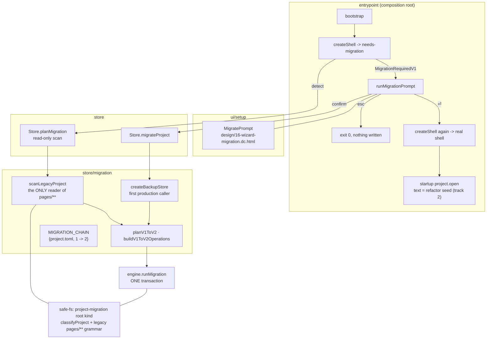

# Design tree — phase 1b — migration — Implementation Plan

> **For agentic workers:** REQUIRED SUB-SKILL: Use superpowers:subagent-driven-development
> (recommended) or superpowers:executing-plans to implement this plan task-by-task. Steps use
> checkbox (`- [ ]`) syntax for tracking. Load `/reatom` and `/errore` before any code-related
> action (CLAUDE.md mandate). Every task ends green and is one commit.

**Goal:** Implement design §12 — a `format_version = 1` project is **migrated, not refused**: the
`migrate-80` dialog is offered before anything opens, `⏎ migrate` runs a verified-backup-then-one-
transaction mechanical migration and opens the migrated project, and a trusted project then gets an
ordinary agent turn seeded to factor the migrated pages into shared modules.

**Scope:** plan 1b of the four the spec's §14 decomposes into
(`docs/superpowers/specs/2026-07-28-multi-file-design-tree-design.md`, §12, lines 318-408). Plan 1
(`c8c623c..ea4197d`), its closeout (`1cc6431..d57c2a3`) and plan 2 (`0360b94..802a980`) are landed.
This plan touches none of plan 3's host O2 (§9, §11).

## This plan repairs a live defect, and the spec does not say so

§12 reads as forward-looking work. It is not. **Plan 1 already bumped
`PROJECT_MANIFEST_FORMAT_VERSION` to 2** (`src/store/toml/model/project-toml.ts:14`, commit
`d82238c`). Every project created before that commit is, today, on this branch:

```
store.openProject(root)            -> ManifestMigrationRequiredError   (project-toml.ts:196-202)
  -> openOrCreateProject falls through to store.createProject(root)    (create-shell.ts:342)
  -> ProjectAlreadyExistsError — .termcraft already exists             (factory.ts:1556)
  -> ShellCompositionError                                             (create-shell.ts:351-356)
  -> bootstrap returns it unchanged                                    (bootstrap.ts:38-39)
  -> boundary.reportFatalAndExit(app.message, app.cause)               (main.tsx:162-169)
```

The process dies before the Kernel, the UI, or Home ever exist. There is no read-only state, no
error panel, no retry — the binary refuses to start against the user's own project. That is the
state this plan ends.

**Three things are already built and are not this plan's work.** Detection is done:
`decodeProjectManifest` returns a typed `ManifestMigrationRequiredError` for `version < 2`
(`project-toml.ts:38-48`, `:196-202`). The verified-backup protocol is done and unit-tested
(`store/migration/model/backup-store.ts`). The `MigrationTransaction` wrapper is done
(`store/transaction/model/wrappers.ts:1099`). What is missing is everything between them: nothing
calls the backup, nothing builds the operation set, and the typed refusal has no consumer but
`reportFatalAndExit`.

## Two structural obstacles the spec's own §15 anchors miss

**1. §12.1's dialog cannot live where §15 points.** §15 anchors version detection at
`src/core/project/model/open-sequence.ts`. That file's `runOpenSequence` **has no production
caller** — a grep for `runOpenSequence\(` inside `core/kernel/model/handlers/project.ts` returns
zero matches, and that file's own header (`:49-73`) explains why: `OpenSequenceDeps` needs six
fields `HandlerContext` cannot supply. The live gate is `migrationsGate` in
`src/store/model/factory.ts:1293`, called at `:1484`. Wiring only the `open-sequence.ts` slot would
change nothing a user sees.

Worse, the dialog cannot live in the Kernel at all. §12.1 says "a version-1 project never opens" —
so there is no `OpenProject`, and `KernelDeps` (`create-shell.ts:176-181`) is built entirely from
one. **The migrate dialog is therefore a pre-Kernel surface**, mounted by the composition root
before `createShell` has a graph to build. That is operator ruling (a) below.

**2. The migration cannot read the files it is migrating.** `classifyProject`
(`src/store/safe-fs/model/limits.ts:141-168`) no longer admits `pages/**` — plan 1 retired that
namespace. And the transaction engine resolves every operation through `deps.safeFs.resolve(op.
target)` (`store/transaction/model/engine.ts:444`, `:475`, `:517`, `:533`). So on today's branch a
`SafeProjectFs` opened over a version-1 project refuses to read `pages/dashboard/page.tsx`, and a
delete operation targeting it is rejected before it is ever planned. Task 1 exists solely because of
this.

## Operator rulings settled before this plan was written

1. **(a) Pre-Kernel setup surface.** `createShell` returns a third outcome for
   `ManifestMigrationRequiredError`; `bootstrap` mounts a minimal OpenTUI root that renders only
   `MigratePrompt`. `⏎` runs the migration and then builds the real shell; `esc` writes nothing and
   exits 0. **Recorded divergence from §12.1:** "esc later returns to Home" is not implementable —
   Home renders inside an app whose Kernel is built from an `OpenProject`, which is exactly what a
   version-1 project cannot produce, and termcraft opens one root per process so there is no other
   project to return to. `esc` therefore exits with a plain line naming the root. The alternative
   (a project-less Kernel mode) is a structural change larger than the migration itself.
2. **(b) A distinct `project-migration` root kind.** The retired `pages/**` grammar is admitted by a
   root kind that exists only for the duration of a migration, never by widening `classifyProject`.
   Precedent: `export-candidate` and `backup` already have their own grammars
   (`limits.ts:184-186`).
3. **Track 2 is in this plan** (Task 9), not deferred.
4. **The acceptance oracle is `examples/clock`.** §12.3 says the clock example is migrated by running
   the real migration; it was in fact rebuilt by hand (`ea4197d`). The real version-1 project it was
   rebuilt from is preserved verbatim at `test-fixtures/format-v1-project/`. Task 10 runs the real
   migration over a copy of that fixture and asserts the result equals the hand-built
   `examples/clock/.termcraft/` **byte for byte**. The hand migration becomes the oracle, and §12.3
   is satisfied in substance.

**Architecture:** no new top-level module and no new ring edge. `store/migration` grows the two
things that understand the old layout — a scanner and a v1→v2 planner — and stays the only place in
the system that does (§12.1: "the old layout is understood by exactly one thing: the migration step
itself"). `store` grows two `Store` methods over an existing lease/engine/backup composition.
`entrypoint` grows one pre-Kernel branch. `ui` grows a `setup` submodule for the setup tier.



**Tech Stack:** TypeScript 7.0.2 on Bun ≥1.3.14, `@opentui/core`+`@opentui/react` 0.4.5,
`@reatom/core` ^1001.1.0, `errore` ^0.14.1, `zod` ^4.4.3, `oxlint` 1.74.0, `oxfmt` 0.59.0.
No new dependencies.

## Global Constraints

Inherited from `CLAUDE.md` and carried verbatim from plan 1, the phase-1 closeout, and plan 2.
Every task implicitly includes this section.

- **Test runner is `bun run test`** (`scripts/run-tests.ts`), never a bare `bun test` whose crash
  reads as a pass. It forwards arguments, so a single file is
  `rtk bun run test src/path/file.test.ts`. Tests live beside the file under test (`foo.ts` →
  `foo.test.ts`). Typecheck with `bun x tsc --noEmit`. Lint/format: `bun run lint` / `bun run
  fmt:check`.
- **Run the whole suite in the FOREGROUND with a plain redirect and a 600000 ms timeout**, then read
  the file: `rtk bun run test > "<scratchpad>/suite-taskN.txt" 2>&1`. A background run piped through
  `tail` produces an empty file until the stream ends and costs three turns.
- **Prefix every command with `rtk`** (`CLAUDE.md`), including inside `&&` chains. `rtk git commit`
  swallows heredoc stdin — write the message to a scratchpad file and pass `-F <path>`.
- **errore is mandatory**: namespace import (`import * as errore from "errore"`), errors as values
  (`Error | T` unions), `createTaggedError` for domain errors, `.catch()`/`errore.try` only at
  uncontrolled boundaries, flat control flow, `if (x instanceof Error) return x` on one line with no
  block, `| null` for optional values, never swallow an error without logging it.
- **Reatom v1001**: named atoms/computeds/actions; `wrap(...)` at every async boundary that touches
  an atom afterwards; never an async IIFE wrapping an `await` — keep the call flat.
- **Module DAG** (`docs/architecture/code-structure.md`): `core` imports only `entities/` and its own
  `ports/`; `gate`, `store`, `host` may import `entities/`; `host` may **not** import `gate`;
  `entities/` submodules import nothing but each other and `infrastructure/`.
- **Module folder shape** (`CLAUDE.md`): `ui/`, `model/`, `types.ts`, `index.ts`; code always inside
  subfolders, never loose at a module root; atomic single-purpose functions.
- **Imports**: cross-module imports use the `tsconfig.json` path aliases, never a relative path
  climbing out of the module. Never alias under `@termcraft/*`.
- **Factories are named `create*`, never `make*`.** (`factory.ts` still holds pre-existing `make*`
  helpers; do not add new ones, and rename any you rewrite wholesale.)
- **Design is a source of truth**: colours, layout, glyphs and copy come from
  `design/termcraft-engine.js` and `design/*.dc.html`. Where a design value cannot be reproduced
  1:1, implement the closest faithful mapping and document the divergence in a code comment —
  never silently substitute an invented value.
- **Honest values only**: a value with no source is an explicit documented placeholder or an honest
  empty, never a fabrication. **This plan's sharpest instance:** the migration never guesses a path.
  A version-1 page whose `pages/<slug>/page.tsx` is missing is a refusal that names the slug, never
  a silently skipped page.
- **No optional input with a production fallback.** If a caller must decide something, the field is
  REQUIRED and the caller decides.
- **Nothing is written before the backup is VERIFIED.** Every task below that touches disk keeps the
  order: scan → backup → verify → one transaction. A partial migration is the one outcome this plan
  must make impossible.
- **Language**: all code, comments, plans and commit messages in English.

---

## Task 1: The `project-migration` root kind

The migration must read `pages/<slug>/page.tsx` and `pages/<slug>/comments.jsonl`, and must delete
them inside the same transaction that writes their replacements. Both go through
`classifyNamespace`, which no longer admits either. This task adds a root kind whose grammar is
`classifyProject` **plus** the retired shape — and proves the ordinary `project` root still refuses
it.

The two legacy paths map onto the namespaces they migrate *into* (`design-source` and
`comments-jsonl`) rather than getting invented budget rows: the bytes are literally the same bytes,
so the per-file limits that already govern them are the correct ones.

**Files:**
- Modify: `src/store/safe-fs/types.ts:18` (`ManagedRootKind`)
- Modify: `src/store/safe-fs/model/limits.ts:81-87` (`ROOT_LIMITS`), `:175-190` (`classifyNamespace`)
- Test: `src/store/safe-fs/model/limits.test.ts`

**Interfaces:**
- Consumes: nothing from earlier tasks.
- Produces: `ManagedRootKind` gains the `"project-migration"` member. `classifyNamespace(
  "project-migration", relPath)` admits every path `classifyNamespace("project", relPath)` admits,
  plus `pages/<slug>/page.tsx` → `"design-source"` and `pages/<slug>/comments.jsonl` →
  `"comments-jsonl"`. Tasks 2, 4 and 5 open their `SafeProjectFs` on this kind.

- [ ] **Step 1: Write the failing test**

Append to `src/store/safe-fs/model/limits.test.ts`:

```ts
describe("the project-migration root kind (design-tree §12.2's mechanical track)", () => {
  test("the ordinary project root still refuses the retired page layout", () => {
    expect(classifyNamespace("project", "pages/dashboard/page.tsx")).toBeInstanceOf(
      UnknownNamespaceError,
    );
    expect(classifyNamespace("project", "pages/dashboard/comments.jsonl")).toBeInstanceOf(
      UnknownNamespaceError,
    );
  });

  test("the migration root admits the retired page source under design-source", () => {
    expect(classifyNamespace("project-migration", "pages/dashboard/page.tsx")).toBe("design-source");
  });

  test("the migration root admits the retired pin log under comments-jsonl", () => {
    expect(classifyNamespace("project-migration", "pages/dashboard/comments.jsonl")).toBe(
      "comments-jsonl",
    );
  });

  test("the migration root still admits everything the project grammar admits", () => {
    expect(classifyNamespace("project-migration", "project.toml")).toBe("project-config");
    expect(classifyNamespace("project-migration", "design/pages.json")).toBe("design-source");
    expect(classifyNamespace("project-migration", "pins/dashboard.jsonl")).toBe("comments-jsonl");
    expect(classifyNamespace("project-migration", "transactions.local/t1/plan.json")).toBe(
      "transaction-payload",
    );
  });

  test("the legacy grammar is exact — no other file under pages/ is admitted", () => {
    for (const relPath of [
      "pages/dashboard/other.tsx", // only page.tsx and comments.jsonl
      "pages/dashboard", // the directory itself is not a leaf
      "pages/dashboard/nested/page.tsx", // exactly three components
      "pages/Dashboard/page.tsx", // the slug mask rejects capitals
      "pages/page.tsx", // no slug component
    ]) {
      expect(classifyNamespace("project-migration", relPath)).toBeInstanceOf(UnknownNamespaceError);
    }
  });

  test("the migration root carries the project root's own aggregate budget", () => {
    expect(ROOT_LIMITS["project-migration"]).toEqual(ROOT_LIMITS.project);
  });
});
```

- [ ] **Step 2: Run the test to verify it fails**

Run: `rtk bun run test src/store/safe-fs/model/limits.test.ts`
Expected: FAIL — `bun x tsc --noEmit` reports `"project-migration"` is not assignable to
`ManagedRootKind`, and the runtime assertions report `UnknownNamespaceError` for the legacy paths.

- [ ] **Step 3: Add the root kind**

`src/store/safe-fs/types.ts:18` — replace the union:

```ts
/**
 * `"project-migration"` is `"project"` for the duration of ONE migration and nothing else: its
 * grammar is `classifyProject`'s plus the retired format-1 `pages/<slug>/` shape, so the
 * mechanical track (design-tree §12.2) can read the old files and delete them inside the same
 * transaction that writes their replacements. It is deliberately a separate kind rather than a
 * widening of `classifyProject`: the retired names must never become legal for the live project
 * root again, and a root kind is the narrowest scope this module can give them.
 */
export type ManagedRootKind =
  | "project"
  | "project-migration"
  | "workspace"
  | "candidate"
  | "export-candidate"
  | "backup";
```

- [ ] **Step 4: Add the budget row and the legacy grammar**

`src/store/safe-fs/model/limits.ts` — add to `ROOT_LIMITS` (after the `project` row, `:82`):

```ts
  // Identical to `project` by construction: this root is the same `.termcraft` directory, opened
  // for one migration. A tighter budget here would refuse a project the ordinary root accepts.
  "project-migration": { maxFiles: null, totalBytes: null, maxDepth: MAX_PATH_COMPONENTS },
```

Add the classifier below `classifyProject` (after `:168`):

```ts
/**
 * The RETIRED format-1 page layout (`pages/<slug>/page.tsx`, `pages/<slug>/comments.jsonl`),
 * admitted ONLY under the `project-migration` root kind — design-tree §12.1: "no compatibility
 * reader for it exists anywhere in the system ... the old layout is understood by exactly one
 * thing: the migration step itself."
 *
 * Each legacy path maps onto the namespace it migrates INTO rather than getting a budget row of
 * its own: `pages/<slug>/page.tsx` becomes `design/pages/<slug>.tsx` and
 * `pages/<slug>/comments.jsonl` becomes `pins/<slug>.jsonl`, so the bytes are governed here by
 * exactly the limits that will govern them a transaction later. An invented third budget would
 * be a number with no source.
 */
function classifyLegacyProject(components: readonly string[]): ManagedNamespace | null {
  if (components.length !== 3) return null;
  const [first, slug, leaf] = components;
  if (first !== "pages" || slug === undefined || leaf === undefined) return null;
  if (parsePageSlug(slug) instanceof Error) return null;
  if (leaf === "page.tsx") return "design-source";
  if (leaf === "comments.jsonl") return "comments-jsonl";
  return null;
}
```

Extend `classifyNamespace`'s dispatch (`:180-187`) — the `project` line is unchanged, one line is
added under it:

```ts
    if (rootKind === "workspace" || rootKind === "candidate") return classifyWorkspace(components);
    if (rootKind === "project") return classifyProject(components);
    // `?? classifyLegacyProject(...)`, not a replacement: a migration root reads and writes the
    // CURRENT layout too (project.toml, design/**, pins/**, transactions.local/**) in the same
    // transaction that retires the old one.
    if (rootKind === "project-migration")
      return classifyProject(components) ?? classifyLegacyProject(components);
```

- [ ] **Step 5: Run the test to verify it passes**

Run: `rtk bun run test src/store/safe-fs/model/limits.test.ts`
Expected: PASS. Then `bun x tsc --noEmit` — expected: no output. Any other file that switches on
`ManagedRootKind` exhaustively will surface here; fix by delegating the new kind to the same branch
as `"project"`.

- [ ] **Step 6: Run the store suite and commit**

```bash
rtk bun run test src/store > "<scratchpad>/suite-task1.txt" 2>&1
rtk git add src/store/safe-fs/types.ts src/store/safe-fs/model/limits.ts src/store/safe-fs/model/limits.test.ts
rtk git commit -F "<scratchpad>/msg-task1.txt"
```

Message: `feat(safe-fs): admit the retired page layout under a migration-only root kind`

---

## Task 2: Read a version-1 project

The one reader of the old layout. It answers a single question — *what is on disk, and is it
migratable?* — and returns a fact set, never a plan and never a file mutation.

The version-1 `project.toml` schema lives here, not in `store/toml`: shipping a v1 decoder beside
the v2 one would put a compatibility reader back in the live path, which §12.1 forbids.

**Files:**
- Create: `src/store/migration/model/legacy-scan.ts`
- Create: `src/store/migration/model/legacy-scan.test.ts`
- Modify: `src/store/migration/index.ts` (barrel)
- Modify: `src/store/migration/types.ts` (the scan result types)

**Interfaces:**
- Consumes: Task 1's `"project-migration"` root kind (the caller opens the `SafeProjectFs`).
- Produces:
  ```ts
  export interface LegacyPageV1 {
    readonly slug: PageSlug;
    readonly legacySourcePath: string;   // "pages/<slug>/page.tsx"
    readonly legacyPinsPath: string | null; // "pages/<slug>/comments.jsonl" when present
  }
  export interface LegacyProjectV1 {
    readonly formatVersion: 1;
    readonly projectId: string;
    readonly name: string;
    readonly createdAt: string;
    readonly targetStack: TargetStack;
    readonly pages: readonly LegacyPageV1[];
  }
  export function scanLegacyProject(safeFs: SafeProjectFs): LegacyScanError | LegacyProjectV1;
  ```

- [ ] **Step 1: Write the failing test**

Create `src/store/migration/model/legacy-scan.test.ts`:

```ts
import fs from "node:fs";
import os from "node:os";
import path from "node:path";

import { afterEach, describe, expect, test } from "bun:test";

import { createSafeProjectFs, nodeSafeFsDeps, openManagedRoot } from "store/safe-fs";
import type { SafeProjectFs } from "store/safe-fs";

import { LegacyScanError, scanLegacyProject } from "./legacy-scan";

const V1_MANIFEST = [
  'format_version = 1',
  'project_id = "019fa002-5f5b-7000-92e3-9931eebd6c52"',
  'name = "clock"',
  'created_at = "2026-07-26T19:58:57.883Z"',
  'target_stack = "js-opentui"',
  'pages = ["dashboard", "calendar"]',
  "",
].join("\n");

const scratchRoots: string[] = [];
afterEach(() => {
  while (scratchRoots.length > 0) {
    const root = scratchRoots.pop();
    if (root !== undefined) fs.rmSync(root, { recursive: true, force: true });
  }
});

/** A `.termcraft` directory with `manifest` and one `pages/<slug>/page.tsx` per `slugs` entry. */
function seedLegacyProject(input: {
  readonly manifest: string;
  readonly slugs: readonly string[];
  readonly pinnedSlugs?: readonly string[];
}): SafeProjectFs {
  const scratch = fs.mkdtempSync(path.join(os.tmpdir(), "tc-legacy-scan-"));
  scratchRoots.push(scratch);
  const termcraftDir = path.join(scratch, ".termcraft");
  fs.mkdirSync(termcraftDir);
  fs.writeFileSync(path.join(termcraftDir, "project.toml"), input.manifest);
  for (const slug of input.slugs) {
    fs.mkdirSync(path.join(termcraftDir, "pages", slug), { recursive: true });
    fs.writeFileSync(
      path.join(termcraftDir, "pages", slug, "page.tsx"),
      `export const meta = { title: "${slug}" };\n`,
    );
  }
  for (const slug of input.pinnedSlugs ?? []) {
    fs.writeFileSync(path.join(termcraftDir, "pages", slug, "comments.jsonl"), '{"kind":"header"}\n');
  }
  const deps = nodeSafeFsDeps();
  const root = openManagedRoot({ kind: "project-migration", path: termcraftDir, deps });
  if (root instanceof Error) throw root;
  return createSafeProjectFs(root, deps);
}

describe("scanLegacyProject (design-tree §12.2 track 1's only reader of the old layout)", () => {
  test("reads identity, ordered slugs and each page's source path", () => {
    const scanned = scanLegacyProject(
      seedLegacyProject({ manifest: V1_MANIFEST, slugs: ["dashboard", "calendar"] }),
    );
    expect(scanned).not.toBeInstanceOf(Error);
    if (scanned instanceof Error) return;
    expect(scanned.formatVersion).toBe(1);
    expect(scanned.projectId).toBe("019fa002-5f5b-7000-92e3-9931eebd6c52");
    expect(scanned.name).toBe("clock");
    expect(scanned.targetStack).toBe("js-opentui");
    expect(scanned.pages.map((page) => page.slug)).toEqual(["dashboard", "calendar"]);
    expect(scanned.pages[0]?.legacySourcePath).toBe("pages/dashboard/page.tsx");
  });

  test("reports an absent pin log as null, never as a fabricated path", () => {
    const scanned = scanLegacyProject(
      seedLegacyProject({
        manifest: V1_MANIFEST,
        slugs: ["dashboard", "calendar"],
        pinnedSlugs: ["calendar"],
      }),
    );
    if (scanned instanceof Error) throw scanned;
    expect(scanned.pages[0]?.legacyPinsPath).toBeNull();
    expect(scanned.pages[1]?.legacyPinsPath).toBe("pages/calendar/comments.jsonl");
  });

  test("refuses a manifest that is already format 2", () => {
    const scanned = scanLegacyProject(
      seedLegacyProject({ manifest: V1_MANIFEST.replace("= 1", "= 2"), slugs: [] }),
    );
    expect(scanned).toBeInstanceOf(LegacyScanError);
    expect((scanned as LegacyScanError).code).toBe("NOT_VERSION_1");
  });

  test("refuses a listed page whose source file is missing — never skips it silently", () => {
    const scanned = scanLegacyProject(
      seedLegacyProject({ manifest: V1_MANIFEST, slugs: ["dashboard"] }),
    );
    expect(scanned).toBeInstanceOf(LegacyScanError);
    expect((scanned as LegacyScanError).code).toBe("PAGE_SOURCE_MISSING");
    expect((scanned as LegacyScanError).message).toContain("calendar");
  });

  test("refuses a manifest whose pages array holds an invalid slug", () => {
    const scanned = scanLegacyProject(
      seedLegacyProject({
        manifest: V1_MANIFEST.replace('"calendar"', '"Calendar"'),
        slugs: ["dashboard"],
      }),
    );
    expect(scanned).toBeInstanceOf(LegacyScanError);
    expect((scanned as LegacyScanError).code).toBe("MANIFEST_SHAPE");
  });

  test("refuses a version-1 manifest missing the pages array", () => {
    const scanned = scanLegacyProject(
      seedLegacyProject({
        manifest: V1_MANIFEST.split("\n").filter((line) => !line.startsWith("pages")).join("\n"),
        slugs: [],
      }),
    );
    expect(scanned).toBeInstanceOf(LegacyScanError);
    expect((scanned as LegacyScanError).code).toBe("MANIFEST_SHAPE");
  });
});
```

- [ ] **Step 2: Run the test to verify it fails**

Run: `rtk bun run test src/store/migration/model/legacy-scan.test.ts`
Expected: FAIL — `Cannot find module "./legacy-scan"`.

- [ ] **Step 3: Write the scanner**

Create `src/store/migration/model/legacy-scan.ts`:

```ts
import * as errore from "errore";
import { z } from "zod";

import { pageSlugSchema } from "entities/page";
import type { PageSlug } from "entities/page";
import { rfc3339UtcSchema } from "infrastructure/clock";
import { canonicalUuidv7Schema } from "infrastructure/uuid";
import { FsAccessError, isNotFound } from "store/safe-fs";
import type { SafeProjectFs } from "store/safe-fs";
import { PROJECT_MANIFEST_FILENAME, TARGET_STACKS, parseToml, readFormatVersion } from "store/toml";
import type { TargetStack } from "store/toml";

import type { LegacyPageV1, LegacyProjectV1 } from "../types";

/** The format-1 layout's own version number. Named, not inlined: every check below is about THIS. */
export const LEGACY_PROJECT_FORMAT_VERSION = 1;

/** What went wrong reading a version-1 project. `code` is the branch, not a message fragment. */
export type LegacyScanCodeV1 =
  | "MANIFEST_UNREADABLE"
  | "MANIFEST_SHAPE"
  | "NOT_VERSION_1"
  | "PAGE_SOURCE_MISSING"
  | "PAGE_SOURCE_UNREADABLE";

/**
 * A version-1 project could not be read well enough to migrate it. Every branch names the artifact
 * it failed on, so the user sees which file blocked the offer rather than a generic refusal.
 */
export class LegacyScanError extends errore.createTaggedError({
  name: "LegacyScanError",
  message: "cannot read the version-1 project at $artifact [$code]: $reason",
}) {}

/**
 * The RETIRED format-1 `project.toml` schema. It lives here rather than in `store/toml` on purpose
 * (design-tree §12.1): shipping a version-1 decoder beside the version-2 one would put a
 * compatibility reader back into the live open path, and "no compatibility reader for it exists
 * anywhere in the system" is the property that keeps this change's blast radius small. Its ONLY
 * caller is `scanLegacyProject` below.
 *
 * `strictObject` — a stray key in a version-1 manifest is corruption exactly as it is in version 2.
 * `pages` is REQUIRED here: it is the whole reason format 1 existed, and a version-1 manifest
 * without it is not a version-1 manifest.
 */
const legacyProjectManifestSchema = z.strictObject({
  format_version: z.literal(LEGACY_PROJECT_FORMAT_VERSION),
  project_id: canonicalUuidv7Schema,
  name: z.string(),
  created_at: rfc3339UtcSchema,
  target_stack: z.enum(TARGET_STACKS),
  pages: z.array(pageSlugSchema).refine(
    (slugs) => new Set(slugs).size === slugs.length,
    "pages must not repeat a slug",
  ),
});

/** `pages/<slug>/page.tsx` — the retired per-page source path. */
export function legacySourcePath(slug: PageSlug): string {
  return `pages/${slug}/page.tsx`;
}

/** `pages/<slug>/comments.jsonl` — the retired per-page pin log path. */
export function legacyPinsPath(slug: PageSlug): string {
  return `pages/${slug}/comments.jsonl`;
}

/** Whether a managed leaf exists, distinguishing "absent" from "could not tell". */
function probeLeaf(safeFs: SafeProjectFs, relPath: string): LegacyScanError | boolean {
  const stat = safeFs.stat(relPath);
  if (!(stat instanceof Error)) return true;
  if (stat instanceof FsAccessError && isNotFound(stat)) return false;
  return new LegacyScanError({
    artifact: relPath,
    code: "PAGE_SOURCE_UNREADABLE",
    reason: stat.message,
    cause: stat,
  });
}

/**
 * Read a version-1 project's portable facts (design-tree §12.2 track 1). This is the ONLY function
 * in the system that understands the retired layout; everything downstream consumes its result.
 *
 * `safeFs` MUST be opened on the `project-migration` root kind — the ordinary `project` grammar
 * refuses every `pages/**` path this function reads.
 */
export function scanLegacyProject(safeFs: SafeProjectFs): LegacyScanError | LegacyProjectV1 {
  const bytes = safeFs.readFile(PROJECT_MANIFEST_FILENAME);
  if (bytes instanceof Error)
    return new LegacyScanError({
      artifact: PROJECT_MANIFEST_FILENAME,
      code: "MANIFEST_UNREADABLE",
      reason: bytes.message,
      cause: bytes,
    });

  const parsed = parseToml(new TextDecoder().decode(bytes));
  if (parsed instanceof Error)
    return new LegacyScanError({
      artifact: PROJECT_MANIFEST_FILENAME,
      code: "MANIFEST_UNREADABLE",
      reason: "file is not valid TOML",
      cause: parsed,
    });

  // The version gate runs BEFORE the field schema, exactly as `decodeProjectManifest` orders its
  // own: a format-2 file handed to this scanner must be reported as "not version 1", never as a
  // pile of shape complaints about fields format 2 legitimately dropped.
  const version = readFormatVersion(parsed.value);
  if (version !== LEGACY_PROJECT_FORMAT_VERSION)
    return new LegacyScanError({
      artifact: PROJECT_MANIFEST_FILENAME,
      code: "NOT_VERSION_1",
      reason: `format_version is ${version ?? "missing or non-integer"}, not 1`,
    });

  const decoded = legacyProjectManifestSchema.safeParse(parsed.value);
  if (!decoded.success) {
    const issue = decoded.error.issues[0];
    return new LegacyScanError({
      artifact: PROJECT_MANIFEST_FILENAME,
      code: "MANIFEST_SHAPE",
      reason: `${issue?.path.join(".") ?? "SHAPE"}: ${issue?.message ?? "invalid input"}`,
    });
  }

  const pages: LegacyPageV1[] = [];
  for (const slug of decoded.data.pages) {
    const sourcePath = legacySourcePath(slug);
    const sourcePresent = probeLeaf(safeFs, sourcePath);
    if (sourcePresent instanceof Error) return sourcePresent;
    // A listed page with no file on disk stops the migration. The alternative — dropping it —
    // would silently delete a page the user's manifest says exists, and the backup would not
    // contain it either.
    if (!sourcePresent)
      return new LegacyScanError({
        artifact: sourcePath,
        code: "PAGE_SOURCE_MISSING",
        reason: `project.toml lists page "${slug}" but its source file does not exist`,
      });

    const pinsPath = legacyPinsPath(slug);
    const pinsPresent = probeLeaf(safeFs, pinsPath);
    if (pinsPresent instanceof Error) return pinsPresent;
    pages.push({ slug, legacySourcePath: sourcePath, legacyPinsPath: pinsPresent ? pinsPath : null });
  }

  return {
    formatVersion: LEGACY_PROJECT_FORMAT_VERSION,
    projectId: decoded.data.project_id,
    name: decoded.data.name,
    createdAt: decoded.data.created_at,
    targetStack: decoded.data.target_stack satisfies TargetStack,
    pages,
  };
}
```

- [ ] **Step 4: Add the shared types and export the module**

Append to `src/store/migration/types.ts`:

```ts
// ---- the retired format-1 layout (design-tree §12.2 track 1) ---------------------------

/** One version-1 page as found on disk: its slug and the two retired paths that hold it. */
export interface LegacyPageV1 {
  readonly slug: PageSlug;
  /** `pages/<slug>/page.tsx` — always present; a listed page without one fails the scan. */
  readonly legacySourcePath: string;
  /** `pages/<slug>/comments.jsonl`, or `null` when the page never accumulated pins. */
  readonly legacyPinsPath: string | null;
}

/** A version-1 project's portable facts, read by `model/legacy-scan.ts`'s `scanLegacyProject`. */
export interface LegacyProjectV1 {
  readonly formatVersion: 1;
  readonly projectId: string;
  readonly name: string;
  /** UTC RFC 3339, carried forward verbatim — a migration never restamps creation time. */
  readonly createdAt: string;
  readonly targetStack: TargetStack;
  /** Manifest order, which IS page order in format 1 and becomes `design/pages.json`'s order. */
  readonly pages: readonly LegacyPageV1[];
}
```

with the imports `import type { PageSlug } from "entities/page";` and
`import type { TargetStack } from "store/toml";` added at the top of that file.

Append to `src/store/migration/index.ts`:

```ts
export type { LegacyPageV1, LegacyProjectV1 } from "./types";
export {
  LEGACY_PROJECT_FORMAT_VERSION,
  LegacyScanError,
  legacyPinsPath,
  legacySourcePath,
  scanLegacyProject,
} from "./model/legacy-scan";
export type { LegacyScanCodeV1 } from "./model/legacy-scan";
```

Also update this file's header comment: the "No shipped migration exists yet" paragraph is about to
stop being true. Replace its first sentence with:

```
// The version-1 -> version-2 migration (design-tree design §12) ships here: `model/legacy-scan.ts`
// is the system's ONLY reader of the retired `pages/<slug>/` layout, `model/v1-to-v2.ts` turns
// that reading into one transaction's operations, and `MIGRATION_CHAIN` names the step.
```

- [ ] **Step 5: Run the test to verify it passes**

Run: `rtk bun run test src/store/migration/model/legacy-scan.test.ts`
Expected: PASS (6 tests). Then `bun x tsc --noEmit` — expected: no output.

- [ ] **Step 6: Commit**

```bash
rtk git add src/store/migration
rtk git commit -F "<scratchpad>/msg-task2.txt"
```

Message: `feat(migration): read a version-1 project, the one place the retired layout is understood`

---

## Task 3: The first `MIGRATION_CHAIN` entry and the v1→v2 plan

`MigrationStep` is a declaration — `{kind, fromVersion, toVersion}` — with no transform function
(`store/migration/types.ts:36-40`). So "the chain gains its first real entry" (§12.3) means exactly
one row plus a `findSteps` lookup that now answers non-empty; the transform is this module's own
code. This task lands the row, flips the two `toEqual([])` assertions §12.3 names, and adds the pure
planner the dialog's copy is rendered from.

**Files:**
- Modify: `src/store/migration/model/registry.ts:60-71` (`MIGRATION_CHAIN`)
- Modify: `src/store/migration/model/registry.test.ts:14-22`
- Create: `src/store/migration/model/v1-to-v2.ts`
- Create: `src/store/migration/model/v1-to-v2.test.ts`
- Modify: `src/store/migration/index.ts`, `src/store/migration/types.ts`

**Interfaces:**
- Consumes: Task 2's `LegacyProjectV1`, `LegacyPageV1`.
- Produces:
  ```ts
  export const PROJECT_TOML_MIGRATION_KIND = "project.toml";
  export interface MigrationMoveV1 {
    readonly from: string;
    readonly to: string;
    readonly what: "page-source" | "pin-log";
  }
  export interface MigrationPlanV1 {
    readonly migrationPlanId: string;
    readonly fromVersion: 1;
    readonly toVersion: 2;
    readonly projectId: string;
    readonly moves: readonly MigrationMoveV1[];
    readonly pageCount: number;
    readonly pinLogCount: number;
    readonly backupsDir: string;   // {userStateRoot}/backups/<projectId>
  }
  export function planV1ToV2(input: {
    readonly scan: LegacyProjectV1;
    readonly userStateRoot: AbsPath;
    readonly migrationPlanId: string;
  }): MigrationPlanV1;
  ```
  Task 4 builds operations from the same `scan`; Task 5 mints `migrationPlanId`; Task 7 renders
  `pageCount`, `pinLogCount` and `backupsDir`.

- [ ] **Step 1: Write the failing tests**

Rewrite `src/store/migration/model/registry.test.ts`'s `describe("MIGRATION_CHAIN ...")` block
(currently `:14-22`) as:

```ts
describe("MIGRATION_CHAIN (design-tree §12.3: the first shipped migration)", () => {
  test("the shipped chain is exactly the project.toml 1 -> 2 step", () => {
    expect(MIGRATION_CHAIN).toEqual([
      { kind: "project.toml", fromVersion: 1, toVersion: 2 },
    ]);
  });

  test("the live default registry wires that same chain", () => {
    expect(migrationRegistry.chain).toEqual(MIGRATION_CHAIN);
  });

  test("the live registry resolves a real path from 1 to 2", () => {
    const steps = migrationRegistry.findSteps({
      kind: "project.toml",
      fromVersion: 1,
      toVersion: 2,
    });
    expect(steps).not.toBeInstanceOf(Error);
    expect(steps).toHaveLength(1);
  });

  test("the live registry still refuses a kind it has no step for", () => {
    expect(
      migrationRegistry.findSteps({ kind: "chat-jsonl", fromVersion: 1, toVersion: 2 }),
    ).toBeInstanceOf(NoMigrationPathError);
  });
});
```

Create `src/store/migration/model/v1-to-v2.test.ts`:

```ts
import { describe, expect, test } from "bun:test";

import type { PageSlug } from "entities/page";

import type { LegacyProjectV1 } from "../types";
import { planV1ToV2 } from "./v1-to-v2";

const USER_STATE_ROOT = "C:\\Users\\dev\\AppData\\Local\\termcraft";
const PROJECT_ID = "019fa002-5f5b-7000-92e3-9931eebd6c52";
const PLAN_ID = "019fb111-0000-7000-8000-000000000001";

const scan = (input: {
  readonly slugs: readonly string[];
  readonly pinned?: readonly string[];
}): LegacyProjectV1 => ({
  formatVersion: 1,
  projectId: PROJECT_ID,
  name: "clock",
  createdAt: "2026-07-26T19:58:57.883Z",
  targetStack: "js-opentui",
  pages: input.slugs.map((slug) => ({
    slug: slug as PageSlug,
    legacySourcePath: `pages/${slug}/page.tsx`,
    legacyPinsPath: (input.pinned ?? []).includes(slug) ? `pages/${slug}/comments.jsonl` : null,
  })),
});

describe("planV1ToV2 (design-tree §12.2 track 1's move set)", () => {
  test("moves each page source into the design tree, in manifest order", () => {
    const plan = planV1ToV2({
      scan: scan({ slugs: ["dashboard", "calendar"] }),
      userStateRoot: USER_STATE_ROOT,
      migrationPlanId: PLAN_ID,
    });
    expect(plan.moves.filter((move) => move.what === "page-source")).toEqual([
      { from: "pages/dashboard/page.tsx", to: "design/pages/dashboard.tsx", what: "page-source" },
      { from: "pages/calendar/page.tsx", to: "design/pages/calendar.tsx", what: "page-source" },
    ]);
  });

  test("moves only the pin logs that exist", () => {
    const plan = planV1ToV2({
      scan: scan({ slugs: ["dashboard", "calendar"], pinned: ["calendar"] }),
      userStateRoot: USER_STATE_ROOT,
      migrationPlanId: PLAN_ID,
    });
    expect(plan.moves.filter((move) => move.what === "pin-log")).toEqual([
      { from: "pages/calendar/comments.jsonl", to: "pins/calendar.jsonl", what: "pin-log" },
    ]);
    expect(plan.pinLogCount).toBe(1);
  });

  test("counts pages and names the real backup directory, not the mock's path", () => {
    const plan = planV1ToV2({
      scan: scan({ slugs: ["dashboard", "calendar"] }),
      userStateRoot: USER_STATE_ROOT,
      migrationPlanId: PLAN_ID,
    });
    expect(plan.pageCount).toBe(2);
    expect(plan.pinLogCount).toBe(0);
    expect(plan.backupsDir).toContain("backups");
    expect(plan.backupsDir).toContain(PROJECT_ID);
    expect(plan.backupsDir).not.toContain(".termcraft");
  });

  test("carries the version pair and the caller's plan id verbatim", () => {
    const plan = planV1ToV2({
      scan: scan({ slugs: [] }),
      userStateRoot: USER_STATE_ROOT,
      migrationPlanId: PLAN_ID,
    });
    expect(plan).toMatchObject({ migrationPlanId: PLAN_ID, fromVersion: 1, toVersion: 2 });
    expect(plan.moves).toEqual([]);
  });
});
```

- [ ] **Step 2: Run both tests to verify they fail**

Run: `rtk bun run test src/store/migration/model/registry.test.ts src/store/migration/model/v1-to-v2.test.ts`
Expected: FAIL — `MIGRATION_CHAIN` is `[]`, and `Cannot find module "./v1-to-v2"`.

- [ ] **Step 3: Land the chain entry**

`src/store/migration/model/registry.ts` — replace the constant and its comment (`:60-71`):

```ts
/**
 * The `kind` naming `project.toml`'s own format counter. A `MigrationStep`'s `kind` is a plain
 * string (see `types.ts`), so the one place the literal lives is here.
 */
export const PROJECT_TOML_MIGRATION_KIND = "project.toml";

/**
 * THE SHIPPED MIGRATION CHAIN. One step as of the multi-file design tree (design §12.3): the
 * portable manifest's format 1 -> 2, i.e. the flat `pages/<slug>/page.tsx` layout with an ordered
 * `pages` array in `project.toml` becoming the `design/` tree with `design/pages.json`.
 *
 * A `MigrationStep` is a DECLARATION, not a transform: it says a path exists between two versions
 * of one artifact family, and `findMigrationSteps` walks it. The transform itself is
 * `model/v1-to-v2.ts` plus `store/model/factory.ts`'s `migrateProject` driver. Appending a future
 * migration means editing this literal, not calling a `register()` function at runtime.
 */
export const MIGRATION_CHAIN: readonly MigrationStep[] = [
  { kind: PROJECT_TOML_MIGRATION_KIND, fromVersion: 1, toVersion: 2 },
];
```

- [ ] **Step 4: Write the planner**

Create `src/store/migration/model/v1-to-v2.ts`:

```ts
import { DESIGN_DIRNAME } from "entities/design-tree";
import type { PageSlug } from "entities/page";

import type { AbsPath, LegacyProjectV1, MigrationMoveV1, MigrationPlanV1 } from "../types";
import { projectBackupsDir } from "./backup-store";

/** `design/pages/<slug>.tsx` — where a migrated version-1 page lands (design §12.2). */
export function migratedSourcePath(slug: PageSlug): string {
  return `${DESIGN_DIRNAME}/pages/${slug}.tsx`;
}

/** `pins/<slug>.jsonl` — where a migrated version-1 pin log lands (design §3, §12.2). */
export function migratedPinsPath(slug: PageSlug): string {
  return `pins/${slug}.jsonl`;
}

/**
 * The immutable v1 -> v2 plan (design-tree §12.2 track 1). PURE: it computes paths and counts from
 * an already-completed scan and touches no disk, so the dialog can be drawn from it and the same
 * shape can be re-derived from a fresh scan at confirm time without a second I/O pass.
 *
 * The move set is exactly §12.2's four bullets, in this order:
 *   1. every `pages/<slug>/page.tsx` -> `design/pages/<slug>.tsx`
 *   2. every `pages/<slug>/comments.jsonl` that exists -> `pins/<slug>.jsonl`
 *   3. `design/pages.json` synthesized from `project.toml`'s ordered `pages` array (not a move —
 *      built by `buildV1ToV2Operations`, which is why it is not listed here)
 *   4. `project.toml` rewritten without `pages`, at `format_version = 2` (likewise)
 *
 * NO PAGE SOURCE BYTE IS EDITED. §12.2: every page stays a self-contained single file importing
 * only `@termcraft/runtime`, which is still valid under §5/§6 — the new format PERMITS shared
 * modules, it does not require them. That is what makes track 1 sufficient on its own.
 */
export function planV1ToV2(input: {
  readonly scan: LegacyProjectV1;
  readonly userStateRoot: AbsPath;
  readonly migrationPlanId: string;
}): MigrationPlanV1 {
  const sources: MigrationMoveV1[] = input.scan.pages.map((page) => ({
    from: page.legacySourcePath,
    to: migratedSourcePath(page.slug),
    what: "page-source",
  }));
  const pinLogs: MigrationMoveV1[] = input.scan.pages
    .filter((page) => page.legacyPinsPath !== null)
    .map((page) => ({
      // `page.legacyPinsPath` is non-null inside this filter; the fallback exists only because
      // TypeScript cannot narrow through `.filter`, and it is unreachable.
      from: page.legacyPinsPath ?? "",
      to: migratedPinsPath(page.slug),
      what: "pin-log",
    }));

  return {
    migrationPlanId: input.migrationPlanId,
    fromVersion: 1,
    toVersion: 2,
    projectId: input.scan.projectId,
    moves: [...sources, ...pinLogs],
    pageCount: sources.length,
    pinLogCount: pinLogs.length,
    // The REAL backup location (`{userStateRoot}/backups/<projectId>/`), outside `.termcraft` so a
    // Git operation cannot clobber it — `docs/architecture/storage.md` item 17. §12.3 records this
    // as a deliberate divergence from the dialog mockup, which draws
    // `.termcraft/backup-2026-07-13/`: the storage design wins and the dialog shows the real path.
    // The per-action subdirectory is NOT included: `migrationActionId` is minted at confirm time,
    // so naming it here would be a path that does not exist yet.
    backupsDir: projectBackupsDir(input.userStateRoot, input.scan.projectId),
  };
}
```

- [ ] **Step 5: Add the plan types and export them**

Append to `src/store/migration/types.ts`:

```ts
/** One file the mechanical track relocates, and what kind of file it is. */
export interface MigrationMoveV1 {
  readonly from: string;
  readonly to: string;
  readonly what: "page-source" | "pin-log";
}

/**
 * The immutable migration plan (kernel-command-contract §7.7: "an immutable migration plan has one
 * UUIDv7 `migrationPlanId`"). Computed before the offer is drawn and never mutated; confirm-time
 * re-derivation produces an equal value from a fresh scan.
 */
export interface MigrationPlanV1 {
  readonly migrationPlanId: string;
  readonly fromVersion: 1;
  readonly toVersion: 2;
  readonly projectId: string;
  readonly moves: readonly MigrationMoveV1[];
  readonly pageCount: number;
  readonly pinLogCount: number;
  /** `{userStateRoot}/backups/<projectId>` — the real location, shown verbatim in the dialog. */
  readonly backupsDir: AbsPath;
}
```

Append to `src/store/migration/index.ts`:

```ts
export type { MigrationMoveV1, MigrationPlanV1 } from "./types";
export { PROJECT_TOML_MIGRATION_KIND } from "./model/registry";
export { migratedPinsPath, migratedSourcePath, planV1ToV2 } from "./model/v1-to-v2";
```

- [ ] **Step 6: Run both tests to verify they pass**

Run: `rtk bun run test src/store/migration`
Expected: PASS. Then `bun x tsc --noEmit` — expected: no output.

- [ ] **Step 7: Commit**

```bash
rtk git add src/store/migration
rtk git commit -F "<scratchpad>/msg-task3.txt"
```

Message: `feat(migration): ship the first MIGRATION_CHAIN entry and the v1-to-v2 plan`

---

## Task 4: The transaction operation set

One transaction, or none. This task turns a scan into the exact `TransactionOperation[]` +
payload map the engine runs — writes first, deletes last — and the `BackupFileInput[]` the verified
backup must hold before any of it is planned.

**Files:**
- Modify: `src/store/migration/model/v1-to-v2.ts`
- Modify: `src/store/migration/model/v1-to-v2.test.ts`
- Modify: `src/store/migration/index.ts`

**Interfaces:**
- Consumes: Task 2's `scanLegacyProject` result, Task 3's `planV1ToV2`, and
  `store/transaction`'s `TransactionWrapperDeps`/`observeFileImage`/`designFilePath`/`pinsJsonlPath`.
- Produces:
  ```ts
  export interface V1ToV2OperationsV1 {
    readonly operations: readonly TransactionOperation[];
    readonly payloads: ReadonlyMap<string, Uint8Array>;
    /** Every byte the transaction is about to overwrite or delete — the backup's input set. */
    readonly backupFiles: readonly BackupFileInput[];
  }
  export function buildV1ToV2Operations(
    deps: TransactionWrapperDeps,
    input: { readonly scan: LegacyProjectV1; readonly newPayloadId: () => string },
  ): SafeFsError | V1ToV2OperationsV1;
  ```
  Task 5 calls it once, hands `backupFiles` to `BackupStore.createBackup`, and only then runs
  `operations`.

- [ ] **Step 1: Write the failing test**

Append to `src/store/migration/model/v1-to-v2.test.ts` (add the imports the block needs at the top:
`fs`, `os`, `path`, `afterEach`, `createSafeProjectFs`/`nodeSafeFsDeps`/`openManagedRoot` from
`store/safe-fs`, `nodeTransactionFsDeps` from `store/transaction`, `scanLegacyProject` from
`./legacy-scan`, and `buildV1ToV2Operations` from `./v1-to-v2`):

```ts
describe("buildV1ToV2Operations (one transaction, writes before deletes)", () => {
  test("writes the moved sources, the synthesized manifest and the rewritten project.toml", () => {
    const { fsDeps, scanned } = seedForOperations({ slugs: ["dashboard", "calendar"] });
    const built = buildV1ToV2Operations(fsDeps, { scan: scanned, newPayloadId: nextPayloadId });
    if (built instanceof Error) throw built;

    const byTarget = new Map(built.operations.map((op) => [op.target, op]));
    expect([...byTarget.keys()].sort()).toEqual(
      [
        "design/pages.json",
        "design/pages/calendar.tsx",
        "design/pages/dashboard.tsx",
        "pages/calendar/page.tsx",
        "pages/dashboard/page.tsx",
        "project.toml",
      ].sort(),
    );
    expect(byTarget.get("design/pages/dashboard.tsx")?.mode).toBe("replace");
    expect(byTarget.get("pages/dashboard/page.tsx")?.mode).toBe("delete");
  });

  test("every delete operation is ordered after every write operation", () => {
    const { fsDeps, scanned } = seedForOperations({ slugs: ["dashboard"] });
    const built = buildV1ToV2Operations(fsDeps, { scan: scanned, newPayloadId: nextPayloadId });
    if (built instanceof Error) throw built;
    const lastWrite = built.operations.findLastIndex((op) => op.mode === "replace");
    const firstDelete = built.operations.findIndex((op) => op.mode === "delete");
    expect(firstDelete).toBeGreaterThan(lastWrite);
  });

  test("operation indexes are a dense 0..n-1 sequence", () => {
    const { fsDeps, scanned } = seedForOperations({ slugs: ["dashboard", "calendar"] });
    const built = buildV1ToV2Operations(fsDeps, { scan: scanned, newPayloadId: nextPayloadId });
    if (built instanceof Error) throw built;
    expect(built.operations.map((op) => op.index)).toEqual(
      built.operations.map((_op, index) => index),
    );
  });

  test("the moved page source's payload is the ORIGINAL bytes, unedited", () => {
    const { fsDeps, scanned, sourceBytes } = seedForOperations({ slugs: ["dashboard"] });
    const built = buildV1ToV2Operations(fsDeps, { scan: scanned, newPayloadId: nextPayloadId });
    if (built instanceof Error) throw built;
    const moved = built.operations.find((op) => op.target === "design/pages/dashboard.tsx");
    const payload = built.payloads.get(moved?.payloadId ?? "");
    expect(payload).toEqual(sourceBytes.get("dashboard"));
  });

  test("the synthesized pages.json preserves manifest order and points at the moved entries", () => {
    const { fsDeps, scanned } = seedForOperations({ slugs: ["dashboard", "calendar"] });
    const built = buildV1ToV2Operations(fsDeps, { scan: scanned, newPayloadId: nextPayloadId });
    if (built instanceof Error) throw built;
    const manifestOp = built.operations.find((op) => op.target === "design/pages.json");
    const text = new TextDecoder().decode(built.payloads.get(manifestOp?.payloadId ?? ""));
    expect(JSON.parse(text)).toEqual({
      schemaVersion: 1,
      pages: [
        { slug: "dashboard", entry: "pages/dashboard.tsx" },
        { slug: "calendar", entry: "pages/calendar.tsx" },
      ],
    });
  });

  test("the rewritten project.toml is format 2 and carries no pages array", () => {
    const { fsDeps, scanned } = seedForOperations({ slugs: ["dashboard"] });
    const built = buildV1ToV2Operations(fsDeps, { scan: scanned, newPayloadId: nextPayloadId });
    if (built instanceof Error) throw built;
    const manifestOp = built.operations.find((op) => op.target === "project.toml");
    const text = new TextDecoder().decode(built.payloads.get(manifestOp?.payloadId ?? ""));
    expect(text).toContain("format_version = 2");
    expect(text).not.toContain("pages");
    expect(text).toContain('project_id = "019fa002-5f5b-7000-92e3-9931eebd6c52"');
    expect(text).toContain('created_at = "2026-07-26T19:58:57.883Z"');
  });

  test("the backup set holds every source byte and the old project.toml", () => {
    const { fsDeps, scanned } = seedForOperations({ slugs: ["dashboard"], pinned: ["dashboard"] });
    const built = buildV1ToV2Operations(fsDeps, { scan: scanned, newPayloadId: nextPayloadId });
    if (built instanceof Error) throw built;
    expect(built.backupFiles.map((file) => file.relPath).sort()).toEqual([
      "pages/dashboard/comments.jsonl",
      "pages/dashboard/page.tsx",
      "project.toml",
    ]);
    expect(built.backupFiles.every((file) => file.bytes.byteLength > 0)).toBe(true);
    expect(built.backupFiles.find((f) => f.relPath === "project.toml")?.sourceFormat).toBe(
      "project.toml@1",
    );
  });

  test("a pin log is moved only when the scan found one", () => {
    const { fsDeps, scanned } = seedForOperations({ slugs: ["dashboard"] });
    const built = buildV1ToV2Operations(fsDeps, { scan: scanned, newPayloadId: nextPayloadId });
    if (built instanceof Error) throw built;
    expect(built.operations.some((op) => op.target.startsWith("pins/"))).toBe(false);
  });
});
```

with these helpers above the block (the `seedLegacyProject` body is repeated rather than shared with
Task 2's file — they are different files and a plan reader may implement them out of order):

```ts
let payloadCounter = 0;
const nextPayloadId = () => `payload-${++payloadCounter}`;

function seedForOperations(input: {
  readonly slugs: readonly string[];
  readonly pinned?: readonly string[];
}) {
  const scratch = fs.mkdtempSync(path.join(os.tmpdir(), "tc-v1v2-"));
  scratchRoots.push(scratch);
  const termcraftDir = path.join(scratch, ".termcraft");
  fs.mkdirSync(termcraftDir);
  fs.writeFileSync(
    path.join(termcraftDir, "project.toml"),
    [
      "format_version = 1",
      'project_id = "019fa002-5f5b-7000-92e3-9931eebd6c52"',
      'name = "clock"',
      'created_at = "2026-07-26T19:58:57.883Z"',
      'target_stack = "js-opentui"',
      `pages = [${input.slugs.map((slug) => `"${slug}"`).join(", ")}]`,
      "",
    ].join("\n"),
  );
  const sourceBytes = new Map<string, Uint8Array>();
  for (const slug of input.slugs) {
    fs.mkdirSync(path.join(termcraftDir, "pages", slug), { recursive: true });
    const bytes = new TextEncoder().encode(`export const meta = { title: "${slug}" };\n`);
    fs.writeFileSync(path.join(termcraftDir, "pages", slug, "page.tsx"), bytes);
    sourceBytes.set(slug, bytes);
    if ((input.pinned ?? []).includes(slug))
      fs.writeFileSync(
        path.join(termcraftDir, "pages", slug, "comments.jsonl"),
        '{"kind":"header"}\n',
      );
  }
  const deps = nodeSafeFsDeps();
  const root = openManagedRoot({ kind: "project-migration", path: termcraftDir, deps });
  if (root instanceof Error) throw root;
  const safeFs = createSafeProjectFs(root, deps);
  const scanned = scanLegacyProject(safeFs);
  if (scanned instanceof Error) throw scanned;
  return {
    fsDeps: { fs: nodeTransactionFsDeps(safeFs), append: { newPayloadId: nextPayloadId } },
    scanned,
    sourceBytes,
  };
}
```

- [ ] **Step 2: Run the test to verify it fails**

Run: `rtk bun run test src/store/migration/model/v1-to-v2.test.ts`
Expected: FAIL — `buildV1ToV2Operations is not a function`.

- [ ] **Step 3: Write the operation builder**

Append to `src/store/migration/model/v1-to-v2.ts` (adding the imports it needs):

```ts
/**
 * The complete v1 -> v2 change, ready to run: the operations, their payloads, and the exact byte
 * set the verified backup must hold first.
 */
export interface V1ToV2OperationsV1 {
  readonly operations: readonly TransactionOperation[];
  readonly payloads: ReadonlyMap<string, Uint8Array>;
  /** Every file the transaction overwrites or deletes — never a superset, never a subset. */
  readonly backupFiles: readonly BackupFileInput[];
}

/**
 * Build the ONE transaction that performs the mechanical migration (design-tree §12.2 track 1).
 *
 * ORDER IS LOAD-BEARING: every `replace` precedes every `delete`. The engine applies operations in
 * index order and rolls forward idempotently after a crash, so a roll-forward that stops midway
 * has, at every point, either the old file or the new one — never neither. Deleting first would
 * open a window in which a page exists nowhere.
 *
 * `oldImage` is observed for every target, so the engine's own CAS refuses the transaction if any
 * source byte drifted between the scan/backup and the commit intent (turn-durability §11 step 6).
 * That is why this function reads through `deps.fs.safeFs` rather than trusting the scan's paths:
 * the bytes it hands the backup and the images it CASes on are read in the same pass.
 *
 * `deps.fs.safeFs` MUST be opened on the `project-migration` root kind — every `pages/**` target
 * below is refused by the ordinary project grammar.
 */
export function buildV1ToV2Operations(
  deps: TransactionWrapperDeps,
  input: { readonly scan: LegacyProjectV1; readonly newPayloadId: () => string },
): SafeFsError | V1ToV2OperationsV1 {
  const writes: TransactionOperation[] = [];
  const deletes: TransactionOperation[] = [];
  const payloads = new Map<string, Uint8Array>();
  const backupFiles: BackupFileInput[] = [];

  /** One `replace` whose payload is `bytes`, CASed against whatever is at `target` today. */
  const write = (target: string, bytes: Uint8Array): SafeFsError | undefined => {
    const oldImage = observeFileImage(deps.fs, target);
    if (oldImage instanceof Error) return oldImage;
    const payloadId = input.newPayloadId();
    payloads.set(payloadId, bytes);
    writes.push({
      index: 0, // renumbered densely below, once both halves are known
      target,
      mode: "replace",
      oldImage,
      newImage: { state: "file", sha256: sha256Hex(bytes), size: bytes.byteLength },
      payloadId,
    });
    return undefined;
  };

  /** One `delete`, CASed against the bytes the backup just took. */
  const remove = (target: string): SafeFsError | undefined => {
    const oldImage = observeFileImage(deps.fs, target);
    if (oldImage instanceof Error) return oldImage;
    deletes.push({ index: 0, target, mode: "delete", oldImage, newImage: { state: "absent" } });
    return undefined;
  };

  // --- 1 + 2: relocate every page source and every pin log, bytes untouched ----------------
  for (const page of input.scan.pages) {
    const sourceBytes = deps.fs.safeFs.readFile(page.legacySourcePath);
    if (sourceBytes instanceof Error) return sourceBytes;
    backupFiles.push({
      relPath: page.legacySourcePath,
      bytes: sourceBytes,
      sourceFormat: "page.tsx@1",
    });
    const wroteSource = write(migratedSourcePath(page.slug), sourceBytes);
    if (wroteSource instanceof Error) return wroteSource;
    const removedSource = remove(page.legacySourcePath);
    if (removedSource instanceof Error) return removedSource;

    if (page.legacyPinsPath === null) continue;
    const pinBytes = deps.fs.safeFs.readFile(page.legacyPinsPath);
    if (pinBytes instanceof Error) return pinBytes;
    backupFiles.push({
      relPath: page.legacyPinsPath,
      bytes: pinBytes,
      sourceFormat: "comments.jsonl@1",
    });
    // The pin RECORDS are unchanged: `entities/pin`'s schema keys a pin by `pageSlug`, which the
    // migration preserves, so only the file's location moves.
    const wrotePins = write(migratedPinsPath(page.slug), pinBytes);
    if (wrotePins instanceof Error) return wrotePins;
    const removedPins = remove(page.legacyPinsPath);
    if (removedPins instanceof Error) return removedPins;
  }

  // --- 3: synthesize design/pages.json from project.toml's existing order -------------------
  const pagesManifestBytes = new TextEncoder().encode(
    encodePagesManifest({
      schemaVersion: PAGES_MANIFEST_SCHEMA_VERSION,
      pages: input.scan.pages.map((page) => ({
        slug: page.slug,
        // Tree-RELATIVE, i.e. without the `design/` prefix — `PagesManifestV1.entry` is resolved
        // against the tree root (design §4), and `designFilePath` adds the prefix for the target.
        entry: `pages/${page.slug}.tsx`,
      })),
      // Format 1 had no "requested active page" concept — `workspace.local.toml`'s own
      // `activePageSlug` already carries the user's last active page and survives untouched, so
      // there is nothing to request here. `null` is the honest empty, not a placeholder.
      requestedActivePage: null,
    }),
  );
  const wroteManifest = write(designFilePath(PAGES_MANIFEST_RELPATH), pagesManifestBytes);
  if (wroteManifest instanceof Error) return wroteManifest;

  // --- 4: rewrite project.toml — drop `pages`, set format_version 2 -------------------------
  const oldManifestBytes = deps.fs.safeFs.readFile(PROJECT_MANIFEST_FILENAME);
  if (oldManifestBytes instanceof Error) return oldManifestBytes;
  backupFiles.push({
    relPath: PROJECT_MANIFEST_FILENAME,
    bytes: oldManifestBytes,
    sourceFormat: `${PROJECT_MANIFEST_FILENAME}@${input.scan.formatVersion}`,
  });
  const newManifestBytes = new TextEncoder().encode(
    // Identity, name, creation time and target stack are carried forward VERBATIM. A migration
    // that restamped `created_at` or re-minted `project_id` would break the trust ledger's own
    // subject (`store/trust`) and orphan every existing grant.
    encodeProjectManifest({
      formatVersion: PROJECT_MANIFEST_FORMAT_VERSION,
      projectId: input.scan.projectId,
      name: input.scan.name,
      createdAt: input.scan.createdAt,
      targetStack: input.scan.targetStack,
    }),
  );
  const wroteProjectToml = write(PROJECT_MANIFEST_FILENAME, newManifestBytes);
  if (wroteProjectToml instanceof Error) return wroteProjectToml;

  const ordered = [...writes, ...deletes].map((operation, index) => ({ ...operation, index }));
  return { operations: ordered, payloads, backupFiles };
}
```

Imports to add at the top of `v1-to-v2.ts`:

```ts
import {
  PAGES_MANIFEST_RELPATH,
  PAGES_MANIFEST_SCHEMA_VERSION,
  encodePagesManifest,
} from "entities/design-tree";
import { sha256Hex } from "store/jsonl";
import type { SafeFsError } from "store/safe-fs";
import {
  PROJECT_MANIFEST_FILENAME,
  PROJECT_MANIFEST_FORMAT_VERSION,
  encodeProjectManifest,
} from "store/toml";
import { designFilePath, observeFileImage } from "store/transaction";
import type { TransactionOperation, TransactionWrapperDeps } from "store/transaction";

import type { BackupFileInput } from "../types";
```

- [ ] **Step 4: Run the test to verify it passes**

Run: `rtk bun run test src/store/migration/model/v1-to-v2.test.ts`
Expected: PASS (12 tests across both describes). Then `bun x tsc --noEmit` — expected: no output.

- [ ] **Step 5: Export and commit**

Append to `src/store/migration/index.ts`:

```ts
export type { V1ToV2OperationsV1 } from "./model/v1-to-v2";
export { buildV1ToV2Operations } from "./model/v1-to-v2";
```

```bash
rtk bun run test src/store > "<scratchpad>/suite-task4.txt" 2>&1
rtk git add src/store/migration
rtk git commit -F "<scratchpad>/msg-task4.txt"
```

Message: `feat(migration): build the v1-to-v2 transaction, writes before deletes`

---

## Task 5: `Store.planMigration` and `Store.migrateProject`

The driver: the resource dance (durability probe → lease → migration-root `SafeProjectFs` → journal
gate → recovery), then scan → backup → verify → one transaction → release. It lives in `factory.ts`
beside the two existing sequences it mirrors, and gives `createBackupStore` its first production
caller.

`BackupManifest` needs a `termcraftVersion`, and nothing in `src/` ships one — this task adds it,
pinned against `package.json` so the two cannot drift.

**Files:**
- Create: `src/infrastructure/build-info/index.ts`, `model/version.ts`, `model/version.test.ts`
- Modify: `src/store/model/factory.ts` (new `openMigrationContext`, `planMigration`,
  `migrateProject`, `createStore`; `TransactionEngine.runMigration` in `makeTransactionEngine`)
- Modify: `src/store/types.ts` (`Store`, `TransactionEngine`, `MigrationOutcomeV1`)
- Test: `src/store/model/migrate-project.test.ts`

**Interfaces:**
- Consumes: Tasks 1-4 — `"project-migration"`, `scanLegacyProject`, `planV1ToV2`,
  `buildV1ToV2Operations`.
- Produces:
  ```ts
  export interface MigrationOutcomeV1 {
    readonly migrationPlanId: string;
    readonly migrationActionId: string;
    readonly backupDir: AbsPath;
  }
  // on Store:
  planMigration(root: AbsPath): Promise<Error | MigrationPlanV1>;
  migrateProject(root: AbsPath): Promise<Error | MigrationOutcomeV1>;
  ```
  Task 6 calls `planMigration`; Task 8 calls `migrateProject`.

- [ ] **Step 1: Write the failing tests**

Create `src/store/model/migrate-project.test.ts`:

```ts
import fs from "node:fs";
import os from "node:os";
import path from "node:path";

import { afterEach, describe, expect, test } from "bun:test";

import { BACKUP_VERIFIED_FILENAME } from "store/migration";

import { createStore, nodeStoreDeps } from "./factory";

const scratchRoots: string[] = [];
afterEach(() => {
  while (scratchRoots.length > 0) {
    const root = scratchRoots.pop();
    if (root !== undefined) fs.rmSync(root, { recursive: true, force: true });
  }
});

/** A project root holding a real version-1 `.termcraft`, plus its own user-state root. */
function seedV1Project(slugs: readonly string[] = ["dashboard", "calendar"]) {
  const root = fs.mkdtempSync(path.join(os.tmpdir(), "tc-migrate-"));
  const userStateRoot = fs.mkdtempSync(path.join(os.tmpdir(), "tc-migrate-state-"));
  scratchRoots.push(root, userStateRoot);
  const termcraftDir = path.join(root, ".termcraft");
  fs.mkdirSync(termcraftDir);
  fs.writeFileSync(
    path.join(termcraftDir, "project.toml"),
    [
      "format_version = 1",
      'project_id = "019fa002-5f5b-7000-92e3-9931eebd6c52"',
      'name = "clock"',
      'created_at = "2026-07-26T19:58:57.883Z"',
      'target_stack = "js-opentui"',
      `pages = [${slugs.map((slug) => `"${slug}"`).join(", ")}]`,
      "",
    ].join("\n"),
  );
  for (const slug of slugs) {
    fs.mkdirSync(path.join(termcraftDir, "pages", slug), { recursive: true });
    fs.writeFileSync(
      path.join(termcraftDir, "pages", slug, "page.tsx"),
      `export const meta = { title: "${slug}" };\n`,
    );
  }
  return { root, userStateRoot, termcraftDir, store: createStore(nodeStoreDeps({ userStateRoot })) };
}

describe("Store.planMigration (design-tree §12.1's offer)", () => {
  test("describes the change without writing anything", async () => {
    const seeded = seedV1Project();
    const before = fs.readdirSync(seeded.termcraftDir).sort();
    const plan = await seeded.store.planMigration(seeded.root);
    if (plan instanceof Error) throw plan;
    expect(plan.pageCount).toBe(2);
    expect(plan.pinLogCount).toBe(0);
    expect(plan.fromVersion).toBe(1);
    expect(plan.toVersion).toBe(2);
    expect(fs.readdirSync(seeded.termcraftDir).sort()).toEqual(before);
  });

  test("refuses a project that is already format 2", async () => {
    const seeded = seedV1Project([]);
    fs.writeFileSync(
      path.join(seeded.termcraftDir, "project.toml"),
      fs.readFileSync(path.join(seeded.termcraftDir, "project.toml"), "utf8")
        .replace("format_version = 1", "format_version = 2")
        .replace("pages = []\n", ""),
    );
    expect(await seeded.store.planMigration(seeded.root)).toBeInstanceOf(Error);
  });
});

describe("Store.migrateProject (design-tree §12.2 track 1)", () => {
  test("leaves a project openable on format 2", async () => {
    const seeded = seedV1Project();
    const outcome = await seeded.store.migrateProject(seeded.root);
    if (outcome instanceof Error) throw outcome;

    const opened = await seeded.store.openProject(seeded.root);
    if (opened instanceof Error) throw opened;
    await opened.close();
  });

  test("moves every page into the design tree and retires the old directory", async () => {
    const seeded = seedV1Project();
    const outcome = await seeded.store.migrateProject(seeded.root);
    if (outcome instanceof Error) throw outcome;

    expect(fs.existsSync(path.join(seeded.termcraftDir, "design", "pages", "dashboard.tsx"))).toBe(
      true,
    );
    expect(fs.existsSync(path.join(seeded.termcraftDir, "design", "pages.json"))).toBe(true);
    expect(fs.existsSync(path.join(seeded.termcraftDir, "pages", "dashboard", "page.tsx"))).toBe(
      false,
    );
  });

  test("writes a VERIFIED backup outside .termcraft before rewriting anything", async () => {
    const seeded = seedV1Project();
    const outcome = await seeded.store.migrateProject(seeded.root);
    if (outcome instanceof Error) throw outcome;

    expect(outcome.backupDir.startsWith(seeded.userStateRoot)).toBe(true);
    expect(outcome.backupDir.includes(".termcraft")).toBe(false);
    expect(fs.existsSync(path.join(outcome.backupDir, BACKUP_VERIFIED_FILENAME))).toBe(true);
    // The backup holds the OLD paths verbatim, so a restore is a plain copy back.
    expect(
      fs.existsSync(path.join(outcome.backupDir, "pages", "dashboard", "page.tsx")),
    ).toBe(true);
    expect(fs.existsSync(path.join(outcome.backupDir, "project.toml"))).toBe(true);
  });

  test("preserves each page's bytes exactly", async () => {
    const seeded = seedV1Project(["dashboard"]);
    const before = fs.readFileSync(
      path.join(seeded.termcraftDir, "pages", "dashboard", "page.tsx"),
    );
    const outcome = await seeded.store.migrateProject(seeded.root);
    if (outcome instanceof Error) throw outcome;
    const after = fs.readFileSync(
      path.join(seeded.termcraftDir, "design", "pages", "dashboard.tsx"),
    );
    expect(after).toEqual(before);
  });

  test("a second migrateProject on an already-migrated project refuses", async () => {
    const seeded = seedV1Project(["dashboard"]);
    const first = await seeded.store.migrateProject(seeded.root);
    if (first instanceof Error) throw first;
    expect(await seeded.store.migrateProject(seeded.root)).toBeInstanceOf(Error);
  });

  test("migrates a pin log to pins/<slug>.jsonl", async () => {
    const seeded = seedV1Project(["dashboard"]);
    fs.writeFileSync(
      path.join(seeded.termcraftDir, "pages", "dashboard", "comments.jsonl"),
      '{"kind":"header"}\n',
    );
    const outcome = await seeded.store.migrateProject(seeded.root);
    if (outcome instanceof Error) throw outcome;
    expect(fs.readFileSync(path.join(seeded.termcraftDir, "pins", "dashboard.jsonl"), "utf8")).toBe(
      '{"kind":"header"}\n',
    );
  });
});
```

Create `src/infrastructure/build-info/model/version.test.ts`:

```ts
import { describe, expect, test } from "bun:test";

import packageJson from "../../../../package.json" with { type: "json" };

import { TERMCRAFT_VERSION } from "./version";

describe("TERMCRAFT_VERSION", () => {
  test("equals package.json's own version, so the two cannot drift", () => {
    expect(TERMCRAFT_VERSION).toBe(packageJson.version);
  });
});
```

- [ ] **Step 2: Run the tests to verify they fail**

Run: `rtk bun run test src/store/model/migrate-project.test.ts src/infrastructure/build-info`
Expected: FAIL — `store.planMigration is not a function`, and `Cannot find module "./version"`.

- [ ] **Step 3: Add the version constant**

Create `src/infrastructure/build-info/model/version.ts`:

```ts
/**
 * This binary's own version string, stamped into every migration backup manifest
 * (`BackupManifest.termcraftVersion`, storage-identity §12) so a restore knows which install wrote
 * the copy.
 *
 * A LITERAL, not a `package.json` read: `bun build --compile` produces a single binary with no
 * `package.json` beside it, so reading one at runtime would work in the repo and fail in the
 * shipped product. `model/version.test.ts` pins this literal against `package.json`'s own field,
 * which is what stops the two from drifting.
 */
export const TERMCRAFT_VERSION = "0.1.0";
```

Create `src/infrastructure/build-info/index.ts`:

```ts
// `infrastructure/build-info` — facts about THIS build, with no domain knowledge at all.
export { TERMCRAFT_VERSION } from "./model/version";
```

- [ ] **Step 4: Add the engine method and the two Store methods**

`src/store/types.ts` — add to `TransactionEngine` (after `recover()`, `:445`):

```ts
  /**
   * The v1 -> v2 mechanical migration's single transaction (turn-durability §11). Distinct from
   * `runProjectMutation` because the journal records the migration's own identity — the plan id,
   * the action id, and the digest of the verified backup that must exist before this runs.
   */
  runMigration(input: {
    readonly migrationPlanId: string;
    readonly migrationActionId: string;
    readonly backupManifestDigest: Sha256Hex;
    readonly operations: readonly TransactionOperation[];
    readonly payloads: ReadonlyMap<string, Uint8Array>;
  }): Promise<Error | CommittedMarker>;
```

Add the outcome type near `CreateProjectInput` (`:570`):

```ts
/** What one completed migration produced — the identities the journal and the backup share. */
export interface MigrationOutcomeV1 {
  readonly migrationPlanId: string;
  readonly migrationActionId: string;
  /** `{userStateRoot}/backups/<projectId>/<migrationActionId>` — the VERIFIED backup. */
  readonly backupDir: AbsPath;
}
```

Add to `Store` (`:608-621`):

```ts
  /**
   * Read a version-1 project and describe what migrating it would change (design-tree §12.1).
   * WRITES NOTHING — this is the read behind the `migrate-80` offer. Fails for any project that is
   * not a readable version 1, including one already on format 2.
   */
  planMigration(root: AbsPath): Promise<Error | MigrationPlanV1>;
  /**
   * Run the mechanical migration (design-tree §12.2 track 1): verified backup, then ONE
   * transaction, then release. Re-scans rather than trusting a plan handed in from the dialog —
   * the only thing carried across is the plan id, so the journal and the offer agree on identity.
   */
  migrateProject(root: AbsPath): Promise<Error | MigrationOutcomeV1>;
```

`src/store/model/factory.ts` — add `runMigration` to `makeTransactionEngine`'s returned object
(after `recover()`, `:467`):

```ts
    async runMigration(input) {
      return withPermit(mutex, (permit) =>
        buildMigrationTransaction(wrapperDeps, {
          mutex,
          permit,
          transactionId: deps.uuidv7(),
          migrationPlanId: input.migrationPlanId,
          migrationActionId: input.migrationActionId,
          backupManifestDigest: input.backupManifestDigest,
          operations: input.operations,
          payloads: input.payloads,
          createdAt: deps.clock.now().toISOString(),
        }),
      );
    },
```

- [ ] **Step 5: Write the driver**

Add to `src/store/model/factory.ts`, after `createProject` (`:1715`):

```ts
// ---- version-1 migration (design-tree design §12.2 track 1) -----------------------------

/**
 * Everything one migration needs, over a `project-migration` root: the lease that keeps a second
 * termcraft out, the widened-grammar filesystem, and the engine bound to it. Built by
 * {@link openMigrationContext}, torn down by its `release`.
 */
interface MigrationContextV1 {
  readonly safeFs: SafeProjectFs;
  readonly engine: TransactionEngine;
  readonly release: () => Promise<void>;
}

/**
 * Steps 0-4 of `openProject`'s own launch sequence, against the `project-migration` root kind.
 * Recovery runs BEFORE the scan for the same reason it does there: a half-applied prior
 * transaction must be rolled forward before anything CASes against the files it touched.
 *
 * The schemas step is deliberately absent — decoding `project.toml` under the version-2 schema is
 * exactly what fails for the project this function exists to open.
 */
async function openMigrationContext(
  deps: StoreDeps,
  root: AbsPath,
): Promise<Error | MigrationContextV1> {
  const termcraftDir = path.join(root, ".termcraft");

  const durabilityError = probeDurability(root, { flush: deps.flushDir });
  if (durabilityError instanceof Error) return durabilityError;

  const lease = await makeLeaseStore(deps).acquire(root);
  if (lease instanceof Error) return lease;

  const safeFsDeps = resolveSafeFsDeps(deps);
  const managedRoot = openManagedRoot({
    kind: "project-migration",
    path: termcraftDir,
    deps: safeFsDeps,
  });
  if (managedRoot instanceof Error) {
    await lease.release();
    return managedRoot;
  }
  const safeFs = createSafeProjectFs(managedRoot, safeFsDeps);

  const journalFormat = readJournalFormat({ safeFs });
  if (journalFormat instanceof Error) {
    await lease.release();
    return journalFormat;
  }

  const engineFsDeps = buildTransactionFsDeps(safeFs, deps);
  const recoveryFsDeps = buildRecoveryFsDeps(safeFs, deps);
  const recoveryMutex = createWriteMutex();
  const recovery = await withPermit(recoveryMutex, (permit) =>
    recoverTransactions(recoveryFsDeps, recoveryMutex, permit),
  );
  if (!recovery.ok) {
    await lease.release();
    return recovery.error;
  }

  // `ensureJournalFormat` for the same reason `createProject` calls it: a version-1 project
  // predates the journal-format record, so the first transaction it ever runs must lay one down.
  const journalWritten = ensureJournalFormat(engineFsDeps);
  if (journalWritten instanceof Error) {
    await lease.release();
    return journalWritten;
  }

  const writeMutex = createWriteMutex();
  return {
    safeFs,
    engine: makeTransactionEngine(writeMutex, engineFsDeps, deps),
    release: () => lease.release(),
  };
}

/** `Store.planMigration` — see that method's own doc comment. */
async function planMigration(deps: StoreDeps, root: AbsPath): Promise<Error | MigrationPlanV1> {
  const context = await openMigrationContext(deps, root);
  if (context instanceof Error) return context;

  const scanned = scanLegacyProject(context.safeFs);
  await context.release();
  if (scanned instanceof Error) return scanned;

  return planV1ToV2({
    scan: scanned,
    userStateRoot: deps.userStateRoot,
    migrationPlanId: deps.uuidv7(),
  });
}

/** `Store.migrateProject` — see that method's own doc comment. */
async function migrateProject(
  deps: StoreDeps,
  root: AbsPath,
): Promise<Error | MigrationOutcomeV1> {
  const context = await openMigrationContext(deps, root);
  if (context instanceof Error) return context;

  const scanned = scanLegacyProject(context.safeFs);
  if (scanned instanceof Error) {
    await context.release();
    return scanned;
  }

  const wrapperDeps: TransactionWrapperDeps = {
    fs: buildTransactionFsDeps(context.safeFs, deps),
    append: { newPayloadId: deps.uuidv7 },
  };
  const built = buildV1ToV2Operations(wrapperDeps, {
    scan: scanned,
    newPayloadId: deps.uuidv7,
  });
  if (built instanceof Error) {
    await context.release();
    return built;
  }

  // THE ORDER §12 REQUIRES: a complete, VERIFIED backup exists before the first target byte is
  // rewritten. `createBackup` writes its `VERIFIED` marker only after reopening and re-hashing
  // every copy against both the source bytes and the manifest's own entry, so reaching the line
  // below means every original is recoverable.
  const migrationPlanId = deps.uuidv7();
  const migrationActionId = deps.uuidv7();
  const backup = await makeBackupStore(deps).createBackup({
    projectId: scanned.projectId,
    migrationActionId,
    canonicalProjectPath: root,
    termcraftVersion: TERMCRAFT_VERSION,
    files: built.backupFiles,
  });
  if (backup instanceof Error) {
    await context.release();
    return backup;
  }

  const committed = await context.engine.runMigration({
    migrationPlanId,
    migrationActionId,
    backupManifestDigest: backup.manifestDigest,
    operations: built.operations,
    payloads: built.payloads,
  });
  await context.release();
  if (committed instanceof Error) return committed;

  return { migrationPlanId, migrationActionId, backupDir: backup.backupDir };
}
```

and extend `createStore` (`:1720-1725`):

```ts
export function createStore(deps: StoreDeps): Store {
  return {
    openProject: (root) => openProject(deps, root),
    createProject: (input) => createProject(deps, input),
    planMigration: (root) => planMigration(deps, root),
    migrateProject: (root) => migrateProject(deps, root),
  };
}
```

Imports to add at the top of `factory.ts`: `TERMCRAFT_VERSION` from `infrastructure/build-info`;
`buildV1ToV2Operations`, `planV1ToV2`, `scanLegacyProject` from `store/migration`; `MigrationPlanV1`
and `MigrationOutcomeV1` types; `buildMigrationTransaction` and `TransactionWrapperDeps` from
`store/transaction`; `createSafeProjectFs`/`openManagedRoot` from `store/safe-fs` (if not already
imported).

- [ ] **Step 6: Run the tests to verify they pass**

Run: `rtk bun run test src/store/model/migrate-project.test.ts src/infrastructure/build-info`
Expected: PASS (9 tests). Then `bun x tsc --noEmit` — expected: no output. Every existing `Store`
fake in `*.test.ts` gains two missing methods here; add them returning a refusal
(`new Error("planMigration is not wired in this fake")`), never a fabricated success.

- [ ] **Step 7: Run the store suite and commit**

```bash
rtk bun run test src/store > "<scratchpad>/suite-task5.txt" 2>&1
rtk git add src/store src/infrastructure/build-info
rtk git commit -F "<scratchpad>/msg-task5.txt"
```

Message: `feat(store): run the version-1 migration — verified backup, then one transaction`

---

## Task 6: The composition root's third outcome

`openOrCreateProject` currently reads every open failure the same way — "not a project yet, create
one" — and a version-1 project dies in the `createProject` refusal that follows. This task gives it
a third answer, and stops the fatal exit.

**Files:**
- Modify: `src/entrypoint/model/create-shell.ts:319-358` (`openOrCreateProject`), and
  `interactiveShell`'s early return
- Modify: `src/entrypoint/types.ts` (`MigrationRequiredV1`)
- Test: `src/entrypoint/model/create-shell.test.ts`

**Interfaces:**
- Consumes: Task 5's `Store.planMigration`.
- Produces:
  ```ts
  export interface MigrationRequiredV1 {
    readonly kind: "needs-migration";
    readonly root: string;
    readonly plan: MigrationPlanV1;
  }
  // createShell's return widens by exactly this member:
  Promise<AppStartupError | ShellCompositionError | MigrationRequiredV1 | ShellWithAgentRegistry>
  ```
  Task 8's `bootstrap` branches on `"kind" in shell && shell.kind === "needs-migration"`.

- [ ] **Step 1: Write the failing test**

Append to `src/entrypoint/model/create-shell.test.ts`:

```ts
describe("createShell on a version-1 project (design-tree §12.1)", () => {
  test("returns the migration offer instead of a fatal composition error", async () => {
    const seeded = seedV1ProjectRoot();
    const outcome = await createShell("interactive", {
      root: seeded.root,
      workspaceIdentity: seeded.root,
      projectExists: true,
    });
    expect(outcome).not.toBeInstanceOf(Error);
    expect(outcome).toMatchObject({ kind: "needs-migration", root: seeded.root });
    if (!("plan" in outcome)) throw new Error("expected a migration offer");
    expect(outcome.plan.pageCount).toBe(1);
  });

  test("the offer writes nothing — the project is untouched", async () => {
    const seeded = seedV1ProjectRoot();
    const before = fs.readdirSync(path.join(seeded.root, ".termcraft")).sort();
    await createShell("interactive", {
      root: seeded.root,
      workspaceIdentity: seeded.root,
      projectExists: true,
    });
    expect(fs.readdirSync(path.join(seeded.root, ".termcraft")).sort()).toEqual(before);
  });

  test("a genuinely empty directory still creates a project, unchanged", async () => {
    const root = fs.mkdtempSync(path.join(os.tmpdir(), "tc-fresh-"));
    scratchRoots.push(root);
    const outcome = await createShell("interactive", {
      root,
      workspaceIdentity: root,
      projectExists: false,
    });
    expect(outcome).not.toBeInstanceOf(Error);
    expect("kind" in outcome && outcome.kind === "needs-migration").toBe(false);
  });
});
```

with this helper above the block:

```ts
const scratchRoots: string[] = [];
afterEach(() => {
  while (scratchRoots.length > 0) {
    const root = scratchRoots.pop();
    if (root !== undefined) fs.rmSync(root, { recursive: true, force: true });
  }
});

/** A project root holding a one-page version-1 `.termcraft`. */
function seedV1ProjectRoot() {
  const root = fs.mkdtempSync(path.join(os.tmpdir(), "tc-shell-v1-"));
  scratchRoots.push(root);
  const termcraftDir = path.join(root, ".termcraft");
  fs.mkdirSync(termcraftDir);
  fs.writeFileSync(
    path.join(termcraftDir, "project.toml"),
    [
      "format_version = 1",
      'project_id = "019fa002-5f5b-7000-92e3-9931eebd6c52"',
      'name = "clock"',
      'created_at = "2026-07-26T19:58:57.883Z"',
      'target_stack = "js-opentui"',
      'pages = ["dashboard"]',
      "",
    ].join("\n"),
  );
  fs.mkdirSync(path.join(termcraftDir, "pages", "dashboard"), { recursive: true });
  fs.writeFileSync(
    path.join(termcraftDir, "pages", "dashboard", "page.tsx"),
    'export const meta = { title: "dashboard" };\n',
  );
  return { root };
}
```

- [ ] **Step 2: Run the test to verify it fails**

Run: `rtk bun run test src/entrypoint/model/create-shell.test.ts`
Expected: FAIL — `createShell` returns a `ShellCompositionError` whose message contains
`ProjectAlreadyExistsError`.

- [ ] **Step 3: Add the outcome type**

Append to `src/entrypoint/types.ts`:

```ts
/**
 * A project the composition root refuses to open because it is on format 1 (design-tree §12.1: "a
 * version-1 project never opens"). Carries the read-only plan the `migrate-80` dialog is drawn
 * from. NOT an `Error`: nothing is broken — the user has a project and a choice, and reporting
 * this through the fatal path is exactly the defect this outcome removes.
 */
export interface MigrationRequiredV1 {
  readonly kind: "needs-migration";
  readonly root: string;
  readonly plan: MigrationPlanV1;
}
```

- [ ] **Step 4: Branch in `openOrCreateProject`**

`src/entrypoint/model/create-shell.ts` — widen the result and add the branch (replacing `:339-340`):

```ts
  const opened = await store.openProject(root);
  if (!(opened instanceof Error)) return { open: opened, existing: true };

  // A version-1 project is NOT "no project here yet". Before this branch existed, its typed
  // refusal fell through to `createProject`, which refuses an existing `.termcraft`, and the pair
  // of failures became a `ShellCompositionError` that `main.tsx` reported as fatal — the binary
  // could not start against the user's own project. `findCause` rather than `instanceof`: the
  // error arrives wrapped by the open sequence's own layers.
  if (errore.findCause(opened, ManifestMigrationRequiredError) !== undefined) {
    const plan = await store.planMigration(root);
    // A project that says "migrate me" but cannot say what migrating would change is a genuine
    // failure — the offer would have nothing honest to draw. Reported, not silently downgraded to
    // the create path.
    if (plan instanceof Error)
      return new ShellCompositionError({
        root,
        reason: `the project is on format 1 but its migration plan could not be read (${plan.message})`,
        cause: plan,
      });
    return { kind: "needs-migration", root, plan };
  }
```

with `openOrCreateProject`'s return type widened to
`Promise<ShellCompositionError | MigrationRequiredV1 | OpenedProjectV1>` and `interactiveShell`'s
call site (`:119-121`) forwarding it:

```ts
  const prepared = await openOrCreateProject(store, env.root);
  if (prepared instanceof Error) return prepared;
  // The offer travels to `bootstrap` untouched: no Kernel, no adapters, no UI root is built for a
  // project that is not opening (design-tree §12.1).
  if ("kind" in prepared) return prepared;
  const { open, existing } = prepared;
```

and `createShell`'s own signature widened by the same member.

- [ ] **Step 5: Run the test to verify it passes**

Run: `rtk bun run test src/entrypoint/model/create-shell.test.ts`
Expected: PASS. Then `bun x tsc --noEmit` — expected: `bootstrap.ts` now fails to compile because
`createShell`'s result is no longer `Error | AppShell`. That is Task 8's work; to keep this task
green, add the narrowing guard to `bootstrap` now:

```ts
  const shell = await createShell(mode, resolveEnv(mode, deps), deps.shell);
  if (shell instanceof Error) return shell;
  // Task 8 replaces this refusal with the real pre-Kernel migration surface.
  if ("kind" in shell)
    return new ShellCompositionError({
      root: shell.root,
      reason: "the project is on format 1 and the migration surface is not wired yet",
    });
```

- [ ] **Step 6: Run the entrypoint suite and commit**

```bash
rtk bun run test src/entrypoint > "<scratchpad>/suite-task6.txt" 2>&1
rtk git add src/entrypoint
rtk git commit -F "<scratchpad>/msg-task6.txt"
```

Message: `feat(entrypoint): stop reading a version-1 project as a fatal composition failure`

---

## Task 7: The `migrate-80` dialog

The visual source of truth is `design/16-wizard-migration.dc.html` plus `migrate()` in
`design/termcraft-engine.js:823-834`. Transcribe it; do not design it.

**Geometry** (engine `migrate(w,h)`): `pw = min(64, w-4)`, `ph = min(16, h-2)`,
`px = floor((w-pw)/2)`, `py = floor((h-ph)/2)`; content column `lx = px+3`; bullets at `lx+2`.
Rounded border (`box()`'s default `r`), `fg: amber`, title `"migrate project"` in `amberHi`.

**Copy, in draw order** (`:826-833`): `⚠ opened a project from an older termcraft` (amberHi bold),
blank, `will migrate to the current format:` (dim), three `• ` bullets (fg), blank,
`git history is left untouched — only current sources migrate` (faint), the backup path (amberHi),
a rule, then `⏎ migrate` (amber bold) + `· esc later` (dim).

**Three recorded divergences**, each with its reason, all to be repeated verbatim as code comments:

1. **The bullet strings.** The mock's three bullets are its own sample content (`3 pages → current
   page.tsx`, `project + config schema`, `kit 2.1 · tweaks · pins · agent choice`). §12.1 says the
   list "is populated for this migration with the real plan". The box is 16 rows, which leaves room
   for exactly three, so §12.1's four facts are carried on three lines — the third pairs the pin
   logs with the `project.toml` rewrite, and states the rewrite alone when there are no pin logs.
2. **The backup path.** The mock draws `.termcraft/backup-2026-07-13/`. §12.3 records the
   divergence: the real location is `{userStateRoot}/backups/<projectId>/`, outside `.termcraft` so
   a Git operation cannot clobber it, and the dialog shows the real path. Long paths are truncated
   from the LEFT with a leading `…`, keeping the tail, which is the part that identifies the
   project.
3. **The working state.** The mock has no in-progress state, and the mechanical migration takes
   real time. Rather than freeze the dialog with `⏎ migrate` still offered — which reads as a
   dead key — the key row is replaced while working by `⠹ migrating…`, transferred from the
   design's own `home('checking')` state (`termcraft-engine.js:148`,`:158`), which is the existing
   design vocabulary for "this is working". This is a faithful-intent transfer from another screen,
   not an invented state.

**Files:**
- Create: `src/ui/setup/ui/MigratePrompt.tsx`, `src/ui/setup/types.ts`, `src/ui/setup/index.ts`
- Create: `src/ui/setup/ui/MigratePrompt.test.tsx`

**Interfaces:**
- Consumes: Task 3's `MigrationPlanV1` (through the view model below, so `ui` never imports `store`).
- Produces:
  ```ts
  export interface MigratePromptViewV1 {
    readonly pageCount: number;
    readonly pinLogCount: number;
    readonly backupsDir: string;
  }
  export interface MigratePromptProps {
    readonly id: string;
    readonly width: number;
    readonly height: number;
    readonly view: MigratePromptViewV1;
    /** `true` between `⏎` and the migration's result — swaps the key row for `⠹ migrating…`. */
    readonly working: boolean;
  }
  export function MigratePrompt(props: MigratePromptProps): JSX.Element;
  export function migrateBullets(view: MigratePromptViewV1): readonly string[];
  ```
  Task 8 builds the view model from `MigrationRequiredV1.plan`.

- [ ] **Step 1: Write the failing test**

Create `src/ui/setup/ui/MigratePrompt.test.tsx`:

```tsx
import { afterEach, describe, expect, test } from "bun:test";

import type { StyledRun } from "host/protocol";
import { extractRgb } from "host/render/model/color";
import { createHeadlessRenderer } from "host/render/model/renderer";
import type { RenderHandle } from "host/render/types";
import { SHELL_PALETTE } from "ui/theme";

import { MigratePrompt, migrateBullets } from "./MigratePrompt";

let open: RenderHandle | null = null;
afterEach(() => {
  open?.destroy();
  open = null;
});

const findRun = (frame: { rows: StyledRun[][] }, needle: string) =>
  frame.rows.flat().find((run) => run.text.includes(needle));

const VIEW = {
  pageCount: 2,
  pinLogCount: 0,
  backupsDir: "C:\\Users\\dev\\AppData\\Local\\termcraft\\backups\\019fa002",
};

async function draw(props: { working?: boolean } = {}) {
  const handle = await createHeadlessRenderer({ w: 80, h: 24 });
  open = handle;
  handle.mount(
    <MigratePrompt id="mig" width={80} height={24} view={VIEW} working={props.working ?? false} />,
  );
  await handle.render();
  return handle.capture();
}

describe("migrateBullets (design §12.1's real plan, in the mock's three lines)", () => {
  test("names the pages, the synthesized manifest, and the rewritten project.toml", () => {
    expect(migrateBullets(VIEW)).toEqual([
      "2 pages → design/pages/<slug>.tsx",
      "design/pages.json ← the order in project.toml",
      "project.toml → format_version 2",
    ]);
  });

  test("folds the pin logs into the third line when there are any", () => {
    expect(migrateBullets({ ...VIEW, pinLogCount: 3 })[2]).toBe(
      "3 pin logs → pins/<slug>.jsonl · project.toml → v2",
    );
  });

  test("uses the singular for one page and one pin log", () => {
    const bullets = migrateBullets({ ...VIEW, pageCount: 1, pinLogCount: 1 });
    expect(bullets[0]).toBe("1 page → design/pages/<slug>.tsx");
    expect(bullets[2]).toBe("1 pin log → pins/<slug>.jsonl · project.toml → v2");
  });
});

describe("MigratePrompt (design/16-wizard-migration.dc.html)", () => {
  test("titles the box 'migrate project' in amberHi", async () => {
    const run = findRun(await draw(), "migrate project");
    expect(run).toBeDefined();
    expect(run && extractRgb(run.fg)).toBe<string>(SHELL_PALETTE.amberHi);
  });

  test("draws the warning line verbatim, in amberHi bold", async () => {
    const run = findRun(await draw(), "⚠ opened a project from an older termcraft");
    expect(run).toBeDefined();
    expect(run && extractRgb(run.fg)).toBe<string>(SHELL_PALETTE.amberHi);
    expect((run?.attrs ?? 0) & 1).toBe(1);
  });

  test("draws the 'will migrate to the current format:' lead-in, dim", async () => {
    const run = findRun(await draw(), "will migrate to the current format:");
    expect(run && extractRgb(run.fg)).toBe<string>(SHELL_PALETTE.dim);
  });

  test("draws the git-history note verbatim, in faint", async () => {
    const run = findRun(await draw(), "git history is left untouched — only current sources migrate");
    expect(run).toBeDefined();
    expect(run && extractRgb(run.fg)).toBe<string>(SHELL_PALETTE.faint);
  });

  test("shows the REAL backup directory, not the mock's .termcraft path", async () => {
    const frame = await draw();
    expect(findRun(frame, "backups")).toBeDefined();
    expect(findRun(frame, ".termcraft/backup-")).toBeUndefined();
  });

  test("offers both keys when idle", async () => {
    const frame = await draw();
    const migrate = findRun(frame, "⏎ migrate");
    expect(migrate && extractRgb(migrate.fg)).toBe<string>(SHELL_PALETTE.amber);
    expect((migrate?.attrs ?? 0) & 1).toBe(1);
    expect(findRun(frame, "esc later")).toBeDefined();
  });

  test("replaces the key row with the working indicator while migrating", async () => {
    const frame = await draw({ working: true });
    expect(findRun(frame, "migrating")).toBeDefined();
    expect(findRun(frame, "⏎ migrate")).toBeUndefined();
    expect(findRun(frame, "esc later")).toBeUndefined();
  });
});
```

- [ ] **Step 2: Run the test to verify it fails**

Run: `rtk bun run test src/ui/setup/ui/MigratePrompt.test.tsx`
Expected: FAIL — `Cannot find module "./MigratePrompt"`.

- [ ] **Step 3: Write the component**

Create `src/ui/setup/types.ts`:

```ts
/**
 * The `migrate-80` dialog's whole input (design §12.1). A VIEW MODEL, not a `MigrationPlanV1`: the
 * `ui` ring does not import `store`, and the dialog needs three numbers and a path, not a plan.
 */
export interface MigratePromptViewV1 {
  readonly pageCount: number;
  readonly pinLogCount: number;
  /** `{userStateRoot}/backups/<projectId>` — shown verbatim, truncated from the left if long. */
  readonly backupsDir: string;
}
```

Create `src/ui/setup/ui/MigratePrompt.tsx`:

```tsx
import { SHELL_PALETTE, shellAttrs } from "ui/theme";

import type { MigratePromptViewV1 } from "../types";

export interface MigratePromptProps {
  readonly id: string;
  readonly width: number;
  readonly height: number;
  readonly view: MigratePromptViewV1;
  /** `true` between `⏎` and the migration's result — see the working-state divergence below. */
  readonly working: boolean;
}

const BOLD = shellAttrs({ bold: true });

/** design `migrate()`: `pw = min(64, w-4)`, `ph = min(16, h-2)` (`termcraft-engine.js:824`). */
const BOX_WIDTH = (width: number) => Math.min(64, width - 4);
const BOX_HEIGHT = (height: number) => Math.min(16, height - 2);

/** The inner text column's budget: `pw` less the border, the `lx = px+3` indent and the bullet's own. */
const bulletBudget = (width: number) => BOX_WIDTH(width) - 6;

const plural = (count: number, word: string) => `${count} ${word}${count === 1 ? "" : "s"}`;

/**
 * The three bullets, populated with THIS migration's real plan (design §12.1: "the bullet list is
 * populated for this migration with the real plan: pages moved into `design/`, `pages.json`
 * synthesized from the existing order, pin logs relocated, `project.toml` rewritten").
 *
 * DIVERGENCE (recorded, not silent): the mock's own three bullets are its sample content for a
 * different migration (`3 pages → current page.tsx`, `kit 2.1 · tweaks · pins · agent choice`).
 * §12.1's four facts are carried on the mock's three lines rather than growing the 16-row box,
 * because the box height is design and the sample copy is not: the third line pairs the pin logs
 * with the manifest rewrite, and states the rewrite alone when the project has no pin logs.
 */
export function migrateBullets(view: MigratePromptViewV1): readonly string[] {
  return [
    `${plural(view.pageCount, "page")} → design/pages/<slug>.tsx`,
    "design/pages.json ← the order in project.toml",
    view.pinLogCount === 0
      ? "project.toml → format_version 2"
      : `${plural(view.pinLogCount, "pin log")} → pins/<slug>.jsonl · project.toml → v2`,
  ];
}

/**
 * Truncate from the LEFT with a leading `…`, keeping the tail. A backup path's identifying part is
 * its end (`backups/<projectId>`); truncating the tail would show the same user-state prefix for
 * every project. The mock's own path is short enough never to need this — this exists because the
 * REAL path (see the component's divergence note) is not.
 */
function fitPathFromRight(value: string, budget: number): string {
  if (value.length <= budget) return value;
  return `…${value.slice(value.length - (budget - 1))}`;
}

/**
 * The `migrate-80` migration offer (design/16-wizard-migration.dc.html; `migrate()` in
 * design/termcraft-engine.js:823-834). A SETUP-TIER dialog: it is shown before the workspace
 * exists, never layered over it (§12.1), which is why it lives in `ui/setup` rather than beside
 * the Workspace popups.
 *
 * DIVERGENCE 1 — the bullet strings: see {@link migrateBullets}.
 *
 * DIVERGENCE 2 — the backup path: the mock draws `.termcraft/backup-2026-07-13/`, inside the
 * project. `docs/architecture/storage.md` item 17 and the implemented backup store place backups
 * at `{userStateRoot}/backups/<projectId>/<migrationActionId>/`, OUTSIDE `.termcraft`, so a Git
 * operation cannot clobber them. Design §12.3 records this explicitly: "the storage design wins;
 * the dialog shows the real path, and the divergence is documented at the render site." This is
 * that site. The per-action subdirectory is absent because `migrationActionId` is minted at
 * confirm time — naming it here would draw a path that does not exist yet.
 *
 * DIVERGENCE 3 — the working state: the mock has none, and the mechanical migration takes real
 * time. Leaving `⏎ migrate` on screen while it runs would present a key that does nothing. The
 * key row is therefore replaced by `⠹ migrating…`, transferred from the design's own
 * `home('checking')` state (`termcraft-engine.js:148`,`:158`) — existing design vocabulary for
 * "this is working", not an invented indicator. Like design's own, the glyph is static.
 */
export function MigratePrompt(props: MigratePromptProps) {
  const bullets = migrateBullets(props.view);
  return (
    <box
      id={props.id}
      width={props.width}
      height={props.height}
      backgroundColor={SHELL_PALETTE.bg}
      position="absolute"
      top={0}
      left={0}
      alignItems="center"
      justifyContent="center"
    >
      <box
        id={`${props.id}-box`}
        width={BOX_WIDTH(props.width)}
        height={BOX_HEIGHT(props.height)}
        border
        borderStyle="rounded"
        borderColor={SHELL_PALETTE.amber}
        title="migrate project"
        titleColor={SHELL_PALETTE.amberHi}
        backgroundColor={SHELL_PALETTE.bg}
        flexDirection="column"
        paddingLeft={2}
        paddingRight={2}
        paddingTop={1}
      >
        <text id={`${props.id}-warning`} fg={SHELL_PALETTE.amberHi} attributes={BOLD}>
          ⚠ opened a project from an older termcraft
        </text>
        <text id={`${props.id}-lead`} fg={SHELL_PALETTE.dim} marginTop={1}>
          will migrate to the current format:
        </text>
        {bullets.map((bullet, index) => (
          <text id={`${props.id}-bullet-${index}`} key={bullet} fg={SHELL_PALETTE.fg} marginLeft={2}>
            {`• ${bullet}`}
          </text>
        ))}
        <text id={`${props.id}-git`} fg={SHELL_PALETTE.faint} marginTop={1}>
          git history is left untouched — only current sources migrate
        </text>
        <text id={`${props.id}-backup`} fg={SHELL_PALETTE.amberHi} marginLeft={2}>
          {fitPathFromRight(props.view.backupsDir, bulletBudget(props.width))}
        </text>
        {props.working ? (
          <box id={`${props.id}-working`} flexDirection="row" marginTop={1}>
            <text id={`${props.id}-working-text`} fg={SHELL_PALETTE.amber} attributes={BOLD}>
              ⠹ migrating…
            </text>
          </box>
        ) : (
          <box id={`${props.id}-keys`} flexDirection="row" marginTop={1}>
            <text id={`${props.id}-migrate`} fg={SHELL_PALETTE.amber} attributes={BOLD}>
              ⏎ migrate
            </text>
            <text id={`${props.id}-later`} fg={SHELL_PALETTE.dim}>
              {"  · esc later"}
            </text>
          </box>
        )}
      </box>
    </box>
  );
}
```

Create `src/ui/setup/index.ts`:

```ts
// `ui/setup` — the SETUP TIER (design-tree design §12.1): dialogs shown before a workspace exists,
// never layered over one. `migrate-80` is its first member; `wizard-80` (the first-run setup
// wizard, still unimplemented) belongs here too when it lands.
export type { MigratePromptViewV1 } from "./types";
export type { MigratePromptProps } from "./ui/MigratePrompt";
export { MigratePrompt, migrateBullets } from "./ui/MigratePrompt";
```

- [ ] **Step 4: Run the test to verify it passes**

Run: `rtk bun run test src/ui/setup/ui/MigratePrompt.test.tsx`
Expected: PASS (11 tests). If a line wraps and splits a `StyledRun`, adjust padding to match the
engine's `lx = px+3` (border 1 + `paddingLeft` 2), never the copy.

- [ ] **Step 5: Run the UI suite and commit**

`src/ui` render tests flake under load — run them as their own command, not folded into a wider one.

```bash
rtk bun run test src/ui > "<scratchpad>/suite-task7-ui.txt" 2>&1
rtk git add src/ui/setup
rtk git commit -F "<scratchpad>/msg-task7.txt"
```

Message: `feat(ui): draw the migrate-80 offer at the setup tier`

---

## Task 8: The pre-Kernel migration surface

Mount the dialog, read one key, run the migration, and hand control back to the ordinary startup —
all before a Kernel exists. `createUiRoot`'s renderer/console dance is extracted so this surface
reuses it rather than copying it.

**Files:**
- Create: `src/ui/app/model/render-root.tsx` (the extracted mount)
- Modify: `src/ui/app/model/root.tsx` (`createUiRoot` becomes a caller)
- Create: `src/ui/setup/model/migration-root.tsx`, and its export from `src/ui/setup/index.ts`
- Create: `src/entrypoint/model/run-migration.ts`, `src/entrypoint/model/run-migration.test.ts`
- Modify: `src/entrypoint/model/bootstrap.ts`, `src/main.tsx`

**Interfaces:**
- Consumes: Task 6's `MigrationRequiredV1`, Task 7's `MigratePrompt`, Task 5's
  `Store.migrateProject`.
- Produces:
  ```ts
  // ui/app/model/render-root.tsx
  export async function mountRenderRoot(
    adapters: UiRootAdapters,
    render: (size: { readonly w: number; readonly h: number }) => ReactNode,
  ): Promise<UiRootError | { dispose(): void }>;

  // ui/setup/model/migration-root.tsx
  export type MigrationChoiceV1 = "migrate" | "later";
  export async function createMigrationRoot(options: {
    readonly view: MigratePromptViewV1;
    readonly adapters?: UiRootAdapters;
  }): Promise<UiRootError | {
    readonly choice: Promise<MigrationChoiceV1>;
    setWorking(working: boolean): void;
    dispose(): void;
  }>;

  // entrypoint/model/run-migration.ts
  export class MigrationDeclinedError extends errore.createTaggedError({ ... }) {}
  export async function runMigrationPrompt(input: {
    readonly required: MigrationRequiredV1;
    readonly store: Store;
    readonly adapters?: UiRootAdapters;
  }): Promise<MigrationDeclinedError | Error | MigrationOutcomeV1>;
  ```

- [ ] **Step 1: Write the failing test**

Create `src/entrypoint/model/run-migration.test.ts`:

```ts
import { describe, expect, test } from "bun:test";

import type { MigrationOutcomeV1, MigrationPlanV1, Store } from "store";

import { MigrationDeclinedError, runMigrationPrompt } from "./run-migration";

const PLAN: MigrationPlanV1 = {
  migrationPlanId: "019fb111-0000-7000-8000-000000000001",
  fromVersion: 1,
  toVersion: 2,
  projectId: "019fa002-5f5b-7000-92e3-9931eebd6c52",
  moves: [],
  pageCount: 2,
  pinLogCount: 0,
  backupsDir: "C:\\state\\backups\\019fa002",
};

const OUTCOME: MigrationOutcomeV1 = {
  migrationPlanId: PLAN.migrationPlanId,
  migrationActionId: "019fb111-0000-7000-8000-000000000002",
  backupDir: "C:\\state\\backups\\019fa002\\019fb111",
};

/** A store whose only wired method is `migrateProject`; anything else is a loud refusal. */
function fakeStore(migrate: () => Promise<Error | MigrationOutcomeV1>): Store {
  return {
    openProject: async () => new Error("openProject is not wired in this fake"),
    createProject: async () => new Error("createProject is not wired in this fake"),
    planMigration: async () => new Error("planMigration is not wired in this fake"),
    migrateProject: migrate,
  };
}

/**
 * Adapters that never mount, and answer the offer with `choice` as soon as it is rendered.
 *
 * The same technique `run-app.test.ts`'s `capturingAdapters` already uses: this suite's
 * `createRoot` double receives the plain `{ type, props }` element `<MigrationSurface … />`
 * evaluates to and never mounts it, so `props.onChoice` IS the resolver `createMigrationRoot`
 * closed over — the only way to answer the dialog without a real terminal. Which KEY maps to
 * which choice is not tested here; that is `migrationChoiceForKey`'s own pure test in `ui/setup`.
 */
function answeringAdapters(choice: "migrate" | "later") {
  const calls: string[] = [];
  const adapters: UiRootAdapters = {
    createRenderer: () =>
      Promise.resolve({ width: 120, height: 36, destroy: () => calls.push("destroy") }),
    createRoot: () => ({
      render: (node: unknown) => {
        calls.push("render");
        (node as { props: { onChoice: (picked: "migrate" | "later") => void } }).props.onChoice(
          choice,
        );
      },
      unmount: () => calls.push("unmount"),
    }),
  };
  return { adapters, destroyed: () => calls.includes("destroy") };
}

describe("runMigrationPrompt (design-tree §12.1's two keys)", () => {
  test("'later' declines, writes nothing, and never calls migrateProject", async () => {
    let called = 0;
    const driven = answeringAdapters("later");
    const outcome = await runMigrationPrompt({
      required: { kind: "needs-migration", root: "C:\\p", plan: PLAN },
      store: fakeStore(async () => {
        called += 1;
        return OUTCOME;
      }),
      adapters: driven.adapters,
    });
    expect(outcome).toBeInstanceOf(MigrationDeclinedError);
    expect((outcome as MigrationDeclinedError).message).toContain("C:\\p");
    expect(called).toBe(0);
  });

  test("'migrate' runs the migration and returns its outcome", async () => {
    const driven = answeringAdapters("migrate");
    const outcome = await runMigrationPrompt({
      required: { kind: "needs-migration", root: "C:\\p", plan: PLAN },
      store: fakeStore(async () => OUTCOME),
      adapters: driven.adapters,
    });
    expect(outcome).toEqual(OUTCOME);
  });

  test("a failing migration returns its error, not a declination", async () => {
    const failure = new Error("backup verification failed");
    const driven = answeringAdapters("migrate");
    const outcome = await runMigrationPrompt({
      required: { kind: "needs-migration", root: "C:\\p", plan: PLAN },
      store: fakeStore(async () => failure),
      adapters: driven.adapters,
    });
    expect(outcome).toBe(failure);
    expect(outcome).not.toBeInstanceOf(MigrationDeclinedError);
  });

  test("the terminal is released on the declined path", async () => {
    const driven = answeringAdapters("later");
    await runMigrationPrompt({
      required: { kind: "needs-migration", root: "C:\\p", plan: PLAN },
      store: fakeStore(async () => OUTCOME),
      adapters: driven.adapters,
    });
    expect(driven.destroyed()).toBe(true);
  });

  test("the terminal is released even when the migration fails", async () => {
    const driven = answeringAdapters("migrate");
    await runMigrationPrompt({
      required: { kind: "needs-migration", root: "C:\\p", plan: PLAN },
      store: fakeStore(async () => new Error("boom")),
      adapters: driven.adapters,
    });
    expect(driven.destroyed()).toBe(true);
  });
});
```

And create `src/ui/setup/model/migration-root.test.tsx` for the key mapping, which is a pure
function and needs no renderer at all:

```tsx
import { describe, expect, test } from "bun:test";

import { migrationChoiceForKey } from "./migration-root";

const key = (over: { name?: string; ctrl?: boolean }) => ({
  name: over.name ?? "",
  ctrl: over.ctrl ?? false,
});

describe("migrationChoiceForKey (design §12.1's `⏎ migrate` / `esc later`)", () => {
  test("enter confirms", () => {
    expect(migrationChoiceForKey(key({ name: "return" }))).toBe("migrate");
  });

  test("escape declines", () => {
    expect(migrationChoiceForKey(key({ name: "escape" }))).toBe("later");
  });

  test("ctrl-c declines rather than confirming", () => {
    expect(migrationChoiceForKey(key({ name: "c", ctrl: true }))).toBe("later");
  });

  test("a bare c is not ctrl-c", () => {
    expect(migrationChoiceForKey(key({ name: "c" }))).toBeNull();
  });

  test("every other key is ignored", () => {
    for (const name of ["a", "space", "up", "tab", "y", "n"])
      expect(migrationChoiceForKey(key({ name }))).toBeNull();
  });
});
```

- [ ] **Step 2: Run the test to verify it fails**

Run: `rtk bun run test src/entrypoint/model/run-migration.test.ts`
Expected: FAIL — `Cannot find module "./run-migration"`.

- [ ] **Step 3: Extract the mount, then build the migration root**

Create `src/ui/app/model/render-root.tsx` by moving `createUiRoot`'s body (`root.tsx:111-190`)
verbatim, parameterized on what to render:

```tsx
/**
 * The renderer/console/React-root dance every OpenTUI surface in this app performs, extracted so a
 * second surface reuses it instead of copying it. Extracted by design-tree phase 1b Task 8 for
 * `ui/setup`'s pre-Kernel migration root — the migrate offer is drawn before any Kernel exists
 * (design §12.1), so it cannot go through `createUiRoot`, which is built around `KernelPort`.
 *
 * Every comment on the console-passthrough gating and `UI_RENDERER_CONFIG` moved with the code;
 * see them below — they are decisions, not style.
 */
export async function mountRenderRoot(
  adapters: UiRootAdapters,
  render: (size: { readonly w: number; readonly h: number }) => ReactNode,
): Promise<UiRootError | { dispose(): void }> {
  // MOVED VERBATIM from `root.tsx`'s `createUiRoot` (lines 112-189 before this task), with three
  // mechanical edits and nothing else: `options.adapters ?? defaultAdapters` becomes the
  // `adapters` parameter; the `<App deps={createUiDeps(...)} />` expression becomes
  // `render({ w: renderer.width, h: renderer.height })`; and `UiRootHandle` becomes the inline
  // `{ dispose(): void }`. Every comment moves with the code — the console-passthrough gating and
  // `UI_RENDERER_CONFIG` notes are recorded decisions, not commentary.
  installConsoleTee();
  suspendConsolePassthrough();
  const renderer = await adapters
    .createRenderer()
    .catch((cause) => new UiRootError({ operation: "create renderer", cause }));
  if (renderer instanceof Error) {
    resumeConsolePassthrough();
    return renderer;
  }
  installConsoleTee();

  const root = errore.try(() => adapters.createRoot(renderer));
  if (root instanceof Error) {
    try {
      renderer.destroy();
    } finally {
      resumeConsolePassthrough();
    }
    return new UiRootError({ operation: "create root", cause: root.cause ?? root });
  }

  const mounted = errore.try(() =>
    root.render(render({ w: renderer.width, h: renderer.height })),
  );
  if (mounted instanceof Error) {
    try {
      renderer.destroy();
    } finally {
      resumeConsolePassthrough();
    }
    return new UiRootError({ operation: "mount app", cause: mounted.cause ?? mounted });
  }

  let disposed = false;
  return {
    dispose(): void {
      if (disposed) return;
      disposed = true;
      try {
        root.unmount();
        renderer.destroy();
      } finally {
        resumeConsolePassthrough();
      }
    },
  };
}
```

`UI_RENDERER_CONFIG`, `defaultAdapters`, `UiRootError` and the `UiRootRenderer`/`UiRootReactRoot`/
`UiRootAdapters` interfaces move here too — they are this function's own vocabulary. `root.tsx`
re-exports them so no existing importer changes.

`root.tsx`'s `createUiRoot` becomes:

```tsx
export async function createUiRoot(options: UiRootOptions): Promise<UiRootError | UiRootHandle> {
  return mountRenderRoot(options.adapters ?? defaultAdapters, (size) => (
    <App
      deps={createUiDeps(
        options.port,
        size,
        options.env,
        options.agentHealthProbe,
        options.requestExit,
        options.agentSelection,
      )}
    />
  ));
}
```

Create `src/ui/setup/model/migration-root.tsx`:

```tsx
/** Which key the user pressed on the `migrate-80` offer (design §12.1). */
export type MigrationChoiceV1 = "migrate" | "later";

/**
 * The dialog's whole key contract, as a pure function so it is provable without a terminal.
 *
 * `ctrl+c` maps to `"later"`, not to nothing: `UI_RENDERER_CONFIG` sets `exitOnCtrlC: false`
 * (`ui/app/model/root.tsx`), so an unmapped chord would leave the user in a dialog whose only
 * working exit is the one that writes to their project. `null` means "ignored" — the offer has
 * exactly two answers and invents no third.
 */
export function migrationChoiceForKey(key: {
  readonly name: string;
  readonly ctrl?: boolean;
}): MigrationChoiceV1 | null {
  if (key.name === "return") return "migrate";
  if (key.name === "escape") return "later";
  if (key.ctrl === true && key.name === "c") return "later";
  return null;
}

/**
 * Mount the `migrate-80` offer as the ONLY thing on screen, before any Kernel exists
 * (design §12.1: "a version-1 project never opens ... the dialog is the only thing the project
 * produces"). Returns a promise that settles on the first decisive key, plus a `setWorking` the
 * caller flips before running the migration so the key row becomes `⠹ migrating…`.
 *
 * `ctrl+c` resolves `"later"`, not `"migrate"`: `UI_RENDERER_CONFIG` sets `exitOnCtrlC: false`, so
 * without this the chord would do nothing at all and the user would be stuck in a dialog with no
 * exit but the one that writes to their project.
 */
export async function createMigrationRoot(options: {
  readonly view: MigratePromptViewV1;
  readonly adapters?: UiRootAdapters;
}): Promise<UiRootError | {
  readonly choice: Promise<MigrationChoiceV1>;
  setWorking(working: boolean): void;
  dispose(): void;
}> {
  const { promise: choice, resolve } = Promise.withResolvers<MigrationChoiceV1>();
  const working = atom(false, "ui.setup.migrationWorking");
  let settled = false;

  const mounted = await mountRenderRoot(options.adapters ?? defaultAdapters, (size) => (
    <MigrationSurface
      size={size}
      view={options.view}
      working={working}
      onChoice={(picked) => {
        // First key wins: a second Enter while the migration is running must not start a second.
        if (settled) return;
        settled = true;
        resolve(picked);
      }}
    />
  ));
  if (mounted instanceof Error) return mounted;

  return {
    choice,
    // `atom.set` directly, not a pass-through setter action (Reatom RTM-S01).
    setWorking: (next) => working.set(next),
    dispose: () => mounted.dispose(),
  };
}
```

with the small component beside it in the same file:

```tsx
/** The keyboard handler and the one atom read, kept in a component so `useKeyboard` has a host. */
const MigrationSurface = reatomComponent<{
  readonly size: { readonly w: number; readonly h: number };
  readonly view: MigratePromptViewV1;
  readonly working: Atom<boolean>;
  readonly onChoice: (choice: MigrationChoiceV1) => void;
}>((props) => {
  // `wrap` so the handler's own reads/writes stay inside the Reatom frame (RTM-C02).
  useKeyboard(
    wrap((key: ParsedKey) => {
      if (props.working()) return; // the migration is running; both keys are spent
      const choice = migrationChoiceForKey(key);
      if (choice !== null) props.onChoice(choice);
    }),
  );
  return (
    <MigratePrompt
      id="setup-migrate"
      width={props.size.w}
      height={props.size.h}
      view={props.view}
      working={props.working()}
    />
  );
}, "ui.setup.MigrationSurface");
```

and append to `src/ui/setup/index.ts`:

```ts
export type { MigrationChoiceV1 } from "./model/migration-root";
export { createMigrationRoot, migrationChoiceForKey } from "./model/migration-root";
```

- [ ] **Step 4: Write the entrypoint driver**

Create `src/entrypoint/model/run-migration.ts`:

```ts
/**
 * The user chose `esc later`. NOT a failure: nothing is broken and nothing was written — the
 * project simply stays on format 1. `main.tsx` prints this as one plain line and exits 0, which is
 * why it is a distinct class rather than a generic `Error`.
 *
 * RECORDED DIVERGENCE from design §12.1, which says `esc later` "returns to Home": Home renders
 * inside an app whose Kernel is built from an `OpenProject` (`entrypoint/model/create-shell.ts`),
 * and a version-1 project cannot produce one — that is §12.1's own premise. termcraft also opens
 * exactly one root per process, so there is no other project to return to. Exiting with the root
 * named is the closest honest behaviour; the alternative (a project-less Kernel mode) is a
 * structural change larger than the migration itself, and was ruled out when this plan was written.
 */
export class MigrationDeclinedError extends errore.createTaggedError({
  name: "MigrationDeclinedError",
  message:
    "$root is a format_version 1 project and was not migrated — nothing was written. Run termcraft again to be offered the migration.",
}) {}

/**
 * Draw the `migrate-80` offer and act on the one key it answers (design §12.1). Returns the
 * completed migration's outcome, the user's declination, or the migration's own failure.
 */
export async function runMigrationPrompt(input: {
  readonly required: MigrationRequiredV1;
  readonly store: Store;
  readonly adapters?: UiRootAdapters;
}): Promise<MigrationDeclinedError | Error | MigrationOutcomeV1> {
  const root = await createMigrationRoot({
    view: {
      pageCount: input.required.plan.pageCount,
      pinLogCount: input.required.plan.pinLogCount,
      backupsDir: input.required.plan.backupsDir,
    },
    adapters: input.adapters,
  });
  if (root instanceof Error) return root;

  const choice = await root.choice;
  if (choice === "later") {
    root.dispose();
    return new MigrationDeclinedError({ root: input.required.root });
  }

  // The dialog stays mounted while track 1 runs — there is nothing else to draw, and the key row
  // says so. Disposed on BOTH paths below so the terminal is never left in raw mode.
  root.setWorking(true);
  const outcome = await input.store.migrateProject(input.required.root);
  root.dispose();
  return outcome;
}
```

- [ ] **Step 5: Wire `bootstrap` and `main.tsx`**

`src/entrypoint/model/bootstrap.ts` — replace Task 6's placeholder refusal:

```ts
export async function bootstrap(
  mode: EntrypointMode,
  deps: BootstrapDeps,
): Promise<AppStartupError | ShellCompositionError | MigrationDeclinedError | RunningApp> {
  const env = resolveEnv(mode, deps);
  const first = await createShell(mode, env, deps.shell);
  if (first instanceof Error) return first;

  if (!("kind" in first)) return runApp({ shell: first, process: deps.process, adapters: deps.adapters, exit: deps.exit });

  // A version-1 project: the migrate offer is the ONLY thing this process draws until it is
  // answered (design §12.1). No Kernel, no adapters, no UI deps have been built at this point.
  const migrated = await runMigrationPrompt({
    required: first,
    store: createStoreForShell(deps.shell),
    adapters: deps.adapters,
  });
  if (migrated instanceof Error) return migrated;

  // Migrated: build the real shell from scratch. `createShell` re-opens the project, which now
  // decodes as format 2. A second `needs-migration` here would mean the migration reported success
  // without changing the manifest — refused loudly rather than looping.
  const second = await createShell(mode, env, deps.shell, {
    seedTurnText: migrationRefactorSeed({ pageCount: first.plan.pageCount }),
  });
  if (second instanceof Error) return second;
  if ("kind" in second)
    return new ShellCompositionError({
      root: env.root,
      reason: "the migration reported success but the project still reads as format 1",
    });

  return runApp({ shell: second, process: deps.process, adapters: deps.adapters, exit: deps.exit });
}
```

Export the store construction from `create-shell.ts` so the offer and the shell build it the same
way — `interactiveShell` currently inlines it at `:116-117`:

```ts
/**
 * THE store construction, extracted so `bootstrap`'s pre-Kernel migration branch builds the same
 * one `interactiveShell` does. Two independently-constructed stores over one project would each
 * take the lease, and the second would refuse.
 */
export function createStoreForShell(deps?: ShellDeps): Store {
  return createStore(nodeStoreDeps({ userStateRoot: deps?.userStateRoot ?? resolveDefaultUserStateRoot() }));
}
```

with `interactiveShell` calling it in place of its inline pair. `seedTurnText`/
`migrationRefactorSeed` land in Task 9 — until then, pass no fourth argument to the second
`createShell` and drop that line.

`src/main.tsx` — ahead of the fatal branch (`:162-169`):

```tsx
    // `esc later` is a choice, not a crash: one plain line, exit 0, terminal already released.
    if (app instanceof MigrationDeclinedError) {
      console.error(app.message);
      return;
    }
    if (app instanceof Error) {
      boundary.reportFatalAndExit(app.message, app.cause);
      return;
    }
```

- [ ] **Step 6: Run the tests to verify they pass**

Run: `rtk bun run test src/entrypoint/model/run-migration.test.ts`
Expected: PASS (5 tests). Then:

```bash
rtk bun run test src/ui > "<scratchpad>/suite-task8-ui.txt" 2>&1
rtk bun run test src/entrypoint > "<scratchpad>/suite-task8-entry.txt" 2>&1
bun x tsc --noEmit
```

Expected: green, and `tsc` prints nothing.

- [ ] **Step 7: Commit**

```bash
rtk git add src/ui src/entrypoint src/main.tsx
rtk git commit -F "<scratchpad>/msg-task8.txt"
```

Message: `feat(entrypoint): offer the migration before the Kernel exists, instead of exiting fatally`

---

## Task 9: Track 2 — the seeded refactor turn

§12.2's second track needs **no new machinery**: `projectOpenPayloadSchema` already carries an
optional `text` (`core/protocol/model/command-payload.ts:83-86`), and `runProjectReadySequence`
already turns it into `beginTurn(context, { text })` when the project is trusted and has an active
chat (`core/kernel/model/handlers/project.ts:699-706`). The trust gate is likewise already there:
`turn.start` is not in `PROJECT_UNTRUSTED_EXEMPT_KINDS` (`core/capabilities/model/guards.ts:122-135`),
so an untrusted project refuses the turn with `PROJECT_UNTRUSTED` and ends exactly as track 1 left
it. This task authors the message and threads it to the one dispatch that already accepts it.

**Files:**
- Create: `src/agent/prompt/model/migration-seed.ts`, `migration-seed.test.ts`
- Modify: `src/agent/prompt/index.ts`
- Modify: `src/entrypoint/model/create-shell.ts` (a `seedTurnText` option on `createShell`),
  `src/entrypoint/model/run-app.ts:152-166` (the startup dispatch)
- Modify: `src/entrypoint/model/run-app.test.ts`

**Interfaces:**
- Consumes: Task 8's `bootstrap` second-`createShell` call.
- Produces:
  ```ts
  export function migrationRefactorSeed(input: { readonly pageCount: number }): string;
  // ShellWithAgentRegistry gains:
  readonly seedTurnText: string | null;
  ```

- [ ] **Step 1: Write the failing test**

Create `src/agent/prompt/model/migration-seed.test.ts`:

```ts
import { describe, expect, test } from "bun:test";

import { migrationRefactorSeed } from "./migration-seed";

describe("migrationRefactorSeed (design-tree §12.2 track 2)", () => {
  test("asks for shared modules and names the tree it may write into", () => {
    const seed = migrationRefactorSeed({ pageCount: 3 });
    expect(seed).toContain("design/");
    expect(seed.toLowerCase()).toContain("shared");
    expect(seed.length).toBeGreaterThan(0);
  });

  test("states that the pages already work, so a no-op is an acceptable answer", () => {
    expect(migrationRefactorSeed({ pageCount: 3 }).toLowerCase()).toContain(
      "if there is nothing worth sharing",
    );
  });

  test("never asks for a visual change", () => {
    const seed = migrationRefactorSeed({ pageCount: 2 }).toLowerCase();
    expect(seed).toContain("identical");
    for (const forbidden of ["redesign", "improve the design", "new page"])
      expect(seed).not.toContain(forbidden);
  });

  test("reports the real page count", () => {
    expect(migrationRefactorSeed({ pageCount: 1 })).toContain("1 page");
    expect(migrationRefactorSeed({ pageCount: 4 })).toContain("4 pages");
  });
});
```

Append to `src/entrypoint/model/run-app.test.ts`:

```ts
test("the startup project.open carries the seed text when the shell has one", async () => {
  const dispatched: Array<{ kind: string; payload: unknown }> = [];
  const shell = recordingShell({ hasContent: true, seedTurnText: "refactor please", dispatched });
  await runApp({ shell, process: fakeProcess(), adapters: fakeAdapters() });
  expect(dispatched).toContainEqual({
    kind: "project.open",
    payload: { root: shell.env.root, text: "refactor please" },
  });
});

test("the startup project.open omits text entirely when there is no seed", async () => {
  const dispatched: Array<{ kind: string; payload: unknown }> = [];
  const shell = recordingShell({ hasContent: true, seedTurnText: null, dispatched });
  await runApp({ shell, process: fakeProcess(), adapters: fakeAdapters() });
  expect(dispatched).toContainEqual({ kind: "project.open", payload: { root: shell.env.root } });
});
```

with `recordingShell` built on the file's existing shell double, recording what the startup
dispatch sent:

```ts
/**
 * This suite's existing `fakeShell(calls, agentRegistry, port, launch)` double, wrapped so the
 * startup dispatch is recorded and the new `seedTurnText` field is set.
 *
 * `runApp` reaches the port through `createDispatcher`, which builds the raw envelope
 * `{ protocolVersion, commandId, expectedRevision, kind, payload }` — `KernelPort.dispatch` takes
 * `raw: unknown` (`ui/kernel/types.ts:31`), so `kind`/`payload` are read off the envelope.
 */
function recordingShell(input: {
  readonly hasContent: boolean;
  readonly seedTurnText: string | null;
  readonly dispatched: Array<{ kind: string; payload: unknown }>;
}): ShellWithAgentRegistry {
  const calls: string[] = [];
  const kernel = createFakeKernel();
  const port: ShellWithAgentRegistry["port"] = {
    ...kernel,
    dispatch: (raw: unknown) => {
      const envelope = raw as { kind: string; payload: unknown };
      input.dispatched.push({ kind: envelope.kind, payload: envelope.payload });
      return kernel.dispatch(raw);
    },
  };
  return {
    ...fakeShell(calls, null, port, { existing: true, hasContent: input.hasContent }),
    seedTurnText: input.seedTurnText,
  };
}
```

`fakeShell` itself gains `seedTurnText: null` in its literal, so every pre-existing test in the
file keeps compiling with the launch shape it already assumes.

The second test is the load-bearing one: a payload carrying an explicit `text: undefined` would
fail `projectOpenPayloadSchema`'s `strictObject` at the Kernel boundary, so "omitted" and "present
but undefined" are genuinely different and only one of them works.

- [ ] **Step 2: Run the tests to verify they fail**

Run: `rtk bun run test src/agent/prompt/model/migration-seed.test.ts src/entrypoint/model/run-app.test.ts`
Expected: FAIL — `Cannot find module "./migration-seed"`, and `seedTurnText` is not a shell field.

- [ ] **Step 3: Author the seed**

Create `src/agent/prompt/model/migration-seed.ts`:

```ts
/**
 * The synthesized first message of track 2 (design-tree design §12.2): "an ordinary turn seeded
 * with a synthesized message asking the agent to factor duplicated markup and logic into shared
 * modules". It runs through the same admission, staging, Gate, retry and apply path as any other
 * turn, so this file authors text and nothing else.
 *
 * Three properties the wording carries deliberately:
 *   - it states that the pages ALREADY WORK, so "nothing worth sharing" is a correct answer and
 *     the agent does not manufacture an abstraction to look useful;
 *   - it forbids a visual change, because the user asked to migrate a project, not to redesign it,
 *     and a turn that alters the rendering is one the user has to review and undo;
 *   - it names `design/` explicitly, because after the migration that is where every page lives
 *     and a shared module has nowhere else to go.
 *
 * Best-effort by design: if this turn fails, terminalizes, or produces something the user dislikes,
 * the project is exactly as track 1 left it — every page is still a self-contained file that is
 * valid under §5 and §6.
 */
export function migrationRefactorSeed(input: { readonly pageCount: number }): string {
  const pages = `${input.pageCount} page${input.pageCount === 1 ? "" : "s"}`;
  return [
    `This project was just migrated to the multi-file design tree. Its ${pages} now live under`,
    "design/ as self-contained files, exactly as they were before — nothing about them is broken.",
    "",
    "Read them and factor genuinely duplicated markup and logic into shared modules under design/",
    "(for example design/components/ or design/lib/), then import those modules from the pages.",
    "",
    "Keep every page's rendered output identical. Do not add, remove or rename a page, and do not",
    "change any page's visual design. If there is nothing worth sharing, say so and change nothing.",
  ].join("\n");
}
```

Add to `src/agent/prompt/index.ts`:

```ts
export { migrationRefactorSeed } from "./model/migration-seed";
```

- [ ] **Step 4: Thread it to the dispatch**

`src/entrypoint/types.ts` — add to `ShellWithAgentRegistry`:

```ts
  /**
   * The text the startup `project.open` seeds a first turn with, or `null` for an ordinary launch.
   * Non-null only immediately after a migration (design-tree §12.2 track 2). `runProjectReadySequence`
   * decides whether it actually becomes a turn: it needs a trusted project and an active chat, and
   * an untrusted project refuses the turn through the ordinary `PROJECT_UNTRUSTED` guard.
   */
  readonly seedTurnText: string | null;
```

`src/entrypoint/model/create-shell.ts` — accept an options bag and carry the value through:

```ts
export async function createShell(
  mode: EntrypointMode,
  env: UiEnv,
  deps?: ShellDeps,
  options?: { readonly seedTurnText?: string },
): Promise<...>
```

with `seedTurnText: options?.seedTurnText ?? null` on the returned shell (and `null` on the demo
shell — an offline demo has no project to refactor).

`src/entrypoint/model/run-app.ts:157` — build the payload from it:

```ts
    // `text` is OMITTED, not set to `undefined`: `projectOpenPayloadSchema` is a `strictObject`
    // and an explicit `undefined` key is a decode failure, not an absent field.
    const payload =
      shell.seedTurnText === null
        ? { root: shell.env.root }
        : { root: shell.env.root, text: shell.seedTurnText };
    const result = await dispatcher.dispatch("project.open", payload);
```

- [ ] **Step 5: Run the tests to verify they pass**

Run: `rtk bun run test src/agent/prompt/model/migration-seed.test.ts src/entrypoint`
Expected: PASS. Then `bun x tsc --noEmit` — expected: no output.

- [ ] **Step 6: Commit**

```bash
rtk git add src/agent/prompt src/entrypoint
rtk git commit -F "<scratchpad>/msg-task9.txt"
```

Message: `feat(agent): seed a refactor turn on the first open after a migration`

---

## Task 10: End-to-end acceptance against the preserved version-1 project

§12.3 says `examples/clock/.termcraft/` is migrated by running the real migration, not by hand. It
was in fact rebuilt by hand (`ea4197d`), and the version-1 original is preserved verbatim at
`test-fixtures/format-v1-project/` (its own README forbids "fixing" it). This task turns that pair
into the strongest test available: **run the real migration over a copy of the fixture and assert
the result equals the hand-built example byte for byte.** The hand migration becomes the oracle, and
a future change that alters what a migration produces cannot pass without also changing the example.

**The comparison was verified to be achievable before this plan was written**, so a failure here is
a real finding and not a mis-specified test. Measured on this branch:

```
cmp test-fixtures/format-v1-project/pages/dashboard/page.tsx  examples/clock/.termcraft/design/pages/dashboard.tsx  -> identical
cmp test-fixtures/format-v1-project/pages/calendar/page.tsx   examples/clock/.termcraft/design/pages/calendar.tsx   -> identical
```

and `examples/clock/.termcraft/project.toml` is exactly the five lines `encodeProjectManifest`
emits, with the fixture's own `project_id`, `name`, `created_at` and `target_stack` — which is what
Task 4's "carried forward verbatim" rule produces. `design/pages.json` matches too:
`encodePagesManifest` omits `requestedActivePage` when it is `null`
(`entities/design-tree/model/manifest.ts:116-125`), and the example's file has no such key.

**Files:**
- Create: `src/store/model/migration-fixture.test.ts`
- Modify: `test-fixtures/format-v1-project/README.md` (record that it now has a live consumer)

**Interfaces:**
- Consumes: everything Tasks 1-5 built. Adds no production code.

- [ ] **Step 1: Write the test**

Create `src/store/model/migration-fixture.test.ts`:

```ts
import fs from "node:fs";
import os from "node:os";
import path from "node:path";

import { afterEach, describe, expect, test } from "bun:test";

import { createStore, nodeStoreDeps } from "./factory";

const FIXTURE = path.join(import.meta.dir, "..", "..", "..", "test-fixtures", "format-v1-project");
const ORACLE = path.join(import.meta.dir, "..", "..", "..", "examples", "clock", ".termcraft");

const scratchRoots: string[] = [];
afterEach(() => {
  while (scratchRoots.length > 0) {
    const root = scratchRoots.pop();
    if (root !== undefined) fs.rmSync(root, { recursive: true, force: true });
  }
});

/** Every file under `dir`, as `relPath -> bytes`, with the noise both trees carry excluded. */
function readTree(dir: string): Map<string, Buffer> {
  const files = new Map<string, Buffer>();
  const walk = (current: string, prefix: string) => {
    for (const entry of fs.readdirSync(current, { withFileTypes: true }).sort((a, b) =>
      a.name.localeCompare(b.name),
    )) {
      const rel = prefix === "" ? entry.name : `${prefix}/${entry.name}`;
      // `lock` is the lease file, `export/` holds generation artifacts a migration never touches,
      // and `transactions.local/` is the journal the migration itself just wrote. None is part of
      // the migrated PORTABLE state this test compares.
      if (rel === "lock" || rel.startsWith("export/") || rel.startsWith("transactions.local/"))
        continue;
      if (entry.isDirectory()) walk(path.join(current, entry.name), rel);
      else files.set(rel, fs.readFileSync(path.join(current, entry.name)));
    }
  };
  walk(dir, "");
  return files;
}

describe("the real migration against the preserved version-1 clock project (design §12.3)", () => {
  test("produces exactly the hand-built examples/clock/.termcraft portable tree", async () => {
    const root = fs.mkdtempSync(path.join(os.tmpdir(), "tc-fixture-"));
    const userStateRoot = fs.mkdtempSync(path.join(os.tmpdir(), "tc-fixture-state-"));
    scratchRoots.push(root, userStateRoot);
    // The fixture holds the CONTENTS of a `.termcraft`, not a project root — see its README.
    fs.cpSync(FIXTURE, path.join(root, ".termcraft"), { recursive: true });
    fs.rmSync(path.join(root, ".termcraft", "README.md"));

    const store = createStore(nodeStoreDeps({ userStateRoot }));
    const outcome = await store.migrateProject(root);
    if (outcome instanceof Error) throw outcome;

    const produced = readTree(path.join(root, ".termcraft"));
    const oracle = readTree(ORACLE);
    // `.gitignore` is written by `createProject`, not by a migration: the fixture predates it and
    // the example has one. Compared for absence rather than content, so the difference is stated
    // rather than hidden inside a diff.
    expect(produced.has(".gitignore")).toBe(false);
    oracle.delete(".gitignore");

    expect([...produced.keys()].sort()).toEqual([...oracle.keys()].sort());
    for (const [relPath, bytes] of oracle) expect(produced.get(relPath)).toEqual(bytes);
  });

  test("the migrated fixture opens as an ordinary format-2 project", async () => {
    const root = fs.mkdtempSync(path.join(os.tmpdir(), "tc-fixture-open-"));
    const userStateRoot = fs.mkdtempSync(path.join(os.tmpdir(), "tc-fixture-open-state-"));
    scratchRoots.push(root, userStateRoot);
    fs.cpSync(FIXTURE, path.join(root, ".termcraft"), { recursive: true });
    fs.rmSync(path.join(root, ".termcraft", "README.md"));

    const store = createStore(nodeStoreDeps({ userStateRoot }));
    const migrated = await store.migrateProject(root);
    if (migrated instanceof Error) throw migrated;

    const opened = await store.openProject(root);
    if (opened instanceof Error) throw opened;
    const manifest = await opened.manifest.read();
    if (manifest instanceof Error) throw manifest;
    expect(manifest.formatVersion).toBe(2);
    expect(manifest.projectId).toBe("019fa002-5f5b-7000-92e3-9931eebd6c52");
    expect(manifest.name).toBe("clock");
    await opened.close();
  });

  test("the backup can reconstruct the original project", async () => {
    const root = fs.mkdtempSync(path.join(os.tmpdir(), "tc-fixture-backup-"));
    const userStateRoot = fs.mkdtempSync(path.join(os.tmpdir(), "tc-fixture-backup-state-"));
    scratchRoots.push(root, userStateRoot);
    fs.cpSync(FIXTURE, path.join(root, ".termcraft"), { recursive: true });
    fs.rmSync(path.join(root, ".termcraft", "README.md"));
    const before = readTree(path.join(root, ".termcraft"));

    const store = createStore(nodeStoreDeps({ userStateRoot }));
    const outcome = await store.migrateProject(root);
    if (outcome instanceof Error) throw outcome;

    const backed = readTree(outcome.backupDir);
    backed.delete("backup-manifest.json");
    backed.delete("VERIFIED");
    expect([...backed.keys()].sort()).toEqual([...before.keys()].sort());
    for (const [relPath, bytes] of before) expect(backed.get(relPath)).toEqual(bytes);
  });
});
```

- [ ] **Step 2: Run the test**

Run: `rtk bun run test src/store/model/migration-fixture.test.ts`
Expected: PASS. **If the first test fails on a path or a byte, the oracle is the authority for
LAYOUT and the migration is the authority for nothing** — investigate which side is wrong before
changing either. Two differences are expected and already handled above (`.gitignore`, `lock`); a
third is a finding, not a test to relax. Do NOT edit `test-fixtures/format-v1-project/` — its README
forbids it, and a fixture edited to make a test pass proves nothing.

- [ ] **Step 3: Record the fixture's new status**

Append to `test-fixtures/format-v1-project/README.md`:

```markdown
## This fixture now has a live consumer

`src/store/model/migration-fixture.test.ts` copies this directory into a scratch `.termcraft`, runs
the real `Store.migrateProject`, and asserts the result equals `examples/clock/.termcraft` byte for
byte. That comparison is what makes design §12.3's "migrated by running the real migration, not by
hand" true in substance: the hand-built example is the oracle, and neither side can change without
the other. The rule above is unchanged and now matters more — **do not modify this fixture**.
```

- [ ] **Step 4: Run the whole suite and commit**

```bash
rtk bun run test > "<scratchpad>/suite-task10.txt" 2>&1
```

Expected: 0 fail. A `crashed` verdict is not a pass — re-run once, and never record a crashed run as
green. Split `src/ui` and `src/entrypoint` into their own commands if the combined run flakes.

```bash
rtk git add src/store/model/migration-fixture.test.ts test-fixtures/format-v1-project/README.md
rtk git commit -F "<scratchpad>/msg-task10.txt"
```

Message: `test(store): prove the real migration reproduces the hand-built clock example exactly`

---

## Task 11: Closeout

**Files:**
- Modify: `docs/architecture/flows/migration.md` (nearly every item)
- Modify: `docs/architecture/flows/launch.md`, `docs/architecture/storage.md`
- Modify: `docs/superpowers/specs/2026-07-28-multi-file-design-tree-design.md` §14's `1b` bullet
- Modify: `docs/superpowers/red-debt.md`
- Modify: `HANDOFF.md`

- [ ] **Step 1: Rewrite `docs/architecture/flows/migration.md`**

Its status paragraph (`:3`) and items 2, 3, 4, 5, 9, 10, 11 all assert that no migration has ever
shipped. Every one of those sentences is now false. Correct them in place — do not append a note
that contradicts the body above it. Specifically:

- The status paragraph: the bulk-write side is no longer "deliberately POST-MVP". One migration has
  shipped (`project.toml` 1 → 2). What remains post-MVP is the four `migration.*` **Kernel
  commands** and the `MigrationState` machine — still routed to `migrationPostMvpHandler` — because
  this migration is offered before a Kernel exists (design §12.1) and therefore drives none of them.
  Say that, and say why, so the next reader does not treat the dead machine as an oversight.
- Item 2: `MIGRATION_CHAIN` is no longer empty. One step: `{kind: "project.toml", 1 → 2}`.
- Item 5: `createBackupStore` now has a production caller — `store/model/factory.ts`'s
  `migrateProject`.
- Item 9: replace "the real migration is a later plan's" with what shipped, and note that
  `test-fixtures/format-v1-project/` is now exercised by `src/store/model/migration-fixture.test.ts`.
- Item 10: the safety net is no longer only synthetic — name the fixture test.
- Add a new item for the pre-Kernel offer: detection (`ManifestMigrationRequiredError`), the
  composition-root branch, and why the dialog cannot be a Kernel screen.
- Update the Mermaid diagram: the `bulk` lane's two "deliberately post-MVP" dotted edges are now a
  real path from `openOrCreateProject` through `migrate-80` to `migrateProject`.
- Source anchors: add `store/migration/model/legacy-scan.ts`, `model/v1-to-v2.ts`,
  `store/safe-fs/model/limits.ts`'s `project-migration` kind, `store/model/factory.ts`'s
  `migrateProject`, `entrypoint/model/run-migration.ts`, `ui/setup/ui/MigratePrompt.tsx`.

- [ ] **Step 2: Update the two neighbouring docs**

- `docs/architecture/flows/launch.md` — the launch sequence gains a branch before the Kernel: a
  version-1 project produces the offer, not a shell.
- `docs/architecture/storage.md` — item 17 (backups) now describes a path that runs, and the
  `project-migration` root kind belongs in the managed-root table beside `export-candidate` and
  `backup`.

- [ ] **Step 3: Close the spec's §14 entry**

Replace §14's `1b.` bullet (`:478-481`) with a LANDED entry in the same shape as plans 1 and 2's,
recording the four decisions this plan settled that the design left implicit:

1. **The migrate offer is a pre-Kernel surface, and `esc` exits rather than returning to Home.**
   §12.1's "returns to Home" is undeliverable: Home renders inside an app whose Kernel is built from
   an `OpenProject`, which §12.1's own premise says a version-1 project cannot produce.
2. **The retired `pages/**` grammar lives in a `project-migration` root kind**, never in
   `classifyProject`. The migration must delete the old files inside the transaction that writes
   their replacements, and the engine resolves every operation through one `SafeProjectFs`.
3. **`MIGRATION_CHAIN`'s entry is a declaration, not a transform.** `MigrationStep` is
   `{kind, fromVersion, toVersion}`; the transform is `store/migration/model/v1-to-v2.ts`.
4. **The `examples/clock` oracle.** §12.3's "migrated by running the real migration" is satisfied by
   `src/store/model/migration-fixture.test.ts` comparing the real migration's output against the
   hand-built example byte for byte, since the example was in fact rebuilt by hand in `ea4197d`.

Also correct §15's anchor for `core/project/model/open-sequence.ts`: that file is not where version
detection enters the canonical open path, because `runOpenSequence` has no production caller. The
live gate is `store/model/factory.ts`.

- [ ] **Step 4: Record what this plan did NOT close**

Add rows to `docs/superpowers/red-debt.md` for each, with evidence:

- **The four `migration.*` Kernel commands and `MIGRATION_TRANSITION_TABLE` are still dead.** A
  migration now runs, and drives none of them — it happens before a Kernel exists. This is a real
  divergence between `docs/superpowers/specs/2026-07-16-kernel-command-contract-design.md` §7.7 and
  the shipped path, not a scheduling gap: state it as one.
- **`project.retryOpen`'s `{kind: "migration", migrationActionId}` branch has no producer.** A
  migration interrupted after its commit intent is rolled forward by the generic recovery scan; a
  migration interrupted BEFORE it is discarded, and the user is re-offered the dialog on the next
  launch. That is correct behaviour, but nothing tells the user it happened.
- **`esc later` exits the process.** Recorded as a UX defect against design §12.1, not as an
  accepted limitation — the design says Home, and this does not deliver Home. It is gated on a
  project-less Kernel mode, which is its own piece of work.
- **No pre-flight free-space check before the backup.** Pre-existing (`flows/migration.md` item 5),
  now reachable in production for the first time: a backup that runs out of disk fails the step it
  is on, and the project is untouched — but the message the user sees is an I/O error, not "not
  enough space".

- [ ] **Step 5: Update `HANDOFF.md`**

Move plan 1b's row to LANDED with its commit range, and update "Next steps" — only plan 3 (Host O2,
§9/§11) remains.

- [ ] **Step 6: Audit, verify, and commit**

```bash
rtk bun run test > "<scratchpad>/suite-task11.txt" 2>&1
bun x tsc --noEmit
rtk bun run lint && rtk bun run fmt:check
```

Then run `/reatom-audit` — Task 8 added a `reatomComponent` with a `useKeyboard` handler and an
atom, which is exactly what the React-adapter rules cover. Fix anything it reports before
committing.

```bash
rtk git add docs HANDOFF.md
rtk git commit -F "<scratchpad>/msg-task11.txt"
```

Message: `docs: close the design-tree phase-1b ledger and record what the migration decided`

---

## Self-review notes

**Spec coverage.** §12.1's detection → Tasks 5-6; the offer's copy, geometry, keys → Task 7; "a
version-1 project never opens" → Task 6 returns before any `OpenProject` exists; "`findSteps` gains
a production caller" → **partially**: Task 3 lands the chain entry and the registry test proves
`findSteps` resolves the 1 → 2 path, but the driver branches on
`ManifestMigrationRequiredError` rather than calling `findSteps` itself. That is deliberate and is
recorded in Task 11 Step 3 decision 3 — the decoder's typed refusal already carries `found` and
`supported`, so routing the same decision through a second lookup would be ceremony, and the chain's
value here is that it declares the path exists. §12.2 track 1's four bullets → Task 4; "strictly
sequential, never concurrent" → structural: track 2 cannot start before `bootstrap`'s second
`createShell`, which cannot run before `migrateProject` resolves. §12.2 track 2 → Task 9. §12.3's
four consequences → Tasks 3, 5, 10 and (for the closure-hash invalidation) nothing: every page's
path changes, so every cache entry invalidates on its own through plan 2's `null`-means-re-run rule,
which needs no code here.

**Not covered, deliberately.** `workspace.local.toml` stays at `format_version = 1` and keys on
slugs, which the migration preserves — no step needed. `export/generations/**` are immutable
artifacts of past exports; §12.2 lists no operation for them and they are excluded from Task 10's
comparison. Chat JSONL is unchanged.
