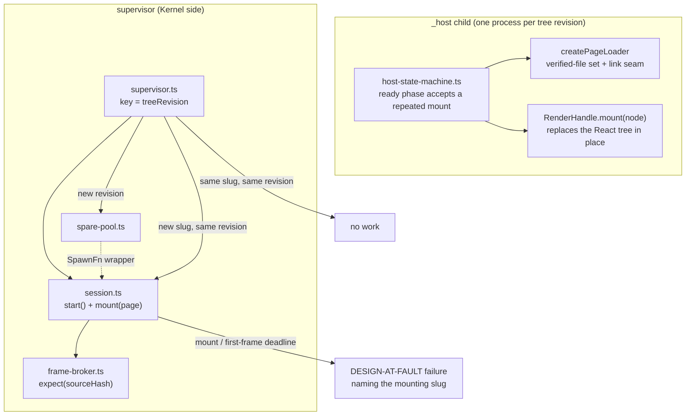
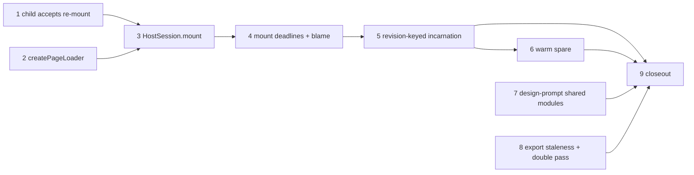

# Design tree — phase 3 — host O2 — Implementation Plan

> **For agentic workers:** REQUIRED SUB-SKILL: Use superpowers:subagent-driven-development
> (recommended) or superpowers:executing-plans to implement this plan task-by-task. Steps use
> checkbox (`- [ ]`) syntax for tracking. Load `/reatom` and `/errore` before any code-related
> action (CLAUDE.md mandate). Every task ends green and is one commit.

**Goal:** Implement design §9 and §11 — make a preview incarnation belong to a TREE REVISION
rather than to a page, so switching pages re-mounts inside the live process instead of respawning
one; keep a warm spare so a revision change pays no spawn; give the mount and the first frame
after it deadlines that blame the page being mounted; and finish the export package's
`design-prompt.md` with the shared-module section §11 asks for.

**Scope:** plan 3 of the four the spec's §14 decomposes into
(`docs/superpowers/specs/2026-07-28-multi-file-design-tree-design.md`). Plans 1, 1b and 2 are
landed (`c8c623c..9219b9e`, `1cc6431..d57c2a3`, `802a980..72d003d`, `0360b94..70a29dd`). This plan
touches neither the Gate nor the closure graph: plan 2 already owns everything §7 and §8 asked
for, and this plan consumes its output (`treeRevision` on `HostSessionSpec`) without changing it.

**This plan inherits ONE decision from plan 2 rather than re-deciding it.** Plan 2 Task 10 moved
the supervisor's session key to `(pageSlug, treeRevision)` ahead of this plan, because §7's
preview-session row was undeliverable without it. §9.2's own key is `treeRevision` ALONE — one
incarnation serving the whole tree, one page mounted at a time. Task 5 completes that move; the
argument for why the key had to change at all is settled and is not re-opened here.

**What §9 gets wrong about the current code, corrected here rather than discovered mid-task.**
§9.3 says "the frame broker and relay (`frame-broker.ts`, `preview-relay.ts`) are unchanged".
`preview-relay.ts` is indeed unchanged. `frame-broker.ts` is NOT and cannot be:
`createFrameBroker` takes a `{sessionId, nonce, sourceHash}` guard fixed at construction
(`host/supervisor/model/frame-broker.ts:14-18`) and rejects any frame whose `sourceHash` differs
(`:33-39`). That guard is correct exactly while an incarnation renders one page forever, which is
the invariant §9.2 retires. Task 3 gives the broker one new method and says why.

**Architecture:** no new top-level module and no new ring edge. Two seams appear inside `host`:

- `host/session/model/source-mount.ts` stops exporting a free `loadPage` function and exports
  `createPageLoader(deps)` instead — one loader per incarnation, owning both the set of tree files
  this incarnation has already hash-verified and the `link` seam §9.5 asks for (today
  `import(absPath)`, tomorrow an in-process module registry, with nothing else touched).
- `host/supervisor/model/spare-pool.ts` holds pre-spawned, un-handshaked children and is injected
  into the supervisor as a `SpawnFn` wrapper, so `session.ts` never learns a spare exists.



**Tech Stack:** TypeScript 7.0.2 on Bun ≥1.3.14, `@opentui/core`+`@opentui/react` 0.4.5,
`@reatom/core` ^1001.1.0, `errore` ^0.14.1, `zod` ^4.4.3, `oxlint` 1.74.0, `oxfmt` 0.59.0.
No new dependencies.

## Global Constraints

Inherited from `CLAUDE.md` and carried verbatim from plans 1, 1b and 2. Every task implicitly
includes this section.

- **Test runner is `bun run test`** (`scripts/run-tests.ts`), never a bare `bun test` whose crash
  reads as a pass. Tests live beside the file under test (`foo.ts` → `foo.test.ts`). Typecheck
  with `bun x tsc --noEmit`. Lint/format: `bun run lint` / `bun run fmt:check`.
- **Run the suite in the FOREGROUND with a plain redirect and a 600000 ms timeout**, then read
  the file: `rtk bun run test > "<scratchpad>/suite-taskN.txt" 2>&1`. A background run piped
  through `tail` produces an empty file until the stream ends and costs three turns.
- **`src/ui` and `src/entrypoint` run in SEPARATE commands.** The OpenTUI render tests flake
  under load when the two are combined.
- **errore is mandatory**: namespace import (`import * as errore from "errore"`), errors as
  values (`Error | T` unions), `createTaggedError` for domain errors, `.catch()`/`errore.try`
  only at uncontrolled boundaries, flat control flow, `if (x instanceof Error) return x` on one
  line with no block, `| null` for optional values, never swallow an error without logging it.
- **Reatom v1001**: named atoms/computeds/actions; `wrap(...)` at every async boundary that
  touches an atom afterwards; never an async IIFE wrapping an `await` — keep the call flat.
- **Module DAG** (`docs/architecture/code-structure.md`): `core` imports only `entities/` and its
  own `ports/`; `gate`, `store`, `host` may import `entities/`; **`host` may not import `store`
  or `gate`**; `entities/` submodules import nothing but each other and `infrastructure/`.
- **Module folder shape** (`CLAUDE.md`): `ui/`, `model/`, `types.ts`, `index.ts`; code always
  inside subfolders, never loose at a module root; atomic single-purpose functions.
- **Imports**: cross-module imports use the `tsconfig.json` path aliases, never a relative path
  climbing out of the module. Never alias under `@termcraft/*`.
- **Factories are named `create*`, never `make*`.**
- **Design is a source of truth**: colours, layout, glyphs and copy come from
  `design/termcraft-engine.js` and `design/*.dc.html`. This plan touches one user-visible surface
  (`wsHostCrash`'s reachability, Task 4) and changes no pixel of it.
- **Honest values only**: a value with no source is an explicit documented placeholder or an
  honest empty, never a fabrication. **This plan's sharpest instance:** a frame whose `sourceHash`
  names a page this incarnation never mounted is a protocol violation, not a frame to display —
  widening the guard to "any hash" would be the fabrication.
- **No optional input with a production fallback.** If a caller must decide something, the field
  is REQUIRED and the caller decides.
- **Language**: all code, comments, plans and commit messages in English.
- **Commits**: one per task, `feat:`/`fix:`/`docs:`/`test:`/`refactor:`/`chore:`/`perf:` prefix,
  each ending with the `Co-Authored-By: Claude Opus 5 (1M context) <noreply@anthropic.com>`
  trailer. `rtk git commit` swallows heredoc stdin — write the message to the scratchpad and pass
  `-F <path>`.
- **Never `git stash` inside a subagent.**
- **Run `/reatom-audit` before reporting the work done** (Task 9). Audit by EXPLICIT PATH, not
  `--changed`: the router consumes its cache and a second `--changed` run reports "already
  audited" without auditing.

### Vocabulary

Carried from plans 1 and 2, plus the five terms this plan makes load-bearing.

| term | meaning |
| --- | --- |
| **tree-relative path** | a forward-slash path relative to `design/`, e.g. `pages/dashboard.tsx`. Never carries the `design/` prefix. |
| **closure** | the transitive set of tree-relative paths one entry reaches, including the entry itself, sorted. |
| **treeRevision** | Merkle hash over the ENTIRE `design/` inventory — `entities/design-tree`'s `computeTreeRevision`. Already on `HostSessionSpec` (`host/types.ts:68`). |
| **incarnation** | ONE `_host --stdio` child process. After this plan it belongs to a tree revision, not to a page. |
| **session key** | what `supervisor.ts`'s `keys` map is keyed by. Becomes `treeRevision` (Task 5). |
| **restart key** | what `restart-policy.ts`'s budget and circuit are keyed by. Becomes `` `${treeRevision} ${mountingSlug}` `` (§9.2, Task 5). These are DIFFERENT keys and the code must name them differently. |
| **adoption** | a spare child becoming a real incarnation: the supervisor sends `client.hello` to an already-booted process instead of spawning one. |

---

## What this plan read before it was written

Every claim below was READ at `0ca25dd` on branch `design-tree` and is cited by file and symbol.
Nothing here is a benchmark: the two claims that need a stopwatch are named as such, and the tasks
that turn on them measure before deciding. **Re-read rather than trusting a line number if a
task's decision turns on one.**

1. **The child already has everything a repeated mount needs except permission.**
   `RenderHandle.mount(node)` is documented as "Mount (or **replace**) the React tree to render"
   (`host/render/types.ts:49-50`) and `createHeadlessRenderer`'s implementation re-creates the
   error sink on every `mount` so "a fresh tree gets a clean verdict"
   (`host/render/model/renderer.ts:33-41`). A second `createCliRenderer` in one process is
   therefore NEVER needed: a page switch reuses the live handle. The only thing standing in the
   way is `receiveControlPayload`'s phase gate, which accepts `mount` in `awaiting-mount` and
   nowhere else (`host/session/model/host-state-machine.ts:68-79`).
2. **The host emits the first frame SYNCHRONOUSLY after `ready`, in the same block.**
   `handleMount` renders, checks `renderError()`, captures, sends `ready`, then calls `emitFrame`
   (`host-state-machine.ts:197-261`). So for OUR host the interesting deadline is
   mount→`ready`; the ready→first-frame deadline §9.4 also asks for is a conformance guard
   against a host that is not this one. Task 4 implements both and says which is which.
3. **A correlated `mount` cannot ride the generic request-table timeout.**
   `createRequestTable`'s default is `QUERY_TIMEOUT_MS = 2_000` (`request-table.ts:10, 30`) and a
   timeout also feeds the heartbeat watchdog's unresponsiveness counter (`session.ts:73-75`). A
   10 s mount registered at the default would be declared timed out at 2 s AND would push the
   incarnation towards `HEARTBEAT_TIMEOUT`. Task 3 adds a per-request timeout override.
4. **The frame-identity check is fatal on `sourceHash` in two places.** `session.ts`'s
   `checkFrameIdentity` (`:487-499`) compares `frame.sourceHash !== identity.sourceHash` and any
   mismatch routes to `onPumpFatal`; `frame-broker.ts`'s guard (`:33-39`) rejects the same frame
   as `"stale"`, which `runPump` (`:316-324`) then ALSO treats as fatal. Both must learn that a
   mount moves the expected hash, or the first page switch kills the incarnation with
   `MALFORMED_PROTOCOL`.
5. **stdout is a single ordered stream, so there is no reordering window.** Frames and control
   envelopes share one `readInbound` iterator (`session.ts:193, 286`). The child writes
   `ready` before the new page's first frame (claim 2), and every frame of the OLD page was
   written before it processed the mount at all. Re-seeding the expected hash when the pump SEES
   the mount's `ready` — not when the supervisor SENDS the mount — is therefore exactly right,
   and is why Task 3 handles that envelope inline in the pump instead of through a `.then`.
6. **`kitApiVersion` is verified once, at handshake, against the spec.**
   `verifyHostHello` checks `hostHello.runtimeDeclaration.supportedKitApiVersions.includes(
   inputs.spec.kitApiVersion)` (`handshake.ts:88-93`). With one incarnation per revision the
   mounted page changes under a fixed handshake, so that check must be re-run per mount or a page
   declaring an unsupported `kitApiVersion` would mount unchecked.
7. **A displaced session is already closed; nothing leaks today.** `kernel.ts`'s
   `setActivePreviewSession` closes `previous` when `previous !== session` (`:636-640`) with a
   logged failure. After Task 5 a page switch returns the SAME session object for the same
   revision, so that branch does not fire and the live incarnation is not torn down — which is
   the whole point. A REVISION change still returns a different object and still closes the old
   one.
8. **`client.hello` carries the page, so a spare cannot be handshaked without knowing it.**
   `clientHelloSchema` is a `z.strictObject` requiring `mode`, `pageSlug`, `sourceHash` and
   `sourceKitApiVersion` (`host/protocol/model/hello.ts:50-60`). §9.3 says the spare is "booted,
   handshaked"; Task 6 ships a booted-but-not-handshaked spare and argues the divergence
   explicitly rather than revising the wire schema for it.
9. **The UI shows `wsHostUnavailable`, not `wsHostCrash`, for a mount timeout today.**
   `isDesignRenderFailure` returns true only for `hostFailureCode === "DESIGN_RENDER_FAILED"`
   (`ui/preview/model/failure-class.ts:8, 24-26`), and `MOUNT_TIMEOUT` is bucketed as
   `HOST_START_FAILED` (`host/adapters/host-supervisor.ts:86-98`). §9.4 requires the opposite for
   a hang. Task 4 owns that one-line widening and its justification.
10. **§11's package shape is already landed; only the prompt section is left.**
    `assembleExportPackage` already ships `design/<relPath>` for every tree file and
    `closures/<slug>.json` per page (`core/export/model/package.ts:232-239`), and its own header
    records "`design-prompt.md`'s own shared-module section (design §11) is PLAN 3's" (`:26-28`).
11. **Two ledger rows name this plan as their owner.** `docs/superpowers/red-debt.md:858`
    (`export.start` runs two whole-tree passes, and a third whole-tree reader still exists) and
    `:877` (`publish.ts`'s `settingsStillMatch` never compares `expectedFiles`/`closureHash`).
    Task 8 owns both.

**Two things this plan must MEASURE, not read** — each inside the task that turns on it:

- **M1 (Task 5, Step 6):** the wall-clock cost of a page switch before and after. Today it is a
  full spawn + handshake + mount; the median handshake alone was measured at ~544 ms and the
  slowest at 1799 ms (`host/supervisor/model/timeouts.ts:12-16`). Record both numbers; if the
  in-process switch is not materially faster, say so in the task report rather than asserting the
  headline.
- **M2 (Task 6, Step 1):** how much of a cold start a spare actually removes. The spare is not
  handshaked (claim 8), so it removes the child's own boot and nothing else. If that is not the
  dominant term, the warm spare is not worth its complexity and the task says so instead of
  shipping it.

---

## Task order and dependencies

Tasks 1 and 2 are inside the child and are independent of everything else — nothing sends a second
mount until Task 3, so both land green with no behaviour change on the supervisor side. Task 3 is
the supervisor-side counterpart and needs 1. Task 4 needs 3. Task 5 is the one that turns the
capability on. Task 6 rides on 5. Tasks 7 and 8 are export-side and independent of 1-6. Task 9
closes.



**The acceptance bar is real green, from Task 1 onward.** There is no red window in this plan. Any
failure is the current task's until proven otherwise — and `lexer.oracle.test.ts`'s fuzz corpus
remains the known trigger for an intermittent `Bun.Transpiler` segfault, which `run-tests.ts`
reports as `crashed`. A crashed run gets exactly one re-run and is never recorded as green.

---

### Task 1: The child accepts a repeated `mount` in the ready phase

Design §9.2: "the ready phase accepts a repeated `mount <slug>`, which additionally verifies that
the page's closure is a subset of the already-verified tree, and implicitly unmounts the previous
page."

This task changes the CHILD only. After it, a second `mount` is legal on the wire and does the
right thing; nothing sends one yet, so the observable behaviour of the app is unchanged and the
task is green on its own.

**Files:**
- Modify: `src/host/session/model/host-state-machine.ts` — the phase gate (`:68-79`),
  `handleMount` (`:182-274`), and the module doc block.
- Test: `src/host/session/model/host-state-machine.test.ts` (if that file does not exist, the
  state machine's existing suite — find it with
  `rg -l "createHostSession" src/host/session src/host/types.test.ts` and add to whichever drives
  `receiveControlPayload` directly; do NOT create a second harness).

**Interfaces:**
- Consumes: nothing new. `deps.loadPage`, `deps.createRenderer` unchanged in this task.
- Produces: no signature change. `mount` becomes accepted in phase `ready`; the second and later
  mounts REUSE the live `RenderHandle` rather than creating one.

- [ ] **Step 1: Write the failing tests**

In the state-machine suite, beside the existing mount cases:

```ts
test("a second mount in the ready phase is accepted and re-mounts the live renderer", async () => {
  const harness = createHarness(); // whatever the file's existing helper is named
  await harness.hello();
  await harness.mount({ entryRelPath: "pages/a.tsx", requestId: "1" });
  const rendererCount = harness.createdRenderers.length;

  await harness.mount({ entryRelPath: "pages/b.tsx", requestId: "2" });

  // exactly one renderer for the whole incarnation
  expect(harness.createdRenderers.length).toBe(rendererCount);
  // the live handle was told to replace its tree
  expect(harness.renderer.mountCalls).toBe(2);
  // the ready response correlates to the SECOND request
  const ready = harness.sent.filter((m) => m.payload.kind === "ready").at(-1);
  expect(ready?.payload.responseTo).toBe("2");
});

test("frames after a re-mount carry the NEW page's source hash and a higher frameSeq", async () => {
  const harness = createHarness();
  await harness.hello();
  await harness.mount({ entryRelPath: "pages/a.tsx", requestId: "1", sha256: A_HASH });
  const first = harness.frames.at(-1)!;

  await harness.mount({ entryRelPath: "pages/b.tsx", requestId: "2", sha256: B_HASH });
  const second = harness.frames.at(-1)!;

  expect(first.sourceHash).toBe(A_HASH);
  expect(second.sourceHash).toBe(B_HASH);
  expect(BigInt(second.frameSeq) > BigInt(first.frameSeq)).toBe(true);
});

test("a re-mount at a different size resizes the live renderer, it does not rebuild it", async () => {
  const harness = createHarness();
  await harness.hello();
  await harness.mount({ entryRelPath: "pages/a.tsx", requestId: "1", size: { w: 80, h: 24 } });
  await harness.mount({ entryRelPath: "pages/b.tsx", requestId: "2", size: { w: 100, h: 30 } });

  expect(harness.createdRenderers.length).toBe(1);
  expect(harness.renderer.resizeCalls).toEqual([{ w: 100, h: 30 }]);
  expect(harness.frames.at(-1)).toMatchObject({ width: 100, height: 30 });
});

test("a re-mount whose page throws while rendering fails THAT mount, not the earlier one", async () => {
  const harness = createHarness();
  await harness.hello();
  await harness.mount({ entryRelPath: "pages/a.tsx", requestId: "1" });
  harness.renderer.nextRenderError = new Error("boom");

  await harness.mount({ entryRelPath: "pages/b.tsx", requestId: "2" });

  const error = harness.sent.filter((m) => m.payload.kind === "error").at(-1);
  expect(error?.payload.body.code).toBe("PAGE_RENDER_FAILED");
  expect(harness.exitRequests.at(-1)?.code).toBe(1);
});

test("a smoke mount still exits after its first frame and never accepts a second", async () => {
  const harness = createHarness();
  await harness.hello();
  await harness.mount({ entryRelPath: "pages/a.tsx", requestId: "1", mode: "smoke" });
  expect(harness.exitRequests.at(-1)?.code).toBe(0);

  await harness.mount({ entryRelPath: "pages/b.tsx", requestId: "2", mode: "smoke" });
  // phase is "closed": the payload is dropped, no second ready, no second exit request
  expect(harness.sent.filter((m) => m.payload.kind === "ready").length).toBe(1);
  expect(harness.exitRequests.length).toBe(1);
});
```

If the existing harness does not expose `createdRenderers`/`mountCalls`/`resizeCalls`/
`nextRenderError`, extend the harness's fake `RenderHandle` — do not introduce a second fake.

- [ ] **Step 2: Run them to verify they fail**

Run: `bun test src/host/session/`
Expected: FAIL — the second `mount` is refused with `MALFORMED_PROTOCOL` ("kind \"mount\" is not
accepted in phase ready"). The smoke case already passes; that is the point of it.

- [ ] **Step 3: Accept `mount` in the ready phase**

In `receiveControlPayload`'s `ready` branch (`:73-79`), add `mount` as the FIRST accepted kind so
the ordering reads mount-then-everything-else in both phases:

```ts
// phase === "ready"
// A REPEATED MOUNT IS A PAGE SWITCH (design §9.2). An incarnation belongs to a tree revision
// now, not to a page: mounting a second entry implicitly unmounts the first, reuses the live
// renderer, and keeps this process's module registry — which is exactly why a switch is cheap
// and exactly why module-level state in a shared module crosses pages (§9.5).
if (envelope.kind === "mount") return handleMount(envelope);
if (envelope.kind === "resize") return handleResize(envelope);
```

- [ ] **Step 4: Make `handleMount` re-entrant**

Replace the renderer-creation block (`:197-202`) with a reuse-or-create branch, and nothing else
in the handler changes:

```ts
    // REUSE THE LIVE HANDLE, NEVER A SECOND RENDERER. `RenderHandle.mount` is documented as
    // "mount (or replace) the React tree" and re-creates its error sink per call
    // (`render/model/renderer.ts:33-41`), so a page switch is a tree replace plus, when the
    // requested viewport moved, a resize of the SAME renderer. Creating a second
    // `createCliRenderer` in one process is never needed and is not attempted.
    //
    // WHAT A SWITCH DOES AND DOES NOT PRESERVE (design §9.5, stated so it is not found as a
    // bug): React unmounts the previous page's tree, so component-local state is gone. Every
    // module-scope Reatom atom — in the page's own module and in every shared module it
    // imports — survives, because the module registry is untouched. That is the idiomatic
    // shape in this runtime, which is why §9.5 can say the page is "as you left it".
    const handle = renderer ?? (await deps.createRenderer(request.size));
    if (renderer !== null && (lastSize.w !== request.size.w || lastSize.h !== request.size.h)) {
      handle.resize(request.size);
    }
    renderer = handle;
    lastSize = request.size;
    sourceHash = loaded.sourceHash;
    mountedMode = request.mode;
```

Add the one new module-level `let` beside `sourceHash` (`:43`):

```ts
  // The size the live renderer is currently at. `createRenderer(size)` sets it on the first
  // mount; a later mount at a different size resizes rather than rebuilding. Tracked here and
  // not read back off the handle because `RenderHandle` exposes no size getter.
  let lastSize: Size = { w: 0, h: 0 };
```

`Size` is already importable from `../../types` (the file imports `HostMode`/`InteractionMode`
from there).

`handleResize` must keep `lastSize` honest — add `lastSize = size;` immediately after
`renderer.resize(size)` (`:424`).

- [ ] **Step 5: Extend the module doc block**

`createHostSession`'s header (`:28-36`) says state transitions are serialized and describes a
single mount. Add:

```
 * PHASE `ready` ACCEPTS A REPEATED `mount` (design §9.2, phase 3). An incarnation is keyed by
 * TREE REVISION on the supervisor side, so one process serves every page of one revision and a
 * page switch is a second `mount` rather than a second process. Each mount replaces the React
 * tree in the live renderer, re-seeds `sourceHash` so subsequent frames name the new page, and
 * keeps `frameCounter` running — `frameSeq` stays strictly monotonic across the switch, which
 * is what lets the supervisor's broker keep its ordering guard unchanged.
 *
 * `smoke`/`export` are unaffected: both request exit at the end of their FIRST mount and the
 * phase is `closed` before any second envelope could be read.
```

- [ ] **Step 6: Run the tests**

Run: `bun test src/host/ && bun x tsc --noEmit`
Expected: PASS, `tsc` silent.

- [ ] **Step 7: Full suite and commit**

```bash
rtk bun run test > "<scratchpad>/suite-task1.txt" 2>&1   # foreground, 600000 ms timeout
bun run lint && bun run fmt:check
rtk git add src/host && rtk git commit -F "<scratchpad>/task1-msg.txt"
```

Subject: `feat(host): accept a repeated mount in the ready phase`

---

### Task 2: `createPageLoader` — one loader per incarnation, with the module-link seam

Two design requirements land together because they live in the same function.

§9.2: "on load, the host verifies **every** file in the tree against the revision's inventory
hashes; the ready phase accepts a repeated `mount <slug>`, which additionally verifies that the
page's closure is a subset of the already-verified tree."

§9.5: "Loading modules stays behind a seam in the host so a future in-process module registry
(own transpile + own `Map`-backed linker, invalidating changed modules and their importers by
reverse edge) can replace `import()` without touching anything else."

**THE ONE DELIBERATE DIVERGENCE FROM §9.2's LITERAL WORDING, and its argument.** §9.2 says the
host verifies *every file in the tree* at load. This task verifies every file *any mounted page
reaches*, incrementally, and remembers what it has verified. The guarantee is identical where it
matters — no byte is linked that was not hash-verified against the revision's inventory first —
and the difference is that an asset or an unreachable module nobody imports is never read. Reading
it would contradict §9.1's own governing principle ("invalidate eagerly, materialize **lazily**,
keep capacity warm") by putting the whole tree on the critical path of the first frame, which is
the cost §9.1 exists to avoid. The subset check §9.2 asks for is what `readClosure` already
enforces: a closure member absent from `expectedFiles` is `MALFORMED_PROTOCOL`
(`source-mount.ts:330-335`).

**AND WHY A VERIFIED MEMBER IS NOT RE-READ.** Once a file has been linked, `import()` serves the
cached module for the rest of the process. Re-reading its bytes on a later mount can only produce
a hash for bytes that are *not what is running* — so a "drift" found there would be reported
against code the incarnation is not executing. The honest answer to a tree that moved under a live
incarnation is that the revision moved, which closes this incarnation outright (Task 5). Record
this at the call site; it is a decision, not an optimisation.

**Files:**
- Modify: `src/host/session/model/source-mount.ts` — `loadPage` becomes `createPageLoader`;
  `createTreePathVerifier` and the verified-file set move inside it; `import()` becomes
  `deps.link`.
- Modify: `src/host/session/model/entry.ts:72-97` — build the loader once per process.
- Modify: `src/host/session/index.ts` — export `createPageLoader`, drop the free `loadPage`.
- Test: `src/host/session/model/source-mount.test.ts`.

**Interfaces:**
- Produces:
  ```ts
  export interface PageLoaderDeps {
    /** Link one absolute module path. Defaults to `(absPath) => import(absPath)`. §9.5's seam. */
    readonly link: (absolutePath: string) => Promise<unknown>;
    /** `node:fs/promises`' `lstat`, injected so the symlink refusal is testable. */
    readonly lstat: (path: string) => Promise<Stats>;
  }

  export function createPageLoader(
    deps: PageLoaderDeps,
  ): (args: LoadPageArgs) => Promise<ProtocolError | LoadedPage>;
  ```
  Both fields are REQUIRED (global constraint: no optional input with a production fallback).
  `entry.ts` supplies `link: (absolutePath) => import(absolutePath)` and `lstat` explicitly.
- The returned function's signature is byte-identical to today's `loadPage`, so
  `HostSessionDeps.loadPage` (`host/session/types.ts:135`) is unchanged.

- [ ] **Step 1: Write the failing tests**

In `src/host/session/model/source-mount.test.ts`:

```ts
test("a second load of a page sharing a module re-reads only what it has not verified", async () => {
  const reads: string[] = [];
  const loader = createPageLoader({
    link: async () => ({ meta: META, default: () => null }),
    lstat: fakeLstat,
  });
  // fixture tree: pages/a.tsx and pages/b.tsx both import ../lib/theme.ts
  await withCountedReads(reads, () => loader({ treeRoot, entryRelPath: "pages/a.tsx", expectedFiles }));
  reads.length = 0;
  await withCountedReads(reads, () => loader({ treeRoot, entryRelPath: "pages/b.tsx", expectedFiles }));

  expect(reads).toContain("pages/b.tsx");
  expect(reads).not.toContain("lib/theme.ts"); // verified during the first load
});

test("two loaders never share a verified set", async () => {
  // the same two loads through TWO createPageLoader calls re-read lib/theme.ts
});

test("a closure member absent from expectedFiles is still refused on the SECOND load", async () => {
  // pages/b.tsx imports ../lib/missing.ts, which the inventory does not list
  const result = await loader({ treeRoot, entryRelPath: "pages/b.tsx", expectedFiles });
  expect(result).toBeInstanceOf(ProtocolError);
  expect(String((result as ProtocolError).code)).toBe("MALFORMED_PROTOCOL");
});

test("link is the only route to page code, and it receives the entry's ABSOLUTE path", async () => {
  const linked: string[] = [];
  const loader = createPageLoader({
    link: async (absolutePath) => {
      linked.push(absolutePath);
      return { meta: META, default: () => null };
    },
    lstat: fakeLstat,
  });
  await loader({ treeRoot, entryRelPath: "pages/a.tsx", expectedFiles });
  expect(linked).toEqual([`${treeRoot}/pages/a.tsx`]);
});

test("a link rejection is a typed ProtocolError carrying its cause, never a throw", async () => {
  const cause = new Error("link exploded");
  const loader = createPageLoader({ link: async () => { throw cause; }, lstat: fakeLstat });
  const result = await loader({ treeRoot, entryRelPath: "pages/a.tsx", expectedFiles });
  expect(result).toBeInstanceOf(ProtocolError);
  expect((result as ProtocolError).cause).toBe(cause);
});
```

Keep every existing `loadPage` test: re-point it at `createPageLoader({ link: realImportSeam,
lstat })(...)` rather than deleting it. The hash-mismatch, symlink, UTF-8, unparseable-source and
closure-disagreement cases are the perimeter this file exists for and none of them may lose
coverage.

- [ ] **Step 2: Run to verify they fail**

Run: `bun test src/host/session/model/source-mount.test.ts`
Expected: FAIL — `createPageLoader` does not exist.

- [ ] **Step 3: Build the loader**

`createPageLoader` closes over exactly two pieces of per-incarnation state and returns the same
function body `loadPage` has today, with three changes:

1. `const verifyPath = createTreePathVerifier({ lstat: deps.lstat })` moves OUT of the body and
   into the factory, so its prefix memo now spans the incarnation rather than one mount. Update
   its doc block: the "PER CALL, NEVER MODULE-LEVEL" paragraph (`:186-193`) becomes "PER
   INCARNATION, NEVER MODULE-LEVEL", and the soundness argument is the same one, one scope wider —
   a memo that outlived the INCARNATION would answer for a tree revision that has been replaced,
   and an incarnation does not outlive its revision (Task 5).
2. A `verified: Map<string, string>` (tree-relative path → the sha256 this incarnation proved)
   lives beside it. `readClosure`'s loop consults it before reading:

   ```ts
   const alreadyVerified = verified.get(relPath);
   if (alreadyVerified !== undefined) {
     if (alreadyVerified !== expectedSha256) {
       // The SAME path with a DIFFERENT expected hash means the caller handed this
       // incarnation two different tree revisions. That is a supervisor bug, not a drifted
       // file: an incarnation is keyed by revision (design §9.2) and its inventory is fixed
       // for its whole life. Refuse loudly rather than link a module verified against
       // somebody else's inventory.
       return sourceHashMismatch(
         `${relPath} was verified as ${alreadyVerified} earlier in this incarnation but this mount expects ${expectedSha256}`,
       );
     }
     const cached = readCache.get(relPath);
     if (cached !== undefined) { read.set(relPath, cached); for (...edges...) ; continue; }
   }
   ```

   Keep the decoded `ReadTreeFileV1` (its `edges` in particular) in a companion
   `readCache: Map<string, ReadTreeFileV1>` so the closure re-derivation in step 4 of `loadPage`'s
   own docblock still has every member's edges without a second read. Record on `verified` itself
   the paragraph "AND WHY A VERIFIED MEMBER IS NOT RE-READ" above, in full.
3. `await import(absoluteEntry)` becomes `await deps.link(absoluteEntry)`, with the `.catch`
   wrapper unchanged:

   ```ts
   // §9.5's SEAM, and the only route page code takes into this process. Today it is `import()`;
   // an in-process module registry (own transpile + own Map-backed linker, invalidating changed
   // modules and their importers by reverse edge) replaces THIS ONE FUNCTION and nothing else.
   // That registry is deliberately not built: its only gain over the revision-keyed incarnation
   // is avoiding one respawn per edit, and the warm spare already pre-pays that cost.
   const linked = await deps.link(absoluteEntry).catch((cause) =>
     malformed(`failed to link page at ${args.entryRelPath}`, cause),
   );
   ```

Update `loadPage`'s numbered docblock (`:353-378`) so step 1 reads "reading and hash-verifying
every member THIS INCARNATION HAS NOT ALREADY PROVED" and step 5 names the seam.

- [ ] **Step 4: Rewire the entry**

`entry.ts` (`:72-97`) builds the loader once, outside `createHostSession`, and keeps the
warm-up/denial pair exactly where it is — that placement is a measured decision (task-10) and
this task must not move it:

```ts
  // ONE LOADER PER PROCESS = one per incarnation (design §9.2): its verified-file set and its
  // symlink memo are facts about THIS tree revision, and the process serves exactly one.
  const load = createPageLoader({
    link: (absolutePath) => import(absolutePath),
    lstat,
  });

  const session = createHostSession({
    ...
    loadPage: (args) => {
      warmPageMetaValidator();
      denyDynamicCodeCapability();
      return load(args);
    },
```

`lstat` is imported from `node:fs/promises` in `entry.ts` (module import form: `import fs from
"node:fs/promises"` then `fs.lstat`, per the errore TypeScript rules).

**Check the second caller.** `rg -n "loadPage" src` before finishing: if anything besides
`entry.ts` and the tests imported the free function, convert it the same way. Do not leave a
compatibility re-export — a second construction path is exactly the "two readings of what this
file is" the perimeter has already paid for once.

- [ ] **Step 5: Run the tests**

Run: `bun test src/host/ && bun test src/entrypoint/ && bun x tsc --noEmit`
Expected: PASS, `tsc` silent.

- [ ] **Step 6: Full suite and commit**

Subject: `refactor(host): one page loader per incarnation, with the module-link seam`

---

### Task 3: `HostSession.mount()` — a correlated mount in the ready phase

The supervisor-side counterpart to Task 1. After this task a live incarnation can be told to show
a different page; nothing calls it yet except its own tests, so the task is green on its own.

**THE ORDERING THIS TASK RESTS ON** (read-claim 5): stdout is one ordered stream, the child writes
`ready` before the new page's first frame, and every frame of the previous page was written before
the child even read the mount. So the expected source hash must move when the pump SEES the
mount's `ready`, not when `mount()` sends it. That is why the pump handles that one envelope
inline instead of leaving it to the request table's `.then` — a microtask boundary between the
`ready` and the frame that follows it is exactly the window a stale-guard failure would open, and
`runPump` treats such a failure as fatal (`session.ts:316-324`).

**Files:**
- Modify: `src/host/supervisor/model/frame-broker.ts` — `expect(sourceHash)`.
- Modify: `src/host/supervisor/model/request-table.ts` — a per-request timeout override.
- Modify: `src/host/supervisor/types.ts` — `FrameBroker.expect`, `RequestTable.register`'s third
  parameter, `HostSession.mount`, and `HostSessionSpec`'s header note about identity.
- Modify: `src/host/supervisor/model/session.ts` — the mount request id, the pending-mount hook in
  `runPump`, `checkFrameIdentity`, the `identity` getter, and the per-mount kit-API re-check.
- Test: `frame-broker.test.ts`, `request-table.test.ts`, `session.test.ts`.

**Interfaces:**
- Produces:
  ```ts
  /** Re-seed the incarnation guard's expected source hash after an accepted mount (§9.2). */
  expect(sourceHash: string): void;                       // FrameBroker

  register(                                               // RequestTable
    requestId: string,
    kind: string,
    timeoutMs?: number,
  ): Promise<ControlEnvelope | ProtocolError | SupervisorError>;

  /** What one page switch has to name. Declared in `host/supervisor/types.ts`. */
  export interface MountPageV1 {
    readonly pageSlug: string;
    readonly entryRelPath: string;
    readonly sourceHash: string;
    readonly kitApiVersion: number;
    readonly size: Size;
    readonly interactionMode: InteractionMode;
    readonly theme: string;
  }

  /**                                                     // HostSession
   * Mount a different page in this live incarnation (design §9.2). Only valid from `ready`.
   * Resolves once the correlated `ready` has arrived; the first frame after it is awaited under
   * its own deadline by Task 4, not by this promise.
   */
  mount(page: MountPageV1): Promise<ProtocolError | SupervisorError | ControlEnvelope>;
  ```
- `HostSession.identity` becomes a GETTER whose `pageSlug`/`sourceHash`/`kitApiVersion` describe
  the CURRENTLY MOUNTED page; `sessionId`/`nonce`/`mode` are unchanged for the incarnation's life.

- [ ] **Step 1: Write the failing tests**

`frame-broker.test.ts`:

```ts
test("expect() re-seeds the source-hash guard and keeps the monotonic frameSeq", () => {
  const broker = createFrameBroker({ sessionId: S, nonce: N, sourceHash: A });
  expect(broker.publish(frameOf({ sourceHash: A, frameSeq: "5" }))).toBe("accepted");
  expect(broker.publish(frameOf({ sourceHash: B, frameSeq: "6" }))).toBe("stale"); // not yet expected
  broker.expect(B);
  expect(broker.publish(frameOf({ sourceHash: A, frameSeq: "7" }))).toBe("stale"); // no longer expected
  expect(broker.publish(frameOf({ sourceHash: B, frameSeq: "7" }))).toBe("accepted");
  expect(broker.publish(frameOf({ sourceHash: B, frameSeq: "7" }))).toBe("stale"); // seq still guards
});
```

`request-table.test.ts`:

```ts
test("a per-request timeout overrides the 2s default and leaves other entries alone", async () => {
  const table = createRequestTable(clock);
  const slow = table.register("1", "mount", 10_000);
  const fast = table.register("2", "ping");
  clock.advance(2_001);
  expect(await fast).toBeInstanceOf(SupervisorError);
  expect(clock.pending()).toBe(1);
  clock.advance(8_000);
  expect(await slow).toBeInstanceOf(SupervisorError);
});
```

`session.test.ts` (drive the scripted child — the file already has a fixture for it):

```ts
test("mount() from ready sends a correlated mount and resolves on its ready", async () => {
  const session = await startedSession();          // the file's existing scripted-child helper
  child.scriptReadyFor("mount", { pageSlug: "b" });
  const result = await session.mount({
    pageSlug: "b",
    entryRelPath: "pages/b.tsx",
    sourceHash: B,
    kitApiVersion: 1,
    size: { w: 80, h: 24 },
    interactionMode: "static",
    theme: "dark-default",
  });
  expect(result).not.toBeInstanceOf(Error);
  const written = child.writtenEnvelopes.filter((e) => e.kind === "mount");
  expect(written.length).toBe(2);                  // start()'s mount + this one
  expect(written.at(-1)?.body.entryRelPath).toBe("pages/b.tsx");
  expect((result as ControlEnvelope).responseTo).toBe(written.at(-1)?.requestId);
});

test("a frame naming the NEW page is accepted only after its ready is observed", async () => {
  // script: ready(mount#1) frame(A) ... mount#2 ... frame(A) ready(mount#2) frame(B)
  // the trailing frame(A) BEFORE ready(mount#2) must be accepted, not fatal
  // frame(B) after ready(mount#2) must be accepted
  expect(session.phase).toBe("ready");
});

test("a frame naming a page this incarnation never mounted is still fatal", async () => {
  // frame(C) with an unmounted hash -> onFatal MALFORMED_PROTOCOL, child reaped
});

test("identity reports the currently mounted page and a stable sessionId/nonce", async () => {
  const before = { ...session.identity };
  await session.mount({ pageSlug: "b", sourceHash: B, ... });
  expect(session.identity.sessionId).toBe(before.sessionId);
  expect(session.identity.nonce).toBe(before.nonce);
  expect(session.identity.pageSlug).toBe("b");
  expect(session.identity.sourceHash).toBe(B);
});

test("mounting a page whose kitApiVersion the host does not support is refused, deterministically", async () => {
  const result = await session.mount({ ...page, kitApiVersion: 99 });
  expect(result).toBeInstanceOf(ProtocolError);
  expect(String((result as ProtocolError).code)).toBe("KIT_API_MISMATCH");
});

test("mount() before ready is refused without writing anything", async () => {
  // phase "created": TRANSPORT_ERROR, and the scripted child received no bytes
});
```

- [ ] **Step 2: Run to verify they fail**

Run: `bun test src/host/supervisor/`
Expected: FAIL — `expect`, the third `register` parameter and `mount` do not exist.

- [ ] **Step 3: The broker learns the hash can move**

`frame-broker.ts`: make the guard's `sourceHash` a mutable local seeded from the constructor
argument, add `expect`, and extend the header:

```ts
export function createFrameBroker(guard: {
  sessionId: string;
  nonce: string;
  sourceHash: string;
}): FrameBroker {
  // MUTABLE, AND §9.3's "frame-broker.ts is unchanged" DOES NOT SURVIVE (design-tree phase 3).
  // The construction-time guard was right exactly while an incarnation rendered one page for
  // its whole life. §9.2 retires that: one incarnation serves one tree REVISION and mounts a
  // page at a time, so the hash the guard expects moves on every accepted mount. `lastSeq` is
  // deliberately NOT reset — the child's frame counter runs across mounts, so monotonicity is
  // still the ordering oracle and a replayed older frame is still refused.
  let expectedSourceHash = guard.sourceHash;
```

`publish`'s guard reads `frame.sourceHash !== expectedSourceHash`; `expect` assigns it.

- [ ] **Step 4: The request table takes a per-request budget**

`register(requestId, kind, timeoutMs?)` uses `timeoutMs ?? tableTimeoutMs`. Update the interface
doc (`supervisor/types.ts:203-214`): "a 2 s `QUERY_TIMEOUT`" becomes "a `QUERY_TIMEOUT` at the
table's default budget, or at the per-request budget the caller named (`mount` names §9.4's mount
deadline, which is five times the default)".

- [ ] **Step 5: `session.ts` — the mount path**

Five changes, in this order:

1. **Keep what the handshake proved.** Store `negotiation.hostHello.runtimeDeclaration` in a
   module-level `let negotiatedDeclaration: RuntimeDeclarationBundleV1 | null = null` at
   `start()`'s negotiation step (`:239`). `mount()` re-runs `handshake.ts`'s membership check
   against it (read-claim 6) and returns `KIT_API_MISMATCH` — a `ProtocolError`, therefore
   deterministic, therefore circuit-opening (`restart-policy.ts:34`). That is right: a page whose
   kit API this host cannot serve will not become serveable by respawning.
2. **Track what is mounted.** Replace the `identity` const with a stable half and a mutable half:

   ```ts
   const stable = mintIdentity(spec, deps.sessionId);
   let mounted = {
     pageSlug: spec.pageSlug,
     sourceHash: spec.sourceHash,
     kitApiVersion: spec.kitApiVersion,
   };
   // Every hash this incarnation has legitimately mounted. `checkFrameIdentity` accepts any of
   // them: stdout is ordered, so the previous page's last frames arrive BEFORE the switch's
   // `ready`, and killing the child over a frame it was correct to send would turn every page
   // switch into a crash. A hash that was never mounted is still a violation — that is the part
   // of the guard worth keeping.
   const mountedHashes = new Set<string>([spec.sourceHash]);
   const identityOf = (): HostSessionIdentity => ({ ...stable, ...mounted });
   ```

   Every existing `identity.sessionId` / `identity.nonce` reference becomes `stable.sessionId` /
   `stable.nonce`; `identity.sourceHash` in `checkFrameIdentity` becomes the set membership test;
   the returned handle's `identity` becomes `get identity() { return identityOf(); }`.
3. **Expose the mount request id.** Extract the body of `sendRequest` into
   `sendRequestWithId(requestId, kind, body, timeoutMs?)` and keep `sendRequest` as
   `sendRequestWithId(nextRequestId(), kind, body)`. No behaviour change; `mount()` needs the id
   before the write so the pump can recognise the reply.
4. **A pending-mount hook in the pump.** In `runPump`'s control branch, BEFORE the generic
   `responseTo` routing (`:337-340`):

   ```ts
       // THE ONE ENVELOPE THE PUMP INSPECTS BEFORE ROUTING IT (design §9.2). A page switch's
       // `ready` is the exact wire position where the source hash the child stamps into frames
       // changes: everything before it belongs to the old page, everything after it to the new
       // one. Re-seeding here — synchronously, inside the same loop iteration that decoded it —
       // is what makes that true without a reordering window. Doing it from a `.then` on the
       // request table's promise would leave a microtask between this envelope and the frame
       // that follows it, and a frame that misses the guard is FATAL (below), not dropped.
       if (pendingMount !== null && envelope.responseTo === pendingMount.requestId) {
         if (envelope.kind === "ready") {
           mounted = pendingMount.mounted;
           mountedHashes.add(pendingMount.mounted.sourceHash);
           broker.expect(pendingMount.mounted.sourceHash);
         }
         pendingMount = null;
       }
   ```

   `pendingMount` is `{ requestId: string; mounted: { pageSlug; sourceHash; kitApiVersion } } |
   null`. A non-`ready` reply (the child's typed refusal) clears it without re-seeding, so the
   guard keeps naming the page that is actually on screen.
5. **`mount()` itself:**

   ```ts
   async function mount(page: MountPageV1): Promise<ProtocolError | SupervisorError | ControlEnvelope> {
     if (phase !== "ready" || child === null) {
       return new SupervisorError({
         code: "TRANSPORT_ERROR",
         reason: `mount requires a ready session (was "${phase}")`,
       });
     }
     const kitError = checkKitApiVersion(page.kitApiVersion);
     if (kitError instanceof ProtocolError) return kitError;

     const requestId = nextRequestId();
     pendingMount = {
       requestId,
       mounted: {
         pageSlug: page.pageSlug,
         sourceHash: page.sourceHash,
         kitApiVersion: page.kitApiVersion,
       },
     };
     const body = buildMountBody({ ...spec, ...page }, false);
     if (body instanceof ProtocolError) {
       pendingMount = null;
       return body;
     }
     return sendRequestWithId(requestId, "mount", body, MOUNT_TIMEOUT_MS);
   }
   ```

   `buildMountBody` is reused verbatim — it is what enforces "the session's identity hash agrees
   with the inventory's row for this entry" (`mount-request.ts:27-39`), and that invariant is
   exactly as load-bearing for the second mount as for the first. `deterministic` is `false`
   because a repeated mount only ever happens in `preview`/`historical` (smoke and export are
   one-shot), which is the same value `start()` computes for those modes.

- [ ] **Step 6: Run the tests**

Run: `bun test src/host/ && bun x tsc --noEmit`
Expected: PASS, `tsc` silent.

- [ ] **Step 7: Full suite and commit**

Subject: `feat(host): mount a different page inside a live incarnation`

---

### Task 4: The mount and first-frame deadlines, and who gets blamed for a hang

Design §9.4: "Per-page hang isolation is lost and this is accepted (§13). A hang in one page now
blocks previewing the rest of the tree until the incarnation is replaced, so the failure must be
attributable: `mount` and the first frame after it each carry a deadline; on expiry the
incarnation is killed and the failure is attributed to the page that was being mounted, so the
shell draws the existing `wsHostCrash` panel for that page rather than blaming the tree; render
**throws** are unaffected."

**What is actually missing, and what is not.** The mount deadline exists — `MOUNT_TIMEOUT_MS`
covers `ready` + first frame together on `start()` (`session.ts:260-261`) and Task 3 gave the
repeated mount the same budget. The first-frame deadline does not exist as a separate thing, and
the ATTRIBUTION does not work: `MOUNT_TIMEOUT` is bucketed `HOST_START_FAILED`
(`host/adapters/host-supervisor.ts:86-98`) and `isDesignRenderFailure` is true only for
`DESIGN_RENDER_FAILED` (`ui/preview/model/failure-class.ts:24-26`), so a hang draws
`wsHostUnavailable` — "the host never ran the design" — which is a false statement about a page
that hung the host by running.

**The first-frame deadline is a CONFORMANCE guard, not the primary one, and the code must say so**
(read-claim 2): our own `handleMount` emits the frame in the same synchronous block that sends
`ready`, so for this host the ready→frame interval is unmeasurable. The deadline exists because
`ready` is a claim and the frame is the evidence, and a host that sends one without the other must
not leave the preview waiting forever.

**Files:**
- Modify: `src/host/supervisor/model/session.ts` — the first-frame deadline and its timer.
- Modify: `src/host/supervisor/model/timeouts.ts` — `FIRST_FRAME_TIMEOUT_MS` beside the handshake
  budget, with its derivation.
- Modify: `src/ui/preview/model/failure-class.ts` — the design-at-fault code set.
- Test: `session.test.ts`, `failure-class.test.ts`, and the `Workspace` halted-preview suite
  (`src/ui/workspace/ui/Workspace.test.tsx`'s `describe("Workspace halted preview (design
  wsHostCrash)")`).

**Interfaces:**
- Produces: `export const FIRST_FRAME_TIMEOUT_MS = 5_000;` and
  `export const DESIGN_AT_FAULT_HOST_FAILURE_CODES: ReadonlySet<string>` in
  `ui/preview/model/failure-class.ts`. No port or protocol change.

- [ ] **Step 1: Write the failing tests**

`session.test.ts`:

```ts
test("a mount that never produces ready fails the incarnation and names the page", async () => {
  // scripted child accepts the mount and says nothing
  await session.mount({ pageSlug: "b", ... });
  clock.advance(MOUNT_TIMEOUT_MS + 1);
  expect(String(onFatal.mock.lastCall[0].code)).toBe("MOUNT_TIMEOUT");
  expect(onFatal.mock.lastCall[0].message).toContain("b");
  expect(child.killed).toBe(true);
});

test("a ready with no frame after it fails the incarnation under the first-frame deadline", async () => {
  // scripted child replies ready(mount#2) and sends no frame
  clock.advance(FIRST_FRAME_TIMEOUT_MS + 1);
  expect(String(onFatal.mock.lastCall[0].code)).toBe("MOUNT_TIMEOUT");
  expect(onFatal.mock.lastCall[0].message).toContain("no first frame");
});

test("the first frame cancels the deadline; a later quiet period does not fail", async () => {
  clock.advance(FIRST_FRAME_TIMEOUT_MS + 1);
  expect(onFatal).not.toHaveBeenCalled();
  expect(clock.pending()).toBe(/* the heartbeat watchdog only */ 1);
});

test("a render THROW is unaffected: the child's own error envelope still arrives first", async () => {
  // scripted child replies with error{code:"PAGE_RENDER_FAILED"} -> DESIGN_RENDER_FAILED,
  // no timer fires, and the deadline is cancelled
});
```

`failure-class.test.ts`:

```ts
test("a mount timeout is the design's fault, not the host's", () => {
  expect(isDesignRenderFailure(dtoWith("MOUNT_TIMEOUT"))).toBe(true);
  expect(isDesignRenderFailure(dtoWith("DESIGN_RENDER_FAILED"))).toBe(true);
});

test("a failure that never reached the design is still not the design's fault", () => {
  for (const code of ["SPAWN_FAILED", "HANDSHAKE_TIMEOUT", "CHILD_EXITED", "HOST_CAPACITY"]) {
    expect(isDesignRenderFailure(dtoWith(code))).toBe(false);
  }
  expect(isDesignRenderFailure(dtoWithNoCode())).toBe(false);
});
```

`Workspace.test.tsx`: one case in the existing halted-preview describe — a `circuit-open` preview
whose `finalFailure.details.hostFailureCode` is `MOUNT_TIMEOUT` renders `ws-preview-crash` (the
`wsHostCrash` panel), not `ws-preview-unavailable`.

- [ ] **Step 2: Run to verify they fail**

Run: `bun test src/host/supervisor/model/session.test.ts && bun test src/ui/preview/`
Expected: FAIL on the deadline and the classification cases.

- [ ] **Step 3: The first-frame deadline**

**Move `MOUNT_TIMEOUT_MS` into `timeouts.ts` first.** It is a module-private `const` in
`session.ts:53` today, and both this task's tests and Task 3's need it; `timeouts.ts` already
exists for exactly this ("the handshake budget, shared by the long-lived session driver and the
one-shot smoke/export driver"). Move it verbatim, keep the value at `10_000`, and import it back
into `session.ts` — no behaviour change, and `one-shot.ts` gets the same import if it declares its
own copy (`rg -n "MOUNT_TIMEOUT" src/host` before moving).

`timeouts.ts` then gains, with its derivation written down rather than asserted:

```ts
/**
 * The budget from an accepted `ready` to the frame that must follow it (design §9.4).
 *
 * WHY IT IS A CONFORMANCE GUARD AND NOT THE PRIMARY DEADLINE. `host-state-machine.ts`'s
 * `handleMount` renders, captures, sends `ready` and calls `emitFrame` in ONE synchronous
 * block, so for this host the interval this bounds is unmeasurably small and every real hang
 * is caught by the mount deadline instead. It exists because `ready` is a CLAIM ("the page
 * mounted") and the frame is the EVIDENCE, and a supervisor that accepted the claim without
 * the evidence would leave the preview waiting forever with a healthy-looking session.
 *
 * 5 s is half of {@link HANDSHAKE_TIMEOUT_MS} and of `MOUNT_TIMEOUT_MS`, chosen — not
 * measured, because there is nothing here to measure — as generous for an interval whose real
 * value is zero, while still being an order of magnitude below the point a user would call the
 * app hung.
 */
export const FIRST_FRAME_TIMEOUT_MS = 5_000;
```

In `session.ts`, one timer owned by the pending mount. Arm it where the pump re-seeds the guard
(Task 3, step 5.4), cancel it in the frame branch when a frame carrying the newly expected hash is
published, and cancel it in `teardown` alongside `mailboxDrainTimer`. On expiry:

```ts
onPumpFatal(
  new SupervisorError({
    code: "MOUNT_TIMEOUT",
    reason: `no first frame for page "${slug}" within ${FIRST_FRAME_TIMEOUT_MS / 1_000}s`,
  }),
);
```

`onPumpFatal` already kills and reaps through `failFromReady` → `finalizeFatalTeardown` →
`teardown(true)` (`:374-398`), so "the incarnation is killed" needs no new code.

**Name the page in the mount deadline too.** `start()`'s `awaitReady` timeout reason is currently
`"no ready + first frame within 10s"` (`:413-416`); make it name `spec.pageSlug`, and Task 3's
`mount()` budget name `page.pageSlug`. `SupervisorEvent.failureMessage` is what the repair panel
quotes, and a hang whose message does not name a page is exactly the "blaming the tree" §9.4
forbids. Both strings stay §13-safe: they are literals written in this repository plus a slug,
which is already carried in the event's own `pageSlug` field.

- [ ] **Step 4: Make the attribution reach the panel**

`ui/preview/model/failure-class.ts`:

```ts
/**
 * The host failure codes that mean THE DESIGN failed, as opposed to the host never getting far
 * enough to run it (spec §3.2.1; design-tree §9.4).
 *
 * `MOUNT_TIMEOUT` joined `DESIGN_RENDER_FAILED` when an incarnation started serving a whole
 * tree revision (§9.2). The handshake has already succeeded by the time a mount is sent, so the
 * child is proven alive and responsive; a mount that then produces no `ready` — or a `ready`
 * with no frame — is the page's own module-init or render loop, which is precisely what §9.4's
 * watchdog exists for ("The watchdog exists for infinite loops and runaway allocation only").
 * Telling the user their host is unavailable would be as false as telling them their design
 * crashed when a temp directory was unwritable, which is the accusation this module's original
 * comment was written to prevent.
 */
const DESIGN_AT_FAULT_HOST_FAILURE_CODES: ReadonlySet<string> = new Set([
  "DESIGN_RENDER_FAILED",
  "MOUNT_TIMEOUT",
]);

export function isDesignRenderFailure(finalFailure: FailureDtoV1): boolean {
  const code = finalFailure.details.hostFailureCode;
  return typeof code === "string" && DESIGN_AT_FAULT_HOST_FAILURE_CODES.has(code);
}
```

The `undefined`-is-not-design-at-fault rule (`:20-22`) survives unchanged and keeps its comment.

**Leave `toHostFailureDto` alone.** `MOUNT_TIMEOUT` staying in the `HOST_START_FAILED` bucket
(`host/adapters/host-supervisor.ts:86-98`) is a statement about the operational-failure registry's
three host codes, not about who is at fault; `details.hostFailureCode` carries the raw code and is
the only thing the panel choice reads. Changing the bucket would also flip `retryable`, which is a
separate question this task has no reason to answer.

- [ ] **Step 5: Run the tests**

Run: `bun test src/host/ && bun test src/ui/` (ui in its own command)
Expected: PASS.

- [ ] **Step 6: Full suite and commit**

Subject: `fix(host): blame the page a hung mount was loading, not the host`

---

### Task 5: One incarnation per tree revision, and a page switch that stays in-process

The task that turns the capability on. Design §9.1: "One host incarnation per **tree revision**,
mounting one page at a time … The governing principle is **invalidate eagerly, materialize
lazily, keep capacity warm**."

**Two keys, and they are not the same key.** The `keys` map becomes keyed by `treeRevision` alone
(§9.2: "an incarnation is keyed by `treeRevision`"). The restart budget and circuit breaker stay
keyed by revision PLUS the slug that was mounting when the failure occurred (§9.2, last bullet),
because a page that crash-loops must not exhaust the budget of every other page in the tree. Give
them different names in the code — `ks.key` and `restartKeyOf(ks)` — and say so where each is
built.

**The invariant that replaces "one key, one page".** After every transition into `ready`, the
incarnation reconciles what it has mounted against what `ks.spec` asks for. That single rule
covers all four cases: a page switch while ready (mount now), a page switch while starting (mount
when ready), a page switch while backing off (the successor's `start()` mounts the right page
because `startIncarnation` builds from `ks.spec`), and a restart after a crash (same). It is the
same shape `flushPendingResize` already uses (`supervisor.ts:137-152`), and it must be a single
function so no path can forget it.

**Files:**
- Modify: `src/host/supervisor/model/supervisor.ts` — `keyOf`, the new `restartKeyOf`, `preview`,
  `startIncarnation`'s ready hook, `onIncarnationFatal`, `retry`, and `KeyState`.
- Modify: `src/host/supervisor/model/restart-policy.ts` — the doc block's key description.
- Modify: `src/host/supervisor/types.ts` — `RestartPolicy`'s stale `per-(pageSlug, sourceHash)`
  doc (`:286`) and `HostSupervisor`'s (`:474`).
- Test: `supervisor.test.ts`, `restart-policy.test.ts`, `integration.test.ts`.

**Interfaces:**
- Produces: no signature change on `HostSupervisor.preview`. Its BEHAVIOUR changes: two specs
  differing only in `pageSlug`, with the same `treeRevision`, now return the SAME
  `SupervisedPreviewSession` (same `sessionId`, same relay, same live child) and re-mount it,
  where they previously produced two incarnations.

- [ ] **Step 1: Write the failing tests**

`supervisor.test.ts`:

```ts
test("two pages of one revision share ONE incarnation and one sessionId", () => {
  const a = supervisor.preview(specFor({ pageSlug: "a", treeRevision: R1 }));
  const b = supervisor.preview(specFor({ pageSlug: "b", treeRevision: R1 }));
  expect(b).toBe(a);                     // the same facade object
  expect(supervisor.liveCount()).toBe(1);
  expect(spawn.calls.length).toBe(1);
});

test("a page switch on a ready incarnation issues a mount, never a spawn", async () => {
  await readyFor("a");
  supervisor.preview(specFor({ pageSlug: "b", treeRevision: R1 }));
  await flush();
  expect(session.mountCalls.map((m) => m.pageSlug)).toEqual(["b"]);
  expect(spawn.calls.length).toBe(1);
});

test("a page switch requested BEFORE ready is reconciled once the incarnation is ready", async () => {
  supervisor.preview(specFor({ pageSlug: "a", treeRevision: R1 }));  // starting
  supervisor.preview(specFor({ pageSlug: "b", treeRevision: R1 }));  // still starting
  await becomeReady();
  expect(session.mountCalls.map((m) => m.pageSlug)).toEqual(["b"]);
});

test("re-selecting the page already mounted issues no mount at all", async () => {
  await readyFor("a");
  supervisor.preview(specFor({ pageSlug: "a", treeRevision: R1, size: { w: 100, h: 30 } }));
  await flush();
  expect(session.mountCalls).toEqual([]);   // a size change is a resize, not a re-mount
});

test("a new tree revision is a NEW incarnation with a new sessionId", () => {
  const a = supervisor.preview(specFor({ pageSlug: "a", treeRevision: R1 }));
  const b = supervisor.preview(specFor({ pageSlug: "a", treeRevision: R2 }));
  expect(b).not.toBe(a);
  expect((b as SupervisedPreviewSession).identity.sessionId)
    .not.toBe((a as SupervisedPreviewSession).identity.sessionId);
});

test("a mount failure fails the incarnation and names the page that was mounting", async () => {
  await readyFor("a");
  session.nextMountResult = new SupervisorError({ code: "DESIGN_RENDER_FAILED", reason: "boom" });
  supervisor.preview(specFor({ pageSlug: "b", treeRevision: R1 }));
  await flush();
  expect(events.at(-1)).toMatchObject({ type: "backoff", pageSlug: "b" });
});

test("the restart budget belongs to (revision, page), not to the revision", async () => {
  // three budgeted failures while mounting "a" leave "b" with a full budget on the same revision
  expect(policy.failureCount(`${R1} a`, now)).toBe(3);
  expect(policy.failureCount(`${R1} b`, now)).toBe(0);
});

test("retry() clears the budget of the page currently selected", async () => {
  await exhaustBudgetWhileMounting("a", R1);        // circuit open for `${R1} a`
  expect(policy.isOpen(`${R1} a`)).toBe(true);
  session.retry();
  expect(policy.isOpen(`${R1} a`)).toBe(false);
  expect(policy.failureCount(`${R1} a`, clock.now())).toBe(0);
  expect(spawn.calls.length).toBe(5);               // four failed incarnations + the retry
});
```

- [ ] **Step 2: Run to verify they fail**

Run: `bun test src/host/supervisor/model/supervisor.test.ts`
Expected: FAIL — today every distinct slug mints its own key, so `b).toBe(a)` and the spawn counts
fail.

- [ ] **Step 3: Split the two keys**

```ts
  // THE SESSION KEY IS THE TREE REVISION (design §9.2, phase 3). One incarnation serves one
  // revision and mounts one page at a time; a page switch is a `mount` on the live child, not a
  // new process. It was `(pageSlug, treeRevision)` between phase 2 Task 10 and here — that
  // change fixed WHICH edits re-establish a session, this one fixes WHAT an incarnation is.
  const keyOf = (spec: HostSessionSpec) => spec.treeRevision;

  // THE RESTART KEY IS NOT THE SESSION KEY (design §9.2, last bullet). The crash-loop budget
  // and the circuit belong to (revision, the slug that was mounting when the failure occurred),
  // so one page looping does not spend the budget of every other page in the tree — with a
  // revision-keyed incarnation that would latch the circuit for the WHOLE design after three
  // failures of one page. `ks.spec.pageSlug` is that slug by construction: `preview` folds the
  // requested page into `ks.spec` before any mount is issued, and `startIncarnation` builds the
  // incarnation from it.
  const restartKeyOf = (ks: KeyState) => `${ks.spec.treeRevision} ${ks.spec.pageSlug}`;
```

Replace every `policy.*(ks.key, ...)` call with `policy.*(restartKeyOf(ks), ...)` —
`startIncarnation`'s `failureCount` (`:158`), `onIncarnationFatal`'s `recordFailure` (`:219`) and
`retry`'s `policy.retry` (`:370`). Leave `SupervisorEvent.key` reporting `ks.key`: it identifies
the SESSION, and the event already carries `pageSlug` separately.

Update `restart-policy.ts`'s doc block (`:44-58`) and `supervisor/types.ts:286` — both currently
describe the key as `(pageSlug, sourceHash)` or `(pageSlug, treeRevision)`.

- [ ] **Step 4: Reconcile the mounted page**

`KeyState` gains one field:

```ts
  /**
   * The slug this incarnation has actually mounted, or `null` before its first `ready`. The
   * difference between this and `spec.pageSlug` is the whole switching mechanism: `reconcile`
   * closes it, and every path that reaches `ready` calls `reconcile` rather than deciding for
   * itself, so a switch requested while starting, backing off or restarting cannot be lost.
   */
  mountedSlug: string | null;
```

```ts
  // Bring the live incarnation in line with `ks.spec` — the ONE place a page switch is issued.
  // Called from the ready hook (covering a switch requested while starting/backing off) and
  // from `preview` when the key is already ready. Fire-and-forget with a logged failure routed
  // into the ordinary fatal path (errore rule 21): a refused mount is an incarnation failure,
  // not a silent no-op, and `onIncarnationFatal` is what budgets and reports it.
  function reconcileMount(ks: KeyState): void {
    if (ks.closed || ks.state !== "ready") return;
    if (ks.mountedSlug === ks.spec.pageSlug) return;
    const current = ks.current;
    if (current === null) return;
    const requested = ks.spec.pageSlug;
    void current
      .mount({
        pageSlug: requested,
        entryRelPath: ks.spec.entryRelPath,
        sourceHash: ks.spec.sourceHash,
        kitApiVersion: ks.spec.kitApiVersion,
        size: ks.spec.size,
        interactionMode: ks.spec.interactionMode,
        theme: ks.spec.theme,
      })
      .then((result) => {
        if (result instanceof Error) {
          console.warn(`host-supervisor: mount(${requested}) failed:`, result.message);
          onIncarnationFatal(ks, result);
          return;
        }
        ks.mountedSlug = requested;
        // The spec may have moved again while this mount was in flight (two quick tab
        // clicks). Re-running the same reconciliation is what makes the last click win
        // without a queue: it is a no-op when nothing moved.
        reconcileMount(ks);
      });
  }
```

`startIncarnation`'s ready hook (`:178-191`) sets `ks.mountedSlug = ks.spec.pageSlug` — the
incarnation's `start()` mounted whatever `ks.spec` said at spawn time — then calls
`flushPendingResize(ks)` and `reconcileMount(ks)`, in that order (a resize the user already
requested applies to the page that is on screen now; the switch that follows carries the same size
in its own mount body).

`onIncarnationFatal` sets `ks.mountedSlug = null` alongside `ks.current = null`.

`preview` (`:427-430`) becomes:

```ts
    if (existing !== undefined && !existing.closed) {
      existing.spec = spec; // a size/theme/capability change keeps the key + budget (§10)
      reconcileMount(existing); // a PAGE change is a mount on the live child (§9.2)
      return sessionFor(existing);
    }
```

- [ ] **Step 5: Run the tests**

Run: `bun test src/host/ && bun test src/core/ && bun x tsc --noEmit`
Expected: PASS. **Expect fallout in `core`'s preview suites** — `preview.selectPage` for a second
page now resolves the same session object and the same `sessionId`. Where a test asserted a new
session id per page, decide deliberately: if the assertion was about "a switch establishes a
session", re-point it at the mount; if it was about identity, it is now WRONG and must be
inverted, with the reason in the commit body.

- [ ] **Step 6: Measure the switch (M1)**

Write a scratchpad probe that drives the real supervisor against the real `_host --stdio` child
for a two-page tree and reports, over five runs each: (a) wall-clock from `preview(specFor("b"))`
to the first frame carrying `b`'s source hash, at HEAD~1 (respawn) and at HEAD (in-process
mount). Record both figures, the machine's Bun version and the date in `supervisor.ts`'s `keyOf`
doc block as MEASURED values.

**If the in-process switch is not materially faster, say so in the task report and in the doc
block.** The correctness half of this task — a shared module's state surviving a page switch, and
the restart budget no longer being spent per page — stands on its own and must not be propped up
by a performance claim that did not hold.

- [ ] **Step 7: Full suite and commit**

Subject: `feat(host): one incarnation per tree revision, with in-process page switching`

---

### Task 6: The warm spare

Design §9.3: "One booted, handshaked, un-mounted spare process is kept ready and replenished after
each adoption. Total live incarnations stay under the existing global cap of 10."

**THE DIVERGENCE, DECIDED HERE RATHER THAN DISCOVERED.** The spare is booted and NOT handshaked.
`client.hello` is a `z.strictObject` requiring `mode`, `pageSlug`, `sourceHash` and
`sourceKitApiVersion` (`host/protocol/model/hello.ts:50-60`), all of which are facts about a mount
the spare does not have yet. Making them optional is a host-supervision §5.1 wire change, and the
thing a spare exists to remove is the child's own boot — this binary re-invoked as
`bun <srcRoot> _host --stdio`, transpiling and loading the whole application graph before its
first statement (`timeouts.ts:5-11`). The handshake itself is one message each way over an already
open pipe, and it cannot even begin until that boot has finished. Holding the hello until adoption
also makes the 10 s handshake budget generous instead of tight, because it no longer covers the
boot. Record the divergence at `spare-pool.ts`'s header and in the ledger.

**THE CAP, stated as an invariant because it is easy to get off by one.** `liveCount()` reports
`keyed live + spares` — the honest number of live host processes, which is what §13's ≤10 is about.
Admission compares KEYED live against the cap, and replenishment only runs while
`keyed + spares < maxGlobalHosts`. That stays under the cap because a new key always consumes the
spare before spawning: admitting at `keyed = 9, spares = 1` gives `keyed = 10, spares = 0`.

**Files:**
- Create: `src/host/supervisor/model/spare-pool.ts` + `spare-pool.test.ts`.
- Modify: `src/host/supervisor/index.ts` — export it.
- Modify: `src/host/supervisor/model/supervisor.ts` — the `SpawnFn` wrapper, `liveCount`, the
  ready hook's replenishment, `stopAll`.
- Modify: `src/host/supervisor/types.ts` — `HostSupervisorDeps.spareCapacity`.
- Test: `spare-pool.test.ts`, `supervisor.test.ts`.

**Interfaces:**
- Produces:
  ```ts
  export interface SparePool {
    /** A pre-spawned child, or `null` when the pool is empty. Never spawns on the caller's behalf. */
    take(): SpawnedChild | null;
    /** Spawn up to `capacity` spares if `canGrow()` allows it. Idempotent; never throws. */
    replenish(): void;
    size(): number;
    /** Kill and forget every idle spare. */
    drain(): void;
  }

  export function createSparePool(deps: {
    readonly spawn: SpawnFn;
    readonly command: SpawnCommand;
    readonly capacity: number;
    /** The supervisor's own admission rule; the pool never reasons about the global cap itself. */
    readonly canGrow: () => boolean;
  }): SparePool;
  ```
- `HostSupervisorDeps` gains `readonly spareCapacity?: number` defaulting to 1 — the ONE
  permitted optional here, because it is a tuning knob with a design-stated value ("one booted …
  spare"), not an input a caller must decide.

- [ ] **Step 1: Measure what a spare removes (M2)**

BEFORE writing the pool, write a scratchpad probe that spawns the real
`[execPath, srcRoot, "_host", "--stdio"]` child and reports two intervals over five runs: spawn →
the child's first readable byte after a hello is sent immediately, versus spawn → the same first
byte when the hello is deferred by 3 s. The difference between "boot" and "boot + handshake" is
what a spare can save.

**If a spare removes less than roughly a third of the observed cold start, stop here.** Write the
measurement into `docs/superpowers/red-debt.md` as a row explaining that §9.3's warm spare was
measured and declined, mark §14's plan-3 bullet accordingly in Task 9, and skip to Task 7. A warm
spare that does not warm anything is a live process and a lifecycle to get wrong for nothing.

- [ ] **Step 2: Write the failing tests**

`spare-pool.test.ts`:

```ts
function createPool(overrides?: { canGrow?: () => boolean; capacity?: number }) {
  const spawned: FakeChild[] = [];
  const spawn: SpawnFn = () => {
    const child = createFakeChild();
    spawned.push(child);
    return child;
  };
  const pool = createSparePool({
    spawn,
    command: { cmd: ["bun", "x", "_host", "--stdio"] },
    capacity: overrides?.capacity ?? 1,
    canGrow: overrides?.canGrow ?? (() => true),
  });
  return { pool, spawned };
}

test("replenish spawns up to capacity and no further", () => {
  const { pool, spawned } = createPool({ capacity: 2 });
  pool.replenish();
  pool.replenish();
  expect(spawned.length).toBe(2);
  expect(pool.size()).toBe(2);
});

test("replenish spawns nothing while canGrow is false", () => {
  const { pool, spawned } = createPool({ canGrow: () => false });
  pool.replenish();
  expect(spawned).toEqual([]);
  expect(pool.size()).toBe(0);
});

test("take hands back a spawned child and empties the slot", () => {
  const { pool, spawned } = createPool();
  pool.replenish();
  expect(pool.take()).toBe(spawned[0]);
  expect(pool.size()).toBe(0);
});

test("take returns null on an empty pool and never spawns", () => {
  const { pool, spawned } = createPool();
  expect(pool.take()).toBeNull();
  expect(spawned).toEqual([]);
});

test("a spare that exited while idle is not handed out", async () => {
  const { pool, spawned } = createPool();
  pool.replenish();
  spawned[0]!.settleExit(1);
  await flushMicrotasks();
  expect(pool.take()).toBeNull();
  expect(pool.size()).toBe(0);
});

test("a spawn failure is logged and leaves the pool empty, never a rejected promise", () => {
  const warn = spyOn(console, "warn");
  const pool = createSparePool({
    spawn: () => new SupervisorError({ code: "SPAWN_FAILED", reason: "EACCES (spawn)" }),
    command: { cmd: ["bun"] },
    capacity: 1,
    canGrow: () => true,
  });
  pool.replenish();
  expect(pool.size()).toBe(0);
  expect(warn).toHaveBeenCalled();
});

test("drain kills every idle spare and empties the pool", () => {
  const { pool, spawned } = createPool({ capacity: 2 });
  pool.replenish();
  pool.drain();
  expect(spawned.every((child) => child.killed)).toBe(true);
  expect(pool.size()).toBe(0);
});
```

`supervisor.test.ts`:

```ts
test("the first incarnation spawns cold; the second adopts the spare", async () => {
  await readyFor("a", R1);            // ready replenishes
  expect(pool.size()).toBe(1);
  supervisor.preview(specFor({ pageSlug: "a", treeRevision: R2 }));
  expect(pool.size()).toBe(0);
  expect(spawn.calls.length).toBe(2); // one cold + one spare; the adoption spawned nothing new
});

test("liveCount counts the spare", async () => {
  await readyFor("a", R1);
  expect(supervisor.liveCount()).toBe(2); // one incarnation + one spare
});

test("no spare is held at the global cap", async () => {
  const supervisor = createHostSupervisor({ ...deps, maxGlobalHosts: 2 });
  await readyFor("a", R1);
  await readyFor("a", R2);
  expect(supervisor.liveCount()).toBe(2); // two incarnations, zero spares
});

test("stopAll drains the pool", async () => {
  await readyFor("a", R1);
  expect(spawn.children.some((child) => !child.killed)).toBe(true);
  await supervisor.stopAll();
  expect(spawn.children.every((child) => child.killed)).toBe(true);
  expect(supervisor.liveCount()).toBe(0);
});
```

- [ ] **Step 3: Run to verify they fail**

- [ ] **Step 4: Build the pool**

`createSparePool` holds `SpawnedChild[]`. `replenish` loops while `pool.length < capacity &&
deps.canGrow()`, calls `deps.spawn(deps.command)`, logs and stops on a `SupervisorError` (errore
rule 21 — a spare that could not be pre-spawned is not a failure the caller can act on, but it
must leave a trace), and attaches `child.exited.then(() => drop(child))` so a spare that dies idle
leaves the pool. `take` shifts, skipping any entry whose `exitCode`/`signalCode` is already set,
then calls nothing — replenishment is the supervisor's decision, made when an incarnation reaches
ready, so a burst of takes cannot spawn a burst of spares.

The header carries the divergence paragraph above verbatim, plus:

```
 * STDERR IS NOT DRAINED WHILE A SPARE IS IDLE. `session.ts` creates the stderr drain at
 * `start()`, and an `AsyncIterable` cannot be consumed twice, so the pool must not read it. A
 * booted host writes nothing to stderr before its hello; if one ever did, the worst case is
 * that spare's stderr pipe filling and the child blocking, which the adoption then observes as
 * a handshake timeout — the ordinary budgeted failure path, not a new one.
```

- [ ] **Step 5: Wire it into the supervisor**

First rename the existing `liveCount` helper (`supervisor.ts:102-108`) to `keyedLiveCount` —
mechanical, every call site is in this file — and make the exported `liveCount()` compose:

```ts
  // THE PUBLIC NUMBER IS PROCESSES, THE ADMISSION NUMBER IS KEYS, AND THEY MUST NOT BE THE SAME
  // FUNCTION (design §9.3: "total live incarnations stay under the existing global cap of 10").
  // A spare IS a live host process, so §13's cap has to see it. Admission may not, or a held
  // spare would refuse a session it is about to become: a new key always takes the spare before
  // spawning, so admitting at `keyed = 9, spares = 1` lands on `keyed = 10, spares = 0` — still
  // ten processes. Replenishment is what keeps that invariant true, by only ever growing while
  // `keyed + spares < maxGlobalHosts`.
  const liveCount = () => keyedLiveCount() + sparePool.size();
```

```ts
  const sparePool = createSparePool({
    spawn: deps.spawn,
    command: deps.spawnFor(null),   // `null` = the spare's command, before any spec exists
    capacity: deps.spareCapacity ?? 1,
    canGrow: () => keyedLiveCount() + sparePool.size() < maxGlobalHosts,
  });
```

`spawnFor` takes a spec today (`HostSupervisorDeps.spawnFor`, `types.ts:399`) but the production
implementation ignores it entirely — `createHostSpawnCommand` builds
`[execPath, srcRoot, "_host", "--stdio"]` from the environment alone
(`spawn-command.ts:20-27`). **Do not fabricate a spec to feed it.** Widen the signature instead:
`spawnFor(spec: HostSessionSpec | null): SpawnCommand`, with `null` meaning "the spare's command,
before any spec exists", and update the production wiring
(`rg -n "spawnFor" src` — `entrypoint/model/create-shell.ts` and the supervisor fakes) plus its
doc line. If a caller's `spawnFor` genuinely needs a spec, it must decide what a spare's command
is; there is no defensible default and the `null` makes that decision visible in the type.

`sessionDepsFor` (`:110-120`) takes the spare first:

```ts
      // ADOPTION (design §9.1): the spare is a child that has already paid its own boot. It is
      // handed to the session in place of a fresh spawn; from `session.ts`'s point of view a
      // `SpawnFn` returned a child and nothing else is different. `deps.spawn` is the cold path
      // when the pool is empty.
      spawn: (command) => sparePool.take() ?? deps.spawn(command),
```

The ready hook replenishes (`sparePool.replenish()`), matching §9.1's diagram ("frame → spare is
replenished"): a spare exists only once something is actually being previewed, never at rest.
`stopAll` drains the pool before awaiting the keys. `liveCount()` returns
`keyedLiveCount() + sparePool.size()`; the admission checks in `preview`/`retry`/`tryDrainQueue`
switch to `keyedLiveCount()`, with the invariant paragraph above written at `liveCount`.

- [ ] **Step 6: Run the tests**

Run: `bun test src/host/ && bun test src/core/ && bun x tsc --noEmit`

- [ ] **Step 7: Full suite and commit**

Subject: `perf(host): keep one warm spare so a revision change pays no spawn`

---

### Task 7: `design-prompt.md` describes the shared modules

Design §11: "`design-prompt.md` gains a section describing the shared modules. This is a genuine
improvement over the single-file package: component decomposition in the design now maps onto
component decomposition in the implementation."

`package.ts`'s own header already records this as plan 3's (`:26-28`): "the prompt names each
page's entry and closure file today and deliberately does not yet explain module-level state
across pages, rather than half-writing that explanation here."

**Everything this section says must be derivable from the inputs `assembleExportPackage` already
has.** A shared module is a closure member that is not that page's entry and appears in more than
one page's closure; a page-private module is a closure member that is not the entry and appears in
exactly one. Both fall out of `input.closures` with no new port, no new read, and no guess. A page
whose closure is absent stays absent from the section, exactly as it is absent from the per-page
list today (`:109-114`) — a fabricated closure is the silent lie this branch has paid for twice.

**Files:**
- Modify: `src/core/export/model/package.ts` — `buildDesignPrompt`, plus its header note.
- Test: `src/core/export/model/package.test.ts`.

**Interfaces:**
- Consumes: `AssembleExportPackageInputV1.closures` — unchanged.
- Produces: no signature change. `design-prompt.md` gains a `## Shared modules` section between
  `## Pages` and `## Runtime`, and each page's block gains a `- shared with:` line.

- [ ] **Step 1: Write the failing tests**

```ts
test("a module two pages reach is listed as shared, with both pages named", () => {
  const prompt = promptOf({
    pages: [pageAt("home", "pages/home.tsx"), pageAt("about", "pages/about.tsx")],
    closures: [
      { pageSlug: "home", entry: "pages/home.tsx", files: ["lib/theme.ts", "pages/home.tsx"] },
      { pageSlug: "about", entry: "pages/about.tsx", files: ["lib/theme.ts", "pages/about.tsx"] },
    ],
  });
  expect(prompt).toContain("## Shared modules");
  expect(prompt).toContain("- design/lib/theme.ts — reached by: about, home");
});

test("a module only one page reaches is NOT listed as shared", () => {
  expect(promptOf(singleReaderFixture)).not.toContain("design/lib/private.ts — reached by");
});

test("a tree with no shared module says so instead of printing an empty section", () => {
  expect(promptOf(noSharingFixture)).toContain(
    "No module is reached by more than one page: every page in this design is self-contained.",
  );
});

test("the module-level state paragraph is present whenever a shared module is", () => {
  expect(promptOf(sharedFixture)).toContain("module-level state");
});

test("a page whose closure could not be resolved is absent from the shared listing", () => {
  const prompt = promptOf({ pages: [pageAt("home", "pages/home.tsx")], closures: [] });
  expect(prompt).toContain("- closure: unavailable");
  expect(prompt).not.toContain("reached by: home");
});

test("paths in the shared section carry the design/ prefix, like every other package path", () => {
  expect(promptOf(sharedFixture)).not.toMatch(/^- lib\//m);
});
```

- [ ] **Step 2: Run to verify they fail**

Run: `bun test src/core/export/`

- [ ] **Step 3: Build the section**

A helper beside `buildDesignPrompt`:

```ts
/**
 * Which pages reach each non-entry closure member, tree-relative path → sorted slugs.
 *
 * A page's OWN entry is excluded: it is already named on that page's block, and calling the
 * file a page lives in a "module the page reaches" would tell an implementer to look for shared
 * code where there is none. Everything else in a closure is a module, and the ones reached by
 * two or more pages are the decomposition §11 wants carried into the implementation.
 */
function readersByModule(closures: readonly ExportClosureV1[]): Map<string, string[]> {
  const readers = new Map<string, Set<string>>();
  for (const closure of closures) {
    for (const relPath of closure.files) {
      if (relPath === closure.entry) continue;
      const seen = readers.get(relPath) ?? new Set<string>();
      seen.add(closure.pageSlug);
      readers.set(relPath, seen);
    }
  }
  return new Map(
    [...readers].map(([relPath, slugs]) => [relPath, [...slugs].sort()] as const),
  );
}
```

Then, per page, a `- shared with:` line naming the OTHER pages this page shares at least one
module with (or `none`), and the section itself:

```ts
  lines.push("## Shared modules");
  lines.push("");
  lines.push(
    "The design is one source tree, not one file per page. A module below is imported by more",
    "than one page, so it is a real shared component or token set — implement it once and reuse",
    "it, the same way the design does.",
  );
  lines.push("");

  const shared = [...readersByModule(input.closures)]
    .filter(([, slugs]) => slugs.length > 1)
    .sort(([a], [b]) => (a < b ? -1 : a > b ? 1 : 0));
  if (shared.length === 0) {
    lines.push(
      "No module is reached by more than one page: every page in this design is self-contained.",
    );
  } else {
    for (const [relPath, slugs] of shared) {
      lines.push(`- design/${relPath} — reached by: ${slugs.join(", ")}`);
    }
  }
  lines.push("");
  lines.push(
    "Module-level state in a shared module is SHARED ACROSS PAGES within one design revision",
    "and resets when the design changes (design §9.5). A page you switch away from and back to",
    "within one revision is as you left it. If your implementation gives each page its own copy",
    "of that state, it will not behave like the snapshots.",
  );
```

The wording of the state paragraph must agree with the system prompt's own, which already ships
(`agent/prompt/model/prose.ts`'s `DESIGN_CODE_RULES`, "Shared module state"). Say the same thing;
do not invent a second description of one behaviour.

Replace the header's "is PLAN 3's" paragraph (`:26-28`) with what the section now does.

- [ ] **Step 4: Run the tests**

Run: `bun test src/core/export/ && bun x tsc --noEmit`

- [ ] **Step 5: Full suite and commit**

Subject: `feat(export): describe the design's shared modules in the export prompt`

---

### Task 8: Publish refuses a snapshot whose tree moved, and the double whole-tree pass is documented

The two ledger rows that name plan 3 as their owner.

**Row `red-debt.md:877` — `settingsStillMatch` never compares the tree.**
`core/export/model/publish.ts:112-129` compares `pageSlug`, `manifestIndex`, `theme`,
`kitApiVersion` and `minSize`, and nothing about the tree. An ENTRY drift is caught by the per-page
`readPageEntrySource` re-read (`:166`); a SHARED-MODULE drift is not, so it does not surface as
`EXPORT_SNAPSHOT_STALE`. The row records the practical risk as low — the host's mount verification
refuses a drifted closure, so a SUCCESSFUL export always describes one revision — and the defect as
a policy asymmetry now that a page is its whole closure. This task closes the asymmetry: the
staleness question is asked about the same unit the rest of the system keys on.

**Row `red-debt.md:858` — two whole-tree passes.** The row's own analysis is that they cannot be
cleanly collapsed (different trees — live vs. frozen snapshot — and different lock phases) and that
the danger is a future reader "fixing" the duplication and silently breaking the package's revision
identity. The fix is therefore documentation, and it is documentation with a specific job: make
`resolveExportClosures`'s doc block say that the FIRST pass exists and why the second is not
redundant.

**Files:**
- Modify: `src/core/export/types.ts` — `ExportPageSnapshotV1` already carries `closureHash` (phase
  2 Task 8); confirm before assuming, with `rg -n "closureHash" src/core/export`.
- Modify: `src/core/export/model/publish.ts:112-129` — `settingsStillMatch`.
- Modify: `src/core/kernel/model/handlers/preview-export.ts` — `resolveExportClosures`'s doc block
  (`:1480-1498`).
- Modify: `docs/superpowers/red-debt.md` — both rows.
- Test: `src/core/export/model/publish.test.ts`.

**Interfaces:**
- Produces: no signature change. `settingsStillMatch` gains a `closureHash` comparison, so a page
  whose closure moved between capture and publish yields `EXPORT_SNAPSHOT_STALE`.

- [ ] **Step 1: Write the failing test**

```ts
test("a shared-module drift between capture and publish is EXPORT_SNAPSHOT_STALE", async () => {
  const snapshot = snapshotWith({ pageSlug: "home", closureHash: H1 });
  const result = await publishExport({ ...deps, resolveSettings: () => settingsWith({ closureHash: H2 }) });
  expect(result).toMatchObject({ code: "EXPORT_SNAPSHOT_STALE" });
});

test("an unchanged closure still publishes", async () => {
  const snapshot = snapshotWith({ pageSlug: "home", closureHash: H1 });
  const result = await publishExport({ ...deps, resolveSettings: () => settingsWith({ closureHash: H1 }) });
  expect(result).not.toMatchObject({ code: "EXPORT_SNAPSHOT_STALE" });
});

// THE `null` RULE, inherited from phase 2 decision 3 and not re-decided here.
test("a closure hash that cannot be computed on EITHER side is stale, never a match", async () => {
  for (const [captured, current] of [[null, H1], [H1, null], [null, null]]) {
    expect(await publishWith(captured, current)).toMatchObject({ code: "EXPORT_SNAPSHOT_STALE" });
  }
});
```

The third case is the one to get right: phase 2 settled that a `null` closure hash ALWAYS means
changed / miss / re-run, never unchanged / hit / skip. `null === null` reading as "match" would
invert that rule at the one place it costs a published package.

- [ ] **Step 2: Run to verify it fails**

Run: `bun test src/core/export/model/publish.test.ts`

- [ ] **Step 3: Compare the closure**

```ts
  // A PAGE IS ITS CLOSURE, SO STALENESS IS A CLOSURE QUESTION (design-tree phase 3). The five
  // fields above describe the page's SETTINGS; none of them moves when a shared module is
  // rewritten between capture and publish, so a drifted design used to publish without a word.
  // `null` on either side is STALE, never a match — an uncomputable closure hash means "cannot
  // prove which bytes this page is made of", which is exactly the state a publish may not
  // proceed from (phase 2 decision 3).
  if (captured.closureHash === null || current.closureHash === null) return false;
  if (captured.closureHash !== current.closureHash) return false;
```

**Confirm `publish.ts:172`'s `source.sourceHash !== page.sourceHash` comparison and leave it
alone** — it is about the ENTRY file's bytes, which is a different and still-valid question. Phase
2 Task 8 already confirmed it; do not change it by reflex.

- [ ] **Step 4: Document the two passes**

Extend `resolveExportClosures`'s doc block so it names the first pass:

```
 * THIS IS THE SECOND WHOLE-TREE PASS OF ONE EXPORT, AND THAT IS DELIBERATE.
 * `resolveExportPageInputs` already ran `GateRunner.runTree` over the LIVE tree, under the write
 * permit, for page order, the inventory and each page's `closureHash`. This pass runs over the
 * FROZEN SNAPSHOT's bytes, after the permit is released. Collapsing them would make the package's
 * closure listings describe a tree the package does not contain — the two passes see different
 * trees at different lock phases, which is the entire point of the second one. If the cost ever
 * needs to come down, the answer is to make the FIRST pass cheaper, never to delete this one.
```

- [ ] **Step 5: Update both ledger rows**

In `docs/superpowers/red-debt.md`, without editing either row's historical body: append to `:877`
that it is CLOSED by this task with the `null` rule stated, and to `:858` that the duplication is
now documented at the site (the row's own recommendation), that the third reader —
`core/export/model/snapshot.ts`'s private `readWholeTree` — remains open with no owner, and why
folding it in is a follow-up rather than a correctness fix.

- [ ] **Step 6: Run the tests**

Run: `bun test src/core/ && bun x tsc --noEmit`

- [ ] **Step 7: Full suite and commit**

Subject: `fix(export): treat a moved closure as a stale export snapshot`

---

### Task 9: Closeout

- [ ] **Step 1: The ledger**

Update `docs/superpowers/red-debt.md`. Append; never edit the historical body of an existing row.

- The warm spare's divergence from §9.3 ("booted, handshaked"): a NEW row naming what ships
  (booted, not handshaked), the wire-schema reason (`hello.ts:50-60`), and M2's measurement. If
  Task 6 declined the spare entirely, this row says that instead and carries the measurement.
- `frame-broker.ts` is no longer "unchanged" as §9.3 claims: a NEW row, or the correction folded
  into the spec note in Step 2 — pick ONE home and say where the other is.
- Per-page hang isolation is gone (§13's first accepted trade-off): a row recording that it is
  ACCEPTED, not open, with the mitigation actually shipped (Task 4's deadlines and attribution).
- §13's last bullet — "a lint warning for module-scope mutable state in a shared module is likely
  warranted" — has NO owner in this plan. Record it as such, with the evidence that the behaviour
  is at least documented in three places (the system prompt's `DESIGN_CODE_RULES`, the export
  prompt from Task 7, and `host-state-machine.ts`'s new header note) so a user is told before
  they are surprised.
- §9.3's prefetch, deliberately not built — see the closing table below for the argument; the
  ledger carries the same text.
- Any deferred minor this plan's own reviews produced, each with an owner or an explicit "no
  owner, and here is the evidence".

- [ ] **Step 2: The spec**

`docs/superpowers/specs/2026-07-28-multi-file-design-tree-design.md` §14: mark plan 3 LANDED with
the commit range and this plan's path, and record the decisions this plan settled that the design
left implicit:

1. **§9.2's "verifies every file in the tree" ships as incremental per-closure verification with a
   per-incarnation verified set**, and why that is the same guarantee with §9.1's own lazy
   principle applied (Task 2).
2. **The session key and the restart key are different keys** — `treeRevision` and
   `(treeRevision, mounting slug)` — and a revision-keyed incarnation is exactly why the second
   one cannot collapse into the first (Task 5).
3. **The expected source hash moves when the pump SEES the mount's `ready`**, not when the
   supervisor sends the mount, and stdout's ordering is what makes that exact (Task 3).
4. **A mount/first-frame timeout is design-at-fault**, so `wsHostCrash` — not `wsHostUnavailable` —
   is the panel a hang draws (Task 4).
5. **The warm spare is booted, not handshaked**, with the wire-schema reason (Task 6).

Also correct §9.3's own "the frame broker and relay … are unchanged" sentence, and §11's
`design-prompt.md` bullet now that it is real.

- [ ] **Step 3: The architecture docs**

Run the architecture-update skill. The documents this plan invalidates:

- `docs/architecture/flows/interactive-prototype.md` — the host session lifecycle, the preview
  session key, and what a page switch costs. This is the most-changed document in the plan.
- `docs/architecture/flows/export.md` — the package's `design-prompt.md` contents and the publish
  staleness check.
- `docs/architecture/modules.md` — `host/supervisor`'s module list gains `spare-pool.ts`;
  `host/session`'s `source-mount.ts` entry becomes a factory.
- `docs/architecture/overview.md` — if it states one host process per page, it no longer holds.

Update only what actually changed, and move any `Source anchors` line this plan moved.

- [ ] **Step 4: `/reatom-audit`**

Run it over the changed TypeScript. **Known trap:** the router CONSUMES ITS CACHE — a second
`--changed` run reports "already audited" though no auditor ever ran. Audit explicit paths. This
plan's Reatom surface is small (`host` has none; `ui/preview/model/failure-class.ts` is pure), so
an empty result is plausible here in a way it was not for plan 2 — say which files were audited,
by path, rather than reporting "clean".

- [ ] **Step 5: Final whole-branch review**

Dispatch the most capable model at the whole `HEAD~N..HEAD` range for this plan, pointed at the
deferred-minor lines, with an explicit "risks worth naming up front" section. Every Important
finding on the previous three plans came from that section. Name these:

- **One incarnation now serves several pages. Does anything in `core` or `ui` assume a session id
  changes when the page does?** `previewSessionCommands`'s frame-token ledger, the preview
  machine's `beginSwitch`, `kernel.ts`'s `currentPreviewSessionId`, and the mirror's preview fold
  are the four places to check by reading, not by guessing.
- **The frame guard was widened from one hash to a set.** Is there any path where a frame from a
  page that is no longer mounted can reach the UI and be displayed as if it were the current page?
- **The restart key gained a component.** Does `retry()` clear the budget of the page the user is
  actually looking at, in every state the circuit can be open from?
- **The spare is an un-owned process between `replenish` and `take`.** Is there any exit path —
  `stopAll`, a failed open, process exit — that leaves one running?
- **Task 2 stopped re-reading verified files.** Construct the case where a tree file changes under
  a live incarnation and confirm the outcome is the documented one (the revision moves and the
  incarnation is closed), not a silently stale render.
- **Task 4 widened a user-visible classification.** Is there a real failure mode that now says
  "your design crashed" when the design did nothing wrong?
- **`supervisor.ts`'s `keys` map is never pruned.** `close(ks)` sets `closed`/`stopped` and leaves
  the entry in place (`:388-420`), so the map gains one dead entry per key ever used. Keying on
  the tree revision means one per COMMIT for the life of the process. Pre-existing in kind — the
  `(pageSlug, sourceHash)` key grew per edit too — but confirm the size of an entry (a `KeyState`
  holds a closed relay and a stopped session facade, no child) and decide between a `keys.delete`
  in `close` and a ledger row. Do not guess which; read `close` and say.

- [ ] **Step 6: Commit**

Subject: `docs: close the design-tree phase-3 ledger and record what it decided`

---

## What this plan deliberately leaves undone

| item | why, and who owns it |
| --- | --- |
| **Prefetching neighbouring tabs' closures (§9.3)** | §9.3 itself calls it "second phase, optional". It needs a new control kind on the wire (importing a closure without mounting it), a new idle-detection rule in the child, and an abandonment rule ("abandoned the moment any control message arrives, and never runs on a stale revision") — a whole subsystem whose entire benefit is removing the `import()` of an already-verified closure from a switch that Task 5 has already made in-process. Ledgered with this argument; no owner. |
| **The in-process module registry (§9.5)** | The design defers it explicitly: "its only gain over this design is avoiding one process respawn per edit, and the warm spare already pre-pays that cost." Task 2 ships the SEAM it would replace, which is all §9.5 asks for now. |
| **Making `client.hello` page-free so a spare can handshake (§9.3)** | A host-supervision §5.1 wire change for one message round trip on top of a boot the spare already removes. Task 6 measures the split (M2) and records the divergence; revisiting it needs the measurement, not an argument. |
| **A lint for module-scope mutable state in a shared module (§13)** | §13 says "likely warranted", not required, and the behaviour is documented to the agent in the system prompt, to the implementer in the export prompt, and to the reader in the host. Ledgered, no owner. |
| **`core/export/model/snapshot.ts`'s private `readWholeTree` as a third whole-tree reader** | `red-debt.md:873-875` already calls folding it in "a clean follow-up, not a correctness fix". Task 8 documents the two passes that DO matter; this stays a row. |
| **`buildPageDescriptors` spawning one smoke-render child per page on every open and commit** | Named as deliberately-undone by plan 2 for the same reason it stays undone here: the descriptor path has no send-time read set to diff against, and quietly weakening what an open validates is a product decision, not a host refactor's. |
| **`diagnosticsCache` having no production caller** | Plan 2's row, unchanged. Wiring a caller is a decision about where diagnostics are surfaced. |
| **The eight bare-`await` RTM-A04 sites (`red-debt.md:887`)** | Still NEEDS AN OWNER. None of them is in `host`, and this plan does not touch the five files they live in; taking them here would mean editing four modules for a reason unrelated to §9 or §11. |
