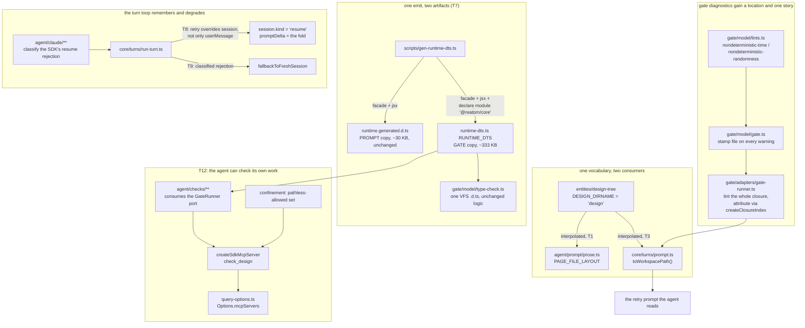
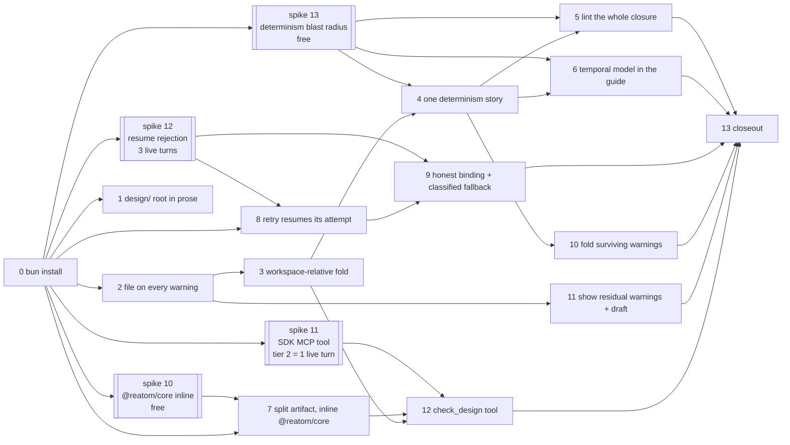

# Design-agent feedback loop repair — Implementation Plan

> **For agentic workers:** REQUIRED SUB-SKILL: Use superpowers:subagent-driven-development
> (recommended) or superpowers:executing-plans to implement this plan task-by-task. Steps use
> checkbox (`- [ ]`) syntax for tracking. Load `/reatom` and `/errore` before any code-related
> action (CLAUDE.md mandate). Every task ends green and is one commit.

**Goal:** Implement every work package in
`docs/superpowers/specs/2026-08-09-design-agent-feedback-loop-design.md` — stop termcraft's own
wiring from manufacturing the failures one measured run spent two agent attempts and one dead turn
on. In order of measured cost: state the real design-tree root in the system prompt (five ENOENTs),
close the `any` hole that manufactures `TS7006` on correctly-typed atom reads (four false
rejections), give every warning a file and one coherent determinism story (four unclearable
warnings), make a Gate retry resume the attempt it is correcting, degrade a rejected cross-turn
resume instead of terminalizing it, and give the agent an in-process check so a mechanical
diagnostic costs one tool call rather than a 2.5-minute re-run.

**Scope:** the whole spec — WP-1 through WP-11, as thirteen tasks. Nothing here renames or
relocates `design/`, teaches the Gate a `paths` map into a live `node_modules`, invents
`@opentui/react`/`React.ReactNode` declarations, or builds a guard-aware determinism lint; the
spec's own "Out of scope" section is binding and is not re-opened.

**Natural stopping points.** The spec's minimum useful slice is Tasks 1, 2, 7 and 8 (the prose
root, the warning file, the `@reatom/core` inline, the resuming retry): together they remove both
measured failure classes and the memoryless retry. Tasks 3–6 and 9–11 stop the *next* class of
silent mismatch. Task 12 is what stops the retry loop from being the feedback mechanism at all.

---

## Corrections to the spec, made here rather than discovered mid-task

Fourteen claims in the spec's work packages do not survive contact with the code. Each was READ at
`2f816d7` on branch `design-tree` and is cited. **The spec's diagnosis (its Problem and Root
causes sections) survives intact — every correction below is about the proposed REMEDY.**

**C1 — WP-1 and WP-2 need no drift test; the constant is importable.** The spec says `prose.ts`
"must not import `store/safe-fs`'s `DESIGN_DIRNAME` (domain-free ring); the test imports both and
compares", and repeats the reasoning for `core/turns/model/prompt.ts`. That reasoning applies to
`limits.ts`'s LOCAL COPY only — whose own comment says so ("this layer is domain-free and does not
import it", `src/store/safe-fs/model/limits.ts:107-110`). The canonical constant lives in
`src/entities/design-tree/types.ts:4` and is exported from that module's index
(`src/entities/design-tree/index.ts:7`). Both `agent/` and `core/` import `entities/` freely today
(`src/agent/types.ts:1`, `src/agent/claude/tools/model/vocabulary.ts:2`,
`src/core/turns/model/candidate.ts:13-17`), and `core/turns` **already holds exactly the constant
WP-2 asks for**: `DESIGN_TREE_FILE_PREFIX = \`${DESIGN_DIRNAME}/\`` at
`src/core/turns/model/candidate.ts:108`. So both packages IMPORT and INTERPOLATE, which makes the
drift impossible rather than merely detected — a strictly better outcome than the test the spec
proposes.

**C2 — WP-4 inlines into the same string, not a second virtual file.** The Gate's VFS serves
exactly one `.d.ts`: `readFile` answers `tsconfigPath`, `runtimeDtsPath`, and code files, and
`undefined` for everything else (`src/gate/model/type-check.ts:265-291`). The inline is therefore a
`declare module "@reatom/core" { … }` block appended INSIDE the `RUNTIME_DTS` text. No VFS hook, no
`files` entry, no `type-check.ts` logic change.

**C3 — `@reatom/core`'s declaration is flat and mechanically inlinable. Measured, not assumed.**
`node_modules/@reatom/core/dist/index.d.ts` is **302,787 bytes / 7,439 lines** — the generator's
"~296 KB" (`scripts/gen-runtime-dts.ts:43-45`) is accurate. It has **no top-level `import`**, **no
`/// <reference>`**, **no `export *`**, 210 `declare` statements, and exactly **one** `export { … }`
line (line 7439, 4,822 characters). So the flattening this repository already performs for the
runtime facade — strip `declare`, keep the surface list — applies unchanged. **One structural
hazard:** `declare global { var __REATOM: ReatomGlobal | undefined }` at line 3923. A global
augmentation is legal directly inside an ambient module declaration; that it is legal in THIS
position must be probed, not assumed (Task 7 Step 2).

**C4 — the inline drags in DOM globals the Gate's `lib` does not supply, and that is acceptable.**
`SYNTHESIZED_COMPILER_OPTIONS` pins `lib: ["esnext"]` and `types: []`
(`src/gate/model/type-check.ts:73-83`), and the pin is load-bearing (its own comment: `document`
must not exist in a TUI). Counted in `@reatom/core`'s declaration: `AbortController` ×16,
`AbortSignal` ×11, `EventTarget` ×5, `Element` ×6, `document` ×7, `localStorage` ×8. Under
`skipLibCheck: true` each raises no diagnostic and degrades to the error type INSIDE the `.d.ts`.
That is bounded and does not touch the measured failure: `atom<readonly T[]>(…)` → `Atom<readonly
T[]>` → call → `readonly T[]` → `.map` has real signatures. Document the degradation; do not widen
`lib` to `dom` to chase it.

**C5 — `@reatom/react` stays by reference, and the evidence is stronger than the spec's.** Its
declaration is only 2,748 bytes, so the spec's size argument does not apply — but its first three
lines are `import { … } from "@reatom/core"`, `import React, { ChangeEvent } from "react"`,
`import { JSX } from "react/jsx-runtime"`, and it ends with a nested `declare module '@reatom/core'
{ interface RouteChild extends JSX.Element {} }` augmentation. `@types/react` is not installed and
`react@19` ships none. Inlining it would mean inventing React's types, which the honest-values rule
forbids. The spec's conclusion holds; its reason is replaced by this one.

**C6 — `sessionWorkspaceBinding` has no production consumer, so flipping it changes no
behaviour.** Every reference: the type (`src/agent/types.ts:12,119`), the lifted port
(`src/core/ports/agent-backend.ts:147`), the value (`capabilities.ts:19`), one assertion
(`capabilities.test.ts:8`) and eight test fixtures. Nothing reads it at run time. So WP-8's "let
the checkpoint comparison stop proposing impossible resumes" is not what flipping the flag
achieves — the comparison (`evaluateSessionPlan`, `src/core/turns/model/session-plan.ts:43-55`)
never consults it. Flipping it is an HONESTY fix; the behavioural half is entirely part 2.

**C7 — wiring `fallbackToFreshSession` needs an outcome widening, and the repo already says so.**
`docs/mvp-remaining-work.md:844` reads verbatim: "Defined and tested, no production caller; needs
an `AgentRunOutcome` widening." The reason is visible in the types: `AgentRunOutcome`'s failure
variant is `{ kind: "backend-error"; message: string; sessionId: string | null }`
(`src/agent/types.ts:64`), mapped to `TurnAttemptOutcomeV1`'s `{ kind: "failed"; message; sessionId
}` (`src/core/turns/model/attempt.ts:67,93-94`) and consumed as a free-text message
(`run-turn.ts:447-452`). There is no signal that says "the resume was rejected". String-matching
the SDK's English `No conversation found with session ID: …` **must not ship**: the classification
belongs in the Claude adapter, the one layer that knows the SDK's error shape.

**C8 — WP-5b needs a field on `GateWarningV1` that does not exist.** The spec asks for warnings
"attributing each warning to its own file **and to the pages whose closure reaches it**".
`GateErrorV1` carries `blockedPages` with a 40-line contract (`src/core/ports/gate-runner.ts:26-70`);
`GateWarningV1` carries only `kind`/`message`/`line`/`column`/`file` (`:99-105`). The inversion the
attribution needs is already built and reusable — `createClosureIndex`
(`src/gate/adapters/gate-runner.ts:145-158`), whose own comment is the argument for reusing it
rather than re-walking.

**C9 — WP-10's tool cannot be "confined to the workspace like every file tool"; it has no path.**
`createConfinementPolicy` denies by default anything not in `fileTools`
(`src/agent/confinement/model/policy.ts:44-48`), then resolves a path out of `PATH_FIELDS` and
denies when none resolves (`:52-62`). A pathless tool hits the second denial. `ConfinementTables`
therefore needs a third set — allowed, no path to resolve — and the tool's confinement comes from
its implementation (it reads the turn workspace the adapter already holds), not from an argument.

**C10 — the installed SDK does export what WP-10 needs.**
`@anthropic-ai/claude-agent-sdk@0.3.212`: `createSdkMcpServer` (`sdk.d.ts:468`), `tool`
(`:6794`, taking a Zod raw shape), `McpSdkServerConfigWithInstance` as a member of `McpServerConfig`
(`:1030-1037`), and `Options.mcpServers?: Record<string, McpServerConfig>` (`:1669`).
`buildQueryOptions` constructs `Options` at `src/agent/claude/query/model/query-options.ts:24` and
sets no `mcpServers` today. One thing to PROBE: the SDK's `AnyZodRawShape` against this repo's
`zod@^4.4.3` (Task 12 Step 2).

**C11 — WP-9 is UNDESIGNED, and the design's answer to a failed generation is the opposite of a
re-send affordance.** `wsErrRetry` ends with the system line `⟲ generation failed after 3 tries —
current design unchanged` (`design/termcraft-engine.js:787-796`); `wsCancelled` with `⟲ generation
cancelled — current design unchanged` (`:798-812`). `design/12-errors-edge-states.dc.html` carries
ten screens (`err-agent-80`, `lock-80`, `term-small-80`, `ws-broken-source-120`,
`ws-cancelled-120`, `ws-err-retry-120`, `ws-host-crash-120`, `ws-host-crash-noretry-120`,
`ws-host-unavailable-120`, `ws-host-unavailable-noretry-120`) and **not one of them is a backend
failure or a re-send**. CLAUDE.md forbids inventing the affordance. Task 11 ships the one
behaviour that adds no visual language — restoring the failed turn's text into the EXISTING
composer draft — and flags the rest as a design gap with an owner.

**C12 — `ChatWarningSnapshot` carries no location, so WP-11a as written repeats F3 in the UI.**
`src/entities/chat/types.ts:23-26` is `{ kind: string; message: string }`, and the decoder mirrors
it (`src/entities/chat/model/decode.ts:46-49`). Rendering that alone gives the user a warning they
cannot locate — the exact shape F3 measured as unactionable. Task 11 widens the snapshot with
optional `file`/`line`; `.optional()` keeps every already-persisted record decodable.

**C13 — the design already has a file-naming system line, and it is the vocabulary WP-11a should
reuse.** `wsCancelled`'s scene ends with `{system:'✗ pages/main/page.tsx needs a newer termcraft
(kit 2.1)', c:P.red}` (`design/termcraft-engine.js:806`) — a red system line naming a file inside
the chat sequence. That is a citation, not an invention.

**C14 — WP-5a's rename does NOT ripple into `entities/chat`'s decoder.** The spec lists it.
`chatWarningSnapshotSchema` is `{ kind: z.string().min(1), message: z.string().min(1) }`
(`src/entities/chat/model/decode.ts:46-49`) — no kind enumeration, nothing to rename. The real
ripple set is `gate/types.ts:53-61`, `core/ports/gate-runner.ts:76-96`,
`core/protocol/model/event-payload.ts:814-815` (plus its own "eight fixed warning kinds" assertion
at `event-payload.test.ts:604`), and `core/turns/model/prompt.ts:59-62`.

**C15 — this worktree cannot run anything yet.** `node_modules` is a real, EMPTY directory (not a
junction — `Get-Item node_modules` reports no `LinkType`/`Target`, and it holds zero entries).
`bun install` is Task 0.

### Resolved by reading, after the corrections above were written

Five uncertainties this plan originally left as "check before implementing" turned out to be
answerable by reading. They are recorded here so no task spends a step re-deriving them.

**R1 — `promptDelta` IS wired, and Task 8's design is sound.** `planToSessionOptions`
(`src/agent/claude/query/model/session-options.ts:4-7`) returns only `{resume, forkSession}` and
drops `promptDelta` — which looks like the fold would go nowhere. It does not: the prompt TEXT is
assembled separately by `buildPrompt`, and `src/agent/session/model/prompt.ts:13` reads
`task.session.promptDelta ?? task.userMessage`. So on a resume the delta IS the prompt and
`userMessage` is not sent at all — correct for a resume, since the SDK holds the history. **Task 8's
"the fold appears exactly once" assertion is therefore load-bearing**, not belt-and-braces: the two
channels are mutually exclusive by construction and a change to either could send it twice or never.

**R2 — `SK.NewKeyword` exists.** `src/gate/model/scanner.ts:21` is `export const SK = SyntaxKind` —
TypeScript's own enum, re-exported as "a single import seam". `NewKeyword` is a member. Task 4 needs
no lexer change.

**R3 — two map sites drop the warning location, and Task 11 must fix both.**
`src/core/kernel/model/handlers/turn.ts:1466` and `:1482` both build
`warnings: validation.warnings.map((w) => ({ kind: w.kind, message: w.message }))` — explicitly
projecting away `file`/`line`/`column`. Widening `ChatWarningSnapshot` (C12) without changing these
two lines ships a schema nothing populates, which is worse than no widening: it looks fixed.

**R4 — turn-start does NOT read the previous turn's warnings, so Task 10's real content is making
them reachable.** `handlers/turn.ts` mentions `warnings` only where it WRITES them (`:887`, `:1068`,
`:1466`, `:1482`, `:1699`, `:1733`). The hook that already reads chat history is the seed path
(`evaluateSessionPlan` → `selectSeed`). Task 10 is a kernel wiring change, as its Step 1 suspects —
this confirms it rather than leaving it to be discovered.

**R5 — Task 11's draft restore has an exact precedent, including the rule it must obey.**
`src/ui/app/model/intent.ts:500-505`: "NEVER overwrite a draft: this codebase already carries two
defect fixes built on that", and the code APPENDS —
`setPrimaryInput(deps, draft.length === 0 ? text : \`${draft}\n\n${text}\`)`. Task 11 uses that same
mechanism and that same non-overwrite rule; it does not invent a restore path.

### Spikes that gate this plan

Four questions could not be answered by reading. Each has a probe under `docs/spikes/`, and **the
task it gates may not begin until its spike carries a verdict.**

| spike | gates | status | outcome |
| --- | --- | --- | --- |
| [`10-reatom-dts-inline`](../../spikes/10-reatom-dts-inline/SPIKE.md) | **Task 7** | **RUN — YES** | The inline works, `declare global` is legal, all four `TS7006`s clear, cost is +13 ms. **It also found a second, pre-existing defect** (S1 below). |
| [`13-determinism-blast-radius`](../../spikes/13-determinism-blast-radius/SPIKE.md) | **Tasks 4, 5, 6** | **RUN — YES** | 2 → ~6 warnings on a 5-page tree. Every prediction held; the seeded exemption has three real dependents. Two amendments about order (S2). |
| [`11-sdk-mcp-tool`](../../spikes/11-sdk-mcp-tool/SPIKE.md) | **Task 12** | **RUN — YES** | The server IS reachable through `createSpawnAndAdopt`; the name is `mcp__termcraft__check_design`. Two side findings: S3 and **S4**. |
| [`12-resume-rejection`](../../spikes/12-resume-rejection/SPIKE.md) | **Tasks 8 and 9** | **RUN — YES** | Task 8's premise confirmed with cache evidence; RC6 reproduced deliberately; **Q2 has a STRUCTURAL discriminator** (S5). |

**All four spikes are closed. No task in this plan is gated any more.** Total spend: **$0.33**
(spike 12 $0.117 across three turns; spike 11 tier 2 $0.2098).

### What the two completed spikes changed

**S1 — a pre-existing defect the plan did not know about: every lowercase raw element is a fatal
`TS7026`.** `TS7026: JSX element implicitly has type 'any' because no interface
'JSX.IntrinsicElements' exists` appears twice per element on every JSX fixture, **including the
baseline**. The inline neither causes nor fixes it: `JSX.IntrinsicElements` lives in
`@opentui/react/jsx-runtime`'s namespace, which stays unresolved by design (C5). Nobody noticed
because `type-check.test.ts:20-22` says its stand-in covers "no JSX", its real-declaration suite
(`:183`) uses only capitalized Kit components, and the Gate-ACCEPTED pages in `examples/clock` contain
**zero** lowercase JSX tags. This is a defect, not a gap: `prose.ts`'s `DESIGN_CODE_RULES` teaches
`<box>`/`<text>` as the runtime's escape hatch and `lintUnpointedElements` exists to warn about
exactly those tags — so a page following documented guidance is rejected naming an interface its
author cannot supply. Task 7 gains a step that pins and reports it; the FIX is a declaration
decision that does not belong in this plan.

**S2 — Task 6 is not deferrable, and `examples/clock` is part of it.** Measured: `lib/elapsed.ts:24`
holds the laundered `Date.now()` RC4 described, and three argument-less `new Date()` reads sit in
`alarm`/`calendar`/`dashboard`. Two of those files carry comments arguing the rule does not apply to
them (`dashboard.tsx:132-134` — "deterministic, no setInterval/setTimeout/randomness involved" —
three lines above a site Task 4 flags; `lib/elapsed.ts:5-12` — "only runs off the export flag's
guard", the guard the lint cannot see). Both authors reasoned correctly from guidance that never
mentions a clock read. **Ship the guide with the rule, and fix `examples/clock` in the same commit** —
six warnings on the project that ships as documentation makes the guide advisory.
The blast radius did NOT trigger the operator decision the spike anticipated: +4 on five pages is
noise, and the plan does not gain the "surface on open vs. next touch" question.

**S3 — the SDK does not validate a tool's declared schema at the handler boundary.**
`handler({slug: 42})` resolved with `ok-scoped:42`. Moot for a pathless `check_design` — one more
argument for keeping it pathless — but if a `slug` variant is ever added, the handler validates its
own input with the repo's `zod` first.

**S4 — a tool ran without `canUseTool` being consulted, contradicting a standing confinement claim.**
Spike 11 tier 2's model emitted TWO `tool_use` blocks — `ToolSearch`, then
`mcp__termcraft__check_design` — while `canUseTool` was asked about **only the second**.
`docs/spikes/08-agent-confinement/FINDINGS.md` records as its Claude verdict the claim that the
callback "gives termcraft an in-process veto on **every** tool use". That is measurably incomplete.
Stated without overclaiming: `ToolSearch` is a schema-fetching meta-tool that does no I/O of its own;
the probe set no `disallowedTools` (production does, `query-options.ts:29`), so it shows only that the
CALLBACK was not consulted; other CLI-internal tools were not probed. **Consequence for Task 12:** if
MCP tools are surfaced as deferred tools behind `ToolSearch`, and a future SDK routes `ToolSearch`
through `canUseTool`, deny-by-default would refuse it and `check_design` becomes **unreachable** — the
"advertised but never callable" outcome the task already calls strictly worse than no tool. Task 12
gains a test that drives the whole path with the REAL production `canUseTool` in place. The claim
itself gets its own ledger row and is not filed as a limitation.

**S5 — a rejected resume has a structural discriminator, so Task 9 need not match on prose.** The
`result` message a rejected resume yields (before the iteration throws a plain `Error` carrying
nothing usable) is `is_error: true`, `num_turns: 0`, `duration_api_ms: 0`, `total_cost_usd: 0`,
`modelUsage: {}`, plus a dedicated `errors: string[]`. The API was never called, and a design page
cannot fabricate `num_turns: 0`. Task 9's classifier requires, in order: this run's own
`SessionPlan.kind === "resume"`; `is_error === true`; `num_turns === 0`; and only then the `errors[]`
text. `subtype: "error_during_execution"` alone is NOT sufficient — it is the generic
execution-error subtype. **This also adds work to Task 9**: the `result` message arrives before the
throw, so the stream driver must retain it or the structured fields never reach the classifier.

---

## Architecture

No new top-level module and no new ring edge, except the one WP-10 asks for. Five seams change:



**Tech Stack:** TypeScript 7.0.2 on Bun ≥1.3.14, `@opentui/core`+`@opentui/react` 0.4.5,
`@reatom/core` ^1001.1.0, `@anthropic-ai/claude-agent-sdk` ^0.3.212, `errore` ^0.14.1,
`zod` ^4.4.3, `oxlint` 1.74.0, `oxfmt` 0.59.0. **No new dependencies.**

---

## Global Constraints

Inherited from `CLAUDE.md` and carried verbatim from the design-tree plans. Every task implicitly
includes this section.

- **Test runner is `bun run test`** (`scripts/run-tests.ts`), never a bare `bun test` whose crash
  reads as a pass. Tests live beside the file under test (`foo.ts` → `foo.test.ts`). Typecheck
  with `bun x tsc --noEmit`. Lint/format: `bun run lint` / `bun run fmt:check`.
- **Run the suite in the FOREGROUND with a plain redirect and a 600000 ms timeout**, then read
  the file: `rtk bun run test > "<scratchpad>/suite-taskN.txt" 2>&1`. A background run piped
  through `tail` produces an empty file until the stream ends and costs three turns.
- **`src/ui` and `src/entrypoint` run in SEPARATE commands.** The OpenTUI render tests flake
  under load when the two are combined.
- **A crashed run is not a failed run.** `lexer.oracle.test.ts`'s fuzz corpus intermittently
  segfaults `Bun.Transpiler`; `run-tests.ts` reports `crashed` and prints no `(fail)` lines, which
  reads as clean. A crashed run gets exactly one re-run and is never recorded as green.
- **errore is mandatory**: namespace import (`import * as errore from "errore"`), errors as
  values (`Error | T` unions), `createTaggedError` for domain errors, `.catch()`/`errore.try`
  only at uncontrolled boundaries, flat control flow, `if (x instanceof Error) return x` on one
  line with no block, `| null` for optional values, never swallow an error without logging it.
- **Reatom v1001**: named atoms/computeds/actions; `wrap(...)` at every async boundary that
  touches an atom afterwards; never an async IIFE wrapping an `await` — keep the call flat.
- **Module DAG** (`docs/architecture/code-structure.md`): `core` imports only `entities/` and its
  own `ports/`; `gate`, `store`, `host`, `agent` may import `entities/`; `host` may not import
  `store` or `gate`; `agent` may not import `gate` (Task 12 consumes the `GateRunner` PORT);
  `entities/` submodules import nothing but each other and `infrastructure/`.
- **Module folder shape** (`CLAUDE.md`): `ui/`, `model/`, `types.ts`, `index.ts`; code always
  inside subfolders, never loose at a module root; atomic single-purpose functions.
- **Imports**: cross-module imports use the `tsconfig.json` path aliases, never a relative path
  climbing out of the module. Never alias under `@termcraft/*`.
- **Factories are named `create*`, never `make*`.**
- **Design is a source of truth.** Colours, layout, glyphs and copy come from
  `design/termcraft-engine.js` (`pal` / `lightPal()`) and `design/*.dc.html`. This plan touches
  two user-visible surfaces (Task 11's chat rendering and composer draft), and C11/C13 above are
  binding on both: cite a screen or flag the gap; never invent a line.
- **Honest values only**: a value with no source is an explicit documented placeholder or an
  honest empty, never a fabrication. **This plan's sharpest instance:** Task 7 may inline only
  declarations emitted from a real installed package. A hand-written structural stand-in for
  `Atom`/`Computed`, or an invented `React.ReactNode`, is the fabrication this whole work package
  exists to avoid — see `scripts/gen-runtime-dts.ts:46-48`.
- **No optional input with a production fallback.** If a caller must decide something, the field
  is REQUIRED and the caller decides.
- **Language**: all code, comments, plans and commit messages in English.
- **Commits**: one per task, `feat:`/`fix:`/`docs:`/`test:`/`refactor:`/`chore:`/`perf:` prefix,
  each ending with the `Co-Authored-By: Claude Opus 5 (1M context) <noreply@anthropic.com>`
  trailer. `rtk git commit` swallows heredoc stdin — write the message to the scratchpad and pass
  `-F <path>`. `rtk git diff` compacts output and is not a valid patch; use plain
  `git --no-pager diff` when a diff must round-trip.
- **Never `git stash` inside a subagent**, and if this plan is executed by dispatched subagents,
  verify each one's cwd: a subagent's commits can land on `main` instead of this worktree.
- **Run `/reatom-audit` before reporting the work done** (Task 13). Audit by EXPLICIT PATH, not
  `--changed`: the router consumes its cache and a second `--changed` run reports "already
  audited" without auditing.

### Vocabulary

| term | meaning |
| --- | --- |
| **tree-relative path** | a forward-slash path relative to `design/`, e.g. `pages/alarm.tsx`. What `GateError.file`/`GateWarning.file` carry. Never carries the `design/` prefix. |
| **workspace-relative path** | the same file as the AGENT must type it into a tool call: `design/pages/alarm.tsx`. The turn workspace root is the agent's cwd (`query-options.ts:25`). |
| **project-relative path** | `.termcraft/design/pages/alarm.tsx` — a THIRD vocabulary, already used by `ui/preview/model/repair-prompt.ts:43`. Not what this plan renders; named here so it is not confused with the second. |
| **the fold** | the Gate diagnostics rendered into the retry attempt's prompt — `foldGateDiagnosticsIntoPrompt` (`core/turns/model/prompt.ts:137`). |
| **prompt copy** | `src/runtime/generated/runtime.generated.d.ts`, staged into the turn workspace as `runtime.d.ts`. Read by the agent. |
| **gate copy** | `RUNTIME_DTS` in `src/runtime/generated/runtime-dts.ts`, handed to the hermetic type check. Read by the compiler. Task 7 is the moment these two stop being the same text. |
| **attempt** vs **turn** | one turn runs up to 4 attempts (`MAX_TURN_ATTEMPTS`). An intra-turn retry shares one workspace; a new turn gets a new one (`staging-store.ts:91-98`). This is why Task 8 is possible and cross-turn resume is not. |

---

## What this plan read before it was written

Every claim was READ at `2f816d7` on branch `design-tree`. **Re-read rather than trusting a line
number if a task's decision turns on one.**

1. **The prose's root sentence and its own record of the previous instance.**
   `src/agent/prompt/model/prose.ts:29-42` is a comment headed "THE PATHS LINE IS LORE, NOT
   DECORATION (defect fix, 2026-07-27)" recording six wasted calls and ~7 s per turn from exactly
   this class of defect, and noting that the LAYOUT then changed with the multi-file tree. Line 45
   still says "Your working directory IS the workspace root, and it IS the design tree", and lines
   47-49 name `pages.json`, `lib/`, `components/` with no prefix. The comment predicted this
   regression and the prose was not carried forward.
2. **`DESIGN_DIRNAME` is importable from where both consumers already import.** See C1. Note
   `src/core/turns/model/candidate.ts:106-108` builds both `MANIFEST_PROJECT_RELPATH` and
   `DESIGN_TREE_FILE_PREFIX` from it — the second is byte-identical to what Task 3 needs.
3. **The fold renders two `location` clauses and both are tree-relative.**
   `formatGateError` (`prompt.ts:108-111`) and `formatGateWarning` (`:118-121`) each render
   `error.file === null ? "" : \` in ${…file}\``. `blockedPages` renders SLUGS
   (`:103-106`), not paths — it needs no translation and must not get one.
4. **`runGate` holds `fileName` while the lints run, and already stamps it onto errors.**
   `src/gate/model/gate.ts:208-220` calls the four token lints plus `lintUnpointedElements` inside
   one `errore.try`, then `warnings.push(...lint)` with no file, while the contract-error loop
   immediately below writes `file: fileName`. The stamp Task 2 needs is a one-line change at a call
   site that already has the value.
5. **`GateWarning.file`'s contract says the opposite of what Task 2 makes true.**
   `src/gate/types.ts:64-73`: "set by `gate/adapters/gate-runner.ts`'s whole-tree pass for the two
   graph warnings … and left absent by every other warning-producing stage (the per-page lints),
   none of which holds a single tree-relative path to report against." The port's
   `GateWarningV1` repeats it (`core/ports/gate-runner.ts:99-105`). Both must be corrected, and the
   fold's own header sentence claiming an unnamed warning is normal (`prompt.ts:33-36`) with them.
6. **The determinism lint is a token scan with no notion of a guard, and its kinds say
   "unguarded".** `src/gate/model/lints.ts:9-16` holds `TIMER_IDENTIFIERS`
   (`setTimeout`/`setInterval`/`setImmediate`/`requestAnimationFrame`) and `NOW_OBJECTS`
   (`Date`/`performance`); `:39-63` emits `unguarded-timer`/`unguarded-randomness` from bare
   identifier and `X.now()`/`Math.random` token triples. There is no scope analysis and no
   `isExport()` awareness anywhere in the file, which is why the measured retry's guards cleared
   nothing. `new Date()` is absent from both sets, as the spec says.
7. **The whole-tree pass produces only graph warnings today.**
   `src/gate/adapters/gate-runner.ts:905-937`: `runTree` builds `warnings` from `findImportCycles`
   plus dead modules and nothing else. Its `input.files` is a `ReadonlyMap<relPath, source>` over
   the whole tree, and `createClosureIndex` (`:145-158`) already inverts closures to `file → slugs`.
   Task 6 needs no new traversal and no second read of the tree.
8. **The hermetic check's degradation is documented as a deliberate trade, with tests pinning
   both halves.** `scripts/gen-runtime-dts.ts:50-62` states that `skipLibCheck: true` makes
   unresolved specifiers raise no diagnostic and degrade the imported names to the error type, that
   prop types stay fully checked while Reatom call signatures go unchecked, and that
   `type-check.test.ts` pins both. What was not foreseen is that the degradation MANUFACTURES a
   fatal: a type argument on an `any`-typed callee is ignored, so `alarmsAtom()` is `any` and
   `.map((a) => …)` has no contextual signature — precisely `noImplicitAny`'s `TS7006`.
9. **The size objection is real and is resolved by the split, not by reopening it.**
   `gen-runtime-dts.ts:43-46` rejected inlining because "this same string is the agent's runtime
   reference in WP-3 — a 300 KB prompt attachment is not a trade worth making". `main()` already
   writes TWO artifacts from ONE `declaration` string (`:518-530`), and `runtime-docs.ts:20-27`
   stages the `.d.ts` one BY PATH while the Gate consumes the string constant. The artifacts are
   already separate files; they are merely identical today. Prompt copy: 30,744 bytes. Gate copy's
   module: 32,156 bytes.
10. **The retry overrides `userMessage` and nothing else, and the completed outcome carries the
    session id.** `src/core/turns/model/run-turn.ts:395-400` builds
    `{ ...input.baseTask, workspacePath: context.workspace.root, userMessage }`, and `:552`
    reassigns `userMessage` on the retry path. `TurnAttemptOutcomeV1`'s completed variant carries
    `sessionId: string` (`attempt.ts:60-66`), and at the retry site `outcome` IS that variant
    (`run-turn.ts:526-553` runs after the `completed` narrowing at `:466`). So Task 8's input is
    already in hand at the exact line that needs it.
11. **The session plan is resolved once per turn, above the attempt loop.**
    `src/core/kernel/model/handlers/turn.ts:1284-1296` awaits `evaluateSessionPlan` once and passes
    the result into admission; `run-turn.ts` reuses `input.baseTask.session` every attempt. Nothing
    per-attempt exists to override today — Task 8 adds it.
12. **`capabilities.ts` anticipated its own correction.** `src/agent/claude/backend/model/
    capabilities.ts:14-19`: "The conservative alternative — 'fixed', forcing a fresh session
    whenever the workspace changes — is a one-line change here if rebinding is ever found to leak
    state across turn workspaces." We have a measured failure. Read C6 before believing the flip
    fixes behaviour.
13. **`fallbackToFreshSession` is a separate entry point on purpose, and it notes the fallback on
    the deadlines.** `src/core/turns/model/session-plan.ts:17-26,69-78`: it is deliberately NOT a
    branch inside `evaluateSessionPlan`, and only this path calls `deadlines.noteSessionFallback()`.
    Task 9 must call it from the driver, with the driver's own `deadlines`, and must not reimplement
    either half.
14. **Confinement denies by default and requires a resolvable path.**
    `src/agent/confinement/model/policy.ts:44-64`. See C9.
15. **The chat record's warnings are persisted and nothing renders them.**
    `entities/chat/types.ts:39-47` gives `ChatAgentRecord` a `warnings` array; `decode.ts:61-69`
    decodes it; `src/ui/chat/ui/ChatRecord.tsx` (104 lines) does not mention the field. The
    measured records carry 4 and 2 entries respectively, and the agent's prose was the user's only
    signal — and in the measured run that prose said "fixed".
16. **The design has no re-send and no backend-failure screen.** See C11.

**Two things this plan must MEASURE, not read** — each inside the task that turns on it:

- **M1 (Task 7, Step 2 and Step 7):** does the inline actually fix the four measured `TS7006`s, and
  what does it cost? Record (a) the probe's diagnostic list before and after, (b) the gate copy's
  byte size, (c) the wall-clock of one `runTree` type check over a 5-page fixture tree before and
  after. If the check gets materially slower, say so in the task report with the numbers rather
  than shipping the headline. A regression here is a real product cost: the type check is on the
  critical path of every turn's validation.
- **M2 (Task 12, Step 2):** does the SDK's `tool()` accept a `zod@4` raw shape, and does the
  `mcp__…` tool name reach `canUseTool` in the form the confinement table must match? Both are
  one-run probes against the installed SDK. If the zod majors are incompatible, the task reports
  that and stops rather than inventing a schema shim.

---

## Task order and dependencies



**Why this order.** Task 2 before Task 3 so the fold has a `file` to render. Task 3 before Task 4
so the kind rename rewrites `prompt.ts` once. Task 4 before Tasks 5, 6 and 10 so each builds on a
settled vocabulary. Task 7 before Task 12 so the self-check tool reports a check that is real
rather than the same manufactured `TS7006`. Task 8 before Task 9 because both edit the same region
of `run-turn.ts`.

**If this plan is parallelized across subagents,** use the spec's lane table
(`…-design.md` §"Parallelism plan") rather than this linear order: lanes own disjoint file sets, and
the only cross-lane file is `core/turns/model/prompt.ts` (Tasks 3, 4, 10 — one lane, strictly
sequential). Tasks 1, 2, 7, 8 and 11 are dependency-free and can start together.

**All four spikes are RUN and all four came back YES** — see "Spikes that gate this plan" above. No
task is gated any more, and the mermaid's spike nodes are kept as a record of what was de-risked and
in which order, not as pending work. Every mechanism this plan rests on is now measured:
the inline types atom reads (spike 10), the widened rule's radius is +4 on five pages (13), the
in-process tool survives the custom spawn (11), and an intra-turn resume genuinely resumes while a
cross-turn one genuinely cannot (12).

**The acceptance bar is real green from Task 1 onward.** There is no red window in this plan. Any
failure is the current task's until proven otherwise.

---

### Task 0: Make the worktree runnable

- [ ] **Step 1: Install**

```bash
rtk bun install
```

C15: `node_modules` here is a real, empty directory. Nothing — not `bun run test`, not
`bun x tsc --noEmit`, not `scripts/gen-runtime-dts.ts` (which resolves the platform `tsc` through
module resolution, `gen-runtime-dts.ts:124-139`) — works before this.

- [x] **Step 1 is DONE** — `bun install` ran 2026-08-09: 140 packages, `bun@1.3.14`,
`typescript@7.0.2`, `zod@4.4.3`, `@anthropic-ai/claude-agent-sdk@0.3.212`, `@reatom/core@1001.1.0`.

- [ ] **Step 2: Establish the baseline — and it is NOT fully green**

```bash
rtk bun run test > "<scratchpad>/suite-baseline.txt" 2>&1   # foreground, 600000 ms timeout
```

**Already measured 2026-08-09, before any task ran:**

- `bun x tsc --noEmit` — **clean**.
- `bun run lint` (oxlint) — **clean**.
- `bun run fmt:check` — **RED on three files**, none of them this plan's:
  `src/entrypoint/model/create-shell.test.ts`, `src/store/jsonl/model/chat-index.test.ts`,
  `src/ui/workspace/ui/scrollbox-probe.test.tsx`. These are PRE-EXISTING, from the uncommitted
  phase-3 work in the tree. **Do not fold fixing them into a task's commit** — that would hide an
  unrelated change inside a feature commit. Either fix them in their own `chore(fmt)` commit first,
  or note in each task's report that `fmt:check` is red for these three and stays red.
- The test suite has NOT been run yet. Run it and record the counts.

The working tree carries uncommitted phase-3 changes (11 modified, plus untracked
`examples/clock/.termcraft/design/{lib,pages/{alarm,stopwatch,timer}.tsx}`). **Do not commit or
revert them as part of this plan.** Note that `examples/clock`'s untracked pages are the very files
spike 13 measured and Task 6 Step 4b fixes — so that task DOES touch them, deliberately.

No commit for this task.

---

### Task 1: State the real design-tree root in the system prompt

Spec WP-1. The single highest-value line in this plan: it alone removes all five measured ENOENTs
and their five recovery `Glob **/*` calls.

**Files:**
- Modify: `src/agent/prompt/model/prose.ts` — `PAGE_FILE_LAYOUT` (`:43-53`) and the lore comment
  (`:29-42`).
- Test: `src/agent/prompt/model/prose.test.ts` (create if absent; check with
  `ls src/agent/prompt/model/*.test.ts` first — `system-prompt.test.ts` exists and may already
  assert against `PAGE_FILE_LAYOUT`; extend that suite rather than duplicating it).

**Interfaces:** no signature change. `PAGE_FILE_LAYOUT` becomes a template literal interpolating
`DESIGN_DIRNAME` (C1) instead of a plain string.

- [ ] **Step 1: Write the failing tests**

```ts
import { DESIGN_DIRNAME } from "entities/design-tree";
import { PAGE_FILE_LAYOUT } from "./prose";

test("the layout prose names the design tree's real root", () => {
  expect(PAGE_FILE_LAYOUT).toContain(`${DESIGN_DIRNAME}/pages.json`);
  expect(PAGE_FILE_LAYOUT).toContain(`${DESIGN_DIRNAME}/pages/dashboard.tsx`);
  // The retired claim, in the exact words the measured run acted on.
  expect(PAGE_FILE_LAYOUT).not.toContain("it IS the design tree");
});

test("no example path is stated without its tree prefix", () => {
  // Every quoted path that looks tree-relative must carry the prefix. `pages.json` appears
  // inside prose about the manifest too, so match the QUOTED forms the agent copies.
  for (const bare of ['"pages.json"', '"pages/dashboard.tsx"', '"lib/theme.ts"']) {
    expect(PAGE_FILE_LAYOUT).not.toContain(bare);
  }
});

test("the existing leading-slash warning survives", () => {
  expect(PAGE_FILE_LAYOUT).toContain("A leading slash escapes the workspace and is refused.");
});

test("the runtime docs are stated at the workspace root, beside the tree and not inside it", () => {
  expect(PAGE_FILE_LAYOUT).toContain("RUNTIME.md and runtime.d.ts, at the workspace root");
  expect(PAGE_FILE_LAYOUT).not.toContain(`${DESIGN_DIRNAME}/RUNTIME.md`);
});
```

The last assertion is not decoration: `store/safe-fs`'s `classifyWorkspace` admits a `.d.ts` at the
ROOT ONLY and treats anything under `design/` as `design-source`
(`limits.ts:120-130`), so a prose line placing the docs inside the tree would send the agent at a
path the confinement policy classifies differently.

- [ ] **Step 2: Run them to verify they fail**

Run: `bun test src/agent/prompt/`
Expected: FAIL on the first two tests; the third and fourth already pass (they pin what must not
regress).

- [ ] **Step 3: Rewrite the two-root statement**

Replace `prose.ts:45` and restate every example path. The replacement, with `DESIGN_DIRNAME`
interpolated so the two cannot drift:

```ts
import { DESIGN_DIRNAME } from "entities/design-tree";

export const PAGE_FILE_LAYOUT = `Design-tree layout inside this workspace:

Your working directory is the WORKSPACE ROOT. The design tree is the "${DESIGN_DIRNAME}/" directory inside it — that is where every page and every shared module lives. The runtime docs sit BESIDE the tree at the workspace root, not inside it. Every path below is relative to the workspace root — read and edit them as "${DESIGN_DIRNAME}/pages/dashboard.tsx", never "/${DESIGN_DIRNAME}/pages/dashboard.tsx" and never "pages/dashboard.tsx". A leading slash escapes the workspace and is refused.

- ${DESIGN_DIRNAME}/pages.json — the manifest, and the ONLY thing that decides which pages exist, in what order, and which file each one lives in. Every entry is { "slug": "...", "entry": "<a path RELATIVE TO ${DESIGN_DIRNAME}/>" } — so a page at "${DESIGN_DIRNAME}/pages/dashboard.tsx" is entered as "pages/dashboard.tsx". Add a page by writing its file AND adding its entry here; remove one by deleting its entry; reorder pages by reordering the array. A file this manifest does not name is a shared module, not a page.
- ${DESIGN_DIRNAME}/<any path you choose> — a page's entry file can live anywhere in the tree. "pages/<slug>.tsx" is a good convention and nothing more; the manifest's "entry" value is what makes a file a page.
- shared modules — any other file in the tree. Put reusable components, tokens and helpers in "${DESIGN_DIRNAME}/lib/" or "${DESIGN_DIRNAME}/components/" and import them with a relative specifier. This is the point of the tree: several pages importing one "${DESIGN_DIRNAME}/lib/theme.ts" is the intended shape, not a workaround.
- RUNTIME.md and runtime.d.ts, at the workspace root — the runtime API reference for "@termcraft/runtime". Read them before writing or editing anything.
- REATOM.md, alongside them — how state works in this runtime. It is Reatom v1001, which is NOT the Reatom most code you have seen uses: there is no "ctx" parameter and no ".spy". Read it before writing any atom, computed, action, or reatomComponent, and do not fall back on remembered Reatom idioms instead.

TWO PATH VOCABULARIES, AND WHICH ONE EACH SIDE SPEAKS. Your tools take WORKSPACE-relative paths ("${DESIGN_DIRNAME}/pages/dashboard.tsx"). "${DESIGN_DIRNAME}/pages.json"'s own "entry" values are TREE-relative ("pages/dashboard.tsx") — that is the manifest's format, not a mistake. Prefix a manifest entry with "${DESIGN_DIRNAME}/" before you read or edit the file it names.

A page's display title lives in its own entry file, as meta.title — retitle a page by editing that field, never ${DESIGN_DIRNAME}/pages.json.`;
```

The final paragraph is the prose half of the defect Task 3 fixes in the fold: the agent must be told
the manifest's own values are tree-relative, because RC2's measured ENOENT came from taking
`pages/alarm.tsx` straight out of a diagnostic. Keeping this paragraph means an agent that reads
the manifest FIRST does not have to learn the same lesson from a denied tool call.

- [ ] **Step 4: Update the lore comment**

`prose.ts:29-42` currently records one occurrence. Append this one:

```
// SECOND OCCURRENCE (defect fix, 2026-08-09). The 2026-07-27 fix above named the anchor and the
// layout comment below predicted the next layout change would need the prose carried forward —
// and then it was not. The multi-file tree moved every design file under `design/`
// (`store/sandbox/model/staging-store.ts:300` stages `design/<relPath>`, against
// `entities/design-tree`'s `DESIGN_DIRNAME`), while line 45 went on saying the working directory
// "IS the design tree". MEASURED cost, one run of `examples/clock` on 2026-08-09: five `Read`
// calls returned ENOENT across three sessions, each followed by a recovery `Glob **/*`.
//
// THE PREVENTION IS NOT THIS COMMENT. `DESIGN_DIRNAME` is now INTERPOLATED into every path
// below, so a rename of the tree root rewrites this prose mechanically and a third occurrence of
// this defect is not possible by that route. What a comment still cannot cover is a change to the
// SHAPE of the layout (a second tree, a nested namespace) — which is what happened both times.
// If you are making one, this block is the thing to re-read first.
```

- [ ] **Step 5: Run the tests**

Run: `bun test src/agent/prompt/ && bun x tsc --noEmit`
Expected: PASS, `tsc` silent.

**Check the other prose consumers before finishing.** `rg -n "PAGE_FILE_LAYOUT" src` — if
`system-prompt.test.ts` snapshots the composed prompt, that snapshot moves and the move is the
point; update it rather than working around it.

- [ ] **Step 6: Full suite and commit**

Subject: `fix(prompt): state the design tree's real root in the layout prose`

---

### Task 2: Give every warning a file

Spec WP-3. Blocks Task 3.

**Files:**
- Modify: `src/gate/model/gate.ts` — stamp `fileName` onto per-page lint warnings (`:208-220` and
  the `warnings.push` sites that follow).
- Modify: `src/gate/types.ts:64-73` — `GateWarning.file`'s contract.
- Modify: `src/core/ports/gate-runner.ts:99-105` — `GateWarningV1.file`'s contract (both redraw the
  same shape per decision C1).
- Modify: `src/core/turns/model/prompt.ts:33-36` — delete the header sentence claiming an unnamed
  warning is normal, and `:113-117`'s `formatGateWarning` doc which repeats it.
- Test: `src/gate/model/gate.test.ts`, `src/core/turns/model/prompt.test.ts`.

**Interfaces:** no type change — `file?: string` already exists on both shapes. What changes is
which stages populate it, and the documented contract.

- [ ] **Step 1: Write the failing tests**

`gate.test.ts`:

```ts
test("a determinism warning names the entry it was produced against", () => {
  const result = runGate({ ...base, entryRelPath: "pages/stopwatch.tsx",
    source: "export const meta = { kitApiVersion: 1 };\nconst t = Date.now();\n" });
  const timer = result.warnings.find((w) => w.kind === "unguarded-timer");
  expect(timer?.file).toBe("pages/stopwatch.tsx");
});

test("every warning a per-page run produces carries the same file", () => {
  // one source triggering determinism + silencing-any + unpointed-element at once
  const result = runGate({ ...base, entryRelPath: "pages/a.tsx", source: MULTI_WARNING_SOURCE });
  expect(result.warnings.length).toBeGreaterThan(2);
  for (const w of result.warnings) expect(w.file).toBe("pages/a.tsx");
});

test("a dropped-id warning, which has no line, still carries its file", () => {
  // `lintDroppedIds` emits with NO line/column (lints.ts:232-236) — the ONE kind where `file`
  // is the only locator the agent gets, which is exactly why it must not be skipped.
  const result = runGate({ ...base, entryRelPath: "pages/a.tsx", referencedIds: ["gone"],
    source: NO_IDS_SOURCE });
  const dropped = result.warnings.find((w) => w.kind === "dropped-id");
  expect(dropped?.file).toBe("pages/a.tsx");
  expect(dropped?.line).toBeUndefined();
});
```

`prompt.test.ts`:

```ts
test("a determinism warning renders with its file", () => {
  const fold = foldGateDiagnosticsIntoPrompt({ rejectedAttempt: 1, nextAttempt: 2,
    diagnostics: { errors: [], warnings: [
      { kind: "unguarded-timer", message: "`Date.now()` reads wall-clock time",
        file: "pages/stopwatch.tsx", line: 55, column: 31 }] } });
  expect(fold).toContain("pages/stopwatch.tsx");
});

test("a warning with no file still omits the clause entirely", () => {
  // The renderer's null-guard is NOT deleted by this task: `TYPE_CHECK_UNAVAILABLE`-shaped
  // whole-tree statements legitimately name no file (core/ports/gate-runner.ts:60-68).
  const fold = foldGateDiagnosticsIntoPrompt({ ...base, diagnostics: { errors: [],
    warnings: [{ kind: "unguarded-timer", message: "m", file: null }] } });
  expect(fold).not.toContain(" in ");
});
```

- [ ] **Step 2: Run to verify they fail**

Run: `bun test src/gate/model/gate.test.ts && bun test src/core/turns/model/prompt.test.ts`
Expected: FAIL on every `file` assertion; the null-guard test passes and stays passing.

- [ ] **Step 3: Stamp the file**

In `gate.ts`, the loop at `:214-218` is `for (const lint of read.lints) { …; warnings.push(...lint) }`
followed by `warnings.push(...read.unpointed)`. Both become a stamping push. Do it once, in one
helper, so a future lint cannot be added without a file:

```ts
  // EVERY WARNING THIS RUN PRODUCES NAMES `fileName` (defect fix, 2026-08-09). Measured: a
  // retry prompt carried four `- [unguarded-timer] line NN:CC:` lines with no file, spread
  // across TWO different files, and the agent spent ~90 s of reasoning and reported "fixed"
  // while the turn record still carried all four. A position without a file is not a location.
  //
  // `fileName` is the SHORT display name the caller passed (`entryRelPath`), which is the same
  // value the contract-error loop below already stamps — so errors and warnings from one run
  // now speak one vocabulary, and `core/turns/model/prompt.ts` translates both at one place.
  const stamp = (w: GateWarning): GateWarning => ({ ...w, file: fileName });
  for (const lint of read.lints) {
    if (lint instanceof Error) return unscannablePage(fileName, lint);
    warnings.push(...lint.map(stamp));
  }
  warnings.push(...read.unpointed.map(stamp));
```

**Do not push the stamp down into `lints.ts`.** The lints take a source string and know no path
(`lintDeterminism(source, syntax)`); giving each of five lints a path parameter to thread would be
five chances to forget it. The call site holds the value and stamps once — the same shape
`unscannablePage` already uses.

- [ ] **Step 4: Correct the two contracts and the fold's header**

`src/gate/types.ts:64-73`, replacing the "left absent by every other warning-producing stage"
sentence:

```
 * One non-fatal gate warning. `file` names the SOURCE this warning was produced against, and
 * every producing stage sets it: the per-page lints stamp the entry path `runGate` was called
 * with (`gate/model/gate.ts`), and the whole-tree pass stamps the tree-relative path its own
 * graph/closure warnings are about (`gate/adapters/gate-runner.ts`). It is TREE-relative — the
 * `design/` prefix is added by `core/turns/model/prompt.ts` at the moment the text becomes
 * something an agent will type into a tool call, and nowhere else.
 *
 * ABSENT means "this warning is about the TREE, not about a file", the same distinction
 * `GateErrorV1.blockedPages` documents for errors. It is not the ordinary case and a consumer
 * that finds it should not treat the warning as unlocatable-by-design.
```

Mirror it verbatim on `core/ports/gate-runner.ts:99-105`, and delete the clause in
`core/turns/model/prompt.ts:33-36` that says graph warnings render "WITH `file`, which is what
makes either diagnostic locatable at all" as if they were the exception — they are now the rule.
Keep `formatGateWarning`'s null-guard and rewrite its doc to say what absence now means.

- [ ] **Step 5: Run the tests**

Run: `bun test src/gate/ && bun test src/core/ && bun x tsc --noEmit`

- [ ] **Step 6: Full suite and commit**

Subject: `fix(gate): name the source on every warning a per-page run produces`

---

### Task 3: One path vocabulary in the folded diagnostics

Spec WP-2. Needs Task 2.

**Files:**
- Modify: `src/core/turns/model/prompt.ts` — one `toWorkspacePath` helper, routed from both
  `formatGateError` (`:108-111`) and `formatGateWarning` (`:118-121`), plus the header.
- Test: `src/core/turns/model/prompt.test.ts`.

**Interfaces:**

```ts
/**
 * A Gate diagnostic's TREE-relative `file` as the agent must type it: workspace-relative.
 * The one translation point between the two vocabularies (see this file's header).
 */
function toWorkspacePath(file: string): string;
```

Built from `DESIGN_DIRNAME` imported from `entities/design-tree` (C1) — no local constant, no
drift test. `core` already imports that module in this exact directory
(`core/turns/model/candidate.ts:13-17`).

- [ ] **Step 1: Write the failing tests**

```ts
import { DESIGN_DIRNAME } from "entities/design-tree";

test("a rejection's error file renders workspace-relative", () => {
  const fold = foldGateDiagnosticsIntoPrompt({ rejectedAttempt: 1, nextAttempt: 2,
    diagnostics: { errors: [{ kind: "type", code: "TS7006", message: "…",
      file: "pages/alarm.tsx", line: 98, column: 30, blockedPages: null }], warnings: [] } });
  expect(fold).toContain(`in ${DESIGN_DIRNAME}/pages/alarm.tsx line 98:30`);
  expect(fold).not.toContain("in pages/alarm.tsx");
});

test("a warning's file renders workspace-relative too", () => { /* same, via warnings */ });

test("blockedPages still renders SLUGS and is not prefixed", () => {
  const fold = foldGateDiagnosticsIntoPrompt({ ...base, diagnostics: { errors: [
    { kind: "import", code: "FORBIDDEN_IMPORT", message: "…", file: "lib/theme.ts",
      blockedPages: ["home", "about"] }], warnings: [] } });
  expect(fold).toContain("[blocks: home, about]");
  expect(fold).not.toContain(`blocks: ${DESIGN_DIRNAME}/home`);
});

test("an absent file still omits the clause, and is never rendered as a bare prefix", () => {
  const fold = foldGateDiagnosticsIntoPrompt({ ...base, diagnostics: { errors: [
    { kind: "type", code: "TYPE_CHECK_UNAVAILABLE", message: "…", file: null,
      blockedPages: null }], warnings: [] } });
  expect(fold).not.toContain(" in ");
  expect(fold).not.toContain(`${DESIGN_DIRNAME}/\n`);
});

test("an already-prefixed file is not double-prefixed", () => {
  // Defensive: nothing produces this today, and if a producer ever starts, a silent
  // `design/design/pages/a.tsx` is a worse failure than an assertion here.
  const fold = foldGateDiagnosticsIntoPrompt({ ...base, diagnostics: { errors: [
    { kind: "type", code: "X", message: "…", file: `${DESIGN_DIRNAME}/pages/a.tsx`,
      blockedPages: null }], warnings: [] } });
  expect(fold).not.toContain(`${DESIGN_DIRNAME}/${DESIGN_DIRNAME}/`);
});

test("the freshness barrier is unchanged", () => { /* keep the existing cases verbatim */ });
```

- [ ] **Step 2: Run to verify they fail**

Run: `bun test src/core/turns/model/prompt.test.ts`
Expected: FAIL on the two prefix tests. The `blockedPages`, absent-file and freshness cases pass
now and must still pass after — they are the regression fence.

- [ ] **Step 3: Add the helper and route both renderers through it**

```ts
import { DESIGN_DIRNAME } from "entities/design-tree";

const DESIGN_TREE_PREFIX = `${DESIGN_DIRNAME}/`;

/**
 * THE ONE PLACE THE TWO PATH VOCABULARIES MEET (defect fix, 2026-08-09).
 *
 * Gate speaks TREE-relative throughout: `GateError.file`/`GateWarning.file` carry
 * `entryRelPath` (`gate/adapters/gate-runner.ts`'s display name), which is relative to
 * `design/`. The AGENT's tools take WORKSPACE-relative paths — its cwd is the turn workspace
 * root (`agent/claude/query/model/query-options.ts` passes `cwd: task.workspacePath`), and the
 * tree is staged one level down under `design/` (`store/sandbox/model/staging-store.ts`).
 *
 * MEASURED: a retry prompt rendered `in pages/alarm.tsx`; the agent typed exactly that into
 * `Read` and got ENOENT, then recovered with `Glob **\/*`. Three of the run's five ENOENTs came
 * from this one line of text.
 *
 * The translation happens HERE, at the boundary where a diagnostic stops being a DTO and
 * becomes something the agent will type — not in the Gate, whose own tree-relative vocabulary
 * is correct for every other consumer (the closure index, the inventory, the manifest's own
 * `entry` values). `DESIGN_DIRNAME` is imported rather than duplicated: `core` imports
 * `entities/` (`candidate.ts` already imports this exact constant), so there is no pair to
 * keep in sync and no drift test to write.
 */
function toWorkspacePath(file: string): string {
  return file.startsWith(DESIGN_TREE_PREFIX) ? file : `${DESIGN_TREE_PREFIX}${file}`;
}
```

`formatGateError`'s and `formatGateWarning`'s `location` each become
`` file === null ? "" : ` in ${toWorkspacePath(file)}` ``.

State in the file header that `blockedPages` is deliberately untouched — it renders slugs, and
prefixing a slug would fabricate a path.

- [ ] **Step 4: Run the tests**

Run: `bun test src/core/ && bun x tsc --noEmit`

- [ ] **Step 5: Full suite and commit**

Subject: `fix(turns): fold Gate diagnostics with workspace-relative paths`

---

### Task 4: Make the determinism rule tell one story

Spec WP-5a. Needs Task 3 (same file, one rewrite). Blocks Tasks 5, 6, 10.

Three decisions, all of which the spec recommends and this task settles:

1. **`new Date()` is flagged.** The rule is about wall-clock reads; today's omission is an accident
   of token shape, not a judgement. The measured run's agent NOTICED the asymmetry and explicitly
   refused to exploit it (transcript 09:08:38) — leaving a hole an honest agent works around is
   worse than closing it.
2. **The kinds are renamed** to `nondeterministic-time` / `nondeterministic-randomness`. The lint
   is a token scan with no notion of a guard (read-claim 6), so `unguarded-` names a property it
   cannot observe and promises a fix — an `isExport()` wrapper — that can never clear it. Measured:
   the post-fix turn record still carried all four warnings.
3. **A guard-aware lint is NOT built.** It needs scope analysis a token scanner cannot do honestly,
   and the spec puts it out of scope. The messages say what to do instead.

**Spike 13 is RUN and its verdict is YES** (`docs/spikes/13-determinism-blast-radius/SPIKE.md`).
Measured on `examples/clock`: 2 warnings today → ~6 after this task and Task 5. Three findings bind
this task, and one question it might have raised is settled:

- **The seeded-constructor exemption is load-bearing, with three real dependents.**
  `calendar.tsx:68,69,70` use `new Date(year, month, 1)`, `new Date(year, month + 1, 0)`,
  `new Date(year, month, 0)`. Without the exemption the calendar page would carry 6 warnings instead
  of 1 and look like the tree's worst offender while reading no clock at all.
- **The three sites this task adds are confirmed genuinely new:** `alarm.tsx:97`, `calendar.tsx:112`,
  `dashboard.tsx:137`, all `const now = new Date()`, and the current lint reports **0** `new Date`
  warnings.
- **Comments stay out: 7/7 clean.** Every prose mention of `Date.now`/`setInterval`/`new Date` in the
  tree is unflagged — the tokenizer holds and the widening did not become a text search.
- **No operator decision is triggered.** +4 warnings on a five-page tree is noise; the plan does NOT
  gain a "surface pre-existing warnings on open or on next touch" question.

**Task 6 is not deferrable, and the measured reason is stronger than the inferred one.** Two files
carry comments arguing this rule does not apply to them: `dashboard.tsx:132-134` ("deterministic, no
setInterval/setTimeout/randomness involved" — three lines above a site this task flags) and
`lib/elapsed.ts:5-12` ("only runs off the export flag's guard" — the guard the lint cannot see, RC4).
Both authors reasoned correctly from guidance that talks about timers and randomness and never
mentions a clock read. Ship the guide with the rule or the rule reads as a false positive.

**Files:**
- Modify: `src/gate/model/lints.ts:8-67` — the identifier sets, the `new Date` shape, the kinds,
  the messages.
- Modify: `src/gate/types.ts:53-61` — `GateWarningKind`.
- Modify: `src/core/ports/gate-runner.ts:76-96` — `GateWarningKindV1`.
- Modify: `src/core/protocol/model/event-payload.ts:814-815` — the wire kind list.
- Modify: `src/core/turns/model/prompt.ts:59-62` — `DETERMINISM_WARNING_KINDS`.
- Test: `lints.test.ts`, `prompt.test.ts`, `event-payload.test.ts` (its "eight fixed warning kinds"
  assertion at `:604` moves).

**NOT modified:** `src/entities/chat/model/decode.ts`. C14 — the chat snapshot's `kind` is
`z.string().min(1)`, so nothing there enumerates kinds. Confirm with
`rg -n "unguarded" src` before finishing and fix anything this list missed.

- [ ] **Step 1: Decide the persistence question before writing code**

Already-persisted chat records carry the OLD kind strings (`examples/clock/.termcraft/chats/*.jsonl`
has `unguarded-timer` entries from the measured run). Because the snapshot schema does not
enumerate kinds, those records still DECODE — they will simply display the old name. Verify that is
the whole story:

```bash
rg -n "unguarded" src docs examples --glob '!*.test.ts'
```

Anything that pattern-matches a persisted kind string in a decoder, a projection or a migration is
a compatibility problem and must be handled in this task. If the sweep finds none beyond the files
listed above, record that in the commit body — "old records display the old kind; nothing branches
on it" — so a reviewer does not have to re-derive it.

- [ ] **Step 2: Write the failing tests**

`lints.test.ts` — the whole final vocabulary, positive and negative:

```ts
test.each([
  ["Date.now()", "nondeterministic-time"],
  ["performance.now()", "nondeterministic-time"],
  ["new Date()", "nondeterministic-time"],
  ["new Date(2026, 0, 1)", "nondeterministic-time"],   // still a wall-clock-shaped construct?
  ["setTimeout(f, 0)", "nondeterministic-time"],
  ["setInterval(f, 0)", "nondeterministic-time"],
  ["setImmediate(f)", "nondeterministic-time"],
  ["requestAnimationFrame(f)", "nondeterministic-time"],
  ["Math.random()", "nondeterministic-randomness"],
])("%s is flagged as %s", (src, kind) => {
  const out = lintDeterminism(`const x = ${src};`, "ts");
  expect(out).not.toBeInstanceOf(Error);
  expect((out as GateWarning[]).map((w) => w.kind)).toContain(kind);
});

test.each([
  "const d = { Date: 1 }.Date;",
  "const o = { now: 1 }; o.now;",
  "class Date2 {}; new Date2();",
  "const random = 4; random;",
  "obj.Math.random;",           // a MEMBER named Math, not the global
])("%s is not flagged", (src) => {
  expect(lintDeterminism(src, "ts")).toEqual([]);
});

test("no kind name promises a guard", () => {
  const out = lintDeterminism("Date.now(); Math.random();", "ts") as GateWarning[];
  for (const w of out) {
    expect(w.kind).not.toContain("unguarded");
    expect(w.message).not.toContain("guard");
  }
});

test("each message says what to do instead", () => {
  const out = lintDeterminism("Date.now();", "ts") as GateWarning[];
  expect(out[0]?.message).toContain("atom");
});
```

**`new Date(2026, 0, 1)` is a real decision, not a test detail.** A constructor with explicit
arguments is DETERMINISTIC. Decide it in this step and encode the decision in the test: flag only
the ARGUMENT-LESS form (`new` `Date` `(` `)` — a four-token shape the scanner can see), and say so
in the lint's own comment. Flagging the seeded form would warn on the one wall-clock-free way to
build a date, which teaches the agent to avoid dates entirely.

`prompt.test.ts`:

```ts
test("the renamed kinds route into the determinism section", () => { /* both new names */ });
test("the four excluded kinds still render under no header", () => {
  for (const kind of ["dropped-id", "unpointed-element", "unlisted-navigation", "silencing-any"])
    expect(foldGateDiagnosticsIntoPrompt({ ...base, diagnostics: { errors: [],
      warnings: [{ kind, message: "m", file: "pages/a.tsx" }] } })).toBe("");
});
test("the two graph kinds still render under their own header", () => { /* unchanged */ });
```

- [ ] **Step 3: Run to verify they fail**

Run: `bun test src/gate/model/lints.test.ts`
Expected: FAIL on every new kind name, on `new Date()`, and on the message assertions.

- [ ] **Step 4: Rewrite the lint**

`lints.ts:8-16` gains the `new Date` shape and loses nothing:

```ts
/** Global identifiers whose call breaks the deterministic render (§6.3 warning lints). */
const TIMER_IDENTIFIERS = new Set<string>([
  "setTimeout", "setInterval", "setImmediate", "requestAnimationFrame",
]);
/** `X.now()` time sources that are non-deterministic across a smoke/export render. */
const NOW_OBJECTS = new Set<string>(["Date", "performance"]);
```

and `lintDeterminism` gains one branch, placed BEFORE the identifier branch so `new Date()` is not
also read as a bare identifier:

```ts
    // `new Date()` WITH NO ARGUMENTS — a wall-clock read wearing a constructor (defect fix,
    // 2026-08-09). `Date.now()` was flagged and this was not, purely because the first is an
    // identifier + `.` + member and the second is a `new` + identifier + `(` + `)`. The measured
    // run's agent found the asymmetry and refused to exploit it; a rule with a hole an honest
    // author works around is worse than one without.
    //
    // A SEEDED CONSTRUCTOR IS LEFT ALONE. `new Date(2026, 0, 1)` and `new Date(ms)` read no
    // clock, and flagging them would warn on the only wall-clock-free way to build a date —
    // teaching the agent to avoid dates altogether rather than to avoid the clock. The
    // four-token empty-argument shape is exactly what the scanner can see, and exactly the
    // shape that reads the clock.
    if (t.kind === SK.NewKeyword) { /* peek `Date` `(` `)` and emit at `t.pos` */ }
```

`SK.NewKeyword` exists — R2: `scanner.ts:21` is `export const SK = SyntaxKind`, TypeScript's own
enum re-exported as "a single import seam". No lexer change is needed. (A `rg -n "NewKeyword"
src/gate` comes back empty, which is why this is stated here rather than left as a check.)

The kind renames and message rewrites:

```ts
        kind: "nondeterministic-time",
        message: `\`${t.value}\` is non-deterministic — a sealed render has no wall clock and no tick. Hold the value in an atom and advance it from an action; see RUNTIME.md's "Time and the sealed render".`,
```

```ts
        kind: "nondeterministic-randomness",
        message: "`Math.random()` is non-deterministic — precompute the values into a module constant, or hold them in an atom seeded once; see RUNTIME.md's \"Time and the sealed render\".",
```

Add to the function's own doc block:

```
 * THESE KINDS NAME WHAT THE SCAN CAN SEE, AND NOTHING MORE (rename, 2026-08-09). They were
 * `unguarded-timer`/`unguarded-randomness`, which promised a guard this function has no way to
 * observe: it is a token scan with no scope analysis, so no `isExport()` wrapper can ever clear
 * one. MEASURED: a retry produced `isExport()` guards, the agent reported "fixed", and the turn
 * record it produced still carried all four warnings. A guard-aware lint is the alternative and
 * is deliberately NOT taken — it needs scope analysis a token scanner cannot do honestly. The
 * honest move is the one taken here: say the construct does not belong in a page at all, and say
 * what belongs instead.
```

- [ ] **Step 5: Ripple the rename**

Four files, one commit (the vocabulary must move as a unit): `gate/types.ts:53-61`,
`core/ports/gate-runner.ts:76-96`, `core/protocol/model/event-payload.ts:814-815`,
`core/turns/model/prompt.ts:59-62`. Update `event-payload.test.ts:604`'s "eight fixed warning
kinds" list. Then `rg -n "unguarded" src` must come back empty.

- [ ] **Step 6: Run the tests**

Run: `bun test src/gate/ && bun test src/core/ && bun x tsc --noEmit`

- [ ] **Step 7: Full suite and commit**

Subject: `fix(gate): name the determinism warnings for what the scan can see`

---

### Task 5: Lint the whole closure, not only the entries

Spec WP-5b. Needs Task 4.

The measured laundering: run 4 moved `Date.now()` out of a page entry into `design/lib/elapsed.ts`,
and the call became invisible — the determinism lints run on the page ENTRY source only
(`gate/model/gate.ts:208-220`, reached per page via `runPage`). A refactor moved
non-determinism past the check.

**This task needs a DTO widening the spec did not state** (C8): a warning in a shared module must
name the pages it affects, and `GateWarningV1` has no `blockedPages`. Add it, mirroring
`GateErrorV1`'s field exactly rather than inventing a second attribution vocabulary.

**Files:**
- Modify: `src/gate/types.ts` — `GateWarning.blockedPages`.
- Modify: `src/core/ports/gate-runner.ts` — `GateWarningV1.blockedPages` (same shape, decision C1).
- Modify: `src/core/protocol/model/event-payload.ts` — the warning DTO's wire schema.
- Modify: `src/gate/adapters/gate-runner.ts` — `runTree` (`:905-937`) runs the per-file lints over
  `input.files` and attributes through the existing `createClosureIndex` (`:145-158`).
- Modify: `src/core/turns/model/prompt.ts` — `formatGateWarning` renders `blockedPages` the way
  `formatGateError` already does (reuse `formatBlockedPages`, `:103-106`; do not write a second).
- Test: `gate-runner.test.ts`, `prompt.test.ts`, `event-payload.test.ts`.

- [ ] **Step 1: Write the failing tests**

`gate-runner.test.ts`:

```ts
test("a Date.now() in a shared module is warned ONCE, named against that module", async () => {
  // tree: pages/a.tsx and pages/b.tsx both import ../lib/elapsed.ts, which calls Date.now()
  const result = await runner.runTree({ files, treePaths, manifest });
  const timers = result.warnings.filter((w) => w.kind === "nondeterministic-time");
  expect(timers.length).toBe(1);
  expect(timers[0]?.file).toBe("lib/elapsed.ts");
  expect(timers[0]?.blockedPages).toEqual(["a", "b"]);
});

test("moving a Date.now() from an entry into a shared module keeps the warning", async () => {
  // the regression the measured run produced: assert the BEFORE and AFTER both warn
});

test("a warning in a module no page's closure reaches names no page", async () => {
  // orphan module: `file` set, `blockedPages` ABSENT (never `[]`) — GateErrorV1's own contract
  expect(orphanWarning?.blockedPages).toBeUndefined();
});

test("an entry's own warning is not duplicated by the whole-tree pass", async () => {
  // The sharpest risk in this task. A page entry is a member of its OWN closure, so a naive
  // implementation warns twice: once from runPage's per-page lints, once from runTree.
  const perPage = await runner.runPage({ ...input, entryRelPath: "pages/a.tsx" });
  const tree = await runner.runTree({ files, treePaths, manifest });
  // Whatever the chosen answer is, it is asserted here, not left to whoever reads the output.
});

test("silencing-any is linted across the closure too", async () => { /* same shape */ });
```

- [ ] **Step 2: Run to verify they fail**

Run: `bun test src/gate/adapters/`
Expected: FAIL — `runTree`'s warnings are graph-only today.

- [ ] **Step 3: Settle the duplication question before implementing**

`runPage` and `runTree` are both live in the shipped pipeline (`core/kernel`'s
`buildPageDescriptors` calls per-page; the turn's validation calls `runTree`). If both lint an
entry, the agent sees each entry warning twice. Pick ONE and document it at the call site:

- **Recommended: `runTree` lints every file in `input.files`, including entries, and `runGate`'s
  per-page determinism/`silencing-any` lints stay exactly as they are.** The two methods have
  different callers and neither result is merged into the other, so there is no double-render in
  one output — and removing the per-page lints would silently weaken `runPage`, which is the
  standalone path a hermetic fixture uses.
- The alternative — `runTree` skips entries because `runPage` covers them — is wrong: `runTree`'s
  warnings are what reach the agent's fold, and an entry's own `Date.now()` must be in that fold.

Whichever is chosen, the test written in Step 1 asserts it and the comment states which caller
sees what. **Do not leave this to be discovered from output.**

- [ ] **Step 4: Widen the warning DTO**

`GateWarning.blockedPages` / `GateWarningV1.blockedPages`, documented by REFERENCE to
`GateErrorV1.blockedPages`'s existing 40-line contract rather than by a second copy of it:

```
 * The pages this warning is attributed to — those whose closure contains {@link file} —
 * sorted, and ABSENT (never `[]`) when the set is empty. Identical in meaning, producer and
 * absence rule to {@link GateErrorV1.blockedPages}; read that field's contract, which is the
 * full account for both. Populated ONLY by {@link GateRunner.runTree}, since no other method
 * holds a closure.
 *
 * ADDED 2026-08-09 with closure-wide determinism linting: a `Date.now()` in a module three
 * pages share is one fact, reported once, naming the module — and the agent has no import
 * graph with which to work out which pages that module made non-deterministic.
```

- [ ] **Step 5: Lint the closure in `runTree`**

In `gate-runner.ts`'s `runTree` (`:905-937`), after `resolveTreeClosures` and beside the existing
`findImportCycles` warnings. The closure index is already built for error attribution — reuse the
same instance:

```ts
    // DETERMINISM AND `silencing-any` OVER THE WHOLE CLOSURE, NOT ONLY ENTRIES (defect fix,
    // 2026-08-09). MEASURED: a turn moved `Date.now()` out of `pages/stopwatch.tsx` into
    // `lib/elapsed.ts` and the call vanished from the Gate's view — the per-page lints run on
    // the ENTRY source only (`gate/model/gate.ts`). The refactor laundered non-determinism past
    // the check, and the export/replay guarantee the lint exists to protect was silently gone.
    //
    // ONE PASS OVER `input.files`, WITH THE INDEX THIS PASS ALREADY BUILT. `createClosureIndex`
    // inverts the closures resolved moments ago into `file -> slugs`; re-deriving reachability
    // from the import graph here would be a second reading of a question already answered, which
    // is the failure mode this adapter's own comments keep designing against.
```

Attribute each warning with the index and stamp `file` from the map key. `isCodeFile` gates which
files are scanned — the same predicate the type check and the closure walk key on
(`type-check.ts`'s difference #1), never a second reading of "is this code".

- [ ] **Step 6: Render the attribution**

`formatGateWarning` reuses `formatBlockedPages` verbatim. One line; do not write a second
formatter.

- [ ] **Step 7: Run the tests**

Run: `bun test src/gate/ && bun test src/core/ && bun x tsc --noEmit`

- [ ] **Step 8: Full suite and commit**

Subject: `fix(gate): lint determinism across every file a page's closure reaches`

---

### Task 6: Document the runtime's temporal model

Spec WP-6. Needs Task 4 (the guide must state Task 4's final vocabulary, not a guess at it).

What the transcripts show the agent had to reverse-engineer: it grepped `runtime.d.ts` for
`animation|frame|tick|RAF|interval` at 09:08:39, AFTER designing a stopwatch around
`elapsed + (Date.now() - startedAt)` — a shape this runtime cannot support at all.

**Files:**
- Modify: `src/agent/prompt/model/runtime-authoring-guide.md` — a new section; the existing "What
  not to do" paragraph (`:60-62`) is replaced by a pointer to it.
- Modify: `src/agent/prompt/model/reatom-guide.md:141-142` — mirror the determinism paragraph.
- Test: `src/agent/prompt/model/runtime-authoring-guide.test.ts` (create).

- [ ] **Step 1: Write the failing test**

The guide must not be able to drift from the rule it describes:

```ts
import { DETERMINISM_IDENTIFIERS } from "gate/model/lints";  // see Step 3 on the export
// or, if gate must not be imported from an agent test, read the guide and the lint source
// as TEXT and compare the extracted lists — decide in Step 3 and say which and why.

test("the guide's flagged-construct list equals the lint's own", () => {
  const listed = extractFlaggedConstructs(readFileSync(GUIDE_PATH, "utf8"));
  expect(new Set(listed)).toEqual(new Set(DETERMINISM_IDENTIFIERS));
});

test("the guide states there is no tick", () => {
  const text = readFileSync(GUIDE_PATH, "utf8");
  expect(text).toMatch(/no tick/i);
  expect(text).toMatch(/renders once per commit/i);
});

test("the two guides do not disagree about determinism", () => {
  // the mirrored paragraph is byte-identical in both files
});
```

- [ ] **Step 2: Run to verify it fails**

Expected: FAIL — the section does not exist.

- [ ] **Step 3: Decide how the test reaches the lint's list**

`agent` may not import `gate` (module DAG). Two honest options:

- **Recommended:** the test reads BOTH files as TEXT — `lints.ts`'s identifier sets and the
  guide's list — and compares the extracted names. No import, no new export, and the test fails
  the moment either side moves alone. This is the same pairing discipline `limits.ts:106-110`
  documents for a constant it may not import.
- Exporting the sets from `gate` and importing them in an `agent` test would put a DAG violation
  in a test file to avoid a text parse. Do not.

State the choice in the test's header with the DAG reason.

- [ ] **Step 4: Write the section**

`runtime-authoring-guide.md`, a new `## Time and the sealed render` section (the exact heading
Task 4's messages point at — keep them in sync):

- **A page renders once per commit. There is no tick, no animation frame, no interval, no
  clock.** Nothing in the runtime calls your component again on its own.
- **Any value that would change with time lives in an atom and advances only from an action.**
- **The complete list of what the Gate flags**, matching Task 4's final vocabulary exactly:
  `Date.now()`, `performance.now()`, `new Date()` with no arguments, `Math.random()`,
  `setTimeout`, `setInterval`, `setImmediate`, `requestAnimationFrame`. Say that a SEEDED
  `new Date(ms)` is fine and why (Task 4 Step 4's argument, one sentence).
- **A worked stopwatch**, because it is the canonical case the measured run failed on:

  ```tsx
  // elapsedMsAtom advances only from start/stop/lap. No wall-clock delta anywhere: there is no
  // clock to read and no tick to read it on.
  const elapsedMsAtom = atom(0, "elapsedMsAtom");
  const lapsAtom = atom<readonly number[]>([], "lapsAtom");
  const tick = action((ms: number) => elapsedMsAtom.set(elapsedMsAtom() + ms), "tick");
  const lap = action(() => lapsAtom.set([...lapsAtom(), elapsedMsAtom()]), "lap");
  ```

  Say plainly what this means for the user: a stopwatch in a design preview advances when
  something advances it, and a page cannot advance itself. That is the runtime's shape, not a
  missing feature.

- [ ] **Step 4b: Fix `examples/clock` in this same commit (spike 13, S2)**

The example ships as documentation. Leaving it carrying six warnings the guide tells authors to avoid
makes the guide advisory. Fix, in this order:

- `lib/elapsed.ts:24` — the `Date.now()` RC4 measured being laundered out of a page entry. Its
  comment (`:5-12`) argues it "only runs off the export flag's guard"; that guard is exactly what the
  lint cannot see. Rewrite it to the atom-advanced shape this task's worked stopwatch example
  prescribes, and **delete the comment's claim** rather than leaving prose that contradicts the guide.
- `alarm.tsx:97`, `calendar.tsx:112`, `dashboard.tsx:137` — the three `const now = new Date()` reads.
- `dashboard.tsx:132-134`'s comment, which states the opposite of the rule.
- `stopwatch.tsx:56` and `timer.tsx:76` — already flagged today, so already known; fix them here too
  rather than leaving the example half-corrected.

Leave `calendar.tsx:68,69,70` alone — seeded constructors, correctly exempt, and touching them would
teach the opposite lesson.

- [ ] **Step 5: Mirror into `reatom-guide.md`**

Replace `:141-142`'s sentence with the same paragraph, byte-identical, plus a pointer to the new
section. Both guides are staged into every turn workspace (`runtime-docs.ts:58-62`), so a
disagreement between them is a disagreement the agent has to resolve at authoring time.

- [ ] **Step 6: Run the tests and commit**

Run: `bun test src/agent/prompt/ && bun x tsc --noEmit`

Subject: `docs(prompt): document the runtime's temporal model and the determinism rule`

---

### Task 7: Close the `any` hole in the hermetic type check

Spec WP-4. The largest single change and the one that removes the whole manufactured-`TS7006`
class. Blocks Task 12. **This is the plan's risk task — read C2, C3, C4, C5 and M1 before starting.**

The mechanism, restated from the spec because everything here turns on it: the staged declaration
imports `atom`/`action`/`computed`/`wrap` and the types `Atom`/`Computed`/`AtomLike`/`Ext` from
`@reatom/core` (`runtime.generated.d.ts:4-6`), nothing resolves that specifier from `os.tmpdir()`,
and `skipLibCheck: true` suppresses the `TS2307` — so every one of those names is `any`. A type
argument on an `any`-typed callee is ignored, so `atom<readonly Alarm[]>(…)()` is `any`, and
`.map((a) => …)` on `any` has no contextual signature, which is exactly what `noImplicitAny`
reports as `TS7006`. The measured asymmetry confirms it: `[...alarmsAtom()].sort((a, b) => …)` was
NOT flagged, because the spread yields `any[]`, whose signatures type the parameters.

- [ ] **Step 1: Write the failing tests first, as fixtures in both directions**

`src/gate/model/type-check.test.ts`:

```ts
test("an unannotated callback over atom state type-checks clean", () => {
  // FAILS BEFORE THIS TASK with TS7006 — that failure IS the defect, reproduced.
  const source = `
    import { atom, reatomComponent } from "@termcraft/runtime";
    interface Item { readonly name: string }
    const itemsAtom = atom<readonly Item[]>([], "itemsAtom");
    export const meta = { title: "t", kitApiVersion: 1 };
    export default reatomComponent(() => <box id="r">{itemsAtom().map((i) => i.name)}</box>, "P");
  `;
  expect(runTreeCheck({ "pages/a.tsx": source })).toEqual([]);
});

test("and the same read of a NON-existent field is still a type error", () => {
  // The other half. A check that passes everything is not a check.
  const diags = runTreeCheck({ "pages/a.tsx": source.replace("i.name", "i.nope") });
  expect(diags.some((d) => d.kind === "type")).toBe(true);
});

test("a filter and a direct .map over a computed are both clean", () => {
  // The three measured sites: alarmsAtom().map, alarmsAtom().filter, laps.map over an
  // `const laps = lapsAtom()` binding. All three, so none is fixed by accident.
});

test("the existing prop-type fixtures stay green", () => { /* keep every one verbatim */ });

test("a wrong Kit prop type is still TS2322", () => { /* the check is still real for props */ });
```

`src/runtime/generated/runtime-dts.test.ts`:

```ts
test("each artifact matches its own fresh emit", () => { /* two --stdout targets */ });

test("the PROMPT copy does not grow", () => {
  // The whole reason the split exists (gen-runtime-dts.ts:43-46): this string is a prompt
  // attachment. Pin the byte size with a comfortable ceiling, not an exact number.
  expect(readFileSync(PROMPT_COPY).length).toBeLessThan(40_000);
});

test("the GATE copy declares @reatom/core rather than importing it unresolved", () => {
  expect(RUNTIME_DTS).toContain('declare module "@reatom/core"');
});

test("the gate copy declares nothing this repository authored by hand", () => {
  // The honest-values fence: every inlined line must be traceable to the installed package.
  // Compare the inlined block against a fresh read of node_modules/@reatom/core/dist/index.d.ts,
  // modulo the documented transformations (declare-strip, indentation).
});
```

- [x] **Step 2: The spike is RUN, and its verdict is YES (M1, first half)**

`docs/spikes/10-reatom-dts-inline/SPIKE.md` carries the full output. What it settled, so this task
does not re-litigate any of it:

- **`declare global` is legal inside the ambient block.** `inlined` and `inlined-no-global` are
  diagnostic-identical. Ship the block; no amendment.
- **All four measured `TS7006`s clear.** `measured-map` 1 → 0, `measured-filter-and-binding` 3 → 0.
  The diagnosed mechanism is confirmed exactly.
- **No DOM-global diagnostics appear.** C4's prediction that `skipLibCheck` silences them all holds —
  zero, in every variant.
- **The cost is negligible: 48 ms → 61 ms** median over a five-page tree. Step 7's measurement is
  already done and needs no follow-up; the `type-check.ts:340` per-check API construction stays a
  ledger row, not a consequence of this task.
- **Size: 30,480 → 346,435 bytes** on the gate copy.

Two things the spike changed about the steps below:

1. **Step 1's negative-direction test must assert `TS2339` by code.** Baseline "passed" that fixture
   for the wrong reason — it reported `TS7026`/`TS7006` and **never mentioned `nope`**. The inline is
   what produces `TS2339 Property 'nope' does not exist on type 'Item'`. So the Gate today cannot
   detect a misspelled field on atom state at all, and a test asserting merely "some type
   diagnostic" passes before the change and proves nothing.
2. **Do not use lowercase JSX elements in this task's fixtures.** Use Kit components, as the existing
   real-declaration suite does. The probe's own fixtures used `<box>` and collected `TS7026`
   throughout — which is how S1 was found, and which would make a correct inline read as broken.

**Files:**
- Modify: `scripts/gen-runtime-dts.ts` — a second flattening target and a second write.
- Regenerate: `src/runtime/generated/runtime-dts.ts` (gate copy, grows).
- Unchanged: `src/runtime/generated/runtime.generated.d.ts` (prompt copy) — assert it, do not
  assume it.
- Modify: `src/gate/model/type-check.ts` — header only. Its claim that the unresolved specifiers
  are "harmless to the Gate" (`:50-62` of the generator, mirrored in the checker's own header) is
  now false for `@reatom/core` and stays true for the rest.
- Test: `src/runtime/generated/runtime-dts.test.ts`, `src/gate/model/type-check.test.ts`.

- [ ] **Step 3: Emit the `@reatom/core` block**

In `gen-runtime-dts.ts`, resolve the package through module resolution — the same way
`resolveTscExe` resolves the platform compiler (`:124-139`), never a hand-built
`node_modules/...` path:

```ts
/**
 * Inline the REAL `@reatom/core` declarations into the GATE copy (defect fix, 2026-08-09).
 *
 * WHY THIS REVERSES POINT 2 OF THIS FILE'S HEADER, AND WHY THAT IS NOT REOPENING IT. Point 2
 * rejected inlining on measured size — 296 KB — because "this same string is the agent's runtime
 * reference". That premise is what changed: the prompt copy and the gate copy are now separate
 * artifacts with separate audiences, so the size objection applies to the prompt copy only, and
 * the prompt copy does not get this block. Point 3's "the unresolved specifiers are harmless to
 * the Gate" is what turned out to be false, and the mechanism is precise: `skipLibCheck` makes
 * the unresolved `@reatom/core` names `any`, a type argument on an `any` callee is ignored, and
 * `.map()` on `any` has NO contextual signature — which `noImplicitAny` reports as TS7006. So
 * the hermetic check MANUFACTURED four fatal diagnostics against correctly-typed pages, and no
 * annotation the author writes can really fix them, because the code is unchecked either way.
 *
 * SCOPE IS `@reatom/core` ALONE, and that is the whole measured origin. `@reatom/react`'s
 * `reatomComponent` stays by reference: its declaration imports `React`, `ChangeEvent` from
 * `react` and `JSX` from `react/jsx-runtime`, and `@types/react` is not installed
 * (`react@19` ships none), so inlining it would mean inventing React's types — which the
 * honest-values rule forbids outright. `@opentui/react`'s JSX factories and the unqualified
 * `React.ReactNode` stay by reference for the same reason, and stay documented as unchecked.
 *
 * WHAT IS INLINED IS EMITTED, NEVER WRITTEN. The source is the installed package's own
 * `dist/index.d.ts`, resolved through module resolution and transformed only by the same
 * declare-strip the facade flattening already applies. It is COMMITTED, so nothing at install
 * or run time depends on a `node_modules` layout — which is precisely the binding point 3
 * refused, and this does not reintroduce it.
 *
 * THE COST IS REAL AND MEASURED, not waved past: the gate copy grows from ~31 KB to ~333 KB,
 * and the compiler parses that on every whole-tree check. See this task's own report for the
 * before/after wall-clock over a five-page fixture tree.
 */
function buildReatomCoreBlock(): string | RuntimeDtsEmitError
```

Then: `main()` writes the prompt copy from `declaration` and the gate copy from
`declaration + "\n" + reatomBlock`, and `--stdout` grows a target selector so the drift test can
diff each artifact against its own emit. Keep `--stdout` with no selector printing the PROMPT copy
so the existing test's invocation does not change meaning silently — or rename both invocations
explicitly. **Pick one and make the test assert which.**

- [ ] **Step 4: Regenerate and update the checker's header**

```bash
rtk bun run gen:runtime-dts
```

Then correct `type-check.ts`'s header where it inherits the "harmless" claim: `@reatom/core` now
resolves inside the served declaration; `@reatom/react`, `@opentui/react/jsx-*` and
`React.ReactNode` do not, and the consequence for each is stated.

- [ ] **Step 5: Verify the prompt copy really did not move**

```bash
git --no-pager diff --stat src/runtime/generated/
```

`runtime.generated.d.ts` must show ZERO changed lines. If it moved, the split is wrong and the
prompt attachment just grew tenfold — stop and fix the emit, do not accept it.

- [ ] **Step 6: Run the tests**

Run: `bun test src/gate/ && bun test src/runtime/ && bun x tsc --noEmit`
Expected: PASS, including the two fixtures that failed in Step 1.

- [x] **Step 7: The cost is already measured (M1, second half) — 48 ms → 61 ms**

Spike 10 measured it against the real seam over a five-page tree with a shared module, median of five
runs: baseline 48 ms (min 44, max 61), inlined 61 ms (min 50, max 64). **+13 ms for a 316 KB parse.**
No follow-up is triggered. Do not re-measure; record these numbers in the commit body.

- [ ] **Step 7b: Pin and report S1 — the `TS7026` defect this task did not cause**

Spike 10 found that **every lowercase raw element is a fatal `TS7026` today**, in the baseline as much
as after the inline, and that the Gate's own suite could not see it (`type-check.test.ts:20-22`'s
stand-in is JSX-free; the real-declaration suite at `:183` uses only capitalized Kit components; the
Gate-accepted `examples/clock` pages contain zero lowercase JSX tags).

Add ONE fixture to `type-check.test.ts` that pins the CURRENT behaviour with a comment naming it a
defect and citing the spike — a page using `<box id="x">` comes back with `TS7026`. **Assert the
broken behaviour, not the desired one:** a failing test would break this plan's green bar, and a
`test.todo` records nothing. When the defect is fixed, that test flips and the flip is the signal.

Then add the ledger row (Task 13 Step 1 lists it). **Do not word it as a known limitation** — the
system prompt teaches the escape hatch (`prose.ts`'s `DESIGN_CODE_RULES`) and
`lintUnpointedElements` exists to warn about exactly those tags, so a page following documented
guidance is rejected naming an interface its author cannot supply. The FIX — either sourcing
`JSX.IntrinsicElements` from `@opentui/react`'s `jsx-namespace.d.ts` or withdrawing the escape hatch
— is a declaration decision with no owner, and it is not this task's to make.

- [ ] **Step 8: Full suite and commit**

Subject: `fix(gate): inline @reatom/core into the gate's declaration so atom reads are typed`

---

### Task 8: A Gate retry resumes the attempt it is correcting

Spec WP-7. Blocks Task 9.

Within one turn the workspace is identical across attempts — both measured sessions live in the
same `turns/019fe5c3-…/workspace` — so a resume is valid HERE even while cross-turn resume is not
(read-claim 11 and RC6). The waste this removes, measured: run 2 was a fresh session that re-read
`RUNTIME.md`, `REATOM.md`, `runtime.d.ts` and all five page files, and re-hit the same ENOENTs, in
order to apply four one-token annotations.

**Files:**
- Modify: `src/core/turns/model/run-turn.ts` — the task construction (`:395-400`) and the retry
  path (`:526-553`).
- Test: `src/core/turns/model/run-turn.test.ts`.

**Interfaces:** no port or type change. `SessionPlan`'s `resume` variant already carries exactly
what is needed: `{ kind: "resume"; sessionId: string; promptDelta: string | null }`
(`src/agent/types.ts:26`).

- [ ] **Step 1: Write the failing tests**

```ts
test("attempt 2 of a rejected turn resumes attempt 1's session", async () => {
  const result = await runTurn(deps, input);   // attempt 1 completes, Gate rejects
  const tasks = deps.agentBackend.startedTasks;
  expect(tasks[1]?.session).toEqual({
    kind: "resume", sessionId: ATTEMPT_1_SESSION_ID, promptDelta: expect.stringContaining("Gate rejected"),
  });
});

test("the fold travels as promptDelta, not as a fresh first message", async () => {
  const tasks = deps.agentBackend.startedTasks;
  // The retry's userMessage stays the ORIGINAL message; the diagnostics ride the delta.
  expect(tasks[1]?.userMessage).toBe(input.baseTask.userMessage);
  expect(tasks[1]?.session.kind === "resume" && tasks[1].session.promptDelta)
    .toContain("design/pages/alarm.tsx");   // Task 3's vocabulary, end to end
});

test("a rejected attempt with no session id falls back to the turn's original plan", async () => {
  // Cannot happen for a `completed` outcome (sessionId is non-optional there), so this pins
  // the DEFENSIVE branch: if the type ever widens, the retry degrades rather than crashing.
  expect(tasks[1]?.session).toEqual(input.baseTask.session);
});

test("attempt 3 resumes attempt 2, not attempt 1", async () => {
  // The session id must advance every attempt. Resuming attempt 1 from attempt 3 would replay
  // a session that never saw attempt 2's edits.
});

test("the fold is never accumulated across two retries", async () => {
  // prompt.ts's freshness barrier, unchanged: attempt 3's delta carries attempt 2's
  // diagnostics only.
});
```

- [ ] **Step 2: Run to verify they fail**

Run: `bun test src/core/turns/model/run-turn.test.ts`
Expected: FAIL — every retry currently carries `input.baseTask.session`.

- [ ] **Step 3: Carry the session across the retry**

Hoist a `session` alongside the existing `userMessage` (`run-turn.ts:355`) so both are
retry-scoped state rather than one being special:

```ts
  let userMessage = input.baseTask.userMessage;
  /**
   * The session plan THIS attempt runs under. Attempt 1 uses the turn's plan (resolved once, in
   * `handlers/turn.ts`'s `evaluateSessionPlan`); a Gate retry replaces it with a RESUME of the
   * attempt it is correcting.
   *
   * WHY A RESUME IS VALID HERE WHILE CROSS-TURN RESUME IS NOT. The SDK indexes sessions by cwd,
   * and every TURN gets a fresh workspace (`store/sandbox/model/staging-store.ts`) — which is
   * why a session id from a previous turn is unresolvable and produced the measured
   * `No conversation found with session ID: …`. Within ONE turn the workspace is IDENTICAL
   * across attempts, so the session the rejected attempt created is still addressable from the
   * same cwd. Measured: both sessions of the failing run lived in one
   * `turns/019fe5c3-…/workspace`.
   *
   * WHY THIS MATTERS MORE THAN IT LOOKS. A fresh retry session re-reads RUNTIME.md, REATOM.md,
   * runtime.d.ts and every page file to apply what were, in the measured run, four one-token
   * type annotations — and re-hits the same path errors on the way. The diagnostics ride as
   * `promptDelta` rather than as a new first message precisely so the resumed session reads them
   * as the next turn of a conversation it already remembers.
   */
  let session = input.baseTask.session;
```

The task construction (`:395-400`) gains `session`. The retry path, right after `userMessage` is
reassigned at `:552`:

```ts
      // `outcome` is the `completed` variant here (narrowed above), so `sessionId` is a
      // non-optional string. The `?? session` is defensive, not expected: if the outcome type
      // ever widens to admit a completed attempt without a session id, the retry degrades to
      // the turn's original plan rather than constructing a resume of nothing.
      session = outcome.sessionId
        ? { kind: "resume", sessionId: outcome.sessionId, promptDelta: folded }
        : session;
      userMessage = input.baseTask.userMessage;
      attempt = validation.nextAttempt;
      continue;
```

**Note the `userMessage` change is part of this task, not incidental.** Today the retry sets
`userMessage = appendPromptFold(base, folded)` because a fresh session has nowhere else to put the
diagnostics. Once the retry resumes, the fold belongs in `promptDelta` and the message stays the
user's own. Keep the `appendPromptFold` path for the defensive no-session-id branch — one of the two
carries the fold, never both, never neither. **Assert exactly that** ("the fold appears once").

- [x] **Step 4: The premise is CONFIRMED by spike 12, with positive evidence**

Observation C resumed session `b40c398a-…` from the same cwd and **succeeded**. Better than the
absence of an error: it reported `cache_read_input_tokens: 17739` against observation B's
`cache_creation_input_tokens: 17739` — it read back exactly the context B wrote, so it genuinely
resumed rather than silently starting fresh. Cost confirms it too: B $0.1065, C $0.0104, a tenth,
because the context was cached rather than re-sent.

**That tenth is the measured value of this task**: a resumed retry does not re-pay for the context the
rejected attempt already established, on top of not re-reading every doc and page. Put those numbers
in the commit body.

The other half of this step is already answered — **R1**: `promptDelta` IS delivered.
`planToSessionOptions` (`session-options.ts:4-7`) drops it, which looks fatal, but the prompt text is
assembled separately and `agent/session/model/prompt.ts:13` reads
`task.session.promptDelta ?? task.userMessage`. On a resume the delta IS the prompt and
`userMessage` is not sent. That is why the "fold appears exactly once" assertion in Step 1 matters:
the two channels are mutually exclusive by construction.

- [ ] **Step 5: Run the tests**

Run: `bun test src/core/ && bun test src/agent/ && bun x tsc --noEmit`

- [ ] **Step 6: Full suite and commit**

Subject: `fix(turns): resume the rejected attempt's session on a Gate retry`

---

### Task 9: Cross-turn resume — tell the truth, then degrade

Spec WP-8. Needs Task 8. **Read C6 and C7 first: the spec's part 1 changes no behaviour, and part 2
needs a port widening the spec did not state.**

Measured: turn 2 terminalized `BACKEND_FAILED: No conversation found with session ID: 28b861a5`;
the user abandoned the chat and retyped the message into a new one within 20 seconds. The designed
fallback for exactly this failure exists, is tested, and has no production caller
(`docs/mvp-remaining-work.md:844`).

**Files:**
- Modify: `src/agent/claude/backend/model/capabilities.ts:19` — `"rebindable"` → `"fixed"`.
- Modify: `src/agent/types.ts` — `AgentRunOutcome`'s failure variant gains a classification.
- Modify: `src/core/ports/agent-backend.ts` — the lifted copy of the same shape.
- Modify: `src/agent/claude/**` — classify the SDK's resume rejection where the SDK's shape is
  known. Find the site with `rg -n "backend-error" src/agent/claude` (likely
  `agent/claude/run/model/normalize.ts` or the backend's outcome assembly).
- Modify: `src/core/turns/model/attempt.ts:85-94` — carry the classification through
  `TurnAttemptOutcomeV1`.
- Modify: `src/core/turns/model/run-turn.ts:447-452` — route a classified rejection through
  `fallbackToFreshSession` before terminalizing; `RunTurnDeps` gains what that call needs.
- Modify: `docs/mvp-remaining-work.md:844` — the row closes.
- Test: `capabilities.test.ts`, the classifier's own test, `attempt.test.ts`,
  `run-turn.test.ts`, `session-plan.test.ts`.

- [x] **Step 0: Spike 12 answered both open questions — RC6 confirmed, and prose is NOT the only signal**

Observation D resumed a REAL session id from a DIFFERENT cwd and was rejected with
`No conversation found with session ID: b40c398a-…`. **RC6 is reproduced deliberately**, so Step 1's
flip rests on an experiment, not only on one production failure.

And **S5**: the classifier does not have to match on an English sentence. See the plan's S5 for the
exact conjunction and the extra work it implies (the stream driver must retain the `result` message
that arrives before the throw). Step 4 below is rewritten around it.

- [ ] **Step 1: Flip the capability, and say plainly what it does and does not do**

```ts
    // MEASURED FALSE, 2026-08-09 — corrected from "rebindable". The comment this replaces
    // called "fixed" a one-line change "if rebinding is ever found to leak state across turn
    // workspaces". What was found is stronger: rebinding does not work at all. The SDK indexes
    // sessions by cwd, every turn gets a create-new `turns/<turnId>/workspace`
    // (`store/sandbox/model/staging-store.ts`), and a resume of a previous turn's session from
    // the new cwd failed with `No conversation found with session ID: 28b861a5`. An advertised
    // capability contradicted by a production failure is the worse of the two states.
    //
    // THIS FLAG HAS NO PRODUCTION READER TODAY, and flipping it therefore changes NO behaviour.
    // Every reference is this value, its type (`agent/types.ts`), the lifted port
    // (`core/ports/agent-backend.ts`), one assertion and eight test fixtures. The behavioural
    // half of this correction is the classified resume rejection and the fallback below — not
    // this line. Do not read the flip as the fix.
    //
    // The turn-durability §6.3 probe that was supposed to establish this value empirically is
    // still unwritten; it is ledgered, and it would now have to prove the value WRONG to change
    // it back.
    sessionWorkspaceBinding: "fixed",
```

- [ ] **Step 2: Write the failing tests**

The classifier, in `agent/claude`:

```ts
test("the SDK's unknown-session error classifies as a resume rejection", () => {
  const outcome = toRunOutcome(sdkErrorFor("No conversation found with session ID: abc"));
  expect(outcome).toEqual({ kind: "backend-error", message: expect.any(String),
    sessionId: null, cause: "resume-rejected" });
});

test("an unrelated backend error does NOT classify as a resume rejection", () => {
  for (const msg of ["rate limit exceeded", "ECONNRESET", "invalid api key"])
    expect(toRunOutcome(sdkErrorFor(msg)).cause).not.toBe("resume-rejected");
});

test("a resume rejection is only ever classified on a run that ASKED for a resume", () => {
  // The guard that makes the classification safe: a fresh-session run cannot produce one, so a
  // message-shaped false positive cannot send the driver into a pointless fallback.
});
```

`run-turn.test.ts`:

```ts
test("a rejected resume produces a completed turn on a fresh session", async () => {
  // attempt 1 fails with cause "resume-rejected"; the driver calls fallbackToFreshSession and
  // runs a SECOND attempt with `{kind: "fresh", seed: […]}`; that attempt completes; the turn
  // finalizes. Today this terminalizes as BACKEND_FAILED — that failure IS the defect.
  expect(result.kind).toBe("finalized");
  expect(deps.agentBackend.startedTasks[1]?.session.kind).toBe("fresh");
});

test("the fallback happens ONCE; a second rejection terminalizes", async () => {
  // The loop guard. A backend that rejects every resume must not spin the attempt budget.
  expect(result.kind).toBe("terminalized");
});

test("an ordinary backend error still terminalizes as BACKEND_FAILED", async () => { /* fence */ });

test("the fallback does not consume a Gate retry's attempt budget", async () => {
  // Decide and assert: is the fresh-session re-run attempt 1 again, or attempt 2? A fallback is
  // not a Gate rejection, and spending a validation attempt on a backend fault would cut the
  // author's real retries from 3 to 2.
});

test("the fallback notes itself on the deadlines and does not reset the absolute bound", () => {
  // `fallbackToFreshSession` calls `deadlines.noteSessionFallback()` (session-plan.ts:76),
  // which resets stream-silence only. Pin that the absolute deadline is untouched.
});
```

- [ ] **Step 3: Widen the outcome**

`AgentRunOutcome`'s `backend-error` variant gains a classification. Name it for what it is and keep
the vocabulary CLOSED, so a future backend cannot smuggle a free-text reason through it:

```ts
/**
 * Why a backend error happened, when the backend can say. `"resume-rejected"` is the one case
 * the turn driver ACTS on: the vendor refused to resume the session the checkpoint proposed, so
 * the turn is recoverable on a fresh session rather than terminal
 * (`core/turns/model/session-plan.ts`'s `fallbackToFreshSession`, storage-identity §6.2's
 * "…or an SDK resume rejection is a mismatch").
 *
 * CLASSIFIED IN THE ADAPTER, NEVER IN THE DRIVER. Only the vendor tier knows the SDK's error
 * shape; `core` matching on an English message would break the moment the vendor rewords it,
 * and would misfire on a user's page containing the same words. `null` means "the backend did
 * not classify this", which is the honest default and is treated exactly as today's untyped
 * failure is.
 */
export type BackendErrorCause = "resume-rejected" | null;
```

Mirror onto `core/ports/agent-backend.ts` and carry it through `attempt.ts`'s `toAttemptOutcome`
(`:85-94`) onto `TurnAttemptOutcomeV1`'s `failed` variant.

- [ ] **Step 4: Classify in the adapter, on the STRUCTURAL signal (S5)**

Spike 12 measured what a rejected resume actually looks like. Require all four, in this order, and
comment each with why it is there:

1. **This run's own `SessionPlan.kind === "resume"`.** A fresh-session run must never be classified —
   that would send the driver into a fallback for a fault the fallback cannot fix.
2. **The last `result` message's `is_error === true`.**
3. **`num_turns === 0`.** The API was never called. This is the condition a design page cannot
   fabricate, and it is what turns the text check below from a guess into a confirmation.
4. **Only then, the `errors[]` text.** Quote the measured string and the SDK version (`0.3.212`) in
   the comment.

**Do NOT use `subtype: "error_during_execution"` as the discriminator** — spike 12 shows it is the
generic execution-error subtype and will cover unrelated failures.

**This step has a prerequisite inside the adapter.** The `result` message is yielded BEFORE the
iteration throws, and the throw is a plain `Error` carrying nothing usable — no custom class, no
`.code`, no `.cause`. So `agent/claude/run/model/drive-stream.ts` must RETAIN the last `result`
message for the outcome assembly to read. Read that file and `normalize.ts` first: if the driver only
surfaces the throw, capturing the message is part of this task, and without it the classifier is
forced back onto a bare prose match for no reason.

- [ ] **Step 5: Wire the fallback**

At `run-turn.ts:447-452`, before the terminalize:

```ts
    if (outcome.kind === "failed") {
      // A REJECTED RESUME IS RECOVERABLE, AND THE RECOVERY WAS ALREADY WRITTEN.
      // `fallbackToFreshSession` has been defined and tested with no production caller since
      // the session-resume slice (`docs/mvp-remaining-work.md`'s own row). MEASURED cost of the
      // gap, 2026-08-09: a turn terminalized `BACKEND_FAILED: No conversation found with
      // session ID: 28b861a5`, and the user abandoned the chat and retyped the message into a
      // new one within 20 seconds.
      //
      // ONCE PER TURN. A backend that rejects every resume would otherwise spin the attempt
      // budget on a fault no retry addresses.
      if (outcome.cause === "resume-rejected" && !sessionFallbackUsed) { … }
      bridge("beginTerminalization");
      return terminalize("failed", outcome.message, "BACKEND_FAILED", candidateRoot);
    }
```

`RunTurnDeps` gains the `sessionCheckpoint` the fallback needs; `deadlines` is already there.
**Do not reimplement either half of `fallbackToFreshSession`** — it owns the `selectSeed` failure
path and the `noteSessionFallback()` call, and its own header says why it is a separate entry point
from `evaluateSessionPlan`.

- [ ] **Step 6: Close the ledger row**

`docs/mvp-remaining-work.md:844` — mark it CLOSED by this task, naming the widening it asked for.

- [ ] **Step 7: Run the tests**

Run: `bun test src/agent/ && bun test src/core/ && bun x tsc --noEmit`

The eight `sessionWorkspaceBinding: "fixed"` test fixtures were already "fixed" and do not move;
only `capabilities.test.ts:8` does.

- [ ] **Step 8: Full suite and commit**

Subject: `fix(turns): degrade a rejected resume to a fresh session instead of failing the turn`

---

### Task 10: Fold warnings that survived a "fix"

Spec WP-11b. Needs Task 4 (the vocabulary) and Task 3 (the paths).

Measured: run 2 was ACCEPTED with all four `unguarded-timer` warnings still present, and run 4 with
two. Nothing carried them forward, so the next turn started blind to a determinism defect the
previous turn had been told about and reported fixed.

**Files:**
- Modify: `src/core/turns/model/prompt.ts` — a second fold entry point for surviving warnings.
- Modify: wherever the next turn's `userMessage` is assembled (find it: `rg -n "baseTask" src/core`
  and read `handlers/turn.ts`'s turn-start path — this is a KERNEL wiring change, not only a
  renderer change; if the kernel does not hold the previous turn's warnings at turn-start, say so
  and scope the task to what it can reach).
- Test: `prompt.test.ts`, plus the kernel handler's own suite.

- [ ] **Step 1: Scope against R4 — turn-start does NOT read them today**

Already established (R4): `handlers/turn.ts` mentions `warnings` only where it WRITES them (`:887`,
`:1068`, `:1466`, `:1482`, `:1699`, `:1733`). They are persisted on the previous `ChatAgentRecord`
(`entities/chat/types.ts:45`), and the path that already reads chat history is the seed path
(`evaluateSessionPlan` → `selectSeed`). **So this task's real content is a kernel wiring change, not
a renderer change** — bigger than the spec implies, and that is the scope.

Read `selectSeed`'s implementation before choosing the hook: if the seed already carries the tail
records, the warnings ride along and this is small; if it carries only text, the reach has to be
added. Record which, then scope the remaining steps to it.

- [ ] **Step 2: Write the failing tests**

```ts
test("determinism warnings that survived an accepted turn fold into the next turn's prompt", () => {
  const fold = foldSurvivingWarnings({ warnings: [
    { kind: "nondeterministic-time", message: "…", file: "pages/stopwatch.tsx", line: 55 }] });
  expect(fold).toContain("design/pages/stopwatch.tsx");
  expect(fold).toContain("still");   // the header must say these were NOT introduced now
});

test("the four excluded kinds are still excluded", () => { /* same set as the rejection fold */ });

test("an empty warning list folds to nothing", () => {
  expect(foldSurvivingWarnings({ warnings: [] })).toBe("");
});

test("the surviving fold is not confused with a rejection fold", () => {
  // Different header, different implication: a rejection says "fix before anything else"; a
  // survivor says "your last change did not clear this". Telling the agent it was rejected
  // when it was accepted is a new lie, not a fix for the old one.
});

test("the freshness barrier still governs the rejection fold and does not govern this one", () => {
  // `foldGateDiagnosticsIntoPrompt`'s barrier is about ATTEMPTS within a turn. A surviving
  // warning crosses TURNS, so it has a different (and looser) validity rule — state which.
});
```

- [ ] **Step 3: Implement, reusing the renderers**

`formatGateWarning`, `toWorkspacePath`, `formatBlockedPages` and `DETERMINISM_WARNING_KINDS` are all
already in this file and all already correct after Tasks 3–5. This task adds a header and an entry
point, not a second renderer.

Header wording matters and is the whole point of the task:

```ts
const SURVIVING_WARNINGS_HEADER =
  "These non-determinism warnings were present when your PREVIOUS turn was accepted and are " +
  "still present now — the last change did not clear them. A sealed render has no wall clock " +
  "and no tick; see RUNTIME.md's \"Time and the sealed render\":";
```

- [ ] **Step 4: Run the tests and commit**

Run: `bun test src/core/ && bun x tsc --noEmit`

Subject: `fix(turns): carry surviving determinism warnings into the next turn's prompt`

---

### Task 11: Stop reporting "fixed" while warnings stand, and keep a failed message reachable

Spec WP-11a and the WP-9 verdict. Needs Task 2. **Read C11, C12 and C13 first.**

Two UI concerns, one commit, because they share the design question: what is citable and what is a
gap.

**WP-11a is citable.** `wsCancelled`'s scene ends with a red system line naming a file —
`{system:'✗ pages/main/page.tsx needs a newer termcraft (kit 2.1)', c:P.red}`
(`design/termcraft-engine.js:806`). That is the vocabulary for surfacing a per-file diagnostic
inside the chat sequence, and it is what residual warnings should reuse.

**WP-9 is NOT citable.** `design/12-errors-edge-states.dc.html` has ten screens and none is a
backend failure or a re-send; the design's answer to a failed generation is the system line `⟲
generation failed after 3 tries — current design unchanged` (`termcraft-engine.js:794`). CLAUDE.md
forbids inventing the affordance.

- [ ] **Step 1: Settle WP-9's scope against the design, in writing, before any code**

Ship only the half that adds no visual language: **on a terminal turn failure, the failed turn's
user text is restored into the EXISTING composer draft.** The composer already renders a held draft
and already has `⏎ send` (`src/ui/chat/ui/Composer.tsx`; the draft-held state is designed at
`design/03-workspace-generating.dc.html`'s `ws-gen-typing-120`). No new line, no new key hint, no
new panel — the user is one keystroke from retrying, which is WP-9's own done-when.

**Do NOT ship** a new attach line, a new status-bar hint, or a "retry" affordance on the failed
record. Each needs a design decision that is not in the design. Flag them in Step 6 with the
screens that would have to exist.

Also confirm before implementing: does the failure path already leave the draft empty, or does the
composer keep whatever the user had typed? If the user's text is still in the draft, WP-9 is
already satisfied and this half of the task is a test that pins it — which is the outcome the
spec's own "Needs a short spike first" anticipated. **Say which.**

- [ ] **Step 2: Write the failing tests**

```ts
test("an accepted turn carrying warnings renders them", () => {
  // ChatRecord for an agent record with 2 warnings shows both, in the wsCancelled system-line
  // voice (red, ✗-prefixed, naming the file).
});

test("a warning renders its file when the record carries one", () => {
  expect(rendered).toContain("design/pages/stopwatch.tsx");
});

test("a warning with no file renders without a dangling separator", () => {
  // Old records (pre-Task 2) carry no file at all — they must render, not crash or show `✗ :`.
});

test("an agent record with no warnings renders exactly as it does today", () => {
  // The regression fence: this is the overwhelmingly common case.
});

test("a terminal turn failure leaves the failed turn's text in the composer draft", () => { … });

test("a CANCELLED turn does not restore the draft", () => {
  // The user chose to stop. Re-filling the composer would fight that choice, and the design's
  // `wsCancelled` says only "current design unchanged".
});
```

- [ ] **Step 3: Widen the persisted warning snapshot (C12)**

`entities/chat/types.ts:23-26` and `decode.ts:46-49`:

```ts
/**
 * `file`/`line` ADDED 2026-08-09. A warning the user cannot locate is the exact shape one
 * measured run proved unactionable: four `unguarded-timer` warnings with no file, spread across
 * two different files, which the agent "fixed" while the turn record it produced still carried
 * all four. Optional, so every already-persisted record still decodes; TREE-relative, matching
 * `GateWarningV1.file`, and prefixed for display exactly where the agent's prompt prefixes it.
 */
export interface ChatWarningSnapshot {
  readonly kind: string;
  readonly message: string;
  readonly file?: string;
  readonly line?: number;
}
```

**The two sites that must change are already located (R3):**
`src/core/kernel/model/handlers/turn.ts:1466` and `:1482` both build
`warnings: validation.warnings.map((w) => ({ kind: w.kind, message: w.message }))` — explicitly
projecting away `file`/`line`/`column`. Widening the schema without changing both ships a field
nothing populates, which is worse than no widening: it looks fixed and is not. Sweep for others with
`rg -n "ChatWarningSnapshot|kind: w.kind" src/core` in case a third has appeared.

- [ ] **Step 4: Render**

`src/ui/chat/ui/ChatRecord.tsx`, in the agent-record branch, one line per warning after the record
text, using the design's own system-line treatment (`P.red`, `✗` prefix) and the display path
built the same way `ui/preview/model/repair-prompt.ts:43` already builds one. Give every rendered
row a stable `id` — `lintUnpointedElements` warns on a raw element without one, and this project's
own UI is subject to the same convention it enforces on authored pages.

**Cite the engine line in the component's comment.** A reviewer must be able to check the tone
against `termcraft-engine.js:806` without re-deriving it.

- [ ] **Step 5: Restore the draft on a terminal failure**

Only if Step 1 found it is not already the behaviour. Keep it to the existing draft state — no new
prop on `Composer`, no new attach line.

**Use the existing mechanism and its existing rule (R5).** `src/ui/app/model/intent.ts:500-505` is
the precedent, comment included: "NEVER overwrite a draft: this codebase already carries two defect
fixes built on that" — and the code APPENDS rather than replacing,
`setPrimaryInput(deps, draft.length === 0 ? text : \`${draft}\n\n${text}\`)`. A restore that clobbers
whatever the user typed while the turn was failing would be the third instance of that same defect.
Reuse `setPrimaryInput` and reuse the append rule; do not write a second restore path.

- [ ] **Step 6: Record the design gaps**

In `docs/superpowers/red-debt.md`, one row: the design has no screen for a backend-failed turn and
no re-send affordance; ten error screens exist and none covers it; what shipped here is the
draft restore alone, which needs no new visual language; a real retry affordance on a failed record
needs a design decision and has NO owner. Name the screens that would have to exist.

- [ ] **Step 7: Run the tests and commit**

Run: `bun test src/ui/ && bun test src/entrypoint/ && bun test src/core/ && bun x tsc --noEmit`
(`src/ui` and `src/entrypoint` in SEPARATE commands — the render tests flake when combined.)

Subject: `fix(ui): surface a turn's residual warnings and keep a failed message reachable`

---

### Task 12: Give the agent a self-check tool

Spec WP-10. Needs Task 7 (else the tool reports the same manufactured `TS7006`s) and benefits from
Tasks 2, 3, 4. **Read C9, C10 and M2 first.**

The highest-leverage change and the largest. Today the only feedback channel is a full re-run of
the turn: `Bash`, `BashOutput`, `KillShell`, `WebFetch` and `WebSearch` are denied
(`vocabulary.ts:47-51`) and nothing replaces them, so a mechanical, locally-fixable diagnostic
costs ~2.5 minutes and a complete re-read of every doc and page.

**Files:**
- Create: `src/agent/checks/` — `model/`, `types.ts`, `index.ts` (CLAUDE.md's module shape).
- Modify: `src/agent/claude/query/model/query-options.ts` — `Options.mcpServers`.
- Modify: `src/agent/claude/tools/model/vocabulary.ts` — the tool joins the allowed set.
- Modify: `src/agent/confinement/types.ts` + `model/policy.ts` — the pathless-allowed set (C9).
- Modify: `src/agent/types.ts` / `src/agent/claude/types.ts` — the `GateRunner` port reaches the
  query builder (find the injection path; do NOT import `gate` from `agent`).
- Test: the new module's tests, `vocabulary.test.ts`, `policy.test.ts`,
  `query-options.test.ts`, and one end-to-end fixture turn.

- [ ] **Step 1: Confirm the dependency direction before writing anything**

No part of `agent` imports `gate`. The tool must therefore consume the `GateRunner` PORT
(`core/ports/gate-runner.ts`) — but that lives under `core/`, and the SHARED TIER of `agent`
(`checks`, `confinement`, `session`, `health`, `run`) imports no `core` at all, so it is out of
reach from there too. So the port type has to reach `agent` some other way. Resolve this FIRST:

> **CORRECTED (Task 12, fix round 2).** This paragraph originally read "`agent` may not import
> `gate` … and `agent` may not import `core` either", which is FALSE as a blanket rule and
> propagated into seven code comments and two architecture docs before review caught it. `agent`
> DOES import `core/ports` — in `agent/adapters/agent-registry.ts` and `agent/prompt/` — which is
> the sanctioned adapter edge `code-structure.md`'s own diagram draws ("Adapters implement the
> ports they are handed"). The wording above is now the verified rule: `agent` imports no `gate`
> anywhere and reaches `core` only through `core/ports`, never `core`'s internals, while the
> shared tier imports no `core` at all — and it is that last clause, not a blanket ban, that
> forces `agent/checks` to declare its own port. The step's CONCLUSION was right for the right
> reason; only its stated premise was too broad. A later task should follow the corrected rule.

- Read `docs/architecture/code-structure.md`'s rules for the `agent` ring and check how
  `agent/types.ts`'s `AgentBackend` is "lifted verbatim into `core/ports/`" (its own comment,
  `:142-145`). The same lifting shape almost certainly applies: `agent` DECLARES the port it
  consumes, and the composition root injects the concrete `gate` adapter.
- If that is right, `src/agent/checks/types.ts` declares its own minimal `DesignCheckerPort` and
  `entrypoint/model/create-shell.ts` wires the existing gate adapter into it.
- **If it is not right, stop and report.** A new ring edge is an architecture decision, not a
  task's side effect.

- [x] **Step 2: Spike 11 is RUN, both tiers, and the mechanism is sound**

Settled (`docs/spikes/11-sdk-mcp-tool/SPIKE.md`):

- **`tool()` accepts a zod@4 raw shape**, empty `{}` and a real field alike, and `InferShape` flows
  the types. (Typechecked with an explicit config: `tsconfig.json:42` **excludes `docs/spikes`**, so a
  plain `tsc --noEmit` proves nothing about a probe — and `typeRoots` must be overridden or `tsc`
  reports `TS2688: Cannot find type definition file for 'bun'`, the trap
  `gen-runtime-dts.ts:90-91` documents.)
- **`Options.mcpServers` survives the real `buildQueryOptions`** spread with `settingSources: []`,
  `permissionMode: "default"` and `disallowedTools` intact.
- **Q3: the name is `mcp__termcraft__check_design`** — exactly the convention. Put THAT in the table.
- **Q4: YES, full round trip through `createSpawnAndAdopt`.** The handler ran once and its sentinel
  reached the model's reply; the run's `result.result` is the handler's own text. The custom spawn does
  not break the in-process transport. `num_turns: 3`.

Two findings that change this task:

- **S3** — the SDK does **not** validate a declared schema at the handler boundary
  (`handler({slug: 42})` resolved with `ok-scoped:42`). One more argument for `check_design` staying
  pathless; if a `slug` variant is ever added, its handler validates its own input with the repo's
  `zod` first.
- **S4** — the model reached the tool via `ToolSearch` FIRST, and `canUseTool` was never consulted
  about `ToolSearch`. So MCP tools are surfaced as DEFERRED tools. Step 3's test list gains the case
  below, and the confinement claim S4 contradicts gets its own ledger row in Task 13.

`docs/spikes/11-sdk-mcp-tool/` answers four questions, and **the fourth is the reason this task is
gated rather than merely careful**: termcraft intercepts the CLI spawn (`createSpawnAndAdopt`,
`spawn-adopt.ts:30-38`) forwarding `command`/`args`/`cwd`/`env`/`signal` and specifying **no
`stdio`**. If the SDK's in-process MCP transport needs anything beyond Node's default three
descriptors, the server is silently unreachable — and the symptom is indistinguishable from "the
model chose not to call the tool". Discovering that after the module, the confinement change and the
prompt paragraph are written is what this spike prevents.

Run tier 1 first and **stop if it fails** — tier 2 spends a paid turn. Its falsification section is
binding: a zod majors mismatch is a hard stop (no schema shim), and a Q4 failure means the fix is a
SPAWN change that trades §6.5's confirmed-exit guarantee, which is not a trade to make inside a task.

- [ ] **Step 3: Write the failing tests**

```ts
test("check_design returns the same diagnostics the Gate would produce", async () => {
  // A workspace with a page containing an implicit-any callback AND a wall-clock read comes
  // back with both, in the retry fold's own vocabulary — workspace-relative paths (Task 3),
  // Task 4's kind names, a `file` on every warning (Task 2).
});

test("check_design reads the LIVE workspace, not the frozen candidate", async () => {
  // The whole point: the agent edits, checks, and edits again inside ONE attempt. A check
  // against a snapshot taken at attempt start would report the code the agent already fixed.
});

test("a check over a clean tree says so, and says nothing else", async () => { … });

test("a check whose Gate stage is unavailable reports that, never a clean pass", async () => {
  // `TYPE_CHECK_UNAVAILABLE` is a fatal about the TREE (core/ports/gate-runner.ts:60-68).
  // Rendering it as "no problems found" would be the worst possible lie this tool can tell.
});

test("Bash is still denied", () => {
  expect(CLAUDE_DISALLOWED_TOOLS).toContain("Bash");
  expect(CLAUDE_CONFINEMENT_TABLES.deniedTools.has("Bash")).toBe(true);
});

test("the new tool is allowed and every other unknown tool is still denied", () => {
  expect(policy(CHECK_TOOL_NAME, {}).behavior).toBe("allow");
  expect(policy("SomeNewTool", {}).behavior).toBe("deny");
  expect(policy("mcp__evil__exfiltrate", {}).behavior).toBe("deny");
});

test("the tool cannot be pointed outside the turn workspace", async () => {
  // It takes no path at all — assert the SCHEMA has no path field, so there is nothing to point.
});

test("the whole path works with the REAL production canUseTool in force (S4)", async () => {
  // NOT a table-contents assertion. Spike 11 found the model reaches an MCP tool via `ToolSearch`
  // FIRST, and that `canUseTool` was never consulted about `ToolSearch` — so the tool worked. If a
  // future SDK routes `ToolSearch` through the callback, deny-by-default refuses it and
  // `check_design` becomes UNREACHABLE: advertised and never callable, which this task's own
  // reasoning calls strictly worse than no tool. Drive the real policy, not a permissive stub, so
  // that day fails here instead of in a user's turn.
  const policy = createConfinementPolicy(workspace, CLAUDE_CONFINEMENT_TABLES, deps);
  expect(policy("mcp__termcraft__check_design", {}).behavior).toBe("allow");
  // And decide, in this test, what the answer for `ToolSearch` should be — do not leave it to
  // whatever the SDK happens to do this month.
});
```

- [ ] **Step 4: Build the module**

`src/agent/checks/` with the standard shape. One tool, `check_design`, whose input schema has **no
path field** — it checks the whole turn workspace's design tree, which is the only thing it could
honestly check. Its output is the same text the retry fold renders, produced by the same
renderer where the DAG allows and by an explicitly-duplicated one where it does not (say which,
and why, at the site).

- [ ] **Step 5: Teach confinement about a pathless allowed tool**

```ts
/**
 * Tools that are ALLOWED and carry no path to resolve. Deliberately a third set rather than a
 * `fileTools` member with an optional path: `optionalPathTools` means "the path defaults to the
 * cwd", which is a statement about a path argument that exists. These tools have none, and
 * their confinement is inherent — `check_design` runs in-process against the turn workspace the
 * adapter already holds, so there is no argument through which a caller could aim it elsewhere.
 *
 * Deny-by-default is unchanged (`policy.ts`): a tool absent from every set is still refused, so
 * this set widens the allowlist by exactly its own membership and nothing more.
 */
readonly pathlessAllowedTools: ReadonlySet<string>;
```

`policy.ts`'s order becomes: denied → pathless-allowed → file tools → deny. **Write the test that
an unknown `mcp__*` name is still denied** — the deny-by-default rule must not become
deny-by-default-except-MCP.

- [ ] **Step 6: Wire the server into the query options**

`buildQueryOptions` gains `mcpServers: { <name>: createSdkMcpServer({ name, tools: [checkDesign] }) }`
built from the injected port. `Bash` stays in `disallowedTools`. Extend the existing
`trace("agent.claude.queryOptions.built", …)` payload with the tool count, matching the fields
already traced there.

- [ ] **Step 7: Tell the agent the tool exists**

A tool the prompt does not mention is a tool the agent does not use. Add one paragraph to
`prose.ts` (or the tool-listing prose, wherever the system prompt names capabilities): what
`check_design` does, that it is free and fast relative to a rejected turn, and that calling it
before finishing is expected. **This is what turns the capability into the measured saving** — the
spec's done-when is "fix both and finish inside one attempt", which requires the agent to call it
unprompted.

- [ ] **Step 8: Run the tests**

Run: `bun test src/agent/ && bun test src/entrypoint/ && bun x tsc --noEmit`

- [ ] **Step 9: Full suite and commit**

Subject: `feat(agent): let a turn check its own design before it finishes`

---

### Task 13: Closeout

- [ ] **Step 1: The ledger**

`docs/superpowers/red-debt.md`. Append; never edit the historical body of an existing row.

- **The Gate copy's size and parse cost** (Task 7): the measured before/after from M1, and the
  named follow-up if it regressed.
- **The DOM globals `@reatom/core` references and the Gate's `lib` does not supply** (C4): spike 10
  measured **zero** diagnostics from them, so the row records that `skipLibCheck` silences them
  entirely, the degradation to the error type is bounded, and widening `lib` to `dom` is explicitly
  NOT the answer (`type-check.ts:73-83`'s pin is load-bearing).
- **S1: every lowercase raw element is a fatal `TS7026`.** A NEW row, worded as a **defect** and not
  a limitation — the system prompt teaches `<box>`/`<text>` as the runtime's escape hatch and
  `lintUnpointedElements` exists to warn about exactly those tags, so a page following documented
  guidance is rejected naming `JSX.IntrinsicElements`, an interface its author cannot supply. Carry
  the three pieces of evidence (`type-check.test.ts:20-22` is JSX-free by its own comment; the
  real-declaration suite at `:183` uses only capitalized Kit components; the Gate-ACCEPTED
  `examples/clock` pages contain zero lowercase JSX tags), the fixture Task 7 Step 7b added, and the
  two candidate fixes. **NO OWNER** — choosing between them is a declaration decision.
- **`@reatom/react`, `@opentui/react` and unqualified `React.ReactNode` stay unchecked** (C5):
  the row records the reason (`@types/react` not installed, `react@19` ships none) and that
  inventing them is forbidden. NO OWNER — this cannot be closed until React types exist.
- **The turn-durability §6.3 rebinding probe is NO LONGER unwritten** — spike 12's observation D IS
  that probe, and it reproduced the failure deliberately (real session id, different cwd → rejected).
  The row records that `sessionWorkspaceBinding: "fixed"` is now set from an experiment, names the
  spike, and states what a future probe would have to show to change it back.
- **S4: `canUseTool` is not consulted for every tool the CLI runs.** A NEW row against
  `docs/spikes/08-agent-confinement/FINDINGS.md`'s standing Claude verdict — "an in-process veto on
  **every** tool use" — which spike 11 tier 2 measurably contradicts (`ToolSearch` ran unvetoed).
  Carry the caveats honestly: `ToolSearch` does no I/O of its own; the probe set no `disallowedTools`
  so it shows only that the CALLBACK was skipped; other CLI-internal tools were not probed.
  **Not a limitation row** — the claim it contradicts is load-bearing for the whole confinement story.
  NO OWNER.
- **The design has no backend-failure screen and no re-send affordance** (Task 11 Step 6), with
  the ten existing error screens named and NO OWNER for the missing one.
- **`sessionWorkspaceBinding` still has no production reader** (C6) — Task 9 made the value
  honest, not consumed. Record whether anything SHOULD read it, or whether the field is
  documentation and should say so.
- **Any deferred minor this plan's own reviews produced**, each with an owner or an explicit "no
  owner, and here is the evidence".

- [ ] **Step 1b: Close the four spikes**

Each of `docs/spikes/{10-reatom-dts-inline,11-sdk-mcp-tool,12-resume-rejection,13-determinism-blast-radius}/SPIKE.md`
must end this plan with a filled Findings table and a `**Verdict:**` header that is no longer
`NOT YET RUN`. Rename each to `FINDINGS.md` if that matches what the older spikes did
(`03-tsc-in-binary/FINDINGS.md` etc.), or keep `SPIKE.md` and say why — pick one and be consistent.
A spike left at `NOT YET RUN` after its task shipped means the task shipped on an assumption, and
the ledger should say so instead of the spike quietly claiming otherwise.

If any spike's verdict contradicted this plan, add a row recording what changed and which task it
changed — that is the most valuable thing this closeout can carry forward.

- [ ] **Step 2: The spec**

`docs/superpowers/specs/2026-08-09-design-agent-feedback-loop-design.md` — append a `## Status`
section marking it LANDED with the commit range and this plan's path, and record the fifteen
corrections (C1–C15) as decisions the design left implicit or got wrong about the code, so the next
reader does not re-derive them. Correct in place: WP-1's and WP-2's drift-test prescription (C1),
WP-5a's `entities/chat` ripple claim (C14), WP-8's "stop proposing impossible resumes" claim (C6),
WP-9's "add one [affordance]" (C11), and WP-10's "confines it to the turn workspace like every file
tool" (C9).

- [ ] **Step 3: The architecture docs**

Run the architecture-update skill. The documents this plan invalidates:

- `docs/architecture/flows/` — the turn/retry flow (the retry now resumes; a rejected resume now
  degrades) and whatever documents the Gate's diagnostic path (warnings now carry a file and an
  attribution).
- `docs/architecture/modules.md` — `src/agent/checks/` is a new module; `agent/confinement`'s
  tables gain a set; `runtime/generated` holds two artifacts that are no longer the same text.
- `docs/architecture/code-structure.md` — only if Task 12 Step 1 established a new injection path.

Find the real filenames with `ls docs/architecture/flows/` rather than trusting this list, update
only what actually changed, and move any `Source anchors` line this plan moved.

- [ ] **Step 4: `/reatom-audit`**

Run it over the changed TypeScript, **by explicit path** — the router consumes its cache and a
second `--changed` run reports "already audited" without auditing. This plan's Reatom surface is
narrow (`run-turn.ts`'s `wrap` sites, `ui/chat`'s `reatomComponent` rendering), so name the files
audited by path rather than reporting "clean".

- [ ] **Step 5: Final whole-branch review**

Dispatch the most capable model at the whole `HEAD~N..HEAD` range, pointed at the deferred-minor
lines, with an explicit "risks worth naming up front" section. Name these:

- **Task 7 changed what the compiler sees for EVERY page in EVERY turn.** Construct the case where
  a page that used to pass now fails: a real type error that `any` was hiding. That is a correct
  new rejection and it will look like a regression to a user mid-project. Is the diagnostic it
  produces good enough to act on, and does anything in the fold or the UI present it as termcraft's
  fault?
- **Task 8 made a retry resume.** Does the resumed session see the workspace as the retry left it,
  or as the rejected attempt left it? The candidate freeze happens between them
  (`run-turn.ts`'s freeze/validate order) — confirm by reading whether the freeze mutates the
  workspace, and if it does, whether the resumed session's memory of the files is now stale.
- **Task 9 added a second attempt that is not a Gate retry.** Trace every place that counts
  attempts — the attempt budget, `AgentStatusBlock`'s `retry N/3` lines
  (`src/ui/chat/ui/AgentStatusBlock.tsx:139-144`), the turn's event stream — and confirm a session
  fallback does not render as a Gate rejection to the user. The design's `wsErrRetry` words those
  lines as `✗ invalid design (schema) · retry N/3`, which would be a false statement about a
  backend fault.
- **Task 4 renamed a kind that is already persisted.** Load a real chat from
  `examples/clock/.termcraft/chats/` and confirm it still decodes and renders.
- **Task 5 widened what the determinism lint sees.** How many NEW warnings does the existing
  `examples/clock` tree produce? If a previously-clean project now shows a wall of warnings on
  open, that is a product event, not a lint improvement.
- **Task 12 added the first tool this project allows that is not a file tool.** Is deny-by-default
  still deny-by-default? Try an `mcp__` name that is not the one registered.
- **Task 11 widened a persisted schema.** Confirm an old record with no `file` renders, and that
  nothing writes a `file` that is already prefixed (which would display `design/design/…`).

- [ ] **Step 6: Commit**

Subject: `docs: close the design-agent feedback-loop ledger and record what it decided`

---

## What this plan deliberately leaves undone

| item | why, and who owns it |
| --- | --- |
| **A guard-aware determinism lint** | Task 4 chooses the honest alternative — say the construct does not belong in a page — over scope analysis a token scanner cannot do. The spec puts it out of scope. No owner; revisiting it means writing a real scope analyser, not extending the scan. |
| **Full external type fidelity for `@reatom/react`, `@opentui/react` and `React.ReactNode`** | C5. `@types/react` is not installed and `react@19` ships none; inventing the declarations is forbidden. Ledgered with no owner — it cannot be closed until React types exist in this project. |
| **Teaching the Gate a `paths` map into a live `node_modules`** | Explicitly rejected by `gen-runtime-dts.ts:58-62` and not reopened: it would bind the shipped npm package's type check to a `node_modules` layout the installed CLI has no reason to keep. Task 7 inlines at generation time and commits the result instead. |
| **Renaming or relocating `design/`** | Every task states the existing root; none changes it. Task 1's interpolation makes a future rename mechanical, which is the whole preparation this plan owes that decision. |
| **Re-running the Gate continuously as the agent edits** | Task 12 is an explicit tool call, not a watcher. A watcher would need an invalidation story for a tree the agent is mid-edit on, and its whole gain over an explicit call is saving the agent one decision. |
| **A retry affordance on a failed chat record** | C11: undesigned, and the design's ten error screens do not cover it. Task 11 ships the draft restore, which needs no new visual language, and ledgers the rest. NO OWNER — it needs a design decision first. |
| **A reader for `sessionWorkspaceBinding`** | C6. Task 9 makes the advertised value honest; whether anything should branch on it is a separate question about where the resume decision belongs. Ledgered. |
| **The turn-durability §6.3 rebinding probe** | Task 9 sets the value from a production failure instead, which is stronger evidence than the probe would have produced. The probe is ledgered as the thing that would have to prove the value wrong. |
| **Reusing the compiler API snapshot across Gate runs** | Surfaces only if M1 shows Task 7 made the check materially slower. `type-check.ts:340` constructs `new API(...)` per check; reusing it is a caching decision with its own invalidation story, not part of closing an `any` hole. |
| **Widening `lib` to include `dom` so `@reatom/core`'s DOM references resolve** | C4. `lib: ["esnext"]` is pinned and load-bearing (`type-check.ts:73-83`: `document` must not exist in a TUI). The degradation is bounded and documented; making `document` visible to authored pages to type Reatom's internals would trade a real guarantee for a cosmetic one. |
