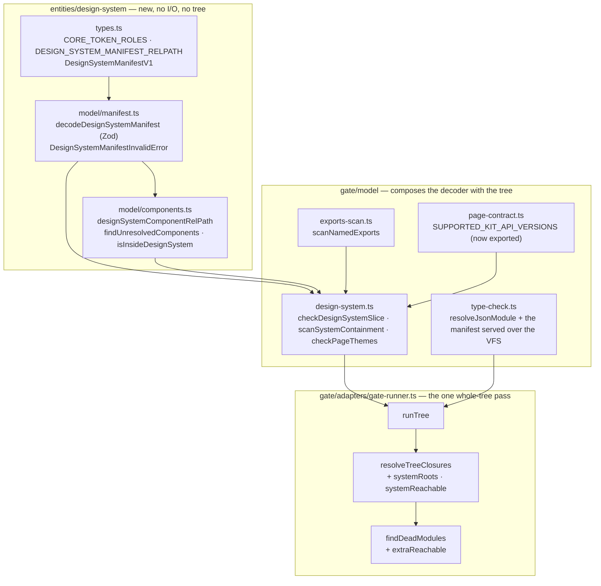

# P2 `manifest-and-gate` — Implementation Plan

> **For agentic workers:** REQUIRED SUB-SKILL: Use superpowers:subagent-driven-development
> (recommended) or superpowers:executing-plans to implement this plan task-by-task. Steps use
> checkbox (`- [ ]`) syntax for tracking. Load `/reatom` and `/errore` before any code-related
> action (CLAUDE.md mandate). Every task ends green and is one commit.

**Goal:** Teach termcraft what a project-owned design system *is* — a Zod-decoded
`design/system/design-system.json` entity — and make the Gate enforce every §7 fatal about it,
including serving that manifest through the type-check VFS so a token name is a real type.

**Architecture:** One new `entities/` module (`entities/design-system`) owns the manifest
vocabulary, its Zod schema, its decoder and its component-path resolution — no I/O, no tree, no
Gate knowledge. `gate/model/design-system.ts` composes that decoder with the tree it holds
(component resolution, named-export presence, `kitApiVersion`, `system/` import containment,
`meta.theme` membership) and returns ordinary `GateError`s. `gate/adapters/gate-runner.ts`'s
`runTree` — the one whole-tree pass — calls it, feeds the manifest's `components[]` entries into
the closure walk as additional roots, and folds their reachable set into `findDeadModules`.
`gate/model/type-check.ts` gains `resolveJsonModule` and serves the manifest over the same virtual
filesystem it already serves code with.

**Tech Stack:** Bun ≥ 1.3.14, TypeScript 7.0.2 (`tsgo` via `typescript/unstable/sync`),
`zod@4.4.3`, `errore@0.14.1`, `bun:test`.

**Spec:** `docs/superpowers/specs/2026-08-11-project-design-systems-design.md` — §3.2, §4.1, §4.2,
§4.3, §5, §5.1, §7, §10.1 Wave 1 (P2), §11, §13.

---

## Scope

**In scope (P2, Track A, Wave 1):**

1. `src/entities/design-system/` — the manifest vocabulary, Zod schema, decoder, component-path
   resolution (spec §3.2, §4.1, §4.2).
2. Every §7 **fatal**: manifest fails its schema; a `components[]` entry does not resolve inside
   `system/` or its module does not export the named binding; an import inside `system/` leaves
   `system/`; a theme omits a core role; token names differ between themes; a token value is not
   lowercase `#rrggbb`; `defaultTheme` or a page's `meta.theme` names an undeclared theme;
   `kitApiVersion` outside the supported set.
3. `design-system.json` served through the type-check VFS with `resolveJsonModule: true`
   (spec §4.3, §7).
4. The manifest's `components[]` entries as additional closure-walk roots, feeding
   `findDeadModules` (spec §7).
5. The `system/` import-containment boundary (spec §5.1).
6. Verification (not rebuilding) that a relative `.json` specifier already resolves as a closure
   leaf with no `UNSCANNED_IMPORT` (spec §7).

**Explicitly NOT in scope — do not touch these, another plan owns them:**

| Not here | Owner |
| --- | --- |
| `Color`, `useTokens<T>()`, `ThemeId` widening, optional `PageMeta.theme`, the fourteen components retyped, `.d.ts` regeneration | **P1** `runtime-color-model` |
| Host wiring, the project-create scaffold, the v2→v3 migration + migration prompt, the §7 **warnings** (`useTokens()` at module scope; the token-name rewrite hint), the agent prompt and authoring guide | **P4** `integration-spine` |
| The `DesignSystemSource` port, `sources.json`, the local adapter, trust-subject variant | **P3** |
| Install, picker, publish, provenance | **P10** |
| OpenTUI wrappers, `Box` layout expansion | **P5–P9** |

**Nothing under `examples/` is edited by this plan** (spec §9: example projects migrate at runtime
when opened, never by hand).

---

## Global Constraints

Every task's requirements implicitly include this section.

- **Errors as values.** `import * as errore from "errore"` (namespace import, never destructured).
  No `throw` for an expected failure; every decoder returns `TaggedError | T`; check with
  `if (x instanceof Error) return x` on one line; happy path at root indentation. The only
  `errore.try` boundaries in this plan are `JSON.parse` and the token readers that can throw
  (`scanNamedExports`, `scanModuleEdges`, `checkPageContract`) — and the repo's call shape is the
  object form already used in `entities/design-tree/model/manifest.ts`:
  `errore.try({ try: () => …, catch: (cause) => … })`.
- **Zod for decoding.** `zod@4.4.3`. **Never call `.finite()`** — in Zod v4 `z.number()` already
  rejects `NaN`/`Infinity` and `.finite()` is a no-op. Use `z.strictObject` where unknown keys must
  be rejected (the manifest) — `entities/pin` uses plain `z.object` deliberately for
  forward-compatible JSONL, which is a different contract.
- **No Reatom code is touched by this plan.** Do not run `/reatom-audit`; state that in the
  closeout commit body.
- **No `any`.** No `as` casts except the one documented `as unknown` shape the repo already uses
  for `JSON.parse` results (`JSON.parse(text) as unknown`).
- **Imports.** Cross-module imports use the top-level aliases (`entities/design-system`,
  `entities/design-tree`, `runtime`). Relative imports only inside one module. `entities/*` is
  already covered by `tsconfig.json`'s wildcard — **no `tsconfig.json` change is needed** for the
  new module, and none may be made.
- **Module layout.** `entities/design-system/{types.ts, index.ts, model/}` — code never sits loose
  at the module root; `types.ts` holds shared types, `index.ts` is the public entry point.
- **Ring direction.** `entities/` may not import `gate`, `runtime`, `core`, `host` or `store` in
  production code. A **test** may `import type` from `runtime` (type-only imports are erased, so
  the module is never loaded); that is exactly what Task 1's drift assertion does.
- **Path vocabulary — the single most common way to get this wrong.** Inside `gate`'s whole-tree
  pass every `file` is **tree-relative** (relative to `design/`), so the manifest is
  `system/design-system.json`, **never** `design/system/design-system.json`. The only
  project-relative Gate path in the codebase is `gate/model/manifest.ts`'s `MANIFEST_FILE`
  (`design/pages.json`), and `gate/adapters/gate-runner.ts`'s `duplicateSlugBlocker` records why
  the two must not be mixed inside one error list.
- **Diagnostics are bounded plain text**, never terminal control sequences.
- **Tests:** `bun test <path>` per task. The whole-suite gate is
  `bun run scripts/run-tests.ts <paths>` — a crashed run is **not** a pass (see
  `scripts/run-tests.ts`), and a `bun test` segfault is a known flake: re-run before calling it a
  regression. `src/ui` and `src/entrypoint` render tests must run as separate commands; this plan
  touches neither.
- **Commands are prefixed with `rtk`** (CLAUDE.md). Use single-line `-m` commit messages — a
  heredoc into `rtk git commit` is swallowed; if a multi-line message is genuinely needed, write it
  to a scratch file and pass `-F <path>`.
- **Every task ends with `rtk bun run lint` and `rtk bun run fmt:check` clean** for the files it
  touched, then one commit.

---

## Decisions this plan makes, and where it corrects the spec

Each was read in the code at branch `project-design-systems` and is cited. **The spec's design
survives intact; these are implementation-level rulings it left open, plus one deliberate
relocation.**

**D1 — the `system/` containment check does NOT ride the closure walk's edge rejection, and that
is a correction to §5.1.** §5.1 says the check "belongs in the existing closure walk
(`src/entities/design-tree/model/closure.ts`) as one boundary". Implemented literally, a
containment violation would come back from `resolveClosure` as a `SpecifierRejectedError` and land
in `walkPageClosure`'s `edge-rejected` blocker — whose `own` is **suppressed** whenever
`context.scannedInFull(from)` is true (`src/gate/adapters/gate-runner.ts:484-493`). That
suppression is correct for every existing rejection code, because the flat allowlist scan reports
the identical rejection through the identical `resolveDesignSpecifier`. It would be *false* for
containment: the flat scan knows nothing about `system/`, so the fatal would be suppressed and the
violation would vanish. A second reason: the closure walk only reaches files some root walks to, so
a `system/` file no root reaches would never be checked — and "the folder is self-contained" is a
property of the whole folder, not of its reachable part.

So containment is its own pass, `scanSystemContainment` (Task 5), over **every** code file under
`system/`. It is not a second reading of the import graph: it uses the *same* `scanModuleEdges` and
the *same* `resolveDesignSpecifier` the closure walk and the flat allowlist scan share, so the
three cannot disagree about what a file imports.

**D2 — `kitApiVersion` support is checked in `gate`, not in the entity.** The entity's schema
accepts any positive integer; the supported *set* lives in
`src/gate/model/page-contract.ts:7`'s `SUPPORTED_KIT_API_VERSIONS`, and `entities/` may not import
`gate`. Task 4 exports that constant from `page-contract.ts` (it is module-private today) and
compares against it — reusing the existing machinery rather than writing a second list, exactly as
spec §3.3 asks. The diagnostic reuses the existing `UNSUPPORTED_KIT_API` code name.

**D3 — the seventeen core roles are declared in the entity, with a compile-time drift guard.**
`entities/` may not import `runtime`, so `CORE_TOKEN_ROLES` is a literal tuple in
`entities/design-system/types.ts`. A *test* pins it against `runtime`'s own `ThemeTokens` with a
type-level exact-equality assertion (`import type { ThemeTokens } from "runtime"`), so a divergence
is a compile error rather than a silent drift. **Merge note for sync point 1:** P1 retypes
`src/runtime/types.ts`; if it renames or relocates `ThemeTokens`, this one test import moves with
it. The seventeen names, read at `src/runtime/types.ts:23-58`: `background`, `surface`,
`foreground`, `foregroundMuted`, `foregroundFaint`, `border`, `line`, `accent`, `accentHi`,
`accentDim`, `selection`, `selectionFg`, `success`, `warning`, `danger`, `dangerDim`, `statusBg`.

**D4 — two grammars the spec leaves open, decided here, and enforced by the schema (so they fall
under §7's "the manifest fails its schema" fatal, not a new one).**
- A **token name** must be a valid JavaScript identifier — `/^[A-Za-z_$][A-Za-z0-9_$]*$/`. §4.3
  teaches `t.brandBlue` as the checked access path; a name that cannot be written that way would
  make the taught path fail for reasons the author could not have anticipated.
- A **theme id** (a key of `themes`) must be a kebab slug — `/^[a-z0-9]+(?:-[a-z0-9]+)*$/`. It is
  written into `meta.theme`, into `HostSessionSpec.theme`, and into the scaffold's literal indexed
  access `["themes"]["dark"]["tokens"]` (§4.3).

**D5 — `meta.theme` stays REQUIRED in this plan.** Spec §4.6 makes `PageMeta.theme` optional, but
§10.1 confines P1 to `src/runtime` and the generated declaration, so nothing in P2's blast radius
owns `entities/page`'s `PageMeta` or `gate/model/page-contract.ts`'s `validateMetaShape`. P2 must
therefore **not** change requiredness. Task 6's check is written so it is correct either way: it
fires only when a page's parsed `meta` carries a non-empty `theme` string that names no declared
theme. When P1/P4 make it optional, an absent theme simply skips the check with no edit here.

**D6 — an unresolvable `components[]` entry carries no `blockedPages`, deliberately.** It names no
page, and attributing it to every page would be a fabricated claim. Consequence, stated rather than
discovered: in `core/kernel`'s `buildPageDescriptors` path a fatal with a `file` and no
`blockedPages` is the documented "orphan module" case — it is logged, and invalidates no
descriptor. In the turn path (`core/turns/model/validation.ts`) it rejects the turn like any other
fatal, which is the enforcement point that matters. Same for every manifest-level fatal, exactly as
`design/pages.json`'s own manifest fatals behave today.

**D7 — `checkPageContract` is run a second time inside `runTree`, for the `meta.theme` check
only.** `runTree` holds `pages` and `files` but no meta. The alternative — widening the
`GateRunner` port so `runPage` receives the declared theme set — changes `core/ports` and every
caller, for one string comparison. The cost is one extra token scan per **page entry** (not per
tree file); the measured whole-tree budget is 2.3 MB across 128 files in 453 ms
(`core/turns/model/validation.ts`'s own `files` doc), so a handful of entry re-scans is noise. The
call is wrapped in `errore.try` exactly the way `extractPageMeta` wraps the identical call
(`gate/adapters/gate-runner.ts:1111-1114`); an unreadable source yields no theme diagnostic,
because that page already carries its own contract fatal.

**D8 — the transitional rule (spec §9), stated as one sentence the code enforces in one place.**
*Every design-system Gate check — the decode, the component roots, the containment scan, the
`meta.theme` membership check — activates if and only if `system/design-system.json` is present in
the tree.* A tree without it is judged exactly as it is judged today, with no new diagnostic of any
kind. After P4 lands, every project has one (§9); before then, and for any tree that predates the
migration, absence is silence. Three sub-rules make "present" unambiguous:
- present in `treePaths` **and** in `files` → all checks run;
- present in `treePaths`, absent from `files` (no text given) → **one** fatal
  `DESIGN_SYSTEM_SOURCE_MISSING`, and dead-module is suppressed for the whole tree. This mirrors
  `CLOSURE_SOURCE_MISSING`'s honesty rule: an unread manifest is not an absent one.
- absent from `treePaths` → nothing runs, and `system/` files (if any exist without a manifest) are
  ordinary tree files.

**D9 — `system/tokens.ts` is NOT an implicit closure root, and that has a visible consequence.**
The spec names `components[]` as the additional roots and nothing else. A project whose pages do
not yet import `system/tokens.ts` — precisely the red migration window §9 accepts — will therefore
see a `dead-module` **warning** on it. That is a warning, never a fatal, and the same window
already fails every page on the `Color` type change. Recorded here as a known consequence for P4 to
revisit if it proves noisy; not fixed by inventing a root the spec does not declare.

**D10 — the `.json` closure-leaf claim is verified, not rebuilt, and it holds.** Read at
`src/entities/design-tree/model/specifier.ts:150` (`has(base)` resolves an exact path with an
extension, so `./design-system.json` resolves whenever the file is in the inventory),
`src/entities/design-tree/model/code-file.ts:119` (`isCodeFile(".json")` is false, so
`readClosureEdges` returns `[]` — a leaf with no outgoing edges), and
`src/gate/model/tree-scan.ts:147-152` (`isTrustedTarget` returns **true** for a non-code file, so
`scanImportAllowlist` raises no `UNSCANNED_IMPORT` on it). Task 5 pins all three as tests rather
than trusting the reading.

---

## Architecture



**What does NOT change:** `core/ports/gate-runner.ts` (no new port field, no new
`GateErrorKind`/`GateWarningKind` — every design-system fatal is `manifest`-kind, and containment
is `import`-kind), `gate/model/manifest.ts` (`design/pages.json` is untouched),
`gate/model/import-scan.ts`, `gate/model/lints.ts`, `entities/design-tree/model/specifier.ts`,
`entities/design-tree/model/closure.ts`, `tsconfig.json`, and every `core/` caller of `runTree`.

**The complete new diagnostic vocabulary** (all `file`-bearing, all fatal):

| code | kind | `file` | raised by |
| --- | --- | --- | --- |
| *(the decoder's own code — `JSON_PARSE`, a Zod field path, `MISSING_CORE_ROLE`, `TOKEN_PARITY`, `DEFAULT_THEME_UNDECLARED`, `DUPLICATE_COMPONENT`)* | `manifest` | `system/design-system.json` | Task 4 |
| `DESIGN_SYSTEM_SOURCE_MISSING` | `manifest` | `system/design-system.json` | Task 4 |
| `UNSUPPORTED_KIT_API` | `manifest` | `system/design-system.json` | Task 4 |
| `DESIGN_SYSTEM_COMPONENT_UNRESOLVED` | `manifest` | `system/design-system.json` | Task 4 |
| `DESIGN_SYSTEM_COMPONENT_EXPORT_MISSING` | `manifest` | the component's module path | Task 4 |
| `SYSTEM_IMPORT_ESCAPES` | `import` | the importing `system/` file | Task 5 |
| `UNDECLARED_PAGE_THEME` | `manifest` | the page's entry path | Task 6 |
| `DESIGN_SYSTEM_COMPONENT_UNWALKABLE` | `manifest` | the component's module path | Task 6 |

Codes are **not** prefixed beyond what is written above, matching `design/pages.json`'s precedent
(`gate/model/manifest.ts`'s `fromDecodeError` reuses the decoder's own code verbatim); the `file`
is what disambiguates one manifest from the other.

---

## What this plan read before it was written

Read at branch `project-design-systems`. No task needs to re-derive any of it.

- `src/gate/model/type-check.ts` — `SYNTHESIZED_COMPILER_OPTIONS` (:122), `synthesizeTreeTsconfig`
  (:140), `buildSyntheticTree` (:257), `createTreeVirtualFs`'s **five** hooks (:301), and
  `runTreeTypeCheck`'s "difference #1" — only `isCodeFile` paths reach the compiler or the VFS
  (:365-369). The `.json` gap §7 names is exactly there.
- `src/gate/adapters/gate-runner.ts` — `resolveTreeClosures` (:605), `walkPageClosure` (:424),
  `readClosureEdges` (:333), `findDeadModules` (:711) and its whole-tree suppression on
  `anyClosureBlocked`, `createClosureIndex`/`attributeToReachingPages` (:155/:207), and `runTree`
  (:1041).
- `src/entities/design-tree/model/manifest.ts` — the decoder shape this plan mirrors: a tagged
  error with `$code`/`$reason`, `errore.try` around `JSON.parse`, `fromZod` dropping numeric path
  segments so a code names the field and never an array index, cross-field rules after
  `safeParse`, and `findUnresolvedEntries` kept separate because it needs the tree the decoder
  never sees.
- `src/entities/pin/model/decode.ts` — the Zod pilot: `toDecodeError` off `error.issues[0]`,
  `safeParse` + `if (!result.success) return …`.
- `src/gate/model/page-contract.ts:7` — `SUPPORTED_KIT_API_VERSIONS`, module-private today.
- `src/runtime/types.ts:23-58` — the seventeen `ThemeTokens` roles.
- `src/gate/model/import-scan.ts:483-495` and `src/gate/model/tree-scan.ts:147-152` — why a
  `.json` target raises no `UNSCANNED_IMPORT`.
- `src/core/turns/model/validation.ts:140-160` — `files` holds **every** tree file's text with no
  filter of `core`'s own, so `system/design-system.json`'s text is in `runTree`'s input.
- `src/gate/model/type-check.test.ts:1-40` — the real-compiler harness (`TSC_EXE`, `withTsc`,
  `TIMEOUT_MS`, the hand-written stand-in `runtimeDts`) Task 2's fixtures extend.

---

## Task order and dependencies

```
T0 baseline
 └─ T1 entities/design-system            (no dependencies)
     ├─ T2 type-check VFS + resolveJsonModule   (needs only a manifest fixture — RISK FIRST)
     ├─ T3 scanNamedExports                     (independent, pure)
     └─ T4 gate/model/design-system.ts          (needs T1 + T3)
         └─ T5 scanSystemContainment + the .json-leaf pins   (needs T1)
             └─ T6 runTree wiring                            (needs T4 + T5)
                 └─ T7 closeout
```

T2 is ordered second on purpose: it carries the one genuinely empirical unknown in this plan (does
`tsgo` accept `resolveJsonModule` with `module: "esnext"` + `moduleResolution: "bundler"`, and does
a default JSON import type-check under it). Surfacing that on task two rather than task six is the
difference between a documented fallback and a rewrite.

---

### Task 0: Baseline

**Files:** none modified.

- [ ] **Step 1: Confirm the tree is green before anything changes**

```bash
rtk bun run scripts/run-tests.ts src/gate src/entities
```

Expected: a summary line and exit 0. If the run reports `crashed`, re-run once — a `bun test`
segfault is a known flake and a crashed run is never a pass. If it *fails*, stop and report: this
plan must not start on a red tree.

- [ ] **Step 2: Record the baseline counts**

```bash
rtk bun test src/gate/adapters/gate-runner.test.ts 2>&1 | tail -5
rtk bun test src/gate/model/type-check.test.ts 2>&1 | tail -5
```

Note the pass counts in your task report. Tasks 2 and 6 must not reduce them.

---

### Task 1: The `entities/design-system` module

Spec §3.2, §4.1, §4.2. Blocks Tasks 2, 4, 5, 6.

**Files:**
- Create: `src/entities/design-system/types.ts`
- Create: `src/entities/design-system/model/manifest.ts`
- Create: `src/entities/design-system/model/components.ts`
- Create: `src/entities/design-system/model/manifest.fixture.ts` — the spec §3.2 manifest as data,
  shared by four test files. **It is a plain module, not a `.test.ts`**, and that is not a style
  choice: importing one test file from another makes Bun evaluate its `describe`/`test`
  registrations inside the importing file's run too, so every case would execute once per importer.
  It is deliberately NOT exported from `index.ts` — it is test support, not public surface, the
  same standing `src/core/ports/fakes/` has.
- Create: `src/entities/design-system/index.ts`
- Test: `src/entities/design-system/model/manifest.test.ts`
- Test: `src/entities/design-system/model/components.test.ts`

**Interfaces:**
- Consumes: `zod`, `errore`. Nothing from this repository except the type-only `ThemeTokens` import
  inside the test (D3).
- Produces (every later task binds to these exact names):
  ```ts
  export const DESIGN_SYSTEM_DIRNAME: "system";
  export const DESIGN_SYSTEM_MANIFEST_RELPATH: "system/design-system.json";
  export const DESIGN_SYSTEM_SCHEMA_VERSION: 1;
  export const CORE_TOKEN_ROLES: readonly [
    "background", "surface", "foreground", "foregroundMuted", "foregroundFaint",
    "border", "line", "accent", "accentHi", "accentDim", "selection", "selectionFg",
    "success", "warning", "danger", "dangerDim", "statusBg",
  ];
  export type CoreTokenRole = (typeof CORE_TOKEN_ROLES)[number];

  export interface DesignSystemThemeV1 {
    readonly label: string;
    readonly tokens: Readonly<Record<string, string>>;
  }
  export interface DesignSystemComponentV1 {
    readonly name: string;
    /** POSIX path RELATIVE TO `system/` — e.g. `components/Button.tsx`. */
    readonly module: string;
    readonly export: string;
  }
  export interface DesignSystemManifestV1 {
    readonly schemaVersion: typeof DESIGN_SYSTEM_SCHEMA_VERSION;
    readonly id: string;
    readonly name: string;
    readonly version: string;
    readonly kitApiVersion: number;
    readonly defaultTheme: string;
    readonly themes: Readonly<Record<string, DesignSystemThemeV1>>;
    readonly components: readonly DesignSystemComponentV1[];
  }

  export class DesignSystemManifestInvalidError extends errore.createTaggedError({
    name: "DesignSystemManifestInvalidError",
    message: "design/system/design-system.json is invalid [$code]: $reason",
  }) {}

  export function decodeDesignSystemManifest(
    text: string,
  ): DesignSystemManifestInvalidError | DesignSystemManifestV1;

  /** `system/${component.module}` — the TREE-relative path of a declared component. */
  export function designSystemComponentRelPath(component: DesignSystemComponentV1): string;

  export function findUnresolvedComponents(input: {
    readonly manifest: DesignSystemManifestV1;
    readonly has: (relPath: string) => boolean;
  }): readonly DesignSystemComponentV1[];

  /** True for a TREE-relative path inside the design system's own folder. */
  export function isInsideDesignSystem(relPath: string): boolean;
  ```

- [ ] **Step 1: Write the shared fixture**

`src/entities/design-system/model/manifest.fixture.ts` — the spec §3.2 manifest verbatim, returned
fresh on every call so a test can mutate one field without leaking into the next.

```ts
/**
 * The design-systems spec §3.2 manifest, as plain data. TEST SUPPORT: shared by this module's own
 * tests and by `gate`'s (`design-system.test.ts`, `gate-runner.test.ts`), so the seventeen core
 * hex values are written exactly once in this repository. Deliberately NOT exported from
 * `index.ts` — nothing in production reads it.
 *
 * Returns a FRESH object every call: every caller mutates one field to build a rejection case, and
 * a shared constant would leak that mutation into the next test.
 */
export function validManifestObject(): Record<string, unknown> {
  return {
    schemaVersion: 1,
    id: "midnight",
    name: "Midnight",
    version: "1.2.0",
    kitApiVersion: 1,
    defaultTheme: "dark",
    themes: {
      dark: {
        label: "Midnight Dark",
        tokens: {
          background: "#0b0f14", surface: "#131a24", foreground: "#c8d3e0",
          foregroundMuted: "#7d8ea3", foregroundFaint: "#4a5a6e", border: "#243244",
          line: "#1a2430", accent: "#4cc9f0", accentHi: "#8ae3ff", accentDim: "#2b7f9b",
          selection: "#16324a", selectionFg: "#8ae3ff", success: "#06d6a0",
          warning: "#ffd166", danger: "#ef476f", dangerDim: "#4a1c2a", statusBg: "#131a24",
          brandBlue: "#4cc9f0", chartSeries1: "#7b2cbf",
        },
      },
    },
    components: [
      { name: "Button", module: "components/Button.tsx", export: "Button" },
      { name: "PageShell", module: "components/PageShell.tsx", export: "PageShell" },
    ],
  };
}
```

- [ ] **Step 2: Write the failing decoder tests**

`src/entities/design-system/model/manifest.test.ts`:

```ts
import { describe, expect, test } from "bun:test";

import type { ThemeTokens } from "runtime";

import { CORE_TOKEN_ROLES } from "../types";
import type { CoreTokenRole } from "../types";
import { validManifestObject } from "./manifest.fixture";
import { DesignSystemManifestInvalidError, decodeDesignSystemManifest } from "./manifest";

/** D3's drift guard: a compile error the moment the entity's roles and `ThemeTokens` diverge. */
type Exact<A, B> = [A] extends [B] ? ([B] extends [A] ? true : false) : false;
const _rolesMatchThemeTokens: Exact<CoreTokenRole, keyof ThemeTokens> = true;

const decode = (o: unknown) => decodeDesignSystemManifest(JSON.stringify(o));

describe("decodeDesignSystemManifest", () => {
  test("the spec §3.2 manifest round-trips", () => {
    const result = decode(validManifestObject());
    expect(result).not.toBeInstanceOf(Error);
    if (result instanceof Error) return;
    expect(result.id).toBe("midnight");
    expect(result.defaultTheme).toBe("dark");
    expect(Object.keys(result.themes)).toEqual(["dark"]);
    expect(result.themes.dark?.tokens.brandBlue).toBe("#4cc9f0");
    expect(result.components.map((c) => c.name)).toEqual(["Button", "PageShell"]);
  });

  test("invalid JSON is JSON_PARSE, never a throw", () => {
    const result = decodeDesignSystemManifest("{ not json");
    expect(result).toBeInstanceOf(DesignSystemManifestInvalidError);
    if (!(result instanceof DesignSystemManifestInvalidError)) return;
    expect(result.code).toBe("JSON_PARSE");
  });

  test.each([
    ["schemaVersion", (o: any) => { o.schemaVersion = 2; }, "schemaVersion"],
    ["an unknown top-level key", (o: any) => { o.extra = 1; }, "SHAPE"],
    ["a missing id", (o: any) => { delete o.id; }, "id"],
    ["a non-slug id", (o: any) => { o.id = "Mid Night"; }, "id"],
    ["an empty name", (o: any) => { o.name = ""; }, "name"],
    ["an empty version", (o: any) => { o.version = ""; }, "version"],
    ["a zero kitApiVersion", (o: any) => { o.kitApiVersion = 0; }, "kitApiVersion"],
    ["a fractional kitApiVersion", (o: any) => { o.kitApiVersion = 1.5; }, "kitApiVersion"],
    ["an empty themes map", (o: any) => { o.themes = {}; }, "themes"],
    ["a non-slug theme id", (o: any) => { o.themes.Dark = o.themes.dark; delete o.themes.dark; o.defaultTheme = "Dark"; }, "themes"],
    ["a theme with no label", (o: any) => { delete o.themes.dark.label; }, "themes.label"],
    ["an uppercase hex value", (o: any) => { o.themes.dark.tokens.accent = "#4CC9F0"; }, "themes.tokens"],
    ["a three-digit hex value", (o: any) => { o.themes.dark.tokens.accent = "#abc"; }, "themes.tokens"],
    ["a named colour", (o: any) => { o.themes.dark.tokens.accent = "blue"; }, "themes.tokens"],
    ["a token name that is not an identifier", (o: any) => { o.themes.dark.tokens["chart-1"] = "#111111"; }, "themes.tokens"],
    ["a component with no export", (o: any) => { delete o.components[0].export; }, "components.export"],
    ["a component module that escapes system/", (o: any) => { o.components[0].module = "../lib/x.tsx"; }, "components.module"],
    ["a component module with a backslash", (o: any) => { o.components[0].module = "components\\Button.tsx"; }, "components.module"],
    ["an absolute component module", (o: any) => { o.components[0].module = "/x.tsx"; }, "components.module"],
  ])("rejects %s under code %s", (_label, mutate, code) => {
    const o = validManifestObject();
    mutate(o);
    const result = decode(o);
    expect(result).toBeInstanceOf(DesignSystemManifestInvalidError);
    if (!(result instanceof DesignSystemManifestInvalidError)) return;
    expect(result.code).toBe(code);
  });

  test.each(CORE_TOKEN_ROLES)("a theme omitting the core role %s is MISSING_CORE_ROLE", (role) => {
    const o = validManifestObject() as any;
    delete o.themes.dark.tokens[role];
    const result = decode(o);
    expect(result).toBeInstanceOf(DesignSystemManifestInvalidError);
    if (!(result instanceof DesignSystemManifestInvalidError)) return;
    expect(result.code).toBe("MISSING_CORE_ROLE");
    expect(result.message).toContain(role);
  });

  test("a token declared in one theme but not another is TOKEN_PARITY", () => {
    const o = validManifestObject() as any;
    o.themes.light = { label: "Midnight Light", tokens: { ...o.themes.dark.tokens } };
    delete o.themes.light.tokens.brandBlue;
    const result = decode(o);
    expect(result).toBeInstanceOf(DesignSystemManifestInvalidError);
    if (!(result instanceof DesignSystemManifestInvalidError)) return;
    expect(result.code).toBe("TOKEN_PARITY");
    expect(result.message).toContain("brandBlue");
  });

  test("two themes with identical token names decode", () => {
    const o = validManifestObject() as any;
    o.themes.light = { label: "Midnight Light", tokens: { ...o.themes.dark.tokens } };
    expect(decode(o)).not.toBeInstanceOf(Error);
  });

  test("defaultTheme naming an undeclared theme is DEFAULT_THEME_UNDECLARED", () => {
    const o = validManifestObject() as any;
    o.defaultTheme = "light";
    const result = decode(o);
    expect(result).toBeInstanceOf(DesignSystemManifestInvalidError);
    if (!(result instanceof DesignSystemManifestInvalidError)) return;
    expect(result.code).toBe("DEFAULT_THEME_UNDECLARED");
  });

  test("two components sharing a name is DUPLICATE_COMPONENT", () => {
    const o = validManifestObject() as any;
    o.components[1].name = "Button";
    const result = decode(o);
    expect(result).toBeInstanceOf(DesignSystemManifestInvalidError);
    if (!(result instanceof DesignSystemManifestInvalidError)) return;
    expect(result.code).toBe("DUPLICATE_COMPONENT");
  });

  test("an empty components array is legal", () => {
    const o = validManifestObject() as any;
    o.components = [];
    expect(decode(o)).not.toBeInstanceOf(Error);
  });

  test("a code never names an array index", () => {
    const o = validManifestObject() as any;
    delete o.components[1].export;
    const result = decode(o);
    expect(result).toBeInstanceOf(DesignSystemManifestInvalidError);
    if (!(result instanceof DesignSystemManifestInvalidError)) return;
    expect(result.code).toBe("components.export"); // NOT `components.1.export`
  });
});
```

`src/entities/design-system/model/components.test.ts`:

```ts
import { describe, expect, test } from "bun:test";

import { validManifestObject } from "./manifest.fixture";
import { decodeDesignSystemManifest } from "./manifest";
import {
  designSystemComponentRelPath,
  findUnresolvedComponents,
  isInsideDesignSystem,
} from "./components";

const manifest = (() => {
  const m = decodeDesignSystemManifest(JSON.stringify(validManifestObject()));
  if (m instanceof Error) throw new Error("fixture manifest must decode");
  return m;
})();

describe("designSystemComponentRelPath", () => {
  test("prefixes the module with the system directory", () => {
    expect(designSystemComponentRelPath(manifest.components[0]!)).toBe(
      "system/components/Button.tsx",
    );
  });
});

describe("findUnresolvedComponents", () => {
  test("returns nothing when every module names a tree file", () => {
    const present = new Set(["system/components/Button.tsx", "system/components/PageShell.tsx"]);
    expect(findUnresolvedComponents({ manifest, has: (p) => present.has(p) })).toEqual([]);
  });

  test("returns exactly the entries whose module names no tree file", () => {
    const present = new Set(["system/components/Button.tsx"]);
    const unresolved = findUnresolvedComponents({ manifest, has: (p) => present.has(p) });
    expect(unresolved.map((c) => c.name)).toEqual(["PageShell"]);
  });

  test("resolution is exact — there is no extension probing", () => {
    const present = new Set(["system/components/Button.ts", "system/components/PageShell.tsx"]);
    const unresolved = findUnresolvedComponents({ manifest, has: (p) => present.has(p) });
    expect(unresolved.map((c) => c.name)).toEqual(["Button"]);
  });
});

describe("isInsideDesignSystem", () => {
  test.each([
    ["system/tokens.ts", true],
    ["system/components/Button.tsx", true],
    ["system/design-system.json", true],
    ["pages/dashboard.tsx", false],
    ["lib/time.ts", false],
    ["systemic/x.ts", false], // prefix, not a directory boundary
    ["system", false],        // the directory itself is not a file inside it
  ])("%s -> %s", (relPath, expected) => {
    expect(isInsideDesignSystem(relPath)).toBe(expected);
  });
});
```

- [ ] **Step 3: Run to verify they fail**

```bash
rtk bun test src/entities/design-system/
```
Expected: FAIL — the modules do not exist.

- [ ] **Step 4: Write `types.ts`**

```ts
/**
 * The design system's own folder name inside the design tree (design-systems §3.1). TREE-relative
 * paths are relative to `design/`, so a design-system file is `system/…`, never `design/system/…`
 * — the one path vocabulary the whole Gate whole-tree pass speaks.
 */
export const DESIGN_SYSTEM_DIRNAME = "system";

/** The manifest's TREE-relative path (design-systems §3.2). */
export const DESIGN_SYSTEM_MANIFEST_RELPATH = `${DESIGN_SYSTEM_DIRNAME}/design-system.json`;

/** The only shipped manifest schema version (design-systems §3.2). */
export const DESIGN_SYSTEM_SCHEMA_VERSION = 1;

/**
 * The core token roles EVERY theme must declare (design-systems §4.1). The names are required;
 * the values are the project's. The component catalog binds to these — `Panel` with no
 * `borderColor` means `border`, status semantics mean `success`/`warning`/`danger` — so without a
 * required core every component prop becomes mandatory at every call site.
 *
 * DECLARED HERE RATHER THAN IMPORTED from `runtime/types.ts`'s `ThemeTokens`, which is the real
 * source: `entities/` may not import `runtime`. The divergence is not left to prose — 
 * `manifest.test.ts` carries a type-level exact-equality assertion against `keyof ThemeTokens`, so
 * a drift is a compile error, not a silent one.
 */
export const CORE_TOKEN_ROLES = [
  "background", "surface", "foreground", "foregroundMuted", "foregroundFaint",
  "border", "line", "accent", "accentHi", "accentDim", "selection", "selectionFg",
  "success", "warning", "danger", "dangerDim", "statusBg",
] as const;

export type CoreTokenRole = (typeof CORE_TOKEN_ROLES)[number];
```

…followed by the four interfaces exactly as written in this task's **Interfaces** block. Give each
field a one-line doc comment naming the spec section it comes from.

- [ ] **Step 5: Write `model/manifest.ts`**

Mirror `entities/design-tree/model/manifest.ts` structurally — that file is the pattern, and this
one must not invent a second one.

```ts
import * as errore from "errore";
import { z } from "zod";

import { CORE_TOKEN_ROLES, DESIGN_SYSTEM_SCHEMA_VERSION } from "../types";
import type { DesignSystemManifestV1 } from "../types";

export class DesignSystemManifestInvalidError extends errore.createTaggedError({
  name: "DesignSystemManifestInvalidError",
  message: "design/system/design-system.json is invalid [$code]: $reason",
}) {}

/** A kebab slug — a design-system id and every theme id (decision D4). */
const slugSchema = z
  .string()
  .regex(/^[a-z0-9]+(?:-[a-z0-9]+)*$/, { error: "must be a lowercase kebab slug" });

/** A token NAME must be writable as `t.<name>` — §4.3's taught access path (decision D4). */
const tokenNameSchema = z
  .string()
  .regex(/^[A-Za-z_$][A-Za-z0-9_$]*$/, { error: "must be a valid identifier" });

/** A token VALUE: lowercase `#rrggbb` (§4.1). Uppercase is rejected, never normalized — the
 *  manifest's bytes feed `treeRevision`, so a decoder that rewrote them would invalidate caches
 *  for nothing and make two byte-different manifests look identical. */
const colorSchema = z
  .string()
  .regex(/^#[0-9a-f]{6}$/, { error: "must be a lowercase #rrggbb colour" });

/** A component `module`: a POSIX path relative to `system/`, with the same stored-address rules
 *  `entities/design-tree`'s `entryPathSchema` applies — no backslash, not absolute, no `.`/`..`
 *  segment, no empty segment. `..` is refused here rather than normalized: a component module is a
 *  stored address, and §5.1 forbids leaving `system/` anyway. */
const componentModuleSchema = z
  .string()
  .min(1)
  .refine((v) => !v.includes("\\"), { error: "`module` must use forward slashes" })
  .refine((v) => !v.startsWith("/"), { error: "`module` must be relative to system/" })
  .refine((v) => !/^[A-Za-z]:/.test(v), { error: "`module` must not be a drive path" })
  .refine((v) => !v.includes("//"), { error: "`module` must not contain an empty segment" })
  .refine(
    (v) => v.split("/").every((s) => s !== "" && s !== "." && s !== ".."),
    { error: "`module` must not contain `.` or `..` segments" },
  );

const themeSchema = z.strictObject({
  label: z.string().min(1),
  tokens: z.record(tokenNameSchema, colorSchema),
});

const componentSchema = z.strictObject({
  name: z.string().min(1),
  module: componentModuleSchema,
  export: z.string().min(1),
});

const designSystemManifestSchema = z.strictObject({
  schemaVersion: z.literal(DESIGN_SYSTEM_SCHEMA_VERSION),
  id: slugSchema,
  name: z.string().min(1),
  version: z.string().min(1),
  kitApiVersion: z.number().int().positive(),
  defaultTheme: slugSchema,
  themes: z
    .record(slugSchema, themeSchema)
    .refine((t) => Object.keys(t).length > 0, { error: "at least one theme is required" }),
  components: z.array(componentSchema),
});

function invalid(code: string, reason: string): DesignSystemManifestInvalidError {
  return new DesignSystemManifestInvalidError({ code, reason });
}

/**
 * The first Zod issue mapped onto the tagged error. Every NUMERIC path segment (a JSON array
 * index) is dropped before joining, so the code names the FIELD (`components.export`) and never
 * the index a particular issue happened to land on — the identical rule, and the identical
 * reason, as `entities/design-tree/model/manifest.ts`'s own `fromZod`.
 *
 * A `z.record` issue's path also carries the offending KEY (`themes.dark.tokens.accent`), which is
 * a string, not an index — so it survives the numeric filter and would make the code depend on the
 * project's own theme and token names. Record keys are dropped too, by taking only the path
 * segments that name a SCHEMA field: `themes`/`tokens`/`label` are schema fields, `dark` and
 * `accent` are data. The filter below keeps the segments that are keys of a known field set.
 */
const SCHEMA_FIELD_SEGMENTS: ReadonlySet<string> = new Set([
  "schemaVersion", "id", "name", "version", "kitApiVersion", "defaultTheme",
  "themes", "label", "tokens", "components", "module", "export",
]);

function fromZod(error: z.ZodError): DesignSystemManifestInvalidError {
  const issue = error.issues[0];
  const field = (issue?.path ?? [])
    .filter((segment): segment is string => typeof segment === "string")
    .filter((segment) => SCHEMA_FIELD_SEGMENTS.has(segment))
    .join(".");
  const code = field.length > 0 ? field : "SHAPE";
  return invalid(code, issue?.message ?? "invalid input");
}
```

So `["themes", "dark", "tokens", "accent"]` becomes `themes.tokens`, and
`["components", 1, "export"]` becomes `components.export`. When nothing survives, the code is
`SHAPE` (which is also what an unknown top-level key yields, since `z.strictObject`'s
unrecognized-key issue carries an empty path).

Then `decodeDesignSystemManifest`, in the shape the pages decoder uses — parse, `safeParse`, then
the cross-field rules that span the parsed data, each returning early:

```ts
export function decodeDesignSystemManifest(
  text: string,
): DesignSystemManifestInvalidError | DesignSystemManifestV1 {
  const parsed = errore.try({
    try: () => JSON.parse(text) as unknown,
    catch: (cause) => cause,
  });
  if (parsed instanceof Error) return invalid("JSON_PARSE", `not valid JSON: ${parsed.message}`);

  const result = designSystemManifestSchema.safeParse(parsed);
  if (!result.success) return fromZod(result.error);
  const manifest = result.data;

  // §4.1 — every theme declares every core role.
  for (const [themeId, theme] of Object.entries(manifest.themes)) {
    for (const role of CORE_TOKEN_ROLES) {
      if (theme.tokens[role] === undefined)
        return invalid(
          "MISSING_CORE_ROLE",
          `theme "${themeId}" omits the core token role "${role}"`,
        );
    }
  }

  // §4.2 — token-name parity across every theme of one system. Compared against the FIRST theme
  // in declaration order, in BOTH directions, so a name present in one and absent from the other
  // is caught whichever theme happens to carry it.
  const themeEntries = Object.entries(manifest.themes);
  const [referenceId, reference] = themeEntries[0]!; // the schema refuses an empty themes map
  const referenceNames = Object.keys(reference.tokens);
  for (const [themeId, theme] of themeEntries.slice(1)) {
    for (const name of referenceNames) {
      if (theme.tokens[name] === undefined)
        return invalid(
          "TOKEN_PARITY",
          `token "${name}" is declared in theme "${referenceId}" but not in theme "${themeId}"`,
        );
    }
    for (const name of Object.keys(theme.tokens)) {
      if (reference.tokens[name] === undefined)
        return invalid(
          "TOKEN_PARITY",
          `token "${name}" is declared in theme "${themeId}" but not in theme "${referenceId}"`,
        );
    }
  }

  // §7 — `defaultTheme` must name a declared theme.
  if (manifest.themes[manifest.defaultTheme] === undefined)
    return invalid(
      "DEFAULT_THEME_UNDECLARED",
      `defaultTheme "${manifest.defaultTheme}" is not one of the declared themes (${Object.keys(manifest.themes).sort().join(", ")})`,
    );

  // A duplicate component name would make `components[]` ambiguous for the agent prompt and the
  // picker alike; checked here because it spans array elements.
  const seenComponents = new Set<string>();
  for (const component of manifest.components) {
    if (seenComponents.has(component.name))
      return invalid(
        "DUPLICATE_COMPONENT",
        `"${component.name}" is declared more than once in \`components\``,
      );
    seenComponents.add(component.name);
  }

  return manifest;
}
```

Order matters and is asserted by the tests: core roles before parity (a theme missing a core role
would otherwise be reported as a parity break, which names the wrong fix).

- [ ] **Step 6: Write `model/components.ts`**

```ts
import { DESIGN_SYSTEM_DIRNAME } from "../types";
import type { DesignSystemComponentV1, DesignSystemManifestV1 } from "../types";

/**
 * The TREE-relative path of a declared component (design-systems §5). `module` is relative to
 * `system/`, so this is the one place the two are joined — a caller that concatenated it itself
 * would be a second reading of where a design system lives.
 */
export function designSystemComponentRelPath(component: DesignSystemComponentV1): string {
  return `${DESIGN_SYSTEM_DIRNAME}/${component.module}`;
}

/**
 * The declared components whose module names no file in the tree (design-systems §5: "the Gate
 * requires every entry to resolve to a real file inside `system/`"). Separated from the decoder
 * because it needs the inventory the decoder never sees — the same split
 * `entities/design-tree`'s `findUnresolvedComponents` counterpart `findUnresolvedEntries` makes.
 *
 * Resolution is EXACT: there is no extension probing here, unlike an import specifier. A manifest
 * entry is a stored address, and probing would let one manifest mean two different files.
 */
export function findUnresolvedComponents(input: {
  readonly manifest: DesignSystemManifestV1;
  readonly has: (relPath: string) => boolean;
}): readonly DesignSystemComponentV1[] {
  return input.manifest.components.filter(
    (component) => !input.has(designSystemComponentRelPath(component)),
  );
}

/**
 * True for a TREE-relative path inside the design system's folder (design-systems §5.1). The
 * trailing slash is load-bearing: `systemic/x.ts` is not inside `system/`, and the directory name
 * alone is not a file inside it.
 */
export function isInsideDesignSystem(relPath: string): boolean {
  return relPath.startsWith(`${DESIGN_SYSTEM_DIRNAME}/`);
}
```

- [ ] **Step 7: Write `index.ts`**

Export exactly the surface named in this task's **Interfaces** block — types with
`export type { … }`, values with `export { … }` — with a module header comment in the style of
`src/entities/pin/index.ts`. `manifest.fixture.ts` is **not** exported.

- [ ] **Step 8: Run the tests**

```bash
rtk bun test src/entities/design-system/
```
Expected: PASS, every case.

- [ ] **Step 9: Lint, format, commit**

```bash
rtk bun run lint && rtk bun run fmt:check
rtk git add src/entities/design-system && rtk git commit -m "feat(entities): the design-system manifest entity, schema and decoder"
```

---

### Task 2: `resolveJsonModule` and the manifest through the type-check VFS

Spec §4.3, §7. Needs Task 1 (for the fixture manifest only). Independent of Tasks 3–6.

**This task carries the plan's one empirical unknown.** Everything else is settled by reading.

**Files:**
- Modify: `src/gate/model/type-check.ts` — `SYNTHESIZED_COMPILER_OPTIONS` (:122-133),
  `synthesizeTreeTsconfig` (:140-145), `runTreeTypeCheck`'s file partition (:365-383),
  `createTreeVirtualFs` (:301-342), `toGateErrorTree`/`mapTreeDiagnostics` lookup map.
- Test: `src/gate/model/type-check.test.ts` — a new `describe` block at the end.

**Interfaces:**
- Consumes: `DESIGN_SYSTEM_MANIFEST_RELPATH` from `entities/design-system` (Task 1).
- Produces: no signature change. `createTreeTypeChecker`'s callable keeps
  `(input: { files: ReadonlyMap<string, string> }) => Promise<GateError[]>`.

- [ ] **Step 1: Probe the unknown before writing anything**

Two questions the compiler must answer, not the plan:

1. Does `tsgo` accept `resolveJsonModule: true` alongside `module: "esnext"` and
   `moduleResolution: "bundler"`, or does it raise `TS5071`?
2. Does `import ds from "./design-system.json"` type-check under those options without
   `esModuleInterop`, or does it raise `TS1259`/`TS2497`?

Write a throwaway probe (do **not** commit it) that calls the existing `createTreeTypeChecker`
with a two-file tree and the stand-in `runtimeDts` from `type-check.test.ts`, after you have made
the change in Step 3 — or, faster, run it first against a hand-written tsconfig with the real
`node_modules/@typescript/typescript-win32-x64/lib/tsc.exe`. Record the exact diagnostics.

**The documented fallbacks, in order — take the first that clears the probe, and record which one
you took in the commit body:**
- add `esModuleInterop: true` to `SYNTHESIZED_COMPILER_OPTIONS` (it changes no other behaviour the
  options' own doc comment depends on, but it MUST be recorded because that block is documented as
  a citable, byte-stable unit);
- failing that, keep `import ds from` unsupported and pin the working form (`import * as ds`) in
  the fixture, and **report it up** — §4.3's scaffold shape is P4's deliverable and would have to
  change with it. Do not silently write a different scaffold shape into the fixture without saying
  so.

- [ ] **Step 2: Write the failing fixtures**

Append to `src/gate/model/type-check.test.ts`, and add one import at the top of that file:
`import { validManifestObject } from "../../entities/design-system/model/manifest.fixture";`.
Note this suite's own conventions: `withTsc` skips cleanly when the platform package is absent, and
every real-compiler case passes `TIMEOUT_MS`.

```ts
// The stand-in facade this block needs on top of the file's existing one: `Color` and the generic
// `useTokens`. Deliberately hand-written rather than the REAL generated declaration — `useTokens`
// and `Color` are P1's deliverable and do not exist in `RUNTIME_DTS` yet. What this block proves
// is that the resolveJsonModule PATH is real; the real-declaration variant joins after sync
// point 1.
const tokensRuntimeDts = `declare module "@termcraft/runtime" {
  export type Color = \`#\${string}\`
  export function useTokens<T>(): T
  export function definePage(meta: { kitApiVersion: number; title: string; minSize: { w: number; h: number }; theme: string }): typeof meta
  export function reatomComponent<T>(render: () => T): () => T
  export function Text(props: { id: string; color: Color; children?: unknown }): string
}
`;
const tokensChecker = createTreeTypeChecker({ tscExePath: TSC_EXE, runtimeDts: tokensRuntimeDts });

const DESIGN_SYSTEM_JSON = JSON.stringify(validManifestObject(), null, 2) + "\n";

// The §4.3 scaffold, verbatim. The mapped type is what re-types every JSON string value as
// `Color`; a bare indexed access would carry `string` into every colour prop and fail every read.
const TOKENS_TS = `import { useTokens as useRuntimeTokens, type Color } from "@termcraft/runtime"
import ds from "./design-system.json"

export type Tokens = { [K in keyof (typeof ds)["themes"]["dark"]["tokens"]]: Color }
export const useTokens = () => useRuntimeTokens<Tokens>()
`;

const page = (token: string) => `import { definePage, reatomComponent, Text } from "@termcraft/runtime"
import { useTokens } from "../system/tokens"

export const meta = definePage({ kitApiVersion: 1, title: "T", minSize: { w: 80, h: 24 }, theme: "dark" })
export default reatomComponent(() => {
  const t = useTokens()
  return Text({ id: "title", color: t.${token} })
})
`;

describe("design-system tokens through resolveJsonModule (spec §4.3, §11)", () => {
  withTsc(
    "a correct ARBITRARY token name is clean",
    async () => {
      const errors = await tokensChecker({
        files: new Map([
          ["system/design-system.json", DESIGN_SYSTEM_JSON],
          ["system/tokens.ts", TOKENS_TS],
          ["pages/ok.tsx", page("brandBlue")],
        ]),
      });
      expect(errors).toEqual([]);
    },
    TIMEOUT_MS,
  );

  withTsc(
    "a typo'd token name is FATAL, attributed to the page that wrote it",
    async () => {
      const errors = await tokensChecker({
        files: new Map([
          ["system/design-system.json", DESIGN_SYSTEM_JSON],
          ["system/tokens.ts", TOKENS_TS],
          ["pages/typo.tsx", page("brandBlu")],
        ]),
      });
      expect(errors.length).toBeGreaterThan(0);
      expect(errors[0]?.kind).toBe("type");
      expect(errors[0]?.file).toBe("pages/typo.tsx");
      expect(errors[0]?.message).toContain("brandBlu");
    },
    TIMEOUT_MS,
  );

  withTsc(
    "a core role is reachable the same way an arbitrary token is",
    async () => {
      const errors = await tokensChecker({
        files: new Map([
          ["system/design-system.json", DESIGN_SYSTEM_JSON],
          ["system/tokens.ts", TOKENS_TS],
          ["pages/core.tsx", page("foregroundMuted")],
        ]),
      });
      expect(errors).toEqual([]);
    },
    TIMEOUT_MS,
  );

  withTsc(
    "the manifest is served, not merely tolerated — removing it breaks the tokens module",
    async () => {
      const errors = await tokensChecker({
        files: new Map([
          ["system/tokens.ts", TOKENS_TS],
          ["pages/ok.tsx", page("brandBlue")],
        ]),
      });
      // This is the guard against a silently-degrading check: if the JSON were never served and
      // the import degraded to `any`, the two cases above would both pass and prove nothing.
      expect(errors.length).toBeGreaterThan(0);
    },
    TIMEOUT_MS,
  );

  withTsc(
    "a tree with no design system still type-checks exactly as before",
    async () => {
      const errors = await tokensChecker({
        files: new Map([
          ["pages/plain.tsx", `import { definePage, reatomComponent } from "@termcraft/runtime"
export const meta = definePage({ kitApiVersion: 1, title: "P", minSize: { w: 80, h: 24 }, theme: "dark" })
export default reatomComponent(() => "x")
`],
        ]),
      });
      expect(errors).toEqual([]);
    },
    TIMEOUT_MS,
  );
});
```

The **fourth** case is the one that matters most: it is exactly the failure mode
`scripts/gen-runtime-dts.ts` records for `@reatom/core`, where a check that looked verified was
degrading to `any`. Without it, a completely disabled `resolveJsonModule` path would still make
cases one to three pass.

- [ ] **Step 3: Run to verify they fail**

```bash
rtk bun test src/gate/model/type-check.test.ts
```
Expected: the four new design-system cases FAIL (the JSON is not served, so `./design-system.json`
does not resolve); every pre-existing case still passes.

- [ ] **Step 4: Serve the manifest through the VFS**

Four edits in `src/gate/model/type-check.ts`, all inside `runTreeTypeCheck` and its helpers:

1. `SYNTHESIZED_COMPILER_OPTIONS` gains `resolveJsonModule: true` (plus whatever Step 1's probe
   settled). Add a paragraph to that constant's doc comment saying what it is for and naming
   `design/system/design-system.json` as its one consumer — that block is documented as a citable
   unit and a bare flag would be unexplained.
2. The file partition stops being "code files only". Keep `codeFiles` as-is and add the manifest
   beside it:

```ts
  // Difference #1 (WIDENED, design-systems §7): only CODE files are fed to the compiler — with
  // exactly ONE non-code exception, the design system's manifest. `resolveJsonModule` makes a
  // project's own token NAMES real types (§4.3), and a token typo is then a type error with no
  // check of its own; that only works if the compiler can actually read the JSON. Every OTHER
  // non-code file stays excluded exactly as before: not in `files`, not served, not in the tree.
  const programFiles = new Map<string, { relPath: string; source: string }>();
  for (const [relPath, source] of files) {
    if (!isCodeFile(relPath) && relPath !== DESIGN_SYSTEM_MANIFEST_RELPATH) continue;
    programFiles.set(norm(path.join(cwd, relPath)), { relPath, source });
  }
```

   …and every later use of `codeFiles` in this function becomes `programFiles`: the tsconfig's
   `files`, `buildSyntheticTree`'s path list, `createTreeVirtualFs`'s map, and
   `mapTreeDiagnostics`' lookup (so a diagnostic the compiler attributes to the JSON comes back
   with `file: "system/design-system.json"` rather than unattributed).
3. Rename the `codeFiles` parameter of `createTreeVirtualFs`, `toGateErrorTree` and
   `mapTreeDiagnostics` to `programFiles` in the same edit, so no reader has to work out which
   "code files" a given site means.
4. Nothing else. `buildSyntheticTree` and the five VFS hooks are path-generic already — they need
   no special case for the extension.

- [ ] **Step 5: Run the tests**

```bash
rtk bun test src/gate/model/type-check.test.ts
```
Expected: PASS, including every pre-existing case (compare against Task 0's baseline count — this
task must not reduce it).

- [ ] **Step 6: Lint, format, commit**

```bash
rtk bun run lint && rtk bun run fmt:check
rtk git add src/gate/model/type-check.ts src/gate/model/type-check.test.ts && rtk git commit -m "feat(gate): serve design-system.json through the type-check VFS with resolveJsonModule"
```

---

### Task 3: `scanNamedExports`

Spec §5 ("the module does not export the named binding"). Independent; blocks Task 4.

**Files:**
- Create: `src/gate/model/exports-scan.ts`
- Test: `src/gate/model/exports-scan.test.ts`

**Interfaces:**
- Consumes: `SK`, `tokenize`, and the types `SourceStreamTruncatedError`/`SourceSyntax`/`Tok` from
  `./lexer` — the SAME token reader `checkPageContract` and `scanImportAllowlist` use, so this
  scanner can never see a different program than they do.
- Produces:
  ```ts
  export interface NamedExportScanV1 {
    /** Every top-level NAMED export binding this scan is confident about. */
    readonly names: ReadonlySet<string>;
    /**
     * False when a form this scanner cannot read exhaustively was seen — a destructuring export
     * (`export const { a } = x`), or `export * from`. A caller must then NOT report a missing
     * name as a fatal.
     */
    readonly exhaustive: boolean;
  }
  export function scanNamedExports(
    source: string,
    syntax: SourceSyntax,
  ): SourceStreamTruncatedError | NamedExportScanV1;
  ```

**Why a token scan and not the type checker.** The unresolvable/missing-binding fatal must work
with no compiler available — `createGateRunnerAdapter`'s `tscExePath` is optional so a hermetic
fixture can run the source-only stages standalone, and a fatal that silently disappears without a
compiler is exactly the fabricated pass this codebase keeps designing against.

**Why `exhaustive` exists, and why fail-OPEN is right here.** This is not a security perimeter:
it answers "does the module the manifest points at really offer this binding". A scanner that
false-fataled on `export const { Button } = kit` would reject a legal design system for a shape it
merely cannot read. Fail-open on a rare shape, loudly modelled in the return type, beats a false
fatal — and the import allowlist, which *is* a perimeter, is untouched by this file.

- [ ] **Step 1: Write the failing tests**

```ts
import { describe, expect, test } from "bun:test";

import { scanNamedExports } from "./exports-scan";

const names = (source: string, syntax: "jsx" | "no-jsx" = "no-jsx") => {
  const result = scanNamedExports(source, syntax);
  expect(result).not.toBeInstanceOf(Error);
  if (result instanceof Error) return { names: new Set<string>(), exhaustive: true };
  return { names: result.names, exhaustive: result.exhaustive };
};

describe("scanNamedExports", () => {
  test.each([
    ["export const Button = 1", "Button"],
    ["export let Button = 1", "Button"],
    ["export var Button = 1", "Button"],
    ["export function Button() {}", "Button"],
    ["export async function Button() {}", "Button"],
    ["export function* Button() {}", "Button"],
    ["export class Button {}", "Button"],
    ["export abstract class Button {}", "Button"],
    ["export { Button }", "Button"],
    ["const B = 1; export { B as Button }", "Button"],
    ["export interface Button {}", "Button"],
    ["export type Button = 1", "Button"],
  ])("%s exports Button", (source, expected) => {
    const result = names(source);
    expect(result.names.has(expected)).toBe(true);
    expect(result.exhaustive).toBe(true);
  });

  test("a multi-declarator export names every binding", () => {
    const result = names("export const A = 1, Button = 2, C = 3");
    expect([...result.names].sort()).toEqual(["A", "Button", "C"]);
  });

  test("an export clause names every binding", () => {
    const result = names("const a = 1, b = 2; export { a as Button, b }");
    expect([...result.names].sort()).toEqual(["Button", "b"]);
  });

  test.each([
    "const Button = 1",                    // not exported
    "export default function Button() {}", // default, not a named binding
    "function outer() { const Button = 1; return Button }",
    "// export const Button = 1",
    `const s = "export const Button = 1"`,
  ])("%s does not name Button", (source) => {
    expect(names(source).names.has("Button")).toBe(false);
  });

  test("a destructuring export makes the scan non-exhaustive", () => {
    const result = names("export const { Button } = kit");
    expect(result.exhaustive).toBe(false);
  });

  test("an array destructuring export makes the scan non-exhaustive", () => {
    expect(names("export const [Button] = kit").exhaustive).toBe(false);
  });

  test("a star re-export makes the scan non-exhaustive", () => {
    expect(names(`export * from "./kit"`).exhaustive).toBe(false);
  });

  test("a named re-export still names its bindings", () => {
    // `export { X } from "./y"` is itself a FORBIDDEN form the import allowlist already rejects
    // under REEXPORT; this scan simply reports what it sees and does not re-litigate that.
    expect(names(`export { Button } from "./kit"`).names.has("Button")).toBe(true);
  });

  test("a JSX source is read with the JSX reader", () => {
    const result = names(
      `export const Button = () => <box id="b" />`,
      "jsx",
    );
    expect(result.names.has("Button")).toBe(true);
  });

  test("a truncated stream is returned as a value, never thrown", () => {
    const result = scanNamedExports("const s = 'unterminated", "no-jsx");
    // Either a SourceStreamTruncatedError or a clean scan is acceptable; a THROW is not.
    expect(() => scanNamedExports("const s = 'unterminated", "no-jsx")).not.toThrow();
    expect(result === null).toBe(false);
  });
});
```

- [ ] **Step 2: Run to verify they fail**

```bash
rtk bun test src/gate/model/exports-scan.test.ts
```
Expected: FAIL — the module does not exist.

- [ ] **Step 3: Implement the scanner**

The whole file is one pass over `tokenize(source, syntax)`'s output, tracking brace/paren/bracket
depth so only **top-level** `export` keywords count.

```ts
import { SK, tokenize } from "./lexer";
import type { SourceStreamTruncatedError, SourceSyntax, SyntaxKind } from "./lexer";

/** The keywords that begin a LOCAL declaration export. Mirrors `import-scan.ts`'s own
 *  `DECLARATION_STARTS` — the same question, asked for a different purpose. */
const DECLARATION_STARTS: ReadonlySet<SyntaxKind> = new Set([
  SK.ConstKeyword, SK.LetKeyword, SK.VarKeyword, SK.FunctionKeyword, SK.ClassKeyword,
  SK.AsyncKeyword, SK.AbstractKeyword, SK.EnumKeyword, SK.InterfaceKeyword,
  SK.NamespaceKeyword, SK.ModuleKeyword, SK.TypeKeyword,
]);
```

The algorithm, stated so the implementer writes it once:

1. `const toks = tokenize(source, syntax); if (toks instanceof Error) return toks;`
2. Walk with an index and a `depth` counter incremented on `{`/`(`/`[` and decremented on the
   closers. Only consider an `ExportKeyword` at `depth === 0`.
3. At a top-level `export`:
   - next is `DefaultKeyword` → skip (not a named binding);
   - next is `AsteriskToken` → `exhaustive = false`, skip;
   - next is `OpenBraceToken` → walk the clause until the matching `}`: for each `Identifier`,
     if it is followed by `as` then the identifier after `as` is the exported name, else the
     identifier itself is; skip past a trailing `from "…"` if present;
   - next is in `DECLARATION_STARTS`:
     - skip any modifier run (`async`, `abstract`, `declare`) and a `function`'s `*`;
     - if the next token is `OpenBraceToken` or `OpenBracketToken` → `exhaustive = false`, skip;
     - else the next `Identifier` is the first binding name. For `const`/`let`/`var` only,
       continue collecting: at the declaration's own depth 0, each `CommaToken` followed by an
       `Identifier` adds that name; stop at `SemicolonToken`, at a token whose kind begins a new
       statement (`ExportKeyword`, `ImportKeyword`, or another member of `DECLARATION_STARTS` at
       depth 0), or at end of stream.
4. Return `{ names, exhaustive }`.

Give the function a doc comment that states the supported forms, names `exhaustive`'s two
triggers, and records the fail-open ruling above with its reason.

- [ ] **Step 4: Run the tests**

```bash
rtk bun test src/gate/model/exports-scan.test.ts
```
Expected: PASS.

- [ ] **Step 5: Lint, format, commit**

```bash
rtk bun run lint && rtk bun run fmt:check
rtk git add src/gate/model/exports-scan.ts src/gate/model/exports-scan.test.ts && rtk git commit -m "feat(gate): a top-level named-export scanner for design-system component declarations"
```

---

### Task 4: `checkDesignSystemSlice` — the manifest fatals against a real tree

Spec §5, §7. Needs Tasks 1 and 3. Blocks Task 6.

**Files:**
- Create: `src/gate/model/design-system.ts`
- Modify: `src/gate/model/page-contract.ts:7` — export `SUPPORTED_KIT_API_VERSIONS`.
- Modify: `src/gate/index.ts` — export the new module's surface (this module's public entry point;
  `gate`'s barrel lists every model function it owns).
- Test: `src/gate/model/design-system.test.ts`

**Interfaces:**
- Consumes: `decodeDesignSystemManifest`, `findUnresolvedComponents`,
  `designSystemComponentRelPath`, `DESIGN_SYSTEM_MANIFEST_RELPATH`, `DesignSystemManifestV1`
  (Task 1); `scanNamedExports` (Task 3); `SUPPORTED_KIT_API_VERSIONS` (this task);
  `isCodeFile`/`parsesJsx` from `entities/design-tree`; `GateError` from `../types`.
- Produces:
  ```ts
  export interface DesignSystemScanInput {
    /** Every tree file's text, keyed tree-relative — `runTree`'s own `files`. */
    readonly files: ReadonlyMap<string, string>;
    /** Every tree-relative path the staged tree holds — `runTree`'s own `treePaths`. */
    readonly treePaths: readonly string[];
  }

  export interface DesignSystemScanResultV1 {
    readonly errors: readonly GateError[];
    /** The decoded manifest, or `null` when the tree declares none or it did not decode. */
    readonly manifest: DesignSystemManifestV1 | null;
    /** True when the tree NAMES a design system this pass could not fully verify — the
     *  dead-module suppression signal (decision D8). False when the tree declares none. */
    readonly unverified: boolean;
    /** TREE-relative module paths of every declared component that RESOLVES — the additional
     *  closure roots (spec §7). Empty when there is no manifest. */
    readonly componentRoots: readonly string[];
  }

  export function checkDesignSystemSlice(
    input: DesignSystemScanInput,
  ): DesignSystemScanResultV1;

  /** True when the tree declares a design system at all — the transitional gate (decision D8). */
  export function hasDesignSystem(treePaths: readonly string[]): boolean;
  ```

- [ ] **Step 1: Write the failing tests**

`src/gate/model/design-system.test.ts`. Build a small fixture helper first, because Tasks 5 and 6
extend the same file.

```ts
import { describe, expect, test } from "bun:test";

import { DESIGN_SYSTEM_MANIFEST_RELPATH } from "entities/design-system";

import { validManifestObject } from "../../entities/design-system/model/manifest.fixture";
import { checkDesignSystemSlice, hasDesignSystem } from "./design-system";

const BUTTON = `export const Button = (props: { id: string }) => props.id\n`;
const SHELL = `export function PageShell() { return null }\n`;

function tree(
  overrides: Record<string, string> = {},
  mutate: (o: any) => void = () => {},
): { files: Map<string, string>; treePaths: string[] } {
  const manifest = validManifestObject();
  mutate(manifest);
  const files = new Map<string, string>([
    [DESIGN_SYSTEM_MANIFEST_RELPATH, JSON.stringify(manifest, null, 2) + "\n"],
    ["system/components/Button.tsx", BUTTON],
    ["system/components/PageShell.tsx", SHELL],
    ...Object.entries(overrides),
  ]);
  return { files, treePaths: [...files.keys()] };
}

describe("hasDesignSystem — the transitional rule (decision D8)", () => {
  test("a tree with no manifest declares no design system", () => {
    expect(hasDesignSystem(["pages/a.tsx", "pages.json"])).toBe(false);
  });
  test("a tree with the manifest declares one", () => {
    expect(hasDesignSystem(["pages.json", DESIGN_SYSTEM_MANIFEST_RELPATH])).toBe(true);
  });
});

describe("checkDesignSystemSlice", () => {
  test("a tree with no design system produces nothing at all", () => {
    const result = checkDesignSystemSlice({
      files: new Map([["pages/a.tsx", "export default 1"]]),
      treePaths: ["pages/a.tsx"],
    });
    expect(result).toEqual({ errors: [], manifest: null, unverified: false, componentRoots: [] });
  });

  test("a valid design system decodes and yields both component roots", () => {
    const result = checkDesignSystemSlice(tree());
    expect(result.errors).toEqual([]);
    expect(result.manifest?.id).toBe("midnight");
    expect(result.unverified).toBe(false);
    expect(result.componentRoots).toEqual([
      "system/components/Button.tsx",
      "system/components/PageShell.tsx",
    ]);
  });

  test("a manifest present in the tree but with no source text is DESIGN_SYSTEM_SOURCE_MISSING", () => {
    const t = tree();
    t.files.delete(DESIGN_SYSTEM_MANIFEST_RELPATH);
    const result = checkDesignSystemSlice({ files: t.files, treePaths: t.treePaths });
    expect(result.errors.map((e) => e.code)).toEqual(["DESIGN_SYSTEM_SOURCE_MISSING"]);
    expect(result.errors[0]?.kind).toBe("manifest");
    expect(result.errors[0]?.file).toBe(DESIGN_SYSTEM_MANIFEST_RELPATH);
    expect(result.unverified).toBe(true);
    expect(result.componentRoots).toEqual([]);
  });

  test("a manifest that does not decode is ONE fatal, and the tree is unverified", () => {
    const t = tree();
    t.files.set(DESIGN_SYSTEM_MANIFEST_RELPATH, "{ not json");
    const result = checkDesignSystemSlice(t);
    expect(result.errors.length).toBe(1);
    expect(result.errors[0]?.code).toBe("JSON_PARSE");
    expect(result.errors[0]?.kind).toBe("manifest");
    expect(result.errors[0]?.file).toBe(DESIGN_SYSTEM_MANIFEST_RELPATH);
    expect(result.manifest).toBeNull();
    expect(result.unverified).toBe(true);
  });

  test.each([
    ["a missing core role", (o: any) => { delete o.themes.dark.tokens.dangerDim; }, "MISSING_CORE_ROLE"],
    ["a parity break", (o: any) => {
      o.themes.light = { label: "L", tokens: { ...o.themes.dark.tokens } };
      delete o.themes.light.tokens.chartSeries1;
    }, "TOKEN_PARITY"],
    ["a non-hex token value", (o: any) => { o.themes.dark.tokens.accent = "blue"; }, "themes.tokens"],
    ["an undeclared defaultTheme", (o: any) => { o.defaultTheme = "solar"; }, "DEFAULT_THEME_UNDECLARED"],
  ])("%s is one fatal on the manifest (%s)", (_label, mutate, code) => {
    const result = checkDesignSystemSlice(tree({}, mutate));
    expect(result.errors.map((e) => e.code)).toEqual([code]);
    expect(result.errors[0]?.file).toBe(DESIGN_SYSTEM_MANIFEST_RELPATH);
    expect(result.unverified).toBe(true);
  });

  test("an unsupported kitApiVersion is UNSUPPORTED_KIT_API", () => {
    const result = checkDesignSystemSlice(tree({}, (o: any) => { o.kitApiVersion = 99; }));
    expect(result.errors.map((e) => e.code)).toEqual(["UNSUPPORTED_KIT_API"]);
    expect(result.errors[0]?.message).toContain("99");
    expect(result.unverified).toBe(true);
  });

  test("a components[] entry naming no tree file is DESIGN_SYSTEM_COMPONENT_UNRESOLVED", () => {
    const t = tree();
    t.files.delete("system/components/PageShell.tsx");
    const result = checkDesignSystemSlice({ files: t.files, treePaths: [...t.files.keys()] });
    expect(result.errors.map((e) => e.code)).toEqual(["DESIGN_SYSTEM_COMPONENT_UNRESOLVED"]);
    expect(result.errors[0]?.message).toContain("PageShell");
    expect(result.errors[0]?.message).toContain("system/components/PageShell.tsx");
    expect(result.unverified).toBe(true);
    // The RESOLVING sibling is still a root — one broken entry does not disarm the other.
    expect(result.componentRoots).toEqual(["system/components/Button.tsx"]);
  });

  test("a module that resolves but exports no such binding is DESIGN_SYSTEM_COMPONENT_EXPORT_MISSING", () => {
    const result = checkDesignSystemSlice(
      tree({ "system/components/Button.tsx": "export const Btn = 1\n" }),
    );
    expect(result.errors.map((e) => e.code)).toEqual([
      "DESIGN_SYSTEM_COMPONENT_EXPORT_MISSING",
    ]);
    expect(result.errors[0]?.file).toBe("system/components/Button.tsx");
    expect(result.errors[0]?.message).toContain("Button");
    expect(result.unverified).toBe(true);
  });

  test("a default-only module does not satisfy a named binding", () => {
    const result = checkDesignSystemSlice(
      tree({ "system/components/Button.tsx": "export default 1\n" }),
    );
    expect(result.errors.map((e) => e.code)).toEqual([
      "DESIGN_SYSTEM_COMPONENT_EXPORT_MISSING",
    ]);
  });

  test("a NON-EXHAUSTIVE export scan does NOT manufacture a missing-binding fatal", () => {
    const result = checkDesignSystemSlice(
      tree({ "system/components/Button.tsx": "export const { Button } = kit\n" }),
    );
    expect(result.errors).toEqual([]);
    expect(result.componentRoots).toContain("system/components/Button.tsx");
  });

  test("every fatal carries no blockedPages — a manifest fault names no page (D6)", () => {
    const result = checkDesignSystemSlice(tree({}, (o: any) => { o.defaultTheme = "solar"; }));
    for (const error of result.errors) expect(error.blockedPages).toBeUndefined();
  });
});
```

- [ ] **Step 2: Run to verify they fail**

```bash
rtk bun test src/gate/model/design-system.test.ts
```
Expected: FAIL — the module does not exist.

- [ ] **Step 3: Export `SUPPORTED_KIT_API_VERSIONS`**

In `src/gate/model/page-contract.ts:7`, change `const` to `export const` and extend its doc
comment by one sentence:

```ts
/** kit API versions this gate accepts (runtime-api §7.1). MVP ships version 1 only.
 *  EXPORTED (design-systems §3.3): a design system's components are authored against the same
 *  runtime component catalog, so `gate/model/design-system.ts` compares the manifest's own
 *  `kitApiVersion` against THIS set rather than keeping a second list that could drift. */
export const SUPPORTED_KIT_API_VERSIONS = new Set<number>([1]);
```

- [ ] **Step 4: Write `gate/model/design-system.ts`**

```ts
import * as errore from "errore";

import {
  DESIGN_SYSTEM_DIRNAME,
  DESIGN_SYSTEM_MANIFEST_RELPATH,
  decodeDesignSystemManifest,
  designSystemComponentRelPath,
  findUnresolvedComponents,
  isInsideDesignSystem,
} from "entities/design-system";
import type { DesignSystemComponentV1, DesignSystemManifestV1 } from "entities/design-system";
import { isCodeFile, parsesJsx, resolveDesignSpecifier } from "entities/design-tree";
import type { PageEntryV1 } from "entities/design-tree";

import type { GateError } from "../types";
import { scanNamedExports } from "./exports-scan";
import { hasTreePath } from "./gate";
import { checkPageContract, SUPPORTED_KIT_API_VERSIONS } from "./page-contract";
import { scanModuleEdges } from "./tree-scan";
```

`DESIGN_SYSTEM_DIRNAME`, `isInsideDesignSystem`, `hasTreePath`, `resolveDesignSpecifier`,
`scanModuleEdges`, `isCodeFile` and `checkPageContract` are used by Tasks 5 and 6; add each import
in the task that first needs it rather than all at once, so no unused import ever exists.

Implementation notes the implementer must follow rather than re-decide:

- `manifestError(code, message)` — a local helper returning
  `{ kind: "manifest", code, message, file: DESIGN_SYSTEM_MANIFEST_RELPATH }`, mirroring
  `gate/model/manifest.ts`'s own. A component-scoped fatal overrides `file` with the component's
  module path, because the broken thing is that module.
- **Fail-fast on the manifest, then fan out.** A manifest that does not decode returns ONE error
  (the decoder stops at the first problem, exactly as `checkManifestSlice` documents) and
  `manifest: null`. Only a decoded manifest reaches the `kitApiVersion`, component-resolution and
  export checks.
- `kitApiVersion` is checked BEFORE the components: a system built for another runtime API says so
  once, rather than reporting every component it happens to declare.
- Component checks fan out — every unresolved entry gets its own fatal, and every resolved entry
  whose module lacks the binding gets its own. They do not short-circuit each other, because they
  are independent facts about independent files.
- The export scan is wrapped: `scanNamedExports` shares the recursive-descent JSX reader that can
  throw, so
  ```ts
  const scanned = errore.try({
    try: () => scanNamedExports(source, parsesJsx(relPath)),
    catch: (cause) => new DesignSystemExportScanUnreadableError({ file: relPath, cause }),
  });
  ```
  and BOTH error arms (the thrown one and a returned `SourceStreamTruncatedError`) skip the
  binding check for that module with **no** diagnostic: the flat allowlist scan already carries
  that file's own `UNSCANNABLE_SOURCE` fatal, and a second one for the same underlying fact would
  be noise. Declare `DesignSystemExportScanUnreadableError` locally with
  `errore.createTaggedError`, matching `gate-runner.ts`'s `DeterminismLintUnreadableError`.
- A resolved component whose source `files` does not hold gets no binding check either (the flat
  pass reports the file's absence); it still becomes a `componentRoot`.
- `unverified` is `true` whenever `errors.length > 0` **or** the manifest is present-but-unread —
  i.e. exactly "the tree names a design system and this pass could not fully verify it".
- `hasDesignSystem(treePaths)` is `treePaths.includes(DESIGN_SYSTEM_MANIFEST_RELPATH)`, with a doc
  comment carrying decision D8's one-sentence rule verbatim. It is not decoration:
  `checkDesignSystemSlice` calls it as its own first line and returns the empty result when it is
  false, so the transitional rule has exactly one named, testable implementation that later plans
  (P4's scaffold, P10's install) bind to instead of re-spelling the path.

- [ ] **Step 5: Export from the barrel**

Add to `src/gate/index.ts`, beside the `checkManifestSlice` exports:

```ts
export { checkDesignSystemSlice, hasDesignSystem } from "./model/design-system";
export type { DesignSystemScanInput, DesignSystemScanResultV1 } from "./model/design-system";
export { scanNamedExports } from "./model/exports-scan";
export type { NamedExportScanV1 } from "./model/exports-scan";
```

- [ ] **Step 6: Run the tests**

```bash
rtk bun test src/gate/model/design-system.test.ts src/gate/model/page-contract.test.ts
```
Expected: PASS, and `page-contract.test.ts` unchanged in count.

- [ ] **Step 7: Lint, format, commit**

```bash
rtk bun run lint && rtk bun run fmt:check
rtk git add src/gate src/entities && rtk git commit -m "feat(gate): design-system manifest, component and kitApiVersion fatals"
```

---

### Task 5: `scanSystemContainment`, and pinning the `.json` closure leaf

Spec §5.1 and §7's "verify, don't rebuild" note. Needs Task 1. Blocks Task 6.

**Files:**
- Modify: `src/gate/model/design-system.ts` — add `scanSystemContainment`.
- Modify: `src/gate/index.ts` — export it.
- Test: `src/gate/model/design-system.test.ts` — a new `describe` block.
- Test: `src/entities/design-tree/model/closure.test.ts` — the `.json`-leaf pin.
- Test: `src/gate/model/tree-scan.test.ts` — the no-`UNSCANNED_IMPORT` pin.

**Interfaces:**
- Consumes: `isInsideDesignSystem` (Task 1); `scanModuleEdges` from `./tree-scan`;
  `resolveDesignSpecifier`, `isCodeFile`, `parsesJsx` from `entities/design-tree`;
  `hasTreePath` from `./gate`.
- Produces:
  ```ts
  /**
   * Every import inside `system/` that leaves `system/` (design-systems §5.1). `@termcraft/runtime`
   * is allowed — it resolves to `kind: "runtime"` and leaves the tree by design; a sibling inside
   * the folder is allowed; `../lib/time` and `../pages/…` are not.
   */
  export function scanSystemContainment(input: DesignSystemScanInput): readonly GateError[];
  ```

**Read decision D1 before writing this.** It is why the check is here and not in
`entities/design-tree/model/closure.ts`, and the reason must be repeated in this function's own doc
comment — a future reader will otherwise "fix" it back into the walk and silently lose the fatal.

- [ ] **Step 1: Pin the existing `.json` behaviour first (verify, don't rebuild)**

In `src/entities/design-tree/model/closure.test.ts`:

```ts
test("a relative .json specifier resolves as a closure LEAF with no outgoing edges (design-systems §7)", () => {
  const present = new Set(["system/tokens.ts", "system/design-system.json"]);
  const closure = resolveClosure({
    entry: "system/tokens.ts",
    has: (p) => present.has(p),
    // A `.json` is not a code file, so a real caller's `edgesOf` returns `[]` for it; this
    // fixture reproduces that shape rather than asserting on the caller.
    edgesOf: (p) => (p === "system/tokens.ts" ? ["./design-system.json"] : []),
  });
  expect(closure).not.toBeInstanceOf(Error);
  if (closure instanceof Error) return;
  expect(closure.files).toEqual(["system/design-system.json", "system/tokens.ts"]);
});
```

In `src/gate/model/tree-scan.test.ts`:

```ts
test("importing the design-system manifest raises no UNSCANNED_IMPORT (design-systems §7)", () => {
  const errors = scanTreeImports({
    files: new Map([["system/tokens.ts", `import ds from "./design-system.json"\nexport default ds\n`]]),
    // The JSON is IN the tree but its text is deliberately NOT in `files` — the exact shape that
    // would raise UNSCANNED_IMPORT for a code file, and must not for a non-code one.
    has: (p) => p === "system/tokens.ts" || p === "system/design-system.json",
  });
  expect(errors).toEqual([]);
});
```

Match the real call signature of `scanTreeImports` in that test file rather than the sketch above
— read its existing cases first.

- [ ] **Step 2: Write the failing containment tests**

Append to `src/gate/model/design-system.test.ts`:

```ts
describe("scanSystemContainment (spec §5.1)", () => {
  const contained = (extra: Record<string, string>) => {
    const t = tree(extra);
    return scanSystemContainment(t);
  };

  test("a sibling import inside system/ is allowed", () => {
    expect(
      contained({
        "system/components/Button.tsx": `import { tone } from "../tokens"\nexport const Button = tone\n`,
        "system/tokens.ts": `export const tone = 1\n`,
      }),
    ).toEqual([]);
  });

  test("the runtime facade is allowed", () => {
    expect(
      contained({
        "system/components/Button.tsx": `import { Text } from "@termcraft/runtime"\nexport const Button = Text\n`,
      }),
    ).toEqual([]);
  });

  test("importing the manifest JSON is allowed", () => {
    expect(
      contained({
        "system/tokens.ts": `import ds from "./design-system.json"\nexport const t = ds\n`,
      }),
    ).toEqual([]);
  });

  test("an import that leaves system/ is one SYSTEM_IMPORT_ESCAPES fatal on the importer", () => {
    const errors = contained({
      "system/components/Button.tsx": `import { fmt } from "../../lib/time"\nexport const Button = fmt\n`,
      "lib/time.ts": `export const fmt = 1\n`,
    });
    expect(errors.length).toBe(1);
    expect(errors[0]?.kind).toBe("import");
    expect(errors[0]?.code).toBe("SYSTEM_IMPORT_ESCAPES");
    expect(errors[0]?.file).toBe("system/components/Button.tsx");
    expect(errors[0]?.message).toContain("../../lib/time");
    expect(errors[0]?.message).toContain("lib/time.ts");
  });

  test("an import of a page from inside system/ is refused too", () => {
    const errors = contained({
      "system/components/Button.tsx": `import P from "../../pages/dashboard"\nexport const Button = P\n`,
      "pages/dashboard.tsx": `export default 1\n`,
    });
    expect(errors.map((e) => e.code)).toEqual(["SYSTEM_IMPORT_ESCAPES"]);
  });

  test("a file OUTSIDE system/ importing INTO system/ is not this rule's business", () => {
    expect(
      contained({
        "pages/dashboard.tsx": `import { Button } from "../system/components/Button"\nexport default Button\n`,
      }),
    ).toEqual([]);
  });

  test("EVERY system/ file is checked, reachable from a component root or not", () => {
    const errors = contained({
      "system/orphan.ts": `import { fmt } from "../lib/time"\nexport const x = fmt\n`,
      "lib/time.ts": `export const fmt = 1\n`,
    });
    expect(errors.map((e) => e.file)).toEqual(["system/orphan.ts"]);
  });

  test("a non-code file inside system/ is never tokenized", () => {
    expect(contained({ "system/notes.md": `import x from "../../lib/time"\n` })).toEqual([]);
  });

  test("results are ordered by file, then by the order the specifiers appear", () => {
    const errors = contained({
      "system/b.ts": `import a from "../lib/a"\nexport default a\n`,
      "system/a.ts": `import a from "../lib/a"\nimport b from "../lib/b"\nexport default [a, b]\n`,
      "lib/a.ts": "export default 1\n",
      "lib/b.ts": "export default 1\n",
    });
    expect(errors.map((e) => e.file)).toEqual(["system/a.ts", "system/a.ts", "system/b.ts"]);
  });
});
```

- [ ] **Step 3: Run to verify they fail**

```bash
rtk bun test src/gate/model/design-system.test.ts src/entities/design-tree/model/closure.test.ts src/gate/model/tree-scan.test.ts
```
Expected: the two pins in Step 1 PASS immediately (that is the point — the behaviour already
holds); every containment case FAILS.

- [ ] **Step 4: Implement `scanSystemContainment`**

```ts
export function scanSystemContainment(input: DesignSystemScanInput): readonly GateError[] {
  const has = hasTreePath(input.treePaths);
  const errors: GateError[] = [];
  for (const relPath of [...input.files.keys()].sort()) {
    if (!isInsideDesignSystem(relPath) || !isCodeFile(relPath)) continue;
    const source = input.files.get(relPath)!; // a key drawn from `input.files` itself
    const edges = errore.try({
      try: () => scanModuleEdges(source, parsesJsx(relPath)),
      catch: (cause) => new DesignSystemEdgeScanUnreadableError({ file: relPath, cause }),
    });
    if (edges instanceof Error) continue; // the flat scan already carries this file's own fatal
    for (const specifier of edges) {
      const resolved = resolveDesignSpecifier({ from: relPath, specifier, has });
      // A REJECTED specifier is the flat allowlist scan's own diagnostic, reported through the
      // identical `resolveDesignSpecifier` — repeating it here would be a second diagnostic for
      // one fact. A `"runtime"` resolution is allowed by §5.1 outright.
      if (resolved instanceof Error || resolved.kind !== "file") continue;
      if (isInsideDesignSystem(resolved.relPath)) continue;
      errors.push({
        kind: "import",
        code: "SYSTEM_IMPORT_ESCAPES",
        message: `"${specifier}" resolves to "${resolved.relPath}", outside "${DESIGN_SYSTEM_DIRNAME}/" — a design system must be self-contained so it can be copied whole; move what it needs inside the folder`,
        file: relPath,
      });
    }
  }
  return errors;
}
```

`scanModuleEdges` returns raw specifiers, so it does not itself report a truncated stream as a
value; keep the `errore.try` regardless, matching `readClosureEdges`'s treatment of the same call.

Add the function's doc comment with: the rule, decision D1's relocation argument, the
shared-reader argument (`scanModuleEdges` + `resolveDesignSpecifier` are the same pair the closure
walk and the allowlist scan use, so no third reading of the import graph exists), and the note that
this pass runs over **every** `system/` file, not only the reachable ones, because portability is a
property of the folder.

- [ ] **Step 5: Export from the barrel and run the tests**

```bash
rtk bun test src/gate/model/design-system.test.ts src/entities/design-tree/model/closure.test.ts src/gate/model/tree-scan.test.ts
```
Expected: PASS.

- [ ] **Step 6: Lint, format, commit**

```bash
rtk bun run lint && rtk bun run fmt:check
rtk git add src/gate src/entities && rtk git commit -m "feat(gate): the system/ import-containment boundary, and pin the .json closure leaf"
```

---

### Task 6: Wire the design system into `runTree`

Spec §7. Needs Tasks 4 and 5. The one task that touches the whole-tree pass.

**Files:**
- Modify: `src/gate/adapters/gate-runner.ts` — `resolveTreeClosures` (:605), `walkPageClosure`
  (:424, only if the root walk reuses it), `findDeadModules` (:711), `runTree` (:1041); add
  `checkPageThemes`.
- Modify: `src/gate/model/design-system.ts` — add `checkPageThemes`.
- Test: `src/gate/adapters/gate-runner.test.ts` — a new `describe` block.
- Test: `src/gate/model/design-system.test.ts` — `checkPageThemes`' own cases.

**Interfaces:**
- Consumes: `checkDesignSystemSlice`, `scanSystemContainment`, `hasDesignSystem` (Tasks 4, 5).
- Produces:
  ```ts
  // gate/model/design-system.ts
  export function checkPageThemes(input: {
    readonly manifest: DesignSystemManifestV1;
    readonly pages: readonly PageEntryV1[];
    readonly files: ReadonlyMap<string, string>;
  }): readonly GateError[];

  // gate/adapters/gate-runner.ts — resolveTreeClosures' input gains
  readonly systemRoots?: readonly string[];
  // …and its result gains
  readonly systemReachable: ReadonlySet<string>;

  // findDeadModules' input gains
  readonly extraReachable: ReadonlySet<string>;
  ```
  `RunTreeResultV1`, `GateRunner` and every `core/` caller are **unchanged**.

- [ ] **Step 1: Write the failing `checkPageThemes` tests**

Append to `src/gate/model/design-system.test.ts`:

```ts
describe("checkPageThemes (spec §7)", () => {
  const manifest = (() => {
    const m = decodeDesignSystemManifest(JSON.stringify(validManifestObject()));
    if (m instanceof Error) throw new Error("fixture manifest must decode");
    return m;
  })();

  const page = (theme: string) => `import { definePage, reatomComponent } from "@termcraft/runtime"
export const meta = definePage({ kitApiVersion: 1, title: "T", minSize: { w: 80, h: 24 }, theme: "${theme}" })
export default reatomComponent(() => null)
`;

  test("a page pinned to a declared theme is clean", () => {
    expect(
      checkPageThemes({
        manifest,
        pages: [{ slug: "home" as PageSlug, entry: "pages/home.tsx" }],
        files: new Map([["pages/home.tsx", page("dark")]]),
      }),
    ).toEqual([]);
  });

  test("a page naming an undeclared theme is UNDECLARED_PAGE_THEME on that page", () => {
    const errors = checkPageThemes({
      manifest,
      pages: [{ slug: "home" as PageSlug, entry: "pages/home.tsx" }],
      files: new Map([["pages/home.tsx", page("solar")]]),
    });
    expect(errors.length).toBe(1);
    expect(errors[0]?.kind).toBe("manifest");
    expect(errors[0]?.code).toBe("UNDECLARED_PAGE_THEME");
    expect(errors[0]?.file).toBe("pages/home.tsx");
    expect(errors[0]?.blockedPages).toEqual(["home"]);
    expect(errors[0]?.message).toContain("solar");
    expect(errors[0]?.message).toContain("dark"); // names what IS declared
  });

  test("a page whose contract does not parse yields no theme diagnostic (D7)", () => {
    expect(
      checkPageThemes({
        manifest,
        pages: [{ slug: "home" as PageSlug, entry: "pages/home.tsx" }],
        files: new Map([["pages/home.tsx", "export default 1\n"]]),
      }),
    ).toEqual([]);
  });

  test("a page whose source this pass does not hold yields no theme diagnostic", () => {
    expect(
      checkPageThemes({
        manifest,
        pages: [{ slug: "home" as PageSlug, entry: "pages/home.tsx" }],
        files: new Map(),
      }),
    ).toEqual([]);
  });
});
```

- [ ] **Step 2: Implement `checkPageThemes`**

In `gate/model/design-system.ts`. For each page entry: read its source from `files` (skip when
absent), run `checkPageContract(source, parsesJsx(entry))` inside `errore.try` (skip both error
arms), skip when `meta === null` or `meta.theme` is not a non-empty string, then compare against
`Object.keys(manifest.themes)`. Emit `{ kind: "manifest", code: "UNDECLARED_PAGE_THEME", message,
file: page.entry, blockedPages: [page.slug] }`. The message lists the declared theme ids sorted, so
the fix is in the diagnostic.

Its doc comment records decision D7 — why the contract is parsed a second time here, and why
widening the port would have been worse.

- [ ] **Step 3: Write the failing `runTree` tests**

Append to `src/gate/adapters/gate-runner.test.ts`. The harness this file already uses is
`createGateRunnerAdapter({ smokeRenderer: fakeSmokeRenderer({ ok: true }) })` plus
`adapter.runTree({ files, treePaths, pages })`; no compiler is supplied, so `runTree` runs the
source-only stages — exactly what these cases assert on.

```ts
describe("the design system in the whole-tree pass (design-systems §7)", () => {
  const adapter = () =>
    createGateRunnerAdapter({ smokeRenderer: fakeSmokeRenderer({ ok: true }) });

  const MANIFEST = JSON.stringify(validManifestObject(), null, 2) + "\n";
  const BUTTON = `export const Button = (p: { id: string }) => p.id\n`;
  const SHELL = `export function PageShell() { return null }\n`;
  const PAGE = (theme: string) =>
    `import { definePage, reatomComponent } from "@termcraft/runtime"
export const meta = definePage({ kitApiVersion: 1, title: "D", minSize: { w: 80, h: 24 }, theme: "${theme}" })
export default reatomComponent(() => null)
`;

  /** A tree carrying one page plus a complete, valid design system. */
  const withSystem = (extra: Record<string, string> = {}) =>
    new Map<string, string>([
      ["pages/dash.tsx", PAGE("dark")],
      ["system/design-system.json", MANIFEST],
      ["system/components/Button.tsx", BUTTON],
      ["system/components/PageShell.tsx", SHELL],
      ...Object.entries(extra),
    ]);

  const run = (files: Map<string, string>) =>
    adapter().runTree({
      files,
      treePaths: [...files.keys()],
      pages: [{ slug: "dash" as PageSlug, entry: "pages/dash.tsx" }],
    });

  test("a tree with NO design system produces no new diagnostic (transitional rule, D8)", async () => {
    // `system/` files present, manifest absent: nothing about them is checked, including an
    // import that WOULD escape the folder if a manifest declared one.
    const files = new Map([
      ["pages/dash.tsx", PAGE("dark")],
      ["system/components/Button.tsx", `import { fmt } from "../../lib/time"\nexport const Button = fmt\n`],
      ["lib/time.ts", `export const fmt = 1\n`],
    ]);
    const result = await run(files);
    expect(result.errors).toEqual([]);
  });

  test("a valid design system adds no diagnostic", async () => {
    const result = await run(withSystem());
    expect(result.errors).toEqual([]);
  });

  test("an invalid manifest is one fatal, named TREE-relative", async () => {
    const files = withSystem();
    files.set("system/design-system.json", "{ not json");
    const result = await run(files);
    expect(result.errors.map((e) => e.code)).toContain("JSON_PARSE");
    const fatal = result.errors.find((e) => e.code === "JSON_PARSE");
    expect(fatal?.kind).toBe("manifest");
    expect(fatal?.file).toBe("system/design-system.json"); // NOT "design/system/…"
  });

  test("a declared component no page imports does NOT trip dead-module", async () => {
    const result = await run(withSystem());
    expect(result.warnings.filter((w) => w.kind === "dead-module")).toEqual([]);
  });

  test("a module reached ONLY from a declared component does not trip dead-module either", async () => {
    const files = withSystem({
      "system/components/Button.tsx": `import { tone } from "../tone"\nexport const Button = tone\n`,
      "system/tone.ts": `export const tone = 1\n`,
    });
    const result = await run(files);
    expect(result.warnings.filter((w) => w.kind === "dead-module")).toEqual([]);
  });

  test("a file NEITHER a page NOR a component reaches still trips dead-module", async () => {
    const files = withSystem({ "lib/orphan.ts": `export const x = 1\n` });
    const result = await run(files);
    expect(result.warnings.filter((w) => w.kind === "dead-module").map((w) => w.file)).toEqual([
      "lib/orphan.ts",
    ]);
  });

  test("an unresolvable component entry is fatal, unattributed, and suppresses dead-module", async () => {
    const files = withSystem();
    files.delete("system/components/PageShell.tsx");
    const result = await run(files);
    const fatal = result.errors.find((e) => e.code === "DESIGN_SYSTEM_COMPONENT_UNRESOLVED");
    expect(fatal).toBeDefined();
    expect(fatal?.blockedPages).toBeUndefined(); // D6
    expect(result.warnings.filter((w) => w.kind === "dead-module")).toEqual([]);
  });

  test("a component whose own closure cannot be walked is DESIGN_SYSTEM_COMPONENT_UNWALKABLE", async () => {
    const files = withSystem({
      "system/components/Button.tsx": `import { gone } from "./missing"\nexport const Button = gone\n`,
    });
    const result = await run(files);
    const fatal = result.errors.find((e) => e.code === "DESIGN_SYSTEM_COMPONENT_UNWALKABLE");
    expect(fatal?.file).toBe("system/components/Button.tsx");
    expect(fatal?.blockedPages).toBeUndefined();
  });

  test("an escaping import inside system/ is a fatal in runTree's own errors", async () => {
    const files = withSystem({
      "system/components/Button.tsx": `import { fmt } from "../../lib/time"\nexport const Button = fmt\n`,
      "lib/time.ts": `export const fmt = 1\n`,
    });
    const result = await run(files);
    const fatal = result.errors.find((e) => e.code === "SYSTEM_IMPORT_ESCAPES");
    expect(fatal?.kind).toBe("import");
    expect(fatal?.file).toBe("system/components/Button.tsx");
  });

  test("a page pinned to an undeclared theme is fatal and names that page", async () => {
    const files = withSystem();
    files.set("pages/dash.tsx", PAGE("solar"));
    const result = await run(files);
    const fatal = result.errors.find((e) => e.code === "UNDECLARED_PAGE_THEME");
    expect(fatal?.file).toBe("pages/dash.tsx");
    expect(fatal?.blockedPages).toEqual(["dash" as PageSlug]);
  });

  test("containment and theme checks do NOT run when the manifest fails to decode", async () => {
    // Reporting the folder's imports before the author knows the folder is not being read at all
    // would name the wrong fix.
    const files = withSystem({
      "system/components/Button.tsx": `import { fmt } from "../../lib/time"\nexport const Button = fmt\n`,
      "lib/time.ts": `export const fmt = 1\n`,
    });
    files.set("system/design-system.json", "{ not json");
    const result = await run(files);
    expect(result.errors.map((e) => e.code)).toEqual(["JSON_PARSE"]);
  });

  test("the manifest present in treePaths but with no source text is DESIGN_SYSTEM_SOURCE_MISSING", async () => {
    const files = withSystem();
    const treePaths = [...files.keys()];
    files.delete("system/design-system.json");
    const result = await adapter().runTree({
      files,
      treePaths,
      pages: [{ slug: "dash" as PageSlug, entry: "pages/dash.tsx" }],
    });
    expect(result.errors.map((e) => e.code)).toContain("DESIGN_SYSTEM_SOURCE_MISSING");
    expect(result.warnings.filter((w) => w.kind === "dead-module")).toEqual([]);
  });
});
```

`validManifestObject` is imported from `../../entities/design-system/model/manifest.fixture` — the
same helper Tasks 1, 2, 4 and 5 use, so the seventeen hex values are written once in this
repository, and it is a plain module rather than a `.test.ts` so importing it registers no tests.

- [ ] **Step 4: Run to verify they fail**

```bash
rtk bun test src/gate/adapters/gate-runner.test.ts
```
Expected: the new cases FAIL; every pre-existing case still passes (compare with Task 0's
baseline).

- [ ] **Step 5: Extend `resolveTreeClosures` with system roots**

Add the optional input and the new result field. Walk each `systemRoots` entry with the **same**
machinery a page uses — `resolveClosure` over `readClosureEdges`, sharing the same `edgeMap`, so
the import graph is read once for the whole pass:

```ts
  const systemReachable = new Set<string>();
  for (const root of input.systemRoots ?? []) {
    const walk = createClosureWalk();
    const resolved = resolveClosure({
      entry: root,
      has,
      edgesOf: (relPath) => readClosureEdges(input.files, relPath, walk, has, edgeMap),
    });
    if (resolved instanceof Error || walk.sourceMissing.size > 0 || walk.edgesUnreadable.size > 0) {
      // A root this pass could not prove complete contributes NOTHING to `systemReachable` —
      // never a partial file list — and suppresses `dead-module` for the whole tree, for the
      // identical reason a blocked page closure does (see `findDeadModules`).
      anyClosureBlocked = true;
      raised.set(JSON.stringify(["system-root", root]), {
        file: root,
        kind: "manifest",
        code: "DESIGN_SYSTEM_COMPONENT_UNWALKABLE",
        message: `the design system declares "${root}", but this pass could not walk its closure to the end, so the folder cannot be verified self-contained`,
        slugs: new Set<PageSlug>(),   // D6: a design-system component blocks no page
      });
      continue;
    }
    for (const file of resolved.files) systemReachable.add(file);
  }
```

Two things to get right, both of which the tests above pin:

- `raised`'s entries are mapped into `walkErrors` with
  `blockedPages: sortedSlugs(entry.slugs)`. An **empty** set must produce an **absent**
  `blockedPages`, never `[]` — that is the field's own contract in `gate/types.ts` and in
  `core/ports/gate-runner.ts`. Change the `walkErrors` map to omit the field when the set is
  empty, and assert it.
- The system-root loop runs **after** the page loop, so `edgeMap` is already warm and a shared
  module is not re-tokenized.

Extend `resolveTreeClosures`' doc comment with a paragraph naming the new roots, citing
design-systems §7, and stating that they participate in `anyClosureBlocked` for the same honesty
reason page closures do.

- [ ] **Step 6: Feed the reachable set into `findDeadModules`**

```ts
function findDeadModules(input: {
  readonly files: ReadonlyMap<string, string>;
  readonly closures: readonly GateClosureV1[];
  /** Files reached from the design system's own `components[]` roots (design-systems §7) —
   *  the union that keeps a declared-but-unimported design-system component from reading as
   *  dead. The SAME union-of-closures computation, reaching a module a second way. */
  readonly extraReachable: ReadonlySet<string>;
  readonly anyClosureBlocked: boolean;
}): readonly GateWarning[] {
  if (input.anyClosureBlocked) return [];
  const reachable = new Set<string>(input.extraReachable);
  for (const closure of input.closures) for (const file of closure.files) reachable.add(file);
  // …the existing `deadRelPaths` filter/sort/map body below is UNCHANGED.
}
```

Both edits are two lines: the new field on the input type (with the doc comment above) and seeding
`reachable` from it. Nothing else in the function moves.

- [ ] **Step 7: Call it all from `runTree`**

```ts
  async function runTree(input: {…}): Promise<RunTreeResultV1> {
    // The transitional rule (design-systems §9, decision D8): every design-system check activates
    // if and only if the tree names a manifest. A tree that predates the migration is judged
    // exactly as it was, with no new diagnostic of any kind.
    const designSystem = checkDesignSystemSlice(input);

    const resolved = resolveTreeClosures({
      ...input,
      scanErrors: runTreeImports(input),
      systemRoots: designSystem.componentRoots,
    });
    const blockedBy = createClosureIndex(resolved.closures);
    const warnings: GateWarning[] = [
      ...findImportCycles(resolved.edges),
      ...findDeadModules({
        files: input.files,
        closures: resolved.closures,
        extraReachable: resolved.systemReachable,
        // A design system this pass could not verify leaves the reachable set partial exactly the
        // way a blocked page closure does, so the same suppression applies.
        anyClosureBlocked: resolved.anyClosureBlocked || designSystem.unverified,
      }),
      ...lintWholeTreeDeterminism({ files: input.files, blockedBy }),
    ];

    const designSystemErrors =
      designSystem.manifest === null
        ? designSystem.errors
        : [
            ...designSystem.errors,
            ...scanSystemContainment(input),
            ...checkPageThemes({ manifest: designSystem.manifest, pages: input.pages, files: input.files }),
          ];

    const passErrors = [...resolved.errors, ...designSystemErrors].map((error) =>
      attributeToReachingPages(error, blockedBy),
    );
    // …the existing `if (treeTypeCheck === undefined) return …` early return and the type-check
    // branch below are UNCHANGED — both already read `passErrors`.
  }
```

Note the ordering rule the code above encodes and the tests must pin: `scanSystemContainment` and
`checkPageThemes` run only on a **decoded** manifest. Running containment against a tree whose
manifest is broken would report the folder's imports before the author knows the folder is not
being read at all.

`attributeToReachingPages` leaves an already-attributed diagnostic alone, so `UNDECLARED_PAGE_THEME`
keeps its own `blockedPages` and every manifest-level fatal stays honestly unattributed unless its
`file` happens to sit in a page's closure (which, for a `system/` file a page imports, is a true
statement, not a fabricated one).

- [ ] **Step 8: Run the tests**

```bash
rtk bun test src/gate/adapters/gate-runner.test.ts src/gate/model/design-system.test.ts
```
Expected: PASS, with the pre-existing gate-runner count unchanged from Task 0's baseline.

- [ ] **Step 9: Lint, format, commit**

```bash
rtk bun run lint && rtk bun run fmt:check
rtk git add src/gate && rtk git commit -m "feat(gate): design-system roots, containment and theme checks in the whole-tree pass"
```

---

### Task 7: Closeout

**Files:**
- Modify: `docs/architecture/**` — via the architecture-update skill, never by hand.

- [ ] **Step 1: Full suite**

```bash
rtk bun run scripts/run-tests.ts src/gate src/entities src/core
```
Expected: a summary line and exit 0. A `crashed` verdict is not a pass — re-run once; if it
persists, investigate before claiming green.

- [ ] **Step 2: Prove no `core/` caller had to change**

```bash
rtk git --no-pager diff --stat main...HEAD -- src/core src/host src/runtime src/store
```
Expected: **empty**. This plan's scope boundary is that `core/ports/gate-runner.ts` and every
`runTree` caller are untouched; a non-empty diff here means something leaked out of P2 and into
P1's or P4's territory.

- [ ] **Step 3: Architecture docs**

Invoke the `architecture:architecture-update` skill (CLAUDE.md's maintenance mandate). The changed
surfaces it must cover: the new `entities/design-system` module in `code-structure.md`'s entities
list and `modules.md`'s module walkthrough, and `storage.md`'s design-tree section (the manifest is
a tree file inside the closure and the inventory). Both the English and the `.ru.md` mirrors are
maintained by the skill — do not hand-edit either.

- [ ] **Step 4: No Reatom audit**

This plan touches no atom, computed, action, async flow, effect or `reatomComponent`. Per CLAUDE.md
the audit is skipped entirely for such a change; state that explicitly in the commit body rather
than leaving it looking forgotten.

- [ ] **Step 5: Commit**

```bash
rtk bun run lint && rtk bun run fmt:check
rtk git add docs && rtk git commit -m "docs(architecture): record the design-system entity and the Gate's design-system checks"
```

---

## Final verification

Run all of these before reporting the plan complete. Every one must be green, and a claim of
completion without the output in hand is exactly what
`superpowers:verification-before-completion` forbids.

```bash
# 1. The whole suite this plan can affect. A "crashed" verdict is NOT a pass.
rtk bun run scripts/run-tests.ts src/gate src/entities src/core

# 2. The real-compiler fixtures specifically — they SKIP silently when the platform package is
#    absent, so confirm they RAN rather than trusting a green summary.
rtk bun test src/gate/model/type-check.test.ts 2>&1 | tail -20

# 3. Lint and format.
rtk bun run lint && rtk bun run fmt:check

# 4. The scope boundary: nothing outside gate/entities/docs changed.
rtk git --no-pager diff --stat main...HEAD
```

**The eight §7 fatals, each with the test that proves it — check them off individually:**

| §7 fatal | proven by |
| --- | --- |
| the manifest fails its schema | `manifest.test.ts`'s rejection table + `design-system.test.ts`'s `JSON_PARSE` case |
| a `components[]` entry does not resolve inside `system/` | `design-system.test.ts` `DESIGN_SYSTEM_COMPONENT_UNRESOLVED` |
| …or the module does not export the named binding | `design-system.test.ts` `DESIGN_SYSTEM_COMPONENT_EXPORT_MISSING` |
| an import inside `system/` leaves `system/` | `design-system.test.ts` `SYSTEM_IMPORT_ESCAPES` block |
| a theme omits a core role | `manifest.test.ts`'s per-role `MISSING_CORE_ROLE` table (all seventeen) |
| token names differ between themes | `manifest.test.ts` `TOKEN_PARITY` |
| a token value is not lowercase `#rrggbb` | `manifest.test.ts`'s uppercase / three-digit / named-colour cases |
| `defaultTheme` or a page's `meta.theme` names an undeclared theme | `DEFAULT_THEME_UNDECLARED` + `UNDECLARED_PAGE_THEME` |
| `kitApiVersion` outside the supported set | `design-system.test.ts` `UNSUPPORTED_KIT_API` |

**And the three §11 obligations beyond the fatals:**

- manifest schema round-trip including every rejection — Task 1;
- type-check fixtures proving `resolveJsonModule` is real (token typo fatal; correct arbitrary
  token name clean; **and** the manifest-removed case that catches a silently-disabled path) —
  Task 2;
- the transitional rule — a tree with no `design/system/` produces no new diagnostic — Task 6
  Step 3's first and last cases.

---

## What this plan deliberately leaves undone

Each of these is another plan's, and taking it here would create a merge conflict at sync point 1.

- **`Color`, `useTokens`, `ThemeId`, optional `meta.theme`.** P1. Task 2's fixtures declare their
  own stand-in `Color`/`useTokens` rather than waiting for them; a real-declaration variant of
  those fixtures is a natural follow-up after sync point 1.
- **The §7 warnings** — `useTokens()` at module scope, and the token-name→`Color` rewrite hint.
  P4. `gate/model/lints.ts` and `GateWarningKind` are untouched here.
- **The scaffold** that writes `design/system/` at project create, and the v2→v3 migration. P4.
  This plan writes no `design-system.json` anywhere outside a test fixture.
- **The agent prompt's design-system section** and the authoring-guide rewrite. P4.
- **`system/tokens.ts` as an implicit closure root** — see decision D9. A project in the red
  migration window will carry a `dead-module` warning on it; that is a warning, and P4 owns whether
  it needs addressing.
- **Host-side containment enforcement.** `host/session/model/source-mount.ts`'s pre-mount closure
  walk does not apply §5.1. It does not need to for correctness — the Gate refuses the candidate
  before anything mounts — but if the rule is ever to be a perimeter rather than a policy, the host
  is the second enforcement point, and `isInsideDesignSystem` is exported from `entities/` precisely
  so that reading can be shared rather than re-derived.
