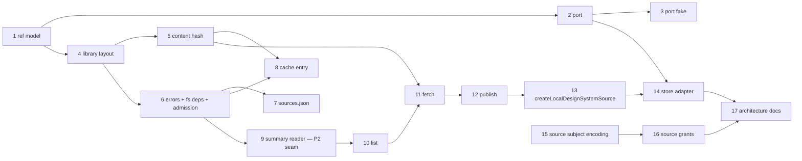

# P3 — Design-system Source Port and Local Adapter Implementation Plan

> **For agentic workers:** REQUIRED SUB-SKILL: Use superpowers:subagent-driven-development (recommended) or superpowers:executing-plans to implement this plan task-by-task. Steps use checkbox (`- [ ]`) syntax for tracking.

**Goal:** Land the `DesignSystemSource` port, the `source:system@version` reference model, the per-user design-system library layout with content hashes, a local directory adapter implementing `list`/`fetch`/`publish`, and a kind-discriminated trust-subject encoding variant that can name a source — everything Track C needs before the install pipeline and picker (P10) can be written.

**Architecture:** Three rings, in the shape the repository already uses. `entities/design-system-ref` owns the addressable identity (`local:midnight@1.2.0`) as parsed, branded data. `core/ports/design-system-source.ts` declares the contract `core` will consume, as plain DTOs with this ring's `FailureDtoV1` error channel (decision C1) plus an in-memory fake. `store/design-systems/` is the real implementation: the library layout under `resolveDefaultUserStateRoot()`, the sha256 content hash over a package's file set, `sources.json`, the cache-entry record, a minimal non-executing manifest read that answers only what a picker swatch row needs, and the local source itself over an injected filesystem boundary. `store/adapters/design-system-source.ts` maps the store's tagged `SourceError` union onto the port. `store/trust` gains a second, domain-separated subject encoding for sources, leaving every recorded project grant byte-identical.

**Tech Stack:** TypeScript 7, Bun test, Zod 4, `errore` 0.14 (errors as values), `node:crypto`, `node:fs`, `node:path`.

## Global Constraints

- **Spec:** `docs/superpowers/specs/2026-08-11-project-design-systems-design.md`. This plan is **P3 `source-port-and-local-adapter` (Track C)** of §10.1's Wave 1. Sections that govern it: §8.1 (the port), §8.2 (storage and content hashes), §8.4 (trust), §8.6 (stage 1), §11 (testing), §13 (source anchors).
- **Out of scope — do not implement, do not stub, do not reference as if it existed:** the install pipeline, quarantine, the breakage preview, the picker UI, the provenance record, and the update check. All of those are **P10** (wave 3). Do not touch `src/gate/**`, `src/runtime/**`, `src/host/**`, or `src/ui/**` anywhere in this plan.
- **No network.** §2: stage 1 downloads nothing and holds no credentials. Nothing in this plan may import a network client or spawn `git`/`gh`.
- **errore is mandatory** (`errore` skill, repository CLAUDE.md). Every failable operation returns `SomeTaggedError | T`, never throws. `import * as errore from "errore"` — namespace import, never destructured. `.catch((e) => new SomeError({ cause: e }))` at async boundaries, `errore.try({ try, catch })` at sync boundaries, `if (x instanceof Error) return x` on one line with no block, happy path at root indentation, and every error that is **not** propagated gets a `log.warn` (errore rule 21).
- **Reatom:** this plan touches no Reatom code — no atoms, computeds, actions, or `reatomComponent`. `/reatom-audit` is therefore not part of finishing it (repository CLAUDE.md: "Skip it entirely for changes that touch no Reatom code").
- **Factories are `create*`, never `make*`.** Repository-wide naming rule.
- **Imports:** cross-module imports use the `tsconfig.json` `paths` aliases (`entities/...`, `core/...`, `store/...`, `infrastructure/...`). Relative imports (`./`, `../`) only inside one module or one `entities/` submodule. Never alias under `@termcraft/*`.
- **Module folder shape:** every new module is `module/{model/, types.ts, index.ts}`. No loose files at a module root, no `ui/` here (nothing in this plan has a presentation layer).
- **Port ring rules** (`src/core/ports/index.ts` header): `core/ports/*` imports `entities/` and local DTOs only — never `store`, `agent`, `gate`, or `host`, not even type-only. Adapters may type-only-import `core/ports/*` to prove conformance with `AssertConforms` (decision C2). Every port gets an in-memory fake under `core/ports/fakes/` with its own test.
- **The port's error channel is `FailureDtoV1`, not a tagged error.** §8.1 writes `SourceError` in its signatures; at the `core/ports` boundary this repository maps every upstream module's tagged errors onto `core/protocol`'s closed `FailureDtoV1` registry (decision C1, `core/ports/index.ts`). The tagged `SourceError` union is real and lives in `store/design-systems`; `store/adapters/failure.ts` is where it becomes a `FailureDtoV1`. `FailureDtoV1` is a plain DTO, not an `Error`, so `core`-side narrowing uses this ring's `"code" in result` idiom (`src/core/project/model/trust.ts:47-51`), never `instanceof Error`.
- **`OPERATIONAL_FAILURE_CODES_V1` is closed at 30 members** and its length is asserted by a closure test. Do not add a code. Source failures map onto `RESOURCE_LIMIT_EXCEEDED` (admission refusal) and `PERSISTENCE_FAILED` (everything else), exactly as the other durable-fault families do.
- **`list` never opens a `.tsx`** (§11). This is a tested property, not a convention.
- **No design values are invented.** This plan renders no UI and picks no colors; the token values it moves are whatever a manifest already contains.
- **Nothing is wired into the composition root.** `src/entrypoint/model/create-shell.ts` is not modified by this plan. P3 ships the port, the fake, the store module, and the adapter; **P10 owns the composition** because P10 owns the first consumer. Do not add dead wiring to `createShell`.

---

## Reconciliation with P2 (`manifest-and-gate`) — read this before Task 9

P2 lands `entities/design-system`: the full Zod manifest entity, its decoder, and every §7 Gate fatal. P3 must not wait for it and must not collide with it. Two rules make that work:

1. **Different module names.** This plan creates `entities/design-system-**ref**` — the addressable identity only (source id, system id, version, parse/format). P2 creates `entities/design-system` — the manifest. Separate folders, separate `index.ts`, zero merge surface.
2. **A named seam, not a duplicate entity.** `src/store/design-systems/model/summary.ts` (Task 9) carries a **minimal local reading** of `design-system.json`: a small Zod schema that extracts exactly the seven facts `DesignSystemSummary` needs (`id`, `name`, `version`, `kitApiVersion`, `defaultTheme`, the default theme's ordered token map, component names) and validates **nothing else**. It deliberately does not check core-role presence, cross-theme parity, `#rrggbb` shape, component resolvability, or `kitApiVersion` support — those are the Gate's answers and P2 owns them. The file's header names this as a reconciliation seam.

**At sync point 1** (after P2 merges) the follow-up is: `summary.ts` keeps its projection function and drops its private schema, calling `entities/design-system`'s decoder instead, so one parser reads the manifest. That change belongs to whoever resolves sync point 1 or to P10, not to this plan. The seam must stay honest in the meantime: the summary reader must never execute or compile anything, and must never claim a manifest is *valid* — only that it is *readable enough to show*.

---

## File structure

**New — `src/entities/design-system-ref/`** (the addressable identity)
- `types.ts` — `SourceId`, `DesignSystemId`, `DesignSystemVersion` (branded strings), `DesignSystemRef`
- `model/ref.ts` — masks, `parse*`, `formatDesignSystemRef`, `designSystemRefSchema`, `InvalidDesignSystemRefError`
- `model/ref.test.ts`
- `index.ts`

**New — `src/core/ports/design-system-source.ts`** (the port) and `src/core/ports/fakes/design-system-source.ts` + `.test.ts`; `src/core/ports/index.ts` gains the export block.

**New — `src/store/design-systems/`** (the implementation)
- `types.ts` — `AbsPath`, `Sha256Hex`, the store-side DTOs, `DesignSystemFsDeps`, `PackageAdmission`, `DesignSystemSource`, `LocalDesignSystemSourceDeps`, `SourceError`
- `model/layout.ts` + test — every path under `{userStateRoot}/design-systems/`
- `model/content-hash.ts` + test — the sha256 over a file set
- `model/sources-config.ts` + test — `sources.json`
- `model/cache-entry.ts` + test — the cache entry's `entry.json`
- `model/summary.ts` + test — the minimal manifest read (**the P2 seam**)
- `model/fs-deps.ts` + test — the injected filesystem boundary and its node bindings
- `model/list.ts`, `model/fetch.ts`, `model/publish.ts`, `model/local-source.ts` (+ tests)
- `model/errors.ts` — the tagged `SourceError` union
- `index.ts`

**New — `src/store/adapters/design-system-source.ts`** + test (the port implementation).

**Modified**
- `src/store/adapters/failure.ts` — four new `instanceof` branches
- `src/store/index.ts` — re-exports for the new submodule and adapter
- `src/store/trust/types.ts`, `src/store/trust/model/subject.ts`, `src/store/trust/model/trust-store.ts`, `src/store/trust/index.ts` — the source-subject variant
- `docs/architecture/code-structure.md`, `docs/architecture/storage.md`, `docs/architecture/modules.md`

## Task order



Tasks 15 and 16 (trust) are independent of 1–14 and may be executed at any point; they are placed last because they are the smallest self-contained pair.

---

### Task 1: The `source:system@version` reference model

**Files:**
- Create: `src/entities/design-system-ref/types.ts`
- Create: `src/entities/design-system-ref/model/ref.ts`
- Create: `src/entities/design-system-ref/index.ts`
- Test: `src/entities/design-system-ref/model/ref.test.ts`

**Interfaces:**
- Consumes: nothing.
- Produces: `DesignSystemRef` (`{ sourceId, systemId, version }`), the three branded string types `SourceId`/`DesignSystemId`/`DesignSystemVersion`, `parseSourceId(raw): InvalidDesignSystemRefError | SourceId`, `parseDesignSystemId(raw): InvalidDesignSystemRefError | DesignSystemId`, `parseDesignSystemVersion(raw): InvalidDesignSystemRefError | DesignSystemVersion`, `parseDesignSystemRef(raw): InvalidDesignSystemRefError | DesignSystemRef`, `formatDesignSystemRef(ref): string`, `designSystemRefSchema`, `InvalidDesignSystemRefError`.

**The grammar (§8.1).** Two spellings exist because a source id may itself contain a `:`:

- `local:midnight@1.2.0` → `sourceId "local"`, `systemId "midnight"`, `version "1.2.0"`
- `github:acme/design-systems#midnight@1.3.0` → `sourceId "github:acme/design-systems"`, `systemId "midnight"`, `version "1.3.0"`

One deterministic rule covers both: **the source id runs to the `#` when there is one, otherwise to the first `:`.** The remainder splits at its **last** `@`. `formatDesignSystemRef` is the inverse and emits the canonical spelling: `#` when the source id contains a `:`, otherwise `:`. That makes `local#midnight@1.2.0` an accepted but non-canonical input which formats back as `local:midnight@1.2.0` — a normalization, asserted by a test, not a silent rewrite.

- [ ] **Step 1: Write the failing test**

Create `src/entities/design-system-ref/model/ref.test.ts`:

```ts
import { describe, expect, test } from "bun:test";

import {
  InvalidDesignSystemRefError,
  formatDesignSystemRef,
  parseDesignSystemId,
  parseDesignSystemRef,
  parseDesignSystemVersion,
  parseSourceId,
  designSystemRefSchema,
} from "./ref";

describe("parseDesignSystemRef — the two spellings of §8.1", () => {
  test("a bare source id splits at the first colon", () => {
    const ref = parseDesignSystemRef("local:midnight@1.2.0");
    expect(ref).not.toBeInstanceOf(Error);
    expect(ref).toEqual({ sourceId: "local", systemId: "midnight", version: "1.2.0" } as never);
  });

  test("a locator-bearing source id splits at the hash", () => {
    const ref = parseDesignSystemRef("github:acme/design-systems#midnight@1.3.0");
    expect(ref).toEqual({
      sourceId: "github:acme/design-systems",
      systemId: "midnight",
      version: "1.3.0",
    } as never);
  });

  test("the version splits at the LAST @, so a system id may not hide one", () => {
    // "a@b" is not a legal system id, so this must be rejected rather than mis-split.
    expect(parseDesignSystemRef("local:a@b@1.0.0")).toBeInstanceOf(InvalidDesignSystemRefError);
  });
});

describe("formatDesignSystemRef — round trip", () => {
  test("round-trips both canonical spellings byte for byte", () => {
    for (const text of ["local:midnight@1.2.0", "github:acme/design-systems#midnight@1.3.0"]) {
      const ref = parseDesignSystemRef(text);
      expect(ref).not.toBeInstanceOf(Error);
      if (ref instanceof Error) return;
      expect(formatDesignSystemRef(ref)).toBe(text);
    }
  });

  test("normalizes the non-canonical hash spelling of a bare source id", () => {
    const ref = parseDesignSystemRef("local#midnight@1.2.0");
    expect(ref).not.toBeInstanceOf(Error);
    if (ref instanceof Error) return;
    expect(formatDesignSystemRef(ref)).toBe("local:midnight@1.2.0");
  });

  test("parse(format(ref)) is the identical ref", () => {
    const ref = parseDesignSystemRef("github:acme/design-systems#midnight@1.3.0");
    if (ref instanceof Error) throw ref;
    expect(parseDesignSystemRef(formatDesignSystemRef(ref))).toEqual(ref);
  });
});

describe("parseDesignSystemRef — rejections", () => {
  const rejected = [
    "",
    "midnight@1.2.0", // no source
    "local:midnight", // no version
    "local:@1.2.0", // empty system id
    "local:midnight@", // empty version
    "local:midnight@1.2", // not MAJOR.MINOR.PATCH
    "local:midnight@1.2.0-beta.1", // prerelease is out of scope
    "local:Midnight@1.2.0", // uppercase system id
    "local:con@1.2.0", // reserved Windows device name — it is a directory name
    "LOCAL:midnight@1.2.0", // uppercase source id
    "local:midnight@01.2.0", // leading zero
  ];
  for (const text of rejected) {
    test(`rejects ${JSON.stringify(text)}`, () => {
      expect(parseDesignSystemRef(text)).toBeInstanceOf(InvalidDesignSystemRefError);
    });
  }
});

describe("the three component parsers", () => {
  test("a source id may carry a locator after its colon", () => {
    expect(parseSourceId("github:acme/design-systems")).toBe("github:acme/design-systems" as never);
    expect(parseSourceId("local")).toBe("local" as never);
  });

  test("a source id may not carry a second colon, a hash, an @, or a backslash", () => {
    for (const bad of ["a:b:c", "a#b", "a:b@c", "a:b\\c", "nul"]) {
      expect(parseSourceId(bad)).toBeInstanceOf(InvalidDesignSystemRefError);
    }
  });

  test("a system id is a lowercase directory-safe name of at most 32 characters", () => {
    expect(parseDesignSystemId("midnight")).toBe("midnight" as never);
    expect(parseDesignSystemId("a".repeat(32))).toBe("a".repeat(32) as never);
    expect(parseDesignSystemId("a".repeat(33))).toBeInstanceOf(InvalidDesignSystemRefError);
    expect(parseDesignSystemId("-leading")).toBeInstanceOf(InvalidDesignSystemRefError);
  });

  test("a version is exactly MAJOR.MINOR.PATCH", () => {
    expect(parseDesignSystemVersion("0.0.0")).toBe("0.0.0" as never);
    expect(parseDesignSystemVersion("10.20.30")).toBe("10.20.30" as never);
    expect(parseDesignSystemVersion("1.2.0+build")).toBeInstanceOf(InvalidDesignSystemRefError);
  });
});

describe("designSystemRefSchema", () => {
  test("decodes reference TEXT into a parsed ref", () => {
    expect(designSystemRefSchema.parse("local:midnight@1.2.0")).toEqual({
      sourceId: "local",
      systemId: "midnight",
      version: "1.2.0",
    } as never);
  });

  test("fails on an unparseable reference", () => {
    expect(designSystemRefSchema.safeParse("nope").success).toBe(false);
  });
});
```

- [ ] **Step 2: Run the test to verify it fails**

Run: `bun test src/entities/design-system-ref/`
Expected: FAIL — `Cannot find module './ref'`.

- [ ] **Step 3: Write `types.ts`**

Create `src/entities/design-system-ref/types.ts`:

```ts
declare const sourceIdBrand: unique symbol;
declare const designSystemIdBrand: unique symbol;
declare const designSystemVersionBrand: unique symbol;

/**
 * A configured source's identity — the `DesignSystemSource.id` of design §8.1: `"local"`, or
 * a family plus a locator such as `"github:acme/design-systems"`. Obtain one only through
 * `parseSourceId`.
 */
export type SourceId = string & { readonly [sourceIdBrand]: true };

/**
 * A design system's own id (`design-system.json`'s `id`). It is also a directory name — the
 * designer's own systems live at `design-systems/local/<id>/` (design §8.2) — so it carries the
 * same lowercase, Windows-safe mask a page slug does. Obtain one only through
 * `parseDesignSystemId`.
 */
export type DesignSystemId = string & { readonly [designSystemIdBrand]: true };

/** A design system's `MAJOR.MINOR.PATCH` version. Obtain one only through `parseDesignSystemVersion`. */
export type DesignSystemVersion = string & { readonly [designSystemVersionBrand]: true };

/**
 * The parsed form of a `source:system@version` reference (design §8.1). Having an address is
 * what makes an update check and a "where did this come from" answer possible at all; the
 * textual form is produced by `formatDesignSystemRef` and never assembled by hand.
 */
export interface DesignSystemRef {
  readonly sourceId: SourceId;
  readonly systemId: DesignSystemId;
  readonly version: DesignSystemVersion;
}
```

- [ ] **Step 4: Write `model/ref.ts`**

Create `src/entities/design-system-ref/model/ref.ts`:

```ts
import * as errore from "errore";
import { z } from "zod";

import type { DesignSystemId, DesignSystemRef, DesignSystemVersion, SourceId } from "../types";

export class InvalidDesignSystemRefError extends errore.createTaggedError({
  name: "InvalidDesignSystemRefError",
  message: "Invalid design-system reference $value: $reason",
}) {}

/** A source family, optionally followed by `:` and a locator (design §8.1's `github:acme/design-systems`). */
const SOURCE_ID_MASK = /^[a-z][a-z0-9-]{0,31}(:[a-z0-9][a-zA-Z0-9._\-/]{0,127})?$/;

/**
 * The same shape `entities/page`'s `PAGE_SLUG_MASK` uses, and for the same reason: this string
 * is a directory name on disk (`design-systems/local/<id>/`). Deliberately duplicated rather
 * than imported — a design-system id is a different identity with a different brand, and
 * borrowing `parsePageSlug` would hand back a `PageSlug`.
 */
const DESIGN_SYSTEM_ID_MASK = /^[a-z0-9][a-z0-9-]{0,31}$/;

/** `MAJOR.MINOR.PATCH`, no prerelease and no build metadata — design §8.1 shows nothing else. */
const VERSION_MASK = /^(0|[1-9]\d{0,8})\.(0|[1-9]\d{0,8})\.(0|[1-9]\d{0,8})$/;

/** Mirrors `entities/page/model/slug.ts` — both of these strings become directory names. */
const WINDOWS_RESERVED_NAMES: ReadonlySet<string> = new Set([
  "con",
  "nul",
  "aux",
  "prn",
  ...Array.from({ length: 9 }, (_, i) => `com${i + 1}`),
  ...Array.from({ length: 9 }, (_, i) => `lpt${i + 1}`),
]);

export function parseSourceId(raw: string) {
  if (!SOURCE_ID_MASK.test(raw)) {
    return new InvalidDesignSystemRefError({
      value: raw,
      reason: "source id does not match ^[a-z][a-z0-9-]{0,31}(:[a-z0-9][a-zA-Z0-9._\\-/]{0,127})?$",
    });
  }
  // The family segment becomes a path component under `design-systems/cache/` once encoded.
  const family = raw.split(":", 1)[0] as string;
  if (WINDOWS_RESERVED_NAMES.has(family)) {
    return new InvalidDesignSystemRefError({
      value: raw,
      reason: "source id family is a reserved Windows device name",
    });
  }
  return raw as SourceId;
}

export function parseDesignSystemId(raw: string) {
  if (!DESIGN_SYSTEM_ID_MASK.test(raw)) {
    return new InvalidDesignSystemRefError({
      value: raw,
      reason: "system id does not match ^[a-z0-9][a-z0-9-]{0,31}$",
    });
  }
  if (WINDOWS_RESERVED_NAMES.has(raw)) {
    return new InvalidDesignSystemRefError({
      value: raw,
      reason: "system id is a reserved Windows device name",
    });
  }
  return raw as DesignSystemId;
}

export function parseDesignSystemVersion(raw: string) {
  if (!VERSION_MASK.test(raw)) {
    return new InvalidDesignSystemRefError({
      value: raw,
      reason: "version is not MAJOR.MINOR.PATCH with no leading zeros",
    });
  }
  return raw as DesignSystemVersion;
}

/**
 * `source:system@version` (design §8.1). The source id runs to the `#` when there is one and to
 * the FIRST `:` otherwise — that single rule covers both `local:midnight@1.2.0` and
 * `github:acme/design-systems#midnight@1.3.0` without a per-family special case. The remainder
 * splits at its LAST `@`, so a hostile `a@b@1.0.0` fails on the system-id mask rather than
 * silently parsing as something else.
 */
export function parseDesignSystemRef(raw: string) {
  const hashAt = raw.indexOf("#");
  const splitAt = hashAt >= 0 ? hashAt : raw.indexOf(":");
  if (splitAt <= 0) {
    return new InvalidDesignSystemRefError({
      value: raw,
      reason: "expected <source>:<system>@<version> or <source>#<system>@<version>",
    });
  }

  const sourceId = parseSourceId(raw.slice(0, splitAt));
  if (sourceId instanceof Error) return sourceId;

  const rest = raw.slice(splitAt + 1);
  const atAt = rest.lastIndexOf("@");
  if (atAt <= 0) {
    return new InvalidDesignSystemRefError({
      value: raw,
      reason: "expected <system>@<version> after the source id",
    });
  }

  const systemId = parseDesignSystemId(rest.slice(0, atAt));
  if (systemId instanceof Error) return systemId;

  const version = parseDesignSystemVersion(rest.slice(atAt + 1));
  if (version instanceof Error) return version;

  return { sourceId, systemId, version } satisfies DesignSystemRef;
}

/**
 * The canonical textual form. `#` when the source id carries a locator (its own `:` would
 * otherwise be ambiguous with the separator), `:` when it does not — so a reference parsed from
 * the non-canonical `local#midnight@1.2.0` formats back as `local:midnight@1.2.0`.
 */
export function formatDesignSystemRef(ref: DesignSystemRef): string {
  const separator = ref.sourceId.includes(":") ? "#" : ":";
  return `${ref.sourceId}${separator}${ref.systemId}@${ref.version}`;
}

/** Decodes reference TEXT (as stored in `sources.json`, a cache entry, or a provenance record). */
export const designSystemRefSchema = z.string().transform((raw, ctx) => {
  const ref = parseDesignSystemRef(raw);
  if (ref instanceof Error) {
    ctx.addIssue({ code: "custom", message: ref.message });
    return z.NEVER;
  }
  return ref;
});
```

- [ ] **Step 5: Write `index.ts`**

Create `src/entities/design-system-ref/index.ts`:

```ts
// `entities/design-system-ref` — a design system's ADDRESSABLE IDENTITY (design §8.1), kept
// separate from its CONTENT (`entities/design-system`, the manifest entity P2 owns). A
// reference is `source:system@version`: `local:midnight@1.2.0`,
// `github:acme/design-systems#midnight@1.3.0`. Without an address there is no update check and
// no answer to "where did this come from".
export type { DesignSystemId, DesignSystemRef, DesignSystemVersion, SourceId } from "./types";
export {
  InvalidDesignSystemRefError,
  designSystemRefSchema,
  formatDesignSystemRef,
  parseDesignSystemId,
  parseDesignSystemRef,
  parseDesignSystemVersion,
  parseSourceId,
} from "./model/ref";
```

- [ ] **Step 6: Add the `paths` alias check**

`tsconfig.json` already maps `entities/*` → `src/entities/*`, so `entities/design-system-ref` resolves with no config change. Confirm it: run `bun x tsc --noEmit` and expect no `Cannot find module` for the new module.

- [ ] **Step 7: Run the tests**

Run: `bun test src/entities/design-system-ref/ && bun x tsc --noEmit`
Expected: PASS, clean typecheck.

- [ ] **Step 8: Commit**

```bash
rtk git add src/entities/design-system-ref && rtk git commit -m "feat(entities): add the source:system@version design-system reference model"
```

---

### Task 2: The `DesignSystemSource` port

**Files:**
- Create: `src/core/ports/design-system-source.ts`
- Modify: `src/core/ports/index.ts` (append one export block, beside the existing `trust`/`staging` block)
- Test: none of its own — a port is types only. Its behavior is tested through the fake (Task 3) and the adapter (Task 14); `bun x tsc --noEmit` is its gate.

**Interfaces:**
- Consumes: `DesignSystemRef`, `DesignSystemId`, `DesignSystemVersion` from `entities/design-system-ref` (Task 1); `FailureDtoV1`, `Sha256Hex` from `core/protocol`.
- Produces: `DesignSystemSource`, `DesignSystemSummaryV1`, `DesignSystemTokenSwatchV1`, `PackageFileV1`, `FetchedPackageV1`, `LocalPackageV1`, `PublishReceiptV1` — the exact shapes Task 3's fake, Task 14's adapter, and P10 all bind to.

- [ ] **Step 1: Write the port**

Create `src/core/ports/design-system-source.ts`:

```ts
import type {
  DesignSystemId,
  DesignSystemRef,
  DesignSystemVersion,
} from "entities/design-system-ref";

import type { FailureDtoV1, Sha256Hex } from "core/protocol";

/**
 * `DesignSystemSource`: where a project's design system comes from (project-design-systems
 * design §8.1). One port, adapters in the ring, composed at the composition root — the same
 * shape as the other ~17 adapters.
 *
 * EVERY OPERATION IS ASYNCHRONOUS AND FAILABLE FROM THE START, though the only stage-1
 * adapter — a local directory — needs neither: "a synchronous contract has no room for a
 * network source later" (§8.1). A GitHub adapter's one requirement on this work is that it must
 * not need a change to this file.
 *
 * ERROR CHANNEL. §8.1 writes `SourceError` in its signatures. At this ring's boundary that is
 * `FailureDtoV1` (decision C1, `./index.ts`'s header): the tagged `SourceError` union is real
 * and lives in `store/design-systems`, and `store/adapters/failure.ts` maps it here. Admission
 * refusals arrive as `RESOURCE_LIMIT_EXCEEDED`; every other source fault arrives as
 * `PERSISTENCE_FAILED`. `FailureDtoV1` is a plain DTO and not an `Error`, so `core`-side callers
 * narrow with this ring's `"code" in result` idiom (`core/project/model/trust.ts`), never
 * `instanceof Error`.
 *
 * NOT IN SCOPE HERE (design §10.1, P10): install through quarantine, the breakage preview, the
 * picker, the provenance record, and the update check. This file declares only where packages
 * come from and where they go.
 */

/**
 * One token of a theme, in DECLARATION ORDER. The picker draws a swatch row, and the row's
 * order is the manifest's order — which is why this is an ordered list rather than a record.
 */
export interface DesignSystemTokenSwatchV1 {
  readonly name: string;
  readonly value: string;
}

/**
 * What the picker needs about a candidate it has not installed and that has never been through
 * the Gate (§8.1): "everything that fits in one `design-system.json`". A local source reads it
 * off disk; a remote source fetches one small file per candidate. Had `list` returned whole
 * packages, opening the picker against a configured remote would download every system in it.
 *
 * This is READ WITHOUT EXECUTING AND WITHOUT COMPILING anything — the property §3.2 makes the
 * manifest data-shaped for, and §11 tests as "`list` never opens a `.tsx`".
 *
 * It is deliberately NOT a validity verdict. A summary says a manifest is readable enough to
 * show; whether it passes §7's fatals is the Gate's answer (P2), reached only through an
 * install (P10).
 *
 * A summary carries no reference of its own: the caller holds the `DesignSystemSource` it came
 * from, so the address is `{ sourceId: source.id, systemId: summary.id, version: summary.version }`.
 */
export interface DesignSystemSummaryV1 {
  readonly id: string;
  readonly name: string;
  readonly version: string;
  readonly kitApiVersion: number;
  /** The theme `defaultThemeTokens` was read from — `design-system.json`'s `defaultTheme`. */
  readonly defaultTheme: string;
  readonly defaultThemeTokens: readonly DesignSystemTokenSwatchV1[];
  readonly componentNames: readonly string[];
}

/** One file of a package, at a `/`-separated path relative to the package root. */
export interface PackageFileV1 {
  readonly relPath: string;
  readonly bytes: Uint8Array;
}

/**
 * A materialized package. `contentHash` is the sha256 over the file set (§8.2), so "one
 * reference always names the same bytes" is verifiable rather than assumed — a remote source
 * can republish a version, and the hash is what catches it.
 *
 * The bytes stop here. `fetch` never writes into a design tree: P10 stages this into quarantine,
 * applies the safe-filesystem limits, and only then builds a candidate (§8.3).
 */
export interface FetchedPackageV1 {
  readonly ref: DesignSystemRef;
  readonly contentHash: Sha256Hex;
  readonly files: readonly PackageFileV1[];
  readonly summary: DesignSystemSummaryV1;
}

/** A package handed to `publish` — the folder as it would sit at `design/system/` in a project. */
export interface LocalPackageV1 {
  readonly systemId: DesignSystemId;
  readonly version: DesignSystemVersion;
  readonly files: readonly PackageFileV1[];
}

/** Proof of a completed publish, carrying the address the package now answers to. */
export interface PublishReceiptV1 {
  readonly ref: DesignSystemRef;
  readonly contentHash: Sha256Hex;
  /** RFC 3339 UTC. */
  readonly publishedAt: string;
}

export interface DesignSystemSource {
  /** `"local"`, `"github:acme/design-systems"` — the `sourceId` half of every reference it answers. */
  readonly id: string;
  /** Human-readable, for the picker's source column. */
  readonly label: string;
  /**
   * Declared, never assumed (§8.1). A local directory publishes by copying; a GitHub source
   * publishes by committing or opening a pull request — a different operation with its own
   * permissions and confirmation. A source that cannot publish says so, and the shell draws no
   * button.
   */
  readonly canPublish: boolean;

  list(): Promise<FailureDtoV1 | readonly DesignSystemSummaryV1[]>;
  fetch(ref: DesignSystemRef): Promise<FailureDtoV1 | FetchedPackageV1>;
  publish(pkg: LocalPackageV1): Promise<FailureDtoV1 | PublishReceiptV1>;
}
```

- [ ] **Step 2: Export it from the ports barrel**

In `src/core/ports/index.ts`, immediately after the existing line

```ts
export type { GitIdentityV1, TrustGate, TrustSubjectV1 } from "./trust";
```

insert:

```ts
// ---- design-system sources (project-design-systems §8.1, Track C / P3) ------------------
export type {
  DesignSystemSource,
  DesignSystemSummaryV1,
  DesignSystemTokenSwatchV1,
  FetchedPackageV1,
  LocalPackageV1,
  PackageFileV1,
  PublishReceiptV1,
} from "./design-system-source";
```

- [ ] **Step 3: Verify the typecheck**

Run: `bun x tsc --noEmit`
Expected: clean. If it reports that `core/ports` may not import `store`/`agent`/`gate`/`host`, something in the new file is wrong — it must import only `entities/design-system-ref` and `core/protocol`.

- [ ] **Step 4: Commit**

```bash
rtk git add src/core/ports/design-system-source.ts src/core/ports/index.ts && rtk git commit -m "feat(core): declare the DesignSystemSource port"
```

---

### Task 3: The in-memory `DesignSystemSource` fake

**Files:**
- Create: `src/core/ports/fakes/design-system-source.ts`
- Test: `src/core/ports/fakes/design-system-source.test.ts`
- Modify: `src/core/ports/fakes/index.ts` (append the export, matching the file's existing style)

**Interfaces:**
- Consumes: everything Task 2 produced, plus `AssertConforms` from `../index`.
- Produces: `createFakeDesignSystemSource(options)`, `FakeDesignSystemSource` (adds `calls`, `failNext`, `seed`), `FakeDesignSystemSourceCall`. P10's tests bind to this rather than to a real directory.

- [ ] **Step 1: Write the failing test**

Create `src/core/ports/fakes/design-system-source.test.ts`:

```ts
import { describe, expect, test } from "bun:test";

import { parseDesignSystemRef } from "entities/design-system-ref";

import type { DesignSystemSummaryV1, FailureDtoV1 } from "../index";
import { createFakeDesignSystemSource } from "./design-system-source";

const MIDNIGHT: DesignSystemSummaryV1 = {
  id: "midnight",
  name: "Midnight",
  version: "1.2.0",
  kitApiVersion: 1,
  defaultTheme: "dark",
  defaultThemeTokens: [
    { name: "background", value: "#0b0f14" },
    { name: "accent", value: "#4cc9f0" },
  ],
  componentNames: ["Button", "PageShell"],
};

const FAILURE: FailureDtoV1 = {
  code: "PERSISTENCE_FAILED",
  retryable: false,
  safeMessage: "library unreadable",
  details: {},
};

function refOf(text: string) {
  const ref = parseDesignSystemRef(text);
  if (ref instanceof Error) throw ref;
  return ref;
}

describe("createFakeDesignSystemSource", () => {
  test("declares its identity and publish capability", () => {
    const source = createFakeDesignSystemSource({ id: "local", label: "Local", canPublish: true });
    expect(source.id).toBe("local");
    expect(source.label).toBe("Local");
    expect(source.canPublish).toBe(true);
  });

  test("lists what it was seeded with, and records the call", async () => {
    const source = createFakeDesignSystemSource({ id: "local", label: "Local", canPublish: true });
    source.seed(MIDNIGHT, [{ relPath: "design-system.json", bytes: new Uint8Array([1, 2]) }]);
    expect(await source.list()).toEqual([MIDNIGHT]);
    expect(source.calls).toEqual([{ method: "list" }]);
  });

  test("fetches a seeded package by reference", async () => {
    const source = createFakeDesignSystemSource({ id: "local", label: "Local", canPublish: true });
    const files = [{ relPath: "design-system.json", bytes: new Uint8Array([1, 2]) }];
    source.seed(MIDNIGHT, files);
    const fetched = await source.fetch(refOf("local:midnight@1.2.0"));
    expect("code" in fetched).toBe(false);
    if ("code" in fetched) return;
    expect(fetched.files).toEqual(files);
    expect(fetched.summary).toEqual(MIDNIGHT);
    expect(fetched.contentHash).toMatch(/^[0-9a-f]{64}$/);
  });

  test("fetching an unseeded reference is a failure, not an empty package", async () => {
    const source = createFakeDesignSystemSource({ id: "local", label: "Local", canPublish: true });
    const fetched = await source.fetch(refOf("local:midnight@1.2.0"));
    expect("code" in fetched).toBe(true);
  });

  test("publish seeds the package and returns a receipt at its address", async () => {
    const source = createFakeDesignSystemSource({ id: "local", label: "Local", canPublish: true });
    const receipt = await source.publish({
      systemId: refOf("local:aurora@2.0.0").systemId,
      version: refOf("local:aurora@2.0.0").version,
      files: [{ relPath: "design-system.json", bytes: new Uint8Array([3]) }],
    });
    expect("code" in receipt).toBe(false);
    if ("code" in receipt) return;
    expect(receipt.ref).toEqual(refOf("local:aurora@2.0.0"));
    expect(receipt.publishedAt).toMatch(/^\d{4}-\d{2}-\d{2}T/);
  });

  test("a source that cannot publish refuses rather than silently succeeding", async () => {
    const source = createFakeDesignSystemSource({ id: "ro", label: "RO", canPublish: false });
    const receipt = await source.publish({
      systemId: refOf("ro:aurora@2.0.0").systemId,
      version: refOf("ro:aurora@2.0.0").version,
      files: [],
    });
    expect("code" in receipt).toBe(true);
  });

  test("failNext injects one failure per queued entry, then returns to normal", async () => {
    const source = createFakeDesignSystemSource({ id: "local", label: "Local", canPublish: true });
    source.seed(MIDNIGHT, []);
    source.failNext("list", FAILURE);
    expect(await source.list()).toEqual(FAILURE);
    expect(await source.list()).toEqual([MIDNIGHT]);
  });
});
```

- [ ] **Step 2: Run the test to verify it fails**

Run: `bun test src/core/ports/fakes/design-system-source.test.ts`
Expected: FAIL — `Cannot find module './design-system-source'`.

- [ ] **Step 3: Write the fake**

Create `src/core/ports/fakes/design-system-source.ts`:

```ts
import { formatDesignSystemRef } from "entities/design-system-ref";
import type { DesignSystemRef } from "entities/design-system-ref";

import type { FailureDtoV1, Sha256Hex } from "core/protocol";

import type { AssertConforms } from "../index";
import type {
  DesignSystemSource,
  DesignSystemSummaryV1,
  FetchedPackageV1,
  LocalPackageV1,
  PackageFileV1,
  PublishReceiptV1,
} from "../design-system-source";

/**
 * In-memory {@link DesignSystemSource} fake. It holds seeded packages keyed by their reference
 * TEXT, so `fetch` answers exactly what `list` advertised. No filesystem, no crypto, no clock —
 * `publishedAt` comes from a monotonic counter over a fixed epoch so two runs produce the same
 * transcript.
 */

/** A deterministic, valid-looking 64-hex-char {@link Sha256Hex} derived from a seed — no crypto, no randomness. */
function fakeSha256Hex(seed: string): Sha256Hex {
  let h = 0;
  for (let i = 0; i < seed.length; i++) h = (Math.imul(h, 31) + seed.charCodeAt(i)) | 0;
  const base = (h >>> 0).toString(16).padStart(8, "0");
  return base.repeat(8).slice(0, 64);
}

export type DesignSystemSourceFailableMethod = "list" | "fetch" | "publish";

export type FakeDesignSystemSourceCall =
  | { readonly method: "list" }
  | { readonly method: "fetch"; readonly ref: string }
  | { readonly method: "publish"; readonly ref: string };

export interface FakeDesignSystemSourceOptions {
  readonly id: string;
  readonly label: string;
  readonly canPublish: boolean;
}

export interface FakeDesignSystemSource extends DesignSystemSource {
  readonly calls: readonly FakeDesignSystemSourceCall[];
  failNext(method: DesignSystemSourceFailableMethod, failure: FailureDtoV1): void;
  /** Makes a summary listable and its package fetchable at `<id>:<summary.id>@<summary.version>`. */
  seed(summary: DesignSystemSummaryV1, files: readonly PackageFileV1[]): void;
}

const FIXED_EPOCH_MS = Date.parse("2026-01-01T00:00:00.000Z");

function refusal(safeMessage: string): FailureDtoV1 {
  return { code: "PERSISTENCE_FAILED", retryable: false, safeMessage, details: {} };
}

export function createFakeDesignSystemSource(
  options: FakeDesignSystemSourceOptions,
): FakeDesignSystemSource {
  const packages = new Map<
    string,
    { readonly summary: DesignSystemSummaryV1; readonly files: readonly PackageFileV1[] }
  >();
  const calls: FakeDesignSystemSourceCall[] = [];
  const queues: Record<DesignSystemSourceFailableMethod, FailureDtoV1[]> = {
    list: [],
    fetch: [],
    publish: [],
  };
  let published = 0;

  function keyOf(systemId: string, version: string): string {
    return `${options.id}|${systemId}|${version}`;
  }

  function seed(summary: DesignSystemSummaryV1, files: readonly PackageFileV1[]): void {
    packages.set(keyOf(summary.id, summary.version), { summary, files });
  }

  function failNext(method: DesignSystemSourceFailableMethod, failure: FailureDtoV1): void {
    queues[method].push(failure);
  }

  async function list(): Promise<FailureDtoV1 | readonly DesignSystemSummaryV1[]> {
    calls.push({ method: "list" });
    const queued = queues.list.shift();
    if (queued !== undefined) return queued;
    return [...packages.values()].map((entry) => entry.summary);
  }

  async function fetch(ref: DesignSystemRef): Promise<FailureDtoV1 | FetchedPackageV1> {
    calls.push({ method: "fetch", ref: formatDesignSystemRef(ref) });
    const queued = queues.fetch.shift();
    if (queued !== undefined) return queued;

    if (ref.sourceId !== options.id) return refusal("reference names another source");
    const entry = packages.get(keyOf(ref.systemId, ref.version));
    if (entry === undefined) return refusal("no such design system at this reference");

    return {
      ref,
      contentHash: fakeSha256Hex(formatDesignSystemRef(ref)),
      files: entry.files,
      summary: entry.summary,
    };
  }

  async function publish(pkg: LocalPackageV1): Promise<FailureDtoV1 | PublishReceiptV1> {
    const ref: DesignSystemRef = {
      sourceId: options.id as DesignSystemRef["sourceId"],
      systemId: pkg.systemId,
      version: pkg.version,
    };
    calls.push({ method: "publish", ref: formatDesignSystemRef(ref) });
    const queued = queues.publish.shift();
    if (queued !== undefined) return queued;
    if (!options.canPublish) return refusal("this source cannot publish");

    seed(
      {
        id: pkg.systemId,
        name: pkg.systemId,
        version: pkg.version,
        kitApiVersion: 1,
        defaultTheme: "dark",
        defaultThemeTokens: [],
        componentNames: [],
      },
      pkg.files,
    );
    published += 1;
    return {
      ref,
      contentHash: fakeSha256Hex(formatDesignSystemRef(ref)),
      publishedAt: new Date(FIXED_EPOCH_MS + published * 1000).toISOString(),
    };
  }

  return {
    id: options.id,
    label: options.label,
    canPublish: options.canPublish,
    list,
    fetch,
    publish,
    calls,
    failNext,
    seed,
  };
}

type _Conforms = AssertConforms<DesignSystemSource, FakeDesignSystemSource>;
```

- [ ] **Step 4: Export from the fakes barrel**

Open `src/core/ports/fakes/index.ts`, find the existing `createFakeTrustGate` export, and add a matching pair beside it:

```ts
export type {
  DesignSystemSourceFailableMethod,
  FakeDesignSystemSource,
  FakeDesignSystemSourceCall,
  FakeDesignSystemSourceOptions,
} from "./design-system-source";
export { createFakeDesignSystemSource } from "./design-system-source";
```

Match the file's own ordering and comment style — if it groups exports under `// ----` headings, put these under a new `// ---- design-system sources ----` heading.

- [ ] **Step 5: Run the tests**

Run: `bun test src/core/ports/ && bun x tsc --noEmit`
Expected: PASS, clean typecheck. If `AssertConforms` fails, the fake and the port have drifted — fix the fake, never the port.

- [ ] **Step 6: Commit**

```bash
rtk git add src/core/ports/fakes && rtk git commit -m "test(core): add the in-memory DesignSystemSource fake"
```

---

### Task 4: The user-state library layout

**Files:**
- Create: `src/store/design-systems/types.ts`
- Create: `src/store/design-systems/model/layout.ts`
- Create: `src/store/design-systems/index.ts`
- Test: `src/store/design-systems/model/layout.test.ts`

**Interfaces:**
- Consumes: `SourceId`, `DesignSystemId`, `DesignSystemVersion`, `parseSourceId` from `entities/design-system-ref`.
- Produces: `AbsPath`, `Sha256Hex` (module-local aliases, mirroring `store/trust/types.ts`); `DESIGN_SYSTEMS_DIRNAME`, `SOURCES_CONFIG_FILENAME`, `MANIFEST_FILENAME`, `LOCAL_SOURCE_ID`, `LOCAL_SOURCE_LABEL`; `designSystemsRoot`, `sourcesConfigPath`, `localLibraryDir`, `localSystemDir`, `cacheRootDir`, `cacheEntryDir`, `cachePackageDir`, `cacheEntryRecordPath`, `encodeSourceIdSegment`, `decodeSourceIdSegment`.

**The layout (§8.2), under the per-user root `resolveDefaultUserStateRoot()` already returns (`src/entrypoint/model/create-shell.ts:485`), beside `trust/`, `sandboxes/`, and `backups/`:**

```
{userStateRoot}/design-systems/
  sources.json                                       configured sources
  local/<systemId>/                                  the designer's own systems; the publish target
  cache/<sourceIdSegment>/<systemId>@<version>/
    entry.json                                       the reference + content hash + fetch time
    package/…                                        the materialized files
```

**Why `sourceIdSegment` exists.** §8.2 writes `cache/<source-id>/`, and a source id may be `github:acme/design-systems` — a `:` is not a legal Windows filename character and a `/` would silently nest. The segment is therefore `encodeURIComponent(sourceId)` (`github%3Aacme%2Fdesign-systems`), which is filename-safe on Windows and exactly reversible. `parseSourceId` already refuses a reserved device name for the family, so the encoded segment can never be `con`.

**Why the cache entry splits into `entry.json` + `package/`.** §8.2 says the entry "carries the package's content hash beside the `source:system@version` key". Keeping the record outside `package/` is what lets `package/` be a byte-exact copy of what the source served — the hash covers the package, and nothing termcraft wrote is inside the thing being hashed.

- [ ] **Step 1: Write the failing test**

Create `src/store/design-systems/model/layout.test.ts`:

```ts
import { describe, expect, test } from "bun:test";
import path from "node:path";

import {
  parseDesignSystemId,
  parseDesignSystemVersion,
  parseSourceId,
} from "entities/design-system-ref";

import {
  LOCAL_SOURCE_ID,
  cacheEntryDir,
  cacheEntryRecordPath,
  cachePackageDir,
  cacheRootDir,
  decodeSourceIdSegment,
  designSystemsRoot,
  encodeSourceIdSegment,
  localLibraryDir,
  localSystemDir,
  sourcesConfigPath,
} from "./layout";

const ROOT = path.join("C:", "Users", "alice", "AppData", "Local", "termcraft");

function systemId(raw: string) {
  const id = parseDesignSystemId(raw);
  if (id instanceof Error) throw id;
  return id;
}
function version(raw: string) {
  const v = parseDesignSystemVersion(raw);
  if (v instanceof Error) throw v;
  return v;
}
function sourceId(raw: string) {
  const s = parseSourceId(raw);
  if (s instanceof Error) throw s;
  return s;
}

describe("the design-system library layout (design §8.2)", () => {
  test("sits under {userStateRoot}/design-systems, beside trust/ and sandboxes/", () => {
    expect(designSystemsRoot(ROOT)).toBe(path.join(ROOT, "design-systems"));
  });

  test("sources.json is at the library root", () => {
    expect(sourcesConfigPath(ROOT)).toBe(path.join(ROOT, "design-systems", "sources.json"));
  });

  test("the designer's own systems live at local/<systemId>/", () => {
    expect(localLibraryDir(ROOT)).toBe(path.join(ROOT, "design-systems", "local"));
    expect(localSystemDir(ROOT, systemId("midnight"))).toBe(
      path.join(ROOT, "design-systems", "local", "midnight"),
    );
  });

  test("a cache entry is keyed by source, system and version", () => {
    expect(cacheRootDir(ROOT)).toBe(path.join(ROOT, "design-systems", "cache"));
    expect(cacheEntryDir(ROOT, LOCAL_SOURCE_ID, systemId("midnight"), version("1.2.0"))).toBe(
      path.join(ROOT, "design-systems", "cache", "local", "midnight@1.2.0"),
    );
  });

  test("the record sits beside the package, never inside the bytes it describes", () => {
    const entry = cacheEntryDir(ROOT, LOCAL_SOURCE_ID, systemId("midnight"), version("1.2.0"));
    expect(cachePackageDir(ROOT, LOCAL_SOURCE_ID, systemId("midnight"), version("1.2.0"))).toBe(
      path.join(entry, "package"),
    );
    expect(
      cacheEntryRecordPath(ROOT, LOCAL_SOURCE_ID, systemId("midnight"), version("1.2.0")),
    ).toBe(path.join(entry, "entry.json"));
  });
});

describe("encodeSourceIdSegment", () => {
  test("a bare source id is its own segment", () => {
    expect(encodeSourceIdSegment(sourceId("local"))).toBe("local");
  });

  test("a locator-bearing source id percent-encodes its colon and slashes", () => {
    expect(encodeSourceIdSegment(sourceId("github:acme/design-systems"))).toBe(
      "github%3Aacme%2Fdesign-systems",
    );
  });

  test("no segment ever contains a path separator or a colon", () => {
    const segment = encodeSourceIdSegment(sourceId("github:acme/design-systems"));
    expect(segment).not.toContain("/");
    expect(segment).not.toContain("\\");
    expect(segment).not.toContain(":");
  });

  test("round-trips through decodeSourceIdSegment", () => {
    for (const raw of ["local", "github:acme/design-systems"]) {
      expect(decodeSourceIdSegment(encodeSourceIdSegment(sourceId(raw)))).toBe(raw as never);
    }
  });

  test("a segment that does not decode to a legal source id is an error, not a guess", () => {
    expect(decodeSourceIdSegment("%%%")).toBeInstanceOf(Error);
    expect(decodeSourceIdSegment("NotASource")).toBeInstanceOf(Error);
  });
});
```

- [ ] **Step 2: Run the test to verify it fails**

Run: `bun test src/store/design-systems/`
Expected: FAIL — `Cannot find module './layout'`.

- [ ] **Step 3: Write `types.ts`**

Create `src/store/design-systems/types.ts`:

```ts
/**
 * An OS-absolute path handed in by the composition root — never a caller-built managed relative
 * path. Declared locally, exactly as `store/trust/types.ts` declares it, so this submodule stays
 * self-contained rather than importing `store/types.ts` (which imports the submodules back).
 */
export type AbsPath = string;

/** Lowercase-hex SHA-256. A package's content hash is one of these (design §8.2). */
export type Sha256Hex = string;
```

Later tasks append to this file; nothing else belongs in it yet.

- [ ] **Step 4: Write `model/layout.ts`**

Create `src/store/design-systems/model/layout.ts`:

```ts
import path from "node:path";

import type { DesignSystemId, DesignSystemVersion, SourceId } from "entities/design-system-ref";
import { InvalidDesignSystemRefError, parseSourceId } from "entities/design-system-ref";
import * as errore from "errore";

import type { AbsPath } from "../types";

/**
 * The per-user design-system library (design §8.2), under the SAME root that already holds
 * `trust/`, `sandboxes/`, and `backups/` — `resolveDefaultUserStateRoot()` in
 * `src/entrypoint/model/create-shell.ts`, i.e. `%LOCALAPPDATA%/termcraft` with the
 * `<tmpdir>/termcraft` fallback applying unchanged.
 *
 * ```
 * {userStateRoot}/design-systems/
 *   sources.json                                    configured sources
 *   local/<systemId>/                               the designer's own systems; the publish target
 *   cache/<sourceIdSegment>/<systemId>@<version>/   materialized remote packages
 *     entry.json                                    reference + content hash + fetch time
 *     package/…                                     the bytes the source served
 * ```
 *
 * The cache is keyed by VERSION, not by time: one reference always names the same bytes, so
 * reinstalling never goes to the network.
 */
export const DESIGN_SYSTEMS_DIRNAME = "design-systems";
export const SOURCES_CONFIG_FILENAME = "sources.json";
export const CACHE_ENTRY_RECORD_FILENAME = "entry.json";
export const CACHE_PACKAGE_DIRNAME = "package";
export const LOCAL_LIBRARY_DIRNAME = "local";
export const CACHE_DIRNAME = "cache";

/** The manifest filename inside a design-system package (design §3.1). */
export const MANIFEST_FILENAME = "design-system.json";

/** The one built-in source. Parsed rather than cast so the mask is the single authority. */
export const LOCAL_SOURCE_ID: SourceId = (() => {
  const id = parseSourceId(LOCAL_LIBRARY_DIRNAME);
  if (id instanceof Error) throw id;
  return id;
})();

export const LOCAL_SOURCE_LABEL = "Local library";

export function designSystemsRoot(userStateRoot: AbsPath): AbsPath {
  return path.join(userStateRoot, DESIGN_SYSTEMS_DIRNAME);
}

export function sourcesConfigPath(userStateRoot: AbsPath): AbsPath {
  return path.join(designSystemsRoot(userStateRoot), SOURCES_CONFIG_FILENAME);
}

export function localLibraryDir(userStateRoot: AbsPath): AbsPath {
  return path.join(designSystemsRoot(userStateRoot), LOCAL_LIBRARY_DIRNAME);
}

export function localSystemDir(userStateRoot: AbsPath, systemId: DesignSystemId): AbsPath {
  return path.join(localLibraryDir(userStateRoot), systemId);
}

export function cacheRootDir(userStateRoot: AbsPath): AbsPath {
  return path.join(designSystemsRoot(userStateRoot), CACHE_DIRNAME);
}

/**
 * §8.2 writes `cache/<source-id>/`, and a source id may be `github:acme/design-systems` — a `:`
 * is not a legal Windows filename character and a `/` would silently nest a directory level.
 * Percent-encoding is filename-safe on Windows and exactly reversible, so the address stays
 * recoverable from the path. `parseSourceId` already refuses a reserved device name for the
 * family, so an encoded segment can never come out as `con`.
 */
export function encodeSourceIdSegment(sourceId: SourceId): string {
  return encodeURIComponent(sourceId);
}

export function decodeSourceIdSegment(segment: string) {
  const decoded = errore.try({
    try: () => decodeURIComponent(segment),
    catch: (cause) =>
      new InvalidDesignSystemRefError({
        value: segment,
        reason: "cache segment is not valid percent-encoding",
        cause,
      }),
  });
  if (decoded instanceof Error) return decoded;
  return parseSourceId(decoded);
}

export function cacheEntryDir(
  userStateRoot: AbsPath,
  sourceId: SourceId,
  systemId: DesignSystemId,
  version: DesignSystemVersion,
): AbsPath {
  return path.join(
    cacheRootDir(userStateRoot),
    encodeSourceIdSegment(sourceId),
    `${systemId}@${version}`,
  );
}

export function cachePackageDir(
  userStateRoot: AbsPath,
  sourceId: SourceId,
  systemId: DesignSystemId,
  version: DesignSystemVersion,
): AbsPath {
  return path.join(
    cacheEntryDir(userStateRoot, sourceId, systemId, version),
    CACHE_PACKAGE_DIRNAME,
  );
}

export function cacheEntryRecordPath(
  userStateRoot: AbsPath,
  sourceId: SourceId,
  systemId: DesignSystemId,
  version: DesignSystemVersion,
): AbsPath {
  return path.join(
    cacheEntryDir(userStateRoot, sourceId, systemId, version),
    CACHE_ENTRY_RECORD_FILENAME,
  );
}
```

- [ ] **Step 5: Write the module entry point**

Create `src/store/design-systems/index.ts`:

```ts
// `store/design-systems` — the per-user design-system library and the sources that fill it
// (project-design-systems design §8). The library lives under `{userStateRoot}/design-systems/`,
// OUTSIDE every project, beside the trust ledger and the turn sandboxes; the one stage-1 source
// is a local directory, implemented THROUGH the port so a GitHub adapter can join it without
// changing the port (§8.6).
export type { AbsPath, Sha256Hex } from "./types";

export {
  CACHE_DIRNAME,
  CACHE_ENTRY_RECORD_FILENAME,
  CACHE_PACKAGE_DIRNAME,
  DESIGN_SYSTEMS_DIRNAME,
  LOCAL_LIBRARY_DIRNAME,
  LOCAL_SOURCE_ID,
  LOCAL_SOURCE_LABEL,
  MANIFEST_FILENAME,
  SOURCES_CONFIG_FILENAME,
  cacheEntryDir,
  cacheEntryRecordPath,
  cachePackageDir,
  cacheRootDir,
  decodeSourceIdSegment,
  designSystemsRoot,
  encodeSourceIdSegment,
  localLibraryDir,
  localSystemDir,
  sourcesConfigPath,
} from "./model/layout";
```

- [ ] **Step 6: Run the tests**

Run: `bun test src/store/design-systems/ && bun x tsc --noEmit`
Expected: PASS, clean typecheck.

- [ ] **Step 7: Commit**

```bash
rtk git add src/store/design-systems && rtk git commit -m "feat(store): add the per-user design-system library layout"
```

---

### Task 5: The package content hash

**Files:**
- Create: `src/store/design-systems/model/content-hash.ts`
- Modify: `src/store/design-systems/types.ts` (add `PackageFile`)
- Modify: `src/store/design-systems/index.ts` (append the exports)
- Test: `src/store/design-systems/model/content-hash.test.ts`

**Interfaces:**
- Consumes: `Sha256Hex` from `../types`.
- Produces: `PackageFile` (`{ relPath, bytes }` — the store-side twin of the port's `PackageFileV1`), `normalizePackageRelPath(raw): string`, `DESIGN_SYSTEM_PACKAGE_V1_PREFIX`, `encodeDesignSystemPackageV1(files): DuplicatePackageFileError | Uint8Array`, `designSystemContentHash(files): DuplicatePackageFileError | Sha256Hex`, `DuplicatePackageFileError`.

**The encoding.** §8.2 asks for "sha256 over its file set" and fixes nothing further, so this module fixes it, in the same length-prefixed, domain-separated style `store/trust/model/subject.ts` already uses — which is what makes it reviewable and testable rather than "whatever the walk happened to visit":

```
"termcraft-design-system-package-v1" || 0x00
u32be(fileCount)
for each file, ascending by NFC-UTF8 relPath bytes:
  u32be(relPath byte length) || relPath bytes || sha256(file bytes)   ← 32 raw bytes
```

Hashing each file's bytes into a fixed 32-byte digest rather than concatenating the bytes themselves keeps the digest input small and removes any need for a 64-bit length field. Sorting by path makes the hash independent of directory-walk order, which is what lets two sources that serve the same bytes agree.

- [ ] **Step 1: Write the failing test**

Create `src/store/design-systems/model/content-hash.test.ts`:

```ts
import { describe, expect, test } from "bun:test";
import crypto from "node:crypto";

import type { PackageFile } from "../types";
import {
  DESIGN_SYSTEM_PACKAGE_V1_PREFIX,
  DuplicatePackageFileError,
  designSystemContentHash,
  encodeDesignSystemPackageV1,
  normalizePackageRelPath,
} from "./content-hash";

const utf8 = (text: string) => new TextEncoder().encode(text);

const PACKAGE: readonly PackageFile[] = [
  { relPath: "design-system.json", bytes: utf8('{"id":"midnight"}') },
  { relPath: "components/Button.tsx", bytes: utf8("export const Button = () => null\n") },
  { relPath: "tokens.ts", bytes: utf8("export {}\n") },
];

/** Pinned in Step 5 by running this file once and copying the printed digest. */
const MIDNIGHT_CONTENT_HASH = "PIN_ME";

function hashOf(files: readonly PackageFile[]) {
  const hash = designSystemContentHash(files);
  if (hash instanceof Error) throw hash;
  return hash;
}

describe("designSystemContentHash", () => {
  test("is a lowercase-hex sha256", () => {
    expect(hashOf(PACKAGE)).toMatch(/^[0-9a-f]{64}$/);
  });

  test("is the sha256 of the complete encoded byte string", () => {
    const encoded = encodeDesignSystemPackageV1(PACKAGE);
    if (encoded instanceof Error) throw encoded;
    expect(crypto.createHash("sha256").update(encoded).digest("hex")).toBe(hashOf(PACKAGE));
  });

  test("starts with the ASCII prefix plus exactly one NUL byte, then the file count", () => {
    const encoded = encodeDesignSystemPackageV1(PACKAGE);
    if (encoded instanceof Error) throw encoded;
    const buf = Buffer.from(encoded);
    const prefix = Buffer.from(DESIGN_SYSTEM_PACKAGE_V1_PREFIX, "utf8");
    expect(buf.subarray(0, prefix.length).toString("utf8")).toBe(
      "termcraft-design-system-package-v1",
    );
    expect(buf[prefix.length]).toBe(0x00);
    expect(buf.readUInt32BE(prefix.length + 1)).toBe(3);
  });

  test("does not depend on the order the files were walked in", () => {
    expect(hashOf([...PACKAGE].reverse())).toBe(hashOf(PACKAGE));
  });

  test("changes when one byte of one file changes", () => {
    const mutated = PACKAGE.map((file) =>
      file.relPath === "tokens.ts" ? { ...file, bytes: utf8("export {} \n") } : file,
    );
    expect(hashOf(mutated)).not.toBe(hashOf(PACKAGE));
  });

  test("changes when a file is renamed but its bytes are not", () => {
    const renamed = PACKAGE.map((file) =>
      file.relPath === "tokens.ts" ? { ...file, relPath: "token.ts" } : file,
    );
    expect(hashOf(renamed)).not.toBe(hashOf(PACKAGE));
  });

  test("changes when a file is added or removed", () => {
    expect(hashOf(PACKAGE.slice(0, 2))).not.toBe(hashOf(PACKAGE));
  });

  test("an empty package still hashes, and differs from every non-empty one", () => {
    expect(hashOf([])).toMatch(/^[0-9a-f]{64}$/);
    expect(hashOf([])).not.toBe(hashOf(PACKAGE));
  });

  test("two spellings of one path are a duplicate, not a silently-dropped file", () => {
    expect(
      designSystemContentHash([
        { relPath: "tokens.ts", bytes: utf8("a") },
        { relPath: "./tokens.ts", bytes: utf8("b") },
      ]),
    ).toBeInstanceOf(DuplicatePackageFileError);
  });

  test("is stable across calls and across the pinned vector", () => {
    expect(hashOf(PACKAGE)).toBe(hashOf(PACKAGE));
    expect(hashOf(PACKAGE)).toBe(MIDNIGHT_CONTENT_HASH);
  });
});

describe("normalizePackageRelPath", () => {
  test("uses forward separators, drops a leading ./ and any surrounding separators", () => {
    expect(normalizePackageRelPath("components\\Button.tsx")).toBe("components/Button.tsx");
    expect(normalizePackageRelPath("./tokens.ts")).toBe("tokens.ts");
    expect(normalizePackageRelPath("/tokens.ts")).toBe("tokens.ts");
  });

  test("normalizes to NFC so two spellings of one filename hash alike", () => {
    const nfc = "prö.ts";
    expect(normalizePackageRelPath(nfc.normalize("NFD"))).toBe(nfc);
  });
});
```

- [ ] **Step 2: Run the test to verify it fails**

Run: `bun test src/store/design-systems/model/content-hash.test.ts`
Expected: FAIL — `Cannot find module './content-hash'`.

- [ ] **Step 3: Add `PackageFile` to `types.ts`**

Append to `src/store/design-systems/types.ts`:

```ts
/**
 * One file of a design-system package, at a `/`-separated path relative to the package root.
 * Field-for-field identical to `core/ports`' `PackageFileV1`, redrawn here so this module owns
 * its own vocabulary — the same relationship `TrustSubject` has with `TrustSubjectV1`.
 */
export interface PackageFile {
  readonly relPath: string;
  readonly bytes: Uint8Array;
}
```

- [ ] **Step 4: Write `model/content-hash.ts`**

Create `src/store/design-systems/model/content-hash.ts`:

```ts
import crypto from "node:crypto";

import * as errore from "errore";

import type { PackageFile, Sha256Hex } from "../types";

/**
 * The literal ASCII domain-separation prefix of the package encoding, followed by exactly one
 * NUL byte. Same construction as `store/trust`'s subject encoding, and for the same reason: a
 * digest with no domain separator can collide with a digest of a different KIND of thing.
 */
export const DESIGN_SYSTEM_PACKAGE_V1_PREFIX = "termcraft-design-system-package-v1";

/** Two files of one package normalize to the same path — the caller's file set is not a set. */
export class DuplicatePackageFileError extends errore.createTaggedError({
  name: "DuplicatePackageFileError",
  message: "design-system package lists $path more than once",
}) {}

/**
 * The canonical package-relative path: `/` separators, no leading `./`, no surrounding
 * separators, NFC. Two spellings of one file must not hash differently, and must not both
 * survive into the file set.
 */
export function normalizePackageRelPath(raw: string): string {
  const forwardSlashed = raw.replace(/\\/g, "/").normalize("NFC");
  return forwardSlashed.replace(/^\.\//, "").replace(/^\/+/, "").replace(/\/+$/, "");
}

/**
 * The byte-exact digest input for a design-system package (design §8.2's "sha256 content hash
 * over the file set"; §8.2 fixes the property, this function fixes the encoding):
 *
 * ```
 * prefix || 0x00 || u32be(fileCount)
 * for each file, ascending by NFC-UTF8 relPath bytes:
 *   u32be(relPath byte length) || relPath bytes || sha256(file bytes)
 * ```
 *
 * Each file contributes its own 32-byte digest rather than its bytes, which keeps the digest
 * input small and removes any need for a 64-bit length field. Sorting by path makes the result
 * independent of directory-walk order, so two sources serving the same bytes agree.
 */
export function encodeDesignSystemPackageV1(files: readonly PackageFile[]) {
  const normalized = files.map((file) => ({
    relPath: normalizePackageRelPath(file.relPath),
    bytes: file.bytes,
  }));

  const seen = new Set<string>();
  for (const file of normalized) {
    if (seen.has(file.relPath)) return new DuplicatePackageFileError({ path: file.relPath });
    seen.add(file.relPath);
  }

  const sorted = [...normalized].sort((left, right) =>
    Buffer.compare(Buffer.from(left.relPath, "utf8"), Buffer.from(right.relPath, "utf8")),
  );

  const header = Buffer.alloc(4);
  header.writeUInt32BE(sorted.length);
  const parts: Buffer[] = [
    Buffer.from(DESIGN_SYSTEM_PACKAGE_V1_PREFIX, "utf8"),
    Buffer.from([0x00]),
    header,
  ];

  for (const file of sorted) {
    const pathBytes = Buffer.from(file.relPath, "utf8");
    const pathLength = Buffer.alloc(4);
    pathLength.writeUInt32BE(pathBytes.byteLength);
    parts.push(pathLength, pathBytes, crypto.createHash("sha256").update(file.bytes).digest());
  }

  return new Uint8Array(Buffer.concat(parts));
}

/** The package's content hash: lowercase-hex SHA-256 of {@link encodeDesignSystemPackageV1}. */
export function designSystemContentHash(files: readonly PackageFile[]) {
  const encoded = encodeDesignSystemPackageV1(files);
  if (encoded instanceof Error) return encoded;
  return crypto.createHash("sha256").update(encoded).digest("hex") satisfies Sha256Hex;
}
```

- [ ] **Step 5: Pin the golden vector**

`MIDNIGHT_CONTENT_HASH` in the test is `"PIN_ME"` and its assertion currently fails — deliberately, because a digest cannot be written before the encoder exists. Pin it now:

```bash
bun test src/store/design-systems/model/content-hash.test.ts
```

The last assertion prints `expect(received).toBe(expected)` with the real 64-hex digest as `received`. Copy that value into `MIDNIGHT_CONTENT_HASH` (replacing `"PIN_ME"`) and re-run. From here on, any change to the encoding breaks this test — which is the point: the hash is a stored, comparable identity (§8.5), so it may not drift silently.

- [ ] **Step 6: Export from the module barrel**

Append to `src/store/design-systems/index.ts`:

```ts
export type { PackageFile } from "./types";
export {
  DESIGN_SYSTEM_PACKAGE_V1_PREFIX,
  DuplicatePackageFileError,
  designSystemContentHash,
  encodeDesignSystemPackageV1,
  normalizePackageRelPath,
} from "./model/content-hash";
```

- [ ] **Step 7: Run the tests**

Run: `bun test src/store/design-systems/ && bun x tsc --noEmit`
Expected: PASS, clean typecheck.

- [ ] **Step 8: Commit**

```bash
rtk git add src/store/design-systems && rtk git commit -m "feat(store): add the design-system package content hash"
```

---

### Task 6: The tagged error union, the filesystem boundary, and package admission

**Files:**
- Create: `src/store/design-systems/model/errors.ts`
- Create: `src/store/design-systems/model/fs-deps.ts`
- Modify: `src/store/design-systems/types.ts` (add `DesignSystemFsDeps`, `DirEntry`, `PackageAdmission`)
- Modify: `src/store/design-systems/index.ts`
- Test: `src/store/design-systems/model/fs-deps.test.ts`

**Interfaces:**
- Consumes: `AbsPath` from `../types`, `infrastructure/durability`'s `durableFileWrite`, `infrastructure/debug-log`'s `log`.
- Produces: `SourceError` and its six members; `DirEntry`; `DesignSystemFsDeps`; `nodeDesignSystemFsDeps`; `PackageAdmission`; `allowAllPackageAdmission`.

**Why the filesystem is injected.** Two properties this plan must test are invisible against raw `node:fs`: §11's "`list` never opens a `.tsx`" needs an observable record of every file that was opened, and §8.3's limits need a seam a caller can put a budget behind. Both fall out of one small injected interface — the same shape `store/trust` uses for `TrustFsDeps`. Tests wrap the real node bindings and point them at real fixture directories, so the directories are genuine and the observations are still exact.

**Why `PackageAdmission` is a required dep with no default.** §8.3 puts safe-filesystem limits between `fetch` and the candidate, and §13 names `src/store/safe-fs/model/limits.ts` as "the limits applied at the fetch boundary". **P10 wires that budget**; P3 only has to make it wireable. Making the field required rather than defaulted means P10 cannot forget it — an unbudgeted `fetch` does not compile. `allowAllPackageAdmission` exists for tests and is documented as such. `PackageAdmission` deliberately does **not** import `store/safe-fs`: it is the narrower shape `createLimitBudget("candidate")` satisfies once the caller fills in `namespace: "design-source"`, which keeps this module free of a cross-submodule dependency it does not otherwise need.

- [ ] **Step 1: Write the failing test**

Create `src/store/design-systems/model/fs-deps.test.ts`:

```ts
import { afterAll, describe, expect, test } from "bun:test";
import fs from "node:fs";
import os from "node:os";
import path from "node:path";

import { allowAllPackageAdmission, nodeDesignSystemFsDeps } from "./fs-deps";

const scratchRoots: string[] = [];

function freshScratch(): string {
  const dir = fs.mkdtempSync(path.join(os.tmpdir(), "tc-ds-fsdeps-"));
  scratchRoots.push(dir);
  return dir;
}

afterAll(() => {
  for (const dir of scratchRoots) fs.rmSync(dir, { recursive: true, force: true });
});

describe("nodeDesignSystemFsDeps", () => {
  test("listDir returns null for a directory that does not exist — absence is not a fault", () => {
    expect(nodeDesignSystemFsDeps.listDir(path.join(freshScratch(), "nope"))).toBeNull();
  });

  test("listDir reports files, directories and symlinks distinctly", () => {
    const root = freshScratch();
    fs.writeFileSync(path.join(root, "a.txt"), "a");
    fs.mkdirSync(path.join(root, "sub"));
    const entries = nodeDesignSystemFsDeps.listDir(root);
    expect(Array.isArray(entries)).toBe(true);
    if (!Array.isArray(entries)) return;
    const byName = new Map(entries.map((entry) => [entry.name, entry]));
    expect(byName.get("a.txt")).toEqual({
      name: "a.txt",
      isFile: true,
      isDirectory: false,
      isSymbolicLink: false,
    });
    expect(byName.get("sub")).toEqual({
      name: "sub",
      isFile: false,
      isDirectory: true,
      isSymbolicLink: false,
    });
  });

  test("readFile returns bytes, and null for a missing file", () => {
    const root = freshScratch();
    fs.writeFileSync(path.join(root, "a.txt"), "hello");
    expect(nodeDesignSystemFsDeps.readFile(path.join(root, "a.txt"))).toEqual(
      new Uint8Array(Buffer.from("hello")),
    );
    expect(nodeDesignSystemFsDeps.readFile(path.join(root, "missing.txt"))).toBeNull();
  });

  test("statFile reports a size, and null for a missing file", () => {
    const root = freshScratch();
    fs.writeFileSync(path.join(root, "a.txt"), "hello");
    expect(nodeDesignSystemFsDeps.statFile(path.join(root, "a.txt"))).toEqual({ size: 5 });
    expect(nodeDesignSystemFsDeps.statFile(path.join(root, "missing.txt"))).toBeNull();
  });

  test("mkdirAll then durableWrite lands bytes on disk", () => {
    const root = freshScratch();
    const target = path.join(root, "deep", "nested", "file.json");
    expect(nodeDesignSystemFsDeps.mkdirAll(path.dirname(target))).toBeUndefined();
    expect(nodeDesignSystemFsDeps.durableWrite(target, new Uint8Array([0x7b, 0x7d]))).toBeUndefined();
    expect(fs.readFileSync(target, "utf8")).toBe("{}");
  });

  test("removeDir is recursive and tolerates a directory that is already gone", () => {
    const root = freshScratch();
    fs.mkdirSync(path.join(root, "x", "y"), { recursive: true });
    fs.writeFileSync(path.join(root, "x", "y", "z.txt"), "z");
    expect(nodeDesignSystemFsDeps.removeDir(path.join(root, "x"))).toBeUndefined();
    expect(fs.existsSync(path.join(root, "x"))).toBe(false);
    expect(nodeDesignSystemFsDeps.removeDir(path.join(root, "x"))).toBeUndefined();
  });

  test("renameDir moves a directory that exists and fails for one that does not", () => {
    const root = freshScratch();
    fs.mkdirSync(path.join(root, "from"));
    expect(nodeDesignSystemFsDeps.renameDir(path.join(root, "from"), path.join(root, "to"))).toBeUndefined();
    expect(fs.existsSync(path.join(root, "to"))).toBe(true);
    expect(
      nodeDesignSystemFsDeps.renameDir(path.join(root, "from"), path.join(root, "to2")),
    ).toBeInstanceOf(Error);
  });
});

describe("allowAllPackageAdmission", () => {
  test("admits everything — it is the TEST budget, never the production one", () => {
    expect(allowAllPackageAdmission.admitFile({ relPath: "a", declaredSize: 1e9, depth: 99 })).toBeNull();
    expect(allowAllPackageAdmission.observeBytes({ relPath: "a", bytesRead: 1e9 })).toBeNull();
  });
});
```

- [ ] **Step 2: Run the test to verify it fails**

Run: `bun test src/store/design-systems/model/fs-deps.test.ts`
Expected: FAIL — `Cannot find module './fs-deps'`.

- [ ] **Step 3: Write `model/errors.ts`**

Create `src/store/design-systems/model/errors.ts`:

```ts
import * as errore from "errore";

import { DuplicatePackageFileError } from "./content-hash";

/**
 * The tagged failures a design-system source can return — design §8.1's `SourceError`, as a
 * real `_tag`-discriminated union. `store/adapters/design-system-source.ts` maps every member
 * onto `core/protocol`'s closed `FailureDtoV1` registry at the port boundary; nothing here ever
 * throws.
 */

/** A read, write, enumeration, or rename against the library or a package directory failed. */
export class DesignSystemSourceIoError extends errore.createTaggedError({
  name: "DesignSystemSourceIoError",
  message: "design-system library $operation failed for $path: $detail",
}) {}

/** A package is present but unusable: no manifest, an undecodable one, or one that contradicts its address. */
export class DesignSystemPackageInvalidError extends errore.createTaggedError({
  name: "DesignSystemPackageInvalidError",
  message: "design-system package at $path is unusable: $reason",
}) {}

/** The reference names another source, an unknown system, or a version this source does not carry. */
export class DesignSystemRefRejectedError extends errore.createTaggedError({
  name: "DesignSystemRefRejectedError",
  message: "design-system reference $ref rejected: $reason",
}) {}

/** `publish` was called on a source that cannot publish, or the target refused the write. */
export class DesignSystemPublishRefusedError extends errore.createTaggedError({
  name: "DesignSystemPublishRefusedError",
  message: "design-system publish refused: $reason",
}) {}

/**
 * The injected {@link PackageAdmission} refused a file. Its `cause` carries the budget's own
 * error — a `StorageLimitExceededError` once P10 wires the safe-fs `design-source` budget in —
 * so the measured/allowed figures survive to the failure DTO's safe message.
 */
export class DesignSystemPackageTooLargeError extends errore.createTaggedError({
  name: "DesignSystemPackageTooLargeError",
  message: "design-system package refused at $path: $detail",
}) {}

/** `sources.json` is present but is not a schema-1 sources configuration. */
export class SourcesConfigInvalidError extends errore.createTaggedError({
  name: "SourcesConfigInvalidError",
  message: "sources configuration at $path is invalid: $reason",
}) {}

/** Every failure this module can return. */
export type SourceError =
  | DesignSystemSourceIoError
  | DesignSystemPackageInvalidError
  | DesignSystemRefRejectedError
  | DesignSystemPublishRefusedError
  | DesignSystemPackageTooLargeError
  | SourcesConfigInvalidError
  | DuplicatePackageFileError;
```

- [ ] **Step 4: Add the boundary types to `types.ts`**

Append to `src/store/design-systems/types.ts`:

```ts
/** One entry of a directory listing. Symlinks are reported, never followed (design §13's no-follow rule). */
export interface DirEntry {
  readonly name: string;
  readonly isFile: boolean;
  readonly isDirectory: boolean;
  readonly isSymbolicLink: boolean;
}

/**
 * The impure boundary this module needs, injected so tests can drive enumeration, read failure,
 * and durable-write failure against fixtures — and so §11's "`list` never opens a `.tsx`" is an
 * OBSERVABLE property rather than a code-reading exercise. `nodeDesignSystemFsDeps` is the
 * production wiring; the shape mirrors `store/trust`'s `TrustFsDeps`.
 *
 * `null` means "absent", which is an ordinary answer here — an empty library and an unfetched
 * cache are both normal — and is deliberately distinct from an `Error`, which is a fault.
 */
export interface DesignSystemFsDeps {
  readonly listDir: (absDir: AbsPath) => readonly DirEntry[] | null | Error;
  readonly statFile: (absPath: AbsPath) => { readonly size: number } | null | Error;
  readonly readFile: (absPath: AbsPath) => Uint8Array | null | Error;
  readonly mkdirAll: (absDir: AbsPath) => Error | undefined;
  readonly durableWrite: (absPath: AbsPath, bytes: Uint8Array) => Error | undefined;
  /** Recursive; a directory that is already gone is success, not a fault. */
  readonly removeDir: (absDir: AbsPath) => Error | undefined;
  readonly renameDir: (from: AbsPath, to: AbsPath) => Error | undefined;
}

/**
 * The budget applied while a package is materialized (design §8.3: safe-fs limits sit between
 * `fetch` and the candidate; §13 names `store/safe-fs/model/limits.ts` as the limits applied at
 * the fetch boundary).
 *
 * P3 DOES NOT WIRE A REAL BUDGET — P10 does, by handing in an adapter over
 * `createLimitBudget("candidate")` with `namespace: "design-source"` filled in. The field on
 * `LocalDesignSystemSourceDeps` is REQUIRED and has no default precisely so P10 cannot forget:
 * an unbudgeted `fetch` does not compile. `allowAllPackageAdmission` is for tests.
 *
 * The shape is narrower than `LimitBudget` on purpose — it carries no namespace — so this module
 * needs no dependency on `store/safe-fs`.
 */
export interface PackageAdmission {
  /** The pre-allocation check, against the size the directory entry claims. */
  admitFile(input: {
    readonly relPath: string;
    readonly declaredSize: number;
    readonly depth: number;
  }): Error | null;
  /** The post-read check, against the bytes that actually arrived. */
  observeBytes(input: { readonly relPath: string; readonly bytesRead: number }): Error | null;
}
```

- [ ] **Step 5: Write `model/fs-deps.ts`**

Create `src/store/design-systems/model/fs-deps.ts`:

```ts
import fs from "node:fs";

import * as errore from "errore";

import { durableFileWrite } from "infrastructure/durability";

import type { DesignSystemFsDeps, PackageAdmission } from "../types";
import { DesignSystemSourceIoError } from "./errors";

/** `ENOENT` is the ordinary "not there" case, not a fault — an empty library is normal. */
function isMissing(cause: unknown): boolean {
  return (
    typeof cause === "object" && cause !== null && (cause as { code?: unknown }).code === "ENOENT"
  );
}

/**
 * The real bindings. `withFileTypes` gives the entry kinds without a second syscall, and
 * `Dirent.isSymbolicLink()` is `lstat`-based — a link is REPORTED here and REFUSED by the
 * package walk, never followed. §13: an installed system is a copy and never a link, which is
 * the same rule `store/safe-fs/model/no-follow.ts` enforces for a project tree; P10 routes a
 * fetched package through that walk in quarantine, and this is the P3-level guard until then.
 */
export const nodeDesignSystemFsDeps: DesignSystemFsDeps = {
  listDir(absDir) {
    const entries = errore.try({
      try: () =>
        fs.readdirSync(absDir, { withFileTypes: true }).map((entry) => ({
          name: entry.name,
          isFile: entry.isFile(),
          isDirectory: entry.isDirectory(),
          isSymbolicLink: entry.isSymbolicLink(),
        })),
      catch: (cause) =>
        new DesignSystemSourceIoError({
          operation: "list",
          path: absDir,
          detail: "directory unreadable",
          cause,
        }),
    });
    if (entries instanceof Error && isMissing(entries.cause)) return null;
    return entries;
  },

  statFile(absPath) {
    const stat = errore.try({
      try: () => {
        const info = fs.lstatSync(absPath);
        if (!info.isFile()) return null;
        return { size: info.size };
      },
      catch: (cause) =>
        new DesignSystemSourceIoError({
          operation: "stat",
          path: absPath,
          detail: "file unreadable",
          cause,
        }),
    });
    if (stat instanceof Error && isMissing(stat.cause)) return null;
    return stat;
  },

  readFile(absPath) {
    const bytes = errore.try({
      try: () => new Uint8Array(fs.readFileSync(absPath)),
      catch: (cause) =>
        new DesignSystemSourceIoError({
          operation: "read",
          path: absPath,
          detail: "file unreadable",
          cause,
        }),
    });
    if (bytes instanceof Error && isMissing(bytes.cause)) return null;
    return bytes;
  },

  mkdirAll(absDir) {
    return errore.try({
      try: () => {
        fs.mkdirSync(absDir, { recursive: true });
        return undefined;
      },
      catch: (cause) =>
        new DesignSystemSourceIoError({
          operation: "mkdir",
          path: absDir,
          detail: "directory unavailable",
          cause,
        }),
    });
  },

  durableWrite(absPath, bytes) {
    return durableFileWrite(absPath, bytes);
  },

  removeDir(absDir) {
    return errore.try({
      try: () => {
        fs.rmSync(absDir, { recursive: true, force: true });
        return undefined;
      },
      catch: (cause) =>
        new DesignSystemSourceIoError({
          operation: "remove",
          path: absDir,
          detail: "directory could not be removed",
          cause,
        }),
    });
  },

  renameDir(from, to) {
    return errore.try({
      try: () => {
        fs.renameSync(from, to);
        return undefined;
      },
      catch: (cause) =>
        new DesignSystemSourceIoError({
          operation: "rename",
          path: from,
          detail: "directory could not be renamed",
          cause,
        }),
    });
  },
};

/**
 * The no-op budget. FOR TESTS ONLY — production callers hand in a real budget over
 * `store/safe-fs`'s `createLimitBudget` (design §8.3, P10). It exists so this module's own tests
 * do not have to construct a limit table they are not testing.
 */
export const allowAllPackageAdmission: PackageAdmission = {
  admitFile: () => null,
  observeBytes: () => null,
};
```

- [ ] **Step 6: Export from the module barrel**

Append to `src/store/design-systems/index.ts`:

```ts
export type { DesignSystemFsDeps, DirEntry, PackageAdmission } from "./types";
export {
  DesignSystemPackageInvalidError,
  DesignSystemPackageTooLargeError,
  DesignSystemPublishRefusedError,
  DesignSystemRefRejectedError,
  DesignSystemSourceIoError,
  SourcesConfigInvalidError,
} from "./model/errors";
export type { SourceError } from "./model/errors";
export { allowAllPackageAdmission, nodeDesignSystemFsDeps } from "./model/fs-deps";
```

- [ ] **Step 7: Run the tests**

Run: `bun test src/store/design-systems/ && bun x tsc --noEmit`
Expected: PASS, clean typecheck.

- [ ] **Step 8: Commit**

```bash
rtk git add src/store/design-systems && rtk git commit -m "feat(store): add the design-system source error union, fs boundary and admission hook"
```

---

### Task 7: `sources.json` — the configured sources

**Files:**
- Create: `src/store/design-systems/model/sources-config.ts`
- Modify: `src/store/design-systems/index.ts`
- Test: `src/store/design-systems/model/sources-config.test.ts`

**Interfaces:**
- Consumes: `DesignSystemFsDeps`, `AbsPath` from `../types`; `sourcesConfigPath`, `LOCAL_SOURCE_ID`, `LOCAL_SOURCE_LABEL` from `./layout`; `SourcesConfigInvalidError`, `DesignSystemSourceIoError` from `./errors`.
- Produces: `ConfiguredSourceV1`, `SourcesConfigV1`, `SOURCES_CONFIG_SCHEMA_VERSION`, `BUILT_IN_LOCAL_SOURCE`, `DEFAULT_SOURCES_CONFIG`, `MAX_SOURCES_CONFIG_BYTES`, `decodeSourcesConfig`, `encodeSourcesConfig`, `readSourcesConfig`, `writeSourcesConfig`.

**Decisions this task fixes.**

- **The local library is not configurable away.** `decodeSourcesConfig` always yields a configuration whose first entry is `local`, whether the file listed it, omitted it, or the file is absent entirely. A user who deletes the entry does not lose their own systems.
- **`kind` is an open string, not a closed union.** It names the adapter family the composition root maps to a factory. Writing `"local" | "github"` here would invent a member for an adapter that does not exist; an unknown kind is listed and simply not instantiable (P10's concern).
- **A trust grant is not read or written here.** §8.4's "an unrecorded remote source is never queried" is enforced by P10, using Task 15/16's encoding. Being *listed* in `sources.json` is not being *trusted*. The built-in `local` source needs no grant — it is the user's own directory on their own machine, the same reasoning by which `project.create` grants implicit trust.
- **Bounded read.** 64 KiB, refused unread above that, mirroring `store/trust`'s `MAX_GRANT_BYTES` rationale: a hostile or runaway file in the library directory must not be buffered.

- [ ] **Step 1: Write the failing test**

Create `src/store/design-systems/model/sources-config.test.ts`:

```ts
import { afterAll, describe, expect, test } from "bun:test";
import fs from "node:fs";
import os from "node:os";
import path from "node:path";

import { SourcesConfigInvalidError } from "./errors";
import { nodeDesignSystemFsDeps } from "./fs-deps";
import { sourcesConfigPath } from "./layout";
import {
  BUILT_IN_LOCAL_SOURCE,
  DEFAULT_SOURCES_CONFIG,
  decodeSourcesConfig,
  encodeSourcesConfig,
  readSourcesConfig,
  writeSourcesConfig,
} from "./sources-config";

const scratchRoots: string[] = [];
function freshScratch(): string {
  const dir = fs.mkdtempSync(path.join(os.tmpdir(), "tc-ds-sources-"));
  scratchRoots.push(dir);
  return dir;
}
afterAll(() => {
  for (const dir of scratchRoots) fs.rmSync(dir, { recursive: true, force: true });
});

const utf8 = (text: string) => new Uint8Array(Buffer.from(text, "utf8"));

describe("decodeSourcesConfig", () => {
  test("decodes a schema-1 configuration", () => {
    const decoded = decodeSourcesConfig(
      utf8(
        JSON.stringify({
          schemaVersion: 1,
          sources: [
            { id: "local", kind: "local", label: "Local library" },
            { id: "github:acme/design-systems", kind: "github", label: "Acme" },
          ],
        }),
      ),
      "sources.json",
    );
    expect(decoded).not.toBeInstanceOf(Error);
    if (decoded instanceof Error) return;
    expect(decoded.sources.map((source) => source.id)).toEqual([
      "local",
      "github:acme/design-systems",
    ] as never);
  });

  test("re-inserts the built-in local source when the file omits it", () => {
    const decoded = decodeSourcesConfig(
      utf8(
        JSON.stringify({
          schemaVersion: 1,
          sources: [{ id: "github:acme/design-systems", kind: "github", label: "Acme" }],
        }),
      ),
      "sources.json",
    );
    if (decoded instanceof Error) throw decoded;
    expect(decoded.sources[0]).toEqual(BUILT_IN_LOCAL_SOURCE);
    expect(decoded.sources).toHaveLength(2);
  });

  test("rejects a non-1 schema version, malformed JSON, a bad source id, and a duplicate id", () => {
    expect(decodeSourcesConfig(utf8('{"schemaVersion":2,"sources":[]}'), "p")).toBeInstanceOf(
      SourcesConfigInvalidError,
    );
    expect(decodeSourcesConfig(utf8("{not json"), "p")).toBeInstanceOf(SourcesConfigInvalidError);
    expect(
      decodeSourcesConfig(
        utf8(JSON.stringify({ schemaVersion: 1, sources: [{ id: "A B", kind: "x", label: "l" }] })),
        "p",
      ),
    ).toBeInstanceOf(SourcesConfigInvalidError);
    expect(
      decodeSourcesConfig(
        utf8(
          JSON.stringify({
            schemaVersion: 1,
            sources: [
              { id: "github:a/b", kind: "github", label: "one" },
              { id: "github:a/b", kind: "github", label: "two" },
            ],
          }),
        ),
        "p",
      ),
    ).toBeInstanceOf(SourcesConfigInvalidError);
  });
});

describe("encodeSourcesConfig / decodeSourcesConfig round trip", () => {
  test("re-decodes to the identical configuration", () => {
    const config = {
      schemaVersion: 1 as const,
      sources: [
        BUILT_IN_LOCAL_SOURCE,
        { id: "github:acme/design-systems" as never, kind: "github", label: "Acme" },
      ],
    };
    const decoded = decodeSourcesConfig(encodeSourcesConfig(config), "p");
    expect(decoded).toEqual(config);
  });

  test("encodes as JSON with a trailing newline", () => {
    const text = Buffer.from(encodeSourcesConfig(DEFAULT_SOURCES_CONFIG)).toString("utf8");
    expect(text.endsWith("\n")).toBe(true);
    expect(JSON.parse(text).schemaVersion).toBe(1);
  });
});

describe("readSourcesConfig / writeSourcesConfig", () => {
  test("an absent file is the default configuration, not a failure", () => {
    const root = freshScratch();
    expect(readSourcesConfig(nodeDesignSystemFsDeps, root)).toEqual(DEFAULT_SOURCES_CONFIG);
  });

  test("writes then reads back the same configuration", () => {
    const root = freshScratch();
    const config = {
      schemaVersion: 1 as const,
      sources: [
        BUILT_IN_LOCAL_SOURCE,
        { id: "github:acme/design-systems" as never, kind: "github", label: "Acme" },
      ],
    };
    expect(writeSourcesConfig(nodeDesignSystemFsDeps, root, config)).toBeUndefined();
    expect(fs.existsSync(sourcesConfigPath(root))).toBe(true);
    expect(readSourcesConfig(nodeDesignSystemFsDeps, root)).toEqual(config);
  });

  test("a corrupt file is a failure, never silently the default", () => {
    const root = freshScratch();
    fs.mkdirSync(path.dirname(sourcesConfigPath(root)), { recursive: true });
    fs.writeFileSync(sourcesConfigPath(root), "{ not json");
    expect(readSourcesConfig(nodeDesignSystemFsDeps, root)).toBeInstanceOf(SourcesConfigInvalidError);
  });
});
```

- [ ] **Step 2: Run the test to verify it fails**

Run: `bun test src/store/design-systems/model/sources-config.test.ts`
Expected: FAIL — `Cannot find module './sources-config'`.

- [ ] **Step 3: Write `model/sources-config.ts`**

Create `src/store/design-systems/model/sources-config.ts`:

```ts
import * as errore from "errore";
import { z } from "zod";

import type { SourceId } from "entities/design-system-ref";
import { parseSourceId } from "entities/design-system-ref";

import type { AbsPath, DesignSystemFsDeps } from "../types";
import { SourcesConfigInvalidError } from "./errors";
import { LOCAL_SOURCE_ID, LOCAL_SOURCE_LABEL, sourcesConfigPath } from "./layout";

/**
 * `{userStateRoot}/design-systems/sources.json` — the configured sources (design §8.2). Plain
 * JSON, so it follows storage-identity §12's "other JSON uses `schemaVersion`" rule rather than
 * the JSONL-header `formatVersion` name.
 */
export const SOURCES_CONFIG_SCHEMA_VERSION = 1;

/**
 * A handful of short strings per source. JUDGMENT CALL (§8.2 fixes no bound): 64 KiB is refused
 * unread, mirroring the bounded advisory read of `store/trust`'s grant records, so a hostile or
 * runaway file in the library directory cannot be buffered.
 */
export const MAX_SOURCES_CONFIG_BYTES = 64 * 1024;

export interface ConfiguredSourceV1 {
  readonly id: SourceId;
  /**
   * The adapter family the composition root maps to a factory. Deliberately an OPEN string: a
   * closed `"local" | "github"` union would invent a member for an adapter that does not exist.
   * An unknown kind is listed and simply not instantiable.
   */
  readonly kind: string;
  readonly label: string;
}

export interface SourcesConfigV1 {
  readonly schemaVersion: typeof SOURCES_CONFIG_SCHEMA_VERSION;
  readonly sources: readonly ConfiguredSourceV1[];
}

/**
 * The one built-in source. It is re-inserted by `decodeSourcesConfig` whether or not the file
 * lists it: a user who deletes the entry must not lose their own systems, and §8.6's stage 1 has
 * nothing else to fall back to.
 */
export const BUILT_IN_LOCAL_SOURCE: ConfiguredSourceV1 = {
  id: LOCAL_SOURCE_ID,
  kind: "local",
  label: LOCAL_SOURCE_LABEL,
};

export const DEFAULT_SOURCES_CONFIG: SourcesConfigV1 = {
  schemaVersion: SOURCES_CONFIG_SCHEMA_VERSION,
  sources: [BUILT_IN_LOCAL_SOURCE],
};

const sourceIdSchema = z.string().transform((raw, ctx) => {
  const id = parseSourceId(raw);
  if (id instanceof Error) {
    ctx.addIssue({ code: "custom", message: id.message });
    return z.NEVER;
  }
  return id;
});

const configuredSourceSchema = z.strictObject({
  id: sourceIdSchema,
  kind: z.string().min(1).max(64),
  label: z.string().min(1).max(200),
});

const sourcesConfigSchema = z.strictObject({
  schemaVersion: z.literal(SOURCES_CONFIG_SCHEMA_VERSION),
  sources: z.array(configuredSourceSchema).max(64),
});

/** The built-in local source first, then every configured non-local source in file order. */
function withBuiltInLocal(sources: readonly ConfiguredSourceV1[]): readonly ConfiguredSourceV1[] {
  return [BUILT_IN_LOCAL_SOURCE, ...sources.filter((source) => source.id !== LOCAL_SOURCE_ID)];
}

// The parameter is `configPath`, never `path` — `path` is the `node:path` import in this file.
export function decodeSourcesConfig(bytes: Uint8Array, configPath: AbsPath) {
  const parsed = errore.try({
    try: () => JSON.parse(new TextDecoder().decode(bytes)) as unknown,
    catch: (cause) =>
      new SourcesConfigInvalidError({ path: configPath, reason: "not valid JSON", cause }),
  });
  if (parsed instanceof Error) return parsed;

  const decoded = sourcesConfigSchema.safeParse(parsed);
  if (!decoded.success) {
    return new SourcesConfigInvalidError({
      path: configPath,
      reason: `not a schema-${SOURCES_CONFIG_SCHEMA_VERSION} sources configuration`,
      cause: decoded.error,
    });
  }

  const ids = new Set<string>();
  for (const source of decoded.data.sources) {
    if (ids.has(source.id)) {
      return new SourcesConfigInvalidError({
        path: configPath,
        reason: `duplicate source id ${source.id}`,
      });
    }
    ids.add(source.id);
  }

  return {
    schemaVersion: SOURCES_CONFIG_SCHEMA_VERSION,
    sources: withBuiltInLocal(decoded.data.sources),
  } satisfies SourcesConfigV1;
}

export function encodeSourcesConfig(config: SourcesConfigV1): Uint8Array {
  return new TextEncoder().encode(`${JSON.stringify(config, null, 2)}\n`);
}

/** An ABSENT file is the default configuration; an unreadable or corrupt one is a failure. */
export function readSourcesConfig(fs: DesignSystemFsDeps, userStateRoot: AbsPath) {
  const configPath = sourcesConfigPath(userStateRoot);

  const stat = fs.statFile(configPath);
  if (stat instanceof Error) return stat;
  if (stat === null) return DEFAULT_SOURCES_CONFIG;
  if (stat.size > MAX_SOURCES_CONFIG_BYTES) {
    return new SourcesConfigInvalidError({
      path: configPath,
      reason: `exceeds ${MAX_SOURCES_CONFIG_BYTES} bytes and was refused unread`,
    });
  }

  const bytes = fs.readFile(configPath);
  if (bytes instanceof Error) return bytes;
  if (bytes === null) return DEFAULT_SOURCES_CONFIG;

  return decodeSourcesConfig(bytes, configPath);
}

export function writeSourcesConfig(
  fs: DesignSystemFsDeps,
  userStateRoot: AbsPath,
  config: SourcesConfigV1,
) {
  const configPath = sourcesConfigPath(userStateRoot);

  const created = fs.mkdirAll(path.dirname(configPath));
  if (created instanceof Error) return created;

  const wrote = fs.durableWrite(configPath, encodeSourcesConfig(config));
  if (wrote instanceof Error) return wrote;
  return undefined;
}
```

Add `import path from "node:path";` at the top. Do not import `DesignSystemSourceIoError` here — the filesystem faults reach callers through `fs`'s own returns, and an unused import fails `bun run lint`.

- [ ] **Step 4: Export from the module barrel**

Append to `src/store/design-systems/index.ts`:

```ts
export type { ConfiguredSourceV1, SourcesConfigV1 } from "./model/sources-config";
export {
  BUILT_IN_LOCAL_SOURCE,
  DEFAULT_SOURCES_CONFIG,
  MAX_SOURCES_CONFIG_BYTES,
  SOURCES_CONFIG_SCHEMA_VERSION,
  decodeSourcesConfig,
  encodeSourcesConfig,
  readSourcesConfig,
  writeSourcesConfig,
} from "./model/sources-config";
```

- [ ] **Step 5: Run the tests**

Run: `bun test src/store/design-systems/ && bun x tsc --noEmit`
Expected: PASS, clean typecheck.

- [ ] **Step 6: Commit**

```bash
rtk git add src/store/design-systems && rtk git commit -m "feat(store): add the design-system sources.json configuration"
```

---

### Task 8: The cache-entry record

**Files:**
- Create: `src/store/design-systems/model/cache-entry.ts`
- Modify: `src/store/design-systems/index.ts`
- Test: `src/store/design-systems/model/cache-entry.test.ts`

**Interfaces:**
- Consumes: `designSystemRefSchema`, `formatDesignSystemRef` from `entities/design-system-ref`; `rfc3339UtcSchema` from `infrastructure/clock`; layout paths from `./layout`; `DesignSystemFsDeps`, `Sha256Hex` from `../types`.
- Produces: `CACHE_ENTRY_SCHEMA_VERSION`, `CacheEntryRecordV1`, `decodeCacheEntryRecord`, `encodeCacheEntryRecord`, `readCacheEntryRecord`, `writeCacheEntryRecord`.

**What this is for.** §8.2: "Each cache entry carries the package's content hash — sha256 over its file set — beside the `source:system@version` key, so 'one reference always names the same bytes' is verifiable rather than assumed: a remote source can republish a version, and the hash is what catches it." Stage 1 has no remote source, so nothing writes a cache entry in production yet — **the layout and the record are P3's deliverable so that a GitHub adapter joins without inventing them.** P10 and the future GitHub adapter are the writers.

- [ ] **Step 1: Write the failing test**

Create `src/store/design-systems/model/cache-entry.test.ts`:

```ts
import { afterAll, describe, expect, test } from "bun:test";
import fs from "node:fs";
import os from "node:os";
import path from "node:path";

import { parseDesignSystemRef } from "entities/design-system-ref";

import {
  CACHE_ENTRY_SCHEMA_VERSION,
  decodeCacheEntryRecord,
  encodeCacheEntryRecord,
  readCacheEntryRecord,
  writeCacheEntryRecord,
} from "./cache-entry";
import { nodeDesignSystemFsDeps } from "./fs-deps";
import { cacheEntryRecordPath } from "./layout";

const scratchRoots: string[] = [];
function freshScratch(): string {
  const dir = fs.mkdtempSync(path.join(os.tmpdir(), "tc-ds-cache-"));
  scratchRoots.push(dir);
  return dir;
}
afterAll(() => {
  for (const dir of scratchRoots) fs.rmSync(dir, { recursive: true, force: true });
});

const HASH = "a".repeat(64);
const REF = (() => {
  const ref = parseDesignSystemRef("github:acme/design-systems#midnight@1.3.0");
  if (ref instanceof Error) throw ref;
  return ref;
})();

const RECORD = {
  schemaVersion: CACHE_ENTRY_SCHEMA_VERSION,
  ref: REF,
  contentHash: HASH,
  fetchedAt: "2026-08-11T10:00:00.000Z",
} as const;

describe("the cache-entry record (design §8.2)", () => {
  test("round-trips through encode/decode", () => {
    expect(decodeCacheEntryRecord(encodeCacheEntryRecord(RECORD), "p")).toEqual(RECORD);
  });

  test("stores the reference as its canonical TEXT, not as three fields", () => {
    const text = Buffer.from(encodeCacheEntryRecord(RECORD)).toString("utf8");
    expect(JSON.parse(text).ref).toBe("github:acme/design-systems#midnight@1.3.0");
  });

  test("rejects a bad schema version, an unparseable reference, and a non-sha256 hash", () => {
    const base = {
      schemaVersion: 1,
      ref: "local:midnight@1.2.0",
      contentHash: HASH,
      fetchedAt: "2026-08-11T10:00:00.000Z",
    };
    const encode = (value: unknown) => new Uint8Array(Buffer.from(JSON.stringify(value), "utf8"));
    expect(decodeCacheEntryRecord(encode({ ...base, schemaVersion: 2 }), "p")).toBeInstanceOf(Error);
    expect(decodeCacheEntryRecord(encode({ ...base, ref: "nope" }), "p")).toBeInstanceOf(Error);
    expect(decodeCacheEntryRecord(encode({ ...base, contentHash: "XYZ" }), "p")).toBeInstanceOf(Error);
    expect(decodeCacheEntryRecord(encode({ ...base, fetchedAt: "yesterday" }), "p")).toBeInstanceOf(Error);
  });

  test("writes to cache/<sourceIdSegment>/<systemId>@<version>/entry.json and reads back", () => {
    const root = freshScratch();
    expect(writeCacheEntryRecord(nodeDesignSystemFsDeps, root, RECORD)).toBeUndefined();
    const written = cacheEntryRecordPath(root, REF.sourceId, REF.systemId, REF.version);
    expect(fs.existsSync(written)).toBe(true);
    expect(readCacheEntryRecord(nodeDesignSystemFsDeps, root, REF)).toEqual(RECORD);
  });

  test("an absent entry is null — not fetched yet is not a fault", () => {
    expect(readCacheEntryRecord(nodeDesignSystemFsDeps, freshScratch(), REF)).toBeNull();
  });
});
```

- [ ] **Step 2: Run the test to verify it fails**

Run: `bun test src/store/design-systems/model/cache-entry.test.ts`
Expected: FAIL — `Cannot find module './cache-entry'`.

- [ ] **Step 3: Write `model/cache-entry.ts`**

Create `src/store/design-systems/model/cache-entry.ts`:

```ts
import path from "node:path";

import * as errore from "errore";
import { z } from "zod";

import type { DesignSystemRef } from "entities/design-system-ref";
import { designSystemRefSchema, formatDesignSystemRef } from "entities/design-system-ref";
import { rfc3339UtcSchema } from "infrastructure/clock";

import type { AbsPath, DesignSystemFsDeps, Sha256Hex } from "../types";
import { DesignSystemPackageInvalidError } from "./errors";
import { cacheEntryRecordPath } from "./layout";

/**
 * `cache/<sourceIdSegment>/<systemId>@<version>/entry.json` (design §8.2). The record sits
 * BESIDE `package/`, never inside it, so `package/` stays a byte-exact copy of what the source
 * served and the content hash covers exactly those bytes.
 *
 * Stage 1 writes none of these — the only source is a local directory, which needs no cache
 * (§8.6). The layout and the record exist now so a GitHub adapter joins without inventing them,
 * and so `contentHash` is already the thing §8.5's provenance record can be checked against.
 */
export const CACHE_ENTRY_SCHEMA_VERSION = 1;

export interface CacheEntryRecordV1 {
  readonly schemaVersion: typeof CACHE_ENTRY_SCHEMA_VERSION;
  readonly ref: DesignSystemRef;
  readonly contentHash: Sha256Hex;
  /** RFC 3339 UTC. */
  readonly fetchedAt: string;
}

const cacheEntryRecordSchema = z.strictObject({
  schemaVersion: z.literal(CACHE_ENTRY_SCHEMA_VERSION),
  ref: designSystemRefSchema,
  contentHash: z.string().regex(/^[0-9a-f]{64}$/),
  fetchedAt: rfc3339UtcSchema,
});

export function decodeCacheEntryRecord(bytes: Uint8Array, recordPath: AbsPath) {
  const parsed = errore.try({
    try: () => JSON.parse(new TextDecoder().decode(bytes)) as unknown,
    catch: (cause) =>
      new DesignSystemPackageInvalidError({
        path: recordPath,
        reason: "cache entry is not valid JSON",
        cause,
      }),
  });
  if (parsed instanceof Error) return parsed;

  const decoded = cacheEntryRecordSchema.safeParse(parsed);
  if (!decoded.success) {
    return new DesignSystemPackageInvalidError({
      path: recordPath,
      reason: `not a schema-${CACHE_ENTRY_SCHEMA_VERSION} cache entry`,
      cause: decoded.error,
    });
  }
  return decoded.data satisfies CacheEntryRecordV1;
}

/** The reference is stored as its CANONICAL TEXT — one field, re-parsed on read. */
export function encodeCacheEntryRecord(record: CacheEntryRecordV1): Uint8Array {
  return new TextEncoder().encode(
    `${JSON.stringify(
      {
        schemaVersion: record.schemaVersion,
        ref: formatDesignSystemRef(record.ref),
        contentHash: record.contentHash,
        fetchedAt: record.fetchedAt,
      },
      null,
      2,
    )}\n`,
  );
}

/** `null` when nothing has been fetched at this address yet — an ordinary answer, not a fault. */
export function readCacheEntryRecord(
  fs: DesignSystemFsDeps,
  userStateRoot: AbsPath,
  ref: DesignSystemRef,
) {
  const recordPath = cacheEntryRecordPath(userStateRoot, ref.sourceId, ref.systemId, ref.version);
  const bytes = fs.readFile(recordPath);
  if (bytes instanceof Error) return bytes;
  if (bytes === null) return null;
  return decodeCacheEntryRecord(bytes, recordPath);
}

export function writeCacheEntryRecord(
  fs: DesignSystemFsDeps,
  userStateRoot: AbsPath,
  record: CacheEntryRecordV1,
) {
  const recordPath = cacheEntryRecordPath(
    userStateRoot,
    record.ref.sourceId,
    record.ref.systemId,
    record.ref.version,
  );

  const created = fs.mkdirAll(path.dirname(recordPath));
  if (created instanceof Error) return created;

  const wrote = fs.durableWrite(recordPath, encodeCacheEntryRecord(record));
  if (wrote instanceof Error) return wrote;
  return undefined;
}
```

Import only `cacheEntryRecordPath` from `./layout` — `cacheEntryDir` is not needed here.

- [ ] **Step 4: Export from the module barrel**

Append to `src/store/design-systems/index.ts`:

```ts
export type { CacheEntryRecordV1 } from "./model/cache-entry";
export {
  CACHE_ENTRY_SCHEMA_VERSION,
  decodeCacheEntryRecord,
  encodeCacheEntryRecord,
  readCacheEntryRecord,
  writeCacheEntryRecord,
} from "./model/cache-entry";
```

- [ ] **Step 5: Run the tests**

Run: `bun test src/store/design-systems/ && bun x tsc --noEmit`
Expected: PASS, clean typecheck.

- [ ] **Step 6: Commit**

```bash
rtk git add src/store/design-systems && rtk git commit -m "feat(store): add the design-system cache-entry record"
```

---

### Task 9: The minimal manifest read — **the P2 reconciliation seam**

**Files:**
- Create: `src/store/design-systems/model/summary.ts`
- Modify: `src/store/design-systems/types.ts` (add `TokenSwatch`, `DesignSystemSummary`)
- Modify: `src/store/design-systems/index.ts`
- Test: `src/store/design-systems/model/summary.test.ts`

**Interfaces:**
- Consumes: `DesignSystemPackageInvalidError` from `./errors`; `AbsPath` from `../types`.
- Produces: `TokenSwatch`, `DesignSystemSummary` (store-side twins of `DesignSystemTokenSwatchV1`/`DesignSystemSummaryV1`), `readDesignSystemSummary(bytes, path): DesignSystemPackageInvalidError | DesignSystemSummary`.

**READ THIS BEFORE WRITING THE FILE.** This is the seam described at the top of the plan.

- It answers exactly one question: *is this manifest readable enough for a picker to show a name, a version, and a swatch row?* (§8.1, §3.2's first consumer.)
- It is **not** a validity verdict. It must not check core-role presence, cross-theme parity, `#rrggbb` shape, component resolvability, or supported `kitApiVersion`. Those are §7's fatals and **P2 owns them** in `entities/design-system`. Duplicating them here would create a second, drifting authority.
- It must never execute or compile anything. It parses JSON. That is the whole point of the manifest being data (§3.2) and it is what makes §11's "`list` never opens a `.tsx`" achievable.
- **At sync point 1** this file keeps `toDesignSystemSummary` and drops its private schema, calling `entities/design-system`'s decoder instead. The file header must say so.

**Token order matters and has one real hazard.** The swatch row is drawn in declaration order, so the token map is projected to an ordered list via `Object.keys`. JavaScript reorders *array-index-like* keys (`"0"`, `"1"`, …) ahead of every string key, which would silently scramble the row. A token name that is a canonical non-negative integer is therefore rejected here — a narrow, honest refusal rather than a wrong order.

- [ ] **Step 1: Write the failing test**

Create `src/store/design-systems/model/summary.test.ts`:

```ts
import { describe, expect, test } from "bun:test";

import { DesignSystemPackageInvalidError } from "./errors";
import { readDesignSystemSummary } from "./summary";

const utf8 = (text: string) => new Uint8Array(Buffer.from(text, "utf8"));

/** The §3.2 sample manifest, trimmed to what a summary reads plus one field it must ignore. */
const MANIFEST = {
  schemaVersion: 1,
  id: "midnight",
  name: "Midnight",
  version: "1.2.0",
  kitApiVersion: 1,
  defaultTheme: "dark",
  themes: {
    dark: {
      label: "Midnight Dark",
      tokens: {
        background: "#0b0f14",
        surface: "#131a24",
        accent: "#4cc9f0",
        brandBlue: "#4cc9f0",
      },
    },
  },
  components: [
    { name: "Button", module: "components/Button.tsx", export: "Button" },
    { name: "PageShell", module: "components/PageShell.tsx", export: "PageShell" },
  ],
};

const read = (value: unknown) => readDesignSystemSummary(utf8(JSON.stringify(value)), "m.json");

describe("readDesignSystemSummary — what the picker needs (design §8.1)", () => {
  test("reads identity, version, kit API version and the default theme name", () => {
    const summary = read(MANIFEST);
    if (summary instanceof Error) throw summary;
    expect(summary.id).toBe("midnight");
    expect(summary.name).toBe("Midnight");
    expect(summary.version).toBe("1.2.0");
    expect(summary.kitApiVersion).toBe(1);
    expect(summary.defaultTheme).toBe("dark");
  });

  test("projects the DEFAULT theme's tokens as an ordered list, in declaration order", () => {
    const summary = read(MANIFEST);
    if (summary instanceof Error) throw summary;
    expect(summary.defaultThemeTokens).toEqual([
      { name: "background", value: "#0b0f14" },
      { name: "surface", value: "#131a24" },
      { name: "accent", value: "#4cc9f0" },
      { name: "brandBlue", value: "#4cc9f0" },
    ]);
  });

  test("reads only the component NAMES — never their modules or exports", () => {
    const summary = read(MANIFEST);
    if (summary instanceof Error) throw summary;
    expect(summary.componentNames).toEqual(["Button", "PageShell"]);
  });

  test("a manifest with no components is a system with no components, not a failure", () => {
    const summary = read({ ...MANIFEST, components: [] });
    if (summary instanceof Error) throw summary;
    expect(summary.componentNames).toEqual([]);
  });
});

describe("readDesignSystemSummary — what it deliberately does NOT judge (P2 owns §7)", () => {
  test("a theme missing core roles still summarizes — parity and core roles are Gate fatals", () => {
    const summary = read({
      ...MANIFEST,
      themes: { dark: { label: "d", tokens: { accent: "#4cc9f0" } } },
    });
    expect(summary).not.toBeInstanceOf(Error);
  });

  test("a non-hex token value still summarizes — the value shape is a Gate fatal", () => {
    const summary = read({
      ...MANIFEST,
      themes: { dark: { label: "d", tokens: { accent: "rebeccapurple" } } },
    });
    if (summary instanceof Error) throw summary;
    expect(summary.defaultThemeTokens).toEqual([{ name: "accent", value: "rebeccapurple" }]);
  });

  test("an unsupported kitApiVersion still summarizes — support is a Gate fatal", () => {
    expect(read({ ...MANIFEST, kitApiVersion: 99 })).not.toBeInstanceOf(Error);
  });

  test("a second theme is ignored rather than compared — cross-theme parity is a Gate fatal", () => {
    const summary = read({
      ...MANIFEST,
      themes: {
        dark: MANIFEST.themes.dark,
        light: { label: "l", tokens: { onlyHere: "#ffffff" } },
      },
    });
    if (summary instanceof Error) throw summary;
    expect(summary.defaultThemeTokens.map((token) => token.name)).not.toContain("onlyHere");
  });
});

describe("readDesignSystemSummary — rejections", () => {
  test("rejects unparseable JSON", () => {
    expect(readDesignSystemSummary(utf8("{ not json"), "m.json")).toBeInstanceOf(
      DesignSystemPackageInvalidError,
    );
  });

  test("rejects a manifest missing a field the picker needs", () => {
    for (const field of ["id", "name", "version", "kitApiVersion", "defaultTheme", "themes"]) {
      const partial: Record<string, unknown> = { ...MANIFEST };
      delete partial[field];
      expect(read(partial)).toBeInstanceOf(DesignSystemPackageInvalidError);
    }
  });

  test("rejects a defaultTheme that names no declared theme — there is no row to draw", () => {
    expect(read({ ...MANIFEST, defaultTheme: "midday" })).toBeInstanceOf(
      DesignSystemPackageInvalidError,
    );
  });

  test("rejects an array-index-like token name, which JavaScript would reorder", () => {
    expect(
      read({ ...MANIFEST, themes: { dark: { label: "d", tokens: { "0": "#000000" } } } }),
    ).toBeInstanceOf(DesignSystemPackageInvalidError);
  });
});
```

- [ ] **Step 2: Run the test to verify it fails**

Run: `bun test src/store/design-systems/model/summary.test.ts`
Expected: FAIL — `Cannot find module './summary'`.

- [ ] **Step 3: Add the summary types to `types.ts`**

Append to `src/store/design-systems/types.ts`:

```ts
/** One token of a theme, in declaration order — the store-side twin of `DesignSystemTokenSwatchV1`. */
export interface TokenSwatch {
  readonly name: string;
  readonly value: string;
}

/**
 * What a picker needs about a candidate that is not installed and has never been through the
 * Gate (design §8.1). The store-side twin of `core/ports`' `DesignSystemSummaryV1`,
 * field-for-field identical.
 */
export interface DesignSystemSummary {
  readonly id: string;
  readonly name: string;
  readonly version: string;
  readonly kitApiVersion: number;
  readonly defaultTheme: string;
  readonly defaultThemeTokens: readonly TokenSwatch[];
  readonly componentNames: readonly string[];
}
```

- [ ] **Step 4: Write `model/summary.ts`**

Create `src/store/design-systems/model/summary.ts`:

```ts
import * as errore from "errore";
import { z } from "zod";

import type { AbsPath, DesignSystemSummary, TokenSwatch } from "../types";
import { DesignSystemPackageInvalidError } from "./errors";

/**
 * A MINIMAL, NON-EXECUTING read of `design-system.json` — exactly the seven facts a picker's
 * swatch row needs (design §8.1), and nothing more.
 *
 * RECONCILIATION SEAM (project-design-systems §10.1, wave 1). P2 (`manifest-and-gate`) owns the
 * real manifest entity in `entities/design-system`: the full Zod schema, the decoder, and every
 * §7 fatal. P3 ships in parallel with P2 and cannot import what has not landed, so this file
 * carries its own deliberately-narrow schema. AT SYNC POINT 1 the follow-up is: keep
 * `toDesignSystemSummary`, delete `summarySchema`, and call `entities/design-system`'s decoder
 * instead — one parser, one authority. Whoever resolves sync point 1 (or P10) owns that change.
 *
 * THIS IS NOT A VALIDITY VERDICT. It deliberately does NOT check core-role presence, cross-theme
 * token parity, lowercase `#rrggbb` values, component resolvability, or whether `kitApiVersion`
 * is supported. Those are §7's Gate fatals and duplicating them here would create a second,
 * drifting authority. A summary says only "readable enough to show".
 *
 * It parses JSON and never executes or compiles anything — the property §3.2 makes the manifest
 * data-shaped for, and what §11's "`list` never opens a `.tsx`" rests on.
 */

const themeSchema = z.object({
  tokens: z.record(z.string().min(1), z.string()),
});

const summarySchema = z.object({
  id: z.string().min(1),
  name: z.string().min(1),
  version: z.string().min(1),
  kitApiVersion: z.number().int(),
  defaultTheme: z.string().min(1),
  themes: z.record(z.string().min(1), themeSchema),
  components: z.array(z.object({ name: z.string().min(1) })).optional(),
});

/**
 * A canonical non-negative integer key is an ARRAY INDEX to JavaScript, and array-index keys
 * are enumerated before every string key regardless of insertion order — which would silently
 * scramble the swatch row. Refused narrowly and honestly rather than drawn in the wrong order.
 */
const ARRAY_INDEX_KEY = /^(0|[1-9]\d*)$/;

export function readDesignSystemSummary(bytes: Uint8Array, manifestPath: AbsPath) {
  const parsed = errore.try({
    try: () => JSON.parse(new TextDecoder().decode(bytes)) as unknown,
    catch: (cause) =>
      new DesignSystemPackageInvalidError({
        path: manifestPath,
        reason: "manifest is not valid JSON",
        cause,
      }),
  });
  if (parsed instanceof Error) return parsed;

  const decoded = summarySchema.safeParse(parsed);
  if (!decoded.success) {
    return new DesignSystemPackageInvalidError({
      path: manifestPath,
      reason: "manifest is missing a field the picker needs",
      cause: decoded.error,
    });
  }

  const theme = decoded.data.themes[decoded.data.defaultTheme];
  if (theme === undefined) {
    return new DesignSystemPackageInvalidError({
      path: manifestPath,
      reason: `defaultTheme "${decoded.data.defaultTheme}" names no declared theme`,
    });
  }

  const names = Object.keys(theme.tokens);
  const indexLike = names.find((name) => ARRAY_INDEX_KEY.test(name));
  if (indexLike !== undefined) {
    return new DesignSystemPackageInvalidError({
      path: manifestPath,
      reason: `token name "${indexLike}" is an array index and would reorder the swatch row`,
    });
  }

  const defaultThemeTokens: readonly TokenSwatch[] = names.map((name) => ({
    name,
    value: theme.tokens[name] as string,
  }));

  return {
    id: decoded.data.id,
    name: decoded.data.name,
    version: decoded.data.version,
    kitApiVersion: decoded.data.kitApiVersion,
    defaultTheme: decoded.data.defaultTheme,
    defaultThemeTokens,
    componentNames: (decoded.data.components ?? []).map((component) => component.name),
  } satisfies DesignSystemSummary;
}
```

- [ ] **Step 5: Export from the module barrel**

Append to `src/store/design-systems/index.ts`:

```ts
export type { DesignSystemSummary, TokenSwatch } from "./types";
export { readDesignSystemSummary } from "./model/summary";
```

- [ ] **Step 6: Run the tests**

Run: `bun test src/store/design-systems/ && bun x tsc --noEmit`
Expected: PASS, clean typecheck.

- [ ] **Step 7: Commit**

```bash
rtk git add src/store/design-systems && rtk git commit -m "feat(store): read a design-system summary without executing or compiling anything"
```

---

### Task 10: `list` over the local library — and the "`list` never opens a `.tsx`" guarantee

**Files:**
- Create: `src/store/design-systems/model/test-support.ts` (the recording fs wrapper and the fixture writer, shared by Tasks 10–13)
- Create: `src/store/design-systems/model/list.ts`
- Modify: `src/store/design-systems/types.ts` (add `LocalDesignSystemSourceDeps`)
- Modify: `src/store/design-systems/index.ts`
- Test: `src/store/design-systems/model/list.test.ts`

**Interfaces:**
- Consumes: `parseDesignSystemId` from `entities/design-system-ref`; `localLibraryDir`, `MANIFEST_FILENAME` from `./layout`; `readDesignSystemSummary` from `./summary`; `log` from `infrastructure/debug-log`.
- Produces: `LocalDesignSystemSourceDeps` (`{ userStateRoot, fs, admission, clock }`), `listLocalSystems(deps): Promise<SourceError | readonly DesignSystemSummary[]>`, and the test helpers `createRecordingFsDeps(inner)` / `writeFixturePackage(root, files)`.

**Decisions this task fixes.**

- **An absent library is an empty list, not a failure.** A fresh machine has never published anything.
- **One broken folder does not blank the picker.** A directory whose name is not a legal system id, that has no `design-system.json`, or whose manifest does not summarize, is skipped with a `log.warn` (errore rule 21 — the error is not propagated, so it must leave a trace). Only a fault reading the library directory *itself* returns an error.
- **`list` opens exactly one file per candidate: `design-system.json`.** §11 tests this as an observable property, not as a claim.
- **Deterministic order.** Sorted by id, so a picker's list is stable across runs and platforms.

- [ ] **Step 1: Write the shared test support**

Create `src/store/design-systems/model/test-support.ts`:

```ts
import fs from "node:fs";
import path from "node:path";

import type { DesignSystemFsDeps, PackageFile } from "../types";

/**
 * A {@link DesignSystemFsDeps} that delegates to `inner` and records every path it was asked to
 * read, list, or stat. This is what makes design §11's "`list` never opens a `.tsx`" an
 * OBSERVED property: the directories are real, and so is the record of what was opened.
 */
export interface RecordingFsDeps extends DesignSystemFsDeps {
  readonly reads: readonly string[];
  readonly lists: readonly string[];
  readonly stats: readonly string[];
  clearRecording(): void;
}

export function createRecordingFsDeps(inner: DesignSystemFsDeps): RecordingFsDeps {
  const reads: string[] = [];
  const lists: string[] = [];
  const stats: string[] = [];

  return {
    listDir(absDir) {
      lists.push(absDir);
      return inner.listDir(absDir);
    },
    statFile(absPath) {
      stats.push(absPath);
      return inner.statFile(absPath);
    },
    readFile(absPath) {
      reads.push(absPath);
      return inner.readFile(absPath);
    },
    mkdirAll: inner.mkdirAll,
    durableWrite: inner.durableWrite,
    removeDir: inner.removeDir,
    renameDir: inner.renameDir,
    reads,
    lists,
    stats,
    clearRecording() {
      reads.length = 0;
      lists.length = 0;
      stats.length = 0;
    },
  };
}

/** Materializes a package's files under `root`, creating parent directories as needed. */
export function writeFixturePackage(root: string, files: readonly PackageFile[]): void {
  for (const file of files) {
    const target = path.join(root, ...file.relPath.split("/"));
    fs.mkdirSync(path.dirname(target), { recursive: true });
    fs.writeFileSync(target, file.bytes);
  }
}
```

- [ ] **Step 2: Write the failing test**

Create `src/store/design-systems/model/list.test.ts`:

```ts
import { afterAll, describe, expect, test } from "bun:test";
import fs from "node:fs";
import os from "node:os";
import path from "node:path";

import { systemClock } from "infrastructure/clock";

import type { PackageFile } from "../types";
import { allowAllPackageAdmission, nodeDesignSystemFsDeps } from "./fs-deps";
import { localSystemDir } from "./layout";
import { listLocalSystems } from "./list";
import { createRecordingFsDeps, writeFixturePackage } from "./test-support";

const scratchRoots: string[] = [];
function freshScratch(): string {
  const dir = fs.mkdtempSync(path.join(os.tmpdir(), "tc-ds-list-"));
  scratchRoots.push(dir);
  return dir;
}
afterAll(() => {
  for (const dir of scratchRoots) fs.rmSync(dir, { recursive: true, force: true });
});

const utf8 = (text: string) => new Uint8Array(Buffer.from(text, "utf8"));

function manifest(id: string, version: string): PackageFile {
  return {
    relPath: "design-system.json",
    bytes: utf8(
      JSON.stringify({
        schemaVersion: 1,
        id,
        name: id[0]?.toUpperCase() + id.slice(1),
        version,
        kitApiVersion: 1,
        defaultTheme: "dark",
        themes: { dark: { label: "Dark", tokens: { accent: "#4cc9f0" } } },
        components: [{ name: "Button", module: "components/Button.tsx", export: "Button" }],
      }),
    ),
  };
}

const BUTTON: PackageFile = {
  relPath: "components/Button.tsx",
  bytes: utf8("export const Button = () => null\n"),
};

function seedLibrary(root: string, id: string, version: string): void {
  writeFixturePackage(localSystemDir(root, id as never), [manifest(id, version), BUTTON]);
}

function depsFor(root: string, inner = nodeDesignSystemFsDeps) {
  return {
    userStateRoot: root,
    fs: inner,
    admission: allowAllPackageAdmission,
    clock: systemClock,
  };
}

describe("listLocalSystems", () => {
  test("an absent library is an empty list, not a failure", async () => {
    expect(await listLocalSystems(depsFor(freshScratch()))).toEqual([]);
  });

  test("summarizes every system in the library, sorted by id", async () => {
    const root = freshScratch();
    seedLibrary(root, "midnight", "1.2.0");
    seedLibrary(root, "aurora", "2.0.0");

    const listed = await listLocalSystems(depsFor(root));
    if (listed instanceof Error) throw listed;
    expect(listed.map((summary) => summary.id)).toEqual(["aurora", "midnight"]);
    expect(listed[0]?.version).toBe("2.0.0");
    expect(listed[1]?.defaultThemeTokens).toEqual([{ name: "accent", value: "#4cc9f0" }]);
    expect(listed[1]?.componentNames).toEqual(["Button"]);
  });

  test("NEVER opens a .tsx (design §11)", async () => {
    const root = freshScratch();
    seedLibrary(root, "midnight", "1.2.0");
    const recording = createRecordingFsDeps(nodeDesignSystemFsDeps);

    await listLocalSystems(depsFor(root, recording));

    expect(recording.reads.length).toBeGreaterThan(0);
    for (const read of recording.reads) expect(read.endsWith(".tsx")).toBe(false);
    expect(recording.reads.every((read) => read.endsWith("design-system.json"))).toBe(true);
  });

  test("skips a folder with no manifest rather than failing the whole listing", async () => {
    const root = freshScratch();
    seedLibrary(root, "midnight", "1.2.0");
    fs.mkdirSync(localSystemDir(root, "empty" as never), { recursive: true });

    const listed = await listLocalSystems(depsFor(root));
    if (listed instanceof Error) throw listed;
    expect(listed.map((summary) => summary.id)).toEqual(["midnight"]);
  });

  test("skips a folder whose manifest does not summarize", async () => {
    const root = freshScratch();
    seedLibrary(root, "midnight", "1.2.0");
    writeFixturePackage(localSystemDir(root, "broken" as never), [
      { relPath: "design-system.json", bytes: utf8("{ not json") },
    ]);

    const listed = await listLocalSystems(depsFor(root));
    if (listed instanceof Error) throw listed;
    expect(listed.map((summary) => summary.id)).toEqual(["midnight"]);
  });

  test("skips a directory whose name is not a legal system id, and every non-directory entry", async () => {
    const root = freshScratch();
    seedLibrary(root, "midnight", "1.2.0");
    fs.mkdirSync(path.join(root, "design-systems", "local", "Not A System"), { recursive: true });
    fs.writeFileSync(path.join(root, "design-systems", "local", "stray.txt"), "x");

    const listed = await listLocalSystems(depsFor(root));
    if (listed instanceof Error) throw listed;
    expect(listed.map((summary) => summary.id)).toEqual(["midnight"]);
  });
});
```

- [ ] **Step 3: Run the test to verify it fails**

Run: `bun test src/store/design-systems/model/list.test.ts`
Expected: FAIL — `Cannot find module './list'`.

- [ ] **Step 4: Add `LocalDesignSystemSourceDeps` to `types.ts`**

Append to `src/store/design-systems/types.ts`:

```ts
import type { Clock } from "infrastructure/clock";

/**
 * Everything the local design-system source needs; every impure boundary is injected, the same
 * way `TrustStoreDeps` injects the trust ledger's.
 *
 * `admission` is REQUIRED and has no default (design §8.3, §13): P10 hands in a budget over
 * `store/safe-fs`'s `createLimitBudget` at the fetch boundary, and a required field is what
 * makes forgetting it a compile error rather than an unbounded read.
 */
export interface LocalDesignSystemSourceDeps {
  /** The OS per-user termcraft state root that owns the design-system library (design §8.2). */
  readonly userStateRoot: AbsPath;
  readonly fs: DesignSystemFsDeps;
  readonly admission: PackageAdmission;
  readonly clock: Clock;
}
```

Put the `import type { Clock }` line with the other imports at the top of the file, not inline.

- [ ] **Step 5: Write `model/list.ts`**

Create `src/store/design-systems/model/list.ts`:

```ts
import path from "node:path";

import { parseDesignSystemId } from "entities/design-system-ref";
import { log } from "infrastructure/debug-log";

import type { DesignSystemSummary, LocalDesignSystemSourceDeps } from "../types";
import { MANIFEST_FILENAME, localLibraryDir } from "./layout";
import { readDesignSystemSummary } from "./summary";

/**
 * `DesignSystemSource.list()` over `{userStateRoot}/design-systems/local/` (design §8.1, §8.2).
 *
 * It opens EXACTLY ONE FILE PER CANDIDATE — that candidate's `design-system.json` — and never a
 * `.tsx`. §11 asserts this against a recording filesystem, because it is the property that makes
 * a picker over a remote source affordable (§8.1: "had `list` returned whole packages, opening
 * the picker against a configured remote would download every system in it") and the property
 * that keeps foreign code unexecuted (§8.3: "no foreign code executes at any point before
 * commit, and `list` never executes any").
 *
 * One unreadable folder skips itself rather than blanking the picker; only a fault reading the
 * library DIRECTORY is propagated. Skips are logged, never swallowed (errore rule 21).
 */
export async function listLocalSystems(deps: LocalDesignSystemSourceDeps) {
  const libraryDir = localLibraryDir(deps.userStateRoot);

  const entries = deps.fs.listDir(libraryDir);
  if (entries instanceof Error) return entries;
  // A machine that has never published anything has no library — an empty list, not a fault.
  if (entries === null) return [] as readonly DesignSystemSummary[];

  const summaries: DesignSystemSummary[] = [];
  for (const entry of entries) {
    if (!entry.isDirectory || entry.isSymbolicLink) continue;

    const systemId = parseDesignSystemId(entry.name);
    if (systemId instanceof Error) {
      log.warn("design-systems: skipping library entry with an illegal id:", entry.name);
      continue;
    }

    const manifestPath = path.join(libraryDir, entry.name, MANIFEST_FILENAME);
    const bytes = deps.fs.readFile(manifestPath);
    if (bytes instanceof Error) {
      log.warn("design-systems: skipping unreadable manifest:", bytes.message);
      continue;
    }
    if (bytes === null) {
      log.warn("design-systems: skipping library entry with no manifest:", entry.name);
      continue;
    }

    const summary = readDesignSystemSummary(bytes, manifestPath);
    if (summary instanceof Error) {
      log.warn("design-systems: skipping unsummarizable manifest:", summary.message);
      continue;
    }

    summaries.push(summary);
  }

  // Sorted so a picker's list is stable across runs and platforms.
  summaries.sort((left, right) => (left.id < right.id ? -1 : left.id > right.id ? 1 : 0));
  return summaries as readonly DesignSystemSummary[];
}
```

- [ ] **Step 6: Export from the module barrel**

Append to `src/store/design-systems/index.ts`:

```ts
export type { LocalDesignSystemSourceDeps } from "./types";
export { listLocalSystems } from "./model/list";
```

- [ ] **Step 7: Run the tests**

Run: `bun test src/store/design-systems/ && bun x tsc --noEmit`
Expected: PASS, clean typecheck. (`infrastructure/clock` exports `Clock`, `systemClock`, `isRfc3339Utc`, and `rfc3339UtcSchema` — `list` never reads the clock, which is present only to satisfy the deps shape `fetch`/`publish` share.)

- [ ] **Step 8: Commit**

```bash
rtk git add src/store/design-systems && rtk git commit -m "feat(store): list local design systems without opening a .tsx"
```

---

### Task 11: `fetch` — materialize a local package through the admission boundary

**Files:**
- Create: `src/store/design-systems/model/walk.ts` (the bounded package walk, shared by `fetch` and `publish`)
- Create: `src/store/design-systems/model/fetch.ts`
- Modify: `src/store/design-systems/types.ts` (add `FetchedPackage`)
- Modify: `src/store/design-systems/index.ts`
- Test: `src/store/design-systems/model/fetch.test.ts`

**Interfaces:**
- Consumes: `LocalDesignSystemSourceDeps`, `PackageFile`, `PackageAdmission` from `../types`; `localSystemDir`, `MANIFEST_FILENAME`, `LOCAL_SOURCE_ID` from `./layout`; `designSystemContentHash` from `./content-hash`; `readDesignSystemSummary` from `./summary`.
- Produces: `readPackageDirectory(fs, admission, root): SourceError | readonly PackageFile[]`, `FetchedPackage` (`{ ref, contentHash, files, summary }`), `fetchLocalPackage(deps, ref): Promise<SourceError | FetchedPackage>`.

**Decisions this task fixes.**

- **The walk is where limits attach** (§8.3, §13). `readPackageDirectory` calls `admission.admitFile` with the declared size *before* reading a file, and `admission.observeBytes` with the actual length *after* — the same two-phase shape `store/safe-fs`'s `LimitBudget` has, so P10's budget drops in with no restructuring. A refusal is wrapped in `DesignSystemPackageTooLargeError` with the budget's own error as `cause`, so the measured/allowed figures survive to the failure DTO.
- **Symlinks are refused, never followed.** §13: an installed system is a copy and never a link. Anything that is neither a regular file nor a directory is refused too.
- **The reference must agree with the package.** A `local:midnight@1.2.0` whose manifest says `2.0.0` (or says it is `aurora`) is rejected, not silently returned. This is the same "one reference always names the same bytes" discipline the content hash serves (§8.2).
- **`fetch` writes nothing.** It returns bytes. Installing them is P10's pipeline: quarantine → safe-fs limits → candidate → Gate → preview → transaction (§8.3). The local adapter also writes no cache entry — a local directory needs no cache (§8.6).

- [ ] **Step 1: Write the failing test**

Create `src/store/design-systems/model/fetch.test.ts`:

```ts
import { afterAll, describe, expect, test } from "bun:test";
import fs from "node:fs";
import os from "node:os";
import path from "node:path";

import { parseDesignSystemRef } from "entities/design-system-ref";
import { systemClock } from "infrastructure/clock";

import type { PackageAdmission, PackageFile } from "../types";
import { designSystemContentHash } from "./content-hash";
import {
  DesignSystemPackageInvalidError,
  DesignSystemPackageTooLargeError,
  DesignSystemRefRejectedError,
} from "./errors";
import { fetchLocalPackage } from "./fetch";
import { allowAllPackageAdmission, nodeDesignSystemFsDeps } from "./fs-deps";
import { localSystemDir } from "./layout";
import { writeFixturePackage } from "./test-support";

const scratchRoots: string[] = [];
function freshScratch(): string {
  const dir = fs.mkdtempSync(path.join(os.tmpdir(), "tc-ds-fetch-"));
  scratchRoots.push(dir);
  return dir;
}
afterAll(() => {
  for (const dir of scratchRoots) fs.rmSync(dir, { recursive: true, force: true });
});

const utf8 = (text: string) => new Uint8Array(Buffer.from(text, "utf8"));

function manifestFile(id: string, version: string): PackageFile {
  return {
    relPath: "design-system.json",
    bytes: utf8(
      JSON.stringify({
        schemaVersion: 1,
        id,
        name: "Midnight",
        version,
        kitApiVersion: 1,
        defaultTheme: "dark",
        themes: { dark: { label: "Dark", tokens: { accent: "#4cc9f0" } } },
        components: [{ name: "Button", module: "components/Button.tsx", export: "Button" }],
      }),
    ),
  };
}

const PACKAGE: readonly PackageFile[] = [
  manifestFile("midnight", "1.2.0"),
  { relPath: "tokens.ts", bytes: utf8("export {}\n") },
  { relPath: "components/Button.tsx", bytes: utf8("export const Button = () => null\n") },
];

function refOf(text: string) {
  const ref = parseDesignSystemRef(text);
  if (ref instanceof Error) throw ref;
  return ref;
}

function depsFor(root: string, admission: PackageAdmission = allowAllPackageAdmission) {
  return { userStateRoot: root, fs: nodeDesignSystemFsDeps, admission, clock: systemClock };
}

function seed(root: string, files: readonly PackageFile[] = PACKAGE): void {
  writeFixturePackage(localSystemDir(root, "midnight" as never), files);
}

describe("fetchLocalPackage", () => {
  test("returns every file of the package, at package-relative forward-slashed paths", async () => {
    const root = freshScratch();
    seed(root);
    const fetched = await fetchLocalPackage(depsFor(root), refOf("local:midnight@1.2.0"));
    if (fetched instanceof Error) throw fetched;
    expect([...fetched.files].map((file) => file.relPath).sort()).toEqual([
      "components/Button.tsx",
      "design-system.json",
      "tokens.ts",
    ]);
  });

  test("carries the content hash of exactly those bytes", async () => {
    const root = freshScratch();
    seed(root);
    const fetched = await fetchLocalPackage(depsFor(root), refOf("local:midnight@1.2.0"));
    if (fetched instanceof Error) throw fetched;
    expect(fetched.contentHash).toBe(designSystemContentHash(PACKAGE) as string);
  });

  test("carries the summary and the reference it was asked for", async () => {
    const root = freshScratch();
    seed(root);
    const fetched = await fetchLocalPackage(depsFor(root), refOf("local:midnight@1.2.0"));
    if (fetched instanceof Error) throw fetched;
    expect(fetched.summary.id).toBe("midnight");
    expect(fetched.ref).toEqual(refOf("local:midnight@1.2.0"));
  });

  test("writes nothing — fetch materializes bytes, it does not install", async () => {
    const root = freshScratch();
    seed(root);
    const before = fs.readdirSync(path.join(root, "design-systems"));
    await fetchLocalPackage(depsFor(root), refOf("local:midnight@1.2.0"));
    expect(fs.readdirSync(path.join(root, "design-systems"))).toEqual(before);
  });

  test("rejects a reference naming another source", async () => {
    const root = freshScratch();
    seed(root);
    expect(
      await fetchLocalPackage(depsFor(root), refOf("github:acme/ds#midnight@1.2.0")),
    ).toBeInstanceOf(DesignSystemRefRejectedError);
  });

  test("rejects a reference naming a system that is not in the library", async () => {
    expect(
      await fetchLocalPackage(depsFor(freshScratch()), refOf("local:midnight@1.2.0")),
    ).toBeInstanceOf(DesignSystemRefRejectedError);
  });

  test("rejects a version the package does not claim", async () => {
    const root = freshScratch();
    seed(root);
    expect(
      await fetchLocalPackage(depsFor(root), refOf("local:midnight@9.9.9")),
    ).toBeInstanceOf(DesignSystemRefRejectedError);
  });

  test("rejects a package whose manifest claims a different id", async () => {
    const root = freshScratch();
    seed(root, [manifestFile("aurora", "1.2.0")]);
    expect(
      await fetchLocalPackage(depsFor(root), refOf("local:midnight@1.2.0")),
    ).toBeInstanceOf(DesignSystemRefRejectedError);
  });

  test("rejects a package with no manifest at all", async () => {
    const root = freshScratch();
    seed(root, [{ relPath: "tokens.ts", bytes: utf8("export {}\n") }]);
    expect(
      await fetchLocalPackage(depsFor(root), refOf("local:midnight@1.2.0")),
    ).toBeInstanceOf(DesignSystemPackageInvalidError);
  });

  test("propagates an admission refusal as a too-large failure, keeping the budget's own error as cause", async () => {
    const root = freshScratch();
    seed(root);
    const refusing: PackageAdmission = {
      admitFile: () => new Error("candidate file count exceeded"),
      observeBytes: () => null,
    };
    const fetched = await fetchLocalPackage(depsFor(root, refusing), refOf("local:midnight@1.2.0"));
    expect(fetched).toBeInstanceOf(DesignSystemPackageTooLargeError);
    if (!(fetched instanceof Error)) return;
    expect((fetched.cause as Error).message).toBe("candidate file count exceeded");
  });

  test("propagates a streaming refusal too — a file that lied about its size is caught after the read", async () => {
    const root = freshScratch();
    seed(root);
    const refusing: PackageAdmission = {
      admitFile: () => null,
      observeBytes: () => new Error("candidate tree aggregate exceeded"),
    };
    expect(
      await fetchLocalPackage(depsFor(root, refusing), refOf("local:midnight@1.2.0")),
    ).toBeInstanceOf(DesignSystemPackageTooLargeError);
  });

  test("refuses a symlink inside the package rather than following it", async () => {
    const root = freshScratch();
    seed(root);
    const target = path.join(localSystemDir(root, "midnight" as never), "linked.ts");
    try {
      fs.symlinkSync(path.join(root, "outside.ts"), target);
    } catch {
      // Windows without developer mode refuses symlink creation; the guard is still asserted by
      // the two admission tests above, so skipping here is honest rather than a silent pass.
      return;
    }
    expect(
      await fetchLocalPackage(depsFor(root), refOf("local:midnight@1.2.0")),
    ).toBeInstanceOf(DesignSystemPackageInvalidError);
  });
});
```

- [ ] **Step 2: Run the test to verify it fails**

Run: `bun test src/store/design-systems/model/fetch.test.ts`
Expected: FAIL — `Cannot find module './fetch'`.

- [ ] **Step 3: Write `model/walk.ts`**

Create `src/store/design-systems/model/walk.ts`:

```ts
import path from "node:path";

import type { DesignSystemFsDeps, PackageAdmission, PackageFile } from "../types";
import { DesignSystemPackageInvalidError, DesignSystemPackageTooLargeError } from "./errors";
import { normalizePackageRelPath } from "./content-hash";

/**
 * Read a design-system package directory into a file set, under a caller-supplied budget.
 *
 * THE ADMISSION BOUNDARY (design §8.3, §13). Every file is admitted by its DECLARED size before
 * it is read, and observed by its ACTUAL length after — the same two phases `store/safe-fs`'s
 * `LimitBudget` has, so P10 drops the real `design-source` budget in without restructuring this
 * walk. A refusal is wrapped, never rethrown, and the budget's own error survives as `cause`.
 *
 * NO-FOLLOW (§13). A symlink, a device, a socket — anything that is neither a regular file nor a
 * directory — is refused. An installed design system is a COPY and never a link.
 */
export function readPackageDirectory(
  fs: DesignSystemFsDeps,
  admission: PackageAdmission,
  packageRoot: string,
) {
  const files: PackageFile[] = [];

  function walk(absDir: string, relPrefix: string, depth: number): Error | null {
    const entries = fs.listDir(absDir);
    if (entries instanceof Error) return entries;
    if (entries === null) {
      return new DesignSystemPackageInvalidError({
        path: absDir,
        reason: "directory disappeared while the package was being read",
      });
    }

    for (const entry of entries) {
      const relPath = normalizePackageRelPath(
        relPrefix === "" ? entry.name : `${relPrefix}/${entry.name}`,
      );
      const absPath = path.join(absDir, entry.name);

      if (entry.isSymbolicLink || (!entry.isFile && !entry.isDirectory)) {
        return new DesignSystemPackageInvalidError({
          path: relPath,
          reason: "package entries must be regular files or directories, never links",
        });
      }

      if (entry.isDirectory) {
        const nested = walk(absPath, relPath, depth + 1);
        if (nested instanceof Error) return nested;
        continue;
      }

      const stat = fs.statFile(absPath);
      if (stat instanceof Error) return stat;
      if (stat === null) {
        return new DesignSystemPackageInvalidError({
          path: relPath,
          reason: "file disappeared while the package was being read",
        });
      }

      const admitted = admission.admitFile({ relPath, declaredSize: stat.size, depth });
      if (admitted instanceof Error) {
        return new DesignSystemPackageTooLargeError({
          path: relPath,
          detail: admitted.message,
          cause: admitted,
        });
      }

      const bytes = fs.readFile(absPath);
      if (bytes instanceof Error) return bytes;
      if (bytes === null) {
        return new DesignSystemPackageInvalidError({
          path: relPath,
          reason: "file disappeared while the package was being read",
        });
      }

      const observed = admission.observeBytes({ relPath, bytesRead: bytes.byteLength });
      if (observed instanceof Error) {
        return new DesignSystemPackageTooLargeError({
          path: relPath,
          detail: observed.message,
          cause: observed,
        });
      }

      files.push({ relPath, bytes });
    }
    return null;
  }

  const failure = walk(packageRoot, "", 1);
  if (failure instanceof Error) return failure;
  return files as readonly PackageFile[];
}
```

Note the return type is the union `SourceError | readonly PackageFile[]` by inference — do not annotate it.

- [ ] **Step 4: Add `FetchedPackage` to `types.ts`**

Append to `src/store/design-systems/types.ts`:

```ts
/**
 * A materialized package and its verifiable identity. `contentHash` is the sha256 over the file
 * set (design §8.2), so a republished version is caught rather than assumed away. Field-for-field
 * identical to `core/ports`' `FetchedPackageV1`.
 */
export interface FetchedPackage {
  readonly ref: DesignSystemRef;
  readonly contentHash: Sha256Hex;
  readonly files: readonly PackageFile[];
  readonly summary: DesignSystemSummary;
}
```

Add `import type { DesignSystemRef } from "entities/design-system-ref";` to the file's imports.

- [ ] **Step 5: Write `model/fetch.ts`**

Create `src/store/design-systems/model/fetch.ts`:

```ts
import type { DesignSystemRef } from "entities/design-system-ref";
import { formatDesignSystemRef } from "entities/design-system-ref";

import type { FetchedPackage, LocalDesignSystemSourceDeps } from "../types";
import { designSystemContentHash } from "./content-hash";
import { DesignSystemPackageInvalidError, DesignSystemRefRejectedError } from "./errors";
import { LOCAL_SOURCE_ID, MANIFEST_FILENAME, localSystemDir } from "./layout";
import { readDesignSystemSummary } from "./summary";
import { readPackageDirectory } from "./walk";

/**
 * `DesignSystemSource.fetch(ref)` for the local library (design §8.1, §8.6).
 *
 * It RETURNS BYTES AND WRITES NOTHING. Installing never copies into a design tree directly:
 * P10 stages this into quarantine, applies the safe-filesystem limits, snapshots an immutable
 * candidate, runs the full Gate, previews the breakage, and only then commits a recoverable
 * transaction (§8.3). No local cache entry is written either — a local directory needs no cache
 * (§8.2's cache exists for materialized REMOTE packages).
 *
 * The reference must agree with the package. A `local:midnight@1.2.0` whose manifest claims
 * `2.0.0`, or claims to be `aurora`, is rejected rather than silently returned: an address that
 * does not name what it resolves to defeats the update check and the provenance record (§8.5).
 */
export async function fetchLocalPackage(
  deps: LocalDesignSystemSourceDeps,
  ref: DesignSystemRef,
): Promise<Error | FetchedPackage> {
  if (ref.sourceId !== LOCAL_SOURCE_ID) {
    return new DesignSystemRefRejectedError({
      ref: formatDesignSystemRef(ref),
      reason: `this source answers ${LOCAL_SOURCE_ID}, not ${ref.sourceId}`,
    });
  }

  const packageRoot = localSystemDir(deps.userStateRoot, ref.systemId);
  const present = deps.fs.listDir(packageRoot);
  if (present instanceof Error) return present;
  if (present === null) {
    return new DesignSystemRefRejectedError({
      ref: formatDesignSystemRef(ref),
      reason: "no such design system in the local library",
    });
  }

  const files = readPackageDirectory(deps.fs, deps.admission, packageRoot);
  if (files instanceof Error) return files;

  const manifest = files.find((file) => file.relPath === MANIFEST_FILENAME);
  if (manifest === undefined) {
    return new DesignSystemPackageInvalidError({
      path: packageRoot,
      reason: `package has no ${MANIFEST_FILENAME}`,
    });
  }

  const summary = readDesignSystemSummary(manifest.bytes, MANIFEST_FILENAME);
  if (summary instanceof Error) return summary;

  if (summary.id !== ref.systemId || summary.version !== ref.version) {
    return new DesignSystemRefRejectedError({
      ref: formatDesignSystemRef(ref),
      reason: `package declares ${summary.id}@${summary.version}`,
    });
  }

  const contentHash = designSystemContentHash(files);
  if (contentHash instanceof Error) return contentHash;

  return { ref, contentHash, files, summary };
}
```

The explicit `Promise<Error | FetchedPackage>` annotation is deliberate here: the union of six tagged classes is wide, and the port boundary is a public API where naming it reads better than inferring it. Callers still narrow with `instanceof Error`.

- [ ] **Step 6: Export from the module barrel**

Append to `src/store/design-systems/index.ts`:

```ts
export type { FetchedPackage } from "./types";
export { fetchLocalPackage } from "./model/fetch";
export { readPackageDirectory } from "./model/walk";
```

- [ ] **Step 7: Run the tests**

Run: `bun test src/store/design-systems/ && bun x tsc --noEmit`
Expected: PASS, clean typecheck.

- [ ] **Step 8: Commit**

```bash
rtk git add src/store/design-systems && rtk git commit -m "feat(store): fetch a local design-system package through the admission boundary"
```

---

### Task 12: `publish` — copy a package into the local library

**Files:**
- Create: `src/store/design-systems/model/publish.ts`
- Modify: `src/store/design-systems/types.ts` (add `LocalPackage`, `PublishReceipt`)
- Modify: `src/store/design-systems/index.ts`
- Test: `src/store/design-systems/model/publish.test.ts`

**Interfaces:**
- Consumes: everything Task 11 produced, plus `deps.clock`.
- Produces: `LocalPackage` (`{ systemId, version, files }`), `PublishReceipt` (`{ ref, contentHash, publishedAt }`), `publishLocalPackage(deps, pkg): Promise<Error | PublishReceipt>`.

**Decisions this task fixes.**

- **Publish is a copy** (§8.1: "a local directory publishes by copying"). It writes into `local/<systemId>/` and replaces whatever was there.
- **Stage, then swap.** Files are written into `local/.publishing-<systemId>/`, the existing target is removed, and the staging directory is renamed into place. A same-volume directory rename is the closest thing to atomic available here. **The window between remove and rename is real and is documented, not hidden:** this target is the user's own library, not a project, so it is not covered by the store's transaction engine. P10's *install* path — the one that touches a project — is the transactional one (§8.3).
- **A `.`-prefixed staging directory is invisible to `list`** because `parseDesignSystemId` refuses a leading `.`, so a crashed publish leaves litter rather than a phantom system.
- **The package must agree with its own address**, exactly as in `fetch`: the manifest's `id`/`version` must match `pkg.systemId`/`pkg.version`.
- **Admission applies here too.** A package handed to `publish` is as unbounded as one read off disk.

- [ ] **Step 1: Write the failing test**

Create `src/store/design-systems/model/publish.test.ts`:

```ts
import { afterAll, describe, expect, test } from "bun:test";
import fs from "node:fs";
import os from "node:os";
import path from "node:path";

import { parseDesignSystemId, parseDesignSystemVersion } from "entities/design-system-ref";
import { systemClock } from "infrastructure/clock";

import type { PackageAdmission, PackageFile } from "../types";
import { designSystemContentHash } from "./content-hash";
import { DesignSystemPackageInvalidError, DesignSystemPackageTooLargeError } from "./errors";
import { fetchLocalPackage } from "./fetch";
import { allowAllPackageAdmission, nodeDesignSystemFsDeps } from "./fs-deps";
import { localSystemDir } from "./layout";
import { publishLocalPackage } from "./publish";

const scratchRoots: string[] = [];
function freshScratch(): string {
  const dir = fs.mkdtempSync(path.join(os.tmpdir(), "tc-ds-publish-"));
  scratchRoots.push(dir);
  return dir;
}
afterAll(() => {
  for (const dir of scratchRoots) fs.rmSync(dir, { recursive: true, force: true });
});

const utf8 = (text: string) => new Uint8Array(Buffer.from(text, "utf8"));

function systemId(raw: string) {
  const id = parseDesignSystemId(raw);
  if (id instanceof Error) throw id;
  return id;
}
function version(raw: string) {
  const v = parseDesignSystemVersion(raw);
  if (v instanceof Error) throw v;
  return v;
}

function manifestFile(id: string, ver: string): PackageFile {
  return {
    relPath: "design-system.json",
    bytes: utf8(
      JSON.stringify({
        schemaVersion: 1,
        id,
        name: "Midnight",
        version: ver,
        kitApiVersion: 1,
        defaultTheme: "dark",
        themes: { dark: { label: "Dark", tokens: { accent: "#4cc9f0" } } },
        components: [],
      }),
    ),
  };
}

const FILES: readonly PackageFile[] = [
  manifestFile("midnight", "1.2.0"),
  { relPath: "components/Button.tsx", bytes: utf8("export const Button = () => null\n") },
];

function depsFor(root: string, admission: PackageAdmission = allowAllPackageAdmission) {
  return { userStateRoot: root, fs: nodeDesignSystemFsDeps, admission, clock: systemClock };
}

const PKG = { systemId: systemId("midnight"), version: version("1.2.0"), files: FILES };

describe("publishLocalPackage", () => {
  test("writes every file under local/<systemId>/ and returns a receipt at its address", async () => {
    const root = freshScratch();
    const receipt = await publishLocalPackage(depsFor(root), PKG);
    if (receipt instanceof Error) throw receipt;

    expect(receipt.ref).toEqual({
      sourceId: "local",
      systemId: "midnight",
      version: "1.2.0",
    } as never);
    expect(receipt.contentHash).toBe(designSystemContentHash(FILES) as string);
    expect(receipt.publishedAt).toMatch(/^\d{4}-\d{2}-\d{2}T/);

    const target = localSystemDir(root, systemId("midnight"));
    expect(fs.readFileSync(path.join(target, "design-system.json"), "utf8")).toContain("midnight");
    expect(fs.existsSync(path.join(target, "components", "Button.tsx"))).toBe(true);
  });

  test("what publish wrote is what fetch reads back, hash for hash", async () => {
    const root = freshScratch();
    const receipt = await publishLocalPackage(depsFor(root), PKG);
    if (receipt instanceof Error) throw receipt;
    const fetched = await fetchLocalPackage(depsFor(root), receipt.ref);
    if (fetched instanceof Error) throw fetched;
    expect(fetched.contentHash).toBe(receipt.contentHash);
  });

  test("replaces an existing system wholesale — a file the new package lacks does not survive", async () => {
    const root = freshScratch();
    expect(await publishLocalPackage(depsFor(root), PKG)).not.toBeInstanceOf(Error);

    const replacement = {
      systemId: systemId("midnight"),
      version: version("1.3.0"),
      files: [manifestFile("midnight", "1.3.0")],
    };
    expect(await publishLocalPackage(depsFor(root), replacement)).not.toBeInstanceOf(Error);

    const target = localSystemDir(root, systemId("midnight"));
    expect(fs.existsSync(path.join(target, "components", "Button.tsx"))).toBe(false);
    expect(fs.readFileSync(path.join(target, "design-system.json"), "utf8")).toContain("1.3.0");
  });

  test("leaves no staging directory behind on success", async () => {
    const root = freshScratch();
    expect(await publishLocalPackage(depsFor(root), PKG)).not.toBeInstanceOf(Error);
    const library = fs.readdirSync(path.join(root, "design-systems", "local"));
    expect(library).toEqual(["midnight"]);
  });

  test("rejects a package whose manifest contradicts the address it is published at", async () => {
    const root = freshScratch();
    expect(
      await publishLocalPackage(depsFor(root), {
        systemId: systemId("midnight"),
        version: version("9.9.9"),
        files: FILES,
      }),
    ).toBeInstanceOf(DesignSystemPackageInvalidError);
  });

  test("rejects a package with no manifest", async () => {
    const root = freshScratch();
    expect(
      await publishLocalPackage(depsFor(root), {
        systemId: systemId("midnight"),
        version: version("1.2.0"),
        files: [{ relPath: "tokens.ts", bytes: utf8("export {}\n") }],
      }),
    ).toBeInstanceOf(DesignSystemPackageInvalidError);
  });

  test("applies admission to the package it was handed", async () => {
    const root = freshScratch();
    const refusing: PackageAdmission = {
      admitFile: () => new Error("candidate tree aggregate exceeded"),
      observeBytes: () => null,
    };
    expect(await publishLocalPackage(depsFor(root, refusing), PKG)).toBeInstanceOf(
      DesignSystemPackageTooLargeError,
    );
    expect(fs.existsSync(localSystemDir(root, systemId("midnight")))).toBe(false);
  });

  test("refuses a package path that escapes the package root", async () => {
    const root = freshScratch();
    expect(
      await publishLocalPackage(depsFor(root), {
        systemId: systemId("midnight"),
        version: version("1.2.0"),
        files: [manifestFile("midnight", "1.2.0"), { relPath: "../escape.ts", bytes: utf8("x") }],
      }),
    ).toBeInstanceOf(DesignSystemPackageInvalidError);
  });
});
```

- [ ] **Step 2: Run the test to verify it fails**

Run: `bun test src/store/design-systems/model/publish.test.ts`
Expected: FAIL — `Cannot find module './publish'`.

- [ ] **Step 3: Add `LocalPackage` and `PublishReceipt` to `types.ts`**

Append to `src/store/design-systems/types.ts`:

```ts
/** A package handed to `publish` — the folder as it would sit at `design/system/` in a project. */
export interface LocalPackage {
  readonly systemId: DesignSystemId;
  readonly version: DesignSystemVersion;
  readonly files: readonly PackageFile[];
}

/** Proof of a completed publish, carrying the address the package now answers to. */
export interface PublishReceipt {
  readonly ref: DesignSystemRef;
  readonly contentHash: Sha256Hex;
  /** RFC 3339 UTC. */
  readonly publishedAt: string;
}
```

Widen the existing `entities/design-system-ref` type import to `DesignSystemId, DesignSystemRef, DesignSystemVersion`.

- [ ] **Step 4: Write `model/publish.ts`**

Create `src/store/design-systems/model/publish.ts`:

```ts
import path from "node:path";

import type { DesignSystemRef } from "entities/design-system-ref";

import type { LocalDesignSystemSourceDeps, LocalPackage, PublishReceipt } from "../types";
import { designSystemContentHash, normalizePackageRelPath } from "./content-hash";
import { DesignSystemPackageInvalidError, DesignSystemPackageTooLargeError } from "./errors";
import { LOCAL_SOURCE_ID, MANIFEST_FILENAME, localLibraryDir, localSystemDir } from "./layout";
import { readDesignSystemSummary } from "./summary";

/**
 * `DesignSystemSource.publish(pkg)` for the local library (design §8.1: "a local directory
 * publishes by copying").
 *
 * STAGE, THEN SWAP. Files land in `local/.publishing-<systemId>/`, the existing target is
 * removed, and the staging directory is renamed into place — a same-volume directory rename,
 * the closest thing to atomic available at this layer. THE WINDOW BETWEEN REMOVE AND RENAME IS
 * REAL and is stated rather than hidden: this target is the USER'S OWN LIBRARY, not a project,
 * so it is deliberately outside the store's transaction engine. The transactional path is
 * P10's INSTALL (§8.3), which is the one that touches a design tree.
 *
 * A `.`-prefixed staging directory can never be mistaken for a system: `parseDesignSystemId`
 * refuses a leading `.`, so `list` skips it and a crashed publish leaves litter, not a phantom.
 */
export async function publishLocalPackage(
  deps: LocalDesignSystemSourceDeps,
  pkg: LocalPackage,
): Promise<Error | PublishReceipt> {
  const manifest = pkg.files.find(
    (file) => normalizePackageRelPath(file.relPath) === MANIFEST_FILENAME,
  );
  if (manifest === undefined) {
    return new DesignSystemPackageInvalidError({
      path: `${pkg.systemId}@${pkg.version}`,
      reason: `package has no ${MANIFEST_FILENAME}`,
    });
  }

  const summary = readDesignSystemSummary(manifest.bytes, MANIFEST_FILENAME);
  if (summary instanceof Error) return summary;

  if (summary.id !== pkg.systemId || summary.version !== pkg.version) {
    return new DesignSystemPackageInvalidError({
      path: `${pkg.systemId}@${pkg.version}`,
      reason: `manifest declares ${summary.id}@${summary.version}`,
    });
  }

  // Normalized once here so the escape check, the admission call, and the write all agree.
  const normalized = pkg.files.map((file) => ({
    relPath: normalizePackageRelPath(file.relPath),
    bytes: file.bytes,
  }));

  for (const file of normalized) {
    const segments = file.relPath.split("/");
    if (file.relPath === "" || segments.includes("..") || segments.includes(".")) {
      return new DesignSystemPackageInvalidError({
        path: file.relPath,
        reason: "package paths must stay inside the package root",
      });
    }
    const admitted = deps.admission.admitFile({
      relPath: file.relPath,
      declaredSize: file.bytes.byteLength,
      depth: segments.length,
    });
    if (admitted instanceof Error) {
      return new DesignSystemPackageTooLargeError({
        path: file.relPath,
        detail: admitted.message,
        cause: admitted,
      });
    }
    const observed = deps.admission.observeBytes({
      relPath: file.relPath,
      bytesRead: file.bytes.byteLength,
    });
    if (observed instanceof Error) {
      return new DesignSystemPackageTooLargeError({
        path: file.relPath,
        detail: observed.message,
        cause: observed,
      });
    }
  }

  const contentHash = designSystemContentHash(normalized);
  if (contentHash instanceof Error) return contentHash;

  const target = localSystemDir(deps.userStateRoot, pkg.systemId);
  const staging = path.join(localLibraryDir(deps.userStateRoot), `.publishing-${pkg.systemId}`);

  const cleared = deps.fs.removeDir(staging);
  if (cleared instanceof Error) return cleared;

  for (const file of normalized) {
    const absPath = path.join(staging, ...file.relPath.split("/"));
    const created = deps.fs.mkdirAll(path.dirname(absPath));
    if (created instanceof Error) return created;
    const wrote = deps.fs.durableWrite(absPath, file.bytes);
    if (wrote instanceof Error) return wrote;
  }

  const removed = deps.fs.removeDir(target);
  if (removed instanceof Error) return removed;

  const renamed = deps.fs.renameDir(staging, target);
  if (renamed instanceof Error) return renamed;

  const ref: DesignSystemRef = {
    sourceId: LOCAL_SOURCE_ID,
    systemId: pkg.systemId,
    version: pkg.version,
  };
  return { ref, contentHash, publishedAt: deps.clock.now().toISOString() };
}
```

- [ ] **Step 4a: Handle the empty-package staging case**

`renameDir` fails if `staging` was never created — a package with no files cannot occur here (the manifest check above guarantees at least one), so no extra branch is needed. Do **not** add a speculative one.

- [ ] **Step 5: Export from the module barrel**

Append to `src/store/design-systems/index.ts`:

```ts
export type { LocalPackage, PublishReceipt } from "./types";
export { publishLocalPackage } from "./model/publish";
```

- [ ] **Step 6: Run the tests**

Run: `bun test src/store/design-systems/ && bun x tsc --noEmit`
Expected: PASS, clean typecheck.

- [ ] **Step 7: Commit**

```bash
rtk git add src/store/design-systems && rtk git commit -m "feat(store): publish a design-system package into the local library"
```

---

### Task 13: `createLocalDesignSystemSource` — the store-side source

**Files:**
- Create: `src/store/design-systems/model/local-source.ts`
- Modify: `src/store/design-systems/types.ts` (add the store-side `DesignSystemSource` interface)
- Modify: `src/store/design-systems/index.ts`
- Test: `src/store/design-systems/model/local-source.test.ts`

**Interfaces:**
- Consumes: `listLocalSystems`, `fetchLocalPackage`, `publishLocalPackage`.
- Produces: `DesignSystemSource` (store-side, tagged-error channel) and `createLocalDesignSystemSource(deps): DesignSystemSource`.

**Naming.** The store-side interface carries the **same name** as the port, `DesignSystemSource` — the two live in different modules and the adapter aliases the port on import (`import type { DesignSystemSource as CoreDesignSystemSource }`), which is the pattern `core/ports/index.ts`'s own header documents for `AgentBackend as CoreAgentBackend`. The difference between them is the error channel and nothing else: this one returns the tagged `SourceError` union, the port returns `FailureDtoV1`.

- [ ] **Step 1: Write the failing test**

Create `src/store/design-systems/model/local-source.test.ts`:

```ts
import { afterAll, describe, expect, test } from "bun:test";
import fs from "node:fs";
import os from "node:os";
import path from "node:path";

import { parseDesignSystemId, parseDesignSystemVersion } from "entities/design-system-ref";
import { systemClock } from "infrastructure/clock";

import type { PackageFile } from "../types";
import { allowAllPackageAdmission, nodeDesignSystemFsDeps } from "./fs-deps";
import { createLocalDesignSystemSource } from "./local-source";

const scratchRoots: string[] = [];
function freshScratch(): string {
  const dir = fs.mkdtempSync(path.join(os.tmpdir(), "tc-ds-local-"));
  scratchRoots.push(dir);
  return dir;
}
afterAll(() => {
  for (const dir of scratchRoots) fs.rmSync(dir, { recursive: true, force: true });
});

const utf8 = (text: string) => new Uint8Array(Buffer.from(text, "utf8"));

const FILES: readonly PackageFile[] = [
  {
    relPath: "design-system.json",
    bytes: utf8(
      JSON.stringify({
        schemaVersion: 1,
        id: "midnight",
        name: "Midnight",
        version: "1.2.0",
        kitApiVersion: 1,
        defaultTheme: "dark",
        themes: { dark: { label: "Dark", tokens: { accent: "#4cc9f0" } } },
        components: [],
      }),
    ),
  },
];

function sourceFor(root: string) {
  return createLocalDesignSystemSource({
    userStateRoot: root,
    fs: nodeDesignSystemFsDeps,
    admission: allowAllPackageAdmission,
    clock: systemClock,
  });
}

describe("createLocalDesignSystemSource", () => {
  test("declares its identity, label and publish capability", () => {
    const source = sourceFor(freshScratch());
    expect(source.id).toBe("local" as never);
    expect(source.label).toBe("Local library");
    expect(source.canPublish).toBe(true);
  });

  test("publish then list then fetch is one coherent round trip", async () => {
    const root = freshScratch();
    const source = sourceFor(root);

    const systemId = parseDesignSystemId("midnight");
    const version = parseDesignSystemVersion("1.2.0");
    if (systemId instanceof Error) throw systemId;
    if (version instanceof Error) throw version;

    const receipt = await source.publish({ systemId, version, files: FILES });
    if (receipt instanceof Error) throw receipt;

    const listed = await source.list();
    if (listed instanceof Error) throw listed;
    expect(listed.map((summary) => summary.id)).toEqual(["midnight"]);

    const fetched = await source.fetch(receipt.ref);
    if (fetched instanceof Error) throw fetched;
    expect(fetched.contentHash).toBe(receipt.contentHash);
    expect(fetched.summary.name).toBe("Midnight");
  });

  test("an empty library lists nothing rather than failing", async () => {
    expect(await sourceFor(freshScratch()).list()).toEqual([]);
  });
});
```

- [ ] **Step 2: Run the test to verify it fails**

Run: `bun test src/store/design-systems/model/local-source.test.ts`
Expected: FAIL — `Cannot find module './local-source'`.

- [ ] **Step 3: Add the store-side interface to `types.ts`**

Append to `src/store/design-systems/types.ts`:

```ts
/**
 * Where design systems come from (design §8.1). The store-side twin of `core/ports`'
 * `DesignSystemSource`: the SAME method set and the SAME shapes, with this module's tagged
 * `SourceError` union in place of the ring's `FailureDtoV1` — the relationship `TrustStore` has
 * with `TrustGate`. `store/adapters/design-system-source.ts` is where one becomes the other.
 *
 * Every operation is asynchronous and failable FROM THE START even though a local directory
 * needs neither: "a synchronous contract has no room for a network source later" (§8.1).
 */
export interface DesignSystemSource {
  readonly id: SourceId;
  readonly label: string;
  readonly canPublish: boolean;

  list(): Promise<Error | readonly DesignSystemSummary[]>;
  fetch(ref: DesignSystemRef): Promise<Error | FetchedPackage>;
  publish(pkg: LocalPackage): Promise<Error | PublishReceipt>;
}
```

Widen the `entities/design-system-ref` type import to include `SourceId`.

- [ ] **Step 4: Write `model/local-source.ts`**

Create `src/store/design-systems/model/local-source.ts`:

```ts
import type {
  DesignSystemSource,
  LocalDesignSystemSourceDeps,
} from "../types";
import { fetchLocalPackage } from "./fetch";
import { LOCAL_SOURCE_ID, LOCAL_SOURCE_LABEL } from "./layout";
import { listLocalSystems } from "./list";
import { publishLocalPackage } from "./publish";

/**
 * The one stage-1 source (design §8.6): a local directory, implemented THROUGH the port, with
 * `list`/`fetch`/`publish`, `source:system@version` references, and a content hash. "A local
 * directory needs none of that, which is exactly why it is easy to write it in a way GitHub
 * cannot later join."
 *
 * `canPublish` is `true` and DECLARED, not assumed (§8.1): a local directory publishes by
 * copying, where a GitHub source would commit or open a pull request — a different operation
 * with its own permissions and confirmation.
 */
export function createLocalDesignSystemSource(
  deps: LocalDesignSystemSourceDeps,
): DesignSystemSource {
  return {
    id: LOCAL_SOURCE_ID,
    label: LOCAL_SOURCE_LABEL,
    canPublish: true,
    list: () => listLocalSystems(deps),
    fetch: (ref) => fetchLocalPackage(deps, ref),
    publish: (pkg) => publishLocalPackage(deps, pkg),
  };
}
```

- [ ] **Step 5: Export from the module barrel**

Append to `src/store/design-systems/index.ts`:

```ts
export type { DesignSystemSource } from "./types";
export { createLocalDesignSystemSource } from "./model/local-source";
```

- [ ] **Step 6: Run the tests**

Run: `bun test src/store/design-systems/ && bun x tsc --noEmit`
Expected: PASS, clean typecheck.

- [ ] **Step 7: Commit**

```bash
rtk git add src/store/design-systems && rtk git commit -m "feat(store): assemble the local design-system source"
```

---

### Task 14: The port adapter and the failure mapping

**Files:**
- Create: `src/store/adapters/design-system-source.ts`
- Test: `src/store/adapters/design-system-source.test.ts`
- Modify: `src/store/adapters/failure.ts` (six new `instanceof` branches)
- Modify: `src/store/index.ts` (re-export the submodule and the adapter)

**Interfaces:**
- Consumes: `createLocalDesignSystemSource` and the store-side types; `core/ports`' `DesignSystemSource`, `AssertConforms`; `toFailureDto`.
- Produces: `createDesignSystemSourceAdapter(source): CoreDesignSystemSource`.

**Why the adapter takes a source rather than deps.** Every source family produces a store-side `DesignSystemSource`; only the mapping to the port is shared. A single `createDesignSystemSourceAdapter(source)` therefore wraps *any* of them — the local one today, a GitHub one later — which is exactly §10's requirement that a GitHub adapter "must not need a change to the port".

**The failure mapping.** `OPERATIONAL_FAILURE_CODES_V1` is closed at 30 and its length is asserted by a closure test — **do not add a code.** The mapping:

| store error | code | retryable |
| --- | --- | --- |
| `DesignSystemPackageTooLargeError` | `RESOURCE_LIMIT_EXCEEDED` | `false` |
| `DesignSystemSourceIoError` | `PERSISTENCE_FAILED` | `false` |
| `DesignSystemPackageInvalidError` | `PERSISTENCE_FAILED` | `false` |
| `DesignSystemRefRejectedError` | `PERSISTENCE_FAILED` | `false` |
| `DesignSystemPublishRefusedError` | `PERSISTENCE_FAILED` | `false` |
| `SourcesConfigInvalidError` | `PERSISTENCE_FAILED` | `false` |

`DuplicatePackageFileError` is also a member of `SourceError` and maps to `PERSISTENCE_FAILED`. Every one of these must get its own `instanceof` branch — `failure.ts`'s own header forbids letting a **known** store error reach the trailing "unmapped" branch, because that branch emits a `console.warn` and would add stderr noise to an ordinary, expected failure path.

- [ ] **Step 1: Write the failing test**

Create `src/store/adapters/design-system-source.test.ts`:

```ts
import { describe, expect, test } from "bun:test";

import { parseDesignSystemRef } from "entities/design-system-ref";

import type { DesignSystemSource as StoreDesignSystemSource } from "store/design-systems";
import {
  DesignSystemPackageInvalidError,
  DesignSystemPackageTooLargeError,
} from "store/design-systems";

import { createDesignSystemSourceAdapter } from "./design-system-source";

const SUMMARY = {
  id: "midnight",
  name: "Midnight",
  version: "1.2.0",
  kitApiVersion: 1,
  defaultTheme: "dark",
  defaultThemeTokens: [{ name: "accent", value: "#4cc9f0" }],
  componentNames: ["Button"],
};

function refOf(text: string) {
  const ref = parseDesignSystemRef(text);
  if (ref instanceof Error) throw ref;
  return ref;
}

function stubSource(overrides: Partial<StoreDesignSystemSource>): StoreDesignSystemSource {
  return {
    id: "local" as never,
    label: "Local library",
    canPublish: true,
    list: async () => [SUMMARY],
    fetch: async (ref) => ({
      ref,
      contentHash: "a".repeat(64),
      files: [],
      summary: SUMMARY,
    }),
    publish: async () => ({
      ref: refOf("local:midnight@1.2.0"),
      contentHash: "a".repeat(64),
      publishedAt: "2026-08-11T10:00:00.000Z",
    }),
    ...overrides,
  };
}

describe("createDesignSystemSourceAdapter", () => {
  test("passes identity, label and publish capability straight through", () => {
    const adapted = createDesignSystemSourceAdapter(stubSource({}));
    expect(adapted.id).toBe("local");
    expect(adapted.label).toBe("Local library");
    expect(adapted.canPublish).toBe(true);
  });

  test("passes successful results through unchanged", async () => {
    const adapted = createDesignSystemSourceAdapter(stubSource({}));
    expect(await adapted.list()).toEqual([SUMMARY]);
    const fetched = await adapted.fetch(refOf("local:midnight@1.2.0"));
    expect("code" in fetched).toBe(false);
  });

  test("maps an admission refusal to RESOURCE_LIMIT_EXCEEDED", async () => {
    const adapted = createDesignSystemSourceAdapter(
      stubSource({
        fetch: async () =>
          new DesignSystemPackageTooLargeError({ path: "a.tsx", detail: "too big" }),
      }),
    );
    const fetched = await adapted.fetch(refOf("local:midnight@1.2.0"));
    expect("code" in fetched).toBe(true);
    if (!("code" in fetched)) return;
    expect(fetched.code).toBe("RESOURCE_LIMIT_EXCEEDED");
  });

  test("maps every other source failure to PERSISTENCE_FAILED", async () => {
    const adapted = createDesignSystemSourceAdapter(
      stubSource({
        list: async () => new DesignSystemPackageInvalidError({ path: "m", reason: "bad" }),
      }),
    );
    const listed = await adapted.list();
    expect("code" in listed).toBe(true);
    if (!("code" in listed)) return;
    expect(listed.code).toBe("PERSISTENCE_FAILED");
    expect(listed.retryable).toBe(false);
    expect(listed.safeMessage.length).toBeGreaterThan(0);
  });
});
```

- [ ] **Step 2: Run the test to verify it fails**

Run: `bun test src/store/adapters/design-system-source.test.ts`
Expected: FAIL — `Cannot find module './design-system-source'`.

- [ ] **Step 3: Extend `toFailureDto`**

In `src/store/adapters/failure.ts`, add the imports:

```ts
import {
  DesignSystemPackageInvalidError,
  DesignSystemPackageTooLargeError,
  DesignSystemPublishRefusedError,
  DesignSystemRefRejectedError,
  DesignSystemSourceIoError,
  DuplicatePackageFileError,
  SourcesConfigInvalidError,
} from "store/design-systems";
```

Add a predicate beside the existing `isTrustError`/`isLeaseError` helpers:

```ts
/**
 * `SourceError` minus `DesignSystemPackageTooLargeError` (`store/design-systems`), which gets
 * its own `RESOURCE_LIMIT_EXCEEDED` above. Everything else here is the same generic durable
 * read/write/decode fault every sibling on the `PERSISTENCE_FAILED` list is — the closed v1
 * union has no "design-system source" family of its own, and inventing one is forbidden.
 */
function isDesignSystemSourceError(error: Error): boolean {
  return (
    error instanceof DesignSystemSourceIoError ||
    error instanceof DesignSystemPackageInvalidError ||
    error instanceof DesignSystemRefRejectedError ||
    error instanceof DesignSystemPublishRefusedError ||
    error instanceof SourcesConfigInvalidError ||
    error instanceof DuplicatePackageFileError
  );
}
```

Extend the existing `StorageLimitExceededError` branch at the top of `toFailureDto` so it also catches the admission refusal:

```ts
if (
  error instanceof StorageLimitExceededError ||
  error instanceof DesignSystemPackageTooLargeError
) {
  return {
    code: "RESOURCE_LIMIT_EXCEEDED",
    retryable: false,
    safeMessage: safeMessageOf(error),
    details: {},
  };
}
```

Add `isDesignSystemSourceError(error) ||` to the existing multi-predicate `PERSISTENCE_FAILED` branch (the one already listing `isGenericFsFamilyError`, `isStagingOnlyError`, `isTrustError`, `isLeaseError`, `isProjectionsError`).

- [ ] **Step 4: Write the adapter**

Create `src/store/adapters/design-system-source.ts`:

```ts
import type { DesignSystemRef } from "entities/design-system-ref";

import type {
  AssertConforms,
  DesignSystemSource as CoreDesignSystemSource,
  DesignSystemSummaryV1,
  FetchedPackageV1,
  LocalPackageV1,
  PublishReceiptV1,
} from "core/ports";
import type { FailureDtoV1 } from "core/protocol";

import type { DesignSystemSource } from "store/design-systems";

import { toFailureDto } from "./failure";

/**
 * `createDesignSystemSourceAdapter` — the `DesignSystemSource` port over any store-side source
 * (`store/design-systems`). The store's `DesignSystemSummary`/`FetchedPackage`/`LocalPackage`/
 * `PublishReceipt` are field-for-field identical to the port's `…V1` redraws, so every method is
 * a direct pass-through with only the error channel mapped — the same relationship
 * `createTrustAdapter` has with `TrustStore`.
 *
 * It takes a SOURCE, not deps: only the failure mapping is shared between source families, so
 * one adapter wraps the local source today and a GitHub source later without changing the port
 * (design §10's one requirement on this work).
 */
export function createDesignSystemSourceAdapter(source: DesignSystemSource): CoreDesignSystemSource {
  async function list(): Promise<FailureDtoV1 | readonly DesignSystemSummaryV1[]> {
    const result = await source.list();
    if (result instanceof Error) return toFailureDto(result);
    return result;
  }

  async function fetch(ref: DesignSystemRef): Promise<FailureDtoV1 | FetchedPackageV1> {
    const result = await source.fetch(ref);
    if (result instanceof Error) return toFailureDto(result);
    return result;
  }

  async function publish(pkg: LocalPackageV1): Promise<FailureDtoV1 | PublishReceiptV1> {
    const result = await source.publish(pkg);
    if (result instanceof Error) return toFailureDto(result);
    return result;
  }

  return { id: source.id, label: source.label, canPublish: source.canPublish, list, fetch, publish };
}

type _Conforms = AssertConforms<
  CoreDesignSystemSource,
  ReturnType<typeof createDesignSystemSourceAdapter>
>;
```

- [ ] **Step 5: Re-export from `store/index.ts`**

Append to `src/store/index.ts`, beside the other adapter exports:

```ts
// ---- design systems (project-design-systems §8, Track C / P3) --------------------------
//
// `core` may not import a submodule directly (module DAG), so the design-system library and its
// local source are re-exported at this top level. NOTHING IS WIRED INTO THE COMPOSITION ROOT
// HERE: P10 owns `createShell` wiring because P10 owns the first consumer.
export type {
  CacheEntryRecordV1,
  ConfiguredSourceV1,
  DesignSystemFsDeps,
  DesignSystemSource as DesignSystemSourceProvider,
  DesignSystemSummary,
  FetchedPackage,
  LocalDesignSystemSourceDeps,
  LocalPackage,
  PackageAdmission,
  PackageFile,
  PublishReceipt,
  SourceError,
  SourcesConfigV1,
  TokenSwatch,
} from "store/design-systems";
export {
  BUILT_IN_LOCAL_SOURCE,
  DEFAULT_SOURCES_CONFIG,
  DesignSystemPackageInvalidError,
  DesignSystemPackageTooLargeError,
  DesignSystemPublishRefusedError,
  DesignSystemRefRejectedError,
  DesignSystemSourceIoError,
  DuplicatePackageFileError,
  LOCAL_SOURCE_ID,
  LOCAL_SOURCE_LABEL,
  SourcesConfigInvalidError,
  createLocalDesignSystemSource,
  designSystemContentHash,
  nodeDesignSystemFsDeps,
  readSourcesConfig,
  writeSourcesConfig,
} from "store/design-systems";
export { createDesignSystemSourceAdapter } from "./adapters/design-system-source";
```

The `as DesignSystemSourceProvider` alias avoids a name clash at `store`'s top level if anything there already re-exports a port type of the same name; if `bun x tsc --noEmit` shows no clash, drop the alias and export the bare name.

- [ ] **Step 6: Run the tests**

Run: `bun test src/store/ && bun x tsc --noEmit`
Expected: PASS, clean typecheck. Watch for new `console.warn` lines reading `store/adapters: unmapped store error folded to PERSISTENCE_FAILED` — any such line means a `SourceError` member is missing its `instanceof` branch in Step 3.

- [ ] **Step 7: Commit**

```bash
rtk git add src/store && rtk git commit -m "feat(store): implement the DesignSystemSource port over the local library"
```

---

### Task 15: The kind-discriminated trust-subject encoding variant

**Files:**
- Modify: `src/store/trust/types.ts` (add `SourceTrustSubjectInput`, `SourceTrustSubject`, `TrustSubjectKind`)
- Modify: `src/store/trust/model/subject.ts` (add the source encoder and key, leaving the project encoder untouched)
- Modify: `src/store/trust/index.ts`
- Test: `src/store/trust/model/subject.test.ts` (append two `describe` blocks; **change no existing test**)

**Interfaces:**
- Consumes: the existing private `encodeField` in `subject.ts`.
- Produces: `TRUST_SUBJECT_SOURCE_V1_PREFIX`, `encodeSourceTrustSubjectV1(input): Uint8Array`, `sourceTrustSubjectKey(input): Sha256Hex`, `SourceTrustSubjectInput`, `SourceTrustSubject`, `TrustSubjectKind`.

**READ THIS BEFORE WRITING CODE — the design and why it is shaped this way.**

§8.4 states the problem exactly: "The existing encoding (`src/store/trust/model/subject.ts`) is a fixed positional tuple of project fields, with no subject-kind discriminator — it cannot represent a source subject without one. Extending trust to sources therefore needs a new, kind-discriminated encoding variant."

The obvious move — prepend a `kind` field to the existing tuple — is **wrong here**, because it would change every project subject's digest and silently revoke every trust grant on every user's machine. The discriminator therefore lives in the **domain-separation prefix**, which is where this encoding already carries its "what kind of thing is this" statement:

| kind | prefix | fields |
| --- | --- | --- |
| `project` | `termcraft-trust-subject-v1` | **unchanged** — canonical path, fs identity, project UUID, `absent`/`present` (+3 Git fields) |
| `source` | `termcraft-trust-subject-source-v1` | source kind, source id, canonical location, `absent`/`present` (+1 identity field) |

Three properties follow, and all three are tested:

1. **Every recorded project grant survives byte for byte.** The two normative §8 vectors must still produce their existing keys — that is the regression guard, and the existing tests already assert it. Do not touch them.
2. **Cross-kind collision is impossible.** Two subjects whose fields are textually identical but whose kinds differ produce different digests, because the prefix differs. Asserted directly.
3. **Every existing call site compiles unchanged.** `TrustSubjectInput`/`TrustSubject` gain no field. The kind is expressed by *which function you call*, and (Task 16) by an explicit `kind` field on the stored **record**.

**What identifies a source.** Enough to make "this exact source" a decision the user made once, and nothing that churns:

- `sourceKind` — the adapter family (`"local"`, `"github"`). A family change is a different trust decision.
- `sourceId` — the port's `id`, i.e. the family plus its locator (`github:acme/design-systems`).
- `canonicalLocation` — the canonical absolute path for a filesystem-backed source; the canonical remote address otherwise.
- `locationFilesystemIdentity` — `infrastructure/fs-guard`'s identity string when the source *is* a directory (so replacing the directory at the same path is a new decision, exactly as it is for a project), `null` for a remote. Encoded through the same `absent`/`present` tag the Git identity uses, so an all-empty-strings identity can never forge `absent`.

- [ ] **Step 1: Write the failing tests**

Append to `src/store/trust/model/subject.test.ts` (leave every existing block exactly as it is; add these imports to the existing import list: `SourceTrustSubjectInput` from `../types`, and `TRUST_SUBJECT_SOURCE_V1_PREFIX`, `encodeSourceTrustSubjectV1`, `sourceTrustSubjectKey` from `./subject`):

```ts
// ---- the source subject variant (project-design-systems §8.4) ------------------

const localSource: SourceTrustSubjectInput = {
  sourceKind: "local",
  sourceId: "local",
  canonicalLocation: "C:/Users/alice/AppData/Local/termcraft/design-systems/local",
  locationFilesystemIdentity: "windows:1a2b3c4d:00112233445566778899aabbccddeeff",
};

const remoteSource: SourceTrustSubjectInput = {
  sourceKind: "github",
  sourceId: "github:acme/design-systems",
  canonicalLocation: "github.com/acme/design-systems",
  locationFilesystemIdentity: null,
};

/** Pinned in Step 4 by running this file once and copying the printed digests. */
const LOCAL_SOURCE_KEY = "PIN_ME_LOCAL";
const REMOTE_SOURCE_KEY = "PIN_ME_REMOTE";

/** Reads the length-prefixed fields back out, so layout is asserted rather than assumed. */
function decodeSourceFields(bytes: Uint8Array): string[] {
  const buf = Buffer.from(bytes);
  const prefix = Buffer.concat([
    Buffer.from(TRUST_SUBJECT_SOURCE_V1_PREFIX, "utf8"),
    Buffer.from([0x00]),
  ]);
  expect(buf.subarray(0, prefix.length)).toEqual(prefix);

  const fields: string[] = [];
  let offset = prefix.length;
  while (offset < buf.length) {
    const length = buf.readUInt32BE(offset);
    offset += 4;
    fields.push(buf.subarray(offset, offset + length).toString("utf8"));
    offset += length;
  }
  expect(offset).toBe(buf.length);
  return fields;
}

describe("encodeSourceTrustSubjectV1 (project-design-systems §8.4)", () => {
  test("carries its OWN domain-separation prefix, distinct from the project one", () => {
    expect(TRUST_SUBJECT_SOURCE_V1_PREFIX).toBe("termcraft-trust-subject-source-v1");
    expect(TRUST_SUBJECT_SOURCE_V1_PREFIX).not.toBe(TRUST_SUBJECT_V1_PREFIX);
  });

  test("encodes the five present-identity fields in order", () => {
    expect(decodeSourceFields(encodeSourceTrustSubjectV1(localSource))).toEqual([
      "local",
      "local",
      "C:/Users/alice/AppData/Local/termcraft/design-systems/local",
      "present",
      "windows:1a2b3c4d:00112233445566778899aabbccddeeff",
    ]);
  });

  test("encodes the four absent-identity fields in order", () => {
    expect(decodeSourceFields(encodeSourceTrustSubjectV1(remoteSource))).toEqual([
      "github",
      "github:acme/design-systems",
      "github.com/acme/design-systems",
      "absent",
    ]);
  });

  test("the `absent` tag cannot be forged by an empty identity string", () => {
    expect(
      sourceTrustSubjectKey({ ...remoteSource, locationFilesystemIdentity: "" }),
    ).not.toBe(sourceTrustSubjectKey(remoteSource));
  });

  test("normalizes decomposed input to NFC before measuring and hashing", () => {
    const composed = { ...localSource, canonicalLocation: `C:/pr${NFC_O_UMLAUT}ject` };
    const decomposed = { ...localSource, canonicalLocation: `C:/pr${NFD_O_UMLAUT}ject` };
    expect(Buffer.from(encodeSourceTrustSubjectV1(decomposed))).toEqual(
      Buffer.from(encodeSourceTrustSubjectV1(composed)),
    );
  });
});

describe("sourceTrustSubjectKey", () => {
  test("is the lowercase-hex SHA-256 of the complete encoded byte string", () => {
    const digest = crypto
      .createHash("sha256")
      .update(encodeSourceTrustSubjectV1(localSource))
      .digest("hex");
    expect(sourceTrustSubjectKey(localSource)).toBe(digest);
    expect(sourceTrustSubjectKey(localSource)).toMatch(/^[0-9a-f]{64}$/);
  });

  test("is pinned — the key of a recorded grant may not drift", () => {
    expect(sourceTrustSubjectKey(localSource)).toBe(LOCAL_SOURCE_KEY);
    expect(sourceTrustSubjectKey(remoteSource)).toBe(REMOTE_SOURCE_KEY);
  });

  test("each of the four fields moves the key", () => {
    expect(sourceTrustSubjectKey({ ...localSource, sourceKind: "github" })).not.toBe(
      LOCAL_SOURCE_KEY,
    );
    expect(sourceTrustSubjectKey({ ...localSource, sourceId: "other" })).not.toBe(LOCAL_SOURCE_KEY);
    expect(sourceTrustSubjectKey({ ...localSource, canonicalLocation: "C:/elsewhere" })).not.toBe(
      LOCAL_SOURCE_KEY,
    );
    expect(
      sourceTrustSubjectKey({ ...localSource, locationFilesystemIdentity: "windows:1:2" }),
    ).not.toBe(LOCAL_SOURCE_KEY);
  });

  test("a source subject can never collide with a project subject, even field for field", () => {
    // Same texts in the same positions, different KIND — the prefix is what separates them.
    const mirroredProject: TrustSubjectInput = {
      canonicalProjectPath: "local",
      projectFilesystemIdentity: "local",
      projectId: "0190fc4a-8b5c-7d3e-8a91-6f2e4c7b5d10",
      git: null,
    };
    expect(sourceTrustSubjectKey(localSource)).not.toBe(trustSubjectKey(mirroredProject));
  });
});

describe("the project encoding is untouched by the source variant", () => {
  test("both normative §8 vectors still produce their recorded keys", () => {
    expect(trustSubjectKey(unixNoGit)).toBe(UNIX_NO_GIT_KEY);
    expect(trustSubjectKey(windowsGit)).toBe(WINDOWS_GIT_KEY);
  });
});
```

- [ ] **Step 2: Run the tests to verify they fail**

Run: `bun test src/store/trust/model/subject.test.ts`
Expected: FAIL — `encodeSourceTrustSubjectV1` is not exported.

- [ ] **Step 3: Write the encoder**

Add to `src/store/trust/types.ts`:

```ts
/** Which kind of thing a trust grant names (project-design-systems §8.4). */
export type TrustSubjectKind = "project" | "source";

/**
 * The four ordered inputs of the `TrustSubjectSourceV1` byte encoding (project-design-systems
 * §8.4). A design-system source is a trust subject DISTINCT FROM PROJECT TRUST: adding one is an
 * explicit, recorded decision, and an unrecorded remote source is never queried.
 *
 * Deliberately carries nothing that churns — no branch, no last-fetched time, no package list.
 * `locationFilesystemIdentity` is present only for a filesystem-backed source, so replacing the
 * directory at the same path is a new decision exactly as it is for a project; a remote carries
 * `null` and encodes the same `absent` tag a missing `GitIdentity` does.
 */
export interface SourceTrustSubjectInput {
  /** The adapter family: `"local"`, `"github"`. */
  readonly sourceKind: string;
  /** The port's `id`: `"local"`, `"github:acme/design-systems"`. */
  readonly sourceId: string;
  /** Canonical absolute path for a filesystem source; canonical remote address otherwise. */
  readonly canonicalLocation: string;
  /** `infrastructure/fs-guard`'s identity string, or `null` for a source with no local directory. */
  readonly locationFilesystemIdentity: string | null;
}

/** A built source subject: its digested inputs plus the derived trust key. */
export interface SourceTrustSubject extends SourceTrustSubjectInput {
  /** Lowercase-hex SHA-256 of the complete `TrustSubjectSourceV1` byte string. */
  readonly key: Sha256Hex;
}
```

Add to `src/store/trust/model/subject.ts` — **below** the existing project encoder, changing nothing above it:

```ts
/**
 * The source subject's OWN domain-separation prefix (project-design-systems §8.4). The
 * subject-kind discriminator lives HERE, in the prefix, and not as a new first field of the
 * project tuple — prepending a field would change every project subject's digest and silently
 * revoke every recorded grant on every user's machine. Two prefixes also make a cross-kind
 * collision impossible by construction rather than by field discipline.
 */
export const TRUST_SUBJECT_SOURCE_V1_PREFIX = "termcraft-trust-subject-source-v1";

/**
 * The ordered field list of `TrustSubjectSourceV1`: adapter family, source id, canonical
 * location, the `absent`/`present` tag, and — only when `present` — the location's
 * filesystem-identity string. Same length-prefixed NFC-UTF8 field format as the project
 * encoding, so an empty identity string is a length-0 field and can never forge `absent`.
 */
function sourceSubjectFields(input: SourceTrustSubjectInput): string[] {
  const head = [input.sourceKind, input.sourceId, input.canonicalLocation];
  if (input.locationFilesystemIdentity === null) return [...head, GIT_ABSENT];
  return [...head, GIT_PRESENT, input.locationFilesystemIdentity];
}

/** The byte-exact `TrustSubjectSourceV1` digest input. Pure and total, like its project sibling. */
export function encodeSourceTrustSubjectV1(input: SourceTrustSubjectInput): Uint8Array {
  const prefix = Buffer.concat([
    Buffer.from(TRUST_SUBJECT_SOURCE_V1_PREFIX, "utf8"),
    Buffer.from([0x00]),
  ]);
  return Buffer.concat([prefix, ...sourceSubjectFields(input).map(encodeField)]);
}

/** The source trust key: lowercase-hex SHA-256 of the complete encoded byte string. */
export function sourceTrustSubjectKey(input: SourceTrustSubjectInput): Sha256Hex {
  return crypto.createHash("sha256").update(encodeSourceTrustSubjectV1(input)).digest("hex");
}
```

`GIT_ABSENT`/`GIT_PRESENT` are already module-private constants in this file and are reused deliberately — the two tags are one vocabulary, not two. Rename them to `TAG_ABSENT`/`TAG_PRESENT` in the same edit **only if** you also update their two existing uses in `subjectFields`; the existing tests do not reference the identifiers, only the encoded strings `"absent"`/`"present"`, so a rename is safe. Widen the file's type import to include `SourceTrustSubjectInput`.

- [ ] **Step 4: Pin the two golden keys**

Run `bun test src/store/trust/model/subject.test.ts`. The two `PIN_ME_*` assertions fail and print the real digests as `received`. Copy each into `LOCAL_SOURCE_KEY` and `REMOTE_SOURCE_KEY`, then re-run. From here on a change to the source encoding breaks this test — which is exactly right: a recorded grant's key may not drift.

- [ ] **Step 5: Export from the submodule barrel**

In `src/store/trust/index.ts`, add `SourceTrustSubject`, `SourceTrustSubjectInput`, `TrustSubjectKind` to the `export type` block, and `TRUST_SUBJECT_SOURCE_V1_PREFIX`, `encodeSourceTrustSubjectV1`, `sourceTrustSubjectKey` to the `./model/subject` value export block.

- [ ] **Step 6: Run the tests**

Run: `bun test src/store/trust/ && bun x tsc --noEmit`
Expected: PASS — including both untouched normative project vectors.

- [ ] **Step 7: Commit**

```bash
rtk git add src/store/trust && rtk git commit -m "feat(store): add a kind-discriminated source variant to the trust-subject encoding"
```

---

### Task 16: Source grants in the trust ledger

**Files:**
- Modify: `src/store/trust/types.ts` (three new `TrustStore` members)
- Modify: `src/store/trust/model/trust-store.ts` (the record union, the three methods)
- Test: `src/store/trust/model/trust-store.test.ts` (append one `describe` block; **change no existing test**)

**Interfaces:**
- Consumes: Task 15's `sourceTrustSubjectKey`, `SourceTrustSubjectInput`, `SourceTrustSubject`.
- Produces: `TrustStore.buildSourceSubject(input)`, `TrustStore.isSourceGranted(subject)`, `TrustStore.grantSource(subject)`.

**Why three new methods rather than widening the existing three.** Widening `isGranted`/`grant` to a union would change the parameter type at every existing call site (`core/project/model/trust.ts`, the `TrustGate` adapter, the fake, and their tests) for no behavioral gain. Three additional methods leave all of that alone, and the kind stays explicit in three places that agree: the encoding prefix (Task 15), the method name, and the stored record's `kind` field.

**Backward compatibility of the stored record.** Project grant records keep **exactly** their current shape and are still written with no `kind` field, so a build without this change still reads every project grant it wrote. Source records add `kind: "source"` and a disjoint field set. The reader becomes a union, and each kind refuses the other explicitly — a source record filed where a project subject is being checked grants nothing, and vice versa. An older build meeting a source record fails its schema, logs, and returns `false`: fails closed, which is the ledger's standing rule ("`isGranted` never fails open").

**The local library is not a trust subject.** §8.4 makes a *source* a trust subject so that an unrecorded **remote** source is never queried. The built-in `local` source is the user's own directory on their own machine — the same reasoning by which `project.create` grants implicit trust — so nothing in P3 or P10 needs a grant to read it. Enforcement of "unrecorded remote sources are never queried" belongs to P10, which owns the code that instantiates a configured source; P3 supplies the ledger it will use.

- [ ] **Step 1: Write the failing test**

Append one block to `src/store/trust/model/trust-store.test.ts`, reusing that file's existing in-memory fs harness and frozen clock exactly as the existing blocks do:

```ts
describe("source grants (project-design-systems §8.4)", () => {
  const sourceInput = {
    sourceKind: "github",
    sourceId: "github:acme/design-systems",
    canonicalLocation: "github.com/acme/design-systems",
    locationFilesystemIdentity: null,
  };

  test("an ungranted source is not granted", async () => {
    const store = createStoreForTest();
    const subject = store.buildSourceSubject(sourceInput);
    expect(await store.isSourceGranted(subject)).toBe(false);
  });

  test("a granted source is granted, and the record is durably written under {userStateRoot}", async () => {
    const store = createStoreForTest();
    const subject = store.buildSourceSubject(sourceInput);
    expect(await store.grantSource(subject)).toBeUndefined();
    expect(await store.isSourceGranted(subject)).toBe(true);
  });

  test("the stored record is kind-discriminated and re-derives its own key", async () => {
    const store = createStoreForTest();
    const subject = store.buildSourceSubject(sourceInput);
    await store.grantSource(subject);

    const raw = readGrantRecordForTest(subject.key);
    expect(raw.kind).toBe("source");
    expect(raw.schemaVersion).toBe(1);
    expect(raw.key).toBe(subject.key);
    expect(raw.canonicalProjectPath).toBeUndefined();
  });

  test("a changed location is a different subject and is not granted", async () => {
    const store = createStoreForTest();
    await store.grantSource(store.buildSourceSubject(sourceInput));
    const moved = store.buildSourceSubject({
      ...sourceInput,
      canonicalLocation: "github.com/acme/other",
    });
    expect(await store.isSourceGranted(moved)).toBe(false);
  });

  test("a tampered record grants nothing — the key must derive from the record's own fields", async () => {
    const store = createStoreForTest();
    const subject = store.buildSourceSubject(sourceInput);
    await store.grantSource(subject);
    overwriteGrantRecordForTest(subject.key, { ...readGrantRecordForTest(subject.key), sourceId: "github:evil/ds" });
    expect(await store.isSourceGranted(subject)).toBe(false);
  });

  test("a project grant and a source grant never satisfy each other", async () => {
    const store = createStoreForTest();
    const projectSubject = await store.buildSubject(PROJECT_ROOT, PROJECT_ID, null);
    if (projectSubject instanceof Error) throw projectSubject;
    await store.grant(projectSubject);

    // Keys differ by construction (§8.4's prefix separation), so neither lookup can find the
    // other's record — assert the OUTCOME, which is what a caller actually depends on.
    const sourceSubject = store.buildSourceSubject(sourceInput);
    expect(await store.isSourceGranted(sourceSubject)).toBe(false);
    expect(sourceSubject.key).not.toBe(projectSubject.key);
  });

  test("every existing project grant still works unchanged", async () => {
    const store = createStoreForTest();
    const subject = await store.buildSubject(PROJECT_ROOT, PROJECT_ID, null);
    if (subject instanceof Error) throw subject;
    expect(await store.grant(subject)).toBeUndefined();
    expect(await store.isGranted(subject)).toBe(true);
  });
});
```

Adapt `createStoreForTest`, `PROJECT_ROOT`, `PROJECT_ID`, `readGrantRecordForTest`, and `overwriteGrantRecordForTest` to whatever the file already has — it already builds a store over an in-memory `TrustFsDeps` and already reaches into that memory to assert written bytes. **Reuse those helpers; do not add a second harness.**

- [ ] **Step 2: Run the tests to verify they fail**

Run: `bun test src/store/trust/model/trust-store.test.ts`
Expected: FAIL — `buildSourceSubject` is not a function.

- [ ] **Step 3: Extend `TrustStore` in `types.ts`**

Add to the `TrustStore` interface:

```ts
  /**
   * A design-system source subject (project-design-systems §8.4). Synchronous and total: unlike
   * a project subject it resolves no path and reads no filesystem identity — the caller supplies
   * the canonical location and, for a filesystem-backed source, its identity string, exactly as
   * it already supplies a `GitIdentity`.
   */
  buildSourceSubject(input: SourceTrustSubjectInput): SourceTrustSubject;
  /** `false` on a missing, unreadable, corrupt, tampered, or wrong-KIND record — never fails open. */
  isSourceGranted(subject: SourceTrustSubject): Promise<boolean>;
  /** Records the source grant durably; `undefined` on success. */
  grantSource(subject: SourceTrustSubject): Promise<TrustError | undefined>;
```

- [ ] **Step 4: Extend `trust-store.ts`**

Rename the existing `grantRecordSchema` to `projectGrantRecordSchema` (its shape is unchanged), and add beside it:

```ts
/**
 * A SOURCE grant record (project-design-systems §8.4). `kind` is the record-level discriminator;
 * the ENCODING's discriminator is its own domain-separation prefix (`model/subject.ts`).
 *
 * Project records are deliberately still written WITHOUT a `kind` field, so a build that predates
 * this change still reads every project grant it wrote. A build that predates it meeting a source
 * record fails this schema, logs, and returns `false` — fails closed, which is this ledger's
 * standing rule.
 */
const sourceGrantRecordSchema = z.object({
  schemaVersion: z.literal(1),
  kind: z.literal("source"),
  key: z.string().regex(/^[0-9a-f]{64}$/),
  sourceKind: z.string().min(1),
  sourceId: z.string().min(1),
  canonicalLocation: z.string().min(1),
  locationFilesystemIdentity: z.string().nullable(),
  grantedAt: rfc3339UtcSchema,
});

/** Source first: it is the only variant carrying `kind`, so the union is unambiguous either way. */
const grantRecordSchema = z.union([sourceGrantRecordSchema, projectGrantRecordSchema]);
```

`decodeGrantRecord` needs no change — it already `safeParse`s `grantRecordSchema` and logs-and-returns-`null` on failure. Its return type widens to the union automatically.

In `isGranted`, immediately after `const record = decodeGrantRecord(...)` and its `null` check, add the kind guard:

```ts
      // A record of the other KIND is not a grant for this subject. Unreachable through the key
      // alone (the two encodings carry different domain-separation prefixes), but asserted here
      // so the guarantee does not rest on a digest argument.
      if ("kind" in record) {
        log.warn("trust: grant record ignored:", `${grantPath} is a source grant, not a project grant`);
        return false;
      }
```

Add the three methods to the returned object:

```ts
    buildSourceSubject(input: SourceTrustSubjectInput) {
      // No realpath and no fs identity read: a source's location is supplied canonical by its
      // caller, the same way a `GitIdentity` already is.
      const normalized: SourceTrustSubjectInput = {
        sourceKind: input.sourceKind,
        sourceId: input.sourceId,
        canonicalLocation: canonicalizeTrustPath(input.canonicalLocation),
        locationFilesystemIdentity: input.locationFilesystemIdentity,
      };
      return { ...normalized, key: sourceTrustSubjectKey(normalized) } satisfies SourceTrustSubject;
    },

    async isSourceGranted(subject: SourceTrustSubject) {
      const grantPath = trustGrantPath(deps.userStateRoot, subject.key);

      const bytes = deps.fs.readFile(grantPath);
      if (bytes instanceof Error) {
        // Never propagated: an unreadable ledger means "no grant to honor", not a grant.
        log.warn("trust: source grant read failed:", bytes.message);
        return false;
      }
      if (bytes === null) return false;

      const record = decodeGrantRecord(bytes, grantPath);
      if (record === null) return false;
      if (!("kind" in record)) {
        log.warn("trust: grant record ignored:", `${grantPath} is a project grant, not a source grant`);
        return false;
      }

      const derived = sourceTrustSubjectKey(record);
      if (derived !== record.key || derived !== subject.key) {
        log.warn("trust: source grant record ignored:", `${grantPath} does not derive its own trust key`);
        return false;
      }
      return true;
    },

    async grantSource(subject: SourceTrustSubject) {
      const ledgerDir = trustLedgerDir(deps.userStateRoot);
      const created = deps.fs.ensureDir(ledgerDir);
      if (created instanceof Error) {
        return new TrustLedgerError({
          operation: "mkdir",
          path: ledgerDir,
          detail: created.message,
          cause: created,
        });
      }

      const record = {
        schemaVersion: 1,
        kind: "source",
        key: subject.key,
        sourceKind: subject.sourceKind,
        sourceId: subject.sourceId,
        canonicalLocation: subject.canonicalLocation,
        locationFilesystemIdentity: subject.locationFilesystemIdentity,
        grantedAt: deps.clock.now().toISOString(),
      };
      const grantPath = trustGrantPath(deps.userStateRoot, subject.key);
      const bytes = new TextEncoder().encode(`${JSON.stringify(record)}\n`);

      const wrote = deps.fs.durableWrite(grantPath, bytes);
      if (wrote instanceof Error) {
        return new TrustLedgerError({
          operation: "write",
          path: grantPath,
          detail: wrote.message,
          cause: wrote,
        });
      }
      return undefined;
    },
```

Widen the file's imports: `sourceTrustSubjectKey` from `./subject`, and `SourceTrustSubject`/`SourceTrustSubjectInput` from `../types`.

- [ ] **Step 5: Leave the `TrustGate` port alone**

Do **not** add these methods to `src/core/ports/trust.ts` or its fake. `core` has no consumer for source trust in P3 — P10 owns the first one and will widen the port then. Adding unused port members now would put a contract in the ring that nothing implements against a real caller.

- [ ] **Step 6: Run the tests**

Run: `bun test src/store/trust/ && bun test src/core/ && bun x tsc --noEmit`
Expected: PASS. `src/core/` is in the command because `TrustGate`'s adapter and fake must still satisfy the unchanged port.

- [ ] **Step 7: Commit**

```bash
rtk git add src/store/trust && rtk git commit -m "feat(store): record design-system source grants in the trust ledger"
```

---

### Task 17: Architecture documentation

**Files:**
- Modify: `docs/architecture/code-structure.md`
- Modify: `docs/architecture/storage.md`
- Modify: `docs/architecture/modules.md`

The repository requires architecture docs to move with the code, and §10.1's worktree discipline puts a plan's own doc updates **inside that plan**, not in the closeout ("the closeout only verifies nothing was missed"). Load the `architecture:architecture-update` skill and follow it; the anchors below are what this plan changed.

- [ ] **Step 1: `code-structure.md` — the module inventory**

In the `src/` tree listing (around line 78–95), add `design-systems/` to the `store/` submodule line, which currently reads:

```text
       safe-fs/  lease/  trust/  toml/  jsonl/  transaction/
       sandbox/  migration/  projections/  model/
```

and add `design-system-ref/` to the `entities/` line, which currently reads:

```text
     entities/          pure domain types; no ports, no I/O            [landed]
       page/  chat/  turn/  pin/
```

(that line is already stale — `design-tree/` has landed and is missing; add both.)

- [ ] **Step 2: `code-structure.md` — the source anchors**

Add three bullets to the `## Source anchors` section, in the style of the ones already there:

```md
- `src/entities/design-system-ref/model/ref.ts` — `parseDesignSystemRef`/`formatDesignSystemRef`: a design system's ADDRESSABLE identity, `source:system@version` (project-design-systems §8.1). The source id runs to the `#` when there is one and to the first `:` otherwise, which is what lets `local:midnight@1.2.0` and `github:acme/design-systems#midnight@1.3.0` share one grammar. Deliberately separate from the manifest entity (`entities/design-system`): identity and content are different questions
- `src/core/ports/design-system-source.ts` — `DesignSystemSource`: `list`/`fetch`/`publish`, asynchronous and failable from the start because "a synchronous contract has no room for a network source later" (§8.1). `list` returns SUMMARIES, not packages, so opening a picker against a remote does not download it; `canPublish` is declared rather than assumed. §8.1's `SourceError` is `FailureDtoV1` at this ring's boundary (decision C1)
- `src/store/design-systems/` — the per-user design-system library under `{userStateRoot}/design-systems/` and the one stage-1 source, a local directory: `model/layout.ts` (paths), `model/content-hash.ts` (the domain-separated sha256 over a package's file set), `model/sources-config.ts` (`sources.json`, with the built-in `local` source never configurable away), `model/cache-entry.ts`, `model/summary.ts` (a minimal, NON-EXECUTING manifest read — the §7 fatals belong to the Gate, not here), `model/walk.ts` (the two-phase admission boundary a real safe-fs budget attaches to), and `model/{list,fetch,publish,local-source}.ts`. `list` opens exactly one file per candidate and never a `.tsx`
```

- [ ] **Step 3: `storage.md` — the user-state root**

`storage.md` line 37–39 already enumerates what lives under `{userStateRoot}` as a Mermaid node list (`trust/`, `backups/`, `sandboxes/`). Add a fourth node in the same shape:

```
    ds["{userStateRoot}/design-systems/ — sources.json, local/<systemId>/, cache/<sourceIdSegment>/<systemId>@<version>/"]
```

And add a numbered walkthrough entry beside item 15 ("Turn workspaces", line 193) describing the library:

```md
16. **The design-system library.** `{userStateRoot}/design-systems/` holds the designer's own
    systems (`local/<systemId>/`, which is also the publish target), the configured sources
    (`sources.json`, into which the built-in `local` source is always re-inserted), and
    materialized remote packages (`cache/<sourceIdSegment>/<systemId>@<version>/`, keyed by
    version rather than by time, so one reference always names the same bytes). Each cache entry
    carries a content hash — a domain-separated sha256 over the package's file set — beside its
    `source:system@version` key, so a republished version is caught rather than assumed away.
    The library sits outside every project for the same reason the trust ledger does: a
    repository can copy a reference but cannot copy the bytes it was verified against.
```

Renumber any following items if the list continues past 15.

- [ ] **Step 4: `storage.md` — the trust section**

Extend the trust bullet at line ~386 (which describes `isGranted`/`grant` and the ledger under `{userStateRoot}/trust/`) with the source variant:

```md
The ledger now records two KINDS of subject. A project subject keeps its exact original byte
encoding — the `termcraft-trust-subject-v1` prefix and its positional tuple — so every recorded
grant survives unchanged. A design-system source subject (project-design-systems §8.4) uses a
second encoding under its own `termcraft-trust-subject-source-v1` prefix, over the adapter
family, the source id, the canonical location, and the location's filesystem identity when it
has one. The KIND discriminator is the prefix, not a new first field: prepending a field would
have changed every project digest and silently revoked every grant, and two prefixes make a
cross-kind collision impossible by construction. Stored records follow the same split — project
records are still written with no `kind` field, source records carry `kind: "source"` — and each
kind refuses the other on read, so a wrong-kind record grants nothing.
```

- [ ] **Step 5: `modules.md` — the project-store row**

Extend the **Project store** row of the module table (line 48) with one clause, in its existing register:

```md
…and, machine-local outside every project beside trust, the design-system library
(`{userStateRoot}/design-systems/`) with its `sources.json`, the designer's own systems, the
version-keyed package cache with content hashes, and the one stage-1 source — a local directory
implemented through the `DesignSystemSource` port so a GitHub source can join it without changing
the port.
```

- [ ] **Step 6: Re-read what you edited**

Read each edited section end to end and confirm every surrounding sentence is still true. In particular: nothing in this plan touched the Gate, the runtime, the host, or the composition root, so no claim about those may change.

- [ ] **Step 7: Commit**

```bash
rtk git add docs/architecture && rtk git commit -m "docs(architecture): describe the design-system source port and library"
```

---

## Final verification

Run these in order, from the worktree root. **Every one must pass before this plan is reported done.**

- [ ] **1. Unit and integration tests, split as §11 requires**

```bash
bun test src/entities/ && bun test src/core/ && bun test src/store/
```

`src/ui` and `src/entrypoint` render tests must run as **separate** commands — a combined run produces random failures under load (§11, and the repository's own recorded flake):

```bash
bun test src/ui
```
```bash
bun test src/entrypoint
```

This plan touches neither, so both are regression checks. A run that prints **no** `N pass` summary line **crashed and is not a pass** (`scripts/run-tests.ts`'s own rule) — re-run to get a verdict.

- [ ] **2. The whole suite through the crash-aware gate**

```bash
bun run scripts/run-tests.ts
```

Expected: `pass`. Never read a crashed run as green.

- [ ] **3. Typecheck**

```bash
bun x tsc --noEmit
```

Expected: clean. This is the only thing that can observe the two `AssertConforms` lines (the port fake and the store adapter) — `bun test` cannot.

- [ ] **4. Lint and format**

```bash
bun run lint && bun run fmt:check
```

- [ ] **5. Confirm the untouched surfaces**

```bash
rtk git diff --name-only main...HEAD
```

Expected: **nothing** under `src/gate/`, `src/runtime/`, `src/host/`, `src/ui/`, or `src/entrypoint/`. If `src/entrypoint/model/create-shell.ts` appears, composition wiring leaked in — it belongs to P10, remove it.

- [ ] **6. Confirm the §11 properties are actually asserted, not merely implemented**

```bash
bun test src/store/design-systems/model/list.test.ts src/store/design-systems/model/content-hash.test.ts src/entities/design-system-ref/model/ref.test.ts src/store/trust/model/subject.test.ts
```

These four files carry P3's share of §11's testing list: reference parse/format round-trip; local adapter `list`/`fetch`/`publish` against fixture directories; content-hash stability; `list` never opens a `.tsx`; and the trust-subject encoding round-trip for **both** the old and the new variant. Confirm each named test appears in the output as a pass, not merely that the files are green.

- [ ] **7. No new stderr noise on ordinary failure paths**

Scan the `bun test src/store/` output for `store/adapters: unmapped store error folded to PERSISTENCE_FAILED`. Any occurrence means a `SourceError` member is missing its `instanceof` branch in `failure.ts` (Task 14, Step 3) — `failure.ts`'s own header forbids a known store error reaching that branch.

- [ ] **8. Reatom audit — not applicable**

This plan touches no atoms, computeds, actions, async flows, effects, or `reatomComponent`. Per the repository's CLAUDE.md, `/reatom-audit` is skipped entirely for changes that touch no Reatom code. Confirm the claim rather than assuming it:

```bash
rtk git diff main...HEAD --name-only | xargs rg -l "@reatom/core|reatomComponent|atom\(|computed\(" || echo "no Reatom code touched"
```

Expected: `no Reatom code touched`.

- [ ] **9. Architecture docs are current**

Task 17 is part of this plan, not the closeout. Confirm `docs/architecture/` mentions `design-systems`, `design-system-ref`, and the source trust variant:

```bash
rg -l "design-system" docs/architecture/
```

Expected: `code-structure.md`, `storage.md`, and `modules.md` all appear.

---

## What this plan deliberately leaves undone

Each of these is someone else's work, named here so a reviewer does not read the absence as an oversight.

- **Composition-root wiring.** `src/entrypoint/model/create-shell.ts` is untouched. The port, the fake, the local source, and the adapter all exist and are tested; **P10** constructs them, because P10 owns the first consumer. Wiring a source into `createShell` now would be dead code with no observable behavior.
- **The real admission budget.** `PackageAdmission` is a required dep with no default; P10 supplies an adapter over `store/safe-fs`'s `createLimitBudget` with `namespace: "design-source"` (§8.3, §13). P3 proves the seam works by driving it from both sides in tests.
- **Install, quarantine, breakage preview, transaction** (§8.3) — **P10**.
- **The picker with swatches** (§8.1) — **P10**. `DesignSystemSummary` is shaped for it and nothing else consumes it yet.
- **The provenance record and the update check** (§8.5) — **P10**. The pieces they need exist: an address (`entities/design-system-ref`) and a content hash (`designSystemContentHash`).
- **Enforcing "an unrecorded remote source is never queried"** (§8.4) — **P10**, in the code that instantiates a configured source. P3 supplies the ledger it will consult. The built-in `local` source needs no grant.
- **Widening `core/ports/trust.ts` to source subjects** — **P10**, when it has a `core`-side caller. The store-side capability is complete.
- **The manifest entity and every §7 Gate fatal** — **P2**. `model/summary.ts` reads a manifest's seven picker-visible facts and judges nothing; the seam that collapses the two parsers is named in the plan header and in that file's own doc comment.
- **Everything in Tracks A and B** — the runtime color model, `useTokens`, the OpenTUI wrappers, the scaffold, the migration. This plan changes no runtime type and renders no UI.
