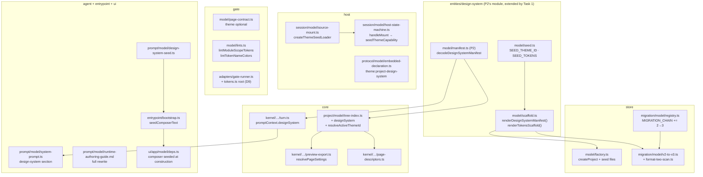

# P4 `integration-spine` — Implementation Plan

> **For agentic workers:** REQUIRED SUB-SKILL: Use superpowers:subagent-driven-development
> (recommended) or superpowers:executing-plans to implement this plan task-by-task. Steps use
> checkbox (`- [ ]`) syntax for tracking. Load `/reatom` and `/errore` before any code-related
> action (CLAUDE.md mandate). Every task ends green and is one commit.

**Goal:** Make a project's own design system reach every consumer that needs it at runtime — the
host child's theme atoms, the declaration bundle, the Gate's two new warnings, a new project's
scaffold, an existing project's mechanical migration, and the agent's prompt — so that after this
plan a project renders against `design/system/design-system.json` and nothing renders against the
compiled `dark-default` palette.

**Architecture:** Token VALUES travel by the route everything else does — they are in
`design/system/design-system.json`, inside `treeRoot`, covered by `expectedFiles` — so the host
child reads and decodes the manifest itself at mount and calls P1's `seedThemeCapability` seam
before `handle.mount(...)`. The active theme ID is resolved once, in `core`, off the canonical
tree index (`meta.theme ?? manifest.defaultTheme ?? the compiled seed id`) and travels in the
already-existing `HostSessionSpec.theme` string, so no protocol field changes. `meta.theme`
becomes genuinely optional through four layers (`entities/page` → Gate page contract → host
`pageMetaSchema` → `ValidatedPageMeta`). The scaffold and the migration share one generator in
`entities/design-system` so a new project and a migrated project get byte-identical seed files.

**Tech Stack:** Bun ≥ 1.3.14, TypeScript 7.0.2 (`tsgo` via `typescript/unstable/sync`),
`zod@4.4.3`, `errore@0.14.1`, `@reatom/core@1001`, `bun:test`.

**Spec:** `docs/superpowers/specs/2026-08-11-project-design-systems-design.md` — §4.3, §4.4, §4.5,
§4.6, §7 (warnings), §9, §10.1 Wave 2 (P4), §11, §12, §13.

---

## Global Constraints

Every task's requirements implicitly include this section.

- **Errors as values (errore).** `import * as errore from "errore"` — namespace import, never
  destructured. No `throw` for an expected failure. Every decoder/loader returns
  `TaggedError | T`; check with `if (x instanceof Error) return x` on **one line**, no block. Happy
  path stays at root indentation. `errore.try` only at genuinely uncontrolled boundaries; the repo's
  call shape is the **object form** already used in `entities/design-tree/model/manifest.ts` and
  `gate/model/gate.ts`: `errore.try({ try: () => …, catch: (cause) => … })`. An error branch that
  does not propagate must log (`log.warn`) — never a silent swallow.
- **Reatom.** This plan touches Reatom in exactly one place: the host child's `handleMount` calls
  P1's `seedThemeCapability` action (a named grouped transition, RTM-S04 — never two `atom.set`
  calls at the call site, never an identity setter). No new atom, computed, or `reatomComponent` is
  created. `/reatom-audit` **is** part of finishing this plan (Task 15) because `handleMount`
  changes.
- **Zod.** `zod@4.4.3`. **Never call `.finite()`** — `z.number()` already rejects `NaN`/`Infinity`
  in v4 and `.finite()` is a no-op.
- **No `any`. No `as` casts** except the two shapes the repo already uses:
  `JSON.parse(text) as unknown`, and the single `Record<string, unknown>` widening idiom in
  `host-state-machine.ts`.
- **Factories are `create*`, never `make*`** (repository-wide naming rule).
- **Imports.** Cross-module imports use the top-level aliases (`entities/design-system`, `runtime`,
  `store/toml`, …). Relative imports only inside one module or one `entities/` submodule. **No
  `tsconfig.json` change is needed by this plan and none may be made.**
- **Path vocabulary.** Inside `gate`'s whole-tree pass and inside the host child, a tree path is
  **tree-relative** (relative to `design/`): the manifest is `system/design-system.json`, never
  `design/system/design-system.json`. Inside `store`'s transaction operations the path is
  **project-relative** and goes through `designFilePath(...)` (which prepends `design/`).
- **Diagnostics are bounded plain text**, never terminal control sequences.
- **`examples/` is NEVER edited by this plan** (spec §9). `examples/clock` migrates at runtime when
  opened, in the closeout, by opening it — never by hand.
- **Tests.** `bun test <path>` per task. The whole-suite gate is
  `bun run scripts/run-tests.ts <paths>`; a **crashed** run is not a pass, and a `bun test` segfault
  is a known flake — re-run once before calling it a regression. `src/ui` and `src/entrypoint`
  render tests **must run as two separate commands**; a combined run produces random failures under
  load.
- **Every added or deleted `.ts`/`.tsx` file under `src/` changes the lexer corpus canary.** Task 15
  fixes it once, at the end, for the whole plan: `src/gate/model/lexer.test.ts`'s
  `expect(files.length).toBe(949)` and the prose count in
  `src/gate/model/lexer.oracle.test.ts`'s `"the repository's own 949 sources"`. Do **not** touch
  those numbers in Tasks 1–14; a task's own run of `src/gate` will fail that one assertion and that
  is expected and correct. Every task that adds or deletes a file must say so in its report so
  Task 15's arithmetic is auditable.
- **Commands are prefixed with `rtk`** (CLAUDE.md). Use single-line `-m` commit messages — a
  heredoc into `rtk git commit` is swallowed; for a multi-line message write it to a scratch file
  and pass `-F <path>`.
- **Every task ends with `rtk bun run lint` and `rtk bun run fmt:check` clean**, then one commit.

---

## Scope

**In scope (P4, Track A, Wave 2):**

1. Host wiring for token values: the child reads `system/design-system.json` out of `treeRoot` and
   calls `seedThemeCapability` before `handle.mount(...)` (§4.6).
2. `theme:project-design-system` replaces `theme:<themeId>` in
   `RuntimeDeclarationBundleV1.publicCapabilityIds` (§4.6).
3. `meta.theme` genuinely optional end-to-end; absent means the manifest's `defaultTheme` (§4.6).
4. The project-create scaffold: `design/system/design-system.json` + `design/system/tokens.ts`
   (§4.3, §4.4).
5. The mechanical migration as a new step in the central migration chain, plus the seeded
   code-migration prompt left **pre-filled and unsent** in the project's chat (§9).
6. The two §7 **warnings**: `useTokens()` at module scope; a token NAME passed where a `Color` is
   expected, carrying the exact rewrite.
7. The agent prompt's design-system section, and the full rewrite of
   `src/agent/prompt/model/runtime-authoring-guide.md`.
8. P2's **D9** resolved: `system/tokens.ts` must not trip `dead-module`.

**Explicitly NOT in scope — another plan owns them:**

| Not here | Owner |
| --- | --- |
| `Color`, `useTokens<T>()`, `ThemeId`, `seedThemeCapability`, the fourteen components retyped, `.d.ts` regeneration | **P1** (already merged into this branch) |
| The manifest entity + Zod schema, every §7 **fatal**, the type-check VFS/`resolveJsonModule`, the `components[]` closure roots, `system/` containment | **P2** (merges before this plan executes) |
| The `DesignSystemSource` port, `sources.json`, the local adapter, the trust-subject variant | **P3** |
| Install, quarantine, picker, publish, **the provenance record**, the update check | **P10** |
| OpenTUI wrappers, the `Box` layout expansion | **P5–P9** |

**Provenance:** this plan writes **no** provenance record and creates no file or field for one.
§8.5 places it "in project state outside `design/`" and P10 owns it. A project scaffolded or
migrated by this plan simply has no recorded source, which is the truth: its design system came
from the compiled seed, not from a source.

---

## Interfaces this plan binds to (verified on branch `project-design-systems`)

**From P1 — merged, read as-is:**

```ts
// src/runtime/types.ts
export type ThemeId = string;
export type Color = `#${string}`;
export interface ThemeTokens { /* the 17 core roles, each a Color */ }
export interface TokenMap extends ThemeTokens { readonly [token: string]: Color }
export interface PageMeta { kitApiVersion; title; minSize; readonly theme?: ThemeId }

// src/runtime/model/tokens.ts   (DEEP import path: "runtime/model/tokens")
export type SeedThemeId = "dark-default";
export const DARK_DEFAULT: TokenMap;
export const DEFAULT_THEME_ID: SeedThemeId;              // "dark-default"
export const themeIdAtom: Atom<ThemeId>;
export const themeTokensAtom: Atom<TokenMap>;
export const seedThemeCapability: Action<[{ readonly themeId: ThemeId; readonly tokens: TokenMap }]>;
export function useTokens<T = TokenMap>(): T;
export function activeTokens(): TokenMap;
```

**From P2 — merges before this plan executes; every name below is from its Task 1 Interfaces
block:**

```ts
// entities/design-system
export const DESIGN_SYSTEM_DIRNAME: "system";
export const DESIGN_SYSTEM_MANIFEST_RELPATH: "system/design-system.json";
export const DESIGN_SYSTEM_SCHEMA_VERSION: 1;
export const CORE_TOKEN_ROLES: readonly [...17 names...];
export type CoreTokenRole = (typeof CORE_TOKEN_ROLES)[number];
export interface DesignSystemThemeV1 { readonly label: string; readonly tokens: Readonly<Record<string, string>> }
export interface DesignSystemComponentV1 { readonly name: string; readonly module: string; readonly export: string }
export interface DesignSystemManifestV1 {
  readonly schemaVersion: 1; readonly id: string; readonly name: string; readonly version: string;
  readonly kitApiVersion: number; readonly defaultTheme: string;
  readonly themes: Readonly<Record<string, DesignSystemThemeV1>>;
  readonly components: readonly DesignSystemComponentV1[];
}
export class DesignSystemManifestInvalidError extends errore.createTaggedError({...}) {}
export function decodeDesignSystemManifest(text: string): DesignSystemManifestInvalidError | DesignSystemManifestV1;
export function designSystemComponentRelPath(component: DesignSystemComponentV1): string;
export function findUnresolvedComponents(input: {...}): readonly DesignSystemComponentV1[];
export function isInsideDesignSystem(relPath: string): boolean;
```

**If any of those P2 names differs at merge time**, adapt to the merged reality and say so in the
task report — never re-declare a second copy.

---

## Decisions this plan makes

Each was read in the code on branch `project-design-systems` and is cited. They are
implementation-level rulings the spec left open, plus three deliberate corrections.

**D1 — the child reads the manifest through an injected loader, not through the filesystem
directly.** `src/host/session/model/host-state-machine.ts` performs **no** I/O: every boundary is a
`HostSessionDeps` field (`loadPage`, `createRenderer`, `now`, `send`, `requestExit`). Task 5 adds
`loadThemeSeed` beside `loadPage`, implemented in `source-mount.ts` (which already owns
hash-verified tree reads) and wired in `entry.ts`. That keeps the state machine testable against
fakes exactly as `host-state-machine.test.tsx` already tests every other boundary.

**D2 — three theme outcomes at the child, and the third is a documented fallback, not an invented
value.**
- The manifest is **absent from `expectedFiles`** → `loadThemeSeed` returns `null`, nothing is
  seeded, and the atoms keep P1's compiled-seed default. This is the transitional rule (P2's D8)
  applied at the host: a tree that predates the migration mounts exactly as it does today.
- The manifest is present and declares `request.theme` → seed with it.
- The manifest is present and does **not** declare `request.theme` → seed with the manifest's own
  `defaultTheme` and record it through `infrastructure/debug-log`'s `trace`. It is **not** a mount
  failure. `host/adapters/smoke-renderer.ts:53` fills `theme: DEFAULT_THEME_ID` on purpose ("a smoke
  render only proves the page renders"), so a strict refusal would break every smoke render in every
  project whose manifest does not happen to declare a theme called `dark-default`. The fallback
  value is the manifest's own declared default — read out of the project, not invented here — and
  the Gate is what fatals a page's `meta.theme` naming an undeclared theme (§7, P2 Task 6).

**D3 — the seventeen seed VALUES are declared in `entities/design-system`, with an exact drift
test, rather than deep-imported from `runtime/model/tokens`.** P1's own comment on `DARK_DEFAULT`
predicts "plan P4 imports it from this module by path". This plan does not, for one reason: the two
callers of the scaffold generator are `store/model/factory.ts` (project create) and
`store/migration/model/v2-to-v3.ts` (the migration), and `store` importing `runtime` would be a new
module edge that also drags `@reatom/core` into the store's graph for seventeen string constants.
`entities/` is already importable from `store` with no new edge, and P2's **D3** set the precedent
one plan earlier for exactly this class of constant (`CORE_TOKEN_ROLES` declared in the entity, drift
guarded by a test). The guard here is stronger than P2's: Task 1's test asserts **value** equality
(`expect(SEED_TOKENS).toEqual(DARK_DEFAULT)`), not just key equality. Task 1 also corrects P1's
comment in place so the prediction and the code do not disagree.

**D4 — the active theme ID is resolved ONCE, in `core`, off `CanonicalTreeIndexV1`.** The index
(`src/core/project/model/tree-index.ts`) already holds every tree file's text in `files`, is read
once per non-turn path, and is already threaded into both consumers that need a concrete theme
string (`resolvePageSettings` → the mount spec, `buildPageDescriptors` → the descriptor DTO). It
gains one decoded field, `designSystem`. Resolving anywhere else would mean a second read of the
same manifest that could disagree with the first.

**D5 — `PageDescriptorV1.theme` and `HostSessionSpec.theme` stay REQUIRED non-empty strings, and
that is what makes this a no-protocol-change plan.** `core/protocol/model/shared-dto.ts:162` has
`theme: z.string().min(1)`; `src/host/types.ts:71` has `readonly theme: string`. Both now carry the
**resolved** theme, not the page's declaration. Widening them to optional would push the resolution
question into the UI and the child, i.e. into two more places, for no gain — spec §4.6 says exactly
this ("`HostSessionSpec.theme` is already `string` and already carried per mount, so the active
theme id needs no protocol change").

**D6 — the resolution chain's last resort is the compiled seed ID, and it is reachable.**
`meta.theme ?? manifest.defaultTheme ?? SEED_THEME_ID`. The third arm fires for a themeless page in
a project with no design system — impossible today, possible from Task 2 onward and until the
migration runs. `SEED_THEME_ID` is `"dark-default"`, the value the child's atoms already default to,
so a page that reaches it renders against the same palette the process is already holding. It is
the honest continuation of the current behaviour, not a new one.

**D7 — an UNDECODABLE design-system manifest never refuses a turn or an open.** `readPageOrder`
refuses on a `pages.json` decode failure, and copying that here would be a trap: an agent turn that
writes a malformed `design-system.json` would make the *next* turn unstartable, so the agent could
never repair its own file. Every reader added by this plan treats a present-but-undecodable manifest
as `null` plus a `log.warn`. The Gate is the enforcement point (P2's fatals reject the candidate
before it is ever committed), and the Gate is reached through a path that does not need the manifest
to decode first.

**D8 — the migration prompt is a pre-filled COMPOSER DRAFT, and the existing auto-run seeded turn
stops firing.** §9 is explicit: "the migration flow leaves the seeded code-migration message
pre-filled in the project's chat for the user to review and send. The turn never runs
automatically." Today `bootstrap.ts:72-74` passes `seedTurnText`, which `run-app.ts:178-182` puts
into `project.open`'s `text` and `core/kernel/model/handlers/project.ts`'s
`runProjectReadySequence` turns into a real `beginTurn`. Keeping that after this plan would be
actively harmful, not merely against the spec: after the mechanical migration commits, **every**
existing page fails the Gate on the `Color` type change (§12's accepted red window), so an
auto-started refactor turn burns the user's agent budget on a turn that cannot pass. Task 12
therefore routes both seeds — the existing `migrationRefactorSeed` (format-1 origins only) and the
new design-system seed — into a new `seedComposerText` channel and stops passing `seedTurnText`.
`seedTurnText` itself, and its `project.open` `text` plumbing, are left in place untouched: they are
a protocol path with their own tests, and deleting them is churn this plan does not need.

**D9 — `system/tokens.ts` becomes an implicit closure root, resolving P2's D9.** P2 recorded that a
project whose pages do not yet import `system/tokens.ts` sees a `dead-module` warning on it. That is
a false positive by construction: `tokens.ts` is written by termcraft itself (the scaffold and the
migration), it is the file §4.3 teaches pages to import, and it is dead only during exactly the
window the migration exists to close. Task 7 adds it to the same root set P2 built for
`components[]`, guarded by the same "only when the manifest is present" rule. The alternative
considered and rejected — suppressing `dead-module` for the whole `system/` folder — would also hide
a genuinely orphaned component the manifest forgot to declare, which is a fact the warning should
keep reporting.

**D10 — the two new warnings name what their scanner can see, and nothing more.** This is
`gate/model/lints.ts`'s own recorded principle (the `unguarded-*` → `nondeterministic-*` rename: "a
lint that promises more than its scanner can see is worse than no lint"). So:
- `module-scope-tokens` fires on a `useTokens ( )` call at **brace depth 0** with no `=>` seen since
  the last statement boundary. It does not attempt scope analysis. The `=>` guard exists because the
  §4.3 scaffold itself is `export const useTokens = () => useRuntimeTokens<Tokens>()` — an arrow with
  an expression body opens no brace, and without the guard a lint shipped to warn about a real
  mistake would fire on the file termcraft generates.
- `token-name-as-color` fires on a JSX attribute named `color`, `background`, or ending in `Color`,
  whose value is a **string literal** that does not start with `#`. It carries the exact rewrite. It
  does not try to know whether the name is a declared token: the type check already answers that
  fatally, and this warning's only job is turning a bare `TS2322` into an instruction.

---

## Architecture



---

## Task order and dependencies

```
T0  baseline
 └─ T1  entities/design-system: seed + scaffold generator      (blocks T4, T7, T10, T11)
     ├─ T2  meta.theme optional: entities/page + Gate contract  (blocks T3, T4)
     │   └─ T3  meta.theme optional: the host child
     │       └─ T4  core theme resolution (tree index + 2 consumers)
     │           └─ T5  host child token seeding
     │               └─ T6  theme:project-design-system
     ├─ T7  D9: system/tokens.ts as a closure root              (independent of T2–T6)
     ├─ T8  warning lint: useTokens() at module scope           (independent)
     ├─ T9  warning lint: token name where a Color is expected  (independent)
     ├─ T10 project-create scaffold                             (needs T1)
     │   └─ T11 the v2→v3 migration                             (needs T1 + T10's shared helper)
     │       └─ T12 the migration prompt + composer pre-fill
     └─ T13 agent prompt: the design-system section             (needs T1; T4 for the reader shape)
         └─ T14 authoring-guide rewrite
             └─ T15 closeout: corpus canary, arch docs, full verification
```

---

### Task 0: Baseline

**Files:** none modified.

- [ ] **Step 1: Confirm the tree is green before anything changes**

```bash
rtk bun run scripts/run-tests.ts src/gate src/entities src/host src/store src/core src/agent
```

Expected: a summary line and exit 0. If the run reports `crashed`, re-run once — a `bun test`
segfault is a known flake and a crashed run is never a pass. If it *fails*, stop and report: this
plan must not start on a red tree.

- [ ] **Step 2: Record the baseline counts you must not reduce**

```bash
rtk bun test src/host/session 2>&1 | tail -5
rtk bun test src/store/migration src/store/model 2>&1 | tail -5
rtk bun test src/gate/adapters/gate-runner.test.ts 2>&1 | tail -5
```

Note the pass counts in your task report.

- [ ] **Step 3: Confirm P2 has merged and read its real surface**

```bash
rtk bun test src/entities/design-system 2>&1 | tail -5
```

Expected: PASS. If `src/entities/design-system` does not exist, **stop and report** — this plan
cannot start before sync point 1. Read `src/entities/design-system/index.ts` and record in your task
report any name that differs from the "Interfaces this plan binds to" block above.

---

### Task 1: The seed palette and the scaffold generator

Spec §4.3, §4.4, §9. Decision D3. Blocks Tasks 4, 7, 10, 11.

**Files:**
- Create: `src/entities/design-system/model/seed.ts`
- Create: `src/entities/design-system/model/scaffold.ts`
- Modify: `src/entities/design-system/types.ts` — add `DESIGN_SYSTEM_TOKENS_RELPATH`
- Modify: `src/entities/design-system/index.ts` — export the new surface
- Modify: `src/runtime/model/tokens.ts` — correct `DARK_DEFAULT`'s doc comment (D3)
- Test: `src/entities/design-system/model/seed.test.ts`
- Test: `src/entities/design-system/model/scaffold.test.ts`

**Interfaces:**
- Consumes: P2's `CORE_TOKEN_ROLES`, `DESIGN_SYSTEM_DIRNAME`, `DESIGN_SYSTEM_SCHEMA_VERSION`,
  `decodeDesignSystemManifest`, `DesignSystemManifestV1`. A **test-only** `import type`/value import
  of `DARK_DEFAULT`/`DEFAULT_THEME_ID` from `runtime/model/tokens` for the drift guard.
- Produces:
  ```ts
  export const DESIGN_SYSTEM_TOKENS_RELPATH: "system/tokens.ts";
  export const SEED_THEME_ID: "dark-default";
  export const SEED_THEME_LABEL: "Dark";
  export const SEED_DESIGN_SYSTEM_ID: "default";
  export const SEED_DESIGN_SYSTEM_NAME: "Default";
  export const SEED_DESIGN_SYSTEM_VERSION: "1.0.0";
  export const SEED_TOKENS: Readonly<Record<string, string>>;
  export function createSeedManifest(input: { readonly kitApiVersion: number }): DesignSystemManifestV1;
  export function renderDesignSystemManifest(manifest: DesignSystemManifestV1): string;
  export function renderTokensScaffold(manifest: DesignSystemManifestV1): string;
  ```

- [ ] **Step 1: Write the failing tests**

Create `src/entities/design-system/model/seed.test.ts`:

```ts
import { describe, expect, test } from "bun:test";

import { DARK_DEFAULT, DEFAULT_THEME_ID } from "runtime/model/tokens";

import { CORE_TOKEN_ROLES } from "../types";
import { SEED_THEME_ID, SEED_TOKENS, createSeedManifest } from "./seed";
import { decodeDesignSystemManifest } from "./manifest";
import { renderDesignSystemManifest } from "./scaffold";

describe("the seed palette (design-systems §4.6, §9)", () => {
  // D3's drift guard, stronger than a key comparison: the seventeen VALUES must be byte-identical
  // to the compiled seed, which is itself 1:1 with `design/termcraft-engine.js`'s `pal`.
  test("SEED_TOKENS equals runtime's DARK_DEFAULT exactly", () => {
    expect(SEED_TOKENS).toEqual({ ...DARK_DEFAULT });
  });

  test("SEED_THEME_ID equals runtime's DEFAULT_THEME_ID", () => {
    expect(SEED_THEME_ID).toBe(DEFAULT_THEME_ID);
  });

  test("the seed declares every core role and nothing else", () => {
    expect(Object.keys(SEED_TOKENS).sort()).toEqual([...CORE_TOKEN_ROLES].sort());
  });

  test("every seed value is a lowercase #rrggbb", () => {
    for (const value of Object.values(SEED_TOKENS)) expect(value).toMatch(/^#[0-9a-f]{6}$/);
  });
});

describe("createSeedManifest", () => {
  test("the rendered seed manifest decodes through the real decoder", () => {
    const manifest = createSeedManifest({ kitApiVersion: 1 });
    const decoded = decodeDesignSystemManifest(renderDesignSystemManifest(manifest));
    expect(decoded).not.toBeInstanceOf(Error);
    if (decoded instanceof Error) return;
    expect(decoded).toEqual(manifest);
  });

  test("the seed's defaultTheme names its one declared theme", () => {
    const manifest = createSeedManifest({ kitApiVersion: 1 });
    expect(manifest.defaultTheme).toBe(SEED_THEME_ID);
    expect(Object.keys(manifest.themes)).toEqual([SEED_THEME_ID]);
  });

  test("the seed declares no components", () => {
    expect(createSeedManifest({ kitApiVersion: 1 }).components).toEqual([]);
  });

  test("the kitApiVersion is the caller's, never a literal", () => {
    expect(createSeedManifest({ kitApiVersion: 7 }).kitApiVersion).toBe(7);
  });
});
```

Create `src/entities/design-system/model/scaffold.test.ts`:

```ts
import { describe, expect, test } from "bun:test";

import { DESIGN_SYSTEM_TOKENS_RELPATH } from "../types";
import { createSeedManifest } from "./seed";
import { decodeDesignSystemManifest } from "./manifest";
import { renderDesignSystemManifest, renderTokensScaffold } from "./scaffold";

const manifest = createSeedManifest({ kitApiVersion: 1 });

describe("renderDesignSystemManifest", () => {
  test("is pretty-printed JSON with a trailing newline", () => {
    const text = renderDesignSystemManifest(manifest);
    expect(text.endsWith("\n")).toBe(true);
    expect(text).toContain('\n  "id": "default"');
  });

  test("is byte-deterministic — the same manifest renders identically twice", () => {
    expect(renderDesignSystemManifest(manifest)).toBe(renderDesignSystemManifest(manifest));
  });

  test("round-trips through the decoder", () => {
    expect(decodeDesignSystemManifest(renderDesignSystemManifest(manifest))).toEqual(manifest);
  });
});

describe("renderTokensScaffold (spec §4.3)", () => {
  const text = renderTokensScaffold(manifest);

  test("writes the defaultTheme's LITERAL name into the indexed access", () => {
    expect(text).toContain('["themes"]["dark-default"]["tokens"]');
  });

  test("uses the mapped type, never a bare indexed access", () => {
    // The mapped type is what re-types each JSON string value as `Color`; a bare indexed access
    // would carry `string` into every colour prop and fail every `t.<token>` read.
    expect(text).toContain("export type Tokens = { [K in keyof");
    expect(text).toContain("]: Color }");
  });

  test("imports the runtime hook under an alias and re-exports the bound one", () => {
    expect(text).toContain(
      'import { useTokens as useRuntimeTokens, type Color } from "@termcraft/runtime"',
    );
    expect(text).toContain('import ds from "./design-system.json"');
    expect(text).toContain("export const useTokens = () => useRuntimeTokens<Tokens>()");
  });

  test("ends with a newline and is byte-deterministic", () => {
    expect(text.endsWith("\n")).toBe(true);
    expect(renderTokensScaffold(manifest)).toBe(text);
  });

  test("a manifest with a different defaultTheme writes THAT name", () => {
    const other = { ...manifest, defaultTheme: "midnight", themes: { midnight: manifest.themes["dark-default"]! } };
    expect(renderTokensScaffold(other)).toContain('["themes"]["midnight"]["tokens"]');
  });

  test("the scaffold's own relPath constant is the file this text belongs at", () => {
    expect(DESIGN_SYSTEM_TOKENS_RELPATH).toBe("system/tokens.ts");
  });
});
```

- [ ] **Step 2: Run to verify they fail**

```bash
rtk bun test src/entities/design-system/model/seed.test.ts src/entities/design-system/model/scaffold.test.ts
```
Expected: FAIL — `./seed` and `./scaffold` do not exist.

- [ ] **Step 3: Add the tokens relpath to `types.ts`**

Append beside P2's `DESIGN_SYSTEM_MANIFEST_RELPATH`:

```ts
/**
 * The typed accessor's TREE-relative path (design-systems §4.3). Written by the project-create
 * scaffold and by the mechanical migration, and imported by every page that reads a token. Named
 * here rather than at each writer so the Gate's closure roots (P4 D9), the scaffold, and the
 * migration cannot disagree about where it lives.
 */
export const DESIGN_SYSTEM_TOKENS_RELPATH = `${DESIGN_SYSTEM_DIRNAME}/tokens.ts`;
```

- [ ] **Step 4: Write `model/seed.ts`**

```ts
import { CORE_TOKEN_ROLES, DESIGN_SYSTEM_SCHEMA_VERSION } from "../types";
import type { DesignSystemManifestV1 } from "../types";

/**
 * The seed theme's id (design-systems §9). Identical to `runtime`'s `DEFAULT_THEME_ID`, pinned by
 * `seed.test.ts` rather than imported: `entities/` is what `store` may import, and `store` is where
 * both writers of this seed live (project create, and the mechanical migration). See plan P4's
 * decision D3 for the full argument, and `runtime/model/tokens.ts`'s own note, which points here.
 */
export const SEED_THEME_ID = "dark-default";

/** The seed theme's display label — the shell's picker shows it beside the swatches (§8.1). */
export const SEED_THEME_LABEL = "Dark";

/** The seed design system's identity (§3.3). A new project owns it outright; nothing addresses it remotely. */
export const SEED_DESIGN_SYSTEM_ID = "default";
export const SEED_DESIGN_SYSTEM_NAME = "Default";
export const SEED_DESIGN_SYSTEM_VERSION = "1.0.0";

/**
 * The seed palette (design-systems §9: "the same seventeen values, taken 1:1 from
 * `design/termcraft-engine.js`, nothing invented"). A warm amber-on-near-black terminal theme.
 *
 * COPIED, NOT IMPORTED — and the copy is exact by TEST, not by promise: `seed.test.ts` asserts
 * `expect(SEED_TOKENS).toEqual({ ...DARK_DEFAULT })`, so a divergence from `runtime/model/tokens.ts`
 * (and therefore from the design engine) is a failing test rather than a silent drift.
 */
export const SEED_TOKENS: Readonly<Record<string, string>> = {
  background: "#14110d",
  surface: "#231d12",
  foreground: "#d7d0c2",
  foregroundMuted: "#8f877a",
  foregroundFaint: "#5b544a",
  border: "#403a2f",
  line: "#2c2820",
  accent: "#e6a23c",
  accentHi: "#f6c163",
  accentDim: "#8a6d33",
  selection: "#392c11",
  selectionFg: "#f6c163",
  success: "#8fb96b",
  warning: "#f6c163",
  danger: "#dd7b60",
  dangerDim: "#4d2a20",
  statusBg: "#231d12",
};

/**
 * The manifest a brand-new (or freshly migrated) project starts with (§4.4, §9). It declares the
 * seventeen core roles and NOTHING beyond them: a project-specific token is something the project
 * adds, and inventing one here would put a name in front of the agent that means nothing yet.
 *
 * `components` is empty for the same reason `createProject` seeds `pages: []` — a scaffolded
 * component the user never asked for is a design decision this code is not entitled to make.
 *
 * `kitApiVersion` is the CALLER's, never a literal: the writers hold the binary's own
 * `CURRENT_KIT_API_VERSION` and a second reading of it here could disagree with the handshake.
 */
export function createSeedManifest(input: {
  readonly kitApiVersion: number;
}): DesignSystemManifestV1 {
  // Declared in CORE_TOKEN_ROLES order so the rendered JSON's key order is the roles' own
  // documented order, not an object-literal accident.
  const tokens: Record<string, string> = {};
  for (const role of CORE_TOKEN_ROLES) {
    const value = SEED_TOKENS[role];
    // Unreachable: `seed.test.ts` asserts SEED_TOKENS' key set IS CORE_TOKEN_ROLES. Kept explicit
    // rather than asserted away, per this repository's "never silently assume success" rule.
    if (value === undefined) continue;
    tokens[role] = value;
  }
  return {
    schemaVersion: DESIGN_SYSTEM_SCHEMA_VERSION,
    id: SEED_DESIGN_SYSTEM_ID,
    name: SEED_DESIGN_SYSTEM_NAME,
    version: SEED_DESIGN_SYSTEM_VERSION,
    kitApiVersion: input.kitApiVersion,
    defaultTheme: SEED_THEME_ID,
    themes: { [SEED_THEME_ID]: { label: SEED_THEME_LABEL, tokens } },
    components: [],
  };
}
```

- [ ] **Step 5: Write `model/scaffold.ts`**

```ts
import type { DesignSystemManifestV1 } from "../types";

/**
 * `design/system/design-system.json`'s exact bytes. Two-space JSON with a trailing newline —
 * the same shape `entities/design-tree`'s `encodePagesManifest` produces for `pages.json`, so the
 * two files written into one design tree read the same way in a diff.
 *
 * BYTE-DETERMINISTIC, which is load-bearing twice: the file's bytes fold into `treeRevision`
 * (`entities/design-tree`'s `computeTreeRevision`), so a non-deterministic renderer would
 * invalidate the host's session key for nothing; and the migration's transaction CASes on the hash
 * of what it is about to write.
 */
export function renderDesignSystemManifest(manifest: DesignSystemManifestV1): string {
  return `${JSON.stringify(manifest, null, 2)}\n`;
}

/**
 * `design/system/tokens.ts`'s exact bytes — the §4.3 scaffold, verbatim from the spec.
 *
 * THE MAPPED TYPE IS THE WHOLE POINT. A JSON import widens every string value to `string` under
 * `resolveJsonModule`, which is not assignable to `Color`; a bare indexed access
 * (`(typeof ds)["themes"]["dark"]["tokens"]`) would carry that widened type straight into every
 * colour prop and fail every `t.<token>` read. The mapped type re-types each value as `Color` while
 * keeping the key set derived from the manifest, so a typo'd key is still a fatal type error.
 *
 * THE DEFAULT THEME'S LITERAL NAME is written into the indexed access — `manifest.defaultTheme`,
 * never a fixed `"dark"`. With cross-theme parity enforced (§4.2, P2's decoder) every theme has the
 * same key set, so the derived type is correct for whichever theme is active.
 */
export function renderTokensScaffold(manifest: DesignSystemManifestV1): string {
  return [
    `// Generated by termcraft. The token NAMES and VALUES live in ./design-system.json — edit that`,
    `// file (or ask the design agent to) and this accessor follows automatically.`,
    `import { useTokens as useRuntimeTokens, type Color } from "@termcraft/runtime"`,
    `import ds from "./design-system.json"`,
    ``,
    `export type Tokens = { [K in keyof (typeof ds)["themes"]["${manifest.defaultTheme}"]["tokens"]]: Color }`,
    `export const useTokens = () => useRuntimeTokens<Tokens>()`,
    ``,
  ].join("\n");
}
```

- [ ] **Step 6: Export the new surface from `index.ts`**

Append to `src/entities/design-system/index.ts`, in the file's existing style (types with
`export type { … }`, values with `export { … }`):

```ts
export { DESIGN_SYSTEM_TOKENS_RELPATH } from "./types";
export {
  SEED_DESIGN_SYSTEM_ID,
  SEED_DESIGN_SYSTEM_NAME,
  SEED_DESIGN_SYSTEM_VERSION,
  SEED_THEME_ID,
  SEED_THEME_LABEL,
  SEED_TOKENS,
  createSeedManifest,
} from "./model/seed";
export { renderDesignSystemManifest, renderTokensScaffold } from "./model/scaffold";
```

- [ ] **Step 7: Correct P1's prediction in `runtime/model/tokens.ts`**

In `DARK_DEFAULT`'s doc comment, replace the parenthetical
`(plan P4 imports it from this module by path)` with:

```
 *      project's manifest. P4 does NOT import it from here: the two writers of that seed live in
 *      `store` (project create, and the mechanical migration), and `store` importing `runtime`
 *      would be a new module edge — so the seed values are declared in
 *      `entities/design-system/model/seed.ts` and pinned to THIS constant by an exact
 *      `toEqual` test (`seed.test.ts`). See plan P4's decision D3.
```

Change nothing else in that file.

- [ ] **Step 8: Run the tests**

```bash
rtk bun test src/entities/design-system/
```
Expected: PASS, every case.

- [ ] **Step 9: Lint, format, commit**

```bash
rtk bun run lint && rtk bun run fmt:check
rtk git add src/entities/design-system src/runtime/model/tokens.ts && rtk git commit -m "feat(design-system): the seed palette and the design-system scaffold generator"
```

Report in your task summary: **+2 source files** (`model/seed.ts`, `model/scaffold.ts`) and **+2 test
files** for Task 15's corpus arithmetic.

---

### Task 2: `meta.theme` optional — `entities/page` and the Gate's page contract

Spec §4.6. Blocks Tasks 3 and 4.

**Files:**
- Modify: `src/entities/page/types.ts:17-22` — `PageMeta.theme` becomes optional
- Modify: `src/gate/model/page-contract.ts:180-221` — `validateMetaShape`
- Test: `src/gate/model/page-contract.test.ts` — new cases

**Interfaces:**
- Produces: `PageMeta.theme?: string` — every later task and every existing consumer reads this.

- [ ] **Step 1: Write the failing tests**

Append to `src/gate/model/page-contract.test.ts` (match the file's existing helper style — read the
top of the file first and reuse whatever `check`/`parse` helper it already defines rather than
writing a second one):

```ts
describe("meta.theme is optional (design-systems §4.6)", () => {
  const page = (metaBody: string) => `import { definePage, reatomComponent } from "@termcraft/runtime"
export const meta = definePage({ ${metaBody} })
export default reatomComponent(function Page() { return null })
`;

  test("a page omitting `theme` passes the contract, with meta.theme undefined", () => {
    const result = checkPageContract(
      page(`kitApiVersion: 1, title: "T", minSize: { w: 80, h: 24 }`),
      "tsx",
    );
    expect(result).not.toBeInstanceOf(Error);
    if (result instanceof Error) return;
    expect(result.errors).toEqual([]);
    expect(result.meta).not.toBeNull();
    expect(result.meta?.theme).toBeUndefined();
  });

  test("a page declaring `theme` still carries it verbatim", () => {
    const result = checkPageContract(
      page(`kitApiVersion: 1, title: "T", minSize: { w: 80, h: 24 }, theme: "midnight"`),
      "tsx",
    );
    expect(result).not.toBeInstanceOf(Error);
    if (result instanceof Error) return;
    expect(result.errors).toEqual([]);
    expect(result.meta?.theme).toBe("midnight");
  });

  test("a PRESENT but non-string `theme` is still MISSING_META_FIELD", () => {
    // Optional means "may be absent", never "may be anything". A numeric theme is a page that
    // meant to pin a theme and got it wrong; reporting nothing would hide that.
    const result = checkPageContract(
      page(`kitApiVersion: 1, title: "T", minSize: { w: 80, h: 24 }, theme: 7`),
      "tsx",
    );
    expect(result).not.toBeInstanceOf(Error);
    if (result instanceof Error) return;
    expect(result.errors.map((e) => e.code)).toContain("MISSING_META_FIELD");
    expect(result.meta).toBeNull();
  });

  test("the other three fields stay required", () => {
    const result = checkPageContract(page(`title: "T", minSize: { w: 80, h: 24 }`), "tsx");
    expect(result).not.toBeInstanceOf(Error);
    if (result instanceof Error) return;
    expect(result.errors.map((e) => e.code)).toContain("MISSING_META_FIELD");
  });
});
```

- [ ] **Step 2: Run to verify they fail**

```bash
rtk bun test src/gate/model/page-contract.test.ts
```
Expected: FAIL — the "omitting `theme`" case reports `MISSING_META_FIELD`.

- [ ] **Step 3: Make `PageMeta.theme` optional**

`src/entities/page/types.ts`, replacing the `theme` line:

```ts
/** The static `meta` export of a page module (master spec §5.1). */
export interface PageMeta {
  readonly kitApiVersion: number;
  readonly title: string;
  readonly minSize: Size;
  /**
   * The declared theme this page pins to (design-systems §4.6). OPTIONAL: absent means the
   * project's own `design/system/design-system.json` `defaultTheme`, which is the ordinary case.
   * Resolution to a concrete id happens exactly once, in `core/project`'s
   * `resolveActiveThemeId` — never here, and never a second time downstream.
   */
  readonly theme?: string;
}
```

- [ ] **Step 4: Relax `validateMetaShape`**

In `src/gate/model/page-contract.ts`, replace the `theme` handling. The two changed lines and the
new comment:

```ts
  // `theme` is OPTIONAL (design-systems §4.6): absent means the project manifest's `defaultTheme`.
  // PRESENT-BUT-WRONG is still fatal — a page that meant to pin a theme and wrote `theme: 7` is a
  // mistake, and "optional" must not launder it into silence.
  if (theme !== undefined && theme.kind !== "string") missing("theme");
```

…and in the final guard, replace `theme?.kind !== "string"` with `(theme !== undefined && theme.kind !== "string")`.
The return becomes:

```ts
  return {
    kitApiVersion: kit.n,
    title: title.s,
    minSize: { w: w.n, h: h.n },
    // OMITTED, never `theme: undefined`: `PageMeta` is consumed by `z.strictObject`-decoded DTO
    // builders downstream, where an explicit `undefined` key and an absent key are different facts.
    ...(theme?.kind === "string" ? { theme: theme.s } : {}),
  };
```

- [ ] **Step 5: Run the tests**

```bash
rtk bun test src/gate/model/page-contract.test.ts src/gate/model/gate.test.ts
rtk bun x tsc --noEmit
```
Expected: page-contract PASS. `tsc` will report errors at every site that reads `meta.theme` as a
required string (`core/kernel/model/handlers/preview-export.ts:376`,
`core/kernel/model/handlers/page-descriptors.ts:290`, and the host's own copy). **Record that list
in your task report and leave it broken** — Tasks 3 and 4 close it. If `tsc` reports a site outside
`src/core` and `src/host`, report it: that is a consumer this plan did not predict.

- [ ] **Step 6: Commit**

```bash
rtk bun run lint && rtk bun run fmt:check
rtk git add src/entities/page/types.ts src/gate/model/page-contract.ts src/gate/model/page-contract.test.ts && rtk git commit -m "feat(gate): meta.theme is optional in the page contract"
```

> Note: the repository is intentionally left non-typechecking between Tasks 2 and 4. Each of those
> tasks still runs its own suites green; `bun x tsc --noEmit` is only required to pass at Task 4 and
> at Task 15.

---

### Task 3: `meta.theme` optional — the host child

Spec §4.6. Needs Task 2.

**Files:**
- Modify: `src/host/session/types.ts:16-21` — `ValidatedPageMeta.theme` optional
- Modify: `src/host/session/model/source-mount.ts:541-546` — `pageMetaSchema`
- Test: `src/host/session/model/source-mount.test.ts` — new cases

**Interfaces:**
- Produces: `ValidatedPageMeta.theme?: string`, echoed unchanged through `ReadyBody.meta`.

- [ ] **Step 1: Write the failing tests**

Append to `src/host/session/model/source-mount.test.ts`. Read the file's existing fixture helper for
writing a page module into a temp tree and reuse it verbatim rather than writing a second one; the
two cases are:

```ts
describe("meta.theme is optional (design-systems §4.6)", () => {
  test("a page with no `theme` loads, and its validated meta omits theme", async () => {
    // …stage a page whose definePage call has kitApiVersion/title/minSize and NO theme, then:
    const loaded = await loadPage({ treeRoot, entryRelPath, expectedFiles });
    expect(loaded).not.toBeInstanceOf(Error);
    if (loaded instanceof Error) return;
    expect(loaded.meta.theme).toBeUndefined();
    expect(loaded.meta.title).toBe("T");
  });

  test("a page whose `theme` is an empty string is still MALFORMED_PROTOCOL", async () => {
    // Optional means absent-or-valid. `theme: ""` names no theme and must not pass.
    const loaded = await loadPage({ treeRoot, entryRelPath, expectedFiles });
    expect(loaded).toBeInstanceOf(Error);
    if (!(loaded instanceof Error)) return;
    expect(loaded.code).toBe("MALFORMED_PROTOCOL");
  });
});
```

- [ ] **Step 2: Run to verify they fail**

```bash
rtk bun test src/host/session/model/source-mount.test.ts
```
Expected: FAIL — the no-`theme` case is rejected with `MALFORMED_PROTOCOL`.

- [ ] **Step 3: Make the type and the schema optional**

`src/host/session/types.ts`:

```ts
/** A page's static metadata after structural validation of the imported module. */
export interface ValidatedPageMeta {
  readonly kitApiVersion: number;
  readonly title: string;
  readonly minSize: Size;
  /**
   * OPTIONAL (design-systems §4.6). The child never resolves it: the ACTIVE theme travels in
   * `MountRequestBody.theme`, which `core` already resolved against the project's manifest. This
   * field is the page's own DECLARATION, echoed back in `ReadyBody.meta` unchanged.
   */
  readonly theme?: string;
}
```

`src/host/session/model/source-mount.ts`:

```ts
const pageMetaSchema = z.object({
  kitApiVersion: z.number().int().positive(),
  title: z.string().min(1).max(TITLE_MAX),
  // OPTIONAL (design-systems §4.6): absent means the project manifest's `defaultTheme`, which
  // `core` has already resolved into `MountRequestBody.theme` by the time this runs. `.min(1)`
  // survives — an empty string names no theme and is corruption, not an absence.
  theme: z.string().min(1).max(THEME_MAX).optional(),
  minSize: pageSizeSchema,
});
```

- [ ] **Step 4: Run the tests**

```bash
rtk bun test src/host/session
```
Expected: PASS. If a fixture under `src/host/session/fixtures/` fails to load, read it — those
fixtures all declare `theme: "dark-default"` today and must keep compiling unchanged.

- [ ] **Step 5: Commit**

```bash
rtk bun run lint && rtk bun run fmt:check
rtk git add src/host/session && rtk git commit -m "feat(host): the child accepts a page with no declared theme"
```

---

### Task 4: The active theme resolved once, in `core`

Spec §4.6. Decisions D4, D5, D6, D7. Needs Tasks 1–3.

**Files:**
- Modify: `src/core/project/model/tree-index.ts` — `CanonicalTreeIndexV1.designSystem`
- Create: `src/core/project/model/active-theme.ts` — `resolveActiveThemeId`
- Modify: `src/core/project/index.ts` — export both
- Modify: `src/core/kernel/model/handlers/preview-export.ts:376` — resolve for the mount spec
- Modify: `src/core/kernel/model/handlers/page-descriptors.ts:290` — resolve for the descriptor
- Test: `src/core/project/model/active-theme.test.ts`
- Test: `src/core/project/model/tree-index.test.ts` — new cases

**Interfaces:**
- Consumes: `decodeDesignSystemManifest`, `DESIGN_SYSTEM_MANIFEST_RELPATH`,
  `DesignSystemManifestV1`, `SEED_THEME_ID` from `entities/design-system`.
- Produces:
  ```ts
  // core/project
  interface CanonicalTreeIndexV1 { /* …existing… */ readonly designSystem: DesignSystemManifestV1 | null }
  export function resolveActiveThemeId(input: {
    readonly metaTheme?: string;
    readonly designSystem: DesignSystemManifestV1 | null;
  }): string;
  ```

- [ ] **Step 1: Write the failing tests**

Create `src/core/project/model/active-theme.test.ts`:

```ts
import { describe, expect, test } from "bun:test";

import { SEED_THEME_ID, createSeedManifest } from "entities/design-system";

import { resolveActiveThemeId } from "./active-theme";

const manifest = { ...createSeedManifest({ kitApiVersion: 1 }), defaultTheme: "dark-default" };
const midnight = {
  ...manifest,
  defaultTheme: "midnight",
  themes: { midnight: { label: "Midnight", tokens: manifest.themes["dark-default"]!.tokens } },
};

describe("resolveActiveThemeId (design-systems §4.6)", () => {
  test("a page's own declared theme wins", () => {
    expect(resolveActiveThemeId({ metaTheme: "midnight", designSystem: midnight })).toBe("midnight");
  });

  test("an absent declaration falls to the manifest's defaultTheme", () => {
    expect(resolveActiveThemeId({ designSystem: midnight })).toBe("midnight");
  });

  test("no design system at all falls to the compiled seed id", () => {
    expect(resolveActiveThemeId({ designSystem: null })).toBe(SEED_THEME_ID);
  });

  test("a declared theme is honoured even with no design system — the Gate owns membership", () => {
    // This function resolves; it does not validate. A `meta.theme` naming an undeclared theme is
    // the Gate's fatal (§7), asserted against the manifest, not silently rewritten here.
    expect(resolveActiveThemeId({ metaTheme: "ghost", designSystem: null })).toBe("ghost");
  });

  test("the result is always a non-empty string — the DTO and the mount spec both require one", () => {
    expect(resolveActiveThemeId({ designSystem: null }).length).toBeGreaterThan(0);
  });
});
```

Append to `src/core/project/model/tree-index.test.ts` (reuse the file's existing fake
`DesignTreeReader`/`GateRunner` harness):

```ts
describe("readCanonicalTreeIndex — the design system (design-systems §4.6)", () => {
  test("decodes system/design-system.json when the tree carries one", async () => {
    const index = await readCanonicalTreeIndex(depsWithTree({
      "pages.json": PAGES_JSON,
      "system/design-system.json": renderDesignSystemManifest(createSeedManifest({ kitApiVersion: 1 })),
    }));
    expect("code" in index).toBe(false);
    if ("code" in index) return;
    expect(index.designSystem?.id).toBe("default");
    expect(index.designSystem?.defaultTheme).toBe("dark-default");
  });

  test("a tree with no design system reports null, with no failure", async () => {
    const index = await readCanonicalTreeIndex(depsWithTree({ "pages.json": PAGES_JSON }));
    expect("code" in index).toBe(false);
    if ("code" in index) return;
    expect(index.designSystem).toBeNull();
  });

  test("an UNDECODABLE manifest reports null rather than refusing the read (P4 D7)", async () => {
    // An agent turn that writes a malformed manifest must stay able to repair it on the NEXT turn;
    // refusing here would make the project unopenable and unfixable. The Gate is the enforcement
    // point, and it does not need this decode to succeed first.
    const index = await readCanonicalTreeIndex(depsWithTree({
      "pages.json": PAGES_JSON,
      "system/design-system.json": "{ not json",
    }));
    expect("code" in index).toBe(false);
    if ("code" in index) return;
    expect(index.designSystem).toBeNull();
  });
});
```

- [ ] **Step 2: Run to verify they fail**

```bash
rtk bun test src/core/project
```
Expected: FAIL — `./active-theme` does not exist; `index.designSystem` is undefined.

- [ ] **Step 3: Write `model/active-theme.ts`**

```ts
import { SEED_THEME_ID } from "entities/design-system";
import type { DesignSystemManifestV1 } from "entities/design-system";

/**
 * THE ONE PLACE a page's optional `meta.theme` becomes the concrete theme id everything downstream
 * requires (design-systems §4.6). `HostSessionSpec.theme` and `PageDescriptorV1.theme` are both
 * non-empty strings and stay that way — that is what makes the whole feature land with no protocol
 * change (plan P4, decision D5). Resolving in a second place is what would let the preview and the
 * tab strip disagree about which theme a page is drawn in.
 *
 * The chain, in order, each arm answering a different question:
 *  1. `metaTheme` — the page PINNED a theme. Honoured verbatim; membership is the Gate's fatal
 *     (§7), never a silent rewrite here.
 *  2. the manifest's `defaultTheme` — the ordinary case, and what §4.6 means by "absent means the
 *     manifest's defaultTheme".
 *  3. {@link SEED_THEME_ID} — a themeless page in a project with no design system. Reachable
 *     between a page losing its `theme` and the migration seeding a manifest; it is the same id the
 *     runtime's own theme atoms already default to, so a page that lands here renders against the
 *     palette the process is already holding rather than against nothing.
 */
export function resolveActiveThemeId(input: {
  readonly metaTheme?: string;
  readonly designSystem: DesignSystemManifestV1 | null;
}): string {
  if (input.metaTheme !== undefined && input.metaTheme.length > 0) return input.metaTheme;
  return input.designSystem?.defaultTheme ?? SEED_THEME_ID;
}
```

- [ ] **Step 4: Decode the manifest inside `readCanonicalTreeIndex`**

In `src/core/project/model/tree-index.ts`: add the field to `CanonicalTreeIndexV1`,

```ts
  /**
   * The project's own design system, decoded from `system/design-system.json` (design-systems
   * §3.2). `null` means the tree carries none — the transitional state every project is in until
   * the mechanical migration runs (§9) — OR that the file is present and did not decode.
   *
   * THOSE TWO ARE DELIBERATELY THE SAME VALUE HERE, and that is not laundering: the Gate is what
   * reports an invalid manifest (§7's fatals, over the same `files` map), and it does so on the
   * candidate, before a commit. Refusing this read instead would make a project whose manifest the
   * agent broke unopenable AND unrepairable, because the repair is itself a turn. See plan P4's
   * decision D7.
   */
  readonly designSystem: DesignSystemManifestV1 | null;
```

…and, after `files` is read and before the `runTree` call, add the decode. Keep the happy path flat:

```ts
  const designSystem = decodeDesignSystemFrom(files);
```

with, at module scope:

```ts
/**
 * `system/design-system.json`, decoded — or `null`, for either honest reason (see
 * {@link CanonicalTreeIndexV1.designSystem}). Logs a present-but-invalid manifest rather than
 * swallowing it: the Gate reports it to the user, and this line is what makes it visible in a debug
 * log when someone asks why a preview rendered against the seed palette.
 */
function decodeDesignSystemFrom(
  files: ReadonlyMap<string, string>,
): DesignSystemManifestV1 | null {
  const text = files.get(DESIGN_SYSTEM_MANIFEST_RELPATH);
  if (text === undefined) return null;
  const decoded = decodeDesignSystemManifest(text);
  if (decoded instanceof Error) {
    log.warn(
      `core/project/tree-index: ${DESIGN_SYSTEM_MANIFEST_RELPATH} did not decode (${decoded.message}) — the Gate reports this as a fatal; treating the project as having no design system for theme resolution`,
    );
    return null;
  }
  return decoded;
}
```

Add `designSystem` to the returned object. Import `log` the same way the neighbouring `core` modules
do (check `src/core/project/model/descriptors.ts` for the exact import and use it verbatim).

- [ ] **Step 5: Resolve at the two consumers**

`src/core/kernel/model/handlers/preview-export.ts`, in `resolvePageSettings`'s return (line ~376):

```ts
    // RESOLVED, not echoed (design-systems §4.6): `meta.theme` is optional, and `HostSessionSpec`
    // requires a concrete non-empty id. One resolution, here, off the same index every other fact
    // in this object came from.
    theme: resolveActiveThemeId({ metaTheme: meta.theme, designSystem: index.designSystem }),
```

`src/core/kernel/model/handlers/page-descriptors.ts`, in the `"ready"` descriptor (line ~290):

```ts
        // The descriptor reports the page's ACTIVE theme, resolved the same way the mount spec
        // resolves it, off the same index — so the tab strip and the preview can never name two
        // different themes for one page.
        theme: resolveActiveThemeId({ metaTheme: meta.theme, designSystem: index.designSystem }),
```

- [ ] **Step 6: Run everything this touched**

```bash
rtk bun test src/core/project src/core/kernel
rtk bun x tsc --noEmit
```
Expected: PASS, and `tsc` **clean** — this task closes the window Task 2 opened. If `tsc` still
reports a `meta.theme` site, fix it here by resolving through `resolveActiveThemeId`; never by
re-widening the type.

- [ ] **Step 7: Commit**

```bash
rtk bun run lint && rtk bun run fmt:check
rtk git add src/core && rtk git commit -m "feat(core): resolve a page's active theme once, off the canonical tree index"
```

Report: **+1 source file** (`model/active-theme.ts`), **+1 test file**.

---

### Task 5: The host child seeds the theme capability at mount

Spec §4.6. Decisions D1, D2. Needs Task 4.

**Files:**
- Modify: `src/host/session/model/source-mount.ts` — `createThemeSeedLoader`
- Modify: `src/host/session/types.ts` — `ThemeSeedV1`, `LoadThemeSeedArgs`, `HostSessionDeps.loadThemeSeed`
- Modify: `src/host/session/model/host-state-machine.ts:201-236` — `handleMount`
- Modify: `src/host/session/model/entry.ts:83-108` — wire the real loader
- Test: `src/host/session/model/source-mount.test.ts` — the loader
- Test: `src/host/session/model/host-state-machine.test.tsx` — the seam

**Interfaces:**
- Consumes: `decodeDesignSystemManifest`, `DESIGN_SYSTEM_MANIFEST_RELPATH` from
  `entities/design-system`; `seedThemeCapability` from `runtime/model/tokens` (a **deep** import —
  it is deliberately NOT on the `@termcraft/runtime` facade, so an authored page can never repaint
  its own theme).
- Produces:
  ```ts
  export interface ThemeSeedV1 { readonly themeId: string; readonly tokens: Readonly<Record<string, string>> }
  export interface LoadThemeSeedArgs {
    readonly treeRoot: string;
    readonly expectedFiles: readonly DesignFileEntryV1[];
    readonly theme: string;
  }
  // on HostSessionDeps:
  readonly loadThemeSeed: (args: LoadThemeSeedArgs) => Promise<ProtocolError | ThemeSeedV1 | null>;
  ```

- [ ] **Step 1: Write the failing tests**

Append to `src/host/session/model/host-state-machine.test.tsx`. This suite already constructs
`HostSessionDeps` with fakes; extend that construction with a `loadThemeSeed` fake and add:

```ts
describe("mount seeds the theme capability (design-systems §4.6)", () => {
  test("the child seeds BOTH theme atoms from the manifest before the tree is mounted", async () => {
    const seen: string[] = [];
    const session = createHostSession(
      depsWith({
        loadThemeSeed: async () => {
          seen.push("loadThemeSeed");
          return { themeId: "midnight", tokens: { ...SEED_TOKENS, accent: "#4cc9f0" } };
        },
        createRenderer: async (size) => {
          const handle = createFakeRenderHandle(size);
          const original = handle.mount;
          handle.mount = (element) => {
            seen.push("mount");
            // THE ORDERING ASSERTION, and it is the point of this test: a page's first render
            // must already see the project's palette. Reading the atom INSIDE `mount` is what
            // proves the seed landed before, not after.
            expect(themeIdAtom()).toBe("midnight");
            expect(themeTokensAtom().accent).toBe("#4cc9f0");
            return original(element);
          };
          return handle;
        },
      }),
    );
    await handshakeAndMount(session);
    expect(seen).toEqual(["loadThemeSeed", "mount"]);
  });

  test("a null seed leaves the compiled defaults in place and still mounts", async () => {
    const before = themeTokensAtom().accent;
    const session = createHostSession(depsWith({ loadThemeSeed: async () => null }));
    await handshakeAndMount(session);
    expect(themeTokensAtom().accent).toBe(before);
    expect(lastControlKind(session)).toBe("ready");
  });

  test("a loader failure fails the mount with the loader's own ProtocolError", async () => {
    const session = createHostSession(
      depsWith({
        loadThemeSeed: async () =>
          new ProtocolError({ code: "SOURCE_HASH_MISMATCH", reason: "system/design-system.json drifted" }),
      }),
    );
    await handshakeAndMount(session);
    expect(lastFatalCode(session)).toBe("SOURCE_HASH_MISMATCH");
  });
});
```

Append to `src/host/session/model/source-mount.test.ts` (reuse its temp-tree helper):

```ts
describe("createThemeSeedLoader (design-systems §4.6, P4 D2)", () => {
  test("returns null when the tree names no design system", async () => {
    // The transitional rule (P2's D8) at the host: a tree that predates the migration mounts
    // exactly as it does today.
    expect(await load({ files: { "pages/a.tsx": "…" }, theme: "dark-default" })).toBeNull();
  });

  test("returns the requested theme's tokens when the manifest declares it", async () => {
    const seed = await load({ files: withManifest(), theme: "dark-default" });
    expect(seed).not.toBeInstanceOf(Error);
    if (seed === null || seed instanceof Error) throw new Error("expected a seed");
    expect(seed.themeId).toBe("dark-default");
    expect(seed.tokens.accent).toBe("#e6a23c");
  });

  test("falls back to the manifest's defaultTheme for an undeclared id, and still seeds", async () => {
    // NOT a mount failure: `host/adapters/smoke-renderer.ts` fills `theme: DEFAULT_THEME_ID`
    // deliberately, so a strict refusal would break every smoke render in a project whose manifest
    // does not declare a theme called "dark-default". The fallback is the manifest's OWN default.
    const seed = await load({ files: withManifest(), theme: "no-such-theme" });
    if (seed === null || seed instanceof Error) throw new Error("expected a seed");
    expect(seed.themeId).toBe("dark-default");
  });

  test("a manifest whose bytes do not match expectedFiles is SOURCE_HASH_MISMATCH", async () => {
    const seed = await load({ files: withManifest(), theme: "dark-default", corruptHash: true });
    expect(seed).toBeInstanceOf(Error);
    if (!(seed instanceof Error)) return;
    expect(seed.code).toBe("SOURCE_HASH_MISMATCH");
  });

  test("a manifest that does not decode is MALFORMED_PROTOCOL", async () => {
    // Unlike `core` (P4 D7), the child fails LOUD: it is downstream of the Gate, so an invalid
    // manifest here means the bytes it was handed are not the bytes the Gate judged.
    const seed = await load({ files: { "system/design-system.json": "{ not json" }, theme: "x" });
    expect(seed).toBeInstanceOf(Error);
    if (!(seed instanceof Error)) return;
    expect(seed.code).toBe("MALFORMED_PROTOCOL");
  });
});
```

- [ ] **Step 2: Run to verify they fail**

```bash
rtk bun test src/host/session
```
Expected: FAIL — `loadThemeSeed` is not a dep; `createThemeSeedLoader` does not exist.

- [ ] **Step 3: Add the types**

`src/host/session/types.ts`:

```ts
/** The active theme's id and its resolved token map, read out of the mounted tree (design-systems §4.6). */
export interface ThemeSeedV1 {
  readonly themeId: string;
  readonly tokens: Readonly<Record<string, string>>;
}

/**
 * What one mount needs to resolve the theme. `theme` is the ACTIVE id `core` already resolved
 * against the project's manifest (`core/project`'s `resolveActiveThemeId`) and carried in
 * `MountRequestBody.theme` — no protocol change, exactly as design-systems §4.6 says.
 */
export interface LoadThemeSeedArgs {
  readonly treeRoot: string;
  readonly expectedFiles: readonly DesignFileEntryV1[];
  readonly theme: string;
}
```

…and on `HostSessionDeps`, beside `loadPage`:

```ts
  /**
   * Reads `system/design-system.json` out of the mounted tree and resolves it to the active
   * theme's tokens, or `null` when the tree carries no design system (P4 D2). A BOUNDARY like
   * `loadPage` — the state machine performs no I/O of its own, which is what keeps `handleMount`
   * testable against fakes.
   */
  readonly loadThemeSeed: (args: LoadThemeSeedArgs) => Promise<ProtocolError | ThemeSeedV1 | null>;
```

- [ ] **Step 4: Write `createThemeSeedLoader` in `source-mount.ts`**

Reuse this module's existing hash-verified `readTreeFile` — do not write a second reader.

```ts
/**
 * The theme seed loader (design-systems §4.6). It is in THIS module rather than beside the state
 * machine because this is where a tree file is read and hash-verified against `expectedFiles`; a
 * second reader would be a second answer to "what bytes are in this tree".
 *
 * WHY THE CHILD READS THE MANIFEST AT ALL, rather than the values riding the protocol: they are in
 * `design/system/design-system.json`, which is inside `treeRoot` and covered by `expectedFiles`, so
 * they already travel by the route everything else does. Adding them to the wire would put a
 * project's palette into the mount request and make the request's size a function of the project's
 * token count.
 */
export function createThemeSeedLoader(deps: PageLoaderDeps): (
  args: LoadThemeSeedArgs,
) => Promise<ProtocolError | ThemeSeedV1 | null> {
  return async (args) => {
    const entry = args.expectedFiles.find(
      (file) => file.relPath === DESIGN_SYSTEM_MANIFEST_RELPATH,
    );
    // ABSENT IS NOT A FAILURE (P2's D8, applied at the host): a tree that predates the mechanical
    // migration mounts exactly as it does today, against the runtime's compiled defaults.
    if (entry === undefined) return null;

    const read = await readTreeFile({
      treeRoot: args.treeRoot,
      relPath: entry.relPath,
      expectedSha256: entry.sha256,
      deps,
    });
    if (read instanceof Error) return read;

    const manifest = decodeDesignSystemManifest(read.text);
    // LOUD HERE, unlike `core` (P4 D7): the child is DOWNSTREAM of the Gate, so a manifest that
    // does not decode means the bytes it was handed are not the bytes the Gate judged.
    if (manifest instanceof Error)
      return new ProtocolError({
        code: "MALFORMED_PROTOCOL",
        reason: `${DESIGN_SYSTEM_MANIFEST_RELPATH} did not decode: ${manifest.message}`,
        cause: manifest,
      });

    const requested = manifest.themes[args.theme];
    if (requested !== undefined) return { themeId: args.theme, tokens: requested.tokens };

    // FALLBACK, NOT A REFUSAL, and the value is the manifest's OWN declared default — read out of
    // the project, never invented here. See plan P4's decision D2 for the smoke-render case this
    // exists for. The Gate is what fatals a page's `meta.theme` naming an undeclared theme (§7).
    const fallback = manifest.themes[manifest.defaultTheme];
    if (fallback === undefined) return null;
    trace("host.mount.themeFallback", { requested: args.theme, used: manifest.defaultTheme });
    return { themeId: manifest.defaultTheme, tokens: fallback.tokens };
  };
}
```

Adapt `readTreeFile`'s call shape to whatever this module's real signature is — read it first; the
above names the facts it needs, not necessarily its parameter order. `trace` comes from
`infrastructure/debug-log` (the child runs under `consoleMode: "disabled"`, so a `console.warn`
would write to the real stdout and corrupt the live TUI).

- [ ] **Step 5: Call the seam from `handleMount`**

In `src/host/session/model/host-state-machine.ts`, immediately after the `loadPage` block and
**before** the renderer is obtained:

```ts
    // THE THEME SEAM (design-systems §4.6; plan P1 built it, P4 wires it). It runs BEFORE
    // `handle.mount(...)` below so a page's FIRST render already reads the project's own palette —
    // seeding after the mount would draw one frame against the compiled defaults and then repaint.
    // `seedThemeCapability` is one named grouped transition that moves both theme atoms together
    // (Reatom RTM-S04), so a mount can never leave the id and the values describing different
    // themes; it is imported from `runtime/model/tokens` by path and is deliberately NOT on the
    // `@termcraft/runtime` facade, so an authored page cannot repaint its own theme.
    const themeSeed = await deps.loadThemeSeed({
      treeRoot: request.treeRoot,
      expectedFiles: request.expectedFiles,
      theme: request.theme,
    });
    if (themeSeed instanceof ProtocolError) return fail(themeSeed);
    // `null` is the honest "this tree carries no design system" — the atoms keep the runtime's own
    // compiled defaults, which is exactly what every project renders against before the mechanical
    // migration runs (§9).
    if (themeSeed !== null) seedThemeCapability({ themeId: themeSeed.themeId, tokens: themeSeed.tokens });
```

Import: `import { seedThemeCapability } from "runtime/model/tokens";`.

> `seedThemeCapability`'s parameter is typed `{ themeId: ThemeId; tokens: TokenMap }` and
> `ThemeSeedV1.tokens` is `Readonly<Record<string, string>>`. If TypeScript refuses the assignment,
> **do not cast**: widen `ThemeSeedV1.tokens` to `TokenMap` by importing that type from
> `runtime/types` into `host/session/types.ts` (`host` → `runtime` is an established direction —
> `host/protocol/model/embedded-declaration.ts` already does it) and have `createThemeSeedLoader`
> return the decoded theme's `tokens` under that type. Record which you did.

- [ ] **Step 6: Wire the real loader in `entry.ts`**

In `runHostStdio`, where `createPageLoader({ link, lstat })` is built, build the theme loader from
the **same** deps object and pass it into `createHostSession`:

```ts
  const themeSeedLoader = createThemeSeedLoader(pageLoaderDeps);
  // …
  const session = createHostSession({
    // …existing fields…
    loadThemeSeed: themeSeedLoader,
  });
```

- [ ] **Step 7: Fix every other `HostSessionDeps` construction**

```bash
rtk bun x tsc --noEmit 2>&1 | rg "loadThemeSeed" | head -20
```
Every site is a test fixture. Give each the honest default `async () => null` (a fixture that does
not care about themes carries no design system), never a fabricated seed.

- [ ] **Step 8: Run the tests**

```bash
rtk bun test src/host
rtk bun x tsc --noEmit
```
Expected: PASS and clean.

- [ ] **Step 9: Commit**

```bash
rtk bun run lint && rtk bun run fmt:check
rtk git add src/host && rtk git commit -m "feat(host): seed the theme capability from the project's design system at mount"
```

---

### Task 6: `theme:project-design-system` in the declaration bundle

Spec §4.6. Needs Task 5.

**Files:**
- Modify: `src/host/protocol/model/embedded-declaration.ts:34-42`
- Modify: `src/host/protocol/model/embedded-declaration.test.ts`
- Modify: `src/host/session/model/host-state-machine.test.tsx:28`,
  `src/host/session/model/entry.test.ts:99` — the two fixtures that hard-code the old id

- [ ] **Step 1: Write the failing test**

In `src/host/protocol/model/embedded-declaration.test.ts`:

```ts
test("the theme capability id is FIXED, and names no project's theme (design-systems §4.6)", () => {
  expect(EMBEDDED_RUNTIME_DECLARATION.publicCapabilityIds).toEqual(["theme:project-design-system"]);
});

test("no capability id embeds the compiled seed theme's name", () => {
  // The handshake is a BINARY-integrity check between the Gate and the host (runtime-api §7.2). A
  // project's theme names are not part of the binary's identity, and putting them there would make
  // every project mismatch every other one.
  for (const id of EMBEDDED_RUNTIME_DECLARATION.publicCapabilityIds)
    expect(id).not.toContain("dark-default");
});
```

- [ ] **Step 2: Run to verify it fails**

```bash
rtk bun test src/host/protocol/model/embedded-declaration.test.ts
```
Expected: FAIL — the array is `["theme:dark-default"]`.

- [ ] **Step 3: Make the change**

```ts
/**
 * The theme capability's FIXED public id (design-systems §4.6). It replaced `theme:<themeId>`,
 * which embedded the compiled `dark-default` palette's name: the handshake is a BINARY-integrity
 * check between the Gate and the host (runtime-api §7.2), a project's theme names live in its own
 * `design/system/design-system.json`, and putting them here would make every project mismatch every
 * other one.
 */
export const THEME_CAPABILITY_ID = "theme:project-design-system";

export const EMBEDDED_RUNTIME_DECLARATION: RuntimeDeclarationBundleV1 = {
  module: "@termcraft/runtime",
  currentKitApiVersion: CURRENT_KIT_API_VERSION,
  supportedKitApiVersions: [...SUPPORTED_KIT_API_VERSIONS],
  publicCapabilityIds: [THEME_CAPABILITY_ID],
};
```

Remove the now-unused `DEFAULT_THEME_ID` import if nothing else in the file uses it (update the
file's header comment, which currently cites `DEFAULT_THEME_ID` as a reason this file may import
`runtime`, to cite only `CURRENT_KIT_API_VERSION`).

- [ ] **Step 4: Update the two hard-coded fixtures**

`src/host/session/model/host-state-machine.test.tsx:28` and `src/host/session/model/entry.test.ts:99`
each carry `publicCapabilityIds: ["theme:dark-default"]`. Replace both with
`publicCapabilityIds: [THEME_CAPABILITY_ID]`, importing the constant — a hand-retyped literal is
exactly what would drift.

- [ ] **Step 5: Run the tests**

```bash
rtk bun run scripts/run-tests.ts src/host
rtk bun x tsc --noEmit
```
Expected: PASS. `bundle.test.ts`'s own canonical `["nav", "theme:dark-default"]` fixture is a
**schema** fixture (sortedness/uniqueness), not a claim about this binary — leave it alone unless it
fails, and if it does, say why in your report before changing it.

- [ ] **Step 6: Commit**

```bash
rtk bun run lint && rtk bun run fmt:check
rtk git add src/host && rtk git commit -m "feat(host): the declaration bundle names theme:project-design-system"
```

---

### Task 7: `system/tokens.ts` is a closure root (P2's D9, resolved)

Spec §7. Decision D9. Needs Task 1.

**Files:**
- Modify: `src/gate/adapters/gate-runner.ts` — the design-system root set P2's Task 6 introduced
- Test: `src/gate/adapters/gate-runner.test.ts`

- [ ] **Step 1: Read P2's root-set code**

```bash
rtk rg -n "systemRoots|designSystemComponentRelPath|DESIGN_SYSTEM_MANIFEST_RELPATH" src/gate/adapters/gate-runner.ts
```

Record the exact function and identifier names in your task report. The change below is one addition
to that set; adapt to what is really there.

- [ ] **Step 2: Write the failing test**

```ts
test("system/tokens.ts is not a dead module, even before any page imports it (P4 D9)", async () => {
  const files = new Map([
    ["pages.json", PAGES_JSON_WITH_ONE_PAGE],
    ["system/design-system.json", SEED_MANIFEST_JSON],
    ["system/tokens.ts", TOKENS_SCAFFOLD],
    ["pages/home.tsx", A_PAGE_THAT_IMPORTS_NOTHING_FROM_SYSTEM],
  ]);
  const result = await runTree({ files, treePaths: [...files.keys()], pages: ONE_PAGE });
  expect(result.warnings.filter((w) => w.kind === "dead-module").map((w) => w.file)).toEqual([]);
});

test("an UNDECLARED module under system/ is still a dead module", async () => {
  // The alternative resolution — suppressing dead-module for the whole `system/` folder — would
  // also hide a component the manifest forgot to declare, which is a fact the warning should keep
  // reporting.
  const files = new Map([
    ["pages.json", PAGES_JSON_WITH_ONE_PAGE],
    ["system/design-system.json", SEED_MANIFEST_JSON],
    ["system/tokens.ts", TOKENS_SCAFFOLD],
    ["system/orphan.tsx", "export const Orphan = () => null\n"],
    ["pages/home.tsx", A_PAGE_THAT_IMPORTS_NOTHING_FROM_SYSTEM],
  ]);
  const result = await runTree({ files, treePaths: [...files.keys()], pages: ONE_PAGE });
  expect(result.warnings.filter((w) => w.kind === "dead-module").map((w) => w.file)).toEqual([
    "system/orphan.tsx",
  ]);
});

test("with NO manifest, system/tokens.ts gets no special treatment", async () => {
  // The transitional rule (P2's D8) is one sentence the code enforces in one place: every
  // design-system behaviour activates if and only if `system/design-system.json` is present.
  const files = new Map([
    ["pages.json", PAGES_JSON_WITH_ONE_PAGE],
    ["system/tokens.ts", TOKENS_SCAFFOLD],
    ["pages/home.tsx", A_PAGE_THAT_IMPORTS_NOTHING_FROM_SYSTEM],
  ]);
  const result = await runTree({ files, treePaths: [...files.keys()], pages: ONE_PAGE });
  expect(result.warnings.some((w) => w.kind === "dead-module" && w.file === "system/tokens.ts")).toBe(true);
});
```

- [ ] **Step 3: Run to verify it fails**

```bash
rtk bun test src/gate/adapters/gate-runner.test.ts
```
Expected: FAIL on the first case — `system/tokens.ts` warns `dead-module`.

- [ ] **Step 4: Add the root**

Inside the function P2 built to compute the design-system root set — which already runs **only when
the manifest is present** — append:

```ts
  // THE TYPED ACCESSOR IS A ROOT (design-systems §4.3; plan P4 decision D9, resolving P2's own D9).
  // `system/tokens.ts` is written by termcraft itself — the project-create scaffold and the
  // mechanical migration both emit it — and it is the file §4.3 teaches every page to import. It is
  // "dead" only inside exactly the window the migration exists to close (§9's red window), so a
  // `dead-module` warning on it would fire on a file the user never wrote, at the one moment the
  // user is least able to act on it. Guarded by the same manifest-present rule as every other
  // design-system behaviour (P2's D8), so a tree with no design system is judged exactly as before.
  if (treePathSet.has(DESIGN_SYSTEM_TOKENS_RELPATH)) roots.push(DESIGN_SYSTEM_TOKENS_RELPATH);
```

Use whatever membership set and accumulator P2's code really has.

- [ ] **Step 5: Run the tests**

```bash
rtk bun test src/gate
```
Expected: PASS except the corpus canary (Task 15 owns it).

- [ ] **Step 6: Commit**

```bash
rtk bun run lint && rtk bun run fmt:check
rtk git add src/gate && rtk git commit -m "fix(gate): system/tokens.ts is a closure root, not a dead module"
```

---

### Task 8: Warning lint — `useTokens()` at module scope

Spec §4.5, §7. Decision D10.

**Files:**
- Modify: `src/core/ports/gate-runner.ts` — one new `GateWarningKindV1` member
- Modify: `src/gate/model/lints.ts` — `lintModuleScopeTokens`
- Modify: `src/gate/index.ts` — export it
- Modify: `src/gate/model/gate.ts:212-217` — the per-page lint group
- Modify: `src/gate/adapters/gate-runner.ts:864-884` — `lintFileDeterminism`'s whole-tree group
- Test: `src/gate/model/lints.test.ts`

**Interfaces:**
- Produces: `GateWarningKindV1` gains `"module-scope-tokens"`;
  `export function lintModuleScopeTokens(source: string, syntax: SourceSyntax): SourceStreamTruncatedError | GateWarning[]`.

- [ ] **Step 1: Write the failing tests**

Append to `src/gate/model/lints.test.ts`:

```ts
describe("lintModuleScopeTokens (design-systems §4.5, §7)", () => {
  const kinds = (source: string) => {
    const result = lintModuleScopeTokens(source, "tsx");
    if (result instanceof Error) throw result;
    return result.map((w) => w.kind);
  };

  test("a call at module scope warns", () => {
    expect(kinds(`import { useTokens } from "../system/tokens"\nconst t = useTokens()\n`)).toEqual([
      "module-scope-tokens",
    ]);
  });

  test("the warning names the fix, not just the fault", () => {
    const result = lintModuleScopeTokens(`const t = useTokens()\n`, "tsx");
    if (result instanceof Error) throw result;
    expect(result[0]?.message).toContain("inside the component");
    expect(result[0]?.line).toBe(1);
  });

  test("a call inside a component body is clean", () => {
    expect(
      kinds(`export default reatomComponent(function Page() {\n  const t = useTokens()\n  return null\n})\n`),
    ).toEqual([]);
  });

  test("the §4.3 SCAFFOLD is clean — an arrow with an expression body opens no brace", () => {
    // Without the `=>` guard, the lint would fire on the very file termcraft generates.
    expect(
      kinds(
        `import { useTokens as useRuntimeTokens, type Color } from "@termcraft/runtime"\n` +
          `import ds from "./design-system.json"\n\n` +
          `export type Tokens = { [K in keyof (typeof ds)["themes"]["dark-default"]["tokens"]]: Color }\n` +
          `export const useTokens = () => useRuntimeTokens<Tokens>()\n`,
      ),
    ).toEqual([]);
  });

  test("an arrow with a BRACE body is clean too — the call is inside the brace", () => {
    expect(kinds(`const read = () => {\n  const t = useTokens()\n  return t\n}\n`)).toEqual([]);
  });

  test("a second module-scope call after a braced function still warns", () => {
    // The `=>` latch must reset at a statement boundary, or one arrow anywhere would disable the
    // lint for the rest of the file.
    expect(
      kinds(`const read = () => useTokens()\nconst t = useTokens()\n`),
    ).toEqual(["module-scope-tokens"]);
  });

  test("an IMPORT of the name is not a call", () => {
    expect(kinds(`import { useTokens } from "../system/tokens"\n`)).toEqual([]);
  });

  test("a call WITH arguments is not this lint's business", () => {
    expect(kinds(`const t = useTokens(1)\n`)).toEqual([]);
  });

  test("a member access is not the runtime hook", () => {
    expect(kinds(`const t = kit.useTokens()\n`)).toEqual([]);
  });
});
```

- [ ] **Step 2: Run to verify they fail**

```bash
rtk bun test src/gate/model/lints.test.ts
```
Expected: FAIL — `lintModuleScopeTokens` does not exist.

- [ ] **Step 3: Add the warning kind**

In `src/core/ports/gate-runner.ts`'s `GateWarningKindV1`, append (keeping the file's per-member
comment style):

```ts
  // design-systems §4.5 — `useTokens()` read at MODULE SCOPE captures one theme's values forever,
  // so theme switching renders nothing new. Exactly the shape a token scan can see, which is why
  // it is a lint and not a documentation note. See `gate/model/lints.ts`'s `lintModuleScopeTokens`.
  | "module-scope-tokens"
```

- [ ] **Step 4: Write the lint**

In `src/gate/model/lints.ts`:

```ts
/**
 * The `module-scope-tokens` warning (design-systems §4.5, §7). `useTokens()` read at module scope
 * captures one theme's values forever, so a preview theme override renders nothing new — the page
 * is a `reatomComponent` and only a read INSIDE its body is a tracked read.
 *
 * WHAT THIS SCAN CAN SEE, AND NOTHING MORE (`lintDeterminism`'s own recorded principle). It is a
 * token scan with no scope analysis, so it keys on two things it can genuinely observe:
 *
 *  - BRACE DEPTH 0. Every function body, class body and block opens a brace; a call at depth 0 is
 *    not inside one.
 *  - NO `=>` SINCE THE LAST STATEMENT BOUNDARY. An arrow function with an EXPRESSION body opens no
 *    brace, so depth alone would fire on `const read = () => useTokens()`. That is not a corner
 *    case invented for the rule: the §4.3 scaffold termcraft itself generates is
 *    `export const useTokens = () => useRuntimeTokens<Tokens>()`, and a lint that warned on the
 *    file the tool writes would be worse than no lint. The latch resets at `;`, `{` and `}`, so one
 *    arrow does not disable the rule for the rest of the file.
 *
 * The call shape matched is exactly `useTokens ( )` — an Identifier not preceded by `.` (a member
 * named `useTokens` on some object is not the runtime hook), followed by an EMPTY argument list
 * (the hook takes none; anything else is a different function).
 */
export function lintModuleScopeTokens(
  source: string,
  syntax: SourceSyntax,
): SourceStreamTruncatedError | GateWarning[] {
  const toks = tokenize(source, syntax);
  if (toks instanceof Error) return toks;
  const warnings: GateWarning[] = [];
  let depth = 0;
  let sawArrow = false;

  for (let i = 0; i < toks.length; i += 1) {
    const t = toks[i]!;
    if (t.kind === SK.OpenBraceToken) {
      depth += 1;
      sawArrow = false;
      continue;
    }
    if (t.kind === SK.CloseBraceToken) {
      depth = Math.max(0, depth - 1);
      sawArrow = false;
      continue;
    }
    if (t.kind === SK.SemicolonToken) {
      sawArrow = false;
      continue;
    }
    if (t.kind === SK.EqualsGreaterThanToken) {
      sawArrow = true;
      continue;
    }
    if (t.kind !== SK.Identifier || t.value !== "useTokens") continue;
    if (toks[i - 1]?.kind === SK.DotToken) continue;
    if (toks[i + 1]?.kind !== SK.OpenParenToken) continue;
    if (toks[i + 2]?.kind !== SK.CloseParenToken) continue;
    if (depth > 0 || sawArrow) continue;
    warnings.push({
      kind: "module-scope-tokens",
      message:
        "`useTokens()` at module scope captures one theme's values forever — call it inside the " +
        "component body, so the read is tracked and a theme change re-renders the page; see " +
        'RUNTIME.md\'s "Colors".',
      ...lineColOf(source, t.pos),
    });
  }

  return warnings;
}
```

> Read `./lexer`'s exported `SK` map before writing this and confirm the real names of the four
> kinds used above — `EqualsGreaterThanToken`, `SemicolonToken`, `OpenBraceToken`,
> `CloseBraceToken`. `SK` is a curated subset of TypeScript's `SyntaxKind`, not the whole enum, so a
> kind this lint needs may simply not be in it yet; if one is missing, add it to `SK` in `lexer.ts`
> alongside its neighbours rather than matching on a raw numeric kind. Do not guess a name.

- [ ] **Step 5: Wire it into both passes**

`src/gate/index.ts`: add `lintModuleScopeTokens` to the `export { … } from "./model/lints"` line.

`src/gate/model/gate.ts`, inside `runGate`'s `errore.try`'s `lints` array (line ~212), append
`lintModuleScopeTokens(input.source, syntax),`.

`src/gate/adapters/gate-runner.ts`'s `lintFileDeterminism` (line ~864): add
`tokens: lintModuleScopeTokens(source, syntax),` to the `errore.try`'s object and spread its result
into the returned array beside `timers` and `anys`, with the same
`instanceof Error ? [] : …map(stamp)` shape. Rename nothing else in that function; add one line to
its doc comment naming the third lint.

- [ ] **Step 6: Run the tests**

```bash
rtk bun test src/gate
rtk bun x tsc --noEmit
```
Expected: PASS except the corpus canary.

- [ ] **Step 7: Commit**

```bash
rtk bun run lint && rtk bun run fmt:check
rtk git add src/gate src/core/ports/gate-runner.ts && rtk git commit -m "feat(gate): warn when useTokens() is read at module scope"
```

---

### Task 9: Warning lint — a token name where a `Color` is expected

Spec §4.5, §7, §9. Decision D10.

**Files:**
- Modify: `src/core/ports/gate-runner.ts` — one new `GateWarningKindV1` member
- Modify: `src/gate/model/lints.ts` — `lintTokenNameColors`
- Modify: `src/gate/index.ts`, `src/gate/model/gate.ts`, `src/gate/adapters/gate-runner.ts` — wire it
- Test: `src/gate/model/lints.test.ts`

**Interfaces:**
- Produces: `GateWarningKindV1` gains `"token-name-as-color"`;
  ```ts
  export function lintTokenNameColors(
    source: string,
    syntax: SourceSyntax,
  ): SourceStreamTruncatedError | GateWarning[];
  ```

- [ ] **Step 1: Write the failing tests**

```ts
describe("lintTokenNameColors (design-systems §4.5, §7, §9)", () => {
  const only = (source: string) => {
    const result = lintTokenNameColors(source, "tsx");
    if (result instanceof Error) throw result;
    return result;
  };

  test("carries the EXACT rewrite, not a bare complaint", () => {
    const [warning] = only(`<Text id="t" color="foregroundMuted">hi</Text>`);
    expect(warning?.kind).toBe("token-name-as-color");
    expect(warning?.message).toContain('color="foregroundMuted"');
    expect(warning?.message).toContain("color={t.foregroundMuted}");
    expect(warning?.message).toContain("const t = useTokens()");
  });

  test("fires on every Color-typed prop the catalog declares", () => {
    // `color`, `background`, `borderColor`, `titleColor` are the four in `src/runtime/ui/*.tsx`
    // today; the `*Color` suffix rule is what makes the wrapper plans (P5–P9) need no edit here.
    expect(only(`<Panel id="p" borderColor="accent" titleColor="accentHi" background="surface" />`).length).toBe(3);
  });

  test("a real hex is clean", () => {
    expect(only(`<Text id="t" color="#e6a23c">hi</Text>`)).toEqual([]);
  });

  test("an expression binding is clean — that is the shape this lint is teaching", () => {
    expect(only(`<Text id="t" color={t.accent}>hi</Text>`)).toEqual([]);
  });

  test("a non-colour prop with a string value is clean", () => {
    expect(only(`<Text id="title" title="accent">hi</Text>`)).toEqual([]);
  });

  test("a hyphenated attribute whose tail is `color` is NOT a colour prop", () => {
    // The lexer hands `data`, `-`, `color` back as three tokens; a bare tail match would read
    // `data-color` as `color`.
    expect(only(`<box data-color="accent" id="b">x</box>`)).toEqual([]);
  });

  test("the warning carries a position", () => {
    const [warning] = only(`<Text\n  id="t"\n  color="accent"\n/>`);
    expect(warning?.line).toBe(3);
  });
});
```

- [ ] **Step 2: Run to verify they fail**

```bash
rtk bun test src/gate/model/lints.test.ts
```
Expected: FAIL — `lintTokenNameColors` does not exist.

- [ ] **Step 3: Add the warning kind**

```ts
  // design-systems §4.5, §9 — a token NAME written where a `Color` is expected. The TYPE check
  // already rejects it fatally (`TS2322` against `` `#${string}` ``); this warning exists so the
  // migration reads as an instruction with the exact rewrite in it, rather than as a bare
  // compiler diagnostic. See `gate/model/lints.ts`'s `lintTokenNameColors`.
  | "token-name-as-color"
```

- [ ] **Step 4: Write the lint**

It is a **token scan**, not a `scanJsx` walk, and that is a decision rather than a shortcut:
`./jsx`'s `JsxElement` is `{ tagName, hasId, pos }` (`src/gate/model/jsx.ts:101-103`) — it records
*whether* an element carries an `id`, never its attribute list, so serving this lint from it would
mean widening a heavily-tested reader that four other stages share. The in-file precedent for
reading a named attribute's literal value is `extractDeclaredIds` (`lints.ts:256-276`), including
its `readHyphenatedName` merge — which is exactly what makes `data-color="accent"` not read as
`color="accent"`.

Note the signature: `(source, syntax)`, unlike `lintUnpointedElements`, because it tokenizes.

```ts
/**
 * The colour-prop names the runtime catalog declares as `Color`. `color` and `background` are
 * exact; everything else in the catalog ends in `Color` (`borderColor`, `titleColor` today,
 * `src/runtime/ui/*.tsx`), and the suffix rule is deliberate — it is what lets the wrapper plans
 * (P5–P9) add `fillColor`, `trackColor` and the rest without editing this list.
 */
function isColorAttribute(name: string): boolean {
  return name === "color" || name === "background" || (name.length > 5 && name.endsWith("Color"));
}

/**
 * The `token-name-as-color` warning (design-systems §4.5, §9). `keyof ThemeTokens` became `Color`
 * — a `#rrggbb` string — so `color="foregroundMuted"` is now a fatal `TS2322`. This lint does not
 * duplicate that verdict; it attaches the exact rewrite to it, because §9's migration window is
 * deliberately red and "each diagnostic carries its exact rewrite" is what makes that window
 * legible rather than broken.
 *
 * WHAT IT CAN SEE, AND NOTHING MORE (`lintDeterminism`'s own recorded principle): a name that
 * merges to a catalog colour prop, followed by `=` and a STRING LITERAL that does not start with
 * `#`. Three deliberate narrowings:
 *
 *  - `=` ONLY, never `:`. `extractDeclaredIds` accepts both because an `id` is equally an id in a
 *    JSX attribute and in an object literal. A `{ color: "accent" }` in an object literal may be a
 *    props bag or may be any other object with a `color` field, and this lint has no way to tell —
 *    so it stays on the shape it can read honestly.
 *  - It does NOT check whether the string names a declared token. The type check answers that
 *    fatally against the project's own manifest; a second, weaker membership check here would be a
 *    lint promising more than its scanner can see.
 *  - `readHyphenatedName` is what keeps `data-color="accent"` out: the lexer hands `data`, `-`,
 *    `color` back as three tokens, and a bare tail match would read the third as the attribute.
 */
export function lintTokenNameColors(
  source: string,
  syntax: SourceSyntax,
): SourceStreamTruncatedError | GateWarning[] {
  const toks = tokenize(source, syntax);
  if (toks instanceof Error) return toks;
  const warnings: GateWarning[] = [];

  for (let i = 0; i < toks.length; i += 1) {
    if (toks[i]!.kind !== SK.Identifier) continue;
    // Kind already checked Identifier, so this is never null — the same assertion
    // `extractDeclaredIds` makes for the same reason.
    const nameRead = readHyphenatedName(toks, i)!;
    const name = nameRead.name;
    const sep = toks[nameRead.next];
    const value = toks[nameRead.next + 1];
    i = nameRead.next - 1; // the loop's own `i += 1` lands exactly on `nameRead.next`
    if (!isColorAttribute(name)) continue;
    if (sep === undefined || sep.kind !== SK.EqualsToken) continue;
    if (value === undefined || value.kind !== SK.StringLiteral) continue;
    if (value.value.startsWith("#")) continue;
    warnings.push({
      kind: "token-name-as-color",
      message:
        `\`${name}="${value.value}"\` is a token NAME, but colour props now take a concrete ` +
        `\`#rrggbb\` value — rewrite it as \`${name}={t.${value.value}}\` and add ` +
        `\`const t = useTokens()\` at the top of the component (import \`useTokens\` from your ` +
        `design system's \`system/tokens\` module).`,
      ...lineColOf(source, toks[nameRead.next - 1]?.pos ?? sep.pos),
    });
  }

  return warnings;
}
```

The position is taken from the attribute NAME's last token, not from the `=`, so the caret lands on
`color` rather than after it. If `readHyphenatedName`'s returned record already carries the name's
own `pos`, use that instead — read it first and prefer the real field over the index arithmetic
above.

- [ ] **Step 5: Wire it into both passes**

Same three places, and the same shapes, as Task 8 — the signature is identical
(`SourceStreamTruncatedError | GateWarning[]`), so it goes into `runGate`'s `lints` array (line
~212), into `lintFileDeterminism`'s `errore.try` object as a fourth entry, and into that function's
returned spread with the same `instanceof Error ? [] : …map(stamp)` shape. Export it from
`src/gate/index.ts`.

- [ ] **Step 6: Run the tests**

```bash
rtk bun test src/gate
rtk bun x tsc --noEmit
```

- [ ] **Step 7: Commit**

```bash
rtk bun run lint && rtk bun run fmt:check
rtk git add src/gate src/core/ports/gate-runner.ts && rtk git commit -m "feat(gate): a token name in a colour prop carries its exact rewrite"
```

---

### Task 10: The project-create scaffold

Spec §4.4, §4.3. Needs Task 1.

**Files:**
- Create: `src/store/model/design-system-seed.ts` — the shared two-file emitter
- Modify: `src/store/model/factory.ts:1649-1707` — `createProject`
- Test: `src/store/model/design-system-seed.test.ts`
- Test: `src/store/model/create-project.test.ts` — new cases

**Interfaces:**
- Consumes: `createSeedManifest`, `renderDesignSystemManifest`, `renderTokensScaffold`,
  `DESIGN_SYSTEM_MANIFEST_RELPATH`, `DESIGN_SYSTEM_TOKENS_RELPATH` from `entities/design-system`.
- Produces:
  ```ts
  export interface DesignSystemSeedFileV1 {
    /** TREE-relative (`system/…`) — the caller prefixes `design/` through `designFilePath`. */
    readonly relPath: string;
    readonly bytes: Uint8Array;
  }
  export function createDesignSystemSeedFiles(input: {
    readonly kitApiVersion: number;
  }): readonly DesignSystemSeedFileV1[];
  ```
  Task 11's migration binds to this exact function — the scaffold and the migration must emit
  byte-identical files or a created project and a migrated project would not be the same thing.

- [ ] **Step 1: Write the failing tests**

`src/store/model/design-system-seed.test.ts`:

```ts
import { describe, expect, test } from "bun:test";

import {
  DESIGN_SYSTEM_MANIFEST_RELPATH,
  DESIGN_SYSTEM_TOKENS_RELPATH,
  decodeDesignSystemManifest,
} from "entities/design-system";

import { createDesignSystemSeedFiles } from "./design-system-seed";

const text = (bytes: Uint8Array) => new TextDecoder().decode(bytes);

describe("createDesignSystemSeedFiles (design-systems §4.4, §9)", () => {
  const files = createDesignSystemSeedFiles({ kitApiVersion: 1 });

  test("emits exactly the manifest and the typed accessor, in that order", () => {
    expect(files.map((f) => f.relPath)).toEqual([
      DESIGN_SYSTEM_MANIFEST_RELPATH,
      DESIGN_SYSTEM_TOKENS_RELPATH,
    ]);
  });

  test("paths are TREE-relative — the caller adds the design/ prefix", () => {
    for (const file of files) expect(file.relPath.startsWith("design/")).toBe(false);
  });

  test("the manifest decodes and declares the seed palette", () => {
    const decoded = decodeDesignSystemManifest(text(files[0]!.bytes));
    expect(decoded).not.toBeInstanceOf(Error);
    if (decoded instanceof Error) return;
    expect(decoded.themes["dark-default"]?.tokens.accent).toBe("#e6a23c");
  });

  test("the accessor names the manifest's defaultTheme", () => {
    expect(text(files[1]!.bytes)).toContain('["themes"]["dark-default"]["tokens"]');
  });

  test("byte-deterministic — two calls produce identical bytes", () => {
    const again = createDesignSystemSeedFiles({ kitApiVersion: 1 });
    expect(text(again[0]!.bytes)).toBe(text(files[0]!.bytes));
    expect(text(again[1]!.bytes)).toBe(text(files[1]!.bytes));
  });
});
```

Append to `src/store/model/create-project.test.ts` (reuse its existing on-disk assertions):

```ts
test("a new project is created with a working design system (design-systems §4.4)", async () => {
  // "a new project has a working design system before its first page exists, so no page is ever
  // authored against a missing token map."
  const manifest = readFileSync(path.join(root, ".termcraft/design/system/design-system.json"), "utf8");
  const decoded = decodeDesignSystemManifest(manifest);
  expect(decoded).not.toBeInstanceOf(Error);
  if (decoded instanceof Error) return;
  expect(decoded.defaultTheme).toBe("dark-default");
  expect(decoded.kitApiVersion).toBe(CURRENT_KIT_API_VERSION);
  expect(decoded.components).toEqual([]);

  const tokens = readFileSync(path.join(root, ".termcraft/design/system/tokens.ts"), "utf8");
  expect(tokens).toContain('import ds from "./design-system.json"');
});

test("the whole creation is still ONE transaction", async () => {
  // The seed files ride the SAME `project-creation` transaction as `project.toml` and
  // `design/pages.json` — a second write could be interrupted between the two and leave a project
  // whose manifest says format 3 and whose tree has no design system.
  expect(recordedMutations.map((m) => m.mutationKind)).toEqual(["project-creation"]);
  expect(recordedMutations[0]?.operations).toHaveLength(7);
});
```

- [ ] **Step 2: Run to verify they fail**

```bash
rtk bun test src/store/model/create-project.test.ts src/store/model/design-system-seed.test.ts
```
Expected: FAIL.

- [ ] **Step 3: Write `model/design-system-seed.ts`**

```ts
import {
  DESIGN_SYSTEM_MANIFEST_RELPATH,
  DESIGN_SYSTEM_TOKENS_RELPATH,
  createSeedManifest,
  renderDesignSystemManifest,
  renderTokensScaffold,
} from "entities/design-system";

/** One seed file: its TREE-relative path (`system/…`) and its exact bytes. */
export interface DesignSystemSeedFileV1 {
  readonly relPath: string;
  readonly bytes: Uint8Array;
}

/**
 * The two files a project's design system starts life as (design-systems §4.4, §9). ONE emitter,
 * shared by `createProject` and by the mechanical migration, because a created project and a
 * migrated project must be the same thing — two emitters would drift into two seed palettes and
 * only a user with both would ever notice.
 *
 * TREE-relative paths: the caller prefixes `design/` through `store/transaction`'s
 * `designFilePath`, exactly as it already does for `pages.json`.
 */
export function createDesignSystemSeedFiles(input: {
  readonly kitApiVersion: number;
}): readonly DesignSystemSeedFileV1[] {
  const manifest = createSeedManifest({ kitApiVersion: input.kitApiVersion });
  const encoder = new TextEncoder();
  return [
    {
      relPath: DESIGN_SYSTEM_MANIFEST_RELPATH,
      bytes: encoder.encode(renderDesignSystemManifest(manifest)),
    },
    {
      relPath: DESIGN_SYSTEM_TOKENS_RELPATH,
      bytes: encoder.encode(renderTokensScaffold(manifest)),
    },
  ];
}
```

- [ ] **Step 4: Seed them in `createProject`**

In `src/store/model/factory.ts`, after the `pagesOp` construction, add:

```ts
  // THE SEEDED DESIGN SYSTEM (design-systems §4.4): a new project has a working design system
  // before its first page exists, so no page is ever authored against a missing token map. Same
  // transaction as everything else above — see the `chatId` comment for why a second write is not
  // an option.
  const seedOps = createDesignSystemSeedFiles({
    kitApiVersion: CURRENT_KIT_API_VERSION,
  }).map((file, offset) =>
    buildReplaceOperation(deps, 5 + offset, designFilePath(file.relPath), file.bytes),
  );
```

…and add `...seedOps.map((op) => op.operation)` to the `operations` array and
`...seedOps.map((op) => op.payload)` to the `payloads` `Map` constructor argument.

`CURRENT_KIT_API_VERSION` is `runtime`'s. **`store` must not import `runtime`** (D3), so take it the
way this file already takes every other cross-ring constant: check whether `StoreDeps` already
carries it; if not, add `readonly kitApiVersion: number` to `CreateProjectInput` and have the one
production caller (`src/entrypoint/model/create-shell.ts`) supply
`EMBEDDED_RUNTIME_DECLARATION.currentKitApiVersion` — which `entrypoint` already holds. Record which
route you took and why in the commit body.

- [ ] **Step 5: Run the tests**

```bash
rtk bun test src/store
rtk bun x tsc --noEmit
```

- [ ] **Step 6: Commit**

```bash
rtk bun run lint && rtk bun run fmt:check
rtk git add src/store src/entrypoint && rtk git commit -m "feat(store): a new project is scaffolded with its own design system"
```

Report: **+1 source file**, **+1 test file**.

---

### Task 11: The mechanical migration (`project.toml` 2 → 3)

Spec §9, §11, §12. Needs Tasks 1 and 10.

This is the largest task in the plan. Read `src/store/migration/model/v1-to-v2.ts` in full before
starting — it is the shape this copies, and its ordering comments are load-bearing.

**Files:**
- Modify: `src/store/toml/model/project-toml.ts:14` — `PROJECT_MANIFEST_FORMAT_VERSION` 2 → 3
- Modify: `src/store/migration/model/registry.ts:81-83` — `MIGRATION_CHAIN` gains the 2 → 3 step
- Create: `src/store/migration/model/format-two-scan.ts` — `scanFormatTwoProject`
- Create: `src/store/migration/model/v2-to-v3.ts` — `planV2ToV3`, `buildV2ToV3Operations`
- Modify: `src/store/migration/types.ts` — `MigrationPlanV1` generalized, `FormatTwoProjectV1`
- Modify: `src/store/model/factory.ts:1857-1924` — `planMigration`/`migrateProject` dispatch
- Modify: `src/store/migration/model/v1-to-v2.ts` — append the seed files (a 1 → 3 project)
- Modify: `src/ui/setup/types.ts`, `src/ui/setup/ui/MigratePrompt.tsx` — the bullets
- Modify: `src/entrypoint/model/run-migration.ts` — the view and the declined message
- Test: `src/store/migration/model/format-two-scan.test.ts`
- Test: `src/store/migration/model/v2-to-v3.test.ts`
- Test: `src/store/model/migration-fixture.test.ts` — the §11 fixture cases
- Test: `src/ui/setup/**` — the bullet cases

**Interfaces:**
- Produces:
  ```ts
  // store/migration/types.ts
  export interface FormatTwoProjectV1 {
    readonly formatVersion: 2;
    readonly projectId: string;
    readonly name: string;
    readonly createdAt: string;
    readonly targetStack: TargetStack;
    /** `design/pages.json`'s entry count — the dialog and the seeded prompt both quote it. */
    readonly pageCount: number;
  }
  export interface MigrationPlanV1 {
    readonly migrationPlanId: string;
    readonly fromVersion: 1 | 2;          // was: 1
    readonly toVersion: 3;                // was: 2
    readonly projectId: string;
    readonly moves: readonly MigrationMoveV1[];
    readonly pageCount: number;
    readonly pinLogCount: number;
    readonly seedsDesignSystem: boolean;  // new — always true today; the dialog draws its bullet
    readonly backupsDir: AbsPath;
  }
  // store/migration/model/format-two-scan.ts
  export const FORMAT_TWO_PROJECT_VERSION: 2;
  export type FormatTwoScanCodeV1 =
    | "MANIFEST_UNREADABLE" | "MANIFEST_SHAPE" | "NOT_VERSION_2" | "PAGES_MANIFEST_UNREADABLE";
  export class FormatTwoScanError extends errore.createTaggedError({
    name: "FormatTwoScanError",
    message: "cannot read the version-2 project at $artifact [$code]: $reason",
  }) {}
  export function scanFormatTwoProject(safeFs: SafeProjectFs): FormatTwoScanError | FormatTwoProjectV1;

  // store/migration/model/v2-to-v3.ts
  export interface V2ToV3OperationsV1 {
    readonly operations: readonly TransactionOperation[];
    readonly payloads: ReadonlyMap<string, Uint8Array>;
    /** Every file the transaction overwrites — `project.toml` alone, since the seed files are new. */
    readonly backupFiles: readonly BackupFileInput[];
  }
  export function planV2ToV3(input: {
    readonly scan: FormatTwoProjectV1;
    readonly userStateRoot: AbsPath;
    readonly migrationPlanId: string;
  }): MigrationPlanV1;
  export function buildV2ToV3Operations(
    deps: TransactionWrapperDeps,
    input: {
      readonly scan: FormatTwoProjectV1;
      readonly kitApiVersion: number;
      readonly newPayloadId: () => string;
    },
  ): SafeFsError | V2ToV3OperationsV1;
  ```
  `FormatTwoProjectV1` also carries `readonly hasDesignSystem: boolean` — see ruling 4 below.

**The four rulings this task makes, before any code:**

1. **`buildV1ToV2Operations` already writes `PROJECT_MANIFEST_FORMAT_VERSION`, not a literal `2`.**
   Bumping the constant to 3 therefore makes the existing 1 → 2 builder emit format 3 with no edit
   to its manifest logic. Its only change is appending the design-system seed operations, so a
   format-1 project migrates 1 → 3 in one transaction with `project.toml` written exactly once.
2. **A format-2 scan is not a "legacy scan".** `scanLegacyProject` refuses anything that is not
   format 1, by design ("shipping a version-1 decoder beside the version-2 one would put a
   compatibility reader back into the live open path"). `scanFormatTwoProject` is its sibling, and
   it is small: it reads `project.toml`, gates on `format_version === 2` before any field schema
   (the same order every decoder in this repo uses), decodes the same five fields, and counts
   `design/pages.json`'s entries.
3. **No page source byte is edited** (§9). The transaction writes exactly three files:
   `design/system/design-system.json`, `design/system/tokens.ts`, `project.toml`. There are no
   deletes and no moves in the 2 → 3 step.
4. **A project that already has a `design/system/design-system.json` keeps it.** The seed is written
   only when the file is absent from the tree — otherwise a project that installed a design system
   before its `format_version` was bumped would have it silently replaced by the seed. The plan's
   `seedsDesignSystem` field carries that fact to the dialog.

- [ ] **Step 1: Write the failing scan tests**

`src/store/migration/model/format-two-scan.test.ts` — model it on `legacy-scan.test.ts`'s fixture
helper (`fs.mkdtempSync`, hand-written `.termcraft/project.toml`, `openManagedRoot({ kind:
"project-migration", … })`, `createSafeProjectFs`). Cases:

```ts
test("reads a format-2 project's five portable fields and its page count", () => { /* … */ });
test("a format-1 project is NOT_VERSION_2", () => { /* … */ });
test("a format-3 project is NOT_VERSION_2", () => { /* … */ });
test("a lingering `pages` key in project.toml is MANIFEST_SHAPE", () => { /* strictObject */ });
test("an absent design/pages.json is pageCount 0, not a failure", () => {
  // "a project has no manifest until its first turn writes one" — `readPageOrder`'s own allowance.
});
test("an undecodable design/pages.json is PAGES_MANIFEST_UNREADABLE", () => {
  // Unlike the design-SYSTEM manifest (P4 D7), `pages.json` is the page-order authority and the
  // migration quotes its count to the user; a wrong count in a confirmation dialog is worse than
  // a refusal the user can act on.
});
```

- [ ] **Step 2: Write the failing operations tests**

`src/store/migration/model/v2-to-v3.test.ts` — model it on `v1-to-v2.test.ts`'s `seedForOperations`.
Cases:

```ts
test("writes exactly three targets, and deletes nothing", () => {
  expect(built.operations.map((o) => o.target)).toEqual([
    "design/system/design-system.json",
    "design/system/tokens.ts",
    "project.toml",
  ]);
  expect(built.operations.every((o) => o.mode === "replace")).toBe(true);
});

test("the seed bytes are IDENTICAL to createProject's", () => {
  // One emitter, `store/model/design-system-seed.ts` — see its own doc comment.
  const expected = createDesignSystemSeedFiles({ kitApiVersion: 1 });
  expect(payloadFor(built, "design/system/design-system.json")).toEqual(expected[0]!.bytes);
});

test("project.toml is rewritten at format_version 3, every other field verbatim", () => {
  const rewritten = decodeProjectManifest(new TextDecoder().decode(payloadFor(built, "project.toml")));
  expect(rewritten).not.toBeInstanceOf(Error);
  if (rewritten instanceof Error) return;
  expect(rewritten.formatVersion).toBe(3);
  expect(rewritten.projectId).toBe(scan.projectId);
  expect(rewritten.createdAt).toBe(scan.createdAt);   // a migration never restamps creation time
});

test("backupFiles holds project.toml and nothing else", () => {
  // "every file the transaction overwrites or deletes — never a superset, never a subset." The two
  // seed files are NEW; there is nothing of theirs to back up.
  expect(built.backupFiles.map((f) => f.relPath)).toEqual(["project.toml"]);
});

test("NO page source is touched", () => {
  expect(built.operations.some((o) => o.target.startsWith("design/pages/"))).toBe(false);
});

test("an existing design system is preserved — only project.toml is rewritten", () => {
  // Ruling 4: a project that installed a design system before its format_version moved must not
  // have it replaced by the seed.
  expect(builtWithExistingSystem.operations.map((o) => o.target)).toEqual(["project.toml"]);
});
```

- [ ] **Step 3: Run to verify they fail**

```bash
rtk bun test src/store/migration
```
Expected: FAIL — neither module exists.

- [ ] **Step 4: Bump the format version and the chain**

`src/store/toml/model/project-toml.ts:14`:

```ts
/**
 * The only shipped portable schema version. 1 → 2 was the multi-file design tree (design §3);
 * 2 → 3 seeds the project-owned design system (design-systems §9). The field set is UNCHANGED
 * between 2 and 3 — the version moves because the project's TREE gained a required folder, and
 * `format_version` is what tells an older binary it cannot read this project.
 */
export const PROJECT_MANIFEST_FORMAT_VERSION = 3;
```

`src/store/migration/model/registry.ts`:

```ts
export const MIGRATION_CHAIN: readonly MigrationStep[] = [
  { kind: PROJECT_TOML_MIGRATION_KIND, fromVersion: 1, toVersion: 2 },
  { kind: PROJECT_TOML_MIGRATION_KIND, fromVersion: 2, toVersion: 3 },
];
```

- [ ] **Step 5: Write `format-two-scan.ts`**

`legacy-scan.ts` is the structural model — same error class shape, same
parse → version-gate → field-schema order, same `probeLeaf` helper. The load-bearing parts:

```ts
/** The format-2 layout's own version number. Named, not inlined: every check below is about THIS. */
export const FORMAT_TWO_PROJECT_VERSION = 2;

/**
 * The RETIRED format-2 `project.toml` schema. It lives here rather than in `store/toml` for exactly
 * `legacy-scan.ts`'s reason: shipping a version-2 decoder beside the version-3 one would put a
 * compatibility reader back into the live open path. Its ONLY caller is `scanFormatTwoProject`.
 *
 * WHY `decodeProjectManifest` CANNOT SERVE THIS: its `format_version` is
 * `z.literal(PROJECT_MANIFEST_FORMAT_VERSION)` — now 3 — so it can only ever read a format-3 file,
 * and it answers a format-2 one with `ManifestMigrationRequiredError`, which is precisely the
 * signal that brought us here.
 *
 * The field set is IDENTICAL to format 3's. The version moves because the project's TREE gained a
 * required folder, not because `project.toml` changed shape.
 */
const formatTwoProjectManifestSchema = z.strictObject({
  format_version: z.literal(FORMAT_TWO_PROJECT_VERSION),
  project_id: canonicalUuidv7Schema,
  name: z.string(),
  created_at: rfc3339UtcSchema,
  target_stack: z.enum(TARGET_STACKS),
});

export function scanFormatTwoProject(
  safeFs: SafeProjectFs,
): FormatTwoScanError | FormatTwoProjectV1 {
  // 1. read + parse project.toml            -> MANIFEST_UNREADABLE
  // 2. readFormatVersion(parsed.value) !== 2 -> NOT_VERSION_2
  //    (the gate runs BEFORE the field schema, exactly as `decodeProjectManifest` orders its own:
  //     a format-1 file handed here must be reported as "not version 2", never as a pile of shape
  //     complaints about the `pages` array format 1 legitimately carries)
  // 3. formatTwoProjectManifestSchema.safeParse -> MANIFEST_SHAPE
  // 4. the page count, from design/pages.json:
  //      - absent            -> pageCount 0. "A project has no manifest until its first turn
  //                             writes one" — `readPageOrder`'s own allowance, and an honest zero.
  //      - present, decoded  -> entries.length
  //      - present, undecodable -> PAGES_MANIFEST_UNREADABLE. UNLIKE the design-SYSTEM manifest
  //        (plan P4 decision D7), this one refuses: `pages.json` is the page-ORDER authority and
  //        the migration quotes its count in a confirmation dialog. A wrong count in a
  //        confirmation is worse than a refusal the user can act on.
  // 5. hasDesignSystem: probeLeaf(safeFs, designFilePath(DESIGN_SYSTEM_MANIFEST_RELPATH))
}
```

`designFilePath` comes from `store/transaction`, `decodePagesManifest`/`PAGES_MANIFEST_RELPATH` from
`entities/design-tree`, and `probeLeaf` is `legacy-scan.ts`'s own three-way helper — export it from
there and import it, rather than writing a second copy that could disagree about what "absent"
means.

- [ ] **Step 6: Write `v2-to-v3.ts`**

Reuse `v1-to-v2.ts`'s `write` closure verbatim (`observeFileImage` for the CAS old image, a minted
`payloadId`, `sha256Hex(bytes)` for the new image, `index: 0` renumbered densely at the end). There
is no `remove` closure and no delete half.

```ts
import { DESIGN_SYSTEM_MANIFEST_RELPATH } from "entities/design-system";
import { sha256Hex } from "store/jsonl";
import { createDesignSystemSeedFiles } from "store/model/design-system-seed";
import type { SafeFsError } from "store/safe-fs";
import {
  PROJECT_MANIFEST_FILENAME,
  PROJECT_MANIFEST_FORMAT_VERSION,
  encodeProjectManifest,
} from "store/toml";
import { designFilePath, observeFileImage } from "store/transaction";
import type { TransactionOperation, TransactionWrapperDeps } from "store/transaction";

import type { AbsPath, BackupFileInput, FormatTwoProjectV1, MigrationPlanV1 } from "../types";
import { projectBackupsDir } from "./backup-store";

/**
 * The immutable v2 -> v3 plan (design-systems §9). PURE, exactly like `planV1ToV2`: it computes
 * from an already-completed scan and touches no disk, so the dialog draws from it and confirm-time
 * re-derivation from a fresh scan produces an equal value.
 *
 * `moves` is EMPTY and `pinLogCount` is 0 — the 2 -> 3 step relocates nothing. That is not a
 * placeholder: §9 says "no page source byte is ever edited programmatically", and an empty move
 * list is the honest statement of it. `seedsDesignSystem` is what the dialog draws instead.
 */
export function planV2ToV3(input: {
  readonly scan: FormatTwoProjectV1;
  readonly userStateRoot: AbsPath;
  readonly migrationPlanId: string;
}): MigrationPlanV1 {
  return {
    migrationPlanId: input.migrationPlanId,
    fromVersion: 2,
    toVersion: 3,
    projectId: input.scan.projectId,
    moves: [],
    pageCount: input.scan.pageCount,
    pinLogCount: 0,
    seedsDesignSystem: !input.scan.hasDesignSystem,
    backupsDir: projectBackupsDir(input.userStateRoot, input.scan.projectId),
  };
}

export interface V2ToV3OperationsV1 {
  readonly operations: readonly TransactionOperation[];
  readonly payloads: ReadonlyMap<string, Uint8Array>;
  readonly backupFiles: readonly BackupFileInput[];
}

/**
 * Build the ONE transaction that seeds a format-2 project's design system (design-systems §9).
 *
 * AT MOST THREE WRITES, NO DELETES, AND `project.toml` IS LAST. That ordering is load-bearing for
 * the same reason `v1-to-v2.ts`'s writes-before-deletes ordering is: the engine applies operations
 * in index order and rolls forward idempotently after a crash, so a roll-forward that stops midway
 * has, at every point, either a project whose manifest still says 2 and whose tree may already hold
 * the seed — harmless, because the next open re-offers the migration and the seed is written to the
 * same bytes — or a fully migrated project. A `project.toml` written FIRST would open a window in
 * which the manifest claims a design system the tree does not have.
 *
 * AN EXISTING DESIGN SYSTEM IS PRESERVED. A project that installed one before its `format_version`
 * moved must not have it silently replaced by the seed; the version bump is then the whole change.
 *
 * NO PAGE SOURCE BYTE IS EDITED (§9). The code migration is a seeded agent turn, not a codemod —
 * see `agent/prompt/model/design-system-seed.ts`.
 *
 * `deps.fs.safeFs` MUST be opened on the `project-migration` root kind, exactly as
 * `buildV1ToV2Operations` requires.
 */
export function buildV2ToV3Operations(
  deps: TransactionWrapperDeps,
  input: {
    readonly scan: FormatTwoProjectV1;
    readonly kitApiVersion: number;
    readonly newPayloadId: () => string;
  },
): SafeFsError | V2ToV3OperationsV1 {
  const writes: TransactionOperation[] = [];
  const payloads = new Map<string, Uint8Array>();
  const backupFiles: BackupFileInput[] = [];

  /** One `replace` whose payload is `bytes`, CASed against whatever is at `target` today. */
  const write = (target: string, bytes: Uint8Array): SafeFsError | undefined => {
    const oldImage = observeFileImage(deps.fs, target);
    if (oldImage instanceof Error) return oldImage;
    const payloadId = input.newPayloadId();
    payloads.set(payloadId, bytes);
    writes.push({
      index: 0, // renumbered densely below
      target,
      mode: "replace",
      oldImage,
      newImage: { state: "file", sha256: sha256Hex(bytes), size: bytes.byteLength },
      payloadId,
    });
    return undefined;
  };

  // --- 1: the seeded design system, unless the project already has one -----------------------
  if (!input.scan.hasDesignSystem) {
    for (const file of createDesignSystemSeedFiles({ kitApiVersion: input.kitApiVersion })) {
      const wrote = write(designFilePath(file.relPath), file.bytes);
      if (wrote instanceof Error) return wrote;
    }
  }

  // --- 2: project.toml at the new format version, every other field verbatim -----------------
  const oldManifestBytes = deps.fs.safeFs.readFile(PROJECT_MANIFEST_FILENAME);
  if (oldManifestBytes instanceof Error) return oldManifestBytes;
  backupFiles.push({
    relPath: PROJECT_MANIFEST_FILENAME,
    bytes: oldManifestBytes,
    sourceFormat: `${PROJECT_MANIFEST_FILENAME}@${input.scan.formatVersion}`,
  });
  const newManifestBytes = new TextEncoder().encode(
    // Identity, name, creation time and target stack carried forward VERBATIM — a migration that
    // restamped `created_at` or re-minted `project_id` would break the trust ledger's own subject
    // and orphan every existing grant. The identical rule `buildV1ToV2Operations` states.
    encodeProjectManifest({
      formatVersion: PROJECT_MANIFEST_FORMAT_VERSION,
      projectId: input.scan.projectId,
      name: input.scan.name,
      createdAt: input.scan.createdAt,
      targetStack: input.scan.targetStack,
    }),
  );
  const wroteProjectToml = write(PROJECT_MANIFEST_FILENAME, newManifestBytes);
  if (wroteProjectToml instanceof Error) return wroteProjectToml;

  const ordered = writes.map((operation, index) => ({ ...operation, index }));
  return { operations: ordered, payloads, backupFiles };
}
```

`hasDesignSystem` is set by the scan (Step 5) through the same `probeLeaf` existence check
`legacy-scan.ts` uses, against `designFilePath(DESIGN_SYSTEM_MANIFEST_RELPATH)`. Import paths above
are indicative — match whatever `v1-to-v2.ts` really imports (`sha256Hex`'s home in particular).

- [ ] **Step 7: Generalize `MigrationPlanV1` and dispatch in `factory.ts`**

`planMigration` and `migrateProject` both currently call `scanLegacyProject` unconditionally.
Replace each with a version read + dispatch. The shape (write it once, in a small helper both use):

```ts
/**
 * Which migration a project on disk needs, read from `project.toml`'s `format_version` alone —
 * the outermost gate, before any field schema, exactly as `decodeProjectManifest` orders its own.
 */
function readMigrationOrigin(safeFs: SafeProjectFs): Error | 1 | 2 { /* … */ }
```

`migrateProject` then builds ONE operations set:

- origin 1 → `scanLegacyProject` + `buildV1ToV2Operations` (which now emits `format_version` 3 by
  virtue of the constant) **plus** the seed writes appended, renumbered densely with the rest;
- origin 2 → `scanFormatTwoProject` + `buildV2ToV3Operations`.

Both then take the verified backup and run `context.engine.runMigration` unchanged. Do **not**
introduce a second `runMigration` call: §9 requires one recoverable transaction.

For origin 1, append the seed writes inside `buildV1ToV2Operations` itself (it already holds the
`write` closure and the dense renumbering), guarded by the same "only if absent" rule, and update
that function's doc comment to name the fifth thing it now does. That keeps the composition in one
place rather than splicing two operation arrays in the factory.

- [ ] **Step 8: Update the dialog**

`src/ui/setup/types.ts`:

```ts
export interface MigratePromptViewV1 {
  readonly fromVersion: number;
  readonly toVersion: number;
  readonly pageCount: number;
  readonly pinLogCount: number;
  readonly seedsDesignSystem: boolean;
  readonly backupsDir: string;
}
```

`migrateBullets` becomes version-aware. The format-2 → 3 case has no moves at all, so its bullets
must not claim any:

```ts
export function migrateBullets(view: MigratePromptViewV1): readonly string[] {
  const versionBullet = `project.toml → format_version ${view.toVersion}`;
  if (view.fromVersion === 2) {
    return [
      `${plural(view.pageCount, "page")} — sources untouched`,
      view.seedsDesignSystem ? "design/system/ ← the default design system" : "design/system/ — already present",
      versionBullet,
    ];
  }
  return [
    `${plural(view.pageCount, "page")} → design/pages/<slug>.tsx`,
    "design/pages.json ← the order in project.toml",
    view.pinLogCount === 0
      ? versionBullet
      : `${plural(view.pinLogCount, "pin log")} → pins/<slug>.jsonl · ${versionBullet}`,
    ...(view.seedsDesignSystem ? ["design/system/ ← the default design system"] : []),
  ];
}
```

Update `src/entrypoint/model/run-migration.ts` to pass the three new view fields off
`input.required.plan`, and generalize `MigrationDeclinedError`'s message from the hard-coded
"format_version 1" to `$found` (add the variable and pass `plan.fromVersion`).

- [ ] **Step 9: Write the §11 migration fixture tests**

In `src/store/model/migration-fixture.test.ts`, add end-to-end cases through the real `createStore`:

```ts
test("a format-2 project migrates to 3 and gains a working design system", async () => { /* … */ });
test("a format-1 project migrates STRAIGHT to 3 in one transaction", async () => {
  expect(recordedMigrations).toHaveLength(1);
  // and: project.toml reads format_version 3, pages moved, design/system/ present
});
test("the migrated seed is byte-identical to the shipped dark-default seed", async () => {
  expect(readFileSync(manifestPath, "utf8")).toBe(
    new TextDecoder().decode(createDesignSystemSeedFiles({ kitApiVersion: 1 })[0]!.bytes),
  );
});
test("a verified backup exists before the first target byte is rewritten", async () => { /* … */ });
test("migrating twice is refused, not repeated — the second open decodes cleanly", async () => { /* … */ });
```

- [ ] **Step 10: Run everything**

```bash
rtk bun run scripts/run-tests.ts src/store src/entrypoint
rtk bun test src/ui/setup
rtk bun x tsc --noEmit
```
Expected: PASS. Run `src/ui` and `src/entrypoint` as separate commands — a combined render-test run
produces random failures under load.

- [ ] **Step 11: Commit**

```bash
rtk bun run lint && rtk bun run fmt:check
rtk git add src/store src/ui/setup src/entrypoint && rtk git commit -m "feat(store): the mechanical project.toml 2 to 3 migration seeds design/system/"
```

Report: **+2 source files**, **+2 test files**.

---

### Task 12: The seeded code-migration prompt, pre-filled and unsent

Spec §9, §12. Decision D8. Needs Task 11.

**Files:**
- Create: `src/agent/prompt/model/design-system-seed.ts`
- Modify: `src/agent/prompt/index.ts` — export it
- Modify: `src/entrypoint/types.ts` — `ShellWithAgentRegistry.seedComposerText`
- Modify: `src/entrypoint/model/create-shell.ts` — `ShellOptions.seedComposerText`, both shells
- Modify: `src/entrypoint/model/bootstrap.ts:72-74` — stop passing `seedTurnText`
- Modify: `src/entrypoint/model/run-app.ts:110-118` — pass it into `createUiRoot`
- Modify: `src/ui/app/model/root.tsx` — `UiRootOptions.seedComposerText`
- Modify: `src/ui/app/model/deps.ts:389, :958` — a seventh `createUiDeps` parameter
- Test: `src/agent/prompt/model/design-system-seed.test.ts`
- Test: `src/ui/app/model/deps.test.ts` (or wherever `createUiDeps` is unit-tested)
- Test: `src/entrypoint/model/bootstrap.test.ts`

**The mechanism, and why it is this one.** `createEditorBridge`'s `attach`
(`src/ui/app/model/primary-input.ts:180-186`) already seeds a newly mounted editor from its mirror
atom: *"The mirror is the seed at mount; the buffer is the truth while mounted."* So a composer
draft that exists before the composer mounts needs exactly one thing — the `composer` atom
constructed with the text instead of `""`. No new machinery, no post-mount effect, no race.

**Interfaces:**
```ts
export function designSystemMigrationSeed(input: { readonly pageCount: number }): string;
// entrypoint/types.ts
readonly seedComposerText: string | null;
// ui/app/model/root.tsx — UiRootOptions
readonly seedComposerText?: string;
// ui/app/model/deps.ts — createUiDeps' 7th positional parameter
seedComposerText: string | null = null
```

- [ ] **Step 1: Write the failing tests**

`src/agent/prompt/model/design-system-seed.test.ts` — model it on the existing
`migration-seed.test.ts` (read that file first; it is the precedent for asserting on a seeded
message):

```ts
import { describe, expect, test } from "bun:test";

import { designSystemMigrationSeed } from "./design-system-seed";

describe("designSystemMigrationSeed (design-systems §9)", () => {
  const text = designSystemMigrationSeed({ pageCount: 5 });

  test("names the real page count", () => {
    expect(text).toContain("5 pages");
  });

  test("carries every one of §9's five instructions", () => {
    expect(text).toContain('color="'); // the rewrite it must perform
    expect(text).toContain("color={t.");
    expect(text).toContain("useTokens()");
    expect(text).toContain("design/system/components/");
    expect(text).toContain("design-system.json");
    expect(text).toContain("keyof ThemeTokens");
    expect(text).toContain("meta.theme");
  });

  test("does not ask for a redesign", () => {
    // The same guard `migration-seed.test.ts` already keeps: this turn is a mechanical rewrite,
    // and an agent told to "improve" will.
    for (const forbidden of ["redesign", "improve the design", "new page", "nicer"])
      expect(text.toLowerCase()).not.toContain(forbidden);
  });

  test("a single page reads naturally", () => {
    expect(designSystemMigrationSeed({ pageCount: 1 })).toContain("1 page");
  });
});
```

For `createUiDeps`:

```ts
test("a seeded composer text is the composer's initial value (design-systems §9)", () => {
  const deps = createUiDeps(port, SIZE, ENV, undefined, undefined, null, "rewrite the colours");
  expect(deps.local.composer()).toBe("rewrite the colours");
});

test("with no seed the composer starts empty", () => {
  expect(createUiDeps(port, SIZE, ENV).local.composer()).toBe("");
});
```

For `bootstrap`:

```ts
test("a migrated project pre-fills the composer and starts NO turn (design-systems §9)", async () => {
  // "The turn never runs automatically — the migration dialog's confirmation covers the mechanical
  // file changes, not spending agent tokens."
  await bootstrap("interactive", depsForMigratableProject());
  expect(secondShellOptions?.seedTurnText).toBeUndefined();
  expect(secondShellOptions?.seedComposerText).toContain("color={t.");
});

test("a format-1 origin also carries the shared-module refactor instruction", () => {
  expect(secondShellOptions?.seedComposerText).toContain(migrationRefactorSeed({ pageCount: 5 }));
});

test("an ORDINARY launch seeds nothing", async () => {
  await bootstrap("interactive", depsForHealthyProject());
  expect(firstShellOptions).toBeUndefined();
});
```

- [ ] **Step 2: Run to verify they fail**

```bash
rtk bun test src/agent/prompt && rtk bun test src/entrypoint
```

- [ ] **Step 3: Write the seed**

`src/agent/prompt/model/design-system-seed.ts`:

```ts
/**
 * The design-system code-migration message (design-systems §9). THE DELIVERABLE IS THIS MESSAGE,
 * NOT A CODEMOD: the rewrite needs judgment at every site (which component gets the `const t`, what
 * a shared component's prop type becomes), and a codemod that got one of those wrong would leave a
 * project that compiles and renders the wrong colours.
 *
 * IT IS NEVER RUN AUTOMATICALLY (§9, §12). It is placed in the composer as a draft; the user reads
 * it and presses ⏎. Two reasons, both stated in the spec: the mechanical migration's confirmation
 * dialog covered file changes, not the user's agent budget; and after the mechanical migration
 * commits, every existing page fails the Gate on the `Color` type change (the accepted red window),
 * so an auto-started turn would spend tokens inside a window whose diagnostics the user has not yet
 * seen.
 *
 * ASSERTED BY SUBSTRING, NOT BYTE-FOR-BYTE (§11): "the migration prompt is a reviewed artifact, not
 * a deterministic test — an agent turn's output is not asserted byte-for-byte."
 */
export function designSystemMigrationSeed(input: { readonly pageCount: number }): string {
  const pages = input.pageCount === 1 ? "1 page" : `${input.pageCount} pages`;
  return [
    `This project just gained its own design system at design/system/. Colour props no longer take`,
    `token NAMES — they take concrete values read off the project's own tokens. Rewrite ${pages} to`,
    `match. Change nothing about how anything looks: same hues, same layout, same ids.`,
    ``,
    `1. In every component that sets a colour prop, add \`const t = useTokens()\` as the first line`,
    `   of the component body and \`import { useTokens } from "<relative path>/system/tokens"\` at`,
    `   the top of the file. Then rewrite every \`color="accent"\` as \`color={t.accent}\` — same for`,
    `   \`background\`, \`borderColor\`, \`titleColor\`, and any other colour prop.`,
    `   Read useTokens() INSIDE the component, never at module scope: at module scope it captures`,
    `   one theme's values forever.`,
    `2. If any component is shared between pages and lives at the tree root (for example`,
    `   design/components/), move it into design/system/components/ and declare it in`,
    `   design/system/design-system.json's \`components\` array as`,
    `   { "name": "...", "module": "components/....tsx", "export": "..." }.`,
    `3. Fix every import path that the move changed.`,
    `4. Any component prop typed \`keyof ThemeTokens\` becomes \`Color\` (imported from`,
    `   "@termcraft/runtime").`,
    `5. meta.theme is now optional and defaults to the design system's defaultTheme. Drop it from`,
    `   any page that does not deliberately pin a theme; keep it only where it names a theme`,
    `   design-system.json actually declares.`,
    ``,
    `Do not add tokens, do not rename tokens, and do not change any hue.`,
  ].join("\n");
}
```

Export it from `src/agent/prompt/index.ts` beside `migrationRefactorSeed`.

- [ ] **Step 4: Thread `seedComposerText` from `bootstrap` to the composer atom**

Four small edits, each mirroring the `seedTurnText` plumbing beside it:

1. `src/entrypoint/types.ts` — add to `ShellWithAgentRegistry`:
   ```ts
   /**
    * Text pre-filled into the Workspace composer at construction, or `null` for an ordinary launch.
    * Non-null only immediately after a migration (design-systems §9). It is a DRAFT: nothing is
    * sent, and no turn starts — distinct from {@link ShellWithAgentRegistry.seedTurnText}, which
    * `runProjectReadySequence` turns into a real turn.
    */
   readonly seedComposerText: string | null;
   ```
   Set it to `null` in `demoShell` (`create-shell.ts:676`) beside the existing `seedTurnText: null`.
2. `src/entrypoint/model/create-shell.ts` — add `readonly seedComposerText?: string;` to
   `ShellOptions` and `seedComposerText: options?.seedComposerText ?? null,` to the interactive
   shell's return, beside `seedTurnText`.
3. `src/entrypoint/model/bootstrap.ts:72-74` — replace the seed:
   ```ts
   // §9: the code migration is a SEEDED DRAFT, never an automatic turn. `seedTurnText` is
   // deliberately NOT passed any more — see plan P4's decision D8 for why an auto-run turn is
   // actively harmful here (every page is red on the `Color` change until this rewrite lands).
   const second = await createShell(mode, env, deps.shell, {
     seedComposerText:
       first.plan.fromVersion === 1
         ? `${migrationRefactorSeed({ pageCount: first.plan.pageCount })}\n\n${designSystemMigrationSeed({ pageCount: first.plan.pageCount })}`
         : designSystemMigrationSeed({ pageCount: first.plan.pageCount }),
   });
   ```
4. `src/entrypoint/model/run-app.ts:110` — add
   `...(shell.seedComposerText === null ? {} : { seedComposerText: shell.seedComposerText })` to the
   `createUiRoot({ … })` object. (Spread-omit rather than pass `undefined`, matching the
   `projectOpenPayloadSchema` precedent two blocks below.)

- [ ] **Step 5: Accept it in the UI**

`src/ui/app/model/root.tsx` — add to `UiRootOptions`:

```ts
  /**
   * Text the composer starts life holding (design-systems §9). Forwarded verbatim into
   * `createUiDeps`'s seventh parameter. Optional so every existing `createUiRoot` call keeps
   * compiling; `createUiDeps`'s own default (`null`) applies when omitted.
   */
  readonly seedComposerText?: string;
```

…and pass `options.seedComposerText` as the seventh argument to `createUiDeps`.

`src/ui/app/model/deps.ts` — add the seventh defaulted positional parameter, matching the file's
established injection-point style, and use it where `composer` is constructed (line ~958):

```ts
  // SEEDED AT CONSTRUCTION, never through a post-mount effect (design-systems §9).
  // `createEditorBridge`'s `attach` already seeds a newly mounted editor from its mirror atom —
  // "the mirror is the seed at mount; the buffer is the truth while mounted" (§7.2) — so putting
  // the text in the atom before anything mounts is the whole mechanism. A post-mount `setText`
  // would race the mount and could clobber a keystroke.
  const composer = atom(seedComposerText ?? "", "ui.local.composer");
```

- [ ] **Step 6: Run the tests, as separate commands**

```bash
rtk bun test src/agent/prompt
rtk bun run scripts/run-tests.ts src/entrypoint
rtk bun run scripts/run-tests.ts src/ui
rtk bun x tsc --noEmit
```

- [ ] **Step 7: Commit**

```bash
rtk bun run lint && rtk bun run fmt:check
rtk git add src/agent src/entrypoint src/ui && rtk git commit -m "feat(agent): leave the design-system migration prompt pre-filled and unsent"
```

Report: **+1 source file**, **+1 test file**.

---

### Task 13: The agent prompt's design-system section

Spec §5, §10.1. Decision D7. Needs Tasks 1 and 4.

**Files:**
- Modify: `src/core/ports/agent-prompt.ts` — `AgentPromptContextV1.designSystem`
- Modify: `src/core/ports/fakes/agent-prompt.ts` — the fake's default
- Modify: `src/core/project/model/descriptors.ts` — `readDesignSystemManifest`
- Modify: `src/core/kernel/model/handlers/turn.ts:1406-1411` — populate it
- Modify: `src/agent/prompt/model/system-prompt.ts` — render it
- Test: `src/agent/prompt/model/system-prompt.test.ts`
- Test: `src/core/project/model/descriptors.test.ts`

**Interfaces:**
```ts
// core/ports/agent-prompt.ts
readonly designSystem: DesignSystemManifestV1 | null;
// core/project
export async function readDesignSystemManifest(
  designReader: DesignTreeReader,
  treePaths: readonly string[],
): Promise<DesignSystemManifestV1 | null>;
```

- [ ] **Step 1: Write the failing tests**

`src/agent/prompt/model/system-prompt.test.ts`:

```ts
describe("the design-system section (design-systems §5)", () => {
  const withSystem = (manifest: DesignSystemManifestV1) =>
    buildSystemPrompt({ ...EMPTY_CONTEXT, designSystem: manifest });

  test("names the system, its default theme, and every token", () => {
    const prompt = withSystem(createSeedManifest({ kitApiVersion: 1 }));
    expect(prompt).toContain("design/system/design-system.json");
    expect(prompt).toContain("dark-default");
    expect(prompt).toContain("foregroundMuted");
    expect(prompt).toContain("#e6a23c");
  });

  test("lists the declared components with their import specifiers", () => {
    const manifest = {
      ...createSeedManifest({ kitApiVersion: 1 }),
      components: [{ name: "Button", module: "components/Button.tsx", export: "Button" }],
    };
    const prompt = withSystem(manifest);
    expect(prompt).toContain("Button");
    expect(prompt).toContain("system/components/Button.tsx");
  });

  test("says so honestly when a project declares no components", () => {
    expect(withSystem(createSeedManifest({ kitApiVersion: 1 }))).toContain(
      "declares no shared components yet",
    );
  });

  test("names every theme when there is more than one", () => {
    // The manifest is a MAP of themes from day one (§4.2); the agent must know which names exist
    // before it can write a `meta.theme`.
    const manifest = createSeedManifest({ kitApiVersion: 1 });
    const two = { ...manifest, themes: { ...manifest.themes, light: { label: "Light", tokens: manifest.themes["dark-default"]!.tokens } } };
    expect(withSystem(two)).toContain("light");
  });

  test("a project with NO design system gets no section and no fabricated one", () => {
    const prompt = buildSystemPrompt({ ...EMPTY_CONTEXT, designSystem: null });
    expect(prompt).not.toContain("design/system/design-system.json");
    expect(prompt).not.toContain("useTokens");
  });

  test("every static section survives", () => {
    // The existing contract test, re-run with the new field present.
    const prompt = buildSystemPrompt({ ...EMPTY_CONTEXT, designSystem: null });
    expect(prompt).toContain("^[a-z0-9][a-z0-9-]{0,31}$");
    expect(prompt).toContain("pages/<slug>.tsx");
  });
});
```

`src/core/project/model/descriptors.test.ts`:

```ts
test("readDesignSystemManifest returns null when the tree names none", async () => { /* … */ });
test("readDesignSystemManifest decodes a present manifest", async () => { /* … */ });
test("an undecodable manifest is null, never a refusal (P4 D7)", async () => {
  // An agent turn that wrote a malformed manifest must stay able to repair it on the next turn.
});
```

- [ ] **Step 2: Run to verify they fail**

```bash
rtk bun test src/agent/prompt src/core/project
```

- [ ] **Step 3: Widen the port**

`src/core/ports/agent-prompt.ts`:

```ts
  /**
   * The project's own design system, decoded (design-systems §5: "the agent gets the list in its
   * prompt, beside the runtime documentation: these exist in this project, use them"). `null` means
   * the project has none — every project before the mechanical migration (§9) — and the prompt then
   * carries no design-system section at all rather than a fabricated default.
   */
  readonly designSystem: DesignSystemManifestV1 | null;
```

Update `src/core/ports/fakes/agent-prompt.ts` so its default context carries `designSystem: null`.

- [ ] **Step 4: Read it in `core`**

Add `readDesignSystemManifest` to `src/core/project/model/descriptors.ts` beside `readPageOrder`,
with D7's rule in its doc comment: absent → `null`; present-and-undecodable → `null` + `log.warn`;
never a `FailureDtoV1`, and explicitly contrasted with `readPageOrder`'s refusal.

In `src/core/kernel/model/handlers/turn.ts`, after `pageEntries` is resolved (~line 1293):

```ts
  // §5 — the design system the agent is authoring against. Read from the SAME inventory the page
  // order was read from, so the two cannot describe different trees. NEVER refuses the turn
  // (plan P4, decision D7): an agent that wrote a malformed manifest must stay able to repair it.
  const designSystem = await wrap(
    readDesignSystemManifest(context.deps.designReader, treePathsForOrder),
  );
```

…and add `designSystem,` to `promptContext`.

- [ ] **Step 5: Render it**

In `src/agent/prompt/model/system-prompt.ts`, add a `renderDesignSystem` function and put it in
`buildSystemPrompt`'s array **between `PAGE_FILE_LAYOUT` and `SELF_CHECK`** — it describes the tree
the layout section just introduced, and the self-check refers to what the agent must have used.

```ts
/**
 * The project's own design system (design-systems §5), or nothing at all. Three facts the agent
 * cannot get anywhere else: which token names resolve and what they look like, which themes exist,
 * and which shared components this project already has so it does not roll its own.
 *
 * THE VALUES ARE INCLUDED, not just the names. The agent's job is visual, and "accent is #e6a23c"
 * is the difference between it choosing `accent` for a warm highlight and choosing it because the
 * name sounded right.
 *
 * NO SECTION AT ALL when there is no design system. An invented placeholder would teach a
 * `useTokens()` import that resolves to nothing (§7's own principle, one layer up).
 */
function renderDesignSystem(manifest: DesignSystemManifestV1 | null): string { /* … */ }
```

The rendered section must contain, in this order: one line naming the system and pointing at
`design/system/design-system.json`; the theme list (`id — label`, marking the `defaultTheme`); the
default theme's tokens as `name  #value` lines; the component list as
`Name — import { Export } from "<relative>/system/<module>"`, or the exact string
`"This project declares no shared components yet."`; and one closing instruction to read tokens with
`useTokens()` inside the component and never to write a raw hex where a token exists.

Filter empty sections out before joining so a `null` design system contributes nothing — not an
empty string that would leave a double blank line in the prompt.

- [ ] **Step 6: Run the tests**

```bash
rtk bun test src/agent src/core
rtk bun x tsc --noEmit
```

- [ ] **Step 7: Commit**

```bash
rtk bun run lint && rtk bun run fmt:check
rtk git add src/agent src/core && rtk git commit -m "feat(agent): the prompt carries the project's own design system"
```

---

### Task 14: Rewrite the runtime authoring guide

Spec §4.3, §4.5, §10.1 Track A. Needs Task 13.

`src/agent/prompt/model/runtime-authoring-guide.md` today teaches, in its "Layout and style"
section: *"Colors are semantic token names from one closed set — never raw hex"*, followed by the
seventeen names and *"The MVP ships a single theme (`dark-default`), so a page cannot offer a real
theme switch"*. That is the exact opposite of the model this branch ships, and it is staged into
every turn's workspace as `RUNTIME.md`.

**Files:**
- Modify: `src/agent/prompt/model/runtime-authoring-guide.md`
- Modify: `src/agent/prompt/model/runtime-authoring-guide.test.ts`

- [ ] **Step 1: Write the failing tests**

Read `runtime-authoring-guide.test.ts` first — it asserts on the file's text. Replace its
colour-related assertions with:

```ts
describe("the colours section teaches the design-system model (design-systems §4.3, §4.5)", () => {
  test("no longer forbids hex, and no longer claims a closed token set", () => {
    expect(guide).not.toContain("never raw hex");
    expect(guide).not.toContain("one closed set");
    expect(guide).not.toContain("the only names that resolve");
  });

  test("teaches the useTokens() import and read", () => {
    expect(guide).toContain('import { useTokens } from "../system/tokens"');
    expect(guide).toContain("const t = useTokens()");
    expect(guide).toContain("color={t.");
  });

  test("says where the token names come from", () => {
    expect(guide).toContain("design/system/design-system.json");
  });

  test("warns against a module-scope read, in the same words the Gate warns in", () => {
    expect(guide).toContain("inside the component");
  });

  test("the seventeen core roles are still named — they are the catalog's own defaults", () => {
    for (const role of ["background", "foregroundFaint", "accentDim", "statusBg"])
      expect(guide).toContain(role);
  });

  test("no longer claims a single shipped theme", () => {
    expect(guide).not.toContain("The MVP ships a single theme");
  });

  test("meta.theme is documented as optional", () => {
    expect(guide).toContain("meta.theme");
    expect(guide).toContain("optional");
  });

  test("the minimal-shape example omits theme", () => {
    // The example is what the agent copies. Leaving `theme: "dark-default"` in it would teach
    // every new page to pin a theme name that a project's manifest may not declare.
    expect(guide).not.toContain('theme: "dark-default"');
  });

  test("the determinism section is untouched — it is still correct", () => {
    expect(guide).toContain("Time and the sealed render");
    expect(guide).toContain("requestAnimationFrame");
  });
});
```

- [ ] **Step 2: Run to verify they fail**

```bash
rtk bun test src/agent/prompt/model/runtime-authoring-guide.test.ts
```

- [ ] **Step 3: Rewrite the guide**

Change exactly three things and leave everything else byte-for-byte:

1. **The "Minimal shape" example** — drop the `theme: "dark-default"` line from the `definePage`
   call, and add one sentence after the existing `meta` paragraph:
   > `meta.theme` is optional: omit it and the page renders in the project's default theme. Set it
   > only to pin the page to a theme `design/system/design-system.json` actually declares.

2. **"Layout and style"** — replace the two colour paragraphs (lines 48-58 today) with:

   ```markdown
   Colors are concrete values, read from this project's own design system. The names and the
   values live in `design/system/design-system.json`; `design/system/tokens.ts` is the typed
   accessor pages import.

       import { useTokens } from "../system/tokens"

       export default reatomComponent(function Page() {
         const t = useTokens()
         return <Text id="title" color={t.accent}>Dashboard</Text>
       })

   Call `useTokens()` **inside the component**, never at module scope: at module scope it captures
   one theme's values forever, and the Gate warns about it.

   A token name that the manifest does not declare is a fatal type error — `t.brandBlu` does not
   compile. That is the whole point: the set of names is the project's, not the runtime's, and it
   is still fully checked.

   Every theme declares these seventeen **core roles**, and the component catalog binds to them —
   `Panel` with no `borderColor` means `border`, a `Gauge` fill means `accent`, status semantics
   mean `success`/`warning`/`danger`:

   `background`, `surface`, `foreground`, `foregroundMuted`, `foregroundFaint`, `border`, `line`,
   `accent`, `accentHi`, `accentDim`, `selection`, `selectionFg`, `success`, `warning`, `danger`,
   `dangerDim`, `statusBg`.

   Beyond the core, a project may declare any number of its own names — `brandBlue`,
   `chartSeries1`, whatever the design needs. Read this turn's system prompt for the ones THIS
   project has, with their values. Adding one means editing `design-system.json`; a turn that adds
   a token and a turn that uses it can be the same turn.

   A raw hex string is legal where a `Color` is expected, but it is almost always the wrong answer:
   a hue written into a page is a hue no theme can change. Add it to the design system and read it
   as a token.
   ```

3. **"What not to do"** — append one line:
   > A colour prop bound to a token *name* (`color="accent"`) no longer type-checks. Write
   > `color={t.accent}`.

- [ ] **Step 4: Run the tests**

```bash
rtk bun test src/agent/prompt
```

- [ ] **Step 5: Commit**

```bash
rtk bun run lint && rtk bun run fmt:check
rtk git add src/agent/prompt && rtk git commit -m "docs(agent): the authoring guide teaches the project-owned design system"
```

---

### Task 15: Closeout — corpus canary, architecture docs, full verification

- [ ] **Step 1: Fix the lexer corpus canary**

```bash
rtk bun test src/gate/model/lexer.test.ts 2>&1 | rg -n "Expected|Received|toBe"
```

Read the ACTUAL number the walk reports and use it — do not trust arithmetic. This plan expects
**+14 files** over the baseline 949, i.e. **963**, from seven source files and their seven tests:

| Source | Test | Task |
| --- | --- | --- |
| `entities/design-system/model/seed.ts` | `seed.test.ts` | 1 |
| `entities/design-system/model/scaffold.ts` | `scaffold.test.ts` | 1 |
| `core/project/model/active-theme.ts` | `active-theme.test.ts` | 4 |
| `store/model/design-system-seed.ts` | `design-system-seed.test.ts` | 10 |
| `store/migration/model/format-two-scan.ts` | `format-two-scan.test.ts` | 11 |
| `store/migration/model/v2-to-v3.ts` | `v2-to-v3.test.ts` | 11 |
| `agent/prompt/model/design-system-seed.ts` | `design-system-seed.test.ts` | 12 |

The rewritten `runtime-authoring-guide.md` does **not** count — the walk matches
`.ts`/`.tsx`/`.mts`/`.cts` only. Cross-check this table against each task's reported delta; if the
walk's number and the table disagree, find the file that explains the difference before changing any
number.

Update **both**:
- `src/gate/model/lexer.test.ts` — `expect(files.length).toBe(<N>)`, and append one sentence to the
  running comment above it: `The project-design-systems P4 plan (integration spine) adds <k> files, taking it to <N>.`
- `src/gate/model/lexer.oracle.test.ts:556` — `"the repository's own <N> sources: zero under-scans and zero refusals"`.

```bash
rtk bun test src/gate/model/lexer.test.ts src/gate/model/lexer.oracle.test.ts
```
Expected: PASS.

- [ ] **Step 2: Update the architecture docs**

```bash
rtk rg -l "format_version 2|dark-default|theme:dark-default|PageMeta" docs/architecture/
```

Load the `architecture:architecture-update` skill and run it over this branch's changes. At minimum,
these facts moved and the docs that carry them must move with them:
- `project.toml`'s current `format_version` is **3**, and `MIGRATION_CHAIN` now carries two steps
  (`docs/architecture/storage.md`);
- the design tree gained a required `design/system/` folder;
- the host mount seeds the theme capability from the tree, and the declaration bundle's capability id
  is `theme:project-design-system`;
- `meta.theme` is optional, resolved once in `core/project`'s `resolveActiveThemeId`.

Each doc's **Source anchors** must name the real files this plan created.

- [ ] **Step 3: Run the Reatom audit**

```bash
/reatom-audit
```

This plan touches Reatom in exactly one place (`handleMount`'s `seedThemeCapability` call) and adds
one atom seeding parameter (`createUiDeps`'s `composer`). Both are expected to pass; fix anything the
audit names, and do not silence it.

- [ ] **Step 4: Full verification**

```bash
rtk bun x tsc --noEmit
rtk bun run lint
rtk bun run fmt:check
rtk bun run scripts/run-tests.ts src/entities src/gate src/host src/store src/core src/agent src/runtime src/infrastructure
rtk bun run scripts/run-tests.ts src/ui
rtk bun run scripts/run-tests.ts src/entrypoint
```

`src/ui` and `src/entrypoint` are **separate commands** — a combined render-test run produces random
failures under load. A `crashed` summary is not a pass; re-run once (a `bun test` segfault is a known
flake), and if it crashes twice, investigate rather than accepting it.

- [ ] **Step 5: Exercise the runtime migration on `examples/clock` — by OPENING it, never by editing it**

```bash
rtk git status --porcelain examples/
```
Must be empty before and after. Then, from a scratch **copy** (never the checked-in tree):

```bash
cp -r examples/clock /tmp/clock-migration-check
rtk bun run <the project's own launch command> /tmp/clock-migration-check
```

Confirm by hand, and record in your report:
1. the migration dialog appears and its bullets name `design/system/` and `format_version 3`;
2. after confirming, `/tmp/clock-migration-check/.termcraft/design/system/design-system.json` and
   `tokens.ts` exist and the manifest decodes;
3. the composer opens **pre-filled** with the migration prompt and **no turn has started**;
4. every page is red with `token-name-as-color` warnings naming their exact rewrites — this is §12's
   accepted red window and it is the expected outcome, not a defect;
5. `rtk git status --porcelain examples/` is still empty.

- [ ] **Step 6: Commit**

```bash
rtk bun run lint && rtk bun run fmt:check
rtk git add -A && rtk git commit -m "chore(p4): corpus canary, architecture docs, and closeout verification"
```

---

## Final verification

Run every command below from a clean tree, and paste the real output into your completion report.
Evidence before assertions — a claim of "passing" with no pasted summary line is not a verification.

```bash
# 1. Types — must be clean across the whole repository.
rtk bun x tsc --noEmit

# 2. Lint and formatting.
rtk bun run lint
rtk bun run fmt:check

# 3. Every non-render suite.
rtk bun run scripts/run-tests.ts src/entities src/gate src/host src/store src/core src/agent src/runtime src/infrastructure

# 4. The render suites, as TWO separate commands (§11).
rtk bun run scripts/run-tests.ts src/ui
rtk bun run scripts/run-tests.ts src/entrypoint

# 5. The §11 migration fixture tests, named explicitly.
rtk bun test src/store/migration/model/v2-to-v3.test.ts \
             src/store/migration/model/format-two-scan.test.ts \
             src/store/model/migration-fixture.test.ts \
             src/store/model/create-project.test.ts

# 6. The corpus canary and its oracle — the two numbers that must agree.
rtk bun test src/gate/model/lexer.test.ts src/gate/model/lexer.oracle.test.ts

# 7. examples/ must be untouched (§9).
rtk git status --porcelain examples/    # must print nothing

# 8. The Reatom audit over this plan's changed TypeScript.
/reatom-audit
```

**Done when, and each of these is checkable:**

- `bun x tsc --noEmit` is clean and every suite above passes with a non-crashed summary.
- A **new** project on disk has `.termcraft/design/system/design-system.json` (decoding through the
  real decoder) and `.termcraft/design/system/tokens.ts`, written in the same transaction as
  `project.toml`.
- A **format-2** project migrates to `format_version 3` in one recoverable transaction, gains the
  same two files byte-identically, and has no page source byte changed.
- A **format-1** project migrates straight to 3 in one transaction.
- After a migration the composer holds the code-migration prompt as an unsent draft and no turn
  has started.
- Mounting a page in a project with a design system seeds `themeIdAtom`/`themeTokensAtom` from that
  project's manifest **before** the first render; mounting in a project without one changes nothing.
- `EMBEDDED_RUNTIME_DECLARATION.publicCapabilityIds` is exactly `["theme:project-design-system"]`.
- A page with no `meta.theme` passes the Gate, mounts, and renders in the manifest's `defaultTheme`.
- `system/tokens.ts` produces no `dead-module` warning; an undeclared `system/orphan.tsx` still does.
- `color="accent"` produces a `token-name-as-color` warning whose message contains
  `color={t.accent}`; `useTokens()` at module scope produces a `module-scope-tokens` warning; the
  §4.3 scaffold produces neither.
- The system prompt carries the project's themes, token values, and component list when a design
  system exists, and no design-system section at all when none does.
- `runtime-authoring-guide.md` contains neither "never raw hex" nor "one closed set".
- `git status --porcelain examples/` prints nothing.
