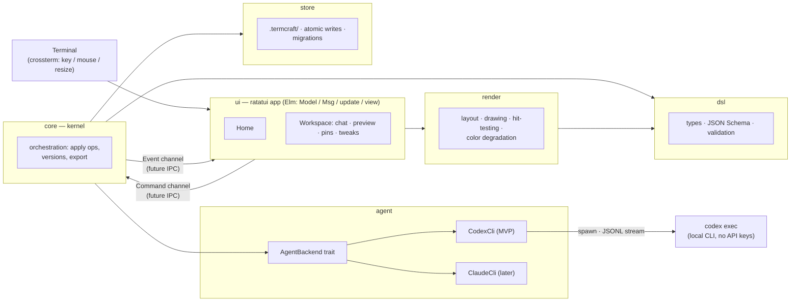
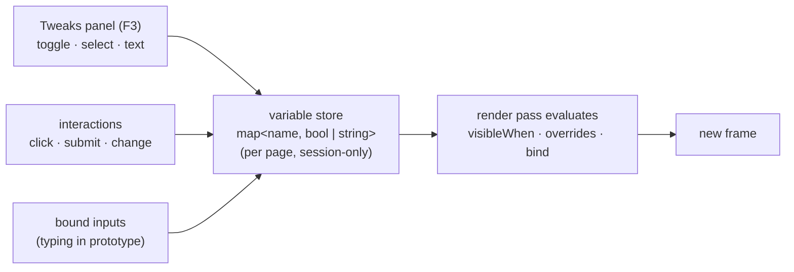
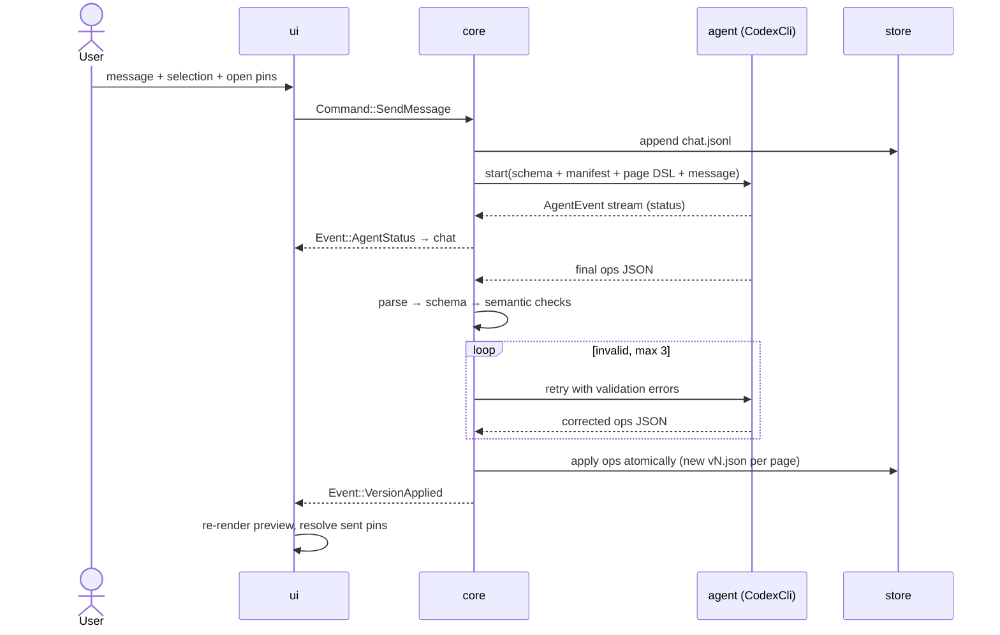

# termcraft — Design Spec

Date: 2026-07-13
Status: approved for planning

## 1. Overview

termcraft is a terminal-native analog of Claude Design for TUI applications. The user
describes an interface in natural language; a locally installed CLI agent (Codex first,
Claude Code later) generates a declarative design description; termcraft renders it live
in the terminal. Iteration happens through chat; the mouse is used to select elements,
pin comments, and flip state tweaks. The final deliverable is an export package: a
prompt file describing the interface plus the exact DSL files, ready to be fed to a
coding agent that implements the real application.

Core principles:

- **Pure AI generator.** No manual WYSIWYG editing. All design changes go through the
  agent. The mouse annotates and inspects; it never edits geometry directly.
- **No API keys.** Agents are driven through their locally installed CLIs in headless
  mode, using whatever auth the user already has.
- **Local-first storage.** Everything lives in a `.termcraft/` folder in the directory
  where termcraft is launched, so designs sit next to the code they describe and are
  committed to the same repository.
- **Data outlives binaries.** Every stored file carries a format version; migrations are
  part of the architecture from day one.

## 2. Non-goals (v1.0)

- Manual drag/resize editing of elements.
- Spatial multi-frame canvases (Figma-style boards). The model is a flat list of pages.
- Code generation (ratatui/bubbletea source output). The export is a prompt + DSL.
- Daemon mode and multi-client operation (architecture must allow it later, see §4).
- Agent-side diffs/patches; the agent always returns full page documents.
- Data-driven logic in prototypes (real lists, conditions, arithmetic). Simulated
  interactivity only.

## 3. User flows

### 3.1 Launch and Home screen

`termcraft` looks for `.termcraft/` in the current working directory.

- Missing → first-run wizard: create folder, check agent CLI availability
  (`codex --version`), pick target stack for exports (rust-ratatui | go-bubbletea |
  generic), preview defaults. MVP keeps the wizard minimal (agent check + defaults).
- Present but older format → offers bulk migration (see §7).

Home screen: a large centered prompt input ("Describe the TUI you want to design"),
below it the list of projects from `./.termcraft/projects/` (name, updated date, page
count), navigable by mouse and arrows. Typing a prompt and pressing Enter creates a
project and immediately starts the first generation. Clicking a project opens its
Workspace with chat history restored.

### 3.2 Workspace

Layout: chat panel on the left (~35%), live preview on the right, status bar at the
bottom (agent name, page + version, preview size, mode, hotkey hints). Page tabs above
the preview. `F2` toggles fullscreen preview.

While the agent works, its status streams into the chat; the preview updates when a new
version is applied. Generation is cancellable (`Esc`).

Mouse in the preview (static mode):

- **Hover** highlights element boundaries.
- **Left click** selects an element (deepest hit); a chip like `chart "CPU Usage"` is
  attached to the chat composer, so "make it blue" reaches the agent with context.
  `Esc` deselects.
- **Right click** drops a **pin comment**: a mini input opens at the click point; the
  comment is stored anchored to (page, element id, relative coordinates) and shown as a
  numbered pin on the preview and as a list in the chat panel. All open pins are sent
  with the next message; pins attached to a successfully applied message are marked
  resolved (user can reopen them).

### 3.3 Pages

Project → **Pages** (one design screen each) → per-page version history. Tabs switch
pages. The agent manages pages itself through operations (§6): it can add a "Settings"
page, edit the active one, rename or remove pages. In v1.0 pages are also formally
linked by `goTo` interactions, forming a clickable prototype flow.

### 3.4 Versions

Every applied agent operation that changes a page creates `vN.json` for that page.
MVP: `[` / `]` switch prev/next version, status bar shows `vN`. v1.0: history UI with
timestamps, prompt excerpts, and rollback ("make v3 the head").

### 3.5 Interactive prototype (v1.0)

`F4` toggles static ↔ interactive mode. In interactive mode clicks drive the design
instead of selecting: buttons fire their `interactions`, tabs switch, menus/dialogs
open and close, `goTo:` navigates between pages, focus traverses with Tab, and bound
inputs accept real typing with Enter firing `submit`. `F3` opens the Tweaks panel
(§5.6) in either mode.

### 3.6 Export

`Ctrl+E` (or `termcraft export`) writes to `.termcraft/exports/<project>/`:

- `design-prompt.md` — implementation prompt: product overview, per-page structure and
  behavior, interactions and tweak states, theme/palette, recommended libraries for the
  configured target stack, and an ASCII snapshot of each page rendered by termcraft
  itself.
- `pages/*.json` — the exact head-version DSL files (machine-readable source of truth).

## 4. Architecture

Single binary crate, Rust + ratatui + crossterm + tokio. Elm architecture in the UI
(Model / Msg / update / view). Strict module boundaries; each module is extractable
into a workspace crate later without rewrites:

- `dsl` — design document types, serde models, JSON Schema, validation, format version.
- `render` — DSL → ratatui: layout engine, widget drawing, color degradation
  (truecolor → 256 → 16), and **hit-testing** (per-frame map `element id → Rect`,
  click → deepest element).
- `agent` — `AgentBackend` trait (start task, stream events, cancel) + `CodexCli`
  implementation (MVP); `ClaudeCli` later. Spawns CLI processes; no API keys.
- `store` — everything under `.termcraft/`: projects, pages, versions, comments, chat,
  config; atomic writes (tmp + rename); the migration registry (§7).
- `core` — the kernel: accepts **Commands** from the UI (create project, send message,
  switch version, toggle tweak, export…), orchestrates agents, applies operations,
  emits **Events** (agent status stream, version applied, error…).
- `ui` — ratatui app: Home and Workspace screens, mouse/keyboard handling, Tweaks
  panel, pins.

**The kernel boundary is the future IPC.** UI and core communicate exclusively through
a pair of async channels (`Command` → core, `Event` → UI). When daemon mode arrives,
this contract becomes the wire protocol and the UI does not change. Terminal events and
core events merge in a single tokio select loop.



## 5. The design DSL

Goals: trivial for an LLM to emit reliably; deterministic to render; every element
addressable (selection, pins, diffs); able to draw "anything" via an escape hatch.

### 5.1 Page document

```json
{
  "schemaVersion": 1,
  "page": "main",
  "title": "Dashboard",
  "minSize": { "w": 80, "h": 24 },
  "theme": "dark-default",
  "tweaks": [],
  "root": { "id": "root", "type": "column", "children": [] }
}
```

### 5.2 Elements

Every node: `id` (required, stable — the agent is instructed to preserve ids of
surviving elements across iterations, otherwise pins and selection would detach),
`type`, `label`, `layout`, `style`, `children`, plus the reactive fields of §5.5.

Catalog:

| Tier | Elements |
|------|----------|
| MVP containers | `row`, `column`, `panel` (border + title), `tabs` |
| MVP primitives | `text` (styled spans), `button`, `input`, `list`, `table`, `gauge`, `sparkline`, `separator`, `spacer` |
| MVP escape hatch | `canvas` — per-cell character grid (char + fg/bg per cell) for ASCII art, logos, custom widgets |
| v1.0 additions | `modal`, `menu`, `tree`, `progress`, `chart` (bar/line), scroll container |

Unknown fields are ignored with a warning during validation (forward compatibility on
top of the migration system).

### 5.3 Layout

Mirrors ratatui's model 1:1 (LLMs handle it well): containers split their area among
children with constraints — `"30%"`, `12` (fixed cells), `"fill"`, `"min:10"` — plus
`padding` and `align`. Direction comes from the container type (`row` / `column`).

### 5.4 Styles and themes

Elements reference **palette roles** (`primary`, `accent`, `surface`, `text-muted`, …);
a theme is a named palette bound at page level. Switching themes never touches the
tree. Raw hex values are allowed; the renderer degrades colors to the terminal's
capability. Style fields: fg/bg (role or hex), modifiers (bold, dim, italic,
underline), border (none | plain | rounded | double | thick).

### 5.5 Reactive variable system (v1.0)

One **variable store per page**: `map<name, bool | string>`, initialized from declared
defaults. It is session runtime state — never written into `vN.json`, reset on version
switch. Everything that "moves" in a prototype reads and writes this single map:

- **Conditions.** `visibleWhen: {"var": "show-error"}` or
  `{"var": "density", "equals": "compact"}` (plus `"not": true`) controls element
  visibility — the mechanism behind initially hidden dialogs, menus, dropdowns, error
  banners.
- **Overrides.** Per element: `overrides: [{"when": {…}, "style": {…}, "text": "…"}]` —
  an error state can recolor an existing input's border, not just reveal hidden nodes.
- **Interactions.** Per element: `interactions: [{"on": "click" | "submit" | "change",
  "action": "…"}]` with actions `goTo:<page>`, `open:<id>`, `close:<id>`,
  `toggle:<id>`, `set:<var>=<value>`. `open/close/toggle` are sugar over a boolean
  variable tied to the target element's `visibleWhen`.
- **Bound inputs.** `input` may declare `bind: "<var>"`. In interactive mode the input
  is real: click/Tab focuses it, typing writes the variable (visible live anywhere the
  variable is referenced), Enter fires the `submit` interaction.

Because rendering is immediate-mode, reactivity is simply "re-render the frame after
every mutation"; conditions are evaluated during render. No dependency graph.



### 5.6 Tweaks (v1.0)

Declared per page; each tweak is a labeled control over the same variable map:

```json
{ "id": "density", "label": "Density", "kind": "select",
  "options": ["comfortable", "compact"], "default": "comfortable" }
```

Kinds: **toggle** (bool), **select** (enum string), **text** (free string, typically
bound to the same variable as some input, e.g. to preview long/empty/cyrillic values).
The Tweaks panel (`F3`) lists these controls, mouse-clickable. Tweak controls, design
interactions, and bound inputs all mutate variables through the same
`core` code path — three doors into one room.

## 6. Agent integration

### 6.1 Backend abstraction

```rust
trait AgentBackend {
    fn start(&self, task: AgentTask) -> AgentRun;  // streams AgentEvent
    fn cancel(&self, run: &AgentRun);
    fn health_check(&self) -> Result<AgentInfo>;   // installed? logged in?
}
```

MVP implementation: **Codex CLI** in headless mode (`codex exec`, JSONL event stream on
stdout, session resume for conversation continuity; sandbox read-only — the agent needs
no file access, exact flags verified during implementation). Claude Code CLI becomes
the second backend once/if its terms permit headless embedding; the trait is designed
against it from the start.

### 6.2 Task protocol

Each turn termcraft sends: role system prompt (TUI designer), the DSL JSON Schema and
output rules, the project manifest (pages, active page), DSL of the affected pages, the
current selection, open pins, and the user message.

The agent replies with a JSON **operations list** — the same shape as kernel commands:

```json
{ "ops": [
  { "op": "add_page",    "page": "settings", "title": "Settings", "doc": { } },
  { "op": "update_page", "page": "main",     "doc": { } },
  { "op": "remove_page", "page": "old" },
  { "op": "rename_page", "page": "main", "title": "Overview" },
  { "op": "set_active_page", "page": "settings" }
] }
```

`doc` payloads are full page documents (no diffs in v1.0).

### 6.3 Validation and application

Response → JSON parse → schema validation → semantic checks (unique ids, known pages,
variable references resolve). Invalid → automatic retry with the validation errors
appended to the prompt (max 3), then an honest error in chat. Valid → ops applied
atomically by the kernel; each changed page gets a new `vN.json` written via
tmp + rename. The last valid version is never lost.



## 7. Storage and data versioning

### 7.1 Layout

```
.termcraft/
  config.toml                 # format_version, agent, target_stack, preview defaults
  lock                        # single-instance lock file
  projects/<slug>/
    project.toml              # format_version, name, dates, ordered pages, active page
    chat.jsonl                # dialog log (first line: {"kind":"chat","version":1})
    pages/<page>/
      v1.json … vN.json       # page documents (schemaVersion inside)
      comments.jsonl          # pins (first line: {"kind":"comments","version":1})
  exports/<slug>/
    design-prompt.md
    pages/*.json
```

All plain text — designs diff and commit alongside the target project's code.

### 7.2 Format versioning and migrations

- Every JSON file carries top-level `schemaVersion`; every JSONL file starts with a
  typed header line; every TOML carries `format_version`. Each file kind has its own
  independent counter.
- `store::migrate` holds an ordered registry of `N → N+1` steps per file kind. Reading
  any old file runs the chain to the current in-memory model; writing always emits the
  current version.
- Triggers: lazily on read, plus explicit `termcraft migrate` for the whole folder; the
  wizard offers bulk migration when opening an old `.termcraft`. Bulk migration backs
  up to `.termcraft/backup-<timestamp>/` first (or just warns if the folder is under
  git).
- A file *newer* than the binary understands → hard error naming the file ("update
  termcraft"), no partial reads. Downgrades unsupported.
- Tests keep fixtures of **every historical version** of every file kind and run them
  through the chain, validating against the current schema.

## 8. Feature scope

### 8.1 v1.0

1. Home: prompt input + project list from `./.termcraft`.
2. `.termcraft` wizard: setup, agent health check, target stack, bulk migrations.
3. Workspace: chat + live preview, `F2` fullscreen, status bar.
4. Agents behind `AgentBackend`: Codex CLI (primary); Claude Code CLI second, terms
   permitting.
5. Full DSL catalog incl. `modal`, `menu`, `tree`, `progress`, `chart`, scroll.
6. Mouse: hover highlight, click-select with composer chip, right-click pin comments.
7. Multiple pages with tabs; agent-driven page operations; page rename/remove/reorder
   from the UI.
8. Per-page version history UI with rollback and compare.
9. Preview palette/theme switching (light/dark, 16/256/truecolor simulation).
10. Preview size presets: 80×24, 120×40, custom, auto.
11. Interactive prototype: focus traversal, `goTo` page transitions, open/close/toggle
    for menus/dropdowns/dialogs, bound inputs with typing + Enter, Tweaks panel with
    toggle/select/text controls over the reactive variable store.
12. Export: `design-prompt.md` + DSL files + ASCII page snapshots.

### 8.2 MVP cut

- Home with input + project list; `.termcraft` auto-created with minimal config (agent
  presence check instead of full wizard).
- Workspace: chat + preview + status bar + `F2`. Codex only.
- Multiple pages with tabs; agent ops `add_page` / `update_page` / `set_active_page`.
- DSL without the reactive system (§5.5–5.6 fields reserved): MVP catalog of §5.2, one
  dark theme, color degradation.
- Mouse: hover, click-select, right-click **pin comments** (explicitly in MVP).
- Versions written from day one; `[` / `]` prev/next switching.
- Export: `design-prompt.md` + DSL + ASCII snapshots (renderer already exists — cheap
  and high-value for the implementing agent).
- Migration infrastructure live from the first commit (even with zero migrations).
- Preview auto-sized to the available area, honoring `minSize`.

### 8.3 Backlog (post-1.0)

Daemon + IPC, workspace crate split, agent diffs/patches, ratatui code generation,
additional agent backends, spatial canvas boards.

## 9. Error handling

- **Agent missing / not logged in** → clear message with install instructions; checked
  by the wizard and before each send.
- **Invalid agent output** → auto-retry with validation errors (≤3), then chat error.
  Head version untouched; new versions are written atomically post-validation.
- **Cancelled / hung generation** → process killed on `Esc` or timeout; status in chat;
  project state intact.
- **Corrupt or too-new file** → error naming the file; a broken page version is
  skipped and the project opens at the last valid one.
- **Terminal below `minSize`** → "enlarge the window" placeholder screen.
- **Second instance** → lock file refuses politely.
- **Panic** → panic hook restores the terminal (raw mode off, mouse capture off) and
  reports via color-eyre. The user's terminal is never left broken.

## 10. Testing

- `dsl`: serde roundtrips, schema validation, migration fixtures for all historical
  versions (§7.2).
- `render`: snapshot tests via ratatui `TestBackend` (DSL fixture → buffer → golden);
  hit-testing unit tests.
- `agent`: JSONL stream parser units over recorded real `codex exec` output; retry /
  cancel pipeline against a fake agent.
- `core`: Command/Event contract tests over the channels — doubles as the future IPC
  contract test suite.
- Smoke: app driven on a test backend with injected events (open project → prompt →
  fake agent → render → export).

## 11. Success criteria (MVP)

From an empty directory: `termcraft` → wizard creates `.termcraft` → prompt "a system
monitor dashboard" → Codex generates pages → live render → right-click pin "make this
gauge red" → send → new version applies → `Ctrl+E` → `design-prompt.md` + DSL that a
coding agent can implement from without seeing termcraft.
