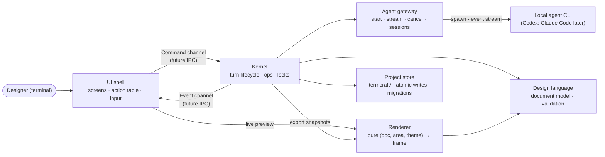

# termcraft — Architecture Docs Design

Date: 2026-07-14
Status: approved for planning
Parent spec: [2026-07-13-termcraft-design.md](2026-07-13-termcraft-design.md)

## 1. Purpose

First step of implementing the termcraft spec: bootstrap `docs/architecture/` with the
/architecture plugin (architecture-generate skill), describing the **stack-agnostic
v1.0 target architecture** before any code exists. The docs become the shared map that
the MVP implementation plan builds against, and the plugin's audit tooling keeps them
honest as code lands.

## 2. Decisions

- **Scope: full v1.0 target architecture**, not the MVP cut. Structure and flows for
  the reactive system, interactive mode, and the agent picker are documented from the
  start; the MVP plan implements a subset of an already-described system.
- **Location: `docs/architecture/`** — the plugin's contract. Its three skills and the
  Stop-hook auditor are hardwired to this path; a root-level `architecture/` would be
  invisible to them.
- **Legacy diagrams absorbed.** The three root-level `architecture/*.mmd` files
  (`modules.mmd`, `reactive-system.mmd`, `generation-sequence.mmd`) are folded into
  the new docs and the folder is removed. The three links in the parent spec (§4,
  §5.5, §6.3) are repointed to the new documents.
- **Source anchors point at the spec.** No code exists yet, so every doc's
  `Source anchors` section references parent-spec sections
  (`docs/superpowers/specs/2026-07-13-termcraft-design.md §…`) and, where UI behavior
  is described, `design/NN-*.dc.html` files. Anchors migrate to real source paths via
  the architecture-update skill as modules land — an explicit step in the MVP
  implementation plan.
- **English only**, per the plugin conventions.

## 3. Component model (stack-agnostic)

The six modules of parent spec §4, named by role. This is the vocabulary every
diagram and walkthrough uses; code identifiers never appear.

| Role | Responsibility |
|------|----------------|
| **UI shell** | Screens (Home, Workspace), input interpretation, the action table (single registry: hotkey, availability predicate, dispatched command), presentation of chat / preview / status bar |
| **Kernel** | The only decision-maker: accepts commands, owns the agent-turn lifecycle and the turn-time locks, applies operations, emits events |
| **Agent gateway** | Abstraction over local agent CLIs: start task, stream events, cancel, health check; maps (model, effort) to CLI flags; session continuity |
| **Design language** | The document model: types, schema, structural and semantic validation, format version |
| **Renderer** | Pure function (document, area, theme) → frame; layout, drawing, color degradation, hit-testing (element → rectangle map for the mouse) |
| **Project store** | Everything under `.termcraft/`: manifest, versions, chat, pins, config; atomic writes; the migration registry |



Key boundaries:

- **UI shell ↔ Kernel: exclusively the async command/event channel pair** — the
  future IPC seam. The UI never touches the project store directly.
- **Design language is the shared vocabulary**: the kernel validates with it, the
  renderer consumes it, the store persists it, the agent gateway ships its schema to
  the agent.
- **The reactive variable store (v1.0) belongs to the kernel**: all three mutation
  sources (tweaks, interactions, bound inputs) go through one kernel code path; the
  renderer reads the map when evaluating `visibleWhen` / overrides.
- **Correction over the legacy `modules.mmd`**: there, the renderer hung off the UI
  only. Export (§3.7) renders deterministic ASCII snapshots, and export is a kernel
  operation — so **the kernel also depends on the renderer**. This is why the
  renderer must stay a pure function with no terminal coupling. The new structural
  doc shows this edge.

Runtime loop (goes into the structural doc): terminal events (keys, mouse, resize)
and kernel events merge into one loop; the UI translates input into commands through
the action table (which also answers availability — the turn-time locks), the kernel
answers with events, the UI redraws the frame. No other channel exists between the
layers.

## 4. Document set

```
docs/architecture/
  README.md                     # index + reading order + status note
  overview.md                   # context: designer, agent CLIs, project folder
  modules.md                    # components, boundaries, runtime loop (absorbs modules.mmd)
  storage.md                    # .termcraft/: layout, record schemas, format versions
  flows/
    launch.md
    generation-turn.md
    versions.md
    interactive-prototype.md
    pins-and-selection.md
    export.md
    migration.md
```

`storage.md` describes the statics (what commits vs. what stays machine-local, the
chat/comments record schemas, per-file-kind version counters); the flows describe the
dynamics on top of it.

The seven flows, with diagram type per the conventions (sequence = who-calls-whom,
state = lifecycle, flowchart = routes/data) and the failure branches each walkthrough
must cover:

| Flow | Diagram | Failure branches in the walkthrough |
|------|---------|-------------------------------------|
| **launch** | flowchart: start → find `.termcraft/` → Home / Workspace / migration offer | agent missing (`r` re-check); second instance (lock with PID); corrupt version file → open at last valid; terminal too small |
| **generation-turn** | sequence: message + selection + pins → context snapshot → agent task → status stream → ops JSON → validation → atomic apply (absorbs `generation-sequence.mmd`) | retry loop ≤3 → honest error; read rounds ≤3; unseen-head guard; cancel via `Esc`; stream silence 120 s; session resume fails → fresh session with chat excerpt |
| **versions** | state: head ↔ browsing (read-only), rollback as copy-forward | send from non-head → auto-rollback with system record; switching/rollback locked during a turn |
| **interactive-prototype** | flowchart: three mutation sources → one variable map → render pass (absorbs `reactive-system.mmd`), plus focus traversal | `goTo:` to a removed page → no-op with notice; sugar vs. custom `visibleWhen` → warning; variable hygiene → lint fed to the agent |
| **pins-and-selection** | state: pin lifecycle open → sent → resolved (+ reopen, + orphaned when the element disappears) | orphans never deleted, never sent; selection chip included only if the id resolves at send time |
| **export** | flowchart: `Ctrl+E` → refusal checks → deterministic snapshot render at `minSize` → write, overwrite in place | refused during a turn and at zero pages (status-bar hints) |
| **migration** | flowchart: read file → step chain N→N+1 → current model; bulk path with backup | file newer than the binary → hard error naming the file; downgrades unsupported; folder under git → warn instead of backup |

## 5. Template and style

Every doc (except `README.md`) follows the plugin conventions exactly: one
plain-English title paragraph → Mermaid (role-named nodes, ≤ ~20 per diagram, special
characters quoted, every block closed) → `## Walkthrough` with numbered steps and
failure branches → `## Source anchors`.

`README.md` carries a status note: these docs describe the v1.0 target architecture
ahead of the code; anchors point at the spec and move to source files as
implementation proceeds.

## 6. Accompanying changes

- Root `architecture/` folder removed after its three `.mmd` files are absorbed.
- Parent-spec links in §4, §5.5, §6.3 repointed to the new docs.
- The maintenance rule installed into the project's `CLAUDE.md` (generate-skill
  step 5): a change that alters behavior or structure covered by
  `docs/architecture/` must update the affected docs before finishing.

## 7. Definition of done

- All eleven files exist and follow the template.
- Every Mermaid diagram render-checked (mermaid preview) — no syntax failures.
- architecture-audit run reports zero drift: diagrams consistent with walkthroughs,
  all anchor paths valid.
- No stale references: repo-wide search finds no links to the removed
  `architecture/*.mmd` paths.
