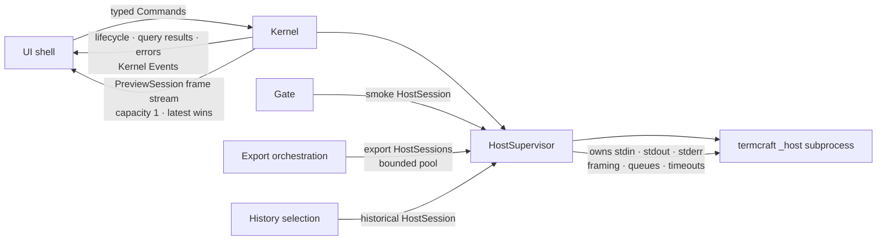

# termcraft — Host Supervision and Protocol Design

Date: 2026-07-16
Status: approved design

## 1. Purpose

This specification defines how termcraft starts, supervises, communicates with,
and stops design-host subprocesses. Its central boundary is absolute:
**the Kernel-owned `HostSupervisor` is the sole owner of every host process and
of that process's stdin, stdout, stderr, framing parser, protocol state, queues,
timeouts, and restart policy.** The UI shell never spawns a host, retains a
process handle, reads or writes a host stream, parses protocol bytes, or decides
when a host restarts.

The design serves four host modes through one supervised abstraction:

- `preview` — the live Current design, long-lived and restartable;
- `historical` — a temporary Git snapshot, long-lived, restartable, and
  read-only;
- `smoke` — one fresh, one-shot validation host for a Gate candidate;
- `export` — one fresh, one-shot deterministic capture host for one page and
  one size.

This document refines the process seam already established by the
[master design](2026-07-13-termcraft-design.md), adopts the canonical current and
read-only history rules from the
[Git-backed history design](2026-07-16-git-backed-page-history-design.md), and
supersedes the direct UI↔host ownership and transport language listed in §16.
It does not redesign the design runtime, Git history, project storage, Gate
policy, projections, render cache, or export package.

## 2. Governing decisions and invariants

1. `HostSupervisor` runs in the Kernel process as its own top-level component role. There is one supervisor per
   running termcraft Kernel and at most one child process per `HostSession`.
2. Only `HostSupervisor` may invoke `termcraft _host`, write host stdin, read
   host stdout or stderr, decode framing, send protocol requests, terminate a
   host, or reap it.
3. The UI sees a typed `PreviewSession` facade, not a `ChildProcess` or protocol
   client. Facade controls become ordinary UI→Kernel Commands. Session
   lifecycle, query results, errors, backpressure, and navigation become
   ordinary Kernel→UI Events.
4. Preview frame bytes do not travel on the Kernel Event channel. Each
   `PreviewSession` has a dedicated, bounded frame data stream emitted by the
   Kernel's frame broker. A slow frame consumer therefore cannot occupy or
   block domain-event capacity.
5. The first protocol version sends complete styled frames. There are no frame
   deltas, patches, retained-frame dependencies, or resynchronization messages.
   Because every frame is independently renderable, the broker may safely use
   latest-frame-wins coalescing.
6. Every executable source snapshot is immutable for the life of its session
and is identified by `pageSlug`, `sourceHash`, and `kitApiVersion`.
7. A logical session has a stable `sessionId`. Every child-process incarnation
   inside that session has a fresh cryptographically random `nonce`. Automatic
   restart preserves `sessionId` and changes `nonce`; selecting a different
   source creates a new session.
8. All queues, messages, outputs, request tables, timeouts, concurrent hosts,
   and restart attempts are bounded. There is no unbounded diagnostic log or
   frame backlog.
9. Historical snapshots cannot mutate project state or prototype controls.
   Smoke and export sessions never reuse a preview or historical process.
10. Export may run captures concurrently, but only through the supervisor's
    bounded export pool. Capture results are assembled in deterministic project
    order, independent of process completion order.

## 3. Architecture and ownership



The UI–Kernel boundary now has a control plane and one narrow data-plane
exception:

- The existing Command/Event channels remain the only route for intent and
  domain state. Preview start/stop, resize, input, tweak changes, geometry
  queries, lifecycle, navigation, warnings, failures, and backpressure all use
  that route.
- The frame stream carries only immutable `PreviewFrame` values. It originates
  in the Kernel-owned broker, is scoped to one `PreviewSession`, has capacity
  one, and closes when that session stops or is superseded.

The frame stream does not expose a host protocol endpoint. Possessing it grants
no ability to write to the process, issue an untyped request, restart the host,
or retain the host after the Kernel has closed the session.

### 3.1 Kernel-side `HostSession`

All four modes are created from the same specification:

```ts
type HostMode = "preview" | "historical" | "smoke" | "export"
type InteractionMode = "static" | "interactive"

interface HostSessionSpec {
  mode: HostMode
  interactionMode: InteractionMode
  pageSlug: string
  sourcePath: string
  sourceHash: string
  kitApiVersion: number
  size: { w: number; h: number }
  theme: string
  capabilities: TerminalCapabilities
}

interface HostSessionIdentity {
  mode: HostMode
  pageSlug: string
  sourceHash: string
  kitApiVersion: number
  sessionId: string
  nonce: string
}
```

`sourceHash` is lowercase hexadecimal SHA-256 over the exact bytes of the page
source mounted by the host. `kitApiVersion` is the mandatory positive integer
literal parsed from that source's static `meta`; runtime API version `1` is the
first contract. `sessionId` is a Kernel-generated UUIDv7 identifying the logical
session. `nonce` is 128 random bits encoded as 32 lowercase hexadecimal
characters and identifies one process incarnation.

The Kernel computes `sourceHash` before spawn. The host recomputes it from the
read-only source at mount and refuses to load code if it differs. The supervisor
does not accept a caller-provided `sessionId` or `nonce`.

The supervisor returns a typed `HostSession` handle to Kernel code. That handle
can send only the commands allowed for its mode, make correlated requests, read
typed control events, read complete frames, and request orderly stop. It does
not expose raw streams or a process handle. Gate, export, and history code use
this same handle rather than invoking the host binary themselves.

### 3.2 UI-facing `PreviewSession`

Only `preview` and `historical` sessions project into the UI-facing facade:

```ts
type FrameToken = string // opaque Kernel-owned displayed-frame capability
type GeometryToken = string // opaque Kernel-owned pin-anchor capability

interface PreviewSession {
  readonly identity: Omit<HostSessionIdentity, "nonce">
  readonly mode: "preview" | "historical"
  readonly frames: AsyncIterable<PreviewFrame>

  resize(size: Size): void
  setTheme(theme: string, capabilities: TerminalCapabilities): void
  setMode(mode: InteractionMode): void
  forwardInput(input: PreviewInput): void
  setTweak(id: string, value: TweakValue): void
  query(frameToken: FrameToken, query: GeometryQuery): Promise<GeometryReply>
  retry(): void
  close(): void
}
```

For `preview` and `historical` modes, Kernel `previewSessionId` is exactly the
`HostSessionIdentity.sessionId` UUIDv7. The host wire envelope calls the field
`sessionId`; Kernel DTOs call the same value `previewSessionId`. It remains stable
when automatic restart replaces only the incarnation `nonce`.

These methods are typed adapters over Kernel Commands. `query()` is resolved by
matching Kernel Events to a Kernel request id; it does not call the subprocess
directly. Lifecycle is observed through the existing Kernel state mirrored from
Events. Incarnation lifecycle Events carry the current `nonce`; the facade's
stable identity omits it because automatic restart must not replace the facade.
`frames` is the only separate stream.

`FrameToken` is minted and owned by the Kernel broker for one displayed full-frame
identity. It is opaque to the UI and never appears on the host wire. The Kernel
resolves it to the complete `FrameIdentity` before issuing a host query; replacing
the displayed frame or incarnation invalidates the old mapping. A successful `hit`
or `pin-anchor` query against Current design may additionally return a distinct
`GeometryToken`. The Kernel-level `pin-anchor` query kind is a refinement of the
wire-level hit query: it is carried as `query-hit` on the host wire, and only the
Kernel decides whether a successful result mints a `GeometryToken`.
That token binds the full frame identity, page slug, element id, and fractional
coordinates of one pin anchor. `pin.create` consumes `GeometryToken` plus comment
text; it never accepts caller-assembled geometry. Replacing the displayed frame,
source, or incarnation invalidates both token classes.

For presentation, the facade consumes the Kernel-published capabilities; it does not
reimplement source-mode guards. Every method still dispatches a typed command, and
the Kernel is the final authority. In `historical` mode, Kernel capabilities allow
only resize, non-persistent theme/capability preview, geometry queries, retry, and
close; forwarded input and tweak commands receive
`HISTORICAL_PREVIEW_READ_ONLY`. A page-emitted navigation event
from a historical host is suppressed and reported as a diagnostic; it cannot
switch the project's active page.

`setMode()` is also a typed Kernel Command. The UI and Kernel-facing runtime mode
projection do not change optimistically when it is called. They update only after a
matching accepted `ready` or `set-mode` response echoes the effective
`interactionMode`; rejection, timeout, or a stale response preserves the prior
value.

### 3.3 Runtime contract reference

This protocol consumes the approved
[runtime API compatibility design](2026-07-16-runtime-api-compatibility-design.md);
it does not replace it. Saved, staged, canonical, historical, smoke, and exported
page source may import only the exact root `@termcraft/runtime` facade. Direct
imports from `@termcraft/kit`, `@reatom/*`, React, React's JSX runtime,
`@opentui/*`, relative paths, and arbitrary packages remain forbidden. The
facade's component and Reatom exports remain outside this specification.

Before a source is mounted, the Kernel must have parsed its positive integer
`kitApiVersion` through that approved runtime contract. The binary has one
`currentKitApiVersion` and an explicit, not necessarily contiguous,
`supportedKitApiVersions` set. Handshake succeeds only when Gate and host runtime
declaration bundles agree and the source's exact integer is supported. There is
no SemVer inference, implicit fallback, or private dependency compatibility
check. A source-version mismatch is a typed, non-restartable
`KIT_API_MISMATCH`; disagreement between the Gate and host bundles is
`RUNTIME_INTEGRITY_MISMATCH`. Runtime migration and compatibility adapters remain
governed by the runtime design.

## 4. Mode semantics

| Mode | Source | Lifetime | Mutating controls | Automatic restart | Result |
|---|---|---|---|---|---|
| `preview` | Exact canonical Current design snapshot | Long-lived until source/page change or close | Resize and view controls always; `set-mode` when Kernel capability allows; key/click/tweak only in accepted effective `interactive` mode | Yes, within budget | Frame stream, geometry, metadata, runtime events |
| `historical` | Exact temporary read-only Git snapshot outside `.termcraft/` | Long-lived until history selection changes or closes | None; resize/view-only theme and geometry queries remain legal | Yes, within budget | Read-only frames, overlays, geometry, metadata |
| `smoke` | Exact immutable staging candidate | One mount and one render at `meta.minSize`, then exit | None | No | Typed Gate success or failure with evaluated metadata and warnings |
| `export` | Exact captured canonical source | One render at one requested export size, then exit | None | No | One full frame and layout tree from the same render pass |

Preview and historical sessions may be restarted because their purpose is to
keep a view available. A one-shot failure is itself the smoke or export result,
so silently trying a second fresh process would hide nondeterminism and duplicate
execution. A caller may start a new one-shot session explicitly after addressing
or acknowledging the failure.

Every smoke render and every export cache miss uses a newly spawned process,
even if an identical `pageSlug + sourceHash + kitApiVersion + size` is already
mounted in preview. A verified export cache hit starts no process; it never
reuses a warm one. No component state, timers, tweak values, module cache, or
renderer state is shared between modes or captures.

`historical`, `smoke`, and `export` mount with effective interaction mode `static`.
They cannot accept `interactive`; a `set-mode` request against any of them receives
the mode-appropriate typed refusal without changing runtime atoms.

## 5. Versioned framing

stdin and stdout carry framed protocol messages. stdout is protocol-only;
human-readable host logs use stderr. Each frame has this fixed outer layout:

| Offset | Width | Field |
|---|---:|---|
| 0 | 4 bytes | Unsigned big-endian payload length `N` |
| 4 | 1 byte | Framing version; `1` in this design |
| 5 | 1 byte | Message class: `1` control, `2` frame/bulk data |
| 6 | 2 bytes | Flags; must be zero in framing version 1 |
| 8 | `N` bytes | UTF-8 JSON payload |

`N` excludes the eight-byte outer header. The reader must tolerate arbitrary
fragmentation: a prefix, fixed header, or payload may arrive one byte at a time.
It must also decode several complete messages from one read. It never assumes a
read boundary is a message boundary.

The hard payload limits are:

- control class: 262,144 bytes (256 KiB);
- frame/bulk class: 16,777,216 bytes (16 MiB);
- global pre-classification ceiling: 16,777,216 bytes.

After reading the length prefix, the parser rejects `N` above the global ceiling
before allocating a payload buffer. After reading the four framing bytes, it
applies the smaller control limit when appropriate. Lengths of zero, unsupported
framing versions, unknown classes, and non-zero flags are fatal framing errors.

Every JSON payload is a closed schema. Unknown required fields, missing fields,
invalid UTF-8, duplicate object keys, non-finite numbers, unsafe integer JSON
numbers, or a payload whose `kind` is not valid for its class and negotiated
protocol version are protocol violations. Identifiers and counters that may
exceed JavaScript's safe integer range are decimal strings.

The protocol does not scan for a new prefix after malformed input. Once framing
is lost, resynchronization could reinterpret attacker-controlled bytes as a
valid message; the supervisor terminates that incarnation instead.

### 5.1 Closed pre-handshake hello DTOs

The two hello messages do not use the post-handshake `ControlEnvelope`. They are the
only pre-negotiation JSON payloads and have these exact closed schemas:

```ts
interface RuntimeDeclarationBundleV1 {
  module: "@termcraft/runtime"
  currentKitApiVersion: number
  supportedKitApiVersions: number[]
  publicCapabilityIds: string[]
}

interface PublicLimits {
  controlPayloadBytes: number
  framePayloadBytes: number
  maxFrameWidth: number
  maxFrameHeight: number
  maxFrameCells: number
}

interface ClientHelloV1 {
  framingVersion: 1
  kind: "client.hello"
  sessionId: string
  nonce: string
  offeredFramingVersions: [1]
  offeredProtocolVersions: [1]
  mode: HostMode
  pageSlug: string
  sourceHash: string
  sourceKitApiVersion: number
  runtimeDeclaration: RuntimeDeclarationBundleV1
  limits: PublicLimits
}

interface HostHelloV1 {
  framingVersion: 1
  kind: "host.hello"
  sessionId: string
  nonce: string
  selectedFramingVersion: 1
  selectedProtocolVersion: 1
  runtimeDeclaration: RuntimeDeclarationBundleV1
  limits: PublicLimits
}
```

The outer header and the hello's `framingVersion` field are both `1`; a mismatch is
a fatal framing error. Hello payloads are control-class payloads and are rejected
above 262,144 bytes (256 KiB), before JSON allocation where possible. The
pre-negotiation deadline is three monotonic seconds from successful child spawn until
a complete, parsed, and validated `HostHelloV1` is received. Missing fields, unknown
fields, duplicate keys, wrong literal values, invalid identities, non-canonical
arrays, and unsafe or out-of-range numbers fail the handshake and terminate the
incarnation.

`RuntimeDeclarationBundleV1` is exactly the bundle defined by the runtime API design;
its arrays are sorted and duplicate-free. Client limits are positive safe integers
no larger than the protocol hard limits in this document. Host limits must be no
larger than the corresponding client offers. The selected framing and protocol
versions must belong to their offered arrays. Protocol v1 offers only `[1]`, but the
offer/selection fields remain explicit for future negotiation.

### 5.2 Post-handshake control envelope

After handshake, every control payload has these fields:

```ts
interface ControlEnvelope {
  protocolVersion: 1
  kind: string
  sessionId: string
  nonce: string
  messageId: string
  requestId?: string
  responseTo?: string
  body: object
}
```

`messageId` is a monotonically increasing unsigned 64-bit decimal string scoped
to `(sender, nonce)`, beginning at `"1"`. A request has a fresh `requestId` from
the same representation. Exactly one terminal response carries `responseTo`
equal to that id. Request ids are never reused within an incarnation.

Requests and responses are correlated by id rather than arrival position.
Responses, discrete input, lifecycle messages, navigation, warnings, and errors
are never coalesced. A response for an unknown, already completed, or timed-out
request is not delivered to a caller; it is recorded as a bounded late-response
diagnostic. Repeated ids or identity mismatches are fatal protocol violations.

### 5.3 Full frame envelope

A protocol-v1 preview frame is a frame-class payload containing:

```ts
interface FrameIdentity {
  sessionId: string
  nonce: string
  sourceHash: string
  frameSeq: string
}

interface FrameEnvelope extends FrameIdentity {
  protocolVersion: 1
  kind: "frame"
  width: number
  height: number
  rows: StyledRun[][]
}

interface StyledRun {
  text: string
  fg: Color
  bg: Color
  attrs: number
}

type Color =
  | "default"
  | { indexed: number }
  | { rgb: `#${string}` }
```

Rows are top-to-bottom and runs are left-to-right. Each run contains one or
more consecutive terminal cells with one style. The Unicode display width of
all run text in a row must equal `width`; combining marks belong to the previous
grapheme and a double-width grapheme occupies two cells. `attrs` is a bit mask:
`1` bold, `2` dim, `4` italic, `8` underline, `16` inverse, and `32`
strikethrough. `Color` is one of default, indexed `0..255`, or an RGB value
encoded as `#RRGGBB`; no other object keys or string forms are valid.

`frameSeq` starts at `"1"` and increases by one for every complete frame emitted
by one process incarnation. It resets when `nonce` changes. The identity of a
rendered frame is therefore `(sessionId, nonce, sourceHash, frameSeq)`.
It is process-incarnation-local, not `PreviewSession`-local; automatic restart keeps
the logical preview session but starts a new sequence at `"1"` under the new nonce.

Protocol v1 allows at most 2,048 cells on either axis and 262,144 cells total,
while still requiring the encoded payload to fit the 16 MiB limit. Width × height
is checked for integer overflow before allocation. A host that cannot encode a
valid frame within those limits sends `FRAME_TOO_LARGE` as a fatal control error
and exits. A frame with inconsistent dimensions, row widths, color values, or
non-monotonic `frameSeq` is a fatal protocol violation.

Every protocol-v1 frame is complete. The receiver never needs an earlier frame.
Frame deltas are deferred until a benchmark demonstrates that complete frames
are a material CPU or bandwidth bottleneck. Any later delta design must add
keyframes, loss recovery, and explicit resynchronization; none of those concepts
exist in version 1.

Frame-class payloads also carry large, request-correlated `layout` and `capture`
results. Those use the same 16 MiB bound but are routed to the pending Kernel
request, not the UI preview frame stream.

## 6. Handshake and protocol negotiation

No page module is imported before framing, protocol, identity, limits, and
runtime compatibility have been negotiated.

1. The supervisor spawns the current termcraft executable with the argument
   array `[_host, --stdio]`, with no shell interpolation.
2. The supervisor generates `sessionId` and the first incarnation `nonce`, starts
   draining stderr, and sends exactly one `ClientHelloV1`. It sends no source path
   yet.
3. Before the three-second pre-negotiation deadline, the child must answer with
   exactly one `HostHelloV1`. It echoes the envelope identity, selects one offered
   framing and application protocol version, reports its exact runtime declaration
   bundle, and accepts limits no larger than those offered.
4. The supervisor verifies an exact identity echo, common framing and protocol versions,
   exact agreement between the Gate and host runtime declaration bundles, and
   membership of the source's `kitApiVersion` in the supported set. No common
   framing or protocol version produces `PROTOCOL_NEGOTIATION_FAILED`; declaration
   disagreement produces `RUNTIME_INTEGRITY_MISMATCH`; an unsupported source integer
   produces `KIT_API_MISMATCH`. All stop the session without automatic restart.
5. The supervisor sends a correlated `mount` request containing the immutable
   source path, expected source hash, host mode, initial `interactionMode`, initial
   size, theme, terminal capabilities, and deterministic flags. The host validates
   the path supplied by the supervisor, recomputes the source hash, rechecks the
   runtime import surface, and mounts the page.
6. Within 10 seconds the host responds `ready` with the evaluated page metadata,
   tweak declarations where allowed, the accepted size, the effective
   `interactionMode`, and the initial full `FrameIdentity`. A source-hash mismatch,
   import rejection, compile error, mount crash, or readiness timeout fails startup.
   Kernel and runtime mode atoms initialize only from this accepted response.

No message other than the expected hello is valid before negotiation completes.
No session command other than `mount`, heartbeat, error, or shutdown is valid
before `ready`.

The effective protocol limits are the minimum of parent and child limits. A
child may request stricter limits but cannot raise the supervisor's limits.

## 7. Requests, events, and ordering

Protocol v1 supports these message families:

- supervisor→host requests and commands: `mount`, `resize`, `set-theme`,
  `set-capabilities`, `set-mode`, `input-key`, `input-mousemove`, `input-click`,
  `set-tweak`, `query-hit`, `query-rect`, `query-describe`, `query-layout`,
  `capture`, `ping`, and `shutdown`;
- host→supervisor lifecycle and domain messages: `host.hello`, `ready`,
  `heartbeat`, `navigation`, `runtime-warning`, `done`, `error`, and
  `shutdown-ack`;
- correlated success or typed error responses;
- frame/bulk messages: complete preview `frame`, request-correlated `layout`,
  and deterministic `capture`.

`set-mode` is a correlated, non-coalescible request whose body contains exactly
`interactionMode: "static" | "interactive"`. An accepted response body contains
exactly the effective `interactionMode`; only that response may update
Kernel/runtime mode atoms. A refusal, timeout, duplicate, or stale-incarnation
response makes no mode change. The host accepts `input-key` and `input-click` only
while its effective mode is `interactive`.

The host processes accepted control messages in wire order. `input-key` and
`input-click` are discrete barriers: they are never dropped, replaced, or moved
across another accepted discrete input. Responses are emitted in the order the
host completes them and are delivered in wire order, while `responseTo` remains
the authoritative correlation mechanism.

`resize`, `input-mousemove`, and `query-hit` used for hover may be coalesced,
but only within a contiguous run between discrete barriers. Before an accepted
key, click, mode change, non-hover query, tweak change, capture, or shutdown is
written, the latest preceding coalescible value is flushed. Coalescing never moves a
later resize or mouse position ahead of an earlier click.

When a queued hover query is replaced, the supervisor completes the replaced
Kernel request with a local `SUPERSEDED` result. Every accepted request therefore
has one terminal outcome even when it never reaches the child. Host responses
themselves are never coalesced.

### 7.1 Geometry consistency

The host seals the hit grid, element descriptions, rectangles, and layout tree
at the same point that it seals a frame. Every frame and every successful
`query-hit`, `query-rect`, `query-describe`, and `query-layout` result exposes the
complete `FrameIdentity` (`sessionId`, `nonce`, `sourceHash`, and incarnation-local
`frameSeq`). The host protocol has no `FrameToken` or `GeometryToken` field, and no
`pin-anchor` request family: the Kernel-level `pin-anchor` query kind travels as
`query-hit` on the wire.

The UI sends the opaque Kernel-owned `FrameToken` associated with its displayed
frame. The Kernel resolves that token to a complete `FrameIdentity` and sends that
identity in the host request. A frame token becomes query-authorizing only after
the Kernel broker receives the UI's typed display acknowledgement for it, per the
Kernel command contract. An unknown, expired, superseded, wrong-session, or
not-yet-display-acknowledged token is rejected locally without reaching the child.

If the requested frame is no longer the host's current sealed frame, the host
returns `STALE_FRAME` without geometry. The UI applies a geometry reply only
when the reply's full identity still matches the identity behind its displayed
frame token; otherwise it discards the result and may re-query the latest frame.
For a successful Current-design hit used to place a pin, the Kernel mints the
separate `GeometryToken` only after this identity check. This prevents a slow
`rectOf` reply from positioning a selection or pin against newer pixels.

For export, `capture` returns one complete frame and one resolved layout tree
with the same `frameSeq` and `capture` request id. The supervisor rejects a pair
whose identity or sequence differs.

## 8. Bounded queues and backpressure

Each live session has independent limits:

| Resource | Capacity | Full behavior |
|---|---:|---|
| Supervisor→host ordered control queue | 256 envelopes plus one reserved shutdown slot | Reject the new non-coalescible Kernel command with `HOST_BACKPRESSURED`; never silently drop an accepted key, click, tweak, or query; stopping uses the reserved slot |
| Outstanding request table | 64 requests | Reject before send with `TOO_MANY_REQUESTS` |
| Host→supervisor control mailbox | 256 envelopes plus one reserved terminal slot | Stop the host with `CONTROL_BACKPRESSURE` if the Kernel cannot drain it; use the terminal slot for the failure event |
| Preview frame broker | 1 complete frame | Atomically replace the pending frame; increment `framesCoalesced` |
| Host-side unsent frame slot | 1 complete frame | Replace it with the latest complete frame before writing begins |
| Captured stderr tail | 65,536 bytes | Discard oldest complete UTF-8 fragments and count discarded bytes |
| Malformed stdout diagnostic excerpt | 8,192 bytes | Retain only the bounded prefix/tail needed for diagnostics |

The frame broker never awaits the UI consumer. Publishing a frame is an atomic
replace operation, so a stalled terminal redraw cannot block lifecycle,
navigation, warnings, query replies, errors, heartbeats, or shutdown.

The host's writer gives control envelopes priority over an unsent frame. Once a
frame write begins it completes atomically at the framing layer, but no backlog
of additional frames can form behind it. The UI display scheduler draws at 30
FPS by default and accepts a machine-local setting from 1 through 60 FPS; zero
and unlimited are invalid. The protocol may receive faster valid producers—the
slow-consumer benchmark uses 240 frames per second—and still retains only the
displayed frame plus one latest pending frame. More than 1,000 frame envelopes
or 128 MiB of encoded frame payload in one rolling second is `PROTOCOL_FLOOD`.

When the ordered outbound queue reaches 256, the Kernel emits a typed
`preview.backpressured` event and the UI pauses forwarding discrete interactive
input. Once the queue drains below the low-water mark of 128, the Kernel emits
`preview.writable`. Coalescible resize, mousemove, and hover state may continue
to replace an already pending value, but cannot create new queue entries while
the queue is full.

stdout is never accumulated as a process transcript. The streaming decoder
holds only its fixed parser state and at most one bounded payload. stderr is
drained concurrently so it cannot block the child. More than 1 MiB of stderr in
one rolling second is `STDERR_FLOOD`; the supervisor terminates the incarnation
after retaining the bounded tail.

## 9. Timeouts and liveness

All durations use a monotonic clock:

| Operation | Timeout |
|---|---:|
| Spawn to valid `host.hello` | 3 seconds |
| `mount` to `ready` | 10 seconds |
| Geometry or ordinary control request | 2 seconds |
| One-shot smoke or export `capture` | 10 seconds |
| Heartbeat emission interval | 1 second |
| Time since last valid heartbeat | 5 seconds |
| Graceful `shutdown` to `shutdown-ack` | 1 second |
| Forced termination to process reap | 1 second |

The host emits `heartbeat` even while idle and gives it control-message priority.
Each heartbeat carries its monotonic host tick and last emitted `frameSeq`. Frames
do not substitute for heartbeats. Five seconds without a valid heartbeat is
`HEARTBEAT_TIMEOUT`, even if stale frame bytes continue to arrive.

An individual request timeout completes that request with `QUERY_TIMEOUT` and
removes it from the request table. Three request timeouts within 10 seconds mark
the incarnation unresponsive and enter the restart path, even if heartbeats are
still arriving. Late responses are discarded as diagnostics and cannot revive a
completed request.

Stopping first closes admission for new commands, then sends a correlated
`shutdown`. On `shutdown-ack`, the supervisor closes stdin and waits for exit.
If the acknowledgement or exit deadline expires, it terminates the child and
waits one further second to reap it. The supervisor emits `stopped` only after
the process is reaped and both output drains have finished.

## 10. Lifecycle, restart budget, and circuit breaker

A session is a serialized state machine owned by the supervisor:

```text
created → spawning → negotiating → mounting → ready
                 ↘ failed → backoff → spawning
ready → stopping → stopped
failed → circuit-open
```

Only the supervisor actor changes state. Concurrent resize, input, source-change,
app-shutdown, and crash notifications are serialized through it, preventing two
children from being considered active for one session.

The restart key is `(pageSlug, sourceHash)`. The budget is shared by preview and
historical sessions for that exact source and is visible to all callers so
opening and closing views cannot evade crash-loop protection.

- The initial spawn is attempt 1. At most three automatic restarts are allowed
  within a rolling 60-second window: four failed incarnations total.
- Delays before automatic restarts use deterministic base-2 exponential
  backoff: 250 ms, 500 ms, and 1 second. Each begins only after the failed child
  is fully reaped.
- Crash exit, broken pipe, heartbeat timeout, repeated request timeout, and
  transient spawn failure consume the budget.
- Framing/schema violations, identity mismatch, protocol negotiation failure,
  kit API mismatch, source-hash mismatch, and output flood are deterministic or
  hostile failures. They open the circuit immediately and do not execute the
  remaining automatic attempts.
- If an incarnation remains `ready` for 60 consecutive seconds, the non-open
  rolling failure history for that key is cleared.
- Once open, the circuit stays open. A user-triggered **Retry preview** command
  clears the key's failure history once and starts a fresh incarnation with the
  same logical `sessionId` and a new `nonce`.
- A source change stops the old session and creates a new `sessionId` under the
new `pageSlug + sourceHash` key, which starts with a fresh budget. A theme,
  capability, or size change does not reset the budget.

When a circuit opens, the preview region shows a stable error state and the Kernel
emits exactly one Kernel EventKind `preview.circuitOpened` containing the attempts
and final reason. No timer continues spawning children in the background.

Smoke and export failures are entered in the same per-key diagnostic ledger but
do not automatically restart. They do not consume preview restart tokens unless
they are process/protocol failures that would also make executing that exact
source unsafe; such deterministic failures open the key's circuit. A normal
Gate rejection or design render error is a one-shot result, not a supervisor
crash and not a circuit-breaker event.

### 10.1 Stale incarnations and stale frames

On restart, the supervisor closes the old incarnation's parser and frame
publisher before publishing the new `nonce`. Any bytes already queued from the
old process remain associated with its closed decoder and cannot enter the new
incarnation.

Every decoded envelope must match the decoder's `sessionId` and `nonce`. A
mismatch is fatal for that child. The frame broker also compares the current
logical session, nonce, source hash, and monotonic frame sequence before replace.
The UI compares its facade `sessionId` and displayed frame identity once more
before blitting. Thus a late old-process frame is rejected at multiple layers
and can never overwrite a newer source.

Closing or superseding a `PreviewSession` closes its frame iterator. Kernel
Events for that session remain tagged by `sessionId`; the UI may log but must not
apply a late event after the active facade changes.

## 11. Preview, history, smoke, and export flows

### 11.1 Current-design preview

1. After workspace trust succeeds, the Kernel reads the selected canonical
   `page.tsx` into an immutable supervisor snapshot, resolves `kitApiVersion`,
   computes `sourceHash`, and creates a preview session.
2. `HostSupervisor` negotiates, mounts, and publishes lifecycle Events. The UI
   can show loading without polling the process.
3. Complete frames enter the capacity-one stream. The shell composites current
   selection and pins only after matching geometry replies to the displayed
   frame identity.
4. Static mode retains input in the shell; interactive mode dispatches permitted
   key and click Commands through the facade. Right-click pin creation remains
   a shell/Kernel action and is not forwarded as a design click.
5. Apply, page switch, or return from history closes the old session before a
   session for the newly selected exact source becomes active. Prototype and
   tweak state reset because the child is fresh.

### 11.2 Historical preview

The Kernel reads the selected full Git object into an immutable temporary file
outside `.termcraft/`, computes the hash, and statically parses its runtime
metadata. A missing, malformed, or unsupported `kitApiVersion` leaves the row
selectable as a read-only compatibility error without mounting or executing the
page. A compatible source creates a `historical` session. The source file,
project files, Git index, branch, and `HEAD` are never passed as writable targets.

The historical facade permits geometry so existing current selection and pins
can be overlaid where ids resolve. It forbids forwarded input, tweak changes,
pin mutation, and page navigation. Send remains disabled by the governing
history design. Leaving history closes the historical frame stream and process,
then creates a new preview session from the exact canonical bytes currently on
disk; it never reuses a pre-history process.

### 11.3 Gate smoke render

Gate captures the candidate's exact bytes and expected metadata, then requests
one `smoke` session at the declared minimum size. The host mounts once, seals one
full frame and geometry snapshot, reports metadata and runtime warnings, and
exits. Gate consumes the typed result; no frame reaches the UI broker.

A compile, import, contract, duplicate-id, mount, or render failure is returned
as a Gate diagnostic naming the candidate page. It does not trigger a preview
fallback and cannot alter a canonical source.

### 11.4 Deterministic export

The Kernel captures every listed canonical source from disk at export start,
including uncommitted changes. Later file changes cannot alter the in-progress
capture set. It expands the existing size ladder into tasks ordered by project
page order and then by `(width, height)`.

The export worker count defaults to
`min(4, max(1, floor(logicalCpuCount / 2)))`. Machine-local configuration may
select 1 through 8 workers; zero and unbounded are invalid. Tasks are enumerated
lazily into a ready queue holding at most twice the configured worker count, and
no process starts outside the pool. A verified content-addressed render-cache hit
needs no host; every cache miss receives its own fresh one-shot `export` session,
fixed source bytes, source theme, size, export flag, locale `C.UTF-8`, timezone
`UTC`, and logical render time `t = 0`. A cache hit is an immutable artifact read,
not reuse of a host or its runtime state.

One capture request returns the complete styled frame and resolved layout tree
from the same sealed `frameSeq`; then the process exits. Completed artifacts are
checksummed and streamed to the render cache and export transaction candidate
area before the worker accepts another result. Results publish only in
manifest/size order, never completion order. Pool scheduling therefore cannot
change package bytes or make memory scale with page count × size count.

If any task fails or times out, the Kernel cancels pending tasks, gracefully
stops in-flight tasks and force-kills them after the normal deadline, discards
the incomplete assembly, and preserves the previous complete `export/`. A
successful run publishes only after every task and package file is complete,
preserving the all-or-nothing export flow.

## 12. Malformed, oversized, and failure behavior

| Failure | Supervisor action | Product result |
|---|---|---|
| Unsupported framing/protocol version | Terminate; circuit opens | Preview error or typed one-shot failure naming incompatible versions |
| Invalid length, UTF-8, JSON, schema, identity, sequence, class, or flags | Terminate without resync; circuit opens | `MALFORMED_PROTOCOL` with bounded diagnostic excerpt |
| Control payload over 256 KiB or frame/bulk payload over 16 MiB | Terminate before full allocation where possible; circuit opens | `OVERSIZED_MESSAGE` naming class and announced size |
| Source hash differs at mount | Terminate; circuit opens | `SOURCE_HASH_MISMATCH`; no code import |
| Kit API differs | Reject before mount; circuit opens | `KIT_API_MISMATCH` with required and available versions |
| Host exits or pipe breaks unexpectedly | Reap and restart within budget | Loading/backoff state, then recovered frame or circuit-open error |
| Heartbeat or repeated request timeout | Kill, reap, restart within budget | Hung-host diagnostic; domain UI remains responsive |
| Ordered outbound queue full | Do not accept the new command | `preview.backpressured`; accepted discrete input remains ordered |
| Frame consumer slow | Replace pending complete frame | No error; coalescing metric increments |
| Host control mailbox full | Kill and use reserved terminal event slot | `CONTROL_BACKPRESSURE`; no unbounded memory growth |
| stderr/frame protocol flood | Kill; circuit opens | Bounded tail plus flood counters |
| Graceful shutdown timeout | Force-kill and reap | Session still reaches `stopped`; timeout retained in diagnostics |
| Historical mutation attempt | Reject or suppress without forwarding | Read-only view remains active |
| Smoke failure | Return typed Gate failure; no restart | Candidate rejected; canonical source untouched |
| Export task failure | Stop pool and discard incomplete assembly | Previous complete export remains active |

Render errors caused by valid design code are not malformed protocol. In
preview they produce a typed `DESIGN_RENDER_FAILED` lifecycle error and consume
the normal restart budget only when the process itself cannot stay alive. In
smoke/export they are ordinary one-shot failures. Error text is bounded and
rendered as plain text, never terminal control sequences.

## 13. Isolation, security limits, and diagnostics

Host supervision preserves the layered isolation model from the master design:

- Workspace trust is checked before any preview, history, smoke, or export host
  starts. CLI export refuses an untrusted project through the same Kernel check.
- Spawn uses the current binary and an argument array, never a shell command.
- The child receives only stdin/stdout protocol pipes and a separately drained
  stderr. It receives no terminal handle.
- The environment is rebuilt from a small allowlist and contains no inherited
  API keys, auth tokens, cloud credentials, agent session values, or arbitrary
  project variables. `PATH` is not required because the child executes no
  external command. Locale and timezone are explicit.
- The working directory is a fresh scratch directory. The mounted page source
  and approved embedded runtime are read-only inputs. Project root, staging
  root, Git metadata, chats, pins, and export destination are not host-owned.
- The Gate import check is repeated before dynamic import. The approved runtime
  surface, best-effort global scrub, and workspace trust keep their existing
  roles. Process isolation is the stability boundary; this remains an honest
  defense-in-depth cage rather than a claimed hard OS sandbox.
- At most ten host processes may be alive globally. Preview/history and Gate
  work take their normal slots; export additionally obeys its configurable pool
  limit of eight. A request beyond the global limit waits in a Kernel-owned bounded work
  queue of 64 starts or fails with `HOST_CAPACITY` when that queue is full.
- Message sizes, terminal dimensions, cell count, frame rate, stderr rate,
  queues, request count, and all timeouts use the concrete limits in this
  document. The child cannot force an unbounded transcript or frame history in
  the parent.

`HostSupervisor` emits a typed diagnostic candidate to the Kernel projection port;
the projections design alone decides what `DiagnosticsStore` or `OperationsLog`
persists. The candidate is keyed by `(pageSlug, sourceHash, kitApiVersion)` and
never by active chat. Its persistable portion contains only bounded, structured
fields:

- mode, page slug, source-hash prefix, kit API version, session id, nonce prefix;
- lifecycle phase, restart attempt, error code, and monotonic timestamp;
- exit code or termination reason, last heartbeat age, last request id, and
  last accepted frame sequence where available;
- queue high-water marks, `framesCoalesced`, late-response count, and discarded
  stderr-byte count;
- stable diagnostic code plus a bounded redacted display message.

ANSI escape sequences and other terminal controls are escaped before display.
Absolute scratch paths, environment values, and source contents are omitted
from ordinary UI diagnostics. Sanitized stack/error text up to 32 KiB and the 64 KiB
stderr tail may exist only in the in-memory current error view; neither enters
`DiagnosticsStore`, `OperationsLog`, a debug log, or a support artifact. Persistent
host events flow only through the projections design's strict allowlists.
Diagnostics flow through Kernel Events; the UI does not read stderr.

## 14. Testing strategy

### 14.1 Framing and protocol contract tests

- Decode every valid envelope with the four-byte length split at every possible
  byte, the framing header split at every byte, payloads delivered one byte at a
  time, and multiple envelopes delivered in one chunk.
- Round-trip every request, response, event, full frame, layout, and capture
  envelope; verify ids, identity fields, and protocol-version negotiation.
- Round-trip the exact closed `ClientHelloV1`, `HostHelloV1`,
  `RuntimeDeclarationBundleV1`, and `PublicLimits` shapes. Reject every missing or
  unknown field, wrong literal, non-canonical array, over-256-KiB hello, framing
  mismatch, and response after the three-second deadline.
- Reject zero and over-limit lengths before unbounded allocation; reject invalid
  UTF-8, duplicate keys, bad JSON, unknown classes/kinds, non-zero flags,
  non-monotonic message/frame ids, wrong nonce/session/source hash, malformed
  styled rows, and inconsistent dimensions.
- Prove the decoder does not attempt byte-stream resynchronization after a
  malformed envelope.
- Negotiate the common version from offered sets and cover no-common-version,
  stricter-child-limits, source-hash mismatch, and kit-API mismatch.

### 14.2 Backpressure and ordering tests

- Drive frames faster than a deliberately blocked consumer. Assert memory stays
  bounded, the pending frame is the newest complete frame, and lifecycle/error
  Events continue to arrive.
- Fill the ordered control queue. Assert accepted key and click events are
  neither dropped nor reordered, the next discrete command receives
`HOST_BACKPRESSURED`, and `preview.writable` appears below the low-water mark.
- Verify resize, mousemove, and hover coalesce only within barrier segments.
  Replaced hover requests must finish as `SUPERSEDED`; host responses must never
  coalesce.
- Fill the outstanding request table and inbound control mailbox; verify the
  typed refusal and reserved terminal failure path.
- Flood valid frames and stderr past their rate limits and assert termination,
  bounded retained output, and exact counters.

### 14.3 Session identity and geometry tests

- Restart a preview while an old child has queued bytes. No old-nonce frame,
  event, or response may reach the new incarnation.
- Supersede a session after a source change and deliver late old-session frames
  to every broker boundary. The UI must continue showing the new source.
- Delay hit/rect/describe replies until a newer frame is displayed. Replies must
  be `STALE_FRAME` or be discarded by identity and sequence checks.
- Verify selection and pin rectangles are applied only to the exact displayed
  frame and that export frame/layout pairs share one sequence.
- Verify the Kernel alone mints and resolves distinct `FrameToken` and
  `GeometryToken` values, no host envelope contains either, and every frame/query
  result contains the complete `FrameIdentity`.
- Restart one logical preview and prove the new nonce resets process-local
  `frameSeq` to `"1"` without reusing the old geometry-token mapping.

### 14.4 Lifecycle and timeout tests

- Cover normal spawn, negotiation, mount, ready, graceful stop, forced stop, and
  process reaping with no leaked handles or drain tasks.
- Independently trigger the 3-second handshake, 10-second mount/capture,
  2-second query, 5-second heartbeat, and 1-second shutdown deadlines using a
  scripted fake host.
- Crash four incarnations for one `pageSlug + sourceHash`; assert 250/500/1000 ms
  backoff, one latched circuit-open event, and no fifth background spawn.
- Assert manual retry resets that key once, source change gets a fresh key and
  session id, and size/theme changes do neither.
- Verify deterministic protocol/config failures open the circuit immediately,
  while a normal smoke render rejection does not.

### 14.5 Mode and isolation tests

- Assert the UI cannot obtain a process handle or raw stream and that every
  facade operation produces a typed Kernel Command.
- Assert only `HostSupervisor` invokes `_host` and owns process cleanup in
  preview, historical, Gate, export, source change, application exit, and error
  paths.
- Historical mode must reject input, tweak, pin-lifecycle, and navigation
  mutation while preserving view-only resize, geometry, and overlays.
- Mount preview in each initial interaction mode, require `ready` to echo the
  effective mode, and exercise accepted and rejected `set-mode` responses. Runtime
  mode atoms must not change on dispatch, rejection, timeout, or stale response.
- Every smoke render and export cache miss must use a fresh process and must not
  publish frames to the preview stream; a verified export cache hit must start
  no host.
- Inspect child environment, cwd, inherited handles, and mounted paths. Secrets,
  project-write paths, Git state, and terminal handles must be absent.
- Exercise hostile imports, stdout text logging, terminal escapes in stderr,
  oversized diagnostics, and a child that never exits.

### 14.6 Deterministic export tests

- Capture the same source and size repeatedly through fresh hosts and require
  byte-identical frame and layout outputs.
- Run the same task set with pool sizes one and four and randomized completion
  delays; the published package must be byte-identical and ordered by manifest
  page order and size.
- Assert no more than the configured 1–8 export hosts and ten global hosts are
  alive, the ready queue never exceeds twice the worker count, and a failed task
  cancels the pool without replacing the prior export.
- Change canonical files after export captures its source set; the in-progress
  package must still reflect the original captured bytes and hashes.

### 14.7 End-to-end scenarios

- Current design preview → interaction → source apply → old session closes → new
  source frame arrives, with no stale overlay or frame flash.
- Current design → historical commit → read-only overlays → Return to Current
  design, proving the exact canonical on-disk source is respawned.
- Gate smoke crash and malformed protocol leave every canonical source untouched
  and surface actionable diagnostics to the retry loop.
- Slow terminal rendering during navigation and a host warning still delivers
  both domain Events while frames coalesce.
- Repeated preview crash opens the circuit; manual Retry recovers without
  restarting the application.
- Repeated preview crash emits exactly one `preview.circuitOpened` EventKind and no
  alternative event alias.

## 15. Acceptance criteria

The design is implemented when all of the following are true:

- `HostSupervisor` is the only code that creates, communicates with, terminates,
  or reaps design-host subprocesses in every mode.
- No UI type, state object, or component contains a process handle, stdin/stdout
  writer/reader, framing decoder, host restart policy, or direct host protocol
  client.
- The UI's typed `PreviewSession` sends controls through Kernel Commands,
  receives lifecycle/query/domain state through Kernel Events, and receives
  only complete immutable frames through a separate capacity-one stream.
- A blocked frame consumer cannot delay a Kernel domain event, and slow-consumer
  tests prove latest-frame-wins bounded behavior.
- Preview, historical, smoke, and export use the common `HostSession` identity
and carry mode, page slug, exact source hash, exact integer kit API version, logical
  session id, and incarnation nonce.
- Framing is length-prefixed, versioned, fragmented-read safe, negotiated before
  code load, request-correlated, and bounded to 256 KiB control / 16 MiB frame or
  bulk payloads.
- Pre-handshake traffic consists only of exact closed `ClientHelloV1` and
  `HostHelloV1` DTOs under framing version 1, the 256 KiB control bound, and the
  three-second deadline; unknown or missing fields fail negotiation.
- Geometry replies are bound to a frame sequence and cannot move overlays using
  stale geometry.
- `frameSeq` is process-incarnation-local; host frames and geometry results expose
  full `FrameIdentity`, while only the Kernel owns `FrameToken` and
  pin-anchor `GeometryToken` capabilities.
- Resize, mousemove, and hover coalesce without crossing discrete barriers;
  accepted key, click, and response messages remain ordered and are never
  silently discarded.
- Every queue, output tail, request table, timeout, process count, and restart
  path uses a finite limit with a typed failure.
- Preview and historical crash loops obey the per-`pageSlug + sourceHash` budget,
  exponential backoff, latched circuit-open state, and explicit manual/source
  reset rules.
- Historical sessions are read-only; smoke renders and export cache misses use
  fresh one-shot hosts, while cache hits reuse only verified immutable artifacts;
  export concurrency is bounded and produces byte-identical output regardless
  of pool scheduling.
- Preview mount and `set-mode` responses echo effective `interactionMode`, and
  runtime mode atoms change only from accepted matching responses.
- Malformed, oversized, flooding, hung, crashed, and shutdown-resistant hosts
  cannot crash the shell, consume unbounded parent memory, or leave an
  unreaped child.

## 16. Supersession and compatibility

This specification supersedes only host ownership, host transport, and host
lifecycle statements that conflict with it:

- The current master design §4.2 and
  [`architecture/modules.md`](../../architecture/modules.md) already summarize
  `HostSupervisor`, `PreviewSession`, bounded frames, and no direct UI ownership.
  This document is the governing detailed contract for those summaries and
  supersedes their earlier revisions wherever they described “shell→host”,
  “host→shell”, UI watchdog/process ownership, or raw frames sharing the domain
  Event queue. The Git-backed source-selection correction remains in force.
- In
  [`flows/interactive-prototype.md`](../../architecture/flows/interactive-prototype.md)
  and
  [`flows/pins-and-selection.md`](../../architecture/flows/pins-and-selection.md),
  “the shell forwards/asks the host” now means the shell dispatches a typed
  Kernel Command and receives a Kernel Event or frame-stream value. Interaction
  and overlay behavior are otherwise unchanged.
- In
  [`flows/generation-turn.md`](../../architecture/flows/generation-turn.md), the
  UI refreshes presentation after apply, but only the Kernel closes and creates
  preview hosts. Gate smoke rendering also goes through `HostSupervisor`.
- In [`flows/export.md`](../../architecture/flows/export.md), fresh per-page/size
  hosts remain required and are now created through the bounded supervisor pool.

The following governing decisions are not superseded:

- canonical `page.tsx` storage, Git-backed read-only history, Restore behavior,
  and Current design terminology;
- the `@termcraft/runtime`-only import surface, controlled component/Reatom API,
  integer compatibility rules, design-code rules, and workspace trust model,
  except that their parsed `kitApiVersion` is now mandatory in a host session
  and handshake;
- Gate validation and retry policy, agent staging/confinement, project-write
  mutex behavior, pin persistence, projections/render-cache rules, and export
  package contents including `runtime-api.json`;
- the full-frame semantic output expected by existing preview, smoke, and export
  flows.

## 17. Out of scope

- Frame deltas, patch compression, retained frame history, keyframe negotiation,
  or frame resynchronization before benchmark evidence justifies them.
- A daemon or remote host transport, network sockets, multiple UI clients, or
  authentication across machines.
- Redesigning the runtime-only import surface, facade exports, source migration,
  or the storage location that provides `kitApiVersion`.
- A hard OS security sandbox or cross-platform CPU/RSS enforcement beyond the
  process isolation, trust, static checks, output limits, and watchdogs defined
  here.
- Reusing warm hosts across preview, smoke, export, historical sources, pages,
  or sizes.
- Persisting restart budgets, pending requests, frame history, or circuit state
  across a termcraft application restart.
- Changing Git history, Restore, pin lifecycle, generation transactions, or the
  contents and publication contract of the export package.
