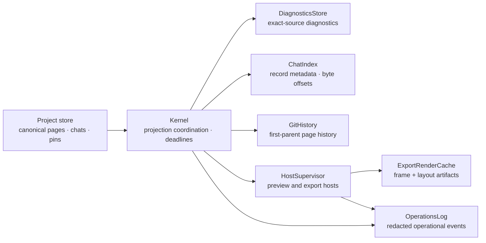

# termcraft — Projections, Observability, and Scale Design

Date: 2026-07-16
Status: approved design
Parent: [2026-07-16-production-hardening-decisions-design.md](2026-07-16-production-hardening-decisions-design.md)

## 1. Purpose and precedence

This design defines how termcraft derives fast local views from canonical project
data, observes production failures without retaining sensitive content, and stays
structurally bounded on large projects. It owns current diagnostics, chat indexing,
Git-history pagination, staging scale, export concurrency and render reuse, preview
flow control, operations logging, turn deadlines, and the synthetic benchmark suite.

The production-hardening decision register governs where this document overlaps the
original termcraft or Git-backed-history specifications. In particular:

- canonical page sources and chat JSONL remain portable source data;
- every projection and cache in this design is machine-local and rebuildable;
- `GitHistory` remains the only owner of page history;
- Git commits are never correlated with turns, prompts, records, or diagnostics;
- recoverable transactions remain the owner of commit intent, crash recovery, and
  consistent multi-file publication;
- unique per-turn workspaces, immutable candidate snapshots, fenced runs, and
  `SafeProjectFs` remain required;
- the full-frame, latest-wins host protocol remains the initial preview protocol.

This document supersedes eager full-chat loading, eager full-history loading, chat-
owned current warnings, unbounded frame/log queues, retry-resettable turn timing,
and any implication that render caching can provide publication consistency.

## 2. Selected approach

The selected architecture is a physically external local projection layer with
separate stores for separate source domains:

- `DiagnosticsStore` projects diagnostics from exact page-source bytes;
- `ChatIndex` projects record identity and byte locations from each canonical chat
  JSONL file;
- `GitHistory` queries Git directly in bounded first-parent pages and owns no
  cross-domain correlation;
- `ExportRenderCache` stores immutable frame-and-layout artifacts by content key;
- `OperationsLog` records a strict allowlist of bounded operational facts.

Two alternatives are rejected:

1. Portable indexes under `.termcraft/` are rejected because they create Git churn,
   can arrive stale from another machine or branch, and blur source data with derived
   state. A generated `.gitignore` is defense in depth, not the projection boundary.
2. A unified `VersionIndex` or correlation database is rejected because page history,
   chat history, diagnostics, and export artifacts have different authorities and
   invalidation rules. Joining them would recreate private page versions and imply a
   Git-commit-to-turn relationship that the product explicitly does not have.

On-demand page staging is also rejected for the initial implementation. Copying all
current page sources is simple, preserves the agent contract, and remains linear in
the source bytes. The benchmark in §16 is the only gate for reconsidering it.

## 3. Authority and component boundaries



The ownership rules are strict:

| Data | Authority | Derived consumer |
|---|---|---|
| Current page source and static `meta` | canonical `page.tsx` | diagnostics, metadata projection, preview, export |
| Chat records | canonical chat JSONL | `ChatIndex` |
| Page history | installed Git repository through `GitHistory` | history UI |
| Current diagnostics | `DiagnosticsStore` entry for the exact current source key | prompt assembly and diagnostics UI |
| Historical warning display | warning snapshot in its canonical chat record | chat UI only |
| Export frame and layout | fresh host render or verified render-cache entry | export candidate package |
| Turn and host telemetry | `OperationsLog` | local diagnosis only |

There is no `VersionIndex`, page-version table, Git-commit-to-record mapping,
Git-commit-to-turn mapping, or Git-commit-to-prompt mapping. `ChatIndex` never stores
a Git object id. `GitHistory` never receives a chat id, record id, turn id, prompt,
warning, or model response.

The Kernel coordinates invalidation and requests through typed ports. The stores do
not call one another, and the UI does not read their files directly. Each response
names a store generation so a stale asynchronous result can be discarded.

## 4. Machine-local storage and Git exclusion

All persistent projections, caches, operational logs, and their local tuning values
are `LocalWorkspaceState` under hard-excluded paths in `.termcraft/`. They sit next
to, but are not part of, portable `ProjectState`. Agent staging and verified backup
stores remain outside `.termcraft/` under the roots owned by the staging and storage
designs; they are not projection storage.

The conceptual layout is:

```text
.termcraft/
  workspace.local.toml
  cache/
    page-meta/
    chat-index/
    export-render/
  diagnostics/
  logs/
    operational.jsonl
    operational.<n>.jsonl
```

Each store persists its own schema version, generation, checksums, and bounded
maintenance metadata under its classified local root. Resource-limit overrides, if
persisted, belong to the versioned local configuration in `workspace.local.toml`;
compiled defaults remain valid when no override is present. None of these files is
portable.

Git exclusion is enforced in three layers:

1. `StoragePathPolicy` hard-denies `workspace.local.toml`, `cache/`, `diagnostics/`,
   `logs/`, transaction journals, sessions, locks, backups, and every other local
   path from commit scopes, dirty counts, status dots, and commit previews.
2. The Git scope planner accepts paths only from the Project store's explicit
   portable-path classification. It rejects every local journal, cache, projection,
   session, preference, log, lock, and backup even if a caller presents such a path.
3. Generated ignore rules mirror the policy for user visibility and remain defense
   in depth. Removing or negating an ignore rule does not
   make a local path eligible for a termcraft commit scope.

Projection entries are written to a temporary sibling, checksummed, and renamed
into place. They are never prerequisites for opening canonical project data. A
missing, old, or corrupt projection is deleted or quarantined locally and rebuilt;
it never triggers a portable migration and never writes into a portable path.

Logical keys are content keys. Projection schema or algorithm changes are handled
by a store-generation bump and rebuild rather than an in-place migration. Unreachable
content-key entries become eligible for local least-recently-used cleanup.

## 5. Projection invalidation

The Kernel publishes source-change facts after successful transaction recovery or
commit, after launch inspection, after explicit Restore, and after Git status/branch
refresh. Stores react only to facts relevant to their authority.

| Change | Required effect |
|---|---|
| Canonical page bytes change | compute a new `sourceHash`; respawn the current preview; select/recompute diagnostics for the new exact key; export uses a different render key |
| `kitApiVersion` changes | diagnostics and export render cache miss even when source bytes are otherwise identical |
| Renderer implementation changes | `rendererVersion` changes; export render cache misses; diagnostics remain valid |
| Export size, resolved theme, or flags change | only the affected render-cache keys miss |
| Complete chat records append | `ChatIndex` resumes at its last valid-prefix byte offset |
| Incomplete final chat bytes appear | the valid prefix does not advance; no record after those bytes is indexed |
| Chat file truncates or its validated prefix changes | increment that chat's index generation and rebuild from byte zero |
| Git `HEAD` changes on the same ref | invalidate history cursors; `ChatIndex` uses the append/fingerprint path and rebuilds only a chat whose canonical prefix changed |
| Kernel `projectViewGeneration` changes after repository refresh | invalidate history cursors and rebuild project chat indexes before serving new pages |
| Projection schema changes | delete the affected local store generation and rebuild from authority |
| Cache checksum fails | remove only the corrupt content-key entry and recompute it |
| Page is removed from the manifest | stop presenting current diagnostics/export work; old content-key entries become ordinary quota-eviction candidates |

Old content-addressed entries need not be eagerly deleted on every source change.
They are unreachable by the new key and are removed by bounded quota maintenance.
No invalidation event edits a canonical chat record, page source, Git object, or
commit.

## 6. `DiagnosticsStore`

### 6.1 Key and value

**Amended (design-tree phase 2 Task 7, 2026-08-03):** re-keyed from `sourceHash` to
`closureHash` — see `docs/superpowers/specs/2026-07-28-multi-file-design-tree-design.md`
§7's consumer table. This store has no production caller as of the amendment, so the
re-key is correctness ahead of a future caller, not a fix for an observed invalidation
defect.

The logical key is exactly:

```ts
type DiagnosticsKey = {
  pageSlug: string
  closureHash: string
  kitApiVersion: number
}
```

`closureHash` is the Merkle hash over the page's transitive closure — the `(relPath,
sha256)` pairs of every file the page's entry reaches, sorted by `relPath` — rather than
the SHA-256 digest of the entry file's own bytes alone (the original `sourceHash`
reading). `kitApiVersion` is the page's declared static integer, not the termcraft
binary version. The slug remains part of the key because diagnostics may legitimately
depend on page identity, navigation targets, or slug-specific rules.

The value contains the diagnostics schema version, normalized diagnostic codes and
severities, bounded messages and source ranges, provenance (`gate` or `host`), and
the observation timestamp. It contains no chat id. A diagnostics algorithm change
that does not change `kitApiVersion` bumps the DiagnosticsStore generation and
recomputes entries; it does not add an undeclared fourth logical key field.

Static Gate diagnostics replace the static portion of an entry atomically. Runtime
host diagnostics may update the runtime portion only when the host handshake names
the same page slug, closure hash, and kit API version. Events from an old preview
session or fenced turn cannot update the current entry.

### 6.2 Prompt semantics

Prompt assembly computes the exact key from each source it is about to expose. It
reads only entries for those exact keys and never asks the active chat for current
warnings. The active page has a freshness barrier: if its exact entry is missing,
the Kernel runs current static diagnostics before launching the backend. Other pages
may contribute diagnostics only when their exact entries already exist; a stale
entry is omitted rather than substituted.

A chat agent record may retain the warnings observed when that historical turn
finished. That snapshot remains useful when reading the conversation, but it is
immutable historical presentation. Switching chats cannot change current prompt
diagnostics, and an old warning snapshot cannot survive a source-hash or kit-version
change into a new prompt.

Successful Gate validation writes diagnostics for every changed candidate under
the candidate's eventual canonical key. Launch inspection and historical browsing
populate entries lazily. Failed analysis leaves no successful entry; the caller
receives a typed diagnostic-computation error and may retry without deleting source
data.

The DiagnosticsStore has a 128 MiB default per-project quota, configurable locally
from 32 MiB through 512 MiB. Eviction is least-recently-used across unpinned keys;
entries for currently listed page hashes are pinned during the active process.

## 7. `ChatIndex`

### 7.1 Indexed data

Canonical chat JSONL is the sole authority. Every new canonical record has its
UUIDv7 `recordId`; turn-related records also carry the fenced `turnId`. `ChatIndex`
stores only the following domain fields:

- `recordId`;
- optional `turnId`;
- persisted timestamp;
- `changedPages` from the record, or an empty list when absent.

The index additionally stores structural address and integrity metadata: chat id,
record start and end byte offsets, valid-prefix length, source fingerprint,
projection generation, opaque Kernel `projectViewGeneration`, and paged-index
checksums. Byte offsets are addresses into
the canonical file, not record content. The index does not store prompt or response
text, warning snapshots, pins, selections, reasoning, full records, Git ids, commit
subjects, or rendered chat rows.

Entries are persisted in offset order in checksummed pages of at most 512 entries.
Only the page directory and an eight-page least-recently-used window are resident in
memory. The on-disk index grows linearly with record count; resident index memory
does not.

### 7.2 Streaming valid-prefix build

The builder reads a chat in binary mode from byte zero or the previously validated
prefix. UTF-8 decoding and JSON parsing are incremental. A record becomes visible
only after the complete newline-terminated line passes the canonical record decoder,
including line-size, id, timestamp, and schema checks. The builder then appends the
index entry and advances `validPrefixBytes` to that line's end in one local index
commit.

An incomplete final line is not indexed. On the first invalid line or unterminated
suffix, the canonical streaming reader performs the bounded recovery classification
defined by the storage design. `ChatIndex` consumes that result:

- a transaction-proven partial final append is repaired by the Project store, after
  which the index rebuilds or resumes from the repaired prefix;
- an unproven corrupt suffix exposes the valid prefix read-only, mutation-locks the
  chat, and leaves the canonical suffix for explicit recovery;
- mid-file corruption, a valid record after corrupt bytes, an identity violation,
  or a duplicate `recordId` is a hard error that invalidates the chat index and
  exposes no partial chat view.

`ChatIndex` never repairs or truncates canonical JSONL itself. Bytes after the first
invalid line are never added as index entries, so corruption cannot produce a
plausible but discontinuous conversation.

The streaming scanner uses a 1 MiB read buffer plus at most one canonical bounded
record line. It never materializes all record bodies or all index entries in memory.

### 7.3 Lazy tail loading and backward pagination

Opening a chat requests `loadTail(chatId, limit, byteBudget)`. The default limit is
100 records; the hard limit is 200 records and 8 MiB of decoded canonical bytes per
response. `ChatIndex` locates the final indexed offsets, reads only the required
canonical byte ranges, and returns decoded records in display order.

Older content uses `loadBefore(chatId, cursor, limit, byteBudget)`. The opaque cursor
contains the chat-index generation and exclusive start offset. The index walks
backward through its offset pages, reads only the selected canonical ranges, and
returns a cursor for the preceding page. The UI retains at most three decoded body
pages per chat plus the currently selected record. Scrolling back to an evicted page
re-reads it from canonical JSONL through the index.

If a page contains one record that alone approaches the canonical line ceiling, that
record is returned alone rather than exceeding the byte budget. A response never
splits a JSONL record.

### 7.4 Append, truncation, and branch changes

Before any query or incremental append, `ChatIndex` compares:

- the portable project identity;
- opaque Kernel-owned `projectViewGeneration`, which changes after a repository
  refresh observes a branch/ref/repository-view change but exposes no Git identity;
- canonical file identity, length, modification marker, and hashes of the first and
  final validated windows;
- the stored valid-prefix boundary and final-line checksum.

An unchanged prefix with a longer file takes the append fast path. A file shorter
than `validPrefixBytes`, a mismatched validated window, replaced file identity, or a
  changed `projectViewGeneration` invalidates the generation and starts a streaming
rebuild at byte zero. A branch switch rebuilds project chat indexes even if a chat
happens to have the same path and length on both branches; no record identity is
borrowed across the branch boundary. A new commit on the same branch invalidates Git
history cursors but does not by itself rebuild an unchanged chat index.

Generation changes invalidate outstanding pagination cursors and record selections.
The UI drops stale pages and requests the new tail. A rebuild may serve the previous
validated generation until the new scan reaches a consistent prefix only when the
canonical fingerprint is unchanged; after truncation or branch change it serves no
stale records.

The single-writer rule means arbitrary same-length in-place rewriting while
termcraft runs remains unsupported. At launch or explicit repository refresh, a
cryptographic full-prefix verification runs as part of rebuilding whenever branch,
file identity, or validated-window evidence changed.

## 8. Paginated Git page history

`GitHistory`, implemented only by the Git adapter, exposes bounded pages instead of
an unbounded async iterable:

```ts
type PageHistoryRequest = {
  sourcePath: string
  cursor?: string
  limit?: number
}

type PageHistoryPage = {
  repositoryGeneration: string
  entries: PageCommit[]
  nextCursor?: string
  partialHistory: boolean
}
```

The default page size is 50 entries and the hard maximum is 200. The first request
captures the full current `HEAD`, ref/detached state, repository identity, and page
path into an opaque cursor generation. It performs a path-limited `--first-parent`
walk and asks Git for at most `limit + 1` matching commits so it can determine
whether another page exists.

The next cursor resumes from the first parent of the last returned commit, not from
an integer `--skip` count. Every command uses full object ids and argument arrays,
with the Git adapter's bounded output and timeout. A shallow boundary returns
`partialHistory: true`; termcraft never fetches.

If `HEAD`, ref state, repository identity, or path identity changes, the repository
generation changes and old cursors fail with `StaleHistoryCursor`. The UI clears its
virtualized window and requests the first page again. It retains at most three pages
of commit rows around the viewport. Selecting a row keeps that row and its full id
even if its surrounding page is evicted.

The 10,000-commit benchmark must therefore issue bounded page requests as the user
scrolls. No startup, history-open, search, or status-refresh path may load all 10,000
entries, and no local projection may mirror Git commits to make that possible.

Current-design row precedence, historical reads, Restore validation, immutable page
slugs, and first-parent semantics remain governed by the Git-backed page-history
design.

## 9. All-pages staging

The initial staging contract materializes every currently listed page into the
turn's unique agent workspace. Let `S` be the sum of exact current page-source bytes
and `P` the page count. Assembly remains:

- `O(S + P)` bytes read from canonical storage;
- exactly `S` logical page bytes written to the fresh workspace before the agent
  edits it;
- `O(P)` source-hash and path metadata;
- at most a 1 MiB streaming-copy buffer in memory, in addition to the bounded
  `SafeProjectFs` path and record structures.

The Kernel computes each initial source hash while copying. It does not make a second
full source snapshot merely for diffing. After the backend exits, `SafeProjectFs`
copies validated workspace intake into the immutable candidate while hashing it;
the candidate is the agent-inaccessible Gate input required by the durability
design. Candidate cost is also linear in candidate bytes and is not hidden by a
projection.

All copies preserve unique file identity. Hardlinks are forbidden in staging and
candidate assembly because an agent write through a hardlink could mutate canonical
source. `SafeProjectFs` rejects hardlinked intake regardless of who created it.

After the benchmark demonstrates a material bottleneck, an optional filesystem
copy-on-write accelerator may replace the baseline copy only when a per-filesystem
capability probe proves that the clone creates a distinct file identity and that a
destination write leaves the canonical source byte-for-byte unchanged. Clone failure
falls back to streaming copy. The accelerator may use supported reflink, clonefile,
or block-clone primitives; it may never use hardlinks and may never change logical
staging semantics.

On-demand page materialization, read protocols, and agent-visible fetch tools remain
out of scope until the benchmark gate in §16 fails on the calibrated supported
hardware profiles.

## 10. Bounded export and render reuse

### 10.1 Source set and worker pool

Export captures the listed canonical source hashes, static metadata, resolved theme,
and three-size ladder into an export plan. Jobs are generated lazily as
`(page, size)` pairs rather than materialized with their outputs in memory.

The default worker count is:

```text
min(4, max(1, floor(logicalCpuCount / 2)))
```

Local configuration may set 1 through 8 workers; zero and unbounded values are
invalid. At most the configured number of export hosts run concurrently, and the
ready queue holds at most twice that many job descriptors. Each completed artifact
is checksummed and streamed to the render cache and export transaction's candidate
area before the next result is retained. Memory therefore scales with the worker
count and largest bounded artifact, not with page count times size count.

### 10.2 Content-addressed render cache

The exact logical key is the canonical serialization of:

```ts
type ExportRenderKey = {
  sourceHash: string
  kitApiVersion: number
  rendererVersion: string
  size: { width: number; height: number }
  theme: string
  flags: Record<string, boolean | number | string>
}
```

`theme` identifies the fully resolved export theme, including a digest when a theme
id's values can change. `flags` is sorted and canonically encoded; it includes the
export-time behavior and terminal capability flags that can change output. Preview-
only state and the currently selected historical row are absent.

One immutable cache entry contains the styled/text frame, resolved layout tree, key
envelope, byte lengths, and checksums captured from the same render pass. A hit is
accepted only after the envelope and checksums validate. A corrupt or partial entry
is removed and rendered again. Concurrent writers use temporary siblings plus
create/rename semantics; either identical complete entry is valid.

The default render-cache quota is 512 MiB per project, configurable locally from
64 MiB through 4 GiB. Eviction is least-recently-used among entries not pinned by an
active export. A source, kit API, renderer, size, theme, or flag change creates a
miss by construction; no global cache flush is required.

### 10.3 Publication boundary

Cache hits and worker completion produce candidate artifacts only. Immediately
before durable export commit intent, the export domain transaction revalidates the
planned page list, source hashes, metadata hashes, and resolved options under the
project-write mutex. Drift invalidates the plan and publishes nothing.

Creation of an immutable `export/generations/<generationId>/`, atomic replacement of
`export/current.json` only after complete verification, preservation of the previous
pointer until then, and startup roll-forward after intent remain responsibilities of the common
recoverable transaction engine. The render cache neither weakens nor substitutes
for that transaction. A cache entry may survive a failed export because it is local,
immutable, and unreachable from the portable package until a later transaction
publishes it.

## 11. Preview structural budgets

Preview frames use a separate bounded data stream from lifecycle, input, heartbeat,
and request/response traffic. The consumer-side budgets are:

- default display cap: 30 FPS;
- locally configurable display cap: 1 through 60 FPS; zero/unlimited is invalid;
- pending-frame queue: exactly one full frame per `PreviewSession`;
- decoded frame retention: the displayed frame plus one pending latest frame;
- default supervisor-offered negotiated preview ceiling: 512 columns, 256 rows,
  131,072 cells, and 16 MiB encoded frame/bulk payload bytes; protocol hard maxima
  remain 2,048 cells per axis and 262,144 cells total, and negotiation may choose tighter
  limits;
- frame sequence numbers are monotonic and every geometry response names the frame
  it describes.

When frames arrive faster than the UI can draw, a newer complete frame atomically
replaces the undelivered pending frame. Frames are never queued for eventual replay.
At the next FPS slot the consumer takes the latest pending frame, discards any frame
whose session or sequence is stale, and draws once. Dropping intermediate animation
frames is expected behavior.

The decoder rejects oversize dimensions, multiplication overflow, oversize payloads,
and payload/dimension disagreement before allocating the frame. A host that violates
the negotiated ceiling incurs a protocol fault handled by `HostSupervisor` restart
budgets and the circuit breaker. Frame pressure cannot delay heartbeat, shutdown,
click/key input, or query responses because those messages do not share the frame
queue.

Export bypasses the preview FPS scheduler and performs its deterministic one-shot
capture under export limits. Frame deltas, retained animation history, and adaptive
quality are deferred. Full frames plus latest-frame coalescing are the benchmarked
baseline.

## 12. Turn deadlines and cancellation

Every turn has two independent monotonic timers:

1. **Silence timeout:** 120 seconds by default. It resets only when the active
   backend attempt emits a valid normalized event. It is active while awaiting the
   backend, pauses during bounded Gate/transaction work, and restarts for a retry.
2. **Absolute deadline:** 30 minutes by default from the instant the Kernel accepts
   the send command and allocates `turnId`. Its fixed `deadlineAt` covers staging,
   every backend attempt, all Gate passes, retry feedback, and waits before commit
   intent. Events, retries, session fallback, and UI activity cannot reset or extend
   it.

Both timers are mandatory. Machine-local configuration may set the silence timeout
from 30 seconds through 10 minutes and the absolute deadline from 10 through 60
minutes. No sentinel, zero, negative, infinite, CLI flag, backend option, or config
value can disable either timer. Invalid local values fail closed to the documented
defaults and emit a redacted configuration event.

Before commit intent, manual cancel, silence expiry, or absolute-deadline expiry
dispatches `kernel.turn.requestCancel`. A running attempt transitions to `stopping`;
another active pre-intent phase transitions to `terminalizing` after its owned work
stops. The backend fence is revoked, its process tree is terminated, and
cancellation is not complete until exit is confirmed. No candidate from that run
can enter the Gate or transaction after cancellation.

The absolute deadline is also the latest instant at which the Kernel may write turn-
apply commit intent. It is rechecked under the project-write mutex after all source
preconditions and immediately before the transaction engine persists intent. If it
has expired, the candidate is discarded and no project mutation starts.

After durable commit intent, cancellation is forbidden. The UI changes from
`Cancel` to non-cancellable `Applying changes`; a stale `Esc` or cancel command
returns the typed `CANCEL_TOO_LATE` refusal. A deadline that passes after intent is
recorded as an overrun but does not authorize rollback or process termination. The
transaction engine must roll forward or report a recovery conflict according to the
durability design. This is the single cancellation boundary for turn apply.

Retry count remains the initial attempt plus at most three Gate-directed retries,
but the shared absolute deadline may end the turn before that count is exhausted.

## 13. Bounded, redacted operations log

`OperationsLog` is newline-delimited JSON under `.termcraft/logs/`. It
uses 5 MiB segments and retains the newest five segments by default. Local settings
may choose segment sizes from 1 through 20 MiB and retention from two through ten
segments; the writer enforces the resulting hard cap before accepting another
event. Rotation uses a temporary segment and rename. Oldest segments are removed
only after the replacement segment is durable.

The logger is an allowlist API, not a general object serializer. Every physical
event first carries the required UUIDv7 `recordId`; depending on event kind, it may
otherwise persist only:

- UTC timestamp, event code, severity, and local monotonic sequence;
- `turnId`, attempt number, and retry count;
- backend name, model name, and `sessionStartMode` (`new`, `resumed`, or
  `fallback-seeded`) but never `sessionScopeId` or a raw vendor session id;
- phase timings and total elapsed milliseconds;
- Gate result (`passed`, `failed`, or `cancelled`), diagnostic counts, and stable
  diagnostic codes;
- cancellation source (`user`, `silence-timeout`, `absolute-deadline`, or
  `shutdown`) and process-exit confirmation;
- backend exit class and numeric exit code;
- host start, stop, protocol-fault, timeout, restart count, backoff, and circuit-
  breaker transitions.

The following are forbidden from every event and nested field:

- reasoning or thinking text;
- user prompts, agent responses, chat record bodies, or warning messages;
- page, pin, export, or other file content;
- credentials, environment values, authorization state, or raw vendor session ids;
- full tool arguments, command lines, stdout, stderr, stack dumps, or arbitrary
  exception messages;
- cache artifact bodies or protocol payloads.

Tool activity may be logged only as aggregate counts by normalized operation class;
targets and arguments are never logged. Gate failures use stable codes and counts,
not source excerpts. Backend and host failures are mapped to typed classes before
logging; unknown exceptions become `unclassified-error` without their message.

Strings that remain on the allowlist are control-character stripped and length-
bounded. The logger applies redaction before serialization and again scans the final
encoded event for registered credential patterns. Redaction failure drops the event
rather than writing it.

Log I/O failure never blocks project recovery, cancellation, or terminal cleanup.
The writer increments an in-memory dropped-event counter and emits one bounded UI
notice per failure episode. When logging resumes, it writes only the dropped count,
not reconstructed sensitive events.

## 14. Data flows

### 14.1 Send and diagnostics

1. The Kernel allocates `turnId`, starts the absolute deadline, and assembles the
   unique all-pages workspace while hashing canonical sources.
2. Prompt assembly derives the exact diagnostics key for the active current source.
3. `DiagnosticsStore` supplies or computes current diagnostics without consulting
   the active chat; historical chat warnings remain presentation-only.
4. Backend attempts and Gate retries share `deadlineAt`; operational state emits only
   redacted allowlisted events.
5. A valid immutable candidate enters the transaction only after final freshness and
   deadline checks. Cancellation is rejected after commit intent.

### 14.2 Chat open and pagination

1. `ChatIndex` validates its source generation and resumes a valid-prefix scan when
   complete lines were appended.
2. The UI requests only the tail body page from canonical JSONL.
3. Up-scroll uses exclusive byte-offset cursors to read older bounded ranges.
4. Truncation, branch switch, or prefix mismatch increments the generation, rebuilds
   from byte zero, and invalidates stale UI cursors.

### 14.3 Page history

1. The UI requests the first page from `GitHistory` for the current source path.
2. The adapter binds the cursor to repository generation and returns at most the
   requested bounded first-parent page.
3. Further pages are fetched only as the virtualized viewport approaches its edge.
4. `HEAD` or ref drift invalidates the cursor; no chat lookup or local version index
   participates.

### 14.4 Preview and export

1. Interactive preview retains only the displayed frame and latest pending frame and
   draws at the configured FPS cap.
2. Export creates a lazy page-size job stream and checks the exact render key.
3. Cache misses run in the bounded host pool; hits and misses both produce verified
   candidate artifacts.
4. Only the export transaction may publish a consistent portable package.

## 15. Error recovery

| Failure | Recovery and invariant |
|---|---|
| Projection root missing or unreadable | open canonical project data; rebuild when storage becomes available; never create a portable substitute |
| Projection schema is newer or corrupt | quarantine/delete that local generation and rebuild; do not run a project migration |
| Diagnostics entry corrupt | remove the exact key and recompute; never fall back to another source hash or chat warning |
| Chat final line incomplete | serve the valid prefix; do not index or append behind it until storage recovery resolves the suffix |
| Chat middle/trailing corruption unproven by transaction | preserve canonical bytes, report the first offset, and require explicit storage recovery |
| Chat truncation or branch switch | increment generation, discard stale cursors, and stream-rebuild from byte zero |
| Git history cursor stale | return `StaleHistoryCursor`; UI requests the first page for the new repository generation |
| Git page command fails or times out | show a bounded typed error; retain current design and repository state |
| Render-cache entry partial or corrupt | delete the exact local entry and render again |
| Export worker fails | cancel remaining jobs, retain reusable verified cache entries, and give the transaction no publishable candidate |
| Export source drifts before commit intent | invalidate the plan and publish nothing; the user may retry from a fresh plan |
| Preview producer floods or consumer stalls | replace the pending frame; queue length remains one; protocol-limit violations use supervisor recovery |
| Operations log cannot rotate or write | drop bounded telemetry and continue correctness/recovery work |
| Silence or absolute turn timer expires before intent | revoke the fence, terminate and confirm backend process-tree exit, discard candidate |
| Cancel arrives after commit intent | refuse with `CANCEL_TOO_LATE`; transaction rolls forward or enters startup recovery |

## 16. Limits and benchmark suite

### 16.1 Structural limits

| Resource | Limit |
|---|---|
| Chat decoded body request | default 100 records; maximum 200 records and 8 MiB |
| Chat index resident pages | eight index pages; each at most 512 entries |
| Chat scan buffer | 1 MiB plus one canonical bounded record line |
| Git history page | default 50; maximum 200 commit rows |
| Git history UI window | three commit pages plus selected row |
| Staging copy memory | 1 MiB streaming buffer plus `O(P)` metadata |
| Export workers | computed default; configurable 1–8 |
| Export ready queue | at most `2 × workerCount` descriptors |
| Diagnostics quota | default 128 MiB; 32–512 MiB |
| Export render-cache quota | default 512 MiB; 64 MiB–4 GiB |
| Preview | 1 pending frame; 2 retained decoded frames; 30 FPS default, 1–60 FPS |
| Default supervisor-offered negotiated preview ceiling | 512 columns, 256 rows, 131,072 cells, 16 MiB encoded frame/bulk payload; protocol hard maxima remain 2,048 per axis and 262,144 cells |
| Operations log | 5 × 5 MiB default; segment 1–20 MiB, retention 2–10 |
| Silence timeout | 120 seconds default; 30 seconds–10 minutes; mandatory |
| Absolute turn deadline | 30 minutes default; 10–60 minutes; mandatory and non-resettable |

### 16.2 Required synthetic fixtures

The benchmark suite is deterministic and checked into test fixtures or generated
from a fixed seed. It contains:

1. **Large project:** 100 listed pages whose exact current source bytes total at
   least 10 MiB, with a fixed size skew from small pages through pages near, but not
   above, the canonical 2 MiB per-page limit.
2. **Long Git history:** 10,000 first-parent commits, with the active page changed at
   controlled intervals, merge commits, a shallow-boundary variant, and unrelated
   commits that path filtering must exclude.
3. **Long chat:** 100,000 valid records with UUIDv7 record ids, turn ids on turn
   records, varied `changedPages`, a partial-final-line variant, a truncation
   variant, and two branch variants with different prefixes.
4. **Three-size export:** all 100 pages rendered at exactly three eligible sizes,
   producing 300 jobs for cold-cache and warm-cache runs.
5. **Slow preview consumer:** an animated host emits 240 full frames per second
   (above the 60 FPS display cap but below the protocol flood threshold for the
   fixture's encoded size) while a test consumer draws five per second for 60
   seconds.
6. **Cancellation matrix:** user cancellation, silence expiry, absolute expiry across
   retries, process-exit delay, cancellation immediately before commit intent, and a
   stale cancellation immediately after commit intent.

### 16.3 Structural assertions

Structural budgets gate before wall-clock numbers:

- staging writes exactly the fixture's current page bytes once to the agent workspace,
  uses no hardlinks, creates no second diff snapshot, and keeps copy-buffer memory at
  or below 1 MiB;
- the 10,000-commit history opens with one page request, no Git command returns more
  than 201 matching rows, and the UI never retains more than three pages plus the
  selected row;
- the 100,000-record chat scan advances only through valid complete lines, resident
  index pages never exceed eight, opening the chat decodes only the bounded tail,
  backward pagination follows byte offsets, and truncation/branch variants force a
  generation rebuild;
- cold export runs no more than `workerCount` hosts and queues no more than
  `2 × workerCount` descriptors; an unchanged warm export runs zero render hosts;
  changing one page produces exactly three render misses;
- the slow-consumer preview never retains more than one pending frame, displayed
  sequences remain monotonic, and dropped frames do not delay control messages;
- logs rotate within the configured byte cap and sentinel secrets planted in
  prompts, reasoning, file content, credentials, tool arguments, stdout, and stderr
  are absent from every segment;
- the absolute deadline stays equal across all retries; pre-intent cancellation
  confirms process-tree exit and applies nothing; post-intent cancellation is
  refused and recovery completes the transaction.

### 16.4 Calibrated wall-clock baselines

Only after every structural assertion passes does each supported platform establish
wall-clock baselines. A baseline run records the termcraft revision, runtime and OS,
CPU count, memory, filesystem, fixture seed, cache state, median, p95, peak resident
memory, bytes read/written, process count, and cache hit ratio.

Each scenario uses two warm-up runs followed by ten measured runs on the same
profile. Cold and warm export are separate scenarios. The initial accepted results
become that profile's baseline; this design does not invent hardware-independent
millisecond targets before measurement. Subsequent CI or release qualification
fails a performance regression when median wall time exceeds 120% of baseline, p95
exceeds 130%, or peak resident memory exceeds 110%, unless an explicitly reviewed
baseline update accompanies the behavior change. Structural-limit failures can
never be waived by a fast wall-clock result.

On-demand staging or frame deltas may be proposed only when the calibrated baseline
fails a supported product target and profiling attributes the failure to full staging
or full-frame transport respectively.

The first supported product profile is a local SSD machine with at least four
logical CPU cores and 8 GiB RAM, tested on Windows/NTFS and Linux/ext4. On that
profile the initial targets are: 100-page/10-MiB workspace copy-and-hash p95 ≤ 2 s
and incremental RSS ≤ 128 MiB; indexed 100,000-record chat tail open p95 ≤ 250 ms
(cold index build p95 ≤ 10 s); first 50-row Git-history page p95 ≤ 1 s; 300-job cold
export p95 ≤ 120 s and unchanged warm export p95 ≤ 3 s; and the slow-preview fixture
adds ≤ 64 MiB RSS while accepted control-event latency stays p95 ≤ 100 ms. Missing a
target is the measurable gate for profiling and a follow-up on-demand-staging or
frame-delta proposal; regression percentages still govern later baseline changes.

## 17. Testing

### Projection contract tests

- exact DiagnosticsStore key behavior for source, slug, and kit API changes;
- source-identical chats produce no diagnostic cross-talk;
- a historical warning snapshot remains visible in its chat while a current prompt
  receives only current exact-key diagnostics;
- store-generation changes and corrupt entries rebuild without canonical writes;
- every projection path is classified local and rejected by all Git scope plans,
  dirty counts, status dots, and commit previews.

### Chat index tests

- streaming build across arbitrary byte/chunk boundaries and multibyte UTF-8;
- partial final line, invalid trailing line, middle corruption, and bounded line
  behavior;
- record/turn lookup and `changedPages` without indexed record bodies;
- tail load, repeated backward pagination, byte budgets, LRU eviction, and cursor
  generation checks;
- append fast path, truncation, file replacement, branch switch, same-length branch
  content, and rebuild interruption/restart;
- 100,000-record fixture with bounded resident memory.

### Git history tests

- first-parent path filtering, merge behavior, root commit, deleted/recreated immutable
  slug, shallow history, detached `HEAD`, and bounded output;
- cursor continuation from the last returned commit's first parent;
- cursor invalidation on `HEAD`, ref, identity, and path-generation change;
- 10,000 commits without an eager complete walk or local commit mirror;
- compile-time and schema assertions that `GitHistory` accepts no chat/turn/prompt
  identity and `ChatIndex` stores no Git identity.

### Staging, export, and preview tests

- all-pages streaming copy, source hashing during copy, immutable candidate copy, and
  hardlink rejection;
- copy-on-write capability probe proves distinct identity and write isolation before
  acceleration is enabled, with forced fallback coverage;
- export pool and queue bounds under success, slow jobs, worker crash, cancellation,
  and cache races;
- render-key sensitivity to every key field, same-pass frame/layout verification,
  checksum corruption, quota eviction, and one-page invalidation;
- export transaction receives only a fully verified candidate and rejects source
  drift before commit intent;
- latest-frame replacement, FPS cap with a fake monotonic clock, stale sequence and
  session rejection, oversize decoder failures, and control-channel progress under
  frame flood.

### Deadline and observability tests

- fake-clock silence reset, absolute non-reset across all retries, bounded local
  configuration, and invalid-config fallback;
- cancellation fence revocation, process-tree exit confirmation, candidate rejection,
  pre-intent deadline check, and post-intent `CANCEL_TOO_LATE` refusal;
- typed log-event allowlists, control-character and length handling, credential scan,
  forbidden-field property tests, rotation crash points, cap enforcement, write
  failure, and dropped-event recovery;
- end-to-end sentinel test proving prompts, reasoning, file bytes, credentials, full
  tool arguments, stdout, and stderr never appear in local log bytes.

## 18. Acceptance criteria

- Every persisted projection, cache, operations log, and local tuning value in this
  design is classified machine-local, is rebuildable or operational-only, and is
  rejected by every termcraft Git commit scope, dirty count, status dot, and commit
  preview.
- `DiagnosticsStore` uses exactly `(pageSlug, closureHash, kitApiVersion)` as its
  logical key (amended by design-tree phase 2 Task 7; see §6.1). Current prompt
  diagnostics do not depend on the active chat; stored chat warnings remain historical
  snapshots only.
- No `VersionIndex`, Git commit mirror, or Git-commit-to-turn/prompt/record
  correlation exists. `GitHistory` alone owns page history.
- `ChatIndex` indexes only record id, optional turn id, timestamp, `changedPages`, and
  structural byte/integrity metadata. It streams a valid prefix, loads bounded tail
  bodies lazily, paginates backward by byte offset, and rebuilds on truncation or
  branch generation change.
- First-parent Git history is requested in pages of at most 200 and the 10,000-commit
  fixture is never loaded or retained in full.
- Initial turn staging remains all-pages and `O(total current source bytes)`, uses no
  hardlinks, and gains safe copy-on-write only after benchmark evidence and a proven
  capability probe.
- Export uses a bounded 1–8 worker pool and the exact content-addressed render key
  `(sourceHash, kitApiVersion, rendererVersion, size, theme, flags)`. Cache hits do
  not bypass source-plan revalidation or the recoverable export transaction.
- Preview display is FPS-capped, latest-frame coalesced, and bounded to the documented
  frame count and protocol ceilings. Frame deltas remain deferred.
- Operations logs rotate under a hard byte cap and contain the required turn/backend/
  `sessionStartMode`/model/timing/retry/Gate/cancel/exit/host-restart facts without
  reasoning, prompts, file content, credentials, full tool arguments, or raw output.
- Every turn has a mandatory silence timeout and a mandatory, non-resettable
  30-minute-default absolute deadline shared by all retries. No configuration can
  disable either; cancellation is impossible after durable commit intent.
- The 100-page/10-MiB, 10,000-commit, 100,000-record, 300-job export, slow-preview,
  and cancellation fixtures pass structural assertions before calibrated wall-clock
  regression gates apply.
- Projection loss, corruption, stale cursors, cache corruption, slow consumers, log
  failures, and timeout/cancellation races have the bounded recovery outcomes in
  §15 without corrupting canonical project or Git state.

## 19. Out of scope

- portable or shared projections and cache synchronization between machines;
- SQLite or another database as a new source of truth;
- private page versions, a `VersionIndex`, Git commit mirroring, or commit-to-chat,
  commit-to-turn, and commit-to-prompt correlation;
- full-text chat search, semantic chat indexes, prompt indexing, or warning indexing
  inside `ChatIndex`;
- eager loading of all chat bodies or all reachable Git commits;
- on-demand agent page fetch, sparse staging, or agent-visible staging protocols
  before the benchmark gate;
- hardlinks in any staging, candidate, cache, or publication path;
- frame deltas, retained animation playback, video capture, or adaptive preview
  quality before benchmark evidence;
- using the render cache as an export transaction or weakening publication
  revalidation because artifacts are content-addressed;
- remote telemetry, telemetry upload, crash-content dumps, prompt/reasoning capture,
  or credential-bearing diagnostics;
- changing Git first-parent semantics, Restore behavior, scoped commit triggers, or
  the rule that Git remains optional;
- daemon, multi-client, distributed lock, or cross-machine cache coordination.
