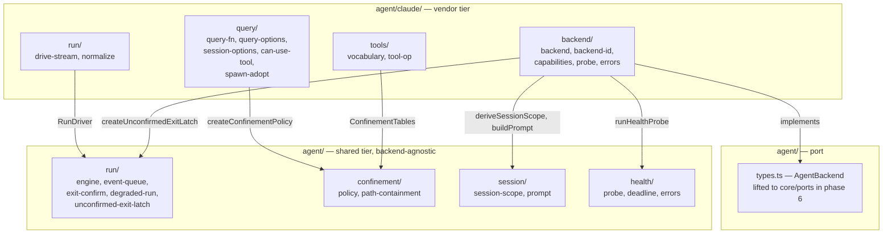

# `agent/` module restructure — design

Date: 2026-07-21
Branch: `phase-5-agent`
Status: approved, ready for an implementation plan

## Context

`agent/` landed in phase 5 as a working, well-tested module: 33 files, ~4300
lines, 143 passing tests, `tsc --noEmit` clean. It is correct but hard to read,
and the vendor tier carries a large amount of code that is not vendor-specific.
`@openai/codex-sdk` is already a dependency, so a second backend is planned
rather than hypothetical — every generic policy left inside `agent/claude/` is
code that backend would have to re-derive or copy.

Nothing outside `agent/` consumes it yet: `core`/kernel arrives in phase 6. That
makes this the cheapest possible moment to restructure — the only consumers are
the module's own tests.

## Problem

Four concrete defects, each verified against the source.

**1. `agent/claude/model/` is a flat bag of 11 unrelated files.** The project
already established the shape for a module this size: `host/` splits into
`protocol/`, `render/`, `session/`, `supervisor/`, each with its own `model/`,
`types.ts`, `index.ts`. `agent/claude` mixes run lifecycle, health probing, SDK
option building, normalization, process adoption, tool tables, ids and errors at
one level.

**2. `agent-run.ts` (447 lines) does four unrelated jobs in one closure.**
`createEventQueue` is a generic single-reader async queue. `pollUntilZero` plus
its `safe*` wrappers are a generic process-tree exit-confirmation poller. The
cancel ladder and terminal latch are vendor-neutral §6.5 policy over
`AbortController` + `ProcessTree`. Only `driveQuery` — roughly 60 lines — is
genuinely Claude-specific. The four are entangled through shared closure state
(`terminalKind`, `resolveOutcome`, `queue`).

**3. Real duplicated truth.**

- `DISALLOWED` (`query-fn.ts:22`) and `DENIED_TOOLS` (`tool-tables.ts:45`) are
  the same five tool names declared independently.
- `tool-op.ts` and `tool-tables.ts` each enumerate the Claude tool vocabulary
  separately, with two path-field lists that have drifted (`notebookPath` is in
  one, absent from the other).
- The `canUseTool` → policy adapter is copied verbatim into `query-fn.ts:59-62`
  and `health.ts:136-138`.
- The "terminate, then re-poll" escalation block appears twice in
  `agent-run.ts` — at `:281-290` (natural completion) and `:426-432` (cancel).
  Two independent copies of one §6.5 policy that can drift silently.

**4. Comments outweigh the algorithm.** `health.ts` is 176 comment lines of 326
(54%), `agent-run.ts` 161 of 447 (36%), `claude-backend.ts` 86 of 212 (40%). Much
of it is review archaeology — `finding [26] half b`, `finding [30]`, "previously
duplicated as a private const in both files" — history relative to code that no
longer exists, with no file anywhere that resolves a finding number.

## Scope decisions

**Depth: restructure + duplication cleanup.** Move and split code, extract the
shared tier, and collapse the duplications in problem 3. Do NOT reshape
`agent/types.ts` or the `AgentBackend` port: it is already designed for the
phase-6 lift into `core/ports/`, and changing it without the kernel that consumes
it would be guesswork.

**Comments: prune archaeology, preserve meaning.** Drop finding numbers and
references to superseded code. Rewrite the claim each such comment defended as a
present-tense invariant. Two categories stay verbatim:

- **contracts and invariants** — "`push`/`finish` never depend on a reader, so
  `outcome` settles even when nobody iterates `events`"; "a second concurrent
  iterator fails loudly instead of deadlocking"; "`close()` is idempotent".
- **documented divergences from the design** — the cancel-ladder rung 3 analysis
  (`agent-run.ts:371-405`) and the win32 drive-letter case normalization
  (`path-containment.ts:26-33`). CLAUDE.md mandates these live in code comments.

Rejected: moving the long rationale to `docs/`. It would break the code ↔ reason
link, which is the expensive, hard-won part.

**Layout: sub-modules on both tiers**, mirroring `host/`.

## Target structure



The dependency direction is strict: vendor depends on shared, never the reverse.
**The shared tier imports no vendor SDK type.** That is why `confinement/`
declares its own `PermissionResultLike` instead of the SDK's `PermissionResult`,
and why the `canUseTool` adapter is deduplicated inside the vendor tier rather
than lifted.

### Shared tier

```
agent/
  types.ts                        the port — unchanged
  index.ts                        public surface — unchanged
  run/
    model/event-queue.ts          createEventQueue
    model/exit-confirm.ts         confirmExit, escalateAndConfirm, safe* guards
    model/engine.ts               startAgentRun: latch, outcome, sink, cancel ladder
    model/degraded-run.ts         createDegradedRun, singleEventIterable
    model/unconfirmed-exit-latch.ts
    types.ts  index.ts            RunSink, RunDriver, NaturalOutcome, RunDeps
  confinement/
    model/policy.ts               createConfinementPolicy
    model/path-containment.ts     isInsideStaging
    types.ts  index.ts            ConfinementTables, PermissionResultLike
  session/
    model/session-scope.ts        deriveSessionScope
    model/prompt.ts               buildPrompt
    index.ts
  health/
    model/probe.ts                runHealthProbe
    model/deadline.ts             withProbeDeadline, defaultWait
    model/errors.ts               AgentHealthProbeError
    types.ts  index.ts            HealthProbeDeps, HealthProbeReader
```

`agent/model/` disappears entirely.

### Vendor tier

```
agent/claude/
  types.ts  index.ts              ClaudeQuery, ClaudeQueryFn, ClaudeBackendDeps
                                  + production wiring — surface unchanged
  query/
    model/query-fn.ts             createRealQueryFn
    model/query-options.ts        buildQueryOptions
    model/session-options.ts      planToSessionOptions
    model/can-use-tool.ts         createCanUseTool  [new — dedups two copies]
    model/spawn-adopt.ts          createSpawnAndAdopt
  run/
    model/drive-stream.ts         createClaudeDriver  [new — ~70 lines of 447]
    model/normalize.ts            normalizeMessage, deriveUsage
  tools/
    model/vocabulary.ts           CLAUDE_TOOLS + derived tables
    model/tool-op.ts              mapToolUse
  backend/
    model/backend.ts              createClaudeBackend
    model/backend-id.ts           CLAUDE_BACKEND_ID
    model/capabilities.ts         claudeCapabilities
    model/probe.ts                buildProbeOptions, classifyMessage, readUntilClassified
    model/errors.ts               ClaudeSdkError
```

11 flat vendor files become 4 coherent sub-modules; the shared tier grows from 4
files to 12 and gains the whole of the §6.5 policy, not just its primitives.

## Contracts

### Run engine

```ts
// agent/run/types.ts

/** The terminal outcome a vendor stream can produce on its own. `cancelled` and
 *  `unconfirmed-exit` are the engine's to decide; a driver never names them. */
export type NaturalOutcome =
  | { readonly kind: "completed"; readonly finalText: string
      readonly usage: TokenUsage | null; readonly sessionId: string }
  | { readonly kind: "backend-error"; readonly message: string
      readonly sessionId: string | null }

export interface RunSink {
  /** True once the run has a terminal owner — cancel won the race. The driver
   *  must stop reading and return. */
  isTerminal(): boolean
  /** Emit one normalized event. Never blocks and never depends on a reader:
   *  `outcome` settles even when nobody iterates `events`. */
  emit(event: AgentEvent): void
  /** Claim the natural outcome together with the run's last events. The engine
   *  latches, emits `finalEvents`, closes the stream, and only then runs
   *  exit confirmation. If the latch is already taken, both the outcome and the
   *  events are dropped — the late-event drop of turn-durability §6.4. */
  complete(outcome: NaturalOutcome, finalEvents?: readonly AgentEvent[]): void
}

export type RunDriver = (sink: RunSink) => Promise<void>

export interface RunDeps {
  readonly processTree: ProcessTree
  readonly abortController: AbortController
  readonly wait: (ms: number) => Promise<void>
  readonly confirmTimeoutMs?: number
}

export function startAgentRun(
  fence: TurnFence,
  driver: RunDriver,
  deps: RunDeps,
): { run: AgentRun; cancel: () => Promise<void> }
```

Three deliberate choices:

- **`complete` takes `finalEvents` rather than letting the driver emit them.**
  Today the ordering "latch → emit → finish" (`agent-run.ts:306-310`) rests on
  caller discipline; swapping two lines would leak the result's events past the
  stream close, where they vanish silently. Passing events with the outcome makes
  the ordering structural.
- **`complete` returns nothing.** Losing the latch race is a normal outcome, not
  a driver error — the driver simply returns afterwards. A boolean would force
  three identical `if (!sink.complete(...)) return` guards for no gain.
- **`RunDeps` no longer carries `queryFn`, `options` or `prompt`.** Today they sit
  in the engine's deps solely to be handed through to the SDK. The driver closes
  over them instead, and the engine never sees a vendor type.

**Throw handling.** The driver catches its own — it owns `ClaudeSdkError` and
knows `ClaudeQuery` is an uncontrolled boundary; today's `try/catch`
(`agent-run.ts:335`) moves into `drive-stream.ts` unchanged and finishes through
`complete({kind: "backend-error"}, [{kind: "error"}])`. The engine wraps the
driver call in its own `try/catch` **as a backstop only**: a leaked throw becomes
a generic `backend-error` so `outcome` settles instead of hanging forever. The
vendor error vocabulary stays in the vendor; the "outcome always settles"
guarantee stays in the engine.

**Cancel ladder.** No separate `cancel-ladder.ts`: the ladder needs the latch,
the queue and `resolveOutcome`, so extracting it would mean threading six
arguments. Instead `exit-confirm.ts` exports two operations — `confirmExit(tree,
wait, budgetMs)` and `escalateAndConfirm(tree, wait, budgetMs)` (terminate, then
re-poll) — and both the cancel ladder and the natural-completion path become
two-line compositions inside `engine.ts`. This collapses the duplicated
escalation block noted in problem 3.

### Health probe

```ts
// agent/health/types.ts

/** Reads a vendor probe stream until it classifies. Resolves null when the
 *  stream closed cleanly with no verdict. May reject; the wrapper converts. */
export type HealthProbeReader = () => Promise<AgentInfo | null>

export interface HealthProbeDeps {
  readonly abortController: AbortController
  readonly processTree: ProcessTree | null
  readonly wait?: (ms: number) => Promise<void>
  readonly deadlineMs?: number
}

export function runHealthProbe(
  backendId: string,
  read: HealthProbeReader,
  deps: HealthProbeDeps,
): Promise<AgentInfo>
```

`runHealthProbe` owns three generic concerns: the deadline with its abort and
late-rejection suppression, the unconditional process-tree close after the probe
settles, and — most importantly — the **classification policy for an
inconclusive probe**: an abort with no verdict is `not-logged-in`; a thrown error
matching `/ENOENT|not found|spawn/i` is `not-installed`; anything else, including
a clean close with no verdict, is `not-logged-in`. The invariant "never report
`ready` on ambiguity" is the most valuable thing in today's `health.ts` and must
not live in a vendor tier.

The vendor keeps what actually knows the SDK: `buildProbeOptions`,
`classifyMessage`, and `readUntilClassified` with both of its `IteratorClose`
defenses and `ProbeClassifiedAbortError`. Those are preserved verbatim —
they describe one vendor generator's concrete behavior.

`claudeCapabilities()` moves out of `health.ts` to `backend/model/capabilities.ts`;
a model catalog has nothing to do with probing.

### Backend-level unconfirmed-exit latch

```ts
// agent/run/model/unconfirmed-exit-latch.ts
export interface UnconfirmedExitLatch {
  isLatched(): boolean
  noteOutcome(outcome: AgentRunOutcome): void
}
export function createUnconfirmedExitLatch(backendId: string): UnconfirmedExitLatch
```

Pure §6.5 policy — "after an unconfirmed exit a backend is closed to new turns
until restart" — which a second backend must not re-derive. It is five lines of
logic carrying thirty lines of rationale; the rationale is the reason it gets its
own file, so it is stated once.

### Tool vocabulary

```ts
interface ClaudeTool {
  readonly name: string
  readonly op: AgentToolOp                                  // how the UI renders it
  readonly access: "path-confined" | "path-optional" | "denied"
}

const CLAUDE_TOOLS: readonly ClaudeTool[] = [
  { name: "Read",         op: "read",   access: "path-confined" },
  { name: "Write",        op: "edit",   access: "path-confined" },
  { name: "Edit",         op: "edit",   access: "path-confined" },
  { name: "MultiEdit",    op: "edit",   access: "path-confined" },  // inert in the installed SDK
  { name: "NotebookEdit", op: "edit",   access: "path-confined" },
  { name: "Glob",         op: "read",   access: "path-optional" },
  { name: "LS",           op: "read",   access: "path-optional" },  // inert in the installed SDK
  { name: "Grep",         op: "search", access: "path-optional" },
  { name: "Bash",         op: "run",    access: "denied" },
  { name: "BashOutput",   op: "run",    access: "denied" },
  { name: "KillShell",    op: "run",    access: "denied" },
  { name: "WebFetch",     op: "search", access: "denied" },
  { name: "WebSearch",    op: "search", access: "denied" },
]
```

`CLAUDE_CONFINEMENT_TABLES`, `CLAUDE_DISALLOWED_TOOLS` (today's separate
`DISALLOWED`) and the op-mapping table all derive from this one list. `op` and
`access` are deliberately orthogonal: a denied tool can still appear in a
`tool_use` block before the veto fires, and the UI must render it.

**`PATH_FIELDS` and `TARGET_FIELDS` stay two separate lists.** This looks like
duplication and is not: confinement must inspect only genuine path fields, while
`TARGET_FIELDS` additionally carries `command`, `pattern` and `url`. Feeding
those to confinement would make a Bash command string be treated as a path.
They live adjacent in `vocabulary.ts` with an explicit comment and the relation
`TARGET_FIELDS = [...PATH_FIELDS, "command", "pattern", "url"]`, which also fixes
today's `notebookPath` drift.

## Naming

Factories use the `create` prefix. The two `make*` stragglers in this module are
renamed as part of the files they live in: `makeConfinementPolicy` →
`createConfinementPolicy`, `makeSpawnAndAdopt` → `createSpawnAndAdopt`. The new
adapter is `createCanUseTool`.

## Behavior delta

Exactly one observable change, approved:

`BashOutput` and `KillShell` are absent from today's `OP_BY_TOOL` and therefore
render as `other`. In the unified vocabulary they carry `op: "run"`. Visible only
in how the UI labels the event. Treated as closing a gap, not as a behavior
change — and it is the only place in this restructure where output differs.

## Error handling

errore conventions are unchanged: errors as values, `instanceof Error` with early
return, everything not propagated is logged.

- The engine's driver backstop is the only new `catch`. Justified as an
  uncontrolled-boundary adapter (errore rule 12) and logged (rule 21).
- Vendor stream boundaries stay raw `try/catch` rather than `errore.try`: the
  source is a vendor async generator, and `errore.try` is for sync boundaries.
  Today's decision, carried over with its rationale.
- `ClaudeSdkError` drops `ABORTED` and `RESULT_ERROR`. Neither has a construction
  site anywhere in `src/`; `STREAM_FAILED` covers both. The constructor override
  narrowing `$code` to `AgentErrorCode` stays — it turns a typo into a compile
  error.

## Testing

The existing suite is the oracle: **143 tests, 278 `expect()` calls, 14 files,
`tsc --noEmit` clean** at baseline. The refactor preserves behavior, so no
assertion may be deleted — each moves to the file owning its subject. If an
assertion becomes inexpressible after a split, that is evidence the split is
wrong: stop and reconsider rather than weaken the test.

The split improves isolation measurably:

- `agent-run.test.ts` (567 lines) currently drives every engine-level assertion —
  latch races, cancel ladder, exit-confirm polling, queue single-reader —
  through a scripted `queryFn` yielding `SDKMessage`s. Engine tests instead take a
  **fake driver**, a plain `async (sink) => {…}`, with no SDK involvement.
- `drive-stream.test.ts` takes a **fake sink** recording `emit`/`complete` and a
  scripted `ClaudeQuery`: no process tree, no timers, no `AbortController`.
- `runHealthProbe` is tested through a fake reader — the classification table is
  verified without a single SDK message.

Three test groups the split newly requires:

1. **`RunSink` contract:** `complete` on a taken latch drops both the outcome and
   `finalEvents`; `emit` after terminal is dropped; a throwing driver becomes a
   `backend-error` rather than a permanently pending `outcome`.
2. **Tool-vocabulary regression:** the derived `CLAUDE_DISALLOWED_TOOLS` and
   `CLAUDE_CONFINEMENT_TABLES` equal today's literals. Written **before** the old
   tables are deleted — otherwise the dedup has nothing to check against.
3. **`escalateAndConfirm` equivalence** with both of today's copies of the
   terminate-then-re-poll block.

## Work order

One commit per step, suite green at each:

1. shared `run/`: `event-queue`, `exit-confirm` — pure moves, no contract change
2. `engine.ts` + `RunSink`/`RunDriver` + `claude/run/drive-stream.ts` — the main surgery
3. health split
4. tool-vocabulary unification (regression test first)
5. backend assembly: `degraded-run`, latch, `capabilities`
6. remaining folder moves, alias import sweep, `make*` → `create*` renames
7. **comment pass — separate and last**

Step 7 is isolated on purpose: a reviewer reads the structural diff without four
hundred lines of prose, and the prose without structural churn. Merging them
makes both unreadable.

## Verification

Per step: `bun test src/agent` green, `expect()` count not decreasing from the
143/278 baseline. Final: full `bun test` plus `bunx tsc --noEmit`.

## Documentation

CLAUDE.md requires `docs/architecture/` to be updated in the same branch. Agent
paths appear in six documents: `code-structure.md` (a per-file list of `agent/`
at lines ~281-312 — guaranteed to go stale), `modules.md`, `overview.md`, and the
flows `chats.md`, `generation-turn.md`, `launch.md`. Plan documents under
`docs/superpowers/plans/` are a historical record and are not touched.

## Non-goals

- Reshaping `agent/types.ts` or the `AgentBackend` port.
- Introducing Reatom anywhere in `agent/`. The module is a non-Reatom injected
  adapter by design (CLAUDE.md); run and process lifetimes are owned explicitly.
- Building any part of the Codex backend. This restructure only makes room.

## Follow-ups

- `describeThrown` — the same one-line expression appears in `agent/` twice,
  `gate/model/type-check.ts` twice and `host/supervisor/model/transport.ts` once.
  Its real home is `infrastructure/`, and deduplicating it repo-wide is its own
  task. Threading a cross-sub-module edge between `run/` and `health/` for one
  line would be negative value, so within `agent/` it stays duplicated.
