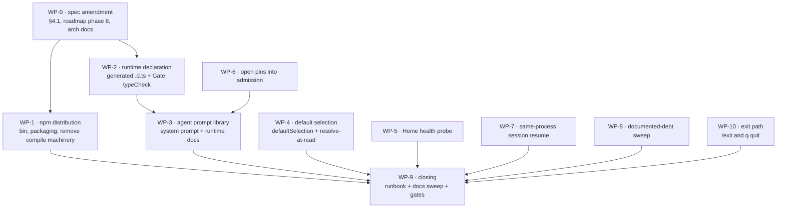

# MVP Phase 8 — Composition, Distribution, and Acceptance Readiness

> Design document (spec). The executable plan is written from this document with
> superpowers:writing-plans and lives in `docs/superpowers/plans/`.

## 1. Goal

Close everything between `main` at `8bbc9a5` and "the MVP is assembled and ready
for acceptance". That is the remainder of roadmap phase 8 plus every blocker,
wiring gap, and documented debt item that stands between the current tree and the
§11 success criteria of `2026-07-13-termcraft-design.md`.

The §11 walkthrough itself is **not** an exit criterion — it needs a human, a live
Claude CLI, and real money. This phase ends at "ready to run it", with a written
runbook. The walkthrough and whatever it uncovers are a separate cycle.

## 2. Distribution decision — npm, not a compiled binary

This phase **amends master spec §4.1**. That section currently reads:

> One `bun build --compile` binary ships the shell, the design host entry, and the
> embedded `@termcraft/runtime`; its Reatom, React, and OpenTUI implementation stays
> private — the user's project folder never grows a `package.json`. OpenTUI's native
> core ships inside that binary. The TypeScript compiler does not: … it and its lib
> files are embedded, extracted once to a per-user directory on first use, and run as
> a subprocess — which also makes the build per-platform.

MVP ships as an npm package run under Bun instead. The rationale:

- **The property §4.1 is protecting survives.** "The user's project folder never
  grows a `package.json`" is about the design project, not about how termcraft
  itself is installed. Pages resolve `@termcraft/runtime` through the running
  process's `Bun.plugin` resolver (`src/host/session/model/resolver.ts`), which
  works identically for a globally installed package.
- **npm solves for free what §4.1 builds by hand.** The per-platform `typescript@7`
  executable, OpenTUI's native core, and the bare `react` specifier are all ordinary
  on-disk dependencies under npm. The embedding, the per-user extraction, the
  `askedButNotEmbedded === []` cross-check, and the per-platform build matrix all
  exist only to work around their absence in a compiled graph.
- **It removes the phase's single highest-risk item.** The compiled binary currently
  fails from a bare directory with `Cannot find package 'react'` on all three argv
  paths, because `@opentui/react` ships pre-built `// @bun` chunks whose bare
  peer-dependency `react` edges never enter the embedded graph. Under npm that
  failure mode does not exist.
- **It forecloses nothing.** Module boundaries stay extractable per
  `docs/architecture/code-structure.md`; compilation can return after MVP.

The cost is one requirement: **the user must have Bun ≥ 1.3.14 installed.** The
application is Bun-native — `bun:ffi` for the Windows durability, lease, reparse,
and Job Object primitives; `Bun.plugin` for module resolution; in-process TSX
transpilation for the design host. A Node launcher cannot paper over that.

Spike C (tsc extraction, lib cross-check, per-platform builds) and Spike E
(`process.execPath` self-spawn inside a compiled binary) remain factually correct.
Their conclusions simply stop applying to MVP distribution. Both findings documents
stay; the phase records that they are dormant, not wrong.

### 2.1 A later move to Node is possible and is orthogonal to this

Recorded so the decision is not re-litigated from memory. Migrating off Bun is a
multi-week project whose cost is concentrated in three places, none of which this
decision touches:

- `bun:ffi` in four modules — `infrastructure/durability/model/kernel32.ts`,
  `infrastructure/fs-guard/model/kernel32.ts`,
  `infrastructure/process/model/job-object.ts`, `src/store/lease/model/lease.ts`.
- In-process TSX transpilation on dynamic `import()`, which the design host depends
  on, plus the `Bun.plugin` resolver. Both collapse into one Node module-customization
  hook.
- 323 test files on `bun:test`.

The mitigating fact is that nearly all Bun usage already sits behind injected seams
(`SpawnCommand`/`SpawnedChild`, `StagingFsDeps.durableWrite`/`flushDir`,
`ProcessTreeFactory`, `windowsLeaseLockApi`), so a migration writes second adapters
rather than rewriting domain logic. Choosing npm today makes such a migration
cheaper, because the `bun build --compile` machinery would have to be discarded
either way — Node's SEA is a different mechanism entirely.

## 3. Exit criteria

1. All gates green: `bun test`, `bun x tsc --noEmit`, `oxlint`, `oxfmt --check`,
   `git diff --check`.
2. A globally installed termcraft starts from an empty directory on all three argv
   paths — interactive, `_host --stdio`, and the headless `export` CLI.
3. The composed application starts a real turn with no manual seeding step.
4. The Gate runs its TypeScript check in the shipped configuration.
5. Home renders a real agent-health reading, and `r` re-runs the same probe.
6. Currently open pins reach admission and the agent's prompt.
7. A second turn in a live session resumes rather than starting fresh (see WP-7 for
   the deliberate limit).
8. Every tier-3 debt item is either closed or explicitly re-documented as post-MVP
   with a stated reason.
9. The `docs/architecture/` Source-anchor sweep is re-run.
10. A step-by-step §11 runbook exists for both dev mode and a globally installed
    package.

## 4. Out of scope

The roadmap's MVP out-of-scope list stands unchanged: the Codex backend, the
`/model` picker UI, Git history and `/commit-*`, interactive preview mode, the
Tweaks panel, the remaining component catalog, light theme, the preview controls
popup, the first-run wizard, chat rename/deletion, keyboard element selection, and
daemon/IPC.

Publishing to the npm registry is out of scope. This phase makes the package
installable and verifiable locally; whether and when to publish is a separate
decision.

## 5. Work package map



The larger packages — WP-3 in particular — are expected to get their own
just-in-time sub-plans, as the gap closeout did for kernel assembly, the adapter
ring, UI completion, chat transport, and export completeness.

WP-0 goes first because every other package writes code against a spec that
currently says the opposite. WP-2 precedes WP-3 because the agent brief embeds the
generated declaration. WP-6 and WP-3 share `AgentPromptContextV1` and are planned
together. Everything else is independent.

## 6. Work packages

### WP-0 — Amend the specs

Rewrite master spec §4.1's distribution paragraph per §2 above. Update roadmap
phase 8 (`2026-07-17-termcraft-mvp-roadmap.md:237-250`) to drop `bun build
--compile`, the embedded lib cross-check, and per-platform builds, and to name npm
distribution instead. Update the `docs/architecture/` documents that describe
embedding or the compiled binary. Record Spike C and Spike E as dormant-not-wrong.

### WP-1 — npm distribution

`package.json` gains a `bin` entry, a `files` list, and a real version; `private:
true` is removed. How Bun handles a `bin` target that is a `.tsx` file — shebang or
otherwise — must be **verified against the installed Bun**, not assumed.

`_host` spawning keeps only the branch that already works in dev: the installed
entry run through Bun. The compiled-binary branch in
`src/host/supervisor/model/spawn-command.ts` is removed.

The compile machinery is **deleted**, not left dormant: `scripts/embed-assets.ts`,
`scripts/lib-cross-check.ts`, `scripts/gen-tsc-libs.ts`, the generated
`scripts/tsc-libs.generated.ts`, `src/gate/model/tsc-extract.ts`'s
`materializeCompiler` extraction path, and the `build`/`build:check` scripts. Dead
code with passing tests attached is worse than absent code: it drifts, it gets
repaired during unrelated refactors, and it misrepresents what the system is. Git
history recovers it if compilation returns.

The Gate's compiler path becomes a resolution against `node_modules` rather than an
extraction from embedded assets. One thing the plan must **verify rather than
assume**: Spike C established that the Go compiler reads its lib chain off disk
itself rather than through the virtual filesystem, and that chain moves from "next
to the executable" to the installed TypeScript package layout. If the compiler needs
an explicit path to it, that path is configuration the Gate supplies — not a reason
to keep embedding.

Acceptance oracle: install the package globally and run it from a freshly created
empty directory on all three argv paths.

### WP-2 — Runtime declaration and the Gate's type check

`scripts/gen-runtime-dts.ts` emits the ambient `@termcraft/runtime` declaration from
the real `src/runtime/index.ts` and writes it as a string constant under
`src/runtime/generated/`, following the convention `scripts/tsc-libs.generated.ts`
already established. `runtime` stays a leaf — the generated module imports nothing.
A drift test compares the committed artifact against a fresh emit, so a runtime
change that was not regenerated fails the gates rather than the walkthrough.

The composition root wires `typeCheck` into `createGateRunnerAdapter`, supplying the
compiler path and the generated declaration. The three "phase 8 will…" comments at
`src/gate/adapters/gate-runner.ts:51-53`, `src/gate/model/type-check.ts:14-22`, and
`src/gate/model/tsc-extract.ts:10` are replaced by the wiring they describe.

Acceptance: the Gate catches a deliberate type error on a fixture page against the
real generated declaration, in the shipped configuration.

### WP-3 — Agent prompt library and runtime docs

The problem: `src/core/kernel/model/handlers/turn.ts:534` sends a one-line
`TURN_START_SYSTEM_PROMPT_PLACEHOLDER` straight to the SDK
(`src/agent/claude/query/model/query-options.ts:31`), and `runtimeDocs: []` at
`turn.ts:116` leaves the turn workspace with no description of the API the agent is
supposed to use. Master spec §6.1 requires the prompt to carry the role, the
design-code rules of §5.8, the page order, source metadata, the active page,
outstanding diagnostics, the selection, open pins, and answer-style guidance, and
§5 states explicitly that the slug mask is stated in the system prompt. A live
Claude given the current placeholder cannot be expected to produce a page the Gate
accepts.

`core` declares the port, `agent` implements it:

```ts
interface AgentPromptSource {
  systemPrompt(context: AgentPromptContextV1): string;
  runtimeDocs(): readonly StagingRuntimeDocV1[];
}
```

`AgentPromptContextV1` carries only what `core` honestly holds: the active page
slug, the portable page order, the kit API version, and the resolved open pins from
WP-6. Nothing is invented to fill it.

The prose lives in `agent/prompt/` per the module folder shape: role, the §5.8
design-code rules, the slug mask verbatim from the roadmap's global constraints, the
single permitted import, the ban on timers and randomness outside explicit
animation, the page-file layout, and answer-style guidance (short, in the
markdown-lite subset of §3.2, because the chat renders nothing else).

The runtime docs staged into the turn workspace are the WP-2 declaration plus a
short authoring guide. Under npm these are ordinary files inside the installed
package, so the port returns paths into it — no startup staging step.

Retry feedback is already wired and is not part of this package:
`src/core/turns/model/run-turn.ts:211-212,291,314-318` replaces `userMessage` on a
retry with the original text plus the previous attempt's folded Gate diagnostics.

Acceptance: a contract test asserts the composed system prompt names the slug mask,
the single permitted import, and the answer-style rule; the smoke test asserts the
runtime docs are physically present in the turn workspace.

### WP-4 — Default agent selection

`BackendCapabilities` gains `defaultSelection: { model, effort }`, and
`claudeCapabilities()` (`src/agent/claude/backend/model/capabilities.ts:6-21`)
declares `claude-sonnet-5` at `high`. The default belongs beside the catalog, not in
the composition root, which must not own domain knowledge.

`resolveAgentSelection` (`src/core/kernel/model/handlers/turn.ts:356-361`) falls back
to that default when workspace state carries no triple. Nothing is written to disk:
`workspace.local.toml` stays empty until a real picker exists, and `model.select`'s
validate-and-persist behavior is unchanged. Writing a default at `project.create`
would still need this fallback for projects created earlier, which makes it strictly
additional work.

Consequence for the UI: Home's combo currently renders `effort` as a static literal
with a comment stating no source exists (`src/ui/app/ui/App.tsx:32-34`). A source now
exists, so the literal and its divergence note are replaced by the real reading.

### WP-5 — Real Home health probe

The composition root builds the probe from
`AgentRegistry.get(CLAUDE_BACKEND_ID).healthCheck()` and passes it through
`createUiRoot` into `createUiDeps`'s fourth parameter, which already exists and is
already covered (`src/ui/app/model/deps.test.ts:176-200`). Today
`src/entrypoint/model/run-app.ts:47` omits it, so Home always renders
`DEFAULT_HOME_HEALTH` and `r` re-runs a placeholder.

Design gap to record rather than paper over: the error panel hardcodes
"✗ {agent} CLI not found" (`src/ui/home/ui/Home.tsx:141-146`), while the probe
distinguishes three outcomes — CLI absent, CLI present but not logged in, and an
inconclusive probe. `design/01-home.dc.html`'s `homeErr()` mocks only the first. The
same panel renders the other two with honest detail text, and the divergence is
documented in code per the CLAUDE.md design rule.

### WP-6 — Open pins into admission

kernel-command-contract §12.2 item 1 assigns the capture to the Kernel: "`turn.start`
captures `chatId`, authoritative selection, and only currently open, resolvable pins.
The UI sends message text; it neither selects persisted pin ids nor writes chat/pin
storage." The port already exists — `PinReader.fold(pageSlug)`
(`src/core/ports/pin-store.ts:31-32`) returns the folded projection with statuses — so
`candidatePins` and `readSet.pins` are populated from the active page's open pins, and
`resolveOpenPins` (`src/core/turns/model/admission.ts:137`) re-checks them as it
already does. No payload change and no new port.

### WP-7 — Same-process session resume

The limit comes first, because it changes the goal.
`deriveSessionScope` (`src/agent/session/model/session-scope.ts:26-32`) substitutes
`UNRESUMABLE_ACCOUNT` when `account` is null — stable within one process, different
across restarts. The Claude probe returns exactly that (`account: null`) because the
installed SDK's `SDKSystemMessage` carries no field that could honestly fill it
(`src/agent/claude/backend/model/probe.ts:102-106`). This is storage-identity §6.2's
deliberate design, not a gap.

**Therefore cross-restart resume is unreachable for Claude and the plan must not
chase it.** What is reachable is resume within one process: the second and later
turns of a live session.

What blocks even that: `workspaceIdentity` exists only as a payload fact on
`project.create` and `project.setTrust` (`src/core/kernel/model/handlers/turn.ts:129-138`),
while the ordinary relaunch path is `project.open`, where `core` never sees it. It is
persisted into `workspace.local.toml` through the existing `setWorkspaceLocal` generic
patch (`src/store/types.ts:348-349`) and read back at open. That file is machine-local,
which is precisely where a machine identity belongs; the portable project format and
the export package are untouched. Adding the field to `project.open`'s payload would be
cheaper but would make the Kernel depend on the UI re-telling it a fact that is already
on disk.

The "session resume fresh-only" follow-up is therefore closed **partially**, and the
spec says so plainly.

### WP-8 — Documented-debt sweep

Each item is either closed or re-documented as post-MVP with a one-line reason:

1. `export.failed` for pre-capture failures — widen `EXPORT_PHASES_V1` with a
   pre-capture phase rather than adding an event kind. A new kind carries the full
   §8.2 obligation set: protocol-schema change, guard, capability mapping,
   transition-table entry, and contract tests.
2. Staging candidate-directory leak — add `retireCandidate` to the `StagingService`
   port and call it at finalize and terminalize.
3. Gate diagnostics `file` field — thread a dedicated source path through
   `src/core/turns/model/validation.ts` so `fileName` stops doubling as one.
4. Generic `turn.failed` — a typed outcome instead of the catch-all.
5. `acknowledgeDisplay` → `FrameAcknowledgeNotWiredError` — finish the wiring.
6. `migration.*` handlers returning `notYetImplemented` — expected to be
   re-documented as post-MVP: MVP has exactly one format version, so there is
   nothing to migrate from, and migrations written without a second version are
   untestable.
7. `activePageSlug`/`activeChatId` in the snapshot are not live for late
   subscribers.

Explicitly excluded from this list: the `rtk init -g` hook from the previous
handoff's follow-ups. It is a chore in the developer's own tooling, not termcraft
code.

### WP-10 — Exit path

Today nothing in `src/` implements quitting — the only exit is SIGINT/SIGTERM
(`src/entrypoint/model/run-app.ts:82`).

The design specifies `q quit` in exactly three places: the Home status bar
(`design/termcraft-engine.js:145`), the agent-missing panel (`:583`), and the
too-small-terminal screen (`:622`). Its slash-command registry (`:779-786`) holds
seven commands and no `/exit`. The Workspace status bar (`wsStatus`) shows no quit
affordance at all.

Decisions, all recorded as deliberate:

- `q quit` is implemented where the design places it **and** where no text input is
  focused: the agent-missing panel and the too-small screen. Home's missing status
  bars are added, since that is where the hint belongs.
- `/exit` is added to the command registry as the universal quit, reachable from the
  Workspace composer and the Home prompt (master spec §3.9 permits the slash menu in
  both). This extends the design's registry; it is a product decision, dated, not a
  silent invention.
- On idle Home the status-bar hint reads `/exit`, not `q quit`, and the divergence is
  documented in code. The design's own frame shows a focused prompt with a blinking
  cursor, so `q` must type. The alternative — "`q` quits while the prompt is empty" —
  would eject a user who began typing "quick dashboard".
- Exiting during a running turn cancels the turn and waits for confirmed process-tree
  exit before releasing the lease, per master spec §9. Killing the process without
  that leaves an orphaned agent CLI and a held lease.

Mechanically: one action-registry entry with `execution: { kind: "local", effect:
"exit" }` and `capability: null`; a `UiDeps.requestExit` the composition root binds to
`RunningApp.close()`; keymap entries for `q` on the two input-free screens.

### WP-9 — Closing

The §11 runbook, written for both dev mode and a globally installed package. The
`docs/architecture/` Source-anchor sweep, re-run. Final gates.

## 7. Cross-cutting constraints

**Acceptance oracles must exercise the shipped artifact in the shipped mode.** This
is promoted to a phase constraint because of a concrete failure: WP-11 of the gap
closeout passed its acceptance with `node_modules` present beside the executable,
and the §11 walkthrough still could not start. Under npm this means verifying a
globally installed package launched from an empty directory, never `bun run
src/main.tsx` from the repository checkout.

**Honest values only.** The repository's standing discipline applies unchanged: a
value that has no source is an explicit, documented placeholder or an honest empty,
never a fabrication dressed as real. This phase removes placeholders by giving them
sources; where a source genuinely cannot exist — WP-7's cross-restart resume — the
limit is stated rather than faked.

**The global constraints of the roadmap are inherited in full**, including errore,
the Reatom v1001 rules, the module DAG, the module folder shape, and English for all
code, comments, commits, and documents.

## 8. Documentation obligations

Beyond WP-0's amendments: every package that lands code moves the affected
`docs/architecture/` Source anchors, and WP-9 re-runs the whole sweep. The removal of
the compile machinery must be reflected wherever the architecture documents describe
embedding, extraction, or the compiled binary.
