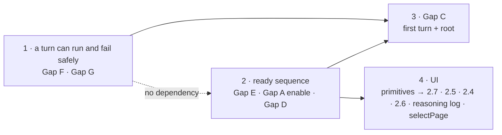

# MVP blocker fix bundle — design

Eleven defects stand between the current build and an MVP that can pass the §11 acceptance
walkthrough. They were found in a live end-to-end session on `phase-8` — and two of them by a
real turn driven headlessly while this spec was being written — and are recorded, with evidence,
in [`docs/mvp-remaining-work.md`](../../mvp-remaining-work.md). This spec fixes all eleven as one
coordinated change, because three of them edit the same function and two of them are ordered by a
real safety dependency rather than by preference.

Two written authorities are amended by this work — see [Spec amendments](#spec-amendments).
Both are named where they bite.

## Scope

**In:** Gap A (preview never renders), Gap C (Enter on Home does not start the first turn),
Gap D (an existing project still opens on Home), Gap E (the chat list shows one chat while
three exist), Gap F (one rejected admission bricks the turn machine), **Gap G (a project with
any page can never run another turn)**, finding §2.4 (no slash menu on Home), finding §2.5 (the
composer is frozen for the whole turn), finding §2.6 (the cursor renders after the placeholder),
finding §2.7 (Home shows no model for up to 20 seconds and claims "agent ready" before
checking), and **the agent's reasoning becoming an ordered log rather than a one-line ticker**.
Plus the two shared UI primitives the updated design system requires, and the two spec
amendments.

**Added after this spec was first written**, both on 2026-07-26: Gap G was found by running a
real turn through a temporary headless driver, and the reasoning log came out of the same run —
it is folded in here rather than deferred because it edits `ui/mirror` and `AgentStatusBlock`,
the same two files findings §2.5 and §2.7 already open in stage 4.

**Out:** everything in `docs/mvp-remaining-work.md` §4, and the §6 instrumentation decisions.
`console.*` observability (finding §3.1) is confirmed but not fixed here — it is a repo-wide
dependency question, and every item below is diagnosable without it once terminal events
actually publish.

**Reference convention.** This document has its own numbered sections. A reference written
`finding §N` points at `docs/mvp-remaining-work.md`; a bare `§N` points inside this spec.
Kernel-command-contract and storage-identity sections are always named with their document.

## Sequencing

Four stages. The order is set by two dependencies; everything else may proceed in parallel.

1. **A turn can run, and can fail safely** — Gap F (the admission-failure path) and Gap G (the
   canonical page path). Independent of each other in code, inseparable in effect: Gap G is what
   makes admission fail on every real project, and Gap F is what turns that failure into a
   permanently stranded machine.
2. **The ready sequence** — Gap E's listing call, Gap A's `enable`, Gap D's predicate: one pass
   over `runProjectReadySequence`. Two adjacent changes ride along in the same stage because
   they belong to the same items — Gap A's handler re-pointing (§2.3) and the gitignore rule
   (§2.5) — though neither is inside that function.
3. **First turn and composition root** — Gap C, the open-vs-create discriminator, the
   synchronous agent selection.
4. **UI** — the two shared primitives first, then findings §2.7, §2.5, §2.4, §2.6, the reasoning
   log (§4.6), and Gap A's `preview.selectPage` dispatch.

**Why Gap F precedes Gap C.** Gap C makes a turn the first action a new user takes. Today,
reaching the `admitting` hang requires getting to the Workspace and sending something; after
Gap C it happens on the first Enter on Home. Shipping Gap C first would convert a rare way to
brick the application into the default one, reached before the user has done anything else.
This is not a convenience ordering — the reverse order makes the intermediate build worse than
the current one.

**Why stage 2 is one pass.** `runProjectReadySequence` receives three independent edits: the
`kernel.preview.enable` transition, the chat-listing call that populates `chat.changed.added`,
and the pages-or-chats predicate feeding launch routing. Split across stages, that is three
re-readings and three re-tests of one sequence, each renegotiating the order of steps inside it.

---

## 1. A turn can neither run nor fail safely — Gap F and Gap G

Two defects, one stage. Gap G (§1.7) is why admission fails on any project that has ever
produced a page; Gap F (§1.1–§1.6) is why that failure strands the turn machine for the life of
the process instead of surfacing. Either alone is serious; together they are the whole observed
behaviour — one good turn on a fresh project, then an application that silently refuses
everything.

### Gap F — the admission-failure path

**The defect.** `runAdmission` applies `beginAdmission` (`idle → admitting`) before any of the
work that can fail, and every failure path returns without an inverse transition. The
transition table offers none: `admitting` has exactly two outgoing edges, `finishAdmission` and
`requestCancel`. The handler does not compensate — the `admission-rejected` branch logs and
returns an empty event list. The machine stays in `admitting` for the life of the process. The
one escape, `requestCancel`, needs a `turnId` the Kernel does not have, because the id is
minted inside `runAdmission` and only reaches `activeTurnIdAtom` when the first
`turn.attemptStarted` publishes — which a rejected admission never does. A live log shows the
machine sitting in `admitting` for 15 minutes 28 seconds with the user still typing.

### 1.1 Transition table

`beginTerminalization` gains one row: `{ from: "admitting", to: "terminalizing" }`. An existing
action, one new source phase, no new vocabulary.

### 1.2 The turnId moves to the transition

`turn.start`'s handler performs three steps synchronously, before `launchOperation`: mint the
`turnId`, apply `beginAdmission`, call `setActiveTurnId`. `runAdmission` no longer applies
`beginAdmission` itself and receives the id through `AdmissionInputV1`.

The precedent is exact: `beginProjectOpen` (`core/kernel/model/handlers/project.ts`) applies its
transition synchronously in the handler, mints its `operationId` beside it, and only then calls
`launchOperation`.

Minting in the handler while leaving `beginAdmission` inside `runAdmission` is **not**
acceptable: `setActiveTurnId` would land before the machine leaves `idle`, producing the
mirror-image invariant break. The invariant rests on the three steps being atomic — no `await`
between them — not on where they run.

### 1.3 The rejection path reuses the existing terminalize path

On `admission-rejected` the handler applies `beginTerminalization` and calls the existing
`terminalizeTurn`, which applies `finishTerminalization`, writes a durable `system:error` chat
record, and applies `settle` back to `idle`. No separate path for a failed admission exists.

`turnTransactions.terminalize` builds and appends its **own** record from the input; it does not
depend on the turn's user record having committed. A rejected admission therefore leaves a
durable trace in chat, matching what the orphan-turn scan already writes on restart.

### 1.4 A terminal event replaces the empty list

The operation returns a real `turn.failed`. The cause is already in the value and is currently
discarded: `AdmissionOutcomeV1`'s `blocked` variants carry `phase`
(`admit` | `chat-append-base` | `workspace` | `read-set` | `fence`) plus the failure itself. The
event, the chat record and the trace all name the real cause.

The revision desync fixes itself as a consequence: `applyTransition` advances the revision
before publishing, so an accepted command that publishes nothing desynchronises every
subscriber by construction. Once the event publishes, the `STALE_REVISION` rejection on the
next `turn.start` disappears without a separate fix.

### 1.5 The mirror-image window

`setActiveTurnId(null)` currently runs after `runTurn` resolves — by which time the machine has
already settled to `idle` and done its post-settle disk work. That leaves `phase === "idle"`
with a non-null `activeTurnId`, a window in which a new `turn.start` passes the guard and the
old handler then clears the **new** turn's id. The clear moves to where the machine settles.

### 1.6 Extracted entry point

The synchronous trio plus the operation launch become one function — call it
`beginTurn(context, { text, … })` — used by both `turn.start`'s handler and (§3.1) the ready
sequence. "One path" is then literal rather than aspirational.

### 1.7 Gap G — the canonical page path

**The defect.** `handlers/turn.ts:782` resolves each page's canonical source as
`${context.deps.projectStore.root}/${pageFileRelPath(pageSlug)}`. `pageFileRelPath`
(`turn.ts:408-410`) returns `pages/<slug>.tsx` — the **agent workspace's** flat layout, not
canonical storage, which is `<root>/.termcraft/pages/<slug>/page.tsx`. Admission therefore fails
its `workspace` phase with `PERSISTENCE_FAILED` / ENOENT for every page the project owns.

The same helper is correct three lines later, at `:917`, `:926` and `:927`, where it is resolved
against `candidate.root` — a staged workspace, where the flat shape is exactly right. One helper,
two namespaces, one of them wrong. `store/safe-fs/model/limits.ts:134-135` already warns about
precisely this distinction in prose.

**Why it presents as "it worked once."** `stageAllFiles`
(`store/sandbox/model/staging-store.ts:267`) copies pages only when `pages.length > 0`. A new
project has none, so its first turn admits cleanly and creates a page; every turn after that has
one and dies. Reproduced both ways on 2026-07-26 — `examples/clock` (one page) fails, a fresh
empty directory runs a full turn.

**The fix** resolves the canonical path through canonical storage's own convention rather than
the workspace helper. Both call sites should name which namespace they mean, so the next reader
cannot repeat the substitution — the helper's current name says neither.

**Testing.** A test that stages a workspace for a project with at least one page on disk and
asserts the source is found. Today's coverage cannot catch this: it either stages zero pages or
supplies paths directly, so the one construction that matters is never exercised against a real
canonical layout.

---

## 2. The ready sequence

### 2.1 Gap E — chat listing

`ChatStore` (`store`) gains `list()`; the adapter implements it over the existing
`safeFs.list("chats")` primitive plus per-file header decoding — the same material
`scanOrphanTurns` already walks and discards. `ChatReader` (`core/ports`) exposes it.
`runProjectReadySequence` calls it and populates `chat.changed.added`.

**Read direction is the point.** A chat's display name is the first line of its first `user`
record — by definition at the start of the file, since it is the first turn. Reading forward
stops within the first few lines. This is the opposite of `resolveChatDisplayName`, which walks
`loadBefore` backwards from the tail to the beginning and is the most likely cause of the
observed empty list on a long history. With `list()` supplying names, that backward walk is no
longer needed at all; `loadTail` remains only for the scrollback.

**Independent sources.** Today one failure kills both events — `restoreActiveChatTail` returns
`[]`, leaving the UI with neither a chat list nor history. After the split, `chat.changed` is
fed by the listing and `chat.records` by the tail, independently. A tail failure costs the
scrollback, not the whole list.

**Failure of `list()` itself** degrades to today's behaviour: restore the active chat, one row,
logged. No "the chat directory could not be read" event is invented here; that is the same
class as §2.1 of the findings document and belongs with the observability work.

### 2.2 Gap A — enabling preview

After trust resolves, when it is `trusted`, apply `kernel.preview.enable`. The same call runs
when a later `project.setTrust` grants trust, so it is factored as one shared helper rather than
two copies. An untrusted project stays `disabled` — that is the meaning of the state, since
preview executes design code.

This is not a design decision: kernel-command-contract §7.6's table already fixes the
precondition as *"Requires trusted project and completed project recovery"* — exactly what this
sequence establishes. There is no `preview.enable` command kind to add, no dispatcher, and no
UI decision. Placement: after trust, before `finishOpen`, so the snapshot the UI sees at ready
already carries preview enabled.

### 2.3 Gap A — the rest of the wiring

`preview-export.ts` stops driving `context.machines.preview` directly and calls the already
composed `context.previewSessionCommands`. That router implements every blocked kind —
`selectPage`, `selectCurrent`, `selectHistorical`, `resize`, `setMode`, `setThemeCapabilities`,
`retry`, `close`, `queryGeometry` — plus `publishFrame`/`acknowledgeDisplay`, is built once in
`kernel.ts` over the real machine, frame broker, both token ledgers and the backpressure policy,
and carries a 743-line test file. It has never been called by a wired handler.

`blockedBySessionReadback`'s justification ("`HandlerContext` provides no way to read either
back") is stale: `HandlerContext.currentPreviewSession` exists and is wired to the real
`activePreview` closure. The backstop is retired.

### 2.4 Gap D — launch routing

The composition root keeps what `openOrCreateProject` already knows — whether it opened or
created — and exposes it on the shell beside `env` and `agentRegistry`. An existing project
holding at least one page or one chat dispatches `project.open` at startup and lands in the
Workspace; anything else shows Home.

The predicate behaves differently from how it reads. `createProject` always mints the first chat
header, so every created project has a chat by construction, and "exists but is empty" is
practically unreachable. Its real purpose is the **clone**: with `chats/` git-ignored, a cloned
project carries pages and zero chats, and the condition passes on pages. It is a safety net for
the case that motivated it, not a common branch — which is why the Home path stays reachable
essentially only for a genuinely fresh directory, and why carrying the first-turn text on
`project.create` (§3.1) remains correct.

**`project.open` gains the same optional `text` field as `project.create`.** If the
exists-but-empty branch does occur, Home's Enter would otherwise send `project.create` against
an existing project, and the difference is not cosmetic: `create` grants trust implicitly while
`open` honours a prior grant. Home dispatches whichever matches the shell's discriminator. One
schema field removes a class of "which semantics ran" ambiguity instead of hiding a special case
inside `create`.

### 2.5 Chats become machine-local

`/chats/` joins `PROJECT_GITIGNORE_RULES`. See [Spec amendments](#spec-amendments) — the file
declares itself a mirror of storage-identity §13's list, so the two cannot disagree.

Verified not to break: `active_chat_id` lives in `workspace.local.toml`, already hard-local via
`/workspace.local.toml` and `*.local*`. A clone carries no pointer to a chat file it lacks.

---

## 3. First turn and composition root

### 3.1 Gap C — the first turn

`project.create` and `project.open` carry an optional `text`. Once the sequence reaches ready —
after `finishOpen` and the chat-tail restore — a non-empty `text` starts the first turn through
`beginTurn` (§1.6), the same function `turn.start`'s handler uses.

The chaining is gated on trust being `trusted` — the same condition as `kernel.preview.enable`
(§2.2). One check, two consequences: an untrusted project executes design code neither through
preview nor through the agent.

The invariant survives the call happening inside an async closure: it rests on the atomicity of
the trio, not on being in a command handler.

### 3.2 Composition root

Three changes:

- `openOrCreateProject` returns the opened-vs-created discriminator; `createShell` exposes it.
- The pages-or-chats predicate is evaluated **before** the Kernel exists — `open.manifest.read()`
  for pages, the new `list()` for chats. It must precede the dispatch: `deriveScreen` keys on
  `projectId`, which `finishOpen` sets, so by the time the command has gone the screen is
  decided.
- `createAgentHealthProbe` returns health only. `defaultSelection` becomes a separate value the
  root passes into `createUiDeps` at construction. This is the whole of finding §2.7's latency fix: the
  synchronous fact is delivered synchronously instead of arriving up to 20 seconds late behind
  a CLI probe it never needed.

---

## 4. UI

### 4.1 Two shared primitives

**`StatusBar` hint keys gain a third state.** Today a hint is a key/label pair, active or not.
The updated design adds `dis`: the key drops to `faint` and loses bold, and the label follows.
Required by Home while checking (`⏎ create`) and by the composer during a turn (`⏎ send`) — a
primitive, not a per-screen tweak.

**`ActionRowState` stops being binary.** `enabled` plus `dimmed` cannot express the distinction
the design makes central: kernel-locked for the duration of a turn (readable dim with an amber
reason — "it comes back on its own") versus unavailable (fully faint, no amber — "nothing here
will change that"). Replaced by `availability: "available" | "locked" | "unavailable"`.

### 4.2 Finding §2.7 — Home health

`present: boolean` is removed. The five outcomes divide by **whether submit is refused**, not by
presence: `checking` and `blocked` refuse; `ready` and `advisory` allow.

A probe timeout resolves to `advisory`, not `blocked`. A timeout proves nothing — it does not
prove the user is signed out — and the design's `health unconfirmed` panel (`⏎ works — the first
turn may still fail`) is the honest bucket for "unproven". The current mapping to
`not-logged-in` locks the application on a slow but working CLI.

Two renders, not one parameterised: "CLI not found" keeps the full-screen `homeErr()` takeover;
"found but not signed in" is `homeHealth('login')`, a panel below the prompt — blocking, but not
seizing the screen.

### 4.3 Finding §2.5 — the composer during a turn

`composerActive` (`keymap.ts`) drops `!turnRunning`: typing, backspace and `/` stay live for the
whole turn. `composer-submit` becomes a no-op while a turn runs and **does not clear the
composer** — the design states `⏎ send disabled — draft kept`, and today's unconditional clear
is precisely why the input was frozen in the first place. `Workspace.tsx` drops
`turn.phase === "running"` from `disabled`; the refusal moves to the attach line and the status
bar. Slash rows read the published capability state instead of the local
`turnRunning && !isCommit` blanket — the Kernel already computes that set per §10.4.

### 4.4 Finding §2.4 — the Home slash menu

The Home branch of `resolveKey` gains `/` on an empty prompt → `slash-open`. Everything after
that already works: the overlay branch is checked before the screen branches, so an open menu is
served by the same code. `filterSlashRows` finally reads its declared-but-unused `screen` field
and filters to commands meaningful on Home. Includes the "does not open at all" case when no row
matches.

### 4.5 Finding §2.6 — the cursor

A shared input primitive implementing the insertion-point rule: over the placeholder's first
cell while empty, after the last character once not. Home and the composer are corrected;
`PinInputPopup` is left alone — it already matches its own design source. The three private
copies of the cursor glyph and blink attribute collapse into one.

### 4.6 The reasoning log

**Today** the agent's reasoning is a ticker: `mirror.ts:136` overwrites a single
`reasoning: string | null`, while `mirror.ts:134` appends tool steps to `steps`. Only the latest
thought survives, and its ordering against the tool calls is destroyed on arrival.

**The enabler, already applied and measured.** Thinking blocks were reaching us with empty text:
the SDK enables adaptive thinking by default but its *display* defaults to `omitted`. A live turn
delivered four `thinking` blocks, every one zero-length; with
`thinking: { type: "adaptive", display: "summarized" }` set in
`agent/claude/query/model/query-options.ts`, the same turn delivered blocks of 491, 453 and 248
characters. Without that one line there is no reasoning content to log, and the faint row the UI
shows is really the interim assistant `text` block (5 characters in that run).

**The model change.** Reasoning and tool steps merge into **one ordered list** — the design's
`genTurn` returns exactly that, a single array of `{status}` and `{think}` entries in event
order. Ordering then holds by construction rather than by reconciling two collections.

**Three display states per reasoning block**, from the design:

- **live** (the block the agent is on) — tailed to its last N lines, with `┊` marking the head
  that scrolled away; N is per-frame in the design (3–5);
- **past** — collapsed to its first line plus `…`;
- **folded** — on a long turn, the head of the list collapses into one counted row
  (`▲ 6 earlier thoughts · 5 steps`), so the live block can never push the conversation above it
  off screen.

"Live" is the last entry in the list, so it needs no flag of its own. The fold counts **both**
elided reasoning blocks and elided steps.

**Content is prose, not fragments** — the measured 248–491 characters wrap to several lines,
which is why the caps and the fold exist at all. Reasoning hangs off a thread one column in from
the step glyphs; `┊` (U+250A) is a new glyph, already added to the design's own width-measurement
set.

**One new fact the protocol does not carry.** The design's long-turn frame shows elapsed time in
the spinner (`⠹ generating design… · 2m 40s`). `turn.started` carries only an absolute
`deadline`, so elapsed has to be derived client-side from when that event arrived. That is honest
— it is the UI's own clock, not a Kernel fact — but it is new state in the mirror.

### 4.7 Gap A — `preview.selectPage`

Dispatched when the active page slug appears or changes. Per RTM-L01 this is a long-lived
subscriber to the mirror and needs a lifetime owner returning cleanup — attached through an atom
connection hook, never a bare module-level `effect`, or it outlives what it subscribes to.

---

## Spec amendments

Both are required by decisions above; neither is optional, because in each case a shipped file
would otherwise contradict a written authority.

1. **storage-identity — chats reclassified.** The spec lists chats as portable ("portable chats,
   pages, pins, and exports while excluding every hard-local class", and again in the commit-scope
   section). §2.5 makes them hard-local. `PROJECT_GITIGNORE_RULES` declares itself a courtesy
   mirror of §13's list, so the spec's list moves with it or the two disagree on what a commit
   scope contains.
2. **kernel-command-contract §7.2 — the admission-failure row.** The turn table has exactly one
   row for `admitting` (`finishAdmission`) and none for a failed admission. §1.1 adds the edge;
   §7.2's table gains the corresponding row.

## Error handling

The bundle applies one rule uniformly, and most of the individual fixes are instances of it:
**an accepted command must reach a terminal event.** Gap F's empty-event return is the extreme
case — it desynchronises the revision and strands the machine — but the same principle drives
the terminal event on admission rejection (§1.4), the independent chat events (§2.1), and the
requirement that a failed startup `project.open` surface rather than silently leave Home (§3.2).
`project.retryOpen` already exists for the recovery-conflict path.

Failures that must **not** block a project that did open keep that stance: a `list()` failure
degrades to the active chat, and a tail failure costs only the scrollback.

## Testing

**Gap F — three groups.** The four assertions in `admission.test.ts` pinning
`phase() === "admitting"` after each `blocked` outcome are rewritten to assert the machine
returned to `idle` and a terminal event published. The `turn.cancel`-from-`admitting` test drops
its hand-written `setActiveTurnId(TURN_ID)` and reaches that state the way production does — it
currently passes only because it fabricates a state production cannot construct. A new invariant
test asserts that every reachable non-idle phase implies a non-null `activeTurnId`, driven
through a real dispatch sequence rather than a hand-built snapshot; the only existing test on
this invariant builds the broken snapshot by hand and asserts the degraded fallback. Plus a
regression for the hang itself: a rejected admission, then a second `turn.start` that must be
accepted.

**Stages 2–3 — four handler-level scenarios.** Enter on Home creates the project and starts the
first turn in one keystroke. An existing project with pages opens in the Workspace without Home.
A clone — pages present, zero chats — also opens in the Workspace, exercising the predicate on
the configuration that motivated it. An untrusted project chains no turn and leaves preview
disabled.

**UI.** The keyboard layer is tested without a renderer — `resolveKey` is pure, and it is the
cheapest level for "input stays live during a turn", "Enter does not clear the draft", and "`/`
opens the menu on Home". Slash row states are table-tested on `slashRowState`: locked versus
unavailable, for Home and for the Workspace. Cursor placement and the health panels use the
existing render-test layer that already covers `Composer` and `PinInputPopup`.

## Known unknowns

Recorded so they are not discovered twice.

- **Gap A's first live run.** The preview router's session-establishing entry points have never
  executed in production. This is the one item in the bundle whose cost is set by whether
  existing code behaves rather than by a design choice.
- **`FrameIdentityV1.nonce`.** `session-commands.ts` records a NAMED GAP: the nonce has no source
  in this slice's narrowed ports, so the module mints a stand-in. A fidelity gap in frame
  identity, not a rendering blocker.
- ~~**Why the observed admission was rejected.**~~ **Answered 2026-07-26** — it was Gap G
  (§1.7). Widening that one trace line, exactly as §1.4 prescribes, named the cause on the first
  re-run: `phase: "workspace"`, `PERSISTENCE_FAILED`, ENOENT on a canonical page path built with
  the workspace helper. Left in the list rather than deleted, because how it was answered is the
  argument for §1.4: the deciding fact was in the returned value the whole time and was being
  thrown away at the log line.

## Verification already performed

Not a plan — this ran. On 2026-07-26 a temporary headless driver (`scripts/probe-turn.ts`) drove
the real `KernelPort`, the same surface the TUI drives and the same one `run-export.ts` already
uses for headless export. It established four things this spec previously only argued for:

- Gap F reproduces on demand, and outside OpenTUI its warning is plainly visible — confirming
  finding §3.1's mechanism a second way.
- Gap G exists, and is the reason admission fails on a real project (§1.7).
- The zero-page/one-page split is real: a fresh directory runs a full turn, `examples/clock` does
  not.
- Thinking blocks arrive empty by default and carry text with `display: "summarized"` (§4.6).

Whatever of that instrumentation is kept, the driver itself is worth keeping until stage 1 lands:
it is the only way to exercise a turn end to end in an environment that cannot drive the TUI.
