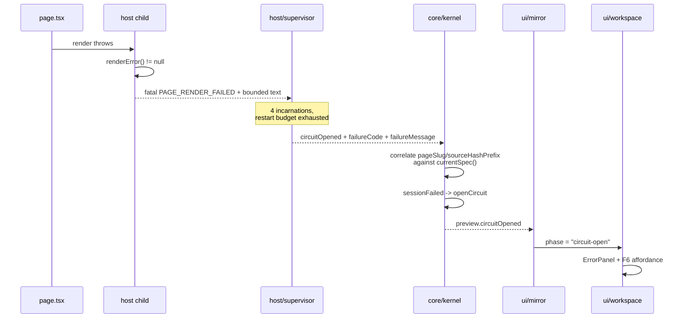

# Preview render-failure surfacing and one-key repair

Date: 2026-07-27
Status: approved design, not yet implemented

## 1. The defect

Opening the app on a project whose page throws at render time leaves the Workspace on
`preparing preview…` forever. The preview never appears, no error is shown, and nothing in
the UI names the failure.

Evidence, `termcraft-debug/run-2026-07-27T11-57-19-410Z-34028.jsonl`:

```
11:57:23  ui.event  preview.sessionReady (seq 12)
11:57:25  main.start  _host --stdio  → console.error TypeError: ctx.spy is not a function
11:57:26  main.start  _host --stdio  → console.error TypeError: ctx.spy is not a function
11:57:27  main.start  _host --stdio  → console.error TypeError: ctx.spy is not a function
11:57:29  main.start  _host --stdio  → console.error TypeError: ctx.spy is not a function
```

After `seq 14` the Kernel emits no further events at all, though four host incarnations
failed behind it.

### 1.1 Cause chain

1. The page under test uses Reatom v3 APIs (`ctx.spy`, `atom(ctx, value)`) against the
   installed v1001 runtime, where `reatomComponent` calls `Component(props)`. Every render
   throws.
2. `src/host/session/model/host-state-machine.ts:199-200` asks `handle.renderError()` before
   answering `ready` and reports `PAGE_RENDER_FAILED` instead. This check is correct and
   recent; see `src/host/render/model/error-capture.ts` for why a returned frame is not
   proof a page rendered.
3. `src/host/supervisor/model/restart-policy.ts:8` allows three automatic restarts — four
   incarnations total, exactly the four in the log. The budget is exhausted and
   `src/host/supervisor/model/supervisor.ts:156-168` latches the circuit and emits one
   `circuitOpened`.
4. **Nothing consumes that event.** `HostSupervisorPort.onEvent`
   (`src/core/ports/host-supervisor.ts:64`) has no production subscriber — only tests call
   it. The Kernel opens its own circuit only when a session *establishment* call returns
   `HOST_CIRCUIT_OPEN` (`src/core/kernel/model/handlers/preview-export.ts:693-701`); here
   establishment succeeded and the failures came afterwards.
5. The mirror therefore stays in `phase: "ready"`, `previewFrame` stays `null`, and
   `Workspace.tsx:282-288` falls through to `preparing preview…`. The UI's frame consumer
   (`src/ui/app/model/deps.ts:448`) waits on a stream that will never yield again.

The preview error panel itself already exists and already carries the design's copy
(`src/ui/preview/ui/ErrorPanel.tsx`, `Workspace.tsx:222`). The only reason it is never seen
is the missing subscription at step 4.

## 2. Goals

1. A host render failure that exhausts the restart budget reaches the UI as the preview
   error panel instead of an indefinite `preparing preview…`.
2. The panel offers a one-key repair affordance. Pressing it fills the composer with a
   ready-to-send message describing the failure and its context, and moves focus there. The
   user reviews and sends; the key never sends on their behalf.

### 2.1 Non-goals

- **Repairing `examples/clock/.termcraft/pages/dashboard/page.tsx`.** Explicitly excluded by
  the requester. The broken page stays as a live fixture: once this work lands, the app
  shows the error panel and the repair key on it.
- Surfacing transient `backoff` failures. See §3.1.
- Restore-from-git (`restore (v1)` in the design's inset) — unrelated and unbuilt.
- Adding a new operational failure code. The registry is closed at 30 entries
  (`src/core/protocol/model/failure.ts:10-46`, asserted by a closure test).

## 3. Architecture



### 3.1 Only `circuitOpened` is mapped

`backoff` stays a pure diagnostic. A restart that succeeds must not have flashed
`✗ could not render current design` on the way. The supervisor backs off 250/500/1000 ms; in
the recorded run the whole cycle took about four seconds, and for those four seconds
`preparing preview…` is an accurate statement — the preview genuinely is still being
prepared. Mapping `backoff` would also require a return path (`failed -> beginStart ->
sessionReady`) for a state that lives under two seconds.

Deterministic failures (every `ProtocolError`, plus flood/backpressure — see
`restart-policy.ts:19-35`) open the circuit on the first failure with no backoff at all, so
that class of failure surfaces immediately.

### 3.2 `host/supervisor` — carry the real error out

`SupervisorEvent` (`src/host/supervisor/types.ts:330-343`) gains two optional fields on the
`circuitOpened` variant: the failing incarnation's `failureCode` and its bounded
`failureMessage`. Today the event carries only the restart policy's own `reason`
(`restart budget exhausted (3 in 60000ms)`), while the real text
(`PAGE_RENDER_FAILED: TypeError: ctx.spy is not a function…`) stays inside the
`SupervisorError` that `onIncarnationFatal` (`supervisor.ts:149`) already holds.

The text is bounded to 200 characters at `session.ts:462` and carries no paths, no
environment values and no source contents, so it satisfies host-supervision §13's diagnostic
bound as it stands. `SupervisorEventV1` (`src/core/ports/host-supervisor.ts:46-56`) mirrors
the same two fields, and `src/host/adapters/host-supervisor.ts` forwards them.

### 3.3 `core/kernel` — subscribe and correlate

The Kernel subscribes to `hostSupervisor.onEvent` where `setActivePreviewSession` already
lives (`src/core/kernel/model/kernel.ts`). This is the wiring the port's own header
anticipated: "the shape `host/supervisor/types.ts` itself says 'phase 6 wires this onto the
Kernel event channel'".

Correlation: a `circuitOpened` belongs to the live session when its `pageSlug` and
`sourceHashPrefix` match `previewSessionCommands.currentSpec()`. `previewSessionId` and the
full `sourceHash` come from the same source. A non-matching key, or a `null` spec, is
dropped and traced — never guessed at.

Mapping reuses the existing builder `openCircuitEvents`
(`src/core/kernel/model/handlers/preview-export.ts:583`), which already applies the
`sessionFailed -> openCircuit` pair and assembles a schema-valid `preview.circuitOpened`.
`sessionFailed` has a legal `live -> failed` edge (`preview-machine.ts:80`), so no new
transition is needed.

`finalFailure.code` stays `HOST_CIRCUIT_OPEN`; the real cause travels in `safeMessage`.
`details` carries `attempts` and `pageSlug`. It does **not** carry the source path:
`canonicalPageSourcePath` is absolute (`preview-export.ts:157`), and an absolute path belongs
neither in a §13 diagnostic nor in a message the user will read in chat.

Downstream nothing changes: `ui/mirror` already folds `preview.circuitOpened`
(`mirror.ts:517-528`) and `ErrorPanel` already renders that phase.

### 3.4 `ui` — the repair affordance

**Action.** A new registry entry in `src/ui/actions/model/registry.ts`:

```
id: "preview.repair"
execution: { kind: "local", effect: "compose-repair" }
hotkey: { id: "preview.repair", key: "f6", label: "repair", capability: null }
```

`capability: null` because nothing is dispatched to the Kernel — the effect is entirely
UI-local.

**Handler.** `applyIntent`'s `executeAction` gains the `compose-repair` effect. It reads
`deps.mirror.preview()`, returns silently unless the phase is `circuit-open` or `failed`,
builds the message, writes it to `local.composer`, and sets `local.focus` to `"composer"`.

Both phases are covered because both are reachable. §3.1 declines to map `backoff` into
`failed`, but `failed` already has a production producer of its own: the establishment path
publishes `preview.failed` when `HostSupervisorPort.preview` itself returns a failure
(`preview-export.ts:672-673`). A page whose contract cannot be read reaches the panel that
way, and deserves the same repair affordance.

An existing draft is never destroyed. This codebase already carries two separate defect
fixes built on that principle (`home-submit` and `composer-submit` both clear their input
only once the Kernel accepted). An empty composer is filled; a non-empty one gets the repair
text appended below a blank line.

**Panel.** `ErrorPanel` gains an optional fourth line below `nextStep`.

**Composer attach line.** `deriveComposerAttach` (`src/ui/workspace/model/attach.ts`) gains a
branch producing `describe a fix — composer is enabled` in `amberHi`. It is placed last,
immediately before `return null`: the turn-running branches must win, because
`⏎ send disabled — draft kept` directly contradicts the claim that the composer is enabled.

**Prompt builder.** `src/ui/preview/model/repair-prompt.ts` — a pure function over the
mirror's preview slice, no renderer involved, the same split `attach.ts` and `tabs.ts`
already use.

## 4. The repair message

Template:

```
The preview cannot render the "{pageSlug}" page.

This is a runtime error from the preview host, not a Gate rejection — the page
passed every static check and then threw while rendering.

  file:     {relativeSourcePath}
  error:    {safeMessage}
  attempts: {attempts} host incarnations failed before the preview circuit opened

Fix the render error in that file. Keep the page's behaviour and layout as they
are — this is a repair, not a redesign.
```

`{relativeSourcePath}` is derived in the UI from the slug using the fixed canonical layout
`.termcraft/pages/<slug>/page.tsx` (`preview-export.ts:157`). The `attempts` line is
conditional — the `failed` phase has no attempt count and drops it.

Rendered against the failure in the recorded run:

```
The preview cannot render the "dashboard" page.

This is a runtime error from the preview host, not a Gate rejection — the page
passed every static check and then threw while rendering.

  file:     .termcraft/pages/dashboard/page.tsx
  error:    PAGE_RENDER_FAILED: TypeError: ctx.spy is not a function. (In
            'ctx.spy(paletteIdAtom)', 'ctx.spy' is undefined)
  attempts: 4 host incarnations failed before the preview circuit opened

Fix the render error in that file. Keep the page's behaviour and layout as they
are — this is a repair, not a redesign.
```

The message deliberately does not re-teach the runtime API. `reatom-guide.md` is already in
the agent's system prompt (`src/agent/prompt/model/runtime-docs.ts:26`) and covers exactly
`ctx.spy is not a function`. This message's only job is to state the failure precisely.

## 5. Design fidelity

The authoritative screen is `ws-broken-source-120` in
`design/12-errors-edge-states.dc.html`, drawn by `wsBrokenSource`
(`design/termcraft-engine.js:1109-1125`).

Taken verbatim from the design:

- the three-line message block and its tones (`red` bold headline, `fg` cause, `faint`
  next step) — already implemented in `ErrorPanel`;
- the composer attach line `describe a fix — composer is enabled` in `amberHi`
  (`termcraft-engine.js:1122`) — designed but not yet implemented, added here;
- the status-bar hint `preview error — composer enabled`, `red` on `redDim`
  (`termcraft-engine.js:1124`).

Divergences, flagged rather than invented (CLAUDE.md):

1. **A fourth line in the panel.** The design draws three centred lines plus the restore
   inset; there is no action line. Closest faithful mapping: the `amberHi` tone the design
   gives the only actionable line on this screen, the restore inset's
   `⏎ Restore… a working commit` (`termcraft-engine.js:1117`).
2. **`F6`.** The design names no key for repair — it draws no circuit-open screen at all.
   `f6` continues the design's own key vocabulary for this pane (`F2` full, `F3` tweaks,
   `F4` interact, `F5` retry) at the next free slot. This is the same reasoning already
   recorded for `F5` in `registry.ts:63-69`, and a bare letter is unusable because the
   composer is live and would swallow it as text.
3. **Status-bar key row.** `wsBrokenSource` shows `[['F2','full'],['F3','tweaks']]`. Adding
   `F6 repair` in error phases extends that row.

All added copy is English, matching every other string in the shell.

## 6. Edge cases

| Case | Behaviour |
| --- | --- |
| A turn is running when `F6` is pressed | The composer is still filled; sending waits for the turn. The attach line correctly reads `⏎ send disabled — draft kept` (turn branches outrank the new one). |
| Screen is `read-only` | `F6` no-ops and traces the refusal — the same guard `composer-submit` already applies (`intent.ts:93-96`). Filling a composer that cannot send would mislead. |
| Event from a foreign or stale key | Dropped by the `pageSlug`/`sourceHashPrefix` correlation. |
| No live session tracked (`currentSpec() === null`) | Dropped and traced. |
| Machine cannot legally take `sessionFailed` | Checked with `canApply` before calling `openCircuitEvents`. This also absorbs a repeated `circuitOpened` for the same key: from `circuit-open` the transition is illegal, so nothing is published twice. |
| `failureMessage` absent (deterministic branch) | `safeMessage` falls back to the policy `reason`. Nothing is fabricated. |
| `F5` retry pressed after `F6` | Retry re-establishes the session; on success the phase leaves `circuit-open` and the panel disappears. The composer draft stays — the user decides whether to send or clear it. |

## 7. Testing

- `host/supervisor` — `circuitOpened` carries the last failed incarnation's code and text,
  not only the policy reason.
- `core/kernel` — a `circuitOpened` matching the current spec publishes
  `preview.circuitOpened` carrying the real message; a foreign key publishes nothing; a
  repeat publishes nothing.
- `ui/preview` — the prompt builder: with and without an attempt count, slug substituted
  into the path.
- `ui/app/model/intent.test.ts` — `F6` fills an empty composer and moves focus; appends to
  rather than overwrites a non-empty draft; no-ops on `read-only` and on non-error phases.
- `ui/workspace` — the action line renders only when the repair action is available.
- End-to-end — a page that throws at render drives the UI to the error panel rather than an
  indefinite `preparing preview…`. This is the regression test for the reported defect.

## 8. Accompanying work

- `docs/architecture/` — `flows/interactive-prototype.md` and `modules.md` describe the
  preview flow and must record the Kernel's new subscription to the supervisor's event sink.
  Updated before the work is reported done, per CLAUDE.md.
- `/reatom-audit` after implementation: `intent.ts` and the UI atoms are touched.

## 9. Source anchors

- `src/host/supervisor/model/supervisor.ts`, `model/restart-policy.ts`, `types.ts`
- `src/host/adapters/host-supervisor.ts`
- `src/core/ports/host-supervisor.ts`
- `src/core/kernel/model/kernel.ts`, `model/handlers/preview-export.ts`
- `src/core/machines/model/preview-machine.ts`
- `src/ui/mirror/model/mirror.ts`
- `src/ui/actions/model/registry.ts`
- `src/ui/app/model/intent.ts`
- `src/ui/preview/ui/ErrorPanel.tsx`, `src/ui/preview/model/repair-prompt.ts` (new)
- `src/ui/workspace/model/attach.ts`, `src/ui/workspace/ui/Workspace.tsx`
- `design/12-errors-edge-states.dc.html`, `design/termcraft-engine.js` (`wsBrokenSource`)
