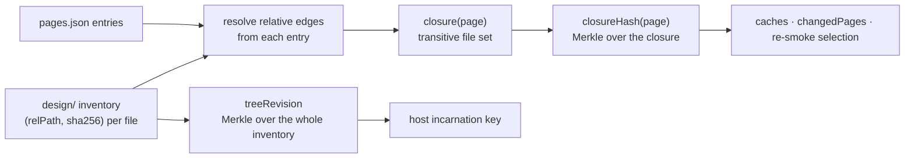
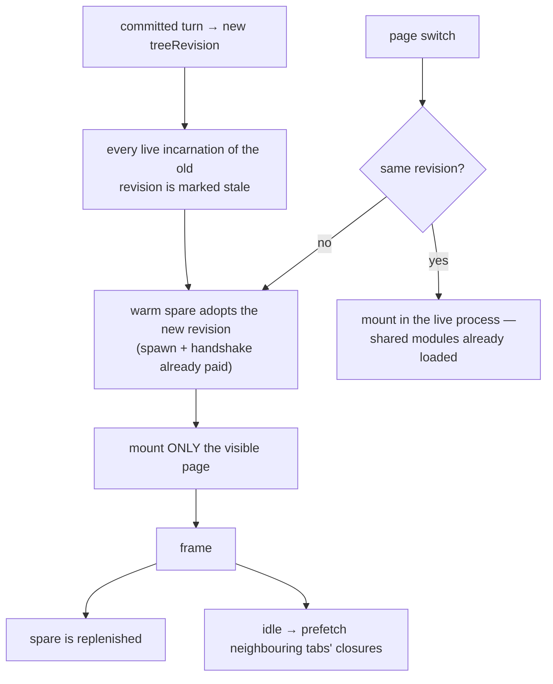
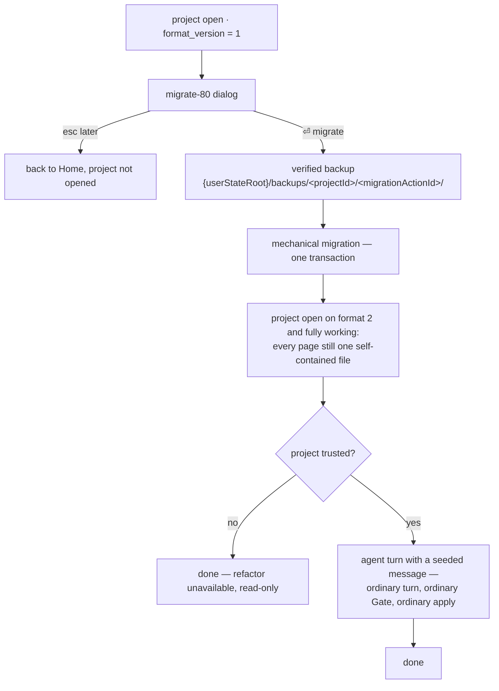

# Multi-file design source tree

**Status:** design, approved 2026-07-28
**Supersedes:** the one-page-one-file source model described in `docs/architecture/storage.md` item 3

## 1. Goal

A design project stops being a set of isolated single-file pages and becomes one authored
source tree the agent owns. The agent writes as many files as it wants and shares code
across pages. A manifest inside the tree names which files are page entry points.

Two properties must survive the change, and one new property must be gained:

- page identity stays anchored and un-renameable (survive);
- page metadata stays extractable without executing code (survive);
- switching between pages in the preview becomes instant, and re-rendering after an edit
  does not rebuild pages nobody is looking at (gain).

## 2. Non-goals

- No page UUID. The slug remains the only page identity.
- No rename operation. A slug that disappears is a deletion; a new slug is a creation —
  exactly today's `finalize` semantics.
- No custom module system in the host. The host keeps using `import()`; the in-process
  module registry that would allow in-place invalidation is deliberately deferred (§9.5).
- No automatic refactoring into shared modules. The mechanical migration (§12.2) moves
  files and rewrites the manifest; turning single-file pages into a shared tree is an
  ordinary agent turn the user can decline, redo, or ignore.

## 3. Storage layout

```
.termcraft/
  project.toml            format_version (=2) · project_id · name · created_at · target_stack
  design/                 the canonical authored tree — mirrors the turn workspace 1:1
    pages.json            the manifest (§4)
    <anything the agent writes>
  pins/<slug>.jsonl       append-only pin events
  chats/ cache/ diagnostics/ logs/ export/ transactions.local/
  workspace.local.toml  lock  .gitignore
```

Changes against today:

| today | after |
| --- | --- |
| `pages/<slug>/page.tsx` | `design/<any path>`, named by `design/pages.json` |
| `pages/<slug>/comments.jsonl` | `pins/<slug>.jsonl` |
| `project.toml`'s ordered `pages` array | `design/pages.json`'s ordered `pages` array |

`project.toml` loses its `pages` field. Keeping both it and `pages.json` would create two
sources of truth for page order and enumeration; the manifest lives inside the tree because
the tree is what the agent edits.

### 3.1 Namespaces and budgets

`src/store/safe-fs/model/limits.ts` gains one namespace and changes two grammars:

- new `design-source` namespace covering `design/**`, replacing `canonical-page`;
- `comments-jsonl` moves its grammar from `pages/<slug>/comments.jsonl` to
  `pins/<slug>.jsonl`;
- `classifyProject` drops the `pages/<slug>/...` branch entirely.

`design/` reuses the workspace root budget: **512 files, 64 MiB total, depth 8**
(`ROOT_LIMITS.workspace`). Per-file limit is 2 MiB, matching the retired `canonical-page`
row.

## 4. `design/pages.json`

```json
{
  "schemaVersion": 1,
  "pages": [
    { "slug": "dashboard", "entry": "pages/dashboard.tsx" },
    { "slug": "calendar",  "entry": "screens/calendar/index.tsx" }
  ],
  "requestedActivePage": "dashboard"
}
```

- The array order is the page order. It replaces `project.toml`'s `pages`.
- `slug` is validated by the existing mask and Windows reserved-device-name check
  (`src/entities/page/model/slug.ts`) — unchanged.
- `entry` is a forward-slash path relative to `design/`. It must resolve to a real file
  inside the tree.
- `requestedActivePage`, when present, must name a listed slug.

Rejected as a Gate fatal: a duplicate slug, an `entry` that does not resolve, an `entry`
escaping `design/`, a `requestedActivePage` naming an unlisted slug.

Because `entry` is a value rather than a path convention, the agent may move a page's file
anywhere in the tree without touching its identity. Identity changes only when the `slug`
key itself appears or disappears.

## 5. Page contract

Unchanged in substance. A page entry file must export:

- `export const meta = definePage({ ... })` — **strictly literal**. No spread, no
  identifiers, no imported constants, no computed properties. The rule stands unchanged
  from `src/gate/model/page-contract.ts` because `PageMeta` is read without executing code:
  it feeds the page-metadata cache, the export size ladder, and the page descriptors
  published before any render happens.
- `export default reatomComponent(...)`.

`meta.title` is the page's display name and is freely editable. The slug is not.

The only thing that changes for a page file is that it may live anywhere in the tree and
may import other modules from it.

## 6. Import surface and resolution

Exactly two kinds of module edge are legal anywhere in the tree:

1. a **static** import of the bare specifier `@termcraft/runtime`;
2. a **relative** specifier (`./…`, `../…`) resolving to a real file inside `design/`.

Resolution of a relative specifier is deliberately narrow and deterministic:

- an explicit extension is used as written;
- an extensionless specifier probes exactly `<spec>.tsx`, then `<spec>.ts`, and stops;
- there is **no** implicit directory-index resolution, no other extension, and no
  `node_modules` lookup.

Fatal rejections, in addition to today's set (dynamic `import()`, re-export of the runtime,
`require`, `eval`/`Function`):

- a specifier that escapes `design/` after normalization;
- a specifier whose resolution passes through a symlink, junction, or reparse point —
  reusing `src/store/safe-fs/model/no-follow.ts`;
- a query string or fragment in a specifier;
- any other bare specifier, including `node:*`.

Two enforcement points, as today, and both become graph-aware:

- `src/gate/model/import-scan.ts` is the authoritative allowlist and now scans **every**
  file in the tree, not only entry files;
- `src/host/session/model/source-mount.ts`'s `scanPageImports` is the defense-in-depth
  rescan and becomes a graph walk over the closure being mounted.

`src/host/session/model/resolver.ts` continues to fail open by design and is not a
security boundary. The compiler-injected JSX specifier exemption
(`COMPILER_INJECTED_JSX_SPECIFIERS`) is unchanged.

## 7. The closure graph

The central new artifact. The Gate produces it while validating, and every cache,
invalidation decision, and change report is keyed off it.



- `closureHash(page)` — Merkle hash over the page's transitive closure, computed from
  `(relPath, sha256)` pairs sorted by `relPath`.
- `treeRevision` — Merkle hash over the entire `design/` inventory, including
  `pages.json` and files no page reaches.

Consumers, and how their keys change:

| consumer | today | after |
| --- | --- | --- |
| `src/store/projections/model/page-meta-cache.ts` | `(slug, sourceHash, extractorVersion)` | `(slug, closureHash, extractorVersion)` |
| `src/store/projections/model/diagnostics-store.ts` | `(slug, sourceHash, kitApiVersion)` | `(slug, closureHash, kitApiVersion)` |
| `src/core/export/model/render-jobs.ts` render key | source hash + runtime + size + theme + flags | `closureHash` + the same rest |
| `src/core/turns/model/candidate.ts` `changedPages` | `(slug, fileHash)` inventory diff | `(slug, closureHash)` diff |
| `src/core/pins/model/turn-resolution.ts` | pages present in `changedPages` | unchanged — fed by the row above |
| preview session key (`src/ui/app/model/deps.ts` memo) | `(pageSlug, sourceHash)` | `(treeRevision, pageSlug)` |
| Gate smoke stage selection | every present page | only pages whose `closureHash` changed |

The `changedPages` row is the reason this artifact is mandatory rather than an
optimization: with shared modules, an edit to `lib/theme.ts` changes what every page
renders while no page entry file's own bytes move. Keyed on the file hash, every consumer
in the table would silently report "nothing changed".

## 8. Gate

Per turn, in this order:

1. **Manifest** — parse `design/pages.json`; validate slugs, duplicates, `entry`
   resolution, `requestedActivePage`, order.
2. **Graph** — resolve every entry's closure and compute `treeRevision`. An illegal edge
   (§6) is fatal. An import cycle is a **warning**, not a fatal: ESM permits cycles, but
   they are a common source of `undefined`-at-module-init in this shape of code.
3. **Reachability** — a module no entry reaches produces a `dead-module` warning. Never
   auto-deleted; deleting a half-finished refactor is worse than carrying it.
4. **Import scan** — per file across the whole tree.
5. **Type check** — **one** `tsc` program over the whole tree, replacing today's
   per-file program. Cheaper than N programs and the natural shape for a module graph.
   A diagnostic in a shared file is attributed to every page whose closure contains it.
6. **Page contract** — per entry file (§5).
7. **Lints** — per file. The five existing lint kinds are unchanged; `dead-module` and
   `import-cycle` join them as warnings.
8. **Smoke** — only pages whose `closureHash` differs from the send-time read set. A first
   turn, or a newly listed slug, smokes everything.

Step 8 is what keeps the Gate affordable. Without it, a shared-module edit would smoke
every page on every attempt, up to four attempts per turn.

## 9. Host

### 9.1 The chosen shape

One host incarnation per **tree revision**, mounting one page at a time, with a warm spare
process and lazy materialization.



The governing principle is **invalidate eagerly, materialize lazily, keep capacity warm**.
A commit invalidates every affected page immediately, but only the page on screen is
rebuilt; the rest are rebuilt when the user switches to them, from an already-warm process.

### 9.2 Contract changes

Today an incarnation is pinned to `(pageSlug, sourceHash)`: `loadPage` verifies one exact
hash at mount, and the ready-phase state machine accepts no second `mount`
(`src/host/session/model/host-state-machine.ts`). That invariant is what makes
`SOURCE_HASH_MISMATCH` meaningful. It is replaced at a coarser granularity, not dropped:

- an incarnation is keyed by `treeRevision`;
- on load, the host verifies **every** file in the tree against the revision's inventory
  hashes;
- the ready phase accepts a repeated `mount <slug>`, which additionally verifies that the
  page's closure is a subset of the already-verified tree, and implicitly unmounts the
  previous page;
- `src/host/supervisor/model/restart-policy.ts` and its circuit breaker key on
  `treeRevision` plus the slug that was mounting when the failure occurred.

### 9.3 Warm spare and residency

- One booted, handshaked, un-mounted spare process is kept ready and replenished after
  each adoption.
- Total live incarnations stay under the existing global cap of 10.
- The frame broker and relay (`frame-broker.ts`, `preview-relay.ts`) are unchanged: frames
  are still emitted only at `handleMount` and `handleResize`, and a page switch is a mount,
  so it emits naturally.
- **Prefetch** (second phase, optional): once the visible page has produced a frame and the
  incarnation is otherwise idle, the closures of the neighbouring tabs are *imported* but
  not mounted, so a later switch pays only the React mount. Prefetch is abandoned the
  moment any control message arrives, and never runs on a stale revision.

### 9.4 Hang watchdog

Per-page hang isolation is lost and this is accepted (§13). A hang in one page now blocks
previewing the rest of the tree until the incarnation is replaced, so the failure must be
attributable:

- `mount` and the first frame after it each carry a deadline;
- on expiry the incarnation is killed and the failure is attributed to the page that was
  being mounted, so the shell draws the existing `wsHostCrash` panel for that page rather
  than blaming the tree;
- render **throws** are unaffected — `src/host/render/model/error-capture.ts` already
  catches them inside the tree without killing the process. The watchdog exists for
  infinite loops and runaway allocation only.

### 9.5 Module state and the deferred registry

Module-level state — Reatom atoms declared in a shared `lib/` module — is genuinely shared
across pages within one incarnation. This is deliberate behavior, stated so it is not
discovered as a bug:

- state persists across page switches **within** a revision: switch away and back, and the
  page is as you left it;
- state resets on a revision change: the agent edited the design, so everything starts
  clean.

Loading modules stays behind a seam in the host so a future in-process module registry
(own transpile + own `Map`-backed linker, invalidating changed modules and their importers
by reverse edge) can replace `import()` without touching anything else. That registry is
**not** built now: its only gain over this design is avoiding one process respawn per edit,
and the warm spare already pre-pays that cost.

## 10. Staging

- The turn workspace contains `design/` as a 1:1 copy of the canonical tree, plus the
  read-only reference files (`RUNTIME.md`, `REATOM.md`, the generated `.d.ts`) **beside**
  it at the workspace root, never inside it.
- Because relative paths inside `design/` are identical in the workspace and in the
  canonical tree, no import specifier is ever rewritten on apply. This is a hard
  requirement: export ships exact source copies, and a rewritten specifier would make the
  shipped file differ from the file the agent wrote.
- `classifyWorkspace` in `limits.ts` replaces the flat `pages/<slug>.tsx` rule with the
  same `design/**` grammar the project root uses.
- A new project's workspace is seeded with a skeleton — `design/pages.json` and an empty
  conventional structure — so the agent does not invent a different layout per project.
- `src/store/sandbox/model/staging-store.ts`'s `stageAllFiles` copies a tree rather than
  enumerating pages.

## 11. Export

- The whole `design/` tree ships once as `design/**` inside the generation directory,
  replacing today's per-page `pages/<slug>/page.tsx` copies.
- Each page gains `closures/<slug>.json` — the list of tree-relative files that page
  actually loads — so the implementing agent knows where the page ends.
- `snapshots/` and `layout/` are unchanged.
- `design-prompt.md` gains a section describing the shared modules. This is a genuine
  improvement over the single-file package: component decomposition in the design now maps
  onto component decomposition in the implementation.

## 12. Migration

An older project is migrated, not refused. `project.toml`'s `format_version` becomes 2,
and opening a version-1 project offers the migration dialog the design already specifies.

### 12.1 Detection and the offer

`design/16-wizard-migration.dc.html`'s `migrate-80` screen is the visual source of truth,
drawn by `migrate()` in `design/termcraft-engine.js`. It is a compact centered dialog at
the setup tier — before the workspace exists, not layered over it — carrying a warning
line, a bullet list of what will change, the "git history is left untouched — only current
sources migrate" note, the backup location, and two keys: `⏎ migrate` and `esc later`.

The bullet list is populated for this migration with the real plan: pages moved into
`design/`, `pages.json` synthesized from the existing order, pin logs relocated,
`project.toml` rewritten.

**A version-1 project never opens.** The workspace is not constructed for it, and there is
no read-only, degraded, or partially-open state. The dialog is the only thing the project
produces: `⏎ migrate` runs the migration and then opens the migrated project, `esc later`
returns to Home having written nothing.

This is what keeps the blast radius small. Because the old layout is never rendered,
previewed, exported, or handed to a turn, **no compatibility reader for it exists anywhere
in the system** — not in the page store, the Gate, the host, or the UI. Every one of those
only ever sees format 2. The old layout is understood by exactly one thing: the migration
step itself.

Detection cannot rest on the version counter alone. `src/store/model/factory.ts` wires only
the registry's `checkNotTooNew` gate; `findSteps` has no production caller, so a version-1
document is not "too new" and would pass the gate and then fail in the schema decoder as a
generic shape error. Wiring `findSteps` into the open sequence is what turns that silent
misread into the offer above, and it is this migration's own work item.

### 12.2 Two tracks, strictly ordered



The two tracks are **sequential, never concurrent**. The agent's turn workspace is staged
from the canonical tree, which the mechanical track is rewriting; running them together
would stage a tree mid-move. The user still presses one key — "at the same time" is a
property of the flow, not of the execution.

**Track 1 — mechanical.** Deterministic, transactional, and required:

- move each `pages/<slug>/page.tsx` to `design/pages/<slug>.tsx`;
- synthesize `design/pages.json` from `project.toml`'s existing ordered `pages` array,
  with `entry` pointing at each moved file;
- move each `pages/<slug>/comments.jsonl` to `pins/<slug>.jsonl`;
- rewrite `project.toml`: drop `pages`, set `format_version` to 2.

No page source byte is edited. Every page remains a self-contained single file that
imports only `@termcraft/runtime`, which is still valid under §5 and §6 — the new format
permits shared modules, it does not require them. This is what makes the mechanical track
sufficient on its own.

**Track 2 — agent.** Optional and best-effort: an ordinary turn seeded with a synthesized
message asking the agent to factor duplicated markup and logic into shared modules. It
needs **no new machinery** — it runs through the same admission, staging, Gate, retry, and
apply path as any other turn. If it fails, terminalizes, or produces something the user
dislikes, the project is exactly as track 1 left it. It is gated on trust, because a turn
spawns the agent CLI and an untrusted project is read-only.

### 12.3 Consequences

- `MIGRATION_CHAIN` gains its first real entry, and `registry.test.ts`'s assertion that
  the shipped chain stays empty is replaced by one asserting its actual content.
- The verified-backup protocol (`src/store/migration/model/backup-store.ts`) gets its first
  production caller. **Divergence from the design, recorded deliberately:** the dialog
  mockup shows the backup as `.termcraft/backup-2026-07-13/`, inside the project.
  `docs/architecture/storage.md` item 17 and the implemented backup store place it at
  `{userStateRoot}/backups/<projectId>/<migrationActionId>/`, outside `.termcraft`, so a
  Git operation cannot clobber it. The storage design wins; the dialog shows the real path,
  and the divergence is documented at the render site.
- Track 1 changes every page's path, so every `closureHash` changes: every cache entry
  invalidates and every page re-smokes on the first turn after migration. Correct and
  expected.
- `examples/clock/.termcraft/` is migrated by running the real migration, not by hand —
  it is the first end-to-end test subject.

## 13. Accepted trade-offs

- **Per-page hang isolation is gone.** A page stuck in an infinite loop blocks previewing
  the whole tree until the watchdog replaces the incarnation. Accepted in exchange for
  loading shared code once instead of once per page.
- **The resolver is now part of the security perimeter.** Relative resolution is a strictly
  larger surface than a single-string allowlist. Mitigated by the narrow resolution rules
  (§6), by the Gate scanning every file, and by the host's graph-aware rescan — but this is
  the highest-risk part of the change and deserves adversarial review.
- **A shared module's edit invalidates many pages.** Handled by lazy materialization (§9.1)
  and by closure-scoped re-smoke (§8 step 8), not by rebuilding everything.
- **Shared module-level Reatom state crosses pages.** Documented as behavior (§9.5); the
  system prompt must state it, and a lint warning for module-scope mutable state in a
  shared module is likely warranted.

## 14. Suggested sequencing

This design is too large for one implementation plan. It decomposes into three, each
landing on a working system:

1. **Tree as canonical source.** §3, §4, §5, §6, §10 — storage layout, `pages.json`, the
   resolver rules, and staging. The host and Gate still work per page; the closure is
   computed but only used for `changedPages`. At the end of this plan the agent can write
   shared code and it commits correctly.
   **LANDED** — `c8c623c..9219b9e` on branch `design-tree`, plan
   `docs/superpowers/plans/2026-07-28-design-tree-canonical-source.md`, tasks 1-17.
   Three decisions this plan settled that the design above left implicit, recorded here so
   plans 1b/2/3 inherit them rather than re-deciding:
   1. **Two slugs may share one `entry`** (task 10). `pages.json` binds slug → entry, and
      nothing requires that map to be injective; the manifest check enforces unique SLUGS
      and resolvable entries, not unique entries. Two pages rendering one file is legal.
   2. **Pin resolution filters on the caller's closure-derived `changedPageSlugs`, never on
      file paths** (task 6). A pin belongs to a page, and which pages a turn changed is a
      closure question the turn has already answered — re-deriving it from the paths a
      transaction happened to write would disagree the moment a shared module moved.
   3. **A new project seeds an EMPTY `pages` array, never a starter page** (task 16). §10's
      "empty conventional structure" is taken literally: `design/pages.json` exists from
      creation so an absent manifest is never ambiguous, and the first turn creates the
      first page. A seeded page would be a design nobody asked for.
   Two things this plan deliberately did NOT do, both by the design's own division above:
   the host keys an incarnation on `(pageSlug, sourceHash)` while VERIFYING the whole
   closure (revision-keying is plan 3), and the export package's shared-module prose in
   `design-prompt.md` is plan 3's.

   **CLOSEOUT LANDED** — `1cc6431..d57c2a3` on branch `design-tree`, plan
   `docs/superpowers/plans/2026-08-02-design-tree-phase-1-closeout.md`, tasks 1-11. This plan
   closed six rows of the red-window debt this plan's own tasks and reviews had left open
   (raw NUL bytes hiding two sources from grep; a transitive vouching gap in the import
   scan's trust set; `runPage`'s optional tree-coordinate fallback; the fake-vs-real
   contract's hash/size blindness; five of the §5.8 dynamic-code spellings plus `Worker`;
   and the ~77-minute worst-case synchronous JSX scan) — full evidence in
   `docs/superpowers/red-debt.md`. It also settled three decisions this plan's own text left
   implicit, recorded here so plan 2 inherits them rather than re-deciding:
   1. **The JSX reader has a fail-closed nesting ceiling** (task 3). Recursion past
      `MAX_JSX_NESTING_DEPTH` (64) throws a deliberate `JsxNestingTooDeepError`, which the
      whole-tree scan converts into `UNSCANNABLE_SOURCE` — a source past the ceiling is
      refused outright, never partially scanned.
   2. **The whole-tree verdict is no longer the only thing neutralising `isTrustedTarget`**
      (task 4). A file that failed its own scan, or that transitively resolves an import
      into one, is excluded from the trusted set at a FIXED POINT — so §8's per-entry
      reporting is now safe to build in plan 2. It was not safe at depth 1: before this fix
      a re-judged file with a clean scan of its own kept vouching for its importers even
      though one of ITS OWN imports had failed to scan.
   3. **The §5.8 perimeter is detection at the Gate PLUS capability denial in the preview
      child, and the boundary between the two is measured, not argued** (task 10). The Gate's
      token scan and the host's `denyDynamicCodeCapability()` together close every measured
      `eval`/`Function`/`Worker` spelling; an aliased `require` reaching arbitrary Node
      built-ins is measured to reach past BOTH layers and remains open
      (`docs/superpowers/red-debt.md`).
1b. **Migration.** §12 — the `migrate-80` dialog, `findSteps` wired into the open sequence,
   the first `MIGRATION_CHAIN` entry over the existing verified-backup protocol, and the
   seeded refactor turn. Separable from plan 1 and worth its own plan: it is the only part
   that touches existing user data, and its two tracks have very different risk profiles.
2. **Closure graph everywhere.** §7, §8 — re-key every cache, switch the type check to one
   whole-tree program, and scope smoke to changed closures.
   **NOT "purely internal" — this bullet's original wording ("purely internal; no user-visible
   behavior changes except that turns get faster") was FALSE, and is corrected here rather than
   quietly dropped.** Two measurements taken while writing plan 2 falsify it, both recorded in
   that plan's own header:
   - **The Gate rejected every page that imported a shared module.** The type check ran one
     hermetic `tsc` program per ENTRY FILE whose virtual FS served only that one file, so a
     relative edge resolved to nothing — `pages/home.tsx` importing `../lib/theme` produced a
     fatal `TS2307 Cannot find module`. That rejected the turn (four attempts, then
     `GATE_RETRY_EXHAUSTED`) AND marked the page `status: "invalid"` on every descriptor
     publish. Plan 1's headline capability — the agent can write shared code — did not survive
     contact with the Gate. §8 step 5 was therefore a CORRECTNESS FIX, not the cost
     optimization §8's prose frames it as (plan 2 tasks 2-3).
   - **A shared-module edit left the live preview stale forever.** The UI asked for a preview
     session on `slug@sourceHash` (the ENTRY file's hash), and the supervisor keyed a live
     incarnation the same way, so an edit to `lib/theme.ts` moved no key: the memo returned
     early, and even a re-ask returned the existing child whose module registry still held the
     old module. Fixed by plan 2 task 10.
   What IS true of the original wording: turns do get faster (one `tsc` program per tree instead
   of one per page; smoke only for the pages whose closure changed).
   **LANDED** — `0360b94..70a29dd` on branch `design-tree`, plan
   `docs/superpowers/plans/2026-08-03-design-tree-phase-2-closure-graph.md`, tasks 1-10 (the
   closeout's own doc commit extends the range by one). Four decisions this plan settled that the
   design above left implicit, recorded here so plans 1b/3 inherit them rather than re-deciding:
   1. **The whole-tree pass is ONE port method, `GateRunner.runTree`, shared by the turn path and
      every non-turn path** (tasks 3 and 5). One call does allowlist scan, closure resolution,
      ONE `tsc` program over the whole tree, and cycle/reachability analysis, and returns
      closures + diagnostics together (`core/ports/gate-runner.ts:407`). The turn calls it from
      `core/turns/model/validation.ts:288`; the non-turn paths — descriptor publishing, preview
      settings, export capture — call it through the one read-through module
      `core/project/model/tree-index.ts:156` (`readCanonicalTreeIndex`), never by inventing an
      answer of their own. A new consumer that needs closures asks this port; it does not walk
      the import graph itself, and `core` may not (it has no scanner and may not import one).
   2. **`GateErrorV1.blockedPages` means "the pages this whole-tree diagnostic is attributed
      to"** (task 3) — widened from the old "pages this fatal blocks". One field, one meaning,
      two producers inside the same pass: the closure walk (for a fact that stopped a closure
      being proved, where this is the ONLY surviving signal that the page was excluded) and the
      type check (attributed from the closures that same pass just resolved). ABSENT is not
      "harmless" and covers two different facts, told apart by `GateErrorV1.file`: absent WITH a
      file is an orphan module — a diagnostic in a file no closure reaches, which invalidates no
      descriptor and is logged; absent with NO file is a statement about the TREE (most
      consequentially `TYPE_CHECK_UNAVAILABLE`), and a per-page consumer must invalidate EVERY
      page for it. Reading the second as "names no page, so it invalidates nothing" publishes a
      whole project as valid on the strength of a compiler that never ran — the exact fail-open
      that cost task 3 a fix round.
   3. **A `null` closure hash ALWAYS means changed / miss / re-run — never unchanged / hit /
      skip** (tasks 5, 6, 8, 9). `computeClosureHash` returns `null` when any closure member is
      absent from the inventory: an honest "cannot be computed", never a hash over a partial set.
      Every consumer implements the same rule rather than inventing a local one — the page-meta
      cache is SKIPPED entirely (no `get`, no `put`) so no caller can construct a key from an
      unprovable closure; the export render key turns `null` into a forced cache miss; smoke
      selection runs the page. The cost of the rule is redundant work; the cost of the opposite
      is serving a stale answer for a tree nobody proved.
   4. **The supervisor's session key moved to `(pageSlug, treeRevision)` AHEAD of plan 3**
      (task 10), which otherwise owns §9. The argument for taking it early, in one expression:
      §7's preview-session row is undeliverable without it. Plan 2 had to thread `treeRevision`
      to the UI anyway (`page.descriptorsChanged` -> the mirror -> the ask memo), and shipping
      that plumbing while leaving the supervisor keyed on the entry file's `sourceHash` would
      have left a defect a user actually sees — the re-ask arrives, `preview()` matches the old
      key and returns the LIVE child with the pre-edit module registry, so nothing changes on
      screen, and switching pages and back does not help because the other page's closure is
      stale too. `sourceHash` stays on the spec: verifying a mount and identifying a session are
      different questions. Plan 3 inherits the key, not the decision.
   Consequence plan 3 should know about: the restart budget follows that key, so a crash-looping
   page now gets a fresh budget on ANY tree edit, not only an edit to its own entry
   (`host/supervisor/model/restart-policy.ts:53-57`).
3. **Host O2.** §9, §11 — the revision-keyed incarnation, repeated `mount`, warm spare,
   watchdog, and the export package shape. This is the plan that delivers instant page
   switching and is the one with the accepted isolation trade-off.

Plan 1 is a prerequisite for all the others; plans 1b, 2 and 3 are independent of each
other.

## 15. Source anchors

- `src/store/safe-fs/model/limits.ts` — `classifyProject`/`classifyWorkspace`,
  `NAMESPACE_LIMITS`, `ROOT_LIMITS`: §3.1's namespace and budget changes
- `src/store/sandbox/model/staging-store.ts` — `stageAllFiles`: §10's tree copy replacing
  per-page enumeration
- `src/store/toml/model/project-toml.ts` — §12's `format_version` bump and version-1
  rejection; the dropped `pages` field
- `src/entities/page/model/slug.ts` — the unchanged slug mask that `pages.json` keys are
  validated against
- `src/gate/model/manifest.ts` — the manifest check, rewritten against §4's schema
- `src/gate/model/import-scan.ts` — §6's authoritative allowlist, now per-file across the
  tree
- `src/gate/model/gate.ts` — §8's stage ordering; it HONORS closure-scoped smoke selection
  through the required `GateInput.smoke` field, which the caller decides (see
  `core/turns/model/validation.ts` below) and this module never infers
- `src/gate/model/type-check.ts` — §8 step 5's single whole-tree program
  (`createTreeTypeChecker`; the per-entry `createTypeChecker` it replaced is deleted)
- `src/gate/adapters/gate-runner.ts` — `runTree`: the ONE whole-tree pass (scan, closures, the
  type-check program, the module graph), where the two new warnings (`dead-module`,
  `import-cycle`) are produced and where `blockedPages` attribution is computed
- `src/core/project/model/tree-index.ts` — `readCanonicalTreeIndex`: the single read-through the
  non-turn paths (descriptor publishing, preview settings, export capture) obtain closures,
  `treeRevision` and the tree pass's verdict through
- `src/gate/model/page-contract.ts` — §5's unchanged literal-only `meta` rule
- `src/gate/model/lints.ts` — the per-page determinism/quality lints (NOT the graph warnings:
  a cycle and an unreachable module are whole-tree facts, so they live in `gate/adapters/
  gate-runner.ts` above)
- `src/host/session/model/source-mount.ts` — `loadPage`/`scanPageImports`: §9.2's
  whole-tree verification and §6's graph-aware rescan
- `src/host/session/model/host-state-machine.ts` — §9.2's repeated-`mount` acceptance
- `src/host/session/model/resolver.ts` — unchanged, still fail-open by design
- `src/host/supervisor/model/restart-policy.ts`, `supervisor.ts` — §9.2's re-keying and
  §9.4's watchdog
- `src/host/render/model/error-capture.ts` — why §9.4's watchdog is about hangs, not throws
- `src/core/turns/model/candidate.ts`, `validation.ts` — §7's `changedPages` diff and §8's
  Gate driving
- `src/core/pins/model/turn-resolution.ts` — unchanged consumer of `changedPages`
- `src/store/projections/model/page-meta-cache.ts`, `diagnostics-store.ts`,
  `render-cache.ts` — §7's re-keyed caches
- `src/core/export/model/package.ts`, `render-jobs.ts` — §11's package shape and §7's
  render key
- `src/ui/app/model/deps.ts` — §7's preview-session ask memo, re-keyed to
  `(treeRevision, pageSlug)`
- `src/core/kernel/model/handlers/preview-export.ts`,
  `src/core/kernel/model/handlers/page-descriptors.ts` — the session-establishing and
  descriptor-publishing paths that carry the new key
- `src/store/migration/model/registry.ts` — §12.1's first `MIGRATION_CHAIN` entry, and the
  `checkNotTooNew`-only wiring that is why `findSteps` must gain a production caller
- `src/store/migration/model/backup-store.ts` — §12.2's verified backup, gaining its first
  production caller; the site of §12.3's recorded divergence on backup location
- `src/core/project/model/open-sequence.ts` — where §12.1's version detection and the
  migration offer enter the canonical open path
- `design/16-wizard-migration.dc.html`, `design/termcraft-engine.js`'s `migrate()` — §12.1's
  visual source of truth for the `migrate-80` dialog, its copy, and its two keys
- `design/03-workspace-generating.dc.html` — the presentation §12.2's track 2 reuses, since
  the refactor is an ordinary turn and needs no migration-specific UI
- `docs/architecture/storage.md`, `docs/architecture/flows/generation-turn.md`,
  `flows/export.md`, `flows/interactive-prototype.md` — the architecture documents this
  design invalidates and which must be updated when it lands
