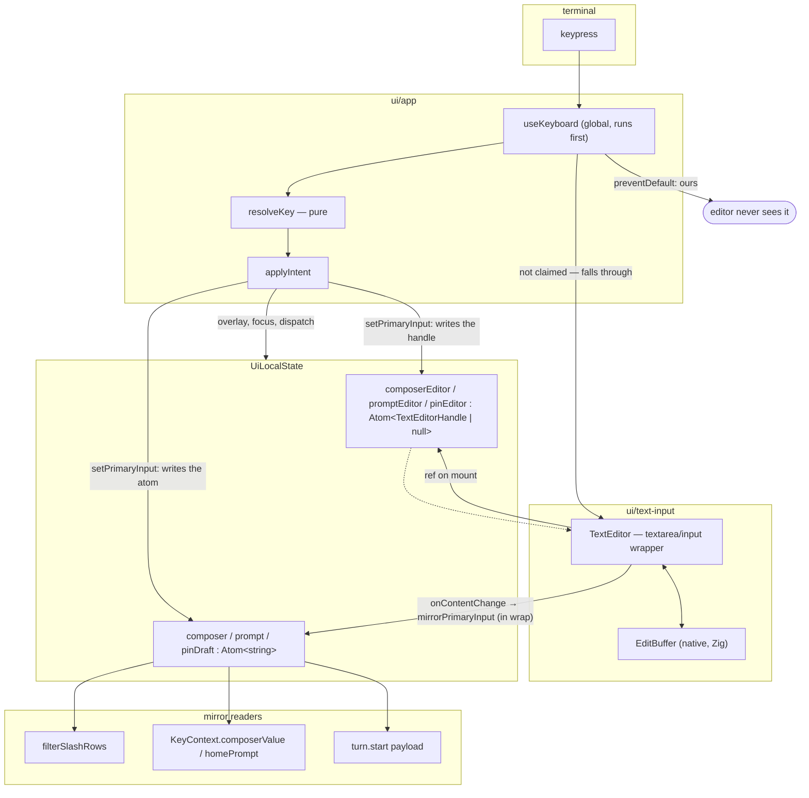
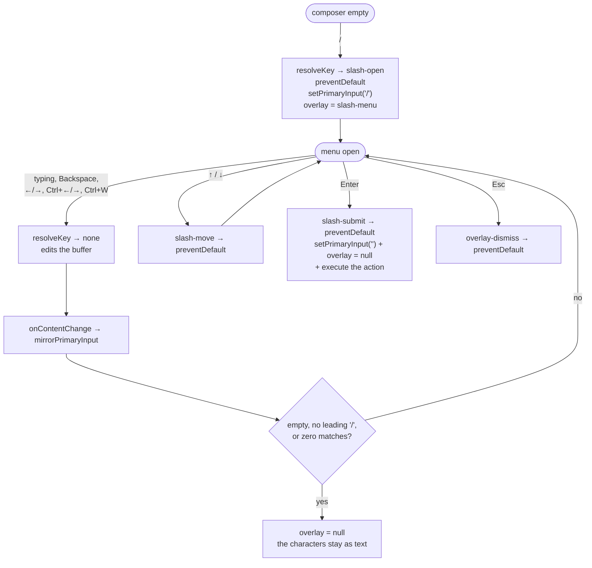

# Input editing: cursor, multi-line, word operations, scroll

**Date:** 2026-08-02
**Status:** design approved, implementation not started
**Worktree:** `.claude/worktrees/input-editing`, branch `worktree-input-editing`

## 1. Problem

The shell's text inputs cannot be edited. They can only be appended to and truncated
from the end.

`local.composer`, `local.prompt` and `local.pinDraft` are plain `Atom<string>`. `applyIntent`
mutates them with exactly two operations — `value + ch` and `value.slice(0, -1)` — so there is no
cursor position anywhere in the codebase. `ui/text-input/ui/TextInput.tsx` renders one flex row:
the caret, the value, and a `█` glyph appended after the text. `keymap.ts` refuses every modified
key inside an input: `printableChar()` returns `null` when `key.ctrl` is set, and `hotkeyName()`
routes `ctrl+*` to the global action registry before any input branch is reached.

The consequences, in the order the user reported them:

1. A newline in the value has no defined rendering. `compose-repair` (F6) has been writing
   `\n\n` into the composer since 2026-07-27, and nothing draws it correctly.
2. `Shift+Enter` does nothing.
3. `Ctrl+Backspace` and `Ctrl+←`/`Ctrl+→` do nothing.
4. A prompt longer than the input row has no scroll.

## 2. Goals and non-goals

**Goals.** One shared editable buffer — text plus cursor — behind every text input in the shell:
the Workspace composer, the Home prompt, the pin-input popup, and the slash-menu filter (which is
the composer/prompt buffer itself). Full cursor navigation and word operations in all four.
Multi-line entry with word wrap, bounded vertical growth, and cursor-following scroll in the
composer and the Home prompt.

**Non-goals.** No change outside `src/ui/`. `core`, `store`, `host`, `agent` and the wire protocol
are untouched; `turn.start`'s payload stays `{ text }` and merely gains the ability to carry `\n`.
No syntax highlighting, no autocomplete beyond the existing slash menu, no input history.

## 3. Design gap declaration

`CLAUDE.md` forbids inventing layout the design does not cover. This feature crosses that line
once, and the divergence is recorded here rather than assumed.

`design/termcraft-engine.js` draws the composer as a fixed four-row block anchored at
`frameH - 4` (`drawChat` `:222`, `workspace` `:570`). The input occupies exactly one row,
`composerTop + 2` (`:256`, `:594`). `composerRowCount(hasAttach)` in
`ui/workspace/model/agent-block-budget.ts` encodes that as the constant `2 | 3`, and it feeds
`agentStatusMaxRows` and `scrollbackMaxRows` — so the composer's height directly subtracts rows
from the chat. **None of the 27 `design/*.dc.html` frames shows a multi-line composer, a grown
composer, or a scrolled input.**

The approved divergence: the composer occupies one row while the text fits in one row, grows
downward as text is entered up to a ceiling, and scrolls internally past the ceiling. The ceiling
is `clamp(floor(frameH / 4), 1, 6)`. A proportion rather than a bare constant, because at the
minimum terminal size (`MIN_FRAME` is 80×24) a fixed six rows would squeeze the scrollback to
nothing while `agentStatusMaxRows` sat on its floor of 3. At `editorRows === 1` every derived
value reduces to today's numbers exactly, so the single-row case remains pixel-identical to the
design. The Home prompt follows the same rule.

## 4. Verified findings

Everything in this section was measured against the installed `@opentui/core@0.4.5` during
brainstorming, not recalled. Two throwaway probes were run and deleted.

### 4.1 OpenTUI already implements most of this

`TextareaRenderable` (JSX intrinsic `<textarea>`) extends `EditBufferRenderable`, which owns a
native Zig-backed `EditBuffer` and an `EditorView` with `scrollY` and `scrollMargin`. It provides
cursor movement, word boundaries, selection, undo/redo, `wrapMode: "none" | "char" | "word"`,
cursor-following scroll, bracketed paste (`handlePaste`), and a configurable
`KeyBinding<TextareaAction>[]` table. `InputRenderable` (`<input>`) extends it with single-line
constraints: height 1, wrapping off, newlines stripped from both typing and paste.

`defaultTextareaKeyBindings` already binds `ctrl+backspace` and `ctrl+w` to `delete-word-backward`,
`ctrl+delete` to `delete-word-forward`, and `ctrl+left`/`ctrl+right` to
`word-backward`/`word-forward`.

The cursor is the terminal's own hardware cursor, not a painted glyph: `EditBufferRenderable.focus()`
calls `setCursorStyle({ style: "block", blinking: true, color })`. That is a closer reproduction of
the design's blinking amber `█` than the glyph `TextInput` paints today.

### 4.2 Word wrap breaks over-long words by character

Probe: a 45-character unbroken word in a `<textarea width={20} wrapMode="word">`, read back with
`captureCharFrame()`.

```
supercalifragilistic     short words then
expialidociousandthe     supercalifragilistic
nsome                    expialidociousandthe
                         nsome tail
```

`"word"` is word-wrap with a character-break fallback. Ordinary word boundaries are preserved; only
a word wider than the viewport is split. Nothing is clipped and nothing overflows horizontally, so
no separate policy is needed for URLs or paths.

### 4.3 Kitty keyboard protocol is already enabled

`createCliRenderer` does `const kittyConfig = config.useKittyKeyboard ?? {}`, and
`buildKittyKeyboardFlags({})` sets `DISAMBIGUATE | ALTERNATE_KEYS` (1 | 4). `UI_RENDERER_CONFIG`
does not pass the option, so termcraft already requests the extended mode and the stdin parser
already runs in kitty mode. Nothing needs to be turned on.

### 4.4 Three chords are not deliverable without the protocol

Probe: real byte sequences through `parseKeypress` in both modes.

| Chord | Bytes | Legacy result | Kitty result |
| --- | --- | --- | --- |
| Enter | `\r` | `return` | `return` |
| Ctrl+J | `\n` | `linefeed` | `linefeed` |
| Shift+Enter | `CSI 13;2u` | no such byte exists | `return` + `shift` |
| Alt+Enter | `ESC \r` | `return` + `meta` | `return` + `meta` |
| Ctrl+← / Ctrl+→ | `CSI 1;5D` / `1;5C` | `left`/`right` + `ctrl` | same |
| Ctrl+Delete | `CSI 3;5~` | `delete` + `ctrl` | same |
| Ctrl+Backspace | `0x08` | `backspace`, **no ctrl** | — |
| Ctrl+Backspace | `CSI 127;5u` | — | `backspace` + `ctrl` |
| Ctrl+W | `0x17` | `w` + `ctrl` | `w` + `ctrl` |
| Ctrl+Z | `0x1a` | `z` + `ctrl` | `z` + `ctrl` |
| Ctrl+Shift+Z | `CSI 122;6u` | no such byte exists | `z` + `ctrl` + `shift` |
| Ctrl+Y | `0x19` | `y` + `ctrl` | `y` + `ctrl` |

Legacy terminal input encoding cannot express Shift on a control chord — the byte does not exist,
which is different from "is not supported". Separately, OpenTUI's parser collapses both `0x08` and
`0x7f` to a plain `backspace` with no modifier, so in legacy mode `Ctrl+Backspace` is
indistinguishable from `Backspace` and the default binding cannot fire.

Therefore each affected action gets a primary chord plus a legacy fallback that works everywhere:

| Action | Primary | Universal fallback |
| --- | --- | --- |
| newline | `Shift+Enter` | `Ctrl+J`, `Alt+Enter` |
| delete word backward | `Ctrl+Backspace` | `Ctrl+W` |
| redo | `Ctrl+Shift+Z` | `Ctrl+Y` |
| undo | `Ctrl+Z` | not needed — universal already |

`Ctrl+Z` is safe to bind: OpenTUI holds stdin in raw mode with `ISIG` off, so the byte reaches the
application instead of raising `SIGTSTP`. On Windows the question does not arise.

### 4.5 OpenTUI's own undo bindings do not work here

The defaults bind `{ name: "z", super: true }` (Cmd+Z on macOS) and `{ name: "-", ctrl: true }`.
The latter is dead: physical `Ctrl+-` parses as `name: "_"`, and the full `defaultKeyAliases` table
contains no `_ → -` entry. Undo is unreachable out of the box on this platform, so custom bindings
are required regardless.

### 4.6 Global key handlers run before the focused renderable

`InternalKeyHandler.emitWithPriority` calls global listeners first, then renderable handlers, and
`Renderable.focus()`'s keypress handler skips `handleKeyPress` when `key.defaultPrevented`. Key
handlers are registered on `focus()` and removed on `blur()`.

So `App.tsx`'s existing `useKeyboard` stays the top-level router, `preventDefault()` is a complete
gate, and an unfocused editor receives nothing. (`traits.suspend` is *not* a complete gate — it
skips bound actions but not the printable-character fallthrough at the end of `handleKeyPress`.)

### 4.7 Hotkey collisions

The registry binds `f2`, `f3`, `f4`, `f5`, `f6`, `ctrl+b`, `ctrl+e`, `ctrl+n`, `ctrl+p`. Two collide
with editor defaults: `ctrl+b` (`move-left`) and `ctrl+e` (`line-end`). The global handler wins
both. `mergeKeyBindings` can only shadow a binding by key, never remove one, so those two defaults
remain in the editor's map as unreachable entries — see §9 for the test that keeps this true.

## 5. Architecture

The editor's buffer is the source of truth; the atom is its downstream projection; external writes
travel upstream through an explicit handle.



Two named actions, one per direction, and the names are deliberately not interchangeable:
`mirrorPrimaryInput` runs downstream (the editor changed, project it into the atom), and
`setPrimaryInput` runs upstream (something outside the editor decided the text, put it into both).
Editing flows one way only, buffer to mirror. External writes are the one bidirectional point and
they write both sides in a single intent handler — see §7.2.

"Primary input" keeps the meaning `intent.ts` already gives it: the Home prompt on `home`, the
Workspace composer elsewhere. The pin popup is not a primary input — it owns its own
`pinDraft`/`pinEditor` pair and the same two actions apply to it separately.

### 5.1 Module layout

Everything lands in the existing `ui/text-input` module, which gains the `model/` layer it lacks:

```
ui/text-input/
  model/
    key-bindings.ts    # KeyBinding<TextareaAction>[] table + merge helper
    editor-height.ts   # growth ceiling and visual line counting
  ui/
    TextEditor.tsx     # multiline → <textarea>, else <input>
  types.ts             # TextEditorHandle, TextEditorProps
  index.ts
```

`multiline` selects the intrinsic. `<input>` is used for the single-line case rather than a
constrained `<textarea>` because `InputRenderable` already enforces height 1, no wrapping, and
newline stripping including from paste. Both expose the same `TextEditorHandle`, so `applyIntent`
never learns the difference. `runtime/ui/input.tsx` already renders the `<input>` intrinsic for
generated pages, so this is an established pattern in the repo.

### 5.2 `TextInput.tsx` is deleted

Its only consumers are `Home.tsx` and `Composer.tsx`, and both move to `TextEditor`. Its
substantive content is the placeholder-overlap rule read out of `put`-over-`text` in
`design/termcraft-engine.js:145-146` and `:256`: while the input is empty, the placeholder's first
cell *is* the cursor cell. With `<textarea>` the placeholder comes from the `placeholder` option
and the cursor is the real terminal cursor, which physically occupies the first cell of the
placeholder — the rule stops needing emulation and starts holding by construction. `TextEditor`'s
header comment carries the same engine citations forward so the knowledge does not leave with the
file.

### 5.3 Neighbouring changes

- `ui/app/model/keymap.ts` — stays pure; loses eight editing intent kinds; becomes the single
  source of the claim rule (§6.4).
- `ui/app/model/intent.ts` — loses `slash-input`/`slash-backspace`; string-splicing replaced by
  `setPrimaryInput`.
- `ui/app/model/deps.ts` — `UiLocalState` gains three handle atoms.
- `ui/workspace/model/agent-block-budget.ts` — `composerRowCount` becomes a function of the
  editor's real height.
- `Composer.tsx`, `Home.tsx`, `PinInputPopup.tsx` — one child element each.

## 6. Components and contracts

### 6.1 `TextEditorHandle`

Five methods, one per existing external write. Nothing speculative.

```ts
export interface TextEditorHandle {
  /** Replace the whole content, cursor to end. Used by the F6 repair fill. */
  setText(text: string): void;
  /** Empty it, cursor to zero. Used by the post-accept clear. */
  clear(): void;
  /** Delete the character left of the cursor. */
  deleteCharBackward(): void;
  focus(): void;
  blur(): void;
}
```

`deleteCharBackward` exists to preserve an already-documented escape route. When
`homeHealth.kind === "blocked"` the Home prompt is non-typeable, `q` quits only while the prompt is
empty, and `backspace` is the only thing that can empty it — `keymap.ts` records this as a fix-round-3
correction with its full reasoning. In `blocked` the editor is blurred and receives no keys, so the
`home-backspace` intent survives and drives the handle instead.

Unlike the other four, `deleteCharBackward` needs no paired atom write: it mutates the buffer, and
the buffer's own content-change listener is registered against the `EditBuffer` rather than against
focus, so `mirrorPrimaryInput` fires and updates the atom exactly as it does for a typed key. It is
an edit routed through the handle, not an external write.

### 6.2 Key bindings

Our table is merged over the defaults. `mergeKeyBindings` keys on
`name:ctrl:shift:meta:super`, so our entry shadows a default with the same key. It cannot delete a
binding, only remap one — which drives two decisions below.

```ts
// Enter submits. onSubmit is deliberately NOT wired: submit() with no listener is a no-op.
{ name: "return",  action: "submit" },   // shadows the default newline
{ name: "kpenter", action: "submit" },

// Newline — three routes, two of which need no Kitty protocol.
{ name: "return",   shift: true, action: "newline" },
{ name: "return",   meta:  true, action: "newline" },  // Alt+Enter; default was submit
{ name: "linefeed",              action: "newline" },  // Ctrl+J; also a default, pinned explicitly
{ name: "kpenter",  shift: true, action: "newline" },

// Undo/redo — nothing usable exists in the defaults (§4.5).
{ name: "z", ctrl: true,              action: "undo" },
{ name: "z", ctrl: true, shift: true, action: "redo" },
{ name: "y", ctrl: true,              action: "redo" },

// Ctrl+A becomes select-all, not line-home.
{ name: "a", ctrl: true, action: "select-all" },
```

**Numpad Enter needs its own rows.** Alias resolution is single-hop and is applied to bindings, not
to incoming keys: `defaultKeyAliases` has `kpenter → enter` and `enter → return`, but the chain is
not walked, and `getKeyBindingKeys` looks up the incoming key's literal name. Without explicit
`kpenter` rows the numpad Enter would fall through to the default `newline` and insert a line break
where the main Enter sends.

**`Ctrl+A` is remapped, not removed**, because removal is not expressible. Mapping it to
`select-all` both kills the default `line-home` and gives the behaviour most users expect.
`Ctrl+B` and `Ctrl+E` need no remap: the App claims them ahead of the editor, so their defaults are
unreachable. That is asserted by a test rather than assumed (§9).

**`onSubmit` stays unwired on purpose.** The App owns Enter and submits through the existing
`composer-submit` path, which carries the accept-then-clear semantics. Binding `return → submit`
with no listener means that if the App ever fails to claim Enter, the editor does nothing — whereas
the default `return → newline` would silently insert a line break instead of sending. A refusal
beats a silent wrong action.

### 6.3 Height model

```ts
editorMaxRows(frameH)                    // clamp(floor(frameH / 4), 1, 6)
wrappedLineCount(text, width)            // \n splits, then wrap each logical line to width
editorRowCount({ text, width, frameH })  // clamp(wrappedLineCount, 1, editorMaxRows(frameH))
```

`wrappedLineCount` implements the rule measured in §4.2: wrap at word boundaries, break a word
wider than the viewport by character. Width is measured with `stringWidth` from `@opentui/core`,
not `.length`, so wide characters (CJK, emoji) do not desynchronise the count from the native
layout.

This is not the reimplementation rejected in §8. *Counting* visual lines is an order of magnitude
simpler than laying them out — no styling, no selection, no cursor, no grapheme handling at paint
time. It is needed because `Workspace.tsx` computes the chat row budget in the same frame the text
changes; asking the renderable through the handle would answer one frame late and make the chat
region jitter on every wrap. The price of an independent counter is drift from the native layout,
and §9 pays it with a conformance test.

`composerRowCount` in `agent-block-budget.ts` changes from the constant `2 | 3` to
`1 + (hasAttach ? 1 : 0) + editorRows` — the seam row, the optional attach line, and however many
rows the input takes. At `editorRows === 1` that is exactly today's 2 and 3.

### 6.4 The claim rule

There is no second list of "keys the App owns". A second list would drift from the first. The split
is derived from `resolveKey`:

> The App calls `preventDefault()` if and only if `resolveKey` returned an intent other than `none`.

This holds because seven of the eight editing intent kinds leave `KeyIntent` — `composer-input`,
`composer-backspace`, `home-input`, `slash-input`, `slash-backspace`, `pin-input` and
`pin-backspace`. The eighth, `home-backspace`, survives for the `blocked` escape route alone (§6.1).
What remains in the union is, by definition, what the App governs. A printable character in the composer now resolves to `none` and falls
through; `Esc`, `Tab`, F-keys, registry hotkeys, `Enter`, and the arrows while the slash menu is
open all resolve to an intent and are claimed.

A welcome consequence: with the slash menu open, `↑`/`↓` drive the row selection while `←`/`→`,
`Ctrl+←`/`Ctrl+→` and `Ctrl+W` resolve to `none` and reach the editor. The filter becomes editable
with the same full set as ordinary text, which it is not today.

## 7. Data flow

### 7.1 Typing, newline, submit

**Typing.** `useKeyboard` fires first, `resolveKey` returns `none`, nothing is prevented, the event
reaches the focused `<textarea>`, which inserts into the native buffer and moves the cursor.
`onContentChange` — wrapped in `wrap`, because it is an external callback touching atoms — calls
`mirrorPrimaryInput(text)`, which writes the mirror. Every existing reader of the atom is unaffected.

**Newline.** `Shift+Enter` (or `Ctrl+J`, or `Alt+Enter`) resolves to `none`, reaches the editor, runs
`newline`. `Workspace.tsx` recomputes `editorRowCount` in the same frame, the composer takes one more
row, and `agentStatusMaxRows`/`scrollbackMaxRows` receive the reduced budget. At the ceiling the
growth stops and `EditorView` moves `scrollY` to follow the cursor on its own. No scrolling code is
written by us — that was the point of choosing this approach.

**Submit.** `Enter` resolves to `composer-submit`, so it is claimed and the editor never sees it. The
existing path is unchanged: refuse on `read-only`, refuse while a turn runs, refuse on empty text,
then `dispatch("turn.start", { text })`, and in the `wrap`ped continuation clear **only** on
`status === "accepted"`. The sole edit is that the clear now goes through `setPrimaryInput`
(§7.2) instead of `local.composer.set("")`.

### 7.2 External writes touch both sides

The mirror is the seed at mount; the buffer is the truth while mounted; an external write updates
both.

This is forced by an unmount race. `composer-submit` dispatches, and `clear` runs in the `wrap`ped
continuation after the Kernel replies. Between those moments the component can unmount — a screen
change, an overlay. The handle would be `null`, the clear would be skipped, and the mirror would
still hold the sent text, so a later remount would seed the editor from it and the sent message
would reappear in the composer.

One named action closes it:

```ts
setPrimaryInput(text, deps)  // writes the atom ALWAYS, and the handle when one exists
```

Every external write goes through it: the post-accept clear, the F6 repair fill, `slash-open`'s
`"/"`, and `slash-submit`'s clear. There is no place left to update one side and forget the other.

This is not variant A2 by another name. There is no render-time reconciliation and no "who wins"
question: editing flows strictly buffer to mirror, and an external write puts identical content into
both from a single intent handler.

### 7.3 Slash menu



`slash-input` and `slash-backspace` are deleted: the editor does the editing, and the closing rule
moves into `mirrorPrimaryInput`. That rule gains a third case. Today the menu closes when the filter
matches nothing and when it is erased to empty; now the user can navigate into the string and delete
the leading `/` itself. Leaving the menu open over text with no leading slash would recreate exactly
the invisible dead end `intent.ts` already fixed once — a menu with no rows draws as nothing, so the
user presses Enter into silence.

`slash-open` still writes `"/"` rather than letting the editor insert it, so there is one writer for
that transition instead of an ordering question between two.

### 7.4 F6 repair fill

`compose-repair` reads the mirror, joins as today (`draft.length === 0 ? text : draft + "\n\n" + text`
— the never-overwrite-a-draft rule is preserved verbatim), and calls `setPrimaryInput`, whose
contract puts the cursor at the end. This call site is also the existing proof that multi-line
composer content is normal: it has been writing `\n\n` since 2026-07-27 with nothing able to render it.

### 7.5 Focus and cursor are two independent props

`focused` answers "do keys arrive"; `showCursor` answers "is the cursor painted". `renderCursor`
begins with `if (!this._showCursor || !this._focused) return`, so the two can be driven apart.

They must be. §3.2 permits typing the next message while a turn runs and refuses only sending —
a decision with its own documented fix history in `keymap.ts`. But the design draws a running turn
with an empty composer as a faint placeholder with **no** cursor (`wsGenTyping`,
`design/termcraft-engine.js:259-277`). Today there is no conflict because `disabled` affected only
rendering while input bypassed it. Once input flows through focus, blurring the composer during a
turn would revoke §3.2. Splitting the two props satisfies both: `focused` stays true so typing
works, `showCursor` goes false so nothing is painted.

| State | `focused` | `showCursor` |
| --- | --- | --- |
| Composer focused, ordinary | yes | yes |
| Turn running, draft empty | yes | **no** |
| Turn running, draft non-empty | yes | yes |
| Focus on preview (Tab) | no | — |
| chat-list / pin / export overlay open | no | — |
| slash-menu open | **yes** | yes |
| `read-only` screen | no | — |
| Home `checking`/`advisory`/`ready` | yes | yes |
| Home `missing`/`blocked` | no | — |
| Pin field (overlay open, not read-only) | yes | yes |

Exactly one editor is focused at any moment — screens are mutually exclusive and so are overlays.
That is a requirement, not a coincidence: the terminal has one hardware cursor.

## 8. Rejected alternatives

**Atom stays the owner, `<textarea>` fully controlled.** Push `setText(atom())` on every render.
Rejected: `setText` clears the undo history and resets `add_buffer` by its own documented contract,
so undo would die on every keystroke; `replaceText` preserves history but creates an undo point per
character, which is no better. This fights the widget rather than using it.

**Write our own multi-line editor model and paint it with `<text>` rows.** Full control, testable
without a renderer, no ownership question. Rejected: it means hand-writing word wrap with a
character-break fallback, cursor-following scroll, word boundaries, undo, selection and bracketed
paste — all of which already exist and are exercised in `TextareaRenderable`. The user explicitly
asked for OpenTUI's features to be used.

**Render-time reconciliation (variant A2).** Compare `atom()` against `plainText` during render and
call `replaceText` on a mismatch, following the precedent `App.tsx` sets for terminal dimensions.
Rejected: that precedent survives only because its flow is strictly one-way — nothing writes back.
Here the flow is bidirectional, so it is undefined which side wins when both change in one frame,
and where the cursor lands after `replaceText`. The codebase states the preference at
`resolveActiveOverlay`: one source of truth, not two independently maintained chains that can drift.

## 9. Failure modes and degradation

### 9.1 Missing handle

The atom always exists; the handle does not — the component may be unmounted, or belong to another
screen. Every use goes through a helper that early-returns and writes `trace("ui.editor.missing",
{ intent })`. Silent returns are not acceptable here: this codebase has already paid for one,
when `dispatchAndReport` swallowed Kernel refusals and the fix was to add exactly this kind of trace.

### 9.2 Terminal without the Kitty protocol

The only user-visible degradation.

| Capability | With Kitty | Without |
| --- | --- | --- |
| Cursor, arrows, Home/End | works | works |
| `Ctrl+←/→` by word | works | works |
| `Ctrl+Delete` delete word forward | works | works |
| Cursor-following scroll, word wrap | works | works |
| Undo `Ctrl+Z` | works | works |
| Newline | `Shift+Enter` | **`Ctrl+J`, `Alt+Enter`** |
| Delete word backward | `Ctrl+Backspace` | **`Ctrl+W`** |
| Redo | `Ctrl+Shift+Z` | **`Ctrl+Y`** |

Nothing is lost; three actions change key. The fallbacks are always bound, never gated on detection,
because **no reliable detection exists**: `renderer.useKittyKeyboard` reports what we *requested*,
not what the terminal *implements*. The real signal is `source: "kitty"` on an already-parsed
keypress — an after-the-fact observation, adequate for diagnostics and inadequate for driving UI. So
`source` is added to the existing `trace("ui.onKey", …)` and nothing else changes.

It also follows that **no `⇧⏎ newline` hint is added**. The design draws none, and an invented hint
would name a key that does not work in half the terminals — the exact antipattern the action registry
already states in its own words: every affordance is named by something drawn, or it is not offered.

### 9.3 Not enough rows

Below 80×24 the `enlarge` screen replaces everything, which is a hard floor. At the minimum,
`frameH ≈ 22`, the ceiling is `floor(22 / 4) = 5`, and a maxed composer takes 7 of 22 rows. The
existing clamps absorb it: `agentStatusMaxRows` is floored by `Math.max(3, …)` and
`scrollbackMaxRows` by `Math.max(0, …)`. The worst case is a scrollback collapsed to zero with the
agent block on its 3-row floor — no negative heights, no panel overflow. No new clamps are needed;
the `1` lower bound in `clamp(…, 1, 6)` is what keeps the division from yielding zero.

### 9.4 Very large paste

Bracketed paste is new behaviour: `usePaste` is wired nowhere today, so pasted text either arrives as
individual keypresses or is lost. `TextareaRenderable.handlePaste` calls `insertText`, so a megabyte
lands in the buffer whole.

No size cap is introduced — the design has none, and silently truncating a user's text is worse than
inserting it. One real cost is removed instead: `wrappedLineCount` would otherwise scan the entire
text every frame to produce a number that is clamped to 6 anyway, so it counts with an early exit at
`maxRows + 1`. Cost stops depending on text length and the result is unchanged, because the caller
clamps regardless.

## 10. Testing

### 10.1 Pure unit tests

- **`editor-height.test.ts`** — `editorMaxRows` at `frameH` 4 → 1, 22 → 5, 24 → 6, 100 → 6.
  `wrappedLineCount` for: empty, exactly-width, `\n` splitting, word wrap, character break of an
  over-long word. Plus an early-exit equivalence test: the truncated count agrees with the untruncated
  one everywhere the caller clamps.
- **`key-bindings.test.ts`** — asserted through OpenTUI's own lookup
  (`buildKeyBindingsMap(mergeKeyBindings(defaults, ours))` + `getKeyBindingAction`), not by reading
  the array. Fifteen cases: `return→submit`, `shift+return→newline`, `meta+return→newline`,
  `linefeed→newline`, `kpenter→submit`, `shift+kpenter→newline`, `ctrl+z→undo`,
  `ctrl+shift+z→redo`, `ctrl+y→redo`, `ctrl+a→select-all`, `ctrl+backspace→delete-word-backward`,
  `ctrl+w→delete-word-backward`, `ctrl+left→word-backward`, `ctrl+right→word-forward`,
  `ctrl+delete→delete-word-forward`.
- **Dead-binding guard** — a paired assertion: the editor's map still resolves `ctrl+b` to
  `move-left` and `ctrl+e` to `line-end`, **and** `resolveKey` returns `action-execute` for both.
  Together they mean "unreachable by construction". If someone later drops `ctrl+e` from the registry,
  the second assertion fails and points straight at the collision instead of letting export silently
  become "go to end of line".
- **`keymap.test.ts`** — the claim rule as a key × context table: everything that must reach the
  editor (printables, `Backspace`, arrows with no menu, `Ctrl+←/→`, `Ctrl+W`, `Shift+Enter`) yields
  `kind === "none"`; everything the App claims yields something else. Since `preventDefault` is
  derived from this predicate, testing the predicate tests the split.
- **`intent.test.ts`** — `setPrimaryInput` writes both sides; a missing handle traces and does not
  throw; the three slash-menu closing rules; the composer clears only on `accepted`.

### 10.2 Integration tests

Built on the existing `createReactTestRenderer` plus `createMockKeys`.

The central one is the **two-mode run**, because `createTestRenderer` accepts `kittyKeyboard?:
boolean`. With `true`: `pressEnter({ shift: true })` inserts a newline and the frame shows two rows;
`pressBackspace({ ctrl: true })` deletes a word. With `false`: the same `pressEnter({ shift: true })`
inserts nothing and `Ctrl+J` is what breaks the line; `pressBackspace({ ctrl: true })` behaves as a
plain backspace and `Ctrl+W` is what deletes the word. The degradation table in §9.2 stops being a
promise in a document and becomes an executable test.

Also: cursor-following scroll (type past the ceiling, assert the frame shows the tail and the height
stopped growing); growth against the chat budget (a 3-row composer costs the scrollback 2 rows); both
new slash-menu closing rules end to end.

**Conformance test** — `wrappedLineCount(text, width)` against `renderable.virtualLineCount` for
ordinary text, an over-long word, wide characters, and a trailing `\n`. This is the only thing
holding our independent counter to the native layout.

**Lingering-cursor test** — focus the composer, set a running turn with an empty draft, take
`captureCharFrame()`, assert no cursor remains. `renderCursor` stops updating the position when
`showCursor` goes false but never calls `setCursorPosition(…, false)` to hide it, and the behaviour
lives in the native layer where it cannot be read. If this fails, the fallback is to drive cursor
visibility explicitly through the renderer's own API.

### 10.3 Out of scope for automated tests

Whether this machine's terminal implements the Kitty protocol — an environment property, covered by
the manual step below. And OpenTUI's wrap algorithm itself — that is their responsibility; we test
our counter's conformance, not their renderer.

### 10.4 Manual verification, first in the plan

Add `source` to `trace("ui.onKey", …)`, run the app, press `Shift+Enter`, `Ctrl+Backspace` and
`Ctrl+Shift+Z`, read the log. This settles which mode the terminal runs in, and it happens before
anything depends on the answer.

### 10.5 Existing tests to update

`TextInput.test.tsx` is deleted with its component. `Composer.test.tsx`, `Home.test.tsx`,
`PinInputPopup.test.tsx`, `Workspace.test.tsx` and `agent-block-budget.test.ts` are amended.
`keymap.test.ts` (588 lines) and `intent.test.ts` (853 lines) lose every case covering the removed
editing intents.

`/reatom-audit` runs after implementation: this work touches atoms, named actions, and a `wrap`
boundary on an external callback — precisely its subject.

## 11. Open items carried into implementation

1. **Lingering cursor when `showCursor` goes false on a focused editor** (§7.5, §10.2). Verified by
   test; fallback is explicit cursor control through the renderer API.
2. **`wrappedLineCount` drift from the native layout** (§6.3, §10.2). Verified by the conformance
   test; `stringWidth` is used to keep width measurement identical.
3. **Which keyboard mode this terminal provides** (§10.4). Resolved by the manual step before any
   dependent work begins.

## 12. Source anchors

- `design/termcraft-engine.js` — `drawChat` `:222-256`, `wsGenTyping` `:259-277`, `workspace`
  `:570-596`, `home` `:145-146`, `slashMenu` `:965-968`.
- `src/ui/text-input/ui/TextInput.tsx` — the component being replaced.
- `src/ui/app/model/keymap.ts`, `src/ui/app/model/intent.ts` — the key and intent layers.
- `src/ui/workspace/model/agent-block-budget.ts` — the row budget.
- `node_modules/@opentui/core` `renderables/Textarea.d.ts`, `renderables/Input.d.ts`,
  `renderables/EditBufferRenderable.d.ts`, `lib/keybinding.internal.d.ts`, `lib/parse.keypress.d.ts`,
  `renderer.d.ts`, `testing/test-renderer.d.ts`, `testing/mock-keys.d.ts`.
