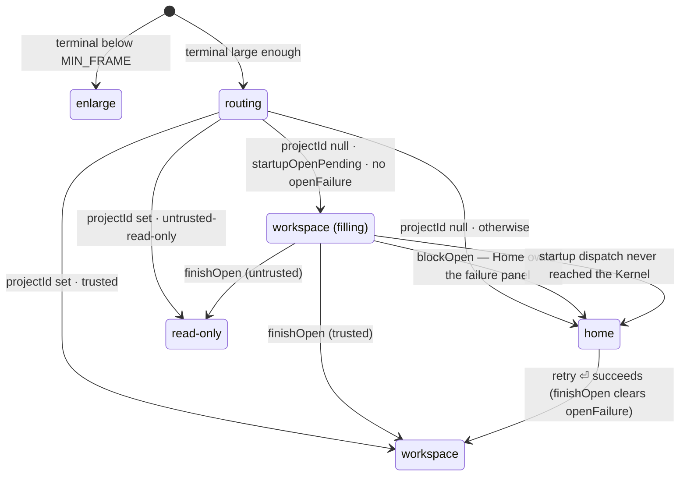

# Workspace-first launch

An existing project must never park on Home while it opens. The Workspace mounts
immediately, the agent health check runs beside it and is visible in the status bar, and
the preview fills in as soon as the Kernel publishes descriptors.

## Problem

Relaunching termcraft inside an existing project already lands in the Workspace
eventually (Gap D, `flows/launch.md`) — but only after the whole Kernel ready sequence
finishes. Until then the user stares at Home.

Two facts make that window long and the screen misleading:

- `runProjectReadySequence` (`src/core/kernel/model/handlers/project.ts:548`) accumulates
  its events into one array and publishes them as a single batch. Nothing reaches the UI
  before `finishOpen`. The dominant cost inside that batch is `buildPageDescriptors` — a
  live Gate pass, type-check included, over every canonical page.
- `deriveScreen` (`src/ui/mirror/model/screen.ts:32`) holds Home for as long as
  `projectId` is `null`, which is exactly that whole window. `flows/launch.md` puts it at
  up to ~30 s.

So the user sees the wrong screen — a "describe the TUI you want to design" prompt over a
project that already exists — for half a minute, and the preview pane they are actually
waiting for is not even mounted.

The agent health probe is already parallel: `createUiDeps` fires `refreshHomeHealth()` at
construction (`src/ui/app/model/deps.ts:781`). Its result is simply invisible anywhere but
Home. Removing Home from this path therefore *requires* moving that surface, or the change
would regress: a dead agent CLI would produce no on-screen signal at all.

## Scope

In: the screen routing, what the Workspace renders while the project opens, moving the
agent-health surface into the Workspace status bar, and the module extraction that move
implies.

Out: any change to `runProjectReadySequence`. Publishing `finishOpen` early, or gating the
active page ahead of the rest, would make the Workspace fill progressively instead of in
one jump — but both weaken the "descriptors are complete and ordered at `ready`" invariant
the capability guards and `flows/launch.md` rely on. That belongs in its own spec.

Consequence, stated plainly rather than buried: with the Kernel untouched, the Workspace
shell appears instantly and the agent check is visible immediately, then chat, tabs and
preview all arrive together at `finishOpen`. The ~30 s wait does not shrink. What changes
is that the user waits on the right screen, watching the one check that is genuinely
running.

## Decisions

**`launch.existing` is the routing predicate, not `hasContent`.** "Already initialized"
means `.termcraft/` is on disk. The startup dispatch in `run-app.ts` moves to the same
predicate, because routing to the Workspace on one fact while dispatching `project.open`
on another would strand an existing-but-empty project in a Workspace that never opens.
One predicate replaces two, and the `existing && !hasContent → Home` branch — which
`src/entrypoint/types.ts:38` already calls practically unreachable, since `createProject`
always mints the first chat header — disappears.

**A blocked open falls back to Home.** Home keeps `HomeOpenFailurePanel`, the
`project.close` recovery in `deps.ts`, and the ⏎ retry, all unchanged. The alternative —
a failure panel inside the Workspace — would need a retry key that is not ⏎ (the composer
owns it) and therefore a new design surface, to show a Workspace for a project that is not
open.

**No health re-check in the Workspace.** The badge is the reading taken at startup and it
is never refreshed. If the user signs in to the agent CLI in another terminal, the badge
stays red until termcraft is restarted. This is a deliberate trade, not an oversight: the
alternative was a `/recheck` slash action (~30 lines, reusing `refreshAgentHealth`), and
it was declined. The design only ever mandated `r` on *Home's* error state
(`flows/launch.md` walkthrough step 9), so nothing in the source of truth is violated —
but the staleness is real and is recorded here so it is not rediscovered as a bug.

**No full-screen takeover in the Workspace.** `missing` seizes the whole screen on Home,
which is right — nothing is behind it. In the Workspace there is an open project: preview,
history, chat and export all work without an agent; only turns do not. Hiding a working
project behind a problem that blocks one capability out of six is wrong.

**The composer is not gated on health.** A dead CLI does not disable ⏎. The badge states
the fact and the user decides. `checking` alone would otherwise lock the composer for up
to 20 s at every launch.

## Screen routing



`opening` is not a new `ScreenKind`. It is `"workspace"` with `projectId === null`, which
is why the transition to a filled Workspace is a re-render rather than a remount.

`deriveScreen` gains two inputs and one branch:

```ts
if (input.terminal.w < MIN_FRAME.w || input.terminal.h < MIN_FRAME.h) return "enlarge";
if (input.projectId === null) {
  // An existing project's destination IS the Workspace — mount it now and let it fill,
  // rather than parking on Home for the whole ready sequence. A blocked open drops back
  // to Home, which owns the failure panel and the ⏎ retry.
  if (input.startupOpenPending && !input.openFailed) return "workspace";
  return "home";
}
if (input.trust === "untrusted-read-only") return "read-only";
if (input.trust === null) return "trust-prompt";
return "workspace";
```

`openFailed` is `mirror.project().openFailure !== null`; `createScreenAtom` already holds
`() => mirror.project()`, so no new wiring is needed for it. `trust-prompt` stays exactly
as unreachable as it is today: `kernel.project.finishOpen` folds `projectId` and `trust`
in one `project.set` (`src/ui/mirror/model/mirror.ts:400`), so there is no intermediate
state where one is known and the other is not.

### The retry sequence needs no special case

It converges on the rules above:

1. `blockOpen` sets `openFailure`, leaves `projectId` null → Home, panel visible.
2. The recovery in `deps.ts` dispatches `project.close`; `finishClose` resets the project
   slice but deliberately preserves `openFailure` → still Home, panel still visible.
3. ⏎ dispatches `project.open`; `beginOpen` sets `opening: true` while `openFailure` is
   still set → still Home, now showing its own `opening project…` status. This is the
   state Home is already designed for.
4. `finishOpen` clears `openFailure` and sets `projectId` → Workspace.

### `startupOpenPending`

A UI-local atom seeded from `UiEnv.projectExists` (itself set from `ShellLaunchV1.existing`
in `resolveEnvWithProjectIdentity`). It is not `mirror.project().opening`: that only turns
true once the command is admitted, so between UI mount and admission `projectId` is null
and `opening` is false — Home would flash for a frame. The composition root knows
synchronously, before the UI mounts, that it is going to open a project. That fact is the
input.

It has exactly one transition, and it exists to close a hole the current code already
documents (`run-app.ts:132-144`): the startup `project.open` dispatch can fail or be
rejected, and today that is only logged. Neither `finishOpen` nor `blockOpen` ever
arrives, so `projectId` and `openFailure` both stay null forever. Before this change that
stranded the user on Home; after it, on an empty Workspace shell, which reads worse — Home
at least says something coherent.

- `createUiDeps` exposes `abandonStartupOpen`, a named Reatom action that sets the atom
  false. An action rather than a bare setter because `runApp` calls it from a promise
  continuation, outside any Reatom frame (RTM-A04); it is not an identity setter
  (RTM-S01) — it names a real transition, "the startup open will never arrive".
- `createUiRoot` hoists `const deps = createUiDeps(...)` above the `root.render(...)` call
  (today the call is inline in the JSX) so the returned handle can close over it, and
  `UiRootHandle` gains `abandonStartupOpen(): void` beside `dispose()`.
- `run-app.ts` calls it on both failure branches of the startup dispatch, in addition to
  the existing `console.error`.

## What the Workspace renders while opening

The state is `mirror.project().projectId === null`. No new flag: the Workspace is a
`reatomComponent` and already reads the project slice.

Three places change.

**Preview region.** Today `!hasPages` falls through to `EmptyState` — "No pages yet —
describe what to build" (`Workspace.tsx:320`). During an open that is false: "there are no
pages" and "the pages have not been read yet" are different facts. A `projectId === null`
branch goes *before* that check. What it renders is a design gap (below).

**Status bar.** The `page` slot is free while opening — there is no active page slug yet —
so the opening indication goes there. This is the same slot choice Home already made for
the same state (`Home.tsx:335`).

**Composer.** Typeable, ⏎ marked `dis` — the treatment Home already gives `opening`. The
type-then-send race needs no new handling: `composer-submit` already clears the text only
on `accepted`.

Tabs and the chat panel need nothing: they are simply empty until descriptors and records
arrive.

## Agent health in the Workspace status bar

The Workspace starts reading the health atom, which today has exactly one consumer (Home,
via `App.tsx:258` and the home branch of `keymap.ts`).

`checking` is rendered, not just the error states. That is the visible result of this whole
change: the Workspace appears instantly and the status bar shows the agent check running
beside it. `ready` shows no badge, matching Home. `missing`, `blocked` and `advisory` show
a badge and nothing more — no takeover.

Inherited divergence: `StatusBarHintBadge` is plain text and cannot host a component
(`Home.tsx:56` already documents this), so the `⠹` in the bar is static, not animated.
Home lives with it; the Workspace will too.

The `hint` slot is already a four-tier precedence chain (`Workspace.tsx:746`): `readOnly`
→ turn running → preview halt → none. Health becomes a fifth tier. One ordering constraint
is architectural rather than aesthetic: **`turn running` must outrank health.** While a
turn runs the agent is alive by demonstration, and a stale `✗ not signed in` sitting under
it would contradict what is happening on screen in the same second.

Health versus preview halt is a design question (below). Until design answers it, health
is implemented as the lowest tier — last in the chain — so that no already-designed badge
is displaced by an undesigned one.

### Module extraction

The type is `HomeAgentHealth`, the atom is `local.homeHealth`, the action is
`refreshHomeHealth`, and all of it lives in `ui/home/types.ts`. Once the Workspace reads
it, `ui/workspace` would depend on `ui/home` and every one of those names would be false.

- New module `ui/agent-health/` — `types.ts` plus `index.ts`, no subfolders needed since it
  holds no logic (CLAUDE.md permits both files at a module root).
- `HomeAgentHealth` → `AgentHealth`, moved there verbatim, doc comment intact. The unused
  `HomeHealthOutcome` alias is dropped rather than carried along.
- `local.homeHealth` → `local.agentHealth`; `refreshHomeHealth` → `refreshAgentHealth`;
  `UiRootOptions.agentHealthProbe` keeps its name, which was already correct.
- `homeSubmitAllowed` **stays** in `ui/home`: it is Home's own submit policy, and the
  Workspace composer is deliberately not gated on health.
- `HomeAgentSelection` and `HomeCombo` **stay** in `ui/home`. The Workspace reads agent
  identity from `mirror.agentIdentity()`, not from the registry default.

Touched by the rename: `ui/app/model/deps.ts`, `ui/app/model/root.tsx`,
`ui/app/ui/App.tsx`, `ui/app/model/keymap.ts`, `ui/home/**`, `ui/workspace/**`,
`entrypoint/model/agent-health.ts`, `entrypoint/model/run-app.ts`, and their tests.
`entrypoint`'s own verbatim-lifted `HomeAgentSelection` is unaffected — `ui` never imports
`entrypoint`, and that lift stays as it is.

## Home's narrowed role

Home's code barely changes; its reach does. It is now reached in exactly two situations: a
genuinely fresh directory, and a startup open that failed. `HomeOpenFailurePanel`,
`HomeAgentMissing`, the full-screen takeover and the `opening` prop all remain reachable
and unmodified.

One comment must be rewritten or it becomes a lie: `home-submit`'s `project.open` branch
(chosen when `deps.env.projectExists`) existed for the existing-but-empty project. That
case now routes to the Workspace, so the branch serves exactly one scenario — ⏎ after a
failed open. It is still required; its stated purpose is not.

## Design gaps

None of these are invented here. They go into a prompt under `design-prompts/`:

1. The preview region while the project is opening — distinct from `wsEmpty`'s "No pages
   yet", which asserts a different fact.
2. The status bar's `page` slot during the open.
3. Whether the chat panel shows anything while empty and waiting.
4. The agent-health badge: appearance for `checking` / `advisory` / `blocked` / `missing`,
   and its precedence against `preview halt` in the `hint` slot. Note for the designer: a
   crashed preview's own repair path is F6 → a turn → the agent, so when the agent is dead
   the halt panel's repair hint is untrue.

## Testing

- `ui/mirror/model/screen.test.ts` — the new derivation table, including all four
  transitions out of the opening state.
- `ui/app/ui/App.test.tsx` — an existing project mounts the Workspace, not Home; a
  `blockOpen` drops back to Home with the panel.
- `ui/workspace/ui/Workspace.test.tsx` — the opening branch does not render `EmptyState`;
  the health badge renders for `checking` and the three problem states and not for `ready`;
  `turn running` outranks health in the `hint` slot.
- `ui/app/model/deps.test.ts` — `abandonStartupOpen` flips the atom and the derived screen.
- `entrypoint/model/run-app.test.ts` — both startup-dispatch failure branches call
  `abandonStartupOpen`; the dispatch fires on `launch.existing`.

## Documentation

`docs/architecture/flows/launch.md` needs real edits, not a touch-up: the first mermaid
diagram's `findq -- "present" --> lockq` path no longer ends at Home, the Gap D section
describes `hasContent` as the routing predicate, walkthrough steps 6, 7, 9 and 11 all
describe Home's old reach, and the source anchors for `screen.ts`, `run-app.ts`,
`deps.ts` and `ui/home` all change. `docs/architecture/modules.md` and
`code-structure.md` gain the `ui/agent-health` module.

## Source anchors

- `src/ui/mirror/model/screen.ts` — `deriveScreen`, `createScreenAtom`, `ScreenInput`
- `src/ui/app/model/deps.ts` — `UiEnv.projectExists`, `startupOpenPending`,
  `abandonStartupOpen`, `refreshAgentHealth`, `local.agentHealth`
- `src/ui/app/model/root.tsx` — `UiRootHandle.abandonStartupOpen`, hoisted `createUiDeps`
- `src/ui/app/ui/App.tsx` — screen dispatch
- `src/ui/workspace/ui/Workspace.tsx` — the opening branch, the `hint` precedence chain
- `src/ui/home/types.ts`, `src/ui/home/ui/Home.tsx` — narrowed reach, `homeSubmitAllowed`
- `src/ui/agent-health/types.ts` — `AgentHealth` (new)
- `src/entrypoint/model/run-app.ts` — the startup dispatch predicate and failure branches
- `src/entrypoint/model/agent-health.ts` — `createAgentHealthProbe`, retyped
- `src/core/kernel/model/handlers/project.ts` — `runProjectReadySequence`, unchanged, and
  the reason the fill is one jump rather than progressive
- `docs/architecture/flows/launch.md` — the launch flow this supersedes in part
