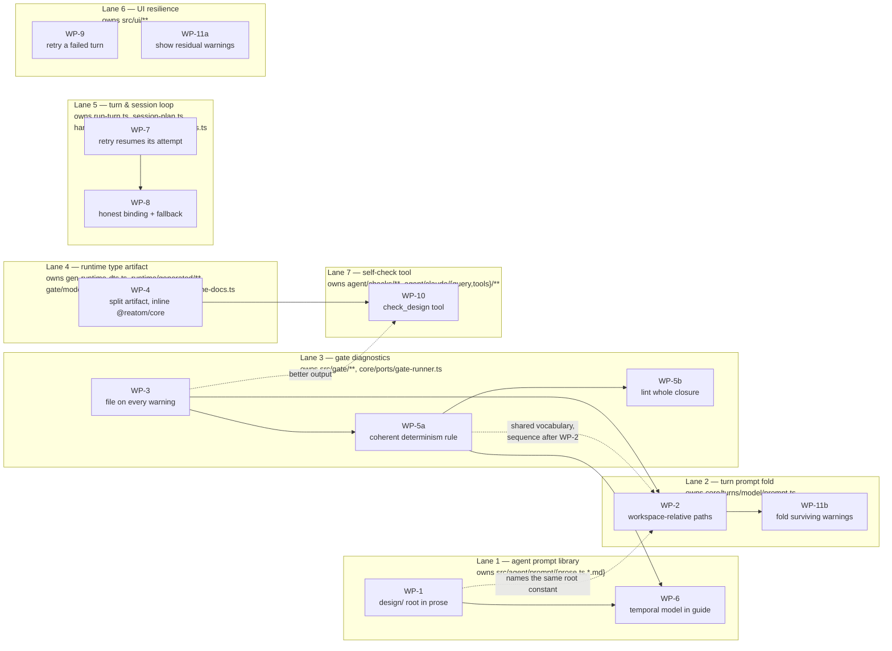

# Design-agent feedback loop repair — design

## Problem

One measured run of the shipped app (project `examples/clock`, 2026-08-09
09:03–09:14 UTC) spent **two agent attempts and one dead turn** on four
one-token type annotations and one determinism warning that could never be
cleared. Every failure in that run traces to termcraft's own wiring, not to the
model.

The run, from `examples/clock/.termcraft/chats/019fe5c3-5157-…jsonl` and the
three sandbox transcripts under
`~/.claude/projects/…termcraft-sandboxes-8ff945b9…-turns-{019fe5c3,019fe5cb}-…-workspace/`:

| # | session | prompt | outcome |
|---|---------|--------|---------|
| 1 | `7ef2d9b8` | "создай страницы с будильником и секундомером и таймером" | Gate rejected: 4 × `TS7006`, 4 × `unguarded-timer` |
| 2 | `28b861a5` | same + folded diagnostics (retry) | accepted; **4 `unguarded-timer` still present** |
| 3 | — | "вынеси общий код…" | `BACKEND_FAILED: No conversation found with session ID: 28b861a5` — turn lost |
| 4 | `c5fc1629` | same message, retyped into a new chat | accepted; 2 `unguarded-timer` |

### Measured failures

**F1 — Every agent run wastes calls rediscovering the tree root.** Five `Read`
calls returned `File does not exist`, one in run 1, three in run 2, one in run 4;
each was followed by a recovery `Glob **/*`:

```
Read pages.json          → ENOENT   (7ef2d9b8 09:03:36)
Read pages/alarm.tsx     → ENOENT   (28b861a5 09:07:35)
Read pages/stopwatch.tsx → ENOENT   (28b861a5 09:07:36)
Read pages.json          → ENOENT   (28b861a5 09:07:36)
Read pages.json          → ENOENT   (c5fc1629 09:12:07)
```

**F2 — Four blocking type errors that are an artifact of the Gate, not of the
page.** The agent wrote `atom<readonly Alarm[]>(INITIAL_ALARMS, "alarmsAtom")`
and `atom<readonly number[]>([], "lapsAtom")` — correctly typed — and was still
rejected with `TS7006` on the callbacks that read them.

**F3 — A warning the agent cannot clear, reported without a file name.** The
retry prompt carried four `- [unguarded-timer] line NN:CC:` lines with no file,
spread across two different files. The agent spent ~90 s of reasoning, produced
`isExport()` guards, and reported "fixed" — while the turn record it produced
still carries all four warnings.

**F4 — The retry throws away everything the first attempt learned.** Run 2 is a
fresh session: it re-read `RUNTIME.md`, `REATOM.md`, `runtime.d.ts` and all five
page files, and re-hit the same ENOENTs, to apply four annotations.

**F5 — Cross-turn resume is structurally impossible, and its designed fallback
is unwired.** Turn 2 terminalized `BACKEND_FAILED`; the user abandoned the chat
and retyped the message into a new one.

### Root causes

**RC1 — The system prompt states a design-tree root that has not been true since
the multi-file tree landed.** `src/agent/prompt/model/prose.ts:45`:

> "Your working directory IS the workspace root, and it IS the design tree. Every
> path below is relative to it — read and edit them as `pages/dashboard.tsx`…"

Staging copies the tree namespace-qualified as `design/pages/home.tsx`
(`src/store/sandbox/model/staging-store.ts:239`), against
`DESIGN_DIRNAME = "design"` (`src/store/safe-fs/model/limits.ts:110`). The
runtime docs *are* at the workspace root; the tree is not. The comment at
`prose.ts:29-36` records that this exact class of defect was fixed once before
(2026-07-27, "six wasted calls and ~7 s per turn") — the prose was not carried
forward when the layout changed.

**RC2 — Two path vocabularies in one prompt.** Gate errors render
`error.file`, which is the tree-relative `entryRelPath`
(`src/gate/adapters/gate-runner.ts:56`, rendered by
`src/core/turns/model/prompt.ts:109`). The agent's tools need the
workspace-relative path. Run 2 took `pages/alarm.tsx` straight from the
diagnostic and got ENOENT.

**RC3 — The hermetic type check silently degrades the whole Reatom surface to
`any`.** The Gate's virtual FS serves only the synthesized tsconfig, the runtime
declaration and the tree's own files
(`src/gate/model/type-check.ts:265-330`), and the synthesized options set
`skipLibCheck: true` (`type-check.ts:72-83`). The staged declaration imports
`atom`/`action`/`computed`/`wrap`/`reatomComponent` and the types
`Atom`/`Computed`/`AtomLike`/`Ext` from `@reatom/core` and `@reatom/react`
(`src/runtime/generated/runtime.generated.d.ts:4-6`), which do not resolve there;
`skipLibCheck` suppresses the resulting `TS2307`, so every one of those names
becomes `any`.

This is a **documented, deliberate trade** — `scripts/gen-runtime-dts.ts:50-62`
states it and pins it with tests ("a page's PROP types are still fully checked …
while Reatom call signatures and component RETURN types go unchecked"). What was
not foreseen is that it *manufactures* fatal diagnostics. A type argument on an
`any`-typed callee is ignored, so `alarmsAtom()` is `any`, and calling `.map` on
`any` yields **no contextual signature at all** — which is precisely the
condition `noImplicitAny` reports as `TS7006`. The asymmetry in the measured run
confirms the mechanism exactly:

| site | expression | flagged |
|---|---|---|
| `alarm.tsx:98` | `alarmsAtom().map((a) => …)` | yes — method on `any` |
| `alarm.tsx:102` | `alarmsAtom().filter((a) => …)` | yes — method on `any` |
| `stopwatch.tsx:126` | `laps.map((lapMs, i) => …)`, `const laps = lapsAtom()` | yes — method on `any` |
| `alarm.tsx:115` | `[...alarmsAtom()].sort((a, b) => …)` | no — spread yields `any[]`, whose signatures type the params contextually |
| `alarm.tsx:119,152` | `alarms.filter/​map` over that `any[]` | no — same reason |

So every page that reads a collection out of an atom and iterates it directly is
rejected once, on first authoring, for a reason the author cannot see and the
annotation cannot really fix — the code is unchecked either way.

**RC4 — The determinism rule is undocumented where it matters, internally
inconsistent, and unguardable.**

- `runtime-authoring-guide.md:60-62` and `reatom-guide.md:141-142` say only "no
  `setTimeout`/`setInterval`/`Math.random` outside animation guarded by the export
  flag". Neither mentions `Date.now()` or `performance.now()`.
- `src/gate/model/lints.ts:15-16,56-61` flags `Date.now`/`performance.now` but
  not `new Date()`, which is equally non-deterministic. The agent noticed the
  asymmetry (thinking, 09:08:38) and explicitly refused to exploit it.
- The kind is named `unguarded-timer`, but `lintDeterminism` is a token scan with
  no notion of a guard. No `isExport()` wrapper can ever clear it. Evidence: the
  post-fix turn record still carries four `unguarded-timer` warnings.
- Nothing tells a page author that the runtime has **no tick at all**. The agent
  discovered it by grepping `runtime.d.ts` for `animation|frame|tick|RAF|interval`
  (09:08:39), after having already designed a stopwatch around
  `elapsed + (Date.now() - startedAt)` — a shape this runtime cannot support.
- Determinism lints run on the page **entry** source only
  (`src/gate/model/gate.ts:208-220`). After run 4 moved `Date.now()` into
  `design/lib/elapsed.ts`, that call became invisible to the Gate. The refactor
  laundered non-determinism past the check.

**RC5 — A Gate retry starts a brand-new agent session.** `run-turn.ts` overrides
only `userMessage` on a retry (`RunTurnInputV1`, `run-turn.ts:242-245`); the
`SessionPlan` is resolved once per turn
(`src/core/kernel/model/handlers/turn.ts:1284`) and reused by every attempt.

**RC6 — The Claude backend advertises a session-workspace binding it does not
have.** `src/agent/claude/backend/model/capabilities.ts:19` declares
`sessionWorkspaceBinding: "rebindable"`, and turn-durability §6.3 expects a probe
that "proves that the resumed run uses the new cwd and writable root". In fact the
SDK indexes sessions by cwd, and each turn gets a create-new workspace
`turns/<turnId>/workspace` (`staging-store.ts:91-98`) — so a session id from a
previous turn is unresolvable from the new cwd. Measured: `No conversation found
with session ID: 28b861a5`.

**RC7 — The designed fallback for exactly this failure is unwired.**
`fallbackToFreshSession` (`src/core/turns/model/session-plan.ts:69`) exists and is
tested, with no production caller — already recorded in
`docs/mvp-remaining-work.md:844`. A rejected resume therefore terminalizes the
turn instead of degrading to a fresh session.

**RC8 — The agent cannot check its own work.** `Bash`, `BashOutput`, `KillShell`,
`WebFetch` and `WebSearch` are denied
(`src/agent/claude/tools/model/vocabulary.ts`), and no in-process tool replaces
them. The only feedback channel is a full re-run of the turn, so a mechanical,
locally-fixable diagnostic costs ~2.5 min and a complete re-read.

## Decisions

- **The design tree's root is named in one place and stated honestly in the
  prompt.** No work package invents a second root or renames `design/`.
- **The prompt speaks one path vocabulary: workspace-relative.** Tree-relative
  paths stay internal to the Gate and are translated at the fold.
- **No fabricated types.** RC3 is fixed by *generating* the external declarations
  from the real `@reatom/core`, never by hand-written stand-ins — the honest-values
  rule in `gen-runtime-dts.ts:47-49` is binding.
- **The size objection to inlining is resolved by splitting the artifact, not by
  reopening it.** `gen-runtime-dts.ts:44-46` rejected inlining because the same
  string is the agent's prompt attachment. Once the Gate copy and the prompt copy
  are separate artifacts, inlining costs the prompt nothing.
- **Determinism gets one coherent story.** Either a diagnostic can be guarded and
  the lint understands the guard, or it cannot and the message says so. The
  current middle state is not kept.
- **Every work package is owned by exactly one lane, and lanes own disjoint file
  sets.** Parallelism is a property of the plan, not of the executor's luck.

## Work packages

### WP-1 — State the real design-tree root in the system prompt

*Lane 1. No dependencies.*

`src/agent/prompt/model/prose.ts`, `PAGE_FILE_LAYOUT`:

- Replace the "your working directory … IS the design tree" sentence with the
  two-root statement: the cwd is the workspace root; the design tree is
  `design/` inside it; `RUNTIME.md`, `REATOM.md` and `runtime.d.ts` sit at the
  workspace root beside it.
- Restate every example path with its real prefix — `design/pages.json`,
  `design/pages/dashboard.tsx`, `design/lib/theme.ts`.
- Keep the existing leading-slash warning verbatim; it is still correct.
- Update the `// THE PATHS LINE IS LORE` comment to record *this* regression as
  the second occurrence, so the next layout change has a third warning.

> **CORRECTED 2026-08-10 (C1), by Task 1 of the plan — the paragraph below was
> retracted, not silently rewritten.** It read: "`src/agent/prompt/model/prose.test.ts`:
> a drift test asserting the prose's stated root equals the shipped constant.
> `prose.ts` must not import `store/safe-fs`'s `DESIGN_DIRNAME` (domain-free ring);
> the test imports both and compares, which is the same pairing discipline
> `limits.ts:106-110` already documents." That reasoning applies to `limits.ts`'s
> LOCAL COPY only — whose own comment says so. The CANONICAL constant lives in
> `src/entities/design-tree/types.ts` and is exported from that module's index, and
> `agent/` imports `entities/` freely today. So `prose.ts` **imports and
> interpolates** the constant, which makes the drift impossible rather than merely
> detected — strictly better than the test this paragraph proposed. No drift test
> was written. Full text: the plan's "Corrections to the spec" section, C1.

**Done when** the prose names `design/` as the tree root and the stated root is
interpolated from the canonical constant, so the two cannot diverge.

### WP-2 — One path vocabulary in the folded diagnostics

*Lane 2. Depends on WP-3 (renders the `file` field WP-3 adds).*

`src/core/turns/model/prompt.ts`:

- Introduce a single `toWorkspacePath(file: string)` helper that prefixes the
  design-tree directory, and route both `formatGateError`'s `location` and
  `formatGateWarning`'s `location` through it.
- ~~The prefix is a module constant paired with `DESIGN_DIRNAME` the same way
  WP-1 pairs the prose — `core/` may not import `store/`, so the pairing is
  asserted by test, not by import.~~ **CORRECTED 2026-08-10 (C1), by Task 3.**
  Same error as WP-1's, and with a stronger fact against it: `core/turns`
  **already holds** exactly the constant this bullet asks for —
  `DESIGN_TREE_FILE_PREFIX = \`${DESIGN_DIRNAME}/\`` in
  `src/core/turns/model/candidate.ts`, built from the canonical
  `entities/design-tree` export. `toWorkspacePath` reuses it. No pairing test.
- Document in the header that the Gate's own DTO stays tree-relative and the
  translation happens exactly here, at the boundary where the text becomes
  something the agent will type into a tool call.

**Done when** a folded rejection for `pages/alarm.tsx` renders
`in design/pages/alarm.tsx`, and a test pins that the rendered path is exactly
what a `Read` from the workspace root resolves.

### WP-3 — Give every warning a file

*Lane 3. No dependencies. Blocks WP-2.*

- `src/gate/types.ts`: `GateWarning.file` stops being "set only by the whole-tree
  pass". Update the doc to state that a warning produced against one source names
  that source.
- `src/core/ports/gate-runner.ts`: same correction on `GateWarningV1.file`
  (both redraw the same shape per decision C1).
- `src/gate/model/gate.ts`: `runGate` already holds `fileName` at the call sites
  (`gate.ts:208-220`); stamp it onto every warning the per-page lints return,
  the same way `unscannablePage` already stamps errors.
- `src/core/turns/model/prompt.ts`: delete the header sentence claiming an unnamed
  warning is normal (coordinate with WP-2, same lane order).

**Done when** a page with `Date.now()` yields a warning carrying its entry path,
and the fold renders `- [unguarded-timer] in design/pages/stopwatch.tsx line 55:31: …`.

### WP-4 — Close the `any` hole in the hermetic type check

*Lane 4. No dependencies. Blocks WP-10.*

Split the one generated string into two artifacts with different audiences:

- **Prompt copy** — `src/runtime/generated/runtime.generated.d.ts`, unchanged:
  external types stay by reference, and it stays the small, readable reference
  `runtime-docs.ts` stages into the workspace.
- **Gate copy** — `src/runtime/generated/runtime-dts.ts`'s `RUNTIME_DTS` gains the
  `@reatom/core` declarations inlined, emitted from the installed package's real
  `dist/index.d.ts` at generation time (resolved through module resolution, the
  same way `gen-runtime-dts.ts` already resolves the `tsc` platform package). It
  is committed, so nothing at install or run time depends on a `node_modules`
  layout — which is precisely the binding `gen-runtime-dts.ts:58-62` refused, and
  this does not reintroduce it.

Scope of the inlining is `@reatom/core` only — it is the single origin of all four
measured `TS7006`s. `@reatom/react`'s `reatomComponent`, `@opentui/react`'s JSX
factories and the unqualified `React.ReactNode` stay by reference and stay
documented as unchecked; `@types/react` is not installed and inventing those
declarations is forbidden.

Files: `scripts/gen-runtime-dts.ts` (the emit + a second flattening target),
`src/runtime/generated/runtime-dts.ts` (regenerated),
`src/runtime/generated/runtime-dts.test.ts` (the drift test now compares each
artifact against its own emit), `src/gate/model/type-check.ts` (no logic change;
its header stops claiming the unresolved specifiers are harmless).

**Done when** a fixture page doing
`atom<readonly Item[]>([], "items")().map((i) => i.name)` type-checks clean **and**
`…map((i) => i.nope)` produces a `type` diagnostic — i.e. the check is real in
both directions.

*Contingency.* If WP-4 is deferred, land **WP-4a** in Lane 1 instead: one
paragraph in `runtime-authoring-guide.md` stating that atom reads are untyped
under the Gate's check and every callback parameter over atom state must be
annotated. It is a mitigation, not a fix, and it is deleted by WP-4.

### WP-5 — Make the determinism rule coherent

*Lane 3, after WP-3. Two steps.*

**WP-5a — the lint tells one story.** `src/gate/model/lints.ts`:

- Decide `new Date()` explicitly. Recommended: flag it (a `new` + `Date` token
  pair), because the rule is about wall-clock reads and today's omission is an
  accident of shape, not a judgement.
- Resolve `unguarded-`. Recommended: rename the kinds to
  `nondeterministic-time` / `nondeterministic-randomness` and reword the messages
  to state what to do instead — "a sealed render has no wall clock; hold the value
  in an atom and advance it from an action". A guard-aware lint is the
  alternative, and is deliberately **not** chosen: it would need scope analysis
  a token scanner cannot do honestly.
- The kind rename ripples through `gate/types.ts`, `core/ports/gate-runner.ts`,
  `core/protocol/model/event-payload.ts` (plus its own "eight fixed warning kinds"
  assertion in `event-payload.test.ts`), and `core/turns/model/prompt.ts`'s
  `DETERMINISM_WARNING_KINDS`. All are in Lane 3's or Lane 2's owned set; sequence
  WP-5a after WP-2 lands if both touch `prompt.ts`.
  **CORRECTED 2026-08-10 (C14), by Task 4.** This bullet also listed
  ~~`entities/chat`'s decoder~~. It does not ripple there:
  `chatWarningSnapshotSchema` is `{ kind: z.string().min(1), message:
  z.string().min(1) }` — no kind enumeration, so there is nothing to rename. The
  `event-payload.test.ts` assertion, which this bullet omitted, is the real
  additional site. Full text: the plan's C14.

**WP-5b — lint the whole closure, not only entries.**
`src/gate/adapters/gate-runner.ts`: run the determinism and `silencing-any` lints
over every file in the resolved closures, attributing each warning to its own file
(WP-3) and to the pages whose closure reaches it, reusing the existing
`slugsByFile` inversion (`gate-runner.ts:130-160`) rather than a second walk.

**Done when** moving a `Date.now()` from a page entry into a shared module keeps
the warning, and the warning names the shared module.

### WP-6 — Document the runtime's temporal model

*Lane 1, after WP-1.*

`src/agent/prompt/model/runtime-authoring-guide.md` — a new section stating
plainly what the transcripts show the agent had to reverse-engineer:

- A page renders once per commit. There is no tick, no animation frame, no
  interval.
- Any value that would change with time lives in an atom and advances only from
  an action.
- The complete list of what the Gate flags as non-deterministic, matching WP-5a's
  final vocabulary exactly — including `Date.now()`, `performance.now()` and
  whatever WP-5a decides about `new Date()`.
- A worked stopwatch example, because it is the canonical case the run failed on:
  `elapsedMsAtom` advanced by `start`/`stop`/`lap`, no wall-clock delta anywhere.

Mirror the determinism paragraph in `reatom-guide.md:141-142` so the two guides
cannot drift.

**Done when** the guide's list of flagged constructs is asserted, by test, to
equal the lint's own identifier sets.

### WP-7 — A Gate retry resumes the attempt it is correcting

*Lane 5. No dependencies.*

Within one turn the workspace is identical across attempts (both measured
sessions live in the same `turns/019fe5c3-…/workspace`), so a resume is valid
here even while cross-turn resume is not (RC6).

`src/core/turns/model/run-turn.ts`: the retry path already overrides
`userMessage`; additionally override `session` with
`{ kind: "resume", sessionId, promptDelta: <the fold> }`, taking `sessionId` from
the rejected attempt's own outcome (`AgentRunOutcome.sessionId`,
`src/agent/types.ts:62`). A rejected attempt that produced no session id (a
backend error) falls back to the turn's original plan.

**Done when** attempt 2 of a rejected turn carries a `resume` plan naming
attempt 1's session, and a test proves the folded diagnostics travel as the
resume's `promptDelta` rather than as a fresh first message.

### WP-8 — Cross-turn resume: tell the truth, then degrade

*Lane 5, after WP-7.*

Two parts, in order:

1. **Correct the capability.** `src/agent/claude/backend/model/capabilities.ts:19`
   advertises `rebindable`; the measured behaviour is `fixed` for the shipped
   per-turn workspace layout. Flip it to `"fixed"`.
   **CORRECTED 2026-08-10 (C6), by Task 9.** The retracted half of this item read
   "…and let the checkpoint comparison **stop proposing impossible resumes**".
   Flipping the flag achieves no such thing: `sessionWorkspaceBinding` has **no
   production consumer at all** — `evaluateSessionPlan`
   (`src/core/turns/model/session-plan.ts`), the comparison that decides whether a
   resume is proposed, never reads it. Flipping it is an **HONESTY fix and nothing
   more**; every behavioural gain in this WP comes from part 2. Also corrected: the
   probe is no longer a "follow-on" — spike 12's observation D IS that probe, run
   deliberately (a real session id, resumed from a different cwd, rejected), so the
   value is now set from an experiment. Both the missing consumer and what a future
   probe would have to show are ledgered in `docs/superpowers/red-debt.md`. Full
   text: the plan's C6.
2. **Wire the fallback.** Call
   `fallbackToFreshSession` (`src/core/turns/model/session-plan.ts:69`) when an
   attempt fails with a resume rejection, before terminalizing. Detection lives at
   `run-turn.ts:445-452`, where the outcome is currently mapped straight to
   `BACKEND_FAILED`. `docs/mvp-remaining-work.md:844` is updated or removed as part
   of this WP.

**Done when** a backend that rejects a resume produces a completed turn on a fresh
session instead of a terminal failure, and no code path proposes a resume the
advertised binding says is impossible.

### WP-9 — A failed turn keeps its message reachable

*Lane 6. Needs a short spike first.*

Confirm whether a turn that terminalizes `BACKEND_FAILED` already offers a re-send
affordance. The measured run suggests it does not — the user created two new chats
within 20 s and retyped. ~~If confirmed absent, add one: the failed turn's user
text is already persisted in the chat record, so the change is a UI affordance over
existing state, not new storage.~~

> **CORRECTED 2026-08-10 (C11), by Task 11 — "add one" was not a decision this
> spec was entitled to make.** WP-9 is **UNDESIGNED**.
> `design/12-errors-edge-states.dc.html` carries ten error screens (`err-agent-80`,
> `lock-80`, `term-small-80`, `ws-broken-source-120`, `ws-cancelled-120`,
> `ws-err-retry-120`, `ws-host-crash-120`, `ws-host-crash-noretry-120`,
> `ws-host-unavailable-120`, `ws-host-unavailable-noretry-120`) and **not one is a
> backend failure or a re-send**. The design's own answer to a failed generation is
> the OPPOSITE of a re-send affordance: `wsErrRetry`'s system line
> `⟲ generation failed after 3 tries — current design unchanged`. CLAUDE.md's
> "Design is a source of truth — never invent it" forbids drawing the missing
> screen, so Task 11 shipped only the half that adds **no new visual language**:
> on `turn.failed` (never `turn.cancelled`) the failed turn's own text is restored
> into the EXISTING composer draft, append-never-overwrite. The affordance itself
> is ledgered with NO OWNER and needs a design decision first. Full text: the
> plan's C11, and the WP-9 row in `docs/superpowers/red-debt.md`.

**Done when** a terminal turn failure leaves the user one keystroke from retrying
the same message.

### WP-10 — Give the agent a self-check tool

*Lane 7. Depends on WP-4 (else the tool reports the same manufactured `TS7006`s)
and benefits from WP-3.*

The highest-leverage change and the largest. An in-process SDK MCP server
(`createSdkMcpServer`, wired through the `Options.mcpServers` field
`src/agent/claude/query/model/query-options.ts` already builds) exposing one tool,
`check_design`, that runs the same Gate pipeline over the **live workspace** and
returns its diagnostics in the same vocabulary the retry fold uses.

- New module `src/agent/checks/` (`model/`, `types.ts`, `index.ts`), consuming the
  `GateRunner` port — not `gate/` directly, so the agent ring keeps its existing
  dependency direction.
- `src/agent/claude/tools/model/vocabulary.ts`: the new tool joins the allowed
  set. ~~`can-use-tool.ts` confines it to the turn workspace like every file
  tool.~~ **CORRECTED 2026-08-10 (C9), by Task 12 — it structurally cannot.**
  `createConfinementPolicy` (`src/agent/confinement/model/policy.ts`) denies by
  default anything not in `fileTools`, then resolves a path out of `PATH_FIELDS`
  and denies when none resolves. `check_design` is **pathless** — it takes no
  arguments at all — so it would hit that second denial. `ConfinementTables`
  therefore gained a **THIRD SET**: allowed, with no path to resolve. The tool's
  confinement comes from its IMPLEMENTATION (it reads the turn workspace the
  adapter already holds), not from an argument the policy can check. Full text:
  the plan's C9.
- `Bash` stays denied. This is a scoped check, not a shell.

**Done when** an agent that writes a page with an implicit-any callback and a
wall-clock read can see both, fix both, and finish inside one attempt — the
measured run's entire retry becomes unnecessary.

### WP-11 — Stop reporting "fixed" while warnings stand

*Two halves, one per lane, no cross-dependency.*

- **WP-11a (Lane 6)** — surface a turn's residual `warnings` in the chat record's
  rendering. The data is already persisted (the measured records carry 4 and 2
  entries respectively); today nothing shows it, so the agent's prose is the only
  signal the user gets, and in the measured run that prose was wrong.
- **WP-11b (Lane 2)** — when a turn is *accepted* with determinism warnings
  still present, carry them into the next turn's prompt the same way a rejection's
  diagnostics are folded, subject to the existing freshness barrier
  (`prompt.ts:16-21`). A warning that survives a "fix" must not go quiet.

## Dependency graph



Solid edges are hard ordering. Dotted edges are coordination: the work is
independent, but the two packages must agree on one name or land in one order to
avoid rewriting each other's text.

## Parallelism plan

Lanes own disjoint file sets, so lanes run concurrently with no merge contention.
Within a lane, work is strictly sequential.

| Lane | Owned paths | Packages, in order |
|---|---|---|
| 1 | `src/agent/prompt/model/prose.ts`, `runtime-authoring-guide.md`, `reatom-guide.md` (+ their tests) | WP-1 → WP-6 |
| 2 | `src/core/turns/model/prompt.ts` (+ test) | WP-2 → WP-11b |
| 3 | `src/gate/**`, `src/core/ports/gate-runner.ts`, `src/core/protocol/model/event-payload.ts`, `src/entities/chat/model/decode.ts` | WP-3 → WP-5a → WP-5b |
| 4 | `scripts/gen-runtime-dts.ts`, `src/runtime/generated/**`, `src/gate/model/type-check.ts`, `src/agent/prompt/model/runtime-docs.ts` | WP-4 |
| 5 | `src/core/turns/model/{run-turn,session-plan}.ts`, `src/core/kernel/model/handlers/turn.ts`, `src/agent/claude/backend/model/capabilities.ts` | WP-7 → WP-8 |
| 6 | `src/ui/**` | WP-9 → WP-11a |
| 7 | `src/agent/checks/**`, `src/agent/claude/query/**`, `src/agent/claude/tools/**` | WP-10 |

Note the two lane-boundary exceptions, both deliberate: `runtime-docs.ts` lives
under `src/agent/prompt/model/` but belongs to Lane 4, and Lane 3 reaches into
`core/ports`/`core/protocol` because WP-5a's kind rename is a vocabulary change
that must move as one commit.

### Waves

| Wave | Runs concurrently | Rationale |
|---|---|---|
| 1 | WP-1, WP-3, WP-4, WP-7, WP-9 | Every one is dependency-free and in a distinct lane. WP-1 alone removes all five measured ENOENTs; WP-4 alone removes the whole manufactured-`TS7006` class. |
| 2 | WP-2, WP-5a, WP-8, WP-11a | Each unblocked by wave 1. WP-2 lands after WP-3 so it can render the new `file`; WP-5a lands after WP-2 so the kind rename rewrites one file once. |
| 3 | WP-6, WP-5b, WP-11b | Documentation and coverage widening, each on top of the vocabulary its lane just settled. |
| 4 | WP-10 | Last, so the tool reports a check that is real (WP-4) in a vocabulary that is final (WP-5a) with locations that are usable (WP-2, WP-3). |

**Minimum useful slice.** If only one wave ships, wave 1 already removes both
measured failure classes and both loop amplifiers: the path errors (WP-1), the
false type rejections (WP-4), the memoryless retry (WP-7). Waves 2–3 are what stop
the *next* class of silent mismatch; wave 4 is what stops the retry loop from
being the feedback mechanism at all.

## Test plan

- **WP-1** `prose.test.ts` — the prose names `design/` as the tree root; a drift
  assertion pairs it with `DESIGN_DIRNAME` and fails if either moves alone. The
  existing assertion that no example path starts with `/` stays green.
- **WP-2** `prompt.test.ts` — a `GateErrorV1` with `file: "pages/alarm.tsx"` folds
  to `in design/pages/alarm.tsx`; a diagnostic with `file: null` still omits the
  clause entirely; the freshness-barrier cases are unchanged.
- **WP-3** `gate.test.ts` — a page whose source contains `Date.now()` yields a
  warning whose `file` equals the entry path handed to `runGate`. `prompt.test.ts`
  — a determinism warning renders with its file.
- **WP-4** `type-check.test.ts` — two new fixtures: `atom<readonly Item[]>` mapped
  with an unannotated callback comes back **clean** (the current behaviour is a
  `TS7006`, so this test fails before the change), and the same page reading a
  non-existent field yields a `type` diagnostic. The existing prop-type fixtures
  stay green. `runtime-dts.test.ts` — each artifact matches its own `--stdout`
  emit, and the prompt copy's byte size does not grow.
- **WP-5a** `lints.test.ts` — the final vocabulary, positive and negative, for
  `Date.now`, `performance.now`, `new Date`, `Math.random`, `setTimeout`,
  `setInterval`, `requestAnimationFrame`. `prompt.test.ts` — the renamed kinds
  still route into the determinism section and the four excluded kinds still do
  not.
- **WP-5b** `gate-runner.test.ts` — a tree whose only `Date.now()` lives in a
  shared module produces exactly one warning, named against that module and
  attributed to every page whose closure reaches it.
- **WP-6** `runtime-authoring-guide.test.ts` — the guide's list of flagged
  constructs equals the lint's identifier sets, so the doc cannot drift from the
  rule it describes.
- **WP-7** `run-turn.test.ts` — a rejected attempt whose outcome carries a session
  id produces a retry task with `session.kind === "resume"` naming it, and the fold
  travels as `promptDelta`; an attempt with no session id falls back to the
  original plan.
- **WP-8** `run-turn.test.ts` / `session-plan.test.ts` — a resume-rejection outcome
  routes through `fallbackToFreshSession` and the turn completes; `capabilities.test.ts`
  is updated to the value the probe (or the decision) settles on, with the
  measured evidence cited in the test's comment.
- **WP-9** `ui/**` — a chat whose last record is a terminal failure exposes a
  re-send affordance for that record's user text.
- **WP-10** a fixture turn where the agent calls `check_design`, receives the same
  diagnostics the Gate would produce, and finishes in one attempt;
  `vocabulary.test.ts` proves `Bash` is still denied and the new tool is confined
  to the workspace.
- **WP-11** `prompt.test.ts` for the fold of surviving warnings under the freshness
  barrier; a UI test that a turn record carrying warnings renders them.

## Out of scope

- Renaming or relocating the `design/` directory. Every package above states the
  existing root; none changes it.
- Teaching the Gate a `paths` map into a live `node_modules`. Explicitly rejected
  by `gen-runtime-dts.ts:58-62` and not reopened — WP-4 inlines at generation time
  and commits the result instead.
- Full external type fidelity for `@opentui/react` and `React.ReactNode`.
  `@types/react` is not installed and `react@19` ships no types; inventing those
  declarations is forbidden. The gap stays documented.
- A guard-aware determinism lint. WP-5a chooses the honest alternative — say the
  construct cannot be guarded — over scope analysis a token scanner cannot do.
- Re-running the Gate continuously as the agent edits. WP-10 is an explicit tool
  call, not a watcher.

## Source anchors

- `src/agent/prompt/model/prose.ts:29-53` — the layout prose and its own record of
  the previous instance of this defect.
- `src/store/safe-fs/model/limits.ts:100-110` — `AGENT_DOC_FILES` and
  `DESIGN_DIRNAME`, the pair that fixes the real workspace layout.
- `src/store/sandbox/model/staging-store.ts:86-98,238-282` — the per-turn workspace
  path and the namespace-qualified staging of `design/**`.
- `src/core/turns/model/prompt.ts:78-130` — the diagnostic renderers and the
  determinism/graph warning partition.
- `src/core/ports/gate-runner.ts:23-105` — `GateErrorV1`/`GateWarningV1` and the
  `file`/`blockedPages` contracts.
- `src/gate/types.ts:61-73` — `GateWarningKind` and `GateWarning.file`.
- `src/gate/model/lints.ts:8-67` — `TIMER_IDENTIFIERS`, `NOW_OBJECTS`,
  `lintDeterminism`.
- `src/gate/model/gate.ts:200-230` — where `runGate` holds `fileName` while the
  lints run.
- `src/gate/adapters/gate-runner.ts:39-70,130-175` — the whole-tree pass, closure
  inversion and `entryRelPath` as the display name.
- `src/gate/model/type-check.ts:41-95,232-340` — the synthesized options and the
  virtual FS's five hooks.
- `scripts/gen-runtime-dts.ts:14-80` — the flattening design and the three
  consequences of hermetic resolution, including the `any` degradation this spec
  turns into a defect.
- `src/runtime/generated/runtime.generated.d.ts:1-6` — the unresolved external
  imports.
- `src/core/turns/model/run-turn.ts:239-252,441-463` — the retry's `userMessage`
  override and the outcome-to-`BACKEND_FAILED` mapping.
- `src/core/turns/model/session-plan.ts:57-78` — `fallbackToFreshSession`.
- `src/core/kernel/model/handlers/turn.ts:1284-1295` — the once-per-turn
  `evaluateSessionPlan`.
- `src/agent/types.ts:11-66` — `SessionWorkspaceBinding`, `SessionPlan`,
  `AgentTask`, `AgentRunOutcome.sessionId`.
- `src/agent/claude/backend/model/capabilities.ts:19` — the advertised
  `rebindable` binding.
- `src/agent/claude/tools/model/vocabulary.ts` — the denied-tool set.
- `src/agent/prompt/model/runtime-authoring-guide.md:60-62`,
  `reatom-guide.md:141-142` — the determinism prose that omits `Date.now()`.
- `docs/mvp-remaining-work.md:844` — the pre-existing record that
  `fallbackToFreshSession` is unwired.
- `docs/superpowers/specs/2026-07-16-turn-durability-staging-design.md:600-620` —
  §6.3's rebindable-session expectation and the probe it requires.
  **This anchor has MOVED**: the probe is no longer required — spike 12's
  observation D ran it. See
  `docs/spikes/12-resume-rejection/SPIKE.md` and the §6.3 row in
  `docs/superpowers/red-debt.md`.

---

## Status

**LANDED.** Implemented in full as
`docs/superpowers/plans/2026-08-09-design-agent-feedback-loop.md`, thirteen tasks,
each independently reviewed by a separate reviewer subagent (several through one or
two fix rounds).

- **Base:** `4612cea`.
- **Tasks 1-12:** `4612cea..dc9f599`, twelve task commits plus their fix-round
  commits.
- **Task 13 (this closeout):** one commit on top of `dc9f599` — the ledger, this
  Status section, the in-place corrections above, and the architecture-doc sweep.
- **Plan:** `docs/superpowers/plans/2026-08-09-design-agent-feedback-loop.md`.
- **Controller ledger** (every finding, every verdict, every fix round, written
  contemporaneously as each task closed):
  `.superpowers/sdd/2026-08-09-design-agent-feedback-loop/progress.md`, with a
  `task-N-report.md` per task beside it.
- **Debt this plan opened**, with owners or an explicit "NO OWNER, and here is the
  evidence": `docs/superpowers/red-debt.md`, section "Debt accumulated by the
  design-agent feedback-loop repair" plus the WP-9 row immediately above it.

### Spikes

Four were written for this plan and **all four were RUN**; none shipped on an
assumption. They keep the filename `SPIKE.md` rather than the `FINDINGS.md` that
spikes 01-09 use, because fifteen citations across five shipped source files and
three documents already name `SPIKE.md`; renaming for consistency alone would churn
all of them in a closeout commit. The four are consistent with each other.

| spike | verdict |
| --- | --- |
| `docs/spikes/10-reatom-dts-inline/SPIKE.md` | YES — and the probe found a SECOND, pre-existing defect the plan did not know about (S1, ledgered) |
| `docs/spikes/11-sdk-mcp-tool/SPIKE.md` | YES — all four questions answered; Task 12's mechanism is sound. Two unlooked-for findings: S3 (the SDK does not validate schemas at the handler boundary) and S4 (a tool ran without `canUseTool`, contradicting a standing claim — ledgered) |
| `docs/spikes/12-resume-rejection/SPIKE.md` | YES — every diagnosis confirmed, and Q2 has a STRUCTURAL discriminator, not just prose. Observation D IS turn-durability §6.3's long-outstanding rebinding probe |
| `docs/spikes/13-determinism-blast-radius/SPIKE.md` | YES — the radius is small (2 → 6 warnings on a 5-page tree) and every prediction held |

### What the design got wrong or left implicit about the code — C1-C15

The diagnosis in **Problem** and **Root causes** survives intact. Every correction
below is about a proposed REMEDY, and each was read against real code at `2f816d7`
on branch `design-tree` before any task started, rather than discovered mid-task.
They are recorded here so the next reader does not re-derive them. **The full text
of each is in the plan's "Corrections to the spec, made here rather than discovered
mid-task" section** — the summaries below are pointers, not replacements.

*(Erratum: that section's own opening sentence says "Fourteen claims"; it lists
fifteen, C1 through C15.)*

| # | what the spec got wrong or left implicit | outcome |
| --- | --- | --- |
| **C1** | WP-1 and WP-2's drift test: `prose.ts`/`prompt.ts` were said to be unable to import `DESIGN_DIRNAME`. That holds for `limits.ts`'s LOCAL COPY only; the canonical constant is exported from `entities/design-tree`, and `core/turns` already holds `DESIGN_TREE_FILE_PREFIX` built from it. | Both packages IMPORT and INTERPOLATE. Drift is impossible, not merely detected. No drift test. **Corrected in place above.** |
| **C2** | WP-4 implied a second virtual file. The Gate's VFS serves exactly one `.d.ts`. | The inline is a `declare module "@reatom/core" { … }` block appended INSIDE the `RUNTIME_DTS` text. No VFS hook, no `type-check.ts` logic change. |
| **C3** | Whether `@reatom/core`'s declaration is mechanically inlinable was assumed. Measured: 302,787 bytes / 7,439 lines, no top-level `import`, no `/// <reference>`, no `export *`, one `export { … }`. | Inlinable. One structural hazard probed rather than assumed — a `declare global` block, which spike 10 proved legal in that position. |
| **C4** | The inline drags in DOM globals the Gate's `lib: ["esnext"]` pin does not supply. | Acceptable and MEASURED at zero diagnostics: `skipLibCheck` silences them; the degradation is bounded and documented. Widening `lib` to `dom` is explicitly NOT the answer. Ledgered. |
| **C5** | WP-4's size argument for leaving `@reatom/react` by reference. Its declaration is only 2,748 bytes, so size was never the reason. | The real reason: it imports `react`, `@types/react` is not installed and `react@19` ships none — inlining would mean inventing React's types. Conclusion holds, reason replaced. Ledgered with NO OWNER. |
| **C6** | WP-8's "let the checkpoint comparison stop proposing impossible resumes". `sessionWorkspaceBinding` has no production consumer; `evaluateSessionPlan` never reads it. | Flipping the flag is an HONESTY fix; the behavioural half is entirely part 2. **Corrected in place above.** Ledgered. |
| **C7** | WP-8 part 2 needs an `AgentRunOutcome` widening the spec did not mention — and `docs/mvp-remaining-work.md:844` already said so. | The classification lives in the Claude adapter, the one layer that knows the SDK's error shape. String-matching the SDK's English message must not ship, and did not (spike 12 supplied a structural discriminator). |
| **C8** | WP-5b asks warnings to be attributed to "the pages whose closure reaches it" — a field `GateWarningV1` does not have. | `GateErrorV1`'s `blockedPages` pattern reused, and the inversion `createClosureIndex` already builds reused rather than re-walked. |
| **C9** | WP-10's "`can-use-tool.ts` confines it to the turn workspace like every file tool". A pathless tool hits `createConfinementPolicy`'s second denial. | `ConfinementTables` gained a THIRD set — allowed, no path to resolve. Confinement comes from the implementation, not from an argument. **Corrected in place above.** |
| **C10** | Whether the installed SDK exports what WP-10 needs was left open. Verified at `@anthropic-ai/claude-agent-sdk@0.3.212`: `createSdkMcpServer`, `tool`, `McpSdkServerConfigWithInstance`, `Options.mcpServers`. | It does. The one genuine unknown — the SDK's `AnyZodRawShape` against this repo's `zod@4` — was PROBED (spike 11 Q1) rather than assumed. |
| **C11** | WP-9's "add one [re-send affordance]". The design has ten error screens and none is a backend failure or a re-send; its answer to a failed generation is the opposite of one. | Only the half needing no new visual language shipped (draft restore). The affordance is UNDESIGNED and ledgered with NO OWNER. **Corrected in place above.** |
| **C12** | WP-11a as written repeats the very failure it fixes: `ChatWarningSnapshot` is `{kind, message}` with no location, so rendering it gives a warning the user cannot locate. | The snapshot was widened with optional `file`/`line`; `.optional()` keeps every already-persisted record decodable. |
| **C13** | WP-11a needed a visual vocabulary the spec did not name. | The design already has one: `wsCancelled`'s red system line naming a file inside the chat sequence (`design/termcraft-engine.js:807` — the plan's own citation said `:806`; Task 11 caught and corrected that off-by-one). A citation, not an invention. |
| **C14** | WP-5a listed `entities/chat`'s decoder in the kind-rename ripple set. Its schema has no kind enumeration. | It does not ripple there. The real additional site the spec omitted is `event-payload.test.ts`'s "eight fixed warning kinds" assertion. **Corrected in place above.** |
| **C15** | The worktree could not run anything: `node_modules` was a real, EMPTY directory. | `bun install` became Task 0. |

Five further uncertainties the plan resolved by READING rather than deferring
(R1-R5 in the same plan section): `promptDelta` is wired and Task 8's
"appears exactly once" assertion is load-bearing; `SK.NewKeyword` exists, so Task 4
needed no lexer change; two map sites in `handlers/turn.ts` drop the warning
location and BOTH had to be fixed or the widened schema would ship unpopulated;
turn-start does not read the previous turn's warnings, so Task 10's real content is
making them reachable; and Task 11's draft restore has an exact precedent whose
append-never-overwrite rule it had to obey.
