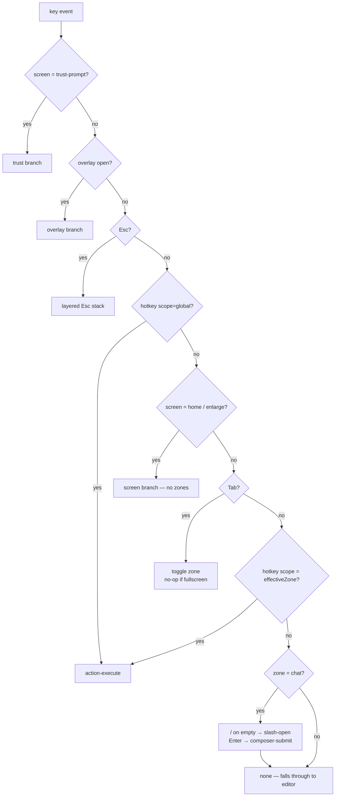

# Focus-scoped hotkeys — design

**Date:** 2026-08-10
**Status:** approved, not yet implemented

## 1. Problem

Every hotkey in this codebase is resolved before focus is consulted. `resolveKey`
(`src/ui/app/model/keymap.ts:202`) reads `context.focus` in exactly one place —
`composerActive` (`:265`), which gates only `Enter` and `/`. Everything else —
`F2`–`F6`, `Ctrl+E`, `Ctrl+P`, `Ctrl+B`/`Ctrl+N`, `PgUp`/`PgDn`, `Ctrl+U`, `Ctrl+D` —
resolves through `resolveHotkey` (`:257`) with no notion of where focus is.

The focus model itself exists and is unused by the keymap: `FocusTarget`
(`src/ui/workspace/model/focus.ts:21`), `Tab` toggles it, and `singleCharKeysActive`
(`:71`) was written to express the design's second hotkey tier but is **never called
from anywhere in `src/`**.

This has a running cost. Because a hotkey wins ahead of the focused editor
unconditionally:

- `Ctrl+B` permanently shadows the editor's `move-left` and `Ctrl+E` its `line-end`
  (`src/ui/text-input/model/key-bindings.ts:42-46`), guarded as *dead* bindings by
  `src/ui/app/model/keymap.test.ts:685`.
- The `Ctrl+←`/`Ctrl+→` aliases for page switching had to be deleted on 2026-08-03
  because they hijacked the composer's own word-jump
  (`src/ui/actions/model/registry.ts:103-107`).

Both are the same defect: a key that means one thing in the chat and another in the
preview has to be assigned globally to one of them, and the other loses.

## 2. Goal

Make a hotkey's meaning depend on which pane owns focus, so that `Ctrl+←`/`Ctrl+→`
move the caret by word while the chat is focused and switch page tabs while the
preview is focused — and so that this generalises to every future key.

## 3. Decisions taken

| Question | Decision |
|---|---|
| How many focus zones? | Two: **chat** and **preview**. No separate zone for the tab strip or the scrollback. |
| Fullscreen (`F2`)? | Chat pane is not rendered; the zone is forced to `preview`. |
| Interactive mode (`F4`)? | Out of scope — still inert. |
| Where is the global/zone boundary? | Global = what cannot collide with typing (F-keys, `Ctrl+E`) plus the two structural gestures (`Tab`, `Esc`). Everything else is zone-scoped. |
| `Ctrl+E`? | Stays global export. The lost `line-end` is accepted (see §9). |
| Do status-bar hints change per zone? | **No.** The row stays the design's own static row. A full key reference is a future dialog, not this work. |
| A zone key pressed outside its zone? | **Strictly nothing.** No fallback, automatic or declared. |
| Its hint, meanwhile? | Renders in the existing `dis` state — visible, greyed. |
| Mouse? | Clicking a pane focuses that pane's zone. |

## 4. Model

Three **scopes** replace the design's two tiers:

```
HotkeyScope = "global" | "chat" | "preview"
```

The zone is the existing `FocusTarget` — no new stored state. It is **derived**, never
stored separately:

```
effectiveZone = fullscreen ? "preview" : focus
```

Deriving it is what keeps it honest: in fullscreen the chat pane is not rendered at all
(`src/ui/workspace/ui/Workspace.tsx:946`), and the preview border is already painted
amber for that case (`:608`), so a stored zone could disagree with the drawn one. A
derived zone cannot.

`Tab` is a no-op while fullscreen, because there is no second pane to reach. "No-op"
here means `resolveKey` returns `none`, so the App does not call `preventDefault()` and
the key falls through like any unclaimed key — it does not silently toggle a zone the
user cannot see.



Strictness is the load-bearing part of step `Z`: a key whose scope is not the
effective zone returns `none` and is **not** looked up a second time in any other
scope.

`singleCharKeysActive` is deleted. The design's single-char tier — "`v`, arrows and
`r` work only when no text input is focused" (§3.8) — *is* the `preview` scope. The
helper was the concept without a mechanism; the scope is the mechanism.

## 5. The table

| Scope | Keys |
|---|---|
| `global` | `F2` fullscreen · `F3` tweaks · `F4` interact · `F5` retry · `F6` repair · `Ctrl+E` export · `Ctrl+P` preview controls · `Tab` · `Esc` |
| `chat` | `PgUp`/`PgDn` (+`Ctrl+U`) scroll · `Ctrl+D` follow latest · `Enter` send · `/` slash menu. Everything unclaimed falls through to the editor: `Ctrl+←`/`Ctrl+→` word-jump, `Ctrl+B` move-left, `Ctrl+W`, `Ctrl+Z`/`Ctrl+Y` |
| `preview` | `Ctrl+←`/`Ctrl+→` page switch (aliases `Ctrl+B`/`Ctrl+N`) |

`Enter` and `/` are listed under `chat` for completeness, but they are not rows in the
action table and gain no `scope` field: they are resolved inline by `resolveKey`
(step `C` of the flowchart above), exactly as they are today. Only table rows carry a
scope.

### 5.1 Page keys are re-spelled, not re-bound

`page.prev`/`page.next` move from `ctrl+b`/`ctrl+n` to `ctrl+left`/`ctrl+right`, with
`ctrl+b`/`ctrl+n` kept as **aliases**. The aliases are mandatory, not decorative:
`src/ui/actions/model/registry.ts:98-101` records by measurement that on the
maintainer's terminal `Ctrl+→` arrives as a bare `\x1b[C` with the modifier dropped,
while `ctrl+n` is a single C0 byte (0x0E) that always arrives. This is precisely what
`HotkeyAction.aliases` was introduced for (`src/ui/actions/types.ts:71-79`).

They keep `hint: false`. The design draws no page-step key anywhere, and the hint row
stays a transcription of the design.

### 5.2 This does not contradict the "must be global tier" notes

`chat.scroll-up` (`registry.ts:160-168`) and `chat.follow-latest` (`:198-202`) each
carry a comment arguing they must be global tier. Read closely, that argument is about
**bare letters** being swallowed as text by a focused composer — `PgUp`/`PgDn` are
multi-character CSI sequences and `Ctrl+U`/`Ctrl+D` are C0 bytes, all rejected by
`printableChar`, which is why *those particular spellings* were chosen.

Scoping them to `chat` does not reintroduce that hazard: they still cannot be typed as
text, and the chat zone is where they already do their work. In the preview zone they
become inert, which is the intended change. Both comments must be updated so they stop
claiming a global binding.

### 5.3 What this repairs

In the chat zone `Ctrl+B` returns to the editor's `move-left` for the first time since
`page.prev` took it. The dead-binding guard (`src/ui/app/model/keymap.test.ts:685`)
therefore changes meaning rather than disappearing: `Ctrl+E` is still shadowed
permanently, `Ctrl+B` no longer is.

## 6. Mouse → zone

Three attachment points, two of which already carry a handler:

| Region | File | Change |
|---|---|---|
| `ws-chat` | `Workspace.tsx:947` | **new** `onMouseDown` → zone `chat` |
| `ws-preview` | `Workspace.tsx:1199` (`onPreviewMouseDown`, element selection) | **also** set zone `preview` |
| tab strip | `Workspace.tsx:330` (`onTabMouseDown`, page switch) | **also** set zone `preview` |

OpenTUI mouse events propagate to ancestors (`stopPropagation` exists in
`node_modules/@opentui/core/index.bun.js` @368087), so one handler on the `ws-chat`
box covers clicks on the scrollback, the pin list and the composer.

"Focusing the chat puts the caret in the input" needs no separate mechanism: the chat
zone *is* `focus === "chat"`, and `composerEditorFocused` (`Workspace.tsx:932`) already
derives the editor's focus from it.

**Known gap, accepted:** the chat scrollbar stops propagation on its own thumb and
arrows (same file, @368087/@379057), so a click landing exactly on the scrollbar will
not switch the zone. Reaching inside a third-party renderable to fix this is not worth
it.

## 7. The disappearing-caret defect

**This is a defect, not a known limitation, and it is gated ahead of §6.** If a click
can silently drop the editor's focus, click-to-focus is built on sand.

Symptom: clicking anywhere — including inside the chat — makes the caret vanish; the
user must click the input itself or `Tab` away and back.

Established: `@opentui/react`'s reconciler applies `focused` **only when the prop
changes** (`node_modules/@opentui/react/chunk-hjtp6jv9.js`:
`case "focused": propValue ? instance.focus() : instance.blur()`). So anything that
blurs the renderable out of band is never undone by React — the prop's value did not
change. That is exactly why `Tab` away-and-back is a working workaround.

**Not established: what does the blurring.** OpenTUI core models focus as a plain
`_focused` flag with `focus()`/`blur()` methods, no global registry and no focus
events, and nothing there ties focus to the mouse. The mechanism is unknown and must
not be guessed at.

First step is a discriminating experiment, not a hypothesis — click into the chat, then
type:

- text appears, no caret drawn → focus was never lost; this is a cursor-rendering
  problem;
- text does not appear → focus really was dropped at the renderable.

`termcraft-debug/` already records `ui.onKey` with the resolved intent per run, which
shows whether the key reached the editor at all. Fix at the source the experiment
points to.

**Explicitly rejected:** re-asserting focus after every click. It masks the cause and
would itself break mouse selection.

## 8. Status bar

`hintKeys` (`Workspace.tsx:176-241`) takes the effective zone. Hints for `chat`-scoped
actions (`PgUp scroll up`, `PgDn scroll down`, `^D follow`) render in the existing
`dis` state while the zone is `preview` — the same state that already greys `⏎ send`
when sending is refused.

The set of keys in the row does not change and the row does not reflow; only their
state does. This is deliberately *not* the rejected "hint row that changes with focus".

## 9. Recorded gaps (not fixed here)

1. **No line-home / line-end in the composer.** `defaultTextareaKeyBindings` binds
   `Home`/`End` to *buffer*-home/end; line-scoped movement lives only on `Ctrl+A` and
   `Ctrl+E`. We remapped `Ctrl+A` to `select-all`
   (`src/ui/text-input/model/key-bindings.ts:47`) and `Ctrl+E` is claimed by export, so
   a multi-line composer currently has **no** key for either. Pre-existing, surfaced by
   this work. A candidate remedy is `Alt+←`/`Alt+→` in the chat scope.
2. **Zone-scoped keys are undiscoverable.** With the hint row static by decision, the
   preview zone's page keys appear nowhere on screen. The agreed answer is a dedicated
   keyboard-reference dialog, deferred to its own work.
3. **Chat scrollbar clicks do not switch the zone** (§6).

## 10. Divergence from the master design

Master spec §3.8 (`docs/superpowers/specs/2026-07-13-termcraft-design.md:326-349`)
defines two hotkey tiers, global and single-char. This design replaces them with three
scopes. It is a deliberate extension, recorded the same way keyboard page switching
already is (`src/ui/actions/model/registry.ts:87-92`) — the visual design is untouched,
and the single-char tier is preserved exactly, as the `preview` scope.

The `FOCUS: CHAT` / `FOCUS: PREVIEW` status chip that the design's `wsFocus`
(`design/termcraft-engine.js:862`) draws is **deliberately not implemented**: the amber
focus border already carries that signal, per the same design's own rule
(`design/15-focus-states.dc.html`).

## 11. Scope of change

**Code**

- `src/ui/actions/types.ts` — `HotkeyScope`, `HotkeyAction.scope`
- `src/ui/actions/model/registry.ts` — scope per row; `resolveHotkey(key, zone)`; page
  keys re-spelled; the two "must be global" comments corrected
- `src/ui/app/model/keymap.ts` — resolution order of §4; `fullscreen` added to
  `KeyContext`
- `src/ui/workspace/model/focus.ts` — `singleCharKeysActive` deleted; `FocusTarget`
  renamed `"composer"` → `"chat"`
- `src/ui/workspace/ui/Workspace.tsx` — mouse → zone; `hintKeys` takes the zone

The rename is included because click-to-focus makes the old name false: clicking the
scrollback or the pin list will set the value, and neither is the composer. 12
`FocusTarget` references and 29 `"composer"` literals across 10 files, half of them
tests.

**Tests**

- a foreign-scope key resolves to `none`, in both directions
- global keys resolve in both zones
- `fullscreen` forces the `preview` zone and makes `Tab` a no-op
- `Ctrl+B` reaches the editor in the chat zone; the dead-binding guard
  (`keymap.test.ts:685`) now covers `Ctrl+E` alone
- a registry guard: no two entries share a `(key, scope)` pair
- clicks on chat / preview / tab strip set the expected zone
- chat-scoped hints render `dis` while the zone is `preview`

**Docs**

- `docs/architecture/flows/interactive-prototype.md` — currently records two tiers and
  "`Tab` toggles composer ↔ preview"
- `docs/architecture/modules.md` — the `src/ui/actions/` description

## 12. Order of work

1. Root-cause and fix the disappearing-caret defect (§7). Gates everything below.
2. `FocusTarget` rename (§11) — mechanical, no behaviour change, and it lands before
   the steps that would otherwise have to write the old name and then rewrite it.
3. Scopes in the table and the resolver (§4, §5), with tests.
4. Mouse → zone (§6).
5. Status-bar `dis` state (§8).
6. Docs.
