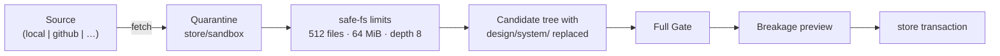

# Project design systems

## 1. Goal

Give the design agent its own visual vocabulary instead of a fixed one.

Two things are locked today. **Color**: `src/runtime/model/tokens.ts` compiles a single
`dark-default` palette into the binary, `ThemeId` is a closed one-member union, and every
component color prop is `keyof ThemeTokens`. A page cannot use a hue the seventeen roles do
not already carry. **Elements**: the facade exports fourteen components; OpenTUI ships roughly
twice that, and a raw lowercase intrinsic does not even type-check (a fatal `TS7026`, because
`JSX.IntrinsicElements` lives in the unresolved `@opentui/react/jsx-runtime` — see
`scripts/gen-runtime-dts.ts`'s `buildReatomCoreBlock` header).

The cost is already measurable in the repository. `examples/clock/.termcraft/design/pages/dashboard.tsx`
carries an agent-written comment explaining that a palette menu offering "blue" resolves to the
`border` token, because the theme has no blue. The same tree carries `components/PageShell.tsx`
— a shared page chrome the agent factored out of five pages unprompted, with deliberately fixed
ids "so they stay stable". Both are the system asking for something it does not have.

After this change:

- a project owns a **design system**: a self-contained, portable folder carrying its own themes,
  its own token names and values, and its own reusable components;
- the agent authors and edits it through ordinary turns;
- the component catalog covers OpenTUI's element and layout surface through termcraft-owned
  wrappers, so authored pages gain reach without gaining a dependency on OpenTUI's release; and
- design systems move between projects through a **source port** whose only stage-1 adapter is a
  local directory, but whose shape a GitHub-backed adapter can join without changing it.

## 2. Non-goals

- **No network in stage 1.** The local source reads a directory the designer populated. termcraft
  downloads nothing and holds no credentials of its own, exactly as it holds no agent API keys.
- **No GitHub adapter here.** This spec fixes the port it must fit; writing it is separate work.
- **No theme switching UI in stage 1.** The manifest declares a *map* of themes from day one and
  the Gate enforces cross-theme token parity, but the shipped manifest carries one theme and the
  shell has no picker for the second.
- **No visual design-system editor.** Tokens change by editing the manifest — through an agent
  turn, or by a designer editing the file. A panel that edits colors interactively is later work
  that this shape permits and does not require.
- **No reuse-enforcement lint.** Nothing statically detects "this page rolled its own button
  instead of using the system's". Reuse comes from the agent being *told* what exists, not from
  a check that cannot honestly be written (`src/gate/model/lints.ts` records why a lint that
  promises more than its scanner can see is worse than no lint).

## 3. The design system as an entity

### 3.1 Storage

A design system is the folder `design/system/` inside the design tree.

```
.termcraft/design/
  pages.json
  system/                      the design system — one portable unit
    design-system.json         identity, themes, component declarations
    tokens.ts                  the typed accessor pages import
    components/Button.tsx
    components/PageShell.tsx
  pages/dashboard.tsx
  lib/time.ts
```

It is a folder rather than a file beside `pages.json` because portability is a stated goal: the
unit that moves between projects has to be liftable whole.

Nothing in `src/store/safe-fs/model/limits.ts` changes. `design/**` is already the
`design-source` namespace with the workspace root budget (512 files, 64 MiB aggregate, depth 8,
2 MiB per file), and `classifyProject` already routes any path under `design/` there. The host
already mounts `treeRoot` as the whole `design/` directory and verifies every file against
`expectedFiles` (`src/host/types.ts`'s `HostSessionSpec`), so `system/` joins the closure, the
inventory, and `treeRevision` with no protocol change.

### 3.2 Manifest

`design/system/design-system.json`:

```json
{
  "schemaVersion": 1,
  "id": "midnight",
  "name": "Midnight",
  "version": "1.2.0",
  "kitApiVersion": 1,
  "defaultTheme": "dark",
  "themes": {
    "dark": {
      "label": "Midnight Dark",
      "tokens": {
        "background": "#0b0f14",
        "surface": "#131a24",
        "foreground": "#c8d3e0",
        "foregroundMuted": "#7d8ea3",
        "foregroundFaint": "#4a5a6e",
        "border": "#243244",
        "line": "#1a2430",
        "accent": "#4cc9f0",
        "accentHi": "#8ae3ff",
        "accentDim": "#2b7f9b",
        "selection": "#16324a",
        "selectionFg": "#8ae3ff",
        "success": "#06d6a0",
        "warning": "#ffd166",
        "danger": "#ef476f",
        "dangerDim": "#4a1c2a",
        "statusBg": "#131a24",

        "brandBlue": "#4cc9f0",
        "chartSeries1": "#7b2cbf"
      }
    }
  },
  "components": [
    { "name": "Button", "module": "components/Button.tsx", "export": "Button" },
    { "name": "PageShell", "module": "components/PageShell.tsx", "export": "PageShell" }
  ]
}
```

The manifest is **data, not code**, and that is the load-bearing property. Three consumers read
it, and two of them must be able to read it without executing or compiling anything:

- the **shell** renders a swatch row in the design-system picker, for candidates that are not
  installed and have never been through the Gate;
- the **Gate** validates it and feeds it to the type check;
- the **agent** receives its themes and component list in the prompt.

A code-shaped design system (`export const midnight = defineTheme({...})`) fails the first
consumer. Reading colors out of it means either executing untrusted code — which termcraft
permits only inside a `HostSupervisor`-owned child, after the Gate — or running a literal
scanner over foreign TypeScript, which the first natural authoring line defeats:
`defineTheme({ ...midnight, tokens: { ...midnight.tokens, accent: "#ffd166" } })` is valid,
readable, and unreadable to a literal scan. That would force the picker to say "this design
system exists but I cannot show you its colors", for reasons the author could not have
anticipated.

Schema validation uses Zod, matching the decoder migration already under way (`entities/pin`
was the pilot).

### 3.3 Identity and versioning

`id` + `version` are what make a design system addressable across projects (§8). `kitApiVersion`
is the same positive integer the page contract uses (`runtime-api` §7.1): a design system's
components are authored against the runtime component catalog, so a system written for a
different runtime API is rejected by the machinery that already exists, not by a new one.

## 4. Tokens and themes

### 4.1 The token model

Every theme MUST declare the **core roles** — the seventeen names currently in
`src/runtime/types.ts`'s `ThemeTokens`. The names are required; the values are the project's.
Beyond the core, a theme MAY declare any number of additional token names.

The core survives because the component catalog already binds to it: `Panel` with no
`borderColor` means `border`, `Table` headers mean `foregroundFaint`, a `Gauge` fill means
`accent`, and status semantics mean `success`/`warning`/`danger`. Without a required core, every
component prop becomes mandatory at every call site, or defaults fall through to the terminal's
own colors and a half-specified page reads as a broken render rather than an authored one.

Values are lowercase `#rrggbb`. Degradation on 8- and 4-bit terminals is the terminal's business;
`colorDepthAtom` stays informational.

### 4.2 Multiple themes

`themes` is a map from day one. The Gate enforces **token-name parity** across every theme in one
system: a token declared in one theme must be declared in all of them. Without parity, switching
the active theme leaves a page reading a token that no longer exists.

Stage 1 ships one theme per manifest and no shell-side switcher. The `runtime-api` §6 promise
that a preview override changes the active theme "without rewriting `meta.theme`" is what the
switcher will use; nothing here forecloses it.

### 4.3 Typed access from pages

The manifest holds the values. TypeScript derives the types from the manifest through
`resolveJsonModule`, so nothing is duplicated:

```ts
// design/system/tokens.ts — part of the scaffold, generated at project create and at install
import { useTokens as useRuntimeTokens } from "@termcraft/runtime"
import ds from "./design-system.json"

export type Tokens = (typeof ds)["themes"]["dark"]["tokens"]
export const useTokens = () => useRuntimeTokens<Tokens>()
```

```tsx
// design/pages/dashboard.tsx
import { useTokens } from "../system/tokens"

export default reatomComponent(function Page() {
  const t = useTokens()
  return <Text id="title" color={t.brandBlue}>…</Text>
})
```

`t.brandBlu` is a fatal type error. Arbitrary token names are fully checked, with no closed union
anywhere in termcraft's generated declaration — the Gate's type check has been ONE program over
the whole tree since design-tree phase 2 (`src/gate/adapters/gate-runner.ts`'s `runTree`), so a
project file's types are real types inside that program.

`Tokens` is derived from the *default* theme's token object. The scaffold writes that theme's
literal name into the indexed access — `["themes"]["dark"]["tokens"]` above is the sample
manifest's `defaultTheme`, not a fixed string. With parity enforced (§4.2), every theme has the
same key set, so the derived type is correct for whichever theme is active.

### 4.4 Who writes the manifest

Three paths, all landing on the same file:

- **Project create** scaffolds `design/system/` from the seed palette (§9) — a new project has a
  working design system before its first page exists, so no page is ever authored against a
  missing token map.
- **An agent turn** edits `design-system.json` like any other file in the tree. It is inside the
  turn workspace, the candidate, and the Gate's whole-tree pass, so a turn that adds a token and
  a turn that uses it can be the same turn.
- **An install** replaces the folder wholesale (§8.3).

A designer editing the file by hand is the same as the second case from the store's point of view;
it is picked up on the next tree revision.

### 4.5 Two consequences to accept explicitly

**Color props change type.** `keyof ThemeTokens` becomes `Color` — a `#rrggbb` string. A token
*name* is no longer accepted in a prop. One way to name a color replaces two, and the checked
path (`t.accent`) becomes the only path. This breaks every existing page: `color="foregroundMuted"`
becomes `color={t.foregroundMuted}`. §9 covers the migration; §7 gives the Gate a warning that
states the rewrite instead of leaving a bare `TS2322`.

**`useTokens()` must be read inside the component.** Read at module scope, it captures one
theme's values forever and theme switching renders nothing new. This is exactly the shape a token
scan can see, so it is a warning lint (§7), not a documentation note.

### 4.6 Runtime API surface

`src/runtime`:

- `useTokens<T>(): T` — a reactive read of the active theme's token map, backed by a host-input
  atom seeded from the mount. Generic so a project's `tokens.ts` binds its own shape without a
  cast.
- `themeCapability()` keeps its shape (`{ themeId, tokens }`) and starts returning real values
  instead of the compiled `dark-default`.
- `ThemeId` widens from the closed union to `string`. The Gate validates the concrete id against
  the project's manifest, which is where the truth now lives.
- `PageMeta.theme` becomes **optional**; absent means the manifest's `defaultTheme`. Present, it
  pins the page to a declared theme.
- `themeTokens(id)` and the compiled `DARK_DEFAULT` stop being the palette source. `DARK_DEFAULT`
  survives as the seed for the scaffold a new project is created with — the same seventeen values
  from `design/termcraft-engine.js`, now copied into the new project's manifest instead of being
  read out of the binary.

Host wiring: `HostSessionSpec.theme` is already `string` and already carried per mount, so the
active theme id needs no protocol change. The token *values* reach the child by the route
everything else does — they are in `design/system/design-system.json`, which is inside `treeRoot`
and covered by `expectedFiles`.

`RuntimeDeclarationBundleV1.publicCapabilityIds` carries the fixed `theme:project-design-system`
in place of `theme:<themeId>`. The handshake is a **binary**-integrity check between the Gate and
the host (`runtime-api` §7.2): a project's theme names are not part of the binary's identity, and
putting them there would make every project mismatch every other one.

## 5. Design-system components

`components[]` declares what the system offers. It is a declaration rather than a convention
because three consumers need the same answer:

- the **agent** gets the list in its prompt, beside the runtime documentation
  (`src/agent/prompt/model/runtime-docs.ts`): *these exist in this project, use them*;
- the **Gate** requires every entry to resolve to a real file inside `system/` exporting the named
  binding — an unresolvable entry is fatal, exactly as an unresolvable `entry` in `pages.json` is;
- the **shell** shows a system's contents in the picker, beside its colors.

### 5.1 Closure containment

Imports inside `system/` MUST NOT leave `system/`. `@termcraft/runtime` and siblings within the
folder are allowed; `../lib/time` and `../pages/...` are not.

This rule is invisible until portability is a goal, and load-bearing the moment it is: an escaping
import means the folder stops being self-contained precisely when someone copies it. The check
belongs in the existing closure walk (`src/entities/design-tree/model/closure.ts`) as one
boundary.

## 6. The OpenTUI wrapper layer

termcraft declares its own prop interfaces locally. No `@opentui/*` type reaches authored source.

That is the control the feature asks for, and it is also what protects saved projects: an OpenTUI
0.4.5 → 0.5 upgrade changes termcraft's adapter, not every design tree on every user's disk. It
is also required by `runtime-api` §3.3, which keeps private Reatom, React, OpenTUI, and
JSX-transform identities out of authored source.

Every wrapper, without exception: a mandatory `id`; colors typed `Color`; handlers wrapped with
`wrap`; and no passthrough of `style`, `ref`, `renderBefore`/`renderAfter`, `treeSitterClient`,
`buffered`/`live`, or the underlying `Renderable`. OpenTUI's own `BoxProps`/`TextProps` are
generic compositions over `RenderableOptions`, `BaseRenderable`, and `RenderContext` — that is
renderer-internal access, not a prop list, and re-exporting it would be the leak this layer exists
to prevent.

### 6.1 Element coverage

Added to the fourteen that exist:

| Group | Wrappers | OpenTUI source |
| --- | --- | --- |
| Scrolling | `ScrollBox`, `ScrollBar` | `scrollbox` intrinsic; `ScrollBar` renderable |
| Input | `Select`, `Textarea`, `Slider` | `select`, `textarea` intrinsics; `Slider` renderable |
| Inline text | `Span`, `Bold`, `Italic`, `Underline`, `Link`, `LineBreak` | `span`, `b`, `i`, `u`, `a`, `br` |
| Display text | `AsciiFont` | `ascii-font` |
| Documents and code | `Markdown`, `Code`, `Diff`, `LineNumber` | same-named intrinsics |
| Tables | `TextTable` | renderable |
| Raw drawing | `FrameBuffer` | renderable — the last escape hatch, a cell buffer for bespoke graphics |

`Slider`, `ScrollBar`, `TextTable`, and `FrameBuffer` have no intrinsic tag. `@opentui/react`
exports `extend({...})` (`src/components/index.d.ts`) to register renderables as tags; termcraft
calls it once on its own side, and authored pages never see it.

`Code` and `Markdown` expose content and a `filetype`/language selection. Syntax colors come from
the active theme; `syntaxStyle` and `treeSitterClient` are not exposed.

### 6.2 Layout coverage

`Box` grows from `direction/align/justify/gap/padding/grow/width/height/border/borderColor/background`
to the full layout surface: border style (`single`/`double`/`rounded`/`heavy`/`none`) and custom
border glyphs; border title and bottom title with alignment; `position: absolute` with
`top`/`left`/`right`/`bottom` and `zIndex`; `margin`; `minWidth`/`maxWidth`/`minHeight`/`maxHeight`;
`overflow`; `flexShrink`/`flexBasis`/`flexWrap`; `alignSelf`; and percentage and `auto` sizes.

### 6.3 Determinism of interactive widgets

`Select`, `Textarea`, `ScrollBox`, and `Slider` MUST render a defined static state when
`hostMode` is `export`: scroll offset 0, nothing focused, value taken from props rather than
internal state. Export snapshots are deterministic by contract, and an interactive widget with
its own internal state is the obvious way to break that. Each wrapper carries a test asserting
it, rather than a note asking for it.

### 6.4 Shape of the work

Per element: wrapper, render test, export-determinism test, `.d.ts` regeneration
(`bun run scripts/gen-runtime-dts.ts`), and one entry in the agent-facing documentation. The units
are independent, which is why this is its own track (§10).

## 7. Gate

New fatal checks:

- the manifest fails its schema;
- a `components[]` entry does not resolve inside `system/`, or the module does not export the
  named binding;
- an import inside `system/` leaves `system/`;
- a theme omits a core role;
- token names differ between themes of one system;
- a token value is not lowercase `#rrggbb`;
- `defaultTheme`, or a page's `meta.theme`, names an undeclared theme;
- the design system's `kitApiVersion` is outside the supported set.

A token-name typo needs no check of its own — `resolveJsonModule` makes it a type error.

New warnings:

- `useTokens()` called at module scope (§4.5);
- a token *name* passed where a `Color` is expected — carrying the exact rewrite, so the migration
  reads as instruction rather than as `TS2322`.

One compiler-options change: `resolveJsonModule: true` in `synthesizeTsconfig`
(`src/gate/model/type-check.ts`), and `design-system.json` included in the whole-tree program's
`files`. The import allowlist and closure walk (`src/gate/model/import-scan.ts`,
`src/entities/design-tree/model/closure.ts`) extend to relative `.json` specifiers; the allowlist
itself is unchanged in substance — `@termcraft/runtime` plus relative paths inside the tree.

## 8. Sources: where design systems come from

### 8.1 The port

One port in `core/ports`, adapters in the ring, composed at the composition root — the same shape
as the other ~17 adapters. Operations are asynchronous and failable **from the start**, though a
local directory needs neither: a synchronous contract has no room for a network source later.

```ts
interface DesignSystemSource {
  readonly id: string          // "local", "github:acme/design-systems"
  readonly label: string
  readonly canPublish: boolean

  list(): Promise<SourceError | DesignSystemSummary[]>
  fetch(ref: DesignSystemRef): Promise<SourceError | FetchedPackage>
  publish(pkg: LocalPackage): Promise<SourceError | PublishReceipt>
}
```

Three properties of this shape each close a specific future failure.

**`list` and `fetch` are separate.** The picker needs a name, a version, and a swatch row.
`DesignSystemSummary` is `id`, `name`, `version`, `kitApiVersion`, the default theme's ordered
token map, and the component names — everything that fits in one `design-system.json`. A local
source reads it off disk; a remote source fetches one small file per candidate. Had `list`
returned whole packages, opening the picker against a configured remote would download every
system in it. This is where the data-shaped manifest (§3.2) pays off a second time: swatches come
out **without executing and without compiling** foreign code, which was a convenience locally and
is a requirement over a network.

**`canPublish` is declared, not assumed.** A local directory publishes by copying. A GitHub
source publishes by committing or opening a pull request — a different operation with its own
permissions and confirmation. A source that cannot publish says so, and the shell draws no button.

**References are `source:system@version`.** `local:midnight@1.2.0`,
`github:acme/design-systems#midnight@1.3.0`. Without an address there is no update check and no
answer to "where did this come from".

### 8.2 Storage

```
%LOCALAPPDATA%/termcraft/design-systems/
  sources.json                                configured sources
  local/<id>/                                 the designer's own systems; the publish target
  cache/<source-id>/<system-id>@<version>/    materialized remote packages
```

This is the per-user root `resolveDefaultUserStateRoot()` already returns
(`src/entrypoint/model/create-shell.ts`), beside `trust/`, `sandboxes/`, and `backups/`; the
`<tmpdir>/termcraft` fallback applies unchanged. The cache is keyed by version, not by time: one
reference always names the same bytes, so reinstalling never goes to the network.

### 8.3 The install pipeline



Installing never copies into the tree directly. `fetch` materializes the package into
quarantine — the same `store/sandbox` staging that holds an agent turn's workspace — and from
there it follows exactly the path an agent candidate follows: safe-filesystem limits, the
immutable hashed candidate snapshot, the full Gate, a preview of what breaks, and only then a
recoverable transaction.

This is not belt-and-braces. A design system from GitHub is `.tsx` from the internet that will
execute in the preview child. The only reason that is admissible at all is that it holds exactly
the status agent-written code holds: untrusted input passing through the Gate. No foreign code
executes at any point before commit, and `list` never executes any.

Replacing an installed system breaks pages that reference tokens the new one lacks. That is not
avoidable and is not hidden: the Gate answers on the candidate before commit, the designer sees
the list and decides. The commit is an ordinary recoverable transaction, so a crash mid-install
cannot leave a half-replaced system.

### 8.4 Trust and credentials

A source is a trust subject, distinct from project trust. `src/store/trust` already keys grants by
canonical path, filesystem identity, project id, and optional Git repository identity. Adding a
source is an explicit, recorded decision; an unrecorded remote source is never queried.

termcraft holds no credentials of its own — the same principle by which it holds no agent API keys
and simply uses whatever the installed CLIs already have. A GitHub source, when it is written,
drives the user's `gh`/`git`. An unreachable source degrades rather than blocks: the picker lists
local systems and marks the remote unavailable, under a bounded timeout.

### 8.5 Provenance and updates

The project records where its system came from (`local:midnight@1.2.0`), in project state
**outside** `design/`. Not inside the manifest: a package published back out would then carry a
claim about its own origin that stops being true on the first republish.

Having an address and a version makes update detection free — the shell compares a source
summary's `version` against the recorded one and offers an update. An update is the same install
with the same breakage preview, not a second mechanism.

### 8.6 Stage 1

Only `local` is implemented. It is implemented **through the port**, with `list`/`fetch`/`publish`,
`source:system@version` references, quarantine, and a provenance record. A local directory needs
none of that, which is exactly why it is easy to write it in a way GitHub cannot later join.

## 9. Migration

No project has a `design/system/` today. Migration reuses the machinery in the multi-file
design-tree spec (§12) and:

1. generates `design/system/design-system.json` from the current `dark-default` — the same
   seventeen values, taken 1:1 from `design/termcraft-engine.js`, nothing invented;
2. writes `design/system/tokens.ts`;
3. rewrites `color="accent"` to `color={t.accent}` across pages and adds the import;
4. normalizes `meta.theme` to a declared theme name, or drops it.

`src/runtime/model/tokens.ts` stops being the palette source and remains only as the seed for the
new-project scaffold.

## 10. Tracks

**Track A — interface and infrastructure. Lands first; blocks the others.** Manifest entity and
Zod schema; `resolveJsonModule` and `.json` in the closure walk and allowlist; the Gate checks of
§7; `useTokens` and the reactive token capability; `Color` props across the existing fourteen
components; `ThemeId` widening and optional `meta.theme`; `theme:project-design-system` in the
declaration bundle; the design-system section of the agent prompt; the project-create scaffold
(§4.4); migration.

**Track B — OpenTUI coverage. Parallel, after A.** One element per unit of work (§6.4), plus the
`Box` layout expansion.

**Track C — sources. After A, parallel with B.** Port and reference model; the local adapter; the
picker with swatches; install through quarantine and the Gate; publish to `local`.

A GitHub adapter is outside this spec. Its one requirement on this work: it must not need a change
to the port.

## 11. Testing

- Manifest schema round-trip, including every rejection in §7.
- Gate fixtures, one per fatal: missing core role, cross-theme parity break, non-hex value,
  unresolvable component entry, escaping import inside `system/`, undeclared `meta.theme`,
  unsupported `kitApiVersion`.
- Type-check fixtures: a token typo must be fatal; a correct arbitrary token name must be clean.
  This is the pair that proves the `resolveJsonModule` path is real and not silently disabled —
  the same failure mode `scripts/gen-runtime-dts.ts` records for `@reatom/core`, where a check
  that looked verified was degrading to `any`.
- Per wrapper: a render test and an export-determinism test (§6.3).
- Install: transaction recovery after a crash between quarantine and commit; a fetched package
  exceeding safe-fs limits is rejected before it reaches the candidate; `list` never opens a
  `.tsx`.
- Migration: an example project (`examples/clock`) round-trips to an equivalent render.

`src/ui` and `src/entrypoint` render tests run as separate commands; a combined run produces
random failures under load.

## 12. Accepted trade-offs

- **Every existing page changes.** Making `Color` the one way to name a color costs a rewrite of
  every color prop in every page. The alternative — accepting both a token name and a hex — keeps
  two mechanisms forever and leaves the checked path optional.
- **The core seventeen roles stay mandatory.** A design system that has no use for
  `dangerDim` still declares it. Dropping the requirement means component defaults have no source.
- **Wrappers are hand-written and must track OpenTUI.** That is the cost of the barrier; the
  benefit is that an OpenTUI upgrade never reaches a user's design tree.
- **Some OpenTUI props are unreachable by design.** `ref`, `renderBefore`/`renderAfter`,
  `treeSitterClient`, and raw `Renderable` access have no wrapper path. "Full OpenTUI coverage"
  means full coverage of its *elements* under termcraft's own prop types, not its internals.
- **Replacing a design system can break pages.** Surfaced before commit; not prevented.
- **Stage 1 builds port machinery a directory does not need.** Paid now in hours; the alternative
  is rewriting install, picker, and provenance when the second source arrives.

## 13. Source anchors

- `src/runtime/model/tokens.ts`, `src/runtime/types.ts` — the compiled `dark-default` palette,
  the seventeen `ThemeTokens` roles, and the closed `ThemeId` this spec replaces
- `src/runtime/index.ts` — the facade's fourteen-component catalog §6 extends
- `src/runtime/ui/primitive.tsx` — the `Box` escape hatch §6.2 expands
- `src/runtime/model/capabilities.ts` — `themeCapability`, `hostModeAtom`, `colorDepthAtom`
- `src/gate/model/type-check.ts` — `synthesizeTsconfig`, which gains `resolveJsonModule`
- `src/gate/adapters/gate-runner.ts` (`runTree`) — the one-program-per-tree type check that makes
  project-declared token types real
- `src/gate/model/import-scan.ts`, `src/entities/design-tree/model/closure.ts` — the allowlist and
  closure walk that gain `.json` and the `system/` containment rule
- `src/gate/model/lints.ts` — the warning-lint vocabulary §7 extends, and the recorded reason a
  reuse-enforcement lint is a non-goal
- `scripts/gen-runtime-dts.ts` — declaration generation, the `TS7026` fact behind §6's premise,
  and the `@reatom/core` retraction §11's type-check fixtures guard against repeating
- `src/host/types.ts` (`HostSessionSpec`) — `theme: string`, `treeRoot`, `expectedFiles`,
  `treeRevision`: why the manifest reaches the child with no protocol change
- `src/store/safe-fs/model/limits.ts` — the `design-source` namespace and workspace budget that
  cover `design/system/` unchanged, and the limits applied at the fetch boundary
- `src/store/sandbox/model/staging-store.ts`, `src/store/safe-fs/model/candidate.ts`,
  `src/store/safe-fs/model/no-follow.ts` — the quarantine, candidate snapshot, and no-follow walk
  §8.3 reuses; the last is also why an installed system is a copy and never a link
- `src/store/trust/model/trust-store.ts`, `src/store/trust/model/subject.ts` — the trust-subject
  model §8.4 extends to sources
- `src/entrypoint/model/create-shell.ts` (`resolveDefaultUserStateRoot`) — `%LOCALAPPDATA%/termcraft`,
  the root §8.2 places the library under
- `src/agent/prompt/model/runtime-docs.ts` — where the design-system section joins the prompt
- `docs/superpowers/specs/2026-07-28-multi-file-design-tree-design.md` — the tree layout,
  `pages.json`, and the §12 migration machinery §9 reuses
- `docs/superpowers/specs/2026-07-16-runtime-api-compatibility-design.md` — §3.1 import allowlist,
  §5.4 theme tokens, §6 capabilities including the theme preview override, §7 `kitApiVersion` and
  the declaration bundle
- `examples/clock/.termcraft/design/` — the evidence in §1: `pages/dashboard.tsx`'s
  "the theme has no blue" comment and the unprompted `components/PageShell.tsx`
- `design/termcraft-engine.js` — the `pal` object the migrated scaffold copies verbatim
